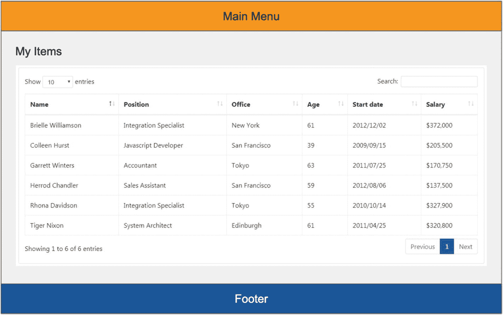
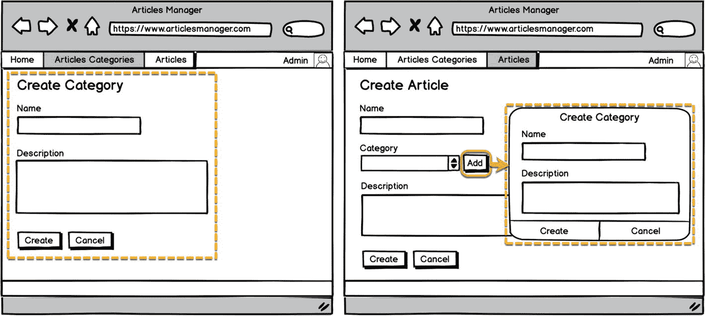
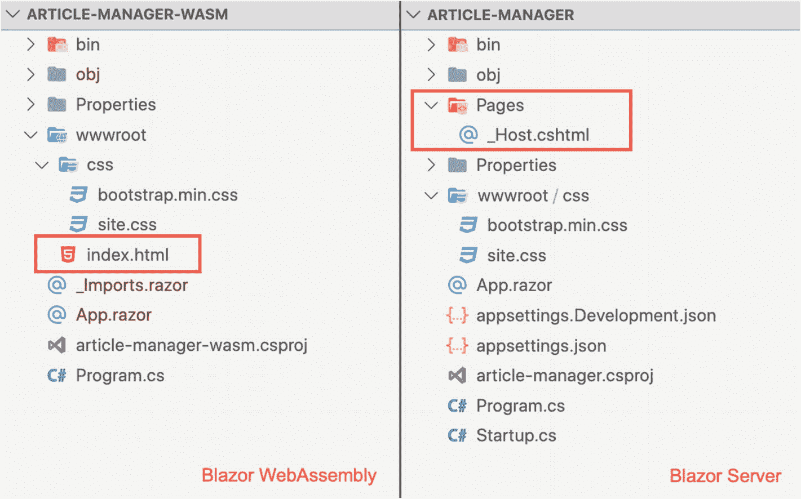
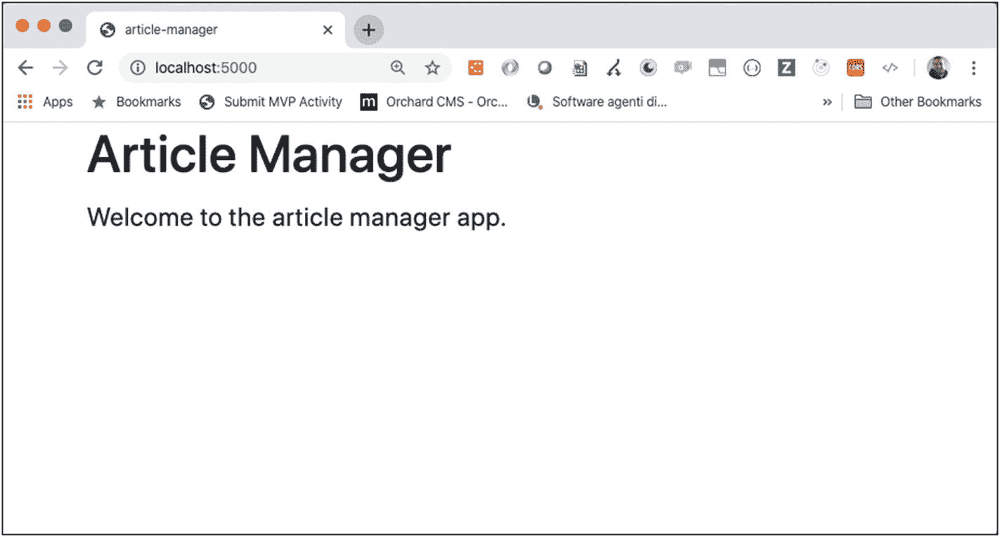
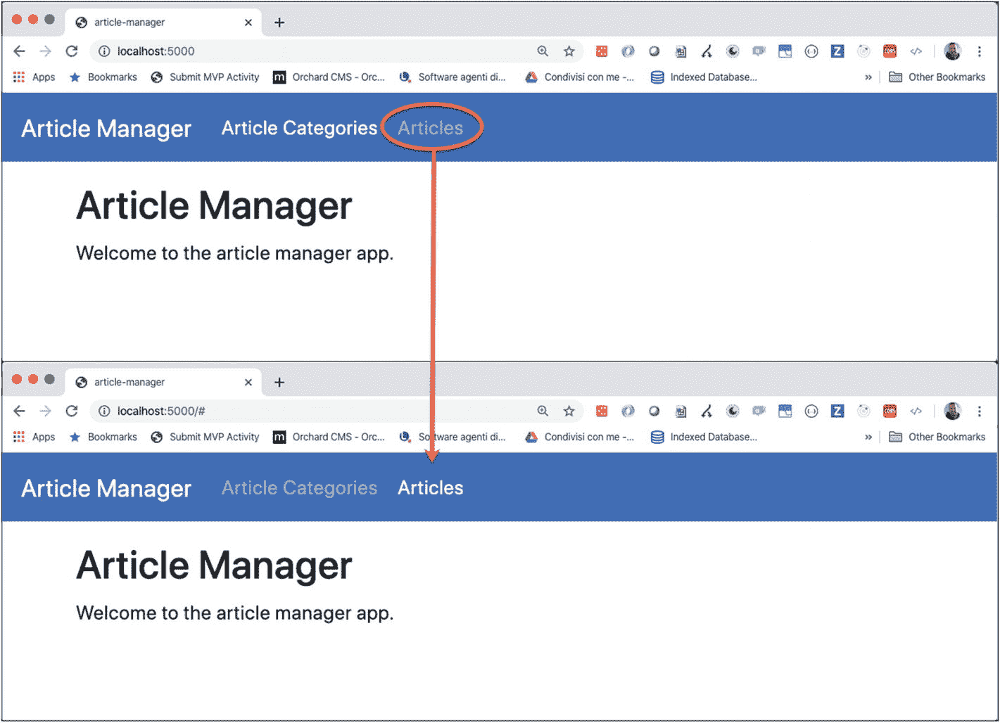
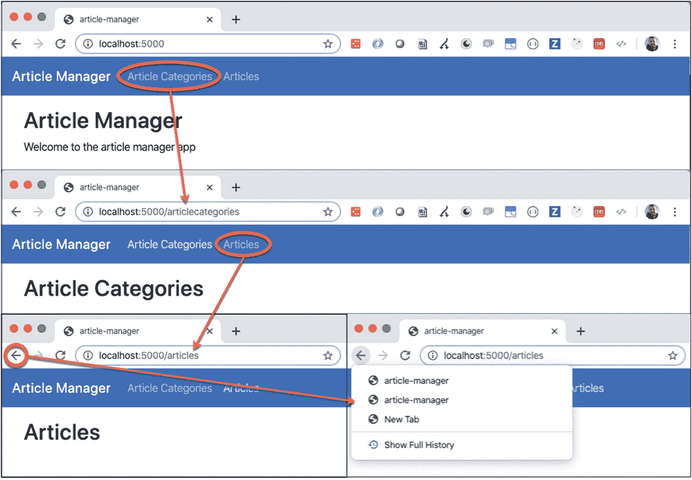
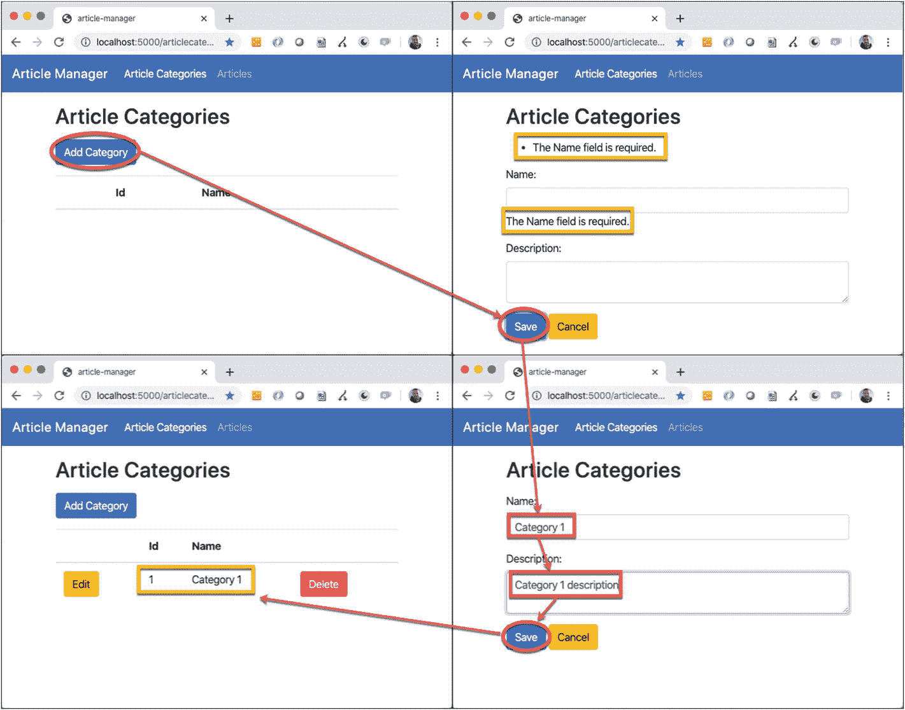
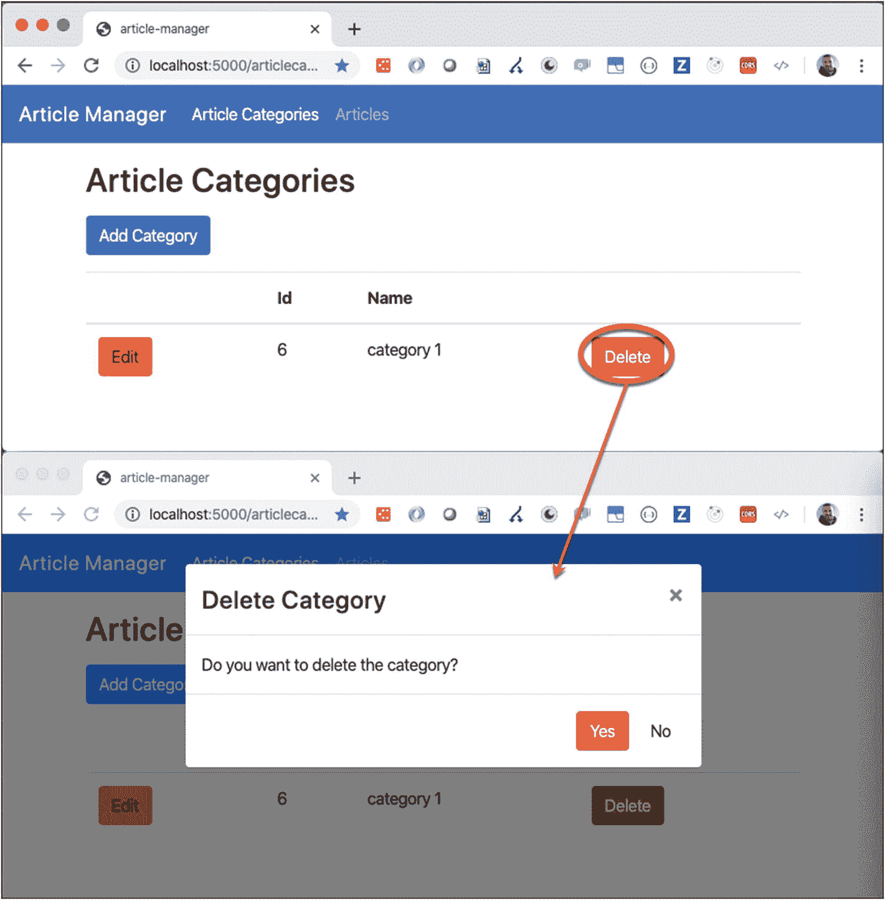

# 3.创建您的单页应用

如果您想开发一个具有良好性能和高效用户体验的应用，创建一个单页面应用是至关重要的。但是如果您没有正确地处理开发，它可能会很复杂并且很难维护。

正如我在本章中所描述的，Blazor 可以通过提供所有必要的工具来支持你创建一个成功的应用。尽管如此，在设计应用时，在正确的地方使用适当的模式和选择正确的工具是非常重要的。

从组件(所有现代 UI 框架的核心)开始，您必须学习如何分离功能并使它们可重用。在从用户那里收集数据的业务应用中，提供良好的数据输入体验(包括验证并帮助用户不出错)是非常重要的。

此外，要创建单页面应用，您需要一个单页面。页面之间的导航通过路由功能实现，该功能允许您基于用户交互或在操作结束时显示组件。您还需要使用 HTTP 协议与后端通信，并与前端交换信息。最后但同样重要的是，您必须管理应用中的安全性，对用户进行身份验证，并只允许他们执行某些操作。

最后，您不能忘记创建可维护、可测试和简单明了的代码。使用设计模式可以帮助你，但是它们只能解决一般性的问题，你仍然需要根据你的需要来调整它们。

## 一切都是组成部分

用户界面中的一切都是组件。在前面的章节中，您已经了解了 Blazor 中的组件，所以现在是时候了解它们的重要性了。

组件是用户界面的一部分。想象一个典型的业务应用，其中有一个主菜单、一个页脚和一个显示项目表的中心区域(图 [3-1](#Fig1) )。你看到里面有多少组件？



图 3-1

典型的业务应用结构

至少有三个主要组件:一个用于主菜单，一个用于页脚，一个用于表格。你同意吗？这个数字可能是正确的，但是 Blazor 中的组件有一个特定的定义。组件必须具有以下特征:

*   它们可以被包含，也可以包含其他组件。

*   它们既不能太大也不能太小。

*   它们可以重复使用。

*   它们是可定制的。

*   它们可以独立于其他组件。

*   他们必须有逻辑。

### 组件树

根据组件的结构和它们之间的关系，我们必须能够创建一个带有根的组件树，从这个树中我们可以将结构扩展成叶子。然后我们需要一个包含用户界面的根组件。Blazor 并没有把我们限制在一棵树上，因此也没有限制在一个根容器上，但是从导航的角度来管理我们的应用是一个好主意。

每个组件可以包含其他组件，在它们之间创建父子关系。因为我们必须创建一个树，所以一个组件不能包含已经是它自己的父组件的子组件。这将创建一个循环依赖，这将创建一个堆栈溢出，所以这是不允许的。

### 组件大小

组件的大小取决于其用途，但很容易弄错。让我们以应用的主菜单为例，它可以是一个组件。菜单项呢？我们可以为单个菜单项创建一个组件，并在主菜单组件中使用一组组件。如果你的菜单项有图标，它应该是一个组件吗？我们可以这样继续下去，直到你的界面中每个字符串的一个字符。

选择组件的大小需要经验和领域知识，但是您可以使用一些通用规则来开始。在软件工程中，有一个规则叫做*单一责任原则*。它与关注点的分离直接相关，并且说软件系统的每个元素应该只执行一个任务，这意味着它必须只有一个职责。当您考虑您的组件时，请考虑它们的职责，并为每个职责创建一个组件。很多时候，这将是正确的选择。

例如，以您领域中实体的列表/细节管理方面为例。为列表管理创建一个组件，为细节管理创建一个组件可能是一个好主意，但是在有些情况下，数据的简单性，比如一个只有一个标识符和描述的实体，使得使用两个组件成为过度设计的例子。语境永远是王道。

### 可重用性、定制和独立性

然而，在上下文之外，如果您需要在不同的用例中重用接口的一部分，您可以确保它是一个组件。回到前面的例子，如果在您的应用中有其他用例需要实体的细节表单，那么它肯定是一个从列表中分离出来的组件。

假设您有一个文章列表和一个文章类别列表，您需要创建一个新的文章，其中类别尚未出现在列表中。为了改善用户体验，您可以在文章表单的 category 字段旁边显示一个按钮，并使用它来动态创建一个新的类别，并为文章选择它。在这种情况下，您可以重用已经在管理类别中使用的类别的细节组件。也许在模态窗口中显示组件比在应用的中心区域更好。见图 [3-2](#Fig2) 。



图 3-2

在不同的用例中重用一个组件

为了允许这种情况，您需要使组件独立于其容器，并使其可定制。模态窗体通常都有自己的标题和按钮区域，所以有必要检查标题和按钮的可见性，以便在这两种情况下对其进行不同的管理。

独立于容器还意味着控制用户与组件交互的行为，这意味着，在前面的例子中，当用户单击按钮时，能够执行不同的操作。如果您在文章类别详细信息表单中，在保存或单击取消按钮后，您必须返回到类别列表；因此，在模态表单中，您需要关闭窗口并选择作为当前文章类别创建的项目。

### 组件逻辑

创建组件需要生成类实例，这会影响应用的性能。每个组件都有自己的状态，需要内存空间，Blazor 框架必须检查每个组件的变化，以更新用户界面的状态。所以，如果一个组件没有逻辑，那么它是一个组件就没有任何意义。

例如，我们示例中的页脚组件可能只包含一个带有版权信息或应用版本的字符串。您可以直接在容器组件中显示这些信息，而不是在它自己的组件中显示，从而简化结构并节省资源。

## 创建应用结构

按照前面章节中提供的说明，我们可以从头开始创建单页应用项目的基本结构。你可以在 Blazor Server 和 Blazor WebAssembly 中应用本章讨论的所有概念，但在本书中我们将使用 Blazor web assembly；我会指出与服务器版本的不同之处。

假设您想要创建一个文章管理器，一个管理博客文章的单页面应用，并且想要简化域，只管理文章及其类别。让我们首先用。NET CLI，调用它的文章管理器(`dotnet new web -o article-manager-wasm`)，并引用需要的包，如第 [2 章](2.html)所示。

为了简化布局，可以使用 4.3 版的 Bootstrap CSS 框架，通过 CDN 引用或者下载到你的项目中( [`https://getbootstrap.com/docs/4.3/getting-started/download/`](https://getbootstrap.com/docs/4.3/getting-started/download/) )。如果您喜欢让所有的项目依赖项离线，创建一个名为`css`的`wwwroot`文件夹的子文件夹，并在其中放置`bootstrap.min.css`文件和一个名为`site.css`的空文件，在那里您可以放置项目的定制 CSS 规则。

随着项目的增长，它需要导入各种名称空间，我们可以将 Razor 组件集中在一个名为`_Imports.razor`的文件中，该文件位于应用的根文件夹中。这允许我们不在每个 Razor 文件中重复它们(列表 [3-1](#PC1) )。

```cs
@using System.Net.Http
@using Microsoft.AspNetCore.Components.Forms
@using Microsoft.AspNetCore.Components.Routing
@using Microsoft.AspNetCore.Components.Web
@using Microsoft.JSInterop
@using article_manager_wasm

Listing 3-1The _Imports.razor File Content, with All the Namespaces for the Project

```

我们还需要一个容器组件，通常命名为`App.razor`，现在它将包含一条欢迎消息(清单 [3-2](#PC2) )。

```cs
<div class="container">
 <h2>Article Manager</h2>
 <p>Welcome to the article manager app.</p>
</div>

Listing 3-2The Container App.razor Component Code

```

放置在`wwwroot`文件夹中的单个页面`index.html`引用 CSS 文件和 app 组件，如清单 [3-3](#PC3) 所示。

```cs
<!DOCTYPE html>
<html>
 <head>
 <meta charset="utf-8" />
 <meta name="viewport" content="width=device-width" />
 <title>article-manager</title>
 <base href="/" />
 <link href="css/bootstrap.min.css" rel="stylesheet" />
 <link href="css/site.css" rel="stylesheet" />
 </head>
 <body>
 <app>Loading...</app>
 <script src="_framework/blazor.webassembly.js"></script>
 </body>
</html>

Listing 3-3The index.html File Content

```

你可以在图 [3-3](#Fig3) 中看到 Blazor 服务器和 Blazor WebAssembly 的项目结构。Blazor 服务器结构略有不同，如第 [2](2.html) 章所述。最重要的区别是 Blazor WebAssembly 上的`wwwroot`文件夹中的`index.html`与 Blazor 服务器上的`Pages`文件夹中相应的`_Host.cshtml`文件。另外，对于 Blazor WebAssembly 项目，我删除了`appsettings`文件，因为在这类项目中我们不需要任何服务器端配置。



图 3-3

Blazor WebAssembly 和 Blazor Server 的项目结构

在图 [3-4](#Fig4) 中，可以看到项目执行的结果(CLI 中的`dotnet run`或者 Visual Studio 中的 F5)，对于 Blazor Server 和 Blazor WebAssembly 都是一样的。用户结果是相同的，但是对于 WebAssembly 版本，所有代码都在浏览器中运行。相比之下，对于 Blazor 服务器版本，后端提供 HTML 并通过 SignalR 保持更新。

我们现在准备好通过创建正确的组件并托管它们来组合应用，从应用容器开始。为了简化第一次使用组件的尝试并理解页面导航中路由的作用，我们还不使用路由组件；我们将在从头开始学习如何构建用户界面后添加它们。



图 3-4

文章管理器应用执行结果

### 主菜单组件

应用的主菜单是成为组件的绝佳候选:它包含单一功能，其内容取决于上下文和当前用户，并且可以在各种场景和应用中重用。这也是一个介绍组件参数化的有用示例，因为您可以指定菜单项并捕捉对其中一个菜单项的单击。

让我们在项目根目录下创建一个`Shared`文件夹，我们可以将它用于应用所有部分共享的所有组件，然后创建一个名为`MainMenu.razor`的文件，包含清单 [3-4](#PC4) 中的标记和清单 [3-5](#PC5) 中的代码。

```cs
<nav class="navbar navbar-expand-sm bg-primary navbar-dark">
 <a class="navbar-brand" href="/">Article Manager</a>
 <ul class="navbar-nav">
 @foreach (var item in MenuItems)
 {
 <li class="nav-item @(item.Active ? "active" : null)">
 <a class="nav-link" href="#" @onclick="e => OnMenuItemClick.InvokeAsync(item)">@item.Caption</a>
 </li>
 }
 </ul>
</nav>

Listing 3-4The Markup of the Main Menu Component

```

在这个组件中，我使用了 bootstrap 的 navbar 小部件。菜单项位于名为`MenuItems`的公共属性中，并用属性`[Parameter]`修饰。该属性允许容器组件传递属性值，让 Blazor 跟踪任何更改。

```cs
@code {
 [Parameter]
 public EventCallback<MenuItem> OnMenuItemClick { get; set; }
 [Parameter]
 public MenuItem[] MenuItems { get; set; }
}

Listing 3-5The Code of the Main Menu component

```

属性`MenuItems`是一个自定义`MenuItem`类的数组，目前包含两个属性:`Caption`，一个带有菜单项标签的字符串，和`Active`，一个布尔值，如果菜单项是当前项，则为真，否则为假(清单 [3-6](#PC6) )。通常，我将这种类放在一个名为`Models`的文件夹中，它代表了用户界面的数据模型。

```cs
public class MenuItem
{
  public string Caption { get; set; }
  public bool Active { get; set; }
}

Listing 3-6The Code of the Main Menu Component

```

我们在一个`foreach`循环中使用了`MenuItems`数组，并使用循环中的当前元素来设置标题和`<li>`元素上的活动类。如果用户点击项目，我们捕获这个事件(锚元素上的`@onclick`，并引发一个名为`OnMenuItemClick`的自定义事件，将点击的项目作为参数传递。`OnMenuItemClick`是`MainMenu`组件的另一个参数，它属于`EventCallback<MenuItem>`类型，是框架提供的一个事件处理程序委托，用于简化自定义事件的定义。

我们准备在`App`组件中使用`MainMenu`组件，如清单 [3-7](#PC7) 和清单 [3-8](#PC8) 所示。所有用属性`[Parameter]`修饰的公共属性在`MainMenu`组件上都是可见的，我们可以在标记中直接使用它们(清单 [3-7](#PC7) )。`App`组件和`MainMenu`组件在不同的文件夹中，这意味着它们有不同的名称空间。为了允许`MainMenu`名称空间对`App`组件可见，您需要在`_Imports.razor`文件中添加名称空间。

```cs
<MainMenu MenuItems="MenuItems" OnMenuItemClick="MenuItemClick" />
<div class="container mt-3">
 <h2>Article Manager</h2>
 <p>Welcome to the article manager app.</p>
</div>

Listing 3-7The Markup of the Main Menu Component in the App Component

```

作为一个例子，我们使用了一个在名为`loadMenuItems()`的私有方法中静态初始化的`MenuItems`数组。在这里，有一个个人风格的选择:我更喜欢通过使用私有和公共方法来分隔组件中的每个操作，以提高代码的可读性，但是您可以自由地通过声明或类构造函数内联进行初始化。

关于构造函数，一个组件为你提供了许多钩子来在组件生命周期的不同时间执行操作。其中之一是`OnInitialized`方法，一旦组件创建完成，您就可以覆盖它来执行操作。您可以使用它来代替构造函数，以减少对组件创建时间的影响。基于初始化操作的复杂性，这可能是一个有用的优化，因为如果您将相同的操作放在构造函数中，组件仅在它们的末尾创建，用户界面可视化会有延迟。你可以在官方文档中了解更多关于组件生命周期钩子的内容: [`https://docs.microsoft.com/en-US/aspnet/core/blazor/lifecycle?view=aspnetcore-3.1`](https://docs.microsoft.com/en-US/aspnet/core/blazor/lifecycle?view%253Daspnetcore-3.1) 。

```cs
@code {
 public MenuItem[] MenuItems { get; set; }
 protected override void OnInitialized()
 {
   this.loadMenuItems();
 }
 public void MenuItemClick(MenuItem item)
 {
   foreach (var menuItem in MenuItems)
   {
     menuItem.Active = false;
   }
   item.Active = true;
 }
 private void loadMenuItems() {
   this.MenuItems = new MenuItem[] {
   new MenuItem()
   { Caption = "Article Categories", Active = true },
   new MenuItem()
   { Caption = "Articles", Active = false }
  };
 }
}

Listing 3-8The Code That Manages the Main Menu Component in the App Component

```

注意方法`MenuItemClick()`，当`OnMenuItemClick`自定义事件被引发时被调用:代码将`MenuItems`数组的`Active`属性设置为`false`，并将被点击项目的`Active`属性设置为`true`。Blazor 的变化检测注意到了这一变化，并更新了用户界面，在单击的项目上设置了活动类。令人着迷的方面是它执行更新的方式:Blazor 知道用户界面的状态，所以当代码想要改变它时，框架会计算实际状态和新状态之间的差异，并将差异仅应用于浏览器的 DOM。许多 JavaScript 框架也使用这种技术，它大大加快了用户界面的更新速度。

在图 [3-5](#Fig5) 中，你可以看到我们工作的结果。使用`OnMenuItemClick`事件，我们可以显示或隐藏其他组件，模拟页面导航。这样做，除了太费力之外，我们还会错过高级导航功能，我们可以通过使用框架提供的路由功能免费获得这些功能。



图 3-5

运行中的主菜单组件

### 使用 Blazor 进行页面导航

创建单页面应用时，页面间的导航至关重要。Blazor 为此提供了特定的组件，为我们管理路由的基本方面，例如更新浏览器历史，管理未找到的页面，以及更新 URL。

为了介绍 Blazor 路由，我需要强调作为页面一部分的组件和代表应用特定页面的组件之间的区别。通常，在 Blazor 应用中，有一个名为`Pages`的文件夹，其中包含作为应用页面的组件；同时，所有其他组件都在一个`Shared`文件夹中。

让我们创建一个`Pages`文件夹，并创建一个名为`Index.razor`的文件来表示您的主页。将一个`App.razor`移动到该页面，如清单 [3-9](#PC9) 所示。

```cs
@page "/"
<h2>Article Manager</h2>
<p>Welcome to the article manager app</p>

Listing 3-9The Home Page Component

```

从语法的角度来看，组件和页面的区别在于指令`@page`，它创建路径/组件对，称为*路由*。您可以将根目录视为导航到页面的 URL。

现在你可以在`Pages`文件夹中添加另外两个页面，`Article.razor`和`ArticleCategories.razor`，带有一个简单的标题和指令`@page`。您可以使用清单 [3-10](#PC10) 中的代码，其中前两行用于文件`Article.razor`，后两行用于文件`ArticleCategories.razor`。

```cs
@page "/articles"
<h2>Articles</h2>

@page "/articlecategories"
<h2>Article Categories</h2>

Listing 3-10The Article Category and Articles Pages

```

现在您有三个页面，是时候决定当用户选择相应的路线时，您希望在应用的哪个区域显示页面了。在`Shared`文件夹中，创建一个`MainLayout.razor`组件，并将清单 [3-11](#PC11) 的代码放入其中。`MainLayout`不是一个页面，而是一个简单的组件，它扩展了框架的一个基础组件，名为`LayoutComponentBase`，允许路由器组件将其用作布局模板。我们可以使用占位符`@Body`来决定框架放置当前页面的位置，就像在经典 ASP.NET MVC 应用的`_Layout.cshtml`文件中使用它一样。

```cs
@inherits LayoutComponentBase
<MainMenu MenuItems="MenuItems" />
<div class="container mt-3">
  @Body
</div>

Listing 3-11The Main Layout Component Markup

```

我们需要更改`MenuItem`类来添加`Href`属性，并指示我们可以为每个菜单项使用哪个路径(清单 [3-12](#PC12) )。

```cs
@code {
 public MenuItem[] MenuItems { get; set; }
 protected override void OnInitialized()
 {
   this.loadMenuItems();
 }
 private void loadMenuItems() {
   this.MenuItems = new MenuItem[] {
   new MenuItem()
{ Caption = "Article Categories", Href = "articlecategories" },
   new MenuItem()
{ Caption = "Articles", Href = "articles" }
 };
 }
}

Listing 3-12The Main Layout Component Code

```

如您所见，您不再需要定制的 click 事件，因为导航和活动类管理是框架的职责。`MainMenu`现在只有参数`MenuItems`，这是你唯一需要的。

你可以在`MainMenu`中使用框架的`NavLink`组件来代替锚点。主要区别是使用`Match`属性的能力。如果您需要指定当路由与当前 URL 完全匹配时，菜单项是否是当前菜单项(应用了`active`类)，您必须使用值`NavLinkMatch.All`。如果您需要它匹配当前 URL 的任何前缀，请使用值`NavLinkMatch.Prefix`，这是默认值。当使用`NavLink`时，您不需要属性`Active`，因为组件会自动在生成的锚点上设置类(清单 [3-13](#PC131) )。您的`App.razor`组件现在必须包含`Router`组件，如清单 [3-14](#PC13) 所示，因此当应用启动时，路由器可以控制应用导航。

```cs
<Router AppAssembly="@typeof(Program).Assembly">
 <Found Context="routeData">
 <RouteView RouteData="@routeData" DefaultLayout="@typeof(MainLayout)" />
 </Found>
 <NotFound>
 <LayoutView Layout="@typeof(MainLayout)">
 <p>Sorry, there's nothing at this address.</p>
 </LayoutView>
 </NotFound>
</Router>

Listing 3-14The New App Component with the Router Component Markup

```

```cs
Article Manager
 @foreach (var item in MenuItems)
 {
 @item.Caption
 }

Listing 3-13The MainMenu with the NavLink component

```

路由器检查当前组件(`AppAssembly`参数)以检索应用中使用`@page`指令定义的所有路由。

如果路由器找到请求的路由(`Found`元素)，则显示传递路由数据和默认布局的页面(之前定义的`MainLayout`)；否则，它显示带有消息的布局(`NotFound`元素)。如果你有使用 JavaScript 框架的经验，你会非常欣赏这种方法；路由配置通常更复杂。在图 [3-6](#Fig6) 中，你可以看到重构的结果，包括更新 URL，更新浏览器历史，激活正确的菜单项在页面间导航。



图 3-6

Blazor 路由在运行

## 管理 CRUD 操作

基础结构已经准备好了，现在是实现应用功能的时候了，比如对文章类别的创建、读取、更新、删除(CRUD)操作。我们可以概括这些活动，但是现在，我们将关注点的分离，特别是 Blazor 组件的职责。

我们需要显示类别列表，并允许用户添加、修改或删除单个项目。根据需求，我们可以让一个组件用于列表，一个组件用于细节，或者我们可以让一个元素用于两个操作。我们已经有了一个页面组件，所以我们可以用它来实现所有的活动。尽管如此，我还是希望页面和 UI 组件之间有一个实质性的区别，通过遵循这个简单的规则来实现:UI 组件接受输入参数来获取数据以管理和引发事件，用输出参数来通知操作。相反，页面使用 UI 组件来实现页面功能和管理操作流。

对于文章类别中的 CRUD 操作，我们可以有一个类别列表组件，它接受要显示的项目，并在用户单击创建、更新或删除按钮时引发事件。我们可以将这个组件放在文章类别页面中，在这里我们可以订阅事件参数来决定何时显示细节组件。详细信息组件是一个表单，它允许用户更改类别数据，接受输入参数，并在用户单击保存或取消按钮时引发事件。重要的是，UI 组件不执行任何操作，而是通知页面组件用户意图。

让我们更改之前创建的`ArticleCategories.razor`来匹配清单 [3-15](#PC14) 。您可以看到两个 UI 组件，放在一个名为`Components`的文件夹中，用它们的参数管理文章类别的列表和细节。如果属性`currentCategory`为空，我们显示列表组件；否则，我们显示代表类别细节的`ArticleCategory`组件。

```cs
@page "/articlecategories"
<h2>Article Categories</h2>
<div class="mt-3">
@if(currentCategory == null)
{
 <ArticleCategoriesList
 ArticleCategoryListItems="articleCategoryListItems"
 OnAddClick="AddCategory"
 OnEditClick="EditCategory"
 OnDeleteClick="DeleteCategory">
 </ArticleCategoriesList>
}
else
{
 <ArticleCategory
 Category="currentCategory"
 OnSaveClick="SaveCategory"
 OnCancelClick="ShowList">
 </ArticleCategory>
}
</div>

Listing 3-15The Article Categories Page Component

```

`ArticleCategoriesList`组件是一个简单的表格，在参数`ArticleCategoryListItems`上有一个`foreach`循环，类似于`MainMenu`，有三个按钮连接到`OnAddClick`、`OnEditClick`和`OnDeleteClick`事件(清单 [3-16](#PC15) )。基于这些事件，代码为`currentCategory`属性设置一个值来管理`ArticleCategory`组件的可见性。

```cs
<button class="btn btn-primary" @onclick="OnAddClick">Add Category</button>
<table class="table mt-3">
  <thead>
    <tr>
      <th></th><th>Id</th><th>Name</th><th></th>
    </tr>
  </thead>
  <tbody>
  @foreach(var item in ArticleCategoryListItems)
  {
    <tr>
      <td>
        <button class="btn btn-warning" @onclick="e => OnEditClick.InvokeAsync(item)"> Edit</button>
      </td>
      <td>@item.Id</td>
      <td>@item.Name</td>
      <td>
        <button class="btn btn-danger" @onclick="e => OnDeleteClick.InvokeAsync(item)"> Delete</button>
      </td>
    </tr>
  }
  </tbody>
</table>

Listing 3-16The Article Categories List Component

```

### 创建 CRUD 服务

在描述如何实现这些操作之前，我们需要再次讨论一下单一责任原则。在这种情况下，我们不想在页面组件中物理地实现数据 CRUD 操作。要理解原因，您可以将数据操作移到其他地方，记住组件是用户界面的一部分，页面也是组件。

物理 CRUD 操作属于业务层，我们在表示层。在我们的例子中，这种区别是至关重要的，因为如果我们使用 Blazor WebAssembly，我们需要调用 API 来要求操作，但是如果我们使用 Blazor Server，我们可以直接访问数据库上下文来执行 CRUD 操作。组件必须对此一无所知，所以我们需要将操作调用封装在一个单独的服务类中。我们可以用一个通用接口来抽象操作，如清单 [3-17](#PC16) 所示，使用`T`作为列表项类型，使用`K`作为细节项类型。我们应该将操作设计成异步的，使用。NET 任务库(包括`System.Threading.Tasks`命名空间)来确保操作不会锁定当前线程。

```cs
using System.Threading.Tasks;
public interface ICRUDService<T, K>
{
  Task<T[]> GetList();
  Task<K> Get(int id);
  Task Create(K item);
  Task Update(K item);
  Task Delete(int id);
}

Listing 3-17The CRUD Definition Interface

```

这个接口可以有更多的实现。例如，您可以有一个基于 HTTP 客户端的实现来调用相应的 REST APIs，或者有一个实现为应用的 Blazor 服务器版本使用实体框架数据库上下文。出于测试目的，通过为您的情况注册正确的实现并使用本机，您还可以有一个使用内存中集合的实现。NET 核心依赖注入支持。网芯`Startup`类(列表 [3-18](#PC17) )。

```cs
public void ConfigureServices(IServiceCollection services)
{
  services.AddTransient <ICRUDService<ArticleCategoryListItem, ArticleCategoryItem>, ArticleCategoriesService>();
}

Listing 3-18The CRUD Service Configuration for Article Categories

```

由于引入了新的`@inject`指令，您可以直接在 Blazor 组件中使用服务的注册实现。NET 核心。在文章类别页面中，您可以添加清单 [3-19](#PC18) 中所示的`@inject`指令，在这里您可以为您的案例指定带有正确参数的接口。

```cs
@page "/articlecategories"
@inject ICRUDService<ArticleCategoryListItem, ArticleCategoryItem> service

Listing 3-19The CRUD Service Injection in the Page Component

```

`ArticleCategoryListItem`和`ArticleCategoryItem`位于`Model`文件夹中，定义列表(`Id`和`Name`)和明细表(`Id`、`Name`和`Description`)中使用的数据。`ArticleCategoryItem`类展示了一种实现数据验证的强大方法，已经被。NET 程序员:。NET 数据注释(清单 [3-20](#PC19) )。

```cs
using System.ComponentModel.DataAnnotations;
public class ArticleCategoryItem
{
  public int Id { get; set; }
  [Required]
  [StringLength(50, ErrorMessage = "Name is too long.")]
  public string Name { get; set; }
  public string Description { get; set; }
}

Listing 3-20The Validation Rules Definition with .NET Data Annotations

```

是的，你可以用。NET 数据注释和 Blazor 框架来实现表单验证。让我们通过在`Components`文件夹中创建组件`ArticleCategory.razor`来管理表单细节，看看它们是如何工作的。在清单 [3-21](#PC20) 中，您可以看到这个新组件的标记，它使用特定的 Blazor 组件来简化表单的管理。

```cs
<EditForm Model="@Category" OnValidSubmit="@(e => OnSaveClick.InvokeAsync(Category))">
 <DataAnnotationsValidator />
 <ValidationSummary />
 <div class="form-group">
 <label for="name">Name: </label>
 <InputText id="name" @bind-Value="Category.Name" class="form-control" />
 <ValidationMessage For="@(() => Category.Name)" />
 </div>
 <div class="form-group">
 <label for="description">Description: </label>
 <InputTextArea id="description" @bind-Value="Category.Description" class="form-control" />
 </div>
 <button type="submit" class="btn btn-primary">Save</button>
 <button type="button" class="btn btn-warning" @onclick="OnCancelClick">Cancel</button>
</EditForm>

Listing 3-21The Validation Rules Definition with .NET Data Annotations

```

在 Blazor 中，您可以在`EditForm`组件元素中定义一个表单，您可以为其设置一个模型，并订阅用户提交表单时引发的事件。如果您订阅了`OnValidSubmit`事件，那么您的代码只在表单有效时运行，并且验证遵循。指定模型的. NET 数据批注。为了启用基于数据注释的模型验证，您需要在表单中包含组件`DataAnnotationsValidator`。框架为您提供了`ValidationSummary`组件来显示失败验证的摘要，以及`ValidationMessage`组件来显示特定字段的验证错误。该框架提供了特定的组件来帮助您显示正确的输入元素，并使用`@bind-Value`将它与相应的`Model`属性绑定。

让我们看看如何管理文章类别页面中组件的事件。在清单 [3-22](#PC21) 中，您可以看到管理`currentCategory`属性的代码摘录。

```cs
protected override async Task OnInitializedAsync()
{
  await ShowList();
}
public async Task ShowList()
{
  this.articleCategoryListItems = await service.GetList();
  this.currentCategory = null;
}
public void AddCategory()
{
  this.currentCategory = new ArticleCategoryItem();
}
public async Task EditCategory(ArticleCategoryListItem item)
{
  this.currentCategory = await service.Get(item.Id);
}

Listing 3-22The Code of the Article Categories Page

```

`ShowList()`方法调用服务来获取类别列表，并将`currentCategory`设置为`null`来显示列表。服务方法是异步的，所以我们需要使用`async/await`关键字和异步版本的`OnInitialized`组件钩子。

当用户单击 Add Category 按钮或 Edit 按钮时，我们将`currentCategory`属性设置为一个新对象或请求编辑的项目。在本书提供的解决方案中，您会发现管理保存和删除事件的其余代码使用了一个`try { ... } catch { ... }`块来向用户显示可能的错误。在图 [3-7](#Fig7) 中，你可以看到运行中的用户界面。



图 3-7

文章类别 CRUD 在起作用

如果您已经了解了 Microsoft web frameworks，那么所有这些信息对您来说都很熟悉。这就是布拉索的真正力量。NET 开发人员。

## 实现 CRUD 服务

出于测试目的，我创建了 CRUD 服务的内存实现。在实际的应用中，您需要将信息存储在持久存储中，比如数据库。如果您使用 Blazor Server，这是一项毫不费力的任务，因为您可以在 CRUD 服务实现中注入实体框架数据上下文(或您首选的数据访问层解决方案),并使用它来执行所有操作。

如果您使用 Blazor WebAssembly，您需要调用 REST APIs 来允许客户端请求数据存储。在这种情况下，我们必须创建一个使用`HttpClient`(清单 [3-23](#PC22) )的 CRUD 服务实现。

```cs
using System.Net.Http.Json;
using System.Net.Http;
public class ArticleCategoriesService:
  ICRUDService<ArticleCategoryListItem,
    ArticleCategoryItem>
{
  private readonly HttpClient httpClient;
  private string baseUrl = "http://localhost:5002";

  public ArticleCategoriesService(HttpClient httpClient)
  {
    this.httpClient = httpClient;
  }

  public Task<ArticleCategoryListItem[]> GetList()
  {
    return this.httpClient
    .GetFromJsonAsync<ArticleCategoryListItem[]>
        ($"{baseUrl}/api/articlecategories");
  }
  ...
}

Listing 3-23The Code of the CRUD Service That Uses the HttpClient

```

要使用`HttpClient`，我们必须将`System.Net.Http.Json` NuGet 包添加到我们的解决方案中，并将`System.Net.Http`名称空间添加到我们的 CRUD 服务实现中。Blazor 框架提供了一些有助于发送和接收的`HttpClient`扩展(`System.Net.Http.Json`名称空间中的`HttpClientJsonExtensions`类)。NET 类，将它们转换成 JSON 格式。在清单 [3-23](#PC22) 中，我们可以看到`GetFromJsonAsync`，它从 API 接收文章类别的 JSON 数组，并将其转换为`ArticleCategoryListItem`的. NET 数组。

我们还需要手动将`HttpClient`添加到服务中，因为框架不再为您添加它。然后，在`Program`类的`Main`方法中，使用`AddTransient()`方法(清单 [3-24](#PC23) )正确配置 HTTP 客户端。

```cs
public static async Task Main(string[] args)
{
   var builder = WebAssemblyHostBuilder.CreateDefault(args);
   builder.RootComponents.Add<App>("app");
   builder.Services.AddTransient <ICRUDService<ArticleCategoryListItem, ArticleCategoryItem>, ArticleCategoriesService>();
   builder.Services.AddTransient <ICRUDService<ArticleListItem, ArticleItem>, ArticlesService>();
builder.Services.AddTransient<HttpClient>();
    await builder.Build().RunAsync();
}

Listing 3-24The Configuration of the HttpClient as a Dependency Service

```

如果我们将`Model`类移动到一个单独的 DLL 中，并与后端和前端共享这个库，后端的 ASP.NET 核心 API 和前端的 HTTP 客户端将为我们执行所有工作，使用 JSON 作为交换格式。

我想你已经知道如何用实体框架保存一个实体，以及如何用。NET 核心。在清单 [3-25](#PC24) 中，你可以看到 API 的相应代码，但是你可以在随书提供的代码中找到这些例子中使用的完整代码库。

```cs
[ApiController]
[Route("api/[controller]")]
public class ArticleCategoriesController :
  ControllerBase
{
   private readonly ApplicationDbContext db;

   public ArticleCategoriesController(
     ApplicationDbContext db)
   { this.db = db; }

   [HttpGet]
   public IActionResult Get()
   {
     return Ok(this.db.ArticleCategories
       .Select(x => new ArticleCategoryListItem()
       {
         Id = x.Id, Name = x.Name
       }).ToList());
   }
   ...
}

Listing 3-25The Code of the ASP.NET Core API Used in Listing 3-23

```

令人印象深刻的是，组件与这些实现无关。我们只需要在。网络核心依赖注入引擎。

## 在哪里放置组件代码

到目前为止，我们已经看到了 Razor 文件中的组件代码，使用了`@code`部分。对于小组件，比如我们这里的组件，这可能是一个有用的解决方案，但是如果您有足够的代码要处理，并且希望将系统与标记分开，您可以将组件代码放在不同的 C#类中。

例如，如果您想将`ArticleCategories`页面组件的代码与其标记分开，有两种方法可以实现。第一种方法是创建一个名称不同于页面名称的基类文件，但是我建议您使用保留它们之间链接的约定。我们可以使用例如`ArticleCategoriesBase.cs`，它包含一个名为`ArticleCategoriesBase`的类，该类扩展了框架类`ComponentBase`(列表 [3-26](#PC25) )。

```cs
using Microsoft.AspNetCore.Components
public class ArticleCategoriesBase : ComponentBase
{
 ...
}

Listing 3-26The Class Containing the Article Categories Code

```

由于`@inherits`指令(清单 [3-27](#PC26) )，这个类现在是我们的 Razor 组件的基类。

```cs
@inherits ArticleCategoriesBase
@page "/articlecategories"

Listing 3-27The Component Markup Change to Inherit the Code Class

```

现在我们可以移动`ArticleCategoriesBase`类中`@code`部分的内容，只有两处改动:私有属性必须受到保护，CRUD 服务的注入发生在特定属性的`Inject`属性上(清单 [3-28](#PC27) )。

```cs
public class ArticleCategoriesBase : ComponentBase
{
  protected ArticleCategoryListItem[] articleCategoryListItems;
  protected ArticleCategoryItem currentCategory;

  [Inject]
  private ICRUDService<ArticleCategoryListItem, ArticleCategoryItem> service { get; set; }
  ...
}

Listing 3-28The Changes You Must Apply to the Code When Moving It into a Separate Class

```

Note

您不能使用构造函数在`ComponentBase`中注入依赖项，因为框架会为您构造组件。目前框架需要一个不带参数的构造函数，所以提供了`Inject`属性来解决问题。

分离组件的代码和标记的另一种方法是创建一个分部类。如果您浏览构建过程中生成的`obj`文件夹，您会发现应用的每个组件都有一个类。这个由编译器生成的类是一个分部类，因此可以在它旁边放置另一个分部类。您可以用`Articles`页面尝试这个选项，记住。NET 框架必须有相同的名称(清单 [3-29](#PC28) )并且你不需要修改所使用的属性的可见性(在构建时，同名的分部类变成了同一个类)。当您使用分部类将代码与标记分离时，通常使用与页面相同的名称来命名文件，并在末尾添加`.cs`扩展名。在这种情况下，该文件被命名为`Article.razor.cs`。Visual Studio 使用此约定将此文件显示为页面的子级，将这两个文件组合为同一个元素。相反，Visual Studio 代码就不那么聪明了。

```cs
public partial class Articles
{
  private ArticleListItem[] articleListItems = new ArticleListItem[0];
  private ArticleItem currentArticle;
  private string error;
  [Inject]
  private ICRUDService<ArticleListItem, ArticleItem> service { get; set; }
}

Listing 3-29The Class That Contains the Articles Code

```

在这种情况下，您必须只添加注入 CRUD 服务的代码，并从标记文件中删除`@inject`指令。

## JavaScript 互操作性

直到有一个完整的生态系统支持一个应用所有可能的功能，迟早你会需要调用一个 JavaScript 函数。您可能还需要从 JavaScript 调用一个. NET 函数。Blazor 支持这些场景，并且解决了应用遗留代码集成的所有主要问题。

要从 Blazor 调用 JavaScript 函数，我们必须在 browser `window`对象上定义它。将 jQuery 和 Bootstrap JavaScript 库添加到项目中，可以在`wwwroot`中创建一个`js`文件夹，并在文件中添加引用。这些库允许我们使用引导窗口小部件，比如模态组件(参见 [`https://getbootstrap.com/docs/4.0/components/modal/`](https://getbootstrap.com/docs/4.0/components/modal/) 的官方文档)。

让我们给浏览器`window`对象添加两个 JavaScript 函数，打开和隐藏一个引导模式，如清单 [3-30](#PC29) 所示。为了简化示例，我将它们放在了`index.html`文件中，但是在实际项目中，您可以将 JavaScript 函数放在一个单独的文件中并链接到它。

```cs
<script src="js/jquery.min.js"></script>
<script src="js/bootstrap.min.js"></script>
<script>
  window.showConfirmDelete = (id) => {
    $('#' + id).modal('show');
  };
  window.hideConfirmDelete = (id) => {
    $('#' + id).modal('hide');
  };
 </script>

Listing 3-30JavaScript Functions to Show and Hide a Bootstrap Modal

```

将一个模态的标记添加到`ArticleCategoriesList`组件中，并将模态设置为要求用户确认删除(清单 [3-31](#PC30) )。

```cs
<div class="modal" id="deletecategorymodal">
 <div class="modal-dialog">
  <div class="modal-content">
   <div class="modal-header">
    <h4 class="modal-title">Delete Category</h4>
    <button type="button" class="close" data-dismiss="modal">&times;</button>
   </div>
   <div class="modal-body">
    Do you want to delete the category?
   </div>
   <div class="modal-footer">
    <button type="button" class="btn btn-danger" @onclick="OnYesClick">Yes</button>
    <button type="button" class="btn btn-default" data-dismiss="modal" >No</button>
  </div>
  </div>
 </div>
</div>

Listing 3-31Bootstrap Modal to Require Category Deletion

```

要调用之前定义的 JavaScript 函数，需要在组件中注入框架的`IJSRuntime`接口。您可以通过在组件定义的顶部添加指令`@inject IJSRuntime JSRuntime`来做到这一点。见清单 [3-32](#PC31) 。

```cs
private ArticleCategoryListItem itemToDelete;
private async Task ShowConfirm(ArticleCategoryListItem item)
{
    this.itemToDelete = item;
    await JSRuntime.InvokeVoidAsync ("showConfirmDelete", "deletecategorymodal");
  }
  private async Task OnYesClick()
  {
      await OnDeleteClick.InvokeAsync (this.itemToDelete);
      await JSRuntime.InvokeVoidAsync ("hideConfirmDelete", "deletecategorymodal");
  }

Listing 3-32The Component Code That Calls the JavaScript Functions

```

`JSRuntime`提供了方法`InvokeVoidAsync`,我们可以用它来调用 JavaScript 函数并给它传递正确的参数。

如果用户单击 Yes 按钮，我们将调用事件来要求删除类别，并调用 hideConfirmDelete JavaScript 函数。在图 [3-8](#Fig8) 中，您可以看到运行中的确认模式。



图 3-8

确认删除模式有效的模式

## 摘要

在本章中，您学习了如何使用 Blazor 构建一个单页应用来对业务实体执行 CRUD 操作。您看到了如何使用？NET 核心依赖注入，以快速适应一切都与 Blazor WebAssembly 和 Blazor 服务器一起使用。您还了解了如何将 JavaScript 集成到 Blazor 中，如何管理遗留场景，以及如何利用 Blazor 中尚未提供的特性。

本章中的大部分代码都是故意重复的，出于教育原因，有些实现有点粗糙。不过，在下一章中，您将看到如何优化代码，使组件更加通用，这样通过将它们打包到组件库中，它们也可以在不同的应用中重用。