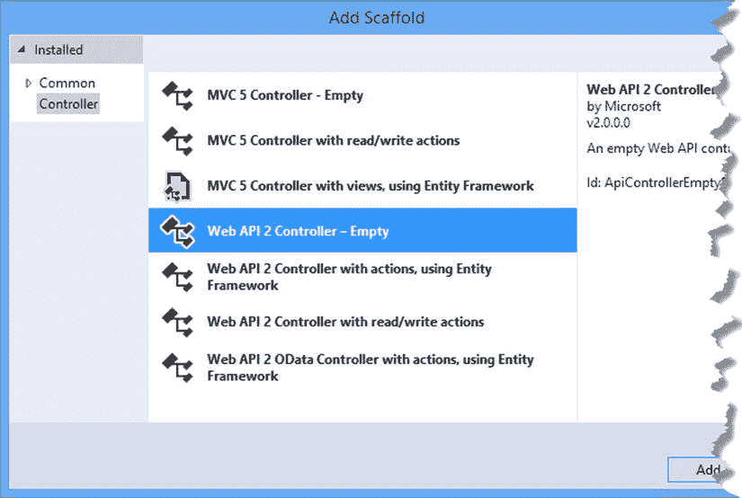

# 二、您的第一个 Web API 应用

感受一项新技术的最好方法是应用它，所以在这一章中，我将直接演示 Web API 最常见的用法之一:向现有的 MVC 框架应用添加 HTTP web 服务。

这远没有听起来那么尴尬，尤其是因为 MVC 框架和 Web API 共享一个共同的遗产，可以使用相同的数据模型。事实上，与构建示例 MVC 框架应用和编写在浏览器中使用 web 服务的 JavaScript 代码相比，我在本章中花在创建 web 服务上的时间是如此之少，您可能会对此感到惊讶。

当然，你不需要将 HTTP web 服务改造成现有的应用，在第 5-8 章中，我构建了一个更复杂的例子，从 Web API 开始，将 HTTP web 服务置于开发过程的核心。

Note

我在这一章慢慢开始，并详细说明每一个细节。在后面的章节中，我将加快进度——以及细节的深度——但是我想弄清楚我创建项目的过程，并强调应用中组件之间的关系。

## 准备示例项目

Visual Studio 包含不同类型项目的模板。基本的起点是一个空项目，它可以被设置为只包含 MVC 或 Web API 应用所需的文件和引用。其他选项添加模型、视图和控制器，通过提供常用功能来帮助启动项目。

我更喜欢使用空模板，只让 Visual Studio 添加最少的初始内容，我建议您也这样做。这种方法让您更深入地了解应用是如何组装的，以及当出现问题时需要从哪里着手。在本书中，我将按照我在这里描述的方式创建项目，所以我将在本章中一步一步地介绍这个过程，这样你就知道会发生什么。

Note

我在本章和第 5-8 章中创建的示例项目是从我在 Pro ASP.NET MVC 5 中使用的项目中派生出来的。您不需要有我的任何其他书籍来理解这些示例，但是如果您已经有一本，那么您可能会发现比较创建纯 MVC 框架应用和集成 Web API 的应用所需的不同方法是很有趣的。

### 创建 Visual Studio 项目

首先，我创建了一个新的 Visual Studio 项目。从“文件”菜单中选择“新建项目”,打开“新建项目”对话框窗口。浏览模板部分，选择 visual c # ASP.NET➤web➤web 应用模板，并将项目名称设置为 PartyInvites，如图 [2-1](#Fig1) 所示。

图 2-1。

Creating the new project

单击“确定”按钮，转到“新建 ASP.NET 项目”对话框窗口。确保选择了空选项，并检查 MVC 和 Web API 选项，如图 [2-2](#Fig2) 所示。单击 OK 按钮，Visual Studio 将创建一个名为 PartyInvites 的新项目。

图 2-2。

Selecting the ASP.NET project type

### 添加和更新 NuGet 包

近年来，Visual Studio 最有用的增强之一是添加了 NuGet，这使得在项目中下载、安装和更新软件包变得很容易。

我将在本书中使用特定版本的 NuGet 包，以确保您能够重新创建示例并获得相同的结果。微软大量发布整个。NET stack 每 18 个月就更新一次，每项技术都会得到更频繁的小更新。这意味着由 Visual Studio 添加到项目中的 MVC 和 Web API 版本可能不是最新的可用版本。

从 Visual Studio 工具➤ NuGet 包管理器菜单中选择包管理器控制台，并输入以下命令来更新 MVC 和 Web API 包，以及用于处理 JSON 数据的包(我在第 3 章中对 JSON 进行了更详细的描述):

`Update-Package microsoft.aspnet.mvc -version 5.1.1`

`Update-Package microsoft.aspnet.webapi -version 5.1.1`

`Update-Package Newtonsoft.json -version 6.0.1`

对于本章和后面章节中的示例应用，我还依赖另外两个包。第一个是 Bootstrap，这是一个 CSS 包，可以很容易地对 MVC 视图生成的 HTML 进行样式化。我一点视觉设计技能都没有——以至于我在学校被免除了艺术课，并被允许做额外的数学——但即使是我也可以用 Bootstrap 拼凑出一些看起来很吸引人的东西。我更喜欢在复杂的项目中与真正的设计师一起工作，但是对于简单的应用，Bootstrap 工作得很好。

Tip

我在这本书里没有描述 Bootstrap，但是你可以在 [`http://getbootstrap.com`](http://getbootstrap.com/) 得到我申请的 CSS 类的细节。

我使用的第二个包是 jQuery，它提供了一个抽象层，简化了使用 HTML 文档对象模型 API 的工作，并使 Ajax 请求更简单、更优雅。jQuery 是用于开发 web 应用客户端部分的事实上的 JavaScript 库，就像 Bootstrap 一样，最近已经被微软在 Visual Studio 项目模板中采用。我在第 3 章的[中提供了使用 jQuery 进行 Ajax 请求的入门知识。](03.html)

我使用的最后一个包是 Knockout，它使构建一个 HTML 客户机变得很容易，这个客户机可以动态地响应 web 服务或用户交互返回的数据。我在[第 3 章](03.html)简单介绍一下使用 Knockout。

要将 Bootstrap、jQuery 和 Knockout 添加到项目中，请在软件包管理器控制台中输入以下命令:

`Install-Package jquery -version 2.1.0`

`Install-Package bootstrap -version 3.1.1`

`Install-Package knockoutjs –version 3.1.0`

### 设置端口和开始 URL

我需要做的最后准备工作是指定将用于接收请求的 TCP 端口，以及项目启动时将传递给浏览器的初始 URL。从 Visual Studio 项目菜单中选择“参与方邀请属性”,然后单击“Web”打开 ASP.NET 项目的设置。

启用特定页面选项，并在字段中输入`Home/Index`。在同一个页面上，将 Project Url 字段中的值更改为`http://localhost:37993/`,并单击 Create Virtual Directory 按钮。

第一项更改防止 Visual Studio 根据您最近编辑的文件来确定应用启动时应该显示什么 URL，第二项更改意味着将在 TCP 端口 37993 上接收请求。

## 创建 MVC 应用

在这一节中，我创建了一个简单的 MVC 框架应用，它收集来自被邀请方的响应。这是我开始研究 ASP.NET MVC 5 的项目的一个变种，我选择它是为了强调 Web API 应用于 MVC 框架应用的容易程度。我在这本书的其余部分花了很多时间来解释这两者的区别，所以从关注你已经知道如何做的事情开始是有好处的。

### 创建模型

现在我已经创建了项目，我可以添加模型了。Web API 应用的结构与 MVC 框架有很多相似之处，这也是这两种技术能够共存得如此之好的原因之一。我在`Models`文件夹中创建了一个名为`GuestResponse.cs`的文件，并用它来定义清单 2-1 中所示的类。

清单 2-1。GuestResponse.cs 文件的内容

`using System.ComponentModel.DataAnnotations;`

`namespace PartyInvites.Models {`

`public class GuestResponse {`

`[Required]`

`public string Name { get; set; }`

`[Required]`

`public string Email { get; set; }`

`[Required]`

`public bool? WillAttend { get; set; }`

`}`

`}`

为了创建一个简单的模型库，我在`Models`文件夹中创建了一个名为`Repository.cs`的类文件，并用它来定义清单 2-2 中所示的类。

清单 2-2。Repository.cs 文件的内容

`using System.Collections.Generic;`

`namespace PartyInvites.Models {`

`public class Repository {`

`private static Dictionary<string, GuestResponse> responses;`

`static Repository() {`

`responses = new Dictionary<string, GuestResponse>();`

`responses.Add("Bob", new GuestResponse {Name = "Bob",`

`Email="bob@example.com", WillAttend=true});`

`responses.Add("Alice", new GuestResponse { Name = "Alice",`

`Email = "alice@example.com", WillAttend = true });`

`responses.Add("Paul", new GuestResponse { Name = "Paul",`

`Email = "paul@example.com", WillAttend = true });`

`}`

`public static void Add(GuestResponse newResponse) {`

`string key = newResponse.Name.ToLowerInvariant();`

`if (responses.ContainsKey(key)) {`

`responses[key] = newResponse;`

`} else {`

`responses.Add(key, newResponse);`

`}`

`}`

`public static IEnumerable<GuestResponse> Responses {`

`get { return responses.Values; }`

`}`

`}`

`}`

这个应用的存储库很简单，它将其数据对象作为集合存储在内存中，通过静态属性公开。这意味着当应用重新启动时，模型状态将会丢失，但是它允许我保持示例的简单性。(在第 5 章中，我展示了一个更持久的模型，我创建了一个更大更真实的 MVC/Web API 应用，将它的模型存储在数据库中。)在静态构造函数中，我添加了一些默认数据，以便用响应填充模型。

### 创建 MVC 控制器

我的下一步是创建一个 MVC 控制器，它将生成内容并从我的应用客户机接收表单数据。Web API 也有控制器——您将在“创建 Web 服务”一节中看到——我将在本书中清楚地说明我使用的是哪种控制器。我通过右键单击控制器文件夹并从弹出菜单中选择添加➤控制器创建了一个 MVC 控制器。图 2-3 显示了 Visual Studio 为 MVC 和 Web API 创建控制器的选项。

图 2-3。

Selecting a controller type

Visual Studio 能够为控制器生成一组模板化的动作方法，但在本书中，我将为 MVC 和 Web API 使用空控制器。就像项目模板一样，我更喜欢只定义我的应用需要的代码，并且我对本书中的示例采用了相同的方法，这样您就可以知道每个 action 方法的来源以及我添加它的原因。

我在列表中选择了 MVC 5 Controller-Empty 选项，点击添加按钮，将名称设置为 HomeController，如图 [2-4](#Fig4) 所示。

图 2-4。

Creating an MVC controller

单击 Add 按钮创建了`Controllers/HomeController.cs`文件，我用它来定义如清单 2-3 所示的控制器。

清单 2-3。HomeController.cs 文件的内容

`using System.Web.Mvc;`

`using PartyInvites.Models;`

`using System.Linq;`

`namespace PartyInvites.Controllers {`

`public class HomeController : Controller {`

`public ActionResult Index() {`

`return View();`

`}`

`public ActionResult Rsvp() {`

`return View();`

`}`

`[HttpPost]`

`public ActionResult Rsvp(GuestResponse response) {`

`if (ModelState.IsValid) {`

`Repository.Add(response);`

`return View("Thanks", response);`

`} else {`

`return View();`

`}`

`}`

`[ChildActionOnly]`

`public ActionResult Attendees() {`

`return View(Repository.Responses.Where(x => x.WillAttend == true));`

`}`

`}`

`}`

控制器定义了四种动作方法。`Index`动作只是呈现一个欢迎用户使用应用的视图。`Rsvp`方法允许用户通过模型绑定填充`GuestResponse`模型对象的字段，并使用模型状态特性进行验证。当用户为`GuestResponse`对象提交一组完整的值时(通过使用清单 2-1 中的`Required`属性强制执行)，我更新存储库并呈现一个名为`Thanks`的视图。最终的动作方法只能作为子动作调用，它返回代表已经表示他们将参加的用户的`GuestResponse`对象的集合。

这是一个非常基本的控制器，但是它抓住了大多数 MVC 框架应用的核心特征，尽管是在一个简化的基础上。在存储库上执行操作，使用模型绑定将表单数据值绑定到对象属性，并根据请求中使用的 HTTP 谓词设置要调用的操作方法。

### 创建视图

我需要为我的示例应用创建一个布局和四个视图。我创建了`Views/Shared`文件夹，清单 2-4 显示了我添加到其中的`_Layout.cshtml`文件，它包含对引导程序、jQuery 和敲除文件的引用。

清单 2-4。_Layout.cshtml 文件的内容

`<!DOCTYPE html>`

`<html>`

`<head>`

`<meta name="viewport" content="width=device-width" />`

``

``

`<link href="∼/Content/bootstrap.css" rel="stylesheet" />`

`<link href="∼/Content/bootstrap-theme.css" rel="stylesheet" />`

`<title>@ViewBag.Title</title>`

``

`</head>`

`<body class="container">`

`@RenderBody()`

`</body>`

`</html>`

清单 2-5 显示了我通过右击`Home`控制器中的`Index`动作方法并从弹出菜单中选择添加视图而创建的`Index.cshtml`文件。我将视图名称设置为`Index`，确保选中了使用布局页面选项，并单击 Add 按钮来创建视图文件。(Visual Studio 还创建了`Views/_ViewStart.cshtml`文件，确保我在清单 2-4 中创建的`_Layout.cshtml`文件得到应用。)

清单 2-5。Index.cshtml 文件的内容

`@{ ViewBag.Title = "Party!";}`

`
`

`<h2>We're going to have an exciting party!</h2>`

`<h3>And you are invited.</h3>`

`@Html.ActionLink("RSVP Now", "Rsvp", null, new { @class="btn btn-success"})`

`
`

这个视图不包含任何模型数据，但是它使用路由系统来生成一个 link 元素，该元素指向同一个控制器上的`Rsvp`动作方法。清单 2-6 显示了`Rsvp`动作呈现的视图，这是我添加到`/Views/Home`文件夹中的`Rsvp.cshtml`文件。

清单 2-6。Rsvp.cshtml 文件的内容

`@model PartyInvites.Models.GuestResponse`

`@{ ViewBag.Title = "Rsvp"; }`

`
`

`
<h4>RSVP</h4>
`

`
`

`@using (Html.BeginForm()) {`

`
`

`<label>Your name:</label>`

`@Html.TextBoxFor(x => x.Name, new { @class = "form-control" })`

`
`

`
`

`<label>Your email:</label>`

`@Html.TextBoxFor(x => x.Email, new { @class = "form-control" })`

`
`

`
`

`<label>Will you attend?</label>`

`@Html.DropDownListFor(x => x.WillAttend, new[] {`

`new SelectListItem() {Text = "Yes, I'll be there",`

`Value = bool.TrueString},`

`new SelectListItem() {Text = "No, I can't come",`

`Value = bool.FalseString}`

`}, "Choose an option", new { @class = "form-control" })`

`
`

`
`

`<input class="btn btn-success" type="submit" value="Submit RSVP" />`

`
`

`}`

`
`

`
`

这个视图包含一个标准的 HTML 表单，它通过`input`和`select`元素从用户那里收集值。当用户提交包含有效数据的表单时，`Views/Home`文件夹中的`Thanks.cshtml`视图被呈现。您可以在清单 2-7 中看到`Thanks.cshtml`文件的内容。

清单 2-7。Thanks.cshtml 文件的内容

`@model PartyInvites.Models.GuestResponse`

`@{ ViewBag.Title = "Thanks";}`

`<h1>Thank you, @Model.Name!</h1>`

`
`

`@if (Model.WillAttend == true) {`

`@:It's great that you're coming. The drinks are already in the fridge!`

`@Html.Action("Attendees", "Home")`

`} else {`

`@:Sorry to hear that you can't make it, but thanks for letting us know.`

`}`

`
`

如果用户已经表示他们将参加聚会，那么我使用`Html.Action`助手调用`Attendees`子动作方法，这将呈现`/Views/Home/Attendees.cshtml`视图文件，其内容如清单 2-8 所示。

清单 2-8。Attendees.cshtml 文件的内容

`@model IEnumerable<PartyInvites.Models.GuestResponse>`

`@if (Model.Count() == 1) {`

`
You are the first to accept! Hurrah!
`

`} else {`

`
Here is the list of cool people coming: @string.Join(", ",`

`Model.Select(x => x.Name))
`

`}`

### 使用 MVC 应用

要测试基本功能，启动应用并导航到`/Home/Index` URL。点击“立即回复”按钮，填写表格，然后点击“提交回复”。图 [2-5](#Fig5) 显示了应用呈现的不同视图。

Tip

如果您得到一个错误，告诉您只能作为子请求访问与会者操作，这是因为 Visual Studio 试图提供帮助，并告诉浏览器导航到`/Home/Attendees` URL，因为这是您正在编辑的最后一个视图。导航到`/Home/Index`，一切都会好的。

图 2-5。

Testing the example application

像所有现代浏览器一样，谷歌 Chrome 包含一些有用的开发工具，被称为 F12 工具，因为它们是通过按键盘上的 F12 打开的。在将 Web API 添加到应用之前，我将使用 F12 工具来测量请求的数量和从服务器发送的数据总量。

要对通过 RSVP 流程所需的请求进行诚实的评估，需要一些特定的步骤，在显示应用的浏览器窗口和 F12 工具之间切换。顺序如下:

图 2-6。

Clearing the cache and reloading the page Open the F12 tools, click the Network tab and check the Preserve Log option so that the list of network requests isn’t cleared for each new request.   Ensure that the first icon in the toolbar, which is a circle, is red, indicating that Chrome will record the network requests it makes. If the circle isn’t red, then click it so that it is.   Ensure that the browser window is showing the `/Home/Index` URL.   Click the Clear button on the F12 toolbar (it is next to the red circle button).   Right-click the Reload icon in the browser window and select Empty Cache and Hard Reload from the pop-up menu, as shown in Figure [2-6](#Fig6) .   Click the RSVP Now button in the browser window, complete the form, and click the Submit RSVP button to send the form data to the server.   Tip

图 [2-6](#Fig6) 所示菜单仅在 F12 工具窗口打开时可用。

F12 Network 选项卡将详细说明在您使用示例应用时浏览器发出的请求。并非所有这些都是动作方法——我在`_Layout.cshtml`文件中添加了`link`和`script`元素，该文件用作所有视图的布局，因此引导程序和 JavaScript 文件必须从服务器加载。(这仅在初始请求时发生，以便文件位于浏览器缓存中。通过查看`Size`列，您可以看到浏览器缓存了哪些请求。)在 F12 窗口的底部，Chrome 显示了它发出的请求的摘要，我已经把我的结果放在了表 [2-1](#Tab1) 中。不要担心你得到不同的号码；我只是想给一个说明性的参考。

表 2-1。

The Request Summary from Google Chrome

<colgroup><col> <col></colgroup> 
| 描述 | 价值 |
| --- | --- |
| 请求总数 | 21 个，其中 13 个是向服务器发出的，8 个是使用浏览器缓存满足的 |
| 数据总量 | 247 千字节 |

## 创建 Web 服务

现在我已经有了一个基本的 MVC 框架应用，我可以添加一些 Web API 功能来创建一个 Web 服务，向 HTTP 客户端公开我的 RSVP 模型。在接下来的几节中，您将会看到同时使用 MVC 和 Web API 是多么容易。

Tip

将 HTTP web 服务添加到现有的 MVC 框架中并不是使用 Web API 的唯一方法，但这是我在本书中开始使用的方法，因为这是一项非常常见的任务。它还让我展示了 MVC 和 Web API 之间有多少共性，以及如何利用这种共性来快速获得结果。在第 6 章的[中，我向你展示了一种使用 Web API 的经过深思熟虑的方法，当我首先开始设计 Web 服务时。](06.html)

### 创建 Web API 控制器

就像 MVC 一样，Web API 使用控制器来定义处理 HTTP 请求的动作方法。我通过右击 Controllers 文件夹，从弹出菜单中选择 Add ➤控制器，从控制器类型列表中选择 Web API 2 controller-empty，创建了一个 web API 控制器，如图 [2-7](#Fig7) 所示。

图 2-7。

Adding a Web API controller

就像 MVC 控制器一样，Visual Studio 可以创建带有模板化内容的控制器。在本书中，我将使用 Web API 的空控制器，这样我可以解释我使用的所有代码语句的目的。选择类型后，单击 Add 按钮，将新控制器的名称设置为`RsvpController`，然后单击 Add 按钮创建`Controllers/RsvpController.cs`文件。清单 2-9 显示了我添加到`RsvpController`类中的动作方法，以创建一个简单的 web 服务。

清单 2-9。RsvpController.cs 文件的内容

`using System.Collections.Generic;`

`using System.Linq;`

`using System.Web.Http;`

`using PartyInvites.Models;`

`namespace PartyInvites.Controllers {`

`public class RsvpController : ApiController {`

`public IEnumerable<GuestResponse> GetAttendees() {`

`return Repository.Responses.Where(x => x.WillAttend == true);`

`}`

`public void PostResponse(GuestResponse response) {`

`if (ModelState.IsValid) {`

`Repository.Add(response);`

`}`

`}`

`}`

`}`

关于我的控制器，首先要注意的是基类是`ApiController`，它是在`System.Web.Http`名称空间中定义的。这是一个不同于 MVC 控制器使用的基类和名称空间，因为 Web API 不使用标准的`System.Web`和`System.Web.Mvc`名称空间。相反，Web API 使用单独的类，甚至是与 MVC 共享的功能，比如过滤器属性。将鼠标悬停在代码编辑器中的`HttpGet`或`HttpPost`属性上，弹出框会告诉你这些是在`System.Web.Http`名称空间中定义的类，而不是定义我应用到`Home` MVC 控制器的属性的`System.Web.Mvc`名称空间。

Tip

MVC 和 Web API 有不同版本的类，这些类具有相同的名称，执行相同的功能，这一事实令人困惑，并且对于不熟悉 Web API 的开发人员来说，这是最常见的错误原因。注意不要将`System.Web.Mvc`名称空间添加到 Web API 控制器中。

接下来，注意来自`GetAttendees`动作方法的结果是我的`GuestResponse`模型类的枚举。Web 服务将数据交付给它们的客户端，并且不使用视图来生成 HTML 内容，因此不需要您在 MVC 应用中熟悉的`ActionResult`对象。这使得 Web API 控制器更像常规的 C# 类，尽管有许多选项可以用来控制如何格式化从 Web API action 方法返回的数据并将其发送到客户端，我将在本书的第 2 部分对此进行解释。

IS THAT IT?

`RsvpController`类是我创建 HTTP web 服务时唯一需要添加到项目中的类。本章的其余部分将检查 web 服务是否正常工作，并实现使用该服务的客户端 jQuery 代码。

你可能会问自己，是这样吗？答案是肯定的，也是否定的。肯定的，因为您可以通过向项目添加一个 Web API 控制器来创建一个基本的 HTTP web 服务。在这个例子中，通过重用我为 MVC 框架应用创建的模型，并依赖 Web API 应用的默认约定和配置，我能够最小化我必须做的工作量。

不，不是这个原因，因为这是一个非常简单的例子，我专门设计它来强调使用 Web API 是多么容易。创建复杂而健壮的 HTTP web 服务需要更多关于 web API 如何工作以及如何在浏览器中使用 Web 服务的知识。令人高兴的是，我在本书的其余部分解释了你需要知道的一切，从第 5 章中的 SportsStore 应用开始，在那里我定义了一个同样简单的 Web API 控制器，并展示了它在我启用更多功能时的转变。

### 测试 Web API 控制器

就像`RsvpController`一样简单，这就是我向我的应用添加一个基本的 HTTP web 服务所需要的一切。当然，我依赖于一些约定和默认的配置设置——我将在第 2 部分中深入解释，但是通过添加一个简单的类，我有了一个能够通过 HTTP 传送数据的 web 服务。

您可以对使用 web API 创建的 Web 服务执行不同级别的测试。还有单元测试，它的应用方式与 MVC 框架应用非常相似。当然，一旦 web 服务集成到客户机中，您就可以执行系统级测试。对于这一章，我将使用我在第 1 章中描述并安装的 Postman 工具。概括地说，Postman 是一个 Chrome 应用，它为测试 web 服务提供了出色的支持，甚至是我在这里创建的基本类型。它是免费使用的，尽管接受捐赠，而且它使探索一个 web 服务变得很容易，根本不需要编写任何代码。

Tip

如果你还没有安装谷歌浏览器和邮差，那么现在是时候这样做了。我在第一章中提供了说明和 URL。

启动应用，然后通过打开一个新的 Chrome 标签，单击工具栏左上角的应用图标，然后单击邮递员图标来启动 Postman。邮递员将打开一个新窗口。用以下 URL 替换“在此输入请求 URL”文本:

`http://localhost:``37993`T2】

一旦你输入了 URL，点击 Send 按钮，Postman 将向 web 服务发送一个请求并显示它得到的数据，如图 [2-8](#Fig8) 所示。

Tip

Web API 使用 ASP.NET 路由系统将请求匹配到控制器和动作方法，这意味着可以定制 URL。默认的约定是 Web API web 服务的所有 URL 都以`/api`为前缀，后跟控制器名称。使用请求中的 HTTP 动词选择动作方法，并与名称以动词开头的动作方法相匹配——因此由 Postman 发送给`/api/rsvp`的 GET 请求被映射到`RsvpController`类中的`GetAttendees`动作方法。我会在第 22 章的[中详细解释这个映射是如何工作的。](22.html)

图 2-8。

Making a request using Postman

我指定的 URL 指向 Web API `Rsvp`控制器上的`GetAttendees`动作方法，返回的数据表示来自潜在来宾的响应。从图中可能很难看出，但下面是 Postman 从 web 服务收到的数据:

`[{"Name":"Bob","Email":"bob@example.com","WillAttend":true},`

`{"Name":"Alice","Email":"alice@example.com","WillAttend":true},`

`{"Name":"Paul","Email":"paul@example.com","WillAttend":true}]`

这是 JSON 数据格式，在 JavaScript 中特别容易使用——当我在“实现客户端”一节中实现应用的客户端部分时，您会看到这一点。我在第 3 章的[中更详细地描述了 JSON，但是最初的`[`和最后的`]`字符表示一个对象数组——就像 C# 中的每组括号(`{`和`}`字符)表示一个对象。这个数组中的每个对象都有`Name`、`Email`和`WillAttend`属性，这些值对应于我在清单 2-2 的`Repository`类中定义的初始模型数据。](03.html)

Tip

请注意，Web API 自动将来自`IEnumerable<GuestResponse>`的`GetAttendees`动作方法的结果转换为 JSON 数组。我将在第 2 部分解释这是如何发生的，并向您展示如何控制转换过程。

Postman 还可以用来测试 HTTP POST 请求，这也允许我测试我的`PostResponse`动作方法，尽管必须小心地正确配置请求。要定位`PostResponse`动作方法，通过单击 URL 右侧标记为 get 的按钮并从下拉列表中选择 POST，将请求的 HTTP 谓词更改为`POST`。

现在点击`x-www-form-urlencoded`按钮选择 Web API 期望接收表单数据的格式，并输入键/值对来定义表 [2-2](#Tab2) 中的属性。

表 2-2。

The Key and Value Pairs for Testing the Web Service

<colgroup><col> <col></colgroup> 
| 钥匙 | 价值 |
| --- | --- |
| `name` | `Jane` |
| `email` | `jane@example.com` |
| `willattend` | `true` |

图 [2-9](#Fig9) 显示了显示所需设置的 Postman 界面部分。

图 2-9。

Preparing a POST request

单击 Send 按钮将 POST 请求发送到应用。`PostResponse` action 方法不返回任何数据，因此 Postman 接口的响应区域不显示任何数据，但是如果您向`GetAttendees`方法发送 GET 请求(这可以很容易地从 Postman 历史区域完成)，您会看到 JSON 数据中包含了一个新的 RSVP 对象，如下所示:

`[{"Name":"Bob","Email":"bob@example.com","WillAttend":true},`

`{"Name":"Alice","Email":"alice@example.com","WillAttend":true},`

`{"Name":"Paul","Email":"paul@example.com","WillAttend":true},`

`{"Name":"Jane","Email":"jane@example.com","WillAttend":true}]`

## 实现单页客户端

使用 Postman 允许通过手动编写请求来测试 web 服务。将 web 服务与应用的 MVC 框架部分分开测试是一个不错的方法，但这对用户来说并不好，他们通常不希望键入 URL 和读取 JSON 字符串。在这一节中，我将更新应用的 MVC 部分，以使用 jQuery 来消费我使用 Web API 创建的 HTTP web 服务。我的目标是创建一个简单的单页面应用，其中浏览器请求一个 HTML 文档，然后使用 JavaScript 和通过 Ajax 请求获得的数据对其进行操作和填充。

对于这个例子，我还要确保非 JavaScript 客户机仍然可以使用这个应用。JavaScript 如今非常流行，但是仍然有设备不支持它，并且有相当多的少数用户在浏览器中禁用 JavaScript，主要是出于安全原因。

Tip

如果您不熟悉我在这里使用的一些技术，请不要担心。第 3 章包含一本入门书，重点介绍按照本书中的示例创建可以使用 web 应用的客户端所需的内容。

### 设置 JavaScript 智能感知

Visual Studio 能够为 JavaScript 提供与 C# 相同的智能感知编辑器支持。这使得使用 jQuery 之类的库变得更快，更不容易出错，特别是因为 JavaScript 代码不像 C# 那样通过编译器——代码中的任何错误直到运行时才会被发现。要启用 JavaScript IntelliSense，请在`Scripts`文件夹中添加一个名为`_references.js`(不要忘记前导下划线字符)的新 JavaScript 文件。清单 2-10 显示了我在新文件中添加的内容，为项目中的 jQuery 文件设置智能感知。

清单 2-10。向 _references.js 文件添加 IntelliSense 引用

`/// <reference path="jquery-2.1.0.js" />`

`/// <reference path="knockout-3.1.0.debug.js" />`

一个`reference`元素有一个 path 属性，它引用了`Scripts`文件夹中的一个 JavaScript 文件。

Tip

您不必手动键入`resource`元素——您只需将 JavaScript 文件从解决方案资源管理器拖放到`_resources.js`文件的编辑器窗口中，Visual Studio 就会为您创建`reference`元素。

### 定义客户端数据模型和控制器

使用 jQuery 和 Knockout 创建单页面应用的基本模型与服务器端采用的方法相同:由控制器操作的数据模型，它选择要显示的视图并响应用户输入。首先，我在`Scripts`文件夹中添加了一个名为`rsvp.js`的 JavaScript 文件，其内容如清单 2-11 所示。

清单 2-11。rsvp.js 文件的内容

`var model = {`

`view: ko.observable("welcome"),`

`rsvp: {`

`name: ko.observable(""),`

`email: "",`

`willattend: ko.observable("true")`

`},`

`attendees: ko.observableArray([])`

`}`

`var showForm = function() {`

`model.view("form");`

`}`

`var sendRsvp= function () {`

`$.ajax("/api/rsvp", {`

`type: "POST",`

`data: {`

`name: model.rsvp.name(),`

`email: model.rsvp.email,`

`willattend: model.rsvp.willattend()`

`},`

`success: function () {`

`getAttendees();`

`}`

`});`

`}`

`var getAttendees = function () {`

`$.ajax("/api/rsvp", {`

`type: "GET",`

`success: function (data) {`

`model.attendees.removeAll();`

`model.attendees.push.apply(model.attendees, data.map(function(rsvp) {`

`return rsvp.Name;`

`}));`

`model.view("thanks");`

`}`

`});`

`}`

`$(document).ready(function () {`

`ko.applyBindings();`

`})`

PartyInvites 应用非常简单，我已经在同一个 JavaScript 文件中定义了包含控制器的数据模型和函数。对于更复杂的项目(比如我在第 5-8 章中创建的 SportsStore 应用)，我使用几个文件。在接下来的小节中，我将描述 JavaScript 文件的内容。

#### 定义模型

数据模型是应用客户端部分的核心，就像它在服务器中一样。我定义了一个名为`model`的 JavaScript 对象，它的属性对应于我在应用中需要的数据项，如下所示:

`...`

`var model = {`

`view: ko.observable("welcome"),`

`rsvp: {`

`name: ko.observable(""),`

`email: "",`

`willattend: ko.observable("true")`

`},`

`attendees: ko.observableArray([])`

`}`

`...`

模型对象中有两个特定于挖空的特征。首先是使用`ko.observable`方法，该方法用于创建一个数据值，当 HTML 元素发生变化时，该数据值可用于自动更新 HTML 元素。例如，我使用`view`属性来跟踪应该向用户显示哪个客户端视图，并且我不必编写任何额外的代码来更改视图——我只需设置`view`属性的值。艰苦的工作是通过一个淘汰绑定来完成的，我在“添加数据绑定”一节中将其应用于 HTML。用`ko.observable`方法创建的数据值被称为可观测量。另一个淘汰特征是相似的；`ko.observableArray`方法执行与`ko.observable`相同的角色，但是对于一个对象数组，创建一个可观察数组。

为了帮助您理解在应用中应用数据模型时发生的情况，表 [2-3](#Tab3) 解释了模型中每个属性的用途。

表 2-3。

The PartyInvites Data Model Properties

<colgroup><col> <col></colgroup> 
| 名字 | 描述 |
| --- | --- |
| `view` | 该属性用于跟踪向用户显示客户端界面的哪一部分。 |
| `rsvp` | 这个属性被设置为一个对象，我用它来捕获用户对聚会邀请的响应。该对象包含姓名、电子邮件地址和出勤字段。`name`和`willattend`属性是可观察的。 |
| `attendees` | 该属性是其他与会者姓名的数组，这些姓名是在用户响应邀请后从 web 服务获得的。 |

#### 定义控制器

`showForm`、`sendRsvp`和`getAttendees`功能共同构成客户端控制器。JavaScript 不像 C# 那样结构化，我想保持例子简单，但是这些是用于操作数据模型和选择显示给用户的内容的函数，就像 MVC 框架控制器一样。除了语言之外，主要区别在于数据是使用 Ajax 从 web 服务获取的，而不是从本地存储库中获取的。我不打算在第一章中详细解释这些函数，但是我会在第三章中解释如何对一个淘汰数据模型进行修改，以及如何使用 jQuery 发出 Ajax 请求。为了帮助提供上下文，表 [2-4](#Tab4) 描述了这些功能的用途。

表 2-4。

The PartyInvites Controller Functions

<colgroup><col> <col></colgroup> 
| 名字 | 描述 |
| --- | --- |
| `showForm` | 该函数向用户显示 HTML 表单，收集他们对邀请的响应，并允许将响应发送到 web 服务。 |
| `sendRsvp` | 该函数向 web 服务发送 POST 请求，以提交 RSVP 数据。 |
| `getAttendees` | 该函数向 web 服务发送一个 GET 请求来获取与会者列表，并在成功的 POST 请求后被调用。 |

#### 初始化淘汰

Knockout 需要初始化，以便将数据模型中的可观察对象和可观察数组与附加到 HTML 元素的绑定相关联(我将简要定义)。下面是启动初始化过程的代码:

`...`

`$(document).ready(function () {`

`ko.applyBindings();`

`})`

`...`

调用`ko.applyBindings`方法来初始化 Knockout，但是在浏览器加载并处理完所有的 HTML 和 JavaScript 文件之前不应该调用它。对`$(document).ready`的调用是 JavaScript web 应用中常见的咒语。jQuery 提供了`ready`函数，当以这种方式调用时，它会推迟函数的执行，直到浏览器准备好。在这种情况下，它允许我推迟初始化挖空，直到浏览器处理完它将操作的元素。

### 注册 JavaScript 文件

清单 2-12 显示了我添加到`_Layout.cshtml`文件中的`script`元素，这样浏览器将请求`rsvp.js`文件的内容并执行它包含的代码。

Tip

您不必在编辑器中键入`script`元素。您只需将 JavaScript 文件从解决方案浏览器拖放到代码编辑器中，就会自动创建一个`script`元素。Visual Studio 显示一个光标，以便您可以控制元素的添加位置。

清单 2-12。向 _Layout.cshtml 文件中添加脚本元素

`<!DOCTYPE html>`

`<html>`

`<head>`

`<meta name="viewport" content="width=device-width" />`

``

``

`<link href="∼/Content/bootstrap.css" rel="stylesheet" />`

`<link href="∼/Content/bootstrap-theme.css" rel="stylesheet" />`

`<title>@ViewBag.Title</title>`

``

``

`</head>`

`<body class="container">`

`@RenderBody()`

`</body>`

`</html>`

### 应用数据绑定

现在我已经有了模型和控制器，我可以更新 HTML 了，这样它就可以动态地响应数据变化。挖空使用绑定系统，通过`data-bind`属性应用于元素。清单 2-13 显示了我对`Index.cshtml`文件所做的修改，以应用所需的绑定。我还利用这个机会将 HTML 合并到一个文件中。

Tip

单页面应用不必在单个 HTML 页面中定义——用通过 Ajax 请求获得的数据更新内容的原则。对于大型应用来说，用几个 HTML hub 页面来表示应用的每个主要区域通常是有意义的，这就是我在第 5-8 章中对 SportsStore 应用所做的。与所有模式一样，不要让理想干扰实际的实现。

清单 2-13。在 Index.cshtml 文件中创建动态客户端

`@{ ViewBag.Title = "Party!";}`

`
`

`<h2>We're going to have an exciting party!</h2>`

`<h3>And you are invited.</h3>`

`<button class="btn btn-success" data-bind="click: showForm">RSVP Now</button>`

`
`

`
`

`
`

`
<h4>RSVP</h4>
`

`
`

`
`

`<label>Your name:</label>`

`<input class="form-control" data-bind="value: model.rsvp.name" />`

`
`

`
`

`<label>Your email:</label>`

`<input class="form-control" data-bind="value: model.rsvp.email" />`

`
`

`
`

`<label>Will you attend?</label>`

`<select class="form-control" data-bind="value: model.rsvp.willattend">`

`<option value="true">Yes, I'll be there</option>`

`<option value="false">No, I can't come</option>`

`</select>`

`
`

`
`

`<button class="btn btn-success"`

`data-bind="click: sendRsvp">Submit RSVP</button>`

`
`

`
`

`
`

`
`

`
`

`<h1>Thank you, !</h1>`

`
`

``

`It's great that you're coming. The drinks are already in the fridge!`

` `

`Here is the list of cool people coming:`

``

``

``

`Sorry to hear that you can't make it, but thanks for letting us know.`

``

`
`

`
`

HTML 有三个部分，每个部分代表一个视图。我通过淘汰绑定控制向用户显示哪个视图，如下所示:

`...`

`
<col> <col></colgroup> 
| 描述 | 价值 |
| --- | --- |
| 请求总数 | 10，所有这些都是对服务器进行的(没有被缓存) |
| 数据总量 | 246 千字节 |

使用 Web API 的效果是消除了对服务器的几个请求，这总是一件好事。但是服务器发送的数据量保持不变。这是意料之中的，因为我在这个例子中所做的只是移动内容，使其全部包含在`Index.cshtml`文件中或通过 Ajax 请求获得。应用使用相同的内容做相同的事情；只是方式不同而已。

向这样的应用添加简单的 HTTP web 服务的主要优点是，它改善了用户体验，因为应用会立即响应用户输入，而不需要向服务器发送请求并等待必须解析和显示的 HTML 响应。

Tip

更复杂的应用，尤其是那些让用户重复执行相同任务的应用，可以节省大量带宽——这一点在本书后面的例子中会很明显。

## 摘要

在本章中，我向您展示了如何使用 Web API 将 HTTP web 服务添加到 MVC 框架应用中，并在浏览器中使用该 Web 服务。本章中的例子相当简单，但是它强调了这样一个事实，即 ASP.NET Web API 很容易使用，并且可以与 MVC 框架一起愉快地工作。它还证明了创建 web 服务只是故事的一部分。您还必须创建使用 web 服务的客户端功能。在本书中，我不仅向您展示了如何创建和配置 web 服务，还展示了如何使用它们。与大多数 web 应用技术一样，上下文和集成非常重要。在下一章中，我提供了一些重要技术的初级读本，你需要了解这些技术才能从本书中获得最大收益。