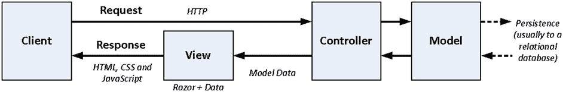
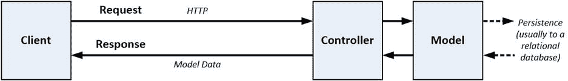
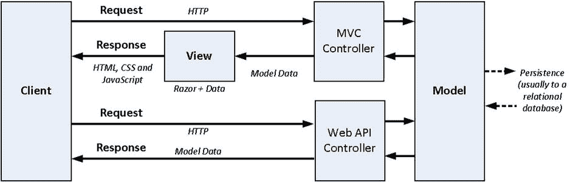
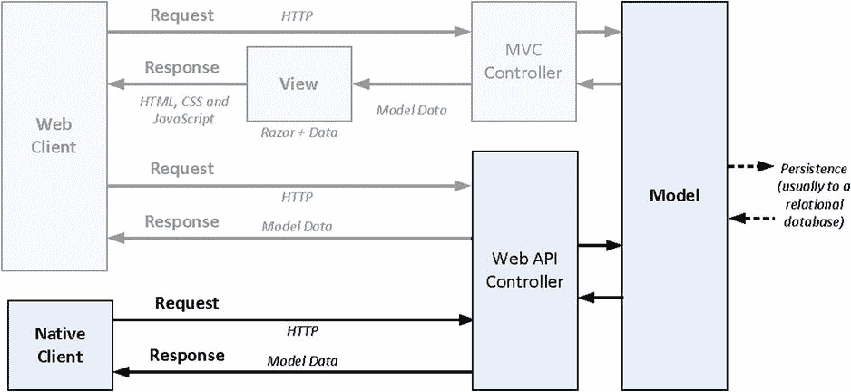
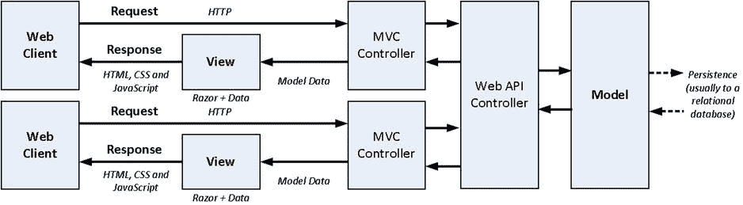

# 4.了解 HTTP Web 服务

在这一章中，我将解释使用 ASP.NET Web API 交付 HTTP web 服务的不同方式，以及每种方式最适合的客户端类型。在此基础上，我描述了可以创建的两大类 web 服务:简单的 web 服务(就像我在第 2 章中创建的那个)和 RESTful web 服务，它们更复杂但更容易维护。

简单和 RESTful web 服务之间的选择呼应了贯穿 MVC 框架开发的主题:设计和开发时间的初始投资通过松散耦合的系统得到回报，该系统更容易随着时间的推移而改变。

为了解释 RESTful web 服务，我描述了设计和发展一个 API 的过程，该 API 允许客户端以松散耦合的方式使用服务。结果是一个 RESTful API 的描述，这可能会让你觉得很抽象，但不要担心，因为我在第 5 章 8 中用实现示例支持了这一点，以及本书中对 ASP.NET Web API 特性的详细解释。

## 了解 ASP.NET Web API

ASP.NET Web API 解决了一个简单的问题:它创建了通过 HTTP 请求将数据从 ASP.NET 应用传送到客户端的服务，这被称为 HTTP web 服务。这听起来可能类似于 MVC 框架，但是不同之处在于 MVC 通常向客户端交付混合了数据和表示指令的内容。图 [4-1](#Fig1) 显示了 MVC 框架应用中组件的标准排列。

图 4-1。

The components in an MVC application

MVC 框架视图将 Razor 标记与模型数据结合起来，生成可以呈现给用户的内容，通常是 HTML、CSS 和 JavaScript 的组合。

ASP.NET Web API 也使用一个控制器和一个模型，但是它没有视图。相反，它只发送数据，如图 [4-2](#Fig2) 所示。

图 4-2。

The components in a Web API application

只发送数据意味着向用户呈现数据变成了发出 HTTP 请求的客户机的责任。有四种不同类型的 Web API 客户端，每一种都以不同的方式受益于纯数据服务:单页应用、本机应用、共享模型应用和服务应用。我将在接下来的小节中描述每种客户端类型。

决定使用哪种模型很大程度上取决于原始数据在哪里被处理，并与表示元素组合以显示给用户。表示不一定是 HTMLnative clients 使用自己的 UI 工具包，服务应用可能根本不会将数据呈现给用户。

### 理解单页应用

基于浏览器的 web 应用可以分为两大类。第一种是往返应用，在这种情况下，对服务器的每个请求都返回一个完整的 HTML 内容页面。另一类是单页面应用，它从 HTML 文档开始，使用 JavaScript 向服务器发出 Ajax 请求，请求额外的数据或 HTML 片段，以响应用户交互。在第 2 章中，我创建了一个简单的单页应用来介绍 ASP.NET Web API。

这些往返和单页类别是一个范围的两端，大多数现代 web 应用都处于中间位置，有些请求返回完整的 HTML 文档，而有些请求只返回数据。

对于大多数 MVC 框架开发人员来说，单页应用是 ASP.NET Web API 有趣的原因，它允许 HTTP web 服务与应用的 MVC 框架组件一起使用，这也是我在本书的大部分时间里关注的模型。MVC 框架用于交付初始内容，然后使用 Ajax 请求对 ASP.NET Web API Web 服务进行补充或更新，如图 [4-3](#Fig3) 所示。

图 4-3。

Using MVC and Web API in a single-page application

模型数据在两个地方处理:当从 MVC 控制器请求应用的初始内容时，在视图中处理；当从 Web API 控制器接收数据时，在浏览器中处理。ASP.NET 使得创建一个通过 MVC 和 Web API 控制器向客户公开的数据模型变得很容易，正如我在第 2 章中演示的那样。

### 了解本机应用

智能手机和平板电脑的兴起意味着许多应用是作为原生客户端交付的，而不是作为浏览器窗口中的 HTML 内容。本地应用仍然需要数据并对数据执行操作，这很容易通过 Web API 得到支持。Web API 交付数据，本地应用负责处理接收到的数据并显示给用户。图 [4-4](#Fig4) 显示了 ASP.NET 应用支持的客户端类型组合。

图 4-4。

Supporting mixed client types in an ASP.NET application

智能手机和平板电脑并不是唯一的本地应用，几乎任何可以发送 HTTP 请求和处理常见数据格式的应用都可以使用 web 服务。智能手机是数量最多的本机客户端，尤其是在创建面向互联网的应用时，但是您也可以使用 Web API 来支持桌面客户端、嵌入式设备和智能电视。我在本书中没有描述本地应用，但是我用 web API 创建的 Web 服务可以很容易地被任何类型的客户端使用。

### 了解共享模型应用

图 [4-4](#Fig4) 中隐含的假设是模型状态被持久存储，所有需要访问模型的应用将通过数据存储来访问模型，数据存储通常是某种数据库。

这种方法的问题是，数据库擅长管理数据，但无法以对应用有意义的方式一致地实施授权或日志记录等功能。例如，可以记录特定的 SQL 查询，但不能记录导致该查询的用户正在执行的应用功能。

此外，如果有多个应用需要共享模型数据，在不同步升级数据库和所有应用的情况下，很难管理模式和数据更改，这需要仔细规划和测试。

另一种方法是使用 web 服务协调多个应用对数据存储的访问，提供存储实现的抽象，并将应用与数据存储方式的变化隔离开来。图 [4-5](#Fig5) 显示了这种方法。

图 4-5。

Using a web service to mediate access to the data store

使用 web 服务作为模型仲裁者可能会影响性能，但是如果数据的存储方式特别难以处理或者预计会经常改变，那么这种好处是值得的。在这种配置中，MVC 应用就像 web 服务的任何其他客户端一样被处理，并在视图中组合数据和标记。

### 了解服务应用

服务应用不与用户直接交互。相反，它们从 web 服务获取数据，并为不同类型的客户端打包或处理数据。服务应用为 web 服务增加了某种价值，可能是通过将来自多个 web 服务的数据和操作组合到一个 API 中，或者执行复杂的计算。支持服务客户端可能是一种很好的方式，可以使数据对更广泛的受众可用，这些受众可能远远超出您现有的用户群。

从应用的角度来看，支持原生应用和服务应用差别不大；接收和处理相同的 HTTP 请求，以检索数据或更新模型，web 服务不知道处理或呈现数据的方式。

Tip

你可以在 [`http://fitbit.com`](http://fitbit.com/) 看到一个 API 的好例子，它通过服务应用到达更广泛的受众。Fitbit 销售监控活动水平的硬件设备，并提供收集活动数据的网络应用。数据和用户信息通过 API 公开，这使得其他网站和服务的庞大生态系统蓬勃发展。如果您的业务模型不依赖于将用户吸引到您的应用中，那么支持服务客户端会非常有用。

## 了解简单的 Web 服务

我在第 2 章中用 ASP.NET web API 创建的 HTTP web 服务被称为简单 Web 服务，或者用一个对 MVC 框架开发人员更有共鸣的术语来说，一个紧密耦合的 Web 服务。紧密耦合指的是这样一个事实，即客户机必须事先知道 web 服务是如何设计的，以便使用 web 服务。

作为一个先验知识的例子，PartyInvites 应用中的客户机需要知道新的 RSVP 响应是作为 POST 请求提交给`/api/rsvp/add` URL 的。Web API 控制器发送的响应中没有任何内容表明`/api/rsvp/add` URL 存在；客户需要提前获得这些信息。当客户端代码从 MVC 框架应用交付时，这并不难安排，因为您可以将信息嵌入到视图中，这对于 web 服务的本地客户端(如 iPhone 和 Android 应用)来说更是一个问题。

如果您熟悉 MVC 模式，您可能会想到，紧耦合的问题是它使维护应用变得困难，因为必须同时对 Web API 控制器和客户端 JavaScript 代码进行更改。

这也使得 Web API 控制器很难超出其原始用途，因为简单 Web 服务的控制器往往只为原始客户端需要的特定功能提供动作方法。例如，如果我需要添加一个允许我列出、编辑和删除客户机响应的管理型客户机，那么我需要扩展控制器的功能——这可以防止在没有 web 服务开发人员协调的情况下创建客户机。

另一种方法是创建一个 web 服务，它不需要客户事先了解 web 服务，这是 REST 的精髓所在。我将在下一节中描述 REST 和 RESTful web 服务，并演示如何使用 ASP.NET web API 来创建它们，但是在继续之前，我想强调的是，您不应该轻易放弃简单的 Web 服务。

尽管紧耦合会带来一些问题，但是简单的 web 服务只需要几行 C#和 JavaScript 代码就可以将往返 MVC 框架应用转换为单页面模型。你在第 2 章中看到了这一点，在那里我创建了下面的 Web API 控制器。

`using System.Collections.Generic;`

`using System.Linq;`

`using System.Web.Http;`

`using PartyInvites.Models;`

`namespace PartyInvites.Controllers {`

`public class RsvpController : ApiController {`

`[HttpGet]`

`public IEnumerable<GuestResponse> Attendees() {`

`return Repository.Responses.Where(x => x.WillAttend == true);`

`}`

`[HttpPost]`

`public void Add(GuestResponse response) {`

`if (ModelState.IsValid) {`

`Repository.Add(response);`

`}`

`}`

`}`

`}`

投入这么少的精力，很难获得如此高的回报。如果您确信唯一的客户端将由 MVC 框架交付，并且您知道变更率将会很低并且不是由第三方驱动的，那么简单的 web 服务是完全可以接受的(换句话说，您没有试图创建一个可以被 MVC 框架应用范围之外的更广泛的受众消费的 API)。表 [4-1](#Tab1) 总结了简单的 web 服务和它们可以有效应用的情况。

表 4-1。

Putting Simple Web Services in Context

<colgroup><col> <col></colgroup> 
| 问题 | 回答 |
| --- | --- |
| 这是什么？ | 简单的 web 服务只支持单个应用的客户端所需的特性。 |
| 我应该什么时候使用它？ | 简单的 web 服务可以快速设置，并且在您不希望添加其他类型的客户端或者需要显著增强现有客户端提供的功能时非常有用。 |
| 我需要知道什么？ | 简单的 web 服务与其客户端紧密耦合，这使得在不修改 web 服务和支持 MVC 框架应用的情况下，添加其他类型的客户端或更改现有客户端变得更加困难。 |

## 理解 RESTful Web 服务

创建松散耦合的 web 服务最常用的模式是表述性状态转移(REST)。REST 是一种通用模式，当应用于 web 服务时，它创建了所谓的 RESTful web 服务。

THE DANGER OF DESIGN PATTERNS

就像所有有用的设计模式一样，REST 是关于什么是真正 RESTful，什么不是 RESTful 的无休止争论的主题。这些争论是浪费时间，你应该忽略它们。模式是可以根据自己的需要定制的模板。RESTful web 服务背后的目标是确保客户端和 ASP.NET Web API 控制器是松散耦合的，只有您知道 REST 模式的哪些方面将帮助您实现这一目标。当我意识到最不熟练的程序员是那些喊得最响的人时，我停止了与模式狂热者的争论。我的建议是专注于交付好的软件，以你完成工作所需的任何方式借鉴和适应模式。

在接下来的章节中，我将描述如何使用我在第二章中为 PartyInvites 应用定义的`GuestResponse`模型类来设计一个 RESTful web 服务 API。提醒一下，清单 4-1 显示了模型类的定义。

清单 4-1。GuestResponse 模型类的定义

`using System.ComponentModel.DataAnnotations;`

`namespace PartyInvites.Models {`

`public class GuestResponse {`

`[Required]`

`public string Name { get; set; }`

`[Required]`

`public string Email { get; set; }`

`[Required]`

`public bool? WillAttend { get; set; }`

`}`

`}`

提醒一下，下面是如何将`GuestResponse`类的实例呈现为 JSON:

`[{"Name":"Bob","Email":"bob@example.com","WillAttend":true},`

`{"Name":"Alice","Email":"alice@example.com","WillAttend":true},`

`{"Name":"Paul","Email":"paul@example.com","WillAttend":true}]`

我不打算在本章中实现 web 服务；我将只定义我需要的 API。你可以在第 6 章中看到我是如何实现 RESTful web 服务的，在这里我构建了一个更真实的 SportsStore 应用来展示使用 ASP.NET Web API 的端到端实现过程。

Tip

虽然我在本章通篇使用 JSON，但是 ASP.NET Web API 能够生成不同的数据格式来满足不同的客户需求。详见第 11-13 章。

我不在这一章写代码的原因是我想专注于一个有效和有用的 web 服务 API 的设计，而不考虑它的实现细节。理解 RESTful web 服务为什么有用很重要，尤其是因为它们的设计更加复杂。正如您将了解到的，将客户端与 web 服务分离需要投入更多的时间和精力，然后通过增加灵活性和可维护性来获得回报，就像为 MVC 框架应用奠定基础所需的初始投资一样。表 [4-2](#Tab2) 总结了 RESTful web 服务以及可以有效应用它们的情况。

表 4-2。

Putting RESTful Web Services in Context

<colgroup><col> <col></colgroup> 
| 问题 | 回答 |
| --- | --- |
| 它们是什么？ | RESTful web 服务对于解耦客户端和它们使用的 web 服务非常有用。它们需要更多的设计和开发工作，但是它们使维护 web 服务变得更加容易。 |
| 我应该什么时候使用它们？ | 当客户端由第三方开发时，或者当您预计 web 服务提供的 API 会有很大变化时，您应该使用 RESTful web 服务。 |
| 我需要知道什么？ | 关于如何使 web 服务 RESTful，以及由此导致的客户机和 web 服务的松耦合程度，您有几种选择。客户在使用 web 服务时需要的先验知识越少，服务就越稳定。 |

### 拥抱 HTTP

RESTful web 服务的核心基础是使用 HTTP 动词和唯一 URL 的组合来定义模型上的操作，以引用单个数据对象和这些对象的集合。

Tip

当提到 HTTP 时，动词和方法这两个术语是等效的，可以互换使用。当我编写 MVC 框架视图时，我倾向于引用方法(因为`form`元素定义了一个`method`属性),当我编写 web 服务时，我倾向于引用动词。

下面是一个 URL 示例，它唯一地表示来自一个名为 Bob 的用户的 RSVP 响应(我省略了 URL 中指定协议、主机名和端口的部分，因为在我的示例中所有这些都是常量):

`/api/rsvp/bob`

在 RESTful web 服务中，每当我想对描述 Bob 参加聚会的`GuestResponse`对象执行操作时，我都会使用这个 URL。为了告诉 web 服务我想要执行哪种类型的操作，我发出一个针对 URL 的 HTTP 请求，并在请求中指定一个 HTTP 动词。

Note

REST 是一种通用模式，已经在 web 服务领域找到了自己的位置，但是因为这是一本关于 web 服务的书，所以我将把 REST 和 RESTful web 服务视为同一事物，这样我就不会纠缠于对 Web API 开发没有任何实际影响的精细区分。

通过在 MVC 框架中的使用，您已经熟悉了至少两个 HTTP 动词:GET 和 POST。您可能不知道的是，HTTP 规范包含额外的动词，并且在 RESTful web 服务中，这些动词用于指示请求中的 URL 正在数据对象标识上请求哪种操作。表 [4-3](#Tab3) 展示了如何将一个 HTTP 动词和一个 URL 结合起来请求一个 web 服务执行一个操作。有些操作需要客户机向服务器发送数据，或者服务器向客户机发送数据，我已经在表中包含了这些信息。

Tip

web 服务不必支持表 [4-3](#Tab3) 中列出的所有动词。例如，只读 web 服务支持 DELETE、POST 和 PUT 动词是没有意义的，您只需要实现对所需动词的支持。

表 4-3。

Combining HTTP Verbs with URLs to Specify a Web Service API

<colgroup><col> <col> <col> <col> <col></colgroup> 
| 动词 | 统一资源定位器 | 描述 | 客户端发送 | 服务器发送 |
| --- | --- | --- | --- | --- |
| `GET` | `/api/rsvp/bob` | 获取表示 Bob 的 RSVP 的数据对象 | 没有任何东西 | 鲍勃的`GuestResponse` |
| `POST` | `/api/rvsp/bob` | 为 Bob 创建新的 RSVP 对象 | `GuestResponse`要被拯救 | 保存的`GuestResponse`对象 |
| `PUT` | `/api/rsvp/bob` | 更新 Bob 的现有 RSVP | 修改后的`GuestResponse`被保存 | 保存的`GuestResponse`对象 |
| `DELETE` | `/api/rsvp/bob` | 删除 Bob 的 RSVP | 没有任何东西 | 没有任何东西 |

该表的内容定义了 web 服务 API，客户端开发人员可以使用这些信息来消费 web 服务。这种 API 通过结合 URL 和 HTTP 动词来包含 HTTP，这感觉令人兴奋和动态，就像对从控制器类中的任意方法名称派生的 URL 的明确改进，但事实有些不同，因为客户端和服务器仍然过于紧密地耦合在一起。我将在下面的章节中解释原因。

USING SAFE AND IDEMPOTENT HTTP VERBS

没有 HTTP 动词到 web 服务操作的标准映射，尽管我在表 [4-3](#Tab3) 中描述的映射很常见。您可以为您的 web 服务使用任何您喜欢的 HTTP 动词，只要您理解安全和等幂 HTTP 动词的重要性。

安全动词没有副作用。最常用的安全动词是 GET，当您收到 GET 请求时，您可能不会执行任何改变数据模型状态的操作。您所要做的就是返回所请求的数据，并选择性地执行横切活动，比如日志记录和缓存。

幂等动词(如 PUT 和 DELETE)可以修改数据模型，但是对同一个 URL 使用同一个动词的多个请求应该与单个请求具有相同的效果。这样做的实际效果是，您应该使用 URL 来唯一地标识资源，而不是依赖于数据项之间的关系。例如，如果您支持引用存储库中第一个数据对象的 URL(如`/api/rsvp/first`),则接受对该 URL 的删除请求不会导致数据项混排，从而出现新的“第一个”对象。您还必须编写您的 web 服务，以便它在接收多个请求时不会生成错误，比如对已经从存储库中删除的数据对象的删除请求。

小心后置动词；它不一定是安全的或等幂的，并且您可以灵活地响应针对同一个 URL 的多个请求。如果已经有匹配的数据项，大多数 web 服务会将 POST 请求视为 PUT 请求，但是您可以根据数据模型的需要选择创建一个新对象或报告一个错误。

### 添加数据发现

用 URL 唯一地标识每个数据对象(更确切地说是 REST 中的资源)是一个很好的想法，但是它提出了一个问题:客户机如何发现数据对象集和引用它们的 URL？

解决方案是创建一个集合 URL，它返回模型中的所有数据对象。约定是使用标识单个对象的根 URL 来检索数据对象的集合。在我的 API 中，这意味着 URL `/api/rsvp`将返回模型中的所有数据对象。表 [4-4](#Tab4) 显示了集合 URL 到 web 服务 API 的添加。

表 4-4。

Adding a Collections URL to the Web Service API

<colgroup><col> <col> <col> <col> <col></colgroup> 
| 动词 | 统一资源定位器 | 描述 | 客户端发送 | 服务器发送 |
| --- | --- | --- | --- | --- |
| `GET` | `/api/rsvp/bob` | 获取表示 Bob 的 RSVP 的数据对象 | 没有任何东西 | 鲍勃的`GuestResponse` |
| `POST` | `/api/rvsp/bob` | 为 Bob 创建新的 RSVP 对象 | `GuestResponse`要被拯救 | 保存的`GuestResponse`对象 |
| `PUT` | `/api/rsvp/bob` | 更新 Bob 的现有 RSVP | 修改后的`GuestResponse`被保存 | 保存的`GuestResponse`对象 |
| `DELETE` | `/api/rsvp/bob` | 删除 Bob 的 RSVP | 没有任何东西 | 没有任何东西 |
| `GET` | `/api/rsvp` | 获取数据对象的集合 | 没有任何东西 | 存储库中所有`GuestResponse`对象的集合 |

#### 过滤集合

大多数客户端不需要检索模型中的所有数据，因此约定是允许客户端通过使用查询字符串参数来缩小集合 URL 返回的数据。例如，为了获得一组参与者，我在第 2 章的[中添加了一个特定的动作方法，客户端将发送一个 GET 请求到下面的 URL:](02.html)

`/api/rsvp?WillAttend=true`

web 服务可以忽略查询字符串并返回模型中的所有数据对象，但是支持这种约定通常是一个好主意，这样您就不会传输客户端不需要的、将被丢弃的大量数据。表 [4-5](#Tab5) 显示了我修改后的 API。

Tip

这种模式的一个常见变体是将过滤器构建到 URL 中，而不是依赖于查询字符串。例如，在第六章的[中，我定义了一个 web 服务，当 URL `/api/products`被请求时，它返回所有的模型对象。例如，具有唯一标识符`100`的对象可以通过 URL `/api/products/100`访问。Web API 使得支持两种 URL 格式变得很容易。](06.html)

表 4-5。

Adding Collections Filtering to the Web Service API

<colgroup><col> <col> <col> <col> <col></colgroup> 
| 动词 | 统一资源定位器 | 描述 | 客户端发送 | 服务器发送 |
| --- | --- | --- | --- | --- |
| `GET` | `/api/rsvp/bob` | 获取表示 Bob 的 RSVP 的数据对象 | 没有任何东西 | 鲍勃的`GuestResponse` |
| `POST` | `/api/rvsp/bob` | 为 Bob 创建新的 RSVP 对象 | `GuestResponse`要被拯救 | 保存的`GuestResponse`对象 |
| `PUT` | `/api/rsvp/bob` | 更新 Bob 的现有 RSVP | 修改后的`GuestResponse`被保存 | 保存的`GuestResponse`对象 |
| `DELETE` | `/api/rsvp/bob` | 删除 Bob 的 RSVP | 没有任何东西 | 没有任何东西 |
| `GET` | `/api/rsvp` | 获取数据对象的集合 | 没有任何东西 | 存储库中所有`GuestResponse`对象的集合 |
| `GET` | `/api/rsvp?prop=val` | 获取数据对象的筛选集合 | 没有任何东西 | 存储库中所有属性`prop`设置为`val`的`GuestResponse`对象的集合 |

这是我所说的设计模式中的实用主义的一个例子——即使我试图最小化客户端需要的先验知识，我也在使用客户端和服务器都需要理解的约定来扩展我的 web 服务 API。在客户机-服务器耦合和应用合理的优化之间要找到一个平衡点，这对于每个项目都是不同的。没有放之四海而皆准的方法，你应该用你的判断来决定什么时候遵循一个设计模式没有意义。

## 摘要

在这一章中，我描述了使用 ASP.NET Web API 向不同的客户提供 Web 服务的方法。我还描述了 web 服务的两个主要类别:简单的 web 服务，就像我在第 2 章中创建的一个，以及 RESTful web 服务，我将在下一章中演示。我解释了 RESTful web 服务需要更多的设计和开发工作，但是会产生更容易管理和维护的松散耦合的软件系统。

这一章本质上有点抽象，因为我想把 RESTful web 服务 API 的设计从实现细节中分离出来。但是如果你发现这很难，不要担心，因为在下一章中，我将向你展示代码示例来实现我在本章中描述的概念。