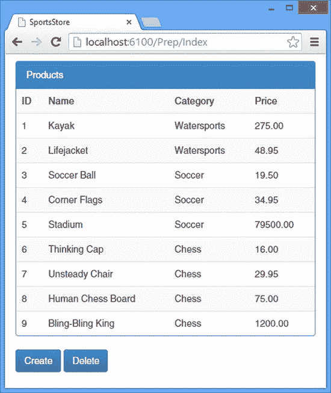

# 五、SportsStore：准备

在这一章中，我为一个更现实的项目奠定了基础，这个项目包含了 Web API 开发的所有关键方面，并展示了它们的协同工作。后面的章节放大到具体的特性，这是深入细节的好方法，但是它没有提供任何端到端的上下文。

我的应用名为 SportsStore，将遵循各地在线商店采用的经典方法。我将创建一个客户可以按类别和页面浏览的在线产品目录，一个用户可以添加和删除产品的购物车，以及一个客户可以输入送货细节的收银台。我还将创建一个管理区域，其中包括用于管理目录的创建、读取、更新和删除(CRUD)工具，我将保护它，以便只有登录的管理员才能进行更改。

在本章中，我将创建包含产品信息的数据库，并配置 ASP.NET 身份系统，以便在第 6 章中限制管理员的访问权限。

如果你读过我的其他书——包括 Pro ASP.NET MVC 5 和 Pro angular js——那么你会看到不同版本的 SportsStore 应用。我在我的许多书中使用它来展示关键特性和功能是如何结合在一起的，并展示不同的技术，以及如何使用不同的开发框架和工具包来解决常见的问题，如数据库访问和用户安全性。

Note

SportsStore 项目的目标是展示 Web API 的更真实的使用，而不是精确地重新创建在线商店的所有方面——其中许多方面与 HTTP web 服务完全无关。为此，我使用了一个简单的产品数据库，不涉及诸如信用卡支付或订单跟踪等细节。

这一章都是准备，我不描述任何 Web API 特性。如果您已经熟悉如何设置和配置实体框架代码优先和 ASP.NET 身份，您可以跳到第 6 章。

Tip

您不必自己重新创建代码；你可以从 [`Apress.com`](http://apress.com/) 免费下载为本书每一章组织的 Visual Studio 项目。

## 准备示例项目

要开始创建 SportsStore 应用，我需要创建 Visual Studio 项目，并使用 NuGet 添加我将依赖的包。

从“文件”菜单中选择“新建项目”,打开“新建项目”对话框窗口。浏览模板部分，选择 visual c # ASP.NET➤web➤web 应用模板，并将项目名称设置为 SportsStore，如图 [5-1](#Fig1) 所示。

图 5-1。

Creating the new project

单击“确定”按钮，转到“新建 ASP.NET 项目”对话框窗口。确保选择了空选项，并检查 MVC 和 Web API 选项，如图 [5-2](#Fig2) 所示。单击 OK 按钮，Visual Studio 将创建一个名为 SportsStore 的新项目。

图 5-2。

Selecting the ASP.NET project type

此时，解决方案浏览器将具有 web 应用的基本文件夹结构，如图 [5-3](#Fig3) 所示，并且当我构建应用的基础时，它将很快被填充。

图 5-3。

The Solution Explorer

### 添加和更新 NuGet 包

我将在本书中使用特定版本的 NuGet 包，以确保您能够重新创建示例并获得相同的结果。这意味着由 Visual Studio 添加到项目中的 MVC 和 Web API 的版本可能不是可用的最新版本，但它确实意味着您将能够遵循本书中的所有示例，而不会陷入由微小的版本更改引起的问题中。

从 Visual Studio 工具➤ NuGet 包管理器菜单中选择包管理器控制台，然后输入以下命令:

`Update-Package Microsoft.Aspnet.Mvc -version 5.1.1`

`Update-Package Microsoft.Aspnet.Webapi -version 5.1.1`

`Update-Package Newtonsoft.Json -version 6.0.1`

`Install-Package Microsoft.AspNet.Identity.EntityFramework –Version 2.0.0`

`Install-Package Microsoft.AspNet.Identity.OWIN -Version 2.0.0`

`Install-Package Microsoft.Owin.Host.SystemWeb -Version 2.1.0`

`Install-Package Microsoft.AspNet.WebApi.Owin -Version 5.1.1`

`Install-Package jquery -version 2.1.0`

`Install-Package bootstrap -version 3.1.1`

`Install-Package knockoutjs –version 3.1.0`

要添加的包很多，我在表 [5-1](#Tab1) 中描述了每个包的作用。

表 5-1。

The Packages Required to Prepare for SportsStore

<colgroup><col> <col></colgroup> 
| 名字 | 描述 |
| --- | --- |
| `Microsoft.Aspnet.Mvc` | 这个包包含 MVC 框架类，我将把它用于 SportsStore 应用的 HTML 部分。 |
| `Microsoft.Aspnet.Webapi` | 这个包包含 Web API 类，我将用它来创建 HTTP web 服务。 |
| `Newtonsoft.Json` | 这个包包含用于序列化和反序列化 JSON 数据的类。我在[第 13 章](13.html)中详细描述了 JSON 序列化过程。 |
| `Microsoft.AspNet.Identity.EntityFramework` | 这个包包含 ASP.NET 身份所需的实体框架支持，我用它来进行用户管理。 |
| `Microsoft.AspNet.Identity.OWIN` | 这个包包含 ASP.NET 身份所需的 OWIN 支持，我用它来进行用户管理。我在第 26 章中描述了 OWIN 及其支持的主机选项。 |
| `Microsoft.Owin.Host.SystemWeb` | 这个包包含 ASP.NET 身份所需的 OWIN 支持，我用它来进行用户管理。我在第 26 章中描述了 OWIN 及其支持的主机选项。 |
| `Microsoft.AspNet.WebApi.Owin` | 这个包包含 Web API 所需的 OWIN 支持。我在第 26 章中描述了 OWIN 及其支持的主机选项。 |
| `jquery` | 这个包包含 jQuery 库，我用它从浏览器发送 Ajax 请求。我在第 3 章中描述了 jQuery 对 Ajax 的支持。 |
| `bootstrap` | 这个包包含引导库，我用它来设计 HTML 内容的样式。 |
| `knockoutjs` | 这个包包含了 Knockout 包，我用它来创建一个动态的客户端应用。我在第 3 章的[中描述了基本的剔除功能。](03.html) |

您可以创建只包含使用 web API 创建的 Web 服务的应用，在这种情况下，您不需要我在表中列出的许多包。但是 Web API 很少单独使用，大多数应用需要创建一个客户端，交付 HTML 和 JavaScript 内容，并应用某种安全措施。正如您将看到的，用 web API 创建 Web 服务相对简单；将这些 web 服务集成到更广泛的应用中需要时间、技能和努力。

### 创建准备控制器

我需要测试我为 SportsStore 应用所做的准备工作。我不想过早地进入 Web API 本身，所以我将使用一个简单的 MVC 框架控制器来生成一些基本的诊断 Web 页面。我右键单击控制器文件夹，选择添加➤控制器，选择 MVC 5 控制器-空模板，然后单击添加按钮。我在添加控制器对话框中将控制器名称设置为 PrepController，并单击添加按钮，这导致 Visual Studio 创建了`Controllers/PrepController.cs`类文件，其内容如清单 5-1 所示。

清单 5-1。`PrepController.cs`文件的内容

`using System;`

`using System.Collections.Generic;`

`using System.Linq;`

`using System.Web;`

`using System.Web.Mvc;`

`namespace SportsStore.Controllers {`

`public class PrepController : Controller {`

`public ActionResult Index() {`

`return View();`

`}`

`}`

`}`

这是由 Visual Studio 创建的默认内容，但是我将在构建 SportsStore 应用的基础时添加动作方法(以及用于呈现它们的视图)。

### 创建 Razor 布局

虽然这本书是关于 Web API 的，但是我使用 MVC 框架来生成 HTML 内容，从而创建基于浏览器的客户端。为了确保生成包含我需要的所有 JavaScript 文件的一致的 HTML，我创建了`Views/Shared`文件夹，并在其中添加了一个名为`_Layout.cshtml`的文件，然后用它来创建如清单 5-2 所示的布局。我将在整个 SportsStore 应用中创建的视图中使用这种布局。

清单 5-2。_Layout.cshtml 文件的内容

`<!DOCTYPE html>`

`<html>`

`<head>`

`<meta name="viewport" content="width=device-width" />`

``

``

`<link href="∼/Content/bootstrap.css" rel="stylesheet" />`

`<link href="∼/Content/bootstrap-theme.css" rel="stylesheet" />`

`<title>SportsStore</title>`

``

`@RenderSection("Scripts", false)`

`</head>`

`<body class="container">`

`@RenderBody()`

`</body>`

`</html>`

Tip

创建视图最简单的方法是添加`Views/Shared`文件夹，右键单击它，并选择添加➤ MVC 5 布局页面(Razor)。输入`_Layout.cshtml`作为文件名，点击 OK 按钮，Visual Studio 将创建并打开布局文件。

### 创建 OWIN 启动类

ASP.NET 身份包在应用启动时查找配置类。我将在“配置 ASP.NET 身份”一节中解释这个类的作用，但我将在这里定义它，以便 SportsStore 应用启动时不会出错，即使我不会立即设置用户帐户。清单 5-3 显示了`IdentityConfig.cs`文件的内容，我将它添加到了`App_Start`文件夹中。

清单 5-3。IdentityConfig.cs 文件的内容

`using Microsoft.Owin;`

`using Owin;`

`[assembly: OwinStartup(typeof(SportsStore.IdentityConfig))]`

`namespace SportsStore {`

`public class IdentityConfig {`

`public void Configuration(IAppBuilder app) {}`

`}`

`}`

这个文件的重要部分是`OwinStartup`属性，它指定了`SportsStore.IdentityConfig`类应该用于配置。当我在本章后面配置 ASP.NET 身份时，我将返回到这个类。

Tip

当 Visual Studio 将类的大纲添加到新文件中时，它将命名空间设置为`SportsStore.App_Start`，反映文件的位置。约定是在项目的顶级名称空间中定义配置类，这就是我将名称空间改为`SportsStore`的原因。

### 设置 TCP 端口

在创建 HTML/JavaScript 客户端之前，我将构建 SportsStore 应用的 web 服务部分，这意味着我将不得不直接使用浏览器和 Postman 工具测试 URL。为了方便起见，我将把 IIS Express 服务器用来侦听请求的 TCP 端口更改为一个容易记住的值。IIS Express 是 Internet 信息服务(IIS)产品的简化版本，传统上用于承载 ASP.NET 应用，它包含在 Visual Studio 中，因此您可以在开发过程中运行和测试应用。

Tip

IIS 不再是部署 ASP.NET 应用的唯一选择。在第 8 章的[中，我演示了如何将 SportsStore 应用部署到微软 Azure 云服务，在](08.html)[的第 26 章](26.html)中，我描述了 Web API 应用的一个附加托管选项。

从 Visual Studio 项目菜单中选择 SportsStore 属性，然后单击屏幕左侧的 Web 按钮。在“服务器”部分，按如下方式更改项目 Url 值:

`http://localhost:6100`

单击创建虚拟目录按钮并关闭设置文档。当应用运行时，IIS Express 将在端口 6100 上侦听 HTTP 请求。

## 创建产品和订单模型

SportsStore 应用的核心是存储可供销售的产品和已下订单的详细信息的数据库。Web API 依赖于模型类，就像 MVC 框架一样，我在本章中创建的模型类将被两个框架使用。

将模型类连接到数据库的粘合剂是实体框架(EF)，我将通过使用代码优先特性来创建数据库，它使用模型对象来创建数据库模式。在接下来的小节中，我将创建模型类，并首先使用 EF 代码来建立数据库。

### 定义模型类

我的起点是定义模型类，我将用它来表示每个产品。我在`Models`文件夹中添加了一个名为`Product.cs`的类文件，并用它来定义清单 5-4 中所示的类。

清单 5-4。Product.cs 文件的内容

`namespace SportsStore.Models {`

`public class Product {`

`public int Id { get; set; }`

`public string Name { get; set; }`

`public string Description { get; set; }`

`public decimal Price { get; set; }`

`public string Category { get; set; }`

`}`

`}`

这是一个简单的类，描述了产品的基本描述。当然，一个真正的网上商店会有一个更复杂的产品模型，但是清单 5-4 中显示的`Product`类对这本书来说已经足够了，因为我不需要进入供应商、库存水平、退货的细节，以及所有其他在真正的商业中必须解决的问题。

我还将存储客户下的订单。清单 5-5 显示了`Order.cs`文件的内容，我将它添加到了`Models`文件夹中。

清单 5-5。Order.cs 文件的内容

`using System.Collections.Generic;`

`namespace SportsStore.Models {`

`public class Order {`

`public int Id { get; set; }`

`public string Customer { get; set; }`

`public decimal TotalCost { get; set; }`

`public ICollection<OrderLine> Lines { get; set; }`

`}`

`public class OrderLine {`

`public int Id { get; set; }`

`public int Count { get; set; }`

`public int ProductId { get; set; }`

`public int OrderId { get; set; }`

`public Product Product { get; set; }`

`public Order Order { get; set; }`

`}`

`}`

`Order`类定义了简单类型的`Id`、`Customer`和`TotalCost`属性。`Lines`属性是一个`ICollection<OrderLine>`对象，它向实体框架发出信号，表明在`Order`和`OrderLine`类之间存在关系。我将使用`OrderLine`类来表示单个产品选择，我定义`OrderLine`类的方式允许我利用一些聪明的 EF 代码优先特性。

EF 代码首先会识别出这两个属性将被用作外键来引用`Product`和`Order`对象:

`...`

`public int ProductId { get; set; }`

`public int OrderId { get; set; }`

`...`

EF 会将这些识别为导航属性:

`...`

`public Product Product { get; set; }`

`public Order Order { get; set; }`

`...`

导航属性允许在数据模型中导航，而不必从数据库中请求单独的对象。我将在下一节创建管理数据库的类时配置它们的用法。

### 创建存储库类

存储库模式降低了存储和检索模型对象的复杂性，从而与应用的其余部分隔离开来。在接下来的小节中，我将定义描述存储库的接口，创建数据库实现类，然后使用它们来定义实现接口的存储库类。

Caution

这些类是相互依赖的，在创建完所有这些类之前，您将无法编译和运行项目。

#### 定义存储库接口

清单 5-6 显示了`IRepository.cs`文件的内容，我把它添加到了`Models`文件夹中，用来定义一个存储库接口。这是我即将实现的接口，用于通过实体框架提供对数据的访问。

清单 5-6。IRepository.cs 文件的内容

`using System.Collections.Generic;`

`using System.Threading.Tasks;`

`namespace SportsStore.Models {`

`public interface IRepository {`

`IEnumerable<Product> Products { get; }`

`Task<int> SaveProductAsync(Product product);`

`Task<Product> DeleteProductAsync(int productID);`

`IEnumerable<Order> Orders { get; }`

`Task<int> SaveOrderAsync(Order order);`

`Task<Order> DeleteOrderAsync(int orderID);`

`}`

`}`

`Products`和`Orders`属性提供了对存储库中所有`Product`和`Order`对象的访问，我定义的方法——`SaveProductAsync`、`DeleteProductAsync`、`SaveOrderAsync`和`DeleteOrderAsync`——将允许我存储和移除模型中的对象。

#### 创建数据库上下文和初始化器类

数据库上下文类提供应用和数据库之间的链接，初始化器指定何时创建模式，并提供创建时添加到数据库的初始数据。清单 5-7 显示了`ProductDbContext.cs`文件的内容，我将它添加到了`Models`文件夹中。

清单 5-7。ProductDbContext.cs 文件的内容

`using System;`

`using System.Collections.Generic;`

`using System.Data.Entity;`

`using System.Linq;`

`using System.Web;`

`namespace SportsStore.Models {`

`public class ProductDbContext : DbContext {`

`public ProductDbContext() : base("SportsStoreDb") {`

`Database.SetInitializer<ProductDbContext>(new ProductDbInitializer());`

`}`

`public DbSet<Product> Products { get; set; }`

`public DbSet<Order> Orders { get; set; }`

`public DbSet<OrderLine> OrderLines { get; set; }`

`}`

`}`

`ProductDbContext`类从`DbContext`派生而来，后者是实体框架类，负责访问数据库和将 C# 模型对象转换为 SQL 行以及从 SQL 行转换 c# 模型对象。`Products`、`Orders`和`OrderLines`属性返回强类型的`DbSet`对象，这些对象提供对数据库中数据的访问，表示为模型对象的集合。

`ProductDbContext`类的构造函数调用基构造函数，就像这样:

`...`

`public ProductDbContext() : base("``SportsStoreDb`T2】

`...`

传递给基构造函数的参数是用于创建数据库的连接字符串的名称。正如你将看到的，当首先使用 EF 代码时，我不必在`Web.config`文件中创建一个连接字符串，但是当我在[第 8 章](08.html)中部署应用时，我指定的名称——`SportsStoreDb`将是重要的。

在构造函数中，我注册了初始化器类，如下所示:

`...`

`public ProductDbContext() : base("SportsStoreDb") {`

`Database.SetInitializer<ProductDbContext>(new ProductDbInitializer());`

`}`

`...`

该语句指定将使用`ProductDbInitializer`类来初始化数据库。为了创建初始化器，我在`Models`文件夹中添加了一个`ProductDbInitializer.cs`文件，并定义了如清单 5-8 所示的类。

清单 5-8。ProductDbInitializer.cs 文件的内容

`using System.Collections.Generic;`

`using System.Data.Entity;`

`namespace SportsStore.Models {`

`public class ProductDbInitializer : DropCreateDatabaseAlways<ProductDbContext> {`

`protected override void Seed(ProductDbContext context) {`

`new List<Product> {`

`new Product() { Name = "Kayak", Description = "A boat for one person",`

`Category = "Watersports", Price = 275m },`

`new Product() { Name = "Lifejacket",`

`Description = "Protective and fashionable",`

`Category = "Watersports", Price = 48.95m },`

`new Product() { Name = "Soccer Ball",`

`Description = "FIFA-approved size and weight",`

`Category = "Soccer", Price = 19.50m },`

`new Product() {`

`Name = "Corner Flags",`

`Description = "Give your playing field a professional touch",`

`Category = "Soccer", Price = 34.95m },`

`new Product() { Name = "Stadium",`

`Description = "Flat-packed 35,000-seat stadium",`

`Category = "Soccer", Price = 79500m },`

`new Product() { Name = "Thinking Cap",`

`Description = "Improve your brain efficiency by 75%",`

`Category = "Chess", Price = 16m },`

`new Product() { Name = "Unsteady Chair",`

`Description = "Secretly give your opponent a disadvantage",`

`Category = "Chess", Price = 29.95m },`

`new Product() { Name = "Human Chess Board",`

`Description = "A fun game for the family",`

`Category = "Chess", Price = 75m },`

`new Product() { Name = "Bling-Bling King",`

`Description = "Gold-plated, diamond-studded King",`

`Category = "Chess", Price = 1200m },`

`}.ForEach(product => context.Products.Add(product));`

`context.SaveChanges();`

`new List<Order> {`

`new Order() { Customer = "Alice Smith", TotalCost = 68.45m,`

`Lines = new List<OrderLine> {`

`new OrderLine() { ProductId = 2, Count = 2},`

`new OrderLine() { ProductId = 3, Count = 1},`

`}},`

`new Order() { Customer = "Peter Jones", TotalCost = 79791m,`

`Lines = new List<OrderLine> {`

`new OrderLine() { ProductId = 5, Count = 1},`

`new OrderLine() { ProductId = 6, Count = 3},`

`new OrderLine() { ProductId = 1, Count = 3},`

`}}`

`}.ForEach(order => context.Orders.Add(order));`

`context.SaveChanges();`

`}`

`}`

`}`

数据库初始化器是从三个基类中的一个派生的，这三个基类决定了何时删除数据库内容并重新创建模式。表 [5-2](#Tab2) 描述了可用的类，其中`T`是数据库上下文类的类型，对于 SportsStore 应用是`ProductDbContext`。

表 5-2。

The Database Initializer Base Classes

<colgroup><col> <col></colgroup> 
| 名字 | 描述 |
| --- | --- |
| `DropCreateDatabaseAlways<T>` | 每次初始化数据库上下文时，都会删除并重新创建数据库。 |
| `DropCreateDatabaseIfModelChanges<T>` | 当任何模型类发生更改时，数据库将被删除并重新创建。 |
| `CreateDatabaseIfNotExists<T>` | 只有当数据库尚不存在时，才会创建该数据库。 |

我已经使用了`DropCreateDatabaseAlways<T>`基类，这意味着每次应用启动时，SportsStore 数据库将被删除并重新创建。这在开发的早期阶段很有用，因为它允许我对数据库的内容进行更改，然后通过简单地重启应用来重置它们。在第 8 章中部署应用之前，我将改变初始化器的基类。

Caution

不要使用`DropCreateDatabaseAlways`类部署应用，因为每次应用重新启动时，您的所有数据都会丢失。

我想在创建数据库时用一些有用的数据填充数据库，这是通过覆盖`Seed`方法来实现的。我创建了一组`Product`、`Order`和`OrderList`对象，并使用`ProductDbContext`参数将它们存储在数据库中。因为我的数据库每次都会被重置，所以拥有一些默认数据在开发的早期阶段很有帮助，我喜欢编写少量代码并测试它们的效果。

#### 定义存储库类

创建存储库的最后一步是创建存储库类，它将实现`IRepository`接口并使用实体框架上下文类为应用提供数据。清单 5-9 显示了我添加到`Models`文件夹中的`ProductRepository.cs`文件的内容。

清单 5-9。ProductRepository.cs 文件的内容

`using System.Collections.Generic;`

`using System.Threading.Tasks;`

`namespace SportsStore.Models {`

`public class ProductRepository : IRepository {`

`private ProductDbContext context = new ProductDbContext();`

`public IEnumerable<Product> Products {`

`get { return context.Products; }`

`}`

`public async Task<int> SaveProductAsync(Product product) {`

`if (product.Id == 0) {`

`context.Products.Add(product);`

`} else {`

`Product dbEntry = context.Products.Find(product.Id);`

`if (dbEntry != null) {`

`dbEntry.Name = product.Name;`

`dbEntry.Description = product.Description;`

`dbEntry.Price = product.Price;`

`dbEntry.Category = product.Category;`

`}`

`}`

`return await context.SaveChangesAsync();`

`}`

`public async Task<Product> DeleteProductAsync(int productID) {`

`Product dbEntry = context.Products.Find(productID);`

`if (dbEntry != null) {`

`context.Products.Remove(dbEntry);`

`}`

`await context.SaveChangesAsync();`

`return dbEntry;`

`}`

`public IEnumerable<Order> Orders {`

`get { return context.Orders.Include("Lines").Include("Lines.Product"); }`

`}`

`public async Task<int> SaveOrderAsync(Order order) {`

`if (order.Id == 0) {`

`context.Orders.Add(order);`

`}`

`return await context.SaveChangesAsync();`

`}`

`public async Task<Order> DeleteOrderAsync(int orderID) {`

`Order dbEntry = context.Orders.Find(orderID);`

`if (dbEntry != null) {`

`context.Orders.Remove(dbEntry);`

`}`

`await context.SaveChangesAsync();`

`return dbEntry;`

`}`

`}`

`}`

控制器将调用这个类来检索模型数据并将新对象存储在数据库中。`Products`和`Orders`属性从数据库上下文返回模型对象的集合，`SaveProductAsync`、`DeleteProductAsync`、`SaveOrderAsync`和`DeleteOrderAsync`方法的实现使用数据库上下文来修改数据存储。

Note

我增加了对修改和保存`Product`对象的支持，但只支持保存`Order`对象；我不允许 SportsStore 的订单一旦保存就被修改。

### 测试存储库

为了测试存储库，我将在本章开始时创建的`Prep`控制器中添加一些简单的动作方法，这样我就可以读取、保存和删除模型对象，如清单 5-10 所示。

清单 5-10。在 PrepController.cs 文件中添加操作方法

`using System.Threading.Tasks;`

`using System.Web.Mvc;`

`using SportsStore.Models;`

`namespace SportsStore.Controllers {`

`public class PrepController : Controller {`

`IRepository repo;`

`public PrepController() {`

`repo = new ProductRepository();`

`}`

`public ActionResult Index() {`

`return View(repo.Products);`

`}`

`public async Task<ActionResult> DeleteProduct(int id) {`

`await repo.DeleteProductAsync(id);`

`return RedirectToAction("Index");`

`}`

`public async Task<ActionResult> SaveProduct(Product product) {`

`await repo.SaveProductAsync(product);`

`return RedirectToAction("Index");`

`}`

`public ActionResult Orders() {`

`return View(repo.Orders);`

`}`

`public async Task<ActionResult> DeleteOrder(int id) {`

`await repo.DeleteOrderAsync(id);`

`return RedirectToAction("Orders");`

`}`

`public async Task<ActionResult> SaveOrder(Order order) {`

`await repo.SaveOrderAsync(order);`

`return RedirectToAction("Orders");`

`}`

`}`

`}`

这些是标准的 MVC 框架动作，它们对存储库进行操作，并将数据对象传递给 Razor 视图，以便可以将它们呈现为 HTML 并发送给浏览器。我需要两个视图来测试存储库:一个用于测试产品，一个用于测试订单。清单 5-11 显示了`Index.cshtml`文件的内容，我把它添加到了`/Views/Prep`文件夹中。

Tip

注意，我直接实例化了`ProductRepository`类。这在实际项目中是很糟糕的做法，应该使用依赖注入(DI)来代替。我在第 10 章解释了 Web API 如何处理 DI，但是我不想被 MVC 框架分散注意力，它以不同的方式工作。如果你对 MVC 框架应用中的 DI 不熟悉，请参阅我的专业版 ASP.NET MVC 5 的书。

清单 5-11。Index.cshtml 文件的内容

`@model IEnumerable<SportsStore.Models.Product>`

`
`

`
Products
`

`<table class="table table-striped">`

`<tr><th>ID</th><th>Name</th><th>Category</th><th>Price</th></tr>`

`@foreach (var p in Model) {`

`<tr>`

`<td>@p.Id</td><td>@p.Name</td><td>@p.Category</td><td>@p.Price</td>`

`</tr>`

`}`

`</table>`

`
`

`@using(Html.BeginForm("SaveProduct", "Prep")) {`

`<input type="hidden" name="Name" value="Zippy Running Shoes" />`

`<input type="hidden" name="Category" value="Running" />`

`<input type="hidden" name="Description" value="Set a new Record Time" />`

`<input type="hidden" name="Price" value="159.99" />`

`<button class="btn btn-primary" type="submit">Create</button>`

`<a href="/prep/deleteproduct/2" class="btn btn-primary">Delete</a>`

`}`

该视图生成一个 Bootstrap 格式的`table`元素，它包含存储库中包含的`Product`对象的详细信息。我还添加了一个`Create`按钮，调用`SaveProduct`动作将新的`Product`保存到存储库中，以及一个`Delete`按钮，调用`DeleteProduct`动作删除`Product`，其`Id`为`2`。(`Create`和`Delete`按钮使用硬连线值，因此一旦您点击它们，您将需要重启应用以重置数据库；否则，`Delete`操作将失败，`Create`操作将创建一个重复的产品。)

要测试存储库对产品的支持，从 Visual Studio 调试菜单中选择启动调试来启动应用，并使用浏览器导航到`/Prep/Index` URL。您将看到一个可用产品的列表，如图 [5-4](#Fig4) 所示，并且可以点击按钮来检查是否可以对数据库进行更改。

Tip

显示的数据是在数据库初始化类的`Seed`方法中创建的，我在清单 5-8 中定义了这个类。不要忘记，目前，每次应用启动时，数据库中的数据都会被重置。

图 5-4。

Testing the repository for products Caution

在实例化数据库上下文类之前，不会初始化和填充数据库。这意味着，如果您正在使用 SQL Server Management Studio 或 Visual Studio SQL Server 对象资源管理器等工具，您将看不到任何数据库、模式或数据，直到请求了`/Prep/Index`或`/Prep/Orders` URL 之后。

我需要创建的第二个视图将允许我对存储库对`Order`对象的支持执行类似的测试。清单 5-12 显示了我添加到`Views/Prep`文件夹中的`Orders.cshtml`文件的内容。

清单 5-12。Orders.cshtml 文件的内容

`@model IEnumerable<SportsStore.Models.Order>`

`
`

`
`

`Orders`

`
`

`<table class="table table-striped">`

`<tr>`

`<th>ID</th>`

`<th>Customer</th>`

`<th colspan="3"></th>`

`<th>Total Cost</th>`

`</tr>`

`@foreach (var o in Model) {`

`<tr>`

`<td>@o.Id</td>`

`<td>@o.Customer</td>`

`<td colspan="3"></td>`

`<td>@string.Format("{0:c}", o.TotalCost)</td>`

`</tr>`

`<tr>`

`<th colspan="2"></th>`

`<th>Product</th>`

`<th>Quantity</th>`

`<th>Price</th>`

`<th></th>`

`</tr>`

`foreach (var ol in o.Lines) {`

`<tr>`

`<td colspan="2"></td>`

`<td>@ol.Product.Name</td>`

`<td>@ol.Count</td>`

`<td>@string.Format("{0:c}", ol.Product.Price)</td>`

`<td></td>`

`</tr>`

`}`

`}`

`</table>`

`
`

`@using (Html.BeginForm("SaveOrder", "Prep")) {`

`<input type="hidden" name="Customer" value="John Poet" />`

`<input type="hidden" name="TotalCost" value="91" />`

`<input type="hidden" name="lines[0].productid" value="6" />`

`<input type="hidden" name="lines[0].count" value="1" />`

`<input type="hidden" name="lines[1].productid" value="8" />`

`<input type="hidden" name="lines[1].count" value="1" />`

`<button class="btn btn-primary" type="submit">Create</button>`

`<a href="/prep/deleteorder/2" class="btn btn-primary">Delete</a>`

`}`

这个视图更复杂，因为我需要处理与每个`Order`相关联的`OrderLine`对象。要测试存储库，启动应用并导航到`/Prep/Orders` URL。

### 检查数据库模式

值得花点时间来思考一下我是如何创建 SportsStore 数据库的。我定义了我的模型类，然后定义了实体框架上下文和操作它们的初始化器类。最后，我实现了我的存储库接口，作为应用和实体框架之间的桥梁。

我不必创建数据库或定义它的模式。这些任务是根据模型类的结构自动执行的，遵循一组定义良好的约定，您可以在这里了解到: [`http://msdn.microsoft.com/data/ef.aspx`](http://msdn.microsoft.com/data/ef.aspx) 。图 [5-5](#Fig5) 显示了实体框架为我创建的模式图，这是我使用 SQL Server Management Studio 工具(可以从微软免费下载)创建的。

图 5-5。

The structure of the SportsStore Products and Orders databases

无可否认，这是一个简单的模式，首先使用实体框架代码并不能代替复杂项目中的专业数据架构师，但是它是一个优秀的入门工具，对于简单的数据库来说完全足够了。

## 配置 ASP.NET 身份

ASP.NET 身份是 ASP.NET 应用的用户管理系统，已经取代了微软过去几年提供的会员系统。Identity 更加灵活，更容易扩展，并且依赖于我在上一节中用来设置产品数据库的相同的实体框架代码优先特性。在接下来的小节中，我将创建一个简单的 ASP.NET 身份系统，它将允许我对用户进行认证，检查角色的成员资格，并将一些 SportsStore 特性限制为管理用户。

Note

我只需要一个简单的 ASP.NET 身份配置来验证用户和授权访问 SportsStore web 服务。身份系统有许多功能远远超出了我对这本书的需求，包括通过第三方(包括脸书、Twitter 和谷歌)认证用户的能力，以及根据声明授权用户的能力，这允许将外部数据纳入考虑范围。我在我的 Pro ASP.NET 5 平台书籍中描述了这两个特性，这本书由 Apress 出版。

### 定义用户和角色类

使用 Identity 的起点是创建代表用户的类，称为 user 类。这是 Identity 工作方式的关键部分，因为它允许您定义可用于存储特定于应用的数据的自定义属性。我在解决方案浏览器中创建了`Infrastructure/Identity`文件夹，并添加了`StoreUser.cs`文件，其内容如清单 5-13 所示。

清单 5-13。StoreUser.cs 文件的内容

`using Microsoft.AspNet.Identity.EntityFramework;`

`namespace SportsStore.Infrastructure.Identity {`

`public class StoreUser : IdentityUser {`

`// application-specific properties go here`

`}`

`}`

用户类是从`IdentityUser`类派生出来的，它是在`Microsoft.AspNet.Identity.EntityFramework`名称空间中定义的。用户类可以用特定于应用的属性来定义，这些属性对应于旧的 ASP.NET 成员资格系统的用户配置文件功能，并且在创建数据库模式时会自动添加到数据库模式中。我将创建一个基本的身份配置，不需要任何自定义属性，所以我只需创建一个从`IdentityUser`派生的类，但不添加方法的新属性。我的`StoreUser`类继承了许多有用的属性，不过，我已经在表 [5-3](#Tab3) 中描述过了。还有其他属性，但这些是我在 SportsStore 应用中需要的属性。

表 5-3。

Useful Properties Inherited from the IdentityUser Class

<colgroup><col> <col></colgroup> 
| 名字 | 描述 |
| --- | --- |
| `Email` | 返回用户的电子邮件地址 |
| `Id` | 返回用户的唯一 ID |
| `Roles` | 返回包含用户被分配到的角色的集合 |
| `UserName` | 返回用户的名称 |

我还需要定义一个代表角色的类。同样，Identity 提供了一个基类——称为`IdentityRole`—从中派生出一个特定于应用的角色类。清单 5-14 显示了我添加到`Infrastructure/Identity`文件夹中的`StoreRole.cs`文件的内容。

清单 5-14。StoreRole.cs 文件的内容

`using Microsoft.AspNet.Identity.EntityFramework;`

`namespace SportsStore.Infrastructure.Identity {`

`public class StoreRole : IdentityRole {`

`public StoreRole() : base() { }`

`public StoreRole(string name) : base(name) { }`

`}`

`}`

我没有为 SportsStore 应用做任何定制，所以 SportsStore 类是从`IdentityRole`派生的，但没有添加任何额外的属性。

### 创建数据库上下文类

下一步是创建实体框架上下文类，用于管理数据库中用户和角色记录的存储。清单 5-15 显示了`StoreIdentityDbContext.cs`文件的内容，我把它添加到了`Infrastructure/Identity`文件夹中。

清单 5-15。StoreIdentityDbContext.cs 文件的内容

`using Microsoft.AspNet.Identity.EntityFramework;`

`using System.Data.Entity;`

`namespace SportsStore.Infrastructure.Identity {`

`public class StoreIdentityDbContext : IdentityDbContext<StoreUser> {`

`public StoreIdentityDbContext() : base("SportsStoreIdentityDb") {`

`Database.SetInitializer<StoreIdentityDbContext>(new`

`StoreIdentityDbInitializer());`

`}`

`public static StoreIdentityDbContext Create() {`

`return new StoreIdentityDbContext();`

`}`

`}`

`}`

这类似于我为产品数据库创建的上下文类，但是有几个重要的区别。首先，该类是从`IdentityDbContext`而不是`DbContext`派生的，这就是为什么我不需要定义任何属性来公开数据库中的数据——一切都由基类提供。

第二个不同是我定义了一个`Create`方法。Identity 使用一个惯例，通过配置文件中指定的静态方法实例化它需要的类，而`Create`方法执行这个任务。

Tip

`StoreIdentityDbContext`构造函数用值为`SportsStoreIdentityDb`的字符串参数调用基类构造函数。该字符串指定用于数据库的连接字符串。当我在第 8 章的[中部署 SportsStore 应用时，我将需要这个名称，但目前我不需要显式地创建数据库，因为默认设置是使用`LocalDb`创建数据库，这是 Visual Studio 中包含的 SQL Server 的零配置版本，旨在使开发人员更容易使用数据库。](08.html)

`StoreIdentityDbContext`类的构造函数注册了一个初始化器类，我用它来指定数据库的初始数据，并控制何时删除和重新创建数据库。清单 5-16 显示了我添加到`Infrastructure/Identity`文件夹中的`StoreIdentityDbInitializer.cs`文件的内容。

清单 5-16。StoreIdentityDbInitializer.cs 文件的内容

`using System;`

`using System.Collections.Generic;`

`using System.Data.Entity;`

`using System.Linq;`

`using System.Web;`

`using Microsoft.AspNet.Identity.EntityFramework;`

`using Microsoft.AspNet.Identity;`

`namespace SportsStore.Infrastructure.Identity {`

`public class StoreIdentityDbInitializer :`

`CreateDatabaseIfNotExists<StoreIdentityDbContext> {`

`protected override void Seed(StoreIdentityDbContext context) {`

`StoreUserManager userMgr =`

`new StoreUserManager(new UserStore<StoreUser>(context));`

`StoreRoleManager roleMgr =`

`new StoreRoleManager(new RoleStore<StoreRole>(context));`

`string roleName = "Administrators";`

`string userName = "Admin";`

`string password = "secret";`

`string email = "admin@example.com";`

`if (!roleMgr.RoleExists(roleName)) {`

`roleMgr.Create(new StoreRole(roleName));`

`}`

`StoreUser user = userMgr.FindByName(userName);`

`if (user == null) {`

`userMgr.Create(new StoreUser {`

`UserName = userName, Email = email`

`}, password);`

`user = userMgr.FindByName(userName);`

`}`

`if (!userMgr.IsInRole(user.Id, roleName)) {`

`userMgr.AddToRole(user.Id, roleName);`

`}`

`base.Seed(context);`

`}`

`}`

`}`

我已经将初始化器的基类设置为`CreateDatabaseIfNotExists`，这意味着，正如我在表 [5-2](#Tab2) 中所描述的，模式只有在数据库中不存在时才会被创建。尤其重要的是，不要删除并重新创建用户数据数据库，因为它通常包含帐户、首选项、密码和其他无法重新植入的配置文件数据。对于 SportsStore 应用，这并不重要，因为`Seed`方法创建了将被使用的唯一用户帐户，并且其密码是固定的。

### 创建管理器类

在清单 5-16 所示的数据库初始化器类中，我使用了`StoreUserManager`和`StoreRoleManager`类来检查数据库是否包含管理用户和角色，并在需要时创建它们。`StoreUserManager`类用于对`StoreUser`对象执行操作。我在`Infrastructure/Identity`文件夹中添加了一个`StoreUserManager.cs`文件，并用它来定义清单 5-17 所示的类。

清单 5-17。StoreUserManager.cs 文件的内容

`using Microsoft.AspNet.Identity;`

`using Microsoft.AspNet.Identity.EntityFramework;`

`using Microsoft.AspNet.Identity.Owin;`

`using Microsoft.Owin;`

`namespace SportsStore.Infrastructure.Identity {`

`public class StoreUserManager : UserManager<StoreUser> {`

`public StoreUserManager(IUserStore<StoreUser> store)`

`: base(store) {}`

`public static StoreUserManager Create(`

`IdentityFactoryOptions<StoreUserManager> options,`

`IOwinContext context) {`

`StoreIdentityDbContext dbContext = context.Get<StoreIdentityDbContext>();`

`StoreUserManager manager =`

`new StoreUserManager(new UserStore<StoreUser>(dbContext));`

`return manager;`

`}`

`}`

`}`

基类是`UserManager`，它提供了常见用户管理任务所需的方法和属性，如表 [5-4](#Tab4) 所述。对于 SportsStore 应用，我不需要任何特定于应用的功能，但是我必须遵循两个重要的模式。第一个是向`StoreUserManager`类的构造函数传递一个`IUserStore<StoreUser>`参数，该参数用于访问用户数据，将该参数传递给基本构造函数以便初始化该类是很重要的。

第二种模式是定义一个静态的`Create`类，当 ASP.NET 身份需要一个`StoreUserManager`类的实例时，它将被调用。传递给`Create`方法的参数之一是一个`IOwinContext`对象，通过它我可以获得我定义的其他类的实例。我使用强类型的`Get`方法来获取`StoreIdentityDbContext`类的实例，如下所示:

`...`

`StoreIdentityDbContext dbContext = context.Get<StoreIdentityDbContext>();`

`...`

这具有实例化上下文类和初始化数据库的效果，并为我提供了调用`StoreUserManager`构造函数所需的实例。

Tip

所有的 ASP.NET 标识方法都是异步的，但是有一些同步扩展方法可供您使用。当使用遵循类似模式的 Web API 时，我更喜欢使用异步方法，但是对于初始化数据库，我发现同步方法更容易使用。

表 5-4。

Some of the Members Defined by the UserManager<T> Class

<colgroup><col> <col></colgroup> 
| 名字 | 描述 |
| --- | --- |
| `Create(user, pass)` | 用指定的密码创建新用户。我在播种数据库时使用这种方法来创建管理用户，如清单 5-16 所示。 |
| `Find(user, pass)` | 找到具有特定密码的用户帐户。只有当存在用户帐户并且提供的密码与数据库中存储的密码匹配时，此方法才会返回结果。这个方法用于执行认证，我在“测试 ASP.NET 身份”一节中使用了它。 |
| `FindByName(name)` | 查找具有指定名称的用户，如果没有这样的用户，则返回`null`。 |
| `IsInRole(user, role)` | 如果指定的用户已被分配给指定的角色，则返回`true`。 |
| `Users` | 返回标识系统存储的用户对象的枚举。 |

我还需要创建一个管理角色的类。清单 5-18 显示了`StoreRoleManager.cs`文件的内容，我把它添加到了`/Infrastructure/Identity`文件夹中。

清单 5-18。StoreRoleManager.cs 文件的内容

`using Microsoft.AspNet.Identity;`

`using Microsoft.AspNet.Identity.EntityFramework;`

`using Microsoft.AspNet.Identity.Owin;`

`using Microsoft.Owin;`

`namespace SportsStore.Infrastructure.Identity {`

`public class StoreRoleManager : RoleManager<StoreRole> {`

`public StoreRoleManager(RoleStore<StoreRole> store) : base(store) { }`

`public static StoreRoleManager Create(`

`IdentityFactoryOptions<StoreRoleManager> options,`

`IOwinContext context) {`

`return new StoreRoleManager(new`

`RoleStore<StoreRole>(context.Get<StoreIdentityDbContext>()));`

`}`

`}`

`}`

我调用基本构造函数并定义一个`Create`方法来确保类被正确实例化和配置，就像我对`StoreUserManager`类所做的那样。基类是`RoleManager`，它提供了只对应用定义的角色进行操作的方法和属性，表 [5-5](#Tab5) 显示了我在本章中使用的方法和属性。

表 5-5。

Some of the Members Defined by the RoleManager<T> Class

<colgroup><col> <col></colgroup> 
| 名字 | 描述 |
| --- | --- |
| `RoleExists(name)` | 如果指定的角色存在，则返回`true` |
| `Create(name)` | 创建指定的角色 |

在这一章中，我对`StoreRoleManager`类没有太多要求，因为我将通过应用 MVC 框架`Authorize`属性来测试角色是否工作，该属性负责检查用户是否经过认证并处于特定角色。本章中`StoreRoleManager`的唯一用途是在数据库播种期间查看`Administrators`角色是否存在，如果不存在就创建它。

### 添加配置语句

在本章的开始，我将`IdentityConfig.cs`文件添加到了`App_Start`文件夹中，这样我就可以开始构建应用，而不会在应用启动时收到来自 ASP.NET 身份的错误。现在我已经创建了创建和管理用户身份所需的类，最后一步是在`IdentityConfig.cs`文件中注册它们并完成配置过程。清单 5-19 显示了我添加到`IdentityConfig.cs`文件中的内容。

清单 5-19。向 IdentityConfig.cs 文件添加配置语句

`using Owin;`

`using Microsoft.Owin;`

`using Microsoft.AspNet.Identity;`

`using Microsoft.Owin.Security.Cookies;`

`using SportsStore.Infrastructure.Identity;`

`[assembly: OwinStartup(typeof(SportsStore.IdentityConfig))]`

`namespace SportsStore {`

`public class IdentityConfig {`

`public void Configuration(IAppBuilder app) {`

`app.CreatePerOwinContext<StoreIdentityDbContext>(`

`StoreIdentityDbContext.Create);`

`app.CreatePerOwinContext<StoreUserManager>(StoreUserManager.Create);`

`app.CreatePerOwinContext<StoreRoleManager>(StoreRoleManager.Create);`

`app.UseCookieAuthentication(new CookieAuthenticationOptions {`

`AuthenticationType = DefaultAuthenticationTypes.ApplicationCookie`

`});`

`}`

`}`

`}`

前三个语句注册了`StoreIdentityDbContext`、`StoreUserManager`和`StoreRoleManager`类，这样就可以根据 ASP.NET 身份的需要创建它们的实例。最后一条语句告诉 ASP.NET 在认证响应中设置一个 cookie，浏览器将发送这个 cookie 来识别后续请求。

Note

ASP.NET 身份设置的方式有些尴尬，因为微软正在过渡到`System.Web`汇编中的遗留功能和 OWIN 的新世界以及灵活的托管选项。我回到 OWIN，在第 26 章向你展示它与 Web API 的关系，但是在微软完成 ASP.NET 的过渡之前，奇怪的配置将会保留。

### 测试 ASP.NET 身份

我只需要测试 ASP.NET 身份是否已经配置好，并且正在为本章工作，这意味着我可以走一些捷径。清单 5-20 显示了我添加到`Prep`控制器的动作方法和过滤器。

清单 5-20。在 PrepController.cs 文件中添加操作方法和过滤器

`using System.Threading.Tasks;`

`using System.Web.Mvc;`

`using SportsStore.Models;`

`using SportsStore.Infrastructure.Identity;`

`using Microsoft.Owin.Security;`

`using Microsoft.AspNet.Identity;`

`using Microsoft.AspNet.Identity.Owin;`

`using System.Web;`

`using System.Security.Claims;`

`namespace SportsStore.Controllers {`

`public class PrepController : Controller {`

`IRepository repo;`

`public PrepController() {`

`repo = new ProductRepository();`

`}`

`public ActionResult Index() {`

`return View(repo.Products);`

`}`

`[Authorize(Roles = "Administrators")]`

`public async Task<ActionResult> DeleteProduct(int id) {`

`await repo.DeleteProductAsync(id);`

`return RedirectToAction("Index");`

`}`

`[Authorize(Roles = "Administrators")]`

`public async Task<ActionResult> SaveProduct(Product product) {`

`await repo.SaveProductAsync(product);`

`return RedirectToAction("Index");`

`}`

`public ActionResult Orders() {`

`return View(repo.Orders);`

`}`

`public async Task<ActionResult> DeleteOrder(int id) {`

`await repo.DeleteOrderAsync(id);`

`return RedirectToAction("Orders");`

`}`

`public async Task<ActionResult> SaveOrder(Order order) {`

`await repo.SaveOrderAsync(order);`

`return RedirectToAction("Orders");`

`}`

`public async Task<ActionResult> SignIn() {`

`IAuthenticationManager authMgr = HttpContext.GetOwinContext().Authentication;`

`StoreUserManager userMrg =`

`HttpContext.GetOwinContext().GetUserManager<StoreUserManager>();`

`StoreUser user = await userMrg.FindAsync("Admin", "secret");`

`authMgr.SignIn(await userMrg.CreateIdentityAsync(user,`

`DefaultAuthenticationTypes.ApplicationCookie));`

`return RedirectToAction("Index");`

`}`

`public ActionResult SignOut() {`

`HttpContext.GetOwinContext().Authentication.SignOut();`

`return RedirectToAction("Index");`

`}`

`}`

`}`

我添加了一个`SignIn`动作，该动作为管理用户提供了硬编码的凭证，并使用这些凭证对应用的请求进行认证，并向客户端发送一个 cookie，该 cookie 可用于对后续请求进行认证。我还定义了一个`SignOut`方法，该方法停用 cookie 并注销用户。

Tip

本章不打算描述`SignIn`动作中的代码。我会在第 23 章的[和第 24 章](23.html)的[中更详细地介绍 Web API 中的用户认证，但是 ASP.NET 身份本身就是一个话题，并不是本书的重点。我在 Apress 出版的 Pro ASP.NET MVC 5 平台一书中详细介绍了 ASP.NET 身份，包括如何通过谷歌、脸书和其他提供商的认证。](24.html)

我将`Authorize`过滤器应用于`DeleteProduct`和`SaveProduct`动作，以限制被分配了`Administrators`角色的认证用户的访问。

通过授权测试意味着客户端必须能够调用`SignIn`动作，清单 5-21 显示了我在`Views/Prep/Index.cshtml`文件中添加的允许登录和注销的按钮。

清单 5-21。向 Index.cshtml 文件添加认证控件

`@model IEnumerable<SportsStore.Models.Product>`

`
`

`<a href="/prep/signin" class="btn btn-sm btn-primary">Sign In</a>`

`<a href="/prep/signout" class="btn btn-sm btn-primary">Sign Out</a>`

`User: @(HttpContext.Current.User.Identity.Name)`

`
`

`
`

`
Products
`

`<table class="table table-striped">`

`<tr><th>ID</th><th>Name</th><th>Category</th><th>Price</th></tr>`

`@foreach (var p in Model) {`

`<tr>`

`<td>@p.Id</td>`

`<td>@p.Name</td>`

`<td>@p.Category</td>`

`<td>@p.Price</td>`

`</tr>`

`}`

`</table>`

`
`

`@using (Html.BeginForm("SaveProduct", "Prep")) {`

`<input type="hidden" name="Name" value="Zippy Running Shoes" />`

`<input type="hidden" name="Category" value="Running" />`

`<input type="hidden" name="Description" value="Set a new Record Time" />`

`<input type="hidden" name="Price" value="159.99" />`

`<button class="btn btn-primary" type="submit">Create</button>`

`<a href="/prep/deleteproduct/2" class="btn btn-primary">Delete</a>`

`}`

我添加了一些样式化的`a`元素，这些元素将调用`SignIn`和`SignOut`动作方法以及经过认证的用户的名字，当浏览器没有经过认证时，这个名字将是空白的。(我已经对`a`元素生成的 URL 进行了硬编码，这在实际项目中是不太好的做法，但是我认为这对于像这样执行初始配置测试是很好的。)

要测试身份，启动应用并使用浏览器导航到`/Prep/Index` URL。你会看到数据库中的产品列表，以及清单 5-21 中的附加按钮，如图 [5-6](#Fig6) 所示。

图 5-6。

The authentication buttons and username Tip

如果您收到一条错误消息，指出无法加载`Microsoft.Owin.Security`或它的某个依赖项，请使用 Visual Studio 重建➤重建解决方案菜单项重建应用，然后重试。

要确保授权属性正常工作，请单击“创建”或“删除”按钮。浏览器还没有调用`SignIn` action 方法，所以这个请求将在没有认证 cookie 的情况下被发送，应该用 401(未授权)响应拒绝，如图 [5-7](#Fig7) 所示。

图 5-7。

Invoking a restricted action without authentication

返回到`/Prep/Index` URL 并点击登录按钮。浏览器将发送一个调用`SignIn`动作方法的请求，该方法将认证 cookie 添加到响应中，并将浏览器重定向到`/Prep/Index` URL。不同的是，现在用户名会显示在页面顶部，表示浏览器已经通过认证，如图 [5-8](#Fig8) 所示。

图 5-8。

The effect of authenticating the browser

现在再次单击创建或删除按钮。这一次，浏览器发送的 HTTP 请求将包含一个认证 cookie，这将允许成功调用目标操作方法，添加产品或从数据库中删除产品。如果您单击“注销”按钮，您将返回到发出经过认证的请求并接收 401(未授权)响应。

### 正在删除应用 Cookie

我配置了 ASP.NET 身份，这样当请求成功通过认证时，它将设置一个 cookie，这允许来自同一个客户端的后续请求在不需要凭证的情况下得到授权。往返应用需要 cookie，如果没有它，我在本章中使用的认证测试将无法工作。对于 SportsStore 应用，我将使用一种不同的方法，即显式设置一个 HTTP 头来证明客户端已经过认证。我在第 6 章中解释了这个过程，但是本章的最后一步是禁用 cookie，如清单 5-22 所示。

清单 5-22。禁用 IdentityConfig.cs 文件中的身份 Cookie

`using Owin;`

`using Microsoft.Owin;`

`using Microsoft.AspNet.Identity;`

`using Microsoft.Owin.Security.Cookies;`

`using SportsStore.Infrastructure.Identity;`

`[assembly: OwinStartup(typeof(SportsStore.IdentityConfig))]`

`namespace SportsStore {`

`public class IdentityConfig {`

`public void Configuration(IAppBuilder app) {`

`app.CreatePerOwinContext<StoreIdentityDbContext>(`

`StoreIdentityDbContext.Create);`

`app.CreatePerOwinContext<StoreUserManager>(StoreUserManager.Create);`

`app.CreatePerOwinContext<StoreRoleManager>(StoreRoleManager.Create);`

`//app.UseCookieAuthentication(new CookieAuthenticationOptions {`

`//AuthenticationType = DefaultAuthenticationTypes.ApplicationCookie`

`//});`

`}`

`}`

`}`

Caution

这一变化意味着`Prep`控制器将不再能够认证自己。

## 摘要

在本章中，我通过创建数据模型并使用实体框架代码优先特性将它持久存储在数据库中，为 SportsStore 应用创建了基础。我还安装并配置了 ASP.NET 身份系统，这样我就可以验证用户并限制对应用管理功能的访问，这些功能是我在第 6 章中创建的。在下一章中，我将定义为 SportsStore 应用提供 Web 服务的 Web API 控制器。