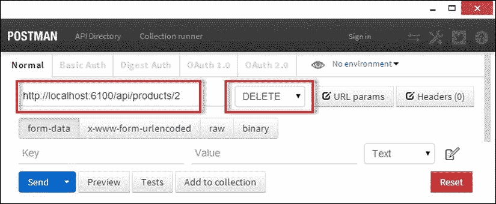

# 6.sports store:RESTful 应用

在前一章中，我通过创建`Product`和`Order`存储库并为用户管理设置 ASP.NET 身份为 SportsStore 应用奠定了基础。在本章中，我将在此基础上定义驱动 SportsStore 应用的 web 服务。

## 创建 RESTful Web 服务

在第 5 章中，我创建了数据模型和存储库，并用数据填充了存储库。我还设置了 ASP.NET 身份，以便对用户进行身份验证和授权。这两个构件为我构建 Web API web 服务奠定了基础。

当使用 Web API 时，创建 RESTful web 服务是一项简单的任务。Web API 使用控制器，就像 MVC 框架一样，但是动作方法返回 C#数据对象而不是 Razor 视图。事实上，Web API 入门非常简单，如果您想知道为什么我写了这么一本关于这个主题的书，这是可以理解的。原因很简单:开始很容易，但是创建一个真正有用的 web 服务需要更多的努力和对 Web API 实际工作方式的更多理解。

为了演示启动和运行是多么容易，我右键单击控制器文件夹，从弹出菜单中选择添加➤控制器，选择 Web API 2 控制器-空模板，然后单击添加按钮。然后，我将控制器的名称设置为 ProductsController，并单击 Add 按钮。Visual Studio 对 Web API 控制器的模板采用了与 MVC 框架相同的方法，空模板只包含基本的控制器定义，如清单 6-1 所示。

Tip

命名 Web API 控制器的惯例是在单词`Controller`前面加上 Web 服务将公开的模型类的复数形式。我的 web 服务将操作`Product`对象，所以我创建了`ProductsController`类。

清单 6-1。ProductsController.cs 文件的内容

`using System;`

`using System.Collections.Generic;`

`using System.Linq;`

`using System.Net;`

`using System.Net.Http;`

`using System.Web.Http;`

`namespace SportsStore.Controllers {`

`public class ProductsController : ApiController {`

`}`

`}`

Web API 开发中有两个重要的名称空间:`System.Net.Http`和`System.Web.Http`。Web API 依赖于在`System.Net.Http`中定义的 HTTP 请求和响应的抽象模型。这个名称空间中您最常使用的类是`HttpRequestMessage`和`HttpResponseMessage`，它们用于表示来自客户端的 HTTP 请求和将被发送的响应。我在第 9 章中描述了这些类，当我深入研究请求如何被分派的细节时，你会在本书中看到它们的使用。

然而，最重要的名称空间是`System.Web.Http`，它是定义 Web API 类的地方。这个名称空间中最重要的类之一是`ApiController`，它是创建 Web API 控制器的标准基类，并提供对动作方法、模型绑定、验证和错误处理等特性的支持。我将在后面的章节中描述所有这些特性(以及包含在`System.Web.Http`名称空间及其子元素中的类)，但是现在我将使用另一个`ApiController`特性:RESTful 动作方法命名约定。清单 6-2 显示了我对`Products`控制器所做的更改，以创建一个 RESTful web 服务，提供对存储库中`Product`模型对象的访问。

清单 6-2。在 ProductsController.cs 文件中添加 RESTful 操作方法

`using System;`

`using System.Collections.Generic;`

`using System.Linq;`

`using System.Net;`

`using System.Net.Http;`

`using System.Web.Http;`

`using SportsStore.Models;`

`using System.Threading.Tasks;`

`namespace SportsStore.Controllers {`

`public class ProductsController : ApiController {`

`public ProductsController() {`

`Repository = new ProductRepository();`

`}`

`public IEnumerable<Product> GetProducts() {`

`return Repository.Products;`

`}`

`public Product GetProduct(int id) {`

`return Repository.Products.Where(p => p.Id == id).FirstOrDefault();`

`}`

`public async Task PostProduct(Product product) {`

`await Repository.SaveProductAsync(product);`

`}`

`public async Task DeleteProduct(int id) {`

`await Repository.DeleteProductAsync(id);`

`}`

`private IRepository Repository { get; set; }`

`}`

`}`

只需几行代码，我就能够定义一个工作的 RESTful web 服务，通过 HTTP 请求公开产品存储库及其内容。这只是一个起点，但是 Web API 开发是一个有益的体验，因为你可以很快地获得坚实的基础。

### 测试产品 Web 服务

若要确保控制器正在工作，请通过从 Visual Studio 调试菜单中选择启动调试来启动应用，并使用浏览器请求以下 URL:

`http://localhost:6100/api/products/2`

输入 URL，就像您在请求一个常规网页一样。我将在下一节解释产品 web 服务支持的完整 API，但是这个简单的测试将确保 Web API 接收请求并正确地分发它们。

Tip

启动应用后，使用 Postman 发出第一个请求时会有短暂的停顿。这是因为我配置了产品数据库，以便在第 5 章中初始化应用时重新生成其内容和模式。我在[第 8 章](08.html)中更改了这个设置，以使数据持久化，但目前能够重置数据库是有帮助的，这样我显示的结果将与你收到的结果相匹配。

如果一切正常，您将在浏览器窗口中看到以下响应:

`<Product xmlns:i="`[`http://www.w3.org/2001/XMLSchema-instance`](http://www.w3.org/2001/XMLSchema-instance)T2】

`xmlns="`[`http://schemas.datacontract.org/2004/07/SportsStore.Models`](http://schemas.datacontract.org/2004/07/SportsStore.Models)T2】

`<Category>Watersports</Category>`

`<Description>Protective and fashionable</Description>`

`<Id>2</Id>`

`<Name>Lifejacket</Name>`

`<Price>48.95</Price>`

`</Product>`

响应是一个 XML 文档，描述数据库中的 Lifejacket 产品，它的`Id`属性对应于我在 URL 中指定的属性。XML 在现代 web 应用中没有广泛使用，我将向您展示如何改变格式[第 13 章](13.html)。

Tip

测试基本 GET 请求的最简单方法是使用浏览器，但是当我向 SportsStore 应用添加特性时，我将使用 Postman 客户端来创建更复杂的请求。有关安装和运行 Postman 的详细信息，请参见第 1 章。

## 将 Web 服务放在上下文中

表 [6-1](#Tab1) 描述了我的`Product`控制器创建的 web 服务 API。了解清单 6-2 中增加的内容的效果将会使我们更容易理解下面几节中关键特性的工作原理。

表 6-1。

The Web Service API Presented by the Products Controller

<colgroup><col> <col> <col> <col></colgroup> 
| 动词 | 统一资源定位器 | 行动方法 | 描述 |
| --- | --- | --- | --- |
| `GET` | `/api/products` | `GetProducts` | 返回存储库中的所有`Product`对象 |
| `GET` | `/api/products/1 or` `/api/products?id=1` | `GetProduct` | 返回一个特定的`Product`对象 |
| `POST` | `/api/products` | `PostProduct` | 更新或创建一个`Product`对象 |
| `DELETE` | `/api/products/1 or` `/api/products?id=1` | `DeleteProduct` | 从存储库中删除一个`Product` |

当如此多的功能在如此少的努力下出现时，你应该想到两件事。首先是幕后肯定有很多工作在进行。第二件事是考虑有什么问题。

有很多事情是看不到的，这本书的大小让你知道我的简单的`Product`控制器依赖多少特性、约定和技术来提供表中所示的 API。

通过查看我在清单 6-2 中添加的动作方法，您可以得到一些最好的 Web API 特性的提示。例如，下面是我在上一节中测试的操作方法:

`...`

`public Product GetProduct(int id) {`

`return Repository.Products.Where(p => p.Id == id).FirstOrDefault();`

`}`

`...`

### 使用常规 C#对象

首先要注意的是，我在整个 action 方法中使用了常规的 C#类。Web API 使用类似于 MVC 框架的数据绑定和 URL 路由过程来从请求中提取数据值，以作为动作方法参数。对于这个动作方法，URL 路由和绑定过程用于提取一个用于`id`参数的`int`值。

Tip

我在第 14 到 17 章描述了绑定过程，在第 20 章和第 21 章描述了 Web API 路由。

action 方法的结果也是一个普通的 C#类:在本例中是`Product`类。在 action 方法中，我使用 LINQ 查询存储库并定位具有所需的`Id`属性值的`Product`，然后返回匹配的对象作为方法结果。Web API 负责创建包含结果对象的序列化表示的 HTTP 响应。当浏览器显示`Lifejacket`对象的 XML 描述时，您看到了这个序列化过程的工作。

Tip

序列化由一个叫做媒体类型格式化器的特性处理，我在第 12 章和第 13 章[中描述了这个特性。媒体类型格式化程序也用于绑定动作方法参数的数据值，正如我在第 14-17 章中所描述的。我在“配置序列化”一节中更改了 SportsStore 应用的序列化设置。](13.html)

使用常规 C#类的效果是，编写动作方法是一个简单而自然的过程，尤其是当您公开存储库中的数据时，您可以将动作方法直接映射到数据操作，就像我在`Products`控制器中所做的那样。

### 使用 RESTful 动作方法约定

Web API 通过在选择操作方法来处理请求时应用一个有用的约定，使得创建 RESTful web 服务变得容易:它寻找名称以请求 HTTP 动词开头的操作方法。

当我发出测试请求时，我不必在 URL 中指定操作方法的名称。提醒一下，这是我请求的网址:

`http://localhost:6100/api/products/2`

URL 确实指定了控制器的名称(`/api/` `products` `/2`)，但没有指定动作方法。Web API 通过查看控制器定义的动作方法来选择动作方法，并过滤掉名称不以请求 HTTP 动词开头的方法。在`Products`控制器中，GET 请求有两种候选动作方法。

`...`

`public IEnumerable<Product> GetProducts() {`

`...`

和

`...`

`public Product GetProduct(int id) {`

`...`

然后，Web API 查看 URL 路由系统从请求中提取的数据，并选择参数与数据匹配的方法。

Tip

只有操作方法名称的开头用于匹配请求。惯例是将模型名称附加到动作方法上，但这不是必需的。

总体效果是，编写动作方法是一个自然的过程，不需要开发人员考虑 HTTP 动词、序列化、数据绑定或处理 HTTP 请求以创建响应所需的任何其他细节。

问题是——当然，有一个问题——我创建了一个 web 服务，它缺少一些重要的特性，在实际应用中毫无用处。

Web API 在项目一开始就给了你大量的初始功能，我喜欢它，因为它有助于补偿我在第五章中必须做的准备工作。但是从我在清单 6-2 中创建的基本 web 服务到一个准备好部署的服务需要做更多的工作——并且会损害我在上一节中描述的好特性的某些方面。目前，我在清单 6-2 中创建的 web 服务没有任何安全性，不验证数据，也不处理错误，所有这些都是严重的遗漏。

Web API 提供了填补空白的特性，但是默认情况下不会应用这些特性。我将在构建 SportsStore 应用时完成 web 服务的整个过程，但是理解编写动作方法只是这个过程的开始是很重要的。

## 配置序列化

我要改变的第一件事是数据模型对象被发送到客户机时的序列化方式。在上一节中，我用浏览器发出了一个简单的 GET 请求，收到了一个包含 XML 数据的响应。

客户端可以在`Accept`请求头中指定他们希望使用的数据格式，Web API 将使用指定的格式来选择序列化格式。Web API 内置了对将对象序列化为 XML 和 JSON 格式的支持。我得到 XML 响应的原因是因为 Google Chrome 发送的`Accept`头指定它将接受任何数据格式，但它宁愿接收 XML。

有两种方法可以改变数据格式:我可以改变客户端发送的`Accept`头，或者我可以改变 Web API 响应它的方式。由于我无法控制 Chrome 使用的 header，我唯一的选择就是重新配置 Web API。

媒体类型格式化程序类处理数据对象的序列化，以便将它们发送到客户端。Web API 附带了一些内置的媒体类型格式化程序，默认情况下可以将对象序列化为 XML 和 JSON 数据格式(尽管你可以添加自己的数据格式，正如我在第 1 章第 2 节中解释的那样)。

为了禁用 XML 输出，我将删除 XML 媒体类型格式化程序，以便它不再用于序列化对象，只留下 JSON 格式化程序来处理请求。

清单 6-3 显示了我对`App_Start`文件夹中的`WebApiConfig.cs`文件所做的更改，以禁用 XML 序列化。

Tip

`WebApiConfig.cs`文件用于配置 Web API，而不是`Global.asax.cs`文件，Visual Studio 默认添加的语句配置用于处理请求的 URL 路由。(我在“准备路由配置”一节中描述了 SportsStore 应用的路由配置，我在[第 20 章](20.html)和[第 21 章](21.html)中详细描述了 Web API URL 路由。)

清单 6-3。禁用 WebApiConfig.cs 文件中的 XML 序列化

`using System;`

`using System.Collections.Generic;`

`using System.Linq;`

`using System.Web.Http;`

`namespace SportsStore {`

`public static class WebApiConfig {`

`public static void Register(HttpConfiguration config) {`

`config.MapHttpAttributeRoutes();`

`config.Routes.MapHttpRoute(`

`name: "DefaultApi",`

`routeTemplate: "api/{controller}/{id}",`

`defaults: new { id = RouteParameter.Optional }`

`);`

`config.Formatters.Remove(config.Formatters.XmlFormatter);`

`}`

`}`

`}`

我在`Register`方法中添加了一条语句，在应用启动时调用该语句来配置 Web API。`Register`方法接受`HttpConfiguration`类的一个实例，该类提供属性和方法来配置 Web API 工作方式的不同方面。

我添加的语句使用了`Formatters`属性，它返回应用中媒体类型格式化程序的集合。这个集合还定义了方便的属性，允许我直接引用重要的内置属性。属性返回用于将数据对象序列化为 XML 的对象。我读取了`XmlFormatter`属性以获取对 XML 媒体类型格式化程序的引用，并将其传递给`Remove`属性以将其从`Formatters`集合中移除。

Tip

虽然`WebApiConfig.cs`文件用于配置 Web API，但当应用由 IIS 托管时，是`Global.asax.cs`文件启动该进程，这在 MVC 5 和 Web API 2 用于同一应用时是必需的。如果您查看`Global.asax.cs`文件，您将看到对`GlobalConfiguration.Configure`方法的调用，这是一个用于配置 Web API 的静态方法。传递给`Configure`方法的参数是一个`Action`，它指定配置将由`WebApiConfig.Register`方法执行。在[第 1 章](01.html) 0 中，我详细解释了`GlobalConfiguration`类的作用以及 Web API 是如何配置的。

通过重启应用并使用浏览器再次请求`http://localhost:6100/api/products/2` URL，您可以看到我在清单 6-3 中添加的语句的效果。Chrome 发送的`Accept`头不变，但 Web API 不能再使用浏览器首选的数据格式，将改为生成 JSON 数据，如下:

`{"Id":2,"Name":"Lifejacket",`

`"Description":"Protective and fashionable","Price":48.95,"Category":"Watersports"}`

这是同一个`Product`对象的表示，但是使用 JSON 格式表示，这种格式已经成为 HTTP web 服务领域的主流。

Tip

删除媒体类型格式化程序有两个原因。首先，您不打算支持这种格式，也不想用 JSON 和 XML 测试应用的输出。第二个原因是，Web API 通常为每个客户端选择正确的格式，但是完成这一工作的过程(称为内容协商)有一些缺点，可能会使粗心的人陷入困境，导致客户端接收到它不知道如何处理的数据。我在第 1 章第 2 节描述了媒体类型格式化程序如何工作，在第 13 章第 3 节描述了内容协商过程。

## 添加基本数据验证

目前，我的 web 服务只是假设它从客户端接收的数据是有效的，可以用来操作存储库。要查看这方面的示例，请使用浏览器请求以下 URL:

`http://localhost:6100/api/products/200`

这个请求将调用`GetProduct`方法，并被解释为对存储库中`Product`对象的请求，该对象的`Id`属性被设置为 200。不幸的是，没有这样的对象，你可以在图 [6-1](#Fig1) 中看到浏览器显示的结果。

图 6-1。

The effect of requesting a nonexistent product

问题是 Web API 无法洞察我的 action 方法的目的和实现，因此无法验证参数`int`的值是否引用了有效的`Product`对象。我需要自己执行基本的验证，并在不匹配时向客户端报告错误。清单 6-4 显示了我对`GetProduct`动作方法所做的修改。

Tip

这只是最基本的一种验证。在“添加模型验证”一节中，我描述了可用于绑定更复杂的值的支持，称为模型验证。

清单 6-4。处理 ProductsController.cs 文件中的错误

`...`

`public Product GetProduct(int id) {`

`Product result = Repository.Products.Where(p => p.Id == id).FirstOrDefault();`

`if (result == null) {`

`throw new HttpResponseException(HttpStatusCode.BadRequest);`

`} else {`

`return result;`

`}`

`}`

`...`

我添加了一个简单的检查，看看我是否能够从存储库中检索到一个`Product`对象。如果是，那么我将返回`Product`对象作为动作方法结果，这样它就可以被序列化并作为 HTTP 响应的一部分发送给客户机。如果没有匹配的`Product`，那么我创建并抛出一个`HttpResponseException`的实例，它用于指定发生了错误，并设置将用于响应的 HTTP 状态代码。

在 Web API 中，HTTP 状态代码使用来自`System.Net.HttpStatusCode`枚举的值来表示。在这个例子中，我已经指定了`HttpStatusCode.BadRequest`值，这意味着响应的状态代码将是 400(错误请求)。

Tip

`HttpResponseException`类只是 Web API 处理错误的方式之一。详见第二十五章。

您可以通过重启应用并使用浏览器请求`http://localhost:6100/api/products/200` URL 来查看异常的影响。浏览器窗口将是空的，但是如果您使用浏览器的 F12 工具来检查网络请求，您将会看到 web 服务返回了错误响应，如图 [6-2](#Fig2) 所示。

图 6-2。

The effect of some basic validation

### 使用行动结果

使用常规 C#对象和`HttpResponseException`的另一种方法是使用动作结果，它执行与 MVC 框架中相同的功能，并在如何构建动作方法代码方面给你更大的灵活性。`ApiController`类为创建动作结果提供了许多方便的方法，我在清单 6-5 中使用了其中的两个来修改`GetProduct`动作方法。

Tip

Web API 使用与 MVC 框架完全不同的名称空间和类。Web API 动作方法在`System.Web.Http`名称空间中实现了`IHttpActionResult`接口。

清单 6-5。在 ProductsController.cs 文件中使用操作结果

`...`

`public IHttpActionResult GetProduct(int id) {`

`Product result = Repository.Products.Where(p => p.Id == id).FirstOrDefault();`

`return  result == null`

`? (IHttpActionResult) BadRequest("No Product Found") : Ok(result);`

`}`

`...`

我使用了`ApiController`类提供的两个动作结果方法。`BadRequest`方法生成一个带有 400(错误请求)状态码的响应，`Ok`方法生成一个 200(正常)结果并序列化它的参数。

您可以通过启动应用并使用浏览器再次请求`http://localhost:6100/api/products/200` URL 来查看更改的效果。这次浏览器会在主窗口显示一些内容，如图 [6-3](#Fig3) 所示。

图 6-3。

A description of an error displayed by the browser

响应包含一个 JSON 格式的对象，该对象的属性设置为我传递给`ApiController.BadRequest`方法的字符串。Web API 错误处理过程创建一个`HttpError`对象，在出错时向客户端传递信息，而`Message`属性旨在向用户显示。我会在第 25 章的[中解释如何使用`HttpError`类。](25.html)

CHOOSING BETWEEN OBJECTS/EXCEPTIONS AND ACTION RESULTS

使用 action 方法而不是常规 C#对象和`HttpResponseException`的 action 方法生成的结果没有实际的区别，它们之间的决定是个人风格的问题。

我喜欢更自然的对象和异常方法，因为我喜欢它隐藏 web 服务细节的方式，并允许我专注于编写控制器逻辑，但一旦 web 服务达到一定的复杂程度，我通常会切换到操作结果，因为实现所有功能需要包含而不是隐藏 HTTP 的细节以及 web 服务详述的请求和响应。

然而，这只是我的偏好，你可以自由发展你自己的偏好。您甚至不需要考虑动作结果就可以走很长的路，所以如果您更喜欢使用对象和异常，不要觉得您必须采用它们。

## 保护产品 Web 服务

默认情况下，对于谁可以访问 Web API 控制器定义的操作方法没有限制，这意味着任何人都可以使用`Products`控制器来创建、修改和删除存储库中的对象。

为了演示这个问题，我需要使用 Postman 来生成一个 HTTP 请求。使用浏览器可以处理 GET 请求，但是 Postman 可以用于所有类型的请求。

在 Postman 窗口的主体部分输入`http://localhost:6100/api/products/2`网址，从下拉列表中选择删除选项，如图 [6-4](#Fig4) 所示。(Postman 的界面比较杂乱，所以我突出显示了 URL 和方法列表。)

图 6-4。

Creating an HTTP DELETE request using Postman

点击蓝色的 Send 按钮，Postman 会向 URL 发送一个 HTTP DELETE 请求，这个请求会调用`DeleteProduct` action 方法。其`Id`属性为`2`的`Product`对象，也就是`Lifejacket`，将从存储库中移除。Postman 在 Send 按钮下方的区域显示 web 服务的响应，如图 [6-5](#Fig5) 所示。

图 6-5。

Displaying the results of the DELETE request

我突出显示了界面中显示响应状态代码的部分，对于这个请求，它是 204(没有内容)。这个响应告诉客户端请求已经成功处理，但是没有生成数据，这是 web 服务处理删除数据对象请求的一种常见方式。这是 Web API 为返回`Task`或`void`同步方法的异步操作方法使用的状态代码。(另一种常见的方法是返回已删除的数据对象，在这种情况下，将使用 200 [OK]状态代码。)

Tip

请注意，Postman 报告说图 [6-5](#Fig5) 中的请求花费了超过五秒的时间。这是 ASP.NET 初始化应用和删除并重新创建数据库所用时间的总和。我的系统上的后续请求需要 127 毫秒，但是最初的请求要慢一些，因为启动和运行应用需要工作，这个过程直到从客户端收到第一个请求才开始。

通过使用 Postman 向`http://localhost:6100/api/products` URL 发送 GET 请求或者使用浏览器请求`http://localhost:6100/Prep/Index` URL，可以看到 DELETE 请求发送 GET 请求的效果，如图 [6-6](#Fig6) 所示。不出所料，带有`2`的`Id`的救生衣产品不再列表中。

图 6-6。

The effect of sending a DELETE request

### 限制对操作方法的访问

已经展示了`DeleteProduct` action 方法的工作原理，并且可以被任何请求调用，现在是时候限制访问了，这样只有被分配了我在[第 5 章](05.html)中使用 ASP.NET 身份创建的`Administrators`角色的认证用户才可以调用该方法。第一步是对我想要保护的动作方法应用`Authorize`过滤器，如清单 6-6 所示。

清单 6-6。在 ProductsController.cs 文件中应用授权

`...`

`[Authorize(Roles = "Administrators")]`

`public async Task DeleteProduct(int id) {`

`await Repository.DeleteProductAsync(id);`

`}`

`...`

Web API 过滤器与 MVC 框架中的过滤器具有相同的效果，即向请求处理流程中添加不属于 MVC 模式组件的逻辑，如日志记录或安全性，称为横切关注点。`Authorize`过滤器防止动作方法被调用，除非请求已经被认证，并且与请求相关联的用户属于一个或多个指定的角色。这与 MVC 框架`Authorize`过滤器的工作方式是一样的，但是 Web API 有它自己的一组接口和类，并且清单中显示的`Authorize`属性没有应用与应用于 MVC 框架动作方法的同名过滤器相同的类。我将在第 23 章和第 24 章中描述 Web API 过滤器并解释它们是如何工作的。

Tip

您还可以使用`Authorize`过滤器来限制单个用户的访问，但这通常不是一个好策略，因为这意味着如果不部署新版本的应用，您就无法更改哪些用户可以访问。使用角色意味着您可以在 ASP.NET 身份数据库中分配用户，并使更改生效，而无需编写、测试和部署代码。

要查看`Authorize`过滤器的效果，启动应用并使用 Postman 重新发送删除请求。(Postman 会在窗口左侧的列表中保存您所做请求的历史记录，这样可以很容易地重新发送请求。)而不是上一节返回的 204(无内容)成功方法，web 服务现在返回 401(未授权)响应，如图 [6-7](#Fig7) 所示。如果您请求`/Prep/Index` URL，您将看到救生衣产品仍然在存储库中，没有被删除。

图 6-7。

The effect of applying authorization to an action method

### 认证请求

只有当授权用户也有一种自我验证机制时，限制这些用户的访问才有帮助。

Web API 让你选择自己的认证请求的方法，在第 23 章和第 24 章[中，我将向你展示如何创建 HTTP 基本认证的定制实现。基本身份验证是一个基本的系统，它只在 SSL 连接上是安全的，并且要求客户端为每个请求提供用户名和密码，但是它很好地演示了如何将身份验证集成到 Web API 应用中。](24.html)

更广泛地说，web 服务的身份验证就像是蛮荒的西部，没有统一的方法来发送凭证来验证用户或随后识别已验证的请求。一些 web 服务平台依赖于 cookies，另一些使用头，还有一些两者都依赖，但是即使两个平台使用相同的基本方法，在实现细节上也有很大的不同。

Web API 中最常见的认证请求方法是使用 ASP.NET 身份，我在第五章中配置了这个身份。使用 ASP.NET 身份对用户进行身份验证需要一个特定格式的请求，但是一旦执行了初始身份验证，后续请求就会被识别为通过设置标准 HTTP `Authorization`头或身份验证 cookie(使用初始请求中提供的值)进行身份验证。我将演示所需的请求以及它们产生的响应，因为我将在接下来的小节中定义身份验证功能。

Caution

将 ASP.NET 身份整合到 ASP.NET Web API 有点混乱，因为微软正试图让身份在传统的 ASP.NET 平台的旧世界和 OWIN 的新世界以及更广泛的主机选项中运行(我在第 26 章中描述了这一点)。通过 web 服务实现身份验证需要一些难看的代码，我在下面的清单中向您展示了这些代码，但没有深入解释。我的建议是在您自己的项目中一字不差地使用清单中的代码——您可以从 Apress.com 下载——并避免挖掘身份的细节，直到它更顺利地与 Web API 集成。

#### 定义身份验证提供程序

ASP.NET 身份是一个可扩展的用户管理框架，可用于实现任何身份验证机制。然而奇怪的是，没有内置的支持来根据我在[第 5 章](05.html)中创建的数据库中存储的凭证来认证用户。这意味着设置身份验证的第一步是实现一个 provider 类，该类将根据用户名和密码对用户进行身份验证，并生成用于标识来自客户端的后续请求的 cookie。清单 6-7 显示了`StoreAuthProvider.cs`文件的内容，我将它添加到了`Infrastructure/Identity`文件夹中。

清单 6-7。StoreAuthProvider.cs 文件的内容

`using System.Security.Claims;`

`using System.Threading.Tasks;`

`using Microsoft.AspNet.Identity;`

`using Microsoft.Owin.Security;`

`using Microsoft.Owin.Security.OAuth;`

`namespace SportsStore.Infrastructure.Identity {`

`public class StoreAuthProvider : OAuthAuthorizationServerProvider {`

`public override async Task GrantResourceOwnerCredentials(`

`OAuthGrantResourceOwnerCredentialsContext context) {`

`StoreUserManager storeUserMgr =`

`context.OwinContext.Get<StoreUserManager>("AspNet.Identity.Owin:"`

`+ typeof(StoreUserManager).AssemblyQualifiedName);`

`StoreUser user = await storeUserMgr.FindAsync(context.UserName,`

`context.Password);`

`if (user == null) {`

`context.SetError("invalid_grant",`

`"The username or password is incorrect");`

`} else {`

`ClaimsIdentity ident = await storeUserMgr.CreateIdentityAsync(user,`

`"Custom");`

`AuthenticationTicket ticket`

`= new AuthenticationTicket(ident, new AuthenticationProperties());`

`context.Validated(ticket);`

`context.Request.Context.Authentication.SignIn(ident);`

`}`

`}`

`public override Task ValidateClientAuthentication(`

`OAuthValidateClientAuthenticationContext context) {`

`context.Validated();`

`return Task.FromResult<object>(null);`

`}`

`}`

`}`

身份验证提供者派生自`OAuthAuthorizationServerProvider`类，并覆盖了`ValidateClientAuthentication`和`GrantResourceOwnerCredentials`方法。

调用`ValidateClientAuthentication`方法来检查是否允许客户端执行身份验证，我通过对作为方法参数传递的上下文对象调用`Validated`方法来接受这一点。(我允许任何客户端执行验证，因为我只关心 SportsStore 应用中的用户名和密码。)

调用`GrantResourceOwnerCredentials`方法对用户进行身份验证，context 参数提供对用户提供的用户名和密码的访问。我遵循与第 5 章的[中的`Prep`控制器中的`SignIn`方法相同的基本方法，并使用用户管理器类来检查我收到的用户名和密码，如果它们有效，就在响应中添加一个 cookie。](05.html)

#### 配置身份验证

在 web 服务中使用 ASP.NET 身份需要在`IdentityConfig.cs`文件中使用一些配置语句，除此之外，我还需要在[第 5 章](05.html)中通过 MVC 框架控制器执行认证。清单 6-8 显示了我添加的语句，用于配置 Identity 以使用我在上一节中创建的 provider 类，并设置身份验证作为 Web API 请求处理过程的一部分。

清单 6-8。在 IdentityConfig.cs 文件中配置 ASP.NET 身份以使用 Web API

`using Owin;`

`using Microsoft.Owin;`

`using Microsoft.AspNet.Identity;`

`using Microsoft.Owin.Security.Cookies;`

`using SportsStore.Infrastructure.Identity;`

`using System;`

`using Microsoft.Owin.Security.OAuth;`

`[assembly: OwinStartup(typeof(SportsStore.IdentityConfig))]`

`namespace SportsStore {`

`public class IdentityConfig {`

`public void Configuration(IAppBuilder app) {`

`app.CreatePerOwinContext<StoreIdentityDbContext>(`

`StoreIdentityDbContext.Create);`

`app.CreatePerOwinContext<StoreUserManager>(StoreUserManager.Create);`

`app.CreatePerOwinContext<StoreRoleManager>(StoreRoleManager.Create);`

`//app.UseCookieAuthentication(new CookieAuthenticationOptions {`

`//    AuthenticationType = DefaultAuthenticationTypes.ApplicationCookie`

`//});`

`app.UseOAuthBearerTokens(new OAuthAuthorizationServerOptions {`

`Provider = new StoreAuthProvider(),`

`AllowInsecureHttp = true,`

`TokenEndpointPath = new PathString("/Authenticate")`

`});`

`}`

`}`

`}`

我设置了三个配置属性来控制请求的认证方式。属性指定了验证用户的对象，在这个例子中是我在清单 6-7 中定义的类的一个实例。

Tip

身份验证有许多配置选项——太多了，我无法在本书中描述。完整名单见 [`http://msdn.microsoft.com/en-us/library/microsoft.owin.security.oauth.oauthauthorizationserveroptions(v=vs.113).aspx`](http://msdn.microsoft.com/en-us/library/microsoft.owin.security.oauth.oauthauthorizationserveroptions(v=vs.113).aspx) 。

将`AllowInsecureHttp`属性设置为`true`允许对任何 HTTP 请求执行身份验证，而不是默认行为，即只支持 SSL 请求。

最后一个属性—`TokenEndpointPath`—指定将用于接收和处理身份验证请求的 URL。我已经指定了`/Authenticate`，这意味着客户端将向`http://localhost:6100/authenticate`发送认证请求，我将在下一节中演示。

#### 测试认证

测试身份验证的过程很麻烦，因为我将使用 Postman 创建我需要的请求。我将在[第 7 章](07.html)中编写处理认证的 JavaScript 代码，但我想在本章中只关注 web 服务。首先，我将向您展示当尝试使用无效凭据和有效凭据进行身份验证时会发生什么。

将 Postman 请求 URL 设置为`http://localhost:6100/authenticate`，并从下拉列表中选择 POST 动词。当您选择 POST 时，将出现一组按钮，允许您选择请求中数据的编码方式；点击`x-www-form-urlencoded`按钮。

按钮下面是键和值的空间。当您开始在其中一个空格中键入时，下面会出现一个新行，以便您可以输入多个值。输入表 [6-2](#Tab2) 中显示的键/值数据。

表 6-2。

The Key Value Data Required for an Authentication Request

<colgroup><col> <col></colgroup> 
| 钥匙 | 价值 |
| --- | --- |
| `grant_type` | `password` |
| `username` | `Bob` |
| `password` | `secret` |

`grant_type`条目指定所请求的认证类型，而`username`和`password`条目指定要验证的凭证。我已经指定了用户名 Bob，这是无效的，因为我只在[第五章](05.html)中创建了一个`Admin`用户。图 [6-8](#Fig8) 显示了 Postman 在执行认证请求之前的样子。

图 6-8。

Creating an authentication request using Postman

配置完请求后，单击发送按钮。Postman 将显示响应具有 400(错误请求)状态代码，并包含以下 JSON 数据:

`{"error":"invalid_grant","error_description":"The username or password is incorrect"}`

Tip

混淆的一个常见原因是失败的身份验证代码的响应代码。许多开发人员希望收到 401(未授权)，但只有在访问未经身份验证或授权的受限 URL 时才会发送。

要发出成功的认证请求，将`username`值更改为`Admin`，同时保留所有其他值，并单击 Send 按钮。这一次凭证是有效的，您将收到一个 200 (OK)响应。web 服务返回的数据将如下所示:

`{"access_token":"vJwc8Aj2r2nt0NxtO1uhL7YOc66vMS1fsUfYvvQuZ76X-SQxxRLdaECj1Dnu0BpbVi`

`ExwX9TEdQQ-4A3d4BSlz8HCOp5nhPaveLifLaflAmj1NGv8KDef0azJBWCgFs2E3IiAGs-qLrXzR`

`_9iZyW1W3cdbo6vP6Wdzc5KVoB4y2ihA6qdVbOkREkCjgxtBbH7rz26kbE4xTddPAeIqsJPtgSTM`

`XeT4X-WlgW_QAwul3AER_52nmA8UEu7uBBz1YWAEtfl-MYEEkMa2hwN-aPz91mypaYSb4-SlWAqr`

`-OY73iv1GTxcEn11h0GE4YDCZZ4DJ5i1YiYeGF5GYQPPnLghWMOBH5nEGlsZTb7ee9M3SSAgYQZw`

`k1y8f8k8tDR9DuEniJTSessK2V_8AqTjleDhOkGStzzD5Je_pz30CP9UZMwsH3yyBpOS-XoXzgO-`

`jcyMsYguIf0D_dT9Qp2gBrkuoSaAvlu8_bVAERL1rwZERtoKVkoMCxKxdFgnnKLOaU",`

`"token_type":"bearer",`

`"expires_in":1199}`

这是一个 JSON 格式的对象，包含成功的身份验证请求的结果。您将看到一个不同的`access_token`值，因为这是唯一标识后续请求的字符串，无需每次都发送用户名和密码。

要发出经过身份验证的请求，请按照 Postman 中的以下步骤操作:

Copy the value of the `access_token` property from the results. It is important to get just the value without the opening and closing quotes or any other part of the response.   Click the Reset button to reset the Postman request settings.   Set the request URL to `http://localhost:6100/api/products/2`.   Select the DELETE verb from the drop-down list.   Click the Headers button (which is to the right of the verb list).   Enter `Authorization` into the header area.   Set the value to `bearer` followed by a space and then the value of the `access_token` from the authentication request. (The value `bearer` is taken from the `token_type` property in the response.)  

当您完成配置请求时，Postman 应该如图 [6-9](#Fig9) 所示，我已经突出显示了必须进行的重要更改。

图 6-9。

Configuring an authenticated DELETE request

单击 Send 按钮，您应该会收到 204(无内容)响应。您可以通过使用浏览器请求`/Prep/Index` URL 来检查存储库的内容，如果一切正常，那么列表中应该没有救生衣产品。

Tip

如果没有得到预期的结果，那么最有可能的原因是`access_token`值有问题，这个值很长，很难操作。确保在复制值时没有遗漏任何字符或添加任何额外的字符。默认情况下，`access_token`值的有效期只有 20 分钟，因此如果您遇到问题，请注意不时重复认证请求以获得新的`access_token`值。

不可否认，这是一个尴尬的过程，但是它展示了 web 服务认证所需的两阶段方法。当使用 jQuery 发出 Ajax 请求时，这个过程更容易处理，正如我在第 7 章中演示的那样。

Tip

ASP.NET 身份也可以配置为使用 cookies 进行身份验证，这意味着您不需要设置`Authorization`头。我使用 header 方法，因为它让我对 SportsStore 应用的认证过程有更多的控制，正如你将在第 6 章中看到的，这使得功能演示更简单。我在第 5 章中禁用了 cookie 支持，但是你可以在你自己的应用中保持启用。我还在 Pro ASP.NET MVC 5 平台上演示了基于 cookie 的方法。

## 添加模型验证

在创建作为参数传递给动作方法的对象时，Web API 会尽力而为，如果数据多于或少于创建动作方法所需的对象所需的数据，它也不会抱怨。Web API 也不能洞察模型类定义的属性的含义，这意味着很容易发送创建无意义对象的请求。举个简单的例子，Web API 不会阻止将负值分配给 SportsStore 应用中的`Product`对象的`Price`属性，因为它不知道该属性在应用的上下文中意味着什么。

为了演示这个问题，我将使用 Postman 来修改数据库中的一个产品。下面是我创建请求时遵循的步骤:

Click the Reset button.   Set the request URL to `http://localhost:6100/api/products/1`.   Select the POST verb from the drop-down list.   Ensure the `x-www-form-urlencoded` button is selected.   Enter the key/value pairs shown in Table [6-3](#Tab3).  

表 6-3。

The Key Value Pairs for a POST Request

<colgroup><col> <col></colgroup> 
| 钥匙 | 价值 |
| --- | --- |
| `Id` | `1` |
| `Price` | `-100` |

当您配置好请求后，Postman 应该类似于图 [6-10](#Fig10) 。

图 6-10。

Configuring a POST request in Postman

单击“发送”按钮将请求发送到 web 服务。响应将是 204(无内容)响应，表示成功(但不要求 web 服务向客户端发送任何数据)，您可以通过使用浏览器显示`/Prep/Index` URL 来查看存储库中数据的更改，如图 [6-11](#Fig11) 所示。

图 6-11。

The effect of an unvalidated request

### 应用验证属性

在这一章的前面，我给`GetProduct`方法添加了一些简单的验证，但是 Web API 支持一个复杂的验证特性，它与你将在 MVC 框架中使用的特性有很多共同的特性，基于模型对象的验证属性的应用。清单 6-9 显示了我对`Product`类所做的添加，以防止质量差的数据被添加到数据库中。

清单 6-9。对 Product.cs 文件应用验证

`using System.ComponentModel.DataAnnotations;`

`namespace SportsStore.Models {`

`public class Product {`

`public int Id { get; set; }`

`[Required]`

`public string Name { get; set; }`

`[Required]`

`public string Description { get; set; }`

`[Required]`

`[Range(1, 100000)]`

`public decimal Price { get; set; }`

`[Required]`

`public string Category { get; set; }`

`}`

`}`

我在[第 1 章](01.html) 8 中详细描述了这些属性，但是我应用到`Product`类的属性要求客户端提供`Name`、`Description`、`Price`和`Category`属性的值，并将`Price`属性的值限制在 1 到 100，000 之间。这是一组非常简单的验证属性，但它足以演示模型验证机制，并防止我在上一节中演示的那种问题。

### 验证模型

最后一步是检查传递给动作方法的模型对象是否有效，这是通过由`ApiController`类定义的`ModelState`属性来完成的。我在第 1 章 8 中详细描述了模型验证过程和类，但是在清单 6-10 中你可以看到我是如何通过`IsValid`属性评估对象的有效性的。

清单 6-10。验证 ProductsController.cs 文件中的模型

`...`

`public async``Task<IHttpActionResult>`T2】

`if (ModelState.IsValid) {`

`await Repository.SaveProductAsync(product);`

`return Ok();`

`} else {`

`return BadRequest(ModelState);`

`}`

`}`

`...`

我已经修改了动作方法，使它返回一个`IHttpActionResult`(尽管因为这是一个`async`方法，结果类型是`Task<IHttpActionResult>`，正如我在[第 3 章](03.html)中解释的)。如果`ModelState.IsValid`属性的值是`true`，那么我知道客户端发送的数据已经通过了我在清单 6-9 中应用的属性定义的验证测试，并且我可以安全地将对象存储在存储库中。

如果`IsValue`属性是`false`，那么我知道客户端发送的数据有问题，并且一个或多个属性没有通过验证测试。我调用`BadRequest`便利方法来生成 400(错误请求)响应。我将由`ModelState`属性返回的值传递给`BadRequest`方法，该方法的作用是向客户端发送哪些属性有问题以及为什么有问题的详细信息。

Tip

我在第 1 章 8 中描述了模型状态，在第 25 章中描述了处理错误的不同方式。我在[第 1 章](01.html) 1 中列出了所有由`ApiController`定义的用于创建动作方法结果的便利方法。

要查看验证的效果，启动应用并使用 Postman 重新发送我在本节开始时定义的 POST 请求。Postman 将显示 400(错误请求)状态代码，并显示 web 服务在响应中包含的以下数据:

`{"Message":"The request is invalid.",`

`"ModelState":{ "product.Name":["The Name field is required."],`

`"product.Description":["The Description field is required."],`

`"product.Price":["The field Price must be between 1 and 100000."],`

`"product.Category":["The Category field is required."]`

`}`

`}`

发送给客户端的数据提供了关于每个属性的信息，但是，正如我在第 25 章中解释的那样，这些数据并不遵循任何被广泛接受的标准，客户端必须事先知道当存在验证问题时 web 服务会发送这种数据。

## 添加简单的依赖注入

依赖注入(DI)是一个有争议的话题，要么你喜欢这个想法并坚持不懈地将其应用到你的应用中，要么你完全讨厌它并憎恨强加一个你既不喜欢也不重视的模式。(我真的是说讨厌。你应该看看我收到的一些关于这个话题的邮件)。

如果你正在读这本书，那么你已经下定决心了，因为你已经使用 MVC 框架构建了应用。如果你讨厌阿迪，那么你可以把目光移开，继续下一节，我将创建另一个 Web API 控制器(不过要注意，我会在第 1 章 0 中再次回到 DI 的话题)。如果您对 DI 感兴趣，那么我将使用这一节来创建一个简单的自定义解析器，它将允许我从`IRepository`接口的`ProductRepository`实现中分离出`ProductController`类。

### 概括问题

我试图解决的问题是，`Product`控制器的构造函数直接实例化了`ProductRepository`类，这样控制器中的动作方法就可以访问`IRepository`接口的一个实现。

`...`

`public ProductsController() {`

`Repository = new ProductRepository();`

`}`

`...`

紧密耦合的组件很难测试，因为我不能轻易地将`ProductController`类的行为与`ProductRepository`类的行为分开。松散耦合的方法将允许`ProductController`类获得`IRepository`接口的实现，而不需要指定使用哪个实现。这允许我在不改变`ProductController`类的情况下改变`IRepository`实现，这使得测试和维护更加简单。

### 创建依赖关系解析器

在[第 1 章](01.html) 0 中，我将向您展示如何使用 Ninject 包在 Web API 中执行 DI，但在这一章中，我将创建一个自定义解析器，该解析器将创建`ProductResolver`类的实例来服务对`IRepository`接口的请求。这只是像 Ninject 这样的真正的 DI 包所提供的功能的一小部分，但它足以启动并运行 SportsStore 应用，并演示一些有用的 Web API 功能。我首先将一个名为`CustomResolver.cs`的类文件添加到`Infrastructure`文件夹中，并用它来定义清单 6-11 中所示的类。

清单 6-11。CustomResolver.cs 文件的内容

`using System;`

`using System.Collections.Generic;`

`using System.Linq;`

`using System.Web.Http.Dependencies;`

`using SportsStore.Models;`

`namespace SportsStore.Infrastructure {`

`public class CustomResolver : IDependencyResolver, IDependencyScope {`

`public object GetService(Type serviceType) {`

`return serviceType == typeof(IRepository)`

`? new ProductRepository()`

`: null;`

`}`

`public IEnumerable<object> GetServices(Type serviceType) {`

`return Enumerable.Empty<object>();`

`}`

`public IDependencyScope BeginScope() {`

`return this;`

`}`

`public void Dispose() {`

`// do nothing - not required`

`}`

`}`

`}`

Web API 使用两个接口来解析依赖关系:`IDependencyResolver`和`IDependencyScope`。我在[第 1 章](01.html) 0 中解释了这些接口的作用和目的，但是对于这一章来说，知道当 Web API 需要获得大多数类型的实例时会调用`GetService`方法就足够了，包括`IRepository`接口的实现。如果这是需要的类型，那么我返回一个`ProductRepository`类的新实例。对于所有其他类型，我返回`null`，它告诉 Web API 使用它的默认行为来创建它需要的类型的实例。默认行为是调用一个`public`无参数构造函数。

#### 注册依赖关系解析程序

我必须告诉 Web API 我想让它使用解析器，我在`WebApiConfig.cs`文件中这么做了，如清单 6-12 所示。(我会在第 1 章中解释更多关于 Web API 配置选项的内容。)

清单 6-12。在 WebApiConfig.cs 文件中注册依赖关系解析程序

`using System;`

`using System.Collections.Generic;`

`using System.Linq;`

`using System.Web.Http;`

`using SportsStore.Infrastructure;`

`namespace SportsStore {`

`public static class WebApiConfig {`

`public static void Register(HttpConfiguration config) {`

`config.MapHttpAttributeRoutes();`

`config.Routes.MapHttpRoute(`

`name: "DefaultApi",`

`routeTemplate: "api/{controller}/{id}",`

`defaults: new { id = RouteParameter.Optional }`

`);`

`config.Formatters.Remove(config.Formatters.XmlFormatter);`

`config.DependencyResolver = new CustomResolver();`

`}`

`}`

`}`

### 在控制器类中使用依赖关系解析器

我的依赖解析器很简单，它要求`Product`控制器的构造函数显式请求`IRepository`接口的实现。真正的依赖注入包，比如 Ninject(我在[第 1 章](01.html) 0 中演示过)，会使用反射来检查类并自动解析依赖，这是一种更优雅的方法。即便如此，我的简单解析器为我提供了足够的功能来解耦`ProductController`和`ProductRepository`类，如清单 6-13 所示。

清单 6-13。在 ProductController.cs 文件中使用依赖项解析程序

`using System;`

`using System.Collections.Generic;`

`using System.Linq;`

`using System.Net;`

`using System.Net.Http;`

`using System.Web.Http;`

`using SportsStore.Models;`

`using System.Threading.Tasks;`

`namespace SportsStore.Controllers {`

`public class ProductsController : ApiController {`

`public ProductsController() {`

`Repository = (IRepository)GlobalConfiguration.Configuration.`

`DependencyResolver.GetService(typeof(IRepository));`

`}`

`public IEnumerable<Product> GetProducts() {`

`return Repository.Products;`

`}`

`public IHttpActionResult GetProduct(int id) {`

`Product result = Repository.Products.Where(p => p.Id == id).FirstOrDefault();`

`return  result == null`

`? (IHttpActionResult) BadRequest("No Product Found") : Ok(result);`

`}`

`public async Task<IHttpActionResult> PostProduct(Product product) {`

`if (ModelState.IsValid) {`

`await Repository.SaveProductAsync(product);`

`return Ok();`

`} else {`

`return BadRequest(ModelState);`

`}`

`}`

`[Authorize(Roles = "Administrators")]`

`public async Task DeleteProduct(int id) {`

`await Repository.DeleteProductAsync(id);`

`}`

`private IRepository Repository { get; set; }`

`}`

`}`

这个有点笨拙的语句访问运行时配置对象来获得`IDependencyResolver`接口的实现，并使用它来获得`IRepository`接口的实现。结果是`ProductController`类没有紧密耦合到`ProductRepository`接口，可以更容易地测试和维护。

## 创建非 RESTful Web 服务

为了完成本章，我将创建一个 Web API 控制器，它将提供对存储库中的`Order`和`OrderLine`对象的访问。我创建的为`Product`对象服务的控制器遵循了 RESTful web 服务的 Web API 命名约定，但这是一种可选模式，创建非 RESTful web 服务是完全可能的——也是合理的——这就是我将在本节中做的事情。

### 准备路由配置

URL 路由系统负责匹配请求，以便提取数据并选择将为客户端生成响应的控制器。默认的 Web API 配置不处理动作方法名，因为假设您将遵循 RESTful 命名约定，所以第一个任务是添加一个新的路由来匹配对我的非 RESTful 控制器的请求，并从 URL 中提取控制器和动作方法名，如清单 6-14 所示。

Tip

我在第 20 章和第 21 章中详细描述了 Web API URL 路由特性。

清单 6-14。在 WebApiConfig.cs 文件中定义新路由

`using System;`

`using System.Collections.Generic;`

`using System.Linq;`

`using System.Web.Http;`

`using SportsStore.Infrastructure;`

`namespace SportsStore {`

`public static class WebApiConfig {`

`public static void Register(HttpConfiguration config) {`

`config.MapHttpAttributeRoutes();`

`config.Routes.MapHttpRoute(`

`name: "OrdersRoute",`

`routeTemplate: "nonrest/{controller}/{action}/{id}",`

`defaults: new { id = RouteParameter.Optional }`

`);`

`config.Routes.MapHttpRoute(`

`name: "DefaultApi",`

`routeTemplate: "api/{controller}/{id}",`

`defaults: new { id = RouteParameter.Optional }`

`);`

`config.Formatters.Remove(config.Formatters.XmlFormatter);`

`config.DependencyResolver = new CustomResolver();`

`}`

`}`

`}`

为了避免路由匹配到错误的控制器类型(RESTful 和非 RESTful)，我定义了一个带有单独前缀的路由:`nonrest`。这允许我继续使用前缀为`api`的 URL 向目标 RESTful 控制器发送请求，而没有非 RESTful 控制器的路径碍事(我在[第 22 章](22.html)中详细解释了这个问题)。

### 准备模型对象

为了准备`Order`和`OrderLine`类，我应用了属性进行验证，如清单 6-15 所示。

清单 6-15。在 Order.cs 文件中应用属性

`using System.Collections.Generic;`

`using System.ComponentModel.DataAnnotations;`

`using System.Web.Http;`

`namespace SportsStore.Models {`

`public class Order {`

`[HttpBindNever]`

`public int Id { get; set; }`

`[Required]`

`public string Customer { get; set; }`

`[Required]`

`[HttpBindNever]`

`public decimal TotalCost { get; set; }`

`public ICollection<OrderLine> Lines { get; set; }`

`}`

`public class OrderLine {`

`[HttpBindNever]`

`public int Id { get; set; }`

`[Required]`

`[Range(0, 100)]`

`public int Count { get; set; }`

`[Required]`

`public int ProductId { get; set; }`

`[HttpBindNever]`

`public int OrderId { get; set; }`

`[HttpBindNever]`

`public Product Product { get; set; }`

`[HttpBindNever]`

`public Order Order { get; set; }`

`}`

`}`

`Required`和`Range`属性具有与我将它们应用到`Product`类时相同的效果，确保请求包含一个属性值，并限制该属性值的可接受集合。

我还使用了`HttpBindNever`属性，它防止 Web API 从请求中为属性赋值。这确保我不会因为接受需要在应用中设置的属性的请求值而出现意外或不希望的行为。最好的例子是`Order.TotalPrice`属性:我不希望客户能够设置订单的总价，因为对于一个雄心勃勃的客户来说，很快就可以为所有库存的 SportsStore 产品创建一个订单，并且只支付一美元。

### 防止格式化循环

在`Order`和`OrderLine`类的关系中有一个循环引用:一个`Order`有一个`OrderLine`对象的集合，每个对象包含一个对`Order`的引用。这是标准序列化过程的一个问题，当它发现这样的循环时会报告一个错误。为了防止这成为一个问题，我需要改变负责将对象序列化为 JSON 的类的行为，以便它简单地忽略循环引用，而不是抛出一个错误。清单 6-16 显示了我添加到`WebApiConfig.cs`文件中的配置语句。

清单 6-16。禁用 WebApiConfig.cs 文件中循环引用的错误

`using System;`

`using System.Collections.Generic;`

`using System.Linq;`

`using System.Web.Http;`

`using SportsStore.Infrastructure;`

`namespace SportsStore {`

`public static class WebApiConfig {`

`public static void Register(HttpConfiguration config) {`

`config.MapHttpAttributeRoutes();`

`config.Routes.MapHttpRoute(`

`name: "OrdersRoute",`

`routeTemplate: "nonrest/{controller}/{action}/{id}",`

`defaults: new { id = RouteParameter.Optional }`

`);`

`config.Routes.MapHttpRoute(`

`name: "DefaultApi",`

`routeTemplate: "api/{controller}/{id}",`

`defaults: new { id = RouteParameter.Optional }`

`);`

`config.Formatters.Remove(config.Formatters.XmlFormatter);`

`config.DependencyResolver = new CustomResolver();`

`GlobalConfiguration.Configuration.Formatters.JsonFormatter`

`.SerializerSettings.ReferenceLoopHandling =`

`Newtonsoft.Json.ReferenceLoopHandling.Ignore;`

`}`

`}`

`}`

JSON 序列化由 Json.NET 包处理，我添加到`WebApiConfig.cs`文件中的这条语句设置了一个由该代码定义的配置属性。我在第十三章中解释了 Json.Net 为序列化提供的一些其他配置选项。

### 定义 Web API 控制器

最后一步是定义控制器本身。我在`Controllers`文件夹中添加了一个名为`OrdersController.cs`的类文件，并用它来定义清单 6-17 中所示的类。

清单 6-17。OrdersController.cs 文件的内容

`using System.Collections.Generic;`

`using System.Linq;`

`using System.Threading.Tasks;`

`using System.Web.Http;`

`using SportsStore.Models;`

`namespace SportsStore.Controllers {`

`public class OrdersController : ApiController {`

`public OrdersController() {`

`Repository = (IRepository)GlobalConfiguration.Configuration`

`.DependencyResolver.GetService(typeof(IRepository));`

`}`

`[HttpGet]`

`[Authorize(Roles="Administrators")]`

`public IEnumerable<Order> List() {`

`return Repository.Orders;`

`}`

`[HttpPost]`

`public async Task<IHttpActionResult> CreateOrder(Order order) {`

`if (ModelState.IsValid) {`

`IDictionary<int, Product> products = Repository.Products`

`.Where(p => order.Lines.Select(ol => ol.ProductId)`

`.Any(id => id == p.Id)).ToDictionary(p => p.Id);`

`order.TotalCost = order.Lines.Sum(ol =>`

`ol.Count * products[ol.ProductId].Price);`

`await Repository.SaveOrderAsync(order);`

`return Ok();`

`} else {`

`return BadRequest(ModelState);`

`}`

`}`

`[HttpDelete]`

`[Authorize(Roles = "Administrators")]`

`public async Task DeleteOrder(int id) {`

`await Repository.DeleteOrderAsync(id);`

`}`

`private IRepository Repository { get; set; }`

`}`

`}`

`Orders`控制器定义了三种动作方式:`List`、`CreateOrder`和`DeleteOrder`。这些名称没有向 Web API 提供每个名称将接受哪些 HTTP 动词的信息，所以我必须应用属性来指定它们。在清单中，我使用了`HttpGet`、`HttpPost`和`HttpDelete`属性，但是 Web API 提供了更广泛的动词属性，正如我在[第 22 章](22.html)中所描述的。

这个控制器的另一个值得注意的地方是我用来在`CreateOrder`动作方法中设置`Order.TotalPrice`属性的 LINQ。在清单 6-15 中，我将`HttpBindNever`属性应用于这个属性，这意味着当 action 方法的`Order`参数被创建时，不会从请求中获取任何值。这意味着我负责确定订单的价值，我已经使用两个 LINQ 语句完成了这项工作。

## 完成产品控制器

在继续之前，我需要对`Product`控制器做最后的修改，即将`Authorize`属性应用到`PostProduct`动作方法中。我之前没有这样做，因为我想演示如何在不需要处理认证过程的情况下应用模型验证。现在所有的 web 服务特性都已经就绪，我可以应用`Authorize`属性，这样只有被分配了`Administrators`角色的用户才能创建或修改产品，如清单 6-18 所示。

清单 6-18。对 ProductsController.cs 文件中的后期制作操作应用授权

`using System;`

`using System.Collections.Generic;`

`using System.Linq;`

`using System.Net;`

`using System.Net.Http;`

`using System.Web.Http;`

`using SportsStore.Models;`

`using System.Threading.Tasks;`

`namespace SportsStore.Controllers {`

`public class ProductsController : ApiController {`

`public ProductsController() {`

`Repository = (IRepository)GlobalConfiguration.Configuration.`

`DependencyResolver.GetService(typeof(IRepository));`

`}`

`public IEnumerable<Product> GetProducts() {`

`return Repository.Products;`

`}`

`public IHttpActionResult GetProduct(int id) {`

`Product result = Repository.Products.Where(p => p.Id == id).FirstOrDefault();`

`return result == null`

`? (IHttpActionResult)BadRequest("No Product Found") : Ok(result);`

`}`

`[Authorize(Roles = "Administrators")]`

`public async Task<IHttpActionResult> PostProduct(Product product) {`

`if (ModelState.IsValid) {`

`await Repository.SaveProductAsync(product);`

`return Ok();`

`} else {`

`return BadRequest(ModelState);`

`}`

`}`

`[Authorize(Roles = "Administrators")]`

`public async Task DeleteProduct(int id) {`

`await Repository.DeleteProductAsync(id);`

`}`

`private IRepository Repository { get; set; }`

`}`

`}`

## 摘要

在本章中，我创建了两个 Web API 控制器，它们为 SportsStore 应用定义了 HTTP web 服务。我从一个简单的 RESTful 控制器开始，它服务于对`Product`对象的请求，并逐渐增加功能层，比如认证、数据验证和依赖注入。在本章的最后，我向您展示了如何创建一个非 RESTful 控制器，我将用它来服务对`Order`对象的请求。在下一章中，我将创建向客户和管理员交付 SportsStore 应用的单页应用。