# 七、SportsStore：创建客户端

在这一章中，我将创建两个单页面应用，它们将我在第 6 章中创建的 web 服务的功能交付给客户端和管理员。我将构建一个 JavaScript 代码的公共基础，然后在特定于每个客户端的功能上分层。

客户端开发不是 Web API 世界的一部分，但是我想向您展示 SportsStore 应用的端到端开发过程。因此，我在这一章涵盖了很多内容，并且没有解释我定义的所有 JavaScript 函数的实现，但是我确实包含了足够的信息，让你看到我用来针对第 6 章中的 Web API 动作方法的整体结构和分层。

Tip

这一章有很多文件。如果你不想输入所有的代码和 HTML，你可以从[press 下载本章的项目——以及本书的所有章节。com](http://apress.com/) 。

## 准备示例项目

在开始创建客户机之前，我需要做一些准备工作。第一个是添加了一个 MVC 控制器，我可以用它向浏览器交付 HTML 和 JavaScript 内容。清单 7-1 显示了`HomeController.cs`类文件的内容，我将它添加到了`Controllers`文件夹中。

清单 7-1。HomeController.cs 文件的内容

`using System.Web.Mvc;`

`namespace SportsStore.Controllers {`

`public class HomeController : Controller {`

`public ActionResult Index() {`

`return View();`

`}`

`}`

`}`

在最初的开发中，我通过创建`Views/Home`文件夹，添加一个名为`Index.cshtml`的视图文件，并使用它来定义清单 7-2 中所示的标记，从而创建了一个占位符视图。

清单 7-2。Index.cshtml 文件的内容

`<h2>Client Content Will Go Here</h2>`

我将使用控制器和视图来测试我在本章中开始开发的低级功能，然后在应用完全成型时使用它们向客户交付。

### 设置 JavaScript 智能感知

在这一章中，我将编写 JavaScript 代码，我发现使用 Visual Studio IntelliSense 会更容易，这是一个负责在 C#文件中提供类、方法和属性名称自动完成的特性。IntelliSense 也可以使用 JavaScript，但是它需要一点帮助，在`Scripts`文件夹中创建一个名为`_references.js`的文件。我通过右键单击`Scripts`文件夹并从弹出菜单中选择添加➤ JavaScript 文件来创建`_references.js`文件。一旦 Visual Studio 创建了文件，我就从解决方案资源管理器中拖出我将依赖的 JavaScript 文件，并将它们放到`_references.js`文件的编辑器窗口中，产生了如清单 7-3 所示的结果。

清单 7-3。_references.js 文件的内容

`/// <reference path="jquery-2.1.0.js" />`

`/// <reference path="bootstrap.js" />`

`/// <reference path="knockout-3.1.0.js" />`

`/// <reference path="storeAjax.js" />`

`/// <reference path="storeCommonController.js" />`

`/// <reference path="storeOrdersController.js" />`

`/// <reference path="storeProductsController.js" />`

`/// <reference path="storeCustomerController.js" />`

`/// <reference path="storeCustomerModel.js" />`

`/// <reference path="storeAdminModel.js" />`

`/// <reference path="storeAdminController.js" />`

前三个条目是我在第五章中安装的包中的 JavaScript 文件:jQuery、Bootstrap 和 Knockout。剩下的条目——都以`store`开头——是我将在本章中为 SportsStore 应用创建的 JavaScript 文件的名称。

### 更新布局

我还需要更新`Views/Shared/_Layout.cshtml`文件，使其包含引用我在本章中创建的 JavaScript 文件的`script`元素。清单 7-4 显示了我在布局中添加的内容。

清单 7-4。将脚本元素添加到 _Layout.cshtml 文件中

`<!DOCTYPE html>`

`<html>`

`<head>`

`<meta name="viewport" content="width=device-width" />`

``

``

`<link href="∼/Content/bootstrap.css" rel="stylesheet" />`

`<link href="∼/Content/bootstrap-theme.css" rel="stylesheet" />`

``

``

``

``

``

`<title>SportsStore</title>`

``

`@RenderSection("Scripts", false)`

`</head>`

`<body class="container">`

`@RenderBody()`

`</body>`

`</html>`

这些`script`元素的顺序很重要，反映了它们相互依赖的顺序。

Tip

在一个真实的项目中，我通常会使用较少的文件或者使用 MVC bundles 特性连接文件，但是对于这一章，我想尽可能清楚地说明 JavaScript 代码的结构和本质。

## 实施共同准则

即使我为两种不同类型的用户创建客户机，他们也将访问我在第 6 章中创建的同一对 web 服务。这意味着有一个核心的公共代码，我可以编写一次，供两个客户端使用，这将使 SportsStore 代码库更小，更容易维护。

我将在客户端松散地遵循与我对应用的 Web API 部分所做的相同的结构；将有一个包含应用数据的模型和基于用户交互更新该模型的控制器。这些更新将使用发送到 Web API web 服务的 Ajax 请求来执行。JavaScript 不提供与 C#相同的编程体验，因此会有一些差异，但是理解我所写内容的大致形状将有助于您保留上下文的感觉。

### 定义 Ajax 层

我喜欢先创建一个 JavaScript 文件，其中包含代表应用其他部分进行 Ajax 调用的代码，这样我就不必重复处理 web 服务的代码。我在`Scripts`文件夹中创建了一个名为`storeAjax.js`的 JavaScript 文件，并用它来定义清单 7-5 所示的代码。

清单 7-5。storeAjax.js 文件的内容

`var sendRequest = function (url, verb, data, successCallback, errorCallback, options) {`

`var requestOptions = options || {};`

`requestOptions.type = verb;`

`requestOptions.success = successCallback;`

`requestOptions.error = errorCallback;`

`if (!url || !verb) {`

`errorCallback(401, "URL and HTTP verb required");`

`}`

`if (data) {`

`requestOptions.data = data;`

`}`

`$.ajax(url, requestOptions);`

`}`

`var setDefaultCallbacks = function (successCallback, errorCallback) {`

`$.ajaxSetup({`

`complete: function (jqXHR, status) {`

`if (jqXHR.status >= 200 && jqXHR.status < 300) {`

`successCallback(jqXHR.responseJSON);`

`} else {`

`errorCallback(jqXHR.status, jqXHR.statusText);`

`}`

`}`

`});`

`}`

`var setAjaxHeaders = function (requestHeaders) {`

`$.ajaxSetup({ headers: requestHeaders });`

`}`

最重要的函数是`sendRequest`，客户端应用的其他部分将调用它向我在[第 6 章](06.html)中定义的 web 服务发送 Ajax 请求。表 [7-1](#Tab1) 列出了由`sendRequest`功能定义的参数，并解释了它们的用途。

表 7-1。

The Parameters for the sendRequest Function

<colgroup><col> <col></colgroup> 
| 名字 | 描述 |
| --- | --- |
| `url` | 此属性指定请求将发送到的 URL。 |
| `verb` | 此属性指定请求的 HTTP 谓词。 |
| `data` | 该属性指定请求的数据，对于 GET 请求，该数据将作为查询字符串发送到 web 服务，对于其他谓词，该数据将位于请求正文中。 |
| `successCallback` | 该属性指定了一个回调函数，如果 Ajax 请求成功并传递了来自响应的数据，将调用该函数。 |
| `errorCallback` | 该属性指定了一个回调函数，如果 Ajax 请求不成功并传递了状态代码和说明性文本，将调用该函数。 |
| `options` | 该属性用于为单个 Ajax 请求设置 jQuery 选项。 |

唯一必须设置的参数是`url`和`verb`。如果缺少任何一个，那么就调用错误回调函数来报告问题。

`setAjaxHeaders`函数通过调用 jQuery `$.ajaxSetup`方法为所有后续 Ajax 请求设置标题。我将使用这个特性来设置认证所需的头。

`setDefaultCallbacks`函数允许注册`success`和`error`回调，这样它们将被所有请求调用，我将用它们来控制何时向用户显示错误。这种方法允许我定义具有特定于请求的回调的类似控制器的功能，并且仍然可以更新模型，这将在下一节中定义。

### 定义模型

下一步是定义客户端模型，我将用它来存储产品和订单数据，并跟踪客户端应用的状态。我在`Scripts`文件夹中创建了一个名为`storeModel.js`的文件，并向其中添加了清单 7-6 所示的 JavaScript。

清单 7-6。storeModel.js 文件的内容

`var model = {`

`products: ko.observableArray([]),`

`orders: ko.observableArray([]),`

`authenticated: ko.observable(false),`

`username: ko.observable(null),`

`password: ko.observable(null),`

`error: ko.observable(""),`

`gotError: ko.observable(false)`

`};`

`$(document).ready(function () {`

`ko.applyBindings();`

`setDefaultCallbacks(function (data) {`

`if (data) {`

`console.log("---Begin Success---");`

`console.log(JSON.stringify(data));`

`console.log("---End Success---");`

`} else {`

`console.log("Success (no data)");`

`}`

`model.gotError(false);`

`},`

`function (statusCode, statusText) {`

`console.log("Error: " + statusCode + " (" + statusText + ")");`

`model.error(statusCode + " (" + statusText + ")");`

`model.gotError(true);`

`});`

`});`

模型对象定义了一组属性，我在表 [7-2](#Tab2) 中描述了每一个属性。我还定义了一个`handleError`函数，我的客户端控制器将能够调用它来处理失败的 Ajax 调用，并且我使用了 jQuery `ready`函数——我在[第 2 章](02.html)中描述过——来设置剔除数据绑定，我将在下一节开始定义。

表 7-2。

The Client-Side Model Properties

<colgroup><col> <col></colgroup> 
| 名字 | 描述 |
| --- | --- |
| `products` | 该属性是一个可观察的数组，将用于存储从服务器获取的产品对象。 |
| `orders` | 该属性是一个可观察的数组，将用于存储从服务器获取的订单对象。 |
| `authenticated` | 当成功的认证请求被执行时，该属性将被设置为`true`，否则将被设置为`false`。 |
| `username` | 该属性将被设置为用户输入的用户名。 |
| `password` | 该属性将被设置为用户输入的密码。 |
| `error` | 该属性被设置为 Ajax 请求失败时向用户显示的错误字符串。 |
| `gotError` | 当请求失败时，该属性被设置为`true`，当请求成功时，该属性被设置为`false`。我将使用这个属性来决定何时向用户显示错误消息。 |

### 定义身份验证控制器

我将创建的第一个客户端控制器将处理身份验证。我在`Scripts`文件夹中添加了一个名为`storeCommonController.js`的文件，并添加了清单 7-7 所示的代码语句。

清单 7-7。storeCommonController.js 文件的内容

`var authenticateUrl = "/authenticate"`

`var authenticate = function (successCallback) {`

`sendRequest(authenticateUrl, "POST", {`

`"grant_type": "password", username: model.username(), password: model.password()`

`}, function (data) {`

`model.authenticated(true);`

`setAjaxHeaders({`

`Authorization: "bearer " + data.access_token`

`});`

`if (successCallback) {`

`successCallback();`

`}`

`});`

`};`

Tip

从 Web API 或 MVC 框架的角度来看，这并不是真正的控制器，但它有助于向应用的客户端部分添加结构，并确保功能集中在一个地方，而不是在不同的文件中重复。

这个文件定义了一个名为`authenticate`的函数，它向由 ASP.NET 身份维护的`/authenticate` URL 发送一个 Ajax 请求。该函数包括来自数据模型的`username`和`password`值，如果请求成功，它会将后续请求的`Authorization`头设置为 web 服务生成的`access_token`值。

#### 测试认证

为了测试客户端认证，我向`Index`视图添加了一些 JavaScript 代码和 HTML 标记，以显示当前的认证状态并发送认证请求，如清单 7-8 所示。

清单 7-8。向 Index.cshtml 文件添加对测试身份验证的支持

``

`
`

`
Authentication
`

`<table class="table table-striped">`

`<tr><td>Authenticated:</td><td data-bind="text: model.authenticated()"></td></tr>`

`<tr><td>User:</td><td data-bind="text: model.username()"></td></tr>`

`<tr><td colspan="2"><button`

`data-bind="click: testAuth">Authenticate</button></td></tr>`

`</table>`

`
`

HTML 标记基于一个 Bootstrap 样式的表，表中的行包含到`authenticated`和`username`模型属性的剔除数据绑定。我添加了一个带有绑定的 Authenticate 按钮，当它被点击时，调用在`script`元素中定义的`testAuth`函数。`testAuth`函数将模型`username`和`password`属性设置为`Admin`和`secret`(这是我在[第 5 章](05.html)中定义的数据库种子值)并调用我在清单 7-7 中定义的`authenticate`函数。

要测试对认证的支持，启动应用并使用浏览器导航到`/Home/Index` URL。初始内容将不会显示用户名，并报告客户端尚未通过身份验证。单击身份验证按钮；一个 Ajax 请求将被发送到 web 服务，客户端将被认证，通过数据绑定更新布局，如图 [7-1](#Fig1) 所示。

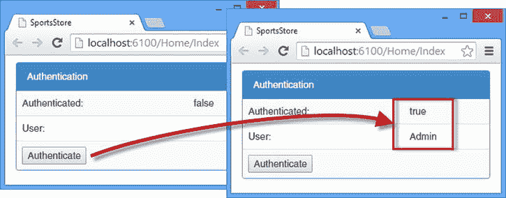

图 7-1。

Testing client authentication

启动应用后的第一个身份验证请求需要几秒钟，因为数据库将被初始化。这意味着用户名将立即显示，因为它是在客户端本地设置的，但`Authenticated`状态暂时不会变为`true`。要获得更真实的结果，请在浏览器中重新加载网页，然后再次点按“认证”按钮。

Note

在浏览器中重新加载网页意味着客户端丢失了授权请求所需的身份验证令牌。这是使用`Authorization`头的一个副作用，它使构建和测试客户端代码变得更容易，但是需要在每次加载页面时进行身份验证。

### 定义产品控制器

下一步是创建客户端代码，该代码将发送 Ajax 请求来获取和操作产品。清单 7-9 显示了我添加到`Scripts`文件夹中的`storeProductsController.js`文件的内容。

清单 7-9。storeProductsController.js 文件的内容

`var productUrl = "/api/products/";`

`var getProducts = function () {`

`sendRequest(productUrl, "GET", null, function (data) {`

`model.products.removeAll();`

`model.products.push.apply(model.products, data);`

`})`

`};`

`var deleteProduct = function (id) {`

`sendRequest(productUrl + id, "DELETE", null, function () {`

`model.products.remove(function (item) {`

`return item.Id == id;`

`})`

`});`

`}`

`var saveProduct = function (product, successCallback) {`

`sendRequest(productUrl, "POST", product, function () {`

`getProducts();`

`if (successCallback) {`

`successCallback();`

`}`

`});`

`}`

代码由三个函数组成，`getProducts`、`deleteProduct`和`saveProduct`，每个函数向服务器端的`Products`控制器发送一个 Ajax 调用对应的调用。请注意，这些函数的存在仅仅是为了将服务器端数据映射到客户端模型以及从客户端模型映射数据。

#### 测试产品控制器

为了测试客户端产品代码，我向`Index.cshtml`文件添加了一些额外的 HTML 和 JavaScript。除了添加调用清单 7-9 中定义的函数的代码之外，我还添加了对 Ajax 请求失败时显示 HTTP 错误消息细节的支持，如清单 7-10 所示。

清单 7-10。向 Index.cshtml 文件添加标记和 JavaScript

``

`
`

`
`

`
`

`
Authentication
`

`<table class="table table-striped">`

`<tr><td>Authenticated:</td><td data-bind="text: model.authenticated()"></td></tr>`

`<tr><td>User:</td><td data-bind="text: model.username()"></td></tr>`

`<tr><td colspan="2"><button`

`data-bind="click: testAuth">Authenticate</button></td></tr>`

`</table>`

`
`

`
`

`
Product Controller Functions
`

`<table class="table table-striped">`

`<tr>`

`<td><button data-bind="click: getProducts">Get Products</button></td>`

`<td><button data-bind="click: testDeleteProduct">Delete Product</button></td>`

`<td><button data-bind="click: testChangeProduct">Change Product</button></td>`

`</tr>`

`</table>`

`
`

Tip

您不应该向真实用户显示 HTTP 消息，但是因为这是一本关于 web 服务的书，所以我将显示底层消息。

我在视图中添加了三个带有剔除数据绑定的按钮。单击 Get Products 按钮会调用`getProducts`控制器函数，但是 Delete Product 和 Change Product 按钮会调用在`script`元素中定义的函数，这样我就可以控制传递给相应控制器函数的参数。

要测试新功能，启动应用并使用浏览器导航到`/Home/Index` URL。JavaScript 代码的调试输出将被写入 JavaScript 控制台，因此您需要打开浏览器 F12 工具来查看消息。

单击 Get Products 按钮，您将看到一条 JavaScript 控制台消息，其中列出了数据库中包含的`Product`对象，格式为 JSON，如下所示:

`---Begin Success--- storeModel.js:16`

`[{"Id":1,"Name":"Kayak","Description":"A boat for one person","Price":275,`

`"Category":"Watersports"},`

`{"Id":2,"Name":"Lifejacket","Description":"Protective and fashionable",`

`"Price":48.95,"Category":"Watersports"},`

`{"Id":3,"Name":"Soccer Ball","Description":"FIFA-approved size and weight",`

`"Price":19.5,"Category":"Soccer"},`

`{"Id":4,"Name":"Corner Flags",`

`"Description":"Give your playing field a professional touch",`

`"Price":34.95,"Category":"Soccer"},`

`{"Id":5,"Name":"Stadium",`

`"Description":"Flat-packed 35,000-seat stadium",`

`"Price":79500,"Category":"Soccer"},`

`{"Id":6,"Name":"Thinking Cap",`

`"Description":"Improve your brain efficiency by 75%",`

`"Price":16,"Category":"Chess"},`

`{"Id":7,"Name":"Unsteady Chair",`

`"Description":"Secretly give your opponent a disadvantage",`

`"Price":29.95,"Category":"Chess"},`

`{"Id":8,"Name":"Human Chess Board",`

`"Description":"A fun game for the family",`

`"Price":75,"Category":"Chess"},`

`{"Id":9,"Name":"Bling-Bling King",`

`"Description":"Gold-plated, diamond-studded King",`

`"Price":1200,"Category":"Chess"}]`

`---End Success---`

这是您从第 5 章开始看到的同一产品列表，需要注意的关键点是，我在数据库 seed 类中定义的所有产品都存在。

接下来，单击删除产品按钮。该按钮发送一个请求，该请求针对一个动作方法，该方法在[第 6 章](06.html)中应用了`Authorize`属性。因此，返回 401(未授权)响应。这触发了我的错误处理代码，显示了我添加到`Index.cshtml`文件中的错误元素，如图 [7-2](#Fig2) 所示。

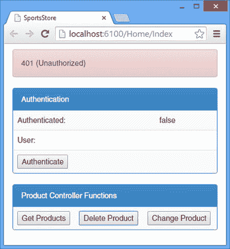

图 7-2。

Displaying an HTTP error

点击认证按钮，一旦认证状态显示为`true`，再次点击删除产品按钮。JavaScript 控制台将显示以下消息:

`Success (no data)`

要查看操作的效果，点击获取产品按钮并查看所描述的对象的`Id`编号，如下所示:

`---Begin Success---`

`[` `{"Id":1,"Name":"Kayak","Description":"A boat..."},`

`{"Id":3,"Name":"Soccer Ball","Description":"FIFA-approved..."},`

`{"Id":4,"Name":"Corner Flags","Description":"Give your ..."},`

`{"Id":5,"Name":"Stadium","Description":"Flat-packed..."},`

`{"Id":6,"Name":"Thinking Cap","Description":"Improve ..."},`

`{"Id":7,"Name":"Unsteady Chair","Description":"Secretly..."},`

`{"Id":8,"Name":"Human Chess Board","Description":"A fun..."},`

`{"Id":9,"Name":"Bling-Bling King","Description":"Gold-plated…"}]`

`---End Success---`

如突出显示的语句所示，具有`2`的`Id`值的`Product`已被移除。

最后一项测试是单击“更改产品”按钮。客户端控制器函数在完成时重新加载产品数据，您将看到作为索引`2`的产品的`Price`属性(如果您跟踪并删除了一个产品，它将是角标志)将增加 10 美元。

### 定义订单控制器

最终控制者将提供对订单的访问。我在`Scripts`文件夹中添加了一个名为`storeOrdersController.js`的文件，并用它来定义清单 7-11 所示的函数。

清单 7-11。storeOrdersController.js 文件的内容

`var ordersUrl = "/nonrest/orders";`

`var ordersListUrl = ordersUrl + "/list";`

`var ordersCreateUrl = ordersUrl + "/createorder/";`

`var ordersDeleteUrl = ordersUrl + "/deleteorder/";`

`var getOrders = function () {`

`sendRequest(ordersListUrl, "GET", null, function (data) {`

`model.orders.removeAll();`

`model.orders.push.apply(model.orders, data);`

`});`

`}`

`var saveOrder = function (order, successCallback) {`

`sendRequest(ordersCreateUrl, "POST", order, function () {`

`if (successCallback) {`

`successCallback();`

`}`

`});`

`}`

`var deleteOrder = function (id) {`

`sendRequest(ordersDeleteUrl + id, "DELETE", null, function () {`

`model.orders.remove(function (item) {`

`return item.Id == id;`

`})`

`});`

`}`

`getOrders`、`saveOrder`和`deleteOrder`函数以它们的服务器端对应函数为目标。用于`Orders`对象的服务器端 Web API 控制器是非 RESTful 的，这就是为什么我必须为每个不同的操作定义 URL。

#### 测试订单控制器

遵循与其他客户端控制器相同的方法，我在`Index.cshtml`文件中添加了一些新的 HTML 和 JavaScript 代码，如清单 7-12 所示。

清单 7-12。在 Index.cshtml 文件中添加对测试订单的支持

``

`
`

`
`

`
`

`
Authentication
`

`<table class="table table-striped">`

`<tr><td>Authenticated:</td><td data-bind="text: model.authenticated()"></td></tr>`

`<tr><td>User:</td><td data-bind="text: model.username()"></td></tr>`

`<tr><td colspan="2"><button`

`data-bind="click: testAuth">Authenticate</button></td></tr>`

`</table>`

`
`

`
`

`
Product Controller Functions
`

`<table class="table table-striped">`

`<tr>`

`<td><button data-bind="click: getProducts">Get Products</button></td>`

`<td><button data-bind="click: testDeleteProduct">Delete Product</button></td>`

`<td><button data-bind="click: testChangeProduct">Change Product</button></td>`

`</tr>`

`</table>`

`
`

`
`

`
Order Controller Functions
`

`<table class="table table-striped">`

`<tr>`

`<td><button data-bind="click: getOrders">Get Orders</button></td>`

`<td><button data-bind="click: testDeleteOrder">Delete Order</button></td>`

`<td><button data-bind="click: testSaveOrder">Save Order</button></td>`

`</tr>`

`</table>`

`
`

有三个与订单相关的按钮。Get Orders 按钮直接调用控制器`getOrders`函数，Delete Order 和 Save Order 按钮调用我添加到本地`script`元素的函数。图 [7-3](#Fig3) 显示了增加的内容。

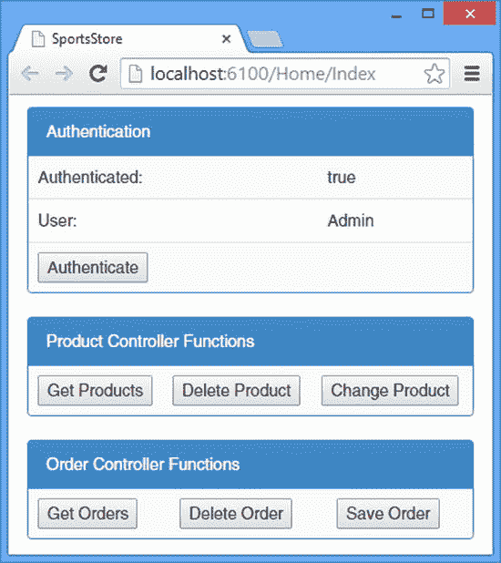

图 7-3。

Adding order test support

“获取订单”和“删除订单”按钮所针对的操作方法需要身份验证，因此请单击“身份验证”按钮，等待身份验证状态发生变化。单击 Get Orders 按钮，JavaScript 控制台将显示从 web 服务获得的订单列表。单击删除订单以移除其中一个订单，然后再次单击获取订单以查看效果。最后，单击 Save Order 向存储库添加新订单。

## 创建客户客户端

现在我已经有了客户端控制器和 Ajax 函数的坚实基础，我可以开始构建将 SportsStore 应用呈现给客户端的客户端了。在接下来的小节中，我将创建允许用户选择和订购产品所需的 JavaScript 代码和 MVC 框架视图。

Note

我不打算添加我在 Pro ASP.NET MVC 5 中创建的版本中的所有 SportsStore 功能，因为我想演示如何使用我在第 6 章中创建的 Web API web 服务，而不用花费太多时间来处理客户端应用的装配和完成。主要特性都存在，但是我省略了与 web 服务没有直接关系的次要特性，比如对产品列表进行分页、执行客户端验证以及显示有用的错误消息——所有这些都不需要与 web 服务进行交互。

### 创建客户模型

我已经创建了一个单独的模型，它只包含管理客户客户机所需的数据和状态，这允许我将它与包含原始产品数据的公共模型分开。清单 7-13 显示了我添加到`Scripts`文件夹中的`storeCustomerModel.js`文件的内容。

清单 7-13。storeCustomerModel.js 文件的内容

`var customerModel = {`

`productCategories: ko.observableArray([]),`

`filteredProducts: ko.observableArray([]),`

`selectedCategory: ko.observable(null),`

`cart: ko.observableArray([]),`

`cartTotal: ko.observable(0),`

`cartCount: ko.observable(0),`

`currentView: ko.observable("list")`

`}`

我定义的所有模型属性都是可观察的，您将看到我依赖于 Knockout 提供的自动更新来保持客户端界面与底层数据同步。为了帮助您跟踪定制客户端中发生的事情，表 [7-3](#Tab3) 描述了每个模型属性的用途。

表 7-3。

The Customer Client Model Properties

<colgroup><col> <col></colgroup> 
| 名字 | 描述 |
| --- | --- |
| `productCategories` | 这个属性是一个产品类别名称的数组，我用它来允许客户过滤产品，以便只显示给定类别中的产品。 |
| `filteredProducts` | 此属性包含属于当前选定类别的产品集。 |
| `selectedCategory` | 该属性指定当前选择的类别，用于过滤通过`filteredProducts`属性显示给客户的产品。 |
| `cart` | 该属性表示客户的购物车，包含他们选择的产品的详细信息以及每种产品的数量。 |
| `cartTotal` | 该属性指定购物车中产品的总价值。 |
| `cartCount` | 该属性指定购物车中产品的数量。 |
| `currentView` | 此属性指定应显示自定义的哪个视图。 |

### 创建客户控制器

我在`Scripts`文件夹中添加了一个名为`storeCustomerController.js`的文件，并使用它来定义支持视图的函数，这些视图向客户展示了应用模型上的功能和操作——包括通用模型和特定于客户的模型。清单 7-14 显示了我定义的函数。这是一个很长的文件，大部分代码负责对代表 SportsStore 产品的公共模型对象进行排序和过滤，以便将它们呈现给用户。

清单 7-14。storeCustomerController.js 文件的内容

`var setCategory = function (category) {`

`customerModel.selectedCategory(category);`

`filterProductsByCategory();`

`}`

`var setView = function (view) {`

`customerModel.currentView(view);`

`}`

`var addToCart = function (product) {`

`var found = false;`

`var cart = customerModel.cart();`

`for (var i = 0; i < cart.length; i++) {`

`if (cart[i].product.Id == product.Id) {`

`found = true;`

`count = cart[i].count + 1;`

`customerModel.cart.splice(i, 1);`

`customerModel.cart.push({`

`count: count,`

`product: product`

`});`

`break;`

`}`

`}`

`if (!found) {`

`customerModel.cart.push({ count: 1, product: product });`

`}`

`setView("cart");`

`}`

`var removeFromCart = function (productSelection) {`

`customerModel.cart.remove(productSelection);`

`}`

`var placeOrder = function () {`

`var order = {`

`Customer: model.username(),`

`Lines: customerModel.cart().map(function (item) {`

`return {`

`Count: item.count,`

`ProductId: item.product.Id`

`}`

`})`

`};`

`saveOrder(order, function () {`

`setView("thankyou");`

`});`

`}`

`model.products.subscribe(function (newProducts) {`

`filterProductsByCategory();`

`customerModel.productCategories.removeAll();`

`customerModel.productCategories.push.apply(customerModel.productCategories,`

`model.products().map(function (p) {`

`return p.Category;`

`})`

`.filter(function (value, index, self) {`

`return self.indexOf(value) === index;`

`}).sort());`

`});`

`customerModel.cart.subscribe(function (newCart) {`

`customerModel.cartTotal(newCart.reduce(`

`function (prev, item) {`

`return prev + (item.count * item.product.Price);`

`}, 0));`

`customerModel.cartCount(newCart.reduce(`

`function (prev, item) {`

`return prev + item.count;`

`}, 0));`

`});`

`var filterProductsByCategory = function () {`

`var category = customerModel.selectedCategory();`

`customerModel.filteredProducts.removeAll();`

`customerModel.filteredProducts.push.apply(customerModel.filteredProducts,`

`model.products().filter(function (p) {`

`return category == null || p.Category == category;`

`}));`

`}`

`$(document).ready(function () {`

`getProducts();`

`})`

并非所有的代码都由视图调用的函数组成；我还使用了 Knockout subscribe 函数来定义当可观察数据项发生变化时自动调用的函数，如下所示:

`...`

`model.products.``subscribe`T2】

`filterProductsByCategory();`

`customerModel.productCategories.removeAll();`

`customerModel.productCategories.push.apply(customerModel.productCategories,`

`model.products().map(function (p) {`

`return p.Category;`

`})`

`.filter(function (value, index, self) {`

`return self.indexOf(value) === index;`

`}).sort());`

`});`

`...`

这个片段注册了一个函数，当`model.products`数组改变时调用这个函数。该函数筛选产品，以便只显示用户正在查看的类别中的产品。它还生成产品类别集，这是允许用户执行过滤的内容。其效果是，`model.products`数组的变化会自动更新`customer`模型，这反过来会导致我将在视图中应用的剔除数据绑定也进行更新。

控制器使用 jQuery `ready`函数，我在第 2 章的[中描述过，在浏览器加载并处理 HTML 和 JavaScript 文件后加载产品数据，如下所示:](02.html)

`...`

`$(document).ready(function () {`

`getProducts();`

`})`

`...`

这意味着在`getProduct`函数发送的 Ajax 请求完成之前没有可用的数据。

### 创建视图

我现在需要创建视图来使用模型中的数据，并使用控制器函数来响应用户输入。这与本书的 Web API 主题有所不同，所以我将简单描述一下文件的内容。在接下来的部分中，我将创建一系列完全使用标准 Razor 特性的 MVC 框架视图，以便组成一个能够动态响应用户输入和数据变化的 HTML 文档。

#### 创建占位符

我将使用一组 MVC 框架局部视图来将内容分成更易管理的块。我希望能够演示不同的特性是如何组合在一起的，所以我首先创建了一组占位符视图文件，一旦应用的结构组合在一起，我将修改这些文件。表 [7-4](#Tab4) 列出了我在`Views/Home`文件夹中创建的所有文件名，并描述了它们在应用中的用途。

表 7-4。

The Placeholder View Files for the Customer Client

<colgroup><col> <col></colgroup> 
| 名字 | 描述 |
| --- | --- |
| `ProductList.cshtml` | 该视图用于向客户展示可以按类别过滤的产品列表。 |
| `ProductCart.cshtml` | 该视图用于向用户展示他们所选产品的摘要。 |
| `Checkout.cshtml` | 该视图用于向客户展示(简单的)结账过程。 |
| `CartWidget.cshtml` | 该视图用于在 SportsStore 标题中插入购物车的简短摘要。 |
| `ThankYou.cshtml` | 该视图在用户完成订单后显示给用户。 |

清单 7-15 显示了`ProductList.cshtml`文件的初始内容。

清单 7-15。ProductList.cshtml 文件的内容

`ProductList View`

清单 7-16 显示了`ProductCart.cshtml`文件的初始内容。

清单 7-16。ProductCart.cshtml 文件的内容

`ProductCart View`

清单 7-17 显示了`Checkout.cshtml`文件的内容。

清单 7-17。Checkout.cshtml 文件的内容

`Checkout View`

清单 7-18 显示了`CartWidget.cshtml`文件的内容。这个占位符需要应用一些引导样式，因为它将显示在页面顶部的横幅中，没有它们就看不见。

清单 7-18。CartWidget.cshtml 文件的内容

`
`

`CartWidget View`

`
`

`ThankYou.cshtml`文件非常简单，不需要占位符，清单 7-19 显示了文件的最终内容。

清单 7-19。ThankYou.cshtml 文件的内容

`<h2>Thanks!</h2>`

`Thanks for placing your order. We'll ship your goods as soon as possible.`

除了`ThankYou.cshtml`文件之外，我将修改内容，并向您展示添加每个特性的效果。

#### 创建索引视图

`Views/Home/Index.cshtml`文件是客户的顶层视图。在本章的前面，我使用了这个视图来测试普通的 JavaScript 代码，但是在清单 7-20 中，你可以看到我是如何改变内容来提供一个框架，在这个框架中可以添加内容，这样就可以显示给用户了。

清单 7-20。Index.cshtml 文件的内容

`@section Scripts {`

``

``

`}`

`
`

`<a class="navbar-brand" href="#">SPORTS STORE</a>`

`@Html.Partial("CartWidget");`

`
`

`
`

`<button class="btn btn-block btn-default btn-lg"`

`data-bind="click: setCategory.bind(null)">`

`Home`

`</button>`

`
`

`<button class="btn btn-block btn-default btn-lg"`

`data-bind="click: setCategory.bind($data), text: $data,`

`css: {'btn-primary': $data ==`

`customerModel.selectedCategory()}"></button>`

`
`

`
`

`
`

`
`

`
`

`
`

`@Html.Partial("ProductList")`

`
`

`
`

`@Html.Partial("ProductCart")`

`
`

`
`

`@Html.Partial("Checkout")`

`
`

`
`

`@Html.Partial("ThankYou")`

`
`

`
`

我为客户模型和控制器文件添加了`script`元素，并在页面上定义了一个标识应用的横幅。此外，我还定义了一组类别按钮(根据客户控制器生成的类别填充)、一个显示任何错误的警告框和主内容区域，该区域使用淘汰绑定来确定向客户端显示哪个 Razor 局部视图。

您可以通过启动应用并使用浏览器导航到`/Home/Index` URL 来查看布局的初始结构。如图 [7-4](#Fig4) 所示，存储库中每个产品类别都有按钮，并且`CartWidget`和`ProductList`视图的占位符可见。

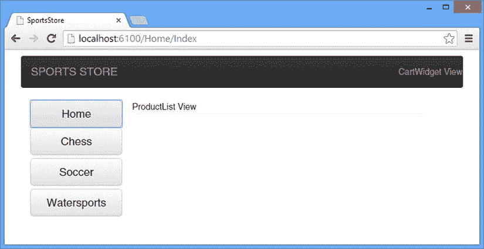

图 7-4。

The initial structure of the customer client

#### 创建产品列表视图

呈现给客户的最重要的内容是他们可以添加到购物篮中的产品列表，这是`ProductList`视图的工作。清单 7-21 显示了我添加到视图中描述每个产品的标记。

清单 7-21。向 ProductList.cshtml 文件添加标记

`
`

`
`

`<h3>`

`<strong data-bind="text: $data.Name"></strong>`

``

`</h3>`

``

`
`

`<button class="btn btn-success"`

`data-bind="click: addToCart">Add to Cart</button>`

`
`

`
`

`
`

我使用一个 Knockout `foreach`绑定来为当前所选类别中的每个产品生成一个`div`元素。每个产品都显示有其名称、描述和价格，以及一个添加到购物车按钮，该按钮调用客户控制器中的`addToCart`功能，将产品的详细信息添加到客户的购物车中。图 [7-5](#Fig5) 显示了清单变更的效果。

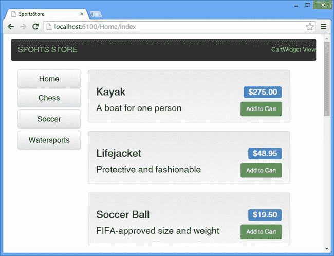

图 7-5。

Adding details of the products

您可以通过单击其中一个类别按钮来筛选列表中显示的产品；您可以通过单击主页按钮再次显示所有产品。

#### 创建购物车视图

当客户点击 Add to Cart 按钮时，会显示`ProductCart`视图来汇总所选产品及其成本。清单 7-22 显示了我对`ProductCart.cshtml`文件所做的修改，以显示这些信息。

清单 7-22。在 ProductCart.cshtml 文件中显示产品选择

`<h2>Your Cart</h2>`

`
`

`<table class="table">`

`<thead>`

`<tr>`

`<th>Quantity</th><th>Item</th>`

`<th>Price</th><th class="text-right">Subtotal</th>`

`<td></td>`

`</tr>`

`</thead>`

`<tbody data-bind="foreach: customerModel.cart()">`

`<tr>`

`<td data-bind="text: $data.count"></td>`

`<td data-bind="text: $data.product.Name"></td>`

`<td data-bind="text: '$' + $data.product.Price.toFixed(2)"></td>`

`<td class="text-right"`

`data-bind="text: '$'`

`+ ($data.count * $data.product.Price).toFixed(2)"></td>`

`<td><button class="btn btn-xs btn-danger"`

`data-bind="click: removeFromCart.bind($data)">Remove</button></td>`

`</tr>`

`</tbody>`

`<tfoot>`

`<tr>`

`<td colspan="2"></td><td>Total:</td>`

`<th class="text-right"`

`data-bind="text: '$' + customerModel.cartTotal().toFixed(2)"></th>`

`</tr>`

`</tfoot>`

`</table>`

`
`

`
`

`<button class="btn btn-primary"`

`data-bind="click: setView.bind($data, 'list')">Continue Shopping</button>`

`<button class="btn btn-primary"`

`data-bind="click: setView.bind($data, 'checkout'),`

`enable: customerModel.cartCount() > 0">Check Out</button>`

`
`

该视图的主要部分是一个列出所选产品的表格，还有一些按钮使用 Knockout `click`绑定将客户返回到产品列表并进入结账阶段。图 [7-6](#Fig6) 显示了选择一些产品后的购物车。

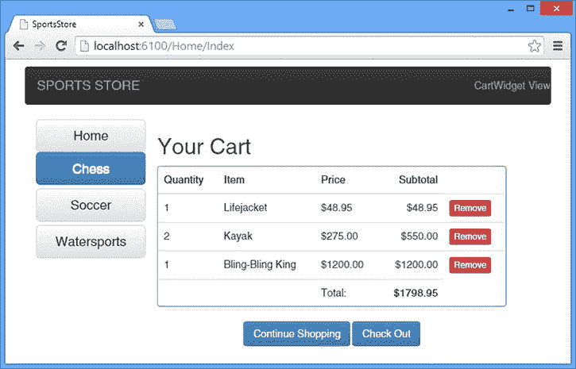

图 7-6。

Displaying a summary of the cart Tip

我没有支持改变购物车中产品的数量，但是您可以返回到产品列表并重复选择一个产品来增加数量。

#### 创建购物车小部件

`CartWidget`视图负责在页面顶部显示客户产品选择的摘要，以及一个开始结帐过程的按钮。清单 7-23 显示了我为了定义这个功能而对`CartWidget.cshtml`文件所做的修改。

清单 7-23。在 CartWidget.cshtml 文件中显示购物车的摘要

`
`

`<button class="btn btn-default btn-xs navbar-btn"`

`data-bind="click: setView.bind($data, 'checkout'),`

`enable: customerModel.cartCount() > 0">`

`Checkout`

`</button>`

`
`

`
`

`<b>Your cart:</b>`

` item(s),`

``

`
`

该视图显示来自模型的数据值，并提供一个移动到 checkout 视图的按钮。如果购物车中没有商品，该按钮将被禁用。图 [7-7](#Fig7) 显示了购物车小部件。

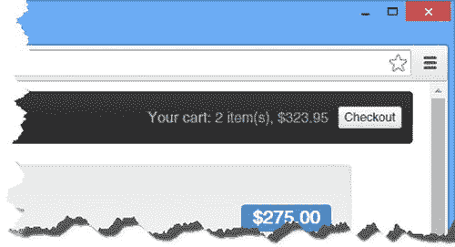

图 7-7。

Summarizing the cart

#### 创建签出视图

要创建的最后一个视图是让客户结帐并下订单的视图。清单 7-24 显示了我对`Checkout.cshtml`文件所做的修改。

清单 7-24。在 Checkout.cshtml 文件中下订单

`<h2>Your Order</h2>`

`
`

`<label>Enter your name</label>`

`<input class="form-control" data-bind="value: model.username" />`

`
`

`
`

`<table class="table">`

`<thead>`

`<tr>`

`<th>Quantity</th>`

`<th>Item</th>`

`<th>Price</th>`

`<th class="text-right">Subtotal</th>`

`</tr>`

`</thead>`

`<tbody data-bind="foreach: customerModel.cart()">`

`<tr>`

`<td data-bind="text: $data.count"></td>`

`<td data-bind="text: $data.product.Name"></td>`

`<td data-bind="text: '$' + $data.product.Price.toFixed(2)"></td>`

`<td class="text-right"`

`data-bind="text: '$'`

`+ ($data.count * $data.product.Price).toFixed(2)">`

`</td>`

`</tr>`

`</tbody>`

`<tfoot>`

`<tr>`

`<td colspan="2"></td>`

`<td>Total:</td>`

`<th class="text-right"`

`data-bind="text: '$' + customerModel.cartTotal().toFixed(2)"></th>`

`</tr>`

`</tfoot>`

`</table>`

`
`

`
`

`<button class="btn btn-primary"`

`data-bind="click: setView.bind($data, 'list')">Cancel</button>`

`<button class="btn btn-danger"`

`data-bind="click: placeOrder.bind($data)">Place Order</button>`

`
`

我只需要客户的名字和他们的产品列表就可以向 web 服务发送订单，因为我在[第 5 章](05.html)中定义了一个简单的`Order`模型类。在这个视图中，我显示了一个`input`元素来收集名称并显示购物车的摘要，如图 [7-8](#Fig8) 所示。

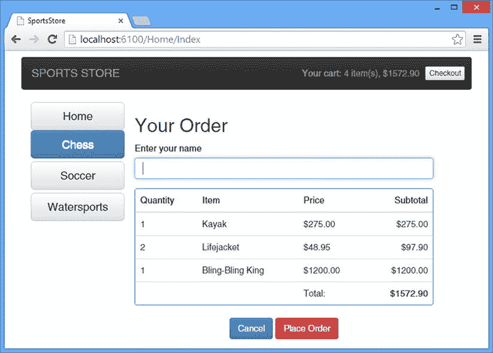

图 7-8。

Checking out

如果您在没有输入姓名的情况下点击 Place Order 按钮，您将会看到基本的错误处理，如图 [7-9](#Fig9) 所示。对于大多数应用的用户来说，这不是一个有用的信息，但是对于本书来说，它展示了 web 服务响应请求的方式。

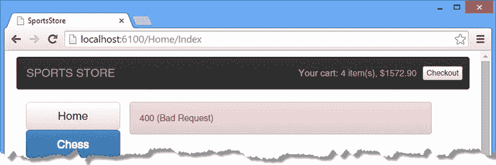

图 7-9。

The result of server-side validation error

web 服务发送了 400(错误请求)响应，因为我发送给 web 服务的数据没有通过对`Order`对象的验证测试。如果您使用浏览器 F12 工具来检查响应，您将看到它包括以下数据:

`{"Message":"The request is invalid.",`

`"ModelState": {`

`"order.Customer":["The Customer field is required."]`

`}`

`}`

我在第 18 章的[中解释了模型验证过程是如何工作的，在第 2 章](18.html) 5 的[中解释了如何控制错误响应中发送的数据。如果您愿意，可以使用响应中的数据向用户呈现更有意义的消息，或者更好的方法是应用客户端验证，以确保除非数据有效，否则不会发送请求。客户端验证不能替代 web 服务中的验证，但是两者一起使用可以帮助改善用户体验，并减少 web 服务必须处理的错误请求的数量。](02.html)

Tip

[`https://github.com/Knockout-Contrib/Knockout-Validation`](https://github.com/Knockout-Contrib/Knockout-Validation) 有淘汰赛的客户端验证库，我描述的是 Pro ASP.NET MVC 5 中内置的 MVC 框架客户端验证，也是 Apress 发布的。

如果在`input`元素中输入一个名字，再次点击 Place Order 按钮，发送到 web 服务的数据将通过验证，并显示`ThankYou.cshtml`视图，如图 [7-10](#Fig10) 所示。

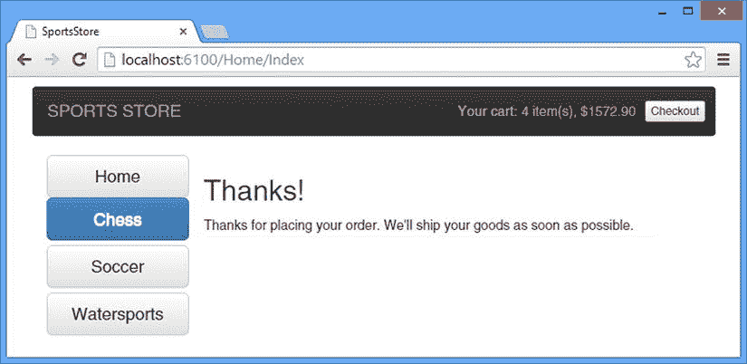

图 7-10。

Successfully placing an order

## 创建管理客户机

管理客户端比客户所需的客户端简单。我在本章开始时创建的通用代码的基础上，对用户进行身份验证，并为查看、创建和删除产品以及查看和删除订单提供支持。在接下来的小节中，我将使用与客户客户机相同的方法来创建管理客户机所需的模型、控制器和视图。

Tip

我不打算为这个客户机的视图创建占位符，这意味着在您到达“测试管理客户机”部分之前，管理客户机不会工作。

### 创建管理模型

管理客户机不需要按类别过滤数据，这意味着它可以直接处理通用模型中的数据。结果是管理客户机模型小而简单。清单 7-25 显示了我添加到`Scripts`文件夹中的`storeAdminModel.js`文件的内容。

清单 7-25。storeAdminModel.js 文件的内容

`var adminModel = {`

`currentView: ko.observable("signin"),`

`listMode: ko.observable("products"),`

`newProduct: { name: ""}`

`}`

`currentView`属性用于控制向用户显示的顶层内容，该内容将在登录屏幕和管理显示之间切换。用户可以看到存储库中的产品或订单，这个选择是使用`listMode`属性存储的。`newProduct`属性是我收集用户想要添加到存储库中的新产品的详细信息的地方。

Tip

我不必为`newProduct`对象定义属性，因为它们将由我在定义视图时附加到`input`元素的挖空绑定来设置。但是，我添加了一个属性——`name`——这样 jQuery 将总是把请求数据作为 POST 请求的一部分发送给服务器，即使用户没有在`input`元素中输入任何数据就提交了产品。

### 创建管理控制器

管理客户端需要一些函数来管理其视图，并充当可用于挖空绑定的数据和通用控制器函数所需数据之间的中介。(例如，`removeProduct`函数将通过挖空传递一个完整的产品对象，但是下面的`deleteProduct`函数对`Id`属性值进行操作。)清单 7-26 显示了我添加到`Scripts`文件夹中的`storeAdminController.cs`文件的内容。

清单 7-26。storeAdminController.cs 文件的内容

`var setView = function (view) {`

`adminModel.currentView(view);`

`}`

`var setListMode = function (mode) {`

`console.log("Mode: " + mode);`

`adminModel.listMode(mode);`

`}`

`var authenticateUser = function() {`

`authenticate(function () {`

`setView("productList");`

`getProducts();`

`getOrders();`

`});`

`}`

`var createProduct = function () {`

`saveProduct(adminModel.newProduct, function () {`

`setListMode("products");`

`})`

`}`

`var removeProduct = function (product) {`

`deleteProduct(product.Id);`

`}`

`var removeOrder = function (order) {`

`deleteOrder(order.Id);`

`}`

### 创建视图

管理客户机只需要四个视图:顶层容器、产品列表、订单列表和创建新产品所需的一组输入元素。在接下来的小节中，我将向您展示我是如何定义它们的。

#### 定义 MVC 控制器和顶层视图

我创建了一个单独的 MVC 框架控制器来交付管理客户机。清单 7-27 显示了我添加到`Controllers`文件夹中的`AdminController.cs`文件的内容。

清单 7-27。AdminController.cs 文件的内容

`using System.Web.Mvc;`

`namespace SportsStore.Controllers {`

`public class AdminController : Controller {`

`public ActionResult Index() {`

`return View();`

`}`

`}`

`}`

控制器包含一个`Index`动作方法，该方法将呈现我在`Views/Admin`文件夹中创建的`Index.cshtml`文件。清单 7-28 显示了视图文件的内容。

清单 7-28。Views/Admin/Index.cshtml 文件的内容

`@section Scripts {`

``

``

`}`

`
`

`<a class="navbar-brand" href="#">SPORTS STORE</a>`

`
`

`
`

`
`

`
`

`
`

`
`

`<label>Username</label>`

`<input data-bind="value: model.username" />`

`
`

`
`

`<label>Password</label>`

`<input type="password" data-bind="value: model.password" />`

`
`

`<button class="btn btn-primary"`

`data-bind="click: authenticateUser">Sign In</button>`

`
`

`
`

`
`

`<button class="btn btn-block btn-default btn-lg"`

`data-bind="click: setListMode.bind($data, 'products')">`

`Products`

`</button>`

`<button class="btn btn-block btn-default btn-lg"`

`data-bind="click: setListMode.bind($data, 'orders')">`

`Orders`

`</button>`

`
`

`
`

`@Html.Partial("AdminProductList")`

`
`

`
`

`@Html.Partial("AdminProductAdd")`

`
`

`
`

`@Html.Partial("AdminOrderList")`

`
`

`
`

`
`

Tip

这个视图依赖于我用于客户客户机的同一个`_Layout.cshtml`文件。

这类似于我为客户客户机使用的结构，增加了一个嵌入式登录视图，它收集用户的凭证，以便对客户机进行身份验证。

#### 定义产品列表视图

对于管理客户端，我显示了产品列表的简化版本，但是添加了删除单个产品和创建新产品的按钮。清单 7-29 显示了我添加到`Views/Admin`文件夹中的`AdminProductList.cshtml`文件的内容。

清单 7-29。AdminProductList.cshtml 文件的内容

`
`

`<table class="table table-striped">`

`<thead>`

`<tr><th>ID</th><th>Name</th><th>Category</th><th>Price</th><th></th></tr>`

`</thead>`

`<tbody data-bind="foreach: model.products()">`

`<tr>`

`<td data-bind="text: $data.Id"></td>`

`<td data-bind="text: $data.Name"></td>`

`<td data-bind="text: $data.Category"></td>`

`<td data-bind="text: '$' + $data.Price.toFixed(2)"`

`class="text-right"></td>`

`<td>`

`<button class="btn btn-xs btn-danger"`

`data-bind="click: removeProduct">Remove</button>`

`</td>`

`</tr>`

`</tbody>`

`</table>`

`
`

`
`

`<button class="btn btn-primary"`

`data-bind="click: setListMode.bind($data, 'addProduct')">`

`Add Product`

`</button>`

`
`

#### 定义订单列表视图

为了显示订单的细节，我使用了我在编写 web 服务时在[第 5 章](05.html)中创建的相同的表结构。不同之处在于，元素是通过剔除绑定而不是 Razor 生成的。清单 7-30 显示了我添加到`/Views/Admin`文件夹中的`AdminOrderList.cshtml`文件的内容。

清单 7-30。AdminOrderList.cshtml 文件的内容

`
`

`
`

`Orders`

`
`

`<table class="table table-striped">`

`<thead>`

`<tr>`

`<th>ID</th>`

`<th>Customer</th>`

`<th colspan="3"></th>`

`<th>Total Cost</th>`

`<th></th>`

`</tr>`

`</thead>`

`<tbody data-bind="foreach: model.orders()">`

`<tr>`

`<td data-bind="text: $data.Id"></td>`

`<td data-bind="text: $data.Customer"></td>`

`<td colspan="3"></td>`

`<td data-bind="text: '$' + $data.TotalCost.toFixed(2)"></td>`

`<td>`

`<button class="btn btn-xs btn-danger"`

`data-bind="click: removeOrder">Remove</button>`

`</td>`

`</tr>`

`<tr>`

`<th colspan="2"></th>`

`<th>Product</th>`

`<th>Quantity</th>`

`<th>Price</th>`

`<th colspan="2"></th>`

`</tr>`

`<!-- ko foreach: $data.Lines -->`

`<tr>`

`<td colspan="2"></td>`

`<td data-bind="text: $data.Product.Name"></td>`

`<td data-bind="text: $data.Count"></td>`

`<td data-bind="text: '$' + $data.Product.Price.toFixed(2)"></td>`

`<td colspan="2"></td>`

`</tr>`

`<!-- /ko -->`

`</tbody>`

`</table>`

`
`

我使用了 Knockout comment 特性来生成表中的一些行，但是除此之外，这个视图包含了完全标准的 HTML 和 Knockout 数据绑定。

#### 定义创建产品视图

我需要的最终视图允许用户输入新产品的详细信息。清单 7-31 显示了我添加到`View/Admin`文件夹中的`AdminProductAdd.cshtml`文件的内容。

清单 7-31。AdminProductAdd.cshtml 文件的内容

`<h2>Add Product</h2>`

`
`

`<label>Name</label>`

`<input class="form-control" data-bind="value: adminModel.newProduct.name" />`

`
`

`
`

`<label>Description</label>`

`<input class="form-control" data-bind="value: adminModel.newProduct.description" />`

`
`

`
`

`<label>Category</label>`

`<input class="form-control" data-bind="value: adminModel.newProduct.category" />`

`
`

`
`

`<label>Price</label>`

`<input class="form-control" data-bind="value: adminModel.newProduct.price" />`

`
`

`
`

`<button class="btn btn-primary"`

`data-bind="click: setListMode.bind($data, 'products')">Cancel</button>`

`<button class="btn btn-danger" data-bind="click: createProduct">Create</button>`

`
`

这是一组简单的`input`元素，它们使用剔除绑定来设置数据模型中`newProduct`对象的值。有一个`Create`按钮调用`createProduct`函数触发 Ajax 请求，还有一个取消按钮返回产品列表。

对于客户客户机，我没有实现任何客户端验证，因此所有请求都被发送到 web 服务，即使它们包含的数据没有通过验证检查。

### 测试管理客户端

剩下的工作就是测试客户端，这可以通过启动应用并使用浏览器导航到`/Admin/Index` URL 来完成。第一个视图获取身份验证所需的凭证。输入 Admin 作为用户名，secret 作为密码，如图 [7-11](#Fig11) 所示。

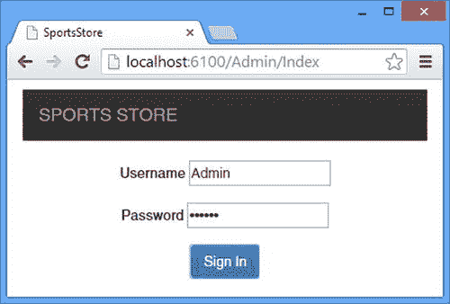

图 7-11。

Providing credentials to the admin client

点击登录按钮对客户端进行认证，会出现产品列表视图，如图 [7-12](#Fig12) 所示。

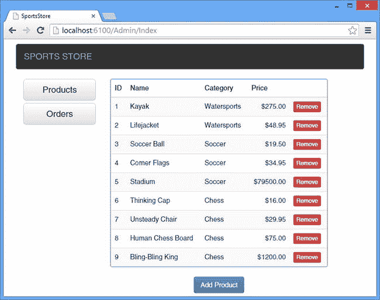

图 7-12。

The admin product list

您可以通过单击“删除”按钮从存储库中删除产品，或者通过单击“添加产品”按钮创建新产品。点击【添加产品】可以输入您想要创建的产品的详细信息，如图 [7-13](#Fig13) 所示。您可以通过单击删除按钮删除单个订单，或者通过单击窗口左侧的产品按钮返回产品列表。

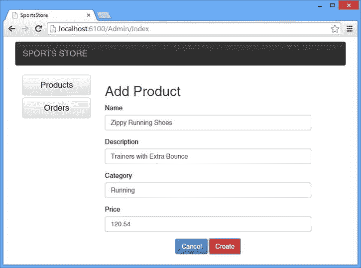

图 7-13。

Creating a new product

单击 Create 按钮将向服务器发送一个 Ajax 请求，然后更新产品数据，确保新产品显示在列表中。单击窗口左侧的 Orders 按钮显示最终视图，其中显示了存储库中的订单列表，如图 [7-14](#Fig14) 所示。

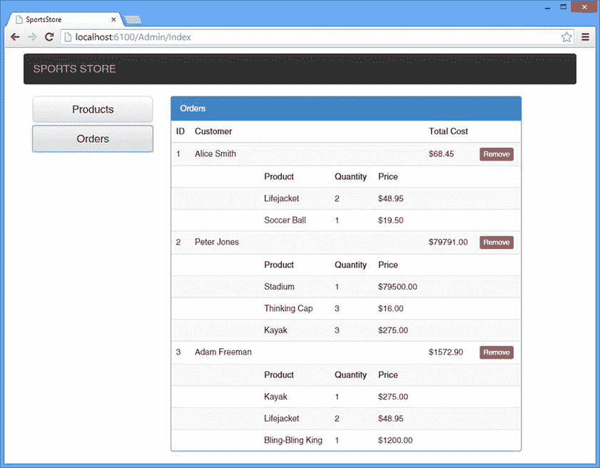

图 7-14。

The admin orders list

## 摘要

在本章中，我通过为客户和管理员创建客户机完成了 SportsStore 应用的开发。按照我在服务器端使用的模型/控制器方法，我构建了一个通用的客户端代码基础。我用这个基础来构建客户机，这些客户机提供与我在第 6 章中创建的 Web API web 服务不同的功能。因为客户端开发——尤其是视图的创建——与 Web API 没有直接关系，所以我没有过多地涉及很多方面，但是您可以看到客户端的整体结构如何在实践中展示单页面应用模型的使用。在下一章，我将向您展示如何将 SportsStore 应用部署到 Microsoft Azure。