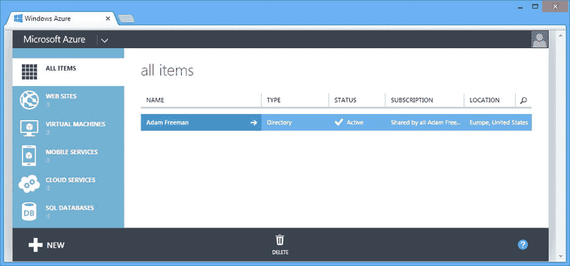
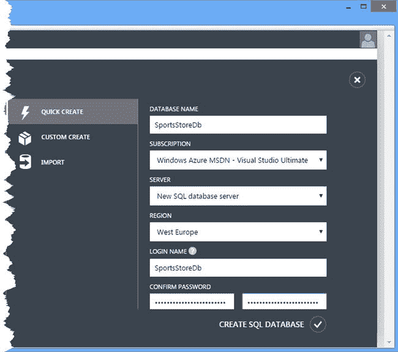
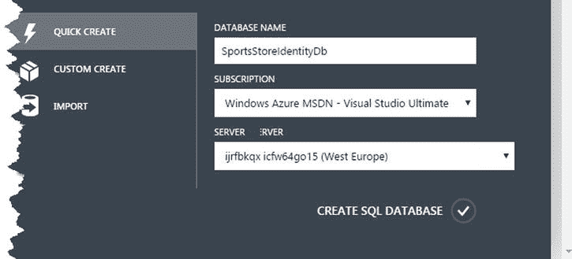
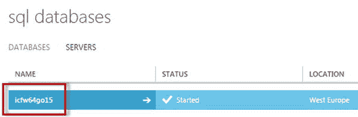
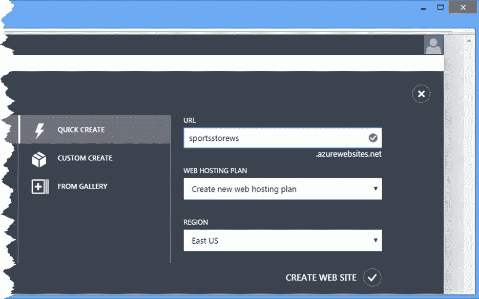
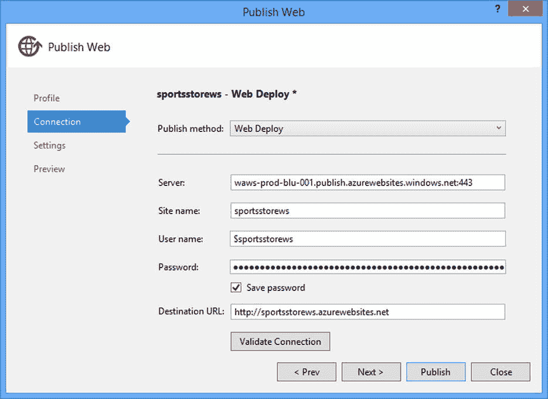
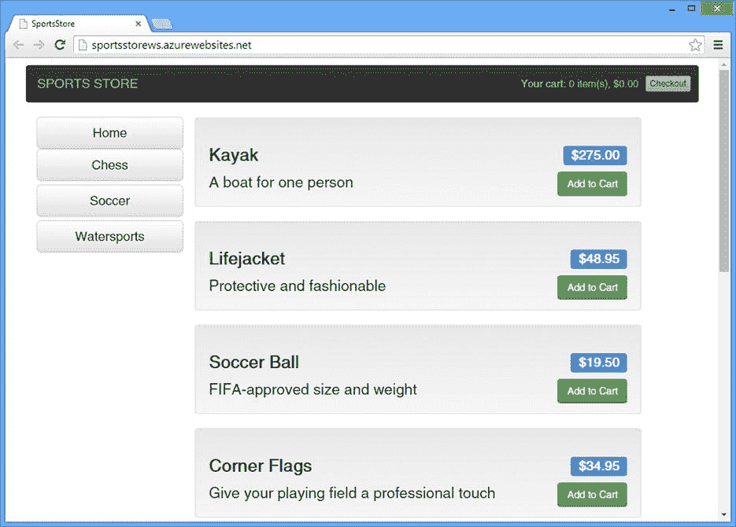

# 八、SportsStore：部署

任何应用生命中最重要的一天是它第一次被部署和使用的那一天。在本章中，我将向您展示如何准备 SportsStore 应用并将其部署到 Microsoft Azure 平台。

Web API 通过对 OWIN 的支持引入了一些新的应用部署模式，我在第 26 章中对此进行了描述。然而，如果你开发了一个包含 MVC 和 Web API 功能的应用——这是 Web API 目前最常见的用法——那么你只能部署到 IIS 或 Azure。我为这一章选择了 Azure，因为它是普遍可用的，并提供免费试用，而不是所有的开发人员都可以访问运行 IIS 的 Windows Server 安装。

Caution

部署一个应用可能会充满问题，在真正使用它之前，用一个测试应用进行实践是有好处的。这并不是说 ASP.NET 部署特性特别危险(它们并不危险)，而是说，任何涉及正在运行的应用与真实用户数据的交互都值得仔细考虑和规划。

## 准备 SportsStore 应用

在部署 SportsStore 应用之前，我需要对项目进行一些更改。在接下来的章节中，我将执行这些更改，并解释它们的意义。

### 防止产品数据库重置

第一个变化是防止每次启动应用时删除并重新创建产品数据库。这是一个非常有用的特性，可以确保您在前面的章节中看到正确的结果，但是在已部署的应用中保留这个特性是非常危险的。清单 8-1 显示了我对数据库初始化器类所做的修改。

清单 8-1。更改 ProductDbInitializer.cs 文件中的基类

`using System.Collections.Generic;`

`using System.Data.Entity;`

`namespace SportsStore.Models {`

`public class ProductDbInitializer : CreateDatabaseIfNotExists<ProductDbContext> {`

`protected override void Seed(ProductDbContext context) {`

`new List<Product> {`

`new Product() { Name = "Kayak", Description = "A boat for one person",`

`Category = "Watersports", Price = 275m },`

`new Product() { Name = "Lifejacket",`

`Description = "Protective and fashionable",`

`Category = "Watersports", Price = 48.95m },`

`new Product() { Name = "Soccer Ball",`

`Description = "FIFA-approved size and weight",`

`Category = "Soccer", Price = 19.50m },`

`new Product() {`

`Name = "Corner Flags",`

`Description = "Give your playing field a professional touch",`

`Category = "Soccer", Price = 34.95m },`

`new Product() { Name = "Stadium",`

`Description = "Flat-packed 35,000-seat stadium",`

`Category = "Soccer", Price = 79500m },`

`new Product() { Name = "Thinking Cap",`

`Description = "Improve your brain efficiency by 75%",`

`Category = "Chess", Price = 16m },`

`new Product() { Name = "Unsteady Chair",`

`Description = "Secretly give your opponent a disadvantage",`

`Category = "Chess", Price = 29.95m },`

`new Product() { Name = "Human Chess Board",`

`Description = "A fun game for the family",`

`Category = "Chess", Price = 75m },`

`new Product() { Name = "Bling-Bling King",`

`Description = "Gold-plated, diamond-studded King",`

`Category = "Chess", Price = 1200m },`

`}.ForEach(product => context.Products.Add(product));`

`context.SaveChanges();`

`new List<Order> {`

`new Order() { Customer = "Alice Smith", TotalCost = 68.45m,`

`Lines = new List<OrderLine> {`

`new OrderLine() { ProductId = 2, Count = 2},`

`new OrderLine() { ProductId = 3, Count = 1},`

`}},`

`new Order() { Customer = "Peter Jones", TotalCost = 79791m,`

`Lines = new List<OrderLine> {`

`new OrderLine() { ProductId = 5, Count = 1},`

`new OrderLine() { ProductId = 6, Count = 3},`

`new OrderLine() { ProductId = 1, Count = 3},`

`}}`

`}.ForEach(order => context.Orders.Add(order));`

`context.SaveChanges();`

`}`

`}`

`}`

我解释了可以在第 5 章中使用的不同基类，应用`CreateDatabaseIfNotExists`确保了在应用第一次启动时创建一个新的数据库，而不是在随后的重启中。

### 添加数据库连接字符串

我需要做的第二个改变有点奇怪。我需要将连接字符串添加到`Web.config`文件中，以便它们可以在发布过程中更新。到目前为止，我还不需要定义连接字符串，因为创建数据库的默认行为是使用 LocalDB 特性，这正是我想要的。默认行为在 Azure 中不起作用，但发布过程不会正常工作，除非有连接字符串供它修改。清单 8-2 显示了我对`Web.config`文件所做的修改。

清单 8-2。向 Web.config 文件添加连接字符串

`...`

`<configuration>`

`<configSections>`

`<section name="entityFramework"`

`type="System.Data.Entity.Internal.ConfigFile.EntityFrameworkSection,`

`EntityFramework, Version=6.0.0.0, Culture=neutral, PublicKeyToken=b77a5c561934e089"`

`requirePermission="false" />`

`</configSections>`

`<connectionStrings>`

`<add name="SportsStoreDb" providerName="System.Data.SqlClient"`

`connectionString="Data Source=(localdb)\v11.0;`

`Initial Catalog=SportsStoreDb;Integrated Security=True;`

`Connect Timeout=15;Encrypt=False;TrustServerCertificate=False" />`

`<add name="SportsStoreIdentityDb" providerName="System.Data.SqlClient"`

`connectionString="Data Source=(localdb)\v11.0;`

`Initial Catalog=SportsStoreIdentityDb;Integrated Security=True;`

`Connect Timeout=15;Encrypt=False;TrustServerCertificate=False" />`

`</connectionStrings>`

`<appSettings>`

`<add key="webpages:Version" value="3.0.0.0" />`

`...`

Caution

`connectionString`属性的值应该在一行上，不要像清单中所示的那样换行。我不得不把绳子弄断，以便放在纸上。

这些连接字符串没有任何作用，除了给发布过程它需要的东西，用我在上一节中创建的 Azure 数据库的细节来替换它们。

## 准备 Azure

在使用 Azure 之前，您必须创建一个帐户，这可以通过前往 [`http://azure.microsoft.com`](http://azure.microsoft.com/) 来完成。在撰写本文时，微软正在提供免费试用账户，大多数 MSDN 软件包都包含 Azure 服务。创建帐户后，您可以通过前往 [`http://manage.windowsazure.com`](http://manage.windowsazure.com/) 提供凭据来管理您的 Azure 服务。当您开始时，您将看到如图 [8-1](#Fig1) 所示的汇总视图。

图 8-1。

The Azure portal

### 创建数据库

第一步是创建用于存储产品和 ASP.NET 身份数据的数据库。在接下来的小节中，我将创建数据库并获取配置应用所需的信息。

#### 创建产品数据库

单击窗口底部的大加号(+)，然后选择数据服务➤ SQL 数据库➤快速创建。使用表 [8-1](#Tab1) 中的值填充输入元素。

表 8-1。

Creating the Azure Product Database

<colgroup><col> <col></colgroup> 
| 田 | 描述 |
| --- | --- |
| 数据库名称 | 输入 SportsStoreDb。 |
| 签署 | 保持原样。 |
| 计算机网络服务器 | 保留为新的 SQL 数据库服务器。 |
| 地区 | 选择要部署到的区域。我住在伦敦，所以我选择了西欧地区。 |
| 登录名 | 输入一个易于记忆的帐户名，应用将使用该帐户名连接到数据库。我选择了 SportsStoreDb。 |
| 密码 | 选择一个安全且容易记忆的密码。我选择了 SuperSecurePassword100。 |

配置完数据库后，屏幕应类似于图 [8-2](#Fig2) 。

图 8-2。

Configuring the Azure product database

单击“创建 SQL 数据库”按钮创建数据库。

#### 创建身份数据库

再次单击加号按钮，然后选择数据服务➤ SQL 数据库➤快速创建。使用表 [8-2](#Tab2) 中的值填充输入元素。

表 8-2。

Creating the Azure Product Database

<colgroup><col> <col></colgroup> 
| 田 | 描述 |
| --- | --- |
| 数据库名称 | 输入 SportsStoreIdentityDb。 |
| 签署 | 保持原样。 |
| 计算机网络服务器 | 保持原样；将自动选择为产品服务器创建的服务器。 |

配置完数据库后，屏幕应类似于图 [8-3](#Fig3) 。

图 8-3。

Configuring the Azure Identity database

单击“创建 SQL 数据库”按钮创建数据库。

#### 获取服务器名称

一旦创建了数据库，单击 Servers 按钮并记下作为过程的一部分而创建的服务器名称，如图 [8-4](#Fig4) 所示。

图 8-4。

Getting the database name

服务器名称是一个随机字符串。Azure 为我创建的那个叫做`icfw64go15`，但是你的名字会有所不同。在为部署配置应用时，您将需要服务器名称。

### 创建网站

我将使用 Azure 网站部署应用，这是部署 ASP.NET 应用的选项之一。在 Azure 管理门户中，单击加号并选择计算➤网站➤快速创建。

为应用选择一个 URL，并将其输入到 URL 输入元素中。网址必须是唯一的，虽然你可以支付更多的使用自定义网址。我为我的部署选择的 URL 是`sportsstorews`，如图 [8-5](#Fig5) 所示。单击“创建网站”按钮完成该过程。

图 8-5。

Creating the Azure web site

### 下载发布配置文件

创建网站后，您将在网站区域下看到一个条目，其名称与您在上一节中选择的名称相同。单击名称打开详细信息页面，然后单击下载发布配置文件链接。这将导致浏览器下载一个包含您创建的网站的配置详细信息的文件；将此文件保存在您可以轻松访问的地方。

## 部署应用

我现在处于可以部署应用的阶段。表 [8-3](#Tab3) 显示了流程所需的信息。

表 8-3。

The Information Needed to Deploy the Application

<colgroup><col> <col></colgroup> 
| 项目 | 我的价值 |
| --- | --- |
| 数据库服务器名称 | 64 go 15 |
| 数据库用户名 | SportsStoreDb |
| 数据库密码 | SuperSecurePassword100 |

从 Visual Studio“生成”菜单中选择“发布 SportsStore”以启动该过程。单击“导入”按钮，找到创建 Azure 网站后下载的发布配置文件。窗口将跳转到连接部分，如图 [8-6](#Fig6) 所示。

图 8-6。

Details of the deployment connection

不需要更改任何值。单击“下一步”进入对话框的“设置”部分。

### 配置数据库

这是部署过程中设置数据库连接的一部分。发布向导在这一点上变得混乱，显示了比它应该显示的更多的条目。我将依次解释如何处理它们中的每一个。

#### 配置 ProductDbContext(SportsStoreDb)条目

单击省略号(`...`)按钮打开一个对话框，允许编写连接字符串。确保选择 Microsoft SQL Server 作为数据源；然后在服务器名称字段中输入数据库服务器的名称，后跟`.database.windows.net`。我的服务器叫`ijrfbkqxdu`，所以我进入了`icfw64go15.database.windows.net`。确保选中“使用 SQL Server 认证”选项，在字段中输入数据库用户名和密码，并选中“保存我的密码”选项。在“选择或输入数据库名称”字段中输入 SportsStoreDb，以指定将使用的数据库。单击 OK 按钮关闭数据库并设置连接字符串，如下所示(尽管您的服务器名称和凭据会有所不同):

`Data Source=icfw64go15.database.windows.net;`

`Initial Catalog=SportsStoreDb;Persist Security Info=True;`

`User ID=SportsStoreDb;Password=SuperSecurePassword100`

#### 配置 SportsStoreIdentityDb 条目

重复与上一节相同的过程，但在选择或输入数据库名称字段中输入 SportsStoreIdentityDb。连接字符串将与此类似，但使用不同的服务器名称和凭据:

`Data Source=icfw64go15.database.windows.net;`

`Initial Catalog=SportsStoreIdentityDb;Persist Security Info=True;`

`User ID=SportsStoreDb;Password=SuperSecurePassword100`

#### 配置 StoreIdentityDbContext 条目

取消选中“运行时使用此连接字符串”框。此条目不是必需的。

## 发布应用

剩下的工作就是将应用推送到 Azure，这可以通过点击发布按钮来完成。您可以在 Visual Studio 输出窗口中遵循发布过程，但是发布应用可能需要一段时间，特别是如果这是对云的初始更新，因为必须上载所有文件。未来的版本只上传不同之处。

应用发布后，Visual Studio 将打开一个浏览器窗口，加载 SportsStore 网站的 URL，在我的例子中是 [`http://sportsstorews.azurewebsites.net`](http://sportsstorews.azurewebsites.net/) ，如图 [8-7](#Fig7) 所示。

图 8-7。

Using the published SportsStore application Tip

当你读到这篇文章的时候，我的网址还没有开通。我使用我的 Azure 网站来测试读者遇到的问题，我保持这些问题的私密性，以避免产生奇怪的结果。

## 摘要

在本章中，我向你展示了如何将 SportsStore 应用部署到 Azure，这是混合了 Web API 和 MVC 框架功能的应用的平台选项之一。(另一个选项是部署到运行在 Windows Server 上的 IIS。)部署结束了 SportsStore 章节和本书的这一部分。在第 2 部分中，我开始深入研究 Web API 如何工作的细节，从动作方法产生的结果和它们消耗的参数值开始。