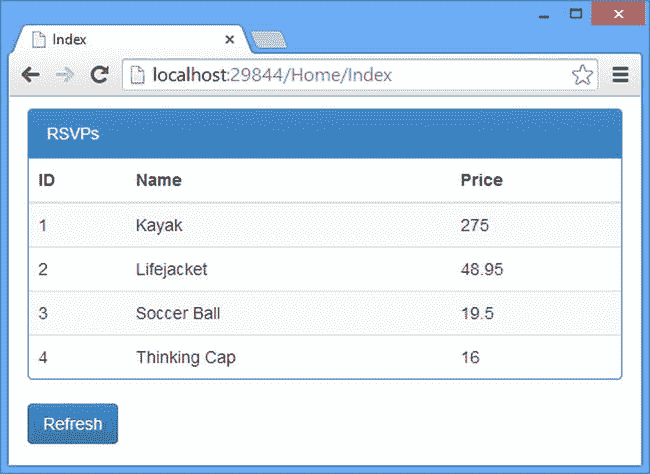

# 10.创建和配置 Web API 应用

在这一章中，我创建了一个示例应用，用于本书这一部分的所有章节。我将向您展示如何执行基本配置并设置依赖注入来创建松散耦合的组件。简而言之，本章为后面更详细的主题奠定了基础，这样我就不必在每一章都创建一个新的示例应用。

也就是说，Web API 应用的依赖注入本身就是一个有趣的话题，因为它是设计具有协同工作的 Web API 和 MVC 组件的应用时出现的各种问题的一个例子。Web API 使用了一组完全不同的名称空间和类型，但在这背后是设计上的一次进化，表现在 Web API 的依赖注入不同于您在 MVC 框架中所习惯的方式。表 [10-1](#Tab1) 总结了本章内容。

表 10-1。

Chapter Summary

<colgroup><col> <col> <col></colgroup> 
| 问题 | 解决办法 | 列表 |
| --- | --- | --- |
| 配置 Web API 应用。 | 在`WebApiConfig`类的`Register`方法中添加操作`HttpConfiguration`对象属性的语句(可以在`App_Start`文件夹中找到)。 | 1–9 |
| 为 Web API 实现依赖注入。 | 实现`IDependencyResolver`和`IDependencyScope`接口，并使用`HttpConfiguration.DependencyResolver`属性注册`IDependencyResolver`实现。 | 10–16 |
| 实现 Web API 和 MVC 的共享依赖注入。 | 类似于 Web API，但是将`System.Web.Mvc.IDependencyResolver`接口添加到解析器实现的集合中，并调用`DependencyResolver.SetResolver`方法。 | 17–20 |

## 准备示例项目

对于这一章，我需要创建一个新的 Visual Studio 项目。从“文件”菜单中选择“新建项目”以打开“Visual Studio 新建项目”对话框窗口，选择“ASP.NET Web 应用”项目类型，并将名称设置为 ExampleApp。单击 OK 按钮继续向导，选择空的项目模板并检查添加 MVC 和 Web API 核心引用的选项，就像我在第 2 章中所做的一样。单击“确定”按钮，Visual Studio 将创建新项目。

Visual Studio 创建完项目后，在包管理器控制台中输入以下命令以获取所需的 NuGet 包:

`Update-Package microsoft.aspnet.mvc -version 5.1.1`

`Update-Package microsoft.aspnet.webapi -version 5.1.1`

`Update-Package Newtonsoft.json -version 6.0.1`

`Install-Package jquery -version 2.1.0`

`Install-Package bootstrap -version 3.1.1`

`Install-Package knockoutjs –version 3.1.0`

### 创建模型和存储库

本书这一部分的重点是交付 web 应用功能的组件，所以我只需要一个基本的模型和存储库。为了保持示例简单，我将创建一个存储库来维护内存中的数据对象集合。清单 10-1 显示了我添加到`Models`文件夹中的`Product.cs`文件的内容。

清单 10-1。Product.cs 文件的内容

`namespace ExampleApp.Models {`

`public class Product {`

`public int ProductID { get; set; }`

`public string Name { get; set; }`

`public decimal Price { get; set; }`

`}`

`}`

这是我在[第 5 章](05.html)中为 SportsStore 应用创建的模型类的简化版本。清单 10-2 显示了我添加到`Models`文件夹中的`Repository.cs`类文件的内容。

清单 10-2。Repository.cs 文件的内容

`using System.Collections.Generic;`

`namespace ExampleApp.Models {`

`public class Repository {`

`private Dictionary<int, Product> data;`

`private static Repository repo;`

`static Repository() {`

`repo = new Repository();`

`}`

`public static Repository Current {`

`get { return repo; }`

`}`

`public Repository() {`

`Product[] products = new Product[] {`

`new Product {ProductID = 1, Name = "Kayak", Price = 275M },`

`new Product {ProductID = 2, Name = "Lifejacket", Price = 48.95M },`

`new Product {ProductID = 3, Name = "Soccer Ball", Price = 19.50M },`

`new Product {ProductID = 4, Name = "Thinking Cap", Price = 16M },`

`};`

`data = new Dictionary<int, Product>();`

`foreach (Product prod in products) {`

`data.Add(prod.ProductID, prod);`

`}`

`}`

`public IEnumerable<Product> Products {`

`get { return data.Values; }`

`}`

`public Product GetProduct(int id) {`

`return data[id];`

`}`

`public Product SaveProduct(Product newProduct) {`

`newProduct.ProductID = data.Keys.Count + 1;`

`return data[newProduct.ProductID] = newProduct;`

`}`

`public Product DeleteProduct(int id) {`

`Product prod = data[id];`

`if (prod != null) {`

`data.Remove(id);`

`}`

`return prod;`

`}`

`}`

`}`

我的示例存储库使用`Product`对象填充内存中的集合，并通过混合属性和方法来公开它们。将数据存储在内存中意味着当应用重新启动时，存储库的内容将被重置。有一个静态的`Current`属性返回一个`Repository`类的共享实例。我用它来启动并运行应用，然后在演示如何设置依赖注入时移除它。

### 创建 HTTP Web 服务

我需要一个 Web API 控制器来为本章提供 HTTP web 服务。我右键单击`Controllers`文件夹，从弹出菜单中选择添加➤控制器，并从控制器类型列表中选择 web API 2 controller–empty。我将名称设置为 ProductsController，并编辑 Visual Studio 创建的用于定义清单 10-3 所示控制器的`Controllers/ProductsController.cs`文件。编辑完文件后，控制器定义一个动作，返回存储库中包含的`Product`对象的集合。

Tip

默认情况下，action 方法的目标是发送到`/api/products` URL 的 HTTP GET 请求。我会在第二章 2 中解释这是如何处理的。

清单 10-3。ProductsController.cs 文件的内容

`using System.Collections.Generic;`

`using System.Web.Http;`

`using ExampleApp.Models;`

`namespace ExampleApp.Controllers {`

`public class ProductsController : ApiController {`

`Repository repo;`

`public ProductsController() {`

`repo = Repository.Current;`

`}`

`public IEnumerable<Product> GetAll() {`

`return repo.Products;`

`}`

`}`

`}`

Note

`Repository`对象是通过我添加到`Repository`类的静态`Current`属性获得的，这意味着`ProductsController`和`Repository`类是紧密耦合的。这在 Web API 应用中出现了与在 MVC 框架中相同的问题。我将在本章的后面解释如何使用依赖注入来分离组件。

### 创建浏览器客户端

我将使用 MVC 框架创建一个简单的浏览器客户端。客户端将包含存储库中可用的初始数据，并通过发送给 web 服务的 Ajax 请求为用户提供刷新数据的方法。我右击`Controllers`文件夹，从弹出菜单中选择添加➤控制器，从控制器类型列表中选择 MVC 5 控制器-空。我将名称设置为 HomeController，并编辑 Visual Studio 创建的用于定义清单 10-4 所示控制器的`Controllers/HomeController.cs`文件。

Note

与我在上一节中定义的 Web API 控制器一样,`HomeController`类与`Repository`类紧密耦合。我将在本章的后面解释如何使用依赖注入来打破依赖。

清单 10-4。HomeController.cs 文件的内容

`using System.Web.Mvc;`

`using ExampleApp.Models;`

`namespace ExampleApp.Controllers {`

`public class HomeController : Controller {`

`Repository repo;`

`public HomeController() {`

`repo = Repository.Current;`

`}`

`public ActionResult Index() {`

`return View(repo.Products);`

`}`

`}`

`}`

我为`Index`动作创建了一个视图，方法是在代码编辑器中右键单击该方法，并从弹出菜单中选择 Add View。我将视图的名称设置为`Index`,并选中了使用布局页面的选项。清单 10-5 显示了`Views/Index.cshtml`文件的内容。

清单 10-5。Index.cshtml 文件的内容

`@model IEnumerable<ExampleApp.Models.Product>`

`@{ ViewBag.Title = "Index";}`

`@section Scripts {`

``

``

`}`

`
`

`
RSVPs
`

`<table id="rsvpTable" class="table table-striped">`

`<thead>`

`<tr><th>ID</th><th>Name</th><th>Price</th></tr>`

`</thead>`

`<tbody data-bind="foreach: products">`

`<tr>`

`<td data-bind="text: ProductID"></td>`

`<td data-bind="text: Name"></td>`

`<td data-bind="text: Price"></td>`

`</tr>`

`</tbody>`

`</table>`

`
`

`<button data-bind="click: getProducts" class="btn btn-primary">Refresh</button>`

这个视图包含一个`table`元素，我使用我在[第 3 章](03.html)中描述的剔除技术来管理它的内容。为此，我将视图模型数据呈现到一个 JavaScript 数组中，如下所示:

`...`

``

`...`

处理来自 HTTP web 服务的数据的 MVC 框架视图需要某种方式从该数据生成 HTML 内容，最简单的方法是在整个视图中采用单一机制，从 Razor 呈现的视图模型数据开始。

该视图还包含一个从`Scripts`文件夹中加载`exampleApp.js`文件的`script`元素。我创建了这个文件并添加了如清单 10-6 所示的代码，它包含了我在刷新按钮的敲除点击绑定中使用的`getProducts`函数。

Tip

如果你是通过输入例子来理解的，那么请看[第 7 章](07.html)，了解如何创建一个`_references.js`文件来启用 JavaScript 文件的智能感知。别忘了你可以从 [`www.apress.com`](http://www.apress.com/) 下载本书每一章的完整源代码。

清单 10-6。exampleApp.js 文件的内容

`$(document).ready(function () {`

`getProducts = function() {`

`$.ajax("/api/products", {`

`success: function (data) {`

`products.removeAll();`

`for (var i = 0; i < data.length; i++) {`

`products.push(data[i]);`

`}`

`}`

`})`

`};`

`ko.applyBindings();`

`});`

`exampleApp.js`文件定义了`getProducts`函数，该函数使用 jQuery 向`/api/products` URL 发出 Ajax GET 请求。我指定了一个`success`函数，如[第 3 章](03.html)中所述，它更新 Knockout 维护的模型，以更新`table`元素的内容。

最后一步是更新 Visual Studio 在我为`Index`动作添加视图时创建的`Views/Shared/_Layout.cshtml`文件，如清单 10-7 所示。

清单 10-7。_Layout.cshtml 文件的内容

`<!DOCTYPE html>`

`<html>`

`<head>`

`<meta name="viewport" content="width=device-width" />`

``

``

``

``

`<link href="∼/Content/bootstrap.css" rel="stylesheet" />`

`<link href="∼/Content/bootstrap-theme.css" rel="stylesheet" />`

`<title>@ViewBag.Title</title>`

``

`@RenderSection("Scripts", false)`

`</head>`

`<body class="container">`

`@RenderBody()`

`</body>`

`</html>`

Visual Studio 添加了我不需要的默认内容，所以我用一个简单的文档替换了该内容，该文档加载我需要的 JavaScript 和 CSS 文件，并呈现视图的`Scripts`和`body`部分。

### 测试示例应用

我将分别测试 web 服务和 web 客户端。启动应用并请求`/Home/Index` URL。如果应用正在运行，那么你会看到 MVC 控制器发送给浏览器的 HTML 格式的数据的初始快照，如图 [10-1](#Fig1) 所示。

图 10-1。

Testing the MVC client for the example application Tip

`exampleApp.js`文件中的 jQuery 代码通过从 Web API 控制器请求相同的数据来处理刷新按钮 click 事件，但是您将需要使用 F12 工具来监控网络请求以查看发生了什么，因为浏览器窗口中没有可见的变化。

我将使用 Postman 来测试 web 服务，我在第 1 章的[中解释了如何设置它。Web API 控制器定义的动作方法只有一个，通过`/api/products` URL 定位。](01.html)

为了用 Postman 进行测试，我需要知道示例应用将使用哪个 TCP 端口来侦听 HTTP 请求，有两种方法可以确定这一点。首先是从 Visual Studio 项目菜单中选择 ExampleApp 属性，选择 Web 选项卡，定位项目 URL 字段，如图 [10-2](#Fig2) 所示。

图 10-2。

Determining the project URL using Visual Studio

另一种方法是查看浏览器栏，其中显示了 Visual Studio 告诉浏览器请求的 URL，如图 [10-3](#Fig3) 所示。

图 10-3。

Getting the TCP port from the browser bar

如图所示，示例应用将在我的系统上的端口 29844 上运行，尽管您将有一个不同的值。下面是我需要输入到 Postman is 来测试我的例子的 URL:

`http://localhost:29844/api/products`

使用 Postman 向 URL 发送 GET 请求会产生以下结果:

`[{"ProductID":1,"Name":"Kayak","Price":275.0},`

`{"ProductID":2,"Name":"Lifejacket","Price":48.95},`

`{"ProductID":3,"Name":"Soccer Ball","Price":19.50},`

`{"ProductID":4,"Name":"Thinking Cap","Price":16.0}]`

## 配置 Web API 应用

Web API 应用以一种新的和不同的方式配置，这并不奇怪。在这一节中，我将解释如何配置 Web API 应用，并描述用于管理配置过程的类。我将在本章后面演示设置依赖注入的过程时使用这些类，并在本书的其余部分描述不同的 Web API 特性时使用这些类。表 [10-2](#Tab2) 将 Web API 配置放在上下文中。

表 10-2。

Putting Web API Configuration in Context

<colgroup><col> <col></colgroup> 
| 问题 | 回答 |
| --- | --- |
| 这是什么？ | 配置系统允许定制 Web API 基础结构和组件的行为。 |
| 我应该什么时候使用它？ | 每当你想要改变默认行为，包括定义新的路由(参见[第 20 章](20.html)和[第 21 章](21.html))或者设置依赖注入(在本章后面描述)时，都需要配置 Web API。 |
| 我需要知道什么？ | Web API 不使用标准的 ASP.NET 平台配置特性，比如`Web.config`文件。配置在`App_Start/WebApiConfig.cs`文件中执行，当 Web API 部署到 I is 时，从全局应用类中引用该文件。 |

### 通过 ASP.NET 平台配置 Web API

当在 IIS 中托管 Web API 时，无论是本地托管还是在 Azure 上托管，配置过程的起点都是全局应用类，就像 MVC 框架一样。然而，并非所有的 Web API 部署选项都有全局应用类，它仅用于引导配置过程。清单 10-8 显示了`Global.asax.cs`文件的内容，你可以通过双击解决方案浏览器中的 Global.asax 项来打开它。

清单 10-8。Global.asax.cs 文件的内容

`using System;`

`using System.Collections.Generic;`

`using System.Linq;`

`using System.Web;`

`using System.Web.Mvc;`

`using System.Web.Routing;`

`using System.Web.Security;`

`using System.Web.SessionState;`

`using System.Web.Http;`

`namespace ExampleApp {`

`public class Global : HttpApplication {`

`void Application_Start(object sender, EventArgs e) {`

`AreaRegistration.RegisterAllAreas();`

`GlobalConfiguration.Configure(WebApiConfig.Register);`

`RouteConfig.RegisterRoutes(RouteTable.Routes);`

`}`

`}`

`}`

重要的陈述是这样的，它启动了 Web API 配置过程:

`...`

`GlobalConfiguration.Configure(WebApiConfig.Register);`

`...`

`System.Web.Http.GlobalConfiguration`类提供了配置 Web API 的入口点，并定义了表 [10-3](#Tab3) 中所示的静态成员。

Caution

不要将 Web API 组件的配置语句添加到全局应用类，因为如果在 IIS 或 Azure 之外部署 Web 服务，它将不可用。使用清单 10-9 所示的`WebApiConfig.cs`文件。

表 10-3。

The Members Defined by the GlobalConfiguration Class

<colgroup><col> <col></colgroup> 
| 名字 | 描述 |
| --- | --- |
| `Configuration` | 返回一个代表 Web API 配置的`HttpConfiguration`对象。详见表 [10-4](#Tab4) 。 |
| `DefaultHandler` | 返回默认情况下用于处理请求的`HttpMessageHandler`。参见[第 1 章](01.html)第 9 节。 |
| `Configure(callback)` | 注册将被调用来配置应用的回调方法。 |

清单 10-9。WebApiConfig.cs 文件的内容

`using System;`

`using System.Collections.Generic;`

`using System.Linq;`

`using System.Web.Http;`

`namespace ExampleApp {`

`public static class WebApiConfig {`

`public static void Register(HttpConfiguration config) {`

`config.MapHttpAttributeRoutes();`

`config.Routes.MapHttpRoute(`

`name: "DefaultApi",`

`routeTemplate: "api/{controller}/{id}",`

`defaults: new { id = RouteParameter.Optional }`

`);`

`}`

`}`

`}`

`Configure`方法允许指定一个回调方法，该方法将被传递一个`System.Web.Http.HttpConfiguration`对象，以便可以配置 Web API。

Tip

通过静态的`GlobalConfiguration.Configuration`属性和我在[第 9 章](09.html)中描述的一些 Web API 上下文对象，`HttpConfiguration`类的实例在整个应用中都是可访问的。

对全局应用类中的`GlobalConfiguration.Configure`方法的调用调用了在`App_Start/WebApiConfig.cs`文件中定义的`WebApiConfig.Register`方法。清单 10-9 显示了 Visual Studio 创建的`WebAPiConfig.cs`文件的初始内容。

文件`WebApiConfig.cs`中的默认配置语句设置 URL 路由，我在[第 20 章](20.html)和[第 21 章](21.html)中对此进行了描述，但是我将在整本书中添加设置其他`HttpConfiguration`属性的附加配置语句。

Tip

注意，Web API 的路由配置与用于为 MVC 框架和 WebForm应用配置路由的`RouteConfig.cs`文件是分开的。

### 了解配置对象

Web API 配置是通过`HttpConfiguration`类的一个实例来管理的，该类提供了一系列属性，这些属性返回决定 Web API 如何处理 HTTP 请求的对象。配置或定制 Web API 意味着在上一节描述的配置回调方法中更改这些属性的值。`HttpConfiguration`类定义了表 [10-4](#Tab4) 中所示的属性。

表 10-4。

The Properties Defined by the HttpConfiguration Class

<colgroup><col> <col></colgroup> 
| 名字 | 描述 |
| --- | --- |
| `DependencyResolver` | 获取或设置用于依赖项注入的类。请参阅本章的“配置 Web API 依赖注入”一节。 |
| `Filters` | 获取或设置请求过滤器，我在第 23 章和第 24 章中对此进行了描述。 |
| `Formatters` | 获取或设置媒体类型格式化程序，我在[第 12 章](12.html)和[第 13 章](13.html)中描述过。 |
| `IncludeErrorDetailPolicy` | 获取或设置错误信息中是否包含详细信息。参见[第 2 章](02.html) 5。 |
| `MessageHandlers` | 获取或设置消息处理程序，我在[第 1 章](01.html) 9 中描述了它。 |
| `ParameterBindingRules` | 获取参数绑定的规则，如第 1 章 4 中所述。 |
| `Properties` | 返回一个`ConcurrentDictionary<object, object>`，它可以作为一个通用属性包来协调组件的行为。 |
| `Routes` | 获取为应用配置的路由集。参见[第二十章](20.html)和[第二十一章](21.html)。 |
| `Services` | 返回 Web API 服务，如[第 9 章](09.html)所述。 |

这些属性以及它们返回的对象定义了 Web API 用来处理 HTTP 请求的基础结构，该表包含了对本书中我深入描述它们的部分的引用。我将从下一节开始，向您展示如何设置一个重要的特性:依赖注入。

Tip

您还可以为单个控制器定义配置。详见[第 2 章](02.html) 2。

## 配置 Web API 依赖注入

在第 4 章中，我解释了确保 web 服务和它们的客户端松散耦合的重要性，这是一个延续到 Web API 应用中的组件的主题。

我在示例应用中创建的控制器和存储库是紧密耦合的:控制器获得一个`Repository`类的实例，并直接使用它的属性来访问它提供访问的数据。这是一个问题，原因与 MVC 框架中避免使用紧密耦合的组件相同:它使得在没有隐式测试存储库的情况下测试控制器变得更加困难，并且它意味着改变存储库意味着找到所有对`Repository`类的引用并替换它们，这是一个耗时且容易出错的过程。

依赖注入(DI)打破了类之间的直接依赖。依赖注入容器配置有接口和实现类之间的映射，并由 Web API 用来创建处理 HTTP 请求所需的类的实例。DI 容器检查它被要求创建的类，并通过创建和注入实现类来解决它被配置的接口的依赖性。通过这种方式，我可以安排我的应用，使我的控制器依赖于`IRepository`接口，而不直接知道它们在构造函数中接收了哪个实现类。DI 允许我更改我所使用的实现，或者创建模拟实现来进行单元测试，而不必对控制器类做任何更改。

A WORD ABOUT DEPENDENCY INJECTION

不是每个人都喜欢依赖注入:这可能是一个令人困惑的话题，工具可能很难掌握，并且很容易最终创建的对象被处理得太快或保存得太久。

没有规定说你必须在你的项目中使用 DI。我是一个 fan DI，但是即使是我在做原型或者开发简单的应用的时候也不用它。如果你是一个非 DI 读者，那么跳过这一章的剩余部分，去读第 1 章 1，在那里我开始深入研究 Web API 的细节。

虽然 DI 在 Web API 中扮演的角色与它在 MVC 框架中扮演的角色相同，但是需要的方法不同，并且略有改进，但是需要注意一些问题，特别是在为每个 HTTP 请求创建对象实例时。表 [10-5](#Tab5) 将 Web API 依赖注入放在上下文中。

表 10-5。

Putting Dependency Injection in Context

<colgroup><col> <col></colgroup> 
| 问题 | 回答 |
| --- | --- |
| 这是什么？ | 依赖注入允许在不直接了解实现接口的类的情况下使用接口，从而创建松散耦合的组件。 |
| 我应该什么时候使用它？ | 您应该在任何需要进行单元测试的项目中，或者在部署后需要进行更改的项目中使用依赖注入。 |
| 我需要知道什么？ | Web API 定义了两个接口来支持 DI，但是在不依赖 ASP.NET 平台的情况下，在 Web API 应用中实现每个请求的对象范围是一些障碍。 |

### 准备依赖注入

在这一节中，我将向示例应用添加一个接口，并使用它来打破直接依赖，以便 Web API 控制器可以抽象地访问存储库功能。我将首先关注为 Web API 设置 DI，然后向您展示如何在包含 MVC 框架和 Web API 控制器的应用中管理 DI。

我需要定义一个接口，这个接口是`Repository`类可以实现的，也是`Products`控制器可以依赖的。为此，我在`Models`文件夹中创建了一个名为`IRepository.cs`的类文件，并用它来定义如清单 10-10 所示的接口。

清单 10-10。IRepository.cs 文件的内容

`using System.Collections.Generic;`

`namespace ExampleApp.Models {`

`public interface IRepository {`

`IEnumerable<Product> Products { get; }`

`Product GetProduct(int id);`

`Product SaveProduct(Product newProduct);`

`Product DeleteProduct(int id);`

`}`

`}`

定义了接口之后，我可以更新`Repository`类来实现它，如清单 10-11 所示。

清单 10-11。在 Repository.cs 文件中实现 IRepository 接口

`using System.Collections.Generic;`

`namespace ExampleApp.Models {`

`public class Repository : IRepository {`

`private Dictionary<int, Product> data;`

`private static Repository repo;`

`//` `...statements omitted for brevity...`

`}`

`}`

最后的准备步骤是更新 Web API 控制器，以便它在其构造函数中声明对`IRepository`接口的依赖。清单 10-12 显示了我对`Products`控制器所做的更改。

清单 10-12。在 ProductsController.cs 文件中声明依赖项

`using System.Collections.Generic;`

`using System.Web.Http;`

`using ExampleApp.Models;`

`namespace ExampleApp.Controllers {`

`public class ProductsController : ApiController {`

`IRepository repo;`

`public ProductsController(IRepository repoImpl) {`

`repo = repoImpl;`

`}`

`public IEnumerable<Product> GetAll() {`

`return repo.Products;`

`}`

`}`

`}`

Tip

我现在只关注 Web API 控制器。我将在“为 Web API 和 MVC 配置依赖注入”一节中添加对 MVC `Home`控制器的 DI 支持。

控制器现在在其构造函数中声明了对`IRepository`接口的依赖。Ninject 支持一系列不同的方法来声明类的依赖关系，但是使用构造函数是我喜欢使用的一种方法。

### 了解 Web API 依赖接口

Web API 中的依赖注入由`IDependencyResolver`和`IDependencyScope`接口处理，它们在`System.Web.Http.Dependencies`名称空间中定义。清单 10-13 显示了`IDependencyResolver`接口的定义。

清单 10-13。IDependencyResolver 接口的定义

`namespace System.Web.Http.Dependencies {`

`public interface IDependencyResolver : IDependencyScope {`

`IDependencyScope BeginScope();`

`}`

`}`

请注意，`IDependencyResolver`接口是从`IDependencyScope`派生而来的；我将在“依赖接口之间的关系”边栏中解释这一点，但是清单 10-14 显示了`IDependencyScope`接口的定义。

清单 10-14。IDependencyScope 接口的定义

`using System.Collections.Generic;`

`namespace System.Web.Http.Dependencies {`

`public interface IDependencyScope : IDisposable {`

`object GetService(Type serviceType);`

`IEnumerable<object> GetServices(Type serviceType);`

`}`

`}`

这个`IDependencyScope`接口定义了`GetService`和`GetServices`方法，它们在 MVC 框架中扮演着相同的角色。当 Web API 基础设施需要一个具体类型(比如一个控制器)或者需要使用一个应该只有一个实现的接口(比如我在[第 2 章](02.html) 2 中描述的`IHttpActionInvoker`接口)时，就会调用`GetService`方法。当 Web API 基础设施期望一个接口有多个实现时，使用`GetServices`方法，所有实现都是必需的(比如`IFilter`，我在[第 2 章](02.html) 3 中描述过)。

THE RELATIONSHIP BETWEEN THE DEPENDENCY INTERFACES

接口之间的继承关系可能会令人困惑，但是当您理解 Web API 开发人员试图使处理 Web 应用中两种最常见的依赖注入场景变得更容易时，它就开始有意义了:创建用于应用生命周期的对象和创建用于单个请求的对象。

当应用启动时，Web API 会在应用的生命周期内创建并保存一个`IDependencyResolver`实现对象的实例，每当 Web API 基础设施需要一个对象时，就会使用它的`GetService`和`GetServices`方法。实际上，这意味着当应用启动时，它被用来创建大量的对象(过滤器、数据格式化程序等等)，然后就不再被使用了。

这个类只有一个实现`IDependencyResolver`接口的实例。当 Web API 需要一个将用于单个请求的对象时，比如一个控制器或一个数据库上下文类，那么它调用`IDependencyResolver`对象的`BeginScope`方法来获得`IDependencyScope`接口的实现，并使用`GetService`和`GetServices`方法来创建它需要的实例。当请求被处理并且不再需要已经创建的对象时，Web API 调用`IDependencyScope`对象上的`Dispose`方法(因为它实现了`IDisposable`)，以便已经创建的对象可以准备销毁。

大多数 DI 容器支持作用域，作用域用于决定什么时候创建一个类的新实例，什么时候重用一个现有的实例。将每个请求的作用域构建到依赖接口中，可以更容易地将 DI 容器集成到 Web API 请求处理流程中。大多数 DI 容器依赖于`System.Web.HttpContext`类来支持每个请求的对象生命周期，这对于 Web API 来说是一个问题，因为您不能依赖于`System.Web`类。主流的依赖注入容器要赶上新的 Web API 设计还需要一段时间，在此之前，将容器作用域与 Web API 作用域对齐可能会有点困难(您将在“实现依赖接口”一节中看到)。

### 安装依赖注入容器

许多依赖注入容器都是可用的，在做出决定之前值得看一看。流行的选择包括 StructureMap、Castle Windsor 和来自微软的 Unity。

在我的项目和书中，我经常返回的 DI 容器是 Ninject，我在 Pro ASP.NET MVC 5 中描述过它。我喜欢它简单流畅的 API，我还没有遇到过不容易解决的问题。当然，你不必在自己的项目中使用 Ninject，我在本章描述的技术同样适用于任何 DI 容器包。

像所有主要的 DI 容器一样，Ninject 是作为一个 NuGet 包提供的。为了安装 Ninject，我在 Visual Studio 包管理器控制台窗口中输入了以下命令:

`Install-Package Ninject -version 3.0.1.10`

`Install-Package Ninject.Extensions.ChildKernel -Version 3.0.0.5`

### 实现依赖接口

Ninject 使支持两个 Web API 解析接口变得很容易，尽管这看起来很奇怪，但最简单的方法是创建一个类。我创建了一个`Infrastructure`文件夹，并在其中添加了一个名为`NinjectResolver.cs`的类文件，其内容如清单 10-15 所示。

清单 10-15。NinjectResolver.cs 文件的内容

`using System;`

`using System.Collections.Generic;`

`using System.Web.Http.Dependencies;`

`using ExampleApp.Models;`

`using Ninject;`

`using Ninject.Extensions.ChildKernel;`

`namespace ExampleApp.Infrastructure {`

`public class NinjectResolver : IDependencyResolver {`

`private IKernel kernel;`

`public NinjectResolver() : this (new StandardKernel()) {}`

`public NinjectResolver(IKernel ninjectKernel, bool scope = false) {`

`kernel = ninjectKernel;`

`if (!scope) {`

`AddBindings(kernel);`

`}`

`}`

`public IDependencyScope BeginScope() {`

`return new NinjectResolver(AddRequestBindings(`

`new ChildKernel(kernel)), true);`

`}`

`public object GetService(Type serviceType) {`

`return kernel.TryGet(serviceType);`

`}`

`public IEnumerable<object> GetServices(Type serviceType) {`

`return kernel.GetAll(serviceType);`

`}`

`public void Dispose() {`

`// do nothing`

`}`

`private void AddBindings(IKernel kernel) {`

`// singleton and transient bindings go here`

`}`

`private IKernel AddRequestBindings(IKernel kernel) {`

`kernel.Bind<IRepository>().To<Repository>().InSingletonScope();`

`return kernel;`

`}`

`}`

`}`

UNDERSTANDING OBJECT SCOPES

在 web 应用中使用依赖注入时，需要创建三种类型的对象:单例对象、请求对象和瞬态对象。

单例对象在第一次需要时被实例化，所有依赖它们的类共享同一个实例。同样，应用中只有一个实例。如果我在示例应用中的`Repository`类被配置为单例，那么将只创建一个实例，并且每个被创建的`Products`控制器对象将接收该实例以满足其对`IRepository`接口的依赖。必须编写单例对象来处理它们的长寿命和保护它们的状态免受多个并发调用者攻击的需要。

瞬态对象每次存在依赖关系时都会被实例化。如果我的`Repository`类被配置为瞬态类，那么每次创建一个`Products`控制器时，都会创建一个新的实例。瞬态对象不会被依赖注入容器重用，它们的生命周期通常与它们被注入到的对象的生命周期相关联。

请求对象在中间。为 web 应用接收的每个请求创建一个新实例，并重用该实例来解析由 Web API 基础结构创建的所有对象声明的依赖关系，以处理该请求。换句话说，为处理单个请求而创建的对象共享请求对象的单个实例。请求对象在请求被处理后被丢弃。

存储库类通常被配置为请求对象，这允许处理单个请求的所有对象共享模型的公共视图，并且所有对象都可以看到请求引起的变化。而且，因为几乎每个 Web API 和 MVC 框架应用都有一个存储库，所以支持请求对象是一个重要的特性。

这些对象类型中的每一种都是通过创建依赖注入范围来配置的。我将在本章后面解释如何使用 Ninject 创建每种类型的作用域。

Caution

许多 NuGet 包扩展了 Ninject，以便将 DI 功能集成到不同的环境中。在我写这篇文章的时候，有几个是针对 ASP.NET Web API 的，但是它们都假设您将把您的应用部署到 IIS，并且它们依赖于 ASP.NET 平台模块特性来管理每个请求的对象生命周期。清单 10-15 所示的类支持 Web API 依赖注入，而不依赖于 ASP.NET 平台，因此您可以自由地部署您的 Web 服务。参见“为 Web API 和 MVC 配置依赖注入”一节，在 Web API 和 MVC 框架组件之间共享依赖注入，在这种情况下，依赖 ASP.NET 平台是一种可以接受的折衷。

这个类充当 Web API 和 Ninject 之间的接触点。它实现了两个 Web API 依赖接口(`NinjectResolver`实现了`IDependencyResolver`，它从`IDependencyScope`派生而来)并通过创建一个子内核来响应`BeginScope`方法，这允许我使用 Ninject 为每个请求创建对象范围。在示例应用中只有一个依赖映射，我设置如下:

`...`

`kernel.Bind<``IRepository``>().To<``Repository``>().``InSingletonScope()`T6】

`...`

我强调了声明的三个重要部分。`Bind`方法的泛型类型参数指定了我想要配置的接口，在本例中是`IRepository`。`To`方法的泛型类型参数指定了 Ninject 应该用来解析接口依赖关系的实现类，在本例中是`Repository`类。

映射语句的最后一部分是对`InSingletonScope`方法的调用，该方法指定了类的实例的范围，创建这些实例是为了解析接口上的依赖关系。

由于`NinjectResolver`类的工作方式，这就是事情变得有点混乱的地方:我通过为每个请求创建一个子内核并在子内核上创建一个单例范围来创建请求范围，确保为每个请求只创建一个对象实例。

Tip

如果这没有直接意义，不要担心，因为这是特定于一个依赖注入容器的实现细节。你可以在你的项目中使用`NinjectResolver`类，只要你遵循表 [10-6](#Tab6) 中的说明。

这意味着有两种方法定义了接口及其实现之间的绑定:`AddBindings`和`AddRequestBindings`方法。`AddBindings`方法用于定义单例和瞬态范围，而`AddRequestBindings`方法用于定义请求范围。表 [10-6](#Tab6) 总结了三个对象范围，并给出了如何使用由`NinjectResolver`类定义的方法的例子。

Tip

单例绑定和请求绑定都是用`InSingletonScope`方法创建的，但是请求范围是在`AddRequestBindings`方法中设置的，这个方法是在调用`BeginScope`方法时创建的子 Ninject 内核上调用的。

表 10-6。

Creating Web API Object Scopes with Ninject

<colgroup><col> <col> <col></colgroup> 
| 范围 | 方法 | 例子 |
| --- | --- | --- |
| 一个 | `AddBindings` | `kernel.Bind<IRepository>().To<Repository>()``.``InSingletonScope()`T3】 |
| 请求 | `AddRequestBindings` | `kernel.Bind<IRepository>().To<Repository>()` `.InSingletonScope();` |
| 短暂的 | `AddBindings` | `kernel.Bind<IRepository>().To<Repository>();` |

### 配置 Web API

最后一步是配置 Web API 使用`NinjectResolver`类来解析依赖关系。清单 10-16 显示了我为执行配置而添加到`WebApiConfig.cs`文件中的内容。

清单 10-16。在 WebApiConfig.cs 文件中配置依赖注入

`using System;`

`using System.Collections.Generic;`

`using System.Linq;`

`using System.Web.Http;`

`using ExampleApp.Infrastructure;`

`namespace ExampleApp {`

`public static class WebApiConfig {`

`public static void Register(HttpConfiguration config) {`

`config.DependencyResolver = new NinjectResolver();`

`config.MapHttpAttributeRoutes();`

`config.Routes.MapHttpRoute(`

`name: "DefaultApi",`

`routeTemplate: "api/{controller}/{id}",`

`defaults: new { id = RouteParameter.Optional }`

`);`

`}`

`}`

`}`

`HttpConfiguration.DependencyResolver`被设置为`NinjectResolver`类的一个新实例，这意味着 Web API 将使用它来实例化应用基础设施所需的对象，并处理单个请求。

## 为 Web API 和 MVC 配置依赖注入

尽管 Web API 使用了`NinjectResolver`类来解决依赖性，但是 MVC `Home`控制器仍然与`Repository`类紧密耦合。在这一节中，我将向您展示如何为包含 Web API 和 MVC 组件的应用设置依赖注入。这是一个简单的过程，因为 MVC 框架只能在 ASP.NET 平台上运行，这意味着可以使用 DI 容器(如 Ninject)提供的请求范围支持，甚至可以在 Web API 组件中使用。

Note

使用本节中的技术将您的 web 服务与 ASP.NET 平台联系起来，因为它依赖于被实例化的`System.Web.HttpContext`类，并提供对描述当前请求的`HttpRequest`对象的访问。这些类不是 Web API 命名空间的一部分，使用它们可以防止在 IIS 之外部署 Web API 组件。至少目前，大多数 Web API 应用将被部署到 ASP.NET 平台上，但是如果您决定以后要将 Web API 和 MVC 组件分开，那么您将不得不回到我在本章前面描述的技术。

### 声明依赖关系

我将从更新`Home`控制器开始，这样它不再直接使用`Repository`类，而是声明对`IRepository`接口的依赖，如清单 10-17 所示。

清单 10-17。在 HomeController.cs 文件中声明依赖关系

`using System.Web.Mvc;`

`using ExampleApp.Models;`

`namespace ExampleApp.Controllers {`

`public class HomeController : Controller {`

`IRepository repo;`

`public HomeController(IRepository repoImpl) {`

`repo = repoImpl;`

`}`

`public ActionResult Index() {`

`return View(repo.Products);`

`}`

`}`

`}`

既然 Web API 和 MVC 控制器都声明了对`IRepository`接口的依赖，我就趁机从`Repository`类中移除了`static`属性和构造函数，这将导致在第一次实例化该类以解析依赖时创建一个额外的`Repository`对象。清单 10-18 显示了我注释掉的语句。

清单 10-18。从 Repository.cs 文件中删除静态实例

`using System.Collections.Generic;`

`namespace ExampleApp.Models {`

`public class Repository : IRepository {`

`private Dictionary<int, Product> data;`

`//private static Repository repo;`

`//static Repository() {`

`//    repo = new Repository();`

`//}`

`//public static Repository Current {`

`//    get { return repo; }`

`//}`

`//` `...other statements omitted for brevity...`

`}`

`}`

### 安装依赖注入包

我需要安装另外两个 Ninject 包，这是通过在 Visual Studio 包管理器控制台窗口中输入以下命令来完成的:

`Install-Package Ninject.Web.Common -version 3.0.0.7`

`Install-Package Ninject.MVC3 -Version 3.0.0.6`

`Ninject.Web.Common`包支持将依赖注入与 ASP.NET 平台集成在一起，这样就可以解决对模块和处理程序的依赖。`Ninject.MVC3`包增加了 MVC 框架所需的额外特性(不要担心对 MVC3 的引用，因为这个包与 MVC 3、4 和 5 配合得很好)。这个包将一个`NinjectWebCommon.cs`文件添加到`App_Start`文件夹中，该文件夹包含为 ASP.NET 模块和处理程序设置依赖注入的代码。该文件可以忽略或删除，因为它与 Web API 无关。

Tip

如果您不熟悉 ASP.NET 平台组件，如模块和处理程序，请参阅我的 Pro ASP.NET MVC 5 平台书，由 Apress 出版。尽管在使用 Web API 时应该避免直接依赖 ASP.NET 平台，但是在 MVC 框架应用中有许多有用的特性。

### 向解析器添加 MVC 支持

MVC 框架依赖解析由`System.Web.Mvc.IDependencyResolver`接口处理，该接口定义了表 [10-7](#Tab7) 中描述的方法。

表 10-7。

The Methods Defined by the MVC IDependencyResolver Interface

<colgroup><col> <col></colgroup> 
| 名字 | 描述 |
| --- | --- |
| `GetService(type)` | 解析注册了一个实现的类型 |
| `GetServices(type)` | 解析注册了多个实现的类型 |

这些方法与 Web API `IDependencyScope`接口定义的方法相匹配，我在清单 10-14 中列出了这些方法。这种复制允许我扩展`NinjectResolver`类来支持 Web API 和 MVC 框架，如清单 10-19 所示。

清单 10-19。向 NinjectResolver.cs 文件添加 MVC 框架支持

`using System;`

`using System.Collections.Generic;`

`using System.Web.Http.Dependencies;`

`using ExampleApp.Models;`

`using Ninject;`

`using Ninject.Extensions.ChildKernel;`

`using Ninject.Web.Common;`

`namespace ExampleApp.Infrastructure {`

`public class NinjectResolver : System.Web.Http.Dependencies.IDependencyResolver,`

`System.Web.Mvc.IDependencyResolver {`

`private IKernel kernel;`

`public NinjectResolver() : this (new StandardKernel()) {}`

`public NinjectResolver(IKernel ninjectKernel) {`

`kernel = ninjectKernel;`

`AddBindings(kernel);`

`}`

`public IDependencyScope BeginScope() {`

`return this;`

`}`

`public object GetService(Type serviceType) {`

`return kernel.TryGet(serviceType);`

`}`

`public IEnumerable<object> GetServices(Type serviceType) {`

`return kernel.GetAll(serviceType);`

`}`

`public void Dispose() {`

`// do nothing`

`}`

`private void AddBindings(IKernel kernel) {`

`kernel.Bind<IRepository>().To<Repository>().InRequestScope();`

`}`

`}`

`}`

Web API 和 MVC 框架接口具有相同的名称，所以我必须在类定义中使用完全限定的名称来实现这两个接口。

能够依赖 ASP.NET 平台意味着 Ninject 能够提供`InRequestScope`方法，该方法配置绑定，以便它们创建的对象限定在请求的范围内。这允许我在不使用子内核的情况下支持 Web API `BeginScope`方法，从而将我的绑定合并到一个方法中。总体效果是通过将每请求对象的生命周期与 ASP.NET 平台提供的功能联系起来，简化了依赖关系解析类。

但是这种更简单、更优雅的方法是以依赖 ASP.NET 平台为代价的，这限制了应用的部署选项，但是对于大多数包含 MVC 组件的应用来说，这可能是一种可以接受的折衷。表 [10-8](#Tab8) 展示了如何使用清单 10-19 中的解析器创建不同的对象范围。

表 10-8。

Creating Web API and MVC Object Scopes with Ninject

<colgroup><col> <col> <col></colgroup> 
| 范围 | 方法 | 例子 |
| --- | --- | --- |
| 一个 | `AddBindings` | `kernel.Bind<IRepository>().To<Repository>().``InSingletonScope()`T2】 |
| 请求 | `AddBindings` | `kernel.Bind<IRepository>().To<Repository>().InRequestScope();` |
| 短暂的 | `AddBindings` | `kernel.Bind<IRepository>().To<Repository>();` |

这是使用 Ninject 的一种更自然的方式，也是您在单独使用 MVC 框架时会使用的一组方法。

### 配置 MVC 框架

最后一步是配置 MVC 框架，以便使用`NinjectResolver`类来创建对象和解析依赖关系。清单 10-20 显示了我对全局应用类所做的更改。

清单 10-20。在 Global.asax.cs 文件中配置依赖注入

`using System;`

`using System.Collections.Generic;`

`using System.Linq;`

`using System.Web;`

`using System.Web.Mvc;`

`using System.Web.Routing;`

`using System.Web.Security;`

`using System.Web.SessionState;`

`using System.Web.Http;`

`namespace ExampleApp {`

`public class Global : HttpApplication {`

`void Application_Start(object sender, EventArgs e) {`

`AreaRegistration.RegisterAllAreas();`

`GlobalConfiguration.Configure(WebApiConfig.Register);`

`RouteConfig.RegisterRoutes(RouteTable.Routes);`

`System.Web.Mvc.DependencyResolver.SetResolver(`

`(System.Web.Mvc.IDependencyResolver)`

`GlobalConfiguration.Configuration.DependencyResolver);`

`}`

`}`

`}`

我本可以将 Web API 配置语句从`WebApiConfig.cs`文件移到全局应用类，但是我想展示 Web API 配置是普遍可用的。我添加的语句使用`GlobalConfiguration.Configuration`属性获取`HttpConfiguration`类的实例，读取`DependencyResolver`获取`NinjectResolver`实例，并将其作为`DependencyResolver.SetResolver`方法的参数来配置 MVC 框架。其效果是将`NinjectResolver`类的单个实例作为整个应用的解析器，这样 MVC 框架和 Web API 就可以共享同一套单例对象，并可以访问同一套请求和瞬态对象。

## 摘要

在本章中，我创建并配置了我将在本书的这一部分中使用的示例应用。我解释了最重要的配置类，并使用它们向您展示了如何在 ASP.NET 平台上设置依赖注入，包括依赖和不依赖。在下一章，我将开始深入研究 ASP.NET Web API 的细节，从动作方法产生的结果开始。这听起来可能不是一个有前途的话题，但是，正如您将看到的，结果定义了 HTTP web 服务的特征，并且知道如何产生您需要的结果对于有效的 Web API 开发是必不可少的。