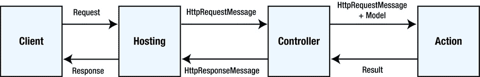
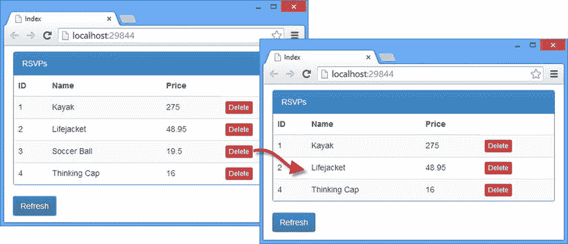
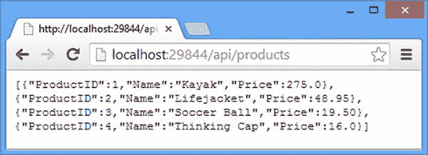

# 11.行动方法结果

在这一章中，我开始深入研究 Web API web 服务如何工作的细节，从 Web 服务的核心开始，即动作方法返回结果的不同方式以及如何使用这些方式来生成 HTTP 响应。正如您将了解到的，Web API 具有使用 C#方法的标准特征来表达结果的便利特性，这使得生成最常见类型的结果变得容易。在这种便利的背后是一个灵活的、可扩展的动作结果系统，它类似于 MVC 框架所使用的系统，并允许对发送给客户机的 HTTP 响应进行完全控制。我解释了这个系统是如何工作的，并演示了如何定制它。表 [11-1](#Tab1) 总结了本章内容。

表 11-1。

Chapter Summary

<colgroup><col> <col> <col></colgroup> 
| 问题 | 解决办法 | 列表 |
| --- | --- | --- |
| 定义一个不返回任何数据的操作方法。 | 从该方法返回`void`。 | 1–4 |
| 定义返回结果的操作方法。 | 从 action 方法返回一个`IHttpActionResult`接口的实现。 | 5–10 |
| 选择将用于序列化数据的数据格式。 | 创建内容协商类。 | 11, 12 |
| 注册一个内容协商类。 | 用自定义类替换`IContentNegotiator`接口的服务实现。 | 13, 14 |
| 指定要在包含序列化数据的响应中使用的结果代码。 | 创建可协商的活动结果。 | Fifteen |

## 准备示例项目

在本章中，我将继续使用我在第 10 章中创建的 ExampleApp 项目。为这个项目做准备需要一个变更，就是为`Repository`类更改依赖注入对象生命周期。在第 10 章的[中，我重点向您展示了如何创建针对单个请求的对象，因为这通常是由数据库支持的真实存储库对象所需要的，比如我在第 5 章](10.html)中使用的那个。然而，我的示例`Repository`类将其模型数据保存在内存中，这意味着我需要创建一个`Repository`类的实例，并在应用的整个生命周期中使用它；否则，每个请求将只使用默认数据。清单 11-1 显示了我为了改变`Repository`类的范围而对`NinjectResolver`类所做的修改。

Tip

请记住，您不必自己创建示例项目。你可以从 [`Apress.com`](http://apress.com/) 免费下载每一章的源代码。

清单 11-1。在 NinjectResolver.cs 文件中更改对象范围

`using System;`

`using System.Collections.Generic;`

`using System.Web.Http.Dependencies;`

`using ExampleApp.Models;`

`using Ninject;`

`using Ninject.Extensions.ChildKernel;`

`using Ninject.Web.Common;`

`namespace ExampleApp.Infrastructure {`

`public class NinjectResolver : System.Web.Http.Dependencies.IDependencyResolver,`

`System.Web.Mvc.IDependencyResolver {`

`private IKernel kernel;`

`public NinjectResolver() : this(new StandardKernel()) { }`

`public NinjectResolver(IKernel ninjectKernel) {`

`kernel = ninjectKernel;`

`AddBindings(kernel);`

`}`

`public IDependencyScope BeginScope() {`

`return this;`

`}`

`public object GetService(Type serviceType) {`

`return kernel.TryGet(serviceType);`

`}`

`public IEnumerable<object> GetServices(Type serviceType) {`

`return kernel.GetAll(serviceType);`

`}`

`public void Dispose() {`

`// do nothing`

`}`

`private void AddBindings(IKernel kernel) {`

`kernel.Bind<IRepository>().To<Repository>().InSingletonScope();`

`}`

`}`

`}`

正如我在[第 10 章](10.html)中解释的，使用`InSingletonScope`方法意味着将创建一个实例，并用于解决应用中`IRequest`接口的所有依赖关系。(提醒一下，这是支持包含 MVC 和 Web API 组件的应用的解析器版本。)

## 了解行动方法结果

正如我在[第 22 章](22.html)中详细解释的，控制器的目标是使用一个动作方法来处理一个`HttpRequestMessage`对象，以便创建一个`HttpResponseMessage`对象。`HttpRequestMessage`描述要处理的请求，`HttpResponseMessage`描述要返回给客户端的响应。托管环境(通常是 IIS，但另一个选项参见[第 26 章](26.html))负责创建`HttpResponseMessage`对象来表示请求，并将`HttpRequestMessage`转换成 HTTP 响应并发送给客户端。图 [11-1](#Fig1) 显示了基本流程。

图 11-1。

The basic request and result flow

控制器使用模型绑定向动作方法提供请求中包含的数据，我将在第 14-17 章中描述，并通过`HttpRequestMessage`对象提供请求本身。`HttpRequestMessage`对象是`System.Net.Http`名称空间的一部分，它呈现了一个 HTTP 请求的一般视图，Web API 可以使用表 [11-2](#Tab2) 中所示的属性对该请求进行操作。

表 11-2。

The Properties Defined by the HttpRequestMessage Class

<colgroup><col> <col></colgroup> 
| 名字 | 描述 |
| --- | --- |
| `Content` | 返回一个包含 HTTP 请求内容的`HttpContent`对象。请求内容是通过模型绑定特性访问的，我将在第 14-17 章中介绍。 |
| `Headers` | 返回一个包含客户端发送的头的`HttpRequestHeaders`对象。 |
| `Method` | 返回一个描述请求的 HTTP 方法/动词的`HttpMethod`对象。 |
| `Properties` | 返回包含宿主环境提供的对象的字典。 |
| `RequestUri` | 返回客户端请求的 URL，表示为一个`Uri`对象。 |
| `Version` | 返回用于发出请求的 HTTP 版本，表示为一个`System.Version`对象。 |

动作方法可以返回代表模型数据的 C#对象，或者直接创建一个`HttpResponseMessage`对象。动作也可以选择返回一个结果，但仍然响应客户端确认操作已经成功完成。我在接下来的章节中描述了不同种类的结果，表 [11-3](#Tab3) 将行动方法结果放入上下文中。

表 11-3。

Putting Action Method Results in Context

<colgroup><col> <col></colgroup> 
| 问题 | 回答 |
| --- | --- |
| 这是什么？ | 操作方法的结果描述了将发送到客户端的 HTTP 响应。 |
| 你应该什么时候使用它？ | 当您想要控制发送到客户端的 HTTP 响应时，您需要显式地指定结果，但是所有的动作方法都会产生结果，即使在方法签名中使用了`void`关键字。 |
| 你需要知道什么？ | Web API 有一些不错的特性，隐藏了为常见结果创建 HTTP 响应的细节，但是您需要理解不同种类的结果，以便完全控制 Web 服务的操作。 |

## 不返回结果

响应 HTTP 请求的最简单方法是不返回任何结果数据。这并不像看起来那么奇怪，因为 web 服务经常需要提供执行工作但不生成数据响应的动作。例如，从存储库中删除对象的请求可能不需要向客户端返回任何数据，因为 HTTP 状态代码将指示操作是否成功。200 范围内的状态代码表示成功，400 或 500 范围内的代码表示失败。不产生数据的动作方法返回`void`，如清单 11-2 所示。

清单 11-2。在 ProductsController.cs 文件中添加返回 void 的操作方法

`using System.Collections.Generic;`

`using System.Web.Http;`

`using ExampleApp.Models;`

`namespace ExampleApp.Controllers {`

`public class ProductsController : ApiController {`

`IRepository repo;`

`public ProductsController(IRepository repoImpl) {`

`repo = repoImpl;`

`}`

`public IEnumerable<Product> GetAll() {`

`return repo.Products;`

`}`

`public void Delete(int id) {`

`repo.DeleteProduct(id);`

`}`

`}`

`}`

我添加了一个`Delete`动作方法，它调用存储库定义的相应方法。该方法返回`void`，这意味着不会向客户端返回任何数据。

测试 action 方法最简单的方法是用 Postman，它会清楚地显示服务器返回的 HTTP 结果代码。向`/api/products/1`发送 HTTP 删除请求将导致状态码 204，如图 [11-2](#Fig2) 所示。

图 11-2。

Targeting an action method that returns no data

状态代码 204 是无数据代码，定义如下:

`The server has fulfilled the request but does not need to return an entity-body.`

您可以在 [`www.w3.org/Protocols/rfc2616/rfc2616-sec10.html`](http://www.w3.org/Protocols/rfc2616/rfc2616-sec10.html) 看到 W3C 对状态代码的完整定义，但这是 web 服务中最常用于删除操作的结果代码。

### 使用没有结果的操作方法

jQuery 将 200 范围内的任何 HTTP 状态代码视为成功，因此处理不返回数据的操作方法就是定义一个`success`回调函数，该函数更新客户端数据模型以反映已经执行的操作。清单 11-3 显示了我对`Index.cshtml`文件所做的修改，为每个产品数据对象添加了删除按钮。

清单 11-3。向 Index.cshtml 文件添加产品删除按钮

`@model IEnumerable<ExampleApp.Models.Product>`

`@{ ViewBag.Title = "Index";}`

`@section Scripts {`

``

``

`}`

`
`

`
RSVPs
`

`<table id="rsvpTable" class="table table-striped">`

`<thead>`

`<tr><th>ID</th><th>Name</th><th>Price</th></tr>`

`</thead>`

`<tbody data-bind="foreach: products">`

`<tr>`

`<td data-bind="text: ProductID"></td>`

`<td data-bind="text: Name"></td>`

`<td data-bind="text: Price"></td>`

`<td>`

`<button class="deleteBtn btn btn-danger btn-xs"`

`data-bind="click: deleteProduct">`

`Delete`

`</button>`

`</td>`

`</tr>`

`</tbody>`

`</table>`

`
`

`<button data-bind="click: getProducts" class="btn btn-primary">Refresh</button>`

我在表格中添加了一列，每个`td`元素都包含一个删除按钮，我对该按钮应用了敲除`click`绑定，以便在单击`button`元素时调用一个名为`deleteProduct`的函数。清单 11-4 显示了`exampleApp.js`文件中`deleteProduct`函数的实现。

清单 11-4。处理 exampleApp.js 文件中的按钮事件

`$(document).ready(function () {`

`deleteProduct = function (data) {`

`$.ajax("/api/products/" + data.ProductID, {`

`type: "DELETE",`

`success: function () {`

`products.remove(data);`

`}`

`})`

`};`

`getProducts = function () {`

`$.ajax("/api/products", {`

`success: function (data) {`

`products.removeAll();`

`for (var i = 0; i < data.length; i++) {`

`products.push(data[i]);`

`}`

`}`

`})`

`};`

`ko.applyBindings();`

`});`

正如我在《T2》第 3 章中解释的，Knockout 将与触发`click`绑定的元素相关联的数据项传递给回调函数，这意味着我可以读取`ProductID`属性的值来创建我需要定位的 URL，如下所示:

`...`

`$.ajax(``"/api/products/" + data.ProductID`T2】

`...`

我使用`type`属性告诉 jQuery 发出一个`DELETE`请求，Web API 使用 HTTP 动词和 URL 指向`Products`控制器上的`Delete`动作方法(我在[第 22 章](22.html)中解释了这是如何发生的)。动作方法在存储库上执行删除操作，但不返回结果，因为该方法是用`void`关键字定义的。

204 状态代码将导致 jQuery 调用我的`success`函数，我定义这个函数时没有参数，因为我不期望从 web 服务接收数据。我从模型数组中移除了 Knockout 传递给`deleteProduct`函数的数据对象，这导致了`table`元素的内容被更新，如图 [11-3](#Fig3) 所示。

图 11-3。

Deleting items from the repository AVOIDING THE URL VS. BODY PITFALL

注意，我为删除请求构造了 URL，因此它包含了我想从存储库中删除的对象的`ProductID`属性值，如下所示:

`...`

`deleteProduct = function (data) {`

`$.ajax("/api/products/" + data.ProductID, {`

`type: "DELETE",`

`success: function () {`

`products.remove(data);`

`}`

`})`

`};`

`...`

如果您有使用 jQuery 发出 Ajax 请求的经验，那么您可能希望能够在请求体中包含`ProductID`属性的值，如下所示:

`...`

`deleteProduct = function (data) {`

`$.ajax("/api/products", {`

`type: "DELETE",`

`data: {id: data.ProductID},`

`success: function () {`

`products.remove(data);`

`}`

`})`

`};`

`...`

这将导致一个错误，因为`Products`控制器中的`Delete`方法是基于 URL 的，而没有考虑请求体中包含的数据。前面代码的作用是向只接受 GET 请求的 action 方法发送一个 DELETE 请求。我在[第 20 章](20.html)和[第 21 章](21.html)中解释了 Web API 路由是如何工作的，在第 14-17 章中解释了如何从请求中提取参数值，但本章的重点是你必须确保你请求的 URL 唯一地标识了你想要操作的对象。

## 返回操作结果

不返回结果的下一步是返回`IHttpActionResult`接口的实现，它大致相当于 MVC 框架中的`ActionResult`类。

Web API 尽最大努力使从动作方法返回的结果尽可能简单，尽可能负责为您创建`HttpResponseMessage`对象。在前面的章节中，您已经看到了`void`动作方法，在“返回模型数据”一节中，当我演示模型对象如何被自动序列化时，您将再次看到它。

`IHttpActionResult`接口允许一个动作方法来指定如何将`HttpResponseMessage`对象生成为指令，然后执行这些指令来产生用于响应客户端的`HttpResponseMessage`。在本章的这一节，我将解释`IHttpActionResult`接口如何适应 Web API，并演示它的不同用法。表 [11-4](#Tab4) 将返回`IHttpActionResult`接口实现的动作方法放到上下文中。

表 11-4。

Putting Action Methods That Return IHttpActionResult into Context

<colgroup><col> <col></colgroup> 
| 问题 | 回答 |
| --- | --- |
| 这是什么？ | 动作结果是`IHttpActionResult`接口的实现，它产生一个`HttpResponseMessage`来描述应该发送给客户端的响应。 |
| 你应该什么时候使用它？ | 操作结果允许您控制将返回给客户端的 HTTP 响应，特别是指定将使用的状态代码。从一个动作方法返回`void`生成一个 204 代码，返回模型数据(我将在本章后面描述)生成一个 200 代码。对于所有其他状态代码(或者对于需要决定动态返回哪个状态代码的操作方法)，操作结果是必需的。 |
| 你需要知道什么？ | `ApiController`类定义了一组方便的方法，为最常见的 HTTP 状态代码创建`IHttpActionResult`实现对象。调用这些方法来获取一个对象，该对象将生成您需要的响应，并将其作为 action 方法的结果返回。 |

### 了解 IHttpActionResult 接口

`IHttpActionResult`接口用于将动作方法从表示其结果的`HttpResponseMessage`对象中分离出来。这是命令模式的一个例子，你可以在 [`http://en.wikipedia.org/wiki/Command_pattern`](http://en.wikipedia.org/wiki/Command_pattern) 中了解到，这使得单独隔离和测试动作方法和动作结果变得更加容易。清单 11-5 显示了在`System.Web.Http`名称空间中定义的`IHttpActionResult`接口的定义。

清单 11-5。IHttpActionResult 接口的定义

`using System.Net.Http;`

`using System.Threading;`

`using System.Threading.Tasks;`

`namespace System.Web.Http {`

`public interface IHttpActionResult {`

`Task<HttpResponseMessage> ExecuteAsync(CancellationToken cancellationToken);`

`}`

`}`

CANCELLING ASYNCHRONOUS TASKS

您将看到许多描述 Web API 组件的接口是异步的，并返回产生其他 Web API 或`System.Net.Http`类型的`Task`对象。当您使用这些接口的默认实现时，通常不必担心创建`Task`对象，但是当您开始创建自定义实现来更改默认行为时，它们就变得很重要了。

大多数重要的方法都有一个`CancellationToken`参数，调用者用它来表示操作已经被取消了，这使得你的实现类可以避免做那些在完成后会被丢弃的工作。您可以通过读取`CancellationToken.IsCancellationRequested`属性来检查您的操作是否被取消，在您的代码中这样做是一个好的实践。我在《我的职业》中详细描述了`Task`的取消。NET 并行编程中的 C#书，由 Apress 出版。

该接口定义了`ExecuteAsync`方法，该方法接受一个`CancellationToken`对象作为其参数，并返回一个产生一个`HttpResponseMessage`对象的`Task`。表 [11-5](#Tab5) 显示了`HttpResponseMessage`的属性，它给出了生成 HTTP 响应所需的信息。

表 11-5。

The Properties Defined by the HttpResponseMessage Class

<colgroup><col> <col></colgroup> 
| 名字 | 描述 |
| --- | --- |
| `Content` | 获取或设置响应的内容，表示为一个`HttpContent`对象 |
| `Headers` | 获取用于收集响应头的`HttpResponseHeaders`对象 |
| `IsSuccessStatusCode` | 如果`StatusCode`属性的结果介于 200 和 299 之间，则返回`true` |
| `ReasonPhrase` | 获取或设置与状态代码关联的说明性短语，以字符串形式表示 |
| `RequestMessage` | 获取或设置与`HttpResponseMessage`关联的`HttpRequestMessage` |
| `StatusCode` | 使用在`HttpStatusCode`类中定义的值获取或设置状态代码 |
| `Version` | 获取或设置 HTTP 版本，表示为`System.Version` |

### 使用 ApiController 操作结果方法

作为 Web API 控制器的默认基础，`ApiController`类定义了一组方便的方法，使得创建一系列`IHttpActionResult`实现对象变得容易，这些对象适用于 HTTP web 服务需要的大多数常见响应。表 [11-6](#Tab6) 描述了可用的方法。这些方法实例化在`System.Web.Http.Results`名称空间中定义的类。

表 11-6。

The ApiController Methods That Return Objects That Implement the IHttpActionResult Interface

<colgroup><col> <col></colgroup> 
| 名字 | 描述 |
| --- | --- |
| `BadRequest()` | 创建一个使用状态代码 400 的`BadRequest`对象。 |
| `BadRequest(message)` | 创建一个`BadRequestErrorMessageResult`，它使用状态代码 400，并在响应体中包含指定的消息。 |
| `BadRequest(modelstate)` | 创建一个使用状态代码 400 的`InvalidModelStateResult`，并在响应体中包含验证信息。有关 Web API 数据验证的详细信息，请参见[第 18 章](18.html)。 |
| `Conflict()` | 创建一个使用状态代码 409 的`ConflictResult`。当请求违反 web 服务定义的内部规则时，将使用此状态代码。标准的例子是试图上传一个比 web 服务已经存储的文件更旧的版本，但是这是一个很少使用的结果。 |
| `Content(status, data)` | 有关详细信息，请参阅本章的“跳过内容协商”一节。 |
| `Created(url, data)` | 有关详细信息，请参见本章的“创建可协商的行动结果”一节。 |
| `CreatedAtRoute(name, vals, data)` | 有关详细信息，请参见本章的“创建可协商的行动结果”一节。 |
| `InternalServerError()` | 创建一个使用状态代码 500 的`InternalServerError`。 |
| `InternelServerError(exception)` | 创建一个`ExceptionResult`，它使用状态代码 500，并在响应体中包含指定异常的详细信息。 |
| `NotFound()` | 创建一个使用状态代码 404 的`NotFoundResult`。 |
| `Ok()` | 创建一个使用状态代码 200 的`OkResult`。 |
| `Ok(data)` | 有关详细信息，请参见本章的“创建可协商的行动结果”一节。 |
| `Redirect(target)` | 创建一个`RedirectResult`，它使用状态代码 302 将客户端重定向到 URL，该 URL 可以指定为一个字符串或一个`Uri`。 |
| `RedirectToRoute(name, props)` | 创建一个`RedirectToRouteResult`，它从路由配置中生成一个 URL，并使用它向客户机发送一个 302 响应。有关 Web API 路由的详细信息，请参见[第 20 章](20.html)和[第 21 章](21.html)。 |
| `ResponseMessage(message)` | 创建一个`ResponseMessageResult`，它是现有`HttpResponseMessage`对象的包装器。请参见“创建 HttpResponseMessage 对象”一节。 |
| `StatusCode(code)` | 创建一个`StatusCodeResult`，它使用指定的状态代码，表示为来自`HttpStatusCode`类的一个值。请参见“创建 HttpResponseMessage 对象”一节。 |
| `Unauthorized(headers)` | 创建一个使用 401 状态代码的`UnauthorizedResult`。认证的详细内容参见[第 23 章](23.html)和[第 24 章](24.html)。 |

返回在响应体中包含信息的对象的方法，例如`BadRequest(message)`和`InternalServerError(exception)`，依赖于媒体格式化和内容协商特性来格式化响应内容，以便它可以被客户端处理。我在“理解内容协商”一节中解释了这些特性。

表 [11-6](#Tab6) 中显示的方法创建了`IHttpActionResult`对象，然后你从一个动作方法返回这些对象，就像 MVC 框架中的`ActionResult`对象一样。清单 11-6 显示了向`Products`控制器添加了一个动作方法，它只是向客户端返回一个结果代码，而不做任何工作。

清单 11-6。在 ProductsController.cs 文件中添加操作方法

`using System.Collections.Generic;`

`using System.Web.Http;`

`using ExampleApp.Models;`

`namespace ExampleApp.Controllers {`

`public class ProductsController : ApiController {`

`IRepository repo;`

`public ProductsController(IRepository repoImpl) {`

`repo = repoImpl;`

`}`

`public IEnumerable<Product> GetAll() {`

`return repo.Products;`

`}`

`public void Delete(int id) {`

`repo.DeleteProduct(id);`

`}`

`[HttpGet]`

`[Route("api/products/noop")]`

`public IHttpActionResult NoOp() {`

`return Ok();`

`}`

`}`

`}`

`NoOp`动作方法调用`Ok`方法创建一个`OkResult`对象，然后将其作为动作的结果返回。您可以通过启动应用并使用 Postman 向`/api/products/noop`发送 GET 请求来测试 action 方法。

Tip

我必须应用`Route`属性来防止 RESTful web 服务的默认 Web API 路由将请求指向`GetAll`方法，我在第 22 章的[中对此进行了解释。`HttpGet`属性使 action 方法能够接收 HTTP GET 请求，如](22.html)[第 14 章](14.html)所述。

为了快速参考，表 [11-7](#Tab7) 列出了按它们产生的状态代码排序的动作结果方法，这通常是你在项目进行中需要知道的。

表 11-7。

ApiController Action Result Methods by HTTP Status Code

<colgroup><col> <col> <col></colgroup> 
| 状态代码 | 意义 | 方法 |
| --- | --- | --- |
| `200` | 操作成功 | `Ok()` |
| `Ok(data)` |
| `302` | 临时重定向 | `Redirect(target)` |
| `RedirectToRoute(name, props)` |
| `400` | 错误的请求 | `BadRequest()` |
| `BadRequest(message)` |
| `BadRequest(model)` |
| `404` | 未发现 | `NotFound()` |
| `409` | 冲突 | `Conflict()` |
| `500` | 内部服务器错误 | `InternalServerError()` |
| `InternalServerError(exception)` |

### 返回其他状态代码

对于最广泛使用的 HTTP 结果代码，有预定义的`IHttpActionResult`实现，但是 Web API 使得使用`IHttpActionResult`机制返回其他代码变得容易，我将通过从`Delete`方法返回一个结果来演示这一点，该方法目前依赖于控制器来检测`void`关键字并发送 204 响应。

#### 创建 StatusCodeResult 对象

最简单的方法是使用`StatusCode`方法，它返回一个`StatusCodeResult`对象，其`ExecuteAsync`方法产生一个带有任意 HTTP 状态码的`HttpResponseMessage`，如清单 11-7 所示。

清单 11-7。在 ProductsController.cs 文件中使用 StatusCodeResult

`using System.Collections.Generic;`

`using System.Web.Http;`

`using ExampleApp.Models;`

`using System.Net;`

`namespace ExampleApp.Controllers {`

`public class ProductsController : ApiController {`

`IRepository repo;`

`public ProductsController(IRepository repoImpl) {`

`repo = repoImpl;`

`}`

`public IEnumerable<Product> GetAll() {`

`return repo.Products;`

`}`

`public IHttpActionResult Delete(int id) {`

`repo.DeleteProduct(id);`

`return StatusCode(HttpStatusCode.NoContent);`

`}`

`[HttpGet]`

`[Route("api/products/noop")]`

`public IHttpActionResult NoOp() {`

`return Ok();`

`}`

`}`

`}`

有许多不同的 HTTP 状态代码可用，如果您发现自己需要其中一种代码，而其他控制器便利方法没有包含这种代码，那么这种技术非常有用。您可以使用的状态代码集是由`System.Net.HttpStatusCode`类定义的，它拥有每个代码的属性。

需要明确的是，在实际应用中几乎没有必要显式返回代码 204(无数据),因为使用`void`关键字更优雅、更自然，尽管在执行数据验证时这可能是一种有用的技术，我在第 18 章中对此进行了描述。

#### 创建 HttpResponseMessage 对象

您可以使用`ResponseMessage`方法作为您已经创建或获得的`HttpResponseMessage`的`IHttpActionResult`包装器。对于大多数 web 服务来说，您不需要这样做，但是在修改 Web API 请求分派过程时，这是很有用的，我将在第 3 部分对此进行描述。清单 11-8 显示了我在`Products`控制器的`Delete`方法中所做的更改，创建一个`HttpResponseMessage`对象并将其传递给`ResponseMessage`方法。

清单 11-8。在 ProductsController.cs 文件中使用 ResponseMessage 方法

`using System.Collections.Generic;`

`using System.Web.Http;`

`using ExampleApp.Models;`

`using System.Net;`

`using System.Net.Http;`

`namespace ExampleApp.Controllers {`

`public class ProductsController : ApiController {`

`IRepository repo;`

`public ProductsController(IRepository repoImpl) {`

`repo = repoImpl;`

`}`

`public IEnumerable<Product> GetAll() {`

`return repo.Products;`

`}`

`public IHttpActionResult Delete(int id) {`

`repo.DeleteProduct(id);`

`return ResponseMessage(new HttpResponseMessage(HttpStatusCode.NoContent));`

`}`

`[HttpGet]`

`[Route("api/products/noop")]`

`public IHttpActionResult NoOp() {`

`return Ok();`

`}`

`}`

`}`

`HttpResponseMessage`类有一个构造函数，它从`HttpStatusCode`类获取一个值来指定状态代码。我不需要设置`HttpResponseMethod`的其他属性，因为我没有试图将任何内容发送回客户端。这种技术产生的效果与使用`StatusCode`方法或者用`void`关键字定义动作方法是一样的。

### 创建自定义操作结果

如果您经常需要返回一个没有控制器方便方法的结果，那么您可以定义一个定制的`IHttpActionResult`接口实现来产生您需要的响应。我在`Infrastructure`文件夹中创建了一个`NoContentResult.cs`类文件，并用它来定义清单 11-9 所示的动作结果。

清单 11-9。NoContentResult.cs 文件的内容

`using System.Net;`

`using System.Net.Http;`

`using System.Threading;`

`using System.Threading.Tasks;`

`using System.Web.Http;`

`namespace ExampleApp.Infrastructure {`

`public class NoContentResult : IHttpActionResult {`

`public Task<HttpResponseMessage> ExecuteAsync(CancellationToken`

`cancellationToken) {`

`return Task.FromResult(new HttpResponseMessage(HttpStatusCode.NoContent));`

`}`

`}`

`}`

由`ApiController`类定义的便利方法是`protected`，这意味着它们不能建立在自定义动作结果上。相反，我的`NoContentResult`类创建了一个新的`HttpResponseMessage`对象，使用构造函数参数来指定 204 状态代码。

Tip

请注意，我使用静态的`Task.FromResult`方法创建了一个`Task`，它产生了作为`ExecuteAsync`方法结果的`HttpResponseMessage`对象。几乎所有的 Web API 操作都是异步的，但是当您必须做的工作很简单时，创建一个新的`Task`和异步执行工作的开销并不总是值得的。在这些情况下，`Task.FromResult`方法允许您创建一个`Task`包装器，该包装器产生您作为参数提供的对象。

我现在可以使用我的自定义实现`IHttpActionResult`接口作为动作方法的结果，如清单 11-10 所示。

清单 11-10。在 ProductsController.cs 文件中使用自定义操作方法

`using System.Collections.Generic;`

`using System.Web.Http;`

`using ExampleApp.Models;`

`using System.Net;`

`using System.Net.Http;`

`using ExampleApp.Infrastructure;`

`namespace ExampleApp.Controllers {`

`public class ProductsController : ApiController {`

`IRepository repo;`

`public ProductsController(IRepository repoImpl) {`

`repo = repoImpl;`

`}`

`public IEnumerable<Product> GetAll() {`

`return repo.Products;`

`}`

`public IHttpActionResult Delete(int id) {`

`repo.DeleteProduct(id);`

`return new NoContentResult();`

`}`

`[HttpGet]`

`[Route("api/products/noop")]`

`public IHttpActionResult NoOp() {`

`return Ok();`

`}`

`}`

`}`

## 返回模型数据

Web API 的主要特性之一是能够返回模型数据对象，并将它们序列化并自动发送给客户端。在本节中，我将演示这个特性，解释负责这个过程的两个组件之一，并向您展示如何对它进行定制。(另一个组件，媒体格式器，在[第 12 章](12.html)和[第 13 章](13.html)中描述。)表 [11-8](#Tab8) 将返回的模型数据放入上下文中。

表 11-8。

Putting Returning Model Data in Context

<colgroup><col> <col></colgroup> 
| 问题 | 回答 |
| --- | --- |
| 这是什么？ | 为了简化 web 服务的创建，Web API 允许您从操作方法中返回一个或多个模型对象，然后将这些对象序列化为客户端可以处理的格式。 |
| 你应该什么时候使用它？ | 每当您需要向具有 200 状态代码的客户端返回数据时，都应该使用此功能。如果您需要用另一个状态代码发送数据，请参阅“返回可协商的操作结果”一节。 |
| 你需要知道什么？ | 用于序列化数据的数据格式是基于一个称为内容协商的过程来选择的，该过程依赖于客户端发送一个 HTTP `Accept`头。这意味着不同的客户端可以以不同的格式接收相同的数据，所以请确保您彻底测试或限制您的应用支持的格式(我在本章的“实现自定义协商者”一节和第十三章中对此进行了描述)。 |

### 了解默认行为

理解默认行为意味着向 Web API web 服务发出几个请求并研究结果。首先启动应用并使用 Postman 向`/api/products` URL 发送一个 GET 请求。您将看到返回了以下数据:

`[{"ProductID":1,"Name":"Kayak","Price":275.0},`

`{"ProductID":2,"Name":"Lifejacket","Price":48.95},`

`{"ProductID":3,"Name":"Soccer Ball","Price":19.50},`

`{"ProductID":4,"Name":"Thinking Cap","Price":16.0}]`

该请求针对由`Products`控制器定义的`GetAll`动作方法，其定义如下:

`...`

`public IEnumerable<Product> GetAll() {`

`return repo.Products;`

`}`

`...`

action 方法返回一个`Product`对象的枚举，Web API 将它序列化为一个 JSON 数组。这很有用，但是在幕后还发生了一些事情，需要第二次请求才能理解。如果您使用 Google Chrome 请求`/api/products` URL，您将在浏览器选项卡中看到以下数据:

`<ArrayOfProduct xmlns:i="`[`http://www.w3.org/2001/XMLSchema`](http://www.w3.org/2001/XMLSchema)T2】

`instance"xmlns="`[`http://schemas.datacontract.org/2004/07/ExampleApp.Models`](http://schemas.datacontract.org/2004/07/ExampleApp.Models)T2】

`<Product>`

`<Name>Kayak</Name><Price>275</Price><ProductID>1</ProductID>`

`</Product>`

`<Product>`

`<Name>Lifejacket</Name><Price>48.95</Price><ProductID>2</ProductID>`

`</Product>`

`<Product>`

`<Name>Soccer Ball</Name><Price>19.50</Price><ProductID>3</ProductID>`

`</Product>`

`<Product>`

`<Name>Thinking Cap</Name><Price>16</Price><ProductID>4</ProductID>`

`</Product>`

`</ArrayOfProduct>`

这一次，`Product`对象的枚举产生了 XML 数据，这是因为 Google Chrome 在 HTTP 请求中发送了表示偏好 XML 的头。

这里有两个重要的 Web API 特性在起作用。第一个是内容协商，其中 Web API 检查请求，并使用它包含的信息来确定客户端可以处理什么数据格式。第二个特性是媒体格式化，其中 Web API 将数据序列化为已经确定的格式——在这些例子中是 JSON 和 XML 以便可以将数据发送给客户机。我在本章中描述了基本的内容协商，在[第 12 章](12.html)和[第 13 章](13.html)中描述了媒体格式化器和高级协商。

### 了解内容协商流程

内容协商是选择适当的格式来序列化数据格式的过程。“协商”这个词具有误导性，因为它让人联想到客户端和 web 服务之间的来回交换，就像在密室里讨价还价一样。实际情况要简单得多:客户机在 HTTP 请求中包含一个`Accept`头，它描述了它可以处理的数据格式，用 MIME 类型表示，带有关于优先顺序的信息。web 服务沿着首选项列表向下搜索，直到找到它可以生成的格式，然后使用该格式来序列化数据。(客户还可以使用其他标题来表达偏好，比如`Accept-Charset`、`Accept-Encoding`和`Accept-Language`，但在这一章中，我只关注`Accept`标题。参见[第 12 章](12.html)了解 Web API 如何支持`Accept-Charset`头以及如何使用任何头进行协商的详细信息。)

这是谷歌 Chrome 在上一节发送的`Accept`标题，我是使用 F12 工具的网络面板获得的(我添加了一些空格以便于阅读):

`Accept: text/html, application/xhtml+xml, application/xml;q=0.9, image/webp, */*;q=0.8`

每种内容类型都有一个`q`值，这是一个衡量偏好的指标，更大的`q`值表示更喜欢的格式。当没有表示出`q`值时，暗示了`1.0`值——最大值。该标题解释如下:

*   Chrome 更喜欢`text/html` (HTML)、`application/xhtml+xml` (XHTML)和`image/webp`格式
*   如果 HTML、XHTML 和`image/webp`不可用，那么 XML 是下一个最受欢迎的格式。
*   如果首选格式都不可用，那么 Chrome 将接受任何格式(表示为`*/*`)。

Web API 内置了对 JSON、BSON 和 XML 的支持。(JSON 和 XML 被广泛使用和理解。BSON 是二进制 JSON，基于浏览器的客户端不支持它。)

内容协商过程将 Chrome 首选项与 Web API 格式进行比较，并确定 Chrome 更喜欢接收 XML 格式的模型数据。如果请求中没有`Accept`头，那么允许 web 服务假设客户机将接受任何数据格式。Postman 默认将`Accept`头设置为`*/*`，因此它接收默认的 Web API 数据格式，即 JSON。jQuery Ajax 请求的`Accept`头通过`accept`设置来控制(如第 3 章中的[所述)，默认情况下也设置为`*/*`。这就是为什么单击由`Index.cshtml`视图呈现的刷新按钮会获得 JSON 数据，即使直接通过 Chrome 请求相同的 URL 会产生 XML 数据。](03.html)

Tip

`image/webp` MIME 类型指的是 Google 开发的一种叫做 WebP 的图像格式。通过给这种格式一个`1.0`的偏好，Chrome 表达了一种偏好，那就是接收这种格式的图像比其他格式的图像更受欢迎。WebP 和 HTTP web services 没有任何关系，但是你可以在这里了解更多: [`http://en.wikipedia.org/wiki/WebP`](http://en.wikipedia.org/wiki/WebP) 。

### 实现自定义内容协商器

内容协商器是负责检查请求并确定最适合客户端的格式的类。内容协商者不负责格式化数据；那是媒体格式化者的工作，我在[第 12 章](12.html)和[第 13 章](13.html)中描述了。内容协商者实现了在`System.Net.Http.Formatting`名称空间中定义的`IContentNegotiator`接口。清单 11-11 显示了接口的定义。

清单 11-11。IContentNegotiator 接口

`using System.Collections.Generic;`

`using System.Net.Http.Headers;`

`namespace System.Net.Http.Formatting {`

`public interface IContentNegotiator {`

`ContentNegotiationResult Negotiate(Type type, HttpRequestMessage request,`

`IEnumerable<MediaTypeFormatter> formatters);`

`}`

`}`

调用`Negotiate`方法来检查请求，并向其传递要序列化的数据的`Type`、表示来自客户端的 HTTP 请求的`HttpRequestMessage`以及可用媒体格式化程序的枚举，这些格式化程序负责序列化内容并从`MediaTypeFormatter`类中派生(我在[第 12 章](12.html)中描述)。

来自`Negotiate`方法的结果是`ContentNegotiationResult`类的一个实例，它定义了表 [11-9](#Tab9) 中所示的属性。

Tip

从自定义协商器中的`Negotiate`方法返回`null`会向客户端返回 406(不可接受)响应，表明 web 服务可以生成的数据格式和客户端可以处理的数据格式之间没有重叠。然而，默认的 content negotiator 类默认不返回 406 响应，即使没有合适的内容类型可用；详见[第十三章](13.html)。

表 11-9。

The Properties Defined by the ContentNegotiationResult

<colgroup><col> <col></colgroup> 
| 名字 | 描述 |
| --- | --- |
| `Formatter` | 返回将用于序列化数据的`MediaTypeFormatter`的实例。我在第 12 章中描述了媒体格式化程序。 |
| `MediaType` | 返回`MediaTypeHeaderValue`类的一个实例，它详细描述了将被添加到响应中以描述所选格式的头。 |

`MediaType`属性返回一个`MediaTypeHeaderValue`类的实例，它包含为 HTTP 响应设置`Content-Type`头所需的细节。`MediaTypeHeaderValue`类定义了表 [11-10](#Tab10) 中所示的成员。

表 11-10。

The Members Defined by the MediaTypeHeaderValue

<colgroup><col> <col></colgroup> 
| 名字 | 描述 |
| --- | --- |
| `CharSet` | 获取或设置`Content-Type`标题的字符集组件。 |
| `MediaType` | 获取或设置将在`Content-Type`标头中使用的 MIME 类型。 |
| `Parameters` | 返回一个集合，该集合可用于向`Content-Type`标头添加属性。 |
| `Parse(header)` | 一个静态方法，解析一个头字符串并返回一个`MediaTypeHeaderValue`对象。我在第 14-17 章中描述的模型绑定特性使用了这个方法。 |
| `TryParse(header, output)` | 一个静态方法，试图解析头字符串并填充`output`参数，这是一个用`out`关键字修饰的`MediaTypeHeaderValue`参数。我在第 14-17 章中描述的模型绑定特性使用了这个方法。 |

Web API 包括一个名为`DefaultContentNegotiator`的默认内容协商器类，它检查`Accept`报头，并根据客户端表达的偏好选择媒体格式化程序。内容协商可以考虑请求的任何方面，我将创建一个自定义协商器，它基于默认行为，但确保来自 Chrome 的请求接收 JSON 响应，而不是 XML。我在`Infrastructure`文件夹中添加了一个名为`CustomNegotiator.cs`的类文件，并用它来定义如清单 11-12 所示的类。

清单 11-12。CustomNegotiator.cs 文件的内容

`using System;`

`using System.Collections.Generic;`

`using System.Linq;`

`using System.Net.Http;`

`using System.Net.Http.Formatting;`

`using System.Net.Http.Headers;`

`namespace ExampleApp.Infrastructure {`

`public class CustomNegotiator : DefaultContentNegotiator {`

`public override ContentNegotiationResult Negotiate(Type type,`

`HttpRequestMessage request, IEnumerable<MediaTypeFormatter> formatters) {`

`if (request.Headers.UserAgent.Where(x => x.Product != null`

`&& x.Product.Name.ToLower().Equals("chrome")).Count() > 0) {`

`return new ContentNegotiationResult(new JsonMediaTypeFormatter(),`

`new MediaTypeHeaderValue("application/json")`

`);`

`} else {`

`return base.Negotiate(type, request, formatters);`

`}`

`}`

`}`

`}`

我没有直接从`IContentNegotiator`接口实现我的自定义协商器，而是从`DefaultContentNegotiator`类中派生出了我的`CustomNegotiator`，这样我就可以受益于内置的支持，来处理那些不是来自 Chrome 的请求的`Accept`头。我已经覆盖了`Negotiate`方法来检查`User-Agent`标题并寻找 Chrome 发出的请求；有关详细信息，请参见“使用请求头”侧栏。

当我识别一个 Chrome 请求时，我返回一个新的`ContentNegotiationResult`，它指定了一个内置的媒体格式化程序`JsonMediaTypeFormatter`和`application/json` MIME 类型。我在第 12 章中解释了媒体格式化器是如何工作的(硬编码一个特定类的依赖关系并不理想)，但是这足以证明内容协商器在 Web API 中扮演的角色。

WORKING WITH REQUEST HEADERS

客户端在 HTTP 请求中发送的头可以通过`HttpRequestMessage.Headers`属性获得，该属性返回一个`System.Net.Http.Headers.HttpRequestHeaders`类的实例。`HttpRequestHeaders`类为 HTTP 标准定义的每个头定义了属性，比如`Accept`和`UserAgent`，以及`Contains`和`GetValues`方法，这些方法允许您检查头是否存在并获取任意头的值。

处理头值是为了使它们更容易处理。例如，在`User-Agent`头的情况下，`HttpRequestHeaders.UserAgent`属性返回一个`HttpHeaderValueCollection<ProductInfoValueHeader>`，它本质上是一个`ProductInfoValueHeader`对象的枚举，每个对象代表`User-Agent`头的一部分。`ProductInfoValueHeader`类定义了`Comment`和`Product`属性。`Comment`属性返回一个字符串，`Product`属性返回一个`ProductValueHeader`对象，该对象又定义了`Name`和`Version`属性。

这可能看起来令人困惑，但效果是头被解析成它们的组成部分，这使得它们易于使用。举个例子，Google Chrome 发送一个`User-Agent`字符串，如下所示:

`User-Agent: Mozilla/5.0 (Windows NT 6.3; WOW64) AppleWebKit/537.36`

`(KHTML, like Gecko) Chrome/35.0.1901.0 Safari/537.36`

标题字符串被分解成由空格分隔的单个组件，每个组件由`ProductInfoValueHeader`表示。包含`/`字符的组件由一个`ProductValueHeader`对象表示。例如，Mozilla/5.0 组件由一个`ProductValueHeader`表示，它的`Name`是`Mozilla`，而`Version`是`5.0`。括号中的组件可通过代表它们的`ProductInfoValueHeader`的`Comment`属性获得。

这看起来像是一大堆令人困惑的类型，但是当您使用 LINQ 来处理头时，它们就在一起了。在我的自定义内容协商器中，我正在寻找来自 Chrome 的请求，这意味着我需要定位一个`ProductInfoValueHeader`对象，其`Product`属性返回一个`ProductValueHeader`，其`Name`属性被设置为`Chrome`，我可以这样做:

`...`

`request.Headers.UserAgent.Where(x => x.Product != null`

`&& x.Product.Name.ToLower().Equals("chrome")).Count() > 0`

`...`

这种方法的优点是它减少了错误的范围，因为我没有机会在一个将`Chrome`作为注释的一部分或另一个浏览器名称的一部分的`User-Agent`头上进行匹配。相比之下，下面是我如何在我的 Pro ASP.NET MVC 5 书籍的一个例子中匹配`User-Agent`标题，以展示 URL 路由功能:

`...`

`httpContext.Request.UserAgent.Contains(requiredUserAgent)`

`...`

涉及的类要少得多，但是错误识别客户端的可能性更大。由`System.Net.Http`类处理消息头的方式初看起来可能有些笨拙，但是比手工解析它们更加灵活和有用，尤其是当与 LINQ 结合使用时。

#### 配置内容协商器

我需要告诉 Web API 我想使用我的自定义内容协商器。清单 11-13 显示了我为了注册我的`CustomNegotiator`类而对`WebApiConfig.cs`文件所做的修改。

清单 11-13。在 WebApiConfig.cs 文件中注册自定义内容协商器

`using System;`

`using System.Collections.Generic;`

`using System.Linq;`

`using System.Web.Http;`

`using ExampleApp.Infrastructure;`

`using System.Net.Http.Formatting;`

`namespace ExampleApp {`

`public static class WebApiConfig {`

`public static void Register(HttpConfiguration config) {`

`config.DependencyResolver = new NinjectResolver();`

`config.Services.Replace(typeof(IContentNegotiator), new CustomNegotiator());`

`config.MapHttpAttributeRoutes();`

`config.Routes.MapHttpRoute(`

`name: "DefaultApi",`

`routeTemplate: "api/{controller}/{id}",`

`defaults: new { id = RouteParameter.Optional }`

`);`

`}`

`}`

`}`

我已经调用了`HttpConfig.Services.Replace`方法，用我的`CustomNegotiator`类的一个实例替换了默认的`IContentNegotiator`实现。Web API 以不同的方式提供可扩展性，如果您还没有在应用中设置依赖注入，这是您应该使用的方法。如果您已经设置了 DI，就像我在示例项目中设置的那样，那么您可以在 DI 容器中设置映射，因为 Web API 在创建默认服务类之前会调用`IDependencyResolver.GetService`方法。清单 11-14 显示了我添加到`NinjectResolver`类中的映射。

Note

您只需要使用这些技术中的一种来注册定制协商者，所以我注释掉了清单 11-13 中的语句。

清单 11-14。在 NinjectResolver.cs 文件中注册自定义内容协商器

`using System;`

`using System.Collections.Generic;`

`using System.Web.Http.Dependencies;`

`using ExampleApp.Models;`

`using Ninject;`

`using Ninject.Extensions.ChildKernel;`

`using Ninject.Web.Common;`

`using System.Net.Http.Formatting;`

`namespace ExampleApp.Infrastructure {`

`public class NinjectResolver : System.Web.Http.Dependencies.IDependencyResolver,`

`System.Web.Mvc.IDependencyResolver {`

`private IKernel kernel;`

`public NinjectResolver() : this(new StandardKernel()) { }`

`public NinjectResolver(IKernel ninjectKernel) {`

`kernel = ninjectKernel;`

`AddBindings(kernel);`

`}`

`public IDependencyScope BeginScope() {`

`return this;`

`}`

`public object GetService(Type serviceType) {`

`return kernel.TryGet(serviceType);`

`}`

`public IEnumerable<object> GetServices(Type serviceType) {`

`return kernel.GetAll(serviceType);`

`}`

`public void Dispose() {`

`// do nothing`

`}`

`private void AddBindings(IKernel kernel) {`

`kernel.Bind<IRepository>().To<Repository>().InSingletonScope();`

`kernel.Bind<IContentNegotiator>().To<CustomNegotiator>();`

`}`

`}`

`}`

注意，我没有在`IContentNegotiator`接口和`CustomNegotiator`类之间的映射上设置范围，如[第 10 章](10.html)中所述。对于每个服务类，Web API 将只向解析器发出一个请求，这意味着我不必担心处理多个实例的生命周期。

#### 测试内容协商器

要测试定制内容协商器，启动应用并请求`/api/products` URL。将显示 JSON 数据，而不是您之前收到的 XML 响应，如图 [11-4](#Fig4) 所示。

图 11-4。

The data sent by a custom content negotiator Caution

对于不使用标准 HTTP 协商头的自定义内容协商者，需要小心。它们导致 web 服务可能会忽略客户端的偏好，并发送无法处理的数据格式。一般来说，现在大多数客户端都会处理 JSON，但是你不能总是依赖这一点，尤其是当你支持遗留客户端的时候。彻底测试内容协商者，并停下来检查忽略`Accept`标题是你试图解决的问题的最佳解决方案。

### 绕过内容协商

`ApiController`类定义了一组方法，允许动作方法覆盖常规的内容协商过程，并指定应该使用的数据格式，如表 [11-11](#Tab11) 所述。

表 11-11。

The ApiController Methods That Bypass Content Negotiation

<colgroup><col> <col></colgroup> 
| 名字 | 描述 |
| --- | --- |
| `Json(data)` | 返回一个`JsonResult`，它将数据序列化为 JSON，而不考虑客户端表达的偏好。 |
| `Content(status, data, formatter)` | 返回一个`FormattedContentResult`，它绕过内容协商过程，并使用指定的格式化程序来序列化数据。响应中使用了指定的状态代码。格式化程序负责设置`Content-Type`头的值。 |
| `Content(status, data, formatter, mimeType)` | 类似于前面的方法，但是使用指定的 MIME 类型，表示为响应中的`Content-Type`头的`MediaTypeHeaderValue`对象。 |
| `Content(status, data, formatter, mimeString)` | 类似于前面的方法，但是使用指定的 MIME 类型，表示为响应中的`Content-Type`头的字符串。 |

实现自定义内容协商器允许您根据客户端请求的特征选择数据格式。表 [11-11](#Tab11) 中显示的方法允许您根据动作方法可用的所有上下文信息选择数据格式。这当然包括请求，但也包括将在响应中返回的数据。

绕过内容协商过程不是一个轻易做出的决定，因为它的存在是为了确保客户根据他们表达的偏好获得他们可以处理的内容。如果您需要强制您的应用使用的数据格式，那么您可以更改媒体格式化程序的配置，我将在第 12 章中介绍这一点，或者实现一个自定义内容协商程序，它将优先级赋予一个特定的格式化程序(正如我在本章前面的“实现自定义内容协商程序”一节中所演示的)。这些方法不仅更好地尊重了 Web API 组件之间的关注点分离，而且它们还将决策逻辑整合在一个地方，使得更改所使用的格式和执行单元测试变得更加容易。

## 返回可协商的活动结果

毫无疑问，能够返回模型对象并让 Web API 决定如何处理它们是一个有用且优雅的特性，但它确实假设您将数据返回给客户端，并在响应中返回 200 (OK)状态代码。可协商的操作结果允许您生成不同的 HTTP 状态代码，但仍然可以利用内容协商和数据格式化功能。表 [11-12](#Tab12) 将可协商的行动结果置于上下文中。

表 11-12。

Putting Negotiable Action Results in Context

<colgroup><col> <col></colgroup> 
| 问题 | 回答 |
| --- | --- |
| 这是什么？ | 可协商的操作结果允许您对发送给客户端的`HttpResponseMessage`进行更多的控制，同时仍然受益于内容协商和数据格式化特性。 |
| 你应该什么时候使用它？ | 每当您需要向客户端发送状态代码不是 200 的数据时，请使用可协商的操作结果。 |
| 你需要知道什么？ | 大多数 web 客户机都希望接收带有 200 状态码的数据，而打破这一约定——即使是为了更好地遵守 HTTP 标准(如下所述)——也会产生使客户机行为不端的风险，尤其是当客户机出现在 web 服务之前，或者是由对 REST 有不同解释的程序员编写时。 |

### 创建可协商的行动结果

`ApiController`类定义了一组方法，这些方法返回`IHttpActionResult`接口的实现，让您对响应进行更多的控制，提供协商和格式化过程的好处，同时允许您选择将要使用的状态代码。表 [11-13](#Tab13) 描述了这些方法。

表 11-13。

The ApiController Methods That Return Negotiable Action Results

<colgroup><col> <col></colgroup> 
| 名字 | 描述 |
| --- | --- |
| `Ok(data)` | 该方法返回一个`OkNegotiatedContentResult`对象，该对象将结果状态码设置为 200，相当于将模型对象作为 action 方法的结果返回。 |
| `Created(url, data)` | 该方法返回一个`CreatedNegotiatedContentResult`对象，该对象将响应状态代码设置为 201，表示作为请求的结果，已经创建了一个新资源。`url`参数用于指定可用于请求新对象的 URL。 |
| `CreatedAtRoute(name, values, data)` | 该方法返回一个`CreatedAtRouteNegotiatedContentResult`对象，该对象使用 201 状态代码，并使用命名的路由和路由值生成指向新对象的 URL。有关 Web API 路由的详细信息，请参见[第 20 章](20.html)和[第 21 章](21.html)。 |
| `Content(staus, data)` | 这个方法创建了一个`NegotiatedContentResult`对象，它允许为 HTTP 响应设置任意的状态代码。 |

您很少需要使用这些方法，到目前为止，我发现它们唯一有用的时候是在替换遗留 web 服务时，该服务不寻常地——完全非标准地——使用 HTTP 状态代码向其同样非标准的客户机发送服务状态信号。也就是说，请务必阅读“从 POST 请求返回 200 或 201 个结果”侧栏，了解为什么有时会使用`Created`和`CreatedAtRoute`方法。清单 11-15 显示了应用于`GetAll`动作的`Ok`方法的使用，通过返回模型对象作为方法结果来重新创建相同的效果。

清单 11-15。在 ProductsController.cs 文件中使用 Ok 方法

`using System.Collections.Generic;`

`using System.Web.Http;`

`using ExampleApp.Models;`

`using System.Net;`

`using System.Net.Http;`

`using ExampleApp.Infrastructure;`

`namespace ExampleApp.Controllers {`

`public class ProductsController : ApiController {`

`IRepository repo;`

`public ProductsController(IRepository repoImpl) {`

`repo = repoImpl;`

`}`

`public IHttpActionResult GetAll() {`

`return Ok(repo.Products);`

`}`

`public IHttpActionResult Delete(int id) {`

`repo.DeleteProduct(id);`

`return new NoContentResult();`

`}`

`[HttpGet]`

`[Route("api/products/noop")]`

`public IHttpActionResult NoOp() {`

`return Ok();`

`}`

`}`

`}`

RETURNING 200 OR 201 RESULTS FROM POST REQUESTS

`Created`和`CreatedAtRoute`方法很有趣，因为它们涉及到一个关于 RESTful web 服务如何响应 POST 请求的设计决策。大多数 web 服务将返回 200 状态代码，并在对客户端的响应中包含新的数据对象。新对象将至少包含可用于引用该对象的惟一键和一组 HATEOAS 链接(如果遵循该模式的话)。

这是最常见的方法，但是它不符合 HTTP 规范，该规范规定 web 服务应该返回一个 201 响应，该响应包含一个带有 URL 的`Location`头，可以请求该头来获取新创建的资源。然后，客户端可以请求这个 URL 来检索新的数据项。

大多数 web 服务返回包含新创建的对象的 200 响应的原因是，大多数客户端会向用户显示新创建的数据项，并且在响应中包含数据会优先于客户端的下一个任务，从而避免了额外的请求。

遵守 HTTP 规范通常是一件好事，但是返回一个需要立即发出另一个请求的 201 响应对于大多数 web 服务来说是不必要的模式纯度，特别是因为使用 200 响应已经成为公认的惯例。除非您有相反的迫切需要，否则请避免 201 响应所需的复杂性(和额外的带宽),并使用 200 状态代码来响应 POST 消息以及客户端可能需要的数据。

## 摘要

在本章中，我向您展示了一个动作方法可以返回的不同类型的结果，以及这些结果如何影响发送给客户端的响应。我首先演示了`void`方法如何产生带有 204 状态码的响应，以及 action 方法如何返回`IHttpActionResult`对象来进一步控制响应。Web API 的主要特性之一是模型数据对象的自动序列化，我解释了这个过程的第一部分:内容协商。我解释了客户端如何发送`Accept`头来详细说明它希望接收的数据格式，以及如何使用`IContentNegotiator`来选择媒体格式化程序，以根据这些偏好来序列化数据。在下一章，我将解释媒体格式化程序是如何工作的，并向你展示如何创建一个自定义的媒体格式化程序。