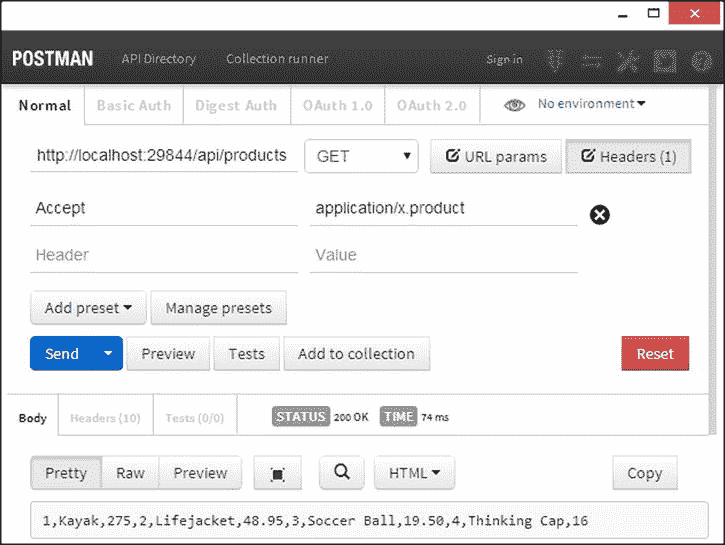
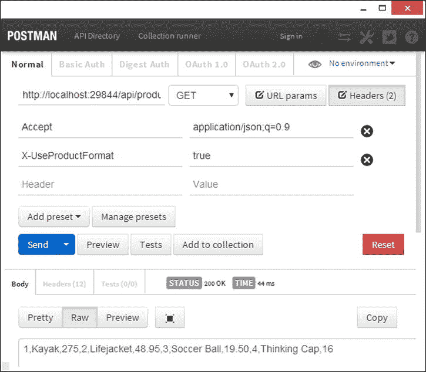
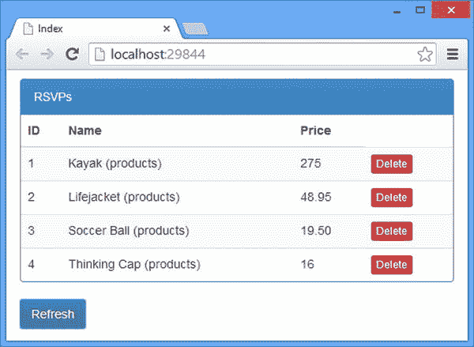

# 12.创建媒体类型格式化程序

媒体类型格式化程序是负责序列化模型数据的组件，以便可以将其发送到客户端。在这一章中，我将通过创建自定义数据格式来解释媒体类型格式化程序的工作原理，并使用它来解释格式化程序的不同应用方式。表 [12-1](#Tab1) 总结了本章内容。

Note

Web API 包括生成 JSON 和 XML 数据的内置媒体类型格式化程序；我将在第 13 章中解释这些如何工作以及如何配置。作为模型绑定过程的一部分，媒体类型格式化程序也被用来反序列化数据，我将在[第 14 章](14.html)中解释这一点。

表 12-1。

Chapter Summary

<colgroup><col> <col> <col></colgroup> 
| 问题 | 解决办法 | 列表 |
| --- | --- | --- |
| 创建媒体类型格式化程序。 | 从`MediaTypeFormatter`类派生并实现`CanReadType`、`CanWriteType`和`WriteToStreamAsync`方法。 | 1–3 |
| 注册媒体类型格式化程序。 | 在 Web API 配置期间，将自定义类的实例添加到格式化程序集合中。 | four |
| 在客户端使用媒体类型格式化程序。 | 使用`dataType`和`accepts`设置来配置 Ajax 请求。 | five |
| 添加对内容编码的支持。 | 使用`SupportedEncodings`集合定义字符编码。 | six |
| 在媒体类型格式化程序生成的响应上设置标头。 | 覆盖`SetDefaultContentHeaders`方法。 | seven |
| 允许媒体类型格式化程序参与内容协商过程。 | 创建媒体类型映射或使用媒体类型映射扩展方法。 | 8–9, 11 |
| 向客户端 HTTP 请求添加标头。 | 使用`headers`设置来配置 Ajax 请求。 | Ten |
| 为每个请求创建媒体类型格式化程序类的新实例。 | 覆盖`GetPerRequestFormatterInstance`方法。 | Twelve |

## 准备示例项目

我将继续使用我在[第 10 章](10.html)创建并在[第 11 章](11.html)添加的 ExampleApp 项目。在为本章做准备时，我将整理一下`Product`控制器中的代码，以使用传统的机制来产生结果。清单 12-1 显示了修改后的控制器，从中我移除了`NoOp`动作方法，并改变了`GetAll`和`Delete`方法的结果。

清单 12-1。对 ProductsController.cs 文件的更改

`using System.Collections.Generic;`

`using System.Web.Http;`

`using ExampleApp.Models;`

`namespace ExampleApp.Controllers {`

`public class ProductsController : ApiController {`

`IRepository repo;`

`public ProductsController(IRepository repoImpl) {`

`repo = repoImpl;`

`}`

`public IEnumerable<Product> GetAll() {`

`return repo.Products;`

`}`

`public void Delete(int id) {`

`repo.DeleteProduct(id);`

`}`

`}`

`}`

Tip

请记住，您不必自己创建示例项目。你可以从[press 免费下载每一章的源代码。com](http://apress.com/) 。

我想禁用我在[第 11 章](11.html)中创建的自定义内容协商器类，这样我就可以演示默认实现和媒体类型格式化程序类之间的交互。清单 12-2 显示了我对`NinjectResolver`类的`AddBindings`方法所做的更改。

清单 12-2。禁用 NinjectResolver.cs 文件中的映射

`...`

`private void AddBindings(IKernel kernel) {`

`kernel.Bind<IRepository>().To<Repository>().InSingletonScope();`

`// kernel.Bind<IContentNegotiator>().To<CustomNegotiator>();`

`}`

`...`

为了确保使用默认的内容协商器，启动应用并使用浏览器请求`/api/products` URL。默认协商者将返回 XML 内容。如果你看到 JSON，那么你已经忘记注释掉`WebApiConfig.cs`文件中的语句，如[第 11 章](11.html)所述。

## 创建媒体类型格式化程序

理解媒体类型格式化程序如何工作的最好方法是创建一个，这是通过从在`System.Net.Http.Formatting`名称空间中定义的抽象`MediaTypeFormatter`类派生来完成的。在接下来的部分中，我将描述实现支持自定义数据格式的媒体类型格式化程序的不同方面。我的格式化程序将序列化`Product`对象，并通过为由`Product`类定义的属性生成一组逗号分隔的值来完成，顺序如下:`ProductID`、`Name`、`Price`。这意味着虽然存储库中数据的 JSON 表示看起来像这样:

`[{"ProductID":1,"Name":"Kayak","Price":275.0},`

`{"ProductID":2,"Name":"Lifejacket","Price":48.95},`

`{"ProductID":3,"Name":"Soccer Ball","Price":19.50},`

`{"ProductID":4,"Name":"Thinking Cap","Price":16.0}]`

我的自定义格式将像这样序列化相同的数据:

`1,Kayak,275.0,2,Lifejacket,48.95,3,Soccer Ball,19.50,4,Thinking Cap,16.0`

我的自定义数据格式只能用来表示`Product`对象，这允许我演示媒体类型格式化的一些重要特征。我需要选择一个 MIME 类型，这样我就可以设置`Accept`请求头和`Content-Type`响应头。我将使用以下内容:

`application/x.product`

这个 MIME 类型将允许内容协商者选择我的自定义媒体类型格式化程序，正如我在第 11 章中解释的那样。

Tip

MIME 类型以`<type>` `/` `<subtype>`的形式表示，子类型前面加上`x.`表示私有内容类型。MIME 类型规范——RFC 6838——不鼓励使用私有内容类型，但是它们对于自定义数据格式仍然有用，并且仍然被广泛使用。旧版本的标准允许使用一个`x-`前缀，现在不再支持了。详见 [`http://tools.ietf.org/html/rfc6838#section-3.4`](http://tools.ietf.org/html/rfc6838#section-3.4) 。

表 [12-2](#Tab2) 将自定义媒体类型格式化程序放入上下文中。

表 12-2。

Putting Custom Media Type Formatters in Context

<colgroup><col> <col></colgroup> 
| 问题 | 回答 |
| --- | --- |
| 它们是什么 | 媒体类型格式化器负责序列化模型数据，以便它可以被发送到客户端(以及作为我在第 14 章中描述的模型绑定过程的一部分的反向过程)。 |
| 你应该什么时候使用它们？ | JSON 和 XML 格式有内置的格式化程序，我在第 13 章中描述过。其他数据格式需要自定义格式化程序。 |
| 你需要知道什么？ | 媒体类型格式化程序可以根据请求的不同方面(包括请求头和字符编码)改变内容的序列化方式。媒体类型格式化程序也可以在内容协商中扮演积极的角色，如“参与协商过程”一节中所述。 |

### 实现基本媒体类型格式化程序

为了演示如何创建一个定制的媒体类型格式化程序，我在示例项目的`Infrastructure`文件夹中添加了一个名为`ProductFormatter.cs`的类文件，并用它来定义清单 12-3 中所示的类。

清单 12-3。ProductFormatter.cs 文件的内容

`using System;`

`using System.Collections.Generic;`

`using System.IO;`

`using System.Net;`

`using System.Net.Http;`

`using System.Net.Http.Formatting;`

`using System.Net.Http.Headers;`

`using System.Threading.Tasks;`

`using ExampleApp.Models;`

`namespace ExampleApp.Infrastructure {`

`public class ProductFormatter : MediaTypeFormatter {`

`public ProductFormatter() {`

`SupportedMediaTypes.Add(new MediaTypeHeaderValue("application/x.product"));`

`}`

`public override bool CanReadType(Type type) {`

`return false;`

`}`

`public override bool CanWriteType(Type type) {`

`return type == typeof(Product) || type == typeof(IEnumerable<Product>);`

`}`

`public override async Task WriteToStreamAsync(Type type, object value,`

`Stream writeStream, HttpContent content,`

`TransportContext transportContext) {`

`List<string> productStrings = new List<string>();`

`IEnumerable<Product> products = value is Product`

`? new Product[] { (Product)value } : (IEnumerable<Product>)value;`

`foreach (Product product in products) {`

`productStrings.Add(string.Format("{0},{1},{2}",`

`product.ProductID, product.Name, product.Price));`

`}`

`StreamWriter writer = new StreamWriter(writeStream);`

`await writer.WriteAsync(string.Join(",", productStrings));`

`writer.Flush();`

`}`

`}`

`}`

`MediaTypeFormatter`类定义了一个`SupportedMediaTypes`集合，内容协商器使用它将客户端`Accept`头中的 MIME 类型匹配到格式化程序。创建自定义格式化程序时，将`MediaTypeHeaderValue`类的实例添加到`SupportedMediaTypes`集合中，以列出格式化程序可以序列化的内容类型，如下所示:

`...`

`public ProductFormatter() {`

`SupportedMediaTypes.Add(new MediaTypeHeaderValue("application/x.product"));`

`}`

`...`

`MediaTypeHeaderValue`类的构造函数参数是一个 MIME 类型，我已经指定了我将使用的私有内容类型。

#### 指示型支架

自定义媒体类型格式化程序只有两个方法必须实现，因为它们被基类标记为`abstract`:`CanReadType`和`CanWriteType`。媒体类型格式化程序可以使用这些方法来限制它们所操作的数据类型的范围，这使得创建具有它们将序列化的类的明确知识的狭义格式化程序变得容易。

`CanReadType`方法被用作模型绑定过程的一部分，我在[第 14 章](14.html)中对此进行了描述。内容协商器调用`CanWriteType`方法来查看格式化程序是否能够序列化特定的类型。对于想要序列化的数据对象的所有排列，从`CanWriteType`中返回`true`是很重要的。示例应用中的 Web API `Product`控制器有一个返回`IEnumerable<Product>`的动作方法，我已经添加了对`Product`类型的支持(不在数组或枚举中),因此我可以支持返回单个`Product`对象的动作方法，如下所示:

`...`

`public override bool CanWriteType(Type type) {`

`return type == typeof(Product) || type == typeof(IEnumerable<Product>);`

`}`

`...`

#### 序列化模型数据

设置支持的 MIME 类型和实现`CanWriteType`方法为内容协商器提供了确定格式化程序是否能够处理请求所需的信息。`WriteToStreamAsync`方法是实际工作发生的地方，当内容协商器选择了格式化程序来序列化 action 方法返回的模型对象时，就会调用该方法。`WriteToStreamAsync`方法接受表 [12-3](#Tab3) 中描述的参数类型。

表 12-3。

The Argument Types Accepted by the WriteToStreamAsync Method

<colgroup><col> <col></colgroup> 
| 参数类型 | 描述 |
| --- | --- |
| `Type` | 由操作方法返回的模型数据的类型。 |
| `object` | 要序列化的数据。 |
| `Stream` | 序列化数据应写入的流。你不能关闭这条溪流。 |
| `HttpContent` | 提供对响应标头的访问的上下文对象。您不能修改该对象。 |
| `TransportContext` | 提供网络传输信息的上下文对象，可以是`null`。 |

`WriteToStreamAsync`方法是异步的，它返回一个`Task`将数据对象序列化到流中，可选地使用`HttpContent`对象来获取关于将要发送的响应的信息。`HttpContent`对象通过一个`Headers`属性提供对响应头的访问，我将在本章后面的“支持内容编码”一节中使用这个属性。

创建只处理少量类型的狭义格式化程序的好处之一是它们易于实现。`ProductFormatter`类中的`WriteToStreamAsync`方法返回一个`Task`,它为接收到的每个`Product`对象创建一个字符串，用逗号将它们连接在一起，并将组合结果写入流中。

`...`

`public override async Task WriteToStreamAsync(Type type, object value,`

`Stream writeStream, HttpContent content,`

`TransportContext transportContext) {`

`List<string> productStrings = new List<string>();`

`IEnumerable<Product> products = value is Product`

`? new Product[] { (Product)value } : (IEnumerable<Product>)value;`

`foreach (Product product in products) {`

`productStrings.Add(string.Format("{0},{1},{2}",`

`product.ProductID, product.Name, product.Price));`

`}`

`StreamWriter writer = new StreamWriter(writeStream);`

`await writer.WriteAsync(string.Join(",", productStrings));`

`writer.Flush();`

`}`

`...`

Note

虽然`WriteToStreamAsync`方法是异步的，但是有一个可选的基类`BufferedMediaTypeFormatter`，如果您喜欢同步工作，并且愿意接受请求处理线程在格式化程序执行序列化时可能会阻塞，那么您可以使用这个基类。我建议您花时间编写异步实现，因为无论如何，`BufferedMediaTypeFormatter`类只是提供了一个由`MediaTypeFormatter`类定义的异步方法的同步包装器。

#### 注册媒体类型格式化程序

媒体类型格式化程序类的集合通过`HttpConfiguration.Formatters`属性访问，该属性返回`System.Net.Http.MediaTypeFormatterCollection`类的一个实例。`MediaTypeFormatterCollection`类定义了我在表 [12-4](#Tab4) 中列出的用于操作格式化程序集合的方法，以及一些我在[第 11 章](11.html)中描述的使用内置格式化程序的便利属性。

表 12-4。

The Methods Defined by the MediaTypeFormattingCollection for Manipulating the Collection

<colgroup><col> <col></colgroup> 
| 名字 | 描述 |
| --- | --- |
| `Add(formatter)` | 向集合中添加新的格式化程序 |
| `Insert(index, formatter)` | 在指定索引处插入格式化程序 |
| `Remove(formatter)` | 移除指定的格式化程序 |
| `RemoveAt(index)` | 移除指定索引处的格式化程序 |

清单 12-4 显示了我如何使用`Add`方法在`WebApiConfig.cs`文件中用 Web API 注册我的`ProductFormatter`类。

清单 12-4。在 WebApiConfig.cs 文件中注册媒体类型格式化程序

`using System.Web.Http;`

`using ExampleApp.Infrastructure;`

`namespace ExampleApp {`

`public static class WebApiConfig {`

`public static void Register(HttpConfiguration config) {`

`config.DependencyResolver = new NinjectResolver();`

`//config.Services.Replace(typeof(IContentNegotiator),`

`//  new CustomNegotiator());`

`config.MapHttpAttributeRoutes();`

`config.Routes.MapHttpRoute(`

`name: "DefaultApi",`

`routeTemplate: "api/{controller}/{id}",`

`defaults: new { id = RouteParameter.Optional }`

`);`

`config.Formatters.Add(new ProductFormatter());`

`}`

`}`

`}`

#### 使用自定义格式化程序

使用 Postman 测试自定义格式化程序很容易。点击 Headers 按钮，添加一个值为`application/x.product`的`Accept`标题。(Postman 提供了一个有用的 HTTP 头列表来帮助您进行选择。)使用 Visual Studio 分配给示例项目的端口，设置动词 GET 并设置 URL，以便它指向本地计算机上的`/api/products` URL。启动应用，然后单击邮递员发送按钮。内容协商器将使用请求中的`Accept`头和 action 方法返回的对象类型来选择`ProductFormatter`媒体类型格式化程序，产生如图 [12-1](#Fig1) 所示的结果。

图 12-1。

Testing the custom formatter with Postman

如图所示，请求的结果与我的目标输出相匹配，如下所示:

`1,Kayak,275.0,2,Lifejacket,48.95,3,Soccer Ball,19.50,4,Thinking Cap,16.0`

#### 使用 jQuery 消费格式化数据

jQuery 通过在 Ajax 请求中设置`Accept`头，使定制格式化器变得容易，尽管使用定制数据格式意味着 web 服务返回的数据不会像 JSON 那样自动转换成 JavaScript 对象。清单 12-5 显示了我对`exampleApp.js`文件所做的更改，以指定`application/x.product` MIME 类型并处理格式化程序生成的数据。

清单 12-5。在 exampleApp.js 文件中使用自定义数据格式

`$(document).ready(function () {`

`deleteProduct = function (data) {`

`$.ajax("/api/products/" + data.ProductID, {`

`type: "DELETE",`

`success: function () {`

`products.remove(data);`

`}`

`})`

`};`

`getProducts = function() {`

`$.ajax("/api/products", {`

`dataType: "text",`

`accepts: {`

`text: "application/x.product"`

`},`

`success: function (data) {`

`products.removeAll();`

`var arr = data.split(",");`

`for (var i = 0; i < arr.length; i += 3) {`

`products.push({`

`ProductID: arr[i],`

`Name: arr[i + 1],`

`Price: arr[i + 2]`

`});`

`}`

`}`

`})`

`};`

`ko.applyBindings();`

`});`

配置`Accept`标题需要两个 jQuery Ajax 设置。`dataType`设置告诉 jQuery 如何处理将从 web 服务接收的数据。`text`的值意味着纯文本是期望的，不应该像 JSON 等其他格式那样被 jQuery 处理。`accepts`(注意复数:`accepts`而不是`accept`)设置告诉 jQuery 哪种 MIME 类型应该用于由`dataType`设置指定的数据格式。这是一种复杂的技术，但是它是有效的，并且具有将 HTTP 请求中的`Accept`头设置为`application/x.product`的效果。

当我在`success`回调函数中接收数据时，我使用`split`方法将字符串分解成一个数组，然后处理数组项以创建 JavaScript 对象，我将这些对象添加到 Knockout observable 数组中。您可以通过启动应用并单击 Refresh 按钮来测试更改，使用浏览器 F12 工具来检查产生的 HTTP 请求和响应。

## 优化自定义格式化程序

现在我已经有了基本的功能，我可以使用一些更高级的格式化程序特性来改进格式化程序匹配请求和格式化程序产生的序列化数据的方式。

### 支持内容编码

`Accept`头是选择格式化程序来序列化数据的主要机制，但是客户端可以通过使用`Accept-Charset`请求头来表达他们希望接收的字符编码偏好。

Tip

如果你不熟悉文本编码，那么请看维基百科上有用的文章 [`http://en.wikipedia.org/wiki/Character_encoding`](http://en.wikipedia.org/wiki/Character_encoding) 中的介绍。

测试`Accept-Charset`头可能很困难，因为描述如何发出 Ajax 请求的标准禁止显式设置某些头，包括`Accept-Charset`头，这意味着无法使用 jQuery 设置这个头。

事实上，测试不同值对`Accept-Charset`头的影响的唯一可靠方法是通过 Postman 的拦截器插件，它覆盖了浏览器强制的默认行为，并允许设置所有头。我在第一章中解释了如何安装拦截器，在测试这一节的代码之前，你需要遵循这些说明。

`MediaTypeFormatter`类定义了一个`SupportedEncodings`属性，该属性返回一个`Collection<System.Text.Encoding>`对象，自定义格式化程序可以用它们支持的编码细节填充该对象。默认情况下，假设格式化程序支持所有编码，但是在清单 12-6 中，我在`ProductFormatter`类的构造函数中添加了一条语句，将格式化程序限制在特定的编码。

清单 12-6。支持 ProductFormatter.cs 文件中的特定编码

`using System;`

`using System.Collections.Generic;`

`using System.IO;`

`using System.Net;`

`using System.Net.Http;`

`using System.Net.Http.Formatting;`

`using System.Net.Http.Headers;`

`using System.Threading.Tasks;`

`using ExampleApp.Models;`

`using System.Text;`

`namespace ExampleApp.Infrastructure {`

`public class ProductFormatter : MediaTypeFormatter {`

`public ProductFormatter() {`

`SupportedMediaTypes.Add(new MediaTypeHeaderValue("application/x.product"));`

`SupportedEncodings.Add(Encoding.Unicode);`

`SupportedEncodings.Add(Encoding.UTF8);`

`}`

`public override bool CanReadType(Type type) {`

`return false;`

`}`

`public override bool CanWriteType(Type type) {`

`return type == typeof(Product) || type == typeof(IEnumerable<Product>);`

`}`

`public override async Task WriteToStreamAsync(Type type, object value,`

`Stream writeStream, HttpContent content,`

`TransportContext transportContext) {`

`List<string> productStrings = new List<string>();`

`IEnumerable<Product> products = value is Product`

`? new Product[] { (Product)value } : (IEnumerable<Product>)value;`

`foreach (Product product in products) {`

`productStrings.Add(string.Format("{0},{1},{2}",`

`product.ProductID, product.Name, product.Price));`

`}`

`Encoding enc = SelectCharacterEncoding(content.Headers);`

`StreamWriter writer = new StreamWriter(writeStream, enc ?? Encoding.Unicode);`

`await writer.WriteAsync(string.Join(",", productStrings));`

`writer.Flush();`

`}`

`}`

`}`

`System.Text.Encoding`类为广泛使用的编码定义了静态属性，我对构造函数的添加将 UTF-16(通过`Unicode`属性访问)和 UTF-8 编码添加到了`SupportedEncodings`集合中。

Tip

HTML5 规范建议对所有 web 内容使用 UTF-8 编码。详见 [`https://www.w3.org/International/questions/qa-choosing-encodings`](https://www.w3.org/International/questions/qa-choosing-encodings) 。

在`WriteToStreamAsync`方法中，我调用由基类定义的`SelectCharacterEncoding`方法，传入`HttpContent.Headers`属性的值，并接收应该用于内容的`Encoding`——或者如果没有与客户端偏好匹配的内容编码，则接收`null`。最后一步是在我创建的用于序列化数据的`StreamWriter`对象上设置编码。

`...`

`StreamWriter writer = new StreamWriter(writeStream,``enc ?? Encoding.Unicode`T2】

`...`

Tip

选择内容编码的方式有点奇怪。在请求格式化程序呈现内容之前，`Accept`和`Accept-Charset`请求标题用于创建`Content-Type`响应标题。如果客户端请求的编码和格式化程序支持的编码相匹配，`Content-Type`头将包含该编码，如下所示:`application/x.product; charset=utf-16`。然后，`SelectCharacterEncoding`方法解析`Content-Type`头，以确定应该使用哪种编码。这很尴尬——感觉像是试图在无法访问请求上下文对象的情况下将一个特性硬塞给格式化程序。

在 Postman 中测试字符编码支持需要以下步骤:

Set the URL so that it targets `/api/products` on your local machine.   Set the verb to GET.   Click the Interceptor button on the menu bar (the one that looks like a stoplight) so that it turns green. (If you can’t find the Interceptor button, it is likely that you forgot to install the extension. See [Chapter 1](01.html) for instructions.) Click the Header button and add an `Accept` header with a value of `application/x.product` and an `Accept-Charset` header with a value of `utf-16`.   Click the Send button.  

请求完成后，单击“发送”按钮下方的“标题”选项卡，查看响应标题。示例应用中的模型数据不包含任何需要特定编码的字符，但是您可以通过查看以下区域的`Content-Length`和`Content-Type`标题来看到我所做的更改的效果:

`Content-Length: 138`

`Content-Type: application/x.product; charset=utf-16`

`Content-Length`头报告响应是 138 字节，`Content-Type`头报告响应包含的数据是`application/x.product`类型，用`utf-16`编码。

接下来，将`Accept-Charset`请求头的值更改为`utf-8`，并再次单击 Send 按钮。您将在响应中看到以下标题:

`Content-Length:` `71`

`Content-Type: application/x.product;` `charset=utf-8`

响应的大小较小，因为 UTF-8 编码使用较少的比特来编码每个字符。最后，将`Accept-Charset`请求头设置为`utf-32`，并再次单击 Send 按钮以生成以下响应头:

`Content-Length: 138`

`Content-Type: application/x.product; charset=utf-16`

当客户机请求的编码和 web 服务支持的编码之间没有重叠时，`Accept-Charset`头的规范允许两种结果。第一个选项是发送 406(不可接受)响应。第二种选择——也是 Web API 使用的一种——是使用任何编码，并希望客户端能够理解它。使用的编码是`SupportedEncodings`集合中的第一个编码，它是`ProductFormatter`类的`utf-16`。

### 设置 HTTP 响应头

Web API 根据已选择的媒体类型和字符编码设置 HTTP 响应头。您可以通过覆盖`SetDefaultContentHeaders`方法来更改添加到响应中的头，或者设置不同的头，或者补充由基类定义的头。清单 12-7 展示了我是如何在 HTTP 响应中添加一个新的头的，`ProductFormatter`类为其序列化数据。

清单 12-7。在 ProductFormatter.cs 文件中设置 HTTP 响应头

`using System;`

`using System.Collections.Generic;`

`using System.IO;`

`using System.Net;`

`using System.Net.Http;`

`using System.Net.Http.Formatting;`

`using System.Net.Http.Headers;`

`using System.Threading.Tasks;`

`using ExampleApp.Models;`

`using System.Text;`

`namespace ExampleApp.Infrastructure {`

`public class ProductFormatter : MediaTypeFormatter {`

`public ProductFormatter() {`

`SupportedMediaTypes.Add(new MediaTypeHeaderValue("application/x.product"));`

`SupportedEncodings.Add(Encoding.Unicode);`

`SupportedEncodings.Add(Encoding.UTF8);`

`}`

`public override bool CanReadType(Type type) {`

`return false;`

`}`

`public override bool CanWriteType(Type type) {`

`return type == typeof(Product) || type == typeof(IEnumerable<Product>);`

`}`

`public override void SetDefaultContentHeaders(Type type,`

`HttpContentHeaders headers, MediaTypeHeaderValue mediaType) {`

`base.SetDefaultContentHeaders(type, headers, mediaType);`

`headers.Add("X-ModelType",`

`type == typeof(IEnumerable<Product>)`

`? "IEnumerable<Product>" : "Product");`

`headers.Add("X-MediaType", mediaType.MediaType);`

`}`

`public override async Task WriteToStreamAsync(Type type, object value,`

`Stream writeStream, HttpContent content,`

`TransportContext transportContext) {`

`List<string> productStrings = new List<string>();`

`IEnumerable<Product> products = value is Product`

`? new Product[] { (Product)value } : (IEnumerable<Product>)value;`

`foreach (Product product in products) {`

`productStrings.Add(string.Format("{0},{1},{2}",`

`product.ProductID, product.Name, product.Price));`

`}`

`Encoding enc = SelectCharacterEncoding(content.Headers);`

`StreamWriter writer = new StreamWriter(writeStream, enc ?? Encoding.Unicode);`

`await writer.WriteAsync(string.Join(",", productStrings));`

`writer.Flush();`

`}`

`}`

`}`

向`SetDefaultContentHeaders`方法传递将被序列化的类型，一个用于创建新头的`HttpContentHeaders`对象，以及一个包含由内容协商器选择的 MIME 类型和字符编码细节的`MediaTypeHeaderValue`对象。

我调用了该方法的基本实现来设置`Content-Type`头，并使用方法参数向响应添加了两个非标准头(名称以`X-`开头的头是非标准的)。`HttpContentHeaders`类定义了允许定义头的方法，如表 [12-5](#Tab5) 所述。

Tip

`HttpContentHeaders`类还定义了许多方便的属性，这些属性获取公共的头值。我没有在表中列出它们，因为它们不被媒体类型格式化程序使用，媒体类型格式化程序专注于设置而不是读取头值。

表 12-5。

The Methods Defined by the HttpContentHeaders Class

<colgroup><col> <col></colgroup> 
| 名字 | 描述 |
| --- | --- |
| `Add(header, value)` | 用指定的值向响应添加新的标头 |
| `Remove(header)` | 从响应中删除标头 |

我调用`Add`方法来定义`X-ModelType`头，我将其设置为格式化程序将序列化的模型类型的可读表示，如下所示:

`...`

`headers.Add("X-ModelType", type == typeof(IEnumerable<Product>)`

`? "IEnumerable<Product>" : "Product");`

`...`

我添加的另一个头依赖于`MediaTypeHeaderValue`对象，它提供了协商者通过表 [12-6](#Tab6) 中显示的属性选择的媒体类型和编码的细节。(这是我在清单 12-3 中用来表达格式化程序支持的 MIME 类型的同一个`MediaTypeHeaderValue`类。)

表 12-6。

The Methods Defined by the MediaTypeHeaderValue Class

<colgroup><col> <col></colgroup> 
| 名字 | 描述 |
| --- | --- |
| `CharSet` | 获取或设置字符编码，以字符串形式表示 |
| `MediaType` | 获取或设置 MIME 类型，以字符串形式表示 |

我使用了`MediaType`属性来设置`X-MediaType`头的值，如下所示:

`...`

`headers.Add("X-MediaType",``mediaType.MediaType`T2】

`...`

这些非标准的响应头不影响客户端处理数据的方式，但是它们对于调试非常有用。为了测试我在清单 12-7 中所做的更改，启动应用并使用 Postman 向带有`application/x.product`的`Accept`头的`/api/products` URL 发送一个 GET 请求。Postman 显示的标头将包括`X-ModelType`和`X-MediaType`标头，如下所示:

`Cache-Control: no-cache`

`Content-Length: 138`

`Content-Type: application/x.product; charset=utf-16`

`Date: Thu, 27 Mar 2014 17:41:15 GMT`

`Expires: -1`

`Pragma: no-cache`

`Server: Microsoft-IIS/8.0`

`X-AspNet-Version: 4.0.30319`

`X-MediaType: application/x.product`

`X-ModelType: IEnumerable<Product>`

`X-Powered-By: ASP.NET`

`X-SourceFiles=?UTF-8?B?QzpcVXNlcnN...`

注意，我的非标准头并不是响应中唯一的头:ASP.NET 添加了几个用于诊断目的的头。

## 参与谈判过程

我在第 11 章的[中描述的基本协商过程依赖于内容协商器完成所有的工作，检查客户端发送的`Accept`头，并将其与格式化器声明支持的 MIME 类型之一进行匹配。](11.html)

通过定义抽象`MediaTypeMapping`类的一个或多个实现，格式化程序可以在协商过程中扮演更积极的角色，抽象`MediaTypeMapping`类用于决定格式化程序支持的 MIME 类型如何适应每个请求的客户端首选项。表 [12-7](#Tab7) 将媒体类型映射放入上下文中。

表 12-7。

Putting Media Type Mappings in Context

<colgroup><col> <col></colgroup> 
| 问题 | 回答 |
| --- | --- |
| 这是什么？ | 媒体类型格式化程序可以通过检查请求和覆盖客户端发送的`Accept`报头来参与内容协商过程。 |
| 你应该什么时候使用它？ | 使用该特性将协商过程扩展到`Accept`头之外，这在处理广泛使用但实现糟糕的客户端(如遗留浏览器)时会很有用。 |
| 你需要知道什么？ | 尽量少用这个特性，这样就不会向客户端发送它无法理解的格式。 |

### 创建媒体类型映射

作为演示，我在`Infrastructure`文件夹中添加了一个名为`ProductMediaMapping.cs`的类文件，并用它来定义清单 12-8 中所示的类。

清单 12-8。ProductMediaMapping.cs 文件的内容

`using System.Collections.Generic;`

`using System.Linq;`

`using System.Net.Http;`

`using System.Net.Http.Formatting;`

`namespace ExampleApp.Infrastructure {`

`public class ProductMediaMapping : MediaTypeMapping {`

`public ProductMediaMapping()`

`: base("application/x.product") {`

`}`

`public override double TryMatchMediaType(HttpRequestMessage request) {`

`IEnumerable<string> values;`

`return request.Headers.TryGetValues("X-UseProductFormat", out values)`

`&& values.Where(x => x == "true").Count() > 0 ? 1 : 0;`

`}`

`}`

`}`

`MediaTypeMapping`类定义了一个接受映射相关的 MIME 类型的构造函数。将代表当前请求的`HttpRequestMessage`对象传递给`TryMatchMediaType`方法，该对象负责返回一个`double`值，该值指示指定 MIME 类型的客户端首选项。

`double`与客户端发送的`Accept`头中的`q`值具有相同的效果。`MediaTypeMapping`类提供了一种机制，通过这种机制，格式化程序可以覆盖客户端表达的首选项，并在匹配列表中提升或降级它们的格式。对于使用请求的哪些细节来做出决策没有限制。我的例子在请求中寻找一个`X-UseProductFormat`头。如果头是`true`，那么我返回一个值`1`，表明客户端非常喜欢`application/x.product`格式。如果头部没有包含在请求中或者没有设置为`true`，那么我返回`0`来表明客户端不想接受这种数据格式。清单 12-9 显示了我如何将`ProductMediaMapping`应用到自定义格式化程序的构造函数中。

清单 12-9。在 ProductFormatter.cs 文件中使用 MediaTypeMapping

`...`

`public ProductFormatter() {`

`//SupportedMediaTypes.Add(new MediaTypeHeaderValue("application/x.product"));`

`SupportedEncodings.Add(Encoding.Unicode);`

`SupportedEncodings.Add(Encoding.UTF8);`

`MediaTypeMappings.Add(new ProductMediaMapping());`

`}`

`...`

Caution

请谨慎使用此功能。客户希望他们的格式首选项通过`Accept`头来管理，您可以通过覆盖这个行为来产生问题。

我注释掉了对`SupportedMediaTypes.Add`方法的调用，以防止格式化程序被动地参与协商过程，并添加了对`MediaTypeMappings.Add`方法的调用，以注册`ProductMediaMapping`类的实例。属性返回一个`MediaTypeMapping`对象的集合，格式化程序可以注册任意多的映射。

#### 测试谈判过程

测试映射效果的最好方法是使用 Postman，因为它可以很容易地控制头。用表 [12-8](#Tab8) 中显示的标题和值向`/api/products` URL 发送一个 GET 请求。

表 12-8。

The Request Headers and Values Required to Test the MediaTypeMapping Implementation

<colgroup><col> <col></colgroup> 
| 页眉 | 价值 |
| --- | --- |
| `Accept` | `application/json;q=0.9` |
| `X-UseProductFormat` | `true` |

设置`Accept`头，以便客户端表达对`application/json`格式的`0.9`偏好，这将被`ProductMediaMapping`类将报告的`application/x.product`格式的`1.0`偏好覆盖，因为请求包含`X-UseProductFormat`头，如图 [12-2](#Fig2) 所示。如果您删除了`X-UseProductFormat`头并发送了另一个请求，web 服务将接受`Accept`头并发送 JSON 数据。

图 12-2。

Overriding client format preferences

#### 向 jQuery Ajax 请求添加头

向 jQuery Ajax 请求添加头部很简单，如清单 12-10 所示。

清单 12-10。在 exampleApp.js 文件中添加非标准请求头

`$(document).ready(function () {`

`deleteProduct = function (data) {`

`$.ajax("/api/products/" + data.ProductID, {`

`type: "DELETE",`

`success: function () {`

`products.remove(data);`

`}`

`})`

`};`

`getProducts = function() {`

`$.ajax("/api/products", {`

`headers: { "X-UseProductFormat": "true" },`

`dataType: "text",`

`accepts: {`

`text: "application/x.product"`

`},`

`success: function (data) {`

`products.removeAll();`

`var arr = data.split(",");`

`for (var i = 0; i < arr.length; i += 3) {`

`products.push({`

`ProductID: arr[i],`

`Name: arr[i + 1],`

`Price: arr[i + 2]`

`});`

`}`

`}`

`})`

`};`

`ko.applyBindings();`

`});`

Caution

清单中的代码假设您所在的地区不使用逗号来表示小数。

`headers`设置被设置为一个对象，该对象的属性对应于将被添加到请求中的头部。这一改变允许客户端继续接收`application/x.product`格式，即使媒体类型格式化程序不再有静态映射。

### 使用映射扩展方法

从`MediaTypeMapping`类派生允许您作为协商过程的一部分深入请求的细节，但是 Web API 也提供了一些方便的扩展方法，使得设置最常见的映射变得容易。表 [12-9](#Tab9) 描述了扩展方法，这些方法都适用于`MediaTypeFormatter`对象。

表 12-9。

The Extension Methods for Mapping Media Types to Requests

<colgroup><col> <col></colgroup> 
| 方法 | 描述 |
| --- | --- |
| `AddQueryStringMapping(name, value, mimeType)` | 当请求查询字符串包含具有指定`value`的`name`属性时，选择指定的`mimeType`。 |
| `AddRequestHeaderMapping(name, value,` `comparison, substring, mimeType)` | 当请求包含带有指定`value`的`name`报头时，选择指定的`mimeType`。比较参数是一个用于比较请求值的`System.StringComparison`值，如果`substring`参数是`true`，它将接受子字符串。 |
| `AddUriPathExtensionMapping(extension, mimeType)` | 如果请求 URL 具有指定的扩展名，则选择指定的`mimeType`。 |

这些扩展方法可以在注册媒体类型格式化程序时使用，如清单 12-11 所示。

清单 12-11。在 WebApiConfig.cs 文件中使用媒体类型格式化程序映射方法

`using System.Web.Http;`

`using ExampleApp.Infrastructure;`

`using System.Net.Http.Formatting;`

`using System;`

`namespace ExampleApp {`

`public static class WebApiConfig {`

`public static void Register(HttpConfiguration config) {`

`config.DependencyResolver = new NinjectResolver();`

`//config.Services.Replace(typeof(IContentNegotiator),`

`//  new CustomNegotiator());`

`config.MapHttpAttributeRoutes();`

`config.Routes.MapHttpRoute(`

`name: "Api with extension",`

`routeTemplate: "api/{controller}.{ext}/{id}",`

`defaults: new { id = RouteParameter.Optional,`

`ext = RouteParameter.Optional }`

`);`

`config.Routes.MapHttpRoute(`

`name: "DefaultApi",`

`routeTemplate: "api/{controller}/{id}",`

`defaults: new { id = RouteParameter.Optional }`

`);`

`MediaTypeFormatter prodFormatter = new ProductFormatter();`

`prodFormatter.AddQueryStringMapping("format", "product",`

`"application/x.product");`

`prodFormatter.AddRequestHeaderMapping("X-UseProductFormat", "true",`

`StringComparison.InvariantCultureIgnoreCase, false,`

`"application/x.product");`

`prodFormatter.AddUriPathExtensionMapping("custom", "application/x.product");`

`config.Formatters.Add(prodFormatter);`

`}`

`}`

`}`

当查询字符串包含特定的属性和值时，`AddQueryStringMapping`扩展方法优先选择媒体类型格式化程序。我在清单中使用了这个方法，这样当请求包含一个被设置为`product`的名为`format`的查询字符串属性时，就会选择`ProductFormatter`类，如下所示:

`...`

`prodFormatter.AddQueryStringMapping("format", "product", "application/x.product");`

`...`

您可以通过使用 Postman 向`/api/products?format=product` URL 发送 GET 请求来测试效果。不包含`format`属性或具有不同值的 URL 不会受到影响。

我使用了`AddRequestHeaderMapping`扩展方法(extension method)来实现我用`ProductMediaMapping`类创建的相同效果(尽管定义自己的映射类提供了更广泛的定制选项)。

`...`

`prodFormatter.AddRequestHeaderMapping("X-UseProductFormat", "true",`

`StringComparison.InvariantCultureIgnoreCase, false, "application/x.product");`

`...`

包含不区分大小写的值为`true`的`X-UseProductFormat`头的请求将选择`ProductFormatter`类。这个语句在示例中是多余的，因为`ProductFormatter`类已经配置为支持这个头。

该方法比其他方法稍微复杂一些，需要定义一个 URL 路由。该方法注册一个映射，该映射寻找一个名为`ext`的路由段变量，这是捕获文件扩展名的约定，但也可用于匹配任何 URL 段。我在[第 20 章](20.html)和[第 21 章](21.html)中解释了 Web API 路由是如何工作的，但是这里是我定义的捕获`ext`段的路由:

`...`

`config.Routes.MapHttpRoute(`

`name: "Api with extension",`

`routeTemplate: "api/{controller}.{ext}/{id}",`

`defaults: new { id = RouteParameter.Optional,``ext = RouteParameter.Optional`T2】

`);`

`...`

我使用了`AddUriPathExtensionMapping`方法，这样当`ext`段变量的值为`custom`时，就会选择`ProductFormatter`类。您可以通过使用 Postman 向`/api/products.custom`发送一个 GET 请求来测试这个映射。

## 创建每请求媒体类型格式化程序

媒体类型格式化程序类的单个实例通常用于序列化多个请求的数据，但另一种方法是覆盖由`MediaTypeFormatter`类定义的`GetPerRequestFormatterInstance`方法。表 [12-10](#Tab10) 将每请求媒体类型格式化程序放入上下文中。

表 12-10。

Putting Per-Request Media Type Formatters in Context

<colgroup><col> <col></colgroup> 
| 问题 | 回答 |
| --- | --- |
| 这是什么？ | 每请求格式化程序允许使用单个请求的性质来影响数据序列化的方式，并允许将非线程安全的代码集成到 Web API 中。 |
| 你应该什么时候使用它？ | 您不必经常根据请求定制序列化数据，该特性通常用于将遗留序列化代码集成到 Web API 中，以便应用可以支持来自旧应用的客户端。 |
| 你需要知道什么？ | 这个特性使用起来很简单，但是请记住，对于协商过程为其选择了格式化程序的每个请求，都会创建一个 formatter 类的新实例。 |

### 创建格式化程序实例

向`GetPerRequestFormatterInstance`方法传递要序列化的数据的`Type`、表示当前请求的`HttpRequestMessage`和提供所需 MIME 类型和字符集编码细节的`MediaTypeHeaderValue`。`GetPerRequestFormatterInstance`方法的结果是一个将用于单个请求的`MediaTypeFormatter`对象。当您需要根据单个请求调整数据序列化时，或者当处理非线程安全的代码并且不能同时调用其`WriteToStreamAsync`方法时，这个特性非常有用。清单 12-12 显示了我如何覆盖了`ProductFormatter`类中的`GetPerRequestFormatterInstance`方法，以在序列化数据中包含请求的细节。

清单 12-12。在 ProductFormatter.cs 文件中创建每请求媒体类型格式化程序

`using System;`

`using System.Collections.Generic;`

`using System.IO;`

`using System.Net;`

`using System.Net.Http;`

`using System.Net.Http.Formatting;`

`using System.Net.Http.Headers;`

`using System.Threading.Tasks;`

`using ExampleApp.Models;`

`using System.Text;`

`namespace ExampleApp.Infrastructure {`

`public class ProductFormatter : MediaTypeFormatter {`

`private string controllerName;`

`public ProductFormatter() {`

`//SupportedMediaTypes.Add(new MediaTypeHeaderValue("application/x.product"));s`

`SupportedEncodings.Add(Encoding.Unicode);`

`SupportedEncodings.Add(Encoding.UTF8);`

`MediaTypeMappings.Add(new ProductMediaMapping());`

`}`

`public ProductFormatter(string controllerArg) : this() {`

`controllerName = controllerArg;`

`}`

`public override bool CanReadType(Type type) {`

`return false;`

`}`

`public override bool CanWriteType(Type type) {`

`return type == typeof(Product) || type == typeof(IEnumerable<Product>);`

`}`

`public override void SetDefaultContentHeaders(Type type,`

`HttpContentHeaders headers, MediaTypeHeaderValue mediaType) {`

`base.SetDefaultContentHeaders(type, headers, mediaType);`

`headers.Add("X-ModelType",`

`type == typeof(IEnumerable<Product>)`

`? "IEnumerable<Product>" : "Product");`

`headers.Add("X-MediaType", mediaType.MediaType);`

`}`

`public override MediaTypeFormatter GetPerRequestFormatterInstance(Type type,`

`HttpRequestMessage request, MediaTypeHeaderValue mediaType) {`

`return new ProductFormatter(`

`request.GetRouteData().Values["controller"].ToString());`

`}`

`public override async Task WriteToStreamAsync(Type type, object value,`

`Stream writeStream, HttpContent content,`

`TransportContext transportContext) {`

`List<string> productStrings = new List<string>();`

`IEnumerable<Product> products = value is Product`

`? new Product[] { (Product)value } : (IEnumerable<Product>)value;`

`foreach (Product product in products) {`

`productStrings.Add(string.Format("{0},{1},{2}",`

`product.ProductID,`

`controllerName == null ? product.Name :`

`string.Format("{0} ({1})", product.Name, controllerName),`

`product.Price));`

`}`

`Encoding enc = SelectCharacterEncoding(content.Headers);`

`StreamWriter writer = new StreamWriter(writeStream, enc ?? Encoding.Unicode);`

`await writer.WriteAsync(string.Join(",", productStrings));`

`writer.Flush();`

`}`

`}`

`}`

我修改了`ProductFormatter`类，使其包含路由系统匹配请求的控制器的名称。我在[第 20 章](20.html)和[第 21 章](21.html)中解释了 Web API 路由是如何工作的，但是这一章的重点是每个请求可能由不同的控制器处理，所以我需要使用`GetPerRequestFormatterInstance`方法，这样我就可以访问`HttpRequestMessage`对象来获得我需要的关于请求的信息。

### 测试每请求格式化程序

若要测试更改，请启动应用，并在 Visual Studio 打开的浏览器窗口中单击“刷新”按钮。jQuery 客户端代码将匹配请求所需的非标准请求头发送到`ProductFormatter`类，该类将`products`添加到序列化数据的名称中，因为这是处理请求的控制器的名称(当然，也是应用中唯一的 Web API 控制器，但您已经明白了)。图 [12-3](#Fig3) 显示了效果。

Tip

如果没有得到预期的结果，那么右击 Chrome 刷新按钮，从弹出窗口中选择清空缓存和硬重新加载。此选项仅在 F12 开发人员工具窗口打开时可用，它确保 Chrome 从服务器请求最新版本的 JavaScript 文件。

图 12-3。

Including per-request information in serialized data

## 摘要

在本章中，我向您展示了如何创建和使用媒体类型格式化程序来序列化模型数据，以便可以将它发送到 web 服务客户端。我解释了格式化程序如何适应 Web API，演示了如何支持不同的媒体类型和字符编码，并演示了如何创建能够参与内容协商过程的格式化程序。在下一章中，我将向您展示如何使用内置的媒体类型格式化程序，它们负责生成 JSON 和 XML 数据。