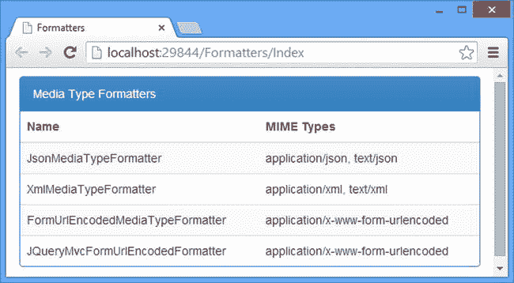
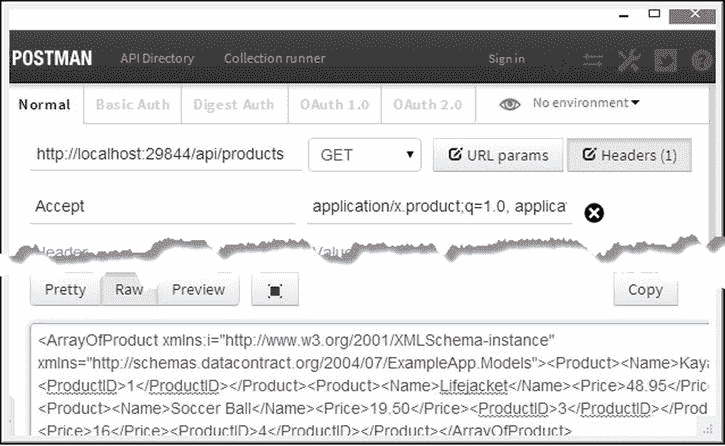
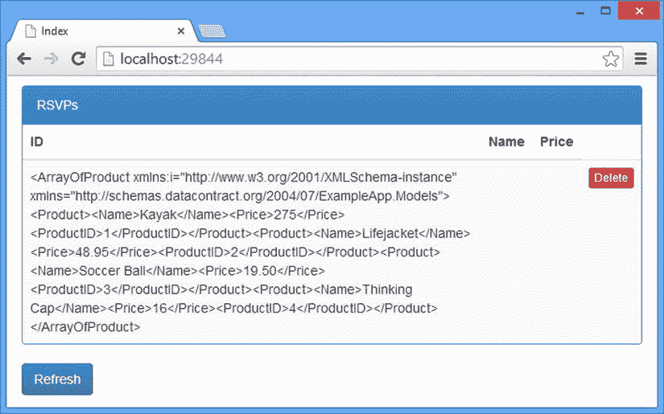
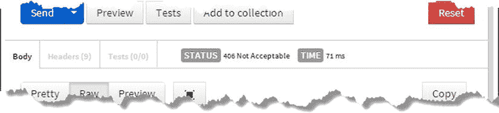
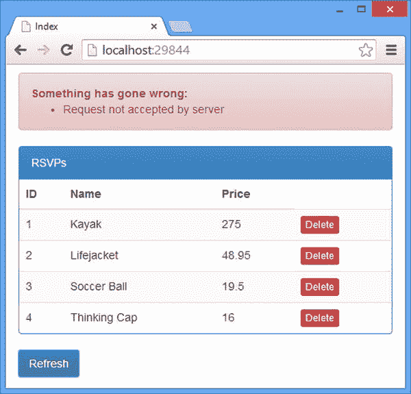
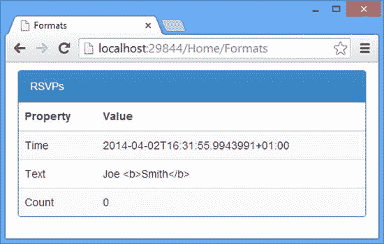
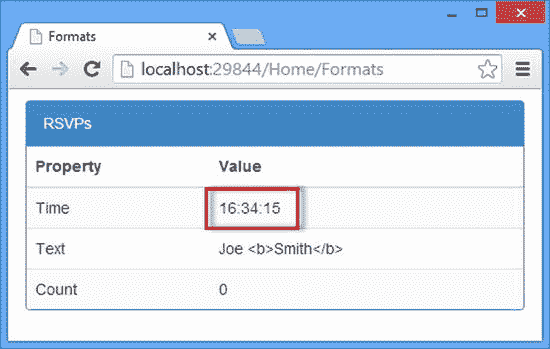

# 十三、使用内置的媒体格式化器

在这一章中，我将重点介绍内置的媒体类型格式化器类，它们用于将数据模型对象序列化为 JSON 和 XML。我首先向您展示当缺省媒体类型格式化器支持的格式与请求`Accept`头不匹配时，如何控制缺省媒体类型格式化器的使用方式，然后向您展示如何管理格式化器产生的序列化数据。

我在这一章的重点是 JSON 格式，而不是 XML。JSON 已经成为 HTTP web 服务的主要数据格式，因为它相对简洁、易于使用(尤其是在 JavaScript 代码中)，并且受到所有主要编程语言和 web 应用开发平台的支持。正如您将了解到的，JSON 序列化是由一个流行且维护良好的开源软件的最新版本执行的。NET 包，而 XML 序列化是使用自。NET 1.1 和。NET 3.0。表 [13-1](#Tab1) 总结了本章内容。

表 13-1。

Chapter Summary

<colgroup><col> <col> <col></colgroup> 
| 问题 | 解决办法 | 列表 |
| --- | --- | --- |
| 列出内置类型格式化器。 | 枚举由`HttpConfiguration.Formatters`属性返回的集合。 | 1–4 |
| 通过类型匹配功能更改查询格式化器以序列化类型的顺序。 | 操作由`HttpConfiguration.Formatters`属性返回的集合。 | five |
| 启用或禁用类型匹配功能。 | 使用由`DefaultContentNegotiator`类定义的`bool`构造函数参数。 | 6–9 |
| 缩进 JSON 数据。 | 将`JsonMediaTypeFormatter.Indent`属性设置为`true`。 | Ten |
| 选择日期值的格式。 | 设置`SerializerSettings.DateFormatHandling`属性。 | 11–16 |
| 对序列化 JSON 数据中的危险字符进行转义。 | 设置`SerializerSettings.StringEscapeHandling`属性。 | Seventeen |
| 在序列化的 JSON 数据中包含或排除空值和默认值。 | 设置`SerializerSettings.DefaultValueHandling`属性。 | 18, 19 |
| 在客户端处理 XML。 | 使用 jQuery 定位包含在`XMLDocument`对象中的元素。 | 20, 21 |

## 准备示例项目

我将继续使用前一章中的 ExampleApp 项目，但是我需要禁用我创建的自定义媒体格式化器，以便我可以专注于内置的格式化器。清单 13-1 显示了简化的`WebApiConfig.cs`文件。

清单 13-1。禁用 WebApiConfig.cs 文件中的自定义媒体格式化器

`using System.Web.Http;`

`using ExampleApp.Infrastructure;`

`using System.Net.Http.Formatting;`

`using System;`

`namespace ExampleApp {`

`public static class WebApiConfig {`

`public static void Register(HttpConfiguration config) {`

`config.DependencyResolver = new NinjectResolver();`

`//config.Services.Replace(typeof(IContentNegotiator),`

`//  new CustomNegotiator());`

`config.MapHttpAttributeRoutes();`

`config.Routes.MapHttpRoute(`

`name: "Api with extension",`

`routeTemplate: "api/{controller}.{ext}/{id}",`

`defaults: new {`

`id = RouteParameter.Optional,`

`ext = RouteParameter.Optional`

`}`

`);`

`config.Routes.MapHttpRoute(`

`name: "DefaultApi",`

`routeTemplate: "api/{controller}/{id}",`

`defaults: new { id = RouteParameter.Optional }`

`);`

`//MediaTypeFormatter prodFormatter = new ProductFormatter();`

`//prodFormatter.AddQueryStringMapping("format", "product",`

`//    "application/x.product");`

`//prodFormatter.AddRequestHeaderMapping("X-UseProductFormat", "true",`

`//    StringComparison.InvariantCultureIgnoreCase, false,`

`//    "application/x.product");`

`//prodFormatter.AddUriPathExtensionMapping("custom",`

`// "application/x.product");`

`//config.Formatters.Add(prodFormatter);`

`}`

`}`

`}`

Tip

请记住，您不必自己创建示例项目。你可以从[press 免费下载每一章的源代码。com](http://apress.com/) 。

我已经注释掉了配置和注册`ProductFormatter`媒体格式化器类的语句，这意味着将只使用内置格式化器。

## 使用内置媒体类型格式化器

Web API 包括一组四个内置的媒体格式化器。所有内置的媒体类型格式化器都参与了我在第 14-17 章中描述的模型绑定过程，但本章中有两个是有趣的，因为它们被用来序列化对象以生成 JSON 或 XML 数据，这样它就可以被发送到客户机。在接下来的小节中，我将向您展示如何管理和配置内置格式化器。表 [13-2](#Tab2) 将内置格式化器放在上下文中。

表 13-2。

Putting the Built-in Media Type Formatters in Context

<colgroup><col> <col></colgroup> 
| 问题 | 回答 |
| --- | --- |
| 它们是什么？ | 内置的媒体类型格式化器负责将数据序列化为 JSON 和 XML 格式。 |
| 你应该什么时候使用它们？ | 这些媒体类型格式化器被配置为默认使用，并将由内容协商过程选择，我在第 12 章的[中对此进行了解释，以生成客户端可以使用的格式的数据。](12.html) |
| 你需要知道什么？ | 如果客户端发送的`Accept`头与媒体类型格式化器类提供的格式不匹配，默认的内容协商程序类将选择第一个能够序列化数据模型类型的媒体类型格式化器。有关详细信息，请参见“在协商期间处理类型匹配”一节。 |

### 列出内置媒体类型格式化器

正如我在[第 12 章](12.html)中解释的，Web API 维护着一个媒体类型格式化器的集合，可以通过`HttpConfiguration.Formatters`属性来访问。除了我在[第 12 章](12.html)中描述的`Add`、`Insert`、`Remove`和`RemoveAt`方法之外，由`Formatters`属性返回的`MediaTypeFormatterCollection`类定义了方便的属性，这些属性提供了对四个内置媒体类型格式化器中的三个的直接访问，如表 [13-3](#Tab3) 中所述。

表 13-3。

The Convenience Properties Defined by the MediaTypeFormattingCollection Class

<colgroup><col> <col></colgroup> 
| 名字 | 描述 |
| --- | --- |
| `FormUrlEncodedFormatter` | 返回`FormUrlEncodedMediaTypeFormatter`类的一个实例，它用于在模型绑定过程中解析表单数据 |
| `JsonFormatter` | 返回`JsonMediaTypeFormatter`类的实例，它将数据序列化为 JSON 格式 |
| `XmlFormatter` | 返回`XmlMediaTypeFormatter`类的实例，它将数据序列化为 XML 格式 |

`MediaTypeFormattingCollection`类是可枚举的，这使得列出可用的格式化器并建立它们在集合中的相对顺序变得容易。正如您将了解到的，对格式化器进行排序可以改变用于序列化响应数据的数据格式。

我将使用 MVC 框架显示内置媒体类型的细节，这允许我演示呈现使用来自`System.Net.Http`名称空间的类的 Razor 视图所需的技术。我首先将一个名为`FormattersController.cs`的类文件添加到`Controllers`文件夹中，并使用它来定义清单 13-2 所示的 MVC 框架控制器。

清单 13-2。FormattersController.cs 文件的内容

`using System.Web.Http;`

`using System.Web.Mvc;`

`namespace ExampleApp.Controllers {`

`public class FormattersController : Controller {`

`public ActionResult Index() {`

`return View(GlobalConfiguration.Configuration.Formatters);`

`}`

`}`

`}`

这是一个 MVC 框架控制器，带有一个呈现默认视图的`Index`动作方法，传递通过静态`GlobalConfiguration.Configuration`属性获得的媒体类型格式化器的集合。为了创建视图，我在代码编辑器中右键单击`Index`方法，选择 Add View，并接受默认设置。Visual Studio 创建了`Views/Formatters/Index.cshtml`文件，我用它来定义清单 13-3 所示的视图。

清单 13-3。Views/Formatters 文件夹中 Index.cshtml 文件的内容

`@model IEnumerable<System.Net.Http.Formatting.MediaTypeFormatter>`

`@{ ViewBag.Title = "Formatters";}`

`
`

`
Media Type Formatters
`

`<table class="table table-striped">`

`<thead>`

`<tr><th>Name</th><th>MIME Types</th></tr>`

`</thead>`

`<tbody>`

`@foreach (var formatter in Model) {`

`<tr>`

`<td>@formatter.GetType().Name</td>`

`<td>`

`@((string)string.Join(", ",`

`formatter.SupportedMediaTypes.Select(x => x.MediaType)))`

`</td>`

`</tr>`

`}`

`</tbody>`

`</table>`

`
`

该视图包含一个我使用 Razor 填充的`table`元素和视图模型数据，以显示每个媒体类型格式化器的名称及其支持的 MIME 类型。如果您启动应用并请求`/formatters` URL，您将看到如下错误消息:

`Compiler Error Message:` `CS0012: The type 'System.Net.Http.Headers.MediaTypeHeaderValue' is defined in an assembly that is not referenced. You must add a reference to assembly 'System.Net.Http, Version=4.0.0.0, Culture=neutral, PublicKeyToken=b03f5f7f11d50a3a'.`

这个问题是因为 Razor 没有自动获取对`System.Net.Http`程序集的引用，它是从全局程序集缓存中获取的，而不是从我在[第 10 章](10.html)中安装的 NuGet 包中获取的。为了解决这个问题，我需要在`Web.config`文件的编译`configuration`部分添加一个程序集引用(在文件夹的根目录，而不是在`Views`文件夹)，如清单 13-4 所示。

清单 13-4。向系统添加引用。Web.config 文件中的. Net.Http 程序集

`...`

`<system.web>`

`<compilation debug="true" targetFramework="4.5.1">`

`<assemblies>`

`<add assembly="System.Net.Http, Version=4.0.0.0, Culture=neutral,`

`PublicKeyToken=b03f5f7f11d50a3a"/>`

`</assemblies>`

`</compilation>`

`<httpRuntime targetFramework="4.5.1" />`

`<pages>`

`<namespaces>`

`<add namespace="System.Web.Helpers" />`

`<add namespace="System.Web.Mvc" />`

`<add namespace="System.Web.Mvc.Ajax" />`

`<add namespace="System.Web.Mvc.Html" />`

`<add namespace="System.Web.Routing" />`

`<add namespace="System.Web.WebPages" />`

`</namespaces>`

`</pages>`

`</system.web>`

`<system.webServer>`

`...`

我修改了`compilation`元素，使其包含了`assemblies`元素，用于管理运行时程序集的显式引用集合。我定义了一个新的引用，使用一个`add`元素来创建对`System.Net.Http`程序集的引用，使用错误消息中的版本和公钥。

Tip

请记住，Web API 不使用`Web.config`文件，我在清单中所做的更改只有 MVC 框架才需要。参见我的专业 ASP.NET MVC 5 平台书，了解 ASP.NET 配置系统的细节，它是如何工作的，以及如何定制。

这一改变允许您从 MVC 控制器和视图中访问 Web API 配置信息和其他组件。启动应用并请求`/formatters` URL 来查看媒体类型格式化器集合的内容，如图 [13-1](#Fig1) 所示。

图 13-1。

The collection of Web API media type formatters WHAT ABOUT BSON?

BSON 是二进制 JSON，顾名思义，是 JSON 规范的二进制变体。MongoDB 数据库使用最广泛的是 BSON，但它被认为是 JSON 的更有效、更具表现力的替代方案——这个提议并没有受到普遍欢迎，在我写这篇文章时，关于效率优势的讨论非常活跃和热烈。您可以在 [`http://bsonspec.org`](http://bsonspec.org/) 了解更多关于 BSON 规范的信息。

BSON 可能会在未来扮演更广泛的角色，但目前的限制因素是客户端对 BSON 的支持很少，并且没有适用于在浏览器中运行的客户端的 JavaScript 实现。这意味着不可能像 JSON 数据那样接收 BSON 数据并自动解析成 JavaScript 对象。

Web API 包括一个 BSON 媒体格式化器(`System.Net.Http.Formatting`名称空间中的`BsonMediaTypeFormatter`类)，但是默认情况下它是禁用的。我不会在本书中描述 BSON 或者覆盖`BsonMediaTypeFormatter`,因为 BSON 规范不适用于使用 MVC 框架开发的客户端。

### 在协商过程中处理类型匹配

我向您展示了媒体类型格式化器集合的内容，因为在依赖于格式化器在图 [13-1](#Fig1) 所示的列表中出现的顺序的内容协商过程中有一个令人困惑的怪癖。

大多数时候，格式化器的顺序并不重要，因为客户端会发送一个指定 Web API 支持的格式的`Accept`头。你在第 12 章中看到了这一点，当时我使用 Chrome 向`/api/products` URL 发送 GET 请求。Chrome 发送一个优先选择 XML 的`Accept`头，这就是被发回的格式。你可以在图 [13-1](#Fig1) 中看到`XmlMediaTypeFormatter`类是负责`application/xml`和`text/xml` MIME 类型的格式化器，这是为 Chrome 请求选择的格式化器。在这种情况下，格式化器的顺序对发送到客户端的数据的格式没有任何影响。

您可以通过使用 Postman 向带有以下`Accept`标题的`/api/products` URL 发送 GET 请求来显式测试这个流程:

`application/x.product;q=1.0, application/xml;q=0.9, application/json;q=0.5`

`Accept`头指定了我在[第 12 章](12.html)中创建的`application/x.product`格式的首选。我禁用了清单 13-1 中自定义 MIME 类型的媒体类型格式化器，因此内容协商器将无法找到生成这种格式的格式化器，即使这是客户机更愿意接收的格式。

下一个最优选的格式是`application/xml`，它的`q`值比客户端唯一愿意接受的格式`application/json`要高。内容协商器选择`XmlMediaTypeFormatter`类来序列化由`Products`控制器中的`GetAll`动作方法返回的数据，即使它是图 [13-1](#Fig1) 所示的媒体类型格式化器集合中的第二个。图 [13-2](#Fig2) 显示了 web 服务返回的 XML 数据。

图 13-2。

Selecting a data format during normal negotiation

这是我在第 11 章中描述的行为，但出于两个原因，它值得重复。首先，这是 web 浏览器客户端选择大多数请求的数据格式的方式，因为浏览器和 jQuery 都会发送一个直接指定 XML 或 JSON 的`Accept`头。

我强调默认行为的另一个原因是，当 web 服务用来序列化数据的数据格式与客户机愿意接受的格式不匹配时，默认内容协商器会做出一些奇怪的事情。要查看发生了什么，将 Postman `Accept`头的值更改为以下内容:

`application/x.product;q=1.0`

这个头指定客户端将只接受`application/x.product`格式，因为应用中没有可用的媒体类型格式化器。当您发送请求时，Web API 用以下数据进行响应:

`[{"ProductID":1,"Name":"Kayak","Price":275.0},`

`{"ProductID":2,"Name":"Lifejacket","Price":48.95},`

`{"ProductID":3,"Name":"Soccer Ball","Price":19.50},`

`{"ProductID":4,"Name":"Thinking Cap","Price":16.0}]`

默认的 content negotiator 类已经用 JSON 数据进行了响应，这是意料之外的，因为客户端已经表明它不能处理 JSON 数据。

我在[第 11 章](11.html)中描述的`DefaultContentNegotiator`类有一个名为 match-on-type 的特性，默认情况下是启用的，用于在`Accept`头没有指定 Web API 可以使用的格式时选择一个格式化器。

内容协商器调用每个可用格式化器的`CanWriteType`方法，并将使用第一个为要序列化的数据类型返回`true`的方法。如图 [13-1](#Fig1) 所示，JSON 媒体类型格式化器是列表中的第一个，这就是为什么对`application/x.product` MIME 类型的请求产生了 JSON 数据，尽管这不是客户端可以接受的格式。在接下来的部分中，我将描述如何控制这个过程，并演示如何完全禁用它。

#### 更改媒体格式化器顺序

您可以使用表 [13-4](#Tab4) 中描述的方法，通过对`MediaTypeFormatterCollection`集合中的媒体格式化器重新排序，来更改匹配类型功能选择的数据格式。

表 13-4。

The Methods Defined by the MediaTypeFormattingCollection for Manipulating the Collection

<colgroup><col> <col></colgroup> 
| 名字 | 描述 |
| --- | --- |
| `Add(formatter)` | 向集合中添加新的格式化器 |
| `Insert(index, formatter)` | 在指定索引处插入格式化器 |
| `Remove(formatter)` | 移除指定的格式化器 |
| `RemoveAt(index)` | 移除指定索引处的格式化器 |

改变顺序的最简单的方法是使用我在表 [13-3](#Tab3) 中描述的便利属性来获得一个对你想要移动的格式化器对象的引用，并使用它作为表 [13-4](#Tab4) 中方法的参数。清单 13-5 展示了我如何使用`WebApiConfig.cs`文件提升集合中的 XML 格式化器。(我已经从前面的示例中删除了注释掉的语句。)

清单 13-5。更改 WebApiConfig.cs 文件中媒体类型格式化器的顺序

`using System.Web.Http;`

`using ExampleApp.Infrastructure;`

`using System.Net.Http.Formatting;`

`using System;`

`namespace ExampleApp {`

`public static class WebApiConfig {`

`public static void Register(HttpConfiguration config) {`

`config.DependencyResolver = new NinjectResolver();`

`config.MapHttpAttributeRoutes();`

`config.Routes.MapHttpRoute(`

`name: "DefaultApi",`

`routeTemplate: "api/{controller}/{id}",`

`defaults: new { id = RouteParameter.Optional }`

`);`

`MediaTypeFormatter xmlFormatter = config.Formatters.XmlFormatter;`

`config.Formatters.Remove(xmlFormatter);`

`config.Formatters.Insert(0, xmlFormatter);`

`}`

`}`

`}`

我从集合中移除了 XML 格式化器，并将其插回到位置 0，使其成为第一个格式化器，当没有来自`Accept`头的匹配格式时，它将被询问是否可以序列化数据类型。

Tip

使用`MediaTypeFormatterCollection`对象很尴尬。便利属性返回在 Web API 配置过程中自动创建的格式化器的实例。如果移除或替换一个格式化器，相应的便利属性将返回`null`。

启动应用并使用浏览器请求`/formatters`URL；您将看到`XmlMediaTypeFormatter`类首先出现在集合中。如果您使用 Postman 向带有仅指定了`application/x.product`格式的`Accept`报头的`/api/products` URL 发送 GET 请求，您将接收 XML 数据而不是 JSON。

#### 禁用类型匹配功能

更改格式化器的顺序并不能解决 match-on-type 特性的根本问题，即向客户端发送一个它可能无法处理的格式。最好的结果是客户端错误地陈述了它的`Accept`偏好，并且最终能够处理格式——但是这并不是做出数据格式选择的坚实基础。更常见的结果是，客户端会假设它正在处理它所请求的格式，这要么产生一个错误，要么几乎(但不完全)正常工作。

通过启动应用并使用浏览器请求`/Home/Index` URL，您可以看到一个几乎正常工作的数据格式示例。单击 Refresh 链接发送一个 Ajax 请求，该请求的目标是带有 GET 请求的`/api/products` URL，GET 请求的`Accept`头仅包含`application/x.product` MIME 类型(因为该请求是由我在[第 12 章](12.html)中设置的 jQuery 代码创建的，用于处理定制数据格式)。

自定义格式协商器使用匹配类型特性来选择 XML 格式化器，其效果如图 [13-3](#Fig3) 所示。

图 13-3。

The effect of sending a client an unknown format

很少有 web 服务客户端会检查他们收到的格式是否是他们要求的格式。在这种情况下，我在[第 12 章](12.html)中编写的 jQuery 代码假设它已经收到了预期的格式，并试图将其分解以便处理，但这样做时使用了 XML 数据中不存在的分隔符。结果是表中的一行，第一列包含完整的 XML 数据响应。

web 服务不检查接收到的数据格式的原因之一是类型匹配特性不符合 HTTP 规范，该规范规定，如果在`Accept`头中的数据格式和应用支持的数据格式之间不匹配，web 服务应该向客户端发送 406(不可接受)响应。这是一个好得多的结果，因为它没有假设客户机对它能够处理的数据格式是错误的。

`DefaultContentNegotiator`类定义了一个禁用匹配类型特性的构造函数参数。清单 13-6 显示了当使用我在《T2》第 10 章中为依赖注入创建的`NinjectResolver`类时如何设置这个选项。

清单 13-6。禁用 NinjectResolver.cs 文件中的类型匹配功能

`...`

`private void AddBindings(IKernel kernel) {`

`kernel.Bind<IRepository>().To<Repository>().InSingletonScope();`

`kernel.Bind<IContentNegotiator>().To<DefaultContentNegotiator>()`

`.WithConstructorArgument("excludeMatchOnTypeOnly", true);`

`}`

`...`

我已经定义了`IContentNegotiator`接口和`DefaultContentNegotiator`类之间的映射，并使用 Ninject `WithConstructorArgument`方法为`excludeMatchOnTypeOnly`构造函数参数设置一个值。当 Web API 要求 Ninject 提供一个`IContentNegotiator`接口的实现时，将用`true`的构造函数参数创建一个`DefaultContentNegotiator`类的实例，相当于调用这个:

`new DefaultContentNegotiator(true)`

构造函数参数的`true`值禁用类型匹配特性，并导致 web 服务向客户端发送 406(不可接受)消息，如图 [13-4](#Fig4) 所示。

图 13-4。

Getting a 406 (Not Acceptable) response from the web service Tip

如果您没有收到 406(不可接受)响应，您可能忘记了将`Accept`头添加到请求中。您必须指定`application/x.product` MIME 类型，以便不能基于内容类型选择任何媒体类型格式化器。

如果您不在应用中使用依赖注入，您将需要采取更直接的方法。清单 13-7 显示了如何在`WebApiConfig.cs`文件中禁用匹配类型。

清单 13-7。禁用 WebApiConfig.cs 文件中的类型匹配功能

`using System.Web.Http;`

`using ExampleApp.Infrastructure;`

`using System.Net.Http.Formatting;`

`using System;`

`namespace ExampleApp {`

`public static class WebApiConfig {`

`public static void Register(HttpConfiguration config) {`

`config.DependencyResolver = new NinjectResolver();`

`config.MapHttpAttributeRoutes();`

`config.Routes.MapHttpRoute(`

`name: "DefaultApi",`

`routeTemplate: "api/{controller}/{id}",`

`defaults: new { id = RouteParameter.Optional }`

`);`

`MediaTypeFormatter xmlFormatter = config.Formatters.XmlFormatter;`

`config.Formatters.Remove(xmlFormatter);`

`config.Formatters.Insert(0, xmlFormatter);`

`config.Services.Replace(typeof(IContentNegotiator),`

`new DefaultContentNegotiator(true));`

`}`

`}`

`}`

我使用`HttpConfiguration.Services`属性来获取包含 Web API 服务对象的`ServicesContainer`对象。我创建了一个`DefaultContentNegotiator`类的新实例，使用构造函数参数禁用匹配类型特性，并告诉 Web API 使用这个类作为带有`Replace`方法的`IContentNegotiator`接口的实现。

#### 在客户端处理不可接受的响应

为了处理 406(不可接受)响应，我需要添加向用户显示错误的支持。首先，我定义了一个 Knockout observable 数组，它将包含要显示的错误，以及一些向用户显示错误的 HTML 元素。清单 13-8 显示了我对`Views/Home`文件夹中的`Index.cshtml`文件所做的更改。

清单 13-8。准备在 Views/Home/Index.cshtml 文件中显示错误

`@model IEnumerable<ExampleApp.Models.Product>`

`@{ ViewBag.Title = "Index";}`

`@section Scripts {`

``

``

`}`

`
`

`
<strong>Something has gone wrong:</strong>
`

`<ul data-bind="foreach: errors">`

`<li data-bind="text: $data"></li>`

`</ul>`

`
`

`
`

`
RSVPs
`

`<table id="rsvpTable" class="table table-striped">`

`<thead>`

`<tr><th>ID</th><th>Name</th><th>Price</th></tr>`

`</thead>`

`<tbody data-bind="foreach: products">`

`<tr>`

`<td data-bind="text: ProductID"></td>`

`<td data-bind="text: Name"></td>`

`<td data-bind="text: Price"></td>`

`<td>`

`<button class="deleteBtn btn btn-danger btn-xs"`

`data-bind="click: deleteProduct">`

`Delete`

`</button>`

`</td>`

`</tr>`

`</tbody>`

`</table>`

`
`

`<button data-bind="click: getProducts" class="btn btn-primary">Refresh</button>`

新的可观察数组叫做`errors`，当可观察数组包含一个或多个条目时，显示我添加的 HTML 元素。我已经使用 Bootstrap `alert`样式设计了新元素，并使用 Knockout `foreach`绑定枚举了`errors`数组的内容，为每个元素生成了一个`li`元素。清单 13-9 显示了我对`Scripts`文件夹中的`exampleApp.js`文件所做的更改，以使用`errors`可观察数组响应`406 (Not Accepted)`状态代码。

清单 13-9。响应 exampleApp.js 文件中不可接受的响应

`$(document).ready(function () {`

`deleteProduct = function (data) {`

`$.ajax("/api/products/" + data.ProductID, {`

`type: "DELETE",`

`success: function () {`

`products.remove(data);`

`}`

`})`

`};`

`getProducts = function () {`

`errors.removeAll();`

`$.ajax("/api/products", {`

`headers: { "X-UseProductFormat": "true" },`

`//dataType: "text",`

`accepts: {`

`"*": "application/x.product"`

`},`

`success: function (data) {`

`products.removeAll();`

`var arr = data.split(",");`

`for (var i = 0; i < arr.length; i += 3) {`

`products.push({`

`ProductID: arr[i],`

`Name: arr[i + 1],`

`Price: arr[i + 2]`

`});`

`}`

`},`

`error: function (jqXHR) {`

`switch (jqXHR.status) {`

`case 406:`

`errors.push("Request not accepted by server");`

`break;`

`}`

`}`

`})`

`};`

`ko.applyBindings();`

`});`

为了处理来自服务器的响应，我使用了`error`设置来指定一个回调函数。传递给回调函数的参数是一个`jqXHR`对象，我通过检查`status`属性来查看我正在处理的错误类型。对于 406(不可接受)状态代码，我向`errors`可观察数组添加了一个新项目。(当调用`getProducts`函数时，我删除了`errors`数组中的所有项，这样错误就不会在多次尝试后累积。)

除了回调函数，我还改变了使用`dataType`和`accepts`设置的方式。默认情况下，jQuery 会将`*/*`添加到 Ajax 请求的`Accept`头中，这表明任何数据类型都是可以接受的——这不是我在这个例子中需要的。为了禁用默认消息头，我注释掉了设置`dataType`设置的语句，并更改了`accepts`设置以覆盖 jQuery 添加到所有请求的默认值，该值与名为`"*"`的属性相关联，如下所示:

`...`

`accepts: {`

`"*":` `"application/x.product"`

`},`

`...`

除了在`Accept`头中包含`*/*`会导致无法处理的数据格式之外，这种技术在很多情况下都不需要使用——而且这种情况很少发生，因为 JSON 已经成为 web 服务事实上的标准。

要测试更改，启动应用，导航到`/Home/Index` URL，然后单击 Refresh 按钮。jQuery 将向 Web API web 服务发出一个 Ajax 请求，该请求包含下面的`Accept`头:

`Accept: application/x.product`

web 服务无法生成该格式的序列化数据，并发回 406 状态代码，这将导致如图 [13-5](#Fig5) 所示的错误显示。

图 13-5。

Displaying an error to the user

## 使用 JSON 媒体类型格式化器

`JsonMediaTypeFormatter`类负责产生 JSON 数据。在幕后，JSON 数据是由 Json.Net 包生成的，这是一个开源库，已经成为最流行的 JSON 包。NET 应用。表 [13-5](#Tab5) 将`JsonMediaTypeFormatter`置于上下文中。

表 13-5。

Putting the JsonMediaTypeFormatter in Context

<colgroup><col> <col></colgroup> 
| 问题 | 回答 |
| --- | --- |
| 这是什么？ | JSON 媒体类型格式化器负责将对象序列化为 JSON 数据格式。 |
| 你应该什么时候使用它？ | 在内容协商过程中将自动选择格式化器。 |
| 你需要知道什么？ | 序列化工作由一个名为 Json.Net 的开源库完成。可以指定许多选项来控制 Json.Net 包生成的 JSON，这对于确保与期望 JSON 以特定方式构造的客户机的兼容性很有用。请参阅“配置 Json”。Net”部分获取详细信息。 |

### 配置 JSON 媒体类型格式化器

配置`JsonMediaTypeFormatter`类实际上就是配置 Json.Net。默认设置在大多数情况下都可以，但是您会发现一些较老的客户端可能会对它们处理的数据很挑剔，调整输出可能会很有用，特别是如果您使用 Web API 来重新实现遗留 Web 服务，并且无法同时更新客户端。表 [13-6](#Tab6) 显示了`JsonMediaTypeFormatter`类定义的配置成员。

表 13-6。

The JsonMediaTypeFormatter Configuration Methods

<colgroup><col> <col></colgroup> 
| 名字 | 描述 |
| --- | --- |
| `Indent` | 设置为`true`时，JSON 会缩进，更容易阅读。 |
| `MaxDepth` | 设置在模型绑定过程中读取 JSON 数据时允许的最大对象深度。 |
| `UseDataContractJsonSerializer` | 当设置为`true`时，将使用`DataContractJsonSerializer`而不是 Json.Net 包来产生 JSON 数据。 |
| `SerializerSettings` | 获取或设置用于配置序列化的`JsonSerializerSettings`对象。 |
| `CreateDefaultSerializerSettings()` | 创建一个用媒体类型格式化器使用的默认值配置的`JsonSerializerSettings`对象。 |

#### 更改底层 JSON 序列化程序

通过将`UseDataContractJsonSerializer`属性设置为`true`，可以用微软`DataContractJsonSerializer`类替换 Json.Net 包。与 Json.Net 相比，`DataContractJsonSerializer`类速度较慢，功能也不全面，但是如果您要重新实现使用了`DataContractJsonSerializer`类的遗留 web 服务，并且希望保留其 JSON 格式的特点，这样就不必在客户端进行更改，那么它会很有用。对于所有其他情况，应该使用 Json.Net 包——它更快、更灵活，并且生成的 JSON 容易被客户端使用。

#### 缩进 JSON 数据

配置`JSONMediaTypeFormatter`最简单的方法是通过由`MediaTypeFormatterCollection`类定义的便利属性。清单 13-10 显示了我如何使用这个属性来设置`WebApiConfig.cs`文件中`Indent`属性的值。

清单 13-10。在 WebApiConfig.cs 文件中配置 JSON 媒体类型格式化器

`using System.Web.Http;`

`using ExampleApp.Infrastructure;`

`using System.Net.Http.Formatting;`

`using System;`

`namespace ExampleApp {`

`public static class WebApiConfig {`

`public static void Register(HttpConfiguration config) {`

`config.DependencyResolver = new NinjectResolver();`

`config.MapHttpAttributeRoutes();`

`config.Routes.MapHttpRoute(`

`name: "DefaultApi",`

`routeTemplate: "api/{controller}/{id}",`

`defaults: new { id = RouteParameter.Optional }`

`);`

`MediaTypeFormatter xmlFormatter = config.Formatters.XmlFormatter;`

`config.Formatters.Remove(xmlFormatter);`

`config.Formatters.Insert(0, xmlFormatter);`

`config.Services.Replace(typeof(IContentNegotiator),`

`new DefaultContentNegotiator(true));`

`JsonMediaTypeFormatter jsonFormatter = config.Formatters.JsonFormatter;`

`jsonFormatter.Indent = true;`

`}`

`}`

`}`

设置`Indent`属性会导致`JsonMediaTypeFormatter`类缩进 JSON，这样每个对象和属性都在它自己的行上定义，缩进以便于阅读。启动应用，并使用 Postman 向`/api/products`发送一个 GET 请求，头部为`application/json`；您将收到如下数据:

`[`

`{`

`"ProductID": 1,`

`"Name": "Kayak",`

`"Price": 275.0`

`},`

`{`

`"ProductID": 2,`

`"Name": "Lifejacket",`

`"Price": 48.95`

`},`

`...`

我只展示了前两个`Product`对象，因为缩进的 JSON 占据了很多空间。将`Indent`属性设置为`true`可以更容易地读取媒体类型格式化器生成的 JSON，但是它会创建更大的 HTTP 响应，并且为缩进数据而添加的额外字符会导致编写不良的客户端 JSON 解析器出现问题。

### 配置 Json.Net

类的设计并没有隐藏它通常依赖于 Json.Net 包的事实。事实上，`SerializerSettings`属性和`CreateDefaultSerializerSettings`方法直接作用于`Json.Net.JsonSerializerSettings`类，后者是 Json.Net 包的一部分，根本不是 Web API 的一部分。Json.Net 类在`Newtonsoft.Json`命名空间中定义。

`CreateDefaultSerializerSettings`方法使用 Web API 使用的默认设置创建了一个`JsonSerializerSettings`类的新实例。当`JsonMediaTypeFormatter`类读写 JSON 数据时，`SerializerSettings`属性用于获取或设置用于配置 Json.Net 的`JsonSerializerSettings`对象。(我在[第 17 章](17.html)描述模型绑定过程的时候会解释 JSON 是怎么读的。)

在表 [13-7](#Tab7) 中，我已经列出了由`JsonSerializerSettings`类定义的属性，你可能想在 Web API 项目中改变这些属性以及`JsonMediaTypeFormatter`使用的默认值。它们很大程度上与 JSON 规范没有定义的数据类型有关，也没有客户机和 web 服务之间关于如何表达它们的某种协议。

Tip

参见 [`http://james.newtonking.com/json/help/index.html`](http://james.newtonking.com/json/help/index.html) 了解由`JsonSerializerSettings`类定义的属性的全部细节，包括我没有包括在本章中的那些。

表 13-7。

The Most Useful SerializerSettings Properties

<colgroup><col> <col></colgroup> 
| 名字 | 描述 |
| --- | --- |
| `DateFormatHandling` | 指定日期在 JSON 中的书写方式，表示为来自`DateFormatHandling`枚举的值。这些值是`IsoDateFormat`(默认值)，它将日期写成`2015-01-20T09:20Z`，以及`MicrosoftDateFormat`，它保留了与早期 Microsoft web 服务的兼容性。有关详细信息，请参见“处理 JSON 日期”一节。 |
| `DateFormatString` | 覆盖`DateFormatHandling`属性并设置日期的自定义格式。当`DateFormatHandling`为`IsoDateFormat`时使用的值为`yyyy'-'MM'-'dd'T'HH':'mm':'ss.FFFFFFFK`。 |
| `DefaultValueHandling` | 指定如何处理默认值，使用`DefaultValueHandling`枚举表示。默认值为`Include`，但更多细节请参见“处理默认值”一节。 |
| `NullValueHandling` | 使用来自`NullValueHandling`枚举的值，指定 JSON 数据中是否包含`null`属性。默认值为`Include`，表示包含属性。另一个可用的值是`Ignore`，它从 JSON 数据中省略了这些属性。 |
| `StringEscapeHandling` | 使用`StringEscapeHandling`枚举中的值指定 JSON 数据中字符串值的转义方式。默认值是`Default`，但是更多细节请参见“处理字符串转义”一节。 |

#### 创建示例控制器和客户机

JSON 序列化程序的一些选项值得进一步解释。我将在接下来的小节中详细介绍，但是首先我需要增强示例项目，以便演示格式化特性。首先，我在`Controllers`中添加了一个名为`FormatsController.cs`的类文件，并用它来定义如清单 13-11 所示的控制器。

清单 13-11。FormatsController.cs 文件的内容

`using System;`

`using System.Web.Http;`

`namespace ExampleApp.Controllers {`

`public class FormatsController : ApiController {`

`public object GetData() {`

`return new {`

`Time = DateTime.Now,`

`Text = "Joe <b>Smith</b>",`

`Count = 0`

`};`

`}`

`}`

`}`

Web API 控制器定义了一个返回包含`Time`、`Text`和`Count`属性的动态对象的单一动作方法。我将很快使用这些属性来演示不同的格式选项。

我需要一些方法来定位 Web API 控制器，所以我给 MVC `Home`控制器添加了一个动作方法，如清单 13-12 所示。

清单 13-12。在 HomeController.cs 文件中添加操作方法

`using System.Web.Mvc;`

`using ExampleApp.Models;`

`namespace ExampleApp.Controllers {`

`public class HomeController : Controller {`

`IRepository repo;`

`public HomeController(IRepository repoImpl) {`

`repo = repoImpl;`

`}`

`public ActionResult Index() {`

`return View(repo.Products);`

`}`

`public ActionResult Formats() {`

`return View();`

`}`

`}`

`}`

新的动作方法`Formats`调用`View`方法来呈现默认视图。不需要视图模型数据，因为我使用 Ajax 向 web 服务发送 HTTP 请求。清单 13-13 显示了`Views/Home/Formats.cshtml`文件的内容，我创建这个文件是为了用`Formats`动作方法渲染。

清单 13-13。Formats.cshtml 文件的内容

`@{ ViewBag.Title = "Formats"; }`

`@section Scripts {`

``

`}`

`
`

`
RSVPs
`

`<table id="rsvpTable" class="table table-striped">`

`<thead><tr><th>Property</th><th>Value</th></tr></thead>`

`<tbody>`

`<tr><td>Time</td><td data-bind="text: dataObject().Time"></td></tr>`

`<tr><td>Text</td><td data-bind="text: dataObject().Text"></td></tr>`

`<tr><td>Count</td><td data-bind="text: dataObject().Count"></td>`

`</tr>`

`</tbody>`

`</table>`

`
`

该视图中的 JavaScript 代码使用 jQuery 在文档准备就绪时发出 Ajax 请求。Ajax 请求的`success`回调将从 JSON 数据中解析出的 JavaScript 对象分配给一个名为`dataObject`的变量，并调用 Knockout `applyBindings`方法，以便数据对象的属性通过我添加到`td`元素的 Knockout `text`绑定显示在 HTML `table`元素中。要查看这些添加的效果，启动应用并请求`/Home/Formats` URL。结果如图 [13-6](#Fig6) 所示。

图 13-6。

Displaying JSON data

从 web 服务发送的 JSON 中的三个属性就像它们被接收时一样显示。在接下来的几节中，我将向您展示如何控制 web 服务产生的 JSON 输出，以获得不同的效果。

#### 处理 JSON 日期

在任何环境中，日期都是一个难题，因为它们有多种表达方式，以及地区日历和时区的无尽排列。只有在使用 JSON 时，情况会变得更糟，因为这种格式充当两种不同编程语言之间的中性交换，并且对于应该如何表示日期没有明确的定义。

最好的方法——也是 web 服务中使用最广泛的方法——是表达日期，以便用 JavaScript 轻松处理。这是 Json.Net 软件包使用的默认选项，因此不需要在 Web API 中进行任何更改。在清单 13-14 中，您可以看到我对`Formats.cshtml`文件中的`script`元素所做的修改，以便用 JavaScript 处理日期值。

清单 13-14。处理 Formats.cshtml 文件中的日期值

`...`

``

`...`

JavaScript 有一个内置的`Date`类型，通过调用`new Date`并使用`JsonMediaTypeFormatter`生成的字符串作为构造函数参数来创建实例。一旦有了一个`Date`对象，就有一系列方法可以用来获取关于指定日期和时间的信息。我使用`toLocateTimeString`方法获得了一个时间字符串，如图 [13-7](#Fig7) 所示。

图 13-7。

Processing a date value

如果您需要生成与客户端兼容的日期，而这些客户端依赖于微软曾经推广的旧格式，则可以将`SerializerSettings.DateFormatHandling`设置设置为`DateFormatHandling.MicrosoftDateFormat`值，其中日期表示如下:

`{ "Time":``"\/Date(1396385762063+0100)\/"`T2】

清单 13-15 显示了我如何在`WebApiConfig.cs`文件中启用微软日期格式。

清单 13-15。在 WebApiConfig.cs 文件中启用 Microsoft 日期格式

`using System.Web.Http;`

`using ExampleApp.Infrastructure;`

`using System.Net.Http.Formatting;`

`using System;`

`using Newtonsoft.Json;`

`namespace ExampleApp {`

`public static class WebApiConfig {`

`public static void Register(HttpConfiguration config) {`

`config.DependencyResolver = new NinjectResolver();`

`config.MapHttpAttributeRoutes();`

`config.Routes.MapHttpRoute(`

`name: "DefaultApi",`

`routeTemplate: "api/{controller}/{id}",`

`defaults: new { id = RouteParameter.Optional }`

`);`

`MediaTypeFormatter xmlFormatter = config.Formatters.XmlFormatter;`

`config.Formatters.Remove(xmlFormatter);`

`config.Formatters.Insert(0, xmlFormatter);`

`config.Services.Replace(typeof(IContentNegotiator),`

`new DefaultContentNegotiator(true));`

`JsonMediaTypeFormatter jsonFormatter = config.Formatters.JsonFormatter;`

`jsonFormatter.Indent = true;`

`jsonFormatter.SerializerSettings.DateFormatHandling`

`= DateFormatHandling.MicrosoftDateFormat;`

`}`

`}`

`}`

JavaScript `Date`对象不能处理这种格式，所以需要一些额外的操作。清单 13-16 显示了我对`Formats.cshtml`视图中的`script`元素所做的修改，以处理微软的日期格式。这个咒语从日期字符串中提取数值，并使用它来创建一个`Date`对象，并且可以在使用传统格式时一字不差地使用。

清单 13-16。处理 Formats.cshtml 文件中的 Microsoft 日期值

`...`

``

`...`

#### 处理字符串转义

默认情况下，在生成 JSON 数据时，字符串值中只有控制字符被转义。`StringEscapeHandling`设置允许您通过从`StringEscapeHandling`枚举中指定一个值来改变该行为，该枚举定义了表 [13-8](#Tab8) 中所示的值。

表 13-8。

The Values Defined by the StringEscapeHandling Enumeration

<colgroup><col> <col></colgroup> 
| 价值 | 描述 |
| --- | --- |
| `Default` | 只有控制字符被转义。 |
| `EscapeNonAscii` | 控制字符和非 ASCII 字符被转义。 |
| `EscapeHtml` | HTML 字符和控制字符被转义。 |

在任何 web 应用中，如果文本没有被转义，防止将其解释为 HTML 是很重要的。这可以防止脚本注入，在脚本注入中，数据值被精心设计为包含含有攻击应用或用户的 JavaScript 的`script`元素。我从 web 服务返回的数据包含一些良性的 HTML，如下所示:

`{ "Time":``"\/Date(1396385762063+0100)\/"``, "Text": "``Joe <b>Smith</b>`T4】

我使用了`b`元素来强调`Text`属性的部分值。淘汰制`text`绑定自动转义危险的 HTML 字符，这就是为什么在图 [13-7](#Fig7) 中`Smith`一词没有用粗体显示的原因。

在使用 web 服务时，仅仅依靠客户端来转义危险的 HTML 字符是不够的。您还应该对 web 服务本身中的危险字符进行转义，因为客户端集(或编写客户端的开发人员)可能会发生变化，这就带来了您的 web 服务可能被用作破坏它们的攻击媒介的风险。清单 13-17 显示了我是如何启用`WebApiConfig.cs`文件中表 [13-8](#Tab8) 的`EscapeHtml`选项的。

清单 13-17。在 WebApiConfig.cs 文件中启用 HTML 字符转义

`using System.Web.Http;`

`using ExampleApp.Infrastructure;`

`using System.Net.Http.Formatting;`

`using System;`

`using Newtonsoft.Json;`

`namespace ExampleApp {`

`public static class WebApiConfig {`

`public static void Register(HttpConfiguration config) {`

`//` `...other statements omitted for brevity...`

`JsonMediaTypeFormatter jsonFormatter = config.Formatters.JsonFormatter;`

`jsonFormatter.Indent = true;`

`jsonFormatter.SerializerSettings.DateFormatHandling`

`= DateFormatHandling.MicrosoftDateFormat;`

`jsonFormatter.SerializerSettings.StringEscapeHandling`

`= StringEscapeHandling.EscapeHtml;`

`}`

`}`

`}`

MVC 控制器渲染的内容没有任何变化，但是如果你用 Postman 向带有`application/json`的`Accept`头的`/api/formats` URL 发送 GET 请求，你会看到危险的 HTML 字符被转义了，像这样:

`{ "Time": "\/Date(1396421325274+0100)\/",`

`"Text": "``Joe \u003cb\u003eSmith\u003c/b\u003e`T2】

Tip

Postman 在结果数据的漂亮视图中格式化 HTML 内容。确保选择 Raw 视图来查看 web 服务发送的字符。

#### 处理默认值

`DefaultValueHandling`设置指定如何在`Json`数据中处理属性的默认值。对于对象和可空属性，默认值为`null`，对于数值属性，默认值为零，对于`bool`属性，默认值为`false`。使用`DefaultValueHandling`枚举中的值定义`DefaultValueHandling`设置，该值定义了表 [13-9](#Tab9) 中所示的值。

Tip

还有一个仅适用于`null`值的`NullValueHandling`设置。

表 13-9。

The Values Defined by the DefaultValueHandling Enumeration

<colgroup><col> <col></colgroup> 
| 价值 | 描述 |
| --- | --- |
| `Include` | 这是默认值，它包括 JSON 数据中带有默认值的属性。 |
| `Ignore` | 该设置从 JSON 数据中排除具有默认值的属性。 |
| `Populate` | 在反序列化 JSON 数据时使用该设置。当 JSON 数据中没有相应的属性时，它为 C#对象中的属性设置默认值。反序列化是模型绑定过程的一部分，我在第 14 章中描述了这个过程。 |
| `IgnoreAndPopulate` | 该设置结合了`Ignore`和`Populate`值。 |

`Include`值是默认值，这意味着我的示例数据对象中的`Count`属性包含在 web 服务生成的 JSON 中，即使它的值为零。

`{ "Time": "\/Date(1396421325274+0100)\/",`

`"Text": "Joe \u003cb\u003eSmith\u003c/b\u003e",``"Count": 0`T2】

清单 13-18 显示了我如何设置`DefaultValueHandling`来排除任何在`WebApiConfig.cs`文件中有默认值的属性。

清单 13-18。忽略 WebApiConfig.cs 文件中的默认值

`using System.Web.Http;`

`using ExampleApp.Infrastructure;`

`using System.Net.Http.Formatting;`

`using System;`

`using Newtonsoft.Json;`

`namespace ExampleApp {`

`public static class WebApiConfig {`

`public static void Register(HttpConfiguration config) {`

`//` `...other statements omitted for brevity...`

`JsonMediaTypeFormatter jsonFormatter = config.Formatters.JsonFormatter;`

`jsonFormatter.Indent = true;`

`jsonFormatter.SerializerSettings.DateFormatHandling`

`= DateFormatHandling.MicrosoftDateFormat;`

`jsonFormatter.SerializerSettings.StringEscapeHandling`

`= StringEscapeHandling.EscapeHtml;`

`jsonFormatter.SerializerSettings.DefaultValueHandling`

`= DefaultValueHandling.Ignore;`

`}`

`}`

`}`

结果是 JSON 数据中省略了`Count`属性:

`{ "Time": "\/Date(1396421578038+0100)\/",`

`"Text": "Joe \u003cb\u003eSmith\u003c/b\u003e"}`

省略带有默认值的属性意味着客户端必须能够在没有丢失属性的情况下工作，或者能够用默认值重新构建它们。清单 13-19 显示了我如何更新了文件`Formats.cshtml`中的 JavaScript 代码，以便在缺少属性`Count`时添加它。

清单 13-19。在 Formats.cshtml 文件中重新创建缺少的属性

`...`

``

`...`

Tip

我更喜欢包含具有默认值的属性，因为这意味着客户端总是在数据对象的一致表示上工作，并且不需要任何关于可能丢失的属性的先验知识。

## 使用 XML 媒体类型格式化器

`XmlMediaTypeFormatter`类负责将模型对象序列化为 XML 数据，与 JSON 媒体类型格式化器一样，它依赖于其他类来生成序列化数据。在这种情况下，默认使用`System.Runtime.DataContractSerializer`类。XML 曾经是 web 服务的主要数据格式，但几乎已经被 JSON 所取代，JSON 更紧凑、更易于使用。几乎每种平台和编程语言的组合都有 JSON 库，所以使用 XML 的唯一原因是为了与遗留客户端兼容。表 [13-10](#Tab10) 将`XmlMediaTypeFormatter`类放入上下文中。

Tip

在实际项目中，我使用`HttpConfiguration.Configuration.Formatters.Remove`方法将`XmlMediaTypeFormatter`从媒体类型格式化器集合中取出，用于不需要支持遗留客户端的应用。JSON 不仅得到了广泛的支持并且更容易使用，而且只支持一种数据格式减少了项目所需的单元和集成测试的数量。

表 13-10。

Putting the XmlMediaTypeFormatter Class in Context

<colgroup><col> <col></colgroup> 
| 问题 | 回答 |
| --- | --- |
| 这是什么？ | XML 媒体类型格式化器负责将对象序列化为 XML 数据格式。 |
| 你应该什么时候使用它？ | 在内容协商过程中将自动选择格式化器。 |
| 你需要知道什么？ | 用来产生 XML 数据的类是旧的、慢的和不灵活的。他们不支持最近的。NET 和 C#特性，比如动态对象。web API 中的 XML 支持在很大程度上是为了使 Web 服务能够支持最初开发的客户端，以使用由遗留的 Microsoft web 服务工具创建的 Web 服务。 |

WHAT HAPPENED TO XML WEB SERVICES?

术语 XML web services 在 21 世纪初用于描述高度结构化的 web 服务，这些服务由不同的 XML 文档和标准仔细描述，包括简单对象访问协议(SOAP)和 web 服务描述语言(WSDL)。这些标准用于创建松散耦合的客户端和服务，但是需要复杂的 XML 文档，很难使用。如今，那些仍然使用 XML 的 web 服务只使用这种格式来描述数据片段，而没有精确类型和服务描述的开销——很像您在其他示例中看到的 JSON 字符串，但是使用 XML 元素和属性而不是 JavaScript 样式的对象和属性来表达。

### 配置 XML 媒体类型格式化器

表 [13-11](#Tab11) 显示了由`XmlMediaTypeFormatter`类定义的配置成员。

表 13-11。

The XmlMediaTypeFormatter Configuration Methods

<colgroup><col> <col></colgroup> 
| 名字 | 描述 |
| --- | --- |
| `Indent` | 当设置为`true`时，XML 将缩进，使其更容易阅读(但更冗长)。 |
| `MaxDepth` | 设置在模型绑定过程中读取 XML 数据时允许的最大对象深度。 |
| `UseXmlSerializer` | 当设置为`true`时，`XmlSerializer`类将用于产生 XML 数据。 |
| `WriterSettings` | 获取用于配置序列化的`XmlWriterSettings`对象。 |

我不打算详细介绍如何配置`XmlMediaTypeFormatter`类，因为 XML 是 Web API 应用中较简单的数据格式，而且默认配置对大多数应用来说都很好。

`DataContractSerializer`类是在。NET 3.0，并且是由`XmlMediaTypeFormatter`类用来创建 XML 的默认序列化程序。您可以通过更改由`WriterSettings`属性返回的`XmlWriterSettings`对象的属性值来配置序列化程序——尽管大多数属性除了基本的格式化之外没有什么影响。您可以在 [`http://goo.gl/iMDEFZ`](http://goo.gl/iMDEFZ) 找到由`XmlWriterSettings`类定义的属性的完整列表。

如果将`WriterSettings`属性设置为`true`,`XmlMediaTypeFormatter`将使用`XmlSerializer`类，这个类已经存在很久了。NET 1.1。这两个类都很差，而且可以选择的是 2006 年的类或 2003 年的类，并且没有任何非微软的替代包作为替代品进入主流，这表明 XML 在 web 服务中的使用非常少。在 Web API 应用中使用 XML 的唯一原因是为了保持与遗留客户端的兼容性，对于不需要这样做的项目，应该使用 JSON。在 [`http://goo.gl/gz0lyH`](http://goo.gl/gz0lyH) 中有一个古老但仍然有用的两个 XML 序列化程序类的比较，它可以帮助您理解每个类的优点和(许多)缺点。

### 让 Xml 媒体类型格式化器工作

第一个任务是让`XmlMediaTypeFormatter`类工作，因为目前它不能序列化由`Formats`控制器中的`GetData`动作方法返回的数据，并且客户端代码目前不支持 XML。

#### 更新 Web API 控制器

Web API 控制器的问题是不能从动作方法返回动态对象。这意味着您需要在 MVC 框架中创建视图模型类的等价物，以从动作方法返回结果。我唯一感到沮丧的时候是当我不能从 LINQ `select`子句返回动态创建的对象的枚举时。清单 13-20 显示了我是如何用一个简单的定义相同属性的类来替换我为 JSON 格式化器使用的动态对象的。

清单 13-20。在 FormatsController.cs 文件中定义模型对象

`using System;`

`using System.Web.Http;`

`namespace ExampleApp.Controllers {`

`public class FormatsController : ApiController {`

`public DataObject GetData() {`

`return new DataObject {`

`Time = DateTime.Now,`

`Text = "Joe <b>Smith</b>",`

`Count = 0`

`};`

`}`

`}`

`public class DataObject {`

`public DateTime Time { get; set; }`

`public string Text { get; set; }`

`public int Count { get; set; }`

`}`

`}`

`DataObject`类定义了表示数据所需的`DateTime`、`string`和`int`属性。为了测试 XML 序列化，启动应用并使用 Postman 向`/api/formats` API 发送 GET 请求。(不需要指定一个`Accept`头，因为`WebApiConfig.cs`文件将`XmlMediaTypeFormatter`类设置为格式化器集合中的第一个，如果没有明确指定，Postman 会发送一个`*/*`的`Accept`头。)您将收到以下输出:

`<DataObject xmlns:i="`[`http://www.w3.org/2001/XMLSchema-instance`](http://www.w3.org/2001/XMLSchema-instance)T2】

`xmlns="`[`http://schemas.datacontract.org/2004/07/ExampleApp.Controllers`](http://schemas.datacontract.org/2004/07/ExampleApp.Controllers)T2】

`<Count>0</Count>`

`<Text>Joe <b>Smith</b></Text>`

`<Time>2014-04-02T19:27:30.8006076+01:00</Time>`

`</DataObject>`

#### 更新客户端 JavaScript 代码

jQuery 自动解析从 Ajax 接收的 XML 数据，创建一个`XMLDocument`对象，顾名思义，它是浏览器提供的 XML 文档的表示。`XMLDocument`的 API 很难使用，从 XML 数据创建 JavaScript 对象的最简单方法是使用通常用于处理 HTML 的 jQuery 方法。清单 13-21 显示了我如何更新了`Formats.cshtml`文件中的`script`元素来处理 Web API 控制器返回的 XML 数据。

清单 13-21。处理 Formats.cshtml 文件中的 XML 数据

`...`

``

`...`

在发出 Ajax 请求时将`dataType`设置为`xml`,告诉 jQuery 将数据视为 XML，并将`XMLDocument`对象传递给`success`回调函数。在回调中，我创建了一个属性数组，我需要从 XML 中提取这些属性，并使用 jQuery 获取每个属性的值。

`...`

`jsObject[props[i]] =``$(data).find(props[i]).text()`T2】

`...`

jQuery 语句有三个部分。`$(data)`部分在`XMLDocument`对象周围创建一个 jQuery 包装器，这意味着可以使用 jQuery 方法。`find`方法定位特定类型的所有元素，`text`方法返回匹配元素的组合文本内容。这段 JavaScript 和 jQuery 代码的效果是，我创建了一个对象，该对象具有我为其定义了剔除绑定的属性，并填充了来自 XML 数据的值。

## 摘要

在本章中，我解释了如何使用内置的媒体类型格式化器。我解释了默认内容协商器如何基于数据类型匹配媒体类型格式化器，以及如何覆盖这种行为来创建更符合 HTTP 标准的响应。我描述了如何使用 JSON 媒体类型格式化器，向您展示了由媒体类型格式化器本身和它所依赖的 JSON 序列化程序定义的配置选项。在本章的最后，我向您展示了如何使用 XML 媒体类型格式化器，并解释了在 web 服务中 XML 已经退居 JSON 之后，媒体类型格式化器可以用来生成 XML 的类是旧的，主要是为了向后兼容遗留客户端。在下一章，我将描述参数和模型绑定特性，媒体类型格式化器在其中发挥了作用。