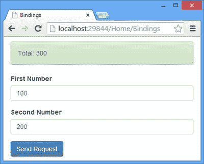
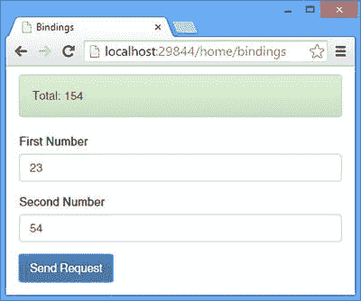

# 16.绑定复杂数据类型第一部分

在第 15 章中，我展示了如何使用值提供者从请求 URL 绑定简单的数据类型。在这一章中，我描述了模型绑定器，它建立在值提供者的基础上，允许绑定复杂的类型。在这一章中，我描述了内置的模型绑定器，它绑定了广泛的类型。我还解释了如何创建和应用定制的模型绑定器来处理内置绑定器无法处理的类型。

模型绑定器只对值提供者起作用，这意味着数据值是从 URL 获得的。媒体类型格式化程序负责从请求体中的数据创建复杂类型。我在第 12 章中介绍了媒体类型格式化器，当时我向你展示了数据对象是如何从动作方法结果序列化的。在[第 17 章](17.html)中，我解释了媒体类型格式化程序如何被用来反序列化数据和为动作方法参数创建模型对象。表 [16-1](#Tab1) 总结了这一章。

表 16-1。

Chapter Summary

<colgroup><col> <col> <col></colgroup> 
| 问题 | 解决办法 | 列表 |
| --- | --- | --- |
| 从 URL 绑定对象。 | 格式化 URL 或查询字符串，使其包含的属性与模型类的属性相对应。 | 1–8 |
| 拓宽模型绑定的价值来源。 | 使用`ModelBinder`接口来包含实现`IUriValueProviderFactory`接口的值提供者。 | 9–12 |
| 绑定简单类型的数组。 | 格式化数据，使路由或查询字符串属性具有相同的名称。 | 13–17 |
| 绑定键值对。 | 格式化数据以使用数组样式的索引器。 | 18–19 |
| 创建自定义模型活页夹。 | 实现`IModelBinder`接口。 | 20–24 |
| 应用自定义模型活页夹。 | 使用`ModelBinder`属性，并可选地将绑定器添加到服务集合中。您还可以创建一个参数绑定规则来应用模型绑定器。 | 25–31 |
| 使用以单个路由或查询字符串属性表示的数据实例化模型类。 | 创建一个类型转换器并用`TypeConverter`属性应用它。 | 32–35 |

## 准备示例项目

我将继续使用我在本书的这一部分一直使用的 ExampleApp 项目。为了准备本章，我已经删除了在[第 17 章](17.html)中创建参数绑定规则时使用的`WebApiConfig.cs`文件中的语句。清单 16-1 显示了我删除语句后的`WebApiConfig.cs`。

清单 16-1。WebApiConfig.cs 文件

`using System.Web.Http;`

`using ExampleApp.Infrastructure;`

`using System.Web.Http.ValueProviders;`

`using System.Net.Http.Headers;`

`namespace ExampleApp {`

`public static class WebApiConfig {`

`public static void Register(HttpConfiguration config) {`

`config.DependencyResolver = new NinjectResolver();`

`config.MapHttpAttributeRoutes();`

`config.Routes.MapHttpRoute(`

`name: "Binding Example Route",`

`routeTemplate: "api/{controller}/{action}/{first}/{second}"`

`);`

`config.Routes.MapHttpRoute(`

`name: "DefaultApi",`

`routeTemplate: "api/{controller}/{id}",`

`defaults: new { id = RouteParameter.Optional }`

`);`

`config.Services.Add(typeof(ValueProviderFactory),`

`new HeaderValueProviderFactory());`

`}`

`}`

`}`

Tip

请记住，您不必自己创建示例项目。你可以从 [`Apress.com`](http://apress.com/) 免费下载每一章的源代码。

如果没有绑定规则，Web API 将无法找到`Binding`控制器的`SumNumbers`动作方法上的`accept`参数的值。在这一章中，我将把重点放在绑定类上，所以我去掉了参数，如清单 16-2 所示。

清单 16-2。移除 BindingsController.cs 文件中的操作方法参数

`using System.Web.Http;`

`using ExampleApp.Models;`

`using System.Web.Http.ValueProviders;`

`using ExampleApp.Infrastructure;`

`namespace ExampleApp.Controllers {`

`public class BindingsController : ApiController {`

`private IRepository repo;`

`public BindingsController(IRepository repoArg) {`

`repo = repoArg;`

`}`

`[HttpGet]`

`[HttpPost]`

`public string SumNumbers([FromUri]Numbers numbers) {`

`return string.Format("{0}", numbers.First + numbers.Second);`

`}`

`}`

`}`

注意，我已经将`FromUri`属性应用于`numbers`参数。本章开始时，我向您展示了如何从 URL 绑定复杂类型参数，因此我需要指定`Numbers`对象的数据值不应该从请求体中获取。

我需要为这一章做的最后准备是改变在`bindings.js`文件中的 Ajax 请求，以便它使用 GET 动词并在查询字符串中包含模型数据，如清单 16-3 所示。

清单 16-3。在 bindings.js 文件中更改 Ajax 请求谓词

`var viewModel = ko.observable({ first: 2, second: 5 });`

`var response = ko.observable("Ready");`

`var gotError = ko.observable(false);`

`var sendRequest = function (requestType) {`

`$.ajax("/api/bindings/sumnumbers", {`

`type: "GET",`

`data: viewModel(),`

`success: function (data) {`

`gotError(false);`

`response("Total: " + data);`

`},`

`error: function (jqXHR) {`

`gotError(true);`

`response(jqXHR.status + " (" + jqXHR.statusText + ")");`

`}`

`});`

`};`

`$(document).ready(function () {`

`ko.applyBindings();`

`});`

要在继续本章的其余部分之前测试更改，请启动应用程序并使用浏览器导航到`/Home/Bindings` URL。单击“发送请求”按钮；`input`元素中的值将被发送给 web 服务，结果将显示在浏览器窗口的顶部，如图 [16-1](#Fig1) 所示。

图 16-1。

Preparing the example application

## 使用内置的模型绑定器

在第 15 章中，我向您展示了值提供者如何从 URL 获取数据值来绑定简单的类型参数。模型绑定器建立在值提供者的基础上，将来自请求的数据值组合成复杂类型的实例。

Tip

提醒一下，简单类型有`TimeSpan`、`DateTime`、`Guid`、`string`、`char`、`bool`、`int`、`uint`、`byte`、`sbyte`、`short`、`ushort`、`long`、`ulong`、`float`、`double`和`decimal`。任何其他类型都是复杂类型，包括简单类型的数组和集合。

Web API 附带了一组内置的模型绑定器，可以在最常见的情况下绑定对象。内置绑定足够全面，大多数应用程序根本不需要定制。在这一节中，我将解释内置的模型绑定器是如何工作的，以及如果您需要定制的绑定支持，如何调整它们的行为。

表 [16-2](#Tab2) 列出了你最常遇到的内置活页夹类。你不需要直接使用这些类，但是在创建定制绑定时，它们可以作为一个有用的基础，正如我在本章后面的“使用定制模型绑定”一节中所描述的。表 [16-2](#Tab2) 中列出的类在`System.Web.Http.ModelBinding.Binders`名称空间中定义。

表 16-2。

The Built-in Model Binder Classes

<colgroup><col> <col></colgroup> 
| 名字 | 描述 |
| --- | --- |
| `ArrayModelBinder` | 绑定对象数组。有关详细信息，请参见“绑定集合和数组”一节。 |
| `CollectionModelBinder` | 绑定强类型的`List`或`Enumerable`。有关详细信息，请参见“绑定集合和数组”一节。 |
| `DictionaryModelBinder` | 将键值对绑定到强类型的`Dictionary`。有关详细信息，请参见“绑定键值对”一节。 |
| `MutableObjectModelBinder` | 绑定对象。有关详细信息，请参见“绑定对象”一节。 |
| `TypeConverterModelBinder` | 使用类型转换器绑定对象，我在“使用类型转换器”一节中对此进行了描述。 |

在本章的后面，我将解释整个模型绑定特性是如何工作的，并向您展示如何创建和应用一个定制的模型绑定器。表 [16-3](#Tab3) 将默认模型绑定放在上下文中。

表 16-3。

Putting the Default Model Binders in Context

<colgroup><col> <col></colgroup> 
| 问题 | 回答 |
| --- | --- |
| 它们是什么？ | Web API 使用内置的模型绑定器，使用从值提供者获得的请求数据值来实例化类、数组和集合。 |
| 你应该什么时候使用它们？ | 当使用`FromUri`或`ModelBinder`属性时，使用内置的模型绑定器。请参阅“拓宽绑定值的来源”一节，了解这两个属性之间差异的详细信息。 |
| 你需要知道什么？ | Web API 包括默认的模型绑定器，可以处理大多数类的实例化和填充。只有当一个类需要特别注意实例化时，才需要创建一个定制的绑定器。 |

### 绑定对象

我将从描述 Web API 如何将一个类的单个实例绑定到一个参数开始，尤其是因为这是在示例应用程序中调用`SumNumbers` action 方法时已经发生的事情。

我在第 15 章的[中使用了`FromUri`属性来启用使用值类型提供者的简单类型参数的绑定。正如我在上一节中解释的，模型绑定器建立在值提供者的基础上，以获取多个值来创建一个对象，而`FromUri`属性可以为复杂类型参数启用这一特性，这就是为什么我将它应用于`numbers`参数。](15.html)

`...`

`public string SumNumbers(``[FromUri]`T2】

`...`

属性不是模型绑定器，它是一个负责创建特定类型对象的类。相反，`FromUri`是一个模型绑定属性，它告诉 Web API 使用模型绑定类来创建参数类型的实例，在本例中是`Numbers`。

模型绑定器是一个类，负责使用来自值提供者的一个或多个值来创建模型类型的实例，该实例在调用操作方法时用作参数。处理对象的内置模型绑定器分两步工作:

Use the parameterless constructor to create a new instance of the model type.   Set each property defined by the model type using a value from the value providers.  

这两个步骤是大多数模型类型只是自动实现的属性的集合的原因:定义带参数的构造函数没有意义，因为它将阻止模型绑定器创建实例，并且因为方法和 get-only 属性将被模型绑定器忽略。虽然简单，但这个类是一个很好的例子。

`...`

`public class Numbers {`

`public int First { get; set; }`

`public int Second { get; set; }`

`}`

`...`

Note

在本章中，我将对`bindings.js`文件进行修改，以便向 web 服务发送不同类型的请求，但是我不会在 Razor 视图中修改相应的 HTML，因为重要的是请求的格式，而不是用户修改请求中使用的数据值的能力。要测试更改，启动应用程序，导航到`/Home/Bindings` URL，然后单击 Send Request 按钮。

#### 绑定多个对象

默认情况下，当向值提供者询问每个属性的值时，对象模型绑定器会尝试使用参数的名称作为前缀。在我的例子中，这个参数叫做`numbers`，这意味着模型绑定器将试图在请求中获得`numbers.first`和`numbers.second`的值。

如果 value provides 不能获得前缀名称的值，那么模型绑定器将要求没有前缀的值:`first`和`second`。这是我在例子中一直依赖的行为。

前缀很有用，因为它们允许客户端在同一 URL 中发送同一类型的多个对象的数据。清单 16-4 显示了我是如何修改了`bindings.js`文件，以便在请求查询字符串中发送两个`Numbers`对象的值。

清单 16-4。在 bindings.js 文件中更改请求查询字符串

`var viewModel = ko.observable({ first: 2, second: 5, third: 10, fourth: 100 });`

`var response = ko.observable("Ready");`

`var gotError = ko.observable(false);`

`var sendRequest = function (requestType) {`

`$.ajax("/api/bindings/sumnumbers", {`

`type: "GET",`

`data: {`

`"numbers1.first": viewModel().first,`

`"numbers1.second": viewModel().second,`

`"numbers2.first": viewModel().third,`

`"numbers2.second": viewModel().fourth`

`},`

`success: function (data) {`

`gotError(false);`

`response("Total: " + data);`

`},`

`error: function (jqXHR) {`

`gotError(true);`

`response(jqXHR.status + " (" + jqXHR.statusText + ")");`

`}`

`});`

`};`

`$(document).ready(function () {`

`ko.applyBindings();`

`});`

Tip

注意，我在`data`设置对象中引用了属性名。表达前缀所需的点符号不能用作文字属性名，但是 JavaScript 足够灵活，能够将属性定义为带引号的字符串。

我已经向视图模型添加了两个属性，并使用它们为`data`设置创建了一个对象，将它们分成两个带前缀的集合。清单 16-4 中的更改将发送一个带有以下 URL 的请求:

`/api/bindings/sumnumbers?numbers1.first=2&numbers1.second=5&numbers2.first=10      &numbers2.second=100`

Tip

如果您现在测试这些更改，您将会看到一切似乎都正常，但是从 web 服务返回的结果是零。问题是模型绑定器创建了一个`Numbers`类的实例，它将两个`int`属性初始化为零，这是它们的默认值。然后，绑定器试图找到不在请求中的`numbers.first`和`numbers.second`值。绑定器丢弃前缀并寻找`first`和`second`值，它们也不在请求中。此时，binder 放弃了，action 方法被一个属性被设置为零的`Numbers`对象调用。绑定器尽最大努力获取值，并假设当值不存在时这不是问题。如果您希望确保请求包含某些值，则必须使用模型验证功能。详见[第 18 章](18.html)。

我需要更新 action 方法，使它有两个`Numbers`参数，它们的名称对应于请求 URL 中包含的前缀，如清单 16-5 所示。

清单 16-5。更改 BindingsController.cs 文件中的操作方法参数

`...`

`[HttpGet]`

`[HttpPost]`

`public string SumNumbers([FromUri] Numbers numbers1, [FromUri] Numbers numbers2) {`

`return string.Format("{0}", numbers1.First + numbers1.Second`

`+ numbers2.First + numbers2.Second);`

`}`

`...`

Tip

我使用了参数名`numbers1`和`numbers2`，但这不是必需的。您可以使用任何您喜欢的参数名，当绑定器查找属性值时，它们将被用作前缀。

#### 绑定嵌套对象

前缀也可以用来定义更复杂的对象的结构。为了演示这是如何工作的，我向复杂类型的`Numbers`类添加了一个属性——在本例中，一个`Operation`对象是在`BindingModels.cs`文件中定义的另一个类，如清单 16-6 所示。

清单 16-6。向 BindingModels.cs 文件中的 Numbers 类添加属性

`namespace ExampleApp.Models {`

`public class Numbers {`

`public int First { get; set; }`

`public int Second { get; set; }`

`public Operation Op { get; set; }`

`}`

`public class Operation {`

`public bool Add { get; set; }`

`public bool Double { get; set; }`

`}`

`}`

在清单 16-7 中，您可以看到我是如何修改 jQuery 请求的，这样它就包含了创建修改后的`Numbers`类的实例所需的前缀值。

清单 16-7。在 bindings.js 文件中更改请求查询字符串

`var viewModel = ko.observable({ first: 2, second: 5, add: true, double: true });`

`var response = ko.observable("Ready");`

`var gotError = ko.observable(false);`

`var sendRequest = function (requestType) {`

`$.ajax("/api/bindings/sumnumbers", {`

`type: "GET",`

`data: {`

`"numbers.first": viewModel().first,`

`"numbers.second": viewModel().second,`

`"numbers.op.add": viewModel().add,`

`"numbers.op.double": viewModel().double`

`},`

`success: function (data) {`

`gotError(false);`

`response("Total: " + data);`

`},`

`error: function (jqXHR) {`

`gotError(true);`

`response(jqXHR.status + " (" + jqXHR.statusText + ")");`

`}`

`});`

`};`

`$(document).ready(function () {`

`ko.applyBindings();`

`});`

这些更改创建了这样一个请求:

`api/bindings/sumnumbers?numbers.first=2&numbers.second=5&numbers.op.add=true      &numbers.op.double=true`

清单 16-8 显示了我对 action 方法所做的修改，以便通过模型绑定器从查询字符串中接收数据值。

清单 16-8。更改 BindingsController.cs 文件中的操作方法参数

`...`

`[HttpGet]`

`[HttpPost]`

`public string SumNumbers([FromUri] Numbers numbers) {`

`var result = numbers.Op.Add ? numbers.First + numbers.Second`

`: numbers.First - numbers.Second;`

`return string.Format("{0}", numbers.Op.Double ? result * 2: result);`

`}`

`...`

我不需要采取任何特殊的步骤来确保模型绑定器填充嵌套的`Operations`对象的属性，因为模型绑定器试图自动为它定位值。

### 拓宽绑定值的来源

模型绑定属性是一组值提供者工厂和可以创建不同类型的模型绑定类之间的代理。在使用`FromUri`属性时，我激活了模型绑定过程，但是我是用可用值提供者的子集来完成的。正如我在[第 15 章](15.html)中解释的那样，`FromUri`属性过滤掉任何没有实现`IUriValueProviderFactory`接口的值提供者工厂。我在第 15 章中解决了这个问题，在我的自定义值提供者工厂中实现了接口，这样我就可以从请求头中绑定简单的类型参数，但是还有一个替代方法:你可以使用`ModelBinder`属性，从这个属性中可以派生出`FromUri`属性。

属性`ModelBinder`和`FromUri`之间唯一的区别是`ModelBinder`使用所有可用的值提供者工厂。在这一节中，我将演示如何使用`ModelBinder`属性，以便单个模型类型属性的值可以来自更广泛的值提供者工厂。

第一个变化是向模型类添加一个新的属性，它将对应于一个请求头。清单 16-9 显示了向`Numbers`类添加一个`Accept`属性。(请忽略没有充分的理由将标题与`Numbers`类中的`int`值混合在一起——在本例中，这种技术很重要。)

清单 16-9。向 BindingModels.cs 文件中的模型类添加属性

`...`

`public class Numbers {`

`public int First { get; set; }`

`public int Second { get; set; }`

`public Operation Op { get; set; }`

`public string Accept { get; set; }`

`}`

`...`

我在[第 15 章](15.html)末尾从`HeaderValueProviderFactory`中移除了`IUriValueProviderFactory`接口，但是我仍然需要对类做一些修改。当我创建`HeaderValueProviderFactory`类时，我实现了`GetValueProvider`方法，这样它将只为 POST 请求返回一个`HeaderValueProvider`类的实例。在这一章中，我正在处理 GET 请求，所以我已经从`GetValueProvider`方法中移除了语句，这样就不会检查请求动词，如清单 16-10 所示。

清单 16-10。移除 HeaderValueProviderFactory.cs 文件中的 HTTP 方法限制

`using System.Net.Http;`

`using System.Web.Http.Controllers;`

`using System.Web.Http.ValueProviders;`

`namespace ExampleApp.Infrastructure {`

`public class HeaderValueProviderFactory : ValueProviderFactory {`

`public override IValueProvider GetValueProvider(HttpActionContext context) {`

`//if (context.Request.Method == HttpMethod.Post) {`

`return new HeaderValueProvider(new HeadersMap(context.Request.Headers));`

`//} else {`

`//    return null;`

`//}`

`}`

`}`

`}`

我还需要修改`HeaderValueProvider`类，以便能够处理前缀。清单 16-11 显示了这些变化。

清单 16-11。在 HeaderValueProvider.cs 文件中添加前缀支持

`using System.Globalization;`

`using System.Web.Http.ValueProviders;`

`using System.Linq;`

`namespace ExampleApp.Infrastructure {`

`public class HeaderValueProvider : IValueProvider {`

`private HeadersMap headers;`

`public HeaderValueProvider(HeadersMap map) {`

`headers = map;`

`}`

`public ValueProviderResult GetValue(string key) {`

`string value = headers[key.Split('.').Last()];`

`return value == null`

`? null`

`: new ValueProviderResult(value, value, CultureInfo.InvariantCulture);`

`}`

`public bool ContainsPrefix(string prefix) {`

`return false;`

`}`

`}`

`}`

绑定器首先调用值提供者的`GetPrefix`方法，以查看它们是否可以处理带有前缀`numbers`的请求。由于请求数据包含这个前缀，负责管理查询字符串的值提供者返回`true`，绑定器请求`numbers.first`和`numbers.second`的值。然后，活页夹对`numbers.Op`前缀重复该过程。最后，绑定器试图为`numbers.Accept`获取一个值。

正如您在清单 16-11 中看到的，我使用了`Add`方法向服务集合注册了`HeaderValueProvider`类，这意味着内置的值提供者在我的自定义类之前被查询。这样做的效果是没有调用`ContainsPrefix`方法，因为首先询问查询字符串值提供者，它能够提供绑定器需要的所有值，除了`numbers.Accept`。我对`GetValue`方法所做的更改拆分了请求属性名并提取了最后一个组件，这样我就可以将它与一个消息头匹配，为消息头提供它所需要的信息。

Tip

你可能想知道为什么我的`GetValue`方法被要求使用`numbers.Accept`，而`ContainsPrefix`方法总是返回`false`。发生这种情况是因为模型绑定器只能访问一个值提供者，所以微软定义了一个复合提供者来合并所有注册的值提供者的结果。统一提供者告诉模型绑定器，它可以生成带有`numbers`前缀的值，因为查询字符串值提供者说它可以——因此这种断言适用于所有的值提供者。

最后一步是修改控制器，使它使用`ModelBinder`属性，它返回给客户机的结果包括`Accept`请求头的值，如清单 16-12 所示。

清单 16-12。更新 BindingsController.cs 文件中的操作方法

`using System.Web.Http;`

`using ExampleApp.Models;`

`using System.Web.Http.ValueProviders;`

`using ExampleApp.Infrastructure;`

`using System.Web.Http.ModelBinding;`

`namespace ExampleApp.Controllers {`

`public class BindingsController : ApiController {`

`private IRepository repo;`

`public BindingsController(IRepository repoArg) {`

`repo = repoArg;`

`}`

`[HttpGet]`

`[HttpPost]`

`public string SumNumbers([ModelBinder] Numbers numbers) {`

`var result = numbers.Op.Add`

`? numbers.First + numbers.Second`

`: numbers.First - numbers.Second;`

`return string.Format("{0} (Accept:{1})",`

`numbers.Op.Double ? result * 2 : result, numbers.Accept);`

`}`

`}`

`}`

属性的使用意味着所有的值提供者工厂都被用来获取数据源，包括提供对请求头的访问的定制提供者。

Tip

默认情况下，action method 参数的名称用作前缀，但是在应用`ModelBinder`属性指定另一个前缀时，可以使用`Name`属性。有关使用`ModelBinder`属性的更多信息，请参见“应用定制模型绑定器”一节。

### 绑定集合和数组

内置的模型绑定器能够绑定多个相关的值来创建集合和数组。在清单 16-13 中，您可以看到我已经更改了客户端发送的查询字符串数据，使其包含一系列数值。

清单 16-13。更改 bindings.js 文件中的请求数据

`var viewModel = ko.observable({ first: 2, second: 5, third: 100});`

`var response = ko.observable("Ready");`

`var gotError = ko.observable(false);`

`var sendRequest = function (requestType) {`

`$.ajax("/api/bindings/sumnumbers", {`

`type: "GET",`

`data: {`

`numbers: [viewModel().first, viewModel().second, viewModel().third]`

`},`

`success: function (data) {`

`gotError(false);`

`response("Total: " + data);`

`},`

`error: function (jqXHR) {`

`gotError(true);`

`response(jqXHR.status + " (" + jqXHR.statusText + ")");`

`}`

`});`

`};`

`$(document).ready(function () {`

`ko.applyBindings();`

`});`

这些更改会产生一个针对以下 URL 的请求:

`/api/bindings/sumnumbers?numbers[]=2&numbers[]=5&numbers[]=100`

Tip

当请求以这种格式发送时，`[`和`]`字符被转义，并被替换为`%5B`和`%5D`序列。

您可以通过将 jQuery `traditional` Ajax 设置为`true`来省略方括号，这将以这种格式发送请求(两者都被 Web API 接受)。

`/api/bindings/sumnumbers?numbers=2&numbers=5&numbers=100`

我已经修改了`SumNumbers`动作方法来接收数据值数组，如清单 16-14 所示。

清单 16-14。将请求数据绑定为 BindingsController.cs 文件中的数组

`using System.Web.Http;`

`using ExampleApp.Models;`

`using System.Web.Http.ValueProviders;`

`using ExampleApp.Infrastructure;`

`using System.Web.Http.ModelBinding;`

`using System.Linq;`

`namespace ExampleApp.Controllers {`

`public class BindingsController : ApiController {`

`private IRepository repo;`

`public BindingsController(IRepository repoArg) {`

`repo = repoArg;`

`}`

`[HttpGet]`

`[HttpPost]`

`public string SumNumbers([ModelBinder] int[] numbers) {`

`return numbers.Sum().ToString();`

`}`

`}`

`}`

创建和填充数组的过程由模型绑定器处理，并传递给 action 方法。您可以选择接收与强类型`List`相同的数据，如清单 16-15 所示。

清单 16-15。将请求数据绑定为 BindingsController.cs 文件中的强类型集合

`using System.Web.Http;`

`using ExampleApp.Models;`

`using System.Web.Http.ValueProviders;`

`using ExampleApp.Infrastructure;`

`using System.Web.Http.ModelBinding;`

`using System.Linq;`

`using System.Collections.Generic;`

`namespace ExampleApp.Controllers {`

`public class BindingsController : ApiController {`

`private IRepository repo;`

`public BindingsController(IRepository repoArg) {`

`repo = repoArg;`

`}`

`[HttpGet]`

`[HttpPost]`

`public string SumNumbers([ModelBinder] List<int> numbers) {`

`return numbers.Sum().ToString();`

`}`

`}`

`}`

Tip

您还可以通过更改 action 方法参数的类型来绑定到强类型的`Enumerable`，比如`Enumerable<T>`。

#### 绑定复杂类型的数组和列表

我在上一节中使用的方法可以结合使用前缀来绑定复杂类型的数组。清单 16-16 显示了我对`bindings.js`文件所做的更改，这样 jQuery 就可以发送对应于一组`Numbers`对象的属性。

清单 16-16。更改 bindings.js 文件中的请求数据

`var viewModel = ko.observable({ first: 2, second: 5, third: 100, fourth: 200});`

`var response = ko.observable("Ready");`

`var gotError = ko.observable(false);`

`var sendRequest = function (requestType) {`

`$.ajax("/api/bindings/sumnumbers", {`

`type: "GET",`

`data: {`

`"numbers": [{ first: viewModel().first, second: viewModel().second },`

`{ first: viewModel().third, second: viewModel().fourth }],`

`},`

`success: function (data) {`

`gotError(false);`

`response("Total: " + data);`

`},`

`error: function (jqXHR) {`

`gotError(true);`

`response(jqXHR.status + " (" + jqXHR.statusText + ")");`

`}`

`});`

`};`

`$(document).ready(function () {`

`ko.applyBindings();`

`});`

我已经将`data`属性设置为一个具有名为`numbers`属性的对象，该对象又被设置为一个具有`first`和`second`属性的对象数组。结果是以下格式的请求:

`/api/bindings/sumnumbers?numbers[0][first]=22&numbers[0][second]=5`

`&numbers[1][first]=100&numbers[1][second]=200`

内置的绑定器计算出不同数据项之间的关系，并使用它们创建一个对象数组。清单 16-17 显示了对 action 方法的相应更改，以接收一组`Numbers`对象。

清单 16-17。接收 BindingsController.cs 文件中的复杂对象数组

`using System.Web.Http;`

`using ExampleApp.Models;`

`using System.Web.Http.ValueProviders;`

`using ExampleApp.Infrastructure;`

`using System.Web.Http.ModelBinding;`

`using System.Linq;`

`using System.Collections.Generic;`

`namespace ExampleApp.Controllers {`

`public class BindingsController : ApiController {`

`private IRepository repo;`

`public BindingsController(IRepository repoArg) {`

`repo = repoArg;`

`}`

`[HttpGet]`

`[HttpPost]`

`public string SumNumbers([ModelBinder] Numbers[] numbers) {`

`return numbers.Select(x => x.First + x.Second).Sum().ToString();`

`}`

`}`

`}`

Caution

您必须确保数组项的索引值没有间隔。当绑定器无法获得特定索引的值时，它将停止查找数据。例如，如果您的数据从`numbers[1]`跳到`numbers[3]`，那么绑定器将无法获得`numbers[2]`的值，并且永远不会请求`numbers[3]`或任何后续项。

### 绑定键值对

内置绑定器能够创建包含键值对的强类型`Dictionary`。清单 16-18 显示了我对`binders.js`文件所做的修改，以便用`Dictionary`绑定器寻找的格式发送数据请求。

清单 16-18。在 bindings.js 文件中发送键值请求数据

`var viewModel = ko.observable({ first: 2, second: 5, third: 100, fourth: 200 });`

`var response = ko.observable("Ready");`

`var gotError = ko.observable(false);`

`var sendRequest = function (requestType) {`

`$.ajax("/api/bindings/sumnumbers", {`

`type: "GET",`

`data: { numbers: [{ key: "one", value: { first: viewModel().first,`

`second: viewModel().second }},`

`{ key: "two", value: { first: viewModel().third,`

`second: viewModel().fourth }}]},`

`success: function (data) {`

`gotError(false);`

`response("Total: " + data);`

`},`

`error: function (jqXHR) {`

`gotError(true);`

`response(jqXHR.status + " (" + jqXHR.statusText + ")");`

`}`

`});`

`};`

`$(document).ready(function () {`

`ko.applyBindings();`

`});`

用于`data`设置的对象格式包含一个`number`属性(这样命名是为了让绑定器将它与动作方法参数相匹配),该属性被设置为一个具有`key`和`value`属性的对象数组。对于这个例子，我将把这个数据绑定到一个`Dictionary<string, Numbers>`对象，你可以看到我已经相应地设置了`key`和`value`属性。`key`将保留为字符串(尽管我可以使用可以绑定到任何类型的数据)，并且`value`被设置为具有`first`和`second`属性的对象，以便它可以绑定到`Numbers`对象。清单 16-18 中的更改创建了一个带有这种格式 URL 的请求。

`/api/bindings/sumnumbers?numbers[0][key]=one&numbers[0][value][first]=2`

`&numbers[0][value][second]=52&numbers[1][key]=two&numbers[1][value][first]=100`

`&numbers[1][value][second]=200`

在清单 16-19 中，您可以看到我是如何在 action 方法中接收字典的。

清单 16-19。接收 BindingsController.cs 文件中的键值对

`using System.Web.Http;`

`using ExampleApp.Models;`

`using System.Web.Http.ValueProviders;`

`using ExampleApp.Infrastructure;`

`using System.Web.Http.ModelBinding;`

`using System.Linq;`

`using System.Collections.Generic;`

`namespace ExampleApp.Controllers {`

`public class BindingsController : ApiController {`

`private IRepository repo;`

`public BindingsController(IRepository repoArg) {`

`repo = repoArg;`

`}`

`[HttpGet]`

`[HttpPost]`

`public string SumNumbers([ModelBinder] Dictionary<string, Numbers> numbers) {`

`return numbers.Select(x => x.Value.First + x.Value.Second).Sum().ToString();`

`}`

`}`

`}`

你可以混合搭配本章这一部分的技术，活页夹通常都能搞清楚。例如，您可以发送一个键-值对的集合，其中的值是一个复杂类型的数组，该数组的属性是一个键-值对的数组，等等。

## 使用自定义模型绑定器

正如我在上一节中所演示的，内置的模型绑定器能够处理各种各样的绑定。但是并不是所有的场景都被考虑到了；主要的限制是，只有当类具有无参数的构造函数时，它们才能被实例化，而数据值只能通过属性来设置，例如。在接下来的部分中，我将解释模型绑定器是如何工作的，并向您展示如何使用定制模型绑定器来处理默认绑定器无法处理的情况。表 [16-4](#Tab4) 将定制模型绑定放在上下文中。

表 16-4。

Putting Custom Model Binders in Context

<colgroup><col> <col></colgroup> 
| 问题 | 回答 |
| --- | --- |
| 它们是什么？ | 定制模型绑定允许在模型绑定过程中包含需要特殊处理的类。 |
| 你应该什么时候使用它们？ | 对于没有无参数构造函数或者不需要任何特殊处理的类，使用定制的模型绑定。 |
| 你需要知道什么？ | 定制模型绑定相当简单，但是在处理前缀时要小心。 |

### 准备应用程序

创建自定义绑定器的主要原因是实例化内置绑定器不能处理的类。当没有无参数构造函数或者必须执行特定的初始化过程时，这是最常见的情况。我经常在一些对象关系映射(ORM)系统中看到这种情况，这些系统需要创建它们所操作的对象，以便它们能够跟踪数据值的变化。我将为`Numbers`类创建一个模型绑定器。我想让这个例子更加真实，我对这个类做了一些修改，如清单 16-20 所示。

清单 16-20。更改 BindingModels.cs 文件中的 Numbers 类

`namespace ExampleApp.Models {`

`public class Numbers {`

`private int first, second;`

`public Numbers(int firstVal, int secondVal) {`

`first = firstVal; second = secondVal;`

`}`

`public int First {`

`get { return first; }`

`}`

`public int Second {`

`get { return second; }`

`}`

`public Operation Op { get; set; }`

`public string Accept { get; set; }`

`}`

`public class Operation {`

`public bool Add { get; set; }`

`public bool Double { get; set; }`

`}`

`}`

我添加了一个需要参数的构造函数，并更改了两个只读属性。这些更改将阻止默认的模型绑定器创建应用程序的实例，我将很快演示这一点。在清单 16-21 中，你可以看到我如何修改了控制器`Bindings`中的 action 方法，以便它接收一个`Numbers`对象作为参数。

清单 16-21。更改 BindingsController.cs 文件中的操作方法参数

`using System.Web.Http;`

`using System.Web.Http.ModelBinding;`

`using ExampleApp.Models;`

`namespace ExampleApp.Controllers {`

`public class BindingsController : ApiController {`

`private IRepository repo;`

`public BindingsController(IRepository repoArg) {`

`repo = repoArg;`

`}`

`[HttpGet]`

`[HttpPost]`

`public string SumNumbers([ModelBinder] Numbers numbers) {`

`var result = numbers.Op.Add ? numbers.First + numbers.Second`

`: numbers.First - numbers.Second;`

`return string.Format("{0}", numbers.Op.Double ? result * 2 : result);`

`}`

`}`

`}`

我需要做的最后一个准备工作是更改 Ajax 请求中 jQuery 发送的数据。清单 16-22 显示了我如何返回发送`first`和`second`属性，这两个属性都以`numbers`为前缀，匹配动作方法参数的名称。我还包含了`numbers.op.sum`和`numbers.op.double`属性，这样我就可以填充嵌套的`Operation`对象。

清单 16-22。更改 bindings.js 文件中的 Ajax 请求数据

`var viewModel = ko.observable({ first: 2, second: 5});`

`var response = ko.observable("Ready");`

`var gotError = ko.observable(false);`

`var sendRequest = function (requestType) {`

`$.ajax("/api/bindings/sumnumbers", {`

`type: "GET",`

`data: {`

`"numbers.first": viewModel().first,`

`"numbers.second": viewModel().second,`

`"numbers.op.add": true,`

`"numbers.op.double": true`

`},`

`success: function (data) {`

`gotError(false);`

`response("Total: " + data);`

`},`

`error: function (jqXHR) {`

`gotError(true);`

`response(jqXHR.status + " (" + jqXHR.statusText + ")");`

`}`

`});`

`};`

`$(document).ready(function () {`

`ko.applyBindings();`

`});`

#### 测试准备工作

这些变化造成了一种内置模型绑定器无法处理的绑定情况:`SumNumbers`动作方法有一个`Numbers`参数，但是`Numbers`类没有遵循默认模式进行实例化。您可以通过启动应用程序，在浏览器中导航到`/Home/Bindings`，并单击 Send Request 按钮来查看效果。

来自 web 服务的响应将在浏览器中报告为 500(内部服务器错误)，如果您在浏览器 F12 工具中查看响应，将会看到报告了以下问题:

`No parameterless constructor defined for this object`

我将在第 25 章中向你展示如何处理错误，但目前来看，已经证实内置模型绑定器不能实例化修改后的`Numbers`类就足够了。

### 了解模型绑定

模型绑定器实现了在`System.Web.Http.ModelBinding`名称空间中定义的`IModelBinder`接口。清单 16-23 显示了`IModelBinder`接口的定义。

清单 16-23。IModelBinder 接口

`using System.Web.Http.Controllers;`

`namespace System.Web.Http.ModelBinding {`

`public interface IModelBinder {`

`bool BindModel(HttpActionContext actionContext,`

`ModelBindingContext bindingContext);`

`}`

`}`

`IModelBinder`接口定义了一个名为`BindModel`的方法。这个模型的工作方式有点复杂。结果和第一个参数是完全标准的:`bool`结果用于指示模型绑定器是否能够创建 require 类型的实例，以及`HttpActionContext`对象。描述定义要绑定的参数的操作方法。表 [16-5](#Tab5) 显示了由`HttpActionDescriptor`类定义的属性和方法。这在模型绑定中很有用；还有额外的方法和属性，但是它们是在选择和执行一个动作方法时使用的，我会在第 22 章中描述。

表 16-5。

Selected Members Defined by the HttpActionDescriptor Class

<colgroup><col> <col></colgroup> 
| 名字 | 描述 |
| --- | --- |
| `ActionName` | 返回操作方法的名称 |
| `ReturnType` | 返回动作方法返回的`Type` |
| `SupportedHttpMethods` | 返回一组代表 HTTP 谓词的`HttpMethod`对象，这些谓词可用于定位操作方法 |
| `GetParameters()` | 返回代表操作方法参数的`HttpParameterDescription`对象的集合 |

`ModelBindingContext`参数是不同的:它描述了需要一个值的参数，但是它也提供了一种方法，通过这种方法将参数的值提供给 Web API，并且通过这种方法表达任何错误。这将更有意义，因为我将演示创建定制模型绑定器的过程，但是请记住，`ModelBindingContext`类向模型绑定器提供信息，并向 Web API 提供参数值，以便可以调用 action 方法。`ModelBindingContext`类定义了表 [16-6](#Tab6) 中所示的属性。

表 16-6。

Selected Properties Defined by the ModelBindingContext Class

<colgroup><col> <col></colgroup> 
| 名字 | 描述 |
| --- | --- |
| `FallbackToEmptyPrefix` | 如果模型绑定器可以忽略绑定前缀，则返回`true`。 |
| `Model` | 当模型绑定器能够创建模型类的实例时，由模型绑定器设置。 |
| `ModelMetadata` | 返回一个描述要绑定的参数类型的`ModelMetadata`对象。 |
| `ModelName` | 返回要绑定的参数的名称。 |
| `ModelState` | 返回一个用于执行验证的`ModelStateDictionary`对象。详见第十八章。 |
| `ModelType` | 返回绑定的参数的类型。 |
| `PropertyMetadata` | 提供一个由`ModelMetadata`对象组成的字典，这些对象描述了由模型类型定义的每个属性，并按名称进行索引。 |
| `ValidationNode` | 返回一个用于执行验证的`ModelValidationNode`对象。详见第十八章。 |
| `ValueProvider` | 返回一个`IValueProvider`，可用于从请求中获取单个数据值。默认返回的`IValueProvider`合并了对所有已在服务容器中注册或通过依赖注入注册的单个值提供者的访问。 |

模型绑定器的作用是使用`HttpActionDescriptor`和`ModelBindingContext`检查动作方法和参数，如果有合适的数据，创建一个由`ModelBindingContext.Type`属性指定的类的实例——模型。通过设置`ModelBindingContext.Model`属性并返回`true`作为`BindModel`方法的结果，模型被提供给 Web API。

Tip

如果没有合适的数据，那么使用`ModelBinding.ModelState`属性来报告错误。我会在第 18 章中解释模型如何被验证以及错误如何被处理。

### 创建自定义模型绑定器

有两种类型的模型绑定器。第一种是松散耦合的绑定。它们使用传递给`BindModel`方法的`HttpActionDescriptor`和`ModelBindingContext`对象中的元数据来实例化它们事先不知道的类。内置的模型绑定器是松散耦合的，因为它们会尝试绑定任何复杂的动作方法参数，但这种方法的局限性是它们不能处理具有构造函数参数或需要特殊配置的类。

另一类是 binders，`ModelBinder`attributes，它们被编写来处理一个特定的类。紧密耦合的绑定器预先知道创建和配置特定类所需的步骤，通常不需要使用元数据。紧密耦合类的问题是，当它们操作的类改变时，它们会中断，但是为了能够对困难的类使用模型绑定，这通常是一种可以接受的折衷。大多数应用程序都需要紧密耦合的绑定器，我将在本节中演示这一点。

Caution

松散耦合的类很难编写，并且需要彻底的测试，因为它们将被用来绑定各种各样具有不可预见的特征的奇怪的类。您应该依赖内置的活页夹，除非您对。NET 反射和元数据，并且您愿意留出大量的时间让您的绑定器工作。

我的紧耦合绑定器将创建`Numbers`类的实例，这意味着我需要从请求中提取几个值，并使用它们来创建和填充一个`Numbers`对象，如表 [16-7](#Tab7) 所述。

表 16-7。

The Request Properties Required by a Numbers Model Binder

<colgroup><col> <col></colgroup> 
| 名字 | 描述 |
| --- | --- |
| `numbers.first` | 需要设置由`Numbers`类定义的`First`属性，通过构造函数设置 |
| `numbers.second` | 需要设置由`Numbers`类定义的`Second`属性，通过构造函数设置 |
| `numbers.op.sum` | 需要设置`Operation`类的`Sum`属性，通过`Op`属性设置 |
| `numbers.op.double` | 需要设置`Operation`类的`Double`属性，通过`Op`属性设置 |
| `numbers.accept` | 需要设置由`Numbers`类定义的`Accept`属性 |

我在`Infrastructure`文件夹中添加了一个名为`NumbersBinder.cs`的类文件，并用它来定义清单 16-24 所示的模型绑定器。

清单 16-24。NumbersBinder.cs 文件的内容

`using System.Collections.Generic;`

`using System.Linq;`

`using System.Web.Http.Controllers;`

`using System.Web.Http.ModelBinding;`

`using System.Web.Http.ValueProviders;`

`using ExampleApp.Models;`

`namespace ExampleApp.Infrastructure {`

`public class NumbersBinder : IModelBinder {`

`public bool BindModel(HttpActionContext actionContext,`

`ModelBindingContext bindingContext) {`

`string modelName = bindingContext.ModelName;`

`Dictionary<string, ValueProviderResult> data`

`= new Dictionary<string, ValueProviderResult>();`

`data.Add("first", GetValue(bindingContext, modelName, "first"));`

`data.Add("second", GetValue(bindingContext, modelName, "second"));`

`data.Add("add", GetValue(bindingContext, modelName, "op", "add"));`

`data.Add("double", GetValue(bindingContext, modelName, "op", "double"));`

`data.Add("accept", GetValue(bindingContext, modelName, "accept"));`

`if (data.All(x => x.Value != null)) {`

`bindingContext.Model = CreateInstance(data);`

`return true;`

`}`

`return false;`

`}`

`private ValueProviderResult GetValue (ModelBindingContext context,`

`params string[] names) {`

`for (int i = 0; i < names.Length -1; i++) {`

`string prefix = string.Join(".",`

`names.Skip(i).Take(names.Length - (i + 1)));`

`if (context.ValueProvider.ContainsPrefix(prefix)) {`

`return context.ValueProvider.GetValue(prefix + "." + names.Last());`

`}`

`}`

`return context.ValueProvider.GetValue(names.Last());`

`}`

`private Numbers CreateInstance(Dictionary<string, ValueProviderResult> data) {`

`return new Numbers(Convert<int>(data["first"]),`

`Convert<int>(data["second"])) {`

`Op = new Operation {`

`Add = Convert<bool>(data["add"]),`

`Double = Convert<bool>(data["double"])`

`},`

`Accept = Convert<string>(data["accept"])`

`};`

`}`

`private T Convert<T>(ValueProviderResult result) {`

`try {`

`return (T)result.ConvertTo(typeof(T));`

`} catch {`

`return default(T);`

`}`

`}`

`}`

`}`

Caution

模型绑定器可以用来服务多个请求。在编写模型绑定器时不要使用实例变量，但是如果无法避免实例变量，请确保编写线程安全的代码，并在之后重置共享状态。

这个活页夹比它需要的要复杂一点，因为我已经构建了代码来分解活页夹必须遵循的步骤。在接下来的小节中，我将使用这个结构来解释每一步。

#### 从值提供程序获取模型属性值

我的绑定器采取的第一步是尝试定位每个属性的值，它需要创建一个`Numbers`类的实例，我在表 [16-7](#Tab7) 中列出了这些值。我在绑定器中定义了`GetValue`方法，它接收`ModelBindingContext`和一个字符串数组作为参数。

`...`

`private ValueProviderResult GetValue (ModelBindingContext context,`

`params string[] names) {`

`for (int i = 0; i < names.Length -1; i++) {`

`string prefix = string.Join(".",`

`names.Skip(i).Take(names.Length - (i + 1)));`

`if (context.ValueProvider.ContainsPrefix(prefix)) {`

`return context.ValueProvider.GetValue(prefix + "." + names.Last());`

`}`

`}`

`return context.ValueProvider.GetValue(names.Last());`

`}`

`...`

在第 15 章的[中，我解释了如果值提供者能够提供值，他们将返回一个`ValueProviderResult`对象，如果不能，则返回`null`。我的第一项工作是尝试收集包含我需要的值的一组`ValueProviderResult`结果，我需要以一种处理客户端发送的前缀的方式来完成这项工作。](15.html)

我采用了一种不同于微软在内置绑定中使用的处理前缀的方法。我不是对每个前缀只检查一次，而是独立地处理每个属性，并尝试为多个级别的前缀定位一个值。例如，如果我想要`numbers.op.add`属性，我请求如下:

`numbers.op.add`   `op.add`   `add`  

我使用一个`params`参数接收前缀和名称，这使得我可以很容易地使用 LINQ 来生成我所寻找的属性名称排列。我通过`ModelBindingContext.ValueProvider`属性与值提供者检查这些值，该属性返回一个`IValueProvider`，查询服务集合中注册的所有值提供者。我一得到一个前缀/名称排列的`ValueProviderResult`对象就终止搜索，并将其作为结果返回。

我从`GetBinding`方法调用`GetValue`方法来创建一个由属性名索引的`ValueProviderResult`对象的字典，如下所示:

`...`

`data.Add("first", GetValue(bindingContext, modelName, "first"));`

`data.Add("second", GetValue(bindingContext, modelName, "second"));`

`data.Add("add", GetValue(bindingContext, modelName, "op", "add"));`

`data.Add("double", GetValue(bindingContext, modelName, "op", "double"));`

`data.Add("accept", GetValue(bindingContext, modelName, "accept"));`

`...`

#### 检查值

一旦我向值提供者询问了每个属性，我就有了一个响应集合，这些响应可以是`ValueProviderResult`对象(表示提供者找到了一个值)或`null`(表示提供者找不到一个值)。此时，我必须决定我是否能够绑定模型，因此我执行了一个基本检查，以确保我没有收到任何`null`响应，如下所示:

`...`

`if (data.All(x => x.Value != null)) {`

`bindingContext.Model = CreateInstance(data);`

`return true;`

`}`

`return false;`

`...`

我使用 LINQ 来检查`null`值，如果有，我返回`false`。来自`BindModel`方法的`false`结果告诉 Web API，绑定器不能创建模型对象的实例。

Note

Web API 提供了一种模型验证机制，允许将错误有效地报告给用户。在这一章中，我只关注绑定过程，但是我会在第 18 章中描述模型验证和验证错误。

#### 创建模型对象

如果没有来自值提供者的`null`响应，我使用一种叫做`CreateInstance`的方法。顾名思义，`CreateInstance`方法负责创建`Numbers`类的一个实例，并用数据填充它。

创建模型对象实例时的一项重要任务是将来自`ValueProviderResult`对象的值转换成构造函数、方法和属性所需的类型。在自定义绑定器中，我将这个步骤分成了一个叫做`Convert`的强类型方法，如下所示:

`...`

`private Numbers CreateInstance(Dictionary<string, ValueProviderResult> data) {`

`return new Numbers(``Convert<int>(data["first"]``),``Convert<int>(data["second"])`T4】

`Op = new Operation {`

`Add =``Convert<bool>(data["add"])`T2】

`Double =` `Convert<bool>(data["double"])`

`},`

`Accept =` `Convert<string>(data["accept"])`

`};`

`}`

`...`

`CreateInstance`方法创建了`Numbers`对象，但是它通过调用`Convert`方法并使用通用类型参数和`ValueProviderResult`指定所需的类型来获取其值。`Convert`方法使用`ValueProviderResult.ConvertTo`方法来执行类型转换。

`...`

`private T Convert<T>(ValueProviderResult result) {`

`try {`

`return (T)result.ConvertTo(typeof(T));`

`} catch {`

`return default(T);`

`}`

`}`

`...`

如果值不能被转换，`ConvertTo`方法将抛出一个异常。在强类型方法中处理转换让我可以使用`default`关键字为调用者提供所需类型的默认值。在[第 18 章](18.html)中，我将向您展示如何在模型验证过程中报告绑定问题。

### 应用自定义模型绑定器

创建了自定义模型绑定器后，我需要告诉 Web API 使用它来绑定`Numbers`动作方法参数。有几种方法来应用粘合剂，这取决于你想要多广泛地应用粘合过程。在使用内置绑定器之前，Web API 在三个不同的地方寻找模型绑定指令，顺序是:

The `ModelBinder` attribute applied to the action method parameter   The `ModelBinder` attribute applied to the model class   A parameter binding rule  

在接下来的部分中，我将解释每个选项并演示它们的用法。

#### 将自定义绑定器直接应用于参数

应用模型绑定的最直接的方法是使用`ModelBinder`属性为动作方法参数指定绑定类型..，它定义了表 [16-8](#Tab8) 中描述的配置属性。

Tip

还有一个由`ModelBinder`属性定义的附加属性`SupressPrefixCheck`，但是它的值不会被其他模型绑定类检查。

表 16-8。

The Properties Defined by the ModelBinder Attribute

<colgroup><col> <col></colgroup> 
| 名字 | 描述 |
| --- | --- |
| `BinderType` | 此属性指定将用于参数的模型绑定器类。 |
| `Name` | 此属性指定将用作顶级前缀的名称，覆盖默认情况下使用的参数名称。 |

清单 16-25 显示了我如何应用`ModelBinder`属性并设置`BinderType`属性来为动作方法参数指定`NumbersBinder`类。

清单 16-25。在 BindingsController.cs 文件中应用自定义模型绑定器

`using System.Web.Http;`

`using System.Web.Http.ModelBinding;`

`using ExampleApp.Models;`

`using ExampleApp.Infrastructure;`

`namespace ExampleApp.Controllers {`

`public class BindingsController : ApiController {`

`private IRepository repo;`

`public BindingsController(IRepository repoArg) {`

`repo = repoArg;`

`}`

`[HttpGet]`

`[HttpPost]`

`public string SumNumbers([ModelBinder(BinderType=typeof(NumbersBinder))]`

`Numbers numbers) {`

`var result = numbers.Op.Add ? numbers.First + numbers.Second`

`: numbers.First - numbers.Second;`

`return string.Format("{0}", numbers.Op.Double ? result * 2 : result);`

`}`

`}`

`}`

我还没有设置`Name`属性，所以传递给绑定器的元数据将指定 action method 参数的名称将用作前缀。为了测试定制模型绑定器，启动应用程序，使用浏览器导航到`/Home/Bindings` URL，并单击 Send Request 按钮。`ModelBinder.BinderType`属性将覆盖内置绑定器的使用，并使用我的自定义绑定器来实例化`Numbers`类，避免了构造函数参数和只读属性的问题。

#### 向服务集合注册模型绑定器

如果您不想在每次应用`ModelBinder`属性时都使用`BinderType`属性，那么您可以向服务集合注册绑定器。清单 16-26 显示了我为了注册活页夹而对`WebApiConfig.cs`文件所做的修改。

清单 16-26。在 WebApiConfig.cs 文件中注册模型绑定器

`using System.Web.Http;`

`using ExampleApp.Infrastructure;`

`using System.Web.Http.ValueProviders;`

`using System.Net.Http.Headers;`

`using System.Web.Http.ModelBinding;`

`using System.Web.Http.ModelBinding.Binders;`

`using ExampleApp.Models;`

`namespace ExampleApp {`

`public static class WebApiConfig {`

`public static void Register(HttpConfiguration config) {`

`config.DependencyResolver = new NinjectResolver();`

`config.MapHttpAttributeRoutes();`

`config.Routes.MapHttpRoute(`

`name: "Binding Example Route",`

`routeTemplate: "api/{controller}/{action}/{first}/{second}"`

`);`

`config.Routes.MapHttpRoute(`

`name: "DefaultApi",`

`routeTemplate: "api/{controller}/{id}",`

`defaults: new { id = RouteParameter.Optional }`

`);`

`config.Services.Add(typeof(ValueProviderFactory),`

`new HeaderValueProviderFactory());`

`config.Services.Insert(typeof(ModelBinderProvider), 0,`

`new SimpleModelBinderProvider(typeof(Numbers), new NumbersBinder()));`

`}`

`}`

`}`

抽象`ModelBinderProvider`类的子类。是注册模型绑定器所必需的，但是当您希望绑定器用于特定类型的所有参数时，使用在`System.Web.Http.ModelBinding.Providers`名称空间中定义的`SimpleModelBinderProvider`类会更容易。`SimpleModelBinderProvider`构造函数的参数是绑定器实例化的类型和模型绑定器类的一个实例。

Tip

我已经使用了`Insert`方法来注册定制模型绑定器，这样它就可以优先于内置绑定器使用，内置绑定器将不能实例化`Numbers`类。

注册了绑定器后，我就可以从应用于 action method 参数的属性中删除类型了，如清单 16-27 所示。

清单 16-27。移除 BindingsController.cs 文件中的模型绑定器类型

`...`

`[HttpGet]`

`[HttpPost]`

`public string SumNumbers([ModelBinder] Numbers numbers) {`

`var result = numbers.Op.Add ? numbers.First + numbers.Second`

`: numbers.First - numbers.Second;`

`return string.Format("{0}", numbers.Op.Double ? result * 2 : result);`

`}`

`...`

#### 将活页夹应用到模型类

`ModelBinder`属性也可以应用于模型类，它的作用是将模型绑定器应用于该类型的每个动作方法参数。清单 16-28 显示了`ModelBinder`属性在`Numbers`模型类中的应用，其中`BinderType`属性用于指定定制的模型绑定器。

清单 16-28。使用 BindingModels.cs 文件中的 ModelBinder 属性

`using System.Web.Http.ModelBinding;`

`using ExampleApp.Infrastructure;`

`namespace ExampleApp.Models {`

`[ModelBinder(BinderType = typeof(NumbersBinder))]`

`public class Numbers {`

`private int first, second;`

`public Numbers(int firstVal, int secondVal) {`

`first = firstVal; second = secondVal;`

`}`

`public int First {`

`get { return first; }`

`}`

`public int Second {`

`get { return second; }`

`}`

`public Operation Op { get; set; }`

`public string Accept { get; set; }`

`}`

`public class Operation {`

`public bool Add { get; set; }`

`public bool Double { get; set; }`

`}`

`}`

Tip

我已经用`BinderType`属性展示了这个属性，因为我想让它更明显地显示将使用哪个绑定器。然而，向服务集合注册绑定器会影响使用的`ModelBinder`属性，如果愿意，可以省略`BinderType`属性。

当`ModelBinder`属性应用于模型类时，不需要将属性应用于动作方法。清单 16-29 显示了我是如何从控制器中移除属性的。

清单 16-29。移除 BindingsController.cs 文件中的 ModelBinding 属性

`...`

`[HttpGet]`

`[HttpPost]`

`public string SumNumbers(Numbers numbers) {`

`var result = numbers.Op.Add ? numbers.First + numbers.Second`

`: numbers.First - numbers.Second;`

`return string.Format("{0}", numbers.Op.Double ? result * 2 : result);`

`}`

`...`

#### 创建参数绑定规则

将`ModelBinder`属性应用到模型类会影响该类型的所有动作方法参数，如果您只需要为某些动作方法参数应用定制绑定，那么这可能会超出范围。通过定义参数绑定规则，您可以更好地控制模型绑定器的使用时间。然而，模型绑定器的参数绑定规则的主要好处是限制用于获取数据值的值提供者的集合，这在您想要确保(比如说)在模型绑定过程中不使用路由数据时会很有用。

在定义绑定规则之前，我需要从`Numbers`类中移除`ModelBinder`属性，如清单 16-30 所示。有了属性，绑定过程将不再寻找参数绑定规则。

清单 16-30。移除 BinderModels.cs 文件中的 ModelBinder 属性

`...`

`//[ModelBinder(BinderType = typeof(NumbersBinder))]`

`public class Numbers {`

`private int first, second;`

`...`

清单 16-31 显示了我添加到`WebApiConfig.cs`文件中的一个参数绑定规则，它将数据源限制在查询字符串和请求头中。

清单 16-31。在 WebApiConfig.cs 文件中定义参数模型绑定

`using System.Web.Http;`

`using ExampleApp.Infrastructure;`

`using System.Web.Http.ValueProviders;`

`using System.Net.Http.Headers;`

`using System.Web.Http.ModelBinding;`

`using System.Web.Http.ModelBinding.Binders;`

`using ExampleApp.Models;`

`using System.Web.Http.ValueProviders.Providers;`

`namespace ExampleApp {`

`public static class WebApiConfig {`

`public static void Register(HttpConfiguration config) {`

`config.DependencyResolver = new NinjectResolver();`

`config.MapHttpAttributeRoutes();`

`config.Routes.MapHttpRoute(`

`name: "Binding Example Route",`

`routeTemplate: "api/{controller}/{action}/{first}/{second}"`

`);`

`config.Routes.MapHttpRoute(`

`name: "DefaultApi",`

`routeTemplate: "api/{controller}/{id}",`

`defaults: new { id = RouteParameter.Optional }`

`);`

`config.Services.Add(typeof(ValueProviderFactory),`

`new HeaderValueProviderFactory());`

`config.Services.Insert(typeof(ModelBinderProvider), 0,`

`new SimpleModelBinderProvider(typeof(Numbers), new NumbersBinder()));`

`config.ParameterBindingRules.Add(x => {`

`return x.ParameterType == typeof(Numbers)`

`? new ModelBinderParameterBinding(x, new NumbersBinder(),`

`new ValueProviderFactory[] {`

`new QueryStringValueProviderFactory(),`

`new HeaderValueProviderFactory()})`

`: null;`

`});`

`}`

`}`

`}`

Tip

我在第 15 章中描述了内置的价值提供者。

`ModelBinderParameterBinding`类是从`HttpParameterBinding`派生出来的，它定义了一个接收`HttpParameterDescriptor`对象的构造函数，一个`IModelBinder`实现，以及一个`ValueProviderFactory`类的枚举。在清单中，我创建了一个规则，它指定了`NumbersBinder` binder 类，但是将值的来源限制为查询字符串和请求头。

Note

我在[第 15 章](15.html)中描述了`HttpParameterBinding`和`HttpParameterDescriptor`类。

## 使用类型转换器

类型转换器很奇怪。它们允许使用已成为的一部分的机制，从查询字符串创建复杂类型参数。NET 从 1.1 版本开始。为了完整起见，我将它们包含在本章中，但是它们所要求的 URL 格式在大多数 web 服务中并不特别有用。表 [16-9](#Tab9) 将类型转换器放在上下文中。

表 16-9。

Putting Type Converters in Context

<colgroup><col> <col></colgroup> 
| 问题 | 回答 |
| --- | --- |
| 它们是什么？ | 类型转换器集成了。NET 类型转换特性到 Web API 模型绑定过程中。 |
| 你应该什么时候使用它们？ | 当实例化一个类所需的所有数据都包含在单个查询字符串属性或路由段变量中时，请使用类型转换器。 |
| 你需要知道什么？ | 类型转换器并不真正适合模型绑定系统的其余部分，我还没有发现它们在实际项目中有用。 |

### 了解类型转换器

类型转换器负责从 URL、从单个查询字符串属性或路由段创建对象。类型转换器是从`System.ComponentModel.` `TypeConverter`类派生出来的，并与带有`TypeConverter`属性的动作方法参数相关联。

类型转换器的问题在于，它们需要所有必要的信息来创建一个模型对象的实例，以便用单个查询字符串参数或路由段来表示。我需要四个值来创建一个`Numbers`模型类的实例；使用类型转换器这样做意味着发送如下查询字符串:

`api/bindings/sumnumbers?numbers=2,54,true,true`

事实上，您可以用任何适合自己的方式对数据进行编码，但是为了简单起见，我用逗号分隔数据值。

Caution

使用类型转换器时，用单个字符分隔值是很常见的，但是在使用像`+`这样的字符作为分隔符时要小心。取自 URL 的字符串被认为是 URL 编码的，这意味着用一个空格替换了`+`字符。

### 创建类型转换器

`TypeConverter`类——实际上是整个`System.ComponentModel`名称空间——是一种用于管理和转换类型的通用机制，它的大多数特性在 Web API 中都没有作用。

创建 Web API 类型转换器相对简单，尤其是因为您可以忽略除了表 [16-10](#Tab10) 中的方法定义的类型和值参数之外的所有参数，这是在 Web API 应用程序中使用类型转换器所需的唯一参数。

表 16-10。

The Methods Required to Create a Web API Type Converter

<colgroup><col> <col></colgroup> 
| 名字 | 描述 |
| --- | --- |
| `CanConvertFrom(context, type)` | 调用以检查类型转换器是否能够从指定类型创建其模型对象的实例。在 Web API 中，该方法的实现应该为字符串返回`true`，为所有其他类型返回`false`。 |
| `ConvertFrom(context, culture,` `value)` | 调用以从请求值创建模型对象的实例，该请求值将是一个字符串。如果数据不能转换成模型对象，这个方法应该返回`null`。 |

为了演示如何创建类型转换器，我在`Infrastructure`文件夹中添加了一个名为`NumbersTypeConverter.cs`的类文件，并用它来定义清单 16-32 中所示的类。

清单 16-32。NumbersTypeConverter.cs 文件的内容

`using System;`

`using System.ComponentModel;`

`using System.Globalization;`

`using ExampleApp.Models;`

`namespace ExampleApp.Infrastructure {`

`public class NumbersTypeConverter : TypeConverter {`

`public override bool CanConvertFrom(ITypeDescriptorContext context,`

`Type sourceType) {`

`return sourceType == typeof(string);`

`}`

`public override object ConvertFrom(ITypeDescriptorContext context,`

`CultureInfo culture, object value) {`

`string valueToParse = value as string;`

`string[] elements = null;`

`if (valueToParse != null`

`&& (elements = valueToParse.Split(',')).Length == 4) {`

`int firstVal, secondVal; bool addVal, doubleVal;`

`if (int.TryParse(elements[0], out firstVal)`

`&& int.TryParse(elements[1], out secondVal)`

`&& bool.TryParse(elements[2], out addVal)`

`&& bool.TryParse(elements[3], out doubleVal)) {`

`return new Numbers(firstVal, secondVal) {`

`Op = new Operation {`

`Add = addVal,`

`Double = doubleVal`

`}`

`};`

`}`

`}`

`return null;`

`}`

`}`

`}`

为 action 方法创建对象的工作发生在`ConvertFrom`方法中，该方法从请求中获得数据，并且必须将其转换为 model 类的实例。在清单中，我将收到的字符串分割成一个数组，并使用`int.TryParse`和`bool.TryParse`方法将单个值转换成创建`Numbers`类实例所需的类型。如果我没有收到我期望格式的数据，那么我返回`null`来表明我不能创建模型类的实例。

### 应用类型转换器

类型转换器应用于模型类，而不是操作方法参数。在`System.ComponentModel`名称空间中定义的`TypeConverter`属性指定了用于创建模型实例的类型转换器类。清单 16-33 显示了我是如何将属性应用到`Numbers`类的。

清单 16-33。在 BindingModels.cs 文件中应用类型转换器

`using System.Web.Http.ModelBinding;`

`using ExampleApp.Infrastructure;`

`using System.ComponentModel;`

`namespace ExampleApp.Models {`

`//[ModelBinder(BinderType = typeof(NumbersBinder))]`

`[TypeConverter(typeof(NumbersTypeConverter))]`

`public class Numbers {`

`private int first, second;`

`public Numbers(int firstVal, int secondVal) {`

`first = firstVal; second = secondVal;`

`}`

`public int First {`

`get { return first; }`

`}`

`public int Second {`

`get { return second; }`

`}`

`public Operation Op { get; set; }`

`public string Accept { get; set; }`

`}`

`public class Operation {`

`public bool Add { get; set; }`

`public bool Double { get; set; }`

`}`

`}`

类型转换器只从 URL 读取它们的数据，这意味着我需要配置客户机以我在上一节中描述的格式发送 GET 请求。清单 16-34 显示了我为了配置 jQuery Ajax 请求而对`bindings.js`文件所做的修改。

清单 16-34。在 bindings.js 文件中配置 Ajax 请求

`var viewModel = ko.observable({ first: 2, second: 5});`

`var response = ko.observable("Ready");`

`var gotError = ko.observable(false);`

`var sendRequest = function (requestType) {`

`$.ajax("/api/bindings/sumnumbers", {`

`type: "GET",`

`data: "numbers=" + viewModel().first + ","`

`+ viewModel().second + "," + "true" + "," + true,`

`success: function (data) {`

`gotError(false);`

`response("Total: " + data);`

`},`

`error: function (jqXHR) {`

`gotError(true);`

`response(jqXHR.status + " (" + jqXHR.statusText + ")");`

`}`

`});`

`};`

`$(document).ready(function () {`

`ko.applyBindings();`

`});`

我格式化 Ajax 请求将被发送到的查询字符串，以便它使用类型转换器可以处理的格式。最后一步是禁用`WebApiConfig.cs`文件中的参数绑定规则，这会抢占`TypeConverter`属性。清单 16-35 显示了这些变化。

清单 16-35。禁用 WebConfig.cs 文件中的参数绑定规则

`using System.Web.Http;`

`using ExampleApp.Infrastructure;`

`using System.Web.Http.ValueProviders;`

`using System.Net.Http.Headers;`

`using System.Web.Http.ModelBinding;`

`using System.Web.Http.ModelBinding.Binders;`

`using ExampleApp.Models;`

`using System.Web.Http.ValueProviders.Providers;`

`namespace ExampleApp {`

`public static class WebApiConfig {`

`public static void Register(HttpConfiguration config) {`

`config.DependencyResolver = new NinjectResolver();`

`config.MapHttpAttributeRoutes();`

`config.Routes.MapHttpRoute(`

`name: "Binding Example Route",`

`routeTemplate: "api/{controller}/{action}/{first}/{second}"`

`);`

`config.Routes.MapHttpRoute(`

`name: "DefaultApi",`

`routeTemplate: "api/{controller}/{id}",`

`defaults: new { id = RouteParameter.Optional }`

`);`

`config.Services.Add(typeof(ValueProviderFactory),`

`new HeaderValueProviderFactory());`

`config.Services.Insert(typeof(ModelBinderProvider), 0,`

`new SimpleModelBinderProvider(typeof(Numbers), new NumbersBinder()));`

`//config.ParameterBindingRules.Add(x => {`

`//    return x.ParameterType == typeof(Numbers)`

`//        ? new ModelBinderParameterBinding(x, new NumbersBinder(),`

`//            new ValueProviderFactory[] {`

`//            new QueryStringValueProviderFactory(),`

`//            new HeaderValueProviderFactory()})`

`//        : null;`

`//});`

`}`

`}`

`}`

要测试类型转换器，启动应用程序并导航到`/Home/Bindings` URL。当您单击 Send Request 按钮时，jQuery 将发送一个 Ajax 请求，该请求包含一个查询字符串，该字符串包含单个属性中的所有值，然后该字符串将被类型转换器解析并作为参数传递给 action 方法。结果如图 [16-2](#Fig2) 所示。

图 16-2。

Using a type converter

## 摘要

在本章中，我向您展示了如何使用 Web API 通过模型绑定器从包含在请求 URL 中的数据绑定复杂类型。我演示了如何使用内置的模型提供者来绑定对象、数组和集合，以及如何创建和应用定制的模型绑定器，这在处理需要特殊处理的类时非常有用。我关注的是查询字符串，但是同样的技术也适用于路由数据，我将在第 20 章和第 21 章[中详细介绍。我通过解释类型转换器结束了这一章，类型转换器是一个古老的。NET 特性集成到 Web API 类框架中。在下一章中，我将向你展示媒体类型格式化器——我在《T4》第 12 章](21.html)中介绍的用来序列化动作方法结果的格式化器——如何被用来从请求体中反序列化对象。我还向您展示了如何用您自己创建的参数绑定系统完全替换默认的参数绑定系统。