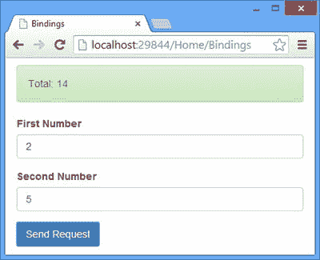
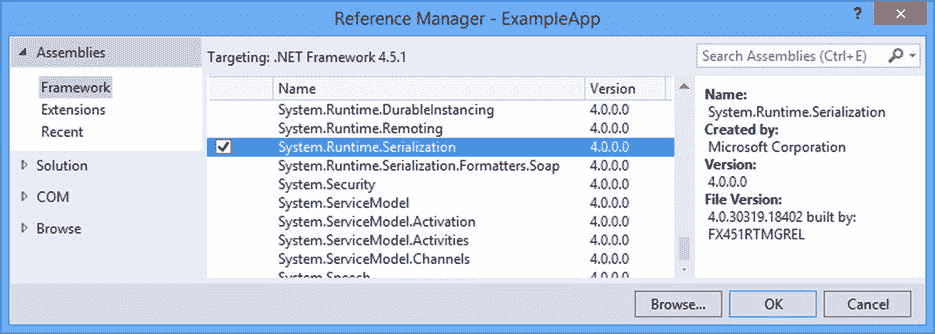

# 十七、绑定复杂数据类型：第二部分

在这一章中，我将通过解释如何使用媒体类型格式化器从请求体中反序列化复杂类型来总结参数和模型绑定过程。我将向您展示如何使用自定义媒体类型格式化器执行反序列化，然后详细介绍内置格式化器如何工作，包括如何从客户端发送所需格式的数据。在本章的最后，我将向你展示如何用一个定制的实现来替换负责集成我从第 15 章开始描述的行为的类。表 [17-1](#Tab1) 总结了这一章。

表 17-1。

Chapter Summary

<colgroup><col> <col> <col></colgroup> 
| 问题 | 解决办法 | 列表 |
| --- | --- | --- |
| 反序列化自定义数据格式。 | 创建一个媒体类型格式化器并覆盖`ReadFromStreamAsync`方法。 | 1–6 |
| 注册自定义媒体类型格式化器。 | 将 formatter 类的实例添加或插入到`HttpConfiguration.Formatters`集合中。 | seven |
| 处理 URL 编码的数据。 | 瞄准`FormUrlEncodedMediaTypeFormatter`或`JQueryMvcFormUrlEncodedFormatter`媒体类型格式化器。 | 8–11 |
| 从 URL 编码的数据实例化困难的类型。 | 从`FormUrlEncodedMediaTypeFormatter`类派生一个自定义类，并覆盖`ReadFromStreamAsync`方法来读取数据并绑定对象。 | 12–15 |
| 处理 JSON 编码的数据。 | 瞄准`JsonMediaTypeFormatter`媒体类型格式化器。 | Sixteen |
| 从 JSON 编码的数据实例化困难的类型。 | 从`MediaTypeFormatter`类派生一个自定义类，并直接使用 Json.Net 库。 | 17–18 |
| 处理 XML 编码的数据。 | 将`DataContract`和`DataMember`属性应用于模型类，并将`XmlMediaTypeFormatter`媒体类型格式化器作为目标。 | 19–20 |
| 从 XML 编码的数据中实例化困难的类型。 | 从`MediaTypeFormatter`类派生一个定制类，并使用 LINQ 到 XML 来处理数据。 | 21–22 |
| 更改整个参数和模型绑定过程。 | 通过直接实现接口或从`DefaultActionValueBinder`类派生来创建`IActionValueBinder`接口的自定义实现。 | 23–26 |

## 准备示例项目

在本书的这一部分，我将继续使用我一直在使用的 ExampleApp 项目，但是我需要为这一章做一些准备性的修改。首先我需要简化`Numbers`类，这样它就有了一个无参数的构造函数和可设置的属性——这些变化是我演示默认行为所必需的。清单 17-1 显示了我所做的修改，包括移除我在第十六章的[中应用的`ModelBinder`和`TypeConverter`属性。我已经将带有参数的构造函数留在了适当的位置，这样我就可以演示如何处理需要特殊处理的对象。](16.html)

清单 17-1。简化 BindingModels.cs 文件中的类

`namespace ExampleApp.Models {`

`public class Numbers {`

`public Numbers() { /* do nothing */ }`

`public Numbers(int first, int second) {`

`First = first; Second = second;`

`}`

`public int First { get; set; }`

`public int Second { get; set; }`

`public Operation Op { get; set; }`

`public string Accept { get; set; }`

`}`

`public class Operation {`

`public bool Add { get; set; }`

`public bool Double { get; set; }`

`}`

`}`

Tip

请记住，您不必自己创建示例项目。你可以从 Apress.com 免费下载每一章的源代码。

我需要从`WebApiConfig.cs`文件中删除模型绑定配置。我将在本章中描述的特性不使用值提供者或模型绑定器。清单 17-2 显示了修改后的配置文件。

清单 17-2。简化 WebApiConfig.cs 文件

`using System.Web.Http;`

`using System.Web.Http.ModelBinding;`

`using System.Web.Http.ModelBinding.Binders;`

`using System.Web.Http.ValueProviders;`

`using ExampleApp.Infrastructure;`

`using ExampleApp.Models;`

`namespace ExampleApp {`

`public static class WebApiConfig {`

`public static void Register(HttpConfiguration config) {`

`config.DependencyResolver = new NinjectResolver();`

`config.MapHttpAttributeRoutes();`

`config.Routes.MapHttpRoute(`

`name: "Binding Example Route",`

`routeTemplate: "api/{controller}/{action}/{first}/{second}"`

`);`

`config.Routes.MapHttpRoute(`

`name: "DefaultApi",`

`routeTemplate: "api/{controller}/{id}",`

`defaults: new { id = RouteParameter.Optional }`

`);`

`config.Services.Add(typeof(ValueProviderFactory),`

`new HeaderValueProviderFactory());`

`config.Services.Insert(typeof(ModelBinderProvider), 0,`

`new SimpleModelBinderProvider(typeof(Numbers), new NumbersBinder()));`

`}`

`}`

`}`

最后一个变化是对`bindings.js`文件的修改，这样 jQuery Ajax 请求就可以使用标准的数据编码和 POST 动词。清单 17-3 显示了这些变化。

清单 17-3。在 bindings.js 文件中更改请求谓词和数据格式

`var viewModel = ko.observable({`

`first: 2, second: 5, "op.add": true, "op.double": true`

`});`

`var response = ko.observable("Ready");`

`var gotError = ko.observable(false);`

`var sendRequest = function (requestType) {`

`$.ajax("/api/bindings/sumnumbers", {`

`type: "POST",`

`data: viewModel(),`

`success: function (data) {`

`gotError(false);`

`response("Total: " + data);`

`},`

`error: function (jqXHR) {`

`gotError(true);`

`response(jqXHR.status + " (" + jqXHR.statusText + ")");`

`}`

`});`

`};`

`$(document).ready(function () {`

`ko.applyBindings();`

`});`

我还想改变`Bindings`控制器中的`SumNumbers`动作方法，以便它返回一个`int`结果。我把结果改成了一个`string`，这样我就可以包含`Accept`头的值，但是我只需要在本章中报告由`SumNumbers`动作方法执行的计算结果。清单 17-4 显示了动作方法的变化。

清单 17-4。更改 BindingsController.cs 文件中的操作方法结果

`using System.Web.Http;`

`using System.Web.Http.ModelBinding;`

`using ExampleApp.Models;`

`using ExampleApp.Infrastructure;`

`namespace ExampleApp.Controllers {`

`public class BindingsController : ApiController {`

`private IRepository repo;`

`public BindingsController(IRepository repoArg) {`

`repo = repoArg;`

`}`

`[HttpGet]`

`[HttpPost]`

`public int SumNumbers(Numbers numbers) {`

`var result = numbers.Op.Add ? numbers.First + numbers.Second`

`: numbers.First - numbers.Second;`

`return numbers.Op.Double ? result * 2 : result;`

`}`

`}`

`}`

### 测试应用

要测试更改，启动应用并使用浏览器导航到`/Home/Bindings` URL。当您点击发送请求按钮时，客户端将显示结果，该结果将是输入元素中值总和的两倍，如图 [17-1](#Fig1) 所示。

图 17-1。

Testing the application preparation

## 创建自定义媒体类型格式化器

默认情况下，Web API 假定任何复杂类型参数都将从请求体中获取，并使用媒体类型格式化器来尝试获取和绑定值。我在第 12 章的[中介绍了媒体类型格式化器，并在第 13 章](12.html)的[中描述了内置的 JSON 和 XML 媒体类型格式化器，但我在这两章中的重点都是使用它们来序列化来自动作方法结果的数据，以便可以将数据发送到客户端。媒体类型格式化器也能够反序列化数据，并使用它来创建调用动作方法所需的类的实例。](13.html)

Tip

提醒一下，简单类型是`TimeSpan`、`DateTime`或`Guid`对象或。网络原语类型:`string`、`char`、`bool`、`int`、`uint`、`byte`、`sbyte`、`short`、`ushort`、`long`、`ulong`、`float`、`double`、`decimal`。任何其他类型——包括简单类型的数组和集合——都是复杂类型。

在《T2》第 12 章中，我创建了`ProductFormatter`类，它负责将`Product`对象格式化成一个字符串，如下所示:

`1,Kayak,275.0`

三个逗号分隔的值代表由`Product`模型对象定义的`ProductId`、`Name`和`Price`属性。在这一节中，我将返回到这种数据格式，并创建一个媒体类型格式化器，可以反序列化它来创建`Numbers`对象。表 [17-2](#Tab2) 将创建一个自定义媒体类型格式化器来将数据反序列化到上下文中。

表 17-2。

Putting Custom Media Type Formatters in Context

<colgroup><col> <col></colgroup> 
| 问题 | 回答 |
| --- | --- |
| 它们是什么？ | 自定义媒体类型可用于反序列化请求正文中的数据，该请求正文采用定制或不常见的编码格式。自定义媒体格式化器对于处理无法通过调用无参数构造函数和设置属性来实例化的类也很有用。 |
| 你应该什么时候使用它们？ | 内置的媒体类型格式化器(我将在本章后面介绍)支持最常见的数据格式，但是自定义格式化器对于处理必须以特定方式实例化的类或者当您需要支持不使用通用数据格式的遗留客户端时非常有用。 |
| 你需要知道什么？ | 媒体类型格式化器不一定要能够序列化数据，我在第 12 章的[中描述过。相反，您可以创建仅反序列化数据的格式化器，这在您的应用以标准格式发送数据但需要解决客户端发送的糟糕编码时非常有用。](12.html) |

### 准备客户端

我需要做的第一个改变是改变 jQuery 发送的 Ajax 请求，以便数据是预期的格式，并且正确设置了`Content-Type`头，如清单 17-5 所示。

清单 17-5。在 bindings.js 文件中更改 Ajax 请求

`var viewModel = ko.observable({`

`first: 2, second: 5, add: true, double: true`

`});`

`var response = ko.observable("Ready");`

`var gotError = ko.observable(false);`

`var sendRequest = function (requestType) {`

`$.ajax("/api/bindings/sumnumbers", {`

`type: "POST",`

`contentType: "application/x.product",`

`data: [viewModel().first, viewModel().second, viewModel().add,`

`viewModel().double].join(),`

`success: function (data) {`

`gotError(false);`

`response("Total: " + data);`

`},`

`error: function (jqXHR) {`

`gotError(true);`

`response(jqXHR.status + " (" + jqXHR.statusText + ")");`

`}`

`});`

`};`

`$(document).ready(function () {`

`ko.applyBindings();`

`});`

我已经使用了`contentType`设置来指定内容采用我的自定义`application/x.product`编码(我在[第 12 章](12.html)中使用的 MIME 类型)，并通过创建一个包含来自视图模型的值的数组和调用`join`方法为`data`设置创建了一个格式化字符串，该方法使用逗号分隔符将这些值组合在一起。如果您启动应用并发送请求，您将在 F12 工具中看到以下 URL:

`/api/bindings/sumnumbers`

它的有效载荷如下:

`2,5,true,true`

web 服务将报告一个错误，因为我还没有实现反序列化支持。

### 创建媒体类型格式化器

现在我有了一个可以处理的请求，是时候创建自定义媒体类型格式化器了。我在`Infrastructure`文件夹中添加了一个名为`XNumbersFormatter.cs`的类文件，并用它来创建如清单 17-6 所示的媒体类型格式化器。

清单 17-6。XNumbersFormatter.cs 文件的内容

`using System;`

`using System.IO;`

`using System.Linq;`

`using System.Net.Http;`

`using System.Net.Http.Formatting;`

`using System.Net.Http.Headers;`

`using System.Text;`

`using System.Threading.Tasks;`

`using ExampleApp.Models;`

`namespace ExampleApp.Infrastructure {`

`public class XNumbersFormatter : MediaTypeFormatter {`

`long bufferSize = 256;`

`public XNumbersFormatter() {`

`SupportedMediaTypes.Add(new MediaTypeHeaderValue("application/x.product"));`

`}`

`public override bool CanWriteType(Type type) {`

`return false;`

`}`

`public override bool CanReadType(Type type) {`

`return type == typeof(Numbers);`

`}`

`public async override Task<object> ReadFromStreamAsync(Type type,`

`Stream readStream, HttpContent content, IFormatterLogger formatterLogger) {`

`byte[] buffer = new byte[Math.Min(content.Headers.ContentLength.Value,`

`bufferSize)];`

`string[] items = Encoding.Default.GetString(buffer, 0,`

`await readStream.ReadAsync(buffer, 0, buffer.Length)).Split(',', '=');`

`if (items.Length == 4) {`

`return new Numbers(`

`GetValue<int>("First", items[0], formatterLogger),`

`GetValue<int>("Second", items[1], formatterLogger)) {`

`Op = new Operation {`

`Add = GetValue<bool>("Add", items[2], formatterLogger),`

`Double = GetValue<bool>("Double", items[3], formatterLogger)`

`}`

`};`

`} else {`

`formatterLogger.LogError("", "Wrong Number of Items");`

`return null;`

`}`

`}`

`private T GetValue<T>(string name, string value, IFormatterLogger logger) {`

`T result = default(T);`

`try {`

`result = (T)System.Convert.ChangeType(value, typeof(T));`

`} catch {`

`logger.LogError(name, "Cannot Parse Value");`

`}`

`return result;`

`}`

`}`

`}`

Note

我不打算在我在《T2》第 12 章中创建的`ProductFormatter`类的基础上进行构建，因为它特定于`Product`模型类，并且因为我做了各种各样的添加来演示不同的特性，最终导致了一个过于复杂的类。在这一章中，我想把重点放在数据的反序列化上，所以我创建了一个新的类来保持例子的简单。

这个格式化器为那些`Content-Type`头是`application/x.product`的请求绑定`Numbers`类的实例。在接下来的部分中，我将分解这个类的每个部分，并解释它是如何工作的。

#### 定义格式化器结构

`MediaTypeFormatter`类是抽象的，只需要实现`CanWriteType`和`CanReadType`方法——但是创建一个有效的媒体类型格式化器还需要另外两个步骤。首先，您需要将想要支持的 MIME 类型添加到类构造函数中的`SupportedMediaTypes`集合，如下所示:

`...`

`public XNumbersFormatter() {`

`SupportedMediaTypes.Add(new MediaTypeHeaderValue("application/x.product"));`

`}`

`...`

对于我的`CanWriteType`和`CanReadType`方法的实现，我想告诉 Web API 我不愿意序列化任何数据，我只能反序列化`Numbers`对象。

`...`

`public override bool CanWriteType(Type type) {`

`return false;`

`}`

`public override bool CanReadType(Type type) {`

`return type == typeof(Numbers);`

`}`

`...`

#### 获取请求数据

反序列化数据的媒体类型格式化器覆盖了`ReadFromStreamAsync`，这也是在`XNumbersFormatter`类中完成大部分工作的地方。向`ReadFromStreamAsync`方法传递表 [17-3](#Tab3) 中描述的类型的参数，并负责使用它们实例化一个对象。

表 17-3。

The Parameter Types of the MediaTypeFormatter.ReadFromStreamAsync Method

<colgroup><col> <col></colgroup> 
| 类型 | 描述 |
| --- | --- |
| `Type` | 格式化器需要实例化的类型。如果`CanReadType`方法的实现用`true`响应多种类型，这是很有用的。 |
| `Stream` | 一个`System.IO.Stream`对象，从中可以读取请求体。这必须谨慎使用；请参见该表后面的警告和示例。 |
| `HttpContent` | 一个`System.Net.Http.HttpContent`对象，描述请求内容并提供对它的访问。这个对象用于通过`Headers`属性访问`HttpContentHeaders`对象。可用的集管详见表 [17-4](#Tab4) 。 |
| `IFormatterLogger` | 可以用来报告数据处理问题的`System.Net.Http.Formatting.IFormatterLogger`接口的实现。请参见“创建模型对象”一节。 |

`HttpContent`类提供关于请求的信息，并提供可用于读取请求体的方法，但是`ReadFromStreamAsync`方法需要从作为参数接收的`Stream`对象读取数据。这意味着`HttpContent`对象的值是它的`Headers`属性，该属性返回一个`HttpContentHeaders`类的实例。`HttpContentHeaders`类从`HttpHeaders`派生而来，为内容相关的头添加了方便的属性，如表 [17-4](#Tab4) 所述。(`HttpContentHeaders`类包含在响应和请求中使用的属性。我只在表中包含了请求头。)

Tip

HTTP 头的详细规范和使用见[www.w3.org/Protocols/rfc2616/rfc2616-sec14.html](http://www.w3.org/Protocols/rfc2616/rfc2616-sec14.html)。

表 17-4。

The Request Header Convenience Properties Defined by the HttpContentHeaders Class

<colgroup><col> <col></colgroup> 
| 名字 | 描述 |
| --- | --- |
| `ContentEncoding` | 返回`Content-Encoding`头的值，该值用于指示除了由`Content-Type`头指定的编码之外，何时对内容应用了附加编码。 |
| `ContentLength` | 返回`Content-Length`头的值，该值以字节为单位报告请求体的大小。当使用`Content-Length`头的值时，一定要对从请求体中读取的数据量设置上限；有关详细信息，请参见以下内容。 |
| `ContentMD5` | 返回`Content-MD5`头的值，它包含一个哈希代码以确保数据的完整性。 |
| `ContentType` | 返回`Content-Type`头的值，它指定请求体的主要编码。可以用`Content-Encoding`头指定额外的编码。 |

对我来说，`ContentLength`属性是最有用的，因为它告诉我需要从`Stream`参数读取多少数据给`ReadFromStreamAsync`方法。下面是读取请求正文并将其转换为字符串数组的代码:

`...`

`byte[] buffer = new byte[Math.Min(content.Headers.ContentLength.Value, bufferSize)];`

`string[] items = Encoding.Default.GetString(buffer, 0,`

`await readStream.ReadAsync(buffer, 0, buffer.Length)).Split(',', '=');`

`...`

这些语句遵循编写自定义媒体类型格式化器时应该遵循的三个重要规则:

*   不要使用方便的方法来读取基本类型。
*   限制你读取的数据量。
*   异步读取数据。

一种简单但有效的拒绝服务攻击是客户端在`Content-Length`报头中向 HTTP 服务器发送误导信息，要么导致错误，要么试图通过读取大量数据来耗尽服务器的内存。自定义媒体类型格式化器需要小心，因为内容是由您的代码读取和处理的，而不是像 MVC 应用那样由 ASP.NET 框架读取和处理的。

您应该采取的第一个预防措施是避免使用由名称空间`System.IO`中的 stream 和 reader 类提供的便利方法。使用`ReadLine`或`ReadString`方法将允许我简化我的媒体类型格式化器，但是这些方法只是从底层流中读取数据，直到它们得到它们期望的数据。相反，您应该直接从流中将内容读入一个`byte[]`缓冲区。

您应该采取的第二个预防措施是限制从流中读取的数据量。在清单 17-6 中，我定义了 256 字节的最大缓冲区大小，这足以表示我的`Numbers`类。当我创建`byte`数组时，只有当数组小于 256 时，我才使用`Content-Length`头来设置数组的大小(我忽略了负的`Content-Length`头，它被发送来产生一个错误，尽管这在很大程度上是习惯。

`...`

`byte[] buffer = new byte[``Math.Min(content.Headers.ContentLength.Value, bufferSize)`T2】

`...`

Tip

您不必防范负的`Content-Length`头值，这曾经是一种流行的攻击。处理请求时，会对报头执行基本验证，ASP.NET 会拒绝包含非法报头的请求。

您应该遵循的最后一条规则是从`Stream`异步读取数据，以最大化 web 服务的请求吞吐量。我使用了`Stream.ReadAsync`方法来读取请求体。

`...`

`string[] items = Encoding.Default.GetString(buffer, 0,`

`await``readStream.ReadAsync(buffer, 0, buffer.Length))`T2】

`...`

我在读操作中使用了`await`关键字，这就是为什么我在`ReadFromStreamAsync`方法中添加了`async`关键字。

#### 创建模型对象

一旦我有了来自请求体的数据，我就可以用它来创建一个`Numbers`类的实例，它由下面的语句处理:

`...`

`return new Numbers(`

`GetValue<int>("First", items[0], formatterLogger),`

`GetValue<int>("Second", items[1], formatterLogger)) {`

`Op = new Operation {`

`Add = GetValue<bool>("Add", items[2], formatterLogger),`

`Double = GetValue<bool>("Double", items[3], formatterLogger)`

`}`

`};`

`...`

我使用了带参数的`Numbers`构造函数，只是为了说明在编写自定义媒体类型格式化器时，可以用任何需要的方式实例化对象。我通过一个名为`GetValue`的方法获得构造函数参数和`Operation`属性所需的值，我定义这个方法是为了利用 C#泛型类型，这样我就可以轻松地将字符串值转换成不同的类型。

`...`

`private T GetValue<T>(string name, string value, IFormatterLogger logger) {`

`T result = default(T);`

`try {`

`result = (T)System.Convert.ChangeType(value, typeof(T));`

`} catch {`

`logger.LogError(name, "Cannot Parse Value");`

`}`

`return result;`

`}`

`...`

调用者使用泛型类型参数`T`指定所需的类型，我使用`System.Convert.ChangeType`方法来执行转换。`GetValue`方法的重要部分是使用`IFormatterLogger`参数对象，它用于记录处理请求数据以创建模型对象的任何问题。`IFormatterLogger`接口的默认实现给模型状态添加了错误，这是我在第 18 章的[中描述的模型验证过程的一部分。`IFormatterLogger`接口定义了我在表](18.html) [17-5](#Tab5) 中列出的方法。

表 17-5。

The Methods Defined by the IFormatterLogger Interface

<colgroup><col> <col></colgroup> 
| 方法 | 描述 |
| --- | --- |
| `LogError(property, message)` | 记录指定属性的错误。该错误由字符串消息描述。 |
| `LogError(property, exception)` | 记录指定属性的错误。错误由一个`Exception`描述。 |

在清单中，我注意到任何解析值的问题，但是我仍然返回所需类型的默认值。一旦我在第 18 章中描述了模型验证过程，这将更有意义。

### 注册和测试媒体类型格式化器

创建了自定义媒体类型格式化器(并解释了它是如何工作的)，我可以告诉 Web API 开始使用它来反序列化使用我的`application/x.product`格式的请求的`Numbers`对象。清单 17-7 显示了我为了注册`XNumbersFormatter`类而对`WebApiConfig.cs`文件所做的修改。

清单 17-7。在 WebApiConfig.cs 文件中注册媒体类型格式化器

`using System.Web.Http;`

`using System.Web.Http.ModelBinding;`

`using System.Web.Http.ModelBinding.Binders;`

`using System.Web.Http.ValueProviders;`

`using ExampleApp.Infrastructure;`

`using ExampleApp.Models;`

`namespace ExampleApp {`

`public static class WebApiConfig {`

`public static void Register(HttpConfiguration config) {`

`config.DependencyResolver = new NinjectResolver();`

`//` `...routing statements omitted for brevity...`

`config.Services.Add(typeof(ValueProviderFactory),`

`new HeaderValueProviderFactory());`

`config.Services.Insert(typeof(ModelBinderProvider), 0,`

`new SimpleModelBinderProvider(typeof(Numbers), new NumbersBinder()));`

`config.Formatters.Add(new XNumbersFormatter());`

`}`

`}`

`}`

为了多样化，我将使用 Postman 测试自定义格式化器。将 URL 设置为`http://localhost:29844/api/bindings/sumnumbers`(用应用的端口号替换`29844`)，将请求类型设置为 POST，将`Content-Type`头设置为`application/x.product`。

单击“原始”按钮，指定不会被 Postman 格式化的请求正文，并在文本框中输入以下内容:

`100,150,true,false`

单击 Send 按钮，Postman 将把请求发送到 web 服务，web 服务将返回以下结果(前面的值指定 web 服务应该将 100 和 150 相加，但不能将结果加倍):

`250`

## 使用内置的媒体类型格式化器

复杂类型参数的默认行为就像已经应用了`FromBody`属性一样。我在第 14 章的[中介绍了`FromBody`属性，当时我向您展示了如何使用它来强制 Web API 在请求体中查找一个值，否则它将试图从 URL 获取该值。在后台，`FromBody`属性用于选择媒体类型格式化器，该程序可以根据 MIME 类型处理请求的主体。Web API 带有四个默认启用的内置媒体类型格式化器，我已经在表](14.html) [17-6](#Tab6) 中列出了它们。

Tip

BSON 数据格式还有一个额外的媒体类型格式化器，默认情况下是禁用的，我在本书中不做描述，因为 BSON 没有被广泛使用。

表 17-6。

The Built-in Media Type Formatters

<colgroup><col> <col></colgroup> 
| MIME 类型 | 媒体类型格式化器 |
| --- | --- |
| `application/json, text/json` | `JsonMediaTypeFormatter` |
| `application/xml, text/json` | `XmlMediaTypeFormatter` |
| `application/x-www-form-urlencoded` | `FormUrlEncodedMediaTypeFormatter` |
| `application/x-www-form-urlencoded` | `JQueryMvcFormUrlEncodedFormatter` |

当请求到达时，`Content-Type`头中的 MIME 类型选择可以处理该类型的媒体类型格式化器。在接下来的小节中，我将解释每个格式化器是如何工作的，并向您展示如何格式化客户端请求数据以针对它们。表 [17-7](#Tab7) 将复杂类型与内置媒体类型格式化器绑定在一起。

表 17-7。

Putting Binding Complex Types with the Built-in Media Type Formatters in Context

<colgroup><col> <col></colgroup> 
| 问题 | 回答 |
| --- | --- |
| 它们是什么？ | 内置格式化器支持 web 服务最常用的三种数据格式。它们是默认使用的，但可以由自定义媒体类型格式化器补充或替换。 |
| 你应该什么时候使用它们？ | 默认情况下使用内置的媒体类型格式化器，它适用于处理导致类实例化的请求，这些类具有无参数的构造函数和可设置的属性。 |
| 你需要知道什么？ | 创建自定义媒体类型格式化器来处理客户端发送的不一致或格式不正确的数据，或者处理必须仔细实例化的类，通常是一件简单的事情。 |

### 处理 URL 编码的数据

如果您使用 jQuery 编写应用客户机，那么您通常会最终处理表单编码的数据，因为这是 jQuery 在发送 Ajax 请求时使用的默认格式。如表 [17-7](#Tab7) 所示，两个媒体类型格式化器可以处理`application/x-www-form-urlencoded` MIME 类型:`FormUrlEncodedMediaTypeFormatter`和`JQueryMvcFormUrlEncodedFormatter`。在接下来的小节中，我将解释它们之间的关系以及它们各自的工作原理。

SELECTING OTHER DATA FORMATS

我首先介绍了处理 URL 编码数据的媒体类型格式化器，因为作为 MVC 框架开发人员，这是您最有可能遇到的格式，并且您可以编写自己的 web 服务客户端。这是 jQuery 使用的默认编码，它被很好地理解和支持。

如果您需要支持不是您自己编写的或者不是基于浏览器的客户机，那么其他数据格式是很重要的。几乎每个联网的平台都可以创建和处理 JSON 或 XML 数据，通过支持这些格式，您扩大了可以使用您的 web 服务的客户机的种类。

我建议对您支持的数据格式做出慎重的决定。每种附加格式都需要测试和维护，并且增加了构建和运行 web 服务的负担。我建议从 URL 编码和 JSON 数据开始，只有在没有 XML 就无法交付 web 服务的情况下才启用 XML。有关如何禁用媒体类型格式化器的详细信息，请参见第 13 章。

#### 处理 URL 编码的请求

`FormUrlEncodedMediaTypeFormatter`类只能绑定到`FormDataCollection`类的一个实例，该类在`System.Net.Http.Formatting`名称空间中定义，并将表单编码的数据表示为名称-值对的集合。

`FormUrlEncodedMediaTypeFormatter`类的真正价值在于它为创建处理更有用类型的格式化器提供了基础，比如我在下一节描述的`JQueryMvcFormUrlEncodedFormatter`类。

我需要改变 jQuery 发出的 Ajax 请求的数据格式，以便指向`FormUrlEncodedMediaTypeFormatter`类，如清单 17-8 所示。

清单 17-8。在 bindings.js 文件中更改请求格式

`var viewModel = ko.observable({`

`first: 2, second: 5, add: true, double: true`

`});`

`var response = ko.observable("Ready");`

`var gotError = ko.observable(false);`

`var sendRequest = function (requestType) {`

`$.ajax("/api/bindings/sumnumbers", {`

`type: "POST",`

`data: viewModel(),`

`success: function (data) {`

`gotError(false);`

`response("Total: " + data);`

`},`

`error: function (jqXHR) {`

`gotError(true);`

`response(jqXHR.status + " (" + jqXHR.statusText + ")");`

`}`

`});`

`};`

`$(document).ready(function () {`

`ko.applyBindings();`

`});`

对客户端代码的修改很小，因为 jQuery 默认发送 URL 编码的数据。清单 17-9 显示了我对 action 方法所做的修改，使用一个`FormDataCollection`对象来接收数据。

清单 17-9。接收 BindingsController.cs 文件中的请求数据

`using System.Web.Http;`

`using System.Web.Http.ModelBinding;`

`using ExampleApp.Models;`

`using ExampleApp.Infrastructure;`

`using System.Net.Http.Formatting;`

`namespace ExampleApp.Controllers {`

`public class BindingsController : ApiController {`

`private IRepository repo;`

`public BindingsController(IRepository repoArg) {`

`repo = repoArg;`

`}`

`[HttpGet]`

`[HttpPost]`

`public IHttpActionResult SumNumbers(FormDataCollection numbers) {`

`int first, second;`

`bool add, doubleVal;`

`if (int.TryParse(numbers["first"], out first)`

`&&` `int.TryParse(numbers["second"], out second)`

`&&` `bool.TryParse(numbers["add"], out add)`

`&&` `bool.TryParse(numbers["double"], out doubleVal)) {`

`int result = add ? first + second : first - second;`

`return Ok(string.Format("{0}", doubleVal ? result * 2 : result));`

`} else {`

`return BadRequest();`

`}`

`}`

`}`

`}`

我必须负责将表单数据值转换成我在 action 方法中工作所需的类型，这意味着使用`int.TryParse`和`bool.TryParse`方法将表单数据值(表示为`string`值)转换成`int`和`bool`类型。如果我收到了我需要的所有数据值——并且我可以将它们转换成我需要的类型——那么我执行计算并使用`Ok`方法返回结果，我在[第 11 章](11.html)中介绍了该方法。如果我没有得到我需要的值，那么我使用`BadRequest`方法向客户端发送 400(错误请求)响应。

Note

您不会经常直接依赖于`FormUrlEncodedMediaTypeFormatter`类，因为其他内置的媒体类型格式化器可以绑定到。NET 类，但是为了完整起见，并且因为我在向您展示如何定制绑定过程时使用了这个格式化器，所以我已经包括了细节。

#### 从 URL 编码的请求创建复杂类型

`JQueryMvcFormUrlEncodedFormatter`类是从`FormUrlEncodedMediaTypeFormatter`派生的，增加了对复杂类型绑定值的支持，这比使用`FormDataCollection`类有用得多。

在幕后，`JQueryMvcFormUrlEncodedFormatter`类使用在`System.Web.Http.ModelBinding.FormDataCollectionExtensions`类中定义的扩展方法，使用我在[第 16 章](16.html)中描述的模型绑定特性来创建对象。不幸的是，`FormDataCollectionExtensions`扩展方法被编写为只使用内置的媒体格式化器和值提供程序，阻止了自定义类的使用，并限制了可以从`application/x-www-form-urlencoded`数据绑定到具有无参数构造函数和可设置属性、数组、列表和键值对的类的类型范围。

Tip

`JQueryMvcFormUrlEncodedFormatter`类的名称反映了这样一个事实，即属性名从 jQuery 默认值转换为 MVC 框架使用的名称。

使用模型绑定还意味着客户端发送的数据需要用前缀进行结构化，以便正确处理。清单 17-10 显示了我对`bindings.js`文件中的视图模型所做的更改。

清单 17-10。向 bindings.js 文件中的视图模型添加前缀

`...`

`var viewModel = ko.observable({`

`first: 2, second: 5,`

`"op.add": true, "op.double": true`

`});`

`...`

如果我没有给`add`和`double`加上前缀`op`，那么媒体类型格式化器就不会给它创建的`Numbers`对象的`Op`和`Add`属性赋值。清单 17-11 显示了我对`Bindings`控制器中的 action 方法所做的更改，以使用`JQueryMvcFormUrlEncodedFormatter`格式化器。

清单 17-11。更改 BindingsController.cs 文件中的操作方法参数

`using System.Web.Http;`

`using System.Web.Http.ModelBinding;`

`using ExampleApp.Models;`

`using ExampleApp.Infrastructure;`

`using System.Net.Http.Formatting;`

`namespace ExampleApp.Controllers {`

`public class BindingsController : ApiController {`

`private IRepository repo;`

`public BindingsController(IRepository repoArg) {`

`repo = repoArg;`

`}`

`[HttpGet]`

`[HttpPost]`

`public int SumNumbers(Numbers numbers) {`

`var result = numbers.Op.Add ? numbers.First + numbers.Second`

`: numbers.First - numbers.Second;`

`return numbers.Op.Double ? result * 2 : result;`

`}`

`}`

`}`

正是这种变化——指定了一个复杂类型的参数，而不是`FormDataCollection`类——导致 Web API 选择了`JQueryMvcFormUrlEncodedFormatter`类，而不是`FormUrlEncodedMediaTypeFormatter`类。

Tip

您可能想知道当内置值提供者从 URL 读取值时，`JQueryMvcFormUrlEncodedFormatter`类如何能够使用模型绑定系统。答案是幕后用的是`NameValuePairsValueProvider`类。这个类接受一组任意的键值对，并通过`IValueProvider`接口呈现它们。`NameValuePairsValueProvider`类是`QueryStringValueProvider`和`RouteDataValueProvider`类的超类，它们分别从查询字符串和路由数据中获取键值对。`JQueryMvcFormUrlEncodedFormatter`直接使用`NameValuePairsValueProvider`类，并从`FormUrlEncodedMediaTypeFormatter`类获得它的键值对，后者解码 URL 编码的请求体。

#### 使用 URL 编码的数据实例化困难类型

虽然`JQueryMvcFormUrlEncodedFormatter`不允许使用定制的模型绑定器，但是我可以使用`FormUrlEncodedMediaTypeFormatter`类创建一个定制的媒体类型格式化器——这意味着我可以实例化需要特殊处理的类，比如那些带有构造函数参数的类。清单 17-12 显示了一个名为`UrlNumbersFormatter.cs`的类文件的内容，我把它添加到了`Infrastructure`文件夹中，并用来创建一个媒体类型格式化器，它可以使用带参数的构造函数实例化`Numbers`类。

清单 17-12。UrlNumbersFormatter.cs 文件的内容

`using System;`

`using System.Globalization;`

`using System.IO;`

`using System.Net.Http;`

`using System.Net.Http.Formatting;`

`using System.Threading.Tasks;`

`using System.Web.Http;`

`using System.Web.Http.Controllers;`

`using System.Web.Http.Metadata;`

`using System.Web.Http.ModelBinding;`

`using System.Web.Http.ValueProviders.Providers;`

`using ExampleApp.Models;`

`namespace ExampleApp.Infrastructure {`

`public class UrlNumbersFormatter : FormUrlEncodedMediaTypeFormatter {`

`public override bool CanWriteType(Type type) {`

`return false;`

`}`

`public override bool CanReadType(Type type) {`

`return type == typeof(Numbers);`

`}`

`public override async Task<object> ReadFromStreamAsync(Type type,`

`Stream readStream, HttpContent content, IFormatterLogger formatterLogger) {`

`FormDataCollection fd = (FormDataCollection)`

`await base.ReadFromStreamAsync(typeof(FormDataCollection),`

`readStream, content, formatterLogger);`

`HttpActionContext actionContext = new HttpActionContext { };`

`ModelMetadata md = GlobalConfiguration.Configuration`

`.Services.GetModelMetadataProvider().GetMetadataForType(null, type);`

`ModelBindingContext bindingContext = new ModelBindingContext {`

`ModelMetadata = md,`

`ValueProvider = new NameValuePairsValueProvider(fd,`

`CultureInfo.InvariantCulture)`

`};`

`if (new NumbersBinder().BindModel(actionContext, bindingContext)) {`

`return bindingContext.Model;`

`}`

`return null;`

`}`

`}`

`}`

`ReadFromStreamAsync`方法调用基本实现来创建一个`FormDataCollection`对象，然后我将它传递给`NameValuePairsValueProvider`类的一个实例。`NameValuePairsValueProvider`类实现了`IValueProvider`接口，并允许我从主体中获取值，并将它们馈入我在[第 16 章](16.html)中创建的自定义模型绑定器。

`ReadFromStreamAsync`方法中其余的许多语句准备了我使用模型绑定器所需的上下文对象。我需要`HttpActionContext`和`ModelBindingContext`对象来调用`IModelBinder`实现的`BindModel`方法，但是我只需要提供绑定器所依赖的上下文。对于我的`NumbersBinder`类，这意味着我可以实例化一个`HttpActionContext`对象，而不需要设置任何属性。对于`ModelBindingContext`，我将`NameValuePairsValueProvider`对象分配给`ValueProvider`属性。我还必须设置`ModelMetadata`属性，因为当`Model`属性由模型绑定器类设置时，它由`ModelBindingContext`类检查。我在第 18 章的[中描述了`ModelMetadata`类，但是现在知道我从服务集合中获得了`ModelMetadata`实例就足够了。](18.html)

一旦创建了上下文对象，我就可以实例化模型绑定器类并调用`BindModel`方法。当`BindModel`方法能够绑定一个对象时，它返回`true`，当我得到结果时，我返回`BindingContext.Model`属性的值。

内置的`JQueryMvcFormUrlEncodedFormatter`媒体类型格式化器不允许自定义绑定和值提供者的原因是因为从主体向模型绑定器提供数据可能会导致问题。对于我的定制模型绑定器，有两个问题需要解决，你可以在清单 17-13 中看到我对`NumbersBinder`类所做的修改。

清单 17-13。改编 NumbersBinder.cs 文件中的模型绑定器

`using System.Collections.Generic;`

`using System.Linq;`

`using System.Web.Http.Controllers;`

`using System.Web.Http.ModelBinding;`

`using System.Web.Http.ValueProviders;`

`using ExampleApp.Models;`

`namespace ExampleApp.Infrastructure {`

`public class NumbersBinder : IModelBinder {`

`public bool BindModel(HttpActionContext actionContext,`

`ModelBindingContext bindingContext) {`

`string modelName = bindingContext.ModelName;`

`Dictionary<string, ValueProviderResult> data`

`= new Dictionary<string, ValueProviderResult>();`

`data.Add("first", GetValue(bindingContext, modelName, "first"));`

`data.Add("second", GetValue(bindingContext, modelName, "second"));`

`data.Add("add", GetValue(bindingContext, modelName, "op", "add"));`

`data.Add("double", GetValue(bindingContext, modelName, "op", "double"));`

`data.Add("accept", GetValue(bindingContext, modelName, "accept"));`

`if (data.All(x => x.Key == "accept" || x.Value != null)) {`

`bindingContext.Model = CreateInstance(data);`

`return true;`

`}`

`return false;`

`}`

`private ValueProviderResult GetValue(ModelBindingContext context,`

`params string[] names) {`

`for (int i = 0; i < names.Length - 1; i++) {`

`string prefix = string.Join(".",`

`names.Skip(i).Take(names.Length - (i + 1)));`

`if (prefix != string.Empty` `&&`

`context.ValueProvider.ContainsPrefix(prefix)) {`

`return context.ValueProvider.GetValue(prefix + "." + names.Last());`

`}`

`}`

`return context.ValueProvider.GetValue(names.Last());`

`}`

`private Numbers CreateInstance(Dictionary<string, ValueProviderResult> data) {`

`//` `...statements omitted for brevity...`

`}`

`private T Convert<T>(ValueProviderResult result) {`

`//` `...statements omitted for brevity...`

`}`

`}`

`}`

我需要解决两个问题。第一个是在`BindModel`方法中，当我检查是否已经能够获得我需要设置的所有属性和构造函数参数的值时。`Numbers`类定义了`Accept`属性，我已经使用来自请求头的数据对其进行了设置。与 MVC 框架不同，媒体类型格式化器不能访问请求，也没有提供访问请求的全局属性。为了让模型绑定器与媒体类型格式化器一起工作，我必须放松我执行的检查，以排除值`Accept`的值。

`...`

`if (``data.All(x => x.Key == "accept"`T2】

`bindingContext.Model = CreateInstance(data);`

`return true;`

`}`

`...`

第二个问题是绑定器使用参数名，这个参数名可以通过`ModelBindingContext.ModelName`属性获得。媒体类型格式化器无法访问有关它们正被用来绑定哪个参数的详细信息，并且无法向模型绑定程序提供该名称。为了让我的定制模型绑定器在这种情况下工作，我添加了对使用空字符串作为模型名称的支持，这是绑定器从我在`UrlNumbersFormatter`类中创建的`ModelBindingContext`中得到的值。

`...`

`if (``prefix != string.Empty`T2】

`...`

既然媒体类型格式化器可以使用模型绑定器，剩下的就是向 Web API 注册`UrlNumbersFormatter`类，如清单 17-14 所示。

清单 17-14。在 WebApiConfig.cs 文件中注册媒体类型格式化器

`using System.Web.Http;`

`using System.Web.Http.ModelBinding;`

`using System.Web.Http.ModelBinding.Binders;`

`using System.Web.Http.ValueProviders;`

`using ExampleApp.Infrastructure;`

`using ExampleApp.Models;`

`namespace ExampleApp {`

`public static class WebApiConfig {`

`public static void Register(HttpConfiguration config) {`

`config.DependencyResolver = new NinjectResolver();`

`config.MapHttpAttributeRoutes();`

`//` `...routing statements omitted for brevity...`

`config.Services.Add(typeof(ValueProviderFactory),`

`new HeaderValueProviderFactory());`

`config.Services.Insert(typeof(ModelBinderProvider), 0,`

`new SimpleModelBinderProvider(typeof(Numbers), new NumbersBinder()));`

`config.Formatters.Add(new XNumbersFormatter());`

`config.Formatters.Insert(0, new UrlNumbersFormatter());`

`}`

`}`

`}`

注意，我使用了`Insert`方法来注册`UrlNumbersFormatter`类。媒体类型格式化器按照它们在`HttpConfiguration.Formatters`集合中的顺序被查询，这意味着如果我想让它反序列化请求数据，我必须确保我的自定义格式化器出现在`JQueryMvcFormUrlEncodedFormatter`类之前。

#### 简化自定义媒体类型格式化器

我在上一节中创建的媒体类型格式化器演示了如何使用模型绑定器，如果您已经在可以实例化困难类的代码上投入了时间和精力，那么这将很有帮助。如果您没有想要使用的模型绑定器，那么您可以直接从`FormDataCollection`对象中读取数据值。清单 17-15 显示了我如何简化了`UrlNumbersFormatter`类，以便它获得数据值并直接实例化`Numbers`类。

清单 17-15。简化 UrlNumbersFormatter.cs 文件中的媒体类型格式化器

`using System;`

`using System.IO;`

`using System.Net.Http;`

`using System.Net.Http.Formatting;`

`using System.Threading.Tasks;`

`using ExampleApp.Models;`

`namespace ExampleApp.Infrastructure {`

`public class UrlNumbersFormatter : FormUrlEncodedMediaTypeFormatter {`

`public override bool CanWriteType(Type type) {`

`return false;`

`}`

`public override bool CanReadType(Type type) {`

`return type == typeof(Numbers);`

`}`

`public override async Task<object> ReadFromStreamAsync(Type type,`

`Stream readStream, HttpContent content, IFormatterLogger formatterLogger) {`

`FormDataCollection fd = (FormDataCollection)`

`await base.ReadFromStreamAsync(typeof(FormDataCollection),`

`readStream, content, formatterLogger);`

`return new Numbers(`

`GetValue<int>("First", fd, formatterLogger),`

`GetValue<int>("Second", fd, formatterLogger)) {`

`Op = new Operation {`

`Add = GetValue<bool>("Add", fd, formatterLogger),`

`Double = GetValue<bool>("Double", fd, formatterLogger)`

`}`

`};`

`}`

`private T GetValue<T>(string name, FormDataCollection fd,`

`IFormatterLogger logger) {`

`T result = default(T);`

`try {`

`result = (T)System.Convert.ChangeType(fd[name], typeof(T));`

`} catch {`

`logger.LogError(name, "Cannot Parse Value");`

`}`

`return result;`

`}`

`}`

`}`

这个类使用了我在“创建自定义媒体类型格式化器”一节中使用的相同技术，只是我使用基类来读取和解析来自请求体的数据。

### 处理 JSON 请求

`JsonMediaTypeFormatter`类负责反序列化用`application/json`或`text/json` MIME 类型编码的请求中的内容(它们是等价的——两种 MIME 类型都是 JSON)。它依靠优秀的 Json.Net 包来处理 JSON 数据。我非常喜欢 Json.Net 包的原因之一是，我发现它甚至可以解码最粗略的 JSON 数据，这使得它非常适合处理各种客户端的 web 服务，包括那些由对 JSON 格式不太了解的第三方编写的客户端。清单 17-16 显示了我是如何改变 jQuery 发送的 Ajax 请求的，以便通过 JSON 对数据进行编码。

清单 17-16。在 bindings.js 文件中将 jQuery 请求编码更改为 JSON

`var viewModel = ko.observable({`

`first: 2, second: 5, op: { add: true, double: true }`

`});`

`var response = ko.observable("Ready");`

`var gotError = ko.observable(false);`

`var sendRequest = function (requestType) {`

`$.ajax("/api/bindings/sumnumbers", {`

`type: "POST",`

`data: JSON.stringify(viewModel()),`

`contentType: "application/json",`

`success: function (data) {`

`gotError(false);`

`response("Total: " + data);`

`},`

`error: function (jqXHR) {`

`gotError(true);`

`response(jqXHR.status + " (" + jqXHR.statusText + ")");`

`}`

`});`

`};`

`$(document).ready(function () {`

`ko.applyBindings();`

`});`

我已经改变了视图模型的结构，这样就有了一个被设置为具有`add`和`double`属性的对象的`op`属性。我还使用了`contentType`属性来指定请求包含 JSON 数据，并使用`JSON.stringify`方法将视图模型对象序列化为 JSON 字符串，如下所示:

`{"first":2,"second":5,"op":{"add":true,"double":true}}`

请注意 JSON 表示与 JavaScript 代码中视图模型的定义有多匹配。`JsonMediaTypeFormatter`类将根据 MIME 类型与请求匹配，并将创建一个`Numbers`类的实例。

UNDERSTANDING THE JSON.STRINGIFY METHOD

`JSON.stringify`方法获取一个对象并将其序列化为 JSON 格式。定义`stringify`方法的 JSON 对象——及其对应的`JSON.parse`——不是 jQuery 的一部分。相反，它是由浏览器作为一组提供常用功能的全局 JavaScript 对象的一部分提供的。

所有现代浏览器都有一个内置的`JSON.stringify`实现，但是如果你发现自己不得不支持旧的浏览器，那么你可以从 https://github.com/douglascrockford/JSON-js 的[那里得到一个可以包含在你的应用中的实现。这个文件很小，尤其是当你使用缩小版的时候。你可以在 http://caniuse.com/json](https://github.com/douglascrockford/JSON-js)[的](http://caniuse.com/json)看到哪些浏览器内置了对`JSON.stringify`的支持。

#### 创建复杂类型

`JsonMediaTypeFormatter`所依赖的 Json.Net 包可以用无参数的构造函数和可设置的属性实例化类，就像 URL 编码数据的媒体类型处理程序一样。

Json.Net 提供了许多基于 JSON 数据定制实例化过程的选项，包括可以应用于模型类以帮助实例化的属性。你可以在 http://james.newtonking.com 获得这两种方法的全部细节，以及 Json.Net 的其他特色。

在这一节中，我将演示如何使用不同的 Json.Net 特性:从 LINQ 到 JSON。我喜欢和 LINQ 一起工作，并且发现它对于将不同的格式转换成可用的数据非常有用。清单 17-17 显示了我添加到`Infrastructure`文件夹中的`JsonNumbersFormatter.cs`文件的内容。

清单 17-17。JsonNumbersFormatter.cs 文件的内容

`using System;`

`using System.Collections.Generic;`

`using System.IO;`

`using System.Net.Http;`

`using System.Net.Http.Formatting;`

`using System.Net.Http.Headers;`

`using System.Text;`

`using System.Threading.Tasks;`

`using ExampleApp.Models;`

`using Newtonsoft.Json.Linq;`

`namespace ExampleApp.Infrastructure {`

`public class JsonNumbersFormatter : MediaTypeFormatter {`

`long bufferSize = 256;`

`public JsonNumbersFormatter() {`

`SupportedMediaTypes.Add(new MediaTypeHeaderValue("application/json"));`

`SupportedMediaTypes.Add(new MediaTypeHeaderValue("text/json"));`

`}`

`public override bool CanWriteType(Type type) {`

`return false;`

`}`

`public override bool CanReadType(Type type) {`

`return type == typeof(Numbers);`

`}`

`public async override Task<object> ReadFromStreamAsync(Type type,`

`Stream readStream, HttpContent content, IFormatterLogger formatterLogger) {`

`byte[] buffer = new byte[Math.Min(content.Headers.ContentLength.Value,`

`bufferSize)];`

`string jsonString = Encoding.Default.GetString(buffer, 0,`

`await readStream.ReadAsync(buffer, 0, buffer.Length));`

`JObject jData = JObject.Parse(jsonString);`

`return new Numbers((int)jData["first"], (int)jData["second"]) {`

`Op = new Operation {`

`Add = (bool)jData["op"]["add"],`

`Double = (bool)jData["op"]["double"]`

`}`

`};`

`}`

`}`

`}`

我通过以下语句访问 LINQ 到 JSON 的特性:

`...`

`JObject jData =``JObject.Parse(jsonString)`T2】

`...`

结果是实现了`IEnumerable<KeyValuePair<string, JToken>>`，其中`JToken`类描述了我从请求体读取的 JSON 字符串的一个属性。您可以使用标准的 LINQ 查询语法或扩展方法来处理 JSON 数据，这在处理数据数组时非常有用。

在实例化单个对象时，能够访问所有的 JSON 属性会更有帮助，JSON to LINQ 通过数组样式的索引器呈现数据值很有帮助。在清单中，我使用索引器获得了创建`Numbers`类实例所需的四个数据值。清单 17-18 显示了我添加到`WebApiConfig.cs`文件中注册媒体类型格式化器的语句。

清单 17-18。在 WebApiConfig.cs 文件中注册媒体类型格式化器

`using System.Web.Http;`

`using System.Web.Http.ModelBinding;`

`using System.Web.Http.ModelBinding.Binders;`

`using System.Web.Http.ValueProviders;`

`using ExampleApp.Infrastructure;`

`using ExampleApp.Models;`

`namespace ExampleApp {`

`public static class WebApiConfig {`

`public static void Register(HttpConfiguration config) {`

`config.DependencyResolver = new NinjectResolver();`

`//` `...routing statements omitted for brevity...`

`config.Services.Add(typeof(ValueProviderFactory),`

`new HeaderValueProviderFactory());`

`config.Services.Insert(typeof(ModelBinderProvider), 0,`

`new SimpleModelBinderProvider(typeof(Numbers), new NumbersBinder()));`

`config.Formatters.Add(new XNumbersFormatter());`

`config.Formatters.Insert(0, new UrlNumbersFormatter());`

`config.Formatters.Insert(0, new JsonNumbersFormatter());`

`}`

`}`

`}`

### 处理 XML 请求

处理 XML 数据可能很棘手，因为相同的数据有很多种表达方式。如果您可以控制使用您的 web 服务的客户端，那么您应该使用我在本章中描述的其他数据格式之一。支持 XML 的最常见需求出现在必须支持遗留客户端的 web 服务中，在这种情况下，您必须适应处理发送给您的任何格式。使用内置的 XML 媒体类型序列化程序需要仔细格式化客户端发送的数据，并准备供 web 服务使用的模型类。

jQuery 没有从 JavaScript 对象生成 XML 数据的内置支持，但是在清单 17-19 中你可以看到我是如何手工格式化我将在 web 服务中处理的数据的。

清单 17-19。使用 jQuery 发送 bindings.js 文件中的 XML 数据

`var viewModel = ko.observable({`

`first: 2, second: 5, op: { add: true, double: true }`

`});`

`var response = ko.observable("Ready");`

`var gotError = ko.observable(false);`

`var sendRequest = function (requestType) {`

`$.ajax("/api/bindings/sumnumbers", {`

`type: "POST",`

`data: "<Numbers>"`

`+ "<First>" + viewModel().first + "</First>"`

`+ "<Op>"`

`+ "<Add>" + viewModel().op.add + "</Add>"`

`+ "<Double>" + viewModel().op.double + "</Double>"`

`+ "</Op>"`

`+ "<Second>" + viewModel().second + "</Second>"`

`+ "</Numbers>",`

`contentType: "application/xml",`

`success: function (data) {`

`gotError(false);`

`response("Total: " + data);`

`},`

`error: function (jqXHR) {`

`gotError(true);`

`response(jqXHR.status + " (" + jqXHR.statusText + ")");`

`}`

`});`

`};`

`$(document).ready(function () {`

`ko.applyBindings();`

`});`

Note

这段代码很混乱，因为 jQuery 缺乏对 XML 的内置支持。发送 XML 的客户机通常有更好的机制来创建它们将发送给 web 服务的数据。

清单 17-19 中更改的结果是 HTTP 请求的主体将包含以下 XML 片段:

`<Numbers>`

`<First>2</First>`

`<Op>`

`<Add>true</Add>`

`<Double>true</Double>`

`</Op>`

`<Second>5</Second>`

`</Numbers>`

我发现使用内置的媒体类型格式化器很不方便，因为在 XML 数据的结构化方式上有一些重要的约束。这些可以通过改变模型类的配置方式来解决——我很快会解释——但是这些改变只是创建了一个不同的刚性数据结构。

第一个约束是每个属性名的名称和大小写与它对应的类名或属性名完全匹配。这意味着顶级元素必须是`Numbers`，而不是`numbers`，当然也不是像`myNumbersXML`这样的东西。

第二个约束——也是我发现最有问题的一个——是属性必须按字母顺序组织。这就是`Second`属性跟在`Op`属性后面的原因——因为，当然，在字母表中，字母 O 出现在 S 之前。我很快会解释如何更改属性的顺序，但是只可能创建不同的强制顺序，而不能创建更灵活的方法(为此，您需要一个自定义的媒体类型格式化器，如我在下一节中描述的那种)。

内置媒体类型格式化器使用的 XML 序列化程序将只实例化用`DataContract`属性批注过的对象，并将只设置用`DataMember`属性修饰过的属性。这两个属性都在`System.Runtime.Serialization`名称空间中定义，你可以看到我是如何将它们应用到清单 17-20 中的`Numbers`和`Operation`类中的。

清单 17-20。在 BindingModels.cs 文件中应用数据协定属性

`using System.Runtime.Serialization;`

`namespace ExampleApp.Models {`

`[DataContract(Namespace="")]`

`public class Numbers {`

`public Numbers() { /* do nothing */ }`

`public Numbers(int first, int second) {`

`First = first; Second = second;`

`}`

`[DataMember]`

`public int First { get; set; }`

`[DataMember]`

`public int Second { get; set; }`

`[DataMember]`

`public Operation Op { get; set; }`

`public string Accept { get; set; }`

`}`

`[DataContract(Namespace="")]`

`public class Operation {`

`[DataMember]`

`public bool Add { get; set; }`

`[DataMember]`

`public bool Double { get; set; }`

`}`

`}`

我已经将`DataContract`属性的`Namespace`属性设置为空字符串(`""`)，这样序列化程序就不会在从客户端接收的数据的顶层元素上期待一个`xmlns`属性。

默认情况下，`DataContract`和`DataMember`属性是在不添加到 Web API 项目的程序集中定义的。在 Visual Studio 项目菜单中选择添加引用，点击框架部分，定位并选中`System.Runtime.Serialization`组件选项，如图 [17-2](#Fig2) 所示。

图 17-2。

Adding the System.Runtime.Serialization assembly

`DataMember`属性定义了可用于改变 XML 数据处理方式的属性，如表 [17-8](#Tab8) 所述。然而，这些属性的问题是，它们只是创建了客户端必须遵守的不同类型的刚性数据结构，如果来自客户端的数据与属性所暗示的格式不匹配，媒体类型格式化器不会反序列化请求。

表 17-8。

The Properties Defined by the DataMember Attribute

<colgroup><col> <col></colgroup> 
| 名字 | 描述 |
| --- | --- |
| `IsRequired` | 当`true`时，如果数据不包含已应用属性的属性值，序列化程序将不会反序列化数据。缺少数据会给模型状态带来一个错误，该错误用于验证。我在[第 18 章](18.html)中描述了模型状态和验证。默认值为`false`。 |
| `Name` | 设置将从中读取属性值的 XML 元素的名称。默认行为是使用属性的名称。 |
| `Order` | 设置后，这将指定 XML 数据中用于读取属性值的元素的位置。这将覆盖默认行为的字母顺序。 |

#### 从 XML 数据创建复杂类型

当尝试使用 XML 实例化类时，我避免将元素和属性视为带有名称空间和模式的文档。相反，我使用 LINQ 来挖掘 XML 数据中的键值对。这种方法有其局限性——不仅仅是因为它带来了 XML 的开销，而没有得到结构化数据所提供的任何好处——但是在大多数 web 服务中，XML 的使用是一种遗留问题，当前的任务是用最少的努力来支持 XML 客户机。为此，我在`Infrastructure`文件夹中创建了一个名为`XmlNumbersFormatter.cs`的类文件，并用它来创建如清单 17-21 所示的媒体类型格式化器。

清单 17-21。XmlNumbersFormatter.cs 文件的内容

`using System;`

`using System.Collections.Generic;`

`using System.IO;`

`using System.Net.Http;`

`using System.Net.Http.Formatting;`

`using System.Net.Http.Headers;`

`using System.Text;`

`using System.Threading.Tasks;`

`using System.Xml.Linq;`

`using ExampleApp.Models;`

`namespace ExampleApp.Infrastructure {`

`public class XmlNumbersFormatter : MediaTypeFormatter {`

`long bufferSize = 256;`

`public XmlNumbersFormatter() {`

`SupportedMediaTypes.Add(new MediaTypeHeaderValue("application/xml"));`

`SupportedMediaTypes.Add(new MediaTypeHeaderValue("text/xml"));`

`}`

`public override bool CanWriteType(Type type) {`

`return false;`

`}`

`public override bool CanReadType(Type type) {`

`return type == typeof(Numbers);`

`}`

`public async override Task<object> ReadFromStreamAsync(Type type,`

`Stream readStream, HttpContent content, IFormatterLogger formatterLogger) {`

`byte[] buffer = new byte[Math.Min(content.Headers.ContentLength.Value,`

`bufferSize)];`

`XElement xmlData = XElement.Parse(Encoding.Default.GetString(buffer, 0,`

`await readStream.ReadAsync(buffer, 0, buffer.Length)));`

`Dictionary<string, string> items = new Dictionary<string, string>();`

`GetKvps(xmlData, items);`

`if (items.Count == 4) {`

`return new Numbers(`

`GetValue<int>(items["first"], formatterLogger),`

`GetValue<int>(items["second"], formatterLogger)) {`

`Op = new Operation {`

`Add = GetValue<bool>(items["add"], formatterLogger),`

`Double = GetValue<bool>(items["double"], formatterLogger)`

`}`

`};`

`} else {`

`formatterLogger.LogError("", "Wrong Number of Items");`

`return null;`

`}`

`}`

`private void GetKvps(XElement elem, Dictionary<string, string> dict) {`

`if (elem.HasElements) {`

`foreach (XElement innerElem in elem.Elements()) {`

`GetKvps(innerElem, dict);`

`}`

`} else {`

`dict.Add(elem.Name.LocalName.ToLower(), elem.Value);`

`}`

`}`

`private T GetValue<T>(string value, IFormatterLogger logger) {`

`T result = default(T);`

`try {`

`result = (T)System.Convert.ChangeType(value, typeof(T));`

`} catch {`

`logger.LogError("", "Cannot Parse Value");`

`}`

`return result;`

`}`

`}`

`}`

在本章中，您将认识到早期自定义媒体类型格式化器中的一些代码和技术。在本例中，我读取了请求的主体，并使用`XElement.Parse`方法进入了 XML 到 LINQ 的世界。我枚举 XML 元素并创建一个键值对字典，然后用它实例化`Numbers`类(使用定义参数的构造函数)并设置其属性。这不如将 XML 数据作为只处理一次的流来处理优雅，但是它的好处是不强制执行 XML 元素必须出现的严格顺序。清单 17-22 显示了我如何在`WebApiConfig.cs`文件中注册媒体类型格式化器。

清单 17-22。在 WebApiConfig.cs 文件中注册自定义媒体类型格式化器

`using System.IO;`

`using System.Text;`

`using System.Web.Http;`

`using System.Web.Http.ModelBinding;`

`using System.Web.Http.ModelBinding.Binders;`

`using System.Web.Http.ValueProviders;`

`using ExampleApp.Infrastructure;`

`using ExampleApp.Models;`

`namespace ExampleApp {`

`public static class WebApiConfig {`

`public static void Register(HttpConfiguration config) {`

`config.DependencyResolver = new NinjectResolver();`

`//` `...routing statements omitted for brevity...`

`config.Services.Add(typeof(ValueProviderFactory),`

`new HeaderValueProviderFactory());`

`config.Services.Insert(typeof(ModelBinderProvider), 0,`

`new SimpleModelBinderProvider(typeof(Numbers), new NumbersBinder()));`

`config.Formatters.Add(new XNumbersFormatter());`

`config.Formatters.Insert(0, new UrlNumbersFormatter());`

`config.Formatters.Insert(0, new JsonNumbersFormatter());`

`config.Formatters.Insert(0, new XmlNumbersFormatter());`

`}`

`}`

`}`

我再次使用了`Insert`方法，因为我需要确保 Web API 在内置格式化器之前使用我的自定义媒体类型格式化器。

## 定制模型绑定过程

Web API 将绑定参数值的整个过程委托给在`System.Web.Http.Controllers`名称空间中定义的`IActionValueBinder`接口的实现。清单 17-23 显示了接口的定义。

清单 17-23。IActionValueBinder 接口

`namespace System.Web.Http.Controllers {`

`public interface IActionValueBinder {`

`HttpActionBinding GetBinding(HttpActionDescriptor actionDescriptor);`

`}`

`}`

该接口定义了一个`GetBinding`方法。关于`IActionValueBinder`接口需要注意的重要一点是,`GetBinding`方法对动作方法进行操作，并被要求为动作定义的所有参数寻找绑定——而不仅仅是单个参数。

您可以在`IActionValueBinder`接口使用的类中看到这一点。`GetBinding`方法被传递给了`HttpActionDescriptor`类的一个实例，我在第 9 章的[中介绍了这个类，并列出了四个最重要的成员，我在表](09.html) [17-9](#Tab9) 中重复了这些成员。还有其他成员，但它们对参数绑定没有用。

表 17-9。

Selected Members Defined by the HttpActionDescriptor Class

<colgroup><col> <col></colgroup> 
| 名字 | 描述 |
| --- | --- |
| `ActionName` | 返回操作方法的名称 |
| `ReturnType` | 返回动作方法返回的`Type` |
| `SupportedHttpMethods` | 返回一组代表 HTTP 谓词的`HttpMethod`对象，这些谓词可用于定位操作方法 |
| `GetParameters()` | 返回代表操作方法参数的`HttpParameterDescription`对象的集合 |

由`GetBinding`方法返回的`HttpActionBinding`类是对`HttpActionDescriptor`和一组`HttpParameterBinding`对象的包装，这些对象用于获取由动作方法定义的参数值。`HttpActionBinding`类用下面的签名定义了一个构造函数:

`...`

`public HttpActionBinding(HttpActionDescriptor actionDescriptor,`

`HttpParameterBinding[] bindings) {`

`...`

由`HttpActionBinding`类定义的成员在本章中并不重要——知道实现`IActionValueBinder`接口的目的是能够使用这个构造函数创建一个`HttpActionBinding`对象就足够了。在接下来的小节中，我将向您展示如何改变默认`IActionValueBinder`实现的行为，以及如何创建一个定制的实现。表 [17-10](#Tab10) 将改变动作值绑定器置于上下文中。

表 17-10。

Putting Changing the Action Value Binder in Context

<colgroup><col> <col></colgroup> 
| 问题 | 回答 |
| --- | --- |
| 这是什么？ | 自定义动作值绑定器允许您更改 Web API 定位动作方法参数值的方式。 |
| 你应该什么时候使用它？ | 请谨慎使用这个特性，因为创建一个完整的绑定系统需要花费大量的精力，并且需要进行大量的测试来确保它能够正常工作。 |
| 你需要知道什么？ | 如果您想改变默认行为，但仍然利用诸如值提供者、模型绑定器和媒体类型格式化器之类的特性，您可以覆盖`DefaultActionValueBinder`类的`GetParameterBinding`方法。 |

### 更改默认动作值绑定器的行为

我在《T2》第 14 章中描述的所有功能——值提供者、模型绑定器和媒体类型格式化器——都是由`DefaultActionValueBinder`类提供的，它是`IActionValueBinder`接口的 Web API 默认实现。

没有用于改变`DefaultActionValueBinder`类行为的配置选项，但是可以创建一个子类并覆盖定义默认策略的方法，该策略定义了如何为参数寻找值。提醒一下，下面是为单个参数生成一个`HttpParameterBinding`对象的默认序列:

If the parameter has been decorated with a subclass of the `ParameterBindingAttribute`, then call the attribute’s `GetBinding` method.   Try to obtain an `HttpParameterBinding` object from the parameter binding rules collection.   For simple types, proceed as though the `FromUri` attribute has been applied to the parameter.   For complex types, proceed as though the `FromBody` attribute has been applied to the parameter.  

这个序列在`DefaultActionValueBinder`类的`GetParameterBinding`方法中实现。为了演示如何改变序列，我在`Infrastructure`文件夹中创建了一个名为`CustomActionValueBinder.cs`的文件，并用它来定义清单 17-24 所示的类。

清单 17-24。CustomActionValueBinder.cs 文件的内容

`using System.Web.Http;`

`using System.Web.Http.Controllers;`

`using System.Web.Http.ModelBinding;`

`namespace ExampleApp.Infrastructure {`

`public class CustomActionValueBinder : DefaultActionValueBinder {`

`protected override HttpParameterBinding GetParameterBinding(`

`HttpParameterDescriptor parameter) {`

`if (parameter.ParameterBinderAttribute != null) {`

`return parameter.ParameterBinderAttribute.GetBinding(parameter);`

`}`

`HttpParameterBinding binding =`

`parameter.Configuration.ParameterBindingRules.LookupBinding(parameter);`

`if (binding != null) {`

`return binding;`

`}`

`if (parameter.ParameterType.IsPrimitive`

`|| parameter.ParameterType == typeof(string)) {`

`return parameter.BindWithAttribute(new ModelBinderAttribute());`

`}`

`return new FromBodyAttribute().GetBinding(parameter);`

`}`

`}`

`}`

Note

虽然`IActionValueBinder`接口一次处理一个完整的动作方法，但是`DefaultActionValueBinder`类中的`GetParameterBinding`方法一次处理一个参数。`GetBinding`方法的`DefaultActionValueBinder`实现为由`HttpActionDescriptor`类描述的动作方法定义的每个参数调用`GetParameterBinding`方法。

这个类遵循与`DefaultActionValueBinder`类相同的顺序，但是有一个重要的区别:对于简单类型，我表现得好像已经应用了`ModelBinder`属性，而不是`FromUri`属性。`FromUri`属性排除了任何没有实现`IUriValueProviderFactory`接口的值提供者工厂类。通过使用`ModelBinder`属性——我在[第 15 章](15.html)中描述过——我允许所有的价值提供者工厂参与绑定过程。

Tip

`CustomActionValueBinder`和`DefaultActionValueBinder`的第二个区别是:我只检查原始类型和字符串，而不是简单类型的全部。如果你在一个真实的项目中覆盖了`GetParameterBinding`方法，请注意考虑如何在从 URL 获取的类型和从主体获取的类型之间划清界限。

清单 17-25 显示了我是如何将`CustomActionValueBinder`类注册为 Web API 应该使用的`IActionValueBinder`接口的实现的。

清单 17-25。在 WebApiConfig.cs 文件中注册操作值绑定器

`using System.IO;`

`using System.Text;`

`using System.Web.Http;`

`using System.Web.Http.ModelBinding;`

`using System.Web.Http.ModelBinding.Binders;`

`using System.Web.Http.ValueProviders;`

`using ExampleApp.Infrastructure;`

`using ExampleApp.Models;`

`using System.Web.Http.Controllers;`

`namespace ExampleApp {`

`public static class WebApiConfig {`

`public static void Register(HttpConfiguration config) {`

`config.DependencyResolver = new NinjectResolver();`

`//` `...routing statements omitted for brevity...`

`config.Services.Add(typeof(ValueProviderFactory),`

`new HeaderValueProviderFactory());`

`config.Services.Insert(typeof(ModelBinderProvider), 0,`

`new SimpleModelBinderProvider(typeof(Numbers), new NumbersBinder()));`

`config.Formatters.Add(new XNumbersFormatter());`

`config.Formatters.Insert(0, new UrlNumbersFormatter());`

`config.Formatters.Insert(0, new JsonNumbersFormatter());`

`config.Formatters.Insert(0, new XmlNumbersFormatter());`

`config.Services.Replace(typeof(IActionValueBinder),`

`new CustomActionValueBinder());`

`}`

`}`

`}`

我使用了`HttpConfiguration.Services.Replace`方法用一个`CustomActionValueBinder`对象替换了`DefaultActionValueBinder`。

### 创建自定义操作值绑定器

你可以通过直接实现`IActionValueBinder`接口来完全取代用来绑定参数值的过程。没有理由这样做，因为如何使用`DefaultActionValueBinder`有很大的灵活性。但是，如果您迫切需要完全改变绑定的工作方式，那么可以使用这种技术。作为示范，清单 17-26 显示了我如何更新了`CustomActionValueBinder`类来实现`IActionValueBinder`接口，而不是从`DefaultActionValueBinder`派生。

清单 17-26。在 CustomActionValueBinder.cs 文件中实现 IActionValueBinder 接口

`using System.Web.Http;`

`using System.Web.Http.Controllers;`

`using System.Web.Http.ModelBinding;`

`using System.Linq;`

`namespace ExampleApp.Infrastructure {`

`public class CustomActionValueBinder : IActionValueBinder {`

`public HttpActionBinding GetBinding(HttpActionDescriptor actionDescriptor) {`

`return new HttpActionBinding(`

`actionDescriptor,`

`actionDescriptor.GetParameters()`

`.Select(p => GetParameterBinding(p)).ToArray()`

`);`

`}`

`protected HttpParameterBinding GetParameterBinding(`

`HttpParameterDescriptor parameter) {`

`if (parameter.ParameterBinderAttribute != null) {`

`return parameter.ParameterBinderAttribute.GetBinding(parameter);`

`}`

`HttpParameterBinding binding =`

`parameter.Configuration.ParameterBindingRules.LookupBinding(parameter);`

`if (binding != null) {`

`return binding;`

`}`

`if (parameter.ParameterType.IsPrimitive`

`|| parameter.ParameterType == typeof(string)) {`

`return parameter.BindWithAttribute(new ModelBinderAttribute());`

`}`

`return new FromBodyAttribute().GetBinding(parameter);`

`}`

`}`

`}`

更改很简单，因为我复制了默认类的行为，模型绑定过程的所有复杂性都包含在 Web API 包含的值提供者、模型绑定器和媒体类型格式化器中。

Tip

您可以根据需要选择使用尽可能多或尽可能少的现有绑定类，但是在您着手一个项目来替换模型绑定过程之前，我建议您花一点时间来考虑您试图解决的问题。默认绑定过程是灵活的和可定制的，并且在默认过程中进行的较小的更改比全新的过程更容易测试和维护。

## 摘要

在本章中，我解释了如何使用媒体类型格式化器从请求体中绑定复杂类型。我通过创建和使用定制的媒体类型格式化器以及使用内置的媒体类型格式化器向您展示了反序列化是如何工作的。我解释了内置格式化器将实例化的类的限制，并演示了如何重写这种行为来反序列化需要特殊处理的类。本章结束时，我演示了如何用一个定制的实现替换驱动参数和模型绑定过程的类。在下一章中，我将向您展示 Web API 提供的特性，以确保您从请求中绑定的数据是您所期望的。