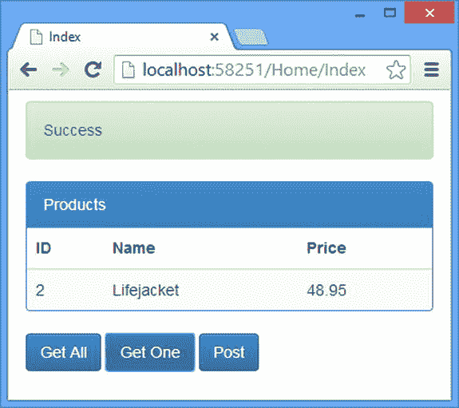
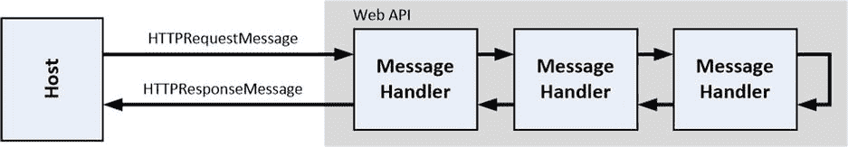
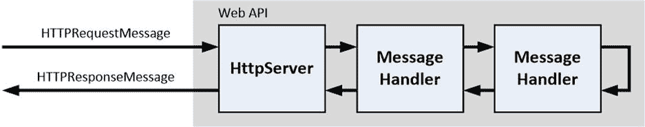
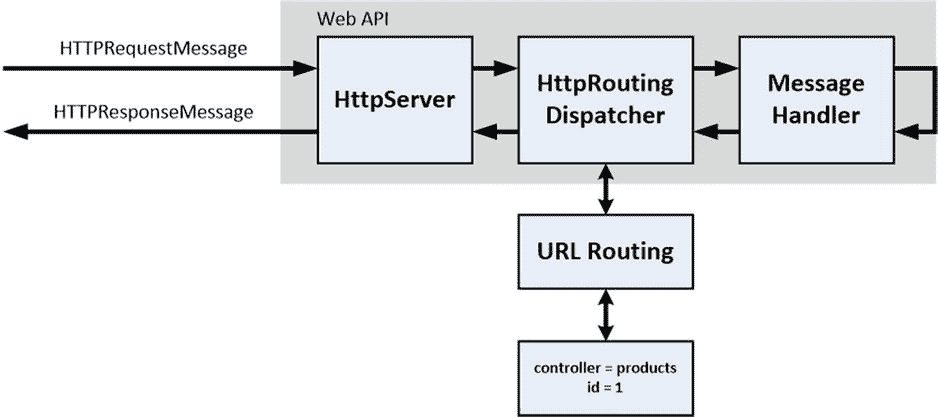
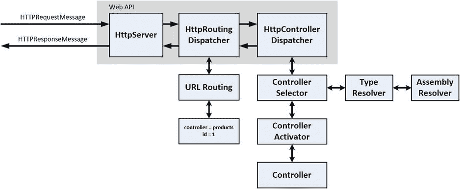
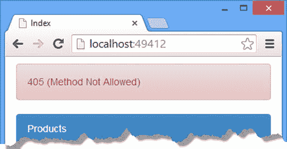
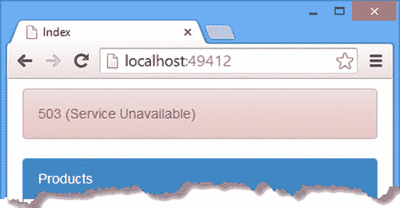

# 十九、调度请求

在本书的这一部分，我描述了 Web API 分派请求的过程，这是处理传入的`HttpRequestMessage`对象以产生可以发送给客户端的`HttpResponseMessage`的一系列步骤。

您已经看到了第 2 部分中的一些步骤，其中我描述了如何使用参数绑定和模型绑定来为操作方法提供处理请求所需的值，以及操作方法如何产生响应。在这一章中，我将解释 Web API 如何选择和调用一个动作方法。我详细描述了描述不同功能区域的接口，并解释了这些接口的默认实现如何一起工作来创建默认的调度过程。在接下来的章节中，我将深入探讨细节，并向您展示如何控制请求分派，以根据您自己的需求定制流程。表 [19-1](#Tab1) 总结了本章内容。

表 19-1。

Chapter Summary

<colgroup><col> <col> <col></colgroup> 
| 问题 | 解决办法 | 列表 |
| --- | --- | --- |
| 阻止处理请求。 | 创建一个定制的消息处理程序，在不调用处理程序链的情况下生成一个`HttpResponseMessage`对象。 | 1–7 |
| 添加对自定义标题的支持。 | 创建一个定制的消息处理程序，在将消息传递给链中的下一个处理程序之前修改`HttpRequestMessage`。 | 8–9 |
| 使用消息处理程序作为诊断工具。 | 创建一个调用`Debugger.Break`方法的定制消息处理程序。 | Ten |
| 更改用于识别控制器类别的后缀。 | 创建`IHttpControllerTypeResolver`和`IHttpControllerSelector`接口的定制实现，或者使用反射来修改默认的实现类。 | 11–15 |

## 准备示例项目

我从第 10 章开始就一直在使用的 ExampleApp 项目现在已经人满为患，所以我为这一章创建了一个新项目。我选择了 ASP.NET Web 应用项目类型，并将名称设置为 Dispatch。我点击 OK 按钮进入新建项目向导，选择空的项目模板，并检查选项以添加 MVC 和 Web API 的核心引用，就像我在[第 2 章](02.html)中所做的一样。我单击了 OK 按钮，Visual Studio 创建了新项目。

在 Visual Studio 创建了项目之后，我在包管理器控制台中输入了以下命令，以获得我需要的 NuGet 包:

`Update-Package microsoft.aspnet.mvc -version 5.1.1`

`Update-Package microsoft.aspnet.webapi -version 5.1.1`

`Update-Package Newtonsoft.json -version 6.0.1`

`Install-Package jquery -version 2.1.0`

`Install-Package bootstrap -version 3.1.1`

`Install-Package knockoutjs –version 3.1.0`

这是我用于包含 MVC 框架组件的 Web API 应用的标准 NuGet 包集。

### 创建模型类

这一章我只需要一个简单的模型类，我不需要任何持久存储实例的方法。我在`Models`文件夹中添加了一个名为`Product.cs`的类文件，并用它来定义清单 19-1 中所示的类。

清单 19-1。Product.cs 文件的内容

`namespace Dispatch.Models {`

`public class Product {`

`public int ProductID { get; set; }`

`public string Name { get; set; }`

`public decimal Price { get; set; }`

`}`

`}`

### 创建 Web API Web 服务

对于这一章，我需要一个简单的 web 服务控制器，它定义了一些基本的动作方法。我在`Controllers`文件夹中添加了一个名为`ProductsController.cs`的类文件，并用它来定义如清单 19-2 所示的控制器。

清单 19-2。ProductsController.cs 文件的内容

`using System.Collections.Generic;`

`using System.Linq;`

`using System.Web.Http;`

`using Dispatch.Models;`

`namespace Dispatch.Controllers {`

`public class ProductsController : ApiController {`

`private static List<Product> products = new List<Product> {`

`new Product {ProductID = 1, Name = "Kayak", Price = 275M },`

`new Product {ProductID = 2, Name = "Lifejacket", Price = 48.95M },`

`new Product {ProductID = 3, Name = "Soccer Ball", Price = 19.50M },`

`new Product {ProductID = 4, Name = "Thinking Cap", Price = 16M },`

`};`

`public IEnumerable<Product> Get() {`

`return products;`

`}`

`public Product Get(int id) {`

`return products.Where(x => x.ProductID == id).FirstOrDefault();`

`}`

`public Product Post(Product product) {`

`product.ProductID = products.Count + 1;`

`products.Add(product);`

`return product;`

`}`

`}`

`}`

这是一个 RESTful 控制器，它定义了 GET 和 POST HTTP 动词所针对的`Get`和`Post`方法。(我在[第二章](02.html) 2 中解释了动词是如何映射到动作方法的。)

Caution

我已经包含了一个静态的`Product`对象的`List`，这样我就可以响应请求，而不必定义和实现一个存储库。这适用于一个简单的例子，但是对于真实的项目，遵循我在[第 5 章](05.html)中用于 SportsStore 应用的存储库模式。

`Get`动作方法返回一个`Product`对象或者所有的`Products`对象，这些对象将被序列化，并使用我在第 17 章的[中描述的一种媒体类型格式化器发送到客户端。`Post`方法接收一个`Product`对象作为参数，我将它添加到静态`List`中。](17.html)

### 创建 MVC 控制器和视图

和前面的例子一样，我将使用 MVC 框架向客户端交付 HTML 和 JavaScript 代码，然后客户端将使用 Ajax 请求与 Web API web 服务对话。我在`Controllers`文件夹中创建了一个`HomeController.cs`类文件，并用它来定义如清单 19-3 所示的控制器。

清单 19-3。HomeController.cs 文件的内容

`using System.Web.Mvc;`

`namespace Dispatch.Controllers {`

`public class HomeController : Controller {`

`public ActionResult Index() {`

`return View();`

`}`

`}`

`}`

`Home`控制器的存在仅仅是为了将视图的内容交付给客户端。清单 19-4 显示了我添加到`Views/Home`文件夹中的`Index.cshtml`文件的内容。

清单 19-4。Index.cshtml 文件的内容

`@{ Layout = null;}`

`<!DOCTYPE html>`

`<html>`

`<head>`

`<meta name="viewport" content="width=device-width" />`

`<title>Index</title>`

`<link href="∼/Content/bootstrap.min.css" rel="stylesheet" />`

`<link href="∼/Content/bootstrap-theme.min.css" rel="stylesheet" />`

``

``

``

``

`</head>`

`<body class="container">`

`
`

``

`
`

`
`

`
Products
`

`<table class="table table-striped">`

`<thead>`

`<tr><th>ID</th><th>Name</th><th>Price</th></tr>`

`</thead>`

`<tbody data-bind="foreach: products">`

`<tr>`

`<td data-bind="text: ProductID"></td>`

`<td data-bind="text: Name"></td>`

`<td data-bind="text: Price"></td>`

`</tr>`

`</tbody>`

`</table>`

`
`

`<button class="btn btn-primary" data-bind="click: getAll">Get All</button>`

`<button class="btn btn-primary" data-bind="click: getOne">Get One</button>`

`<button class="btn btn-primary" data-bind="click: postOne">Post</button>`

`</body>`

`</html>`

我没有在这个项目中使用布局，所以该视图包含所有将被发送到客户端的 HTML。`body`元素包含一个`div`元素，我使用 Bootstrap 将它设计为一个警告，还有一个按钮，它依靠 Knockout 调用一个名为`sendRequest`的函数。

还有一个`table`元素，其行由 Knockout `foreach`绑定和三个`button`元素填充，所有这些元素在被单击时都使用 Knockout 来调用函数。

`Index.cshtml`文件中的最后一个`script`元素引用了`Scripts`文件夹中一个名为`dispatch.js`的文件。我创建这个文件是为了将 JavaScript 代码与视图分开。如清单 19-5 所示，该文件定义了在`Index.cshtml`剔除绑定中使用的数据，并定义了`button`元素调用的函数。

清单 19-5。dispatch.js 文件的内容

`var viewModel = ko.observable({`

`productId: 100, name: "Bananas", price: 12.34`

`});`

`var products = ko.observableArray();`

`var response = ko.observable("Ready");`

`var gotError = ko.observable(false);`

`var getAll = function () {`

`sendRequest("GET");`

`}`

`var getOne = function () {`

`sendRequest("GET", 2);`

`}`

`var postOne= function () {`

`sendRequest("POST");`

`}`

`var sendRequest = function (verb, id) {`

`var url = "/api/products/" + (id || "");`

`var config = {`

`type: verb || "GET",`

`data: verb == "POST" ? viewModel() : null,`

`success: function (data) {`

`gotError(false);`

`response("Success");`

`products.removeAll();`

`if (Array.isArray(data)) {`

`data.forEach(function (product) {`

`products.push(product);`

`});`

`} else {`

`products.push(data);`

`}`

`},`

`error: function (jqXHR) {`

`gotError(true);`

`products.removeAll();`

`response(jqXHR.status + " (" + jqXHR.statusText + ")");`

`}`

`}`

`$.ajax(url, config);`

`};`

`$(document).ready(function () {`

`ko.applyBindings();`

`});`

按钮元素调用的三个函数——`getAll`、`getOne`和`postOne`——都依赖于`sendRequest`函数向 web 服务发送 Ajax 请求。在`sendRequest`方法中，我基于函数参数创建 URL 和配置对象，这允许我使用相同的代码发送三种不同类型的请求。

Note

没有`input`元素允许用户更改视图模型中的值。当我想向 web 服务发送不同的数据时，我将在代码中更改视图模型。

### 测试示例应用

要测试 web 服务，请启动应用。使用浏览器导航到`/Home` URL，然后单击 Get One 按钮。jQuery 将向服务器发送 GET 请求，接收一个`Product`对象的序列化表示，并使用其属性值更新 alert `div`元素，如图 [19-1](#Fig1) 所示。

图 19-1。

Testing the example application

## 了解请求分派

三个类协调 Web API 处理 HTTP 请求的方式，统称为消息处理程序。消息处理程序这个术语的出现是因为这三个类都是从`System.Web.Http`名称空间中的抽象`HttpMessageHandler`类派生而来的。`HttpMessageHandler`类定义了一个重要的方法，派生类需要实现这个方法。

`...`

`protected internal override Task<HttpResponseMessage> SendAsync(`

`HttpRequestMessage request,`

`CancellationToken cancellationToken`

`)`

`...`

该方法被称为`SendAsync`，它接收一个`HttpRequestMessage`对象并返回一个`Task`，当它完成时产生一个`HttpResponseMessage`对象。使用`Task`结果和`CancellationToken`参数表明该方法应该异步执行。

处理`HttpRequestMessage`对象以产生`HttpResponseMessage`对象是任何使用`System.Net.Http`类的 web 应用框架的任务。我在本章中描述的三个`MessageHandler`类是 Web API 世界的看门人。

消息处理程序被组织成一个链，每个处理程序依次处理请求，这给了处理程序修改或增强`HttpRequestMessage`对象的机会。链中的最后一个消息处理程序创建了`HttpResponseMessage`，然后它沿着列表返回，允许每个消息处理程序在响应被发送到客户端之前修改响应。总体效果如图 [19-2](#Fig2) 所示。

图 19-2。

The chain of message handlers

主机通常是 IIS，特别是如果你也使用 MVC 框架的话，但是也有其他的选择，正如我在第 2 章第 6 节中解释的。

从主机传递一个`HttpRequestMessage`对象的那一刻起，它通过请求处理管道的过程就一直在消息处理程序的监控之下，直到将`HttpResponseMessage`对象交给主机，以便向客户机发送响应。

Web API 定义了许多接口，消息处理程序使用这些接口来传递重要的任务。接口的使用意味着调度过程可以定制，正如我在

“定制派遣流程”部分。很难跟踪调度过程中涉及的消息处理程序、接口和实现类，所以我在表 [19-2](#Tab2) 中总结了它们。我将在接下来的章节中解释它们的用途和角色。

表 19-2。

The Dispatcher Interfaces and Default Implementation Classes

<colgroup><col> <col></colgroup> 
| 名字 | 描述 |
| --- | --- |
| `HttpServer` | 第一个接收新的`HttpRequestMessage`对象的消息处理器。 |
| `HttpRoutingDispatcher` | 第二个消息处理程序，它为请求创建路由数据。 |
| `HttpControllerDispatcher` | 第三个也是最后一个消息处理程序，它选择、激活并执行一个控制器来创建一个`HttpResponseMessage`对象。 |
| `IHttpControllerSelector` | `HttpControllerDispatcher`类用来委托控制器选择的接口。默认的实现是`DefaultHttpControllerSelector`类。 |
| `IHttpControllerTypeResolver` | `DefaultHttpControllerSelector`类用来在应用中定位控制器类的接口。默认的实现是`DefaultHttpControllerTypeResolver`。 |
| `IAssembliesResolver` | 用于在应用中定位程序集的接口，以便`IHttpControllerTypeResolver`实现可以在它们中搜索控制器。默认的实现是`DefaultAssembliesResolver`类。 |
| `IHttpControllerActivator` | 由`HttpControllerDispatcher`类使用的接口，用于委托创建所选控制器的实例。默认的实现是`DefaultHttpControllerActivator`类。 |
| `IHttpController` | 用来表示控制器的接口。我在[第 2 章](02.html) 2 中完整地描述了控制器，但是大多数控制器都是从`ApiController`类派生的，它实现了`IHttpController`接口。 |

在这一章中，我只略微提到了分派过程的两个部分:URL 路由和控制器。我将在后面的章节中介绍这两者，特别是第 20 章和第 21 章的[URL 路由和第 2 章](20.html) 2 的[控制器。表](02.html) [19-3](#Tab3) 将 Web API 分派过程放在上下文中。

表 19-3。

Putting the Web API Dispatch Process in Context

<colgroup><col> <col></colgroup> 
| 问题 | 回答 |
| --- | --- |
| 这是什么？ | Web API 使用 dispatch 进程接收一个代表 HTTP 请求的`HttpRequestMessage`对象，并生成一个相应的`HttpResponseMessage`对象，该对象将用于生成发送给客户端的响应。 |
| 你应该什么时候使用它？ | 分派过程自动应用于 Web API 应用中的所有传入 HTTP 请求，不需要显式操作。 |
| 你需要知道什么？ | 调度过程由三个消息处理程序类管理。`HttpServer`类接收来自宿主环境的请求，`HttpRoutingDispatcher`集成 URL 路由，`HttpControllerDispatcher`选择一个控制器来处理请求。我在第 20 章和第 21 章中解释了 URL 路由系统的细节，在第 2 章 2 中解释了控制器的细节。 |

### 了解 HttpServer 类

链中的第一个消息处理程序是`HttpServer`类的实例，它充当宿主环境和 Web API 之间的接触点。

`HttpServer`类有一个简单的工作:它接收一个`HttpRequestMessage`对象，准备在 Web API 应用中使用它，并把它传递给链中的下一个消息处理程序。准备工作包括将安全主体与请求相关联，创建`HttpRequestContext`对象，并设置当`HttpResponeMessage`沿着链返回时将处理任何错误的类。

Tip

我在[第 23 章](23.html)和[第 24 章](24.html)中描述了 web 服务安全性，我在[第 9 章](09.html)中描述了`HttpRequestContext`类，我在[第 2 章](02.html)第 5 章中向您展示了 Web API 如何处理错误。

在应用生命周期的配置阶段，`HttpServer`类由`GlobalConfiguration`类实例化。`GlobalConfiguration`类还指定了列表中的下一个消息处理程序，您可以通过表 [19-4](#Tab4) 中显示的`GlobalConfiguration`属性来访问这两个类。

表 19-4。

The GlobalConfiguration Properties That Relate to the HttpServer Class

<colgroup><col> <col></colgroup> 
| 名字 | 描述 |
| --- | --- |
| `DefaultHandler` | 当完成准备后，返回`HttpServer`类应该将`HttpRequestMessage`对象传递给的`HttpMessageHandler`实现。默认情况下，这是`HttpRoutingDispatcher`类，我将在下一节描述它。您可以向链中添加定制的消息处理程序，我在“定制分派过程”一节中对此进行了描述。 |
| `DefaultServer` | 返回作为 Web API 入口点的`HttpMessageHandler`实现，它是`HttpServer`类。 |

您不能更改由`DefaultHandler`和`DefaultServer`属性返回的值，并且`HttpServer`类不能被替换为 Web API 的入口点。但是您可以添加自定义消息处理程序类来更改处理请求的方式；详见[第 23 章](23.html)和[第 24 章](24.html)。知道了`HttpServer`类是链中的第一个消息处理程序，允许我修改我的管道图，如图 [19-3](#Fig3) 所示。

图 19-3。

Revising the pipeline diagram to include the HttpServer class

### 了解 HttpRoutingDispatcher 类

链中的第二个消息处理程序是`HttpRoutingDispatcher`类的实例，它将 URL 路由集成到 Web API 请求处理管道中。在`System.Web.Http.Dispatcher`名称空间中定义了`HttpRoutingDispatcher`类。

URL 路由系统有一个目的:检查请求，以便产生其他组件需要沿着消息处理程序链进一步处理的数据。路由系统产生的数据称为路由数据或路由数据。整合检查请求以提取路由数据的功能意味着路由系统可以只检查一次请求，即使生成的路由数据将被其他组件重复使用。

路由数据被表示为名称-值对的集合。为了生成路由数据，URL 路由系统尝试将请求与路由模式进行匹配，这通常意味着检查客户端请求的 URL，但它也可以包含请求的其他方面，如头值。用于匹配请求和生成路由数据的指令统称为路由。

路由数据通常用于从请求中提取三类数据:

*   控制器的名称
*   动作方法的名称
*   可用于参数绑定的值

我说 URL 路由通常提取这些数据，因为在如何配置路由以及每个请求可以提供多少信息方面有很多可变性。例如，请求并不总是包含参数绑定值或操作方法名称，即使包含，使用路由数据的组件也可能选择忽略这些值，并使用其他信息源来完成工作。

即使它可以用来提取控制器和动作方法的名称，URL 路由系统也不会对这些名称做任何事情。它不选择控制器或动作方法，也不生成将发送给客户机的`HttpResponseMessage`。路由系统不对它检索的数据赋予任何意义；它只是提取数据，其他什么也不做。

事实上，路由系统不知道控制器和动作方法是什么，这就是为什么 URL 路由在 WebForm 应用中工作得和在 Web API 和 MVC 框架中一样好。路由数据也用于参数绑定，但是路由系统本身不进行绑定；相反，有一个内置的值提供者，它从与请求相关联的路由数据中获取数据。

`HttpRoutingDispatcher`类的目的是使用路由系统来检查`HttpRequestMessage`对象并产生路由数据，然后将这些数据与和请求相关联的`HttpRequestContext`对象相关联，并通过`HttpRequestContext.RouteData`属性进行访问。

Tip

我在第 20 章和第 21 章中解释了路由数据的格式，以及提供它的类。

#### 了解默认 URL 路由配置

定义 Web API 路由有两种方式。第一种是使用基于约定的路由，这意味着路由在单个位置配置，并被编写为匹配尽可能多的请求。这是 URL 路由的传统用法，它起源于 MVC 框架，其中统一和标准化的 URL 模式使用户更容易与应用交互。

定义路由的另一种方法是直接路由或基于属性的路由。有一些常见的 RESTful URL 格式，使用基于约定的路由很难轻松实现，但是通过将路由信息直接应用到支持特定 URL 模式的控制器和动作方法，可以更容易地表达这些格式。我不喜欢 MVC 框架应用的直接路由，但是它在 Web API 应用中非常有用。Web API 应用中没有定义默认的直接路由，但是我在第 20 章和第 21 章中详细描述了这个特性。Web API 路由在`WebApiConfig.cs`文件中设置，如下所示:

`using System;`

`using System.Collections.Generic;`

`using System.Linq;`

`using System.Web.Http;`

`namespace Actions {`

`public static class WebApiConfig {`

`public static void Register(HttpConfiguration config) {`

`config.MapHttpAttributeRoutes();`

`config.Routes.MapHttpRoute(`

`name: "DefaultApi",`

`routeTemplate: "api/{controller}/{id}",`

`defaults: new { id = RouteParameter.Optional }`

`);`

`}`

`}`

`}`

两个突出显示的语句设置了默认的 URL 路由配置。`MapHttpAttributesRoutes`方法建立了直接路由(我在[第二章](02.html) 1 中描述过)。

Tip

Web API 和 MVC 框架 URL 路由以相似的方式工作，但是不共享公共的类层次结构或配置文件。使用这两种框架的应用有两种独立的路由配置。MVC 框架路由是使用`System.Web.Routing`名称空间中的类在`App_Start/RouteConfig.cs`文件中配置的。Web API 路由是使用来自`System.Web.Http`名称空间的类在`App_Start/WebApiConfig.cs`文件中配置的。创建路由配置时要小心，尤其是在使用 Visual Studio 解析命名空间时，因为很容易导致一个混合了来自不同命名空间的同名类的类无法编译。

另一条语句在传递给`Register`方法的`HttpConfiguration`参数上调用`Routes.MapHttpRoute`方法。`MapHttpRoute`方法建立了一个名为`DefaultApi`的新路由，它生成两条路由数据`controller`和`id`，这两条数据都是从请求 URL 中提取的。这是一个基于约定的路由的例子，我将在第 2 章[中详细描述。](02.html)

`controller`值用于选择将处理请求的控制器，而`id`值用于参数绑定。通过查看用于创建路线的`routeTemplate`属性，您可以看到如何从 URL 中提取`controller`和`id`值。

`...`

`routeTemplate: "api/``{controller}``/``{id}`T4】

`...`

对于此 URL:

`/api/products`

`DefaultApi`路由将产生只包含`controller`的`products`值的路由数据，因为没有`id`键的值。我将在[第 20 章](20.html)和[第 21 章](21.html)中解释路线模板的定义和应用。

对于此 URL:

`/api/products/1`

由`DefaultApi`路线产生的路线数据将包含作为`controller`值的`products`和作为`id`值的`1`。表 [19-5](#Tab5) 总结了`/api/products/1` URL 的路由数据，我将用它作为本节剩余部分的示例请求。

Tip

注意，`DefaultApi` route 没有为动作方法名生成路由数据值。我会在第二章中解释原因。

表 19-5。

The Routing Data Generated by the Default Route for the Exemplar URL

<colgroup><col> <col></colgroup> 
| 钥匙 | 价值 |
| --- | --- |
| `controller` | `products` |
| `id` | `1` |

图 [19-4](#Fig4) 显示了我的管道图，更新后显示了`HttpRoutingDispatcher`类、路由系统和路由数据。

图 19-4。

Revising the pipeline diagram to include the HttpRoutingDispatcher class

### 了解 HttpControllerDispatcher 类

第三个也是最后一个内置消息处理程序类是`HttpControllerDispatcher`，它负责定位一个控制器类，创建它的一个实例，并请求它处理请求以产生`HttpResponseMessage`，该请求将通过链中的其他消息处理程序传递回宿主环境。`HttpControllerDispatcher`类依靠几个组件来实现它的目标。在接下来的部分中，我将描述控制器是如何定位和实例化的。

#### 选择控制器

`HttpControllerDispatcher`类将控制器类的选择委托给`IHttpControllerSelector`接口的实现，该接口在`System.Web.Http.Dispatcher`命名空间中定义。下面是`IHttpControllerSelector`接口的定义:

`using System.Collections.Generic;`

`using System.Diagnostics.CodeAnalysis;`

`using System.Net.Http;`

`using System.Web.Http.Controllers;`

`namespace System.Web.Http.Dispatcher {`

`public interface IHttpControllerSelector {`

`IDictionary<string, HttpControllerDescriptor> GetControllerMapping();`

`HttpControllerDescriptor SelectController(HttpRequestMessage request);`

`}`

`}`

`GetControllerMapping`方法返回应用中所有可用控制器的集合。我将在本章后面的“定制其他 Dispatch 组件”一节中解释这种方法的用途，但目前我们对此不感兴趣。

相反，`SelectController`方法才是重要的，它由`HttpControllerDispatcher`调用以获得一个描述可以处理请求的控制器的`HttpControllerDescriptor`对象。`HttpControllerDescriptor`类在`System.Web.Http.Controllers`命名空间中定义，并提供表 [19-6](#Tab6) 中所示的属性和方法。

表 19-6。

The Members Defined by the HttpControllerDescriptor Class

<colgroup><col> <col></colgroup> 
| 名字 | 描述 |
| --- | --- |
| `Configuration` | 返回与控制器相关联的`HttpConfiguration`对象。控制器可以有自己的配置，正如我在第二章 2 中解释的。 |
| `ControllerName` | 返回控制器的名称。 |
| `ControllerType` | 返回控制器的`Type`。 |
| `CreateController(request)` | 创建一个将处理指定的`HttpRequestMessage`对象的控制器实例。 |
| `GetCustomAttributes<T>()` | 返回已经应用于控制器类的类型为`T`的属性集合。 |
| `GetFilters()` | 返回已应用于该类的筛选器。我在第 23 章和第 24 章中描述了 Web API 过滤器。 |

接口的默认实现是在`System.Web.Http.Dispatcher`名称空间中定义的`DefaultHttpControllerSelector`类。为了选择一个控制器，`DefaultHttpControllerSelector`类需要完成以下任务:识别应用中的所有控制器，选择处理当前请求的控制器，最后创建该控制器的一个实例。我将在接下来的章节中描述如何完成每项任务。

在应用启动期间，`DefaultHttpControllerSelector`构建了一个应用中所有控制器类的列表，该列表随后被用作选择控制器来处理每个请求的基础。它将控制器的识别委托给`IHttpControllerTypeResolver`接口，如下所示:

`using System.Collections.Generic;`

`using System.Diagnostics.CodeAnalysis;`

`namespace System.Web.Http.Dispatcher {`

`public interface IHttpControllerTypeResolver {`

`ICollection<Type> GetControllerTypes(IAssembliesResolver assembliesResolver);`

`}`

`}`

`IHttpControllerTypeResolver`接口定义了`GetControllerTypes`方法，该方法需要返回应用中所有控制器类型的集合。`GetControllerTypes`方法被传递给了`IAssembliesResolver`接口的一个实现。该接口定义了`GetAssemblies`方法，该方法负责返回应用中所有程序集的集合，如下所示:

`using System.Collections.Generic;`

`using System.Diagnostics.CodeAnalysis;`

`using System.Reflection;`

`namespace System.Web.Http.Dispatcher {`

`public interface IAssembliesResolver {`

`ICollection<Assembly> GetAssemblies();`

`}`

`}`

这些接口的默认实现很简单。`DefaultAssembliesResolver`类实现了`IAssembliesResolver`接口，并返回应用域中的所有程序集。自定义实现可以过滤程序集集合，只包括那些已知包含控制器的集合，但好处是启动过程稍微快一些，代价是如果程序集结构发生变化，应用将无法正常工作。

接口`IHttpControllerTypeResolver`的默认实现是`DefaultHttpControllerTypeResolver`类，它检查由`IAssembliesResolver`接口返回的程序集中的类，并识别那些控制器。控制器有三个特征:

They are classes that implement the `IHttpController` interface.   The name of the class has the `Controller` suffix (for example, `ProductsController`).   The class is `public` and is not `abstract`.  

`DefaultHttpControllerSelector`类为`IHttpControllerTypeResolver`实现识别的每个控制器类创建一个`HttpControllerDescriptor`对象的缓存。

Tip

控制器类在启动时被检查，因为这可能是一个缓慢的过程，尤其是对于大型项目。`DefaultHttpControllerSelector`定位的控制器类的集合被缓存，以便仅在应用首次启动时执行该过程。

当`HttpControllerDispatcher`类通过调用`SelectController`方法请求控制器时，`DefaultHttpControllerSelector`类查看其缓存的`HttpControllerDescriptor`对象，直到从`HttpRoutingDispatcher`类创建的路由数据中找到一个具有与`controller`值匹配的`ControllerName`值的对象。

Note

如果您想在不直接实现`IHttpControllerTypeResolver`和`IAssembliesResolver`的情况下获得新的功能，那么`DefaultHttpControllerTypeResolver`和`DefaultAssembliesResolver`类是它们接口的默认实现。然而，如果你在 IIS 中托管你的 Web API 应用，那么使用另外两个类:`WebHostHttpControllerTypeResolver`和`WebHostAssembliesResolver`。宿主环境可以随意更改接口的默认实现，您应该确保理解用自定义实现替换它们的影响，尤其是对于这种低级接口。

#### 激活控制器

此时，`HttpControllerDispatcher`类已经获得了一个`HttpControllerDescriptor`对象，它描述了将处理请求的控制器。下一步是实例化控制器类，这个过程称为激活。

激活是通过调用`HttpControllerDescriptor`类的`CreateController`方法来执行的，该方法又将流程委托给了`IControllerActivator`接口的实现。

`using System.Net.Http;`

`using System.Web.Http.Controllers;`

`namespace System.Web.Http.Dispatcher {`

`public interface IHttpControllerActivator {`

`IHttpController Create(HttpRequestMessage request,`

`HttpControllerDescriptor controllerDescriptor, Type controllerType);`

`}`

`}`

调用`Create`方法创建一个`IHttpController`对象，并提供描述当前请求的`HttpRequestMessage`、描述控制器的`HttpControllerDescriptor`和控制器`Type`。

默认的`IHttpControllerActivator`实现是在`System.Web.Http.Dispatcher`名称空间中定义的`DefaultHttpControllerActivator`类。`DefaultHttpControllerActivator`类遵循的过程很简单:

Try to get an instance of the controller type from the dependency resolver.   Create an instance of the controller by invoking a parameterless constructor.  

这种方法支持我在第 10 章中描述的依赖注入模型，但是如果应用中没有解析器，就退回到直接实例化类。这还意味着，如果您需要定义没有无参数构造函数的控制器，您必须创建一个自定义的`IHttpControllerActivator`接口实现，或者配置一个知道如何实例化它们的依赖解析器(就像我在定义了存储库构造函数参数的控制器的 SportsStore 应用中所做的那样)。

#### 执行控制器

`HttpControllerDispatcher`几乎已经完成了它的任务:它已经选择了一个控制器并创建了它的一个实例，剩下的就是请求它处理结果，这样`HttpResponseMessage`就可以沿着消息处理程序链返回，并最终发送到客户端。正如我在上一节提到的，控制器的一个识别特征是它实现了`IHttpController`接口。

`using System.Net.Http;`

`using System.Threading;`

`using System.Threading.Tasks;`

`namespace System.Web.Http.Controllers {`

`public interface IHttpController {`

`Task<HttpResponseMessage> ExecuteAsync(HttpControllerContext controllerContext,`

`CancellationToken cancellationToken);`

`}`

`}`

`IHttpController`接口定义了`ExecuteAsync`方法，它被传递了一个`HttpControllerContext`和一个`CancellationToken`。该方法的目的是使用由`HttpControllerContext`提供的信息异步处理请求，并返回一个`Task`，当它完成时产生一个`HttpResponseMessage`对象。

`HttpControllerContext`对象是由`HttpControllerDispatcher`类创建的，目的是为控制器提供完成工作所需的所有细节。`HttpControllerContext`类定义了表 [19-7](#Tab7) 中所示的属性。

表 19-7。

The Properties Defined by the HttpControllerContext Class

<colgroup><col> <col></colgroup> 
| 名字 | 描述 |
| --- | --- |
| `Configuration` | 返回应该用于服务请求的`HttpConfiguration`对象。正如我在第二章 2 中解释的，控制器可以有自己的配置来工作。 |
| `Controller` | 返回`IHttpController`实例。当`HttpControllerContext`被传递给控制器一个参数时，这并不完全有用，但在用于其他任务时更有用，比如动作方法选择(我在[第 2 章](02.html) 2 中对此进行了描述)。 |
| `ControllerDescriptor` | 返回导致控制器被实例化的`HttpControllerDescriptor`。 |
| `Request` | 返回描述当前请求的`HttpRequestMessage`。 |
| `RequestContext` | 返回提供请求附加信息的`HttpRequestContext`。 |
| `RouteData` | 返回包含请求路由数据的`IHttpRouteData`对象。详见[第 20 章](20.html)和[第 21 章](21.html)。 |

对于消息处理程序来说，`IHttpController`实现如何将`HttpControllerContext`处理成`HttpResponseMessage`的细节是完全不透明的，但是我在[第 2 章](02.html) 2 中解释了默认控制器类`ApiController`是如何工作的。它依赖于将工作委托给可以替换或定制的接口实现，对此您不会感到惊讶。

既然我已经解释了`HttpControllerDispatcher`是如何工作的，我可以更新我的图来反映请求的端到端流程以及它通过 Web API 分派过程的响应，如图 [19-5](#Fig5) 所示。

图 19-5。

The end-to-end Web API dispatch process

在描述调度过程时，我只略微提到了两个方面:URL 路由和控制器。在这两种情况下，这是因为它们都有足够大的特性来保证它们自己的章节。我在[第 20 章](20.html)和[第 21 章](21.html)中描述了 URL 路由，并在[第 2 章](02.html) 2 中解释了控制器如何工作。

## 定制派遣流程

在调度过程中涉及这么多接口的原因是可以定制处理请求的方式。尽管我在上一节中描述了默认的实现类，但是调度接口的实现是使用表 [19-8](#Tab8) 中列出的扩展方法从服务集合中获得的。

表 19-8。

The Extension Methods That Obtain Dispatcher Objects from the Services Collection

<colgroup><col> <col></colgroup> 
| 名字 | 描述 |
| --- | --- |
| `GetAssembliesResolver()` | 返回`IAssembliesResolver`接口的实现 |
| `GetHttpControllerActivator()` | 返回`IHttpControllerActivator`接口的实现 |
| `GetHttpControllerSelector()` | 返回`IHttpControllerSelector`接口的实现 |
| `GetHttpControllerTypeResolver()` | 返回`IHttpControllerTypeResolver`接口的实现 |

这些扩展方法在`System.Web.Http`名称空间中定义，并在`ServicesContainer`类上操作。这意味着您可以通过调用`HttpConfiguration.Services`属性上的这些方法之一来获得对默认类实例的引用，如下所示:

`...`

`GlobalConfiguration.Configuration.Services.GetHttpControllerSelector()`

`...`

实现类是通过服务集合定位的，这意味着很容易创建和使用定制类来替换默认类，如果这样做，您可以利用自己的类中的服务，这样您就不必重新实现整个调度过程。

在接下来的小节中，我将向您展示如何通过添加新的消息处理程序和创建调度接口的定制实现来扩展和定制调度流程。表 [19-9](#Tab9) 将定制派遣流程放在上下文中。

表 19-9。

Putting the Customizing the Dispatch Process in Context

<colgroup><col> <col></colgroup> 
| 问题 | 回答 |
| --- | --- |
| 这是什么？ | 可以定制调度过程，以控制请求通过 Web API 应用的方式。 |
| 你应该什么时候使用它？ | 默认的调度过程适用于大多数 Web API 应用，但是定制对于将定制系统集成到 Web API 中(例如定制认证)或者支持不常见的或传统的客户端可能是有用的。 |
| 你需要知道什么？ | 您可以使用定制的消息处理程序来使来自困难客户的请求适应标准的 Web API 模型，或者停止处理请求。通过重新实现用于定位和选择控制器类的接口，可以进行更细粒度的定制。 |

### 创建自定义消息处理程序

Web API 允许将自定义消息处理程序添加到`HttpServer`和`HttpRoutingDispatch`类之间的链中。定制的消息处理程序类似于传统的 ASP.NET 模块，可以用来准备一个用于处理的`HttpRequestMessage`,或者在`HttpResponseMessage`用于生成对客户端的响应之前对其进行修改。

定制消息处理程序是从`DelegatingHandler`类派生的，而后者又是从`MessageHandler`派生的，但是增加了对内部处理程序的支持，内部处理程序是链中的下一个处理程序。自定义处理程序可以调用内部处理程序将请求推进到分派管道中的下一个阶段，或者自己生成响应来终止请求处理过程。作为演示，我创建了一个名为`Infrastructure`的文件夹，并在其中添加了一个名为`CustomMessageHandler.cs`的类文件。清单 19-6 显示了我创建的自定义消息句柄。

清单 19-6。CustomMessageHandler.cs 文件的内容

`using System.Net;`

`using System.Net.Http;`

`using System.Threading;`

`using System.Threading.Tasks;`

`namespace Dispatch.Infrastructure {`

`public class CustomMessageHandler : DelegatingHandler {`

`protected async override Task<HttpResponseMessage> SendAsync(HttpRequestMessage`

`request, CancellationToken cancellationToken) {`

`if (request.Method == HttpMethod.Post) {`

`return request.CreateErrorResponse(HttpStatusCode.MethodNotAllowed,`

`"POST Not Supported");`

`} else {`

`return await base.SendAsync(request, cancellationToken);`

`}`

`}`

`}`

`}`

这个类演示了消息处理程序如何拦截请求并直接创建结果。在`SendAsync`方法中，我通过检查`HttpRequestMessage.Method`属性来寻找 POST 请求。当方法是 POST 时，我创建一个带有 405(不允许方法)状态代码的`HttpResponseMessage`，如下所示:

`...`

`return request` `.CreateErrorResponse(HttpStatusCode.MethodNotAllowed,`

`"POST Not Supported")` `;`

`...`

`CreateErrorResponse`是一种扩展方法，可以应用于`HttpRequestMessage`对象来创建`HttpResponseMessage`对象。这些方法根据它们的参数值和请求的细节方便地填充`HttpResponseMessage`字段。有一些方法可以用来创建成功和错误响应，所有这些都是由`HttpRequestMessageExtensions`类定义的。我已经在表 [19-10](#Tab10) 中展示了创建`HttpResponseMessage`对象的最有用的方法。(我省略了几个版本，它们指定了特定的媒体类型格式化器来编码数据对象或提供关于错误的附加细节。)

表 19-10。

The Methods for Creating HttpResponseMessage Objects from an HttpRequestMessage

<colgroup><col> <col></colgroup> 
| 方法 | 描述 |
| --- | --- |
| `CreateResponse()` | 创建一个带有 200(正常)状态代码且无内容的基本`HttpResponseMessage`。 |
| `CreateResponse(status)` | 用指定的状态码创建一个`HttpResponseMessage`，用一个`HttpStatusCode`值表示。 |
| `CreateResponse(data)` | 用 200 (OK)状态代码和指定的数据对象作为内容创建一个`HttpResponseMessage`。数据对象使用我在第 2 部分中描述的内容协商过程进行编码。 |
| `CreateResponse(status, data)` | 用指定的状态代码和数据对象创建一个`HttpResponseMessage`。状态代码表示为一个`HttpStatusCode`，数据对象使用第 2 部分中描述的内容协商过程进行编码。 |
| `CreateResponse(status, data, mime)` | 用指定的状态代码和数据对象创建一个`HttpResponseMessage`。状态代码被表示为一个`HttpStatusCode`，数据对象使用第 2 部分中描述的媒体类型格式化器使用指定的 MIME 类型进行编码。 |
| `CreateErrorResponse(status, message)` | 用指定的状态代码和错误信息创建一个`HttpResponseMessage`。状态码用`HttpStatusCode`表示，消息是一个`string`。我在第 2 部分描述了 Web API 错误处理。 |
| `CreateErrorResponse(status, error)` | 用指定的状态代码和错误创建一个`HttpResponseMessage`。状态码用`HttpStatusCode`表示，错误是一个`HttpError`。我在第二章第五章[中描述了 Web API 错误处理。](02.html) |

从其`SendAsync`方法返回一个`HttpResponseMessage`的消息句柄通过消息句柄链终止了`HttpRequestMessage`的正常进程。对于我的示例消息处理程序，这意味着 POST 请求被拒绝，而带有其他动词的两个请求都被允许处理。

如果一个处理程序想要将请求传递给链中的下一个处理程序，那么它调用基类的`SendAsync`方法并返回结果，如下所示:

`...`

`return await base.SendAsync(request, cancellationToken);`

`...`

每个消息处理程序都自动配置了下一个消息处理程序的详细信息，这样您就不必在自定义类中管理处理程序链的详细信息。

消息处理程序是通过`HttpConfiguration.MessageHandlers`属性注册的，如清单 19-7 所示。

清单 19-7。在 WebApiConfig.cs 文件中注册自定义消息处理程序

`using System;`

`using System.Collections.Generic;`

`using System.Linq;`

`using System.Web.Http;`

`using Dispatch.Infrastructure;`

`namespace Dispatch {`

`public static class WebApiConfig {`

`public static void Register(HttpConfiguration config) {`

`config.MapHttpAttributeRoutes();`

`config.Routes.MapHttpRoute(`

`name: "DefaultApi",`

`routeTemplate: "api/{controller}/{id}",`

`defaults: new { id = RouteParameter.Optional }`

`);`

`config.MessageHandlers.Add(new CustomMessageHandler());`

`}`

`}`

`}`

`MessageHandlers`集合只包含定制的消息处理程序，在消息处理程序链中，它们总是放在`HttpServer`之后和`HttpRoutingDispatcher`之前。为了测试新的消息处理程序，启动应用并点击 Post 按钮——处理程序将拦截请求并返回如图 [19-6](#Fig6) 所示的错误响应。

图 19-6。

Testing the custom message handler Caution

创建消息处理程序类的单个实例，并用于服务 Web API 应用接收的所有请求。这意味着您的代码必须是线程安全的，并且必须能够处理`SendAsync`方法的并发执行。

#### 在消息处理程序中修改请求或响应

虽然您可以使用消息处理程序来停止或允许通过应用的请求——正如我在上一节中所做的那样——但是消息处理程序更常见的用途是修改`HttpRequestMessage`或`HttpResponseMessage`对象，以便向您的 web 服务添加新特性。

问题是 Web API 已经拥有了 Web 服务需要的所有特性，虽然您可以截取和修改请求和响应是很有用的，但是没有必要这样做。

消息处理程序的标准演示是添加对`X-HTTP-Method-Override`头的支持，默认情况下 Web API 不支持。我不喜欢这个例子(原因我在“理解 X-HTTP-Method-Override Header”边栏中已经说明了)，但是它是一个简单的、自包含的示例，演示了如何使用消息处理程序，所以我将它包含在本章中。清单 19-8 显示了我如何修改了`CustomMessageHandler`类，使其支持`X-HTTP-Method-Override`标题。

清单 19-8。支持 CustomMessageHandler.cs 文件中的非标准头

`using System.Net;`

`using System.Net.Http;`

`using System.Threading;`

`using System.Threading.Tasks;`

`using System.Linq;`

`namespace Dispatch.Infrastructure {`

`public class CustomMessageHandler : DelegatingHandler {`

`protected async override Task<HttpResponseMessage> SendAsync(HttpRequestMessage`

`request, CancellationToken cancellationToken) {`

`if (request.Method == HttpMethod.Post`

`&&` `request.Headers.Contains("X-HTTP-Method-Override")) {`

`HttpMethod requestedMethod = new HttpMethod(`

`request.Headers.GetValues("X-HTTP-Method-Override").First());`

`if (requestedMethod == HttpMethod.Put`

`|| requestedMethod == HttpMethod.Delete) {`

`request.Method = requestedMethod;`

`} else {`

`return request.CreateErrorResponse(HttpStatusCode.MethodNotAllowed,`

`"Only PUT and DELETE can be overridden");`

`}`

`}`

`return await base.SendAsync(request, cancellationToken);`

`}`

`}`

`}`

UNDERSTANDING THE X-HTTP-METHOD-OVERRIDE HEADER

`X-HTTP-Method-Override`头允许客户端告诉 web 服务，应该像处理一个不同的 HTTP 动词一样处理请求。例如，如果服务器接收到一个 HTTP POST 请求，其中的`X-HTTP-Method-Override`被设置为`PUT`，那么应该像使用了`PUT`动词一样处理该请求。

`X-HTTP-Method-Override`的出现是为了解决某些客户端只能发送 GET 或 POST 请求的限制，或者解决防火墙阻止除 GET 或 POST 之外的任何动词的问题。使用`X-HTTP-Method-Override`允许客户端绕过这些限制并充分利用 RESTful web 服务。

尽管`X-HTTP-Method-Override`头非常有用，但是它需要客户机和服务器之间的协调:客户机需要知道服务器正在寻找这个头，并且会接受它。如果客户机和服务器不协调，那么头将被忽略，POST 请求将始终被视为 POST 请求，即使`X-HTTP-Method-Override`头指定了不同的动词。此外，客户端无法知道是否有不能使用的动词；例如，没有办法检测公司防火墙的策略。简而言之，`X-HTTP-Method-Override`有一些问题，我建议尽可能避免它。Web API 和 MVC 框架都不支持 header，这不是偶然的。

我寻找包含`X-HTTP-Method-Override`标题的 POST 请求，我只将它应用于`PUT`和`DELETE`动词(尽管如果你在一个真实的项目中支持这个标题，你应该注意允许你的 web 服务需要的所有动词)。对于符合我的标准的请求，我设置了`HttpRequestMethod.Method`属性的值，这使得 Web API 消息处理程序的其余部分将该请求视为使用了由`X-HTTP-Method-Override`头指定的动词。

示例 web 服务只支持 POST 和 GET，但是清单 19-9 显示了需要对`dispatch.js`文件进行的修改，以支持`X-HTTP-Method-Override`头。

清单 19-9。在 dispatch.js 文件中添加对 X-HTTP-Method-Override 头的支持

`...`

`var sendRequest = function (verb, id) {`

`var url = "/api/products/" + (id || "");`

`var config = {`

`type: verb || "GET",`

`data: verb == "POST" ? viewModel() : null,`

`success: function (data) {`

`gotError(false);`

`response("Success");`

`products.removeAll();`

`if (Array.isArray(data)) {`

`data.forEach(function (product) {`

`products.push(product);`

`});`

`} else {`

`products.push(data);`

`}`

`},`

`error: function (jqXHR) {`

`gotError(true);`

`products.removeAll();`

`response(jqXHR.status + " (" + jqXHR.statusText + ")");`

`}`

`}`

`if (verb != "GET"``&&`T2】

`config.type = "POST";`

`config.headers = {`

`"X-HTTP-Method-Override": verb`

`};`

`}`

`$.ajax(url, config);`

`};`

`...`

#### 使用消息处理程序作为诊断工具

我发现当我找不到问题的原因，开始对我的工具失去信任时，消息处理程序作为诊断工具是最有用的。有时这是绝望的结果—我越来越确信我错过了一些基本的东西—但最常见的是我使用消息处理程序，这样我就可以在调度过程开始时中断 Visual Studio 调试器，并在整个应用中跟踪请求，然后再跟踪响应。这在使用调试器显示 Web API 源代码时特别有用，这样可以检查所有的对象和变量，并且很容易(或者至少更容易)找到导致问题的原因。

您可以手动将断点应用于您的应用代码，但是当请求刚刚进入 Web API 的世界时，请求处理程序可能会中断调试器。清单 19-10 显示了我如何改变了`CustomMessageHandler`类，使它中断调试器。

清单 19-10。在 CustomMessageHandler.cs 文件中创建诊断工具

`using System.Net;`

`using System.Net.Http;`

`using System.Threading;`

`using System.Threading.Tasks;`

`using System.Linq;`

`namespace Dispatch.Infrastructure {`

`public class CustomMessageHandler : DelegatingHandler {`

`protected async override Task<HttpResponseMessage> SendAsync(HttpRequestMessage`

`request, CancellationToken cancellationToken) {`

`if (request.Method == HttpMethod.Post) {`

`System.Diagnostics.Debugger.Break();`

`}`

`return await base.SendAsync(request, cancellationToken);`

`}`

`}`

`}`

`System.Diagnostics.Debugger`类控制调试器，而`Break`方法停止应用的执行并把控制权交给它。安装了这个消息处理程序后，每个 POST 请求都会导致调试器中断，以便您可以逐步完成调度过程。要查看效果，请启动应用并单击浏览器中的 Post 按钮。将调用`Break`方法，应用的执行将停止，这样您就可以通过标准的 Visual Studio 调试器来控制它。

### 自定义其他调度组件

您可以为我在本章中描述的所有接口创建自定义实现，但是这样做没有什么意义，因为 Web API 默认实现适用于大多数应用。也就是说，知道如果需要的话可以替换标准组件总是有用的，在接下来的部分中，我将展示更改用于标识控制器类的后缀的过程，默认情况下是`Controller`。

#### 实现接口

接口的实现负责识别应用中的控制器类。该接口的默认实现是`DefaultHttpControllerTypeResolver`类，它定义了一个名为`IsControllerType`的方法，为应用中的每种类型调用该方法来查看它是否是控制器，如下所示:

`...`

`internal static bool IsControllerType(Type t) {`

`return`

`t != null &&`

`t.IsClass &&`

`t.IsVisible &&`

`!t.IsAbstract &&`

`typeof(IHttpController).IsAssignableFrom(t) &&`

`HasValidControllerName(t);`

`}`

`...`

这种方法正是您所期望看到的；它寻找是`public`，不是`abstract`，并且是从`IHttpController`派生的类。最后一个测试是本例中有趣的一个:只选择了`HasValidControllerName`方法返回`true`的类。下面是`HasValidControllerName`方法的定义:

`...`

`internal static bool HasValidControllerName(Type controllerType) {`

`string controllerSuffix = DefaultHttpControllerSelector.ControllerSuffix;`

`return controllerType.Name.Length > controllerSuffix.Length`

`&& controllerType.Name.EndsWith(controllerSuffix,`

`StringComparison.OrdinalIgnoreCase);`

`}`

`...`

`DefaultHttpControllerSelector.ControllerSuffix`属性被设置为`Controller`,`HasValidControllerName`方法检查类名是否包含后缀(而不仅仅是后缀，这样名为`Controller`的类就不会被识别为控制器)。

理想情况下，我可以通过从`DefaultHttpControllerTypeResolver`类派生并覆盖`IsControllerType`或`HasValidControllerName`方法来改变用于识别控制器的后缀；这两个都标为`internal`。另一种方法是改变`DefaultHttpControllerSelector.ControllerSuffix`属性的值，但是这是不可能的，因为它已经被标记为`readonly`。

`...`

`public static readonly string ControllerSuffix = "Controller";`

`...`

`DefaultHttpControllerSelector`和`DefaultHttpControllerTypeResolver`类的实现意味着我需要创建自己的`IHttpControllerTypeResolver`接口的实现，以便更改控制器后缀。我在`Infrastructure`文件夹中添加了一个名为`CustomControllerTypeResolver.cs`的类文件，并用它来定义清单 19-11 所示的类。

清单 19-11。CustomControllerTypeResolver.cs 类的内容

`using System;`

`using System.Collections.Generic;`

`using System.Linq;`

`using System.Web.Http.Controllers;`

`using System.Web.Http.Dispatcher;`

`namespace Dispatch.Infrastructure {`

`public class CustomControllerTypeResolver : IHttpControllerTypeResolver {`

`public string Suffix { get; set; }`

`public ICollection<Type> GetControllerTypes(IAssembliesResolver`

`assembliesResolver) {`

`return assembliesResolver.GetAssemblies()`

`.Select(assembly => assembly.GetTypes())`

`.SelectMany(t => t)`

`.Where(t => t != null`

`&& t.IsClass`

`&& t.IsVisible`

`&& !t.IsAbstract`

`&& typeof(IHttpController).IsAssignableFrom(t)`

`&& HasValidControllerName(t)).ToList();`

`}`

`private bool HasValidControllerName(Type t) {`

`return t.Name.Length > Suffix.Length`

`&& t.Name.EndsWith(Suffix, StringComparison.OrdinalIgnoreCase);`

`}`

`}`

`}`

我的自定义实现有一个`Suffix`属性，用于在由传递给`GetControllerTypes`方法的`IAssembliesResolver`实现对象提供的程序集中定位控制器类。

不幸的是，清单 19-11 中显示的类没有你期望的效果，这是因为`DefaultHttpControllerSelector`类使用缓存来加速控制器选择，并且处理缓存的类(`HttpControllerTypeCache`类)对用于检索缓存类的`DefaultHttpControllerSelector.ControllerSuffix`属性有一个硬编码的依赖。这意味着如果我想改变控制器使用的后缀，仅仅创建一个`IHttpControllerTypeResolver`类的新实现是不够的——我还必须创建一个`IHttpControllerSelector`接口的新实现。清单 19-12 显示了我添加到`Infrastructure`文件夹中的`CustomControllerSelector.cs`文件的内容。

清单 19-12。CustomControllerSelector.cs 文件的内容

`using System;`

`using System.Collections.Generic;`

`using System.Linq;`

`using System.Net;`

`using System.Net.Http;`

`using System.Web.Http;`

`using System.Web.Http.Controllers;`

`using System.Web.Http.Dispatcher;`

`namespace Dispatch.Infrastructure {`

`public class CustomControllerSelector : IHttpControllerSelector {`

`private IDictionary<string, HttpControllerDescriptor> dictionary;`

`private ILookup<string, HttpControllerDescriptor> mappings;`

`public CustomControllerSelector(string suffix) {`

`Suffix = suffix;`

`HttpConfiguration config = GlobalConfiguration.Configuration;`

`IHttpControllerTypeResolver typeFinder =`

`config.Services.GetHttpControllerTypeResolver();`

`IAssembliesResolver assemblyFinder = config.Services.GetAssembliesResolver();`

`IEnumerable<HttpControllerDescriptor> descriptors`

`= typeFinder.GetControllerTypes(assemblyFinder)`

`.Select(type => new HttpControllerDescriptor {`

`Configuration = GlobalConfiguration.Configuration,`

`ControllerName = type.Name.Substring(0,`

`type.Name.Length - Suffix.Length),`

`ControllerType = type});`

`mappings = descriptors.ToLookup(descriptor =>`

`descriptor.ControllerName, StringComparer.OrdinalIgnoreCase);`

`dictionary = descriptors.ToDictionary(d => d.ControllerName, d => d);`

`}`

`private string Suffix { get; set; }`

`public IDictionary<string, HttpControllerDescriptor> GetControllerMapping() {`

`return dictionary;`

`}`

`public HttpControllerDescriptor SelectController(HttpRequestMessage request) {`

`string key`

`= request.GetRequestContext().RouteData.Values["controller"] as string;`

`IEnumerable<HttpControllerDescriptor> matches = mappings[key];`

`switch (matches.Count()) {`

`case 1:`

`return matches.First();`

`case 0:`

`throw new HttpResponseException(HttpStatusCode.NotFound);`

`default:`

`throw new HttpResponseException(HttpStatusCode.InternalServerError);`

`}`

`}`

`}`

`}`

`IHttpControllerSelector`接口需要实现两个方法。属性路由特性使用`GetControllerMapping`方法在应用启动期间配置自身，并需要一个将控制器名称映射到`HttpControllerDescriptor`对象的`Dictionary`。我使用 LINQ 在`CustomControllerSelector`构造函数中创建一个`HttpControllerDescriptor`对象的枚举，然后使用总是很方便的 LINQ `ToDictionary`方法创建`GetControllerMapping`映射所需的集合。

我对`SelectController`方法采取了不同的方法，使用了 LINQ `ToLookup`方法。这种很少使用的方法基于一个键将对象组合在一起，这很有用，因为一个 Web API 应用可以包含多个同名但在不同名称空间中定义的控制器类。我遵循默认行为，如果有多个控制器匹配`controller`路由数据值，我会抛出一个异常。

#### 注册接口实现

清单 19-13 展示了我如何用我在`WebApiConfig.cs`文件中的自定义类替换了`IHttpControllerTypeResolver`和`IHttpControllerSelector`接口的默认实现。

清单 19-13。在 WebApiConfig.cs 文件中注册自定义类

`using System;`

`using System.Collections.Generic;`

`using System.Linq;`

`using System.Web.Http;`

`using Dispatch.Infrastructure;`

`using System.Web.Http.Dispatcher;`

`namespace Dispatch {`

`public static class WebApiConfig {`

`public static void Register(HttpConfiguration config) {`

`config.MapHttpAttributeRoutes();`

`config.Routes.MapHttpRoute(`

`name: "DefaultApi",`

`routeTemplate: "api/{controller}/{id}",`

`defaults: new { id = RouteParameter.Optional }`

`);`

`config.MessageHandlers.Add(new CustomMessageHandler());`

`config.Services.Replace(typeof(IHttpControllerTypeResolver),`

`new CustomControllerTypeResolver { Suffix = "Service" });`

`config.Services.Replace(typeof(IHttpControllerSelector),`

`new CustomControllerSelector("Service"));`

`}`

`}`

`}`

Tip

注意，我在创建两个类的实例时都设置了后缀。`CustomControllerTypeResolver`类需要知道后缀，这样它就可以从作为控制器的应用集中选择类。`CustomControllerSelector`类需要知道这个后缀，因为它需要从类名中删除这个后缀来为`HttpControllerDescriptor`对象创建控制器名。正是后缀的这种双重用途导致微软在`DefaultHttpControllerSelector`类中定义了一个字段，然后在其他类中使用。更好的方法是定义一个`IHttpControllerNameSelector`接口，将命名策略合并到一个地方，但是我选择了更直接的方法——虽然不太理想——在实例化需要后缀的类时，只将后缀作为字符串重复。

#### 使用新后缀创建控制器

最后一步是创建一个具有新后缀的控制器类，它将被自定义类选择。清单 19-14 显示了我添加到`Controllers`文件夹中的`ProductsService.cs`文件的内容，该文件用于定义一个简单的 Web API 控制器。

清单 19-14。ProductsService.cs 文件的内容

`using System.Net;`

`using System.Web.Http;`

`using Dispatch.Models;`

`namespace Dispatch.Controllers {`

`public class ProductsService : ApiController {`

`public IHttpActionResult Get() {`

`return StatusCode(HttpStatusCode.ServiceUnavailable);`

`}`

`public IHttpActionResult Get(int id) {`

`return StatusCode(HttpStatusCode.ServiceUnavailable);`

`}`

`public IHttpActionResult Post(Product product) {`

`return StatusCode(HttpStatusCode.ServiceUnavailable);`

`}`

`}`

`}`

我想清楚地表明这是应用用来响应客户端请求的控制器，所以我定义了与`ProductsController.cs`文件中相同的 actions 方法，但是修改了它们，使它们返回 503(服务不可用)状态代码。要测试自定义实现类，请启动应用并单击 Get All 或 Get One 按钮。我在本节中定义的类将用于将请求匹配到控制器；将选择`ProductsService`类，执行适当的动作方法，并在浏览器窗口显示状态代码，如图 [19-7](#Fig7) 所示。

图 19-7。

Changing the controller class suffix Tip

您也可以单击 Post 按钮，但是我前面定义的自定义消息处理程序会中断调试器，所以您必须单击 Visual Studio Continue 按钮才能看到结果。

#### 走更简单的路

创建两个新的接口实现只是更改控制器类后缀就需要做大量的工作，但是它很好地演示了如何创建 dispatcher 接口的自定义实现，并使用它们自定义调度过程。

在一个真实的项目中，我会走一条更直接的路线，尽管这条路线很难看。这一部分的所有工作都是必需的，因为微软在字段中定义了这样的后缀:

`...`

`public static readonly string ControllerSuffix = "Controller";`

`...`

我不能更改字段的值，因为它是`readonly`——但它也被标记为`static`，这意味着可以使用反射来更改字段的值，并绕过`readonly`约束。清单 19-15 显示了对`WebApiConfig.cs`文件所需的更改。

清单 19-15。使用反射更改 WebApiConfig.cs 文件中的控制器类后缀

`using System;`

`using System.Collections.Generic;`

`using System.Linq;`

`using System.Web.Http;`

`using Dispatch.Infrastructure;`

`using System.Web.Http.Dispatcher;`

`using System.Reflection;`

`namespace Dispatch {`

`public static class WebApiConfig {`

`public static void Register(HttpConfiguration config) {`

`config.MapHttpAttributeRoutes();`

`config.Routes.MapHttpRoute(`

`name: "DefaultApi",`

`routeTemplate: "api/{controller}/{id}",`

`defaults: new { id = RouteParameter.Optional }`

`);`

`config.MessageHandlers.Add(new CustomMessageHandler());`

`//config.Services.Replace(typeof(IHttpControllerTypeResolver),`

`//    new CustomControllerTypeResolver { Suffix = "Service" });`

`//config.Services.Replace(typeof(IHttpControllerSelector),`

`//    new CustomControllerSelector("Service"));`

`FieldInfo field = typeof(DefaultHttpControllerSelector)`

`.GetField("ControllerSuffix", BindingFlags.Static | BindingFlags.Public);`

`if (field != null) {`

`field.SetValue(null, "Service");`

`}`

`}`

`}`

`}`

Caution

这是一个非常非常糟糕的例子，是所有程序员都应该避免的最糟糕的行为。它规避了最初开发人员对`ControllerSuffix`字段的限制，它创建了对接口私有实现的硬编码依赖，并且当 Web API 的未来版本采用更有帮助的方法来定义后缀时，它几乎肯定会崩溃。也就是说，我在一个真实的项目中使用了这种技术，因为我认为这是一种合理的权衡，避免了重新实现两个底层接口所隐含的测试和维护需求。但是，仅仅因为我认为这是一个很好的权衡，并不意味着它将适合您的项目。

## 摘要

在这一章中，我解释了 Web API 如何分派请求，这是接收一个`HttpRequestMethod`对象并使用它产生一个`HttpResponseMessage`的过程，该对象将用于生成对客户端的响应。我解释了消息处理程序类的角色，以及通过 Web API 应用控制请求流的不同调度接口。我还演示了如何通过创建定制消息处理程序和重新实现一些调度接口来定制调度流程。在下一章中，我将开始描述 URL 路由特性，这是调度过程中请求的第一步。