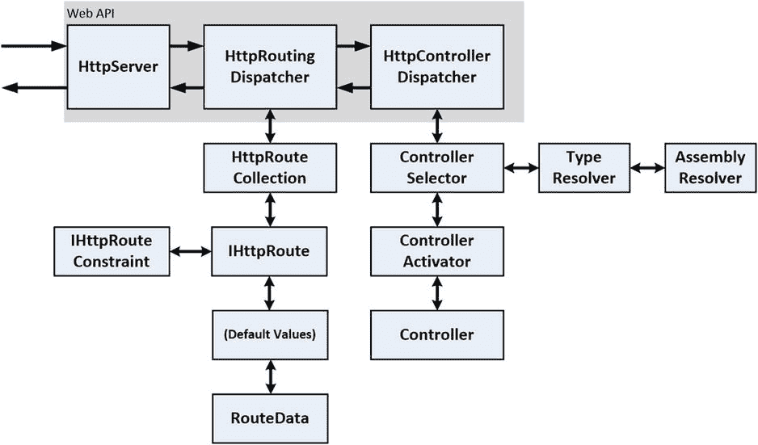
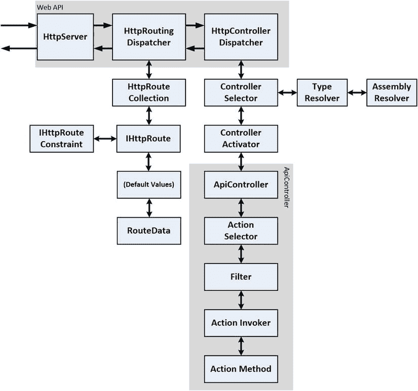
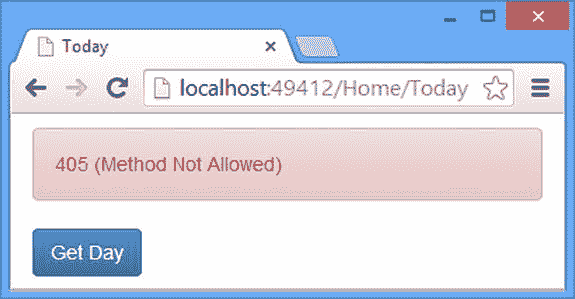
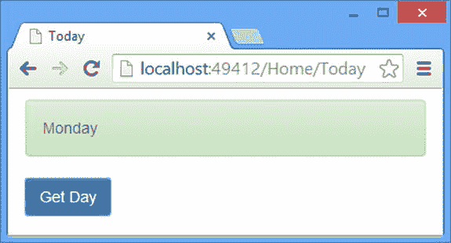
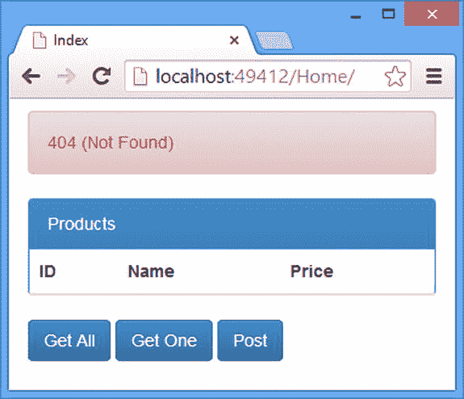

# 二十二、控制器和动作

在这一章中，我将继续描述 Web API 调度过程，并将重点放在控制器和动作方法上。我解释了控制器如何在 Web API 中工作，并描述了由默认控制器类`ApiController`实现的调度过程。在这个过程中，我将向您展示如何解决一个常见的路由问题，解释如何在 RESTful Web API 控制器中将请求映射到动作方法，并向您展示如何定制请求分派。表 [22-1](#Tab1) 总结了本章内容。

表 22-1。

Chapter Summary

<colgroup><col> <col> <col></colgroup> 
| 问题 | 解决办法 | 列表 |
| --- | --- | --- |
| 创建一个控制器。 | 定义一个实现`IHttpController`接口的类，并使用服务集合来访问 Web API 特性，如参数和模型绑定。 | 1–5 |
| 创建一个遵循动作方法模型的控制器，而不必直接处理请求。 | 定义一个从`ApiController`派生的类。 | six |
| 指定操作可以处理的 HTTP 谓词。 | 使用 RESTful 命名约定或应用 HTTP 动词属性。 | seven |
| 避免遵循 RESTful 命名约定的控制器和不遵循 RESTful 命名约定的控制器之间的路由冲突。 | 使用直接路由或限制基于约定的路由(使用约束或不同的前缀)。 | 8–10 |
| 自定义调用操作方法的方式。 | 创建一个`IHttpActionInvoker`接口的实现。 | Eleven |
| 自定义选择操作方法的方式。 | 创建一个`IHttpActionSelector`接口的实现。 | Twelve |
| 将自定义配置应用于控制器。 | 创建一个`IControllerConfiguration`接口的实现。 | 13–14 |

## 准备示例项目

我将继续使用前一章的 Dispatch 项目，但是为了准备本章，我将整理我定义的 URL 路由。清单 22-1 显示了`Today`控制器，我已经从中删除了直接路径。

清单 22-1。从 TodayController.cs 文件中删除直接路由

`using System;`

`using System.Web.Http;`

`namespace Dispatch.Controllers {`

`public class TodayController : ApiController {`

`[HttpGet]`

`public string DayOfWeek() {`

`return DateTime.Now.ToString("dddd");`

`}`

`[HttpGet]`

`public string DayOfWeek(int day) {`

`return Enum.GetValues(typeof(DayOfWeek)).GetValue(day).ToString();`

`}`

`[HttpGet]`

`public int DayNumber() {`

`return DateTime.Now.Day;`

`}`

`}`

`}`

我在`WebApiConfig.cs`文件中定义了一个基于约定的路由，而不是直接路由，它允许到达`Today`控制器中的动作方法，并且我从[第 21 章](21.html)中删除了自定义约束和其他附加内容，如清单 22-2 所示。

清单 22-2。修订 WebApiConfig.cs 文件中的 URL 路由配置

`using System.Web.Http;`

`namespace Dispatch {`

`public static class WebApiConfig {`

`public static void Register(HttpConfiguration config) {`

`config.Routes.MapHttpRoute(`

`name: "ActionMethods",`

`routeTemplate: "api/{controller}/{action}/{day}",`

`defaults: new { day = RouteParameter.Optional }`

`);`

`config.Routes.MapHttpRoute(`

`name: "DefaultApi",`

`routeTemplate: "api/{controller}/{id}",`

`defaults: new { id = RouteParameter.Optional }`

`);`

`}`

`}`

`}`

## 了解控制器

控制器是 Web API 将`HttpRequestMessages`传递到您的定制应用逻辑中的类，这样您就可以将它们转换成`HttpResponseMessages`。这种转换通常会涉及到与模型的交互，这是模型视图控制器模式中的另一个重要组件。正如我在[第 4 章](04.html)中解释的，web 服务没有视图，因为它们将数据传递回客户端，而不是用户界面的组件(尽管有些人认为媒体类型格式化器相当于视图，因为它们以客户端可以消费的方式转换数据)。

图 [22-1](#Fig1) 显示了我在[第 20 章](20.html)中留下的调度过程，在这一章中，我深入研究了如何处理`HttpRequestMessage`对象的细节，从 Web API 控制器的定义开始，然后转向大多数 Web API 应用中使用的默认实现类。

图 22-1。

The Web API dispatch process

表 [22-2](#Tab2) 将控制器放入上下文中。

表 22-2。

Putting Controllers into Context

<colgroup><col> <col></colgroup> 
| 问题 | 回答 |
| --- | --- |
| 这是什么？ | 控制器包含处理请求所需的逻辑，并且是创建`HttpResponseMessage`对象的点，因此它可以沿着调度程序链传递回来，并用于为客户端创建响应。 |
| 你应该什么时候使用它？ | 控制器由`HttpControllerDispatcher`类使用，并完全集成到请求管道中。使用控制器不需要特定的操作。 |
| 你需要知道什么？ | 控制器是由`IHttpController`接口定义的，但是大多数应用通过从`ApiController`类派生得到更好的服务，后者负责许多幕后工作。 |

### 创建控制器

控制器由名称空间`System.Web.Http.Controllers`中的`IHttpController`接口定义。下面是`IHttpController`界面的定义:

`using System.Net.Http;`

`using System.Threading;`

`using System.Threading.Tasks;`

`namespace System.Web.Http.Controllers {`

`public interface IHttpController {`

`Task<HttpResponseMessage> ExecuteAsync(HttpControllerContext controllerContext,`

`CancellationToken cancellationToken);`

`}`

`}`

正如我在[第 19 章](19.html)中解释的那样，`HttpControllerDispatcher`类调用`ExecuteAsync`方法是为了接收一个`Task`，当它完成时会产生一个`HttpResponseMessage`。`ExecuteAsync`方法的参数是一个`HttpControllerContext`对象，用于提供关于请求和整个应用的信息，以及一个`CancellationToken`，用于发出取消长生命周期进程的信号。提醒一下，表 [22-3](#Tab3) 描述了由`HttpControllerContext`类定义的属性。

表 22-3。

The Properties Defined by the HttpControllerContext Class

<colgroup><col> <col></colgroup> 
| 名字 | 描述 |
| --- | --- |
| `Configuration` | 返回应该用于服务请求的`HttpConfiguration`对象。正如我在第 22 章中解释的，控制器可以被赋予自己的配置来工作。 |
| `Controller` | 返回`IHttpController`实例。当`HttpControllerContext`正在向控制器传递一个参数时，这并不完全有用。 |
| `ControllerDescriptor` | 返回导致控制器被实例化的`HttpControllerDescriptor`。 |
| `Request` | 返回描述当前请求的`HttpRequestMessage`。 |
| `RequestContext` | 返回提供请求附加信息的`HttpRequestContext`。 |
| `RouteData` | 返回包含请求路由数据的`IHttpRouteData`对象。详见[第 20 章](20.html)和[第 21 章](21.html)。 |

大多数项目将使用默认的`IHttpController`接口实现——`ApiController`类来创建 web 服务，因为有许多有用的内置特性。但是创建一个定制的实现是很容易的，它有助于将控制器的角色放在调度过程的上下文中。清单 22-3 显示了我添加到`Controllers`文件夹中的`CustomController.cs`文件的内容。

清单 22-3。CustomController.cs 文件的内容

`using System;`

`using System.Net;`

`using System.Net.Http;`

`using System.Threading;`

`using System.Threading.Tasks;`

`using System.Web.Http.Controllers;`

`using System.Web.Http.Routing;`

`namespace Dispatch.Controllers {`

`public class CustomController : IHttpController {`

`public Task<System.Net.Http.HttpResponseMessage> ExecuteAsync(`

`HttpControllerContext context, CancellationToken cancellationToken) {`

`return Task<HttpResponseMessage>.Factory.StartNew(() => {`

`IHttpRouteData rd = context.RouteData;`

`object result = null;`

`if (rd.Values.ContainsKey("action")) {`

`switch (rd.Values["action"].ToString().ToLowerInvariant()) {`

`case "dayofweek":`

`if (rd.Values.ContainsKey("day")) {`

`int dayValue;`

`if (int.TryParse((string)rd.Values["day"],`

`out dayValue)) {`

`result = DayOfWeek(dayValue);`

`} else {`

`return context.Request.CreateErrorResponse(`

`HttpStatusCode.BadRequest, "Cannot parse data");`

`}`

`} else {`

`result = DayOfWeek();`

`}`

`break;`

`case "daynumber":`

`result = DayNumber();`

`break;`

`default:`

`return context.Request.CreateErrorResponse(`

`HttpStatusCode.NotFound, "Cannot parse data");`

`}`

`}`

`return result == null`

`? context.Request.CreateResponse(HttpStatusCode.OK)`

`: context.Request.CreateResponse(HttpStatusCode.OK, result);`

`});`

`}`

`///////////////////////////////`

`// Action Methods Start Here //`

`///////////////////////////////`

`public string DayOfWeek() {`

`return DateTime.Now.ToString("dddd");`

`}`

`public string DayOfWeek(int day) {`

`return Enum.GetValues(typeof(DayOfWeek)).GetValue(day).ToString();`

`}`

`public int DayNumber() {`

`return DateTime.Now.Day;`

`}`

`}`

`}`

这个类实现了与我添加到项目中的`Today`控制器相同的动作方法。不同之处在于，我的新控制器必须负责实现`ExecuteAsync`方法，选择并调用动作方法，并生成可以返回给客户端的`HttpResponseMessage`。

为了测试新的控制器，我需要改变客户端请求的 URL，如清单 22-4 所示。

清单 22-4。在 today.js 文件中更改请求 URL

`var response = ko.observable("Ready");`

`var gotError = ko.observable(false);`

`var sendRequest = function () {`

`$.ajax("/api/custom/dayofweek/1", {`

`type: "GET",`

`success: function (data) {`

`gotError(false);`

`response(data);`

`},`

`error: function (jqXHR) {`

`gotError(true);`

`response(jqXHR.status + " (" + jqXHR.statusText + ")");`

`}`

`});`

`};`

`$(document).ready(function () {`

`ko.applyBindings();`

`});`

请注意，我已经更改了与控制器名称匹配的段，并添加了一个段，该段将通过我在清单 22-3 中添加的路由映射到`day`变量。我这样做是为了演示我的手动参数绑定是如何工作的——以及在后面的例子中如何改进。

要测试新控制器，启动应用并使用浏览器导航到`/Home/Today` URL。点击 Get Day 按钮，客户端会发送一个请求，由我在本章开头定义的路由匹配；这导致我的定制控制器类的`ExecuteAsync`方法被调用。结果被创建并发送回客户端，如图 [22-2](#Fig2) 所示。因为客户端总是指定同一天，所以结果总是`Monday`。

图 22-2。

Sending a request to a custom implementation of the IHttpController interface

### 使用内置服务和功能

当您直接从`IHttpController`接口实现一个控制器时，您会失去由`ApiController`类提供的内置特性(我将在下一节描述)，但是您仍然可以使用核心的 Web API 服务和特性，比如模型绑定。这意味着你不必重新发明重要的特性，尽管要达到一个特性可以被使用的程度还需要做很多工作。在清单 22-5 中，我修改了`Custom`控制器类，使用模型绑定特性来获取调用`DayOfWeek`动作方法所需的参数值。

清单 22-5。使用 CustomController.cs 文件中的内置参数绑定功能

`using System;`

`using System.Net;`

`using System.Net.Http;`

`using System.Threading;`

`using System.Threading.Tasks;`

`using System.Web.Http.Controllers;`

`using System.Web.Http.ModelBinding;`

`using System.Web.Http.Routing;`

`using System.Web.Http;`

`using System.Reflection;`

`namespace Dispatch.Controllers {`

`public class CustomController : IHttpController {`

`public Task<System.Net.Http.HttpResponseMessage> ExecuteAsync(`

`HttpControllerContext context, CancellationToken cancellationToken) {`

`return Task.Run<HttpResponseMessage>(async () => {`

`IHttpRouteData rd = context.RouteData;`

`object result = null;`

`if (rd.Values.ContainsKey("action")) {`

`switch (rd.Values["action"].ToString().ToLowerInvariant()) {`

`case "dayofweek":`

`if (rd.Values.ContainsKey("day")) {`

`int dayValue = await GetValue<int>("day", context,`

`cancellationToken);`

`result = DayOfWeek(dayValue);`

`} else {`

`result = DayOfWeek();`

`}`

`break;`

`case "daynumber":`

`result = DayNumber();`

`break;`

`default:`

`return context.Request.CreateErrorResponse(`

`HttpStatusCode.NotFound, "Cannot parse data");`

`}`

`}`

`return result == null`

`? context.Request.CreateResponse(HttpStatusCode.OK)`

`: context.Request.CreateResponse(HttpStatusCode.OK, result);`

`});`

`}`

`private async Task<T> GetValue<T>(string name, HttpControllerContext ctx,`

`CancellationToken token) {`

`HttpControllerDescriptor ctrlDescriptor = new HttpControllerDescriptor(`

`ctx.Configuration, "Custom", this.GetType());`

`MethodInfo methodInfo`

`= GetType().GetMethod("DayOfWeek", new Type[] { typeof(int)});`

`IActionValueBinder binder`

`= ctx.Configuration.Services.GetActionValueBinder();`

`HttpActionBinding binding = binder.GetBinding(`

`new ReflectedHttpActionDescriptor(ctrlDescriptor, methodInfo));`

`HttpActionContext actionCtx = new HttpActionContext(ctx, new`

`ReflectedHttpActionDescriptor(ctrlDescriptor, methodInfo));`

`await binding.ExecuteBindingAsync(actionCtx, token);`

`return actionCtx.ActionArguments.ContainsKey(name)`

`? (T)Convert.ChangeType(actionCtx.ActionArguments[name], typeof(T))`

`: default(T);`

`}`

`///////////////////////////////`

`// Action Methods Start Here //`

`///////////////////////////////`

`public string DayOfWeek() {`

`return DateTime.Now.ToString("dddd");`

`}`

`public string DayOfWeek(int day) {`

`return Enum.GetValues(typeof(DayOfWeek)).GetValue(day).ToString();`

`}`

`public int DayNumber() {`

`return DateTime.Now.Day;`

`}`

`}`

`}`

我添加到控制器中的`GetValue`方法使用参数绑定来获取调用`DayOfWeek`方法所需的`int`值。为了获取值，我必须创建许多类来提供处理请求所需的上下文。当您使用`ApiController`时，这些类是在幕后创建的，但是这种方法的优点是它可以应用于所有方法参数，而不需要在`ExecuteAsync`方法中硬编码动作方法的知识。我不打算详细介绍`GetValue`方法的实现，因为——正如我在下一节中解释的那样——几乎没有理由在实际项目中实现这个功能。

IMPLEMENTING NEW KINDS OF CONTROLLER

我在清单 22-3 和清单 22-5 中定义的`Custom`控制器向您展示了如何创建一个自定义的`IHttpController`接口实现，并且仍然受益于 Web API 特性，比如参数和模型绑定。也就是说，控制器遵循由`ApiController`类提供的模型，我在本书中一直将该类用作我的所有 web 服务控制器的基类:请求与动作方法相匹配——其中一些需要参数——这些动作方法产生可以返回给客户端的数据或`HttpResponseMessage`对象。

当在`ApiController`类中有一个功能齐全且经过良好测试的替代方法时，在`IHttpController`接口的定制实现中重新创建这个模型并不是一个好主意，我将在下一节中对此进行描述。直接实现`IHttpController`接口唯一有意义的时候是当你需要一种完全不同的方法将`HttpRequestMessage`对象转换成`HttpResponseMessage`对象的时候。我有时不得不创建一个自定义实现，作为不能通过动作方法公开的遗留代码的包装，但这种情况很少发生。对于大多数应用来说，`ApiController`类应该作为控制器的基础。

## 了解 ApiController 调度流程

在`System.Web.Http`名称空间中定义的`ApiController`类是大多数 Web API 控制器使用的基类。`ApiController`类实现了`IHttpController`接口，并提供了两个重要的功能领域:向动作方法发送请求，以及帮助开发人员尽可能保持动作方法的简单性。

动作方法是用于处理创建结果的请求的基本逻辑单元，表示为标准 C#方法。通过实现`IHttpController.ExecuteAsync`方法，`ApiController`类使得使用 C#方法作为动作成为可能，该方法负责为请求定位动作方法，使用参数和模型绑定来获取方法参数，并处理方法结果以创建一个`HttpResponseMessage`对象，该对象可以通过消息处理程序链返回，并最终发送到客户端。我在下面的章节中描述的就是这个过程。表 [22-4](#Tab4) 将`ApiController`分派过程置于上下文中。

表 22-4。

Putting the ApiController Dispatch Process in Context

<colgroup><col> <col></colgroup> 
| 问题 | 回答 |
| --- | --- |
| 这是什么？ | `ApiController`类是`IHttpController`接口的内置实现，增加了对重要便利特性的支持，比如动作方法、动作结果和过滤器。 |
| 你应该什么时候使用它？ | 你应该使用`ApiController`类作为你所有控制器的基础。仅当您需要创建一种完全不同的方法来处理请求时，才直接实现`IHttpController`接口。 |
| 你需要知道什么？ | `ApiController`类依赖于`IHttpActionSelector`和`IHttpActionInvoker`接口的实现来选择和调用动作方法。您可以通过创建定制实现来改变`ApiController`类的行为方式，我将在“定制控制器调度过程”一节中演示这一点。 |

如您所料，有许多关键的分派任务被`ApiController`委派给从服务集合中获得的接口的实现。我将在接下来的小节中依次描述每个接口，并在“定制控制器调度过程”小节中描述定制机会。为了提供调度过程的概述，图 [22-3](#Fig3) 显示了整个请求调度过程的修改图。

图 22-3。

Adding ApiController to the request dispatch process

### 准备示例控制器

为了描述调度过程，我需要一个从`ApiController`类派生的控制器。清单 22-6 显示了我如何改变了`Custom`控制器，使其从`ApiController`派生，而不是直接实现`IHttpController`接口。

清单 22-6。从 CustomController.cs 文件中的 ApiController 类派生

`using System;`

`using System.Web.Http;`

`namespace Dispatch.Controllers {`

`public class CustomController : ApiController {`

`public string DayOfWeek() {`

`return DateTime.Now.ToString("dddd");`

`}`

`public string DayOfWeek(int day) {`

`return Enum.GetValues(typeof(DayOfWeek)).GetValue(day).ToString();`

`}`

`public int DayNumber() {`

`return DateTime.Now.Day;`

`}`

`}`

`}`

我在清单中强调的变化是从实现`IHttpController`接口到从`ApiController`类派生的变化。因为我正在创建一个派生的控制器，所以我已经移除了`ExecuteAsync`方法的实现，我用来访问参数绑定特性的`GetValue`方法，以及两者都需要的名称空间。

为了测试更改的效果，启动应用并使用浏览器导航到`/Home/Today` URL。当你点击 Get Day 按钮时，客户端会显示 405(不允许方法)响应，如图 [22-4](#Fig4) 所示。

图 22-4。

The effect of deriving from the ApiController class

正如我在[第 19 章](19.html)中简要解释的那样，`ApiController`类使用特定的序列选择动作方法。在接下来的部分中，我将描述所使用的序列，并解释为什么它不匹配客户端对由`Custom`控制器定义的动作方法的请求。

### 了解行动选择流程

`ApiController`类将请求的动作方法的选择委托给`IHttpActionSelector`接口的实现，该接口在`System.Web.Http.Controllers`名称空间中定义。下面是`IHttpActionSelector`接口的定义:

`using System.Linq;`

`namespace System.Web.Http.Controllers {`

`public interface IHttpActionSelector {`

`HttpActionDescriptor SelectAction(HttpControllerContext controllerContext);`

`ILookup<string, HttpActionDescriptor> GetActionMapping(HttpControllerDescriptor`

`controllerDescriptor);`

`}`

`}`

当控制器需要识别将用于处理请求的动作方法时，调用`SelectAction`方法。`SelectAction`方法的参数是一个`HttpControllerContext`对象，它描述了处理请求的控制器。(我在[第 19 章](19.html)中描述了`HttpControllerDescriptor`类，但是表格 [22-5](#Tab5) 概括了它定义的属性。)

Tip

`GetActionMapping`方法返回关于可以从指定控制器中选择的一组动作方法的信息。这个方法被直接路由系统使用——我在第 21 章的[中描述过——这样每个动作方法都可以被检查`Route`属性。它在创建定制的`IHttpActionSelector`实现时也很有用，我在“创建定制的 IHttpActionSelector 实现”一节中对此进行了描述。](21.html)

表 22-5。

The Properties Defined by the HttpControllerContext Class

<colgroup><col> <col></colgroup> 
| 名字 | 描述 |
| --- | --- |
| `Configuration` | 返回应该用于服务请求的`HttpConfiguration`对象。正如我在“创建特定于控制器的配置”一节中所解释的，控制器可以被赋予它们自己的配置来使用。 |
| `Controller` | 返回处理请求的`IHttpController`实例。 |
| `ControllerDescriptor` | 返回导致控制器被实例化的`HttpControllerDescriptor`。详见第二十二章。 |
| `Request` | 返回描述当前请求的`HttpRequestMessage`。 |
| `RequestContext` | 返回提供请求附加信息的`HttpRequestContext`。 |
| `RouteData` | 返回包含请求路由数据的`IHttpRouteData`对象。详见[第 20 章](20.html)和[第 21 章](21.html)。 |

来自`SelectAction`方法的结果是一个`HttpActionDescriptor`对象，它定义了表 [22-6](#Tab6) 中描述的属性和方法。

表 22-6。

The Properties and Methods Defined by the HttpActionDescriptor Class

<colgroup><col> <col></colgroup> 
| 名字 | 描述 |
| --- | --- |
| `ActionBinding` | 返回一个`HttpActionBinding`,描述如何将 action 方法定义的参数绑定到请求中的值。 |
| `ActionName` | 返回操作方法的名称。 |
| `Configuration` | 返回动作方法的`HttpConfiguration`对象。有关如何创建控制器特定配置的详细信息，请参见“创建控制器特定配置”一节。 |
| `ControllerDescriptor` | 返回描述包含动作方法的控制器的`HttpControllerDescriptor`对象。参见[第十九章](19.html)。 |
| `ExecuteAsync(controller,` `arguments, cancelToken)` | 执行操作方法。参数是一个`HttpControllerContext`对象；一个`IDictionary<string, object>`，包含动作方法的参数，按名称索引；和一个`CancellationToken`，它可以在需要时间完成的动作方法中被监控取消。 |
| `GetCustomAttributes<T>()` | 返回类型为`T`的属性集合。 |
| `GetFilterPipeline()` | 返回描述已应用于操作方法的过滤器的`FilterInfo`对象的集合。有关过滤器的详细信息，请参见[第 23 章](23.html)和[第 24 章](24.html)。 |
| `GetFilters()` | 返回代表应用于操作方法的过滤器的`IFilter`实现对象的集合。详见[第 23 章](23.html)和[第 24 章](24.html)。 |
| `GetParameters()` | 返回描述由操作方法定义的参数的`HttpParameterDescriptor`对象的集合。 |
| `ResultConverter` | 返回一个`IActionResultConverter`接口的实现，它将把动作方法的响应转换成一个`HttpResponseMessage`对象。 |
| `ReturnType` | 返回动作方法执行时产生的`Type`。 |
| `SupportedHttpMethods` | 返回一组`HttpMethod`值，这些值指定操作方法可以支持哪些 HTTP 方法。 |

#### 了解默认操作方法选择流程

接口的默认实现是在`System.Web.Http.Controllers`名称空间中定义的`ApiControllerActionSelector`类。表 [22-7](#Tab7) 描述了`ApiControllerActionSelector`类选择动作方法的过程。为了更容易理解，我在描述这个过程时做了一些改动。

表 22-7。

The Selection Process Used by the ApiControllerActionSelector Class

<colgroup><col> <col></colgroup> 
| 步骤 | 描述 |
| --- | --- |
| one | 反射用于识别候选的动作方法。对于在此阶段选择的方法，它必须是一个普通的方法(例如，不是构造函数)，必须在从`ApiController`派生的类中定义，并且不能用`NonAction`属性进行注释。 |
| Two | 检查候选动作方法的`Route`属性，看看请求是否可以直接映射。如果使用了直接路由，则直接路由与请求不匹配的操作方法将被丢弃。 |
| three | 检查路由数据以查看是否从请求中提取了一个`action`值。如果是，则检查候选动作方法的集合，以查看是否有名称匹配。如果提供了一个`action`值，则与名称不匹配的候选项将被丢弃。 |
| four | 检查候选动作方法的名称，看它们是否遵循 Web API RESTful 约定。我在“理解 RESTful 命名约定”一节中描述了这种约定，但是简单的版本是检查方法名，看它是否包含 HTTP 动词。例如，假设一个名为`GetProducts`的方法能够处理 GET 请求。命名约定用于丢弃不支持请求 HTTP 动词的候选动作方法。 |
| five | 在不使用命名约定的情况下，HTTP 动词属性，例如`HttpGet`和`HttpPost`，用于丢弃不支持所请求的 HTTP 动词的任何候选动作。 |
| six | 参数的数量和类型用于丢弃任何与路由数据不匹配的候选动作方法，如[第 20 章](20.html)和[第 21 章](21.html)所述。 |

该过程从控制器定义的所有潜在的动作方法开始，并在每个阶段消除那些不能处理请求的方法。在最后的选择步骤结束时，应该只剩下一个动作方法，`ApiControllerActionSelector`类使用一个`HttpActionDescriptor`对象来描述它。

Tip

如果没有合适的操作方法，那么选择器就无法将请求与控制器定义的方法之一相匹配。如果剩下不止一种方法，那么选择器就无法区分动作方法，也不知道应该使用哪种方法。这两种结果都是一个问题，都将导致向客户端发送错误消息。我在第 25 章中描述了 Web API 错误处理。

#### 理解 RESTful 命名约定

选择过程中最重要的一个方面是如何使用动作方法的名称来确定该方法可以处理哪些 HTTP 方法。这是 Web API 使创建 RESTful web 服务变得简单的基础。当我在第 19 章的[中创建示例项目时，我定义了`Products`控制器，如下所示:](19.html)

`using System.Collections.Generic;`

`using System.Linq;`

`using System.Web.Http;`

`using Dispatch.Models;`

`namespace Dispatch.Controllers {`

`public class ProductsController : ApiController {`

`private static List<Product> products = new List<Product> {`

`new Product {ProductID = 1, Name = "Kayak", Price = 275M },`

`new Product {ProductID = 2, Name = "Lifejacket", Price = 48.95M },`

`new Product {ProductID = 3, Name = "Soccer Ball", Price = 19.50M },`

`new Product {ProductID = 4, Name = "Thinking Cap", Price = 16M },`

`};`

`public IEnumerable<Product> Get() {`

`return products;`

`}`

`public Product Get(int id) {`

`return products.Where(x => x.ProductID == id).FirstOrDefault();`

`}`

`public Product Post(Product product) {`

`product.ProductID = products.Count + 1;`

`products.Add(product);`

`return product;`

`}`

`}`

`}`

我使用了最简单的命名方案，并使用 HTTP 动词作为动作方法名。选择过程查看名称，以确定哪个方法应该作为请求 HTTP 谓词的目标。同名的方法——如`Products`控制器中的`Get`方法——通过它们定义的参数来区分，这些参数映射到路由数据中的值，如[第 20 章](20.html)和[第 21 章](21.html)所述。`Products`控制器相对简单，但是当与`WebApiConfig.cs`文件中定义的默认路由结合时，它会产生表 [22-8](#Tab8) 中描述的 RESTful web 服务 API。

表 22-8。

The RESTful Web Service Defined by the Product Controller

<colgroup><col> <col> <col></colgroup> 
| HTTP 动词 | 统一资源定位器 | 动作方法 |
| --- | --- | --- |
| `GET` | `/api/products` | `Get()` |
| `GET` | `/api/products/2` | `Get(int)` |
| `POST` | `/api/products` | `Post(product)` |

Tip

RESTful 命名约定只适用于 GET、POST、PUT 和 DELETE 动词。您需要为其他请求类型应用 HTTP 谓词属性。有关详细信息，请参见“显式指定 HTTP 谓词”一节。

我喜欢让我在 RESTful 控制器中使用的名称尽可能简单，这就是为什么我在`Products`控制器中只使用 HTTP 动词名称。如果您愿意，您可以使用更友好的名称，只要它们的名称以一个动词开头，`ApiControllerActionSelector`类仍然会选择您的操作方法。一种常见的替代方法是在方法名中包含模型类的名称，比如用`GetProducts()`替换`Get()`，用`GetProduct(id)`或`GetProductById(id)`替换`Get(id)`，以此类推。`ApiControllerActionSelector`类不考虑除 HTTP 动词之外的动作方法名称的任何部分，这意味着您可以自由地采用任何您认为容易使用的命名方案。

#### 显式指定 HTTP 动词

作为选择过程的一部分，`ApiControllerActionSelector`类检查候选动作方法可以支持哪些 HTTP 动词。对于遵循 RESTful 命名约定的控制器，HTTP 动词取自方法名:名为`Get`或`GetProducts`的动作方法被认为能够处理 HTTP get 请求。

对于非 RESTful 控制器，必须明确指定支持哪些 HTTP 动词的细节，正因为如此，向`Custom`控制器发送请求会导致 405(不允许方法)响应，如图 [22-4](#Fig4) 所示。(请记住，HTTP 动词也称为 HTTP 方法。)

对 HTTP 动词的支持是通过应用实现`IActionHttpMethodProvider`接口的属性来指定的，该接口是在`System.Web.Http.Controllers`名称空间中定义的。以下是接口的定义:

`using System.Collections.ObjectModel;`

`using System.Net.Http;`

`namespace System.Web.Http.Controllers {`

`public interface IActionHttpMethodProvider {`

`Collection<HttpMethod> HttpMethods { get; }`

`}`

`}`

该接口定义了`HttpMethods` get-only 属性，该属性返回一组`HttpMethod`值，这些值指定一个动作方法支持的动词。Web API 在`System.Web.Http`名称空间中包括一组属性，这些属性实现了`IActionHttpMethodProvider`接口，并使用`HttpMethods`属性返回代表最常用 HTTP 动词的`HttpMethod`值，如表 [22-9](#Tab9) 中所列。

表 22-9。

The Web API Attributes That Implement the IActionHttpMethodProvider Interface

<colgroup><col> <col></colgroup> 
| 名字 | 描述 |
| --- | --- |
| `AcceptVerbs` | 声明操作方法支持一个或多个 HTTP 动词(请参见表后的文本) |
| `HttpGet` | 声明操作方法支持 GET 谓词 |
| `HttpPost` | 声明操作方法支持后置动词 |
| `HttpDelete` | 声明操作方法支持删除谓词 |
| `HttpPut` | 声明操作方法支持 PUT 动词 |
| `HttpPatch` | 声明操作方法支持补丁谓词 |
| `HttpOptions` | 声明操作方法支持选项谓词 |
| `HttpHead` | 声明操作方法支持中心动词 |

名称以`Http`开头的属性声明支持单个 HTTP 动词，并为最常用的动词定义。如果您想要声明对不常用的动词或多个动词的支持，请使用`AcceptVerbs`属性。在清单 22-7 中，你可以看到我是如何将属性应用到`Custom`控制器的。

Note

`HEAD`动词有点奇怪，因为它要求 web 服务像往常一样处理请求，但只发回消息头。在 web 服务控制器中支持`HEAD`动词并不常见，我这样做只是为了演示如何使用动词属性。

清单 22-7。在 CustomController.cs 文件中指定 HTTP 谓词

`using System;`

`using System.Web.Http;`

`namespace Dispatch.Controllers {`

`public class CustomController : ApiController {`

`[AcceptVerbs("GET", "HEAD")]`

`public string DayOfWeek() {`

`return DateTime.Now.ToString("dddd");`

`}`

`[HttpGet]`

`[HttpHead]`

`public string DayOfWeek(int day) {`

`return Enum.GetValues(typeof(DayOfWeek)).GetValue(day).ToString();`

`}`

`[HttpGet]`

`public int DayNumber() {`

`return DateTime.Now.Day;`

`}`

`}`

`}`

我使用了`AcceptVerbs`属性来指定无参数的`DayOfWeek`方法可以处理 GET 和 HEAD 请求。当使用`AcceptVerbs`属性时，动词被指定为字符串。`AcceptVerbs`方法是声明一个动作方法支持一个没有预定义属性的动词的最简单方式。

Caution

大多数 web 服务只需要少量的动词(通常是 GET、POST、PUT 和 DELETE ),而使用其他动词——尤其是不太为人所知的动词，如 PATCH 或 PURGE——可能会导致问题，尤其是在您交付第三方开发人员将为其编写客户端的 web 服务时。如果您发现自己需要支持一个没有内置属性的动词，我建议您慎重考虑。

我还指定了采用`int`参数的`DayOfWeek`方法支持 GET 和 HEAD 动词，但是我是通过应用两个内置动词来实现的。我建议你尽量避免创建支持具有不同含义的多个动词的动作方法，但是如果你想以同样的方式处理 POST 和 PUT，这是一个常见的 web 服务约定(如[第 4 章](04.html)所述)，这种技术会很有用。

Tip

如果您将动词属性应用于遵循 RESTful 命名约定的操作方法，那么在操作方法选择过程中将不会考虑方法的名称。换句话说，由属性指定的动词优先于由方法名指定的动词。我建议只依赖方法名，因为方法名和支持的 HTTP 动词之间的不匹配会导致混淆。

对于`DayNumber`方法，我使用了`HttpGet`属性来指定对 GET 请求的支持。这是使用动词属性的常用方法，每个动作方法都有一个属性。

USING COMMON SENSE TO RESOLVE CLASHES IN PHILOSOPHY

一些开发人员对“不要重复自己”(do not Repeat Yourself，DRY)原则有些痴迷，该原则旨在通过确保每个操作只写一次来减少重复(见 [`http://en.wikipedia.org/wiki/Don't_repeat_yourself`](http://en.wikipedia.org/wiki/Don't_repeat_yourself) )。这是一个很好的原则——也是我自己遵循的原则——但它可能走得太远，我经常遇到包含单个动作方法的控制器，所有的动词属性都应用到该方法中。当我问为什么这样做时，答案总是“因为我们遵循干燥”

在极端情况下，DRY 开始干扰 Web API 模型的原则，该模型鼓励为 Web 服务提供的每个操作使用不同的操作方法，除非这些操作本质上是不可区分的。这意味着总会有一定程度的重复，因为大多数动作方法都需要访问模型库、验证用户数据和处理错误。可以通过定义包含公共代码的非操作方法来减少重复，但是以重复数据删除的名义将操作方法合并在一起会导致长期维护问题，因为所有的请求处理代码都被压缩在一起，使得更改难以应用和测试。

干是一个很好的遵循原则，但是最好表述为不要重复自己，除非这样做可以防止长期问题。如果您发现您的控制器看起来像是我在本章开始时创建的`IHttpController`接口的直接实现，那么请退回到重复数据删除，并使用常识在您遵循的原则和模式之间取得平衡。

既然我已经指定了非 RESTful 控制器中的 action 方法所支持的 HTTP 动词，那么默认流程就能够选择处理请求的方法了。要查看动词属性的效果，请启动应用，使用浏览器导航到`/Home/Today` URL，然后单击 Get Day 按钮。与图 [22-4](#Fig4) 中显示的错误信息不同，客户端将收到 200 (OK)响应和请求的数据，如图 [22-5](#Fig5) 所示。

图 22-5。

The effect of applying HTTP verb attributes to a non-RESTful controller

### 理解 RESTful/非 RESTful 路由问题

在继续描述`ApiController`分派过程之前，我将转换话题，描述一个我故意引入到示例项目中的常见问题，解释导致该问题的原因，并举例说明如何避免该问题。

之前，我在`WebApiConfig.cs`文件中添加了一个路由，它指定了一个`action`变量，这样我就可以将请求指向`Today`控制器，最近又指向了`Custom`控制器。当时我注意到添加路由导致了一个问题，现在我可以描述这个问题，因为我已经解释了如何选择动作方法以及 RESTful 命名约定如何工作。

#### 理解问题

要发现问题，启动应用，使用浏览器导航到`/Home/Index` URL，依次单击 Get All、Get One 和 Post 按钮。Get All 和 Post 按钮将按预期工作——客户端将请求`/api/products` URL，HTTP 动词将用于选择(无参数)`Get`方法或`Post`方法。当点击 Get One 按钮时，客户端将请求`/api/products/2` URL，Web API 将响应 404(未找到)错误，如图 [22-6](#Fig6) 所示。

图 22-6。

A problem with a RESTful controller

提醒一下，下面是示例应用的路由配置:

`using System.Web.Http;`

`namespace Dispatch {`

`public static class WebApiConfig {`

`public static void Register(HttpConfiguration config) {`

`config.Routes.MapHttpRoute(`

`name: "ActionMethods",`

`routeTemplate: "api/{controller}/{action}/{day}",`

`defaults: new { day = RouteParameter.Optional }`

`);`

`config.Routes.MapHttpRoute(`

`name: "DefaultApi",`

`routeTemplate: "api/{controller}/{id}",`

`defaults: new { id = RouteParameter.Optional }`

`);`

`}`

`}`

`}`

当混合使用遵循 RESTful 命名约定和不遵循 RESTful 命名约定的 Web API 控制器时，这是一个常见的问题。对于 RESTful 控制器，操作方法选择依赖于以操作支持的 HTTP 动词开头的操作方法名称，使用以下路由模板:

`...`

`routeTemplate: "api/{controller}/{id}"`

`...`

非 RESTful 控制器依赖于另一条路线，这条路线定义了一个`action`变量来匹配请求:

`...`

`routeTemplate: "api/{controller}/``{action}`T2】

`...`

非 RESTful 路由匹配对 RESTful 控制器的请求。像`/api/products`这样的 URL 请求是可行的，因为非 RESTful 路由模板只匹配三段或四段 URL，所以请求被传递给 RESTful 路由，它将匹配两段或三段 URL(两个模板的最后一段是可选的)。

对于像`/api/products/2`这样的三段 URL 这是客户端在单击 Get One 按钮时发送的内容——非 RESTful 路由匹配请求，并将`2`指定为`action`变量的值。该请求通过 Web API 调度流程传递，直到到达`ApiControllerActionSelector`类，该类检测到路由数据中存在`action`值(表 [22-7](#Tab7) 中的步骤 3)，但无法将其与`ProductsController`类中的方法匹配，并返回 404(未找到)结果。

#### 用路由特异性解决问题

有两种方法可以解决这个问题。第一种是通过限制基于约定的路线或使用直接路线来创建更具体的路线。这种方法在包含大量一种控制器(RESTful 或非 RESTful)而只有少量另一种控制器的应用中工作得很好。在清单 22-8 中，你可以看到我是如何缩小非 RESTful 控制器的路由范围的。

清单 22-8。缩小 WebApiConfig.cs 文件中非 RESTful 路由的范围

`using System.Web.Http;`

`using System.Web.Http.Routing.Constraints;`

`namespace Dispatch {`

`public static class WebApiConfig {`

`public static void Register(HttpConfiguration config) {`

`config.Routes.MapHttpRoute(`

`name: "ActionMethods",`

`routeTemplate: "api/{controller}/{action}/{day}",`

`defaults: new { day = RouteParameter.Optional },`

`constraints: new { controller = new RegexRouteConstraint("today|custom")}`

`);`

`config.Routes.MapHttpRoute(`

`name: "DefaultApi",`

`routeTemplate: "api/{controller}/{id}",`

`defaults: new { id = RouteParameter.Optional }`

`);`

`}`

`}`

`}`

我已经为第一个路由添加了一个约束，这样它将只匹配那些第二个段——`controller`段是`today`或`custom`的请求。这确保了对 RESTful `Products`控制器的请求不会被匹配，并且会被正确路由。要测试这个变化，启动应用，用浏览器导航到`/Home/Index` URL，然后单击 Get One 按钮。您将看到一个`Success`响应，而不是图 [22-6](#Fig6) 所示的错误，客户端将显示一个数据对象的详细信息。

Caution

这个问题不能通过重新排序`WebApiConfig.cs`文件中的路由来解决，这只能改变不匹配的请求，而不能解决根本问题。

#### 使用路由模板前缀解决问题

我不喜欢以这种方式约束路由，因为这意味着有一个必须与应用中的类保持同步的控制器名称列表——这增加了测试负担，并且一旦部署了应用，可能会导致问题。直达路线是解决这个问题的更好的方法，但是我不喜欢使用它们，正如我在第 20 章中解释的那样。

我更喜欢采用的方法是为一类控制器创建一个单独的前缀，例如，RESTful 控制器通过带有普通`/api`前缀的 URL 到达，而非 RESTful 控制器通过不同的前缀到达，比如`/api/nonrest`。清单 22-9 显示了我对`WebApiConfig.cs`文件所做的更改，以实现这一更改。

清单 22-9。在 WebApiConfig.cs 文件中更改非 RESTful 控制器路由模板

`using System.Web.Http;`

`namespace Dispatch {`

`public static class WebApiConfig {`

`public static void Register(HttpConfiguration config) {`

`config.Routes.MapHttpRoute(`

`name: "ActionMethods",`

`routeTemplate: "api/nrest/{controller}/{action}/{day}",`

`defaults: new { day = RouteParameter.Optional }`

`);`

`config.Routes.MapHttpRoute(`

`name: "DefaultApi",`

`routeTemplate: "api/{controller}/{id}",`

`defaults: new { id = RouteParameter.Optional }`

`);`

`}`

`}`

`}`

这一变化意味着非 RESTful 路由将匹配四段或五段的 URL，RESTful 路由将匹配两段或三段的 URL，确保请求不会被错误的路由匹配。这种技术的缺点是它要求客户端使用正确的前缀发出请求，如清单 22-10 所示。

清单 22-10。更改 today.js 文件中的 URL 前缀

`var response = ko.observable("Ready");`

`var gotError = ko.observable(false);`

`var sendRequest = function () {`

`$.ajax("/api/nrest/custom/dayofweek/1", {`

`type: "GET",`

`success: function (data) {`

`gotError(false);`

`response(data);`

`},`

`error: function (jqXHR) {`

`gotError(true);`

`response(jqXHR.status + " (" + jqXHR.statusText + ")");`

`}`

`});`

`};`

`$(document).ready(function () {`

`ko.applyBindings();`

`});`

### 了解过滤器

通过`IHttpActionSelector`接口选择了一个方法后，`ApiController`类执行已经应用于该方法的过滤器。与 MVC 框架一样，Web API 过滤器将额外的逻辑注入到请求分派过程中，并用于实现横切关注点，这是在整个应用中使用的功能，但如果不违反关注点分离原则，就不适合 MVC 模式。

Tip

过滤器支持一种称为面向方面编程的设计模式，在 [`http://en.wikipedia.org/wiki/Aspect-oriented_programming`](http://en.wikipedia.org/wiki/Aspect-oriented_programming) 中有描述。

Web API 过滤器是通过`IFilter`接口定义的，该接口是在`System.Web.Http.Filters`名称空间中定义的。`IFilter`接口不是直接使用的，而是提供了定义描述五种不同 Web API 过滤器的接口的基础，如表 [22-10](#Tab10) 所述。

Caution

Web API 过滤器接口名称与 MVC 框架中的等效接口名称相同。创建过滤器时要小心，因为很容易混淆名称空间，创建 MVC 过滤器而不是 Web API 过滤器。

表 22-10。

The Web API Filter Types and Interfaces

<colgroup><col> <col> <col></colgroup> 
| 过滤方式 | 连接 | 描述 |
| --- | --- | --- |
| 证明 | `IAuthenticationFilter` | 这种过滤器用于要求用户或客户端在执行操作方法之前进行身份验证。 |
| 批准 | `IAuthorizationFilter` | 这种过滤器用于限制特定用户或组对操作方法的访问。 |
| 行动 | `IActionFilter` | 这种过滤器用于操纵请求或响应。 |
| 例外 | `IExceptionFilter` | 这种过滤器用于处理由 action 方法或另一种过滤器抛出的异常。 |
| 推翻 | `IOverrideFilter` | 这种过滤器用于为单个操作方法定制其他过滤器的行为。 |

我在[第 23 章](23.html)和[第 24 章](24.html)中详细描述了过滤器，但是我想在本章中介绍它们，因为它们是`ApiController`分派过程的一部分。过滤器由`ApiController`类支持，并且不像其他一些调度任务那样委托给接口，这意味着当您从`IHttpController`接口创建控制器时，它们不可用。

### 了解动作方法的执行过程

此时，`ApiController`—或者它的代理——已经选择了一个动作方法，并准备好了应用于它的过滤器。下一步是执行 action 方法并获取将沿着调度链传递回来并用于向客户端发送响应的`HttpResponseMessage`对象。

动作方法的执行被委托给`IHttpActionInvoker`接口的实现，定义如下:

`using System.Net.Http;`

`using System.Threading;`

`using System.Threading.Tasks;`

`namespace System.Web.Http.Controllers {`

`public interface IHttpActionInvoker {`

`Task<HttpResponseMessage> InvokeActionAsync(HttpActionContext actionContext,`

`CancellationToken cancellationToken);`

`}`

`}`

`IHttpActionInvoker`接口定义了`InvokeActionAsync`方法，该方法需要异步执行由`HttpActionContext`参数描述的动作(这是选择过程的结果),并返回一个可以用来向客户端发送响应的`HttpResponseMessage`。

`HttpActionContext`参数通过它的`ActionDescriptor`属性提供了执行动作方法的方法，该属性返回一个`HttpActionDescriptor`类的实例。反过来，`HttpActionDescriptor`定义了`ExecuteAsync`方法，该方法执行参数和模型绑定，执行选择的动作方法，并生成结果。

接口的默认实现是在`System.Web.Http.Controllers`名称空间中定义的`ApiControllerActionInvoker`类。这个类负责将 action 方法的结果转换成一个`HttpResponseMessage`对象，并且是允许`ApiController`类支持内置 C#类型和`IHttpActionResult`接口及其实现的组件，我在[第 11 章](11.html)中描述过。

## 定制控制器派遣流程

有几种方式可以定制`ApiController`分派过程，我将在下面的章节中描述它们。默认行为将适合大多数应用，但是如果你确实执行定制，那么确保你彻底地测试，并且你确实不能通过其他特性得到你需要的，例如过滤器(我在[第 23 章](23.html)和[第 24 章](24.html)中描述)。

`ApiController`类提供了一组属性，这些属性提供了对用于创建定制的上下文对象的访问。`ApiController`上下文属性如表 [22-11](#Tab11) 所述。

表 22-11。

The Context Properties Defined by the ApiController Class

<colgroup><col> <col></colgroup> 
| 名字 | 描述 |
| --- | --- |
| `ActionContext` | 返回一个`HttpActionContext`对象，该对象描述了当前正在执行的操作，并提供了许多上下文对象，这些对象由`ApiController`类通过该表中的属性公开 |
| `Configuration` | 返回应该用于处理请求的`HttpConfiguration`对象 |
| `ControllerContext` | 返回该请求的`HttpControllerContext`，如第 19 章中的[所述](19.html) |
| `ModelState` | 返回我在第 18 章的[中描述的模型验证过程所使用的`ModelStateDictionary`对象](18.html) |
| `Request` | 返回描述当前请求的`HttpRequestMessage`对象 |
| `RequestContext` | 返回请求的`HttpRequestContext`对象 |
| `User` | 返回识别与当前请求相关的用户的`IPrincipal`接口的实现，如[第 23 章](23.html)和[第 24 章](24.html)所述 |

您也可以在您的动作方法中使用这些属性，但是这通常不是必需的，因为 web 服务控制器中的动作方法通常专注于从存储库中获取数据。动作方法通常不直接与`HttpRequestMessage`和`HttpResponseMessage`对象交互，而是依靠参数/模型绑定和结果转换从请求中获取数据并创建结果。表 [22-12](#Tab12) 将定制`ApiController`派遣流程放在上下文中。

表 22-12。

Putting Customizing the ApiController Dispatch Process in Context

<colgroup><col> <col></colgroup> 
| 问题 | 回答 |
| --- | --- |
| 这是什么？ | `ApiController`类依赖于`IHttpActionSelector`和`IHttpActionInvoker`接口来选择和执行动作方法。这些接口的自定义实现允许您更改调度过程。 |
| 你应该什么时候使用它？ | 内置的实现适用于几乎所有的 web 服务，定制的实现应该谨慎创建并经过彻底的测试。 |
| 你需要知道什么？ | 您可以通过创建特定于控制器的配置来有选择地应用自定义实现，如“创建特定于控制器的配置”一节中所述。 |

### 创建自定义 IHttpActionInvoker 实现

`IHttpActionInvoker`接口有两个职责:它执行 action 方法，并将其产生的结果转换成一个`HttpResponseMessage`对象。改变方法被调用的方式并没有什么实际价值，但是创建一个`IHttpActionInvoker`接口的定制实现是一种为返回类型提供特殊处理的有用方式。清单 22-11 显示了我添加到`Infrastructure`文件夹中的`CustomActionInvoker.cs`类文件的内容。

清单 22-11。CustomActionInvoker.cs 文件的内容

`using System.Net.Http;`

`using System.Threading;`

`using System.Threading.Tasks;`

`using System.Web.Http;`

`using System.Web.Http.Controllers;`

`namespace Dispatch.Infrastructure {`

`public class CustomActionInvoker : IHttpActionInvoker {`

`public async Task<HttpResponseMessage> InvokeActionAsync(HttpActionContext`

`actionContext, CancellationToken cancellationToken) {`

`object result = await actionContext.ActionDescriptor.ExecuteAsync(`

`actionContext.ControllerContext, actionContext.ActionArguments,`

`cancellationToken);`

`if (result is HttpResponseMessage) {`

`return (HttpResponseMessage)result;`

`} else if (result is IHttpActionResult) {`

`return await ((IHttpActionResult)result).ExecuteAsync(cancellationToken);`

`} else if ( actionContext.ActionDescriptor.ReturnType != typeof(string)) {`

`return actionContext.ActionDescriptor.ResultConverter.Convert(`

`actionContext.ControllerContext, result);`

`} else {`

`return new ValueResultConverter<string[]>().Convert(`

`actionContext.ControllerContext, new string[] { (string)result });`

`}`

`}`

`}`

`}`

这个`IHttpActionInvoker`的实现执行动作方法并检查方法产生的结果。它处理四种结果类型。

*   如果动作方法的结果是一个`HttpResponseMessage`对象，那么`CustomActionInvoker`类返回该对象作为`InvokeActionAsync`方法的结果。
*   如果动作方法结果是`IHttpActionResult`接口的实现，那么`CustomActionInvoker`类调用`ExecuteAsync`方法创建一个`HttpResponseMessage`对象，该对象作为`InvokeActionAsync`方法的结果返回。(我在[第 19 章](19.html)中描述了`IHttpActionResult`接口及其`ExecuteAsync`方法。)
*   如果结果是一个`string`，那么`CustomActionInvoker`类创建一个字符串数组，将结果作为惟一的元素，并使用一个结果转换器来创建我需要的`HttpResponseMessage`作为`InvokeActionAsync`方法的结果。
*   对于所有其他结果类型，`CustomActionInvoker`类使用由`HttpActionContext.ControllerContext`属性提供的结果转换器来创建`HttpResponseMessage`对象。

我的定制实现的核心是使用结果转换器，它接受一个结果类型并创建一个可以通过调度过程返回的`HttpResponseMessage`。结果转换器由`IActionResultConverter`接口定义。

`namespace System.Web.Http.Controllers {`

`public interface IActionResultConverter {`

`HttpResponseMessage Convert(HttpControllerContext controllerContext,`

`object actionResult);`

`}`

`}`

`Convert`方法接受一个`HttpControllerContext`对象和来自 action 方法的结果，并被要求返回一个`HttpResponseMessage`。`IActionResultConverter`接口有两个内置的 Web API 实现，即`ValueResultConverter`和`VoidResultConverter`类，这两个类都在`System.Web.Http.Controllers`名称空间中定义。

内置的实现很简单。`ValueResultConverter`类调用我在第 11 章的[中描述的`HttpRequestMessage.CreateResponse`扩展方法来产生一个带有 200 (OK)状态码的`HttpResponseMessage`对象，在这样做的过程中，使用我在第 2 部分中描述的媒体类型格式化器对结果数据进行编码。](11.html)

`VoidResultConverter`类也调用了`CreateResponse`扩展方法，但是使用了 204(无内容)状态代码。正如您从名字中可以想象的那样，当用 C# `void`关键字定义动作方法时，会用到`VoidResultConverter`。

`ValueResultConverter`类是强类型的，这意味着我必须在我的自定义`IHttpActionInvoker`中创建一个`ValueResultConverter<string[]>`的实例，因为由`HttpActionContext.ActionDescriptor.ResultConverter`属性返回的对象已经被设置为处理 action 方法声明的结果类型。

`...`

`return new ValueResultConverter<string[]>().Convert(`

`actionContext.ControllerContext, new string[] { (string)result });`

`...`

只有当我想要一个包含与 action 方法返回的类型不同的数据的`HttpResponseMessage`时，我才必须创建一个实例。

Note

在“创建特定于控制器的配置”一节之前，我不会注册或测试`CustomActionInvoker`类，在这一节中，我将向您展示如何将它应用于单个控制器类。

### 创建自定义 IHttpActionSelector 实现

`IHttpActionSelector`接口的定制实现允许您控制请求与动作方法匹配的方式。清单 22-12 显示了我添加到`Infrastructure`文件夹中的`CustomActionSelector.cs`文件的内容。

清单 22-12。CustomActionSelector.cs 文件的内容

`using System;`

`using System.Linq;`

`using System.Net;`

`using System.Reflection;`

`using System.Web.Http;`

`using System.Web.Http.Controllers;`

`namespace Dispatch.Infrastructure {`

`public class CustomActionSelector : IHttpActionSelector {`

`public ILookup<string, HttpActionDescriptor>`

`GetActionMapping(HttpControllerDescriptor descriptor) {`

`return descriptor.ControllerType.GetMethods()`

`.Where(x => x.IsPublic`

`&& !x.IsSpecialName`

`&& x.GetCustomAttribute<NonActionAttribute>() == null)`

`.Select(x => (HttpActionDescriptor)`

`new ReflectedHttpActionDescriptor(descriptor, x))`

`.OrderBy(x => x.GetParameters().Count)`

`.ToLookup(x => x.ActionName, StringComparer.OrdinalIgnoreCase);`

`}`

`public HttpActionDescriptor SelectAction(HttpControllerContext context) {`

`if (context.RouteData.Values.ContainsKey("action")) {`

`string actionName = (string)context.RouteData.Values["action"];`

`return GetActionMapping(context.ControllerDescriptor)`

`[actionName].First();`

`} else {`

`throw new HttpResponseException(HttpStatusCode.NotFound);`

`}`

`}`

`}`

`}`

对于自定义实现`IHttpActionSelector`接口几乎没有强制要求，这就是为什么`CustomActionSelector`类做了一些在实际项目中没有用的事情:它按名称选择动作方法，如果有多个方法同名，那么使用参数最少的一个。

`IHttpActionSelector`接口通过抽象的`HttpActionDescriptor`类提供关于动作方法的信息。您可以创建一个`HttpActionDescriptor`的具体实现，但是使用`ReflectedHttpActionDescriptor`类更简单，它执行创建和填充`HttpActionDescriptor`属性所需的所有反射。

我使用`GetActionMapping`方法创建指定控制器中可用的动作方法的枚举，并基于`action`路由变量的值在`SelectAction`方法中过滤该枚举。

Note

在我的自定义`IHttpActionSelector`实现中，我没有实现 RESTful 命名约定，这意味着只支持可以由具有`action`变量段的路由模板匹配的请求。

### 创建控制器特定的配置

我在上一节中创建的`IHttpActionInvoker`和`IHttpActionSelector`接口的定制实现不是特别有用。事实上，它们只与`Custom`控制器一起工作良好，该控制器具有返回`string`值的动作方法(这是我在`CustomActionInvoker`类中寻找的)和具有相同名称但不同参数数量的方法(这是`CustomActionSelector`处理的)。

如果我用我在`WebApiConfig.cs`文件中的自定义类替换 services 集合中的默认实现，它们将应用于所有控制器。对于`CustomActionInvoker`类，这意味着对依赖 RESTful 命名约定的控制器的请求不能被正确路由。

我可以通过创建一个使用我的自定义类的配置来解决这个问题，并有选择地将它应用于我想要更改其操作方法选择和执行的控制器。这是通过创建一个实现`IControllerConfiguration`接口的属性类来实现的，定义如下:

`namespace System.Web.Http.Controllers {`

`public interface IControllerConfiguration {`

`void Initialize(HttpControllerSettings controllerSettings,`

`HttpControllerDescriptor controllerDescriptor);`

`}`

`}`

该接口定义了`Initialize`方法，该方法用于填充作为方法参数传递的`HttpControllerSettings`对象。另一个参数是一个`HttpControllerDescriptor`对象，它提供正在处理的控制器的上下文信息(我在[第 19 章](19.html)中描述过)。`HttpControllerSettings`类用于使用表 [22-13](#Tab13) 中定义的属性覆盖配置设置。

表 22-13。

The Properties Defined by the HttpControllerSettings Class

<colgroup><col> <col></colgroup> 
| 名字 | 描述 |
| --- | --- |
| `Formatters` | 返回媒体类型格式化器的集合(参见第 2 部分) |
| `ParameterBindingRules` | 返回参数绑定规则的集合(参见第 2 部分) |
| `Services` | 返回服务集合(参见第 2 部分) |

#### 创建自定义 IControllerConfiguration 界面

没有默认的`IControllerConfiguration`实现，但是创建一个很容易。清单 22-13 显示了我添加到`Infrastructure`文件夹中的`CustomControllerConfigAttribute.cs`类文件的内容。

清单 22-13。customcontrollerconfigattribute . cs 文件的内容

`using System;`

`using System.Web.Http.Controllers;`

`namespace Dispatch.Infrastructure {`

`public class CustomControllerConfigAttribute : Attribute, IControllerConfiguration {`

`public void Initialize(HttpControllerSettings controllerSettings,`

`HttpControllerDescriptor controllerDescriptor) {`

`controllerSettings.Services.Replace(typeof(IHttpActionSelector),`

`new CustomActionSelector());`

`controllerSettings.Services.Replace(typeof(IHttpActionInvoker),`

`new CustomActionInvoker());`

`}`

`}`

`}`

`IControllerConfiguration`接口的定制实现是从`Attribute`类派生的，因此它们可以应用于控制器类。我的`Initialize`方法的实现使用`HttpControllerDescriptor`方法用我的自定义类的实例替换了`IHttpActionSelector`和`IHttpActionInvoker`接口的默认实现。

清单 22-14 显示了我是如何将`CustomControllerConfigAttribute`属性应用到`Custom`控制器的。

清单 22-14。在 CustomController.cs 文件中应用 CustomControllerConfigAttribute

`using System;`

`using System.Web.Http;`

`using Dispatch.Infrastructure;`

`namespace Dispatch.Controllers {`

`[CustomControllerConfig]`

`public class CustomController : ApiController {`

`[AcceptVerbs("GET", "HEAD")]`

`public string DayOfWeek() {`

`return DateTime.Now.ToString("dddd");`

`}`

`[HttpGet]`

`[HttpHead]`

`public string DayOfWeek(int day) {`

`return Enum.GetValues(typeof(DayOfWeek)).GetValue(day).ToString();`

`}`

`[HttpGet]`

`public int DayNumber() {`

`return DateTime.Now.Day;`

`}`

`}`

`}`

应用`CustomControllerConfig`属性的效果是定制选择器和调用器类用于处理针对`Custom`控制器的请求，而其他控制器的其他请求将由默认实现处理。

Tip

这不是特定于`ApiController`类的。定制配置可以应用于任何`IHttpController`实施。

## 摘要

在这一章中，我描述了 Web API 控制器是如何工作的，特别是默认控制器基类提供的调度过程。我解释了如何选择和调用动作方法，讨论了请求过滤器，并演示了如何定制默认的调度流程。在第 23 章中，我开始描述过滤器，它允许额外的逻辑被注入到调度过程中。