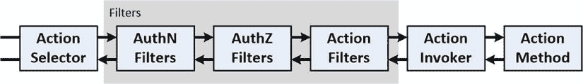
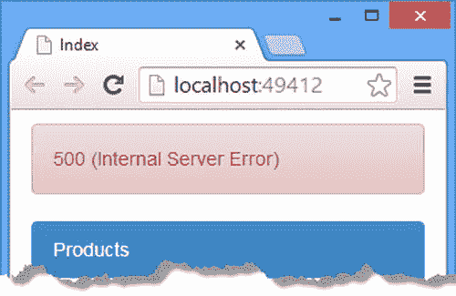
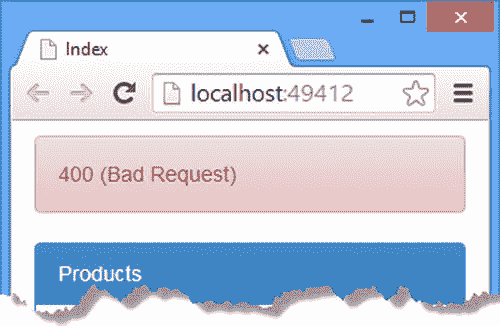

# 24.过滤器第二部分

在本章中，我将继续描述 Web API 对过滤器的支持，并演示授权过滤器是如何工作的。我还向您展示了两种特殊的过滤器:异常过滤器和覆盖过滤器。表 [24-1](#Tab1) 总结了本章内容。

表 24-1。

Chapter Summary

<colgroup><col> <col> <col></colgroup> 
| 问题 | 解决办法 | 列表 |
| --- | --- | --- |
| 创建授权过滤器。 | 实现`IAuthorizationFilter`接口，从`AuthorizationFilterAttribute`类派生，或者使用`Authorize`属性。 | 1, 5–9 |
| 限制对操作方法的访问。 | 将授权属性应用于操作方法或其包含的控制器。 | 2–4 |
| 处理由操作方法或其他过滤器引发的异常。 | 通过实现`IExceptionFilter`接口或从`ExceptionFilterAttribute`类派生来创建一个异常过滤器。 | 10–14 |
| 禁用动作方法的控制器范围或全局异常过滤器的效果。 | 应用覆盖过滤器。 | 15–16 |

## 准备示例项目

我将继续我在[第 19 章](19.html)中创建的调度项目，并在本书的这一部分中继续构建。本章不需要准备性的修改。

Tip

你不必从第 19 章重新创建这个项目，并应用我已经描述过的所有改变。你也可以从 [`http://apress.com`](http://apress.com/) 下载所有按章节组织的源代码。

## 查看派遣流程中的过滤器

在第 23 章中，我解释了过滤器是如何包裹动作方法的，这样它们就可以在执行之前和之后执行逻辑。这提供了改变由 action 方法处理的请求或者将被发送到客户机的响应的方法，并且它允许短路，在这种情况下分派过程被终止。过滤器的执行顺序取决于过滤器的类型及其范围。表 [24-2](#Tab2) 按执行顺序显示了不同的过滤器类型。

表 24-2。

The Web API Filter Types and Interfaces

<colgroup><col> <col> <col></colgroup> 
| 过滤方式 | 连接 | 描述 |
| --- | --- | --- |
| 证明 | `IAuthenticationFilter` | 这种过滤器用于要求用户或客户端在执行操作方法之前进行身份验证。参见[第二十三章](23.html)。 |
| 批准 | `IAuthorizationFilter` | 这种过滤器用于限制特定用户或组对操作方法的访问。 |
| 行动 | `IActionFilter` | 这种过滤器用于操纵请求或响应。参见[第二十三章](23.html)。 |
| 例外 | `IExceptionFilter` | 这种过滤器用于处理由操作方法或另一种过滤器引发的异常。 |
| 推翻 | `IOverrideFilter` | 这种过滤器用于为单个操作方法定制其他过滤器的行为。 |

在这一章中，我将描述最后一个约定过滤器(授权过滤器)，并解释两种特殊类型的过滤器(例外和覆盖过滤器)是如何工作的。授权过滤器在认证过滤器之后、动作过滤器之前执行，如图 [24-1](#Fig1) 所示。

图 24-1。

Filters in the dispatch process Tip

我在图 [24-1](#Fig1) 中使用了两种常见的缩写来适应页面上的所有内容。AuthN 是认证的缩写，AuthZ 是授权的缩写。

## 使用授权过滤器

授权过滤器用于限制特定用户对操作方法的访问。这看起来像是我在第 23 章中描述的认证过滤器的变体，但是正如你将看到的，授权的工作方式是不同的。

在大多数应用程序中，您只需将`Authorize`属性应用于控制器和动作方法，并依靠 ASP.NET 身份系统来执行身份验证和授权工作，但在本节中，我将深入幕后，解释这种重要的过滤器是如何工作的。表 [24-3](#Tab3) 将授权过滤器放入上下文中。

表 24-3。

Putting Authorization Filters in Context

<colgroup><col> <col></colgroup> 
| 问题 | 回答 |
| --- | --- |
| 它们是什么？ | 授权过滤器将操作方法限制为特定用户或他们被分配的角色。 |
| 你应该什么时候使用它们？ | 授权过滤器最常见的用途是防止普通用户获得管理功能的访问权限。 |
| 你需要知道什么？ | 授权过滤器通常依赖另一个组件对请求进行身份验证，然后检查经过身份验证的用户的角色成员资格。执行授权最简单的方法是使用`Authorize`属性。 |

### 了解授权过滤器

授权过滤器由`IAuthorizationFilter`接口定义，该接口在`System.Web.Http.Filters`名称空间中定义，与动作过滤器共享相同的基本方法。这里是`IAuthorization`界面:

`using System.Diagnostics.CodeAnalysis;`

`using System.Net.Http;`

`using System.Threading;`

`using System.Threading.Tasks;`

`using System.Web.Http.Controllers;`

`namespace System.Web.Http.Filters {`

`public interface IAuthorizationFilter : IFilter {`

`Task<HttpResponseMessage> ExecuteAuthorizationFilterAsync(`

`HttpActionContext actionContext, CancellationToken cancellationToken,`

`Func<Task<HttpResponseMessage>> continuation);`

`}`

`}`

Web API 不会对如何授权请求或如何获取与请求相关的用户信息进行任何形式的限制。最常见的方法是读取`HttpRequestContext.Principal`属性的值，以获得一个可以与授权策略进行比较的`IPrincipal`对象。这种方法允许授权与身份验证分离，这意味着可以在不影响授权的情况下更改身份验证机制。

### 创建授权过滤器

在执行操作方法之前，需要授权过滤器来实施授权策略。如果请求符合策略(这意味着它与被授权访问操作方法的用户相关联)，则操作过滤器不执行任何操作。如果请求不符合策略，过滤器会缩短调度过程，并向客户端返回 401(未授权)响应。为了演示授权过滤器是如何工作的，我在`Infrastructure`文件夹中添加了一个名为`CustomAuthorizationAttribute.cs`的类文件，并用它来定义如清单 24-1 所示的过滤器。

清单 24-1。customauthorizationattribute . cs 文件的内容

`using System;`

`using System.Linq;`

`using System.Net;`

`using System.Net.Http;`

`using System.Security.Principal;`

`using System.Threading;`

`using System.Threading.Tasks;`

`using System.Web.Http.Controllers;`

`using System.Web.Http.Filters;`

`namespace Dispatch.Infrastructure {`

`public class CustomAuthorizationAttribute : Attribute, IAuthorizationFilter {`

`private string[] roles;`

`public CustomAuthorizationAttribute(params string[] rolesList) {`

`roles = rolesList;`

`}`

`public Task<HttpResponseMessage> ExecuteAuthorizationFilterAsync(`

`HttpActionContext actionContext,`

`CancellationToken cancellationToken,`

`Func<Task<HttpResponseMessage>> continuation) {`

`IPrincipal principal = actionContext.RequestContext.Principal;`

`if (principal == null || !roles.Any(role => principal.IsInRole(role))) {`

`return Task.FromResult<HttpResponseMessage>(`

`actionContext.Request.CreateResponse(HttpStatusCode.Unauthorized));`

`} else {`

`return continuation();`

`}`

`}`

`public bool AllowMultiple {`

`get { return false; }`

`}`

`}`

`}`

Tip

您不必直接从界面创建过滤器。正如我在“使用 Authorize 属性”一节中所描述的，有一个应用授权的内置属性类。下面的例子解释了授权是如何工作的，但是如果您只想了解如何限制对 action 方法的访问，您可以直接跳到内置属性部分。

过滤器采用了我在第 23 章中描述的一些技术来授权请求。类构造函数接受一个将被授予访问权限的角色数组，并使用`IPrincipal.IsInRole`方法来检查经过身份验证的用户是否属于某个允许的角色。

如果用户处于允许的角色，那么过滤器调用 continuation 函数并返回结果。这通常被称为传递，意味着来自允许用户的请求不加任何修改地通过过滤器。

如果用户不在允许的角色中，那么过滤器会缩短调度过程，并返回一个`HttpResponseMessage`,向客户端产生一个 401(未授权)状态代码。

Tip

对于简单的应用程序，您可能想使用单独的帐户名而不是角色来执行授权，这可以通过与`IPrincipal`对象相关联的`IIdentity`来完成。但是要小心:简单的应用程序通常比最初检查的时间更长，并且会向意想不到的方向发展。使用角色，即使只有一个用户，从长远来看也是值得的。

### 应用授权过滤器

注意，清单 24-1 中的`CustomAuthorizationAttribute`并不标识与请求相关联的用户，而是依赖于已经设置的`HttpContext.Principal`属性。松散耦合身份验证和授权的代价是，授权过滤器依赖于另一个组件来识别用户并创建与请求相关联的`IPrincipal`。在清单 24-2 中，你可以看到我是如何将来自[第 23 章](23.html)的认证属性与授权过滤器配对，以限制对由`Products`控制器定义的动作方法的访问。

清单 24-2。在 ProductsController.cs 文件中应用授权

`using System.Collections.Generic;`

`using System.Linq;`

`using System.Web.Http;`

`using Dispatch.Infrastructure;`

`using Dispatch.Models;`

`namespace Dispatch.Controllers {`

`[Time]`

`public class ProductsController : ApiController {`

`private static List<Product> products = new List<Product> {`

`new Product {ProductID = 1, Name = "Kayak", Price = 275M },`

`new Product {ProductID = 2, Name = "Lifejacket", Price = 48.95M },`

`new Product {ProductID = 3, Name = "Soccer Ball", Price = 19.50M },`

`new Product {ProductID = 4, Name = "Thinking Cap", Price = 16M },`

`};`

`[Counter(3)]`

`public IEnumerable<Product> Get() {`

`return products;`

`}`

`[CustomAuthentication]`

`[CustomAuthorization("admins")]`

`public Product Get(int id) {`

`return products.Where(x => x.ProductID == id).FirstOrDefault();`

`}`

`public Product Post(Product product) {`

`product.ProductID = products.Count + 1;`

`products.Add(product);`

`return product;`

`}`

`}`

`}`

`CustomAuthentication`过滤器为请求设置`IPrincipal`，然后由`CustomAuthorization`过滤器进行评估，以确保用户已经被分配到`admins`角色，我将它指定为构造函数参数。

#### 测试授权过滤器

要测试授权过滤器，启动应用程序并使用浏览器导航到`/Home/Index` URL。单击 Get One 按钮，出现提示时，输入用户名 bob 和密码 secret。

浏览器将对您提供的凭证进行编码，并将请求重新发送给服务器。认证过滤器将创建一个代表用户`bob`的`IPrincipal`对象，并允许请求继续通过调度过程。授权过滤器检查`IPrincipal`以查看用户是否被分配了`admins`角色。表 [24-4](#Tab4) 列出了我在[第 23 章](23.html)中定义的用户和角色，并显示`bob`不是`admin`角色的一部分，因此无权调用 action 方法。

表 24-4。

The Users, Passwords, and Roles Defined by the StaticUser Class

<colgroup><col> <col> <col></colgroup> 
| 用户 | 密码 | 角色 |
| --- | --- | --- |
| `admin` | `secret` | `admins`，`users` |
| `bob` | `secret` | `users` |

授权过滤器缩短请求，并向客户端返回 401(未授权)响应。处理基本身份验证的浏览器在 401 响应被传递给 jQuery 之前直接拦截它，这意味着您将被提示输入不同的凭证，而不会看到错误响应。

Note

即使清除了历史缓存，浏览器也会存储 HTTP 基本身份验证凭据。要从一个用户帐户切换到另一个帐户，通常需要重启浏览器，导航到`/Home/Index` URL，然后再次点击 Get One 按钮。

重启浏览器，导航到`/Home/Index` URL，再次点击 Get One 按钮。这次，输入用户名 admin 和密码 secret。这些凭证是为被分配了`admins`角色的用户准备的，这意味着授权过滤器将允许请求传递到分派过程的下一个阶段。

### 删除身份验证过滤器

筛选器的类型排序确保身份验证筛选器在授权筛选器之前运行，即使它们具有相同的范围。(我在第 23 章中解释了过滤范围。)如果您查看 Visual Studio 输出窗口，您会看到我之前创建的`PipelineActionSelector`类写出的管道信息在授权排序之前确认了身份验证。

`Scope Action Type: CustomAuthenticationAttribute`

`Scope Action Type: CustomAuthorizationAttribute`

`Scope Global Type: SayHelloAttribute`

`Scope Controller Type: TimeAttribute`

`SayHello: Global Filter`

`Elapsed time: 1497 ticks, GET` `http://localhost:49412/api/products/2`

这种排序允许我创建一个基于认证过程的授权过滤器，而不必担心`IPrincipal`对象来自哪里。依赖身份验证过滤器的缺点是，每当我想要执行授权时，我必须确保应用两个过滤器。

一种更常见的方法是创建一个消息处理程序，它将在调度过程的早期执行身份验证，这样就可以单独应用授权过滤器，而不需要附带的身份验证过滤器。清单 24-3 显示了我添加到`Infrastructure`文件夹中的`AuthenticationDispatcher.cs`文件的内容，该文件用于定义一个认证消息处理程序。

清单 24-3。AuthenticationDispatcher.cs 文件的内容

`using System;`

`using System.Net;`

`using System.Net.Http;`

`using System.Net.Http.Headers;`

`using System.Text;`

`using System.Threading;`

`using System.Threading.Tasks;`

`namespace Dispatch.Infrastructure {`

`public class AuthenticationDispatcher : DelegatingHandler {`

`protected override async Task<HttpResponseMessage> SendAsync(`

`HttpRequestMessage request,`

`CancellationToken cancellationToken) {`

`AuthenticationHeaderValue authentication = request.Headers.Authorization;`

`if (authentication != null && authentication.Scheme == "Basic") {`

`string[] authData =`

`Encoding.ASCII.GetString(Convert.FromBase64String(`

`authentication.Parameter)).Split(':');`

`request.GetRequestContext().Principal`

`= StaticUserManager.AuthenticateUser(authData[0], authData[1]);`

`}`

`HttpResponseMessage response = await base.SendAsync(request,`

`cancellationToken);`

`if (response.StatusCode == HttpStatusCode.Unauthorized) {`

`response.Headers.Add("WWW-Authenticate", "Basic");`

`}`

`return response;`

`}`

`}`

`}`

这个过滤器使用了我在第 24 章的认证过滤器中使用的相同的基本代码，但是排列方式不同。我仍然检查`Authorization`头，如果它存在的话，就用它来验证请求，但是对于无法验证的请求，我不会终止调度过程。这允许请求不受阻碍地通过应用程序到达对任何人开放的操作方法，但仍然为授权过滤器提供它需要的信息。

除了验证请求之外，消息处理程序还检查响应，并向 401(未授权)响应添加一个`WWW-Authenticate`头，以向客户端提供重试所需的信息。清单 24-4 显示了我如何在`WebApiConfig.cs`文件中注册认证消息处理程序。

清单 24-4。在 WebApiConfig.cs 文件中注册消息处理程序

`using System.Web.Http;`

`using System.Web.Http.Controllers;`

`using Dispatch.Infrastructure;`

`namespace Dispatch {`

`public static class WebApiConfig {`

`public static void Register(HttpConfiguration config) {`

`config.Routes.MapHttpRoute(`

`name: "ActionMethods",`

`routeTemplate: "api/nrest/{controller}/{action}/{day}",`

`defaults: new { day = RouteParameter.Optional }`

`);`

`config.Routes.MapHttpRoute(`

`name: "DefaultApi",`

`routeTemplate: "api/{controller}/{id}",`

`defaults: new { id = RouteParameter.Optional }`

`);`

`config.Services.Replace(typeof(IHttpActionSelector),`

`new PipelineActionSelector());`

`config.Filters.Add(new SayHelloAttribute { Message = "Global Filter" });`

`config.MessageHandlers.Add(new AuthenticationDispatcher());`

`}`

`}`

`}`

我现在可以从`Products`控制器的 action 方法中移除认证过滤器，只依赖授权过滤器，如清单 24-5 所示。

清单 24-5。从 ProductsController.cs 文件中删除身份验证筛选器

`...`

`//[CustomAuthentication]`

`[CustomAuthorization("admins")]`

`public Product Get(int id) {`

`return products.Where(x => x.ProductID == id).FirstOrDefault();`

`}`

`...`

Tip

我在第 24 章中创建的认证过滤器仍然有用，因为它限制了任何认证用户的访问，这是一个常见的需求，特别是对于付费服务。在“修改身份验证过滤器”一节中，我重新访问了身份验证过滤器，并修改了它以利用消息处理程序。

#### 重新测试授权过滤器

测试消息处理程序效果的最简单方法是向浏览器提供您想要作为 URL 的一部分进行测试的基本凭证。启动应用程序并使用浏览器请求以下 URL，注意将端口号更改为与运行应用程序的端口号相对应:

`http://``admin:secret@`T2】

我突出显示的 URL 部分告诉浏览器，如果需要基本身份验证，可以使用指定的凭据。单击 Get One 按钮，客户端 jQuery 代码将向 web 服务发送一个 Ajax 请求。

该请求不包含任何凭证，因此授权过滤器将缩短分派过程并返回 401(未授权)响应，身份验证消息处理程序将向该响应添加一个`WWW-Authenticate`头，告诉客户端需要基本身份验证。

浏览器将使用您在 URL 中提供的凭据自动重新发送请求，而不会通知 jQuery。消息处理程序将处理`Authorization`头并创建`IPrincipal`对象，这允许授权过滤器验证请求。

要查看来自不允许访问操作方法的用户的请求的效果，请请求以下 URL:

`http://``bob`T2】

单击 Get One 按钮将重复请求序列，但仍然会产生 401(未授权)结果，因为`bob`还没有被分配给`admins`角色，这是授权过滤器实施的策略。

### 使用内置的授权过滤器属性

两个内置的过滤器类允许您执行授权，而不需要直接从`IAuthorizationFilter`接口实现一个类。第一个是在`System.Web.Http.Filters`名称空间中定义的`AuthorizationFilterAttribute`类；这个类使得编写过滤器而不用担心延续成为可能，就像我在第 23 章的[中描述的`ActionFilterAttribute`类为动作过滤器所做的一样。`AuthorizationFilterAttribute`类定义了表](23.html) [24-5](#Tab5) 中所示的方法。

表 24-5。

The Method Defined by the AuthorizationFilterAttribute Class

<colgroup><col> <col></colgroup> 
| 名字 | 描述 |
| --- | --- |
| `OnAuthorizationAsync` | 此方法被重写以实现授权策略。 |

几乎没有理由使用`AuthorizationFilterAttribute`类，因为另一个内置类(我将在下一节描述)更容易使用；然而，为了完整起见，清单 24-6 显示了我如何修改了`CustomAuthorizationAttribute`类，使其从`AuthorizationFilterAttribute`派生而来。

清单 24-6。从 customauthorizationattribute . cs 文件中的 AuthorizationFilterAttribute 派生

`using System.Linq;`

`using System.Net;`

`using System.Net.Http;`

`using System.Security.Principal;`

`using System.Threading;`

`using System.Threading.Tasks;`

`using System.Web.Http.Controllers;`

`using System.Web.Http.Filters;`

`namespace Dispatch.Infrastructure {`

`public class CustomAuthorizationAttribute : AuthorizationFilterAttribute {`

`private string[] roles;`

`public CustomAuthorizationAttribute(params string[] rolesList) {`

`roles = rolesList;`

`}`

`public override Task OnAuthorizationAsync(HttpActionContext actionContext,`

`CancellationToken cancellationToken) {`

`IPrincipal principal = actionContext.RequestContext.Principal;`

`if (principal == null || !roles.Any(role => principal.IsInRole(role))) {`

`actionContext.Response =`

`actionContext.Request.CreateResponse(HttpStatusCode.Unauthorized);`

`}`

`return Task.FromResult<object>(null);`

`}`

`}`

`}`

当从`AuthorizationFilterAttribute`类派生时，`OnAuthorizationAsync`方法通过设置`HttpActionContext`参数的`Response`属性来缩短分派过程。对于通过授权策略的请求，不设置响应，请求继续通过调度管道。

#### 使用授权属性

几乎没有理由使用`AuthorizationFilterAttribute`类的原因是，Web API 包括一个`Authorize`过滤器，它内置了对创建策略的支持，以限制对特定用户和角色的访问，而根本不需要任何编码。`Authorize`属性定义了表 [24-6](#Tab6) 中所示的配置属性。

表 24-6。

The Properties Defined by the Authorize Attribute

<colgroup><col> <col></colgroup> 
| 名字 | 描述 |
| --- | --- |
| `Roles` | 允许访问操作方法的角色的逗号分隔列表 |
| `Users` | 允许访问操作方法的用户的逗号分隔列表 |

`Authorize`属性的工作方式与我定义的自定义属性相同，它依赖于调度流程中的另一个组件(未指定)来验证请求。清单 24-7 展示了我如何用`Products`控制器中的内置属性替换我的自定义授权属性。

清单 24-7。使用 ProductsController.cs 文件中内置的 Authorize 属性

`...`

`//[CustomAuthentication]`

`//[CustomAuthorization("admins")]`

`[Authorize(Roles="admins")]`

`public Product Get(int id) {`

`return products.Where(x => x.ProductID == id).FirstOrDefault();`

`}`

`...`

效果与我的自定义过滤器相同，但不需要编写任何自定义代码。

Note

您可能想知道为什么我绕了这么远的路，才演示了执行授权检查的最简单的方法。原因有二。首先，`Authorize`属性依赖于另一个组件来执行认证，我想在介绍`Authorize`过滤器之前解释一下如何实现这一点。第二，通过了解授权在幕后是如何工作的，当`Authorize`属性不按您预期的方式工作时，您就不太可能被发现，这在使用 ASP.NET 身份等用户管理系统时并不少见。这些系统是复杂的，并且经常违反直觉，你越了解它们如何集成到 Web API 中，你就越不可能遇到问题。

### 返工身份验证过滤器

在继续之前，我想整理一个松散的结尾:当我在第 23 章中创建的认证过滤器被应用时，认证将被执行两次，一次在过滤器中，另一次在消息处理器中。清单 24-8 展示了我是如何修改`CustomAuthenticationFilter`类的，这样它只强制执行限制已认证用户访问的策略，并依靠消息处理程序来执行认证。

清单 24-8。修订 CustomAuthenticationFilter.cs 文件中的身份验证策略

`using System;`

`using System.Net.Http.Headers;`

`using System.Threading;`

`using System.Threading.Tasks;`

`using System.Web.Http.Filters;`

`using System.Web.Http.Results;`

`namespace Dispatch.Infrastructure {`

`public class CustomAuthenticationAttribute : Attribute, IAuthenticationFilter {`

`public Task AuthenticateAsync(HttpAuthenticationContext context,`

`CancellationToken cancellationToken) {`

`if (context.Principal == null`

`|| !context.Principal.Identity.IsAuthenticated) {`

`context.ErrorResult`

`= new UnauthorizedResult(new AuthenticationHeaderValue[] {`

`new AuthenticationHeaderValue("Basic") }, context.Request);`

`}`

`return Task.FromResult<object>(null);`

`}`

`public Task ChallengeAsync(HttpAuthenticationChallengeContext context,`

`CancellationToken cancellationToken) {`

`return Task.FromResult<object>(null);`

`}`

`public bool AllowMultiple {`

`get { return false; }`

`}`

`}`

`}`

过滤器不再了解用于认证用户的机制，而是简单地依赖清单 24-3 中的消息处理程序与请求相关联的`IPrincipal`对象。清单 24-9 显示了我是如何将修改后的过滤器应用到`Products`控制器上的。

清单 24-9。将修改后的身份验证筛选器应用于 ProductsController.cs 文件

`using System.Collections.Generic;`

`using System.Linq;`

`using System.Web.Http;`

`using Dispatch.Infrastructure;`

`using Dispatch.Models;`

`namespace Dispatch.Controllers {`

`[Time]`

`[CustomAuthentication]`

`public class ProductsController : ApiController {`

`private static List<Product> products = new List<Product> {`

`new Product {ProductID = 1, Name = "Kayak", Price = 275M },`

`new Product {ProductID = 2, Name = "Lifejacket", Price = 48.95M },`

`new Product {ProductID = 3, Name = "Soccer Ball", Price = 19.50M },`

`new Product {ProductID = 4, Name = "Thinking Cap", Price = 16M },`

`};`

`[Counter(3)]`

`public IEnumerable<Product> Get() {`

`return products;`

`}`

`//[CustomAuthentication]`

`//[CustomAuthorization("admins")]`

`[Authorize(Roles="admins")]`

`public Product Get(int id) {`

`return products.Where(x => x.ProductID == id).FirstOrDefault();`

`}`

`public Product Post(Product product) {`

`product.ProductID = products.Count + 1;`

`products.Add(product);`

`return product;`

`}`

`}`

`}`

认证和授权过滤器的综合效果是，来自任何经过认证的用户的请求都可以调用`Post`和无参数的`Get`动作方法，但是只有被分配了`admins`角色的经过认证的用户才能够调用接受参数的`Get`动作方法。

## 使用异常过滤器

异常过滤器，顾名思义，只有在动作方法或另一个过滤器抛出异常时才执行；它们用于将该异常转换成将被发送给客户端的响应。正如我所演示的，默认的 Web API 将异常视为服务器内部的问题，但这并不总是有用的。表 [24-7](#Tab7) 将异常过滤器放入上下文中。

表 24-7。

Putting Exception Filters in Context

<colgroup><col> <col></colgroup> 
| 问题 | 回答 |
| --- | --- |
| 它们是什么？ | 当操作方法或其他过滤器引发异常时，将执行异常过滤器。 |
| 你应该什么时候使用它们？ | 异常过滤器可用于将默认响应替换为一个响应，该响应为客户端提供了有关问题的更多信息以及可以采取的补救措施。 |
| 你需要知道什么？ | 抛出一个`HttpResponseException`绕过异常过滤器，正如我在第 25 章的[中解释的。](25.html) |

### 了解默认行为

在我进入异常过滤器的细节之前，我需要创建一个异常源。清单 24-10 显示了我对`Products`控制器的修改，这样我就可以按需生成异常。(为了简化代码，我还删除了前面示例中的过滤器。)

清单 24-10。在 ProductsController.cs 文件中引发异常

`using System.Collections.Generic;`

`using System.Linq;`

`using System.Web.Http;`

`using Dispatch.Infrastructure;`

`using Dispatch.Models;`

`namespace Dispatch.Controllers {`

`public class ProductsController : ApiController {`

`private static List<Product> products = new List<Product> {`

`new Product {ProductID = 1, Name = "Kayak", Price = 275M },`

`//new Product {ProductID = 2, Name = "Lifejacket", Price = 48.95M },`

`//new Product {ProductID = 3, Name = "Soccer Ball", Price = 19.50M },`

`//new Product {ProductID = 4, Name = "Thinking Cap", Price = 16M },`

`};`

`public IEnumerable<Product> Get() {`

`return products;`

`}`

`public Product Get(int id) {`

`return products[id];`

`//return products.Where(x => x.ProductID == id).FirstOrDefault();`

`}`

`public Product Post(Product product) {`

`product.ProductID = products.Count + 1;`

`products.Add(product);`

`return product;`

`}`

`}`

`}`

我已经注释掉了几个定义数据对象的语句，并更改了接受参数的`Get` action 方法的版本，以便将参数的值视为数据集合的索引。

要查看更改的效果，请启动应用程序，使用浏览器导航到`/Home/Index` URL，然后单击 Get One 按钮。单击 Get One 按钮时客户端请求的 URL 是`/api/products/2`，这超出了数据收集的界限。总体效果是客户端收到一个 500(内部服务器错误)，如图 [24-2](#Fig2) 所示。

图 24-2。

The default error-handling behavior

如果您使用 F12 开发人员工具，您将会看到来自 web 服务的响应是一个 JSON 对象，它包含关于所抛出的异常的详细信息，如下所示:

`{"Message" : "An error has occurred.",`

`"ExceptionMessage" : "Index was outside the bounds of the array.",`

`"ExceptionType":"System.IndexOutOfRangeException",`

`"StackTrace":"at Dispatch.Controllers.ProductsController.Get(Int32 id) in ..."}`

我将回到 JSON 对象，并在第 25 章中解释它的用法，但对于这一章，需要注意的关键点是，当抛出异常时，默认行为是发送 500(内部服务器错误)响应。

### 了解异常过滤器

通过发送 500(内部服务器错误)响应来同等对待所有异常是一种包罗万象的策略，这种策略并不总是有意义的，尤其是如果您使用的代码使用异常来表示不是服务器端问题的结果。对于上一节中的`Products`控制器，客户端正在请求一个不存在的数据对象，返回 500(内部服务器错误)响应并不完全有帮助，因为它表明请求因为服务器内部的某个问题而不能被处理，而不是请求有问题。异常过滤器可用于覆盖默认行为，并向客户端返回更有意义和有用的响应。

异常过滤器源自于`IExceptionFilter`接口，该接口在`System.Web.Http.Filters`名称空间中定义。定义如下:

`using System.Threading;`

`using System.Threading.Tasks;`

`namespace System.Web.Http.Filters {`

`public interface IExceptionFilter : IFilter {`

`Task ExecuteExceptionFilterAsync(HttpActionExecutedContext actionExecutedContext,`

`CancellationToken cancellationToken);`

`}`

`}`

当 action 方法或另一个过滤器抛出异常时，调用`ExecuteExceptionFilterAsync`方法。通过`HttpActionExecutedContext`参数的`Exception`属性可以访问异常的详细信息，该参数还定义了用于设置将发送给客户端的`HttpResponseMessage`的`Response`属性。(我在[第 23 章](23.html)中描述了`HttpActionExecutedContext`类。)

### 创建例外过滤器

例外过滤器可以创建新的响应，修改现有的响应，或者选择不执行任何操作。清单 24-11 显示了我添加到`Infrastructure`文件夹中的`CustomExceptionAttribute.cs`文件的内容，该文件用于定义一个异常过滤器，该过滤器将处理由`Products`控制器抛出的异常。

清单 24-11。CustomExceptionAttribute.cs 文件的内容

`using System;`

`using System.Net;`

`using System.Net.Http;`

`using System.Threading;`

`using System.Threading.Tasks;`

`using System.Web.Http.Filters;`

`namespace Dispatch.Infrastructure {`

`public class CustomExceptionAttribute : Attribute, IExceptionFilter {`

`public Task ExecuteExceptionFilterAsync(HttpActionExecutedContext`

`actionExecutedContext, CancellationToken cancellationToken) {`

`if (actionExecutedContext.Exception != null`

`&& actionExecutedContext.Exception is ArgumentOutOfRangeException) {`

`actionExecutedContext.Response =`

`actionExecutedContext.Request.CreateErrorResponse(`

`HttpStatusCode.BadRequest, "No data item");`

`}`

`return Task.FromResult<object>(null);`

`}`

`public bool AllowMultiple {`

`get { return true; }`

`}`

`}`

`}`

与其他过滤器接口不同，`ExecuteExceptionFilterAsync`方法中不需要连续函数，甚至不需要方法结果。当方法被调用时，我检查是否已经设置了`HttpActionExecutedContext.Exception`属性，并且它是我感兴趣的异常的一个实例:`ArgumentOutOfRangeException`类。

我使用`HttpRequestMessage.CreateError`消息扩展方法创建了一个`HttpResponseMessage`，并使用它来设置`HttpActionExecutedContext.Response`属性，这允许我将 500(内部服务器错误)响应更改为更有用的 401(错误请求)响应。清单 24-12 显示了我如何将异常过滤器应用到`Products`控制器上。

清单 24-12。在 ProductsController.cs 文件中应用异常筛选器

`...`

`[CustomException]`

`public Product Get(int id) {`

`return products[id];`

`//return products.Where(x => x.ProductID == id).FirstOrDefault();`

`}`

`...`

异常过滤器的应用与其他过滤器类型一样，可以用于特定的操作方法或整个控制器，也可以注册为全局过滤器，以便影响整个应用程序。

要查看效果，请启动应用程序，使用浏览器导航到`/Home/Index` URL，然后单击 Get One 按钮。新的响应如图 [24-3](#Fig3) 所示。

图 24-3。

Using an exception filter to change the response

如果你使用 F12 开发工具，你会看到我传递给`CreateErrorResponse`方法的字符串是这样的:

`...`

`actionExecutedContext.Request.CreateErrorResponse(HttpStatusCode.BadRequest,`

`"No data item"` `);`

`...`

用于创建包含在以下响应中的 JSON 对象:

`{"Message":"No data item"}`

在第 25 章中，我将回到 JSON 对象，以及更广泛的 Web API 错误处理。

### 从 ExceptionFilterAttribute 类派生筛选器

`ExceptionFilterAttribute`类可以用作异常过滤器的基础，尽管由于`IExceptionFilter`接口不需要使用延续函数，主要的好处是与其他类型的定制过滤器保持一致。`ExceptionFilterAttribute`类定义了表 [24-8](#Tab8) 中所示的方法。

表 24-8。

The Method Defined by the ExceptionFilterAttribute Class

<colgroup><col> <col></colgroup> 
| 名字 | 描述 |
| --- | --- |
| `OnExceptionAsync` | 此方法被重写以处理由操作方法或其他筛选器引发的异常。 |

清单 24-13 显示了我是如何更新自定义异常过滤器类的，这样它就可以从`ExceptionFilterAttribute`中派生出来。我还将该类设置为可配置的，以便在应用它时，可以将它配置为从异常类型映射到 HTTP 结果。

清单 24-13。更改 CustomExceptionAttribute.cs 文件中的基类型

`using System;`

`using System.Net;`

`using System.Net.Http;`

`using System.Threading;`

`using System.Threading.Tasks;`

`using System.Web.Http.Filters;`

`namespace Dispatch.Infrastructure {`

`public class CustomExceptionAttribute : ExceptionFilterAttribute {`

`public HttpStatusCode StatusCode { get; set; }`

`public Type ExceptionType { get; set; }`

`public string Message { get; set; }`

`public override Task OnExceptionAsync(`

`HttpActionExecutedContext actionExecutedContext,`

`CancellationToken cancellationToken) {`

`if (actionExecutedContext.Exception != null`

`&& actionExecutedContext.Exception.GetType() == ExceptionType) {`

`actionExecutedContext.Response`

`= actionExecutedContext.Request.CreateErrorResponse(StatusCode,`

`Message);`

`}`

`return Task.FromResult<object>(null);`

`}`

`}`

`}`

这个过滤器中的基本技术与我直接从`IExceptionFilter`接口派生时是一样的，除了我已经将异常类型、HTTP 状态代码和要包含在 JSON 对象中的消息提取到属性中。清单 24-14 显示了我如何将过滤器应用到`Products`控制器来设置属性值。

清单 24-14。在 ProductsController.cs 文件中更改异常筛选器的应用

`using System.Collections.Generic;`

`using System.Linq;`

`using System.Web.Http;`

`using Dispatch.Infrastructure;`

`using Dispatch.Models;`

`using System.Net;`

`using System;`

`namespace Dispatch.Controllers {`

`public class ProductsController : ApiController {`

`private static List<Product> products = new List<Product> {`

`new Product {ProductID = 1, Name = "Kayak", Price = 275M },`

`//new Product {ProductID = 2, Name = "Lifejacket", Price = 48.95M },`

`//new Product {ProductID = 3, Name = "Soccer Ball", Price = 19.50M },`

`//new Product {ProductID = 4, Name = "Thinking Cap", Price = 16M },`

`};`

`public IEnumerable<Product> Get() {`

`return products;`

`}`

`[CustomException(ExceptionType=typeof(ArgumentOutOfRangeException),`

`StatusCode=HttpStatusCode.BadRequest, Message="No such index")]`

`public Product Get(int id) {`

`return products[id];`

`//return products.Where(x => x.ProductID == id).FirstOrDefault();`

`}`

`public Product Post(Product product) {`

`product.ProductID = products.Count + 1;`

`products.Add(product);`

`return product;`

`}`

`}`

`}`

Tip

如果你正在处理很多异常，那么考虑使用全局错误处理特性，我在第 25 章中描述了这个特性。

## 使用覆盖过滤器

在[第 23 章](23.html)中，我解释了过滤器有作用域。这是一个有用的特性，这意味着您不必对要应用的每个操作方法都应用过滤器。我还演示了如何创建应用于应用程序中所有操作方法的全局过滤器。

过滤器覆盖允许您禁用操作方法的一个或多个过滤器。这允许您仍然受益于控制器和全局作用域，但是有选择地禁用过滤器来为特定的动作方法创建不同的行为。表 [24-9](#Tab9) 将覆盖过滤器置于上下文中。

表 24-9。

Putting Overriding Filters in Context

<colgroup><col> <col></colgroup> 
| 问题 | 回答 |
| --- | --- |
| 它们是什么？ | 替代筛选器禁用给定类型的更大范围的筛选器。 |
| 你应该什么时候使用它们？ | 当您想要改变单个动作方法的过滤器管道，以便不执行控制器级和全局过滤器时，请使用覆盖。 |
| 你需要知道什么？ | 如“重新定义过滤器策略”一节所述，覆盖过滤器不会影响在相同范围内应用的过滤器。 |

### 覆盖内置过滤器类型

覆盖过滤器实现了在`System.Web.Http.Filters`名称空间中定义的`IOverrideFilter`接口。下面是界面:

`namespace System.Web.Http.Filters {`

`public interface IOverrideFilter : IFilter {`

`Type FiltersToOverride { get; }`

`}`

`}`

属性返回要被覆盖的过滤器的类型。要应用覆盖，使用我在表 [24-10](#Tab10) 中显示的内置过滤器类之一。每个覆盖过滤器属性影响一种类型的过滤器。

Tip

与其他过滤器类型不同，创建自定义覆盖过滤器没有任何好处。这是因为`ApiController`用来处理覆盖的类(`FilterGrouping`类)只检查每个过滤器类型，而不检查它们的派生类型。这意味着可以覆盖实现`IExceptionFilter`接口的过滤器，但不能覆盖`IFilter`。表中显示的内置覆盖过滤器类封装了`IOverrideFilter`接口可以使用的全部功能。

表 24-10。

The Built-in Override Filter Attributes

<colgroup><col> <col></colgroup> 
| 名字 | 描述 |
| --- | --- |
| `OverrideAuthenticationFilters` | 防止执行身份验证过滤器 |
| `OverrideAuthorizationFilters` | 防止授权过滤器被执行 |
| `OverrideActionFilters` | 防止操作过滤器被执行 |
| `OverrideExceptionFilters` | 防止异常过滤器被执行 |

清单 24-15 展示了我是如何将一个授权过滤器应用到`Products`控制器上，使其适用于所有的动作方法，然后应用`OverrideAuthorizationFilters`属性来禁用其中一个方法的授权。(请求的认证仍然由我在本章前面创建的 HTTP 基本认证消息处理器处理。)

清单 24-15。在 ProductsController.cs 文件中覆盖控制器范围的授权

`using System.Collections.Generic;`

`using System.Linq;`

`using System.Web.Http;`

`using Dispatch.Infrastructure;`

`using Dispatch.Models;`

`using System.Net;`

`using System;`

`namespace Dispatch.Controllers {`

`[Authorize(Roles="admins")]`

`public class ProductsController : ApiController {`

`private static List<Product> products = new List<Product> {`

`new Product {ProductID = 1, Name = "Kayak", Price = 275M },`

`//new Product {ProductID = 2, Name = "Lifejacket", Price = 48.95M },`

`//new Product {ProductID = 3, Name = "Soccer Ball", Price = 19.50M },`

`//new Product {ProductID = 4, Name = "Thinking Cap", Price = 16M },`

`};`

`[OverrideAuthorization]`

`public IEnumerable<Product> Get() {`

`return products;`

`}`

`[CustomException(ExceptionType=typeof(ArgumentOutOfRangeException),`

`StatusCode=HttpStatusCode.BadRequest, Message="No such index")]`

`public Product Get(int id) {`

`return products[id];`

`//return products.Where(x => x.ProductID == id).FirstOrDefault();`

`}`

`public Product Post(Product product) {`

`product.ProductID = products.Count + 1;`

`products.Add(product);`

`return product;`

`}`

`}`

`}`

`Authorize`属性的作用是限制`Products`控制器中的所有动作方法，这样只有被分配了`admins`角色的认证用户才能访问它们。

将`OverrideAuthorization`属性应用于`Get`动作方法的无参数版本的效果是阻止该动作方法的所有授权过滤器的执行，这意味着任何请求都能够调用该动作。

### 重新定义过滤器策略

覆盖过滤器的巧妙之处在于，它们只影响先前范围内的过滤器，这意味着您可以在与覆盖相同的级别应用被覆盖类型的属性，并且它们将被执行。作为一个例子，清单 24-16 展示了我如何在`Products`控制器中的`OverrideAuthorization`属性旁边应用了`Authorize`属性。

清单 24-16。在 ProductsController.cs 文件中重新定义授权

`using System.Collections.Generic;`

`using System.Linq;`

`using System.Web.Http;`

`using Dispatch.Infrastructure;`

`using Dispatch.Models;`

`using System.Net;`

`using System;`

`namespace Dispatch.Controllers {`

`[Authorize(Roles="admins")]`

`public class ProductsController : ApiController {`

`private static List<Product> products = new List<Product> {`

`new Product {ProductID = 1, Name = "Kayak", Price = 275M },`

`//new Product {ProductID = 2, Name = "Lifejacket", Price = 48.95M },`

`//new Product {ProductID = 3, Name = "Soccer Ball", Price = 19.50M },`

`//new Product {ProductID = 4, Name = "Thinking Cap", Price = 16M },`

`};`

`[OverrideAuthorization]`

`[Authorize(Roles="users")]`

`public IEnumerable<Product> Get() {`

`return products;`

`}`

`[CustomException(ExceptionType=typeof(ArgumentOutOfRangeException),`

`StatusCode=HttpStatusCode.BadRequest, Message="No such index")]`

`public Product Get(int id) {`

`return products[id];`

`//return products.Where(x => x.ProductID == id).FirstOrDefault();`

`}`

`public Product Post(Product product) {`

`product.ProductID = products.Count + 1;`

`products.Add(product);`

`return product;`

`}`

`}`

`}`

我将`Authorize`过滤器应用于`Get`方法，指定只有被分配了`users`角色的认证用户才被允许调用 action 方法。如果没有`OverrideAuthorization`属性，过滤器管道将包含两个`Authorize`属性，并且它们将被一个接一个地执行，从而产生一个组合效果，限制那些被分配了`admins`和`users`角色的用户的访问。

但是对于`OverrideAuthorization`，控制器范围的`Authorize`属性被从管道中移除，这意味着只有直接应用于动作方法的`Authorize`过滤器将被使用:效果是限制对`users`角色的访问。

## 摘要

在这一章中，我解释了认证和异常过滤器的工作原理，从而完成了对过滤器的 Web API 支持的描述。我还演示了如何使用 override filters 来阻止已经在全局和控制器范围内应用的过滤器的执行，从而允许为 action 方法禁用或重新定义过滤。