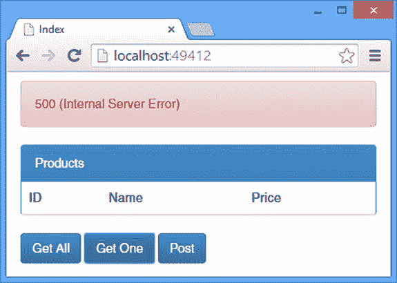
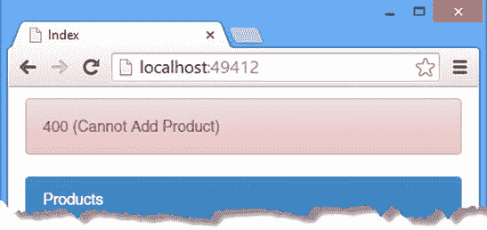
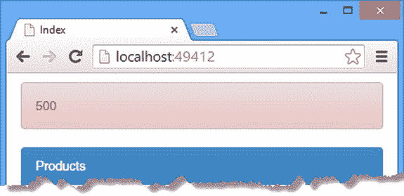

# 25.错误处理

在这一章中，我通过展示如何处理错误来完成我对 Web API 分派过程的描述。我将向您展示在开发过程中处理预期问题的不同方法，以及当意外问题出现时会发生什么。我解释了如何控制发送到客户机的响应，以及如何管理和记录整个应用的未处理异常。表 [25-1](#Tab1) 总结了本章内容。

表 25-1。

Chapter Summary

<colgroup><col> <col> <col></colgroup> 
| 问题 | 解决办法 | 列表 |
| --- | --- | --- |
| 触发默认的错误处理策略。 | 从操作方法或过滤器引发异常。 | 1–3 |
| 引发生成特定结果状态代码的异常。 | 抛出一个`HttpResponseException`的实例。 | four |
| 返回对预期错误的响应。 | 返回一个`IHttpActionResult`接口的实现。 | five |
| 控制发生错误时发送到客户端的附加数据。 | 使用一个`HttpError`对象。 | 6–9 |
| 控制如何将未处理异常的信息发送到客户端。 | 设置`HttpConfiguration.IncludeErrorDetailPolicy`属性。 | Ten |
| 在客户端接收额外的错误数据。 | 读取`jqXHR.responseJSON`属性，从响应中获得一个 JavaScript 对象，并向用户显示`Message`属性(如果存在的话)。 | Eleven |
| 更改处理未处理异常的默认策略。 | 创建全局异常处理程序。 | 12–14 |
| 记录未处理的异常。 | 创建全局异常记录器。 | 15–16 |

## 准备示例项目

我将继续使用我在第 19 章中创建的调度项目。为了准备本章，我从`Products`控制器中移除了过滤器，如清单 25-1 所示。

清单 25-1。ProductsController.cs 文件的内容

`using System;`

`using System.Collections.Generic;`

`using System.Linq;`

`using System.Net;`

`using System.Web.Http;`

`using Dispatch.Infrastructure;`

`using Dispatch.Models;`

`namespace Dispatch.Controllers {`

`public class ProductsController : ApiController {`

`private static List<Product> products = new List<Product> {`

`new Product {ProductID = 1, Name = "Kayak", Price = 275M },`

`//new Product {ProductID = 2, Name = "Lifejacket", Price = 48.95M },`

`//new Product {ProductID = 3, Name = "Soccer Ball", Price = 19.50M },`

`//new Product {ProductID = 4, Name = "Thinking Cap", Price = 16M },`

`};`

`public IEnumerable<Product> Get() {`

`return products;`

`}`

`[LogErrors]`

`public Product Get(int id) {`

`return products[id];`

`//return products.Where(x => x.ProductID == id).FirstOrDefault();`

`}`

`public Product Post(Product product) {`

`product.ProductID = products.Count + 1;`

`products.Add(product);`

`return product;`

`}`

`}`

`}`

我已经在`Product`控制器的`Get`动作方法中应用了一个`LogErrors`属性。这是一个简单的异常过滤器的应用，我通过添加一个`LogErrorsAttribute.cs`文件到`Infrastructure`文件夹并定义如清单 25-2 所示的类来定义它。

清单 25-2。LogErrorsAttribute.cs 文件的内容

`using System;`

`using System.Diagnostics;`

`using System.Threading;`

`using System.Threading.Tasks;`

`using System.Web.Http.Filters;`

`namespace Dispatch.Infrastructure {`

`public class LogErrorsAttribute : Attribute, IExceptionFilter {`

`public Task ExecuteExceptionFilterAsync(HttpActionExecutedContext`

`actionExecutedContext, CancellationToken cancellationToken) {`

`Debug.WriteLine(string.Format(`

`"Exception Type: {0}", actionExecutedContext.Exception.Message));`

`Debug.WriteLine(string.Format(`

`"Exception Message: {0}", actionExecutedContext.Exception.GetType()));`

`return Task.FromResult<object>(null);`

`}`

`public bool AllowMultiple {`

`get { return false; }`

`}`

`}`

`}`

过滤器写出要求它处理的异常的消息和类型，我将使用它们来突出一些错误处理方式的不同。最后，我已经更新了`WebApiConfig.cs`文件来注释掉我在前面章节中添加的定制类。清单 25-3 显示了修改后的配置。

清单 25-3。WebApiConfig.cs 文件的内容

`using System.Web.Http;`

`using System.Web.Http.Controllers;`

`using Dispatch.Infrastructure;`

`namespace Dispatch {`

`public static class WebApiConfig {`

`public static void Register(HttpConfiguration config) {`

`config.Routes.MapHttpRoute(`

`name: "ActionMethods",`

`routeTemplate: "api/nrest/{controller}/{action}/{day}",`

`defaults: new { day = RouteParameter.Optional }`

`);`

`config.Routes.MapHttpRoute(`

`name: "DefaultApi",`

`routeTemplate: "api/{controller}/{id}",`

`defaults: new { id = RouteParameter.Optional }`

`);`

`//config.Services.Replace(typeof(IHttpActionSelector),`

`//    new PipelineActionSelector());`

`//config.Filters.Add(new SayHelloAttribute { Message = "Global Filter" });`

`//config.MessageHandlers.Add(new AuthenticationDispatcher());`

`}`

`}`

`}`

## 处理错误

所有的 web 服务都会遇到问题，但是好的应用和坏的应用的区别在于您处理这些问题的方式，以及您如何将它们呈现给客户端和用户。

从广义上来说，有两种错误:一种是您在开发过程中预料到的，另一种是您在生产过程中突然发现的。仔细的编码和彻底的测试可以帮助减少意外，但是你不能预见每一个问题。重要的是要有一个计划来处理你预期的问题，并有一个后备位置来应对那些你看不到的问题。Web API 提供了处理这两种问题的特性，我将在下面的章节中解释。表 [25-2](#Tab2) 将 Web API 错误处理支持放入上下文中。

表 25-2。

Putting Error Handling in Context

<colgroup><col> <col></colgroup> 
| 问题 | 回答 |
| --- | --- |
| 这是什么？ | 异常处理是对问题和异常做出响应的过程，以便通过 HTTP 响应将它们呈现给客户端。 |
| 你应该什么时候使用它？ | 您应该在操作方法和过滤器中处理尽可能多的问题，并尽可能少地依赖默认行为。 |
| 你需要知道什么？ | 您可以通过实现一个新的全局异常处理程序来改变默认行为，正如我在“全局响应错误”一节中所描述的。 |

### 依赖于默认行为

处理问题最简单的方法是忽略它们，让默认行为负责为客户端生成响应，即发送 500(内部服务器错误)状态代码和一些诊断数据。

要查看默认行为，启动应用并使用浏览器导航到`/Home/Index` URL。单击 Get One 按钮发送 Ajax 请求，该请求将调用`Get` action 方法。从请求的 URL 中获取的`id`参数的值超过了可用数据项的数量，这导致抛出异常。异常以 500(内部服务器)响应的形式向客户端表达，如图 [25-1](#Fig1) 所示。

图 25-1。

The default Web API exception handling

依赖默认行为是你能做的最没用的事情，只有在不可预见的问题上才应该依赖它。问题是 500(内部服务器错误)状态代码除了无法处理请求之外，没有向客户端传达任何有用的信息。

当我看到 500 状态码时，我想起了我母亲以前开过的一辆车。那是一辆老式标致车，仪表板上有一盏红色的灯，一旦汽车检测到问题，它就会亮起。从内部灯泡爆炸到严重的发动机故障，灯都会亮起，没有办法知道明天继续解决问题是否安全，或者你是否应该把车停在路边，叫辆消防车。500 状态代码就像`STOP`灯:除了已经发生的问题之外，它不传达任何有用的信息。它没有解释是什么导致了问题，问题有多严重，或者如何解决问题。

为了应对缺乏上下文的情况，Web API 在响应正文中包含了附加数据，如下所示:

`{"Message":"An error has occurred.",`

`"ExceptionMessage":"Index was out of range. Must be non-negative and less than the`

`size of the collection.\r\nParameter name: index",`

`"ExceptionType":"System.ArgumentOutOfRangeException",`

`"StackTrace":"   at System.ThrowHelper.ThrowArgumentOutOfRangeException() at`

`System.Collections.Generic.List`1.get_Item(Int32 index)\r\n   at`

`Dispatch.Controllers.ProductsController.Get(Int32 id) in ..."}`

我在“使用 HttpError 类”一节中解释了这部分响应是如何创建和格式化的，但是现在，只需知道向客户机发送了四条信息就足够了。

*   描述问题的消息
*   来自异常的消息
*   那个。异常的. NET 类型
*   堆栈跟踪(为了简洁起见，我对其进行了编辑)

这似乎比它在现实中更有用。信息是模糊的(“发生了一个错误”并不比响应状态代码更能提供信息)，并且只包含对 web 服务开发人员有用的信息。

最后，正如您在阅读过第 24 章后所期望的，我在本章开始时应用的`LogErrors`异常过滤器被执行，它在 Visual Studio 输出窗口中产生以下消息:

`Exception Type: Index was out of range. Must be non-negative and less than the size of the collection.`

`Parameter name: index`

`Exception Message: System.ArgumentOutOfRangeException`

#### 抛出一个特殊异常

当一个动作方法抛出一个异常(或者未能捕捉到它调用的代码抛出的异常)时，应用默认行为，但是有一种类型的异常不会触发默认行为:`HttpResponseException`。`HttpResponseException`类的构造函数接受一个`HttpStatusCode`参数，该参数用作 HTTP 响应的状态代码。清单 25-4 显示了我如何将`HttpResponseException`应用到`Products`控制器的`Get`动作中。

清单 25-4。在 ProductsController.cs 文件中应用 HttpResponseException

`using System;`

`using System.Collections.Generic;`

`using System.Linq;`

`using System.Net;`

`using System.Web.Http;`

`using Dispatch.Infrastructure;`

`using Dispatch.Models;`

`namespace Dispatch.Controllers {`

`public class ProductsController : ApiController {`

`private static List<Product> products = new List<Product> {`

`new Product {ProductID = 1, Name = "Kayak", Price = 275M },`

`//new Product {ProductID = 2, Name = "Lifejacket", Price = 48.95M },`

`new Product {ProductID = 3, Name = "Soccer Ball", Price = 19.50M },`

`new Product {ProductID = 4, Name = "Thinking Cap", Price = 16M },`

`};`

`public IEnumerable<Product> Get() {`

`return products;`

`}`

`[LogErrors]`

`public Product Get(int id) {`

`Product product = products.Where(x => x.ProductID == id).FirstOrDefault();`

`if (product == null) {`

`throw new HttpResponseException(HttpStatusCode.BadRequest);`

`}`

`return product;`

`}`

`public Product Post(Product product) {`

`product.ProductID = products.Count + 1;`

`products.Add(product);`

`return product;`

`}`

`}`

`}`

我采用了一种更加细致的方法来实现 action 方法，使用 LINQ 来尝试定位一个由客户端指定 ID 的`Product`对象。如果不匹配，那么我抛出一个新的带有 400(错误请求)状态代码的`HttpResponseException`。

Web API 处理`HttpResponseException`的方式不同于所有其他异常。最重要的是，不执行异常过滤器。这是因为`ApiControllerActionInvoker`类(它是`IHttpActionInvoker`接口的默认实现，正如我在第 22 章的[中解释的那样)显式捕获`HttpResponseException`的实例，并在执行正常的错误处理之前处理它们以创建一个`HttpResponseMessage`对象。](22.html)

Note

当您使用`HttpResponseException`时，响应中不包含任何上下文信息——比如堆栈跟踪。

### 使用 IHttpActionResult 接口的实现

对于您预期的问题——尤其是那些由请求问题引起的问题——您可以遵循通过`ApiController`基类可用的标准方法，并返回一个实现`IHttpActionResult`接口的对象。清单 25-5 显示了如果请求的数据对象不存在，我如何修改了控制器`Products`中的`Get`动作方法来返回这种结果。

清单 25-5。在 ProductsController.cs 文件中返回 IHttpActionResult

`...`

`[LogErrors]`

`public``IHttpActionResult`T2】

`Product product = products.Where(x => x.ProductID == id).FirstOrDefault();`

`if (product == null) {`

`return BadRequest("No such data object");`

`}`

`return Ok(product);`

`}`

`...`

我发现这种方法比使用`HttpResponseException`更不自然，因为来自 action 方法的结果必须是`IHttpActionResult`才能产生成功和错误的结果，尽管这被`ApiController`类提供的用于创建结果的便利方法稍微减轻了一些，例如`Ok`和`BadRequest`。当您使用方便的方法时，例如`BadRequest`，字符串参数包含在发送给客户端的响应的主体中，如下所示:

`{"Message":"No such data object"}`

要查看这些数据，启动应用，使用浏览器导航到`/Home/Index` URL，然后单击 Get One 按钮。使用 F12 工具，您将能够看到响应包含一个带有`Message`属性的 JSON 对象。

## 使用 HttpError 类

错误 HTTP 响应主体中的内容由`HttpError`类控制，该类在前面的示例中已经在后台创建和填充。通过在 action 方法中创建一个`HttpResponseMessage`对象，并向一个`HttpError`对象提供您希望包含在响应体中的信息，您可以更直接地控制向客户端表达错误的方式。

Tip

`HttpError`对象通过媒体类型格式化器进行序列化，我在第 2 部分中对此进行了描述。这意味着格式将适应客户的偏好，这就是为什么我在本章中创建的`HttpError`对象都表示为 JSON。请参阅第 2 部分，了解对象是如何序列化的，以及客户机是如何指定它希望处理的格式的。

为了完整起见，我将向您展示如何使用`HttpError`对象向客户端发送数据，但是数据本身的用途有限。HTTP web 服务客户端只需要处理响应状态代码，对于主体数据以及如何使用主体数据没有标准。您应该注意确保响应状态代码准确地反映了问题的性质，并且不依赖于客户端能够解析和响应您选择包含的任何附加信息。

在开发过程中，当您负责创建 web 服务和客户端时，其他数据可能会有所帮助，但我发现使用 Visual Studio 调试器和浏览器 F12 工具来找出出错时发生的情况更有帮助。表格 [25-3](#Tab3) 将`HttpError`对象放入上下文中。

表 25-3。

Putting the HttpError Class in Context

<colgroup><col> <col></colgroup> 
| 问题 | 回答 |
| --- | --- |
| 这是什么？ | `HttpError`类用于在出错时向客户端发送额外的数据。 |
| 你应该什么时候使用它？ | 当 Web API 处理未捕获的异常时，会自动使用`HttpError`类，但是您也可以直接创建用于`HttpResponseMessage`对象的实例。 |
| 你需要知道什么？ | 关于 web 服务如何向客户端发送错误数据，并没有一致的标准，Web API 发送的默认数据通常只对开发人员有用。 |

### 使用错误响应和 HttpError 对象

在`System.Web.Http`名称空间中定义的`HttpError`类定义了表 [25-4](#Tab4) 中显示的属性。

表 25-4。

The Properties Defined by the HttpError Class

<colgroup><col> <col></colgroup> 
| 名字 | 描述 |
| --- | --- |
| `ExceptionMessage` | 获取或设置一个描述性的`string`，通常用于保存来自`HttpError`所代表的异常的消息。 |
| `ExceptionType` | 获取或设置`HttpError`表示的异常的类型，表示为`string`。 |
| `InnerException` | 获取或设置表示嵌套错误的`HttpError`。 |
| `Message` | 获取或设置描述`HttpError`对象代表的问题的用户可读消息，表示为`string`。 |
| `MessageDetail` | 获取或设置针对客户端开发人员的消息，该消息描述了`HttpError`表示的错误，以`string`表示。 |
| `ModelState` | 获取包含模型验证错误详细信息的`HttpError`。要设置这个属性，使用接受`ModelStateDictionary`对象的构造函数创建一个`HttpError`类的新实例。参见“在 HTTP 响应中包含模型状态错误”一节的演示。 |
| `StackTrace` | 获取`HttpError`对象表示的错误的堆栈跟踪，以字符串形式表示。 |

要控制响应体中包含的数据，您需要创建一个`HttpError`实例，设置想要包含的属性，然后创建一个`HttpResponseMessage`，它将通过调度链将数据传回客户端。清单 25-6 展示了在`Products`控制器的`Get`动作方法中`HttpError`对象的使用。

清单 25-6。在 ProductsController.cs 文件中创建错误响应

`using System;`

`using System.Collections.Generic;`

`using System.Linq;`

`using System.Net;`

`using System.Web.Http;`

`using Dispatch.Infrastructure;`

`using Dispatch.Models;`

`using System.Net.Http;`

`namespace Dispatch.Controllers {`

`public class ProductsController : ApiController {`

`private static List<Product> products = new List<Product> {`

`new Product {ProductID = 1, Name = "Kayak", Price = 275M },`

`//new Product {ProductID = 2, Name = "Lifejacket", Price = 48.95M },`

`new Product {ProductID = 3, Name = "Soccer Ball", Price = 19.50M },`

`new Product {ProductID = 4, Name = "Thinking Cap", Price = 16M },`

`};`

`public IEnumerable<Product> Get() {`

`return products;`

`}`

`[LogErrors]`

`public``HttpResponseMessage`T2】

`Product product = products.Where(x => x.ProductID == id).FirstOrDefault();`

`if (product == null) {`

`return Request.CreateErrorResponse(HttpStatusCode.BadRequest,`

`new HttpError {`

`Message = "No such data item",`

`MessageDetail = string.Format("No item ID {0} was found", id)`

`});`

`}`

`return Request.CreateResponse(product);`

`}`

`public Product Post(Product product) {`

`product.ProductID = products.Count + 1;`

`products.Add(product);`

`return product;`

`}`

`}`

`}`

在清单中，我在`HttpRequestMessage`对象上使用了`CreateErrorResponse`扩展方法来创建一个`HttpResponseMessage`。我使用的这个版本的`CreateErrorResponse`方法带有一个 HTTP 状态代码和一个`HttpError`对象，为此我设置了`Message`和`MessageDetail`属性。

您可以看到我在清单 25-6 中设置的属性值是如何通过调用 action 方法来处理的。启动应用，使用浏览器导航到`/Home/Index`，并单击 Get One 按钮。客户端请求的 URL 将触发错误响应的创建，您将在浏览器 F12 工具的响应中看到以下数据:

`{"Message":"No such data item","MessageDetail":"No item ID 2 was found"}`

### 向 HttpError 对象添加额外的信息

尽管`HttpError`类定义了表 [25-4](#Tab4) 中所示的属性集，但该类本身是从`Dictionary<string, object>`中派生出来的，这意味着您可以向发送给客户端的响应中添加任意数据。清单 25-7 显示了我如何修改了控制器`Product`中的`Get`方法，通过`HttpError`对象发送附加信息。

清单 25-7。在 ProductsController.cs 文件中添加额外的错误信息

`...`

`[LogErrors]`

`public HttpResponseMessage Get(int id) {`

`Product product = products.Where(x => x.ProductID == id).FirstOrDefault();`

`if (product == null) {`

`HttpError error = new HttpError();`

`error.Message = "No such data item";`

`error.Add("RequestID", id);`

`error.Add("AvailbleIDs", products.Select(x => x.ProductID));`

`return Request.CreateErrorResponse(HttpStatusCode.BadRequest, error);`

`}`

`return Request.CreateResponse(product);`

`}`

`...`

在这个例子中，我设置了表 [25-4](#Tab4) 中描述的`Message`属性，并添加了两个自定义属性来提供关于错误的附加信息。我包含了 action 方法接收到的请求的产品 ID(这对于检查在处理请求时是否有参数/模型绑定错误很有用),并返回可用数据对象的 ID 列表。以下是 HTTP 响应中包含的数据:

`{"Message":"No such data item","RequestID":2,"AvailbleIDs":[1,3,4]}`

我不建议在实际项目中包含有效 id 的列表，因为可能会有很多 id 需要处理，但它在本章中很好地演示了如何将任意对象传递给`HttpError`，并让它们作为响应的一部分被序列化(在本例中，是一个表示为数值数组的`IEnumerable<int>`)。

### 在 HTTP 响应中包含模型状态错误

在第 18 章中，我解释了数据验证错误是如何通过模型状态表达的。您可以在一个`HttpError`对象中包含模型状态数据，如清单 25-8 所示。

清单 25-8。向 ProductsControllers.cs 文件中的错误添加模型状态数据

`using System;`

`using System.Collections.Generic;`

`using System.Linq;`

`using System.Net;`

`using System.Web.Http;`

`using Dispatch.Infrastructure;`

`using Dispatch.Models;`

`using System.Net.Http;`

`namespace Dispatch.Controllers {`

`public class ProductsController : ApiController {`

`private static List<Product> products = new List<Product> {`

`new Product {ProductID = 1, Name = "Kayak", Price = 275M },`

`//new Product {ProductID = 2, Name = "Lifejacket", Price = 48.95M },`

`new Product {ProductID = 3, Name = "Soccer Ball", Price = 19.50M },`

`new Product {ProductID = 4, Name = "Thinking Cap", Price = 16M },`

`};`

`public IEnumerable<Product> Get() {`

`return products;`

`}`

`[LogErrors]`

`public HttpResponseMessage Get(int id) {`

`Product product = products.Where(x => x.ProductID == id).FirstOrDefault();`

`if (product == null) {`

`HttpError error = new HttpError();`

`error.Message = "No such data item";`

`error.Add("RequestID", id);`

`error.Add("AvailbleIDs", products.Select(x => x.ProductID));`

`return Request.CreateErrorResponse(HttpStatusCode.BadRequest, error);`

`}`

`return Request.CreateResponse(product);`

`}`

`public HttpResponseMessage Post(Product product) {`

`if (!ModelState.IsValid) {`

`HttpError error = new HttpError(ModelState, false);`

`error.Message = "Cannot Add Product";`

`error.Add("AvailbleIDs", products.Select(x => x.ProductID));`

`return Request.CreateErrorResponse(HttpStatusCode.BadRequest, error);`

`}`

`product.ProductID = products.Count + 1;`

`products.Add(product);`

`return Request.CreateResponse(product);`

`}`

`}`

`}`

`HttpError`类定义了一个接受`ModelStateDictionary`对象的构造函数，该对象可以通过`ApiController.ModelState`属性获得。第二个构造函数参数指定验证异常的细节是否应该包含在`HttpError`对象中。

Tip

注意不要包含模型状态数据，除非存在验证错误；否则，您将向客户端发送数据，仅仅确认模型状态是有效的。错误数据的目的是解释哪里出错了，而不是什么按预期工作了。

为了测试我对`Post`动作方法所做的更改，我向`Product`类添加了一些验证属性，如清单 25-9 所示，我在[第 18 章](18.html)中对此进行了描述。

清单 25-9。在 Product.cs 文件中应用验证属性

`using System.Collections.Generic;`

`using System.ComponentModel.DataAnnotations;`

`using System.Web.Http;`

`namespace Dispatch.Models {`

`public class Product {`

`[HttpBindNever]`

`public int ProductID { get; set; }`

`[Required]`

`public string Name { get; set; }`

`[Range(20, 500)]`

`public decimal Price { get; set; }`

`}`

`}`

要测试向 HTTP 响应添加验证错误的效果，请启动应用，使用浏览器导航到`/Home/Index` URL，然后单击 Post 按钮。客户端发送的默认`Price`值小于我用`Range`验证属性应用的下限，这确保了模型状态将是无效的。

使用 F12 工具查看从 web 服务发送的响应将显示来自`HttpError`对象的数据，如下所示:

`{"Message":"Cannot Add Product",`

`"ModelState":{"product.Price":["The field Price must be between 20 and 500."]},`

`"AvailbleIDs":[1,3,4]}`

我在 action 方法中直接设置的属性与检测到的验证错误一起发送。

### 控制错误细节

除了`Message`之外，每一个预定义的`HttpError`属性都被认为是详细的信息，正如我在本节开始时解释的，通常只对开发人员有用。您可以通过`HttpConfigutation.IncludeErrorDetailPolicy`属性控制是否将`Message`以外的属性发送给客户端，该属性设置为`IncludeErrorDetailPolicy`枚举中的一个值，如表 [25-5](#Tab5) 中所列。

表 25-5。

The Values Defined by the IncludeErrorDetailPolicy Enumeration

<colgroup><col> <col></colgroup> 
| 名字 | 描述 |
| --- | --- |
| `Always` | 所有的`HttpError`属性值都被发送到客户端。 |
| `Default` | 使用由`Web.config`文件中的`customErrors`配置元素定义的行为。仅当您的应用由 ASP.NET 托管时才使用此值，对于其他主机使用`LocalOnly`值。 |
| `LocalOnly` | 所有的`HttpError`属性都被发送到本地机器上的客户端，但是只有`Message`属性被发送到其他客户端。 |
| `Never` | 无论客户端请求来自何处或主机配置如何，都只发送`Message`属性。 |

清单 25-10 显示了我如何在`WebApiConfig.cs`文件中设置细节策略。

清单 25-10。在 WebApiConfig.cs 文件中设置异常详细信息策略

`using System.Web.Http;`

`using System.Web.Http.Controllers;`

`using Dispatch.Infrastructure;`

`namespace Dispatch {`

`public static class WebApiConfig {`

`public static void Register(HttpConfiguration config) {`

`config.Routes.MapHttpRoute(`

`name: "ActionMethods",`

`routeTemplate: "api/nrest/{controller}/{action}/{day}",`

`defaults: new { day = RouteParameter.Optional }`

`);`

`config.Routes.MapHttpRoute(`

`name: "DefaultApi",`

`routeTemplate: "api/{controller}/{id}",`

`defaults: new { id = RouteParameter.Optional }`

`);`

`//config.Services.Replace(typeof(IHttpActionSelector),`

`//    new PipelineActionSelector());`

`//config.Filters.Add(new SayHelloAttribute { Message = "Global Filter" });`

`//config.MessageHandlers.Add(new AuthenticationDispatcher());`

`config.IncludeErrorDetailPolicy = IncludeErrorDetailPolicy.Never;`

`}`

`}`

`}`

Caution

只有在处理常规的未处理异常时，`IncludeErrorDetailPolicy`设置才会影响 Web API 创建的`HttpError`对象。它对您直接创建的`HttpError`对象没有任何影响，在那里您可以显式地控制发送到客户端的数据。

### 在客户端显示 HttpError 信息

如果您负责编写使用 Web API web 服务的客户机，那么您可以利用`HttpError`信息来增加用户对问题起因的理解，而不仅仅是 HTTP 状态代码提供的基本特征。清单 25-11 展示了如何从一个响应 jQuery Ajax 请求的错误中读取数据。

Caution

您应该只向用户显示`Message`属性，并确保您发送给客户端的消息对典型的最终用户有意义和有帮助。将关于应用结构的技术细节和信息保持在最低限度，并且仅限于为开发人员设计的`HttpError`属性。

清单 25-11。处理 dispatch.js 文件中的错误信息

`...`

`error: function (jqXHR) {`

`gotError(true);`

`products.removeAll();`

`if (jqXHR.responseJSON``&&`T2】

`response(jqXHR.status + " (" + jqXHR.responseJSON.Message + ") ");`

`} else {`

`response(jqXHR.status);`

`}`

`}`

`...`

jQuery 将响应主体作为从 JSON 数据中解析出来的 JavaScript 对象，通过传递给`error`函数的参数来获得。在这个清单中，我用属性`responseJSON.Message`的值替换了状态消息文本，它对应于我在清单 25-8 中设置的属性`HttpError.Message`。图 [25-2](#Fig2) 显示效果。

图 25-2。

Displaying additional error data

## 全局响应错误

到目前为止，我在本章中处理的所有错误都是由动作方法产生的，这是大多数问题的根源。然而，您已经看到了有多少种不同的方式来定制 Web API 分派请求的方式，并且所有这些方式都有可能引发异常。

Web API 定义了两个服务，可以用来处理应用中出现的异常:全局异常处理程序和全局异常记录器。我将在接下来的章节中解释这两者，表 [25-6](#Tab6) 将它们放入上下文中。

表 25-6。

Putting the Global Error Services in Context

<colgroup><col> <col></colgroup> 
| 问题 | 回答 |
| --- | --- |
| 它们是什么？ | 全局错误服务允许您更改未捕获异常的默认行为，并记录这些异常。 |
| 你应该什么时候使用它们？ | 当您想要更改为异常发送的响应时，请使用全局异常处理程序。使用全局异常记录器记录异常，以供将来分析。 |
| 你需要知道什么？ | 请谨慎更改默认回退行为，因为发送 500(内部服务器错误)通常是处理不可预见问题的最佳方法。 |

### 处理异常

全局异常处理程序实现了`IExceptionHandler`接口，定义如下:

`using System.Threading;`

`using System.Threading.Tasks;`

`namespace System.Web.Http.ExceptionHandling {`

`public interface IExceptionHandler {`

`Task HandleAsync(ExceptionHandlerContext context,`

`CancellationToken cancellationToken);`

`}`

`}`

当一个异常被抛出并且没有在应用的其他地方被处理时，调用`HandleAsync`方法。`HandleAsync`方法接受`ExceptionHandlerContext`类的一个实例，它定义了表 [25-7](#Tab7) 中描述的属性。

表 25-7。

The Properties Defined by the ExceptionHandlerContext Class

<colgroup><col> <col></colgroup> 
| 名字 | 描述 |
| --- | --- |
| `CatchBlock` | 这个属性返回一个`ExceptionContextCatchBlock`对象，它描述了异常的起源。详见表 [25-8](#Tab8) 。 |
| `Exception` | 这个属性返回已经抛出的`Exception`。 |
| `ExceptionContext` | 该属性返回一个`ExceptionContext`对象，该对象提供对与当前请求相关联的`ExceptionHandlerContext`以及`HttpActionContext`和`HttpControllerContext`对象相同的对象的访问。 |
| `Request` | 该属性返回代表被分派请求的`HttpRequestMessage`对象。 |
| `RequestContext` | 该属性返回与被分派的请求相关联的`HttpRequestContext`对象。 |
| `Result` | 该属性由异常处理程序设置，以处理异常并指定将用于生成对客户端的响应的`IHttpActionResult`。 |

自定义全局异常处理程序可以通过将`ExceptionHandlerContext.Result`属性设置为一个`IHttpActionResult`对象来改变默认的 Web API 行为，该对象被处理以创建一个可以用来向客户端发送响应的`HttpResponseMessage`。如果一个定制的全局异常处理程序没有设置`Result`属性，那么 Web API 会使用一个回退异常处理程序，它会生成标准的 500(内部服务器错误)响应。

`ExceptionHandlerContext`类的`CatchBlock`属性提供了关于异常起源的信息，表示为表 [25-8](#Tab8) 中的一个值。还有一些特定于主机的值，在向客户端发送响应时遇到异常时会用到这些值。我在本章后面的“创建自定义全局异常记录器”一节中使用了`CatchBlock`属性。

表 25-8。

The Values Used for the CatchBlock Property

<colgroup><col> <col></colgroup> 
| 名字 | 描述 |
| --- | --- |
| `HttpServer` | 该异常源于`HttpServer`类的`SendAsync`方法。 |
| `HttpControllerDispatcher` | 该异常源于`HttpControllerDispatcher`类的`SendAsync`方法。 |
| `IExceptionFilter` | 异常源于控制器的`ExecuteAsync`方法。 |

#### 创建自定义全局异常处理程序

在创建自定义全局异常处理程序之前，我建议您花点时间考虑一下您要解决的问题。请记住，全局异常处理程序仅用于应用中其他地方没有处理的异常，发送 500(内部服务器错误)响应的默认行为通常是合适的。毕竟，如果有更合适的响应，那么您应该将代码添加到您的操作方法中，这些代码可以预测问题并向客户端返回合适的响应。

全局异常处理程序最适合用于对所有或大多数未处理的异常进行彻底的更改，如果您发现自己在编写无穷无尽的条件语句来处理特定的异常和请求类型，那么您应该考虑一种不同的技术，使逻辑更接近操作方法，这样更容易理解、测试和维护。

为了演示全局异常处理程序的使用，我在`Infrastructure`文件夹中添加了一个名为`CustomExceptionHandler.cs`的类文件，并用它来定义清单 25-12 中所示的类。

清单 25-12。CustomExceptionHandler.cs 文件的内容

`using System.Net;`

`using System.Threading;`

`using System.Threading.Tasks;`

`using System.Web.Http.ExceptionHandling;`

`using System.Web.Http.Results;`

`namespace Dispatch.Infrastructure {`

`public class CustomExceptionHandler : IExceptionHandler {`

`public Task HandleAsync(ExceptionHandlerContext context,`

`CancellationToken cancellationToken) {`

`context.Result = new StatusCodeResult(HttpStatusCode.InternalServerError,`

`context.Request);`

`return Task.FromResult<object>(null);`

`}`

`}`

`}`

您可以将`ExceptionHandlerContext.Result`属性设置为`IHttpActionResult`接口的任何实现。我在第 11 章的[中列出了来自`System.Web.Http.Results`名称空间的内置实现类，但是您必须直接实例化它们，因为我在那一章中使用的便利方法是由`ApiController`类实现的，并且对全局异常处理程序不可用。在清单中，我使用了`ResponseMessageResult`类，它允许我在`IHttpActionResult`的范围内创建`HttpResponseMessage`。](11.html)

自定义异常处理程序通过创建一个`StatusCodeResult`实例来生成一个标准的 500(内部服务器错误)响应，但是不包括任何来自`HttpError`对象的额外数据。

#### 注册和测试自定义全局异常处理程序

全局异常处理程序是通过`WebApiConfig.cs`文件中的服务集合注册的，如清单 25-13 所示。

清单 25-13。在 WebApiConfig.cs 文件中注册全局异常处理程序

`using System.Web.Http;`

`using System.Web.Http.Controllers;`

`using Dispatch.Infrastructure;`

`using System.Web.Http.ExceptionHandling;`

`namespace Dispatch {`

`public static class WebApiConfig {`

`public static void Register(HttpConfiguration config) {`

`config.Routes.MapHttpRoute(`

`name: "ActionMethods",`

`routeTemplate: "api/nrest/{controller}/{action}/{day}",`

`defaults: new { day = RouteParameter.Optional }`

`);`

`config.Routes.MapHttpRoute(`

`name: "DefaultApi",`

`routeTemplate: "api/{controller}/{id}",`

`defaults: new { id = RouteParameter.Optional }`

`);`

`//config.Services.Replace(typeof(IHttpActionSelector),`

`//    new PipelineActionSelector());`

`//config.Filters.Add(new SayHelloAttribute { Message = "Global Filter" });`

`//config.MessageHandlers.Add(new AuthenticationDispatcher());`

`config.IncludeErrorDetailPolicy = IncludeErrorDetailPolicy.Never;`

`config.Services.Replace(typeof(IExceptionHandler),`

`new CustomExceptionHandler());`

`}`

`}`

`}`

一个应用中只能有一个全局异常处理程序，但内置处理程序仍然用作后备，以便在自定义处理程序没有设置`ExceptionHandlerContext`对象的`Result`属性时，它可以应用默认行为。

在测试定制处理程序之前，我需要创建一个可靠的异常源。清单 25-14 显示了我如何改变了控制器`Products`中的`Get`动作方法，以移除错误处理代码，并在收到对不存在的数据对象的请求时抛出异常。

清单 25-14。在 ProductsController.cs 文件中引发异常

`...`

`[LogErrors]`

`public Product Get(int id) {`

`Product product = products.Where(x => x.ProductID == id).FirstOrDefault();`

`if (product == null) {`

`throw new ArgumentOutOfRangeException("id");`

`}`

`return product;`

`}`

`...`

要测试处理程序，启动应用，使用 browse 导航到`/Home/Index`，并单击 Get One 按钮。我对`Get`方法所做的更改意味着被请求的 URL 将导致 action 方法抛出一个异常，该异常将被传递给定制的全局异常处理程序。你可以在图 [25-3](#Fig3) 中看到结果，但是效果是微妙的，因为与前面例子的唯一区别是省略了错误信息文本。

图 25-3。

Using a custom global exception handler

### 记录异常

全局异常记录器允许您记录应用遇到的异常。这在运行时没有多大帮助，但是在诊断重复出现的问题以及为将来的版本计划维护和增强时会很有用。全局异常记录器在`System.Web.Http.ExceptionHandling`名称空间中实现`IExceptionLogger`接口，定义如下:

`using System.Threading;`

`using System.Threading.Tasks;`

`namespace System.Web.Http.ExceptionHandling {`

`public interface IExceptionLogger {`

`Task LogAsync(ExceptionLoggerContext context,`

`CancellationToken cancellationToken);`

`}`

`}`

当出现未处理的异常时，调用`LogAsync`方法，该方法接收`ExceptionLoggerContext`类的实例作为参数，该实例定义了表 [25-9](#Tab9) 中所示的属性。

表 25-9。

The Properties Defined by the ExceptionLoggerContext Class

<colgroup><col> <col></colgroup> 
| 名字 | 描述 |
| --- | --- |
| `CallsHandler` | 如果异常可以由`IExceptionHandler`处理以产生响应消息，则该属性返回`true`。一些异常可能发生在响应开始发送到客户端之后，在这种情况下，该属性将返回`false`。 |
| `CatchBlock` | 这个属性返回一个`ExceptionContextCatchBlock`对象，它描述了异常是在哪里被捕获的。 |
| `Exception` | 该属性返回要记录的`Exception`。 |
| `ExceptionContext` | 该属性返回一个`ExceptionContext`对象，该对象提供对与当前请求相关联的`ExceptionHandlerContext`以及`HttpActionContext`和`HttpControllerContext`对象相同的对象的访问。 |
| `Request` | 该属性返回发生异常时正在处理的请求的`HttpRequestMessage`对象。 |
| `RequestContext` | 该属性返回与请求相关联的`HttpRequestContext`对象。 |

#### 创建自定义全局异常记录器

与全局异常处理程序不同，可以有多个全局异常处理程序，每个处理程序都可以选择记录哪些异常以及如何记录。为了演示一个简单的异常记录器，我在`Infrastructure`文件夹中添加了一个名为`CustomExceptionLogger.cs`的类文件，并用它来定义清单 25-15 中所示的类。

清单 25-15。CustomExceptionLogger.cs 文件的内容

`using System.Diagnostics;`

`using System.Threading;`

`using System.Threading.Tasks;`

`using System.Web.Http.ExceptionHandling;`

`namespace Dispatch.Infrastructure {`

`public class CustomExceptionLogger : IExceptionLogger {`

`public Task LogAsync(ExceptionLoggerContext context,`

`CancellationToken cancellationToken) {`

`Debug.WriteLine("Log Exception Type: {0}, Originated: {1}, URL: {2}",`

`context.Exception.GetType(),`

`context.CatchBlock,`

`context.Request.RequestUri);`

`return Task.FromResult<object>(null);`

`}`

`}`

`}`

自定义记录器将异常的详细信息、异常的来源以及请求的 URL 写入 Visual Studio 输出窗口。

Tip

将异常写入 Visual Studio 输出窗口对生产环境没有帮助。如果您没有可以集成的现有日志系统，那么开源软件包 ELMAH 是一个不错的起点。详见 [`https://code.google.com/p/elmah/`](https://code.google.com/p/elmah/) 。

#### 注册和测试自定义异常记录器

定制的异常记录器在服务集合中注册，如清单 25-16 所示。

清单 25-16。在 WebApiConfig.cs 文件中注册自定义全局异常记录器

`using System.Web.Http;`

`using System.Web.Http.Controllers;`

`using Dispatch.Infrastructure;`

`using System.Web.Http.ExceptionHandling;`

`namespace Dispatch {`

`public static class WebApiConfig {`

`public static void Register(HttpConfiguration config) {`

`config.Routes.MapHttpRoute(`

`name: "ActionMethods",`

`routeTemplate: "api/nrest/{controller}/{action}/{day}",`

`defaults: new { day = RouteParameter.Optional }`

`);`

`config.Routes.MapHttpRoute(`

`name: "DefaultApi",`

`routeTemplate: "api/{controller}/{id}",`

`defaults: new { id = RouteParameter.Optional }`

`);`

`//config.Services.Replace(typeof(IHttpActionSelector),`

`//    new PipelineActionSelector());`

`//config.Filters.Add(new SayHelloAttribute { Message = "Global Filter" });`

`//config.MessageHandlers.Add(new AuthenticationDispatcher());`

`config.IncludeErrorDetailPolicy = IncludeErrorDetailPolicy.Never;`

`config.Services.Replace(typeof(IExceptionHandler),`

`new CustomExceptionHandler());`

`config.Services.Add(typeof(IExceptionLogger), new CustomExceptionLogger());`

`}`

`}`

`}`

注意，我使用了`Add`方法来注册记录器，而不是我用于全局处理程序的`Replace`方法。这是因为在一个应用中可以有多个记录器，但是如果您试图`Add`一个单实例类型，只有一个处理程序和服务集合类会抛出异常。

要测试异常记录器，启动应用并使用浏览器导航到`/Home/Index` URL。单击 Get One 按钮，客户端将请求一个 URL，这将导致在`Products`控制器的`Get`动作方法中抛出一个异常。该异常未经处理，将被传递给异常记录器，在 Visual Studio 输出窗口中产生以下消息:

`Log Exception Type: System.ArgumentOutOfRangeException, Originated: IExceptionFilter,`

`URL:` `http://localhost:49412/api/products/2`

## 摘要

在本章中，我解释了 Web API 是如何处理错误的。我向您展示了默认的异常处理行为以及如何改变它，如何使用`HttpError`类来控制发送到客户端的额外数据，最后，如何记录您的应用遇到的未处理的异常。