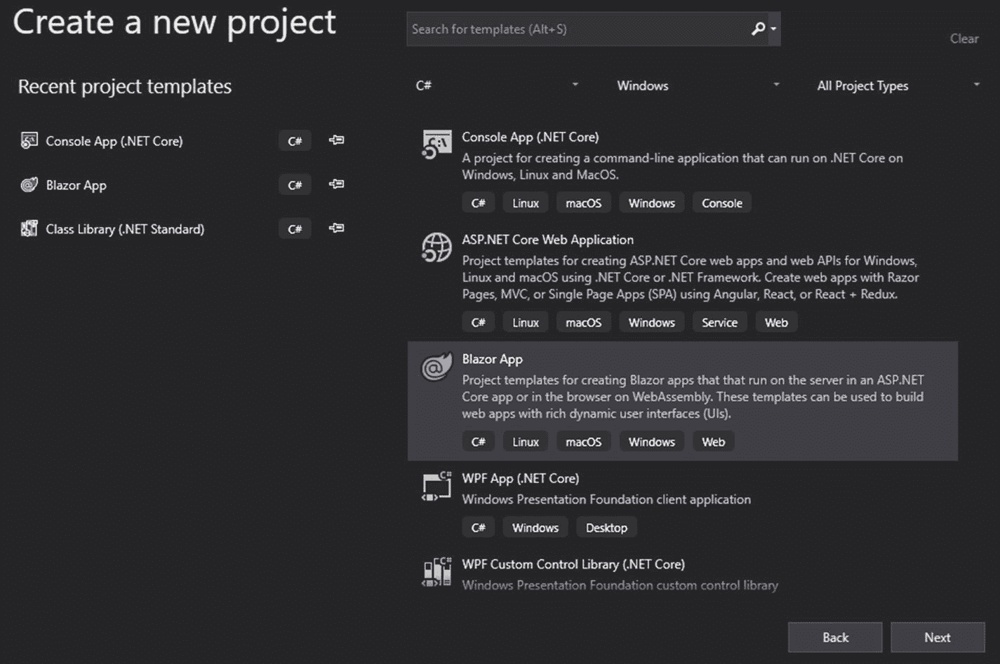
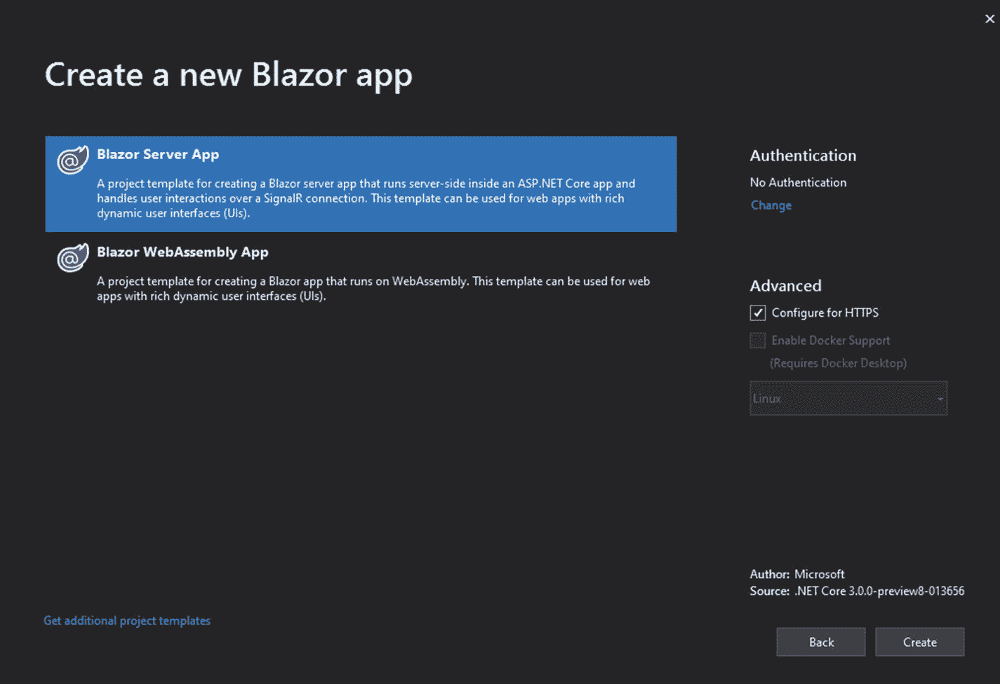
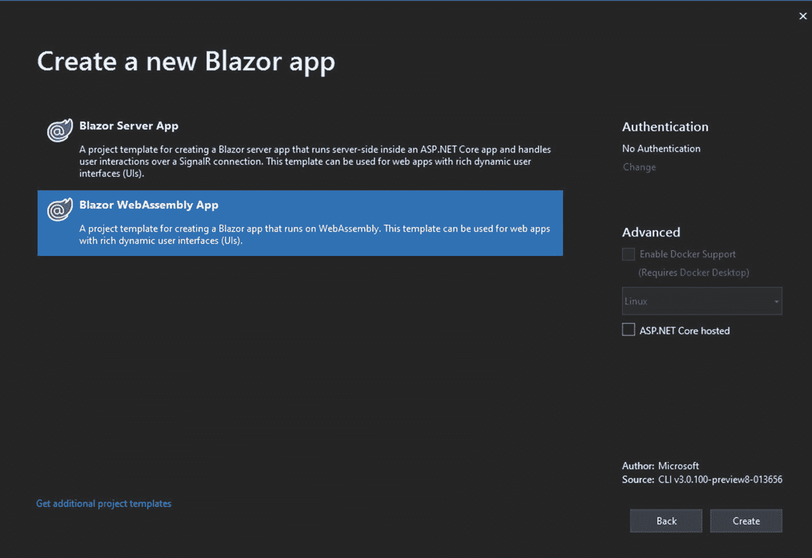

# 一、简介

在开始之前，你需要了解和准备一些事情。这不是一本介绍 C# 或。NET 核心开发，所以你应该对 C# 有很好的了解，并且能够用它来构建应用。开发后端应用、Windows 应用还是移动应用并不重要；只要你用 C#，你就会在 Blazor 里找到熟悉的东西。你需要在你的系统上安装一些软件，从 Visual Studio 2019 开始，然后是最新版本的。网芯 3.0。

## Blazor是什么？

Blazor 是一个 web UI 框架，允许你使用 C# 和。前端的 NET Core。它允许您使用 C# 编程语言以几种不同的方式开发您的前端逻辑，这是我们将在本章后面探讨的内容。

抛开技术方面，这么想吧；在任何标准的 web 开发项目中，您都需要两个人，一个负责 JavaScript，另一个负责后端。有时你还需要一个设计师来处理 HTML 元素和 CSS，并完成其他与设计相关的任务。Blazor 技术不会消除设计师的任何依赖性，但它肯定会消除对 JavaScript 的依赖性。然而，JavaScript 仍然可以与 Blazor 技术一起使用。

Blazor 使用 Razor 语法(C# 混合 HTML)，这将在下一章中介绍，所以熟悉 Razor 语法会让你在开发时更有优势。尽管如此，还是有一些不同之处，您很快就会看到。最重要的是，Razor 只发生一次而 Blazor 会反复发生，也就是说你在 Razor 中的 C# 部分(。cshtml 文件)只会在页面加载时执行，但是在 Blazor(。razor 文件)代码将在加载的页面上执行各种事件，如 onclick、onchange 等。

它使用 WebSocket 与服务器通信并在服务器端工作，或者使用 WebAssembly 技术，该技术允许在客户端构建 C#。这就是不同类型的 Blazor 技术发挥作用的地方。

## 什么是 WebAssembly？

WebAssembly 是一种技术，可以让你在浏览器中编译 C++或者 C# 这样的语言，从而让 Blazor 得以存在。它在 2017 年初首次作为最小可行产品出现，尽管该技术仍处于早期阶段，但它正由微软、谷歌、苹果等公司共同开发。这项技术已经得到了所有主流浏览器( [`https://webassembly.org/roadmap/`](https://webassembly.org/roadmap/) )的支持，随着它的发展，我们可以预计这种支持将会持续很长时间。一般来说，Blazor 只是将一个源代码文件发送给浏览器，WebAssembly 将其编译成二进制文件。该技术可用于所有主流浏览器——Edge、Chrome、Firefox、Opera 和 Maxthon(MX)——以及等效的移动版本。

WebAssembly 为您提供了一个安全的沙盒环境，因此它看起来类似于运行 JavaScript。从用户使用的特定浏览器选项卡之外无法访问任何内容。

## Blazor 类型

服务器端(见图 [1-1](#Fig1) ) Blazor 会运行所有的逻辑，主要使用 WebSocket 来完成任务。虽然它确实让您能够使用 C# 编写前端代码，但这可能不是最有效的选择。使用这个选项，您不再需要 API 调用，因为您只需将您的库直接注入前端部分。

图 1-1

Blazor 模板

所有这三种类型的 Blazor 在 Visual Studio 中都有不同的模板，无论您选择哪种类型，都应该在您的 Blazor 项目中使用它们。如图 [1-1](#Fig1) 所示，您需要选择 Blazor App 项目类型，然后在选择项目位置后选择 Blazor 的类型。

### Blazor 服务器端

虽然服务器端可能看起来很方便，但您仍然应该使用客户端 Blazor，即在浏览器中运行的 Blazor。服务器端会使用服务器资源，而客户端会节省资源或者至少不会浪费资源。

图 1-2

服务器端 Blazor 模板选择

一旦你在 Visual Studio 中选择了 Blazor 类型，你需要选择“Blazor 服务器应用”,如图 [1-2](#Fig2) 所示。

### Blazor 客户端

客户端(见图 [1-2](#Fig2) ) Blazor 完全在浏览器的客户端运行。您的页面驻留在服务器上，但都由客户端来处理。这对于演示网站或提供计算器和其他类似简单服务的网站来说很好。如果您需要数据库交互，或者如果您已经有 API 和类库，这不应该是您的选择。

图 1-3

客户端 Blazor 模板选择

对于客户端项目，需要挑选模板“Blazor WebAssembly App”。这样，右边的复选框“ASP。NET Core hosted”需要取消选中。

### Blazor托管

Blazor hosted(见图 [1-3](#Fig3) )，这可能是最好的类型，因为您的逻辑将在浏览器上运行，节省了宝贵的服务器资源。基本上有两个部分，客户端 Blazor 项目和一个 API 项目。它们以一种独特的方式连接在一起，因此您不需要将它们视为单独的项目。

图 1-4

Blazor 托管模板选择

如果您希望使用我们最终类型的 Blazor，您需要选择模板“Blazor WebAssembly App”(见图 [1-4](#Fig4) )，就像您在客户端所做的一样，但是在这种情况下，您需要选中右侧的复选框“ASP.NET芯托管”。

## 摘要

没有最好的 Blazor 类型；正如您在本章中所看到的，每个选项都有自己的用例。一切都取决于你的项目现在需要什么，更重要的是将来需要什么。如果你不是，就选择客户端，因为这将是最多样化的选择。在下一章，我们将深入 Blazor，探索语法和其他一些东西。您将看到，尽管结构可能不同，但在大多数情况下，所有类型的 Blazor 的编码方式都是相同的。