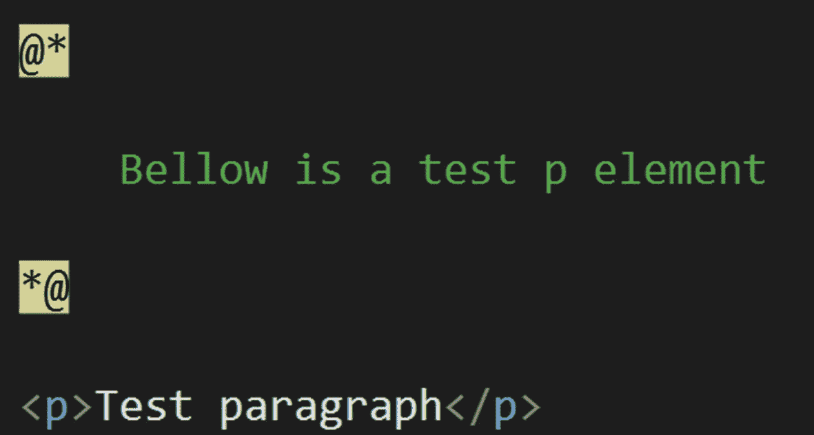
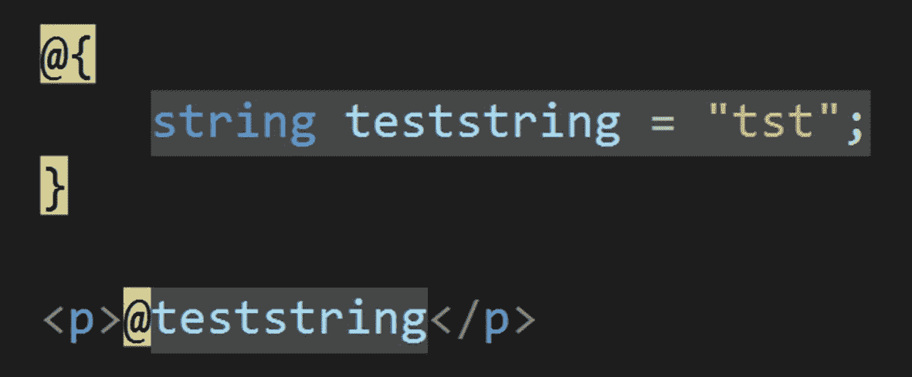
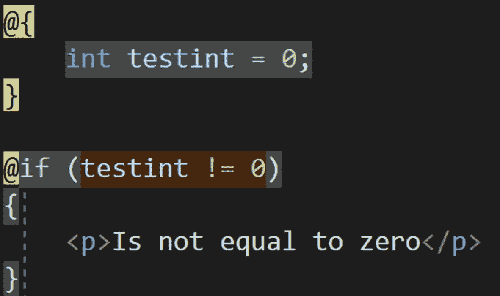
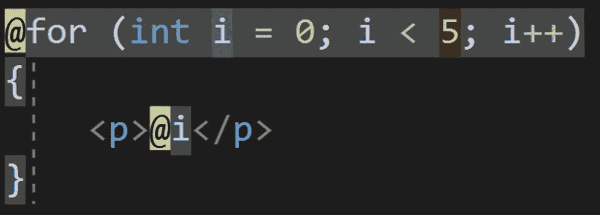

# 二、Blazor 的 Razor 语法和基础知识

本章将带你开始学习 Blazor，正如上一章所提到的——所有三种类型的 Blazor 都有很多共同之处，这就是本章的全部内容。在我们继续深入之前，我们需要看看语法，看看它是如何工作的。然后我们会接触到 Blazor 的本质，比如绑定和方法执行；所有这些都将在本书后面用到。

在本章中，您将学习

*   句法

*   元素和变量绑定

*   方法执行

*   常规页面事件的使用

## Razor 和 Blazor 的区别

简单地说，区别在于 Razor 将在“页面启动”时出现一次，而 Blazor 将一直工作。在 Blazor 中，循环和逻辑语句将被重新评估，而在 Razor 中只会发生一次。

## 句法

如前所述，如果你知道 Razor 语法，你就会知道 Blazor 语法。然而，如果您不知道 Razor 语法，这是适合您的部分。Blazor 语法放在一个名为。razor，里面包含 HTML，以及 C#代码。

### 评论

即使我们在 Blazor 文件中使用 html 语法，我们也不使用 HTML 注释。相反，我们使用 Razor 语法，得到漂亮而有效的评论系统，在生成的页面上没有留下任何评论。



图 2-1

Razor/Blazor 注释语法

如图 [2-1](#Fig1) 所示，你只需用@*开始注释部分，然后用*@结束。您也可以使用标准的 HTML 注释，但是使用 Razor/Blazor 语法会在代码上看起来更清晰。Razor/Blazor 注释语法字符高亮显示，实际的注释以绿色字体显示。注释被编译成代码；因此，它们不会出现在浏览器的开发工具中。

### 部分

Razor 语法基本上是一个文件中的 C#和 html 代码，虽然它们可以交互，但你仍然需要一些东西比其他的更清晰，你需要两种语言之间有更高的对比度。这就是所有不同部分出现的地方；正如你将看到的，它们是 C#占主导地位的，它们被用来突出代码的 C#部分。



图 2-2

基本 Blazor 部分

在图 [2-2](#Fig2) 中，一个变量被声明，然后用 C#代码直接显示在一个段落中。因此，对于单个变量和类的构造，您可以简单地使用@符号并在一行中写下所有内容，但是如果您想要为一个变量声明写多行，您需要使用@{...}.

在这一点上，这可能看起来非常简单，所以让我们深入几个例子:



图 2-3

if 语句语法

在图 [2-3](#Fig3) 中，testint 变量被声明并设置为值 0，后面跟着一个 if 语句检查 testint 的值是否不为 0。因为不满足语句标准，所以 if 语句中的任何内容都不会显示。如果 testint 变量设置为除 0 之外的任何值，比如 1，就会显示 HTML 段落标记和值。@{ }部分中的 C#代码是突出显示的，它不要求每行都有@符号。if 语句部分以@符号开始，并创建一个类似于前面示例的部分。这意味着 if 语句部分中的 HTML 代码不会以任何方式突出显示。



图 2-4

语法着色

在图 [2-4](#Fig4) 中，已经创建了一个 for 循环，循环了五次。每个循环创建一个新的段落标记，包含当前迭代的值，即 for 循环部分以浅灰色突出显示，而@符号以黄色突出显示。循环中的 HTML 部分不会突出显示，但 C#代码会突出显示；这就是你如何区分 HTML 标记和 C#代码的区别。

```cs
<p>test</p>

@code {
  int a;
  double b = 2.5;

  void testmethod() {

  }
}

Listing 2-1Code section

```

最后，是代码部分(参见清单 [2-1](#PC1) )，所有的方法都应该在这里声明。绑定变量也应该添加到代码部分，我们将在后面的章节(Blazor 绑定)中解释。

## Blazor绑定

Blazor 允许你将一个 HTML 输入值绑定到一个变量，反之亦然。因此，在大多数情况下，我们可以双向调用所有绑定。如果将文本框(输入类型文本)绑定到字符串变量，则显示的值将是该字符串的值。不同的元素会有不同的工作方式，这方面有很多用例。

### 绑定到元素

绑定到一个元素非常简单，但是并不是所有的元素都可以绑定，虽然大多数元素都可以。

值可以绑定到变量的元素

*   输入(文件类型除外)

*   文本区

*   挑选

列出的元素是可以绑定的最常见的元素，但是其他元素也可以。

```cs
@code {
  string teststring = "test value"
  bool testbool = true;
}

Listing 2-2variables

```

在清单 [2-2](#PC2) 中，声明了两个简单的变量并赋予了初始值，清单 [2-3](#PC3) 展示了如何将它们绑定到不同的元素。

```cs
<input type="checkbox" @bind="@testbool">
<input @bind="@teststring">
<textarea @bind="@teststring"></textarea>

Listing 2-3bindings

```

在清单 [2-3](#PC3) 中，一个布尔值被绑定到一个复选框，选中/未选中，单选按钮也是如此。字符串值可以绑定到任何文本值，如 input、textarea 等。当输入值改变时，变量值改变，当变量值改变时，显示在输入标记中的值也将改变。

### 密码

代码部分是添加前端 C#方法的地方。代码部分意味着包含客户端、变量和方法的代码。它很像标准 HTML 页面中的

```cs
<p>@testvar</p>

@code {
  string testvar = "test variable";
}

Listing 2-4Variable display

```

在清单 [2-4](#PC4) 中，声明了一个变量，然后将它添加到段落标记中。这很特别，如清单 [2-5](#PC5) 所示。

```cs
<p>@testvar</p>
<p><button @onclick="@testmethod">change</button></p>

@code {
  string testvar = "test variable";

  void testmethod() {
    testvar = "tst";
  }
}

Listing 2-5On click event

```

在清单 [2-5](#PC5) 中，声明了与清单 [2-4](#PC4) 中相同的变量，然后显示在段落标记中。还有一个 C#方法，在客户端 Blazor 中，将在前端运行。通过在按钮标记的 onclick 事件属性中声明该方法来调用该方法，但不应使用括号。该方法只是改变变量的值，然后显示在段落标记中的内容也随之改变。所以，这是一个单向绑定，在清单 [2-6](#PC6) 中，显示了一个双向绑定。

```cs
<p>@testvar</p>
<p><input @bind="@testvar"></p>
<p><button @onclick="@(() => testmethod())">change</button></p>

@code {
  string testvar = "nothing to display";
  void testmethod()
  {
    testvar = "test value";
  }
}

Listing 2-6Bind, on click and display

```

在清单 [2-6](#PC6) 中，一个输入标签被绑定到 testvar 变量，因此每当输入标签值改变时，变量也会改变，因此段落标签中的显示也会改变。请注意，输入标签必须失去焦点才能生效。

这就是如何调用不接受参数的方法。虽然不推荐，清单 [2-7](#PC7) 展示了如何传递和接受参数。您方法也可以是一个任务方法，您可以在 lambda 表达式中等待它。

```cs
<p>@testvar</p>
<p><input @bind="@testvar"></p>
<p><button @onclick="@( () => testmethod("test var"))">change</button></p>

@code {
  string testvar = "nothing to display";

  void testmethod(string testparam)
  {
    testvar = testparam;
  }
}

Listing 2-7Method with parameters

```

在清单 [2-7](#PC7) 中，该方法接受 testparam 参数。因此，在方法调用中使用括号，并传递值来调用方法，而不是像变量一样为事件声明它。使用 lambda 表达式，然后正常使用该方法。如果列表输出需要不同的值，这将非常有用。要使用任务方法，还应该使用 lambda 表达式。

```cs
<p>@testvar</p>
<p><input bind="@testvar" /></p>
<p><button onclick="@(async () => await testmethod())">change</button></p>

@code {
  string testvar = "nothing to display";

  async Task testmethod()
  {
    testvar = "test value";
  }
}

Listing 2-8Asynchronous task

```

在清单 [2-8](#PC8) 中，这很容易做到，但是建议使用 await 关键字，并使用带有异步方法的任务。

### 页面事件

每当用户加载页面时，都会触发一些事件，这在所有基于事件的应用中都很常见，尽管一些技术提供了许多事件，但是 Blazor 只提供了其中的一小部分，如清单 [2-9](#PC9) 所示。

```cs
@page "/"

<h1>Hello, world!</h1>

Welcome to your new app.

@code {
    protected override Task OnInitAsync()
    {
        return base.OnInitAsync();
    }

    protected override void OnInit()
    {
        base.OnInit();
    }

    protected override Task OnAfterRenderAsync()
    {
        return base.OnAfterRenderAsync();
    }

    protected override void OnAfterRender()
    {
        base.OnAfterRender();
    }

    protected override Task OnParametersSetAsync()
    {
        return base.OnParametersSetAsync();
    }

    protected override void OnParametersSet()
    {
        base.OnParametersSet();
    }

    protected override bool ShouldRender()
    {
        return base.ShouldRender();
    }
}

Listing 2-9Event overrides

```

第一种方法 OnInitAsync 对于在加载页面之前分配初始变量值和检索其他数据非常有用。OnInit 方法是非基于任务的方法，相当于 OnInitAsync。在呈现 UI 元素后，如果需要做一些额外的工作，可以使用 OnAfterRender 和 OnAfterRenderAsync 这两个事件方法。最后两个方法在参数更改时触发，如果您有搜索参数或布局更改(如深色和浅色主题)，这可能会很有用。

## 摘要

您现在已经了解了 Blazor 的一些基础知识，以及 Blazor 最重要的部分——绑定和方法执行。在接下来的章节中，我们将深入 Blazor 并探索不同类型之间的差异。这样，我们就不会忘记基础知识，除此之外，你会看到本章的一些内容出现在本书的几乎每个代码示例中。