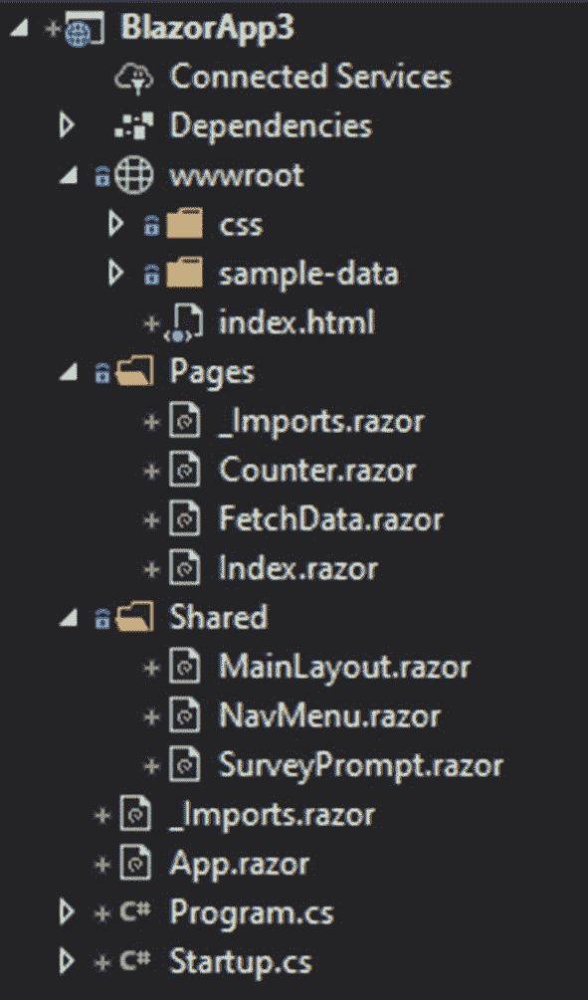
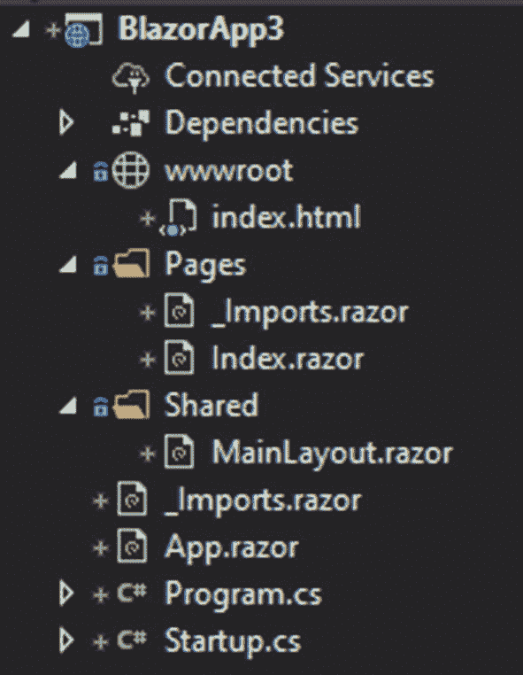
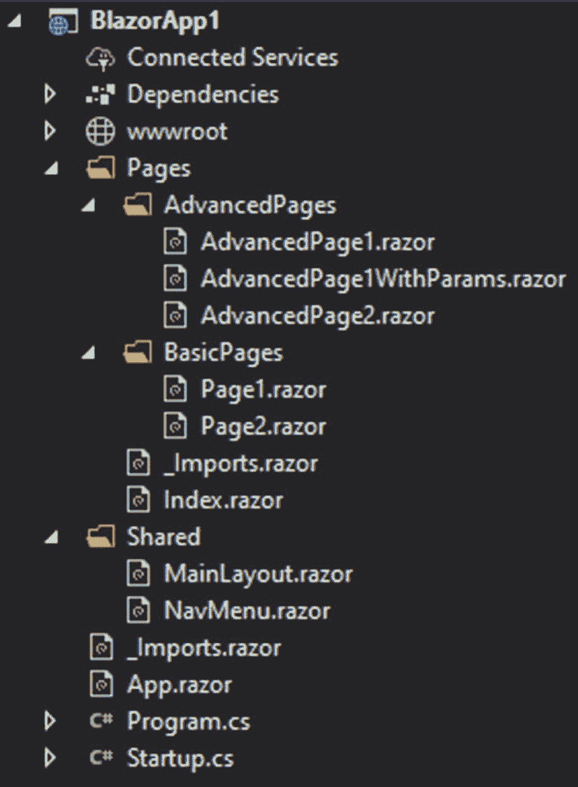
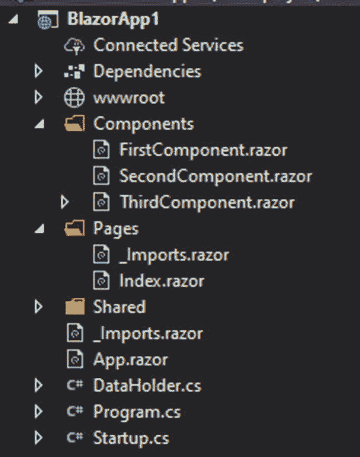
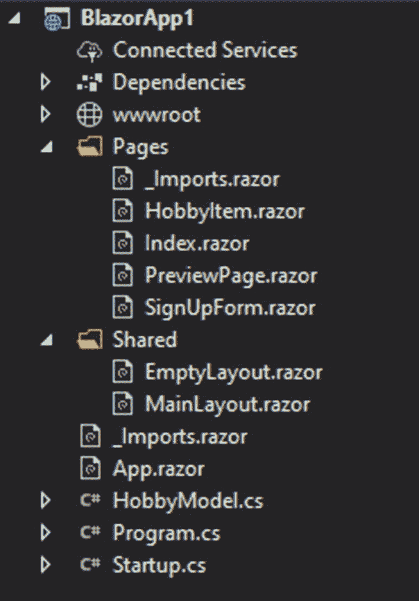

# 四、Blazor 客户端

在前一章中，我们已经介绍了一种在服务器上运行前端逻辑的 Blazor 在这种情况下，我们将介绍一种直接在浏览器中运行的类型。

在本章中，我们将学习

*   应用的启动

*   如何清理模板

*   成分

*   重复使用和移除组件

## 默认模板概述

我们现在将查看默认模板，并理解客户端 Blazor 是如何工作的。您将会发现这个模板和服务器端模板之间的一些有趣的区别，并且您将会了解到如何在需要时定制一些东西。

### 程序和启动

通常，web 应用是一个控制台应用，它以 Program.cs 和其中的 main 方法开始。这里的区别是，这是在浏览器上运行，而不是在服务器上，所以主机构建器将完全不同。在很大程度上，Blazor 服务器和客户端选项是完全相同的；主要的区别在于事物的启动。

```cs
using Microsoft.AspNetCore.Blazor.Hosting

;

namespace WebApplication1
{
    public class Program
    {
        public static void Main(string[] args)
        {
            CreateHostBuilder(args).Build().Run();
        }

        public static IWebAssemblyHostBuilder CreateHostBuilder(string[] args) =>
            BlazorWebAssemblyHost.CreateDefaultBuilder()
                .UseBlazorStartup<Startup>();
    }
}

Listing 4-1Program.cs

```

可以看到程序(清单 [4-1](#PC1) )确实创建了一个主机构建器，但它是一个 web assembly 主机构建器。这一切都是默认的。所以没必要看太多。有一点要注意，如果你想在 main 方法中做一些事情(例如，获取环境变量)，你需要在 CreateHostBuilder 之后做。如果您之前执行了任何操作，应用将不会加载。更有趣的部分是 Startup.cs。

```cs
<!DOCTYPE html>

<html>
<head>
    <meta charset="utf-8">
    <meta name="viewport" content="width=device-width">
    <title>WebApplication1</title>
    <base href="/">
    <link href="css/bootstrap/bootstrap.min.css" rel="stylesheet">
    <link href="css/site.css" rel="stylesheet">
</head>
<body>
    <app>Loading...</app>

    <script src="_framework/blazor.webassembly.js"></script>
</body>
</html>

Listing 4-2Index.html – entry page

```

清单 [4-2](#PC2) 显示了 wwwroot 文件夹中的 index.html 内容。这些内容是为模板生成的，除了后面提到的例外情况，不应该修改。

```cs
using Microsoft.AspNetCore.Components.Builder;
using Microsoft.Extensions.DependencyInjection;

namespace WebApplication1
{
    public class Startup
    {
        public void ConfigureServices(IServiceCollection services)
        {
        }

        public void Configure(IComponentsApplicationBuilder app)
        {
            app.AddComponent<App>("app");
        }
    }
}

Listing 4-3Startup.cs

```

创业很直白，很空虚；但是，您仍然可以使用它进行配置。重要的是，不要忘记这一切都发生在客户端。其中的主要部分是 AddComponent <app>(清单 [4-3](#PC3) )，它基本上将我们的 App.razor 添加到 html(清单 [4-2](#PC2) )中的< app > < /app >(清单 [4-2](#PC2) )元素中。在模板中，这将替换文本“正在加载…”；但是，在实际应用中，您可能希望在那里放一个带有 loader gif 的图像。很可能较大的应用需要几秒钟才能加载；因此，仅仅有文本可能不太好。</app>

```cs
<Router AppAssembly="@typeof(Program).Assembly">
    <Found Context="routeData">
        <RouteView RouteData="@routeData" DefaultLayout="@typeof(MainLayout)" />
    </Found>
    <NotFound>
        <LayoutView Layout="@typeof(MainLayout)">
            <p>Sorry, there's nothing at this address.</p>
        </LayoutView>
    </NotFound>
</Router>

Listing 4-4App.razor

```

如您所见，App.razor 文件(清单 [4-4](#PC4) )包含一个处理所有路由的路由器。您还会发现一个 NotFound 位置，并记住此时您已经在使用 Blazor 因此，您可以将您的错误信息添加为您已经创建的自定义组件。实际页面是在放置@body 的位置生成的，这需要从 LayoutComponentBase 继承。

### 清理模板

Blazor 项目提供了一个很好的模板来获得关于 Blazor 技术如何工作的基本概述。然而，在大多数情况下，你不需要很多默认的东西。因此，你需要了解如何清理它，使每个主要部分都像模板建议的那样留下来，但非必要部分消失。



图 4-1

Blazor 客户端默认模板内容

图 [4-1](#Fig1) 显示了默认项目模板的内容。一切都是为模板生成的，还没有做任何修改。



图 4-2

清理后的客户端模板

如果你想清理你的模板，只留下基本的，你需要从文件开始。简而言之，你将需要从图 [4-1](#Fig1) 到图 [4-2](#Fig2) ，你将通过移除 wwwroot 中的 css 文件夹，wwwroot 中的 sample-data 文件夹，这两个示例来实现。pages 文件夹中的 razor 页面，以及共享文件夹中除 MainLayout.razor 之外的所有内容。

```cs
@inherits LayoutComponentBase

<div>

        @Body

</div>

Listing 4-5Cleaned layout template

```

在删除代码方面，只需要清理 Index.razor，只留下@page 用于路由，清理 MainLayout(清单 [4-5](#PC5) )如前所示。当然，您会希望在主布局中使用自定义导航结构，但这是一个很好的起点。

## 航行

导航的工作方式与它在服务器端的工作方式相同；您必须使用@page 来设置页面的路径，并且您可以通过两种不同的方式传递参数。我们将采取更多的例子来说明如何组织你的导航。



图 4-3

导航示例的项目结构

对于这个例子，我们总共有五页的文件(图 [4-3](#Fig3) )。我们将看到如何使用 routes，以及如何从 C#代码直接导航。您已经可以看到将页面放入文件夹是可能的；当您有大量页面时，这尤其有用。在这种情况下，我们可以清楚地看到我们的基本页面在哪里，我们的高级页面在哪里。

```cs
@page "/page2"
@inject NavigationManager navmanager

<p>Basic page 2</p>
<p><button @onclick="@TestNavigate">Go to page 1</button></p>

@code {

    void TestNavigate()
    {
        navmanager.NavigateTo("/page1");
    }

}

Listing 4-7Page with navigation manager

```

```cs
@page "/page1"

<p>Basic page 1</p>

Listing 4-6Basic page

```

我们的第一个基本页面(清单 [4-6](#PC6) )非常简单；它只有一个路线和一个声明，说这是第一页。这样的页面你以前见过很多次，以后也会发现很多次；更有趣的是第二个基本页面(列表 [4-7](#PC7) )。这个也有一条路线，但是这个页面将允许我们使用 C#来导航。要做到这一点，我们需要使用 NavmanagerNavigationManager，它对于参数管理也很有用——这在上一章中已经介绍过了。要导航，您只需使用 NavigateTo 方法，该方法为您的页面选择路线。在本例中，单击按钮，我们将导航到第一个基本页面。

```cs
@page "/advancedpage1/{param1}"

<p>This is the advanced page 1</p>
<p>parameter: @param1</p>

@code {
    [Parameter]
    public string param1 { get; set; }
}

Listing 4-9Advanced page with parameters

```

```cs
@page "/advancedpage1"

<p>This is the advanced page 1</p>

Listing 4-8Advanced page

```

对于第一个高级页面(清单 [4-8](#PC8) )，我们希望探索具有相似路线的页面。第一页只有一个简单的路线和页面名称。对于第二页(清单 [4-9](#PC9) ，我们有相同的路线，除了一个参数显示在页面中。当您有一个在提供参数时和没有参数时显示完全不同的页面时，您可以使用它。如果页面内容几乎相同，下一个选项可能更适合您的需要。

```cs
@page "/advancedpage2/{param1}"
@page "/advancedpage2"

<p>This is the advanced page 2</p>
@if (param1 != null)
{
    <p>parameter: @param1</p>
}

@code {
    [Parameter]
    public string param1 { get; set; }
}

Listing 4-10Page with two routes

```

正如您所看到的，在这个页面中(清单 [4-10](#PC10) ),我们有两条路线——两条简单的路线，一条是基本路线，另一条带有参数。在这种情况下，我们只需检查是否提供了参数并显示它。

```cs
<div>
    <ul class="nav flex-column">

        <li class="nav-item px-3">
            <NavLink class="nav-link" href="/page1">
                Basic page 1
            </NavLink>
        </li>
        <li class="nav-item px-3">
            <NavLink class="nav-link" href="/page2">
                Basic page 2
            </NavLink>
        </li>
        <li class="nav-item px-3">
            <NavLink class="nav-link" href="/advancedpage1">
                Advanced page 1
            </NavLink>
        </li>
        <li class="nav-item px-3">
            <NavLink class="nav-link" href="/advancedpage1/testparam">
                Advanced page  1 with parameters
            </NavLink>
        </li>

        <li class="nav-item px-3">
            <NavLink class="nav-link" href="advancedpage2">
                Advanced page 2
            </NavLink>
        </li>
        <li class="nav-item px-3">
            <NavLink class="nav-link" href="advancedpage2/testparam">
                Advanced page 2 with parameters
            </NavLink>
        </li>
    </ul>
</div>

Listing 4-11Navigation page

```

对于导航(清单 [4-11](#PC11) )，我们已经在 NavMenu 组件中设置好了。您还可以注意到，在我们的示例中，有些路由是如何接受参数的。

### 成分

组件就像页面一样；事实上，它们是页面或者页面是组件。任何。razor 文件可以作为一个组件使用，但是如果它有一个路由声明，它可以作为页面导航。



图 4-4

带有示例组件文件的 Blazor 客户端项目

为了更好地理解组件，我们有一个小项目(图 [4-4](#Fig4) )，有三个不同的组件。前两个将探索父母和孩子之间变量的共享以及随之而来的问题。第三个组件将在下一部分中讨论。

```cs
<input   @onchange="@TestChanged"    />

@code {

    [Parameter]
    public Action<UIChangeEventArgs> TestChanged { get; set; }
}

Listing 4-12Simple parameter pass-through

```

第一个选项(清单 [4-12](#PC12) )是创建一个相当复杂的事件和事件参数检查系统。然而，在这一点上，这是最有效和最简单的选择。在组件中，我们首先有一个自定义事件，它基本上只是绑定到输入元素中的通用 onchange 事件。我们真正寻找的是新的值，这就是我们将从 parent 中检索的内容。

```cs
@page "/"

<p><BlazorApp1.Components.FirstComponent TestChanged="@( (args) => settest(args))"></BlazorApp1.Components.FirstComponent></p>
<p>@test</p>

@code {
    string test;

    void settest(UIChangeEventArgs args)
    {
        test = (string)args.Value;
    }

Listing 4-13Index.razor contents

```

在 Index.razor(清单 [4-13](#PC13) )中，我们声明组件并访问 TestChanged 事件，就像我们对泛型变量做任何其他泛型事件一样。在 TestChanged 事件上执行的方法只是接受更改参数，并将新值赋给一个已经声明的测试变量。

```cs
<input @bind="@DataHolder.testvariable" />
<p>@DataHolder.testvariable</p>

Listing 4-14Binds with static variables

```

另一个好主意是在某个其他类中简单地拥有一个静态变量(清单 [4-14](#PC14) ),但是它实际上并不工作。在本例中，我们有 DataHolder.cs 类，带有一个静态字符串 testvariable。如果您查看组件中的代码，那将完美地工作，但是它只在这个组件中工作。正如您将看到的，父类也可以绑定到变量，但只能单独绑定。

```cs
<p><BlazorApp1.Components.SecondComponent></BlazorApp1.Components.SecondComponent></p>

<p>General variable</p>
<p>@DataHolder.testvariable</p>
<p><input @bind="@DataHolder.testvariable" /></p>

Listing 4-15Index page

```

在 Index.razor(清单 [4-15](#PC15) )中，我们添加了我们的组件，然后我们显示变量，并将其与输入字段绑定。不幸的是，更新只发生在发生变化的页面上。因此，如果您在此页面中更改它，它将显示在此处，但不会在组件中显示，反之亦然。

### 使用密钥保存组件

组件的另一个重要特征是保存性。当您的界面需要添加或删除项目时，这非常有用。当您循环遍历元素并显示它们时，每次循环发生时，您的元素都将被销毁并重新创建。为了保存它们，你需要使用一种叫做 key 的东西，而理解它的最好方法就是去看它。

```cs
<p>@keyforcomponent</p>
@code {
    [Parameter]
    public Guid keyforcomponent { get; set; }
}

<p><button @onclick="@AddElement">Add</button></p>

@foreach (var item in ElementList)
{
    <p><button @onclick="@(() => RemoveElement(item))">Remove</button></p>
    <p><BlazorApp1.Components.ThirdComponent @key="item" keyforcomponent="item"></BlazorApp1.Components.ThirdComponent></p>
}

@code {

    List<Guid> ElementList = new List<Guid>();

    void AddElement()

    {
        ElementList.Add(Guid.NewGuid());
    }

    void RemoveElement(Guid id)
    {
        ElementList.Remove(id);
    }
}

Listing 4-16Component with key

```

在这种情况下，我们的组件(清单 [4-16](#PC16) )只是获取我们所称的键或 id 并显示它。请注意，我们仅出于展示目的显示 id，并不强制这样做。在我们的 Index.razor 中，我们建立了一个包含 Guid 类型的列表变量。我们还有 AddElement 和 RemoveElement 方法。它们都将触发 foreach 循环，该循环简单地遍历列表并为每个循环创建我们的组件。这里有趣的部分是@key 属性的传递，默认情况下，您可以在每个组件中找到它。这个唯一键将保护该元素不被重新评估。如果您希望显示产品列表或某些表单的项目列表，可能需要添加或删除项目，但保留当前的项目并插入或显示值，这将非常有用。

### 例子

现在我们来看一个简单的例子，它将探索导航参数和组件的使用，以及一般的 Blazor 交互。我们只有一个简单的注册表格和预览页面。



图 4-5

项目结构示例

正如你可能注意到的，我们将在这个项目中使用两种类型的布局(图 [4-5](#Fig5) ),你将会看到如何实现这一点。

```cs
namespace BlazorApp1

{
    public class HobbyModel
    {
        public string id { get; set; }
        public string title { get; set; }
        public string description { get; set; }
    }
}

Listing 4-18Hobby model

```

```cs
    <div style="width:300px;">
        <div style="width:50px;">
            @title
        </div>
        <div style="width:250px;">
            @description
        </div>
        <div style="width:250px;">
            <button @onclick="@delete">Delete</button>
            <p>@tst</p>
        </div>
    </div>

@code {
    [Parameter]
    public string id { get; set; }
    [Parameter]
    public string title { get; set; }
    [Parameter]
    public string description { get; set; }

    [Parameter]
    public EventCallback<string> OnDelete { get; set; }

    async void delete()
    {
      await OnDelete.InvokeAsync(id);
    }

}

Listing 4-17Component with parameters and callbacks

```

首先，我们需要为一个爱好创建一个组件(清单 [4-17](#PC17) ),它将被用作一个列表，用户将能够添加或删除它们。当然，您不一定要使用组件，但是从长远来看这样做更方便。对于这个爱好，我们也有一个模型(清单 [4-18](#PC18) ，我们将只在组件的父页面中使用它。该爱好在父代中创建，添加到列表中，然后显示；因此，我们没有任何输入字段——我们只是显示插入的内容并允许删除，这是我们稍后将探讨的内容。

```cs
@page "/signuppage"
@inject NavigationManager navmanager

@using Newtonsoft.Json

<p>First name</p>
<p><input @bind="@firstname"></p>

<p>Second name</p>
<p><input @bind="@surname"></p>

<p>Bio</p>
<p><textarea @bind="bio"></p>
<p>Hobbies</p>
<p>Title</p>
<p><input @bind="@newhobby.title"></p>
<p>Description</p>
<p><textarea @bind="@newhobby.description" /></p>
<p><button @onclick="@AddHobby" >Add hobby</button></p>
<p>My hobbies</p>
@foreach (var item in hobbies)
{
    <HobbyItem @key="@item.id" id="@item.id"  title="@item.title"  OnDelete="DeleteHobby" description="@item.description"></HobbyItem>
}
<p><button @onclick="@Submit">Submit</button></p>
@code {
    string firstname { get; set; }
    string surname { get; set; }
    string bio { get; set; }

    HobbyModel newhobby = new HobbyModel() { id = Guid.NewGuid().ToString() };
    List<HobbyModel> hobbies { get; set; } = new List<HobbyModel>();

    void AddHobby()

    {
        hobbies.Add(newhobby);
        newhobby = new HobbyModel() { id = Guid.NewGuid().ToString() };
    }

    void DeleteHobby(string id)
    {
        hobbies.Remove(hobbies.Where(x => x.id == id).ToArray()[0]);
    }

    void Submit()
    {
        var json = JsonConvert.SerializeObject(hobbies);
        navmanager.NavigateTo("/previewpage/" + firstname + "/" + surname + "/" + bio + "/" +json);
    }
}

Listing 4-19Page with navigation manager

```

我们开始注册页面(清单 [4-19](#PC19) )时声明了一个到它的路由，并添加了一些将在稍后使用和研究的依赖项。用户有三个字段:名、名和简历。如您所见，这些变量是在代码部分声明的，它们被绑定到 bio 的 input 元素和 textarea。这是最直接、最实用的方法。更有趣的部分是 newhobby 变量，它的属性绑定到适当的输入字段。你可能还会注意到爱好列表不仅是公开的，也是指定的。这样，我们就不必检查空值。AddHobby 方法中添加了一个爱好，它只是将当前的爱好对象添加到列表中，然后创建一个新的。

到目前为止，一切似乎都很简单，但困难的部分还在后面。爱好组件显示在循环的每个循环中，我们使用键来保留现有的元素，尽管在这种情况下这不是必需的。更重要的是，我们传递 id 并将其保存在组件中。组件(清单 [4-17](#PC17) )有一个用返回类型 string 声明的事件回调。组件中的 delete 按钮通过传递该组件的 id 来调用回调。这就是如何为组件创建完全自定义的事件。父页面(清单 [4-19](#PC19) )有一个方法 DeleteHobby，这个方法在回调被调用时执行，换句话说，就是在事件发生时执行。然后，DeleteHobby 方法接受字符串参数(爱好的 id ),并使用一些 Linq 魔法从列表中删除具有该 id 的元素。

最后，我们想进行预览，这就是事情变得复杂的地方。如果你正在传递参数给一个组件，一切都很简单；不幸的是，如果你是为了一个页面而这样做，那就不一样了。

```cs
@page "/previewpage/{firstname}/{surname}/{bio}/{hobbies}"
@using Newtonsoft.Json
@layout EmptyLayout
<p>First name: @firstname</p>
<p>Second name: @surname</p>
<p>bio: @bio</p>

<p>Hobbies:</p>
@if (hobbieslist != null)
{
    @foreach (var item in hobbieslist)
    {
        <p>id: @item.id</p>
        <p>title: @item.title</p>
        <p>description: @item.description</p>
    }
}

<p><button>Submit</button></p>

@code {
    [Parameter]
    public string firstname { get; set; }
    [Parameter]
    public string surname { get; set; }
    [Parameter]
    public string bio { get; set; }

    [Parameter]
    public string hobbies { get; set; }

    List<HobbyItem> hobbieslist;

    protected override void OnParametersSet()
    {
        hobbieslist =  ((Newtonsoft.Json.Linq.JArray)JsonConvert.DeserializeObject(hobbies)).ToObject<List<HobbyItem>>();
    }

}

Listing 4-20Page with parameters

```

我们的预览页面(清单 [4-20](#PC20) )包含四个参数，您可能已经注意到简单性在哪里消失了。在查询字符串时，我们只能传递字符串内容；因此，更复杂的对象需要序列化。这是在我们的注册页面中完成的(清单 [4-19](#PC19) )，提交方法首先将列表序列化为 JSON 字符串，然后才将其添加到导航的查询字符串中。我们将它作为一个字符串参数(列表 [4-20](#PC20) )来检索，然后以一种非常复杂的方式将其反序列化到我们的对象中。摆脱这种复杂性的一个好方法是在代码中的某个地方放一个静态变量，并在预览页面初始化后读取它。

正如您在这个例子中看到的，使用组件总是一个好的决定，即使当我们需要处理回调以双向绑定数据时。这些参数很有用，也很容易传递，但是不要忘记它们只对组件有效。一旦你进入页面，你必须非常小心参数。只有当需要从外部来源传递数据时，才应该使用它们。

## 摘要

正如您可能已经注意到的，您将主要使用客户端 Blazor 作为前端和后端。然而，有一种方法可以避免两个不同的项目；这种方式是 Blazor 托管的，这也是我们将在下一章讨论的内容。