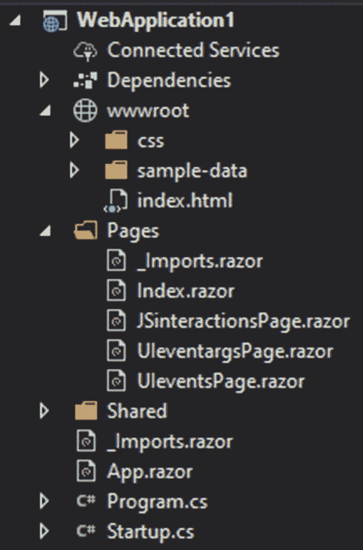
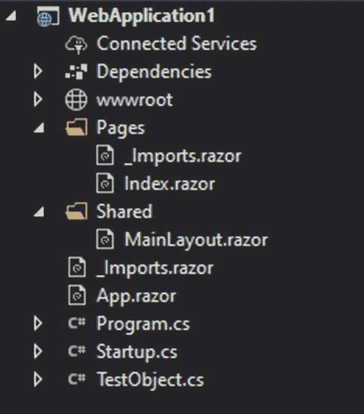
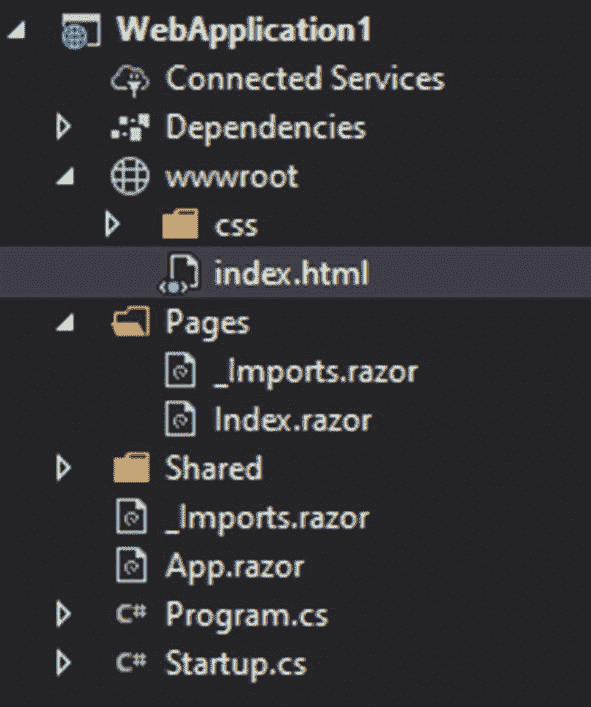

# 6.布拉佐将军

在前三章中，我们更具体地介绍了每种类型。在这一章中，我们将会看到一些对任何 Blazor 类型都非常有用的东西。

## 与 JavaScript 交互

虽然 Blazor 可以直接访问许多东西，但在某些情况下，您仍然需要 JavaScript。幸运的是，Blazor 允许我们以非常简单的方式与 JavaScript 交互。这对于访问存储、处理文件和访问 JavaScript 库非常有用。



图 6-1

添加了页面的示例项目布局

为了更好地理解交互，我们将使用一个包含三个页面的项目(图 [6-1](#Fig1) ),在这些页面中，我们将探索 JavaScript 交互、事件及其参数。该项目是一个普通的客户端项目，包含三个页面:JSinteractionsPage、UIeventargsPage 和 UIeventsPage。页面的路径根据它们的名称来陈述。

### 执行 JavaScript 函数

JavaScript 交互通过 IJSRuntime 接口发生，需要为您将使用它的页面注入该接口。

```cs
@page "/JSinteractionsPage"
@inject IJSRuntime js

<p>a</p>
<p><input @bind="@a"></p>
<p>b</p>
<p><input @bind="@b"></p>

<p><button @onclick="@(async () => await TestMethod())">test</button></p>

<p>@result</p>
@code {
    double a;
    double b;
    double result;
    async Task TestMethod()
    {
        result = await js.InvokeAsync<double>("TestFunction", a, b);
    }
}

Listing 6-1JavaScript interactions page

```

清单 [6-1](#PC1) 显示了 JSinteractionsPage.razor 的内容，我们将在其中尝试执行一个 JavaScript 函数。

```cs
<script>
        function TestFunction(a, b) {
            return a * b;
        }
</script>

Listing 6-2Test function

```

JavaScript 函数是在根文件夹(wwwroot)中的 index.html(清单 [6-2](#PC2) 中声明的。它只需将两个变量相乘。在我们的 JSinteractionsPage(清单 [6-1](#PC1) )中，我们有两个输入标签绑定到两个 double 变量、一个 result 变量和一个按钮，单击/点击该按钮将执行我们的方法，然后执行 JavaScript 中的函数。为此，我们首先注入 IJSRuntime。之后，我们简单地使用它拥有的唯一方法 InvokeAsync，该方法将 JavaScript 函数的名称作为其第一个参数，其余的参数将是 JavaScript 函数中传递的参数。请注意，您还可以创建一个对象数组来传递参数，并始终注意 JavaScript 函数的返回类型，因此这是正确的。一切都很简单，如果您需要访问旧的 JavaScript 库或者 Blazor 没有广泛提供的库，也不用担心。

### UI 事件

HTML 元素有几个事件，有些是通用的，有些是标签特有的。好消息是，您可以在 Blazor 中直接使用它们，无需 JavaScript 交互。

```cs
@page "/UIeventsPage"

<textarea @onpaste="@OnpasteTest"></textarea>
<video @onpause="@OnPauseTest"  ></video>
<p>@output</p>
@code {
    string output;
    void OnpasteTest()
    {
        output = "text pasted";
    }

    void OnPauseTest()
    {
         output = "Don't give up watching";
    }
}

Listing 6-3User interface events page

```

您已经使用了其中的一个，onclick，但是现在让我们来看看更多的。这里(清单 [6-3](#PC3) )我们有一个针对文本区域的 onpaste 事件，一旦粘贴了一些文本，这个事件就会发生。如您所见，我们执行了一个简单的方法，该方法简单地为输出变量赋值。第二个是视频标签事件特定的，onpause 一旦视频暂停，就会出现这种情况。需要记住的重要一点是，许多事件都是元素特定的；因此，你必须知道哪个事件属于哪个元素。

### 用户界面参数

每个事件都有一个参数，在 Blazor 中有一个特殊的访问方法。参数对于检查新值、发生的更改或获取 UI 元素的其他当前数据非常有用。请记住，参数特定于事件，事件特定于元素。

```cs
@page "/UIeventargsPage"

<p><input @onchange="@(async (changeargs) => await TestChangeArguments(changeargs))" /></p>

<p><div style="width:300px;height:300px;border:3px solid #ff0000" type="checkbox" @onmousemove="@(async (changeargs) => await TestMouseArguments(changeargs))"   ></div></p>

<p>@output</p>
@code {
    string output;
    Task TestChangeArguments(ChangeEventArgs e)
    {
        output = (string)e.Value;
        return Task.CompletedTask;
    }

     Task TestMouseArguments(MouseEventArgs e)
    {

        output = "x: " + e.ScreenX + "; y: " + e.ScreenY;
        return Task.CompletedTask;
    }
}

Listing 6-4User interface arguments page

```

我们的例子(清单 [6-4](#PC4) )有两个带有两个不同参数的事件，所以我们将从第一个开始——UIChangeEventArgs。这一部分包含的信息很少，但最重要的部分是变化值。参数是在 TestChangeArguments 任务中声明的，在该任务中，我们只需访问参数 e，获取值(类型对象)并将其设置为输出变量。更困难的部分是它的执行。您需要通过 lambda 表达式来完成，最好使用输入中所示的异步方式。下一个更刺激一点——UIMouseEventArgs；这个给你关于你的鼠标的信息。您将获得位置、点击的按钮以及其他一些数据。我们使用 onmousemove 事件在 div 元素中执行这个。

请注意，只有当您将鼠标悬停在 div 元素内部时，该事件才会发生。

如您所见，这在动态计算或其他高级 UI 中非常有用。例如，可以使用这些参数和相关事件建立绘图应用甚至拖放功能。

## 局部存储器

对于存储部分，我们将使用一个项目，并探索其中一些可能的选项。



图 6-2

项目的基本模板

该项目(图 [6-2](#Fig2) )是一个基本模板，删除了不需要的文件，并添加了 TestObject 类；我们稍后将探讨这一点。完整的代码在 Index.razor 中；因此，您不需要创建任何其他文件。

### 存放在哪里？

这个问题肯定会在你的一个项目中被问到，很可能在你的大部分项目中被问到。当然，您的第一个选择只是将您的值存储在一个类中定义的静态变量中。虽然这可能不是一个可行的长期解决方案，但它是最有效的解决方案，如果您只想在页面之间移动变量，这是最佳选择。它适用于身份验证令牌、配色方案和其他设置。其他选项更传统、更持久，即在本地存储或会话存储中存储数据。本地对于“记住我”或无会话设置来说是很棒的；另一方面，一旦选项卡关闭，会话将被破坏，这非常类似于只是存储在变量中，使这个选项变得毫无意义。

当然，对于现代应用，您很可能需要将数据存储在服务器上，因为这是最安全也是最方便的方式。但是，只要您不需要保存数据，就使用这些选项之一，并尝试节省一些服务器资源。

### 存储文本

如果你决定你需要一些更持久的东西，这就是你需要做的。

```cs
@page "/"
@inject IJSRuntime js

<p>test key</p>
<p><input @bind="@testkey"></p>
<p>test value</p>
<p><input @bind="@testvalue"></p>
<p><button @onclick="@(async () => await AddStringToSessionStorage())">Insert to session</button></p>
<p><button @onclick="@(async () => await AddStringToLocalStorage())">Insert to local</button></p>

<p>key to retrieve</p>
<p><input @bind="@testkey_forget"></p>
<p><button @onclick="@(async () => await GetStringFromSessionStorage())">Get from session</button></p>

<p><button @onclick="@(async () => await GetStringFromLocalStorage())">Get from local</button></p>
<p>@output</p>

@code {
    string testkey;
    string testvalue;

    string testkey_forget;

    string output;

    async Task AddStringToLocalStorage()
    {
        await js.InvokeAsync<object>("localStorage.setItem", testkey, testvalue);
    }

    async Task GetStringFromLocalStorage()
    {
        output = await js.InvokeAsync<string>("localStorage.getItem", testkey_forget);
    }

    async Task AddStringToSessionStorage()
    {
        await js.InvokeAsync<object>("sessionStorage.setItem", testkey, testvalue);
    }

    async Task GetStringFromSessionStorage()
    {
        output =  await js.InvokeAsync<string>("sessionStorage.getItem", testkey_forget);
    }

Listing 6-5Javascript interactions for local storage access

```

索引中的代码(清单 [6-5](#PC5) )显示了一些关于如何与 JavaScript 交互以及如何设置或获取变量的选项。首先，让我们看看方法。如您所见，它们非常简单，我们不需要编写任何 JavaScript，因为这些函数已经包含在本地或会话存储中。我们有一些输入变量，如 testkey 和 testvalue，它们是用来设置变量的值。然后，我们有 testkey_forget，这是您将检索的值，最后，我们有输出字符串，它将在检索到特定值后被赋值。对于处理错误，您可以在 C#中使用 try 或 catch，或者为了更准确，您可以在 JavaScript 中创建自己的函数。

### 存储其他类型

当你有一个字符串时，你可以简单地按原样存储它，如果你有一个 int，你可以简单地把它转换成一个字符串。然而，当你有一些更复杂的对象时，这就变得更困难了。你基本上有两种方法去做；您可以将您的对象序列化为 json，或者做一些更高级的事情，这是我们将会看到的。

```cs
@page "/"
@inject IJSRuntime js
@using System.Runtime.Serialization.Formatters.Binary;

<p>key to retrieve</p>
<p><input @bind="@testkey_forget"></p>

<p><button @onclick="@(async () => await GetObjectFromLocalStorage())">Get object from local</button></p>

<p>@output</p>

<p>Insert object</p>
<p>key</p>
<p><input @bind="@testkey_forobject"></p>
<p>id</p>
<p><input @bind="@ObjectToInsert.id"></p>
<p>value</p>
<p><input @bind="@ObjectToInsert.value"></p>
<p><button @onclick="@(async () => await AddObjectToLocalStorage())">Insert object to local</button></p>

@code {

    string testkey_forget;

    string testkey_forobject;
    TestObject ObjectToInsert = new TestObject();

    string output;

    async Task AddObjectToLocalStorage()
    {
        BinaryFormatter formatter = new BinaryFormatter();
        var tempstream = new System.IO.MemoryStream();
        formatter.Serialize(tempstream, ObjectToInsert);
        string base64 = Convert.ToBase64String(tempstream.ToArray());
        await js.InvokeAsync<object>("localStorage.setItem", testkey_forobject, base64);
    }

    async Task GetObjectFromLocalStorage()
    {
        string base64  = await js.InvokeAsync<string>("localStorage.getItem", testkey_forget);
        output = base64;
        BinaryFormatter formatter = new BinaryFormatter();
        var tempstream = new System.IO.MemoryStream(Convert.FromBase64String(base64));
        ObjectToInsert =  (TestObject)formatter.Deserialize(tempstream);
    }

}

Listing 6-6Binary formatter in blazor component (page)

```

这里的想法(清单 [6-6](#PC6) )是存储 c#的原始对象，但是你仍然需要它是一个字符串。为此，我们将使用几个步骤将对象转换为 base64。首先，我们需要将对象序列化为流(在方法 AddObjectToLocalStorage 中)；为此，我们使用 BinaryFormatter(命名空间系统。runtime . serialization . formatters . binary)。如果您以前从未使用过二进制格式化程序，您应该记住它，它可能会改变您开发应用的方式。回到代码，我们建立一个临时流，将对象序列化到这个临时流中。之后，我们只需将流和对象传递给格式化程序中 Serialize 方法的参数。记住使用 MemoryStream，因为它公开了 ToArray 方法，该方法将给出流的字节数组。最后，我们简单地将字节数组转换为 base64 字符串，并将其插入本地存储。

为了检索您的数据，我们还需要使用 BinaryFormatter。在 GetObjectFromLocalStorage 中，我们首先从存储中检索 base64 值，然后将其转换为字节数组并放入流中。使用 Deserialize 方法反序列化该流，并将输出转换为所需的对象类型。在这两者之间，我们输出 base64 字符串只是为了看看它是否真的工作，最后我们将它赋给初始的 ObjectToInsert 变量以查看输出。

## 挑选并保存文件

文件处理是 Blazor 中真正麻烦的部分。虽然生成/下载文件实际上很容易，但选择一个却是另一回事。不幸的是，在其早期版本中，Blazor 不支持对文件流的任何直接访问；因此，使用文件的唯一方法是将它加载到内存中，这又带来了另一个问题，那就是浏览器的局限性。我们将看一个挑选文件并保存它的例子。



图 6-3

示例客户端项目，默认模板

注意，在这种情况下(图 [6-3](#Fig3) ),我们将同时使用 index.html 和 Index.razor

```cs
@page "/"
@using System.Linq;
@inject IJSRuntime js
<button @onclick="@(async () => await getfile())">get file</button>
<input id="fileinput" type="file" @onchange="@(async () => await OpenFile())">
<button @onclick="@(async () => await DownloadFile())">Download</button>
<p>@statustext</p>

<p>@statustext1</p>
@code {
    byte[] selectedfilebytes;
    string statustext;
    string statustext1;
    async Task getfile()
    {
        await js.InvokeAsync<object>("FileManager.openreading");
    }

    async Task OpenFile()
    {
        try
        {
            statustext = "reading";
            await js.InvokeAsync<object>("FileManager.startreading");

             await Task.Delay(7000);
             int[] ob = await js.InvokeAsync<int[]>("FileManager.getfile");
             selectedfilebytes   = ob.Select(x => (byte)x).ToArray();
             statustext1 = "done";

        }
        catch (Exception e)
        {
            statustext = e.Message + "\n\n" + e.InnerException;
        }
    }

    async Task DownloadFile()
    {

        string base64 = Convert.ToBase64String(selectedfilebytes);
        await js.InvokeAsync<object>("FileManager.downloadfile", "testfile_" + DateTime.UtcNow.ToFileTimeUtc().ToString() + ".avi",base64);
    }

}

Listing 6-8File reader in component

```

```cs
<!DOCTYPE html>
<html>
<head>
    <meta charset="utf-8">
    <meta name="viewport" content="width=device-width">
    <title>WebApplication1</title>
    <base href="/">
    <link href="css/bootstrap/bootstrap.min.css" rel="stylesheet">
    <link href="css/site.css" rel="stylesheet">
</head>
<body>
    <app>Loading...</app>

    <script src="_framework/blazor.webassembly.js"></script>
    <script>
        var FileManager = {
               downloadfile: function(name, bt64) {
    var downloadlink = document.createElement('a');
    downloadlink.download = name;
    downloadlink.href = "data:application/octet-stream;base64," + bt64;
    document.body.appendChild(downloadlink);
    downloadlink.click();
    document.body.removeChild(downloadlink);
            },
            filedata: [],
    readeron: true,

    openreading: function () {

        document.getElementById("fileinput").click();
        return true;
    },
    startreading: function () {
        this.readeron = true;

        var reader = new FileReader();

        reader.onloadend = function () {

            try {

                 var dtw = new DataView(reader.result);

                for (var i = 0; i < dtw.byteLength; i++) {
                   FileManager.filedata.push(dtw.getInt8(i));
                }
            } catch (e) {
                alert(e);
            }

            this.readeron = false;
        };
        reader.readAsArrayBuffer(document.getElementById("fileinput").files[0]);

    },

            getfile: function () {

        return FileManager.filedata;
    }
};
    </script>
</body>
</html>

Listing 6-7Index.html with javascript

```

### 选择文件

如前所述，挑选一个文件不是一件简单的任务，它有限制。但是在 C#部分中，有一些方法可以将至少一个图像文件放入内存中。想法是在 JavaScript 中读取文件流，要么以 base64 读取，要么以整数数组读取。在这种情况下，我们将使用整数数组，但 base64 的过程将非常相似。想法是检索字符串并将其转换为字节数组。这同样适用于 int array，只是在转换上有些不同。

首先，我们在 index.html 中有一些 JavaScript 代码(清单 [6-7](#PC7) )。我们创建一个变量 FileManager 来保存我们的函数。在 Index.razor(清单 [6-8](#PC8) )中，我们有一个带有 id 的 fileinput。我们还有一个按钮，基本上触发 fileinput 的单击，一旦 fileinput 的内容发生变化，就会执行另一个方法，然后使用 JSinterop 开始读取文件。文件流由 JavaScript 部分中的函数 startreading 读取。我们在 FileManager 中也有一个 JavaScript 变量，这是我们将设置要检索的整数数组的部分。为了创建这个数组，我们首先需要根据阅读器的结果建立一个数据视图，并遍历每个元素，将它们添加到这个基本的整数数组中。回到 C#部分(清单 [6-8](#PC8) )，在这个例子中，在阅读器启动后，我们延迟执行 7 秒，这样阅读器就会完成，我们的数组就准备好了。之后，我们检索数组，并使用一个非常简单的 Linq 排列将其转换为字节数组。如果您以前从未使用过字节，这可能会显得有点混乱；整数怎么变成字节？澄清这一点的一个好方法是创建一个控制台应用，并中断以检查一些字节数组变量。在字节数组显示中，您会注意到它实际上是一个整数数组，这就是我们在这种情况下的转换方式。

如您所见，这是一种有限且非常低效的文件处理方式。但是话虽如此，重点不是要有效率，而是不要使用服务器资源。企业为服务器资源付费，而不是为浏览器资源付费，这就是你与众不同的地方。仅仅一个简单的图像转换就可以为你节省很多钱。

### 保存文件

保存一个文件可能看起来更像是一个不寻常的任务，但它比选择一个要简单得多，效果也更好。我们的 JavaScript FileManager 变量包含一个函数 downloadfile，它将文件名和 base64 字符串作为文件的数据。之后，一切都很简单；创建一个元素并添加一个到 href 的数据链接。在这一点上，你只需要发起一个点击，文件将被下载。在 C#部分中，我们下载了一个文件方法，将字节数组转换为 base64 字符串，并执行 JavaScript 函数进行下载。

## 摘要

如你所见，布拉索真的有能力做任何你需要做的事情。虽然有些部分在这一点上可能有点非正统，但它们仍然可以完成工作，并且在未来，我们可以期待它们得到改进。现在你已经了解了 Blazor，是时候练习了，接下来的章节将帮助你做到这一点。