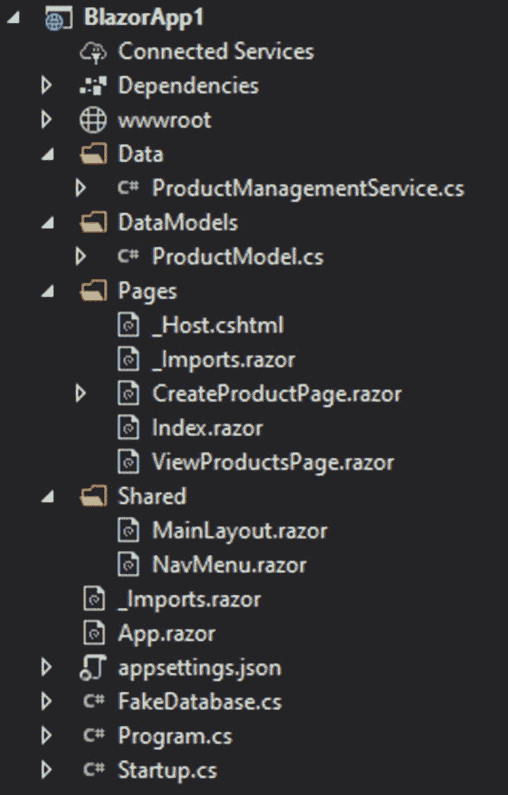
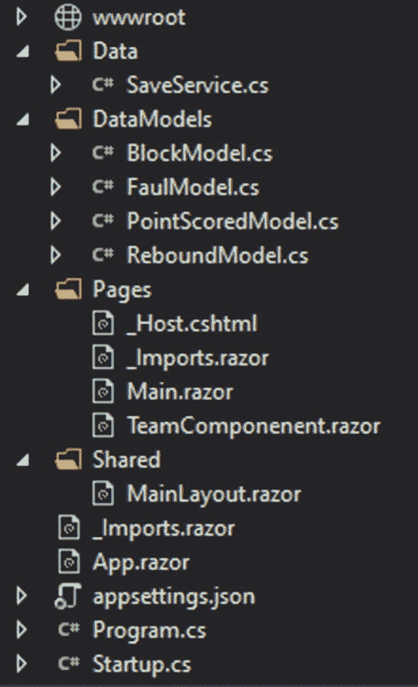

# 7.服务器端练习任务

既然你已经学完了，你需要练习。我们将从服务器端 Blazor 的两个任务开始，并进一步探索它的用例。

## 任务 1

第一个任务将是一个简单的项目，只从用户界面获取数据，并将其插入到数据库中，或检索和显示数据。当您处理简单的表单并且需要快速访问服务器时，这就是服务器端真正有用的地方。

### 描述

创建产品管理仪表板。

用户应该能够

*   插入产品

*   检索产品列表

*   删除产品

产品数据

*   身份

*   标题

*   卖方名称

*   描述

*   价值

产品列表项目还应该包含一个按钮或其他元素，当点击时将删除该元素。

### 资源

由于我们不是在这里学习数据库，我们需要创建一个假的。这样，你就可以只关注与布拉索有关的事情。

```cs
using System.Collections.Generic;

namespace BlazorApp1
{
    public class FakeDatabase
    {
      public static  List<your product model> products = new List<DataModels.ProductModel>();
    }
}

Listing 7-1Fake database

```

创造。cs 文件(列表 [7-1](#PC1) )。这将是您数据库，您将在其中插入、检索和删除产品对象。

### 解决办法

像往常一样，这个任务有许多解决方案，但是我们仍然会看一看一种可能性，并尽可能地探索它。我们将从项目的一般设置开始，然后转到服务，再转到页面。



图 7-1

解决方案项目

正如你所看到的(图 [7-1](#Fig1) ),该项目已经删除了所有的默认内容，但我们仍然保留 Index.razor、MainLayout.razor 和 NavMenu.razor。首先，共享文件夹包含我们的主布局，以及 nav 菜单，我们将在其中为我们的两个页面设置导航。我们也有索引页面，其中将只包含我们的导航链接。这样，我们创建了几个页面，用于创建新产品和检索列表。对于逻辑部分，我们有数据和数据模型文件夹。在数据模型中，我们将拥有产品的模型，数据将包含我们的逻辑。这是布置项目的好方法；这样，你就能准确地知道在哪里申请。

```cs
using System;

namespace BlazorApp1.DataModels
{
    public class ProductModel
    {
        public Guid id { get;  set; }
        public string title { get; set; }
        public string sellername { get; set; }
        public string description { get; set; }
        public decimal value { get; set; }
    }
}

Listing 7-2Product model

```

代码(清单 [7-2](#PC2) )显示了 DataModels 文件夹中的 ProductModel.cs 文件的内容。

```cs
using System;
using System.Collections.Generic;
using System.Linq;
using System.Threading.Tasks;

namespace BlazorApp1.Data
{
    public class ProductManagementService
    {
        public Task<bool> CreateProductAsync(DataModels.ProductModel pmodel)
        {
            try
            {
                FakeDatabase.products.Add(pmodel);
                return Task.FromResult(true);
            }
            catch (Exception)
            {
                return Task.FromResult(false);
            }

        }

        public Task<List<DataModels.ProductModel>> GetAllProductsAsync()
        {
            return Task.FromResult(FakeDatabase.products);
        }

        public Task<bool> DeleteProductAsync(Guid id)
        {
            try
            {
                FakeDatabase.products.Remove(FakeDatabase.products.Where(x => x.id == id).ToArray()[0]);
                return Task.FromResult(true);
            }
            catch (Exception)
            {
                return Task.FromResult(false);
            }
        }
        }
}

Listing 7-3Product management service

```

首先，我们需要为产品建立数据模型。如您所见，它只包含所有必需的属性，包括 Guid 类型的 id。这个 id 需要在 FakeDatabase 类中引用(参见清单 [7-3](#PC3) )。一旦我们有了这样的设置，我们就可以进入逻辑了。我们将只使用一个服务，有点像在 api 中有一个控制器。除了在这种情况下，我们有方法而不是 http 方法参数:POST (CreateProductAsync)、GET(getallproductasync)和 DELETE (DeleteProductAsync)。这样东西都放的很方便，也很容易找到。第一种方法只是将我们的模型对象作为参数，并将其插入 FakeDatabase 的列表中。第二个更基本，因为它只返回列表。最后，最后一个有点复杂；为了使它更真实，我们只想传递 id。列表类型中的 Remove 方法取整个对象，所以在这种情况下，我们必须使用一点 Linq 来按 id 查找。

```cs
public void ConfigureServices(IServiceCollection services)
     {
         services.AddRazorPages();
         services.AddServerSideBlazor();
         services.AddSingleton<ProductManagementService>();
     }

Listing 7-4Service registry

```

您还必须在 Startup.cs 中注册(清单 [7-4](#PC4) )您的服务。之后，您可以继续其他任务，尽管建议您在创建代码文件之后只注册服务。

```cs
@page "/createproductpage"
@inject Data.ProductManagementService productmanagement

<p>title</p>
<p><input @bind="@producttoinsert.title"></p>
<p>seller name</p>
<p><input @bind="@producttoinsert.sellername"></p>
<p>description</p>
<p><textarea @bind="@producttoinsert.description"></p>
<p>value</p>
<p><input @bind="@producttoinsert.value"></p>
<p><button @onclick="@(async () => await InsertNewProduct())">Insert a product</button></p>
<p>@result</p>
@code {
        string result;
        DataModels.ProductModel producttoinsert = new DataModels.ProductModel() { id = Guid.NewGuid() };

    async Task InsertNewProduct()
    {
        if (await productmanagement.CreateProductAsync(producttoinsert))
        {
            result = "product created";
            producttoinsert = new DataModels.ProductModel();
        }
        else
        {
            result = "failed to create";
        }
    }
}

Listing 7-5Create product page

```

创建页面(参见清单 [7-5](#PC5) )我们试图通过绑定一个构造对象的变量来尽可能地简化，而不是在页面中单独声明它们。但是在此之前，我们为页面建立了一个路径，并注入了产品管理服务。在代码部分，我们有一个结果字符串，它将简单地告诉我们产品是否成功插入。之后，我们声明一个产品变量，它的内容绑定到相应的输入字段。InsertNewProduct 在单击按钮时执行，它执行 CreateProductAsync，然后检查返回的布尔值。最后，该方法重新分配 producttoinsert 变量，以便可以插入新产品。

```cs
@page "/viewproductspage"
@inject Data.ProductManagementService productmanagement

<table>
    <tbody>

        @if (products != null)
        {

            @foreach (var item in products)
            {
        <tr>
            <td>@item.id</td>
            <td>@item.title</td>
            <td>@item.description</td>
            <td>@item.sellername</td>
            <td>@item.value</td>
            <td><button @onclick="@(async () => await Delete(item.id))">Delete</button></td>
        </tr>
            }

        }
        else
        {

        }
    </tbody>
</table>
@code {
    List<DataModels.ProductModel> products;

    protected override async Task OnInitializedAsync()
    {
        products = await productmanagement.GetAllProductsAsync();

    }

    async Task Delete(Guid id)
    {
        await productmanagement.DeleteProductAsync(id);
    }
}

Listing 7-6View products page

```

对于产品展示，我们有一个相当复杂的页面(参见清单 [7-6](#PC6) ，但是为了简化它，我们将使用一个表格来展示我们的产品。另一种方法是为每个项目使用组件。像往常一样，我们首先为页面声明一个路由，与此同时，我们为我们的主服务注入一个。代码部分包含一个变量，即产品列表。我们在页面初始化时检索并分配一次列表。或者，您可以选择添加一个刷新按钮，或者只添加一个按钮来获取数据，而不在初始化时这样做。我们还有一个删除产品的方法。对于显示，我们首先检查列表是否已分配，然后使用 foreach 循环遍历每个项目。这些项目显示在表格数据单元格中，但“删除”按钮除外。对于 delete 按钮，我们建立了一个 onclick 事件，在该事件中我们设置了 delete 方法并传递了当前项的 id。

```cs
@page "/"

<p><NavLink href="">Create product</NavLink></p>

<p><NavLink href="viewproductspage">View products</NavLink></p>

Listing 7-8Index page

```

```cs
<div>
    <ul class="nav flex-column">
        <li class="nav-item px-3">
            <NavLink class="nav-link" href="createproductpage" >
                <span class="oi oi-plus" aria-hidden="true">Create product </span></NavLink>
        </li>
        <li class="nav-item px-3">
            <NavLink class="nav-link" href="viewproductspage">
                <span class="oi oi-home" aria-hidden="true">Manage products</span>
            </NavLink>
        </li>

    </ul>
</div>

Listing 7-7Navigation page

```

最后，我们有两种方法导航到我们的页面。第一个也是最初的选择是使用索引中的链接(清单 [7-8](#PC8) )，第二个选择是通过导航条(清单 [7-7](#PC7) )。

## 任务 2

这项任务将帮助你专注于基于组件的开发——你将依赖于组件，而不是使用大量的页面。

### 描述

创建一个篮球比赛跟踪应用。这个特定的应用将关注您使用 Blazor 的情况，但是在这种情况下，您需要探索 Blazor 服务器端如何以及为什么对这样的任务有用。

A 队和 B 队分别跟踪；您应该能够通过单击一个按钮来注册一个统计项。

允许注册

*   得分 1 分

*   得分 2 分

*   得分 3 分

*   邪恶的

*   篮板球

*   街区

你不需要保存任何东西，但要考虑到这一点。尝试建立保存游戏数据的方法和结构。

### 解决办法

就像第一个任务和所有即将到来的任务一样，这不会是唯一的解决方案。但这是更有效的方法之一。我们将探讨一般的逻辑，以及如果您真的需要保存这些更新，您将如何做得更好。



图 7-2

Main.razor 和团队组件. razor

正如你所看到的，只有两个页面:Main.razor 和 TeamComponent.razor .而且，布局已经被完全清理了，我们只有@body 在里面。

```cs
using System;

namespace WebApplication1.DataModels
{
    public class BlockModel
    {
       public Guid id { get; set; }
    }
}

Listing 7-12Block model

```

```cs
using System;

namespace WebApplication1.DataModels
{
    public class FoulModel
    {
       public Guid id { get; set; }
    }
}

Listing 7-11Foul model

```

```cs
using System;

namespace WebApplication1.DataModels
{
    public class ReboundModel
    {
        public Guid id { get; set; }
    }
}

Listing 7-10Rebound model

```

```cs
using System;

namespace WebApplication1.DataModels
{
    public class PointScoredModel
    {
      public  Guid id { get; set; }

      public  int value { get; set; }

    }
}

Listing 7-9Point model

```

正如你所看到的，在大多数情况下，模型都很简单(见清单 [7-9](#PC9) 、 [7-10](#PC10) 、 [7-11](#PC11) 、 [7-12](#PC12) )，除了分数。由于我们有三种类型的分数(1 分、2 分、3 分)，我们可以有三种不同的模型，但这将是低效和难以阅读的，并且在为团队显示总分时也会出现问题。如果需要，你可以扩展这些模型——增加游戏时间，增加季度，增加玩家数量。

```cs
<p>Current score:
@{
    int currentscore = 0;
}
@foreach (var item in PointsList)
{
    currentscore += item.value;
}
    <label>@currentscore</label>
    </p>
<p>Total fouls: @FoulList.Count</p>
<p>Total rebounds: @ReboundList.Count</p>
<p>Total blocks: @BlockList.Count</p>
<p><button @onclick="@(() => AddPoint(1))">Add 1 pt</button></p>
<p><button @onclick="@(() => AddPoint(2))">Add 2 pt</button></p>
<p><button @onclick="@(() => AddPoint(3))">Add 3 pt</button></p>
<p><button @onclick="@(() => AddFoul())">Add Foul</button></p>
<p><button @onclick="@(() => AddRebound())">Add rebound</button></p>
<p><button @onclick="@(() => AddBlock())">Add block</button></p>

@code {
    [Parameter]
    public int team { get; set; } = 1;// A - 1 or B - 2

    [Parameter]
    public Guid gameid { get; set; }

    List<DataModels.PointScoredModel> PointsList = new List<DataModels.PointScoredModel>();

    List<DataModels.FoulModel> FoulList = new List<DataModels.FoulModel>();

    List<DataModels.BlockModel> BlockList = new List<DataModels.BlockModel>();

    List<DataModels.ReboundModel> ReboundList = new List<DataModels.ReboundModel>();

    void AddPoint(int val)
    {
        PointsList.Add(new DataModels.PointScoredModel { id = Guid.NewGuid(), value = val });
    }

    void AddFoul()
    {
        FoulList.Add(new DataModels.FoulModel() { id = Guid.NewGuid() });
    }

    void AddBlock()
    {
        BlockList.Add(new DataModels.BlockModel() { id = Guid.NewGuid() });
    }

    void AddRebound()
    {
        ReboundList.Add(new DataModels.ReboundModel() { id = Guid.NewGuid() });
    }
}

Listing 7-13Main page

```

正如您在图 [7-2](#Fig2) 中看到的，我们只有一个团队数据组件，我们有两个团队。因此，我们需要识别每个组件，我们通过传递一个整数作为参数来实现。我们还将游戏 id 作为参数传递，其中 id 将在 Main.razor 中生成。此外，您可以看到我们只有一个分数列表，尽管一个分数有三种类型。分数的类型被声明为记录中的值。为了显示当前的结果，在大多数情况下，我们只需绑定列表的 Count 属性，score 除外。对于分数，我们显示 total 因此，我们需要计算。为了简单起见，我们只在页面中运行一个循环，每次 count 属性改变时都会重新运行。最后，我们有一些方法可以简单地在点击时添加新的条目。

```cs
@page "/"

<div style="width:50%;float:left;">
    <TeamComponenent team="1" gameid="@gameid"></TeamComponenent>
</div>

<div style="width:50%;float:left;">
    <TeamComponenent team="2" gameid="@gameid" ></TeamComponenent>
</div>

@code {
Guid gameid;

protected override Task OnInitializedAsync() {
    gameid = Guid.NewGuid();
    return base.OnInitializedAsync();
}

}

Listing 7-14Index page

```

对于我们的主页，我们声明了一个默认路由，所以它的工作方式类似于您的通用 Index.razor，只是在本例中，我们声明了 Main.razor。我们还声明了 gameid 变量，它是在初始化时设置的，尽管您可以简单地在声明时设置它。我们还有两个 div 元素，其中设置了我们的团队组件。按照计划，我们为每个团队传递整数；有了它，我们也有了 gameid。

```cs
using System;
using System.Collections.Generic;
using System.Threading.Tasks;

namespace WebApplication1.Data

{
    public class SaveService
    {
        public async Task SaveProgress(Guid gameid, int team,params object[] datatosave)
        {

        }

        public async Task SaveProgress_Score(Guid gameid, int team, List<DataModels.PointScoredModel> scores)
        {

        }

        public async Task SaveProgress_Fouls(Guid gameid, int team, List<DataModels.FoulModel> fouls)
        {

        }

        public async Task SaveProgress_Rebounds(Guid gameid, int team, List<DataModels.ReboundModel> rebounds)
        {

        }

        public async Task SaveProgress_Blocks(Guid gameid, int team, List<DataModels.BlockModel> blocks)
        {

        }
    }
}

Listing 7-15services

```

对于记录的保存(列表 [7-15](#PC15) ，我们可以选择几个选项。比方说，如果你决定包括硬币和计时器，你可能会想在一段时间后保存整个东西。但如果你想真正安全，你会在每一个动作上节省；因此，您将需要一个类似 SaveProgress_Blocks 的方法。

## 摘要

正如你所看到的，服务器端 Blazor 非常方便，但是重要的是不要忘记它使用了大量的服务器资源。考虑到这一点，它最适合用于要求数据频繁到达服务器的任务。