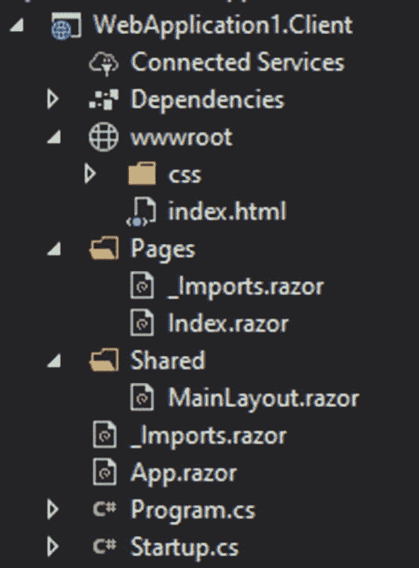

# 九、Blazor托管的练习任务

在这一章中，你将继续练习之前所学的内容，但只有一个项目需要完成。在这一点上，您应该对客户端开发感到满意，但是多一点实践不会有什么坏处。

本章将涵盖

*   任务介绍

*   任务的资源

*   任务的解决方案

## 任务 1

对于 Blazor 托管的任务，您需要创建一个程序来处理扑克玩家的统计数据。在这个任务中，您会注意到使用共享数据模型特性是多么容易，以及拥有客户端文件生成功能是多么有用。

### 描述

您需要首先显示一个玩家列表，为此您可以简单地使用一个包含玩家姓名的按钮。在选择(点击)玩家时，他们的统计数据将被获取并显示。每个玩家的统计数据将被缓存，这意味着如果在选择另一个玩家后再次选择该玩家，则不会从服务器检索数据，除非用户刷新它。任务的下一部分是针对客户端相关的；该计划应允许导出一个选定的球员统计或所有缓存球员的统计 JSON 文件。

玩家统计输出

*   锦标赛总数

*   总奖金

*   金钱锦标赛

*   开始日期

*   上次更新(检索或刷新)

### 资源

将为您提供一个包含用户列表的类和两个检索每个玩家的列表和统计数据的方法。

```cs
using System;
using System.Collections.Generic;
using System.Linq;
using System.Threading.Tasks;

namespace WebApplication1.Server.DataLogic
{
    public class Players
    {
         static List<PlayerData> PlayersList = new List<PlayerData>() {
            new PlayerData
            {
                id = 1,
                name = "John dow",
                totaltournaments = 1100,
                totalwinnings = 115000,
                totalinthemoney = 250,
                datestarted = DateTime.Parse("08/20/2005")
            },
             new PlayerData
            {
                id = 2,
                name = "John mark",
                totaltournaments = 1500,
                totalwinnings = 15005,
                totalinthemoney = 15,
                datestarted = DateTime.Parse("02/25/2009")
            },
              new PlayerData

            {
                id = 3,
                name = "John dean",
                totaltournaments = 1300,
                totalwinnings = 134000,
                totalinthemoney = 468,
                datestarted = DateTime.Parse("12/25/2017")
            },
               new PlayerData
            {
                id = 4,
                name = "mark lee",
                totaltournaments = 150,
                totalwinnings = 5300,
                totalinthemoney = 7,
                datestarted = DateTime.Parse("06/25/2008")
            },
                new PlayerData
            {
                id = 5,
                name = "t young",
                totaltournaments = 101,
                totalwinnings = 18000,
                totalinthemoney = 19,
                datestarted = DateTime.Parse("08/25/2013")
            },
                 new PlayerData

            {
                id = 6,
                name = "richar right",
                totaltournaments = 36,
                totalwinnings = 1300000,
                totalinthemoney = 10,
                datestarted = DateTime.Parse("08/25/1995")
            }
        };

        class PlayerData
        {
            public int id { get; set; }
            public string name { get; set; }

            public int totaltournaments { get; set; }
            public double totalwinnings { get; set; }
            public double totalinthemoney { get; set; }
            public DateTime datestarted { get; set; }
        }
        public static   Task<List<Shared.PlayerListItem>> RetrievePlayerList()
        {
            List<Shared.PlayerListItem> templist = new List<Shared.PlayerListItem>();
            foreach (var item in PlayersList)
            {
                templist.Add(new Shared.PlayerListItem() { id = item.id, name = item.name });
            }
            return Task.FromResult(templist);
        }

        public static Task<Shared.PlayerStatisticsItem> RetrievePlayerStatistics(int id)

        {

            var selectedplayer = PlayersList.Where(cl => cl.id == id).ElementAt(0);
            return Task.FromResult(new Shared.PlayerStatisticsItem() {
               playerid = id,
               totaltournaments = selectedplayer.totaltournaments,
               totalinthemoney = selectedplayer.totalinthemoney,
               totalwinnings = selectedplayer.totalwinnings,
               datestarted = selectedplayer.datestarted,
               lastrefresh = DateTime.UtcNow
            });
        }
    }
}

Listing 9-1Players.cs

```

首先，我们有我们的 PlayerData 模型(参见清单 [9-1](#PC1) )，这将是我们在这个假数据库中的主要模型。它还将创建一个静态列表，其中包含一些供您使用的项目。您将只需要处理以下方法:

*   获取玩家列表，但只获取并给出每个玩家的 id 和名字

*   获取单个玩家的全部信息

### 解决办法

现在你已经完成了你的任务，我们可以看看解决方案。请记住，只要它在工作，它就可能是正确的，但是有许多方法可以做到这一点，而且有些方法可能比其他方法更有效。


图 9-1

共享库

```cs
using System;

namespace WebApplication1.Shared
{
    public class PlayerStatisticsItem
    {
        public int playerid { get; set; }
        public int totaltournaments { get; set; }
        public double totalwinnings { get; set; }
        public double totalinthemoney { get; set; }
        public DateTime datestarted { get; set; }
        public DateTime lastrefresh { get; set; }
    }
}

Listing 9-3Player statistics item model

```

```cs
namespace WebApplication1.Shared

{
    public  class PlayerListItem
    {
        public string name { get; set; }

        public int id { get; set; }
    }
}

Listing 9-2Player list item model

```

首先，我们应该从数据模型(见图 [9-1](#Fig1) )开始，然后移动到后端。对于这个应用，我们只需要两个模型——一个用于列表(列表 [9-2](#PC2) )，另一个用于用户的统计(列表 [9-3](#PC3) )。如您所见，这些并不包含所有的用户数据，只包含您需要显示的内容。现在我们有了所有这些，我们可以继续到服务器部分(图 [9-2](#Fig2) )。


图 9-2

解决方案中的 API 项目

```cs
using System.Collections.Generic;
using System.Threading.Tasks;

using Microsoft.AspNetCore.Mvc;

namespace WebApplication1.Server.Controllers
{
    public class PlayersController : Controller
    {
       [Route("/retrieveplayerslist")]
       [HttpGet]
       public async Task<List<Shared.PlayerListItem>>  GetPlayers()
        {
            return await DataLogic.Players.RetrievePlayerList();
        }

        [Route("/retrieveplayerstats")]
        [HttpGet]
        public async Task<Shared.PlayerStatisticsItem> GetPlayerStats(int id)
        {
            return await DataLogic.Players.RetrievePlayerStatistics(id);
        }
    }
}

Listing 9-4Players controller

```

首先，我们需要创建一个 Player.cs 类，我们只需在其中插入参考资料中提供的内容。该文件方便地放在 DataLogic 文件夹中，在这种结构中，该文件夹只包含具有数据检索、插入或其他数据库相关过程的方法的类。在此之后，我们可以继续讨论控制器(列表 [9-4](#PC4) ),这里我们有两个路由——列表和统计。如你所见，动作方法只执行来自数据逻辑的静态方法；这有助于保持控制器完全干净。



图 9-3

解决方案中的客户端项目

```cs
@page "/"
@using datamodels = WebApplication1.Shared;
@using Newtonsoft.Json;
@inject HttpClient http
@inject IJSRuntime jsruntime

Listing 9-5Main page

```

与客户端相关的所有事情(图 [9-3](#Fig3) )都将在一个单独的页面中完成(这里是 Index.razor)。但是，您可能已经选择使用组件来使页面看起来更整洁，尽管它可能需要更多的时间来设置。首先，我们需要建立一些通用声明(列表 [9-5](#PC5) )，从页面路径开始。有了路由，我们需要为共享文件夹声明一个 using 语句；因为我们在客户机部分已经有了一个名称空间“Shared ”,所以我们选择使用名称空间 WebApplication1。共享—“数据模型”。我们将使用 Newtonsoft 进行 JSON 导出；因此，声明 Newtonsoft 很方便。Json 名称空间。最后，我们有两个注入——一个用于 http 客户端，将在 API 调用中使用，另一个用于保存文件的 IJSRuntime。

```cs
    <div>

        <p><button @onclick="@(async () => await FetchPlayers())">Fetch players</button></p>
        @if (listofplayers.Count > 0)
        {

            foreach (var item in listofplayers)
            {
                <p><button @onclick="@(async () => await ShowPlayerStatistics(item.id))">@item.name</button></p>

            }
        }
        else
        {
            <p>No players available</p>
        }

    </div>

    <div>
        @if (CurrentPlayerDisplayed != null)
        {
            <p>total tournaments played: @CurrentPlayerDisplayed.totaltournaments</p>
            <p>total winnings: @CurrentPlayerDisplayed.totalwinnings</p>
            <p>total in the money: @CurrentPlayerDisplayed.totalinthemoney</p>
            <p>date started: @CurrentPlayerDisplayed.datestarted.ToShortDateString()</p>
            <p>Last refreshed: @(Math.Ceiling(CurrentPlayerDisplayed.lastrefresh.Subtract(DateTime.UtcNow).TotalMinutes)) minutes ago</p>
            <p><button @onclick="@(async () => await RefreshPlayerStatistics(CurrentPlayerDisplayed.playerid))">Refresh</button></p>
            <p><button @onclick="@(async () => await ExportCurrentPlayer())">Export player</button></p>
        }

        else
        {
            <p  >Select a player for display</p>
        }
    </div>
<div>

    <p><button @onclick="@(async () => await ExportAllPlayers())" >Export all players</button></p>
</div>

@code   {
    List<datamodels.PlayerListItem> listofplayers = new List<datamodels.PlayerListItem>();
    Dictionary<int, WebApplication1.Shared.PlayerStatisticsItem> PlayerStatisticsCache = new Dictionary<int, WebApplication1.Shared.PlayerStatisticsItem>();

    datamodels.PlayerStatisticsItem CurrentPlayerDisplayed = null;

    async Task FetchPlayers()
    {
        listofplayers = await http.GetJsonAsync<List<datamodels.PlayerListItem>>("/retrieveplayerslist");
    }

    async Task ShowPlayerStatistics(int id)
    {

        bool iscached = PlayerStatisticsCache.TryGetValue(id, out CurrentPlayerDisplayed);
        if (!iscached)

        {
            CurrentPlayerDisplayed = await http.GetJsonAsync<datamodels.PlayerStatisticsItem>("/retrieveplayerstats?id="+id);
            PlayerStatisticsCache.Add(id, CurrentPlayerDisplayed);
        }
    }

    async Task RefreshPlayerStatistics(int id)
    {
            CurrentPlayerDisplayed = await http.GetJsonAsync<datamodels.PlayerStatisticsItem>("/retrieveplayerstats?id="+id);
            PlayerStatisticsCache[id] = CurrentPlayerDisplayed;

    }

    async Task ExportCurrentPlayer()
    {
        string json = JsonConvert.SerializeObject(CurrentPlayerDisplayed);
        string base64 = Convert.ToBase64String(System.Text.Encoding.UTF8.GetBytes(json));
        await jsruntime.InvokeAsync<object>("downloadfile", "PlayerStats_" + DateTime.UtcNow.ToFileTimeUtc().ToString() + ".json",base64);
    }

    async Task ExportAllPlayers()
    {
        string json = JsonConvert.SerializeObject(PlayerStatisticsCache);
        string base64 = Convert.ToBase64String(System.Text.Encoding.UTF8.GetBytes(json));
        await jsruntime.InvokeAsync<object>("downloadfile", "AllPlayers_" + DateTime.UtcNow.ToFileTimeUtc().ToString() + ".json",base64);
    }

}

Listing 9-6Player statistics component

```

我们通过声明两个将用于显示输出的变量来开始 Index.razor(清单 [9-6](#PC6) )页面。第一个是 list listofplayers 这将保存列表对象，我们可以在其中找到名称和 id。方法 FetchPlayers 将从服务器中检索玩家并将他们分配到列表中。之后，列表显示在第一个 div 元素中——这里我们首先检查列表是否包含任何项目；如果没有，我们简单地告诉用户系统没有玩家可以显示。另一方面，如果列表被填充，我们将遍历每个项目，并将值赋给按钮文本(名称)，在按钮的 onclick 中，我们将向方法 ShowPlayerStatistics 传递一个参数(id)。该方法将从服务器中检索特定用户的统计数据，但在此之前，我们将尝试检查我们的字典 PlayerStatisticsCache，以查看播放器统计数据是否已经被缓存；如果有，我们将简单地把它赋给 CurrentPlayerDisplayed 变量，如果没有，我们将检索数据并赋值。一旦赋值，将重新计算“if”语句，并在所有必要的地方更新对象中的变量。

```cs
function downloadfile(name, bt64) {
    var downloadlink = document.createElement('a');
    downloadlink.download = name;
    downloadlink.href = "data:application/octet-stream;base64," + bt64;
    document.body.appendChild(downloadlink);
    downloadlink.click();
    document.body.removeChild(downloadlink);
        }

Listing 9-7File download script (javascript)

```

对于导出部分，我们将需要使用一点 JavaScript，只是为了建立一个函数(清单 [9-7](#PC7) )从客户端“下载”文件。然后，为了导出单个播放器，我们将使用 ExportCurrentPlayer，它将 CurrentPlayerDisplayed 变量序列化为 json 字符串，然后将字符串转换为字节数组，最后将其转换为 Base64 字符串。一旦我们有了 Base64 字符串，我们就可以把它和文件名一起传递给 JavaScript。所有播放器的导出将使用 ExportAllPlayers 方法，其工作方式完全相同，只是它将使用 PlayerStatisticsCache 变量。

## 摘要

正如您可能已经注意到的，在整个项目中，合并 API 和客户端解决方案要高效得多，这主要是因为共享的模型库。测试也更容易一些，因为您不需要同时启动两个项目。凭借您所获得的所有知识和您所做的实践，您现在应该能够开发真实世界的项目了。