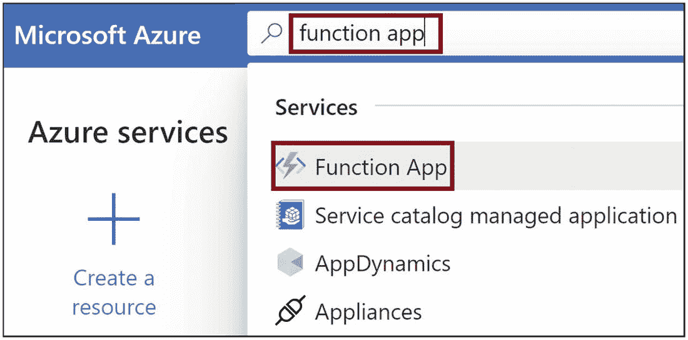
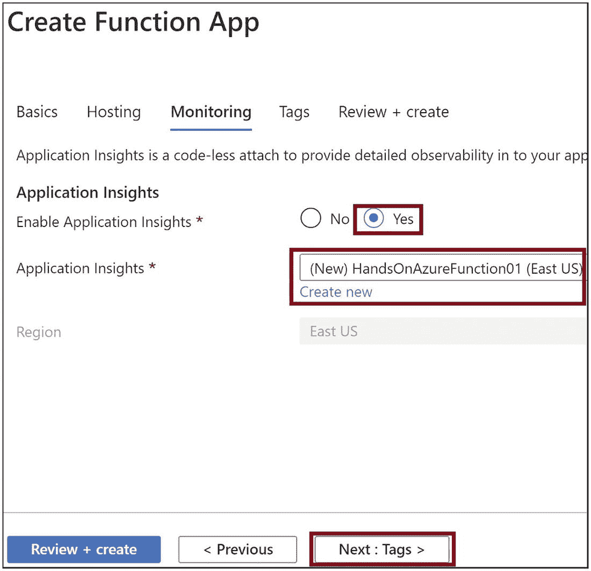
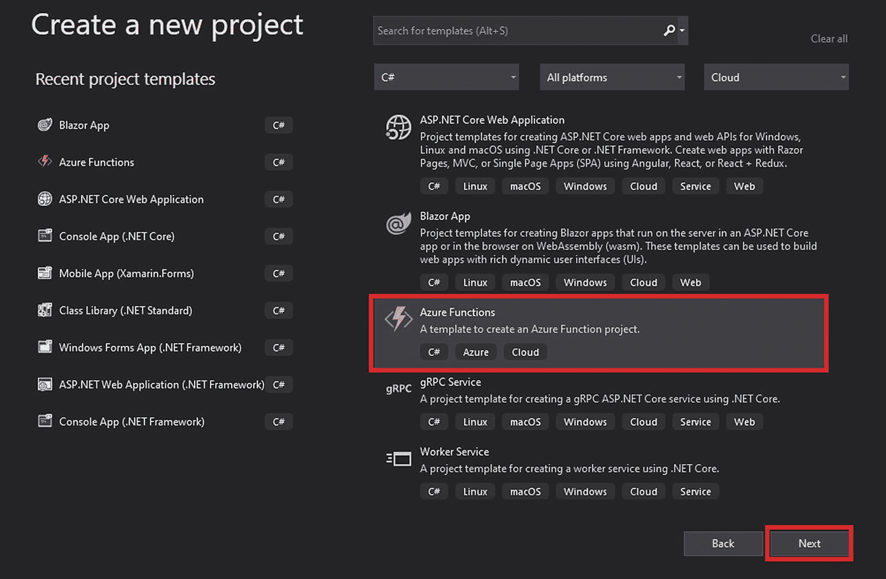

# 二、构建你的第一个 Azure 函数

您可以使用多种选项为 Azure 函数创建一个函数。如果你习惯命令行界面，那么你可以使用 Azure PowerShell 或者 Azure 命令行界面(CLI)。您可以使用集成开发环境(IDE)或代码编辑器，如 Visual Studio IDE 或 Visual Studio 代码。你也可以使用 Azure 门户来创建一个函数。

在前一章中，你学习了 Azure Functions 服务的基础知识，并探索了它的一些基本概念。在本章中，您将探索创建函数可用的各种选项。您将学习如何设置开发先决条件，并探索 Azure Functions 如何在幕后工作。

## 本章的结构

在本章中，我们将探讨以下主题:

*   使用 Azure 门户创建功能

*   使用命令行在本地创建函数

*   使用 Visual Studio 代码创建函数

*   使用 Visual Studio 创建函数

## 目标

学习完本章后，您将能够做到以下几点:

*   了解 Azure 函数的核心工具

*   使用各种工具选项创建功能

## 使用 Azure 门户创建功能

在本节中，您将在 Azure 门户中创建一个函数。Azure 门户提供了一个门户内编辑器来创建和定制功能。要在 Azure portal 中创建一个功能，首先需要创建一个*功能应用*。然后你就可以在功能 app 里面创建多个功能了。

要创建功能 app，请访问 [`https://portal.azure.com`](https://portal.azure.com) ，并使用您的凭证登录门户(图 [2-1](#Fig1) )。


图 2-1

登录 Azure 门户网站

登录成功后，您将被重定向到 Azure 门户仪表板。在搜索栏中输入**功能 app** ，点击功能 app 选项，如图 [2-2](#Fig2) 所示。



图 2-2

搜索功能应用

现在点击创建按钮，如图 [2-3](#Fig3) 所示，创建一个新的函数 app 资源。如果您已经创建了一个函数，您可以在门户中看到该函数。


图 2-3

创建新的功能应用

现在你将被重定向到一个新的屏幕，如图 [2-4](#Fig4) 所示，在这里你需要填写基础部分的必填字段。这些细节对于在您的订阅中创建您的功能应用至关重要。

选择您希望为此 Azure function 应用收取费用的套餐。选择订阅后，选择或创建需要创建功能应用的资源组。然后为您的功能应用提供一个唯一的名称。这个名称需要是全局唯一的，并且在 Azure 中不应该有任何其他功能应用具有相同的名称。

您可以在 Azure Functions 中托管应用代码或容器。选择选项代码。运行时堆栈指的是创建函数所需的语言。这本书主要讲述如何使用 C#处理 Azure 函数，所以对于这个例子，选择。NET 核心作为运行时堆栈。

Note

你可以写你的应用代码，直接托管在功能应用上。或者，您可以将您的功能容器化，并在功能应用中部署容器。

接下来，您需要选择版本。我们在第 [1](01.html) 章讨论了支持的运行时栈和支持的语言版本；参见表 [1-1](01.html#Tab1) 。最后，选择需要创建该功能 app 的地区。建议您选择托管消费服务或应用的最近或相同的地理区域。

填写图 [2-4](#Fig4) 中突出显示的所有字段后，点击下一步:托管以配置您的功能应用的托管计划相关配置。或者，您可以单击查看+创建来查看您的功能配置，然后单击创建来启动功能应用。

Note

一个 Azure 函数 app 由多个函数组成。功能应用的所有功能共享相同的资源、配置、语言运行时和定价方案。

在托管部分，您需要填写更多的细节，如图 [2-5](#Fig5) 所示。您需要选择一个 Azure 存储帐户。你可以选择现有存储帐户或创建新的通用 Azure 存储帐户。我们需要存储帐户来进行监控和日志记录。所有日志和指标数据都存储在存储帐户中。存储帐户还便于存储代码，以及使用消费计划或高级计划创建的功能的绑定配置文件。因此，我们必须有一个与函数相关联的存储帐户，以便于存储代码和绑定配置文件。


图 2-4

提供基本配置详细信息

In the Hosting Note

如果您删除了在创建功能应用时配置的功能应用的存储帐户，则属于该功能应用的所有功能都将停止工作。

选择存储帐户后，为您的功能选择操作系统。让我们选择 Windows 作为操作系统。Linux 上的 Azure Functions 不支持门户内编辑。我们将使用门户内编辑器来构建功能代码，所以让我们使用 Windows 作为操作系统。最后，我们来选择托管方案。我们可以使用消费计划，这是一个纯粹的无服务器计划。要了解更多关于可用托管计划的信息，请参考第 [1](01.html) 章中的“Azure 函数的托管计划”一节。在此选项卡上填写完必要的详细信息后，单击下一步:监视并导航到监视选项卡。


图 2-5

提供托管详细信息

After selecting the storage account, select the operating system for your function. Let’s choose Windows as the operating system. Azure Functions on Linux does not support in-portal editing. We will use the in-portal editor to build the function code, so let’s use Windows as the operating system. Finally, let’s select the hosting plan. We can use the Consumption Plan, which is a pure serverless plan. To know more about the available hosting plans, refer to the “Hosting Plans for Azure Functions” section in Chapter

强烈建议您为您的 Azure function 应用启用应用洞察，因为这将有助于您监控和分析 Azure 函数。单击是启用应用洞察并创建新洞察。如果您已经提供了一个 insight，您可以使用它。点击下一步:标签，如图 [2-6](#Fig6) 所示。



图 2-6

提供监控详情

标签帮助你对 Azure 资源进行分类。您可以为 Azure 资源添加标签和标签值，并使用标签对一组资源进行分类。例如，您可以为在生产环境中运行的所有 Azure 资源创建一个名为 Production 的标记，或者为在登台环境中运行的所有 Azure 资源创建一个名为 Stage 的标记。在这种情况下，您可以在生产或登台环境中合并所有 Azure 资源的计费。添加标签是可选的。然而，为你的 Azure 资源添加一个标签是一个很好的实践。现在点击下一步:审核+创建，如图 [2-7](#Fig7) 。


图 2-7

如果您愿意，请提供标签

在“查看+创建”选项卡上，您将看到您为功能 app 选择的配置汇总，如图 [2-8](#Fig8) 所示。要创建函数应用，请单击创建。您对功能应用的配置输入得到验证。如果没有验证问题，将开始创建功能应用。


图 2-8

单击创建

当您的功能应用正在部署时，您将被重定向到如图 [2-9](#Fig9) 所示的屏幕。完成所有功能应用资源的部署后，您将看到一个更新。点击“转到资源”导航到功能应用。


图 2-9

单击“转到资源”

图 [2-10](#Fig10) 展示了功能应用在 Azure 门户中的外观。点击功能，如图 [2-10](#Fig10) 所示，创建你的第一个 Azure 函数。


图 2-10

点击功能

我们需要在函数应用中添加一个函数。点击【添加】，如图 [2-11](#Fig11) 所示。


图 2-11

单击添加

现在让我们为该函数选择一个 HTTP 触发器，然后点击 Add，如图 [2-12](#Fig12) 所示。


图 2-12

选择“函数触发器”并点击添加

Note

您可以使用门户内编辑器，并使用 C#脚本构建您的 Azure 函数代码。您可以使用编辑器来访问代码文件并处理代码。也可以用 C#构建 Azure 函数代码，编译成类库。然后就可以在 Azure 函数中托管 C#类库了。在这种情况下，您无法使用 Azure 门户中的门户内编辑器来编辑代码文件。出于概念证明和演示的目的，您可以使用门户内编辑器来编写您的函数，但是对于为生产场景构建函数，使用 IDE 是明智的。

现在让我们测试 Azure 函数。点击获取功能 Url，如图 [2-13](#Fig13) 所示。


图 2-13

单击获取功能 Url

复制如图 [2-14](#Fig14) 所示的函数 URL。


图 2-14

复制函数 URL

打开浏览器，将 URL 粘贴到地址栏中，在 URL 的末尾添加`&name=ashirwad`，然后点击 Enter。您应该会看到如图 [2-15](#Fig15) 所示的响应。


图 2-15

浏览函数 URL

## 使用命令行在本地创建函数

在上一节中，您学习了如何使用 Azure 门户创建一个函数。现在让我们探索更多有趣的以开发人员为中心的使用命令行构建函数的方法。

要在您的本地系统中构建函数，您需要在您的系统中安装 Azure Functions 核心工具，以及 SDK 或您将用来开发函数的语言运行时环境。下面列出了使用命令行构建函数的先决条件:

*   Azure 函数核心工具

*   。网络核心 3.1

可以安装。NET Core 版，可从以下位置获得:

[T2`https://dotnet.microsoft.com/download/dotnet-core/3.1`](https://dotnet.microsoft.com/download/dotnet-core/3.1)

`T` o 安装 Azure Functions 核心工具，访问 [`https://github.com/Azure/azure-Functions-core-tools`](https://github.com/Azure/azure-Functions-core-tools) 并参考`README.md`获得安装帮助。我们使用存储库中的 MSI 安装程序来安装它，如图 [2-16](#Fig16) 所示。


图 2-16

下载 Azure Functions 核心工具

或者，您可以使用节点包管理器来安装 Azure Functions 核心工具。打开命令提示符并执行清单 [2-1](#PC1) 中的命令，使用节点包管理器安装 Azure Functions 核心工具。

```cs
npm install -g azure-Functions-core-tools

Listing 2-1Install the Azure Functions Core Tools Using Node Package Manager

```

Note

Azure Function 核心工具提供了一组命令行实用程序和 Azure Functions 运行时，以便从命令行或终端构建、开发和部署功能。

安装好 Azure Functions 核心工具后，打开命令提示符，执行清单 [2-2](#PC2) 中的命令，验证 Azure Functions 核心工具是否安装成功。

```cs
func

Listing 2-2Verify the Azure Function Core Tools installation

```

如果安装成功，你会看到 Azure Functions 核心工具的版本，如图 [2-17](#Fig17) 所示。


图 2-17

验证 Azure 函数核心工具的安装

安装了 Azure Functions 核心工具后，您就可以在本地构建您的 Azure 函数了。要创建一个函数项目，在命令提示符下执行清单 [2-3](#PC3) 中的命令。

```cs
func init --worker-runtime dotnet

Listing 2-3Create an Azure Functions Project

```

您还可以执行清单 [2-4](#PC4) 中的命令来创建一个 Azure function 项目。

```cs
func init

Listing 2-4Create an Azure Function Project

```

您将被提示为函数项目选择工作运行时。worker runtime 是您将在本例中用来构建 Azure 函数的语言。提供辅助运行时并按 Enter 键。Azure Function Core 工具将为您创建所有必要的函数文件，如图 [2-18](#Fig18) 所示。将为所有函数项目创建文件`host.json`和`local.setting.json`,而不考虑所选的工人运行时。


图 2-18

创建 Azure Functions 项目

让我们来了解一下`host.json`和`local.settings.json`文件的工作，它们是在 function 项目中创建的。

*   文件`host.json`存储运行时配置值，这些值稍后会在运行时被函数使用。

*   当您使用 Azure Functions 运行时工具在本地运行函数应用时，文件`local.settings.json`存储函数应用使用的配置值。

Note

在版本 1 中，您可以使用多种语言创建函数。Azure 函数运行时的 *x* 。但是，对于版本 2。 *x* 和 3。 *x* ，一个函数 app 中的所有 Azure 函数都应该用相同的语言编写，并且在创建函数项目时选择 worker 运行时。

一旦你创建了一个函数项目，你需要在里面创建 Azure 函数。要创建 Azure 函数，您需要在命令行界面中执行清单 [2-5](#PC5) 中的命令。

```cs
func Function new --template HttpTrigger –-name TestFunction

Listing 2-5Create a Function inside the Azure Functions Project

```

您可以在命令的模板参数中提供函数触发器的类型以及`name`参数。该命令创建一个名为`TestFunction`的函数，可以使用 HTTP 触发器调用该函数。命令执行成功后，会创建一个`TestFunction.cs`文件，如图 [2-19](#Fig19) 所示。`TestFunction.cs`将拥有与我们使用 Azure 门户创建的 Azure 函数相同的样板代码。


图 2-19

在 Azure Functions 项目中创建一个函数

现在让我们使用 Azure Functions 核心工具来运行 Azure 函数。为此，执行清单 [2-6](#PC6) 中的命令。

```cs
func host start

Listing 2-6Execute the Azure Function

```

这个命令恢复所有的 NuGet 包，然后构建函数项目。一旦构建成功完成，Azure Functions 运行时就会启动，并托管 Azure function 应用中的所有功能。它显示所有托管函数端点的端点，如图 [2-20](#Fig20) 所示。如果有任何构建错误，它将显示在控制台中。


图 2-20

执行 Azure 函数

让我们复制`TestFunction`的端点/URL，将查询字符串`?name=ashirwad`附加到 URL，然后使用清单 [2-7](#PC7) 中的命令向函数发送 GET 请求。

```cs
curl –get http://localhost:7071/api/TestFunction?name=ashirwad

Listing 2-7Send a GET Request to the Azure Function

```

图 [2-21](#Fig21) 显示了响应，你可以看到它与我们之前使用 Azure 门户创建的函数得到的结果相同。


图 2-21

对卷曲请求的响应

## 使用 Visual Studio 代码创建函数

在前面的章节中，我们讨论了使用带有 Azure Function 核心工具的命令行在本地开发 Azure 函数的方法。

在这一节中，我们将看看如何利用 Visual Studio 代码的力量来构建 Azure 函数并运行它们。要了解本节内容，以下是一些先决条件:

*   。NET Core 3.0 SDK

*   VS 代码

*   Azure 函数核心工具

前往 [`https://code.visualstudio.com/download`](https://code.visualstudio.com/download) 下载最新版本的 VS 代码。您可以访问 [`https://dotnet.microsoft.com/download/dotnet-core/3.1`](https://dotnet.microsoft.com/download/dotnet-core/3.1) 进行安装。NET core 版。

如果你还没有安装 Azure Functions 核心工具，可以参考“使用命令行在本地创建函数”一节。安装完所有提到的必备组件后，打开 Visual Studio 代码并单击 Extensions，转到 extension marketplace 并搜索 C# extension for IntelliSense 和调试支持。在搜索栏中输入 **C#** ，安装微软的扩展，如图 [2-22](#Fig22) 所示。您可以根据自己的喜好自由选择 C#的任何其他扩展名。


图 2-22

安装 C#扩展

之后，您需要从扩展市场安装 Azure Functions 扩展，以创建一个功能项目并将其部署到 Azure 基础设施。安装时，在搜索栏中搜索 *azure function* ，选择 Azure Functions，安装，如图 [2-23](#Fig23) 所示。


图 2-23

安装 Azure 函数扩展

现在，您已经安装了所需的依赖项，可以使用 Visual Studio 代码构建函数了。单击 Azure 扩展图标或按 Ctrl+Alt+A 转到 Azure Functions 扩展以创建您的函数项目。现在点击新建项目或者点击图标，如图 [2-24](#Fig24) 所示。系统将提示您选择位置。然后，您需要选择创建此功能应用所有功能的语言。由于本书的目标是使用 C#创建函数，所以让我们选择 C#作为函数应用的工作运行时。


图 2-24

创建新的功能应用项目

然后会提示您为函数选择模板。出于本节的目的，让我们选择 HttpTrigger 模板，如图 [2-25](#Fig25) 所示。


图 2-25

选择 HttpTrigger

接下来，系统会提示您为 Azure 函数命名。姑且命名为 TestHttpFunction，如图 [2-26](#Fig26) 所示。


图 2-26

为函数提供一个名称

然后会提示您提供一个名称空间。将函数的名称空间命名为 HandsOnAzureFunction。功能演示，如图 [2-27](#Fig27) 所示。


图 2-27

提供一个命名空间

现在，将提示您选择该功能的授权级别。如图 [2-28](#Fig28) 所示，你有三个授权级别:匿名、功能和管理。


图 2-28

选择授权级别

这些授权级别有助于限制不需要的用户访问您的功能。

现在 Visual Studio 代码已经为 HttpTriggered Azure 函数 TestHttpFunction 生成了一些样板代码，以显示作为查询字符串传递给它的值，如图 [2-29](#Fig29) 所示。


图 2-29

函数的默认生成代码

既然您已经创建了一个函数，让我们运行它，看看您会得到什么样的响应。要运行该函数，请按 F5。此操作将启动函数运行时，托管函数，并列出函数项目中存在的所有函数。该动作在内部运行`func host start`命令。

一旦 function 应用运行，您将能够看到访问 HttpTriggered 函数的 URL，以及顶部的几个重新启动、断开连接和其他调试选项的按钮，如图 [2-30](#Fig30) 所示。


图 2-30

运行功能应用

复制 URL 并附加查询字符串`?name=ashirwad`。然后，通过在浏览器的地址栏中粘贴 URL 和查询字符串，向该函数发送请求，并按 Enter 键。如图 [2-31](#Fig31) 所示，我们从之前从其他部分获得的函数中得到了类似的响应。


图 2-31

浏览器中的函数输出

## 使用 Visual Studio 创建函数

在上一节中，我们讨论了使用 VS 代码创建 Azure 函数并使用 Azure 函数运行时构建它的方法。本节重点是使用 Visual Studio 2019 社区版创建一个 Azure 函数。您可以使用 Visual Studio 的任何版本。

要了解本节内容，以下是一些先决条件:

*   。NET Core SDK

*   Visual Studio 2019 社区版

*   Azure 开发工作量

前往 [`https://visualstudio.microsoft.com/vs/community/`](https://visualstudio.microsoft.com/vs/community/) 下载最新版本的 Visual Studio 2019 社区版。您可以访问 [`https://dotnet.microsoft.com/download/dotnet-core/3.1`](https://dotnet.microsoft.com/download/dotnet-core/3.1) 进行安装。NET Core 版。

在开始使用 Visual Studio 构建 Azure 函数之前，需要安装 Azure 开发工作负载。要安装这个工作负载，打开 Visual Studio 安装程序，点击修改，选中 Azure 开发工作负载的复选框，点击修改安装，如图 [2-32](#Fig32) 所示。


图 2-32

安装 Azure 开发工作负载

工作负载安装完成后，打开 Visual Studio 2019 社区版，点击“新建项目”，如图 [2-33](#Fig33) 所示。


图 2-33

创建新项目

现在，您可以在窗口中看到所有可用的项目模板。选择如图 [2-34](#Fig34) 所示的 Azure Functions 项目模板，点击下一步。



图 2-34

选择 Azure 函数模板

您需要填写项目详细信息，例如项目名称、解决方案名称和源位置。所有这些都是必填字段。填写完所有这些字段后，点击创建，如图 [2-35](#Fig35) 所示。


图 2-35

单击创建

现在为您的 Azure 函数选择运行时版本、触发器类型、存储帐户和授权级别，如图 [2-36](#Fig36) 所示。需要将运行时版本设置为 Azure Function v3，函数的触发类型设置为“Http trigger”，存储账号设置为“存储模拟器”，认证级别设置为匿名；然后单击创建。

Note

您可以连接到 Azure 订阅中的现有存储帐户，而不是存储模拟器。

现在，Visual Studio 将使用一些样板代码生成一个名为 **Function1** 的函数，就像在其他部分创建的函数一样。要启动功能 app，点击测试功能，如图 [2-37](#Fig37) 所示。


图 2-37

执行该功能


图 2-36

提供模板详细信息

Now Visual Studio will generate a function named Note

默认情况下，function 项目中的第一个函数在 Visual Studio 中被命名为 Function1。但是在项目创建之后，您可以通过更改`FunctionName`属性的值来更改函数名。

单击 TestFunction 后，它将启动存储模拟器，启动函数运行时，并托管函数应用中的所有函数。

这个活动类似于使用 Azure Functions 核心工具的`func host start`实用程序。现在你应该可以看到 Azure Functions 运行时工具了。

复制 Azure 函数的 URL 路由以向其发送请求。在浏览器地址栏粘贴网址，追加查询字符串`?name=ashirwad`，然后回车向 Azure 函数发送请求(图 [2-38](#Fig38) )。


图 2-38

复制函数端点

图 [2-39](#Fig39) 显示了来自 Azure 函数的响应。如果你注意到，响应将与我们在本章其他部分创建的函数相同。


图 2-39

功能执行输出

## 摘要

在这一章中，你探索了创建 Azure 函数的不同方法。我们学习了如何使用 Azure 门户创建 Azure 函数。然后，您学习了如何使用命令行工具(如 Azure Functions 核心工具和代码编辑器)以及集成开发环境(如 Visual Studio 代码和 Visual Studio)来创建函数。

以下是本章的要点:

*   您可以使用 Azure 门户创建一个功能。您可以使用门户内编辑器轻松编写和处理功能代码。

*   您可以安装 Azure Functions 核心工具，并使用命令行界面创建 Azure 函数。该选项帮助您自动创建 Azure 函数。

*   您可以在 Visual Studio 代码中安装 C#和 Azure Functions 扩展，并使用 Visual Studio 代码创建函数。

*   您可以在 Visual Studio 中安装 Azure functions 工作负载，并构建 Azure 函数。