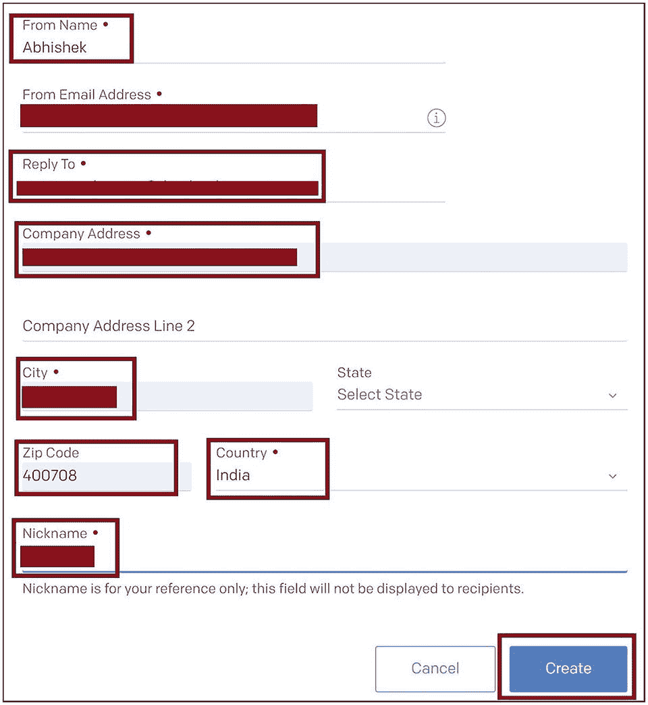
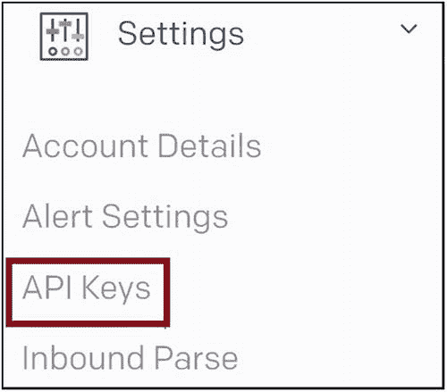

# 4.具有队列存储触发器和发送网格绑定的 OTP 邮件程序

您可能会遇到这样的场景，每当队列存储获得消息时，您都需要调用 Azure 函数。Azure 函数将从队列存储中挑选消息并处理它。您可能还需要执行 Azure 函数的业务逻辑，然后从 Azure 函数发送电子邮件。您可以使用队列存储触发器来调用 Azure 函数和 SendGrid 输出绑定，以从 Azure 函数发送电子邮件。还可以使用 Microsoft Graph API 代替 SendGrid，通过 Azure 函数发送邮件。

在前一章中，你已经了解了触发器和绑定的所有基本概念。您探索了 Azure 函数可用的不同类型的触发器和绑定。现在让我们探索如何为 Azure 函数实现队列存储触发器和 SendGrid 绑定，并使用 SendGrid 构建一次性密码(OTP)邮件程序。

## 本章的结构

在本章中，您将探索队列存储触发器和发送网格绑定的以下方面:

*   队列存储触发器和用例入门

*   使用队列存储触发器构建示例应用

*   SendGrid 输出绑定和用例入门

*   使用 SendGrid 输出绑定构建示例应用

*   使用队列存储触发器和 SendGrid 输出绑定创建 OTP 邮件程序

## 目标

学习完本章后，您将能够做到以下几点:

*   为 Azure 函数实现一个队列存储触发器

*   为 Azure 函数实现 SendGrid 输出绑定

## 队列存储触发器和用例入门

队列存储提供了一种极好的机制来分离不同的应用组件，并使您的应用体系结构松散耦合。每个分离的应用组件都可以通过向队列存储发送消息和从队列存储接收消息来交换数据。您可以将您的应用代码分成更小的块，并在函数中托管它们，在函数中运行的这些更小的代码块中的每一个都执行特定的任务。这些函数可以使用队列存储相互通信。Azure 函数可以处理数据并将其发送到队列存储。然后，队列存储可以调用另一个 Azure 函数，该函数可以获取队列存储数据并对其进行处理。每当队列存储触发器获得消息并传递 Azure 函数消息时，它就可以调用 Azure 函数。

以下是一些可以使用队列存储触发器的示例场景:

*   客户可以使用用户界面下购买订单。用户界面调用业务服务，将订单作为队列存储消息。队列存储触发器调用 Azure 函数来挑选订单，并验证客户订购的商品的库存可用性。

*   客户可以为用户界面中使用的服务提供反馈。用户界面调用将反馈放入队列存储的服务。Azure 函数由队列存储触发，分析客户反馈，并在需要时以纠正措施响应客户。

*   物联网(IoT)应用可以监控工厂车间的温度，并在温度上升超过规定限制时将温度输入队列存储。然后，队列存储将调用 Azure 函数来分析温度数据，并调用自动化或采取纠正措施来冷却工厂车间。

## 使用队列存储触发器构建一个示例应用

让我们为 Azure 函数实现一个队列存储触发器。作为先决条件，让我们创建一个存储帐户和一个队列存储来添加消息。一旦一条消息被添加到队列中，它就会触发这个函数。

进入 Azure 门户，点击“创建资源”，如图 [4-1](#Fig1) 所示。


图 4-1

创建资源

搜索*存储账户*，点击搜索结果“存储账户”，如图 [4-2](#Fig2) 所示。


图 4-2

选择“存储帐户”

点击【创建】，如图 [4-3](#Fig3) 所示。


图 4-3

单击创建

选择您的 Azure 订阅、资源组以及您需要创建存储帐户的位置。提供存储帐户的名称。点击“审核+创建”，如图 [4-4](#Fig4) 所示。


图 4-4

点击“审核+创建”

将对为存储帐户提供的配置值进行验证检查，如果检查成功，您将在屏幕上看到验证通过的消息。验证通过后，点击【创建】，如图 [4-5](#Fig5) 所示。此操作将创建存储帐户。


图 4-5

单击创建

创建存储帐户后，转到该帐户，然后在搜索框中搜索*队列*。点击队列，如图 [4-6](#Fig6) 所示。


图 4-6

单击队列

要在存储账户中创建队列，点击+ Queue，如图 [4-7](#Fig7) 所示。


图 4-7

添加队列

输入队列名称，点击确定，如图 [4-8](#Fig8) 所示。


图 4-8

单击确定

现在让我们创建一个启用了队列触发器的 Azure 函数。打开 Visual Studio，点击“新建项目”，如图 [4-9](#Fig9) 所示。


图 4-9

创建新项目

选择 Azure Functions 模板。点击下一步，如图 [4-10](#Fig10) 所示。


图 4-10

选择 Azure 函数模板

为项目命名，点击【创建】，如图 [4-11](#Fig11) 所示。


图 4-11

提供项目名称，然后单击“创建”

选择“队列触发器”并提供队列的连接字符串名称以及将触发该函数的队列名称。提供 **demoforqueuestorage** 作为您在本章前面创建的队列的名称。您需要在解决方案的`local.settings.json`文件中为该连接字符串添加一个键，并在`local.settings.json`文件中为该键提供连接字符串。单击创建。创建了一个带有队列触发功能的解决方案。见图 [4-12](#Fig12) 。


图 4-12

选择“队列触发器”

清单 [4-1](#PC1) 显示了`Function1.cs`文件的代码。在`Run`方法中，创建了一个名为`myQueueItem`的方法参数。`myQueueItem`参数由`QueueTrigger`属性修饰。`QueueTrigger`属性接受可以触发该函数的存储帐户的队列名和`local.settings.json`文件中的连接字符串名。

```cs
using System;
using Microsoft.Azure.WebJobs;
using Microsoft.Azure.WebJobs.Host;
using Microsoft.Extensions.Logging;

namespace Function_QueueTriggerDemo
{
    public static class Function1
    {
        [FunctionName("Function1")]
        public static void Run([QueueTrigger("demoqueue",
            Connection = "ConnectToQueue")]string myQueueItem,
            ILogger log)
        {
            log.LogInformation($"C# Queue trigger function processed: {myQueueItem}");
        }
    }
}

Listing 4-1Function1.cs Code

```

现在让我们将连接字符串键添加到`local.settings.json`文件中。转到你在 Azure 门户中创建的存储帐户，点击“访问密钥”，如图 [4-13](#Fig13) 所示。


图 4-13

单击“访问密钥”

点按“显示关键点”复制连接字符串，如图 [4-14](#Fig14) 所示。


图 4-14

复制连接字符串

回到 Visual Studio 中的 Azure function 解决方案，打开`local.settings.json`文件，如清单 [4-2](#PC2) 所示。添加连接字符串的密钥。用从 Azure 门户复制的连接字符串值替换占位符`[value]`。

```cs
{
  "IsEncrypted": false,
  "Values": {
    "AzureWebJobsStorage": "UseDevelopmentStorage=true",
    "FUNCTIONS_WORKER_RUNTIME": "dotnet",
    "ConnectToQueue": "[value]"
  }
}

Listing 4-2Local.settings.json Code

```

现在运行解决方案。一旦函数开始运行，转到 Azure 队列存储并添加一个队列消息来触发函数。进入 Azure 门户中的队列存储，点击“+添加消息”，如图 [4-15](#Fig15) 所示。


图 4-15

将消息添加到队列中

提供一些消息，然后单击确定。您可以配置消息在队列中过期的时间。在这种情况下，邮件将在七天后过期。您可以设置“过期时间”值来配置消息过期时间，如图 [4-16](#Fig16) 所示。


图 4-16

单击确定

Azure 函数被触发，你可以看到消息被记录在 Visual Studio 的调试控制台中，如图 [4-17](#Fig17) 所示。


图 4-17

功能执行输出

## SendGrid 输出绑定和用例入门

您可能有这样一个场景，该函数将处理业务逻辑，然后通过电子邮件将处理输出发送给预期的接收者。为了满足这个需求，您可以使用 SendGrid 作为输出绑定。从 Azure 函数发送电子邮件不需要实现太多代码。您只需要声明性地将 SendGrid 配置为输出绑定，并从 Azure Functions 服务发送电子邮件。SendGrid 是作为 Azure 服务提供的第三方电子邮件交付服务。只需点击几下鼠标，你就可以在 Azure 门户中创建一个 SendGrid 帐户，并开始使用它。

以下是一些可以使用 SendGrid 的示例场景:

*   在电子商务网站的情况下，Azure 函数可以在处理订单后向客户发送电子邮件。

*   在物联网应用监控工厂地板温度的情况下，Azure 函数可以检查异常温度，并向相关团队发送电子邮件以采取纠正措施。

*   在报告应用中，Azure 函数可以处理报告并在电子邮件中发送报告数据。

*   在客户反馈管理系统的情况下，Azure 函数分析客户反馈。它向后端团队发送一封包含必要纠正步骤的电子邮件，以便采取行动。

## 使用 SendGrid 输出绑定构建一个示例应用

让我们为您之前开发的 Azure 函数添加一个 SendGrid 输出绑定。您已经创建了一个将触发 Azure 函数的队列存储。现在让我们在 Azure 门户中创建一个 SendGrid 服务。进入 Azure 门户，点击“创建资源”，如图 [4-18](#Fig18) 所示。


图 4-18

创建资源

搜索*发送网格*，点击发送网格搜索结果，如图 [4-19](#Fig19) 所示。


图 4-19

选择发送网格

点击【创建】，如图 [4-20](#Fig20) 所示。


图 4-20

单击创建

提供订阅详细信息、资源组、位置和帐户详细信息以访问 SendGrid 帐户，如图 [4-21](#Fig21) 所示。


图 4-21

提供基本细节

提供您的名字、姓氏、公司电子邮件、公司名称和网站。点击“审核+创建”，如图 [4-22](#Fig22) 所示。


图 4-22

提供联系方式

点击【创建】，如图 [4-23](#Fig23) 所示。


图 4-23

单击创建

创建 SendGrid 服务后，在 Azure 门户中导航到该服务。您需要创建一个发件人身份，以便使用 SendGrid 帐户发送电子邮件。点击发送者身份，如图 [4-24](#Fig24) 所示。您将被导航到 SendGrid 门户。


图 4-24

单击发件人身份

点击【创建单个发送方】，如图 [4-25](#Fig25) 所示。


图 4-25

创建发件人

请提供您的电子邮件详细信息。SendGrid 使用这些细节来发送电子邮件。点击【创建】，如图 [4-26](#Fig26) 所示。



图 4-26

提供发件人详细信息

您将在创建发件人身份时指定的电子邮件地址中收到一封用于验证的电子邮件。验证电子邮件。一旦发送者身份得到验证，进入 Azure 门户中的 SendGrid 服务并点击 Manage，如图 [4-27](#Fig27) 所示。


图 4-27

单击管理

您将被导航到 SendGrid 门户。点击 API 键，如图 [4-28](#Fig28) 所示。



图 4-28

单击 API 键

创建 API 密钥。复制您创建的 API 密钥。您将在您的 Azure 函数代码中使用它。确保 API Key 权限选择完全访问，如图 [4-29](#Fig29) 所示。这将帮助您对 SendGrid 端点执行所有必要的 HTTP 操作，比如 GET、PATCH、PUT、DELETE 和 POST。


图 4-29

创建 API 密钥

现在让我们打开 Visual Studio 和您之前创建的 Azure function 项目。将以下 NuGet 包添加到函数项目中:

*   `Microsoft.Azure.WebJobs.Extensions.SendGrid`

`M`修改`Function1.cs`代码，如清单 [4-3](#PC3) 所示。使用方法参数的`SendGrid`属性为 SendGrid 添加一个输出绑定。`SendGrid`属性采用了`local.settings.json`文件中 API 键设置的名称。

```cs
using System;
using Microsoft.Azure.WebJobs;
using Microsoft.Azure.WebJobs.Host;
using Microsoft.Extensions.Logging;
using SendGrid.Helpers.Mail;

namespace Function_QueueTriggerDemo
{

    public static class Function1
    {
        [FunctionName("Function1")]
        public static void Run(
            [QueueTrigger("demoqueue", Connection = "ConnectToQueue")]
            string myQueueItem,
            [SendGrid(ApiKey = "SendGridConnection")]
            out SendGridMessage message,
            ILogger log)
        {
            message = new SendGridMessage();
            //myQueueItem should have TO email address
            //We are adding TO for the email
            message.AddTo(myQueueItem);
            //Mail Body
            message.AddContent("text/html", "This is Demo Mail");
            //From Mail ID. Shuld be exactly same as
            //that in Sender Identity of Send Grid
            message.SetFrom(new EmailAddress("abc@mycompany.com"));
            //Subject for the mail
            message.SetSubject("Demo Mail");
            log.LogInformation($"Email Triggered to : {myQueueItem}");
        }
    }
}

Listing 4-3Function1.cs Code

```

修改`local.settings.json`文件，如清单 [4-4](#PC4) 所示。您需要为`SendGrid.`添加密钥名，用您之前在 SendGrid 门户中创建的 API 密钥替换`[KeyValue]`。用队列存储连接字符串替换`[Value]`。

```cs
{
  "IsEncrypted": false,
  "Values": {
    "AzureWebJobsStorage": "UseDevelopmentStorage=true",
    "FUNCTIONS_WORKER_RUNTIME": "dotnet",
    "ConnectToQueue": "[Value]",
    "SendGridConnection": "[KeyValue]"
  }
}

Listing 4-4Local.settings.json Code

```

现在在 Visual Studio 中运行 Azure 函数。每当您向队列存储添加任何消息时，Azure 函数都会被触发，消息会被发送到队列消息中指定的电子邮件地址。确保您在消息队列中添加了一个电子邮件地址，如图 [4-30](#Fig30) 所示。


图 4-30

将消息添加到队列中

Azure 函数被触发，一封邮件被发送到队列消息中指定的电子邮件地址，如图 [4-31](#Fig31) 所示。


图 4-31

功能执行输出

## 使用队列存储触发器和 SendGrid 输出绑定创建 OTP 邮件程序

现在让我们修改 Azure 函数代码来发送一个 OTP。您需要生成一个随机数，并在消息正文中发送它。每当将电子邮件地址作为值的消息添加到队列中时，Azure 函数就会被触发，生成一个随机数，并在电子邮件正文中将其发送到队列消息中指定的电子邮件地址。用清单 [4-5](#PC5) 中所示的代码替换`Function1.cs`中的代码。

```cs
using System;
using Microsoft.Azure.WebJobs;
using Microsoft.Azure.WebJobs.Host;
using Microsoft.Extensions.Logging;
using SendGrid.Helpers.Mail;

namespace Function_QueueTriggerDemo
{
    public static class Function1
    {
        [FunctionName("Function1")]
        public static void Run(
            [QueueTrigger("demoqueue", Connection = "ConnectToQueue")]
            string myQueueItem,
            [SendGrid(ApiKey = "SendGridConnection")]
            out SendGridMessage message,
            ILogger log)
        {
            //Generate OTP
            Random random = new Random();
            int num = random.Next(10000);
            message = new SendGridMessage();
            //myQueueItem should have TO email address
            //We are adding TO for the mail
            message.AddTo(myQueueItem);
            //Mail Body with random One Time Password (OTP) generated
            message.AddContent("text/html", "One Time Password for your
            transaction : " + num.ToString());
            //From Mail ID. Shuld be exactly same as that in
            //Sender Identity of Send Grid
            message.SetFrom(new  EmailAddress("abc.mycompany.com"));
            //Subject for the mail
            message.SetSubject("OTP Mail - Valid for 10 minutes");
            log.LogInformation($"Email Triggered to : {myQueueItem}");
        }
    }
}

Listing 4-5Function1.cs Code

```

## 摘要

在本章中，您学习了如何使用 Visual Studio 处理队列存储触发器和 SendGrid 输出绑定。然后，您使用这些概念构建了一个 OTP mailer Azure 函数，每当您向队列存储添加消息并使用 SendGrid 输出绑定发送电子邮件时，该函数都会被触发。

以下是本章的要点:

*   您可以使用队列存储触发器来触发 Azure 函数。每当消息被添加到队列存储时，该函数就会被触发。

*   您可以使用 SendGrid 输出绑定从 Azure 函数发送电子邮件。

*   您可以声明性地配置队列存储触发器和 SendGrid 输出绑定，而不必编写太多代码。

*   Visual Studio 提供了一个模板来处理队列存储触发器。

*   每个 Azure 订阅只能启用一个 SendGrid 帐户。您需要仅使用公司电子邮件地址来启用 Azure SendGrid。在 Azure 环境中创建 SendGrid 服务并将其作为绑定集成到 Azure function 中时，个人邮件地址将不起作用。

*   Azure 中不提供 SendGrid 的免费层，因此您必须使用现收现付订阅，而不是试用订阅或提供免费月度点数的订阅。