# 5.使用计时器触发器和 Blob 存储绑定构建报告生成器

您可能不得不在统一的时间间隔以定义的频率运行应用的某些服务。这样的服务执行通常不需要太多时间就能完成。因此，为这类应用分配专用资源将导致调配资源的低效使用，从而导致更高的成本。

使用计时器触发器，您可以开发这种基于调度的任务来触发 Azure 函数，以避免提供专用的基础设施资源。除了以统一的时间间隔以特定的频率调用此类服务之外，您可能还需要将服务收集的见解或数据存储在持久存储中。你可以通过 Azure 函数中的 Blob 存储绑定来写入 Azure Blob 存储。

在前一章中，您通过构建一次性密码(OTP)邮件程序，了解了队列触发 Azure 函数和 SendGrid 输出绑定的所有基本概念和用例。让我们通过构建一个报告生成器来探索如何为 Azure Functions 服务实现一个定时器触发器和 Blob 存储绑定。

## 本章的结构

本章将探讨计时器触发器和 Blob 存储输入和输出绑定的以下方面:

*   计时器触发器和用例入门

*   使用计时器触发器构建示例应用

*   Blob 存储绑定入门

*   使用 Blob 存储绑定构建示例应用

*   使用 Blob 存储输入和输出绑定创建报告生成器

## 目标

学习完本章后，您将能够做到以下几点:

*   为 Azure 函数实现一个定时器触发器

*   为 Azure 函数实现 Blob 存储输入和输出绑定

## 计时器触发器和用例入门

使用计时器触发器是构建以统一的时间间隔执行特定任务的调度应用的一种很好的方式。您可以使用计时器触发器在 Azure 中构建经济高效的 cron 作业，这些作业执行时间很短，因为您只需为 Azure 函数的执行时间付费。

这里有一个警告:当你使用消费计划时，你不应该考虑使用 Azure 函数来运行长时间运行的 cron 作业，因为函数应用的最大超时持续时间是 10 分钟。但有了高级计划，您可以克服消费计划面临的超时限制，因为默认超时是 30 分钟，理论上它可以配置为无限制。如果您在专用应用服务计划或应用服务环境中托管您的功能，您可以根据您的要求配置触发时间。或者，如果您有一个现有的应用服务计划，您可以编写一个配置为按计划运行的 web 作业来执行长期运行的 cron 作业。

与其他类型的触发器不同，在`Microsoft.Azure.WebJobs.Extensions`版本 2 中，定时器触发器和 HTTP 触发器都是现成的。 *x* 和更新的。

以下是一些可以使用定时器触发器的用例:

*   客户可以使用计时器触发的功能作为基于计划的报告生成器，从数据源收集数据，根据业务需求构建报告，然后将报告保存在持久存储中，如 Azure Blob 存储或 AWS S3 存储桶，以供将来使用。

*   客户可能希望向其最终用户发送每周简讯。可以有一个邮件列表，其中包含所有接收简讯的最终用户。定时器触发功能很好地解决了这个业务需求。

*   客户可能为其最终用户制定了每月或每年的会员计划，并且可能希望在每月或每年的月底撤销所有未续订计划的用户的会员状态。您可以根据业务需求，使用计时器触发的功能来停用或删除所有此类用户的记录。

计时器触发的函数使用 NCrontab 表达式来定义计划表达式。NCrontab 表达式类似于 cron 表达式。NCrontab 表达式有一个额外的第六个字段来定义 schedule 表达式中的秒数，这使它们不同于 cron 表达式。

Note

Azure Functions 不支持五个 cron 表达式字段。支持 Timespan，但仅当您在应用服务计划内运行您的功能时。

这是 NCrontab 表达式的结构:

```cs
{seconds} {minute} {hour} {day} {month} {day-of-week}

```

NCrontab 表达式中的每个字段都可以具有表 [5-1](#Tab1) 中所示的类型之一。

表 5-1

不同类型的 NCrontab 表达式及示例

<colgroup><col class="tcol1 align-left"> <col class="tcol2 align-left"> <col class="tcol3 align-left"></colgroup> 
| 

类型

 | 

例子

 | 

当触发时

 |
| --- | --- | --- |
| 特定值 | `0 2 * * * *` | 每小时一次，在每小时的第 2 分钟 |
| 所有值(*) | `0 * 2 * * *` | 从第 2 小时开始的每一分钟 |
| 范围运算符(-) | `1-7 * * * * *` | 一分钟 7 次:每天每小时每分钟的 1 到 7 秒 |
| 区间值运算符(/) | `0 */5 * * * *` | 每小时 12 次:每天每小时每 5 分钟的 0 秒 |
| 一组值运算符(，) | `1,5,10 * * * * *` | 一分钟三次:每天每小时每分钟的第 1、5 和 10 秒 |

## 使用计时器触发器构建示例应用

在本节中，您将在门户编辑器的帮助下，在 Azure 门户中创建一个计时器触发的 Azure 函数。

进入 Azure 门户，在搜索栏搜索*功能 app* 。点击功能 App，如图 [5-1](#Fig1) 所示。

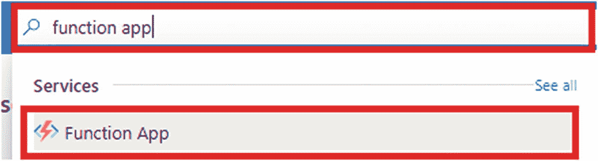

图 5-1

点击功能应用

现在点击创建，创建一个新的功能 app，如图 [5-2](#Fig2) 所示。

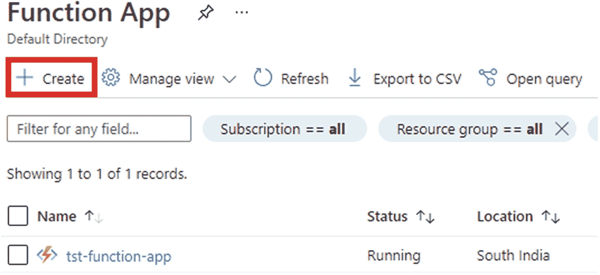

图 5-2

创建功能应用

填写创建您的函数应用所需的所有详细信息，例如资源组、函数应用名称、区域和运行时堆栈等，如图 [5-3](#Fig3) 所示。

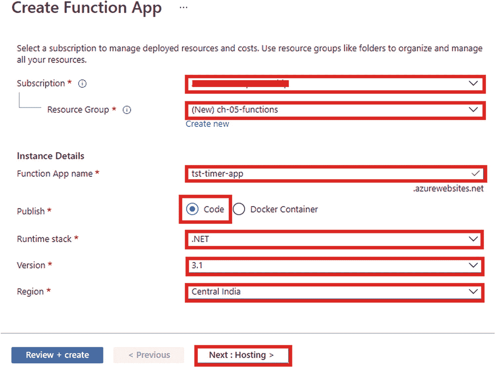

图 5-3

提供功能应用的必要配置详情

填写完所有必填字段后，单击下一步:托管。

您必须填写功能应用的存储帐户名称、操作系统，最后是计划类型。我为这个功能应用创建了一个新的存储帐户。此功能应用选择的操作系统是 Windows。因为您希望计时器触发的函数是无服务器的，所以让我们使用本例中的消费计划。

填写完所有这些细节后，点击下一步:监控，如图 [5-4](#Fig4) 所示。

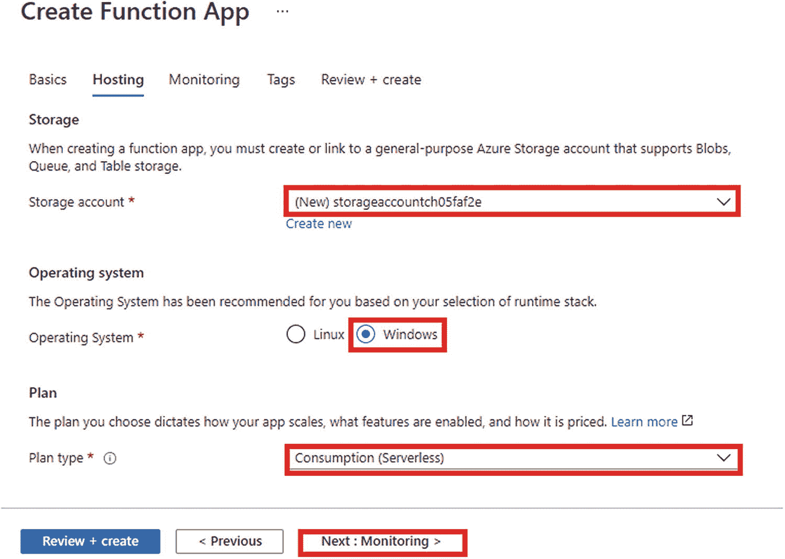

图 5-4

提供托管详细信息

您将在监控部分为您的功能应用启用应用洞察，并为功能应用创建新洞察。您可以为函数应用启用应用洞察，因为它有助于您查看函数的日志流数据。

Application Insights 还可以帮助您收集遥测数据，以处理和找出功能执行中的任何异常。我们将在第十章[中简要讨论它。](10.html)

启用应用洞察并选择一个现有洞察或为功能应用创建一个新洞察后，单击下一步:标签，如图 [5-5](#Fig5) 所示。

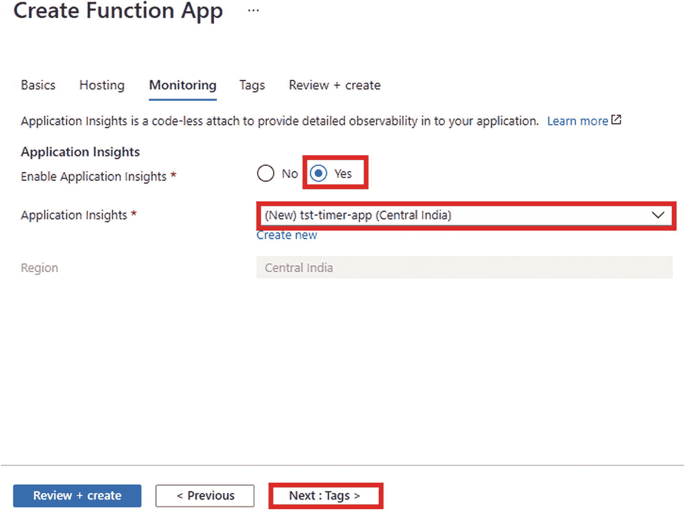

图 5-5

实现应用洞察

现在，您将被要求为功能应用分配标签。这一步是可选的。为所有资源分配标签是一种最佳做法。它有助于成本管理和资源的逻辑分组。填写完标签及其值后，单击“下一步:查看+创建”，如图 [5-6](#Fig6) 所示。

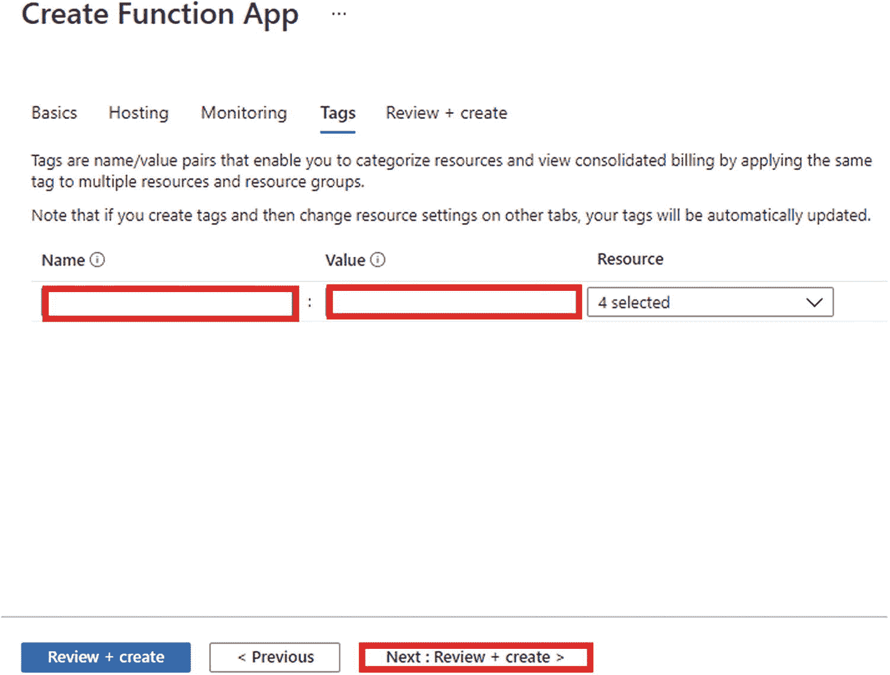

图 5-6

提供标签详细信息

现在，您将看到一个屏幕，其中汇总了您为创建功能应用而填写的所有详细信息，并且将进行验证以检查所有详细信息是否有效。验证过程完成并成功后，需要点击**、**，如图 [5-7](#Fig7) 所示。

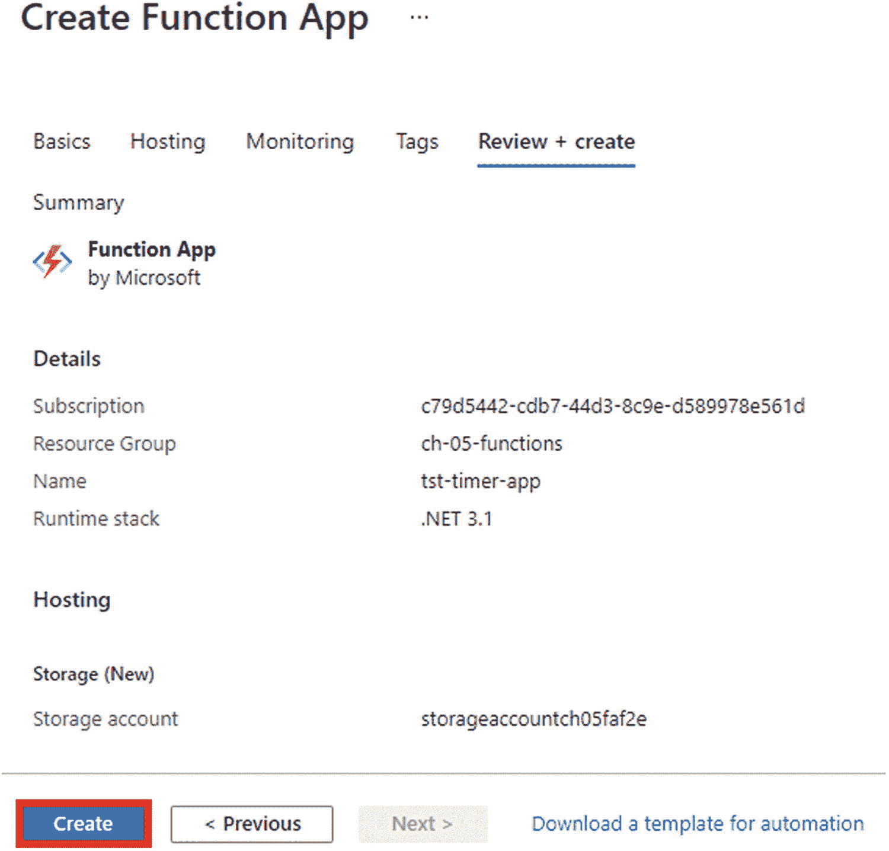

图 5-7

单击创建

当您的功能应用正在部署时，您将被重定向到如图 [5-8](#Fig8) 所示的屏幕。一旦你所有的功能 app 资源部署完成，你会看到一个更新，如图 [5-8](#Fig8) 中突出显示的。点击“转到资源”导航到功能应用。

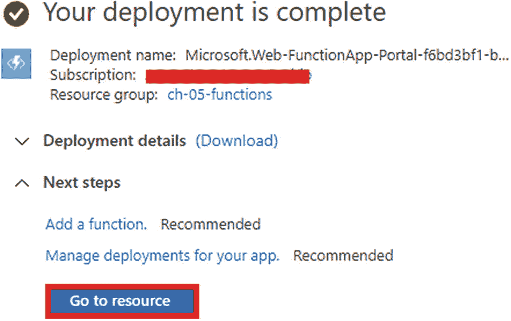

图 5-8

单击“转到资源”

现在，您将被重定向到功能屏幕。点击**函数**，然后点击【添加】创建一个新的 Azure 函数，如图 [5-9](#Fig9) 所示。

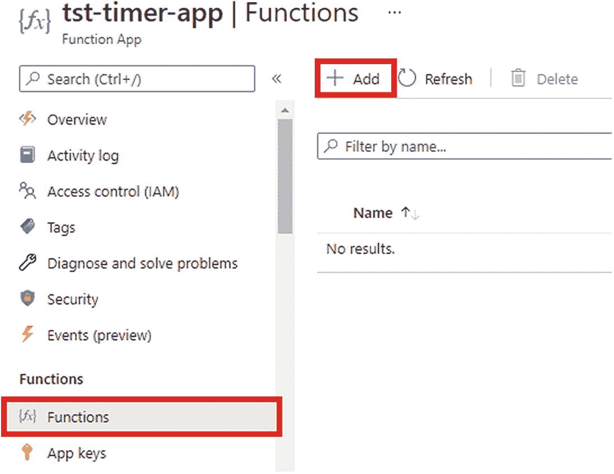

图 5-9

单击添加

现在让我们选择“在门户中开发”作为开发环境，选择“定时器触发器”作为函数模板，点击添加**、**，如图 [5-10](#Fig10) 所示。

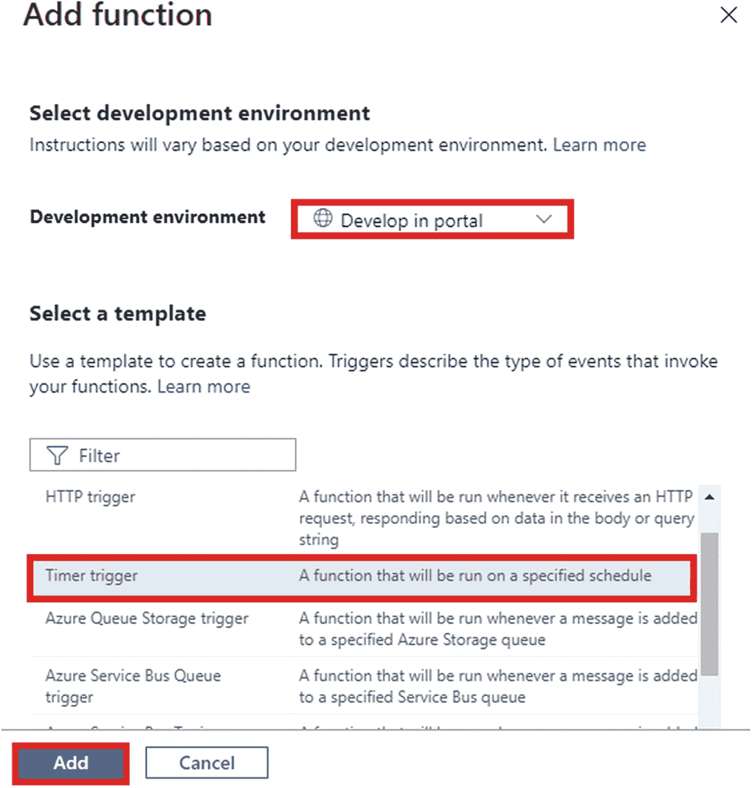

图 5-10

选择“计时器触发器”并单击添加

Azure 会生成一个定时器触发的 Azure 函数，名为 TimerTrigger1，如图 [5-11](#Fig11) 所示。默认情况下，该功能将被启用。该函数将由以下三个文件组成:

*   `run.csx`

*   `function.json`

*   `readme.md`

`run.csx`是一个 C#脚本，包含你的 Azure 函数的业务逻辑，而`function.json`拥有你的函数的触发器、绑定和其他配置设置的所有配置细节。`readme.md`包含了这个函数的简短描述。

现在点击代码+测试，如图 [5-11](#Fig11) 所示，查看`run.csx`代码；参考清单 [5-1](#PC2) 获取`run.csx`文件中的代码。

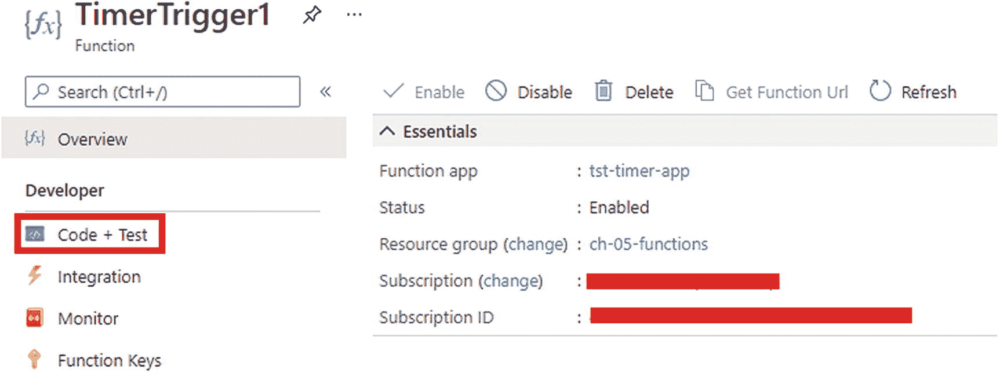

图 5-11

选择代码+测试

Azure 为您的定时器触发函数生成的样板代码目前每五分钟向日志中写入一条消息。

```cs
using System;
public static void Run(TimerInfo myTimer, ILogger log)
{
    log.LogInformation($"C# Timer trigger function executed at: {DateTime.Now}");
}

Listing 5-1run.csx Code

```

函数和触发类型的时间表表达式和其他细节在`function.json`文件中提到。清单 [5-2](#PC3) 显示了`function.json`的内容。

```cs
{
  "bindings": [
    {
      "name": "myTimer",
      "type": "timerTrigger",
      "direction": "in",
      "schedule": "0 */5 * * * *"
    }
  ]
}

Listing 5-2function.json Code

```

您可以在`function.json`文件中修改函数名和时间表表达式。或者，您也可以在功能屏幕的开发者部分点击集成，然后点击触发器，如图 [5-12](#Fig12) 所示。

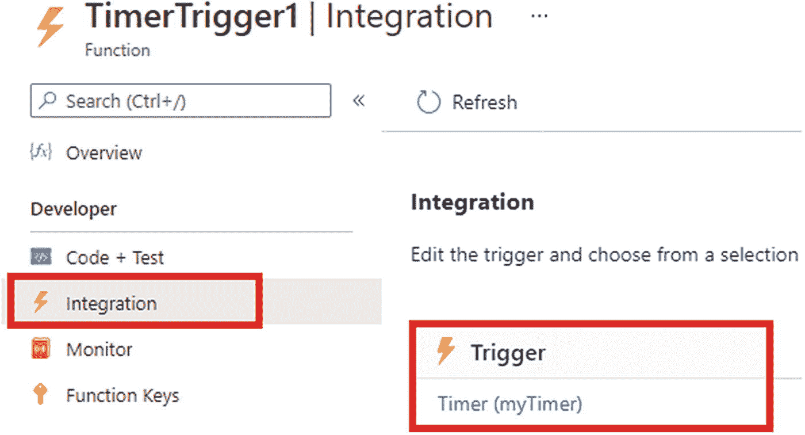

图 5-12

点击集成

现在，你会看到一个屏幕，上面有`function.json`中提到的所有功能细节。您可以通过修改时间戳修饰符名称来修改您的函数名称，并通过修改调度值来修改调度表达式，如图 [5-13](#Fig13) 所示。

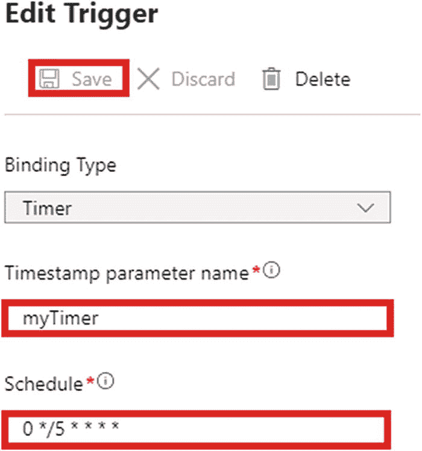

图 5-13

修改功能设置

现在你已经创建并理解了定时器触发的 Azure 函数，并研究了定制它的方法，让我们看看它是如何工作的。因为它按计划工作，并在执行时记录包含执行时间的消息，所以您将在日志流中看到它。要查看日志流，您必须单击开发人员部分中的 Monitor。然后点击日志，查看函数执行后记录的消息，如图 [5-14](#Fig14) 所示。

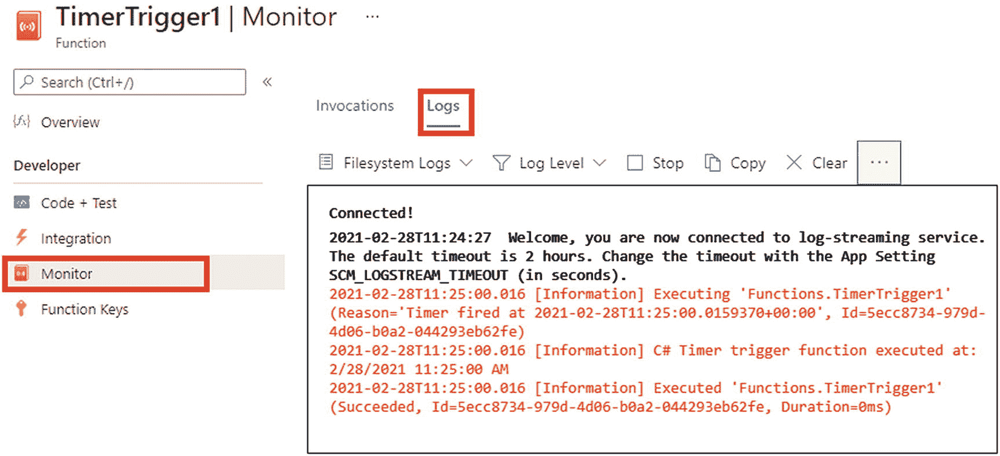

图 5-14

查看日志

Note

在将计时器触发的功能部署到生产环境时，确保将`runOnStartup`属性设置为`false`。如果设置为`true`，您的功能将在每次缩小时或由于功能更改而导致功能应用重启时被调用。

您还可以在 function 屏幕的 Monitor 部分看到 number 函数调用及其执行时间和状态，即成功或失败。您可以通过转到调用选项卡而不是日志选项卡来查看这些详细信息，如图 [5-15](#Fig15) 所示。

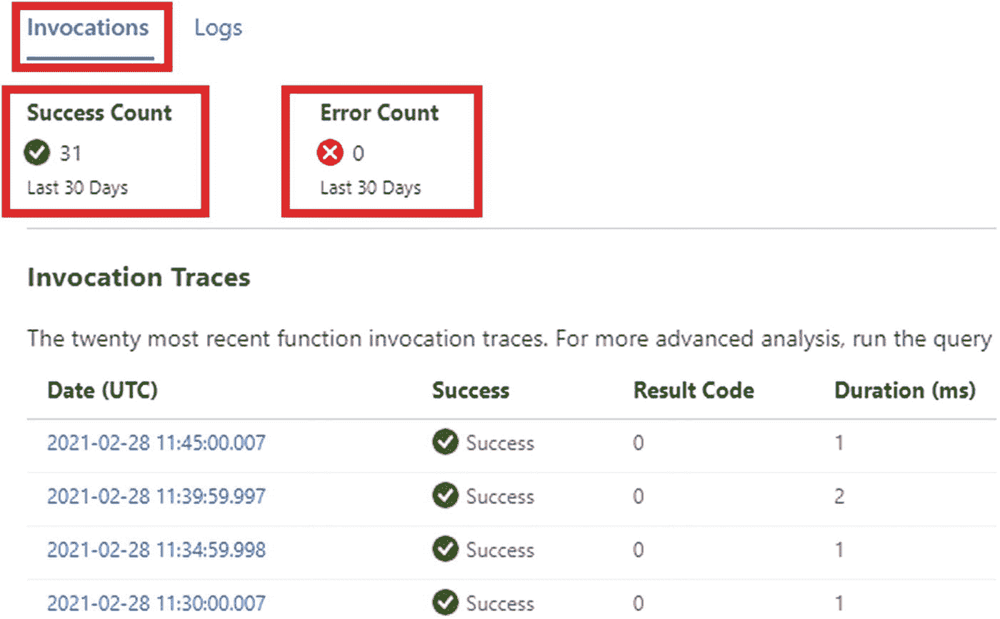

图 5-15

查看函数调用详细信息

要了解更多关于定时器触发功能的信息，我们建议您访问 [`https://docs.microsoft.com/en-us/azure/azure-functions/functions-bindings-timer`](https://docs.microsoft.com/en-us/azure/azure-functions/functions-bindings-timer) 。

## Blob 存储绑定和用例入门

您可能遇到过这样的情况，函数需要在执行后将处理过的数据存储在持久存储中，或者需要一些数据来处理请求并返回响应。为了满足这样的需求，您可以使用 Blob 存储绑定。Blob 存储绑定提供了一种声明性的方式，将您的函数连接到 Azure Blob 存储，并在其上执行各种操作。Azure 函数支持 Azure Blob 存储的输入和输出绑定。这些绑定帮助您更加专注于解决业务问题，而不是专注于配置样板代码来设置 SDK 以与 Blob 存储进行交互。

以下是几个可以 Blob 存储绑定的示例场景:

*   在报表应用中，Azure Functions 在每天的固定时间处理来自不同数据源的数据，然后将其存储在 Blob 存储中，供其他用户进一步参考。

*   在无服务器 API 的情况下，HTTP 触发的 Azure 函数可能需要根据业务需求随时返回文件或其内容。您可以使用 Blob 存储输入绑定从 Blob 存储中获取文件，并将其作为响应发送回用户。

*   在银行系统的情况下，Azure 函数可以每月生成一个帐户报表，并使用输出绑定将其放入 Blob 存储中，然后还使用 Blob 存储触发器和 SendGrid 输出绑定将生成的帐户报表通过电子邮件发送给最终用户。

    **注意**在使用门户内编辑器时，不能使用基于属性的绑定。您必须在`function.json`文件中定义触发器和绑定的属性。或者，您也可以在门户中 Azure 函数的集成部分定义和修改它们。

## 使用 Blob 存储绑定构建一个示例函数

在本节中，您将在门户编辑器的帮助下，在 Azure 门户中创建一个带有 Blob 存储输出绑定的计时器触发的 Azure 函数。您将把 Blob 存储绑定与您在上一节中创建的计时器触发函数集成在一起。您将使用一个 Blob 存储输出绑定，在每次计时器触发的函数执行时，在容器中创建一个新文件，并在这个文件中写入您之前用来记录的消息。

让我们转到门户中的计时器触发功能，并单击屏幕的开发人员部分中的集成选项。您将看到一个类似于图 [5-16](#Fig16) 所示的屏幕。

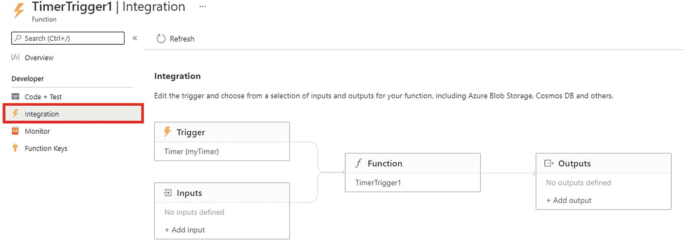

图 5-16

查看函数的集成选项

因为您已经在创建函数时定义了触发器类型，所以触发器在这里被更新为 Timer。因为到目前为止，您还没有为这个函数配置任何输入和输出绑定，所以您无法在屏幕上看到“没有定义输入”和“没有定义输出”。

现在，您需要单击 Add Output 为这个函数添加一个输出绑定。单击后，您应该会看到类似于图 [5-17](#Fig17) 所示的屏幕。您必须选择 Azure Blob 存储作为绑定类型，然后您需要命名 Blob 参数名称。然后，当您希望在每次函数执行时创建一个文件时，定义容器的路径和名称。

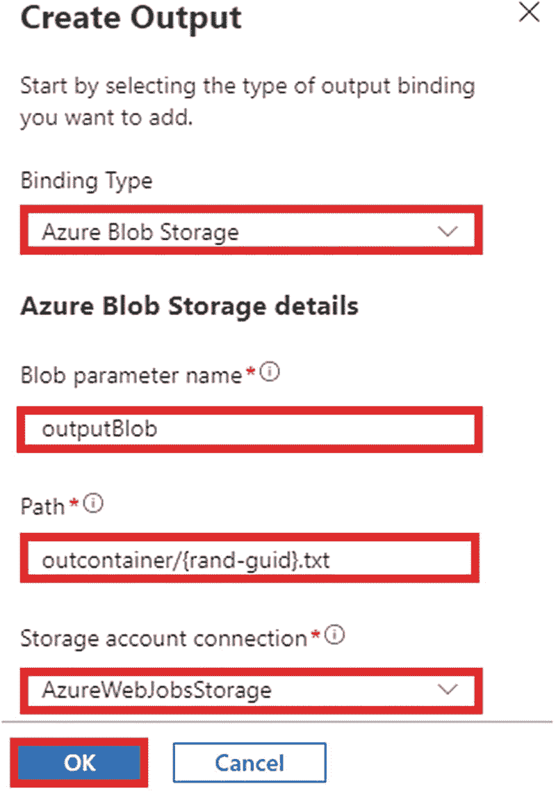

图 5-17

添加 Blob 存储输出绑定

在您的例子中，容器名是`outcontainer`，文件名定义为`{rand-guid}.txt`。`{rand-guid}`是一个创建唯一 GUID 的绑定表达式。您还可以使用`{DateTime}`绑定表达式来创建一个文件名为`DateTime.UtcNow`值的文件。最后，选择存储帐户连接。这是包含用于此绑定的存储连接字符串的应用设置的名称。默认情况下，它指向您在创建函数应用时创建的存储帐户。或者，根据您的要求，您也可以将其映射到不同的存储帐户。但是您需要确保配置的是通用存储帐户的连接字符串，而不是 Blob 存储帐户的连接字符串。

默认情况下，您在创建函数 app 时创建的存储帐户中只有两个容器，如图 [5-18](#Fig18) 所示。您可以在存储帐户中看到这些容器，方法是转到存储资源管理器，然后单击 Blob 容器。

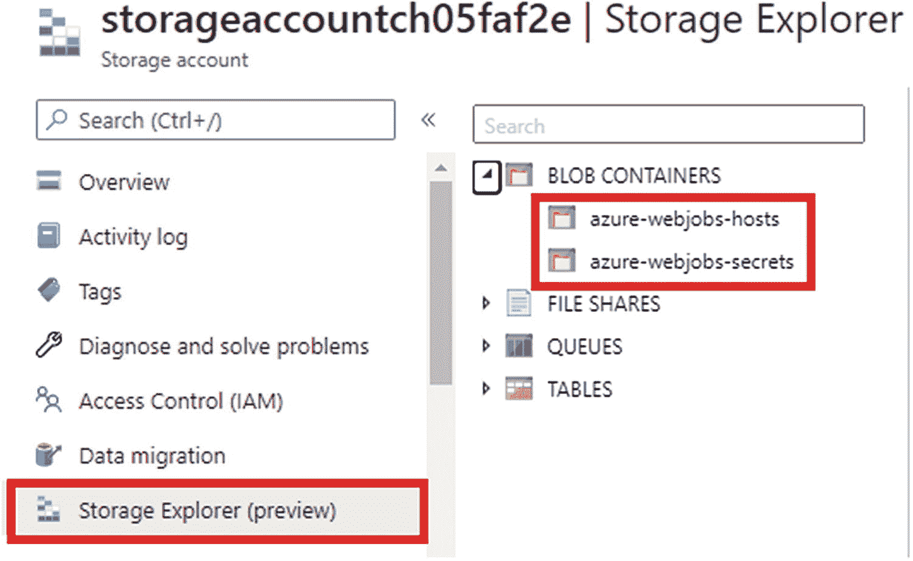

图 5-18

查看现有的 Blob 容器

从图 [5-18](#Fig18) 中可以看到，到目前为止，在你的输出绑定的路径中还没有你已经传递的任何名为`outcontainer`的容器。在这种情况下，该函数在执行存储文件时会在存储帐户中动态创建一个`outcontainer`。

现在您已经在集成窗口中为您的定时器触发函数应用配置了输出绑定，让我们来看看您的`function.json`文件。您将会看到一个新的代码片段被添加到您的`function.json`文件中，如清单 [5-3](#PC4) 所示。现在，它包含了向函数添加 Blob 存储输出绑定所需的所有属性。在集成窗口中所做的任何更改都将反映在您的定时器触发函数的`function.json`文件中。

```cs
{
  "bindings": [
    {
      "name": "myTimer",
      "type": "timerTrigger",
      "direction": "in",
      "schedule": "0 */5 * * * *"
    },
    {
      "name": "outputBlob",
      "direction": "out",
      "type": "blob",
      "path": "outcontainer/{rand-guid}.txt",
      "connection": "AzureWebJobsStorage"
    }
  ]
}

Listing 5-3Updated function.json Code

```

在清单 [5-3](#PC4) 所示的代码中，可以看到类型被定义为`blob`，方向被定义为`out`。这表明这是用于 Blob 存储输出绑定的。连接的值是包含存储连接值的应用设置的名称。该名称表示函数代码中的 Blob。

现在您需要在您的`run.csx`文件中做一些更改，将这个输出绑定添加到您的定时器触发函数中，如清单 [5-4](#PC5) 所示。

```cs
public static void Run(TimerInfo myTimer, ILogger log, TextWriter outputBlob)
{
    string message= $"C# Timer trigger function executed at: {DateTime.Now}";
    try{
        outputBlob.Write(message);
        log.LogInformation("Blob created successfully");
    }
    catch(Exception ex){
        log.LogInformation("Blob creation failed");
        }
}

Listing 5-4Modified run.csx

```

在清单 [5-4](#PC5) 中，您添加了一个`TextWriter`类型的参数，其名称在定时器触发函数的`function.json`文件中定义。你可以把它绑定到不同的类型，比如`string`、`Byte[]`、`stream`等等。之后，定义一个名为`message`的变量，它有一个字符串值以及函数执行的日期和时间。接下来，使用`write`方法将 message 变量的值写入存储在`outcontainer`中的新文本文件中，如图 [5-19](#Fig19) 所示。

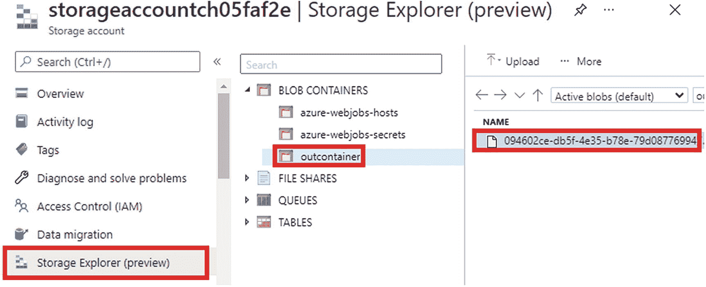

图 5-19

查看 outcontainer 中新创建的文件

您将代码片段包装在一个`try-catch`块中来处理任何错误。如果一切正常，您将在日志流中看到“Blob 创建成功”；否则，记录的消息将是“Blob 创建失败”现在，这个函数将每五分钟用消息变量的值创建一个唯一的文本文件，直到该函数被停止或禁用。

您还可以记录额外的信息，并将日志存储在永久存储器中，以调查导致函数执行失败的任何问题，但这已经超出了本章的范围。我们将在第 [10](10.html) 章讨论你的函数的异常处理机制。

要了解更多关于 Blob 存储输入和输出绑定的信息，我们建议您查看 [`https://docs.microsoft.com/en-us/azure/azure-functions/functions-bindings-storage-blob`](https://docs.microsoft.com/en-us/azure/azure-functions/functions-bindings-storage-blob) 。

## 使用 Blob 存储绑定和计时器触发器创建报告生成器

在本章的前几节中，您学习了如何使用定时器触发器和 Blob 存储输出绑定以及门户内编辑器来构建 Azure 函数。在本节中，您将在 Visual Studio 2019 中使用 Blob 存储输出绑定和计时器触发的 Azure 函数创建一个报告生成器。这个报告生成器的主要目标是从数据库中获取数据，并创建一个报告文件，该文件包含执行时以 JSON 格式出现的所有数据。您可以根据业务需求对此进行进一步定制。

让我们使用 Visual Studio 2019 开始构建它。打开 Visual Studio 2019，点击“新建项目”，如图 [5-20](#Fig20) 所示。

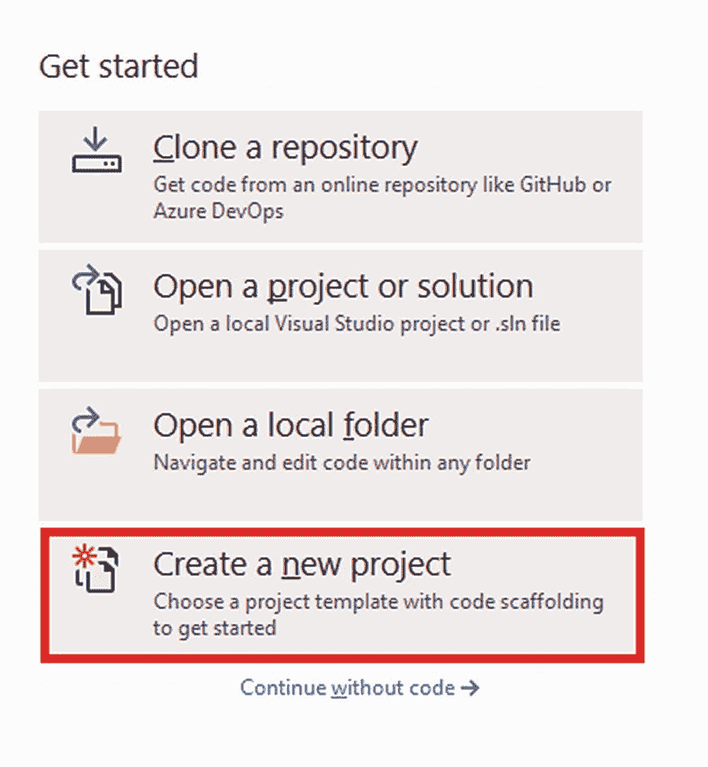

图 5-20

创建新项目

现在，你需要为你的项目选择 Azure Functions 模板，如图 [5-21](#Fig21) 所示。如果你没有安装 Azure 开发工作负载，你将看不到 Azure Functions 模板。你可以在第 [2](02.html) 章找到使用 Visual Studio 安装程序安装 Azure 开发工作负载的说明。

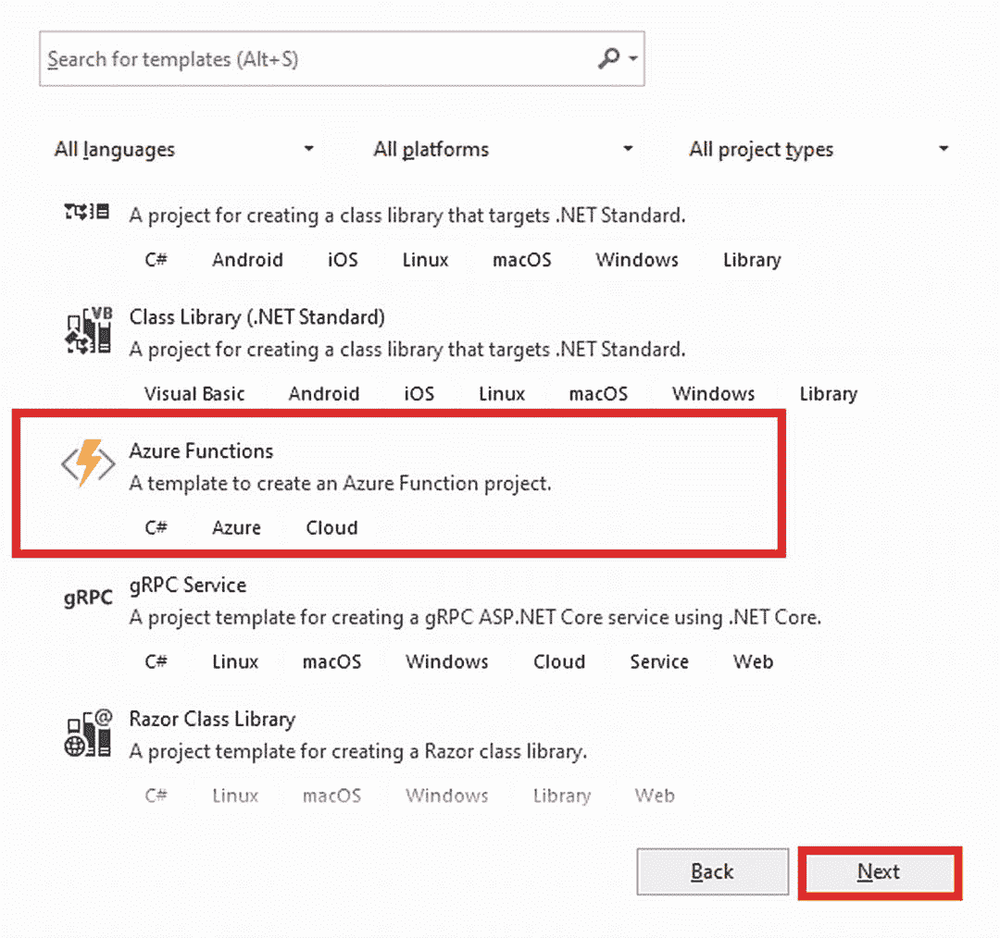

图 5-21

选择 Azure 函数模板

为项目命名并选择项目的源位置，如图 [5-22](#Fig22) 所示。

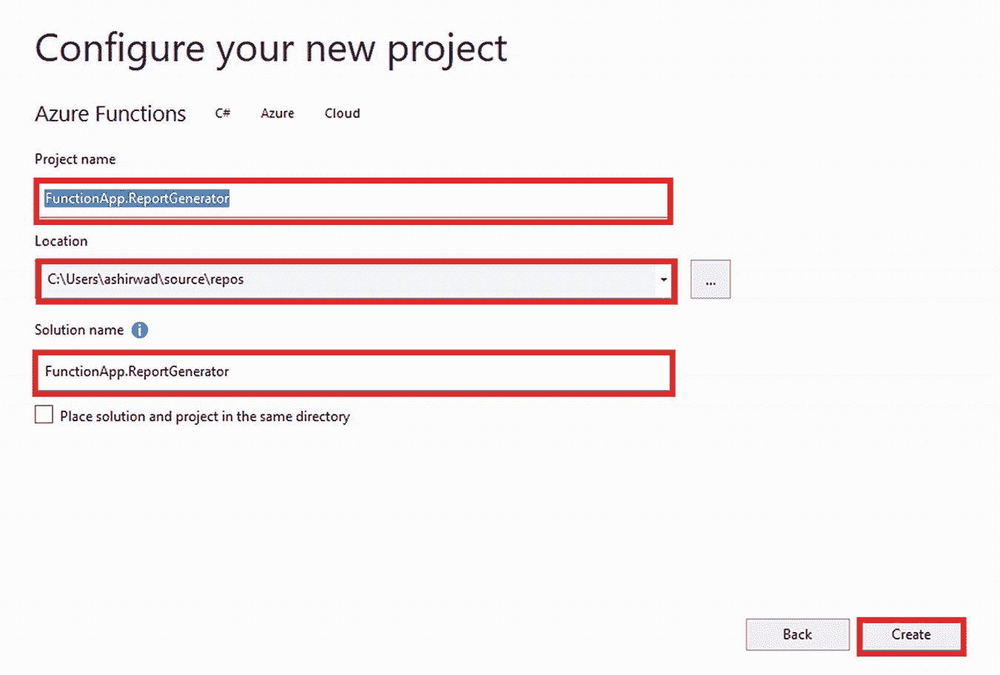

图 5-22

提供项目名称，然后单击“创建”

选择“Timer trigger”，在时间表中提供一个 cron 表达式，最后选择存储帐户作为存储模拟器。在这一步中定义的 cron 表达式将是计时器触发的 Azure 函数的调度表达式。我们选择存储帐户作为存储模拟器，因为我们希望在本地环境中工作，但是您可以随时修改存储帐户连接。见图 [5-23](#Fig23)

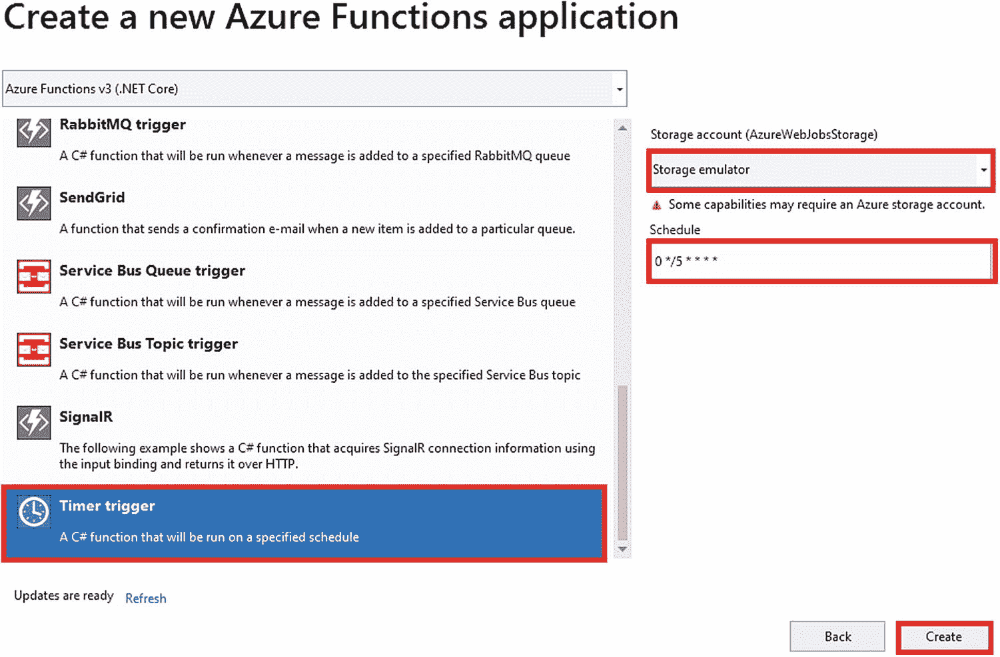

图 5-23

选择“计时器触发器”，配置存储帐户，并计划表达式

一旦你点击了 Create，Visual Studio 将会生成几个带有一些样板代码的文件，带有一个名为 Function1 的定时器触发函数，如图 [5-24](#Fig24) 所示。我们在第二章[中简要讨论了这些文件。](02.html)

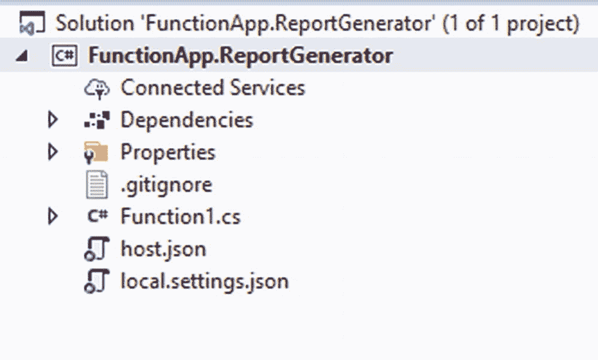

图 5-24

Visual Studio 为您的函数生成的文件

默认情况下，该函数的代码类似于清单 [5-5](#PC6) 。此函数的功能是每五分钟运行一次，并记录一条消息，其中包含执行的日期和时间。

```cs
public static class Function1
    {
        [FunctionName("Function1")]
        public static void Run([TimerTrigger("0 */5 * * * *")]TimerInfo myTimer, ILogger log)
        {
            log.LogInformation($"C# Timer trigger function executed at: {DateTime.Now}");
        }
    }

Listing 5-5Boilerplate Timer-Triggered Code Generated by Visual Studio

```

您在此函数中使用了触发器和绑定的基于属性的声明。在使用门户内编辑器时，您在`function.json`文件中定义它；否则，您必须使用 Integration 窗格来定义或修改函数的触发器和绑定。这里，`TimerTrigger`属性的构造函数接受一个 cron 表达式。

为了使您的函数能够访问 SQL Server 数据库，您需要在您的函数项目中安装`System.Data.SqlClient` NuGet 包。您可以使用 Visual Studio 中的 NuGet 包管理器以及在包管理器控制台中键入以下命令来完成此操作:

```cs
Install-Package System.Data.SqlClient -Version 4.8.2

```

现在您将创建一个表示表的 POCO 类。在这个例子中，您将访问一个由一家出版社的所有作者的详细信息组成的表。关于表示 authors 表的 POCO 类，请参考清单 [5-6](#PC8) 。

```cs
public class Author
{
         public string author_id { get; set; }
         public string first_name { get; set; }
         public string last_name { get; set; }
         public string phone { get; set; }
}

Listing 5-6POCO Class Representing Authors Table

```

一旦创建了`Author`类，您将使用 ADO.NET 代码从数据库中获取数据，并将其存储在作者列表中，如清单 [5-7](#PC9) 所示。您还可以使用实体框架核心或任何其他 ORM(如 Dapper)来与数据库交互。但是在开始编写代码从 authors 表中获取数据之前，您需要知道在哪里存储数据库的连接字符串。您可以将连接字符串作为键值对保存在`local.settings.json`文件中，稍后在您的函数中获取它；或者，您可以在创建连接对象时将连接字符串硬编码在函数代码本身中。后者不是推荐的做法。你将在第 [10 章](10.html)学会如何管理功能应用中的秘密。

```cs
{
  "IsEncrypted": false,
  "Values": {
    "AzureWebJobsStorage": "UseDevelopmentStorage=true",
    "FUNCTIONS_WORKER_RUNTIME": "dotnet",
    "DBCon": "your-connectionString"
  }
}

Listing 5-7Store the Connection String Inside local.settings.json

```

在清单 [5-7](#PC9) 中，您在`local.settings.json`文件的值中创建了一个`DBCon`的键值对。`DBCon`的值将被您的数据库的连接字符串替换。一旦在`local.settings.json`文件中添加了连接字符串值，现在就可以使用`GetEnvironmentVariable`方法获取它，如清单 [5-8](#PC10) 所示。

```cs
List<Author> authors = new List<Author>();
string connectionString = Environment.GetEnvironmentVariable("BookStoresDB");
using (SqlConnection myConnection = new SqlConnection(connectionString))
{
       string oString = "Select * from author";
       SqlCommand oCmd = new SqlCommand(oString, myConnection);
       myConnection.Open();
       using (SqlDataReader oReader = oCmd.ExecuteReader())
       {
              while (oReader.Read())
              {
                     Author author = new Author();
                     author.author_id = oReader["author_id"].ToString();
                     author.first_name = oReader["first_name"].ToString();
                     author.last_name = oReader["last_name"].ToString();
                     author.phone = oReader["phone"].ToString();
                     authors.Add(author);
              }

              myConnection.Close();
       }
}

Listing 5-8Get the Data from the Authors Table and Store It in a List of Authors

```

在清单 [5-8](#PC10) 的代码片段中，您创建了一个名为`authors`的作者列表。然后从`local.setting.json`中获取连接字符串，并使用`GetEnvironment`方法类将其存储在`connectionString`变量中。然后使用一小段 ADO.NET 代码获取表中所有作者的值，然后将从 authors 表中获取的所有记录存储在您的`Authors`列表中。您需要将代码片段添加到函数的`Run`方法中。

既然我们已经介绍了从数据库中的 authors 表获取数据并将数据存储到 authors 列表的代码，让我们通过使用`JsonSerializer`类的`Serialize`方法将`authors`列表转换成 JSON 字符串，如清单 [5-9](#PC11) 所示。一旦添加了清单 [5-9](#PC11) 中所示的代码片段，将`authors`列表对象序列化为一个 JSON 字符串，在`LogInformation`方法中传递这个 JSON 字符串，并运行您的函数来检查您是否能够获取数据并将列表对象序列化为一个 JSON 字符串。

```cs
var jsonData = JsonSerializer.Serialize<List<Author>>(authors);
log.LogInformation($"{jsonData}");

Listing 5-9Display the Serialized Authors List As a JSON String in the Azure Functions Core Tools Logs Window

```

你应该在 Azure Functions 运行时工具窗口的日志中看到 JSON 字符串，如图 [5-25](#Fig25) 所示。这是一个可选步骤。您可以使用清单 [5-9](#PC11) 中的代码片段来检查您的函数是否按预期工作。(根据表中的数据，日志消息会有所不同。)

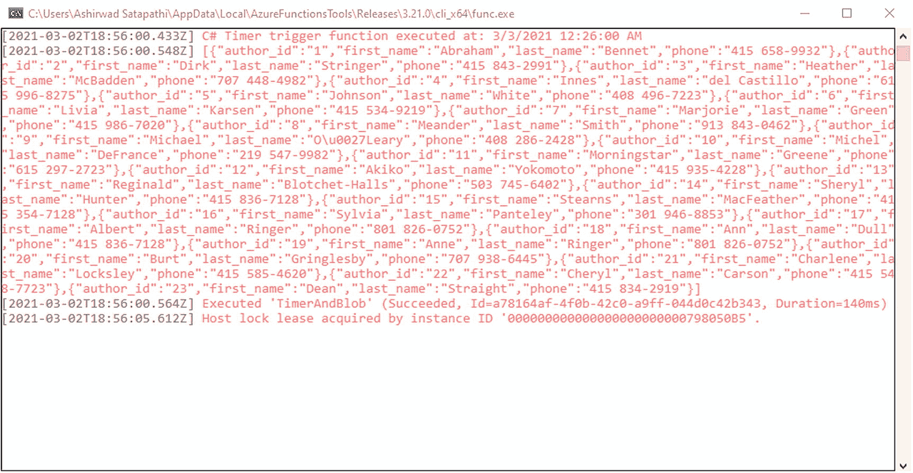

图 5-25

显示为日志消息的序列化 JSON 字符串

现在您已经检查了您的函数是否如预期的那样工作，让我们安装 Blob 存储绑定所需的 NuGet 包。您可以通过在 Visual Studio 的包管理器控制台中键入以下命令来安装所需的包:

```cs
Install-Package Microsoft.Azure.WebJobs.Extensions.Storage

```

一旦你安装了 NuGet 包，你将不得不修改你的`run`方法的参数。您需要添加一个`blob`属性和一个名为`outblob`的 TextWriter 类型参数。您将传递 Blob 路径和文件访问权限，并将通过将存储帐户的连接字符串分配给 attributes 构造函数来定义连接属性。

您将传递 Blob 路径作为`report/{rand-guid}.json` **，传递**文件访问作为`FileAccess.Write`，传递存储帐户连接作为`AzureWebJobsStorage`。当您将存储连接定义为`AzureWebJobsStorage`时，您的函数会查看存在于您的`local.settings.json`文件中的`AzureWebJobsStorage`键值。您需要确保将`AzureWebJobsStorage`键的值定义为`UseDevelopmentStorage=true`。

在您通过添加`blob`属性配置了函数的`run`方法的属性，并且添加了 TextWriter `Type`参数作为`outBlob` **，**，这是表示函数代码中的 Blob 的变量之后，您将使用`outBlob`在 JSON 文件中写入`jsonData`，该文件的名称将是一个随机 GUID，它将在`{rand-guid}`绑定表达式的帮助下生成。您将把这个文件存储在报表容器中。您可以在清单 [5-10](#PC13) 中看到最终的函数代码。

```cs
using System;
using System.Collections.Generic;
using System.Data.SqlClient;
using System.Text.Json;
using Microsoft.Azure.WebJobs;
using Microsoft.Azure.WebJobs.Host;
using Microsoft.Extensions.Configuration;
using Microsoft.Extensions.Logging;
using Microsoft.Azure.WebJobs.Extensions.Storage;
using System.IO;
using System.Text;
namespace FunctionApp.ReportGenerator
{
    public static class Function1
    {
        [FunctionName("Function1")]
        public static void Run([TimerTrigger("0 */5 * * * *")] TimerInfo myTimer, ILogger log,
            [Blob("report/{rand-guid}.json", FileAccess.Write, Connection ="AzureWebJobsStorage")]TextWriter outBlob)
        {
            log.LogInformation($"C# Timer trigger function executed at: {DateTime.Now}");
            List<Author> authors = new List<Author>();
            string connectionString = Environment.GetEnvironmentVariable("BookStoresDB");
            using (SqlConnection myConnection = new SqlConnection(connectionString))
            {
                string oString = "Select * from author";
                SqlCommand oCmd = new SqlCommand(oString, myConnection);
                myConnection.Open();
                using (SqlDataReader oReader = oCmd.ExecuteReader())
                {
                    while (oReader.Read())
                    {
                        Author author = new Author();
                        author.author_id =oReader["author_id"].ToString();
                        author.first_name = oReader["first_name"].ToString();
                        author.last_name = oReader["last_name"].ToString();
                        author.phone = oReader["phone"].ToString();
                        authors.Add(author);
                    }
                    myConnection.Close();
                }
                var jsonData = JsonSerializer.Serialize<List<Author>>(authors);
                log.LogInformation($"{jsonData}");
                outBlob.Write(jsonData);
            }
        }
    }
}

Listing 5-10Code for the Schedule-Based Report Generator

```

清单 [5-10](#PC13) 由每五分钟运行一次的函数代码组成，并生成一个包含所有以 JSON 格式存储的作者记录的报告。既然您已经为计时器触发的报告生成器函数编写了代码，让我们通过运行 Azure Functions 运行时工具来测试它。如果您的函数执行成功，那么您应该看到一个名为 Report 的 Blob 容器和一个 JSON 文件，其名称是本地存储帐户中的一个随机 GUID。您可以借助云浏览器在 Visual Studio 中查看这一点。或者，您可以使用存储资源管理器来查看 Blob 容器。

您可以通过单击 Visual Studio 中的视图，然后单击云资源管理器来打开云资源管理器。您将能够在 Visual Studio 屏幕中看到云浏览器，如图 [5-26](#Fig26) 所示。

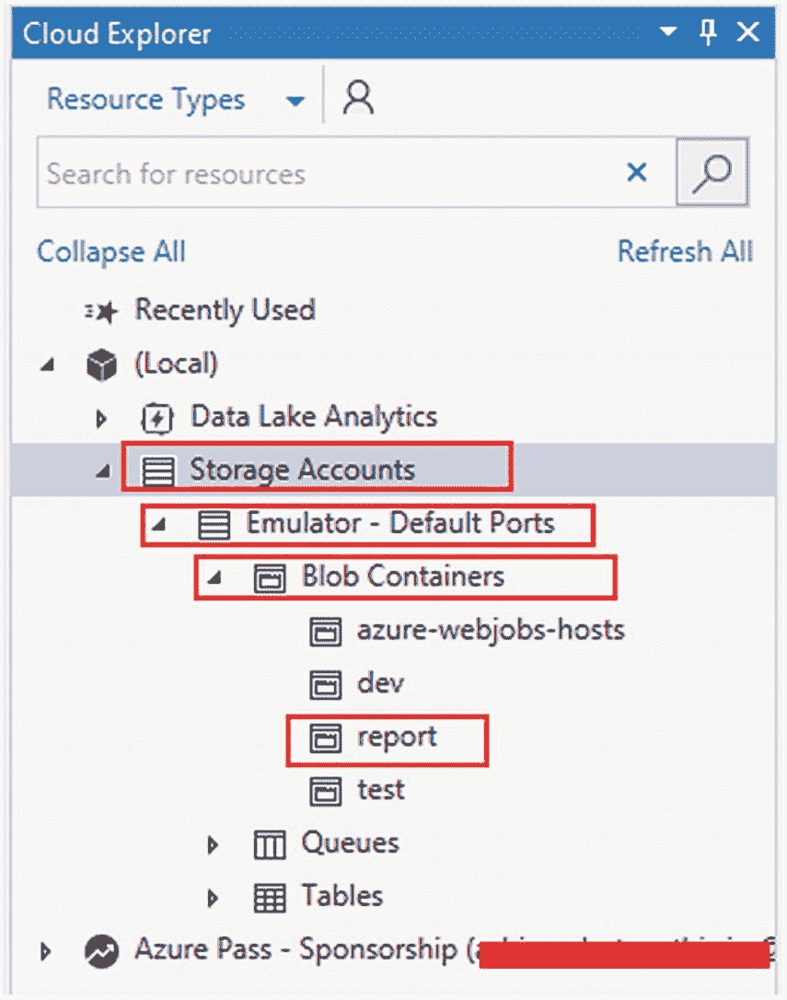

图 5-26

云浏览器视图

云浏览器允许您管理 Azure 资源，并管理本地存储模拟器中的存储帐户。如果您使用的是 Visual Studio 2017 或更高版本，则需要在 Visual Studio 中安装 Azure 工作负载才能使用云浏览器。

从图 [5-26](#Fig26) 中可以看到，在你的本地存储账户中有一个名为`report`的 Blob 容器。如前所述，如果您的 Blob 容器中没有名为`report`的 Blob 容器，那么您的函数将首先创建一个名为`report`的 Blob 容器，然后创建一个带有随机 GUID 和来自 authors 表的序列化数据的文件。您可以单击`report` Blob 容器来查看由您的函数创建的文件。单击报告容器后，您应该会看到类似于图 [5-27](#Fig27) 所示的屏幕。

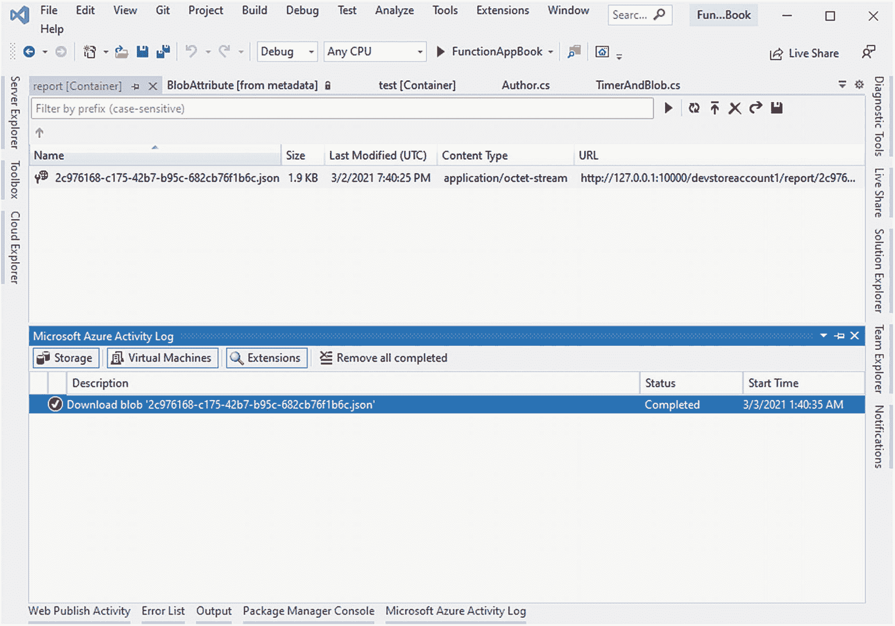

图 5-27

由您的函数生成的文件的云浏览器视图

您可以双击文件或右键单击文件名，然后单击“保存”下载文件。

## 摘要

在本章中，您学习了如何使用 Visual Studio 和 Azure 门户的门户内编辑器来处理计时器触发器和 Blob 存储输出绑定。然后，您使用这些概念构建了一个每五分钟触发一次的报告生成器，从数据库表中获取数据，并通过使用 Blob 存储输出绑定序列化从数据库表中获取的数据来创建一个 JSON 文件。

以下是本章的要点:

*   你可以使用定时器触发器来触发 Azure 函数。该功能的触发取决于配置的时间表。

*   您可以使用 Blob 存储输出绑定从 Azure 函数在 Blob 容器中创建文件。

*   您可以声明性地配置计时器触发器和 Blob 存储输出绑定，而不必编写太多代码。

*   Visual Studio 提供了一个使用计时器触发器的模板。

*   您可以使用存储模拟器在本地构建和测试使用 Blob 存储绑定的函数。