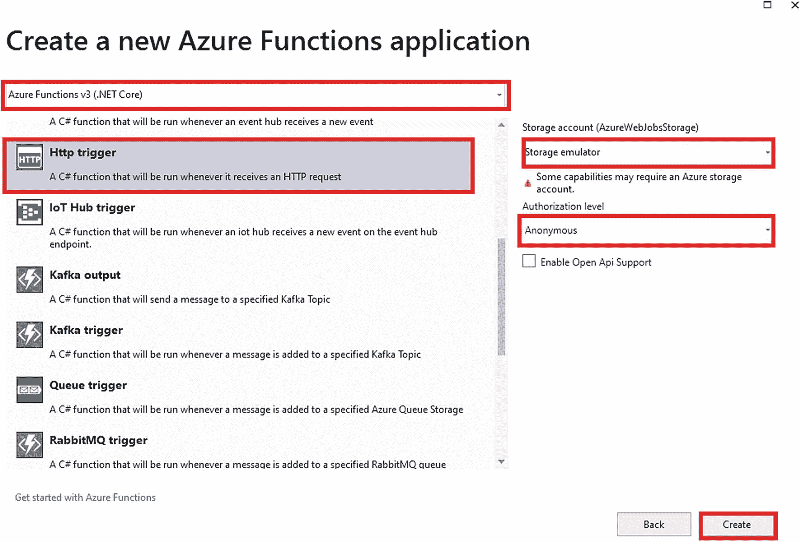

# 8.使用 Azure 函数和 Azure SQL 构建无服务器 API

如今，大多数应用都有独立的客户端和服务器端项目。客户端应用向服务器端应用发送请求，以与数据库交互或执行业务操作。服务器端项目通常是一个 web API，它从客户端应用获取请求，处理请求，并返回适当的响应，客户端应用稍后可以使用该响应来显示数据。在这种情况下，您需要在 Azure Web App 中部署您的客户端和 API 项目，这将需要 Azure App 服务计划。当你将应用部署到 Azure Web 应用时，无论应用的使用情况如何，你都必须每月支付费用。这是 Azure 功能大放异彩的领域之一。

Azure Functions 服务在开发人员中最有前途和最受欢迎的用例之一是构建无服务器 API。凭借 Azure 函数的微计费特性和自动伸缩能力，构建容易出现意外流量高峰的 API 是一个理想的选择。在 Azure Functions 产品的帮助下，您可以构建高度可伸缩且经济高效的解决方案。

在前面的章节中，你已经学习了 HTTP 触发的 Azure 函数和它们的用例，在本章中，你将使用这些知识来构建使用 HTTP 触发函数的无服务器 API，这些函数将在收到请求时运行。被触发后，API 通过与 Azure SQL 数据库交互并向客户端提供响应来处理请求并获取数据。

## 本章的结构

本章将探讨 HTTP 触发器和 Azure SQL 的以下方面:

*   Azure SQL 入门

*   在 Azure SQL 中构建数据库和表

*   HTTP 触发器入门

*   使用 HTTP 触发函数和 Azure SQL 创建无服务器 API

## 目标

学习完本章后，您将能够做到以下几点:

*   使用 Azure 函数创建无服务器 API

*   从您的函数与 Azure SQL 交互

## 问题陈述

假设你在一家名为 Asgard Inc .的大型跨国公司工作，这是一家领先的电子商务公司。您的业务遍及全球，为 180 多个国家提供服务，拥有超过 5 亿用户。

产品经理需要管理全球所有产品的库存和产品信息。由于客户消费模式的不可预测性，您的应用使用可能会随时增加或减少，而不会提醒您对突然的流量激增做出反应。

为了处理这样的流量，您的团队的任务是构建一个 API 项目，该项目将由客户端应用使用，它可以伸缩以处理所有的请求，而不会让您的应用崩溃。您的应用需要全球可用、高度可伸缩和经济高效。

之前，您的团队计划为应用构建一个传统的 web API，该应用稍后将部署在 Azure Web 应用中。为了使 API 可扩展，您的团队计划通过为应用定义自动扩展规则来利用应用服务计划的自动扩展功能。虽然这是使您的应用可伸缩的一个很好的选择，但是成本却很高。无论应用的使用情况如何，您都必须每月向云供应商支付托管应用的专用资源费用。换句话说，即使您的 API 没有收到来自客户端的任何请求，您也必须支付每月费用。每当你的应用为了满足流量激增而扩展时，你也必须为扩展的实例付费，而不管资源消耗。

当您的经理与团队成员一起详细阐述项目计划时，您突然想到为这个项目构建无服务器 API 将是完美的解决方案。就其本质而言，无服务器 API 是可自动伸缩的，这意味着您不再需要担心编写条件来启用自动伸缩，并且它们是微计费的；也就是说，您需要为每秒的资源消耗和执行付费。因此，您只需为应用实际运行的时间付费。

尽管为应用构建无服务器 API 的提议满足了项目的所有要求，但是您的经理对将无服务器 API 用于生产工作负载还有点怀疑。为了检查解决方案的可行性，他要求您提出一个概念证明，为所有将与 Azure SQL 数据库交互的产品相关任务构建无服务器 API。见图 [8-1](#Fig1) 。


图 8-1

概念证明的架构图

因此，为了验证概念，您需要构建 API 来执行以下操作:

1.  创造产品。

2.  更新产品。

3.  获取所有产品。

4.  通过 ID 获取产品。

5.  按 ID 删除产品。

要完成此概念验证，您需要以下资源:

*   有效的 Azure 订阅

*   蓝色数据库

*   Visual Studio 2019 社区版

*   Azure 开发工作量

*   邮递员

*   Microsoft SQL Server Management Studio 17 或 Azure Data Studio

我们已经确定了所有需要 API 来完成概念验证的操作。让我们开始构建概念证明。

## 在 Azure 门户中创建 Azure SQL 数据库实例

据微软称，Azure SQL Database 是一个完全托管的平台即服务(PaaS)数据库引擎，可以在没有用户参与的情况下处理大多数数据库管理功能，如升级、修补、备份和监控。Azure SQL 数据库运行在 SQL Server 数据库引擎的最新稳定版本上。

在本节中，您将学习如何创建 Azure SQL 数据库的一个实例来存储您的概念验证数据。要创建 Azure SQL 数据库的实例，请转到 Azure 门户。在搜索栏中键入 **Azure SQL** 并点击结果。见图 [8-2](#Fig2) 。


图 8-2

点击 Azure SQL

现在，单击 Create 创建 Azure SQL 数据库的一个实例。参见图 [8-3](#Fig3) 。


图 8-3

创建 Azure SQL 数据库的实例

您需要在此窗口中选择一个部署选项。让我们选择“SQL 数据库”，并将资源类型保留为“单一数据库”单击创建。参见图 [8-4](#Fig4) 。


图 8-4

SQL 部署选项

在“创建 SQL 数据库”屏幕的“基本”选项卡上，选择订阅。然后选择要在其中创建该资源的资源组。对于数据库名称，输入 **Product** 并选择服务器，如果您希望在您的一个现有服务器上创建该数据库。如果要创建新服务器，请单击新建。现在，您需要填写以下字段:

*   服务器名称

*   服务器管理员登录

*   密码

*   确认口令

*   位置

填写完所有这些必填字段后，单击确定。将“弹性池”选项保留为“否”。单击“配置数据库”并将计算层设置为“无服务器”。在基本选项卡部分填写完所有必填字段后，单击下一步:联网。

在“网络”选项卡上，选择“公共端点”作为连接方式，并为“添加当前客户端 IP 地址”选择“是”，如图 [8-5](#Fig5) 所示。现在点击“查看+创建”


图 8-5

网络选项卡

在“Review + create”选项卡上，您将看到您为创建此资源而选择的所有配置和选项的摘要，以及此资源的每月估计成本。单击“创建”在 Azure 中提供此资源。

资源调配完成后，转到该资源。从您的资源的 Overview 部分获取服务器名称和连接字符串，如图 [8-6](#Fig6) 所示。


图 8-6

您的资源概述

要获取连接字符串，您需要单击“显示数据库连接字符串”链接，以获取取决于 SQL Server 驱动程序的连接字符串。您将从 ADO.NET 选项卡中复制连接字符串值。请注意，您必须用您的服务器密码替换*{您的密码}* 。

让我们打开 SSMS，在您的产品数据库中创建`ProductInformation`表，您的无服务器 API 将使用它来执行各种操作。输入您的 Azure SQL 数据库实例的服务器名称。你可以在 Azure 门户的资源概述部分找到，如图 [8-6](#Fig6) 所示。然后将认证类型设置为 SQL Server 认证，提供您的服务器管理员登录名和您在创建服务器时输入的密码，点击连接，如图 [8-7](#Fig7) 所示，通过 SSMS 连接您的 Azure SQL 数据库资源。


图 8-7

使用 SSMS 连接 Azure SQL 数据库实例

一旦您连接了您在 Azure 门户中创建的 Azure SQL 数据库实例，执行清单 [8-1](#PC1) 中所示的查询来创建一个`ProductInformation`表来存储产品信息。

```cs
CREATE TABLE [dbo].[ProductInformation](
       [Product_ID] [int] IDENTITY(1,1) NOT NULL,
       [Product_Name] [varchar](40) NOT NULL,
       [Product_Description] [varchar](40) NOT NULL,
       [Product_Price] [int] NOT NULL,
       [Product_Quantity] [int] NOT NULL,
       [Category_Name] [varchar](40) NOT NULL
)
GO

Listing 8-1Create the ProductInformation Table

```

在您的产品数据库中创建了`ProductInformation`表之后，您就可以为概念验证构建您的无服务器 API 了。

## 为概念验证构建无服务器 API

Azure 函数可用于构建事件驱动的无服务器解决方案；此外，您可以借助 HTTP 触发的函数构建无服务器 API。在前一章中，我们介绍了 HTTP 触发函数的不同概念，比如在构建待办事项 API 时进行路由，该 API 使用绑定与表存储进行交互。

在构建概念证明时，您将学习如何使用 Azure 函数中的 ADO.NET 与 Azure SQL 数据库的实例进行交互。为了进行概念验证，您将为以下任务构建五个 API:

1.  **CreateProduct 函数**:这个 HTTP 触发的函数将让产品经理在您的`ProductInformation`表中创建新产品。

    URL 端点:https://{ function app-URL }/API/product

    申请方式:邮寄

2.  **UpdateProduct 函数**:这个 HTTP 触发的 Azure 函数会让客户端 app 更新任何产品信息，比如产品价格、描述、类别等。您的`ProductInformation`表中现有产品的。

    URL 端点:https://{ function app-URL }/API/product

    请求方法:PUT

3.  **GetProduct 函数**:这个 HTTP 触发的 Azure 函数将让客户端应用获得产品名称、描述、价格等详细信息。在您的`ProductInformation`桌子上的所有产品中。

    URL 端点:https://{ function app-URL }/API/product

    请求方法:获取

4.  **GetProductById 函数**:这个 HTTP 触发的 Azure 函数会让客户端 app 获取商品名称、描述、价格等细节。根据 URL 路径中指定的产品 ID，在您的`ProductInformation`表中显示特定产品的。

    URL 终结点:https://{ function app-URL }/API/product/{ id }

    请求方法:获取

5.  **DeleteProduct 函数**:这个 HTTP 触发的 Azure 函数将让客户端应用根据 URL 路由中指定的产品 ID 删除出现在您的`ProductInformation`表中的特定产品。

    URL 终结点:https://{ function app-URL }/API/product/{ id }

    请求方法:删除

我们已经讨论了证明概念所需的所有 HTTP 触发函数的工作，以及它们的 URL 端点和请求方法，现在让我们开始构建它们。

在您的工作站中打开 Visual Studio 2019，然后单击“创建新项目”参见图 [8-8](#Fig8) 。


图 8-8

创建新项目

现在选择 Azure Functions 作为项目的项目模板，然后单击 Next。参见图 [8-9](#Fig9) 。


图 8-9

选择 Azure Functions 作为项目模板

您需要在此屏幕上填写项目名称、项目位置和解决方案名称。填写完所有这些详细信息后，单击下一步。参见图 [8-10](#Fig10) 。


图 8-10

输入项目信息

由于 Azure 函数只能有触发器类型，因此选择“Http 触发器”作为触发器类型，并将授权级别设置为匿名，因为这是概念证明。将运行时和存储帐户设置为 Azure 函数 V3(。NET Core)和存储仿真器。如上所述，填写完所有必需的信息后，单击 Create。参见图 [8-11](#Fig11) 。



图 8-11

选择触发器类型和身份验证级别

您可能想知道什么是授权级别，为什么在 HTTP 触发的 Azure 函数中需要它们。授权级别定义了您是否需要在请求的有效负载中发送函数/主密钥来调用函数。这有助于我们限制未经授权的用户调用您的函数。

HTTP 触发的 Azure 函数有以下三种授权级别:

*   **Anonymous** :任何授权级别设置为 Anonymous 的函数都可以被任何用户调用，而不需要在请求负载中提供 API 键。

*   **Function** :通过将 HTTP 触发的 Azure 函数的身份验证级别定义为一个函数，您需要在请求有效负载中提供一个特定于函数的键来调用它。

*   **Admin** :身份验证级别设置为 Admin，您需要在请求有效负载中发送您的函数应用的主密钥来调用函数。

Note

由于主密钥在您的功能应用中授予的权限增加，您不应与任何第三方共享此密钥或在客户端应用中分发主密钥。请谨慎使用它，因为主密钥提供管理访问权限，并允许您调用功能应用中存在的所有其他 HTTP 触发的功能，而无需功能键。他们还可以手动调用 Azure 函数和其他触发器类型，比如定时器触发函数。

Visual Studio 将创建一个现成的函数项目以及一个名为 Function1 的 HTTP 触发函数，该函数具有返回响应“Hello”以及在查询字符串或请求正文中传递的名称的逻辑。

让我们删除此功能，因为您不希望此功能成为您的概念验证的一部分。现在，打开`local.settings.json`文件，将数据库的连接字符串作为键值对添加到这里，如清单 [8-2](#PC2) 所示。如前所述，您可以在资源的概述部分找到连接字符串。或者，您可以使用 Azure 门户中资源窗口边栏中的连接字符串菜单项。在本例中，我们将使用连接字符串从 Azure 函数连接 Azure SQL 数据库实例，以执行必要的操作。

```cs
{
    "IsEncrypted": false,
    "Values": {
       "AzureWebJobsStorage": "UseDevelopmentStorage=true",
      "FUNCTIONS_WORKER_RUNTIME": "dotnet",
      "DBConnectionString": "[Enter your connection string here]"
    }
}

Listing 8-2local.settings.json

```

由于已经将`local.setting.json`文件中的连接字符串添加到项目中，因此需要安装`System.Data.SqlClient` NuGet 包来与 Azure SQL 数据库实例进行交互。使用清单 [8-3](#PC3) 中所示的命令，通过软件包管理器控制台进行安装。

```cs
Install-Package System.Data.SqlClient -Version 4.8.2

Listing 8-3Install the System.Data.SqlClient Package

```

安装 NuGet 包后，右键单击解决方案并单击 Add ➤类来创建一个代表您的`ProductInformation`表的记录的`Product`类，如清单 [8-4](#PC4) 所示。我们将使用这个类来执行函数中的各种操作。

```cs
public class Product
    {
        public int Product_ID { get; set; }
        public string Product_Name { get; set; }
        public string Product_Description { get; set; }
        public int Product_Price { get; set; }
        public int Product_Quantity { get; set; }
        public string Category_Name { get; set; }
    }

Listing 8-4Product Class

```

创建完`Product`类后，右键单击解决方案，然后单击添加➤新 Azure 函数来创建您的 Azure 函数。Azure 函数将被选为类型。输入函数名 **CreateProduct** 并点击 Add。参见图 [8-12](#Fig12) 。


图 8-12

创建新的 Azure 函数

系统将提示您选择 CreateProduct 函数的触发器类型和授权级别。选择“Http 触发器”作为触发器类型，选择“匿名”作为授权级别。选择触发器类型和授权级别后，单击添加配置该功能。参见图 [8-13](#Fig13) 。


图 8-13

配置 CreateProduct 函数

Visual Studio 将生成一个默认的 Azure 函数，该函数执行与前面描述的函数 1 相同的任务。您将通过将`HttpTrigger`属性值的`route`参数重写为`product`来配置该函数的路由，并将 POST 作为唯一的请求方法，因为您将使用该函数作为无服务器 API 来创建新资源。通过在`HttpTriggerAttribute`构造函数中只提到 POST 作为请求方法，您限制了这个函数只能由 POST 请求调用。

现在，您将读取请求体中的 JSON 有效负载，并将其反序列化为一个名为`productData`的对象，其产品类型为。现在您将使用`Environment`类的`GetEnvironmentVariable`方法从`local.settings.json`文件中获取连接字符串的值，然后使用它创建一个名为`connection`的 SQL 连接实例。现在您将创建一个`SqlCommand`类型的`cmd`对象，并将`queryString`作为参数传递。`queryString`是一个变量，包含将记录插入数据库的`ProductInformation`表的 T-SQL 查询。通过使用`productData`对象将值传递给`SqlParameterCollection`，该对象包含在请求有效负载的请求主体中发送的产品数据。添加参数值后，您将调用`ExecuteNonQuery`方法来执行 T-SQL 语句，并最终使用 connection 对象的`close`方法来关闭连接。

您将您的`CreateProduct`函数的整个业务逻辑添加到一个`try-catch`块中。这将确保您的函数以优雅的方式处理异常。如果一切顺利，您将向用户返回一个 200 响应代码和`productData`对象。如果您得到一个异常，您将向用户返回一个 400 响应代码以及错误消息。关于`CreateProduct`功能的完整代码，请参考清单 [8-5](#PC5) 。

```cs
using System;
using System.Data.SqlClient;
using System.IO;
using System.Threading.Tasks;
using Microsoft.AspNetCore.Http;
using Microsoft.AspNetCore.Mvc;
using Microsoft.Azure.WebJobs;
using Microsoft.Azure.WebJobs.Extensions.Http;
using Microsoft.Extensions.Logging;
using Newtonsoft.Json;

namespace ServerlessAPIs.Product
{
    public static class CreateProduct
    {
        [FunctionName("CreateProduct")]
        public static async Task<IActionResult> Run(
            [HttpTrigger(AuthorizationLevel.Anonymous, "post", Route = "product")] HttpRequest req,
            ILogger log)
        {
            log.LogInformation("C# HTTP trigger function processed a request.");
            try
            {
                string requestBody = await new StreamReader(req.Body).ReadToEndAsync();

                Product productData = JsonConvert.DeserializeObject<Product>(requestBody);

                using (SqlConnection connection = new SqlConnection(Environment.GetEnvironmentVariable("DBConnectionString")))
                {

                    string queryString = @"INSERT INTO [ProductInformation](Product_Name,Product_Description,Product_Price,Product_Quantity,Category_Name)
                     VALUES(@Product_Name,@Product_Description,@Product_Price,@Product_Quantity,@Category_Name)";

                    using (SqlCommand cmd = new SqlCommand(queryString))
                    {
                        cmd.Parameters.AddWithValue("@Product_Name", productData.Product_Name);
                        cmd.Parameters.AddWithValue("@Product_Description", productData.Product_Description);
                        cmd.Parameters.AddWithValue("@Product_Price", productData.Product_Price);
                        cmd.Parameters.AddWithValue("@Product_Quantity", productData.Product_Quantity);
                        cmd.Parameters.AddWithValue("@Category_Name", productData.Category_Name);
                        cmd.Connection = connection;
                        connection.Open();
                        cmd.ExecuteNonQuery();
                        connection.Close();
                    }
                }
                return new OkObjectResult(productData);

            }
            catch (Exception ex) {
                return new BadRequestObjectResult(ex.Message);
            }
        }
    }

}

Listing 8-5CreateProduct Function Code

```

Note

在使用 HTTP 触发的函数构建无服务器 API 时，避免长时间运行的进程，因为如果您的 HTTP 触发的函数在 230 秒内没有响应请求，您将得到请求超时响应。不管函数超时设置如何，HTTP 触发的函数给出响应的超时时间是 230 秒。如果您希望构建一个函数来执行长时间运行的流程，请尝试使用持久函数异步模式，或者通过将请求有效负载传递给队列以供进一步处理，从而向客户端返回即时响应。

既然已经创建了`CreateProduct`函数，那么让我们创建下一个函数`UpdateProduct`，它将用于更新`ProductInformation`表中现有产品的详细信息。过程与创建`CreateProduct`函数相同。在创建了`UpdateProduct`函数之后，将`HttpTrigger`属性的`route`参数重写为`product`，并将 PUT 作为该函数的唯一请求方法，因为您将通过使用请求有效负载的请求主体中指定的值来修改现有资源的所有值。

正如您对`CreateProduct`函数所做的那样，让我们从请求有效负载的请求体中读取数据，并将其反序列化到产品类型的名为`productData`的对象中。然后使用类似于在`CreateProduct`函数中使用的 ADO.NET 代码块。这里的几个不同之处是查询字符串和给称为`Product_ID`的`SqlParameterCollection`添加了一个新参数。您将使用 T-SQL 语句修改查询字符串，根据值`Product_ID`更新产品的所有记录。类似于`CreateProduct`函数，您将函数的业务逻辑放在`try-catch`块中来处理异常。如果您的函数运行成功，没有任何错误或异常，它将返回一个 200 响应代码以及更新的产品数据。关于`UpdateProduct`功能的完整代码，请参考清单 [8-6](#PC6) 。

```cs
using System;
using System.Data.SqlClient;
using System.IO;

using System.Threading.Tasks;
using Microsoft.AspNetCore.Http;
using Microsoft.AspNetCore.Mvc;
using Microsoft.Azure.WebJobs;
using Microsoft.Azure.WebJobs.Extensions.Http;
using Microsoft.Extensions.Logging;
using Newtonsoft.Json;

namespace ServerlessAPIs.Product
{
    public static class UpdateProduct
    {
        [FunctionName("UpdateProduct")]
        public static async Task<IActionResult> Run(
            [HttpTrigger(AuthorizationLevel.Anonymous, "put", Route = "product")] HttpRequest req,
            ILogger log)
        {
            log.LogInformation("C# HTTP trigger function processed a request.");

            try
            {
                string requestBody = await new StreamReader(req.Body).ReadToEndAsync();

                Product productData = JsonConvert.DeserializeObject<Product>(requestBody);

                using (SqlConnection connection = new SqlConnection(Environment.GetEnvironmentVariable("DBConnectionString")))
                {
                    string queryString = @"UPDATE [dbo].[ProductInformation] SET [Product_Name] = @Product_Name,[Product_Description] = @Product_Description,[Product_Price] = @Product_Price,[Product_Quantity] = @Product_Quantity,[Category_Name] = @Category_Name WHERE [Product_ID] = @Product_ID";

                    using (SqlCommand cmd = new SqlCommand(queryString))
                    {
                        cmd.Parameters.AddWithValue("@Product_Name", productData.Product_Name);
                        cmd.Parameters.AddWithValue("@Product_Description", productData.Product_Description);
                        cmd.Parameters.AddWithValue("@Product_Price", productData.Product_Price);

                        cmd.Parameters.AddWithValue("@Product_Quantity", productData.Product_Quantity);
                        cmd.Parameters.AddWithValue("@Category_Name", productData.Category_Name);
                        cmd.Parameters.AddWithValue("@Product_ID", productData.Product_ID);
                        cmd.Connection = connection;
                        connection.Open();
                        cmd.ExecuteNonQuery();
                        connection.Close();
                    }
                }
                return new OkObjectResult(productData);

            }
            catch (Exception ex)
            {
                return new BadRequestObjectResult(ex.Message);
            }
        }
    }
}

Listing 8-6UpdateProduct Function Code

```

既然您已经创建了`CreateProduct`和`UpdateProduct`函数，让我们以类似的方式创建`DeleteProduct`函数。因为该函数的工作是根据路由中传递的 ID 值删除记录，所以您需要将`HttpTrigger`属性的`route`参数重写为`product/{id:int}`，并将 delete 作为该函数的唯一请求方法。实现这些更改后，您需要在 run 方法中添加一个名为`id`的整数类型的新参数。函数 route 中传递的值将存储在这个`id`变量中。让我们进入你的函数的方法体。与前面的函数不同，这里不使用来自请求负载的数据。根据使用 ADO.NET 在函数 route 中传递的`id`值，您将从`ProductInformation`表中删除该产品的记录。

用于与数据库交互的`DeleteProduct`函数的大部分 ADO.NET 代码与其他函数相似。显著的区别是您将传递给`SqlCommand`类型的`cmd`对象的`queryString`以及使用的参数数量。您可以在`queryString`变量中定义一个简单的 delete 语句来删除一个记录，该记录的`Product_ID`等于函数 route 中传递的`id`的值。与前两个函数一样，您将业务逻辑包装在一个`try-catch`块中，以优雅地处理异常。如果您的函数能够删除记录而不出现任何异常，那么它将返回一个 200 响应代码，并显示一条消息，说明`Product`记录被成功删除；如果有异常，那么它将给出一个 400 响应代码和错误。关于`DeleteProduct`功能的完整代码，请参考清单 [8-7](#PC7) 。

```cs
using System;
using System.Data.SqlClient;
using System.IO;
using System.Threading.Tasks;
using Microsoft.AspNetCore.Http;
using Microsoft.AspNetCore.Mvc;
using Microsoft.Azure.WebJobs;
using Microsoft.Azure.WebJobs.Extensions.Http;
using Microsoft.Extensions.Logging;
using Newtonsoft.Json;

namespace ServerlessAPIs.Product
{
    public static class DeleteProduct
    {
        [FunctionName("DeleteProduct")]
        public static async Task<IActionResult> Run(
            [HttpTrigger(AuthorizationLevel.Anonymous, "delete", Route = "product/{id:int}")] HttpRequest req,int id, ILogger log)
        {
            log.LogInformation("C# HTTP trigger function processed a request.");

            try
            {

                using (SqlConnection connection = new SqlConnection(Environment.GetEnvironmentVariable("DBConnectionString")))
                {
                    string queryString = @"DELETE FROM [dbo].[ProductInformation] WHERE [Product_ID] = @Product_ID";

                    using (SqlCommand cmd = new SqlCommand(queryString))
                    {
                        cmd.Parameters.AddWithValue("@Product_ID", id);
                        cmd.Connection = connection;
                        connection.Open();
                        cmd.ExecuteNonQuery();
                        connection.Close();
                    }
                }
                return new OkObjectResult("Product record were deleted successfully ");

            }
            catch (Exception ex)
            {
                return new BadRequestObjectResult(ex.Message);
            }
        }
    }
}

Listing 8-7DeleteProduct Function Code

```

现在您已经创建了`CreateProduct`、`UpdateProduct`和`DeleteProduct`函数，剩下两个要构建的函数，即`GetProducts`和`GetProductById`。这两个函数的共同目标是从`ProductInformation`表中获取产品数据。区别在于`GetProducts`需要获取`ProductInformation`表中的所有记录，而`GetProductById`只需要从`ProductInformation`表中获取特定产品 ID 的记录。

现在让我们像您在 Visual Studio 2019 中创建前面的函数一样创建`GetProducts`函数。因为您希望这个函数的 URL 端点是`api/product`，所以您需要覆盖`HttpTrigger`属性的`route`参数作为`product`，并传递 GET 作为唯一的请求方法，因为您希望获取现有资源的细节。

在这个函数中，您不需要来自请求负载或函数路由的任何数据来运行函数。您将编写与前一个函数类似的 along 代码，使用类型为`SqlCommand`的`cmd`对象与数据库进行交互，但是使用不同的包含 T-SQL 查询的`queryString`来获取`ProductInformation`表中的所有记录，同时这次使用`ExecuteReader`方法而不是`ExecuteNonQuery`方法。我们将把在`ExecuteNonQuery`方法之后返回的数据存储在一个名为`oReader`的`SqlDataReader`类型的变量中。之后，我们遍历出现在`oReader`对象中的数据，并将出现在`oReader`对象中的记录存储在一个名为`productData`的对象中，该对象是一个产品列表。

像您以前的函数一样，您已经在一个`try-catch`中添加了您的业务逻辑来优雅地处理异常。如果您的函数运行时没有出现任何异常，那么它将返回一个 200 响应代码以及一个产品列表，如果出现异常，那么它将给出一个 400 响应代码以及错误。关于`GetProducts`功能的完整代码，请参考清单 [8-8](#PC8) 。

```cs
using System;
using System.Collections.Generic;
using System.Data.SqlClient;
using System.IO;
using System.Threading.Tasks;
using Microsoft.AspNetCore.Http;
using Microsoft.AspNetCore.Mvc;
using Microsoft.Azure.WebJobs;
using Microsoft.Azure.WebJobs.Extensions.Http;
using Microsoft.Extensions.Logging;
using Newtonsoft.Json;

namespace ServerlessAPIs.Product
{
    public static class GetProduct
    {
        [FunctionName("GetProduct")]
        public static async Task<IActionResult> Run(
            [HttpTrigger(AuthorizationLevel.Anonymous, "get", Route = "product")] HttpRequest req,
            ILogger log)
        {

            log.LogInformation("C# HTTP trigger function processed a request.");

            try
            {
                List<Product> productData = new List<Product>();
                using (SqlConnection connection = new SqlConnection(Environment.GetEnvironmentVariable("DBConnectionString")))
                {
                    string queryString = @"SELECT [Product_ID]
                                      ,[Product_Name]
                                      ,[Product_Description]
                                      ,[Product_Price]
                                      ,[Product_Quantity]
                                      ,[Category_Name]
                                  FROM [dbo].[ProductInformation]";
                    SqlCommand cmd = new SqlCommand(queryString, connection);
                    connection.Open();
                    using (SqlDataReader oReader = cmd.ExecuteReader())
                    {
                        while (oReader.Read())
                        {
                            Product productInfo = new Product();
                            productInfo.Product_ID = (int)oReader["Product_ID"];
                            productInfo.Product_Name = oReader["Product_Name"].ToString();
                            productInfo.Product_Description = oReader["Product_Description"].ToString();
                            productInfo.Product_Price = (int)oReader["Product_Price"];
                            productInfo.Product_Quantity = (int)oReader["Product_Quantity"];
                            productInfo.Category_Name = oReader["Category_Name"].ToString();
                            productData.Add(productInfo);
                        }

                        connection.Close();
                    }
                }
                return new OkObjectResult(productData);
            }
            catch (Exception ex)
            {
                return new BadRequestObjectResult(ex.Message);
            }
        }
    }
}

Listing 8-8GetProducts Function Code

```

您已经创建了完成概念验证所需的五个无服务器 API 中的四个。剩下最后一个是`GetProductById`。如前所述，这个函数需要根据函数 route 中传递的`Product_ID`值从数据库的`ProductInformation`表中获取特定产品的数据。

让我们像使用 Visual Studio 创建其余函数一样创建`GetProductById`函数。因为您想使用函数 route 将`Product_ID`值传递给这个函数，所以您必须将`HttpTrigger`属性的`route`参数重写为`product/{id:int}`，并将 GET 作为唯一的请求方法传递。完成这些更改后，您需要添加一个整数类型的参数`id`来存储函数 route 中传递的`Product_ID`的值，就像在`DeleteProduct`函数中一样。

`GetProductById`和`GetProducts`的业务逻辑是相似的，所以让我们复制`GetProducts`函数的业务逻辑，并将其粘贴到`GetProductById`函数的 run 方法中。现在，您需要对该函数的业务逻辑进行一些更改，以便在该函数中添加所需的功能。

少量的变化是在`queryString`变量中添加了一个`where`条件来过滤记录并获取其`Product_ID`与函数 route 中传递的`id`的值相匹配的记录，以及向`SqlCommand`类型的`cmd`对象的`SqlParameterCollection`添加一个参数及其值。这里使用`ExecuteReader`方法从 Azure SQL 数据库实例中获取记录，就像在`GetProducts`函数中一样。但是您在这里期望单个产品记录，而不是多个记录，因为`Product_ID`是产品的唯一标识符；因此，每个`Product_ID`只能有一个产品。我们不需要在业务逻辑上做任何其他的改变。如果您的函数运行时没有任何异常，那么它将返回一个 200 响应代码以及产品的产品信息，该产品的`Product_ID`与函数 route 中传递的`id`的值相匹配。关于`GetProductById`功能的完整代码，请参考清单 [8-9](#PC9) 。

```cs
using System;
using System.Collections.Generic;
using System.Data.SqlClient;
using System.IO;
using System.Threading.Tasks;
using Microsoft.AspNetCore.Http;
using Microsoft.AspNetCore.Mvc;
using Microsoft.Azure.WebJobs;
using Microsoft.Azure.WebJobs.Extensions.Http;
using Microsoft.Extensions.Logging;
using Newtonsoft.Json;

namespace ServerlessAPIs.Product
{
    public static class GetProductById
    {
        [FunctionName("GetProductById")]
        public static async Task<IActionResult> Run(
            [HttpTrigger(AuthorizationLevel.Anonymous, "get", Route = "product/{id:int}")] HttpRequest req, int id, ILogger log)
        {
            log.LogInformation("C# HTTP trigger function processed a request.");

            try
            {
                List<Product> productData = new List<Product>();
                using (SqlConnection connection = new SqlConnection(Environment.GetEnvironmentVariable("DBConnectionString")))
                {
                    string queryString= @"SELECT [Product_ID]
                                      ,[Product_Name]
                                      ,[Product_Description

]
                                      ,[Product_Price]
                                      ,[Product_Quantity]
                                      ,[Category_Name]
                                  FROM [dbo].[ProductInformation] WHERE [Product_ID] = @Product_ID";
                    SqlCommand cmd = new SqlCommand(queryString, connection);
                    cmd.Parameters.AddWithValue("@Product_ID", id);
                    connection.Open();
                    using (SqlDataReader oReader = cmd.ExecuteReader())
                    {
                        while (oReader.Read())
                        {
                            Product productInfo = new Product();
                              productInfo.Product_ID = (int)oReader["Product_ID"];
                            productInfo.Product_Name = oReader["Product_Name"].ToString();
                            productInfo.Product_Description = oReader["Product_Description"].ToString();
                            productInfo.Product_Price = (int)oReader["Product_Price"];
                            productInfo.Product_Quantity = (int)oReader["Product_Quantity"];
                            productInfo.Category_Name = oReader["Category_Name"].ToString();
                            productData.Add(productInfo);
                        }

                        connection.Close();
                    }
                }
                return new OkObjectResult(productData);
            }
            catch (Exception ex)
            {
                return new BadRequestObjectResult(ex.Message);
            }
        }
    }
}

Listing 8-9GetProductById Function Code

```

至此，您已经开发了完成概念验证所需的所有无服务器 API。

Note

我们也可以使用像 EFCore 这样的 ORM 框架和像 Dapper 这样的微 ORM 来与数据库交互。除了支持 ADO.NET，Azure Functions 还支持使用这样的 ORM 框架。

## 测试无服务器 API 以验证概念

现在，您已经开发了概念验证所需的所有无服务器 API，让我们在将 Azure 函数提交给您的经理之前，对它们的功能进行一次健全性测试。我们将使用 Postman 向您的无服务器 API 发送请求。

在打开 Postman 并开始向端点发送请求之前，您需要运行您的函数项目。单击图 [8-14](#Fig14) 中突出显示的区域，在 Visual Studio 中本地运行您的函数项目。


图 8-14

启动功能项目

现在，Visual Studio 将启动 Azure Functions 核心工具，这些工具将托管所有 HTTP 触发的函数(无服务器 API)，并显示它们的端点以及每个端点支持的请求方法类型和函数名称，如图 [8-15](#Fig15) 所示。


图 8-15

函数及其端点的列表

现在，您的功能已经启动并运行，让我们打开 Postman 并创建一个收藏。在集合内部，添加对`CreateProduct`的请求。现在将请求方法定义为 POST，粘贴 Azure Functions 核心工具中所示的`CreateProduct`函数的端点，然后单击 Body 选项卡，以键-值对的形式将产品信息添加到有效负载中。在请求中配置完所有这些信息之后，单击 Send 向`CreateProduct` API 发送一个请求；API 将使用请求负载中共享的信息在`ProductInformation`表中创建新记录，并返回 200 响应代码和产品信息，如图 [8-16](#Fig16) 所示。


图 8-16

来自 CreateProduct 函数的响应

类似地，要向`UpdateProduct`函数发送请求，在`requests`集合中创建一个新的请求。将请求方法设置为 PUT，并通过从 Azure Functions Core Tools 复制该函数的 URL 端点来粘贴它。转到选项卡，通过在键-值对中提及所有产品信息来定义请求有效负载，如图 [8-17](#Fig17) 所示。配置完所有这些选项后，单击 Send 向您的`UpdateProduct`函数发送一个请求，该函数将使用请求有效负载来更新`ProductInformation`表中的产品记录。

Note

要从应用中使用这些函数的端点来调用它们，您必须启用 CORS 并定义应用的域名和端口。这是为了让函数知道可以从应用获取请求。您可以通过在`local.settings.json`中指定`Host`的`CORS`属性来为您的函数项目配置 CORS，如清单 [8-10](#PC10) 所示。我们已经用通配符(`*`)定义了`CORS`属性的值，它告诉函数项目它可以被任何应用调用，而不管它运行在哪个域上。这可以在开发环境中使用，但是您应该在这里定义您的应用的 URL，它将在生产环境中部署它时调用您的函数。


图 8-17

来自 UpdateProduct 函数的响应

```cs
{
    "IsEncrypted": false,
  "Values": {
    "AzureWebJobsStorage": "UseDevelopmentStorage=true",
    "FUNCTIONS_WORKER_RUNTIME": "dotnet",
   "DBConnectionString": "[Enter your connection string here]"
  },
  "Host": {"CORS": "*"}
}

Listing 8-10Define the CORS Property in local.settings.json

```

现在让我们向`DeleteProduct`函数发送一个请求，并在请求集合中创建新的请求。将请求方法设置为`DELETE`，并粘贴到`DeleteProduct`函数的端点。我们需要在函数 route 中指定`Product_ID`的值。一旦定义了端点和请求方法，单击 Send 调用`DeleteProduct`函数。如果函数运行时没有出现任何异常，您应该会得到一个 200 响应代码，以及一条消息，说明产品记录在响应正文中被成功删除，如图 [8-18](#Fig18) 所示。


图 8-18

DeleteProduct 函数的响应

Note

您可以使用 MSTest、NUnit 或 XUnit 等 C#单元测试框架为 Azure 函数编写单元测试。参考 [`https://microsoft.github.io/AzureTipsAndTricks/blog/tip196.html`](https://microsoft.github.io/AzureTipsAndTricks/blog/tip196.html) 了解更多信息。

类似于`DeleteProduct`请求，您不需要在请求有效负载的请求体中为`GetProductById`函数指定任何内容，但是您需要在函数路由中指定`Product_ID`，就像您在`DeleteProduct`请求的情况中所做的那样。让我们在请求集合中为`GetProductById`创建一个请求。将该请求的请求方法类型指定为 GET，并用`Product_ID`定义函数 route。一旦定义了请求方法和函数路由，单击 Send 调用`GetProductById`函数。如果您的函数运行良好，没有任何异常，您应该会收到一个 200 响应代码和响应正文中的产品详细信息，如图 [8-19](#Fig19) 所示。


图 8-19

GetProductById 函数的响应

让我们在请求集合中创建请求，以便向`GetProducts`函数发送请求。与前面的函数不同，`GetProducts`在请求体或函数路径中不取任何值。我们需要将请求方法类型设置为 GET，然后粘贴`GetProducts`函数的端点。现在点击 Send 调用`GetProducts`函数。如果您的函数在没有任何异常的情况下被执行，我们将得到一个响应代码 200 和响应体中`ProductInformation`表中的所有记录，如图 [8-20](#Fig20) 所示。


图 8-20

GetProducts 函数的响应

Note

由于您使用 Azure SQL 数据库实例位于无服务器层，因此在您的函数中创建第一个连接时，由于冷启动问题，您可能会得到一个异常。如果数据库长时间空闲，也会发生这种情况。然而，只有在很长时间之后第一次创建与数据库交互的连接时，才会出现这种情况。

当您在 Postman 中测试所有无服务器 API 的功能时，您已经成功完成了概念验证，并与您的经理分享了它。

## 摘要

在本章中，您通过构建概念验证来解决一个用例，学习了如何使用 Visual Studio 2019 在 HTTP 触发的 Azure 函数的帮助下创建无服务器 API。您开发了多个无服务器 API 来执行创建、读取、更新和删除操作。在构建概念验证的过程中，您学习了如何通过函数与 Azure SQL 数据库的实例进行交互，以及如何使用 Postman 测试 HTTP 触发的函数。

以下是本章的要点:

*   Azure SQL 数据库是一个完全托管的平台即服务数据库引擎。

*   Azure SQL 数据库在无服务器计算层上运行时具有高度的可扩展性和成本效益。

*   您可以使用 HTTP 触发的函数创建无服务器 API。

*   您可以自定义 HTTP 触发的函数，以便在接收来自特定请求方法的请求时运行。

*   您可以使用 ADO.NET 或 ORM 框架(如 EF Core)从您的 Azure 函数中与 Azure SQL 数据库的实例进行交互。