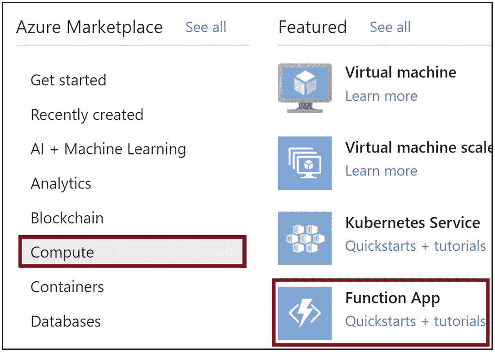
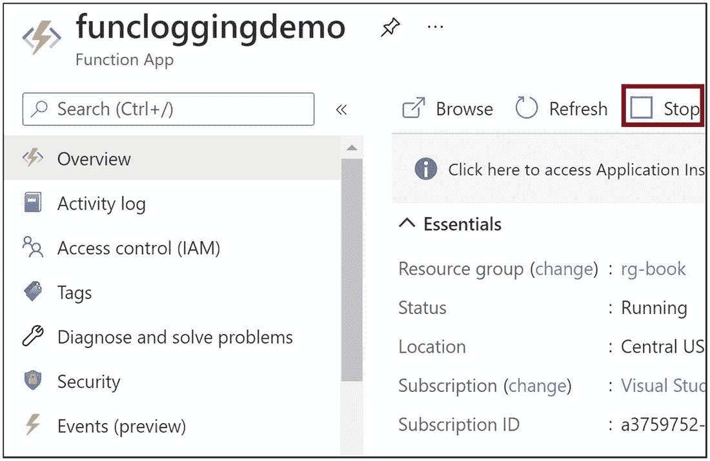
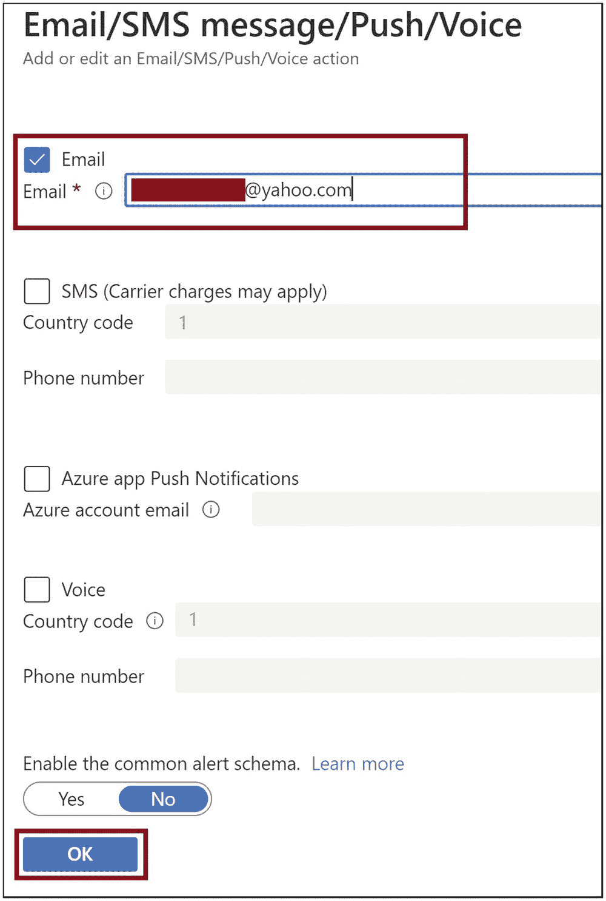

# 10.支持应用洞察和 Azure Monitor

一旦你开发了你的 Azure 功能并把它部署到生产环境中，你必须确保它总是准备好被触发时被唤醒，并按预期完成它的工作。事实上，您需要记录任何故障，并在功能关闭时获得警报。您应该有足够的日志和指标来调试生产环境中 Azure 功能的问题和意外行为。监控有助于观察 Azure 功能的执行行为，日志将为您提供适当的上下文，您可以在其中调试 Azure 功能故障和异常。

在前一章中，你学习了如何通过 Azure 函数在 Azure Cosmos DB 实例上执行 CRUD 操作。您在 Azure 函数的上下文中探索了 Azure Cosmos DB 输入和输出绑定以及 Azure Cosmos DB SDK。在本章中，你将探索如何使用 Application Insights 和 Azure Monitor 以及 Azure 函数来收集日志和指标。

## 本章的结构

在本章中，您将探索应用洞察、Azure Monitor 和 Azure 功能的以下方面:

*   使用应用洞察启用日志记录

*   为 Azure 函数执行诊断

*   监控功能和创建警报

*   限制函数应用的缩放实例数量

## 目标

学习完本章后，您将能够做到以下几点:

*   实现 Azure 功能的应用洞察

*   将 Azure Monitor 用于 Azure 功能

## 使用应用洞察启用日志记录

Azure Functions 使用 Applications Insights 为日志记录提供了出色的支持。让我们使用 Azure 门户创建一个支持应用洞察的 Azure 函数。然后，您可以修改函数代码来记录 Azure 函数的一些信息、错误和跟踪。打开 Azure 门户，点击“创建新资源”见图 [10-1](#Fig1) 。


图 10-1

单击“创建资源”

点按“计算”,然后点按“功能应用”。见图 [10-2](#Fig2) 。



图 10-2

点击功能应用

提供该功能的基本细节。让我们选择。NET 和 3.1 作为运行时堆栈和版本。点击“监控”选项卡，为 Azure function 应用启用应用洞察。见图 [10-3](#Fig3) 。


图 10-3

提供 Azure 功能的基本细节

单击“是”以启用 Application Insights 并提供 Application Insights 资源的名称。您也可以使用现有的应用洞察资源。点击“查看+创建”见图 [10-4](#Fig4) 。


图 10-4

实现应用洞察

单击创建。见图 [10-5](#Fig5) 。


图 10-5

单击创建

创建 Azure function 应用后，请转到该应用。现在你需要给 Azure function app 添加一个函数。单击函数选项卡，然后单击添加。见图 [10-6](#Fig6) 。


图 10-6

添加功能

选择“Http 触发器”并单击添加。见图 [10-7](#Fig7) 。


图 10-7

选择“Http 触发器”

创建函数后，进入函数并单击 Code + Test。参见图 [10-8](#Fig8) 。


图 10-8

单击代码+测试

用清单 [10-1](#PC1) 中的代码替换`run.csx`文件中的代码，并保存文件。在这里，您使用`LogInformation`方法记录信息，使用`LogError`方法记录错误，使用`LogWarning`方法记录警告，使用`LogCritical`方法记录严重错误。

```cs
#r "Newtonsoft.Json"

using System.Net;
using Microsoft.AspNetCore.Mvc;
using Microsoft.Extensions.Primitives;
using Newtonsoft.Json;

public static async Task<IActionResult> Run(HttpRequest req, ILogger log)
{
    // Log Information
    log.LogInformation("This is an Information.");

    // Log Trace
    log.LogError(new Exception(),"This is an Exception");

    // Log Warning
    log.LogWarning("This is a Warning");

    // Log Critical Error
    log.LogCritical("This is a Critical error");

    return new OkObjectResult("Demo Complete !!");
}

Listing 10-1Function Code with Logging Enabled

```

点击“获取功能 URL ”,在浏览器中浏览至该 URL。现在，让我们转到 Application Insights，验证是否添加了这些日志。参见图 [10-9](#Fig9) 。


图 10-9

获取函数 URL

回到 Azure function 应用，点击 Application Insights 选项卡。单击您用于此功能应用程序的 Application Insights 资源名称。您将导航至应用洞察资源。参见图 [10-10](#Fig10) 。


图 10-10

请访问应用洞察资源

单击“事务搜索”选项卡，然后单击查看日志。此操作将使用 Kusto 查询语言(KQL)生成一个查询，以获取您推送到 Application Insights 的日志。参见图 [10-11](#Fig11) 。


图 10-11

单击查看日志

运行生成的查询，您将在结果中看到您推送到 Application Insights 的日志。参见图 [10-12](#Fig12) 。


图 10-12

运行查询以获取日志

## 对 Azure 功能执行诊断

Azure 门户提供了一种自动诊断 Azure 功能问题的机制。如果你发现一个 Azure 函数没有像预期的那样响应或工作，你可以很容易地诊断这个问题并找出哪里出错了。让我们在 Azure 函数中引入一些错误。让我们使用您之前为这个演示创建的同一个 Azure 函数。修改功能代码，如清单 [10-2](#PC2) 所示。您正在使用一个名为`LogSuperCritical`的方法，它应该会抛出编译错误。

```cs
#r "Newtonsoft.Json"

using System.Net;
using Microsoft.AspNetCore.Mvc;
using Microsoft.Extensions.Primitives;
using Newtonsoft.Json;

public static async Task<IActionResult> Run(HttpRequest req, ILogger log)
{
    //Log Information
    log.LogInformation("This is an Information.");

    //Log Trace
    log.LogError(new Exception(),"This is an Exception");

    //Log Warning
    log.LogWarning("This is a Warning");

    //Introducing Compilation Error
    //There is no method as SuperCritical
    //Should throw compilation error
    log.LogSuperCritical("This is a Critical error")

    return new OkObjectResult("Demo Complete !!");
}

Listing 10-2Introduce a Compilation Error in the Function Code

```

现在让我们转到功能应用程序的概述选项卡，并停止功能应用程序。参见图 [10-13](#Fig13) 。



图 10-13

停止 Azure 功能应用

浏览到函数 URL。您应该得到一个内部 500 错误或等效的错误。现在，让我们在“诊断和解决问题”选项卡上诊断这些问题。您可以诊断以下类别的问题:

*   可用性和性能

*   配置和管理

*   SSL 和域

*   风险评估

让我们在搜索框中搜索*功能应用关闭或报告错误*。参见图 [10-14](#Fig14) 。


图 10-14

搜索要执行的适当诊断

您将在几秒钟内得到诊断结果。您可以在功能应用程序一般信息和功能应用程序执行和错误部分看到一些突出显示的问题。参见图 [10-15](#Fig15) 。


图 10-15

诊断运行报告的错误

如果向下滚动，您可以看到被报告为函数编译错误的问题。csx)。具体来说，在图 [10-16](#Fig16) 中，可以看到一个红色的感叹号在函数编译错误(。csx)部分，当您在后续步骤中进一步深入时，您可以看到有一个脚本错误突出显示为脚本编译错误。csx)。参见图 [10-16](#Fig16) 。


图 10-16

诊断运行报告了更多错误

如果您展开功能应用程序一般信息部分，您可以看到功能应用程序处于停止状态。参见图 [10-17](#Fig17) 。


图 10-17

功能应用程序一般信息部分

如果展开函数编译错误(。csx)部分，可以看到编译错误在函数代码的什么地方。参见图 [10-18](#Fig18) 。


图 10-18

函数编译错误

## 监控 Azure 功能并创建警报

您可以在 metrics 选项卡上监控您的 Azure 功能指标。转到指标选项卡。参见图 [10-19](#Fig19) 。


图 10-19

转到指标选项卡

选择一个度量和一个聚合。您将得到一个度量图表，您可以用它来分析您的函数的性能和执行。您可以在折线图、面积图、条形图和散点图之间切换。您也可以通过单击“新建图表”选项来添加新图表。参见图 [10-20](#Fig20) 。


图 10-20

监控 Azure 功能

您可以设置警报，并在 Azure 功能出现异常或偏离正常行为时收到通知。要设置提醒，请转到“提醒”选项卡，然后单击“新建提醒规则”参见图 [10-21](#Fig21) 。


图 10-21

创建新的警报规则

现在您需要配置警报的范围、条件和操作。范围指定要监视哪个 Azure 资源。条件指定要监视的内容，例如，何时删除资源，操作指定满足条件时要做的事情，例如，发送电子邮件或调用逻辑应用程序实例。确保您在范围内选择了正确的资源。如果没有，请单击“编辑资源”并选择正确的资源。单击“添加条件”配置条件。让我们监视函数应用程序进入停止状态时的情况。参见图 [10-22](#Fig22) 。


图 10-22

添加条件

搜索 *Stop Web App* 并选择。见图 [10-23](#Fig23) 。


图 10-23

配置条件

单击完成配置条件。参见图 [10-24](#Fig24) 。


图 10-24

单击完成以配置条件

现在让我们添加一个动作。单击“添加操作组”参见图 [10-25](#Fig25) 。


图 10-25

单击“添加操作组”

单击“创建操作组”参见图 [10-26](#Fig26) 。


图 10-26

创建一个行动组

为操作组提供一个名称，然后单击下一步:通知。参见图 [10-27](#Fig27) 。


图 10-27

为行动小组提供基本细节

将通知类型设置为电子邮件，并提供通知的名称。参见图 [10-28](#Fig28) 。


图 10-28

选择电子邮件

您需要配置电子邮件详细信息。提供电子邮件详细信息，然后单击确定。您可以选择短信和语音复选框，并提供国家代码和电话号码。参见图 [10-29](#Fig29) 。



图 10-29

提供电子邮件详细信息

您可以转到“操作”选项卡并配置操作。比如条件满足时运行 Azure 函数或者执行一个逻辑 App。配置操作不是强制性的。您可以单击“查看+创建”，然后单击“创建”来创建操作组。参见图 [10-30](#Fig30) 。


图 10-30

添加一个操作，然后单击“审阅+创建”

提供警报规则名称，然后单击“创建警报规则”警报被创建。您可以在总览选项卡上停止功能应用程序以获得提醒。参见图 [10-31](#Fig31) 。


图 10-31

单击“创建警报规则”

## 限制 Azure Function 应用程序的缩放实例数量

在消费计划中，底层 Azure 平台对 Azure 功能进行了扩展。每当负载激增时，它会添加新的实例，每当传入负载减少时，它会删除其他实例。您无法明确控制 Azure 功能如何在消费计划中扩展。但是，您可以定义 Azure 功能可以向外扩展的实例数量的最大限制。此操作将帮助您跟踪基础架构成本，并高效地规划 Azure function app 基础架构。要设置最大扩展限制，请转到 Azure 门户中的“横向扩展”选项卡。您可以设置最大横向扩展限制，然后单击保存。此设置将确保 Azure 功能不会超出设置的最大限制。参见图 [10-32](#Fig32) 。


图 10-32

为 Azure 功能设置最大扩展限制

## 摘要

在本章中，你学习了如何为 Azure Monitor 启用应用洞察，并为你的 Azure 函数生成日志。您了解了如何分析生成的日志并从生成的日志中排除问题。您学习了如何轻松诊断 Azure 函数的问题以及故障排除。您还了解了如何监控 Azure 函数的指标并设置警报。限制缩放实例的数量是在消费计划中运行的 Azure 函数的一个重要方面。您了解了如何限制消费计划上运行的 Azure 函数的缩放实例的数量。

以下是本章的要点:

*   可以使用`LogError`、`LogWarning`、`LogCritical`、、`LogInformation`的方法将日志推送至应用洞察。

*   你可以进入“诊断和解决问题”选项卡，诊断 Azure 功能故障。底层功能执行诊断，并为问题提供清晰的报告。

*   在 Metrics 选项卡上，基于可用的指标添加图表，然后基于指标标准监控 Azure 功能。

*   您可以在 Metrics 选项卡上添加警报，并根据您配置的异常情况获得警报。您可以设置在满足异常条件时要执行的通知和操作。

*   在“横向扩展”选项卡上，您可以指定 Azure 功能可以横向扩展到的最大实例数。

在下一章中，你将探索如何将 Azure 密钥库与 Azure 功能集成起来进行秘密管理。