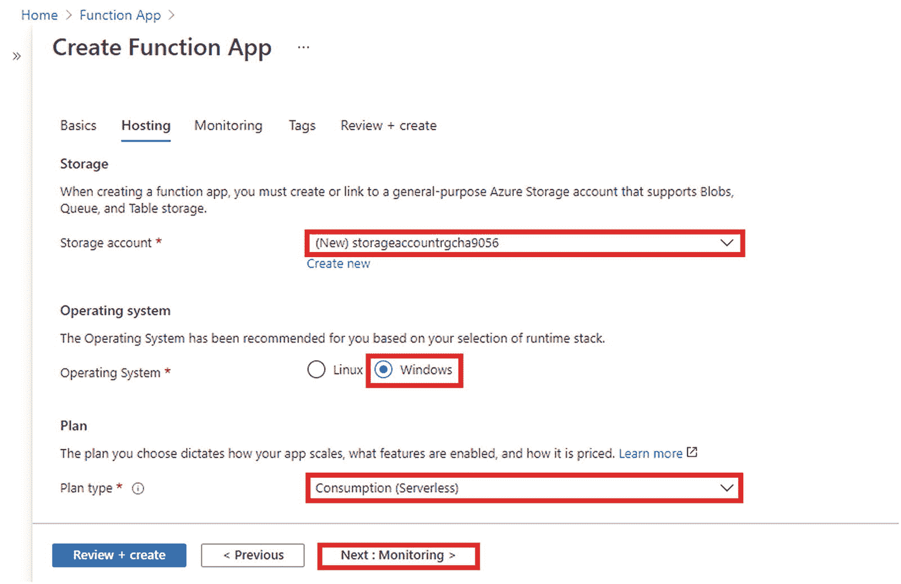
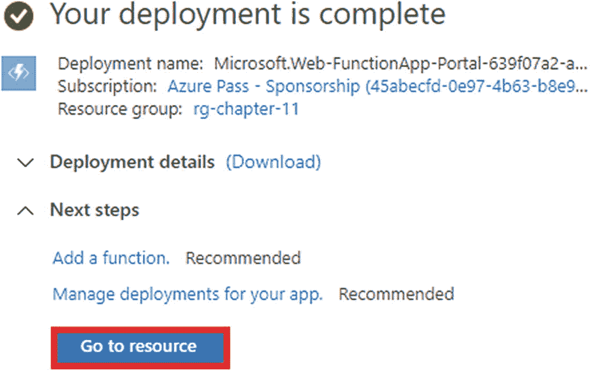
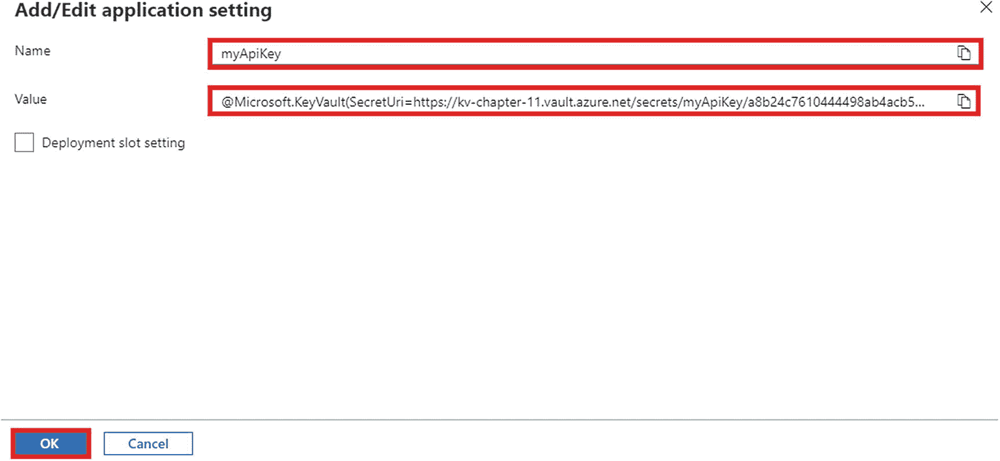

# 11.在 Azure Key Vault 中存储功能机密

在前面的章节中，我们讨论了通过在 Azure 函数中使用触发器和绑定的组合来构建无服务器解决方案以解决现实问题的方法。在某些情况下，您在解决方案中使用了其他服务，如 SendGrid、Azure Blob Storage 和 Azure SQL Database。要使用 SendGrid，您需要一个有效的 API 密钥，同时您需要连接字符串来与 Azure SQL 数据库、Azure Blob 存储和 Azure 队列存储进行交互。这些是机密，不应该暴露给任何人。有了这些信息，有人可能会对您的应用和组织造成很大的损害。

AppyMash 是一家互联网公司，以订阅方式向用户提供多种服务，从电子商务到 OTT 内容。它目前正在使用 Azure App Service 运行其应用。它一直在疯狂扩张，从两年前的一家初创公司成长为如今拥有庞大服务生态系统的互联网巨头。为了适应应用的开发速度，开发团队集成了多个 SaaS 解决方案。最近，一家提供邮件功能的 SaaS 提供商建议其所有客户(包括 AppyMash)重新生成 API 密钥，因为其数据库最近出现了安全漏洞。按照供应商的建议，AppyMash 团队决定重新生成 API 密钥。但是问题是在替换所有应用中的 API 密钥之后，重新部署所有应用的预期停机时间。应用生态系统中的几乎所有应用都受到了这一强制性修改的影响，因为它们使用 SaaS 供应商的服务来发送所有必需的邮件通信。这是一个非常耗时的过程，会影响所有尝试订购服务的新客户以及尝试更改密码或执行任何需要邮件通信的操作的现有客户。这种事件对组织的业务和声誉的影响可能是灾难性的。这种情况证明了中央秘密管理器的必要性。

在这一章中，你将看到 Azure 提供的一项名为 Key Vault 的服务，它有助于管理和存储秘密。

## 本章的结构

本章将探讨以下与 Azure 密钥库和 Azure 函数相关的主题:

*   密钥保管库入门

*   在 Azure 门户中创建保管库

*   创建访问策略

*   使用 Azure 函数从 Azure Key Vault 获取机密

## 目标

学习完本章后，您将能够做到以下几点:

*   创建一个保管库，并在那里存储您的应用机密

*   从 Azure 函数与 Azure Key Vault 交互

## Azure Key Vault 入门

Azure Key Vault 是微软提供的云服务，用于存储机密和敏感信息。它提供了一种在安全容器中以集中方式存储应用秘密和证书的方法。在 Azure Key Vault 的帮助下，开发人员不再需要依赖配置文件或环境变量来存储敏感信息。通过使用托管身份、服务主体和/或证书对应用进行身份验证，您可以使用 URL 来访问机密值。

以下是使用 Azure Key Vault 的优势:

*   它有助于减少由于任何应用机密的更改而导致的应用部署。

*   它提供了一种安全可靠的机制来存储和获取敏感信息。

*   它支持导入和生成密钥、机密和证书。

*   它提供了基于角色的机密访问策略。

在本章中，您将了解在 Azure Key Vault 中以集中和安全的方式存储您的秘密的方法。

## 在 Azure 门户中创建 Azure 密钥库

转到 Azure 门户网站。在搜索框中搜索*钥匙库*并点击。见图 [11-1](#Fig1) 。


图 11-1

搜索密钥库

单击“创建”以创建存储库。见图 [11-2](#Fig2) 。


图 11-2

创建保管库

选择用于计费的订阅，然后输入要在其中创建此资源的资源组。输入全球唯一的密钥库名称，选择最近的地区，然后选择适当的定价层。最后，单击“下一步:访问策略”见图 [11-3](#Fig3) 。


图 11-3

单击“下一步:访问策略”

如果需要，在此屏幕上选择适当的 vault 访问模型并添加访问策略。配置完所有与访问策略相关的更改后，单击下一步:网络。见图 [11-4](#Fig4) 。


图 11-4

单击下一步:网络

选择适合您的解决方案的连接方法，然后单击下一步:标记。见图 [11-5](#Fig5) 。


图 11-5

单击下一步:标签

您可以为资源添加标记，但这是可选的。这有助于对资源进行分类，并显示具有相同标签的所有资源的合并帐单。在标记中填入名称和值后，单击“下一步:查看+创建”见图 [11-6](#Fig6) 。


图 11-6

点击“下一步:审核+创建”

在此屏幕上，您将看到您在之前一系列屏幕中输入的所有配置的摘要。将对输入的配置执行验证检查。如果验证通过，则点击【创建】，如图 [11-7](#Fig7) 所示。


图 11-7

单击创建

部署完成后，单击“转到资源”见图 [11-8](#Fig8) 。


图 11-8

单击“转到资源”

## 在密钥库中存储秘密

因为您已经提供了一个保险库，所以让我们将您的 API 密匙作为一个秘密存储在那里。要保存你的秘密，在工具条中搜索*秘密*，然后点击+生成/导入，如图 [11-9](#Fig9) 所示。


图 11-9

转到机密并单击生成/导入

这里会提示您输入所需的值。默认情况下，手动将被选为上传选项。输入密码的名称，然后输入其值。在这种情况下，我在值字段中输入了**my apkey**作为名称，并输入了 **Hello@123** 作为 API 键。在本章的后面，您将使用 Azure 函数获取这个值。您还可以定义值的内容类型。此外，您可以设置激活数据和停用日期。这使您能够定义何时自动激活或停用您的秘密，而无需任何人工干预。或者，您可以通过选择“是”启用密码。在必填字段中输入所有信息后，单击创建。见图 [11-10](#Fig10) 。这将把您重定向到 secrets 屏幕，在这里您将看到您创建的秘密的名称。


图 11-10

单击创建

单击包含 myApiKey 的行以获取机密身份的值，从而获取您的机密的值。参见图 [11-11](#Fig11) 。


图 11-11

单击我的笔记本

现在点击当前版本。Azure Key Vault 维护您的秘密版本。参见图 [11-12](#Fig12) 。


图 11-12

单击当前版本

在当前版本屏幕上，您将获得与您的密码相关的所有值。您还可以在此屏幕上启用或禁用您的密码，以及设置激活或到期日期的选项。你也可以在这个屏幕上改变你的秘密值。让我们从这里复制秘密标识符值。稍后，您将使用该值从您的函数应用中获取密码的值。参见图 [11-13](#Fig13) 。


图 11-13

复制秘密标识符的值

## 在 Azure 门户中创建一个 Azure 函数

进入 Azure 门户，在搜索框中搜索*功能 app* ，点击即可。见图 [11-14](#Fig14) 。


图 11-14

点击功能应用

点击创建，创建新的功能 app。参见图 [11-15](#Fig15) 。


图 11-15

单击创建

现在，您需要输入订阅名称、资源组和功能应用名称，这些名称必须是全局唯一的。选择代码作为发布选项。NET 作为运行时堆栈，3.1 作为版本。根据您的要求选择最近的地区。填写完所有必需的信息后，点击下一步:托管。参见图 [11-16](#Fig16) 。


图 11-16

点击下一步:托管

在当前屏幕上，您必须选择一个现有的存储帐户或创建一个新帐户。默认情况下，门户会为您填充一个具有随机名称的新存储帐户。当您为此功能应用单击“创建”时，它将创建存储帐户。选择 Windows 作为操作系统，选择“消耗(无服务器)”作为计划类型。现在点击下一步:监控。参见图 [11-17](#Fig17) 。



图 11-17

单击下一步:监控

为启用应用洞察选择是，然后单击下一步:标记。参见图 [11-18](#Fig18) 。


图 11-18

单击下一步:标签

您可以为资源添加标记，但这是可选的。在标记中填入名称和值后，单击“下一步:查看+创建”参见图 [11-19](#Fig19) 。


图 11-19

点击“下一步:审核+创建”

在下一个屏幕上，如图 [11-20](#Fig20) 所示，您将看到您在之前屏幕中输入的所有配置值的汇总。将对配置值进行验证检查。成功通过验证后，单击创建。


图 11-20

单击创建

部署完成后，单击“转到资源”参见图 [11-21](#Fig21) 。



图 11-21

单击“转到资源”

单击侧面菜单中的功能，然后单击+添加。参见图 [11-22](#Fig22) 。


图 11-22

点击+添加

因为您将在门户本身中开发您的功能，所以让我们为开发环境选择“在门户中开发”。选择“Http 触发器”作为模板。然后点击添加创建 Azure 函数。这将创建一个名为 HttpTrigger1 的现成 Azure 函数。参见图 [11-23](#Fig23) 。


图 11-23

单击添加

HttpTrigger1 函数将有样板代码来返回一条消息以及在查询字符串或请求正文有效负载中传递的名称。可以点击 Code + Test 查看函数的代码。要向此函数发送请求，请单击“获取函数 URL”以获取此函数的 Url。您可以将此 URL 粘贴到浏览器选项卡中以发送请求。参见图 [11-24](#Fig24) 。


图 11-24

单击代码+测试

选择 Code + Test 并使用清单 [11-1](#PC1) 中所示的代码修改函数的代码。在这里，您正在读取应用设置中存在的 API 键的值，然后将它作为响应返回给用户。

```cs
using System.Net;
using Microsoft.AspNetCore.Mvc;
using Microsoft.Extensions.Primitives;

public static async Task<IActionResult> Run(HttpRequest req, ILogger log)
{
    var apiKey = System.Environment.GetEnvironmentVariable("myApiKey");
    log.LogInformation(apiKey);
    return new OkObjectResult(apiKey);
}

Listing 11-1Function Code to Fetch Value of Secret from Key Vault

```

该函数将在应用设置中查找名为`myApiKey`的键，然后获取其值。让我们在应用设置中添加`myApiKey`的键值对。回到功能 app 屏幕；然后点按“设置”边栏中的“配置”。现在单击“+ New application”设置来添加一个新的键值对。见图 [11-25](#Fig25) 。


图 11-25

单击“+新应用设置”

现在输入**my apkey**作为名字，输入**@微软。key vault(secret uri =*****{输入秘密标识符的值}*** )作为值。这定义了该值的来源是密钥库，并且每当该函数想要获得该密钥的值时，它使用秘密标识符在密钥库中查找该值。输入值后，单击 OK，然后在配置屏幕上单击 Save 保存键-值对。参见图 [11-26](#Fig26) 。



图 11-26

单击确定

让我们使用 HttpTrigger1 函数的函数 URL 向该函数发送一个请求，以获取 app secret。您可以通过转到函数，选择 HttpTrigger1，然后单击获取函数 URL 来获取函数 URL。获得函数 URL 后，让我们将 URL 粘贴到浏览器选项卡中，并按 Enter 键以获得函数的响应。

正如您在图 [11-27](#Fig27) 中所看到的，您得到了您在应用设置中输入的`myApiKey`的值，该值应该是从密钥库中获取的。


图 11-27

来自函数的响应

你可能想知道为什么你不明白这个秘密的价值。您输入了秘密标识符。您的函数应该能够从密钥库中获取值。但是因为你没有允许这个功能应用访问密钥库，所以它无法获得存储在库中的密码的值。在下一节中，您将了解如何配置访问策略，以允许 function app 访问密钥库中的秘密。

## 为 Azure Key Vault 添加访问策略

要允许从功能应用访问您的密钥库，您必须为您的功能应用创建用户分配的身份，然后在密钥库中添加此应用的访问策略。

去功能 app。点按边栏的“设置”部分中的“身份”。然后将系统分配的身份的状态设置为打开，并单击保存。这将在 Azure Active Directory 中注册你的应用。注册后，该功能将获得访问 Azure Active Directory 保护的资源的权限。Azure Key Vault 在 Azure Active Directory 服务主体的帮助下进行身份验证。Azure Active Directory 的服务主体可以是用户或应用服务主体，也可以是资源的托管身份。在这种情况下，您可以通过在系统分配的身份中启用状态来为您的功能应用创建服务主体。参见图 [11-28](#Fig28) 。


图 11-28

创建系统分配的托管身份

现在去钥匙库。单击“访问策略”，然后单击添加访问策略。参见图 [11-29](#Fig29) 。


图 11-29

点击+添加访问策略

现在，你必须按照图 [11-30](#Fig30) 所示的顺序填写所有需要的信息。为“秘密权限”选择“获取”遵循最小特权原则，您在这个访问策略中只授予了 Get 权限。对于“选择主体”，请单击“未选择”这将打开主屏幕。在搜索框中搜索功能应用 *chapter-11-func-app* ，然后选择它。这将在访问策略中添加对功能 app 的服务主体的引用。现在，单击 Add 添加该访问策略。这将重定向到访问策略窗口。您必须单击此处的保存来保存访问策略。见图 [11-30](#Fig30) 。


图 11-30

单击添加

Note

如果您想要更新或删除机密的权限，那么您可以添加一个权限，如 Set 或 delete。

现在，您的函数应该能够访问存储在保险库中的机密值，因为您已经创建了一个访问策略，通过添加函数应用的服务主体来授予函数获取机密的权限。

让我们回到您向 HttpTrigger1 函数发送请求的选项卡。让我们刷新浏览器，看看反应。见图 [11-31](#Fig31) 。


图 11-31

来自函数的响应

如图 [11-31](#Fig31) 所示，您的函数这次能够返回存储在保险库中的秘密的值。所以，你已经成功地构建了一个 Azure 函数来从一个金库中获取秘密。如果您想要更新您的功能应用或其他使用 API 密钥的应用所使用的 API 密钥，您只需修改密钥库中的密钥值，而不是通过转到所有这些应用的应用设置来修改值 API 密钥。

## 摘要

在本章中，您学习了如何使用 Azure 门户创建密钥库，在库中存储机密，创建访问策略，以及使用您的函数获取 Azure 密钥库中存储的机密值。虽然应用设置提供了一种机制来减少由应用机密更改引起的部署，但当您在多个应用中使用公共应用机密(如特定服务的连接字符串或 API 密钥)时，更改所有应用的应用设置值将是一项繁琐的任务。当你需要在一个地方修改秘密的值时，Azure Key Vault 就派上了用场。此外，Azure Key Vault 使用 Azure Active Directory 提供了基于角色的访问机制，它不允许应用或未经授权的资源/用户直接访问机密。在下一章，我们将讨论使用 Azure Active Directory 在您的函数中启用身份验证和授权的方法。