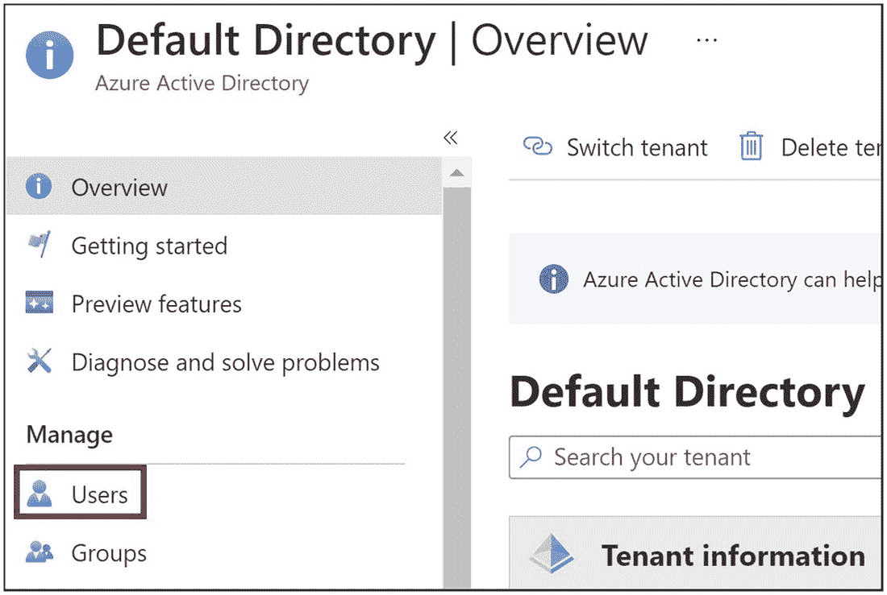
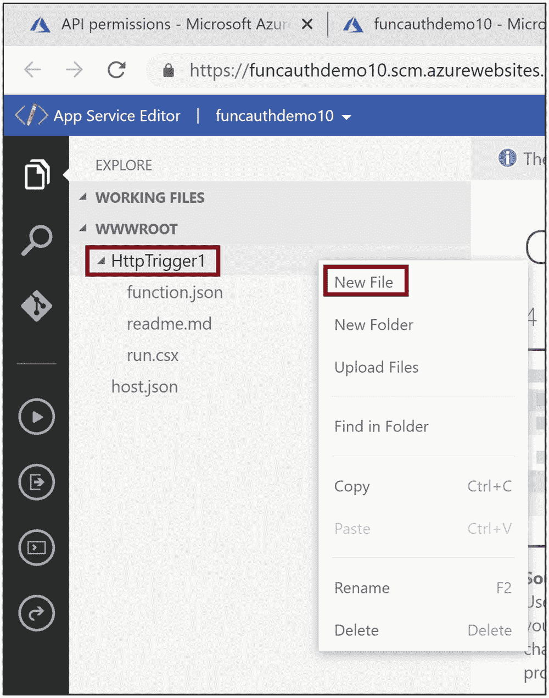

# 12.使用 Azure Active Directory 进行身份验证和授权

你可以使用 HTTP 触发的 Azure 函数来构建 API。这些 API 可以与数据库交互，或者执行任务关键的业务逻辑。保护这些 API 非常重要。HTTP 触发的 Azure 函数应该对经过身份验证的用户可用，并执行用户有权执行的操作/方法。Azure Active Directory 是 Azure 平台上的身份和访问管理解决方案。您可以轻松地将 HTTP 触发的 Azure 功能与 Azure Active Directory 集成，并支持您所有的身份验证和授权需求。

在前一章中，你学习了如何在 Azure Key Vault 中保护 Azure 函数使用的秘密和凭证。本章将探讨如何使用 Azure Active Directory 保护对 HTTP 触发的 Azure 功能的访问。

## 本章的结构

在本章中，您将探索 Azure 功能和 Azure Active Directory 的以下方面:

*   什么是 Azure 活动目录

*   什么是身份验证和授权

*   使用 Azure Active Directory 实现 Azure 功能的身份验证和认证

## 目标

学习完本章后，您将能够做到以下几点:

*   使用 Azure Active Directory 实现 HTTP 触发的 Azure 功能的身份验证

*   使用 Azure Active Directory 实现对 HTTP 触发的 Azure 功能的授权

## 什么是 Azure Active Directory？

Azure Active Directory 是 Azure 平台上的多租户身份和访问管理系统。您可以构建内部和基于云的应用程序，并利用 Azure Active Directory 进行身份管理。数以千计的基于 SaaS 的应用程序，如微软 365、Dynamics CRM 等，都利用 Azure Active Directory 作为他们的安全支柱。Azure Active Directory 可用于为访问 Azure 资源的用户带来审计和治理。开发人员可以使用 Azure Active Directory 为他们的应用程序实现单点登录和多因素身份验证。

自动化是 Azure 中资源供应的一个重要方面。你可以使用 Azure PowerShell 或 Azure CLI 或任何其他基础设施即代码解决方案，如 Terraform，通过自动化与 Azure Active Directory 交互并使用它。您可以编写自动化来管理应用程序的基本安全方面，例如用户登录审核、未经授权的访问尝试等等。

以下是 Azure Active Directory 的一些关键功能:

*   支持单点登录和多因素身份验证。

*   管理基于云 SaaS 的应用程序和内部应用程序的身份验证和授权。

*   丰富的 SDK 对身份和访问管理的支持，可以与使用。NET、Java、Angular 等等，比如 MSAL 库。基于. NET 的应用程序和用于基于 Java 的应用程序的 MSAL4J 库。

*   为企业对企业(B2B)和企业对客户/消费者(B2C)应用程序提供企业级身份和访问管理解决方案。它支持外部身份提供者，如脸书、Twitter、Google 或任何其他支持 OAuth 1.0、OAuth 2.0、OpenID Connect 和 SAML 协议的身份提供者。

*   为您的公司管理设备。

*   提供域服务并促进 Azure 虚拟机加入域，而无需域控制器。

*   为您的应用程序的安全性和访问用途提供治理和报告。

*   支持基于角色的身份验证。

*   支持调用强大的 Microsoft Graph APIs。

## 什么是身份验证和授权？

您的应用程序应该识别谁在试图访问并控制用户可以访问什么。应该禁止对应用程序的所有未经授权的访问。身份验证检查用户是谁。它要求用户提供身份，如果要求成功，应用程序将识别用户并验证用户的身份。授权规定了一个被识别的用户可以在应用程序中做什么。作为一个良好的实践，您可以创建*角色*，它定义了一个经过身份验证的用户在应用程序中可以做什么。您可以为用户分配多个角色。例如，一个应用程序有两个角色:管理员和用户。所有被分配了管理员角色的用户都可以向应用程序提供他们的凭据并获得身份验证。然后，他们可以访问和处理应用程序中的所有管理页面。同样，当拥有用户角色的用户登录到系统时，他将不能访问管理页面，只能访问应用程序的用户页面。综上所述，认证验证用户是谁，授权规定用户可以做什么，如图 [12-1](#Fig1) 所示。


图 12-1

认证和授权流程

## 使用 Azure Active Directory 实现 Azure 功能的身份验证和认证

Azure Functions 使用应用洞察为日志记录提供了出色的支持。让我们使用 Azure 门户创建一个支持应用洞察的 Azure 函数。然后，您可以修改函数代码来记录 Azure 函数的一些信息、错误和跟踪。打开 Azure 门户，点击“创建资源”见图 [12-2](#Fig2) 。


图 12-2

单击“创建资源”

点按“计算”,然后点按“功能应用”。见图 [12-3](#Fig3) 。


图 12-3

点击功能应用

提供该功能的基本细节。让我们选择。NET 和 3.1 作为运行时堆栈和版本。点击“查看+创建”见图 [12-4](#Fig4) 。


图 12-4

提供 Azure 功能的基本细节

单击创建。见图 [12-5](#Fig5) 。


图 12-5

单击创建

创建 Azure function 应用后，请转到该应用。现在你需要给 Azure function app 添加一个函数。单击函数选项卡，然后单击添加。见图 [12-6](#Fig6) 。


图 12-6

添加功能

选择“Http 触发器”并单击添加。见图 [12-7](#Fig7) 。


图 12-7

选择“Http 触发器”

一旦函数被创建，进入函数并点击 Code + Test。见图 [12-8](#Fig8) 。


图 12-8

单击代码+测试

单击获取函数 URL，并在浏览器中浏览到该 Url。现在，让我们转到 Application Insights，验证是否添加了这些日志。参见图 [12-9](#Fig9) 。


图 12-9

单击获取功能 Url

现在让我们为 Azure 函数启用身份验证。回到功能 app，点击认证。参见图 [12-10](#Fig10) 。


图 12-10

转到身份验证选项卡

单击“添加身份提供者”以添加将用于对 Azure 功能进行身份验证的提供者。参见图 [12-11](#Fig11) 。


图 12-11

配置身份提供者

将身份提供者设置为 Microsoft。然后选择“创建新的应用程序注册”作为应用程序注册类型，并选择“当前租户-单租户”作为支持的帐户类型。为将在 Azure Active Directory 租户中创建的应用程序提供名称。参见图 [12-12](#Fig12) 。


图 12-12

配置 Microsoft 身份提供者

向下滚动并进行必要的配置，如图 [12-13](#Fig13) 所示。单击添加。


图 12-13

添加 Microsoft 身份提供者

现在已经为应用程序配置了身份验证。以匿名或私人浏览模式浏览您之前复制的功能 URL。它会提示您提供凭据。您可以使用登录 Azure 门户时使用的相同凭据。参见图 [12-14](#Fig14) 。


图 12-14

输入您的凭据

现在让我们配置授权。您需要检查登录用户是否配置了访问该页面所需的角色。Microsoft Graph API 可以帮助您获取用户在 Azure Active Directory 中的角色。让我们转到您创建的 Azure Active Directory 应用程序，并为 Azure Active Directory 添加必要的权限。转到 Azure 门户主页并导航到 Azure Active Directory。点击“应用程序注册”然后单击您在为 Azure 函数启用身份验证时创建的应用程序。参见图 [12-15](#Fig15) 。


图 12-15

转到“应用程序注册”

点按“API 权限”标签，然后点按“添加权限”参见图 [12-16](#Fig16) 。


图 12-16

单击“添加权限”

提供图 [12-17](#Fig17) 中列出的所有必要权限，并点击“授予默认目录的管理员许可”


图 12-17

添加所有权限并授予管理员许可

您将授权所有具有应用程序开发人员角色的用户。让我们转到 Azure Active Directory 中的用户选项卡。参见图 [12-18](#Fig18) 。



图 12-18

转到用户选项卡

单击您将登录的用户。您可以选择使用您在 Azure 门户中登录的用户。参见图 [12-19](#Fig19) 。


图 12-19

单击用户

单击“分配的角色”选项卡。此操作将列出分配给用户的所有角色。单击“添加任务”并添加“应用程序开发人员”角色。添加角色后，单击用户角色列表中的“应用程序开发人员”角色。此操作将导航至角色详细信息。参见图 [12-20](#Fig20) 。


图 12-20

为用户分配角色

单击描述选项卡并复制模板 ID。您将在函数代码中的 Graph API 调用中使用它来提取被分配了该角色的所有用户。参见图 [12-21](#Fig21) 。


图 12-21

复制角色的模板 ID

现在让我们回到你之前创建的 Azure 函数。您需要添加必要的代码来启用授权。您可以使用 NuGet 包`Microsoft.IdentityModel.Clients.ActiveDirectory`添加授权。要向函数脚本添加 NuGet 包，需要在函数的根文件夹中创建一个`function.proj`文件，并为这个 NuGet 包添加包引用。您可以使用应用服务编辑器添加新文件。单击应用程序服务编辑器选项卡，然后单击转到。见图 [12-22](#Fig22) 。


图 12-22

转到应用服务编辑器

右键单击具有您的函数名的文件夹，然后单击“新建文件”。参见图 [12-23](#Fig23) 。



图 12-23

创建 Function.proj 文件

提供文件名为`Function.proj`。将清单 [12-1](#PC1) 中的代码复制到`Function.proj`文件中，如清单 [12-1](#PC1) 所示。它会自动保存。

```cs
<Project Sdk="Microsoft.NET.Sdk">
    <PropertyGroup>
        <TargetFramework>netstandard2.0</TargetFramework>
    </PropertyGroup>

    <ItemGroup>
        <PackageReference Include="Microsoft.IdentityModel.Clients.ActiveDirectory" Version="5.2.9" />

    </ItemGroup>
</Project>

Listing 12-1Function.proj Code

```

现在让我们转到`run.csx`文件中的 Azure 函数代码，并用清单 [12-2](#PC2) 中所示的代码替换现有代码。在这里，您将获得登录用户的身份。然后，从身份中提取登录用户的用户名。您正在调用 Microsoft Graph API 并获取所有被分配了“应用程序开发人员”角色的用户。Microsoft Graph API 公开了一组 REST APIs，这些 API 将帮助您处理 Microsoft 云服务(如 Microsoft 365、Azure Active Directory 等)上的数据。你可以在 Azure Active Directory 中获取并处理关于用户的数据，或者从 Microsoft 365 服务(如 OneDrive、日历或 Outlook 等)中获取数据。如果在 Microsoft Graph API 调用返回的列表中找到登录用户的用户名，您将授权该用户并返回文本“Hello World”如果用户不在 Microsoft Graph API 调用返回的列表中，您将发回“未授权”文本。请确保您将`{RoleTemplateId}`替换为之前在“应用程序开发人员”角色的 Description 选项卡中为该角色复制的模板 ID。

```cs
#r "Newtonsoft.Json"

using System.Net;
using System.Text;
using System.Configuration;
using System.Security.Claims;
using System.Net.Http;
using System.Net.Http.Headers;
using Newtonsoft.Json;
using Microsoft.IdentityModel.Clients.ActiveDirectory;
using Microsoft.AspNetCore.Mvc;

public static async Task<IActionResult > Run(
    HttpRequest req,
    ILogger log)
{
    // Get identity for logged in user
    var identity = req.HttpContext?.User?.Identity as ClaimsIdentity;
    var claims = identity.Claims;
    var roleClaimType = identity.RoleClaimType;
    var roles = claims.Where(c => c.Type == roleClaimType).ToList();
    log.LogInformation(roles.Count.ToString());
    log.LogInformation("IsAuthenticated: {isAuthenticated}",identity?.IsAuthenticated);
    log.LogInformation("Identity name: {name}",identity?.Name);
    log.LogInformation("AuthenticationType: {authenticationType}",
        identity?.AuthenticationType);
    var userName = "";
    foreach (var claim in identity?.Claims)
    {
        log.LogInformation("Claim: {type} : {value}", claim.Type, claim.Value);
        //Get logged in user name
        if(claim.Type == "preferred_username")
        {

            userName = claim.Value;
        }
    }
    var accessToken = req.Headers.SingleOrDefault(h => h.Key == "X-MS-TOKEN-AAD-ACCESS-TOKEN").Value;
    log.LogInformation(accessToken);

    // Call the graph API to get all the users having Role : Application Developer
    // Provide the template id for the Role that we have copied from the Role Description
    // in Azure Active Directory
    string graphRequest = $"https://graph.microsoft.com/v1.0/directoryRoles/roleTemplateId=cf1c38e5-3621-4004-a7cb-879624dced7c/members";
    var authHeader = "Bearer " + accessToken;
    HttpClient client = new HttpClient();

    client.DefaultRequestHeaders.TryAddWithoutValidation("Authorization", authHeader);
    var response = await client.GetAsync(new Uri(graphRequest));

    string content = await response.Content.ReadAsStringAsync();
    log.LogInformation(content);

    // Deserialize the JSON string into Root object
    Root myDeserializedClass = JsonConvert.DeserializeObject<Root>(content);

    // Loop through all the values returned by Graph API
    // Verify if the logged-in username is there in the list
    foreach(Value value in myDeserializedClass.Value )
    {

        log.LogInformation(value.UserPrincipalName);
        //check if the user name returned matches with the logged
        //in username
        if(value.UserPrincipalName == userName)
        {
            return new OkObjectResult("Hello World");
        }
    }
    return new OkObjectResult("Not Authorized");
}

public class Value
    {
        [JsonProperty("@odata.type")]
        public string OdataType { get; set; }

        [JsonProperty("id")]
        public string Id { get; set; }

        [JsonProperty("businessPhones")]
        public List<object> BusinessPhones { get; set; }

        [JsonProperty("displayName")]
        public string DisplayName { get; set; }

        [JsonProperty("givenName")]
        public object GivenName { get; set; }

        [JsonProperty("jobTitle")]
        public object JobTitle { get; set; }

        [JsonProperty("mail")]
        public object Mail { get; set; }

        [JsonProperty("mobilePhone")]
        public object MobilePhone { get; set; }

        [JsonProperty("officeLocation")]
        public object OfficeLocation { get; set; }

        [JsonProperty("preferredLanguage")]
        public object PreferredLanguage { get; set; }

        [JsonProperty("surname")]
        public object Surname { get; set; }

        [JsonProperty("userPrincipalName")]
        public string UserPrincipalName { get; set; }
    }

    public class Root
    {
        [JsonProperty("@odata.context")]
        public string OdataContext { get; set; }

        [JsonProperty("value")]
        public List<Value> Value { get; set; }
    }

Listing 12-2Function Code with Authorization Enabled

```

## 摘要

在本章中，您学习了如何使用 Azure Active Directory 为 Azure 功能启用身份验证和授权。您在很高的层次上探索了 Azure Active Directory 及其产品。您学习了身份验证和授权的基本概念。然后，您从 Azure 功能的身份验证选项卡在 Azure Active Directory 中注册了一个应用程序，然后轻松地为 Azure 功能启用了身份验证和授权。

以下是本章的要点:

*   Azure Active Directory 是 Azure 平台上的多租户身份和访问管理系统。

*   身份验证验证用户是谁，授权指示用户可以做什么。

*   只需在 Azure 功能的身份验证选项卡中点击几下，即可启用身份验证。

*   启用身份验证会在 Azure Active Directory 中创建一个应用注册。

*   我们可以使用图形 API 来获取用户的登录角色。

在下一章中，你将探索如何将 API 管理服务与 Azure 函数集成，并使用 Azure 函数构建一个安全且健壮的 API 服务。