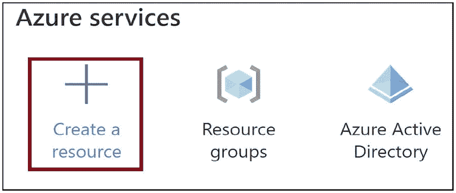
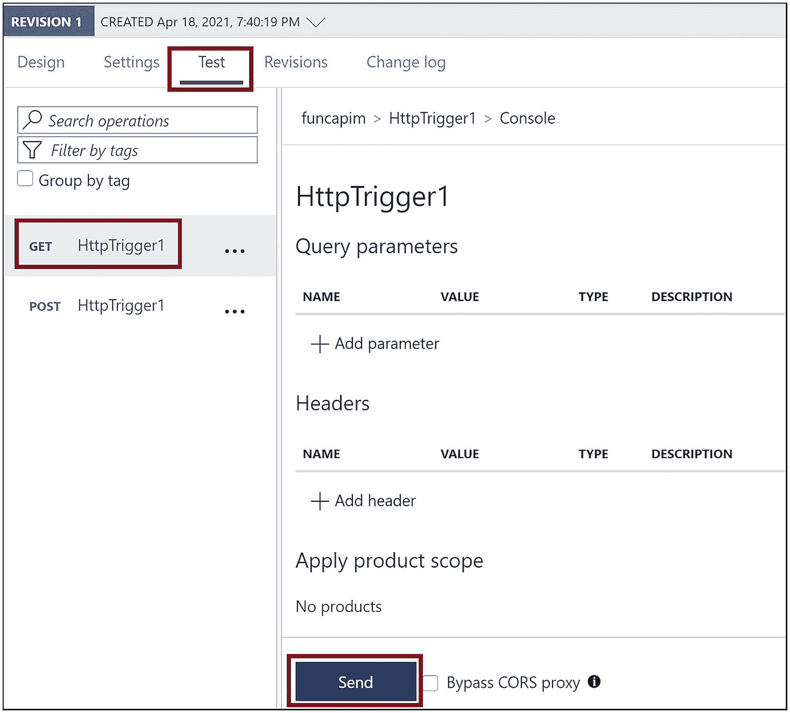
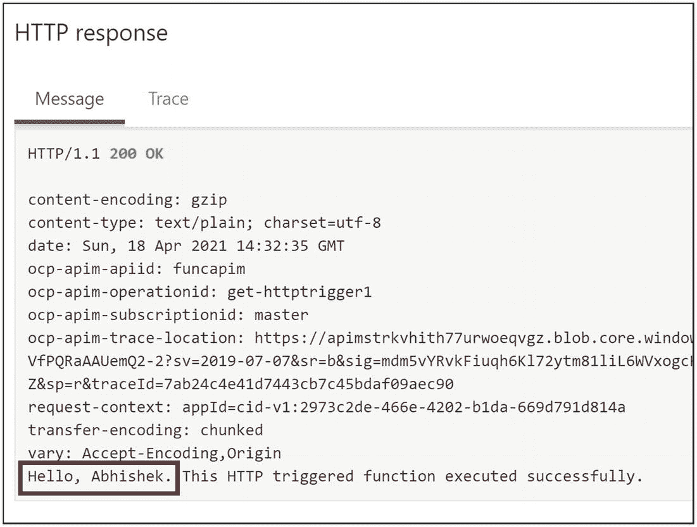

# 13.通过 API 管理保护 Azure 功能

你可以使用 HTTP 触发的 Azure 函数来构建 API。这些 API 与数据库交互并执行 CRUD 操作。您需要对使用 Azure 函数开发的 API 的传入请求和传出响应进行粒度控制。保护这些 API 并控制 API 调用的头、体和其他必要方面是非常重要的。您应该能够控制谁可以使用这些 API，并且只有订阅的开发人员才能访问它们。所有这些需求都可以通过集成 API 管理服务和 HTTP 触发的 Azure 功能来实现。所有对 HTTP 触发的 Azure 函数的请求和响应都应该通过 API 管理服务。您可以使用 API 管理在粒度级别控制这些请求和响应。

在前一章中，你学习了如何使用 Azure Active Directory 保护 HTTP 触发的 Azure 功能。在本章中，你将学习如何使用 API 管理服务获得对 HTTP 触发的 Azure 函数的请求和响应的细粒度控制。

## 本章的结构

在本章中，你将探索 Azure 功能和 Azure API 管理的以下方面:

*   什么是 Azure API 管理

*   使用 API 管理的优势

*   将 API 管理与 Azure 功能集成

## 目标

学习完本章后，您将能够做到以下几点:

*   了解 API 管理服务

*   将 API 管理服务与 Azure 功能集成

## 什么是 API 管理服务？

API 管理服务帮助您创建可以托管后端 API 的健壮的 API 网关。它帮助您获得对后端 API 的请求和响应的粒度控制。想要使用您的 API 的开发人员可以请求 API 订阅，API 管理服务管理员或所有者可以批准这些请求。一旦请求被批准，开发人员就可以使用 API 了。您可以使用 API 管理服务对 API 进行版本化，并将这些 API 公开为多个版本。开发者和消费者可以根据他们的需求订阅该版本。

API 管理服务公开了一个开发人员门户，开发人员可以在其中发现他们需要的服务并获得 API 文档。开发人员可以在开发人员门户中提出对 API 的订阅请求。开发者门户是完全可定制的，并且可以根据您的需要修改外观。

不同的单位或项目团队可以在您的组织中开发 API。您可以使用 API 管理服务来集中管理和公开这些 API。您可以修改 API 的传入请求和传出响应。例如，修改响应正文，检查 JWT 安全令牌是否在请求头中，或者向请求添加查询字符串参数。

您可以使用 Azure HTTP 触发的功能和 API 管理服务来构建基于微服务的 API。

## 使用 API 管理服务的优势

以下是使用 API 管理服务的一些优势:

*   集中托管由不同团队使用不同技术选择构建的 API。

*   将 API 公开为订阅和版本，供开发人员/消费者订阅和使用。

*   每个托管的 API 都可以独立扩展，并保证不会出现其他 API 的故障。

*   提供了一种出色的机制来管理后端服务，并获得对 API 请求和响应的粒度控制。

*   增强了后端 API 的安全性。

*   它提供了一个开发者门户，有助于 API 的发现、描述和订阅。

## 将 API 管理与 Azure 功能集成

让我们创建一个 HTTP 触发的 Azure 函数，并将其与 API 管理服务集成。打开 Azure 门户，点击“创建资源”见图 [13-1](#Fig1) 。


图 13-1

单击“创建资源”

点按“计算”,然后点按“功能应用”。见图 [13-2](#Fig2) 。


图 13-2

点击功能应用

提供该功能的基本细节。让我们选择。NET 和 3.1 作为运行时堆栈和版本。点击“查看+创建”见图 [13-3](#Fig3) 。


图 13-3

提供 Azure 函数的基本细节

单击创建。见图 [13-4](#Fig4) 。


图 13-4

单击创建

创建 Azure function 应用后，转到该应用。现在你需要给 Azure function app 添加一个函数。单击函数选项卡，然后单击添加。见图 [13-5](#Fig5) 。


图 13-5

添加功能

选择“Http 触发器”并单击添加。见图 [13-6](#Fig6) 。


图 13-6

选择“Http 触发器”

一旦创建了函数，进入函数并单击 Code + Test。见图 [13-7](#Fig7) 。


图 13-7

单击代码+测试

你可以看到清单 [13-1](#PC1) 中的代码是默认生成的。您可以在查询字符串中传递`name`参数及其值，函数将返回您在`name`参数中传递的值。如果您没有在查询字符串中传递`name`参数，它将返回一条消息，要求您在查询字符串中传递带有值的`name`参数。

```cs
#r "Newtonsoft.Json"

using System.Net;
using Microsoft.AspNetCore.Mvc;
using Microsoft.Extensions.Primitives;
using Newtonsoft.Json;

public static async Task<IActionResult> Run(HttpRequest req, ILogger log)
{
    log.LogInformation("C# HTTP trigger function processed a request.");

    string name = req.Query["name"];

    string requestBody = await new StreamReader(req.Body).ReadToEndAsync();
    dynamic data = JsonConvert.DeserializeObject(requestBody);
    name = name ?? data?.name;

    string responseMessage = string.IsNullOrEmpty(name)
    ? "This HTTP triggered function executed successfully. Pass a name in
    the query string or in the request body for a personalized response."
    : $"Hello, {name}. This HTTP triggered function executed successfully.";
      return new OkObjectResult(responseMessage);
}

Listing 13-1Function.proj Code

```

现在让我们创建 API 管理服务。转到 Azure 门户，点击“创建资源”见图 [13-8](#Fig8) 。



图 13-8

单击“创建资源”

单击集成选项卡，然后单击 API 管理。见图 [13-9](#Fig9) 。


图 13-9

单击 API 管理

提供订阅详细信息、资源组、API 管理服务的名称、需要创建服务的位置以及其他必要的详细信息。为“定价层”选择“开发商(无 SLA)”单击“查看+创建”，然后在随后的屏幕上单击创建。参见图 [13-10](#Fig10) 。


图 13-10

点击查看+创建

创建 API 管理服务后，导航到门户中的服务。单击 API 选项卡。见图 [13-11](#Fig11) 。


图 13-11

转到 API 选项卡

在 API 选项卡上选择功能应用。您将把后端服务配置为您之前创建的功能应用。参见图 [13-12](#Fig12) 。


图 13-12

选择功能应用

现在，您需要选择需要与 API 管理服务集成的功能。单击浏览。参见图 [13-13](#Fig13) 。


图 13-13

单击浏览

点击功能 App。参见图 [13-14](#Fig14) 。


图 13-14

点击功能应用

选择需要配置为后端服务的功能 app。参见图 [13-15](#Fig15) 。


图 13-15

选择功能应用

在选中的函数 app 中选择需要公开为后端服务的函数。单击选择。参见图 [13-16](#Fig16) 。


图 13-16

选择要作为后端服务公开的功能

提供后端服务的显示名称和名称，然后单击创建。参见图 [13-17](#Fig17) 。


图 13-17

创建后端服务

转到您创建的 API 后端，然后单击“添加策略”参见图 [13-18](#Fig18) 。


图 13-18

添加策略

您可以设置一个名为`name`的查询参数，如果用户没有提供`name`参数，则在传入的请求中提供一个默认值。如果用户在请求中提供了`name`参数，它将跳过添加查询参数。参见图 [13-19](#Fig19) 。


图 13-19

为查询参数设置策略

添加查询参数名称，并提供默认值而不是默认名称。将动作设置为“跳过”，以免覆盖用户传递的`name`参数。单击保存。见图 [13-20](#Fig20) 。


图 13-20

提供要添加到请求的查询参数

现在让我们测试您配置的 API 管理服务。转到测试选项卡。选择获取方法，然后单击发送。见图 [13-21](#Fig21) 。



图 13-21

向 API 管理服务发送不带查询参数的请求

这里没有传递任何查询字符串参数。API 管理服务将在请求中添加值为 Default Name 的`name`参数，您将在响应中获得默认名称。见图 [13-22](#Fig22) 。


图 13-22

来自 API 管理服务的响应

现在让我们添加一个带有值的查询字符串名称。单击发送。见图 [13-23](#Fig23) 。


图 13-23

在请求中提供查询参数

API 管理服务不会覆盖`name`参数中的值，并且您会得到在参数名称中发送的值。见图 [13-24](#Fig24) 。



图 13-24

来自 API 管理服务的响应

## 摘要

在本章中，你学习了如何配置一个 HTTP 触发的 Azure 函数作为 Azure API 管理服务的后端 API。您在很高的层次上探索了 Azure API 管理服务及其产品。您了解了如何控制一个 API 的请求和响应，该 API 被配置为 API 管理服务的后端 API。您添加了一个策略，为 API 管理服务中的传入请求添加查询参数。

以下是本章的要点:

*   API 管理服务帮助您控制 HTTP 触发的 Azure 功能的传入请求和传出响应，这些功能在粒度级别上配置为后端 API。

*   它增强了 Azure 函数的安全性。

*   API 管理服务公开了一个开发人员门户，开发人员可以在其中发现他们需要的服务，订阅它，并获得 API 文档。

*   您可以使用 Azure HTTP 触发的功能和 API 管理服务来构建基于微服务的 API。

在下一章中，你将探索如何使用编辑器(如 Visual Studio IDE 和 Visual Studio 代码)将函数代码部署到 Azure 函数中。