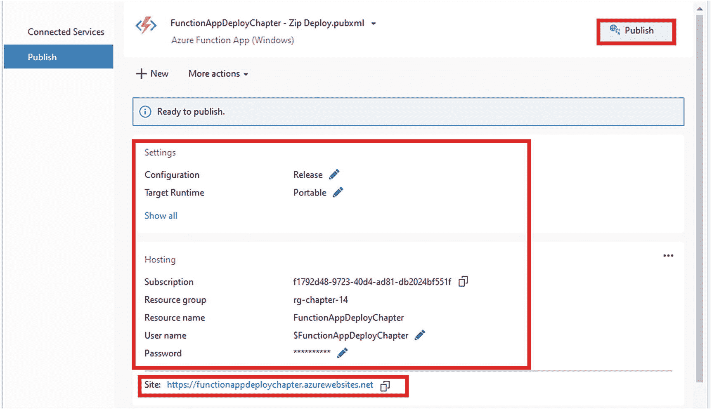
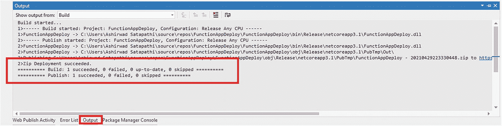
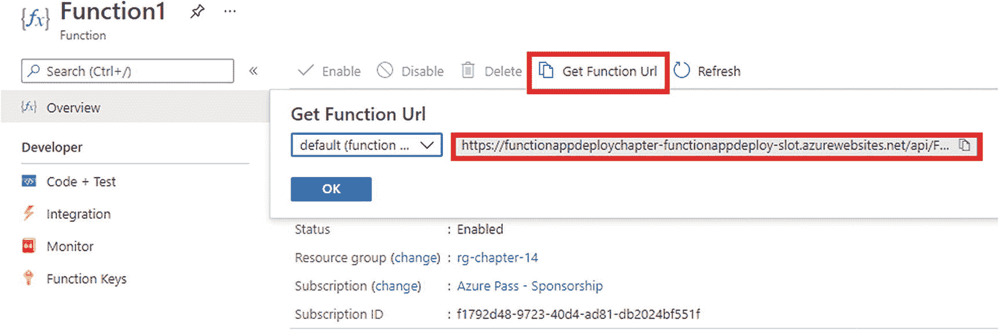
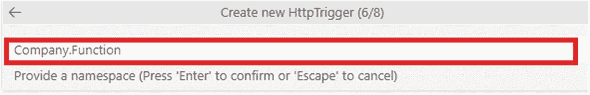

# 14.使用 ide 部署 Azure 功能

在前面的章节中，我们讨论了使用各种触发器和绑定来构建无服务器解决方案以解决现实问题的方法。您学习了如何使用 Azure Key Vault 存储应用机密和配置，以及如何使用 Application Insights 和 Azure Monitor 监控您的功能。所有这些对于构建优秀的解决方案都是非常重要的，但是我们还没有涵盖一个重要的部分，那就是如何在 Azure 中部署这些解决方案。

顾名思义，本章的重点是使用集成开发环境(IDE)来部署你的 Azure 功能。如前所述，您可以使用 Visual Studio 和 VS Code 等 ide 开发 Azure 功能，并且您将利用它们将功能部署到 Azure。在本书的后面，你将会看到在容器中部署功能的方法，以及使用 Azure DevOps 来交付 Azure 功能的自动化部署。

## 本章的结构

本章将探讨 HTTP 触发器和 Azure SQL 的以下方面:

*   使用 Visual Studio 2019 将 Azure 功能部署到 Azure

*   使用 Visual Studio 2019 将 Azure 功能部署到部署槽

*   使用 VS 代码部署 Azure 功能

## 目标

学习完本章后，您将能够做到以下几点:

*   使用 ide 部署 Azure 功能

*   使用部署插槽

## 使用 Visual Studio 2019 将 Azure 功能部署到 Azure

打开 Visual Studio 2019，点击“新建项目”见图 [14-1](#Fig1) 。


图 14-1

创建新项目

选择 Azure Functions 作为项目模板，然后单击 Next。见图 [14-2](#Fig2) 。


图 14-2

选择项目模板

输入项目名称、位置和解决方案名称。填写完之后，单击创建。见图 [14-3](#Fig3) 。


图 14-3

单击创建

选择“Http 触发器”类型，将 Azure Functions V3 设置为函数运行时，选择 Anonymous 作为身份验证级别。单击创建。见图 [14-4](#Fig4) 。


图 14-4

提供模板详细信息

Visual Studio 将生成一个名为 Function1 的 Azure 函数，并带有一些样板代码来返回一条消息作为响应。由于您希望将您的函数项目部署到 Azure，如果您尚未使用拥有有效 Azure 订阅的帐户登录 Visual Studio，请单击“登录”按钮。从图 [14-5](#Fig5) 可以看出，我们已经登录了 Visual Studio。


图 14-5

登录到 Visual Studio

要将解决方案中的功能部署到 Azure 订阅，请右键单击 FunctionAppDeploy 项目，然后单击发布。见图 [14-6](#Fig6) 。


图 14-6

单击发布

您将看到一个弹出屏幕，其中有各种目标选项来部署您的功能项目。选择 Azure 作为目标，然后单击下一步。见图 [14-7](#Fig7) 。


图 14-7

选择 Azure 作为目标

选择 Azure Function App (Windows)作为特定目标，然后单击下一步。见图 [14-8](#Fig8) 。


图 14-8

选择特定的目标

选择订阅名称，然后选择查看为资源组。由于您的订阅中没有任何现有的功能应用，让我们点击图 [14-9](#Fig9) 中突出显示的+,创建一个功能应用。


图 14-9

选择订阅并查看

输入功能应用的名称，选择要在其中创建该功能应用的订阅，选择资源组，选择消耗作为计划类型，选择要创建该功能应用的位置，并选择存储帐户或通过单击新建为该功能应用创建一个新帐户。输入所有必填字段后，单击创建。然后 Visual Studio 将在后台创建一个在所选资源组和订阅内的消费计划上运行的函数 app。类似于通过 Azure 门户创建一个功能 app。通常需要几分钟来调配所有资源。参见图 [14-10](#Fig10) 。


图 14-10

创建新的功能应用

Visual Studio 将选择您在上一步中创建的函数应用。单击“完成”创建发布配置文件，将您的功能项目部署到新创建的功能应用中。如果您有任何现有的功能应用，您可以通过在此步骤中选择它来部署您的功能应用。参见图 [14-11](#Fig11) 。


图 14-11

单击完成

您需要单击“发布”来启动部署过程。在“发布”面板的“设置”部分，您可以看到您的功能应用的配置，包括功能应用 URL、资源组和功能应用名称。参见图 [14-12](#Fig12) 。



图 14-12

单击发布

您可以在输出窗口中看到您的部署进度，如图 [14-13](#Fig13) 所示。



图 14-13

查看输出窗口

要测试您使用 Visual Studio 部署的功能，您必须转到 Azure 门户。然后转到您在 Visual Studio 中创建的函数应用，并在侧边栏菜单中单击函数，如图 [14-14](#Fig14) 中突出显示的。在这里，您将看到此功能应用中部署的所有功能的列表。让我们点击功能 1。


图 14-14

单击功能 1

您需要单击获取函数 URL 按钮来获取函数 1 的 Url。复制对话框中显示的 URL。参见图 [14-15](#Fig15) 。


图 14-15

获取函数 1 的 URL

为了测试我们的函数是否工作良好，打开 web 浏览器，将从上一步复制的函数 URL 与查询字符串`name=ashirwad`一起粘贴。现在按回车键向函数发送一个请求。您应该会得到类似于图 [14-16](#Fig16) 的结果。


图 14-16

向函数 1 发送 GET 请求

在本节中，您了解了如何将函数项目部署到 Azure，以及如何使用 Visual Studio 创建函数应用资源。现在，您将更深入地了解部署插槽以及将它们与 Azure 函数结合使用的方法。

## 什么是部署插槽？

通常，当您处理增强项目时，应用的一个实例已经在生产环境中运行，并且在您将应用和增强一起部署到生产环境之前，您通常会执行多个测试来确认您的发布没有问题。使用插槽，您可以部署应用的新实例来执行健全性测试。

部署插槽提供了一种执行蓝绿色部署的机制。这可以确保您在发布应用的同时拥有最少的停机时间，并确保轻松的回退选项。一旦我们的新版本被部署到登台槽中，通过测试阶段，并准备好部署到生产环境中，您就可以使用交换选项将登台槽中部署的版本移动到生产环境中，并尽可能减少停机时间。

Note

在消费计划上运行时，您只能有一个时段，但在应用服务计划上运行时，您可以有多个时段。

## 将 Azure 功能部署到部署插槽

要创建插槽，请转到功能应用。在侧边栏菜单的 Deployment 部分单击 Deployment Slots。现在单击+ Add Slot 创建一个新的插槽。参见图 [14-17](#Fig17) 。


图 14-17

单击添加插槽

您将看到一个输入插槽名称的新屏幕。输入槽名后，需要点击添加为功能 app 创建新槽。参见图 [14-18](#Fig18) 。


图 14-18

单击添加

将为您的功能应用创建一个槽及其状态，如图 [14-19](#Fig19) 所示。运行生产工作负载的插槽将有一个与其名称相关联的标记和生产插槽。


图 14-19

查看部署插槽

您已经创建了插槽，所以让我们在 Visual Studio 中再次打开 function 项目，将 function 应用的修改版本部署到其中。参考清单 [14-1](#PC1) 查看功能 1 的修改版本。

```cs
using System.IO;
using System.Threading.Tasks;
using Microsoft.AspNetCore.Http;
using Microsoft.AspNetCore.Mvc;
using Microsoft.Azure.WebJobs;
using Microsoft.Azure.WebJobs.Extensions.Http;
using Microsoft.Extensions.Logging;
using Newtonsoft.Json;

namespace FunctionAppDeploy
{
    public static class Function1
    {
        [FunctionName("Function1")]
        public static async Task<IActionResult> Run(
            [HttpTrigger(AuthorizationLevel.Anonymous, "get", "post", Route = null)] HttpRequest req, ILogger log)
        {
            log.LogInformation("C# HTTP trigger function processed a request.");
            string name = req.Query["name"];
            string requestBody = await new StreamReader(req.Body).ReadToEndAsync();
            dynamic data = JsonConvert.DeserializeObject(requestBody);
            name = name ?? data?.name;
            string responseMessage = string.IsNullOrEmpty(name);
                ? "This HTTP triggered function executed successfully. Pass a name in the query string or in the request body for a personalized response."
                : $"Hello, {name}.";
            return new OkObjectResult(responseMessage);
        }
    }
}

Listing 14-1Modified Version of Function1.cs

```

当您将`name=ashirwad`作为查询字符串传递时，从 Function1 返回的响应将是“Hello Ashirwad”而不是“Hello Ashirwad”此 HTTP 触发的函数已成功执行。

要将这个修改后的版本`Function1.cs`部署到您在 Azure 门户中创建的 slot，右键单击 FunctionAppDeploy 项目，然后单击 Publish。见图 [14-20](#Fig20) 。


图 14-20

单击发布

单击+ New 创建一个新的发布配置文件，以将 FunctionAppDeploy 项目部署到新创建的插槽中。参见图 [14-21](#Fig21) 。


图 14-21

创建新的发布配置文件

在发布对话框中选择 Azure 作为目标，然后单击下一步。参见图 [14-22](#Fig22) 。


图 14-22

选择 Azure 作为目标

选择 Azure Functions App (Windows)作为具体目标，点击下一步，如图 [14-23](#Fig23) 所示。


图 14-23

选择 Azure Function App (Windows)作为特定目标

选择订阅，选择 View 作为资源组，并在您的功能应用中选择新创建的部署槽。单击完成。参见图 [14-24](#Fig24) 。


图 14-24

选择部署插槽

Visual Studio 将根据您选择的配置创建发布配置文件。让我们单击 Publish，开始将功能项目部署到插槽的过程。参见图 [14-25](#Fig25) 。


图 14-25

单击发布

您可以从“输出”窗口中看到部署过程的状态。参见图 [14-26](#Fig26) 。


图 14-26

在输出窗口中查看部署进度

部署成功后，我们去 Azure 门户，然后通过去功能 app 的部署中心点击槽位。参见图 [14-27](#Fig27) 。


图 14-27

单击部署插槽

转到 function 应用侧边栏中的 Functions 部分，然后单击 Function1。参见图 [14-28](#Fig28) 。


图 14-28

单击功能 1

单击 Get Function Url 并复制该 Url 以向该函数发送请求。参见图 [14-29](#Fig29) 。



图 14-29

单击获取功能 Url

让我们通过连接`name=ashirwad`查询字符串并按 Enter 键，将函数 URL 粘贴到地址栏中。见图 [14-30](#Fig30) 。


图 14-30

插槽上部署的功能 1 的响应

如图 [14-30](#Fig30) 所示，函数 1 的响应与预期一致。因此，您能够成功地在插槽中部署该功能。

## 使用 VS 代码将 Azure 功能部署到 Azure

打开 Visual Studio 代码，点击图 [14-31](#Fig31) 中高亮显示的“创建新项目”图标，创建一个函数项目。


图 14-31

创建新的功能项目

您必须选择编写函数的语言。让我们在这个窗口中选择 C#。见图 [14-32](#Fig32) 。


图 14-32

选择编程语言

您必须选择。函数项目的. NET 运行库。让我们选择。网络核心 3 LTS。见图 [14-33](#Fig33) 。


图 14-33

选择网络运行时

您必须为功能项目选择模板类型，即您的功能的触发器类型。让我们选择 HttpTrigger。见图 [14-34](#Fig34) 。


图 14-34

选择触发器类型

您需要输入函数的名称。姑且称之为 **HttpTriggerFunction** 。见图 [14-35](#Fig35) 。


图 14-35

输入函数名

您需要为函数项目输入一个名称空间。让我们把它作为公司职能。见图 [14-36](#Fig36) 。



图 14-36

输入项目的名称空间

您需要为该功能选择授权级别。使用匿名。见图 [14-37](#Fig37) 。


图 14-37

选择功能的授权级别

如您所见，VS 代码创建了一个本地函数项目，其中包含一个名为 HttpTriggerFunction 的 HTTP 触发函数。该函数包含类似于清单 [14-1](#PC1) 中所示的样板代码。要将该功能部署到 Azure，点击部署到功能应用图标，如图 [14-38](#Fig38) 所示。


图 14-38

单击部署到功能应用图标

系统会提示我们选择任何现有的功能应用或创建新的功能应用。点击“在 Azure 中创建新的功能应用…高级”并按 Enter 键。参见图 [14-39](#Fig39) 。


图 14-39

在 Azure 中创建新的功能应用

Note

如果您选择现有的功能应用来部署您的功能项目，则它将覆盖之前对其进行的任何部署，并且无法撤消。

您必须输入功能应用名称。让我们输入 **Chapter14FunctionApp** 作为功能应用名称，然后按回车键。见图 [14-40](#Fig40) 。


图 14-40

输入功能应用名称

系统将提示您选择函数应用的运行时堆栈。既然你选择了。NET Core 3.1 作为创建函数项目的运行时，让我们在这里选择相同的设置。见图 [14-41](#Fig41) 。


图 14-41

选择运行时堆栈

您必须为功能应用选择操作系统。选择窗口。见图 [14-42](#Fig42) 。


图 14-42

选择 Windows 作为操作系统

系统将提示您选择托管计划。让我们选择消费托管计划。见图 [14-43](#Fig43) 。


图 14-43

选择托管计划

现在，您必须选择资源组，在该资源组中您的功能应用和其他相关资源将被创建。让我们选择 rg-chapter-14 作为资源组。见图 [14-44](#Fig44) 。


图 14-44

选择资源组

系统将提示您从任何现有存储帐户中进行选择，或者创建一个将由功能应用使用的新存储帐户。让我们选择“创建新的存储帐户”,因为每个功能应用最好有一个单独的专用存储帐户。见图 [14-45](#Fig45) 。


图 14-45

单击“创建新的存储帐户”

输入存储帐户的名称。我们把它命名为 **chapter14functionapp** 。见图 [14-46](#Fig46) 。


图 14-46

输入存储帐户的名称

系统将提示您创建一个新的应用洞察资源，或者现在跳过您的功能应用。让我们点击“暂时跳过”见图 [14-47](#Fig47) 。


图 14-47

为功能应用选择应用洞察资源

现在，您必须选择一个区域，在该区域中将创建与函数应用相关的所有资源。让我们在这里选择南印度，然后按回车键。见图 [14-48](#Fig48) 。


图 14-48

选择地区/位置

您的功能应用的部署过程将在后台进行。您可以在输出窗口中查看进度。一旦部署成功完成，您将在 VS 代码的底部屏幕看到一个类似于图 [14-49](#Fig49) 所示的通知对话框。您还可以在通知对话框和输出窗口中看到函数应用部署中的任何错误。


图 14-49

功能应用的部署状态

不要去 Azure 门户中的函数应用获取函数 URL，让我们右键单击函数应用中存在的 HttpTriggerFunction(您已在其中创建并部署了函数项目),然后单击 Execute Function Now 向 Azure 中运行的函数发送请求。见图 [14-50](#Fig50) 。


图 14-50

单击立即执行功能

现在，系统将提示您以 JSON 格式的键-值对的形式输入名称及其值。我们把它输入为 **{"name":"ashirwad"}** ，回车。这将向第 14 章 FunctionApp 中运行的 HttpTriggerFunction 发送一个请求。见图 [14-51](#Fig51) 。


图 14-51

将名称及其值作为键-值对传递

您将在 VS 代码窗口底部的通知对话框中得到函数的响应。这个函数返回响应“你好，Ashirwad。”因此，这个 HTTP 触发的函数按预期成功执行了。见图 [14-52](#Fig52) 。


图 14-52

HttpTriggerFunction 的响应

## 摘要

在本章中，您探索了使用不同的 ide 部署功能项目的方法。我们还讨论了插槽以及在 Azure 门户中创建部署插槽并在那里部署功能项目的方法。

以下是本章的要点:

*   可以使用 Visual Studio、VS Code 等 ide 部署一个 Azure function 项目。

*   部署插槽帮助您运行应用的多个版本。

*   每个插槽都有自己的实例，可以与生产插槽中运行的应用交换。

*   插槽有助于轻松执行蓝绿色部署。