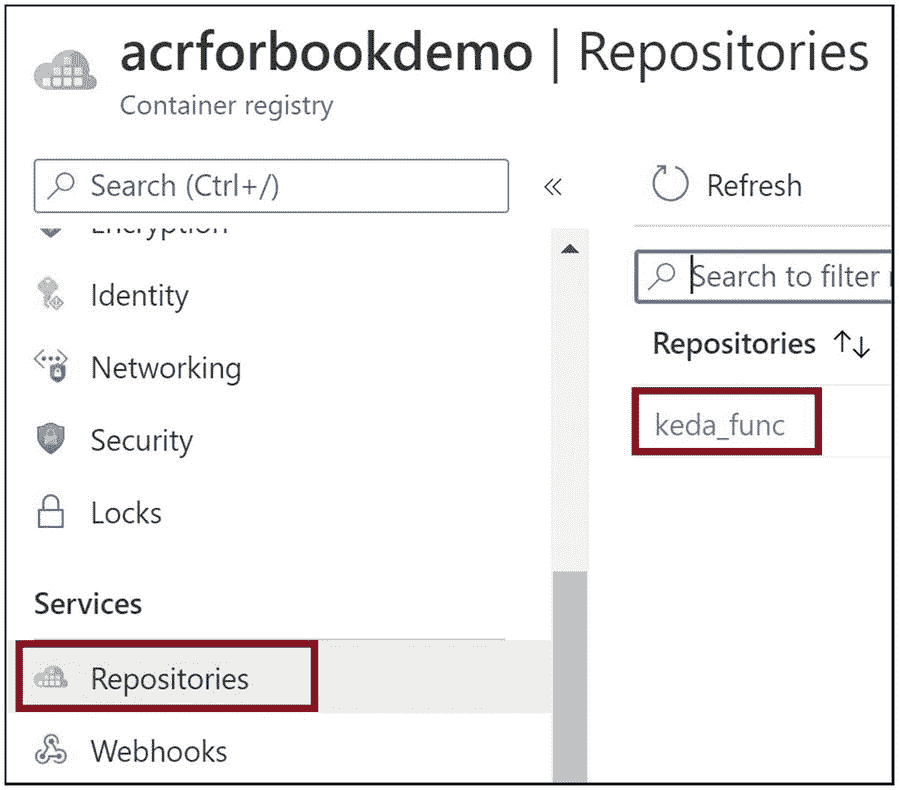

# 16.在容器中运行 Azure 函数

容器是许多应用的流行宿主选择，因为它们基于现代架构原则。您可以将应用及其所有托管依赖项打包到一个容器中，并在目标平台上运行该容器。这使得您的部署具有可移植性。通过外部化基于环境的配置，您可以构建一个跨多个环境重用容器的策略。使用容器方法为应用设置宿主环境可以节省大量时间。使用基于 Kubernetes 的事件驱动自动缩放(KEDA)，您可以在 Azure Kubernetes 服务(AKS)集群中作为容器运行您的 Azure 函数。

在前一章中，你学习了如何使用 Azure 管道为 Azure 功能实现持续集成(CI)和持续部署(CD)。在这一章中，你将学习如何封装一个 Azure 函数，并使用 KEDA 在 AKS 中运行它。

## 本章的结构

在本章中，您将探索 Azure 函数和 KEDA 的以下方面:

*   容器和 AK 入门

*   Azure 中的无服务器 Kubernetes 和 KEDA 是什么

*   将 Azure 函数容器化，并将它们推送到 Azure 容器注册中心

*   使用 KEDA 在 AKS 中部署容器化的 Azure 功能

## 目标

学习完本章后，您将能够做到以下几点:

*   了解 AK 和容器

*   使用 KEDA 在 AKS 中封装和运行 Azure 功能

## 容器和 AK 入门

您可以选择将应用托管在目标环境中的物理服务器或虚拟机上。无论哪种情况，您都将花费大量的精力来安装和配置应用的宿主环境。一旦托管环境启动并运行，您将再次花费大量精力来设置您的应用及其依赖项。当您需要在另一个环境中托管应用时，您将重复相同的步骤。在这里，容器可以是一种优秀的智能托管机制。您可以构建您的代码，打包宿主环境和应用，并将所有依赖项打包到一个容器中。您需要在目标环境中运行容器，而不需要为应用设置宿主环境。这种托管方式节省了大量的时间和精力，在开发人员中相当受欢迎。

集装箱是高度便携的。您可以构建应用容器映像，并将其保存在容器注册表中。容器注册表是容器映像的集合。在目标环境中，您需要从容器注册表中提取容器映像，并将容器映像作为容器执行。一旦容器启动，您就可以访问环境。您可以选择将应用的配置设置外部化，并根据目标环境来设置它们。

容器是操作系统级的虚拟化。在容器运行的目标环境中，您需要安装容器引擎。Docker 是容器引擎的一个例子。其他流行的容器引擎示例有 Containerd、CRI-O 和 Mesos。容器引擎虚拟化底层操作系统，并将容器作为操作系统级线程运行。容器不需要自己的操作系统，因为它们运行在由容器引擎虚拟化的操作系统之上。在虚拟机(VM)中，底层硬件基础架构由 Hyper-V 等虚拟化软件虚拟化，虚拟机在虚拟化环境之上运行。虚拟机必须有自己的操作系统，因此虚拟机比容器更重。

在生产场景中，您的应用将包含松散耦合的组件或服务，您可以选择在一个容器中托管这些服务。例如，假设您的应用有一个用户界面组件、一个业务层组件和一个数据访问组件。您已经将这些组件设计成松散耦合的。您的应用将有三个容器来承载这些组件。对于复杂的应用，您可能有更多的组件或服务，因此容器的数量会更多。您需要管理这些容器中的每一个，以便它们具有高可用性、独立伸缩性、容错性，并且应该能够在它们之间安全地通信。您需要一个解决方案来编排这些容器并代表您管理它们。像 Docker Swarm 或 Kubernetes 这样的容器编排解决方案可以在这方面提供帮助。Kubernetes 是 Google 开发的一个开源容器 orchestrator 解决方案。它由一个称为控制平面的主节点和子节点组成，应用容器在子节点中运行。您计划运行容器所需的 pod 数量、容器将使用的容器映像以及其他类似的细节，然后指示控制平面节点在子节点中调度和执行应用容器。控制平面节点根据您的计划在节点的窗格中运行这些容器。在大多数情况下，pod 可以运行单个容器，也可以在复杂的场景中运行多个容器。控制平面节点确保在 pod 内运行的容器具有高可用性和容错能力。

您可以在一个副本集中规划一组运行相同容器的 pod。副本集是一组相同的 pod。副本集中的每个单元被称为一个*副本*。您可以定义节点中运行相同容器或副本的单元数量。如果一个副本出现故障或崩溃，控制平面节点会启动另一个副本。它确保运行相同容器或副本的 pod 的数量始终保持在副本集中。这种机制保证了高可用性，并从基础设施的角度使您的应用具有容错能力。这些相同的 pod 可以基于传入的请求独立扩展。您还可以缩放节点。

建立一个 Kubernetes 集群很麻烦，需要付出很大的努力。建立群集后，您需要保持控制平面节点运行，并管理控制平面节点的所有基础架构方面。创建一个 Kubernetes 集群需要一定的时间。Azure 提供了一个名为 Azure Kubernetes Service 的托管 Kubernetes 解决方案。AKS 抽象了控制平面的底层基础架构，并代表您管理所有基础架构和运营方面。您需要管理应用将要运行的节点。在 AKS 的情况下，节点通常是虚拟机。你对控制平面没有任何控制权，底层的 Azure 基础设施完全管理它。对于 AKS，您可以在几分钟内创建一个托管的 Kubernetes 集群。

Note

容器是操作系统级的虚拟化，并且是轻量级的。您可以将应用与宿主环境打包在一起，并在目标环境中运行。Kubernetes 编排和管理应用容器。Kubernetes 由称为控制平面的主节点组成，它控制运行应用容器的子节点。AKS 是 Azure 上的托管 Kubernetes 产品，它从你那里抽象出控制平面。

## Azure 中的无服务器 Kubernetes 和 KEDA 是什么？

AKS 使用虚拟机作为节点，并在虚拟机的 pod 内运行应用容器。它提供了一种出色的扩展机制，当传入请求的数量增加时，会添加额外的虚拟机，当传入请求的数量减少时，会停用额外的虚拟机。但是，虚拟机需要一些时间来启动并准备好为请求提供服务。传入的流量激增不会立即得到解决。因此，在管理额外的传入请求方面存在延迟。您可以使用无服务器节点，其中 Azure 容器实例用作节点而不是虚拟机来处理这种情况。Azure container 实例可以非常快速地运转，并立即开始服务额外的传入请求，而不会增加任何延迟。当 Azure container 实例用作节点时，您的节点可以快速扩展并立即添加许多额外的节点。这些无服务器节点使用虚拟 Kubelet 技术，并使用 Azure 容器实例作为 Kubernetes 集群中的节点。Azure 容器实例比虚拟机便宜得多，当你使用无服务器节点时，你会节省很多钱。

您可以使用 KEDA 将 Azure 函数容器化，并在 AKS 集群中运行它们。这种机制为 AKS 带来了真正的无服务器体验。这些容器化的功能既可以在虚拟机上运行，也可以在基于 Azure 容器实例的节点上运行。Azure Functions 运行时执行函数的应用代码，缩放由 KEDA 组件负责。KEDA 组件负责 Azure 函数缩放控制器的工作。

Note

Virtual Kubelet 帮助您在 AKS 集群中的 Azure 容器实例上运行您的容器化应用。KEDA 帮助你在 AKS 集群上运行你的容器化 Azure 功能。

## 将 Azure 函数容器化，并将其推送到 Azure 容器注册中心

现在让我们将一个 Azure 函数容器化，并将其推送到 Azure 容器注册中心。一旦在 Azure 容器注册表中有了 Azure 函数容器映像，就可以在 AKS 集群中运行它。

作为先决条件，您应该在本地系统上安装以下软件。如果您需要更多信息，可以在他们的网站上阅读这些工具的官方文档。

*   蓝色 CLI

*   Azure 功能核心工具

*   库布特雷

*   Docker 桌面

让我们创建一个 Azure 容器注册中心，您可以在其中推送容器化的函数映像。转到 Azure 门户，点击“创建资源”见图 [16-1](#Fig1) 。


图 16-1

单击“创建资源”

单击容器选项卡，然后单击容器注册表。见图 [16-2](#Fig2) 。


图 16-2

单击容器注册表

为 Azure 容器注册表提供订阅详细信息、资源组、名称、位置和定价层。点击“查看+创建”见图 [16-3](#Fig3) 。


图 16-3

提供容器注册表的基本详细信息

单击创建。此操作将加速 Azure 容器注册。见图 [16-4](#Fig4) 。


图 16-4

创建容器注册表

现在让我们在本地打开命令提示符，执行清单 [16-1](#PC1) 中的命令，初始化创建一个基于. NET Core 的 Azure Functions 应用服务，它可以在 Docker 容器中运行。

```cs
func init . --docker

Listing 16-1Create Function App Service

```

系统会提示您为 Azure 函数选择一个工作运行时环境。选择点网。

执行清单 [16-2](#PC2) 中所示的命令，在 Azure Functions 服务中创建一个 HTTP 触发的函数。当提示为 Azure 函数选择触发器模板时，选择“Http 触发器”。出现提示时，提供函数的名称。

```cs
func new

Listing 16-2Create an HTTP-Triggered Function

```

当清单 [16-2](#PC2) 中的命令成功完成时，HTTP 触发的 Azure 函数就生成了。现在让我们在不修改任何代码的情况下，将生成的默认 Azure 函数容器化。执行清单 [16-3](#PC3) 中的命令。您正在创建一个名为`keda_func`的容器图像，图像标签为`latest`。

```cs
docker build -t keda_func:latest .

Listing 16-3Build the Container Image for the Azure Function

```

现在让我们使用清单 [16-4](#PC4) 中的命令运行您在本地创建的容器映像。容器将在端口 8080 上运行。`docker run`命令执行容器图像。`--publish`选项指定运行`docker run`命令的本地系统的端口 8080 被映射到执行容器的端口 80。`--detach`选项指定容器映像在后台运行，而`--name`选项指定执行容器的名称。

```cs
docker run --publish 8080:80 --detach --name keda_func keda_func:latest

Listing 16-4Run the Container Image for the Azure Function Locally

```

让我们使用以下 URL 浏览在容器内运行的函数应用:

```cs
http://localhost:8080/

```

见图 [16-5](#Fig5) 。


图 16-5

Azure 函数在容器内运行

现在让我们将容器化的 Azure 函数推送到 Azure 容器注册中心。您需要 Azure 容器注册表的管理员凭据。转到您在 Azure 门户中创建的 Azure 容器注册表。单击“访问密钥”选项卡。启用管理员用户并复制用户名和密码。见图 [16-6](#Fig6) 。


图 16-6

启用 Azure 容器注册表的管理员用户

现在让我们执行清单 [16-5](#PC6) 中的 Docker 命令，并在提示时提供 Azure 容器注册中心的管理员凭证。在命令中将`{ACR}`替换为 Azure 容器注册表的名称。

```cs
docker login {ACR}.azurecr.io

Listing 16-5Authenticate

with the Azure Container Registry

```

执行清单 [16-6](#PC7) 中的命令，将容器映像标记到 Azure 容器注册中心。将`{ACR}`替换为 Azure 容器注册中心的名称。`keda_func`值是您之前为 Azure function 应用创建的容器映像的名称。

```cs
docker tag keda_func:latest {ACR}.azurecr.io/keda_func:latest

Listing 16-6Tag the Azure Function Container Image with the Azure Container Registry

```

现在让我们使用清单 [16-7](#PC8) 中的命令将容器映像推送到 Azure 容器注册中心。将`{ACR}`替换为 Azure 容器注册中心的名称。

```cs
docker push {ACR}.azurecr.io/keda_func:latest

Listing 16-7Push

the Container Image to the Azure Container Registry

```

回到 Azure 门户中的 Azure 容器注册表。单击 Repositories 选项卡，您将在那里看到 Azure 函数容器图像。见图 [16-7](#Fig7) 。



图 16-7

Azure 容器注册表中的 Azure 函数容器映像

## 使用 KEDA 在 AKS 中部署容器化的 Azure 功能

现在让我们创建一个 AKS 实例，并在其上运行容器化的 Azure 函数。转到 Azure 门户，点击“创建资源”见图 [16-8](#Fig8) 。


图 16-8

创建新资源

单击容器选项卡，然后单击 Kubernetes 服务。见图 [16-9](#Fig9) 。


图 16-9

单击库服务

为 Azure Kubernetes 服务实例提供订阅、资源组、名称、位置和其他必要的基本信息。提供 1 作为节点数。参见图 [16-10](#Fig10) 。


图 16-10

向 AKS 提供基本细节

转到“身份验证”选项卡，选择“系统分配的托管身份”作为身份验证方法。您需要将之前创建的 Azure 容器注册中心与 AKS 集成。如果选择“系统分配的受管身份”作为身份验证方法，则可以在门户中进行这种集成。参见图 [16-11](#Fig11) 。


图 16-11

提供身份验证方法

转到 Integrations 选项卡，选择前面创建的 Azure 容器注册表。点击“查看+创建”参见图 [16-12](#Fig12) 。


图 16-12

选择 Azure 容器注册表

单击创建。这个动作会旋转 AK。参见图 [16-13](#Fig13) 。


图 16-13

创建 AK

一旦创建了 Azure Kubernetes 服务实例，转到本地系统上的命令提示符并登录 Azure。出现提示时，请提供您的 Azure 凭据。参见清单 [16-8](#PC9) 。

```cs
az login

Listing 16-8Log In to the Azure Kubernetes Service Instance

```

执行清单 [16-9](#PC10) 中的命令，使用您创建的 Azure Kubernetes 服务实例进行身份验证。将`{AKS Name}`替换为您创建的 Azure Kubernetes 服务实例的名称，将`{Resource Group}`替换为 Azure Kubernetes 服务资源组的名称。

```cs
az aks get-credentials --resource-group "{Resource Group}" --name "{AKS Name}"

Listing 16-9Authenticate

with Azure Kubernetes Service

```

执行清单 [16-10](#PC11) 中的命令，生成部署 YAML 文件，您将使用该文件将容器化的 Azure 函数部署到 Azure Kubernetes 服务。将`{ACR}`替换为 Azure 容器注册中心的名称，您之前将容器映像推送到该注册中心。

```cs
func kubernetes deploy --name "kedafunc" --image-name "{ACR}.azurecr.io/keda_func:latest" --dry-run > deploy.yaml

Listing 16-10Generate the Kubernetes Deployment YAML File

```

将生成一个`deploy.yaml`文件，您可以使用清单 [16-11](#PC12) 中的命令将其应用到 Kubernetes 集群。

```cs
kubectl apply -f deployfunc.yaml

Listing 16-11Apply the Generated YAML to the Kubernetes Cluster

```

您可以使用清单 [16-12](#PC13) 中的命令来验证托管 Azure 功能容器的 pod 是否启动并运行。见图 [16-14](#Fig14) 。


图 16-14

验证 pod 是否正在运行

```cs
kubectl get pods

Listing 16-12Verify Whether the Pod Is Running

```

现在让我们执行清单 [16-13](#PC14) 中的命令来获取外部 IP 地址，您可以使用该地址来浏览 Azure Kubernetes 服务内部运行的 Azure 函数。见图 [16-15](#Fig15) 。


图 16-15

获取外部 IP

```cs
kubectl get services

Listing 16-13Get the External IP

```

浏览到外部 IP 地址。参见图 [16-16](#Fig16) 。


图 16-16

浏览到 Azure Kubernetes 服务中运行的 Azure 函数

## 摘要

在这一章中，你学习了如何封装一个 Azure 函数，并使用 KEDA 在 Azure Kubernetes 服务集群中运行它。您了解了什么是容器和 Kubernetes，以及它们如何提供现代化的托管支持。您学习了如何创建 Azure 容器注册中心，将容器化的 Azure 函数映像推送到 Azure 容器注册中心，并在 Azure Kubernetes 集群中运行映像。

以下是本章的要点:

*   您可以封装您的应用和托管依赖项，并在目标环境中运行您的应用。

*   容器是操作系统级的虚拟化，与虚拟机相比是轻量级的。

*   Kubernetes 编排容器并管理它们。

*   您可以在 Kubernetes 集群节点中运行容器化的应用，这些节点可以是虚拟机或 Azure 容器实例。

*   无服务器节点是运行应用容器的 Azure 容器实例。

*   KEDA 帮助你在 Azure Kubernetes 服务集群中运行容器化的 Azure 功能。

在下一章，你将探索如何给 Azure 函数增加认知能力。