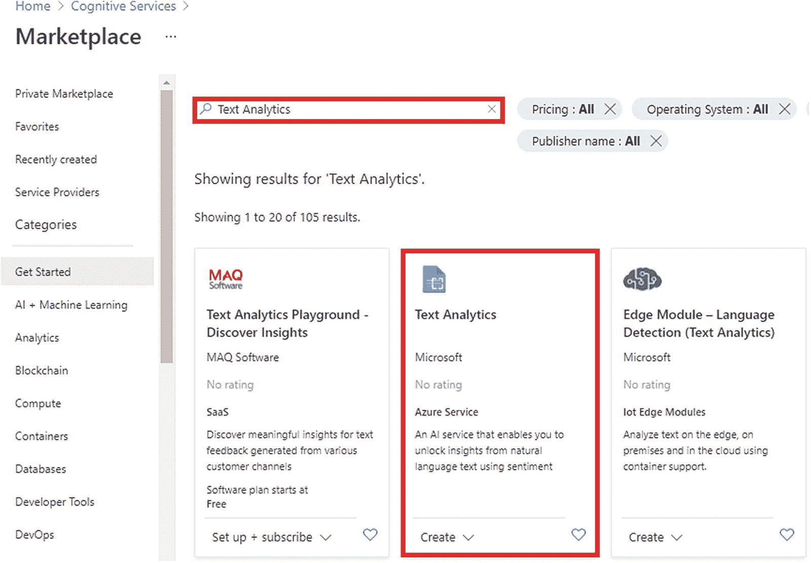
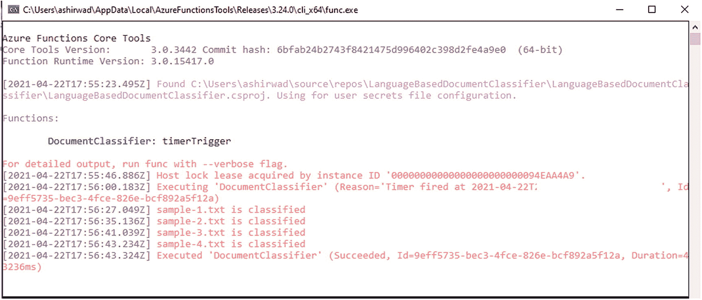

# 17.将认知能力添加到 Azure 函数中

人工智能已经成为现代应用开发的重要组成部分。它在人们能想到的每个领域都留下了印记。几乎每个上市的应用都有一个智能解决方案。从简单的聊天应用到虚拟助手的 app 都有认知能力。

在前面的章节中，我们讨论了开发和部署 Azure 函数的方法。您通过构建应用来解决各种用例，探索了 Azure 函数的不同绑定和触发器。有了前几章收集的知识，你就可以使用 Azure 函数构建无服务器解决方案了。在这一章中，您将通过向 Azure 函数添加认知能力来构建智能无服务器解决方案，从而为您的武器库增加一项技能。

您将利用 Azure 认知服务的力量来构建具有 Azure 函数的智能无服务器解决方案。在这一章中，你将学习在的帮助下为你的功能增加认知能力的方法。Azure 认知服务的. NET SDKs。

## 本章的结构

本章将探讨 HTTP 触发器和 Azure SQL 的以下方面:

*   Azure 认知服务入门

*   Azure 文本分析入门

*   使用情感分析创建一个无服务器应用来分析反馈

*   创建基于语言的文档分类器无服务器解决方案

## 目标

学习完本章后，您将能够做到以下几点:

*   使用 Azure Functions 服务创建智能无服务器解决方案

*   从 Azure Functions 与 Azure 认知服务交互

## Azure 认知服务入门

利用人工智能的力量从头开始构建智能解决方案可能需要拥有特定专业知识的高技能员工，这可能相当昂贵。微软 Azure 在 Azure Cognitive Services 中提供了一套服务，帮助你从头开始编写所有算法，为你的应用添加认知能力，使其智能化。

在 Azure 认知服务的帮助下，您将对适当的服务进行 API 调用，以将所需的认知能力嵌入到您的应用中。Azure 认知服务也可以使用可用的 SDK 来消费。

Azure 认知服务提供五大类服务来帮助认知任务。

*   *决策*:借助这一类别的服务，您可以让您的应用做出明智的决策。异常检测器、内容调节器和个性化器等服务都属于这一类。

*   *Language* :借助这一类别的服务，您可以让您的应用从非结构化文本数据中收集和提取见解。文本分析、沉浸式阅读器、翻译、语言理解和 QnA Maker API 等服务都属于这一类。

*   *搜索*:借助这类服务，您可以让您的应用在互联网上查找网页、图像和新闻。必应网络搜索就属于这一类。

*   *语音*:借助这一类别的服务，您可以使您的应用具有语音功能。语音到文本、文本到语音、语音翻译和说话人识别等服务都属于这一类。

*   *Vision* :借助这类服务，你可以处理和分析基于图像和视频的内容。计算机视觉、自定义视觉、人脸、表单识别器和视频索引器等服务都属于这一类。

Azure Cognitive Services 帮助组织和开发者轻松拥抱 AI，构建智能解决方案。它为开发人员和组织提供了在短时间内以更少的成本构建智能解决方案的能力。在本章中，您将使用 Azure 认知服务和 Azure 函数构建两个智能解决方案。在第一个解决方案中，您将构建一个无服务器 API 来处理、分析和预测反馈意见。稍后，您将使用 Azure Text Analytics 为文档创建一个无服务器解决方案，具体取决于文档所用的语言。

## Azure 文本分析入门

在一个每秒钟有近 6000 条推文的世界里，你知道文本分析是一个重要的关注领域。对于初学者来说，文本分析是从文本数据中收集见解以做出明智决策的过程。对于公司来说，来自各种社交媒体网站的文本数据可以帮助他们了解他们的客户，并通过分析和处理这些数据收集见解，做出明智的决策。

虽然在自然语言处理(NLP)领域已经开发了多年的成熟算法，如朴素贝叶斯、支持向量机(SVMs)和线性判别分析(LDA ),但是从头构建这样的算法需要丰富的经验。Azure Text Analytics 允许您对非结构化数据执行文本分析，而不需要您拥有该领域的专业知识或担心使用哪种算法来完成任务。

您可以在 Azure 文本分析 API 或 SDK 的帮助下执行以下任务:

*   *情感分析*:通过情感分析，你可以从文本中发现一个人对某个话题或品牌的印象或看法。文本分析将文本分为正面、负面、中性或混合文本，并给出置信度得分。

*   *关键短语提取*:通过关键短语提取，您可以从文本中识别内容的本质或谈话要点。

*   *语言检测*:通过语言检测，您可以识别文本是用哪种语言编写的。它返回一个语言代码和置信度得分。

*   *命名实体识别*:通过命名实体识别，可以从文本中找到并识别实体。实体可以是地点、组织或个人。

要构建一个无服务器 API 来执行反馈分析，您将使用 Azure Text Analytics 的情感分析功能。要使用 Azure 文本分析，您必须在 Azure 中创建一个文本分析资源，并获得 API 密钥和 URL 端点。在下一部分，您将在 Azure 门户中创建一个 Azure 文本分析服务。

## 在 Azure 门户中创建 Azure 文本分析资源

进入 Azure 门户，在搜索框中搜索*认知服务*，点击即可。见图 [17-1](#Fig1) 。


图 17-1

搜索认知服务

现在点击创建，如图 [17-2](#Fig2) 所示。这将弹出一个侧屏幕，将你重定向到市场。


图 17-2

单击“创建”转到市场

在搜索框中键入**文本分析**，然后按 Enter 键。现在，选择微软提供的文本分析服务。见图 [17-3](#Fig3) 。



图 17-3

在市场中搜索文本分析服务

点击【创建】，如图 [17-4](#Fig4) 所示，创建文本分析服务。


图 17-4

创建文本分析服务

填写所有必需的信息。点击“查看+创建”见图 [17-5](#Fig5) 。


图 17-5

点击“审核+创建”

Note

因为您刚刚学习如何在函数中使用文本分析服务，所以您将在本章中使用免费的 F0 层。使用 F0 层，您每月可以拨打 5，000 次电话。但是，如果您想将文本分析服务用于生产级应用，建议选择标准计划。

现在将对您在前一个屏幕中输入的值进行验证检查。如果验证成功，您可以单击 Create 在 Azure 中创建文本分析资源。见图 [17-6](#Fig6) 。


图 17-6

单击创建

创建资源后，转到该资源并单击屏幕侧边栏中的 Keys and Endpoint。见图 [17-7](#Fig7) 。


图 17-7

转到键和端点

获取密钥和端点的值，并将它们存储在安全的地方。在下一节中，您将使用它们来构建一个无服务器的 API 来执行情感分析。

## 构建一个无服务器的 API，使用情感分析来分析反馈

在本节中，您将构建一个 HTTP 触发的 Azure 函数，使用 Azure Text Analytics 对请求负载中发送的反馈进行处理和情感分析，并将反馈的情感作为响应返回给用户。

打开 Visual Studio 2019，点击“新建项目”见图 [17-8](#Fig8) 。


图 17-8

在 Visual Studio 中创建新项目

为项目模板选择 Azure Functions，然后单击 Next。见图 [17-9](#Fig9) 。


图 17-9

选择 Azure Functions 作为项目模板

填写项目名称、位置和解决方案名称，然后单击 Next。参见图 [17-10](#Fig10) 。


图 17-10

填写项目详细信息

选择“Http trigger”作为触发器类型，保留其他默认值，然后单击 Create。参见图 [17-11](#Fig11) 。


图 17-11

选择“Http 触发器”和 Azure Functions V3

现在，Visual Studio 将生成一个 HTTP 触发的函数。让我们打开包管理器控制台，键入清单 [17-1](#PC1) 中所示的命令来安装 Azure Text Analytics SDK。或者，您可以使用 NuGet 包管理器来安装这个 SDK。

```cs
Install-Package Azure.AI.TextAnalytics -Version 5.0.0

Listing 17-1Install Azure Text Analytics

```

一旦安装了 SDK，打开`local.setttings.json`文件，添加 API 键和文本分析服务的端点作为键值对，如清单 [17-2](#PC2) 所示。

```cs
{
    "IsEncrypted": false,
    "Values": {
      "AzureWebJobsStorage": "UseDevelopmentStorage=true",
      "FUNCTIONS_WORKER_RUNTIME": "dotnet",
      "api-key": "Enter your API Key",
      "endpoint": "Enter your Endpoint"
    }
}

Listing 17-2Add API Key and Endpoint to local.settings.json

```

Note

不建议将函数秘密或敏感信息存储在`local.settings.json`文件中，或将此类信息硬编码到变量中。我们建议使用密钥库来存储函数机密。

当您添加 API 密钥和 URL 端点并安装 Azure Text Analytics SDK 时，让我们创建一个名为`Payload.cs`的普通旧 CLR 对象(POCO)类。这个类将通过反序列化请求有效负载的数据模型来表示它，以便稍后获得反馈意见，并通过更新模型的`feedbackSentiment`属性将模型发送给用户。见清单 [17-3](#PC3) 。

```cs
public class Payload
    {
        public string feedback { get; set; }
        public string feedbackSentiment { get; set; }
    }

Listing 17-3Create a POCO Model Called Payload.cs

```

现在您已经创建了 POCO 模型，并通过添加 API 键和端点的值作为键值对来更新了`local.settings.json`文件，让我们开始构建反馈分析器函数。首先，您将在请求正文中反序列化用户发送的内容，并将其存储在一个变量中。然后，您必须创建一个名为`client`的`TextAnalyticsClient`类型的对象来使用 Azure Text Analytics SDK，并将端点和 API 键作为参数传递。一旦我们创建了对象，让我们通过传递请求有效负载中发送的反馈来调用客户机对象的`AnalyzeSentiment`方法。`AnalyzeSentiment`方法返回具有不同属性的`DocumentSentiment`响应，例如`sentiment`、`confidence`和`warning`等等。在这种情况下，您将使用`Sentiment`属性，并将由`AnalyzeSentiment`方法返回的响应的情感属性的值赋给 POCO 模型的`feedbackSentiment`属性。最后，您将向客户端发送一个 OK 响应以及 POCO 模型。如果有任何异常，则向客户端返回一个`BadRequest`响应。见清单 [17-4](#PC4) 。

```cs
using System;
using System.IO;
using System.Threading.Tasks;
using Azure;
using Azure.AI.TextAnalytics;
using Microsoft.AspNetCore.Http;
using Microsoft.AspNetCore.Mvc;
using Microsoft.Azure.WebJobs;
using Microsoft.Azure.WebJobs.Extensions.Http;
using Microsoft.Extensions.Logging;
using Newtonsoft.Json;

namespace FeedbackAnalyzer
{
    public static class FeedbackAnalyzer
    {
        private static readonly AzureKeyCredential credentials = new AzureKeyCredential(Environment.GetEnvironmentVariable("api-key"));
        private static readonly Uri endpoint = new Uri(Environment.GetEnvironmentVariable("endpoint"));
        private static TextAnalyticsClient client = new TextAnalyticsClient(endpoint, credentials);

        [FunctionName("FeedbackAnalyzer")]
        public static async Task<IActionResult> Run(
            [HttpTrigger(AuthorizationLevel.Function, "get", "post", Route = null)] HttpRequest req,
            ILogger log)
        {
            try
            {
                string requestBody = await new StreamReader(req.Body).ReadToEndAsync();
                var data = JsonConvert.DeserializeObject<Payload>(requestBody);
                data.feedbackSentiment = client.AnalyzeSentiment(data.feedback).Value.Sentiment.ToString();
                return new OkObjectResult(data);
            }

            catch (Exception ex) {
                return new BadRequestObjectResult(ex.Message);
            }
        }
    }
}

Listing 17-4Get the Feedback Sentiment

```

Note

我们创建了一个类型为`TextAnalyticsClient`的静态客户端对象，因为这允许我们在不同的函数调用中重用客户端对象，而不是为每次调用创建一个新对象。

## 使用 Postman 测试 FeedbackAnalyzer 函数

让我们运行函数项目并启动 Azure Functions 核心工具来测试您的反馈分析器函数并复制函数端点。参见图 [17-12](#Fig12) 。


图 17-12

获取 FeedbackAnalyzer 函数的 URL 端点

您将使用 Postman 通过使用函数的 URL 端点来测试 FeedbackAnalyzer API。让我们打开 Postman，它是 API 开发的领先协作平台之一。创建一个新的集合，并向其中添加一个请求，以测试您在上一节中创建的 HTTP 触发的 Azure 函数。在请求体中传递反馈的值，然后单击 Send 调用 FeedbackAnalyzer 函数并获得响应。参见图 [17-13](#Fig13) 。


图 17-13

FeedbackAnalyzer API 的响应

如图 [17-14](#Fig14) 所示，您从 FeedbackAnalyzer API 得到一个 OK 响应，并在响应体中显示反馈和反馈意见。

## 构建基于语言的文档分类器无服务器解决方案

在本节中，您将进一步使用 Azure Text Analytics 的语言检测功能，在定时器触发函数的帮助下，基于 Blob 容器中的语言对文档进行分类。您的解决方案将每 24 小时处理一个名为`source`的容器中的所有文档，并根据文档所用的语言对其进行分类；它还会将它们存储在一个名为`destination`的独立容器中，并从源容器中删除已分类的 Blobs。

打开 Visual Studio 2019，点击“新建项目”参见图 [17-14](#Fig14) 。


图 17-14

创建新项目

选择 Azure Functions 作为项目模板，然后单击 Next。参见图 [17-15](#Fig15) 。


图 17-15

选择 Azure Functions 作为项目模板

填写项目名称、位置和解决方案名称，然后单击 Next。参见图 [17-16](#Fig16) 。


图 17-16

填写项目详细信息

选择“Timer trigger”作为触发器类型，保留其他默认设置，然后单击 Create。参见图 [17-17](#Fig17) 。


图 17-17

选择“定时器触发器”和 Azure 函数 V3

Visual Studio 将生成一个名为 function1 的计时器触发函数。让我们删除它并添加一个新的名为`DocumentClassifier`的定时器触发函数。让我们打开软件包管理器控制台，键入清单 [17-1](#PC1) 和清单 [17-5](#PC5) 中所示的命令，安装 Azure Text Analytics SDK 和 Azure Blob Storage SDK。或者，您可以使用 NuGet 包管理器来安装它。

```cs
Install-Package Microsoft.Azure.Storage.Blob -Version 12.8.1

Listing 17-5Install Azure Blob Storage

```

一旦安装了这些包，打开项目的`local.settings.json`文件，从本章前面创建的文本分析资源中添加键和端点。现在，让我们在 Azure 中创建一个存储帐户，并为项目创建两个名为`source`和`destination`的 Blob 容器。

您的所有文件最初都将被上传到源 Blob 容器中，然后您的函数将根据编写文档的语言对文档进行分类，并将它们存储在目标容器中。创建存储帐户和 Blob 容器后，让我们转到 Azure 门户中存储帐户屏幕侧菜单中的“访问密钥”并获取连接字符串。参见图 [17-18](#Fig18) 。


图 17-18

获取存储帐户的连接字符串

您需要将这个连接字符串作为键值对存储在您的`local.settings.json`文件中。在添加项目所需的所有键值对后，参考清单 [17-6](#PC6) 中的`local.settings.json`文件。

```cs
{
    "IsEncrypted": false,
  "Values": {
    "AzureWebJobsStorage": "UseDevelopmentStorage=true",
    "FUNCTIONS_WORKER_RUNTIME": "dotnet",
    "key": "Enter your API key",
    "endpoint": "Enter your endpoint",
    "connectionString": "Enter your storage account connection string"
  }
}

Listing 17-6Add API Key, Endpoint, and Connection String at local.settings.json

```

现在您已经更新了项目的`local.settings.json`文件，让我们开始处理您的`DocumentClassifier`函数。您必须将函数的 cron 表达式更新为 0 0 10 * * *。这告诉您的函数在每天上午 10 点运行。在您修改 cron 表达式之后，让我们创建`TextAnalyticsClient`和`BlobContainerClient`类型的静态对象。您将使用`TextAnalyticsClient`类型对上传到您的源 Blob 容器中的文档内容执行语言检测。

您将创建两个`BlobContainerClient`类型的静态对象，即`sourceClient`和`destinationClient`。`sourceClient`引用源容器中存在的所有斑点，并给你修改其中所有斑点的能力，`destinationClient`对目标容器做同样的事情。

您将使用两个名为`GetLanguage`和`UploadBlobToContainer`的静态方法。`GetLanguage`方法接受一个字符串参数，并使用`TextAnalyticsClient`对象的`DetectLanguage`方法来标识文档编写的语言。`DetectLanguage`方法返回一个`DetectedLanguage`类型的响应。但是由于只要求您输入语言的名称，您将返回`name`值，而不是从您的`GetLanguage`方法返回一个`DetectedLanguage`对象。

`UploadBlobToContainer`方法有三个参数，分别是`stream`、`string`和`BlobContainerClient`。`UploadBlobToContainer`方法使用作为参数传递的`BlobContainerClient`对象，在`UploadBlob`方法的帮助下将文件上传到对象引用的容器中。Blob 的名称是在名为`blobName`的参数中传递的值，Blob 的内容是在名为`blobData`的参数中传递的值。它将`UploadBlob`方法包装在`try-catch`块中来处理异常。如果有异常，`UploadBlobToContainer`将返回 false，如果没有遇到任何异常，它将返回 true。

我们已经讨论了函数中使用的方法，现在让我们讨论一下函数的`Run`方法中使用的代码。首先，我们通过使用`sourceClient`对象的`GetBlobs`方法遍历源容器中的所有 Blobs。然后，我们在`GetBlobClient`方法的帮助下获取 Blob 数据，并通过将 Blob 内容的值作为参数传递来对`GetLanguage`方法进行方法调用。将从`GetLanguage`方法返回的值赋给一个名为`detectedLanguage`的变量。

在找到编写文档的语言之后，通过传递`destinationClient`对象、插值字符串和当前 Blob 项的内容来调用`UploadBlobToContainer`方法。您传递一个插值字符串来构建一个格式为`{Language Name}/{Blob Name}`的字符串。这将确保您的 Blob 在存储资源管理器中以类似文件夹的格式可见，其中每个文件夹将是该语言的名称，并将包含以该特定语言编写的所有文件。默认情况下，Blob 名称采用这种格式；Blob 存储不支持文件夹或子目录，但是您可以根据需要在文件夹或子文件夹名称后使用/对它们进行逻辑分组。

`UploadBlobToContainer`执行后返回一个布尔响应。如果它返回 true，那么您将从源容器中删除该文件，因为它已经被分类并上传到目标容器中，同时记录 Blob 分类的状态。如果`UploadBlobToContainer`无法上传文件，那么它将返回 false 作为响应，您将只记录关于未被分类的 Blob 的信息，并将其上传到目标容器，而不删除这个特定的 Blob 项。关于`DocumentClassifier`功能的完整代码，请参考清单 [17-7](#PC7) 。

```cs
using System;
using System.IO;
using Azure;
using Azure.AI.TextAnalytics;
using Azure.Storage.Blobs;
using Azure.Storage.Blobs.Models;
using Microsoft.Azure.WebJobs;
using Microsoft.Azure.WebJobs.Host;
using Microsoft.Extensions.Logging;

namespace LanguageBasedDocumentClassifier
{
    public static class DocumentClassifier
    {
        private static readonly AzureKeyCredential credentials = new AzureKeyCredential(Environment.GetEnvironmentVariable("key"));
        private static readonly Uri endpoint = new Uri(Environment.GetEnvironmentVariable("endpoint"));
        private static TextAnalyticsClient client = new TextAnalyticsClient(endpoint, credentials);
        private static BlobContainerClient sourceClient = new BlobContainerClient(Environment.GetEnvironmentVariable("connectionString"),"source");
        private static BlobContainerClient destinationClient = new BlobContainerClient(Environment.GetEnvironmentVariable("connectionString"), "destination");
        [FunctionName("DocumentClassifier")]
        public static void Run([TimerTrigger("0 0 10 * * *")]TimerInfo myTimer, ILogger log)
        {
            foreach (BlobItem blobItem in sourceClient.GetBlobs()) {
                BlobClient blob = sourceClient.GetBlobClient(blobItem.Name);
                StreamReader data = new StreamReader(blob.Download().Value.Content);
                string detectedLanguage = GetLanguage(data.ReadToEnd());
                bool IsUploaded = UploadBlobToContainer(destinationClient, $"{detectedLanguage}/{blobItem.Name}", blob.Download().Value.Content);
                if (IsUploaded)
                {
                    sourceClient.DeleteBlobIfExists(blobItem.Name);
                    log.LogInformation($"{blobItem.Name} is classified");
                }
                else
                {
                    log.LogInformation($"Failed to classify {blobItem.Name}");
                }

            }
        }
        public static string GetLanguage(string content)
        {
            return client.DetectLanguage(content).Value.Name;
        }
        public static bool UploadBlobToContainer(BlobContainerClient containerClient,string blobName,Stream blobData) {
            bool flag = true;
            try
            {
                containerClient.UploadBlob(blobName,blobData);
            }
            catch (Exception ex) {
                flag = false;
            }
            return flag;
        }
    }
}

Listing 17-7Document Classifier Function

```

## 测试基于语言的文档分类器功能

要测试文档分类器函数，您必须运行该函数，但在此之前，让我们看看源和目标容器中存在的文件。如图 [17-19](#Fig19) 所示，源容器包含四个文本文件。所有的文本文件都是用不同的语言编写的。


图 17-19

源容器中存在的文件

现在让我们看看目标容器中存在的文件，如图 [17-20](#Fig20) 所示。到目前为止，目标容器是空的，没有文件上传到其中。一旦您运行您的`DocumentClassifier`函数，它将填充这个容器。


图 17-20

目标容器中存在的文件

因为您已经看到了两个容器中的所有文件，所以让我们运行您的`DocumentClassifier`函数并再次检查容器。见图 [17-21](#Fig21) 。



图 17-21

文档分类器函数的日志

如 Azure Functions 核心工具的日志所示，`DocumentClassifier`函数能够按照文档编写的语言对文档进行分类，并成功地将它们上传到目标容器。

让我们再次到目的地容器来验证这一点。现在目标容器包含四个文件夹，即英语、印地语、奥里亚语和南非荷兰语，如图 [17-22](#Fig22) 所示。所有这些文件夹包含的文件都是用与文件夹名称相同的语言编写的。


图 17-22

函数执行后的目标容器

这个函数还有一个功能:删除已经分类并上传到目标容器的文件。既然您的`DocumentClassifier`函数能够成功地分类和上传所有文件，那么您的源容器现在应该是空的。你可以通过返回到`source`容器来验证，如图 [17-23](#Fig23) 所示。


图 17-23

函数执行后的源容器

## 摘要

在这一章中，你学习了如何借助 Azure 函数和 Azure 认知服务，通过构建反馈分析器应用和文档分类器应用来创建智能无服务器解决方案。在构建这两个无服务器解决方案时，您学习了如何利用 Azure 文本分析功能将认知功能集成到您的解决方案中。

以下是本章的要点。

*   Azure Cognitive Services 提供 REST 端点和客户端库，以在应用中添加认知功能。

*   你可以在 Azure 门户中访问 Azure 文本分析服务。

*   您可以使用 Azure Text Analytics 执行语言检测、情感分析和命名实体识别等任务。

*   您可以通过使用 Azure 认知服务的 SDK 将认知功能集成到 Azure 函数中。