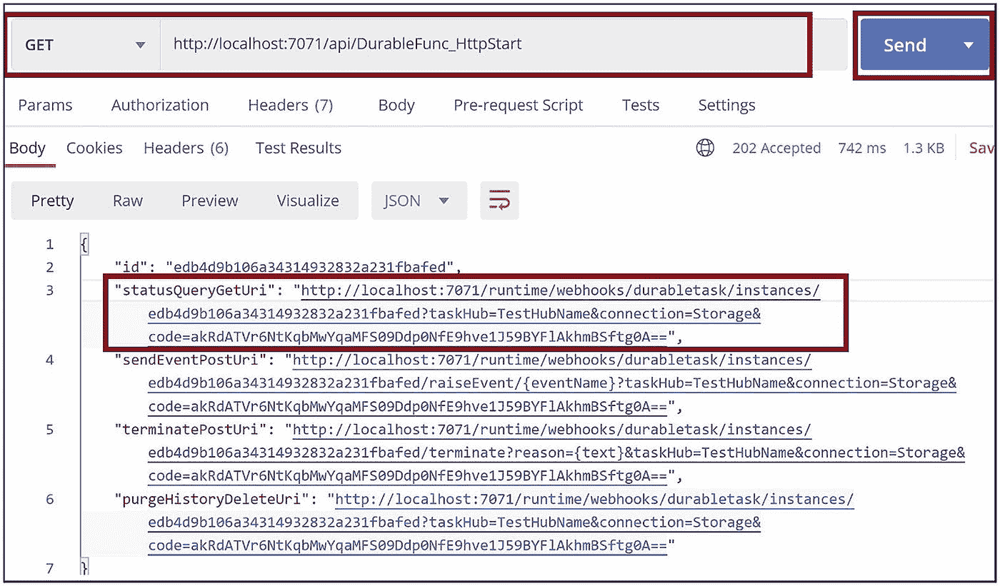

# 18.Azure 持久函数简介

您可能有这样一个场景，应用逻辑被分成更小的块，每个代码块都托管在一个 Azure 函数中。该应用由几个 Azure 函数组成，这些函数相互交互，并为业务处理交换数据和状态。您可能需要像工作流一样以特定的顺序执行这些功能。您需要编排这些 Azure 函数，并确保这些函数维护它们的数据和状态。Azure 函数默认是无状态的。他们将无法处理这种情况。您需要使用服务 Azure 持久功能，这将帮助您使这些功能有状态并构建工作流。

在前一章中，你学习了如何使用 Azure 认知服务和 Azure 函数创建智能无服务器应用。在本章中，你将学习如何使用 Azure 持久功能构建和编排有状态工作流。

## 本章的结构

在本章中，您将探索 Azure 持久功能的以下方面:

*   Azure 持久功能入门

*   Azure 持久功能的优势

*   应用模式

*   用 Azure 持久函数实现函数

## 目标

学习完本章后，您将能够做到以下几点:

*   使用 Azure 持久功能及其模式

*   构建持久的功能

## Azure 持久功能入门

假设您在一家电子学习公司工作，在那里学生将完成一门在线课程，您需要根据他们的课程完成状态以及他们是否已全额支付课程费用来颁发证书。为了让这个场景工作，您需要设计一个执行以下步骤的工作流:

1.  检查学生是否完成了课程中的每个模块。

2.  检查学生是否已支付课程费用。如果没有，触发通知学生支付费用。

3.  检查学生是否通过了该课程的考试。

4.  如果学生完成了所有模块、支付了课程费用并通过了考试，则颁发证书供学生下载。

将数据从一个工作流步骤发送到另一个步骤对于基于工作流的应用至关重要。您需要使工作流的每一步都有状态。你可以使用 Azure 持久函数来实现这个场景。Azure 持久功能扩展帮助您使用 Azure 函数构建有状态的工作流。它使得 Azure 函数有状态。您可以使用 C#、F#和 Node.js 构建持久的函数。

持久功能包括以下组件:

*   客户端功能

*   管弦乐队功能

*   活动功能

活动功能执行实际的业务逻辑，并作为工作流中的一个步骤。Orchestrator 函数调用 Activity 函数并将它们编排为工作流，然后进入休眠状态。Activity 函数执行业务功能，一旦完成，它就通知 Orchestrator 函数唤醒。Orchestrator 函数唤醒，调用下一个活动函数，然后再次休眠，直到从活动函数获得完成状态。客户端函数调用 Orchestrator 函数。工作流的最终用户或消费应用调用客户端功能。

Azure 持久功能使用表存储和队列存储来维护和管理其状态。当 Orchestrator 函数完成执行时，它将其上下文数据和状态推送到 Azure 表存储。Orchestrator 函数和 Activity 函数使用 Azure 队列存储在它们之间交换数据。见图 [18-1](#Fig1) 。


图 18-1

Azure 持久功能组件

Note

Azure 持久功能服务帮助您构建无服务器工作流。您还可以使用 Azure Logic 应用构建无服务器工作流。Azure 持久功能工作流非常适合开发人员，因为您需要使用代码来实现工作流。实现 Azure Logic Apps 工作流不需要成为一名程序员。与 Azure 函数相比，Azure Logic 应用的货币成本更高。可以使用 Logic App Designer 用户界面通过简单的拖放和配置来开发工作流。

## Azure 持久功能的优势

以下是 Azure 持久功能的优势:

*   您可以实现函数链方案，在这种方案中，您可以按顺序一个接一个地调用函数。

*   您可以实现函数的并行执行，其中您可以并行执行多个 Azure 函数。

*   你可以维护 Azure 函数的状态。

*   您可以创建有状态的工作流。

*   持久功能是无服务器组件。当功能在工作流中执行时，您会收到持续时间的账单。底层平台管理功能的扩展。

*   它支持广泛的编程模式，如下所示:
    *   扇出和扇入

    *   函数链接

    *   监视

    *   人际互动

    *   集合商

    *   异步 HTTP APIs

## 应用模式

您可以使用 Azure 持久功能来构建以下应用模式:

*   扇入和扇出

*   函数链接

*   异步 HTTP APIs

*   监视

*   人际互动

*   集合商

让我们详细讨论一下这些应用模式。

### 扇出和扇入

在这种模式中，函数执行业务逻辑，并将数据传递给一组函数或并行执行的函数的多个实例。这个过程叫做*扇出*。这些并行函数或函数实例进一步处理数据并执行业务逻辑。它们将处理后的数据发送到另一个函数，该函数聚集来自这些并行函数或函数实例的数据，并进一步处理聚集的数据。这种现象被称为*扇入*。图 [18-2](#Fig2) 描绘了扇出和扇入模式。


图 18-2

扇出和扇入模式

### 函数链接

在这种模式中，几个函数一个接一个地执行。第一个函数处理数据，并将数据发送给第二个函数进行进一步处理。第二个函数进一步处理数据，并将数据发送给第三个函数，依此类推。在这个模式中，我们将一组函数链接起来，链中的每个函数执行场景的业务逻辑，并将数据和状态传递给下一个函数。图 [18-3](#Fig3) 描述了功能链接模式。


图 18-3

函数链接模式

### 异步 HTTP APIs

在某些场景中，您可能有一个长时间运行的活动来处理业务功能。您需要跟踪长期运行的活动的执行状态，并在活动完成后获取处理后的结果。您可以使用异步 HTTP APIs 构建这样的场景。客户端应用将触发 HTTP 触发的 orchestrator 客户端。HTTP orchestrator 客户机将调用 orchestrator 函数来编排正在执行长时间运行的任务的活动函数。Azure 持久功能工作流公开了一组 REST APIs，这些 API 给出了工作流的处理状态和结果。客户端应用可以调用这些 REST APIs 来监控长时间运行的任务的完成状态，并获得处理后的结果。图 [18-4](#Fig4) 描述了异步 HTTP APIs 模式。


图 18-4

异步 HTTP 模式

### 监视

您可能需要监控事件或外部流程或其他功能的执行状态。您可以使用长期运行的持久函数来连续检查外部流程的事件或执行状态，并在满足指定条件时执行活动。例如，您可能有一个 Azure 函数，每当队列存储中插入一个项目时，它就会被触发。每当 Azure 函数关闭或生成异常时，您都需要生成一个通知。您可以让一个长期运行的持久功能持续执行，并监控 Azure 函数生成的异常或监控 Azure 函数的健康状况。每当 Azure 函数生成异常或关闭时，持久函数都会发送通知。

### 人际互动

您可能有一个制定者-检查者场景，其中制定者创建一个请求，该请求被转发给检查者进行验证和批准。例如，可以使用 Azure Durable Functions 工作流开发贷款审批系统。客户调用 Azure 持久功能工作流的 Orchestrator 客户端功能。Orchestrator 客户端函数调用 Orchestrator 函数并启动贷款审批流程。Orchestrator 函数调用一种称为持久计时器函数的特殊类型的活动函数，并向批准者发送一封电子邮件，请求批准贷款。持久计时器功能等待指定的时间量，并在审批者使用用户界面应用批准或拒绝贷款时发出通知。用户界面应用向持久定时器功能通知批准状态。一旦获得通知，持久定时器功能就完成，并将状态传递给 Orchestrator 功能以供进一步处理。耐久函数等待指定的时间间隔，如果批准者在该时间间隔内没有采取任何行动，则将控制返回给编制器函数。

### 集合商

在此模式中，持久函数聚合来自多个来源的事件数据，处理聚合的数据，并使其可供客户端应用查询和使用。您需要使用持久的实体来解决这种情况。

## 实现 Azure 持久功能

让我们使用 Visual Studio 实现一个简单的 Azure Durable Functions 工作流。Azure 持久功能工作流将包含一个 Orchestrator 客户端功能、一个 Orchestrator 功能和一个活动功能。打开 Visual Studio 并单击“创建新项目”见图 [18-5](#Fig5) 。


图 18-5

创建新项目

选择 Azure 函数，然后单击下一步。见图 [18-6](#Fig6) 。


图 18-6

选择 Azure Functions 项目类型

提供 functions 应用项目的详细信息，然后单击 Create。见图 [18-7](#Fig7) 。


图 18-7

提供项目详情

为函数模板选择空。稍后，您将向 function app 项目添加一个持久函数。单击创建。参见图 [18-8](#Fig8) 。


图 18-8

选择空

右键单击函数应用项目，然后单击添加。然后点击新建 Azure 函数。参见图 [18-9](#Fig9) 。


图 18-9

添加新功能

选择 Azure Function，添加一个名称，然后单击添加。参见图 [18-10](#Fig10) 。


图 18-10

提供一个函数名

选择持久功能编排，然后单击确定。参见图 [18-11](#Fig11) 。


图 18-11

持久功能业务流程模板

持久函数是使用一些样板代码创建的。让我们研究一下生成的代码。增加了以下功能:

*   名为`DurableFunc`的管弦乐函数

*   名为`DurableFunc_Hello`的活动功能

*   名为`DurableFunc_HttpStart`的 Orchestrator 客户端函数

`DurableFunc_HTTPStart`是 HTTP 触发的函数。您可以调用它来启动 Azure 持久功能工作流。它使用`StartNewAsync`方法来调用`DurableFunc`函数，这是一个 Orchestrator 函数。持久函数调用名为`DurableFunc_Hello`的活动函数三次，并传递`Tokyo`、`Seattle`和`London`参数值。它使用`CallActivityAsync`方法来调用活动函数。名为`DurableFunc_Hello`的活动函数将单词 *Hello* 加上参数名，并将其返回给编排函数`DurableFunc`。编制器函数`DurableFunc`聚集活动函数输出，并将输出返回给名为`DurableFunc_HTTPStart`的客户端编制器函数。客户端 Orchestrator 函数使用为工作流构建响应输出的`CreateCheckStatusResponse`方法将 Orchestrator 函数的输出返回给调用者。

清单 [18-1](#PC1) 显示了生成的持久函数工作流的代码。

```cs
using System.Collections.Generic;
using System.Net.Http;
using System.Threading.Tasks;
using Microsoft.Azure.WebJobs;
using Microsoft.Azure.WebJobs.Extensions.DurableTask;
using Microsoft.Azure.WebJobs.Extensions.Http;
using Microsoft.Azure.WebJobs.Host;
using Microsoft.Extensions.Logging;

namespace DurableFuncDemo
{
    public static class DurableFunc
    {
        [FunctionName("DurableFunc")]
        public static async Task<List<string>> RunOrchestrator(
            [OrchestrationTrigger] IDurableOrchestrationContext context)
        {
            var outputs = new List<string>();

            // Replace "hello" with the name of your Durable Activity Function.
            outputs.Add(await
            context.CallActivityAsync<string>("DurableFunc_Hello", "Tokyo"));
            outputs.Add(await
            context.CallActivityAsync<string>("DurableFunc_Hello", "Seattle"));
            outputs.Add(await
            context.CallActivityAsync<string>("DurableFunc_Hello", "London"));

            // returns ["Hello Tokyo!", "Hello Seattle!", "Hello London!"]
            return outputs;
        }

        [FunctionName("DurableFunc_Hello")]
        public static string SayHello([ActivityTrigger] string name, ILogger
        log)
        {

            log.LogInformation($"Saying hello to {name}.");
            return $"Hello {name}!";
        }

        [FunctionName("DurableFunc_HttpStart")]
        public static async Task<HttpResponseMessage> HttpStart(
            [HttpTrigger(AuthorizationLevel.Anonymous, "get", "post")]
            HttpRequestMessage req,
            [DurableClient] IDurableOrchestrationClient starter,
            ILogger log)
        {
            // Function input comes from the request content.
            string instanceId = await starter.StartNewAsync("DurableFunc",
            null);

            log.LogInformation($"Started orchestration with ID =
            '{instanceId}'.");

            return starter.CreateCheckStatusResponse(req, instanceId);
        }
    }
}

Listing 18-1Durable Function Code

```

现在让我们执行 Azure 持久功能工作流。输出将为您提供客户端 Orchestrator 函数的 URL，您可以使用它来调用 Azure 持久功能工作流。参见图 [18-12](#Fig12) 。


图 18-12

Azure 持久功能工作流输出

从函数输出中复制`DurableFunc_HttpStart`的 URL，并使用 Postman 工具向该 URL 发送一个 GET 请求。Postman 将返回支持的 URL，您可以使用这些 URL 与工作流进行交互。

复制`statusQueryGetUri` URL 并使用 Postman 工具向其发送 GET 请求。在本章中，您将使用 Postman 来调用函数 URL。您也可以选择使用 Swagger UI 或 SoapUI 或任何其他 API/REST 开发工具。您将得到与图 [18-13](#Fig13) 相同的响应。



图 18-13

在 Postman 中调用 orchestrator 客户端 URL

您可以看到 Azure 持久功能工作流的输出。参见图 [18-14](#Fig14) 。


图 18-14

Azure 持久功能工作流响应

## 摘要

在这一章中，你学习了 Azure 持久功能。您探索了使用持久函数及其支持的不同编程模式的好处。您了解了 Azure Durable Functions 工作流的不同组件及其内部工作方式。然后，您使用 Visual Studio 实现了一个 Azure 持久功能工作流。

以下是本章的要点:

*   Azure Durable Functions 是一个无服务器的产品，只有当工作流运行时你才需要付费。

*   持久函数使 Azure 函数有状态。

*   您可以使用持久函数构建有状态的工作流。

*   Azure 持久功能由客户端 Orchestrator 功能、Orchestrator 功能和活动功能组成。

*   Orchestrator 函数使用 Azure 表存储保存其状态，并使用 Azure 队列存储与活动函数交换数据。

*   持久函数支持广泛的编程模式。
    *   扇出和扇入

    *   函数链接

    *   监视

    *   人际互动

在下一章，你将探索如何用 Azure Logic Apps 工作流创建 Azure 函数。