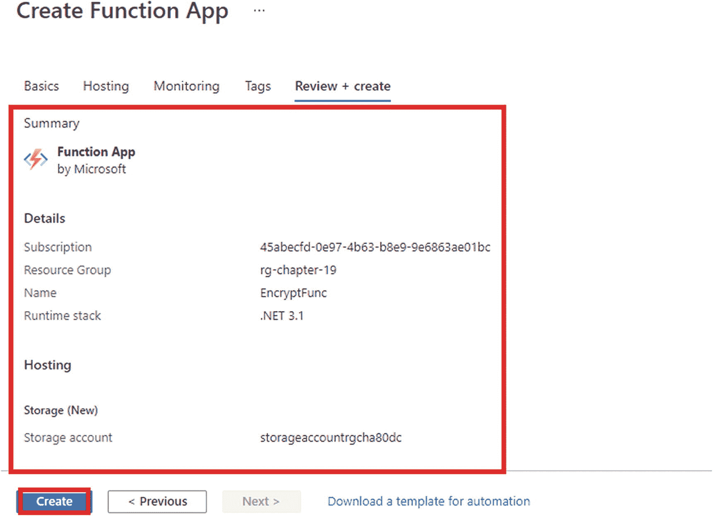

# 十九、在逻辑应用工作流中集成 Azure 函数

在前一章，我们讨论了使用 Azure 函数可用的绑定和触发器构建解决方案。有相当多的触发器和绑定可用于 Azure 函数，但有时它们不足以构建解决现实世界问题的解决方案。正如您之前看到的，您没有任何绑定来使用 Azure SQL 数据库实例执行操作；因此，您必须使用`Data.SqlClient` NuGet 包。类似地，当一条推文被发送时，当一个文件被上传到 Dropbox 时，或者当一个地方的温度发生变化时，你也没有任何触发器可以运行。这是否意味着你不能使用 Azure 函数执行这样的任务？答案是否定的。

您可以采取多种方法来完成还没有可用触发器的任务。一种方法是创建一个计时器触发的函数，该函数将每秒或每分钟运行一次，调用所需产品或服务的 REST APIs，并在业务需求得到满足时执行所需的逻辑。另一种方法是创建一个 HTTP 触发的函数，并将其 URL 配置为 webhook URL。这个用例的一个经典例子是 GitHub WebHooks，您可以将 webhook URL 配置为您的函数 URL，并选择该 webhook 将发送 HTTP POST 请求的事件，以配置 webhook URL 和有效负载。

这绝对是解决你的问题的两种方法，但是还有其他方法可以完成这些类型的任务吗？Azure 是否提供了其他服务来构建无服务器解决方案来执行此类操作？答案是肯定的。您可以使用 Azure Logic 应用构建无服务器解决方案来执行操作和解决您的业务需求。Azure Logic Apps 是由 Azure 提供的低代码无服务器产品，包含 200 多个连接器，可以与不同的产品和服务进行交互和工作。本章的重点将是学习如何使用 Azure 逻辑应用和 Azure 函数构建无服务器解决方案。

## 本章的结构

本章将探讨 Azure Logic 应用的以下方面:

*   Azure Logic Apps 解决方案入门

*   使用 Azure 门户创建 Azure 逻辑应用解决方案

*   将 Azure 函数与 Azure Logic Apps 解决方案集成

## 目标

学习完本章后，您将能够做到以下几点:

*   使用 Azure 门户创建 Azure 逻辑应用解决方案

*   在逻辑应用工作流中与 Azure 函数交互

## Azure Logic 应用入门

Azure Logic Apps 是微软 Azure 的低代码无服务器产品，使您能够构建企业级工作流。工作流可以是业务流程。Logic Apps 是一个集成平台即服务(IPaaS)产品，可帮助您集成应用、服务和系统，而无需考虑它们的托管环境。你可以使用 Azure 门户或者像 Visual Studio 或 VS Code 这样的 ide 来构建逻辑应用。Azure Logic Apps 服务包含来自不同供应商和服务提供商的 200 多个连接器，您可以使用它们构建工作流来解决您的问题，而无需编写任何代码。

连接器充当从不同的服务、应用或平台访问数据、动作和其他事件的接口。连接器是各种服务提供者公开的 REST APIs 的包装器。如果您没有产品或服务的连接器，您可以创建一个自定义连接器，前提是您有它的 OpenAPI 定义。连接器也可以有动作和触发器。

动作是由用户指示在工作流中执行的特定服务的操作。例如，您可以使用一个操作来获取 Google Drive 文件夹中所有文件的列表，或者从 Blob 存储容器中删除一个文件。Logic Apps 解决方案中的触发器类似于 Azure 函数中的触发器。当事件发生时，它们会通知您的应用。例如，重复触发器将通知您的应用以重复触发器中定义的统一间隔运行。

以下是 Azure Logic Apps 的优势:

*   高度可扩展

*   按执行付费计费模式

*   企业级集成

*   支持版本控制

*   200 多个连接器

*   可重复使用的

*   Visual Studio 和 VS 代码中的工具支持

## 在 Azure 门户中创建 Azure Logic Apps 解决方案

在本节中，您将创建一个充当 API 的 Logic Apps 解决方案，从请求体中获取一个名称，并返回一个将名称与 *Hi* 连接起来的响应。

转到 Azure 门户网站。在搜索框中输入 **Logic app** ，点击结果。见图 [19-1](#Fig1) 。


图 19-1

点击“逻辑应用”

让我们单击“添加”,然后单击“消费”来创建逻辑应用解决方案。如果您有任何现有的 logic 应用，您可以在此屏幕上找到它们。见图 [19-2](#Fig2) 。


图 19-2

单击添加，然后单击消费

系统会提示您输入订阅名称、资源组名称和逻辑应用名称。然后选择最近的区域。点击“查看+创建”见图 [19-3](#Fig3) 。


图 19-3

点击“审核+创建”

您将看到您在上一个屏幕中输入的配置摘要。单击“创建”以提供 Logic Apps 解决方案。资源调配开始前，将在后台进行验证检查。见图 [19-4](#Fig4) 。


图 19-4

单击创建

您可以在此屏幕上看到配置状态。部署完成后，单击“转到资源”见图 [19-5](#Fig5) 。


图 19-5

单击“转到资源”

在 logic 应用的屏幕上，单击“Logic 应用设计器”，它位于侧面菜单的开发工具部分。在这里，您可以找到多个模板来开始使用。单击“当收到 HTTP 请求时”模板，因为您希望在此部分构建 API。参见图 [19-6](#Fig6) 。


图 19-6

点击“逻辑应用设计器”

这将创建一个逻辑应用工作流，触发器类型为“收到 HTTP 请求时”它将接受 POST 请求。保存工作流后，您将获得向 Logic Apps 解决方案发送请求的 URL。单击“使用示例负载生成模式**”**来定义请求体 JSON 模式。见图 [19-7](#Fig7) 。


图 19-7

点按“使用示例负载来生成模式”

由于您想在请求负载中发送一个名称，我们输入 **{ "name":"" }** 作为示例 JSON 负载，如图 [19-8](#Fig8) 所示，然后单击 Done。见图 [19-8](#Fig8) 。


图 19-8

单击完成

响应主体 JSON 模式将基于您在图 [19-8](#Fig8) 所示的屏幕上输入的示例 JSON 有效负载生成。这有助于 Logic Apps 理解请求负载数据，并将 JSON 值存储为动态内容，以便在工作流的其他操作中用作变量。单击+ New 添加一个操作，以向用户返回响应。见图 [19-9](#Fig9) 。


图 19-9

单击“+新步骤”

您将看到多个连接器以及相关的动作和触发器。在搜索框中输入 **response** ，然后单击 Actions 部分中的 Response Request 选项。参见图 [19-10](#Fig10) 。


图 19-10

点击响应请求

这将在您的工作流程中添加一个响应操作。输入 **200** 作为状态代码。在正文文本框中，输入 **Hello** 后跟一个空格，然后在动态内容菜单中搜索*姓名*并点击它。这将向用户发送“Hello {name}”响应，其中 name 是用户在请求有效负载中传递的值。输入所有必填字段后，单击保存。见图 [19-11](#Fig11) 。


图 19-11

单击保存

这样你就创建了一个使用逻辑应用的 API。为了测试它，让我们单击“当接收到 HTTP 请求时”将 HTTP POST URL 的值复制到此处。参见图 [19-12](#Fig12) 。


图 19-12

复制 HTTP 帖子 URL

要测试 logic 应用，请打开 Postman 并创建一个请求。由于您的 logic 应用只接受 POST 请求，因此选择 POST 作为请求类型，然后粘贴您之前从 Logic 应用解决方案中复制的 URL。在请求正文中，以 JSON 格式发送一个名称及其值，然后单击 send。如图 [19-13](#Fig13) 中的响应体所示，您可以从您的逻辑应用解决方案中获得所需的响应。


图 19-13

点击发送

## 在逻辑应用工作流中添加 Azure 函数

在本节中，您将创建一个 Logic Apps 解决方案来从请求负载中获取文件名和文件内容。在 Azure 函数的帮助下加密文件内容后，您的 logic 应用将创建一个文件并将其存储在您的 Google Drive 中。你将使用凯撒密码作为你的加密算法。在本节结束时，您将能够使用 Google Drive 连接器，并探索将 Azure 函数集成到您的 Logic Apps 工作流中的方法。

Note

凯撒密码是一种加密算法，其工作原理是根据加密密钥将消息的每个字母移动一定数量的字母。例如，加密密钥为 1 时，您的算法会用 B 替换 A，用 B 替换 C，依此类推。

转到 Azure 门户网站。在搜索框中输入 **function app** ，点击 function app。见图 [19-14](#Fig14) 。


图 19-14

点击功能应用

点击+创建，创建一个功能 app。参见图 [19-15](#Fig15) 。


图 19-15

点击+创建

将提示您输入订阅名称、资源组名称、函数应用名称、发布方法、运行时堆栈和版本，并选择最近的地区。点击“查看+创建”参见图 [19-16](#Fig16) 。


图 19-16

点击“审核+创建”

您将看到您在上一个屏幕中输入的配置摘要。单击创建以供应功能应用。资源调配开始前，将在后台进行验证检查。参见图 [19-17](#Fig17) 。



图 19-17

单击创建

您可以在此屏幕上看到配置状态。部署完成后，单击“转到资源”参见图 [19-18](#Fig18) 。


图 19-18

单击“转到资源”

现在单击函数，然后单击+添加，在函数应用中创建一个函数。将“开发环境”选项设置为“在门户中开发”，然后选择“HTTP 触发器”作为模板类型。然后单击添加。参见图 [19-19](#Fig19) 。


图 19-19

单击添加

这将创建一个名为 HttpTrigger1 的 Azure 函数，该函数将包含样板代码，以返回一条消息以及在查询字符串或请求正文有效负载中传递的名称。可以点击 Code + Test 查看函数的代码。让我们重新编写这个函数来接受来自请求主体的消息，并使用 Caesar 密码对其进行加密。清单 [19-1](#PC1) 显示了修改后的功能代码。这里定义了两个静态方法，`Encrypt`和`CharEncrypt`。`Encrypt`方法接受带有密钥的消息。然后，它遍历消息的所有字符，并调用`CharEncrypt`方法。当字符在*A*–*Z*或*A*–*Z*之间时，`CharEncrypt`方法将字符的值转换为下一个 ASCII 值，并将`char`值返回给`Encrypt`方法，该方法会将该字符串连接成一个名为`output`的新字符串。在遍历完消息的所有字符之后，它将在响应正文中向用户返回加密的消息。

```cs
#r "Newtonsoft.Json"

using System.Net;
using Microsoft.AspNetCore.Mvc;
using Microsoft.Extensions.Primitives;
using Newtonsoft.Json;

public static async Task<IActionResult> Run(HttpRequest req, ILogger log)
{
    log.LogInformation("C# HTTP trigger function processed a request.");

    string requestBody = await new StreamReader(req.Body).ReadToEndAsync();
    dynamic data = JsonConvert.DeserializeObject(requestBody);
    string message = data.MessageContent;

    string responseMessage = Encrypt(message,1);

            return new OkObjectResult(responseMessage);
}
static char CharEncrypter(char ch, int key)
{
    if (!char.IsLetter(ch))
    {

        return ch;
    }

    char d = char.IsUpper(ch) ? 'A' : 'a';
    return (char) ((((ch + key) - d) % 26) + d);

}
static string Encrypt(string input, int key)
{
    string output = string.Empty;

    foreach (char ch in input)
        output += CharEncrypter(ch, key);

    return output;
}

Listing 19-1Modified Code of the HttpTrigger1 Function

```

现在，您的功能已经开发并运行，让我们创建您的逻辑应用。

转到 Azure 门户网站。在搜索框中键入 **Logic App** ，并在结果中选择“Logic apps”。见图 [19-20](#Fig20) 。


图 19-20

搜索逻辑应用

点击+添加，然后点击+消费。参见图 [19-21](#Fig21) 。


图 19-21

单击添加，然后单击消费

系统将提示您输入订阅名称、资源组名称和逻辑应用名称，并选择最近的地区。点击“查看+创建”参见图 [19-22](#Fig22) 。


图 19-22

点击“审核+创建”

您将看到您在上一个屏幕上输入的配置摘要。单击“创建”以提供 Logic Apps 解决方案。资源调配开始前，将在后台进行验证检查。参见图 [19-23](#Fig23) 。


图 19-23

单击创建

您可以在此屏幕上看到配置状态。部署完成后，单击“转到资源”参见图 [19-24](#Fig24) 。


图 19-24

单击“转到资源”

在 logic 应用的屏幕上，单击“Logic 应用设计器”，它位于侧菜单的开发工具部分。在这里，您可以找到多个模板来开始使用。单击“当接收到 HTTP 请求时”模板，因为您希望在此部分构建一个 API。参见图 [19-25](#Fig25) 。


图 19-25

单击“收到 HTTP 请求时”

这将创建一个逻辑应用工作流，触发器类型为“收到 HTTP 请求时”它将接受 POST 请求。保存工作流后，您将获得向 Logic Apps 解决方案发送请求的 URL。单击“使用示例负载生成模式”来定义请求体 JSON 模式。参见图 [19-26](#Fig26) 。


图 19-26

点按“使用示例负载来生成模式”

因为您想在请求有效负载中发送一个名称，所以让我们输入示例 JSON 有效负载，如下图 [19-27](#Fig27) 所示:


图 19-27

单击完成

*{*

```cs
    "FileName":"",
    "Message":""
}

```

单击完成。

响应体 JSON 模式将基于您在图 [19-27](#Fig27) 中输入的示例 JSON 有效负载生成。这有助于 Logic Apps 理解请求负载数据，并将 JSON 值存储为动态内容，以便在工作流的其他操作中用作变量。点击+ New 添加一个动作来调用你的 Azure 函数加密消息内容。见图 [19-28](#Fig28) 。


图 19-28

单击“+新步骤”

您将看到多个连接器以及相关的动作和触发器。在搜索框中输入 **Azure Function** ，然后点击操作中的“选择 Azure Function”选项。参见图 [19-29](#Fig29) 。


图 19-29

点击“选择 Azure 函数”

由于您的套餐中可能有多个功能应用，因此您必须选择其中一个。点击 EncryptFunc 函数应用。参见图 [19-30](#Fig30) 。


图 19-30

单击 EncryptFunc

由于一个功能应用可以包含多个功能，您必须选择该功能。让我们单击 HttpTrigger1 函数。见图 [19-31](#Fig31) 。


图 19-31

单击 HttpTrigger1

因为您的函数期望来自请求有效负载主体的`MessageContent`，所以您需要定义`MessageContent`。用一个名为`MessageContent`的键定义一个 JSON 有效负载，该键带有在“当接收到一个 HTTP 请求”触发器的请求有效负载中发送的消息的值。它可以在“动态内容”菜单中找到。定义请求主体后，单击“+新步骤”您的函数将接收该消息，对其进行加密，并在请求正文中返回加密的消息。见图 [19-32](#Fig32) 。


图 19-32

定义请求正文，然后单击“+新步骤”

在搜索框中输入 **Google Drive** ，选择“创建文件”动作，在 Google Drive 中创建一个文件。见图 [19-33](#Fig33) 。


图 19-33

点击“创建文件”

现在，您必须点击“登录”才能使用您的 Gmail 帐户登录。这是允许访问您的 Logic Apps 解决方案以在您的 Google Drive 中创建文件的必需步骤。参见图 [19-34](#Fig34) 。


图 19-34

点击“登录”

使用您的 Gmail 帐户登录并为您的 logic 应用授予适当的权限后，您需要定义文件夹路径、文件名和文件内容。在这种情况下，我们将文件夹名定义为`/LogicApp`。如果您的驱动器没有名为`LogicApp`的文件夹，那么您的 Logic Apps 解决方案将首先创建它。然后你需要输入文件名。在这里，您使用类型为“当接收到 HTTP 请求时”的触发器的请求有效负载中传递的值来定义文件名。最后，您必须定义文件内容。使用 HttpTrigger1 函数的响应体中返回的值来定义文件内容的值。见图 [19-35](#Fig35) 。


图 19-35

输入操作的必填字段

输入所有必填字段后，单击保存。

现在将生成触发您的逻辑应用解决方案的 URL。让我们转到触发器“当接收到 HTTP 请求时**”**并获取 HTTP POST URL。见图 [19-36](#Fig36) 。


图 19-36

复制 HTTP 帖子 URL

要测试您的逻辑应用，请打开 Postman 并添加一个请求。将从 logic 应用中复制的 HTTP POST URL 粘贴到 URL 栏中，并将请求类型定义为 POST。在请求正文中，以 JSON 格式发送一个名称及其值，然后单击 send。如图 [19-37](#Fig37) 中的响应体所示，您从您的逻辑应用中获得所需的响应。这将触发逻辑应用并启动工作流。


图 19-37

点击发送

逻辑应用将加密请求有效负载中发送的消息，然后将其存储在名为`LogicApp`的文件夹中，文件名在请求有效负载中发送。

如果您进入 Google Drive 并检查 LogicApp 文件夹，您将看到一个用请求有效负载中发送的文件名创建的文件。参见图 [19-38](#Fig38) 。


图 19-38

由 logic 应用创建的文件

如图 [19-39](#Fig39) 所示，您的逻辑应用已经在 Google Drive 中一个名为`LogicApp`的文件夹内创建了该文件，并使用凯撒密码算法加密和存储了在请求有效负载中发送的消息。


图 19-39

加密的邮件内容

## 摘要

在本章中，您学习了 Logic Apps 服务，以及如何在 Azure portal 中使用 Logic Apps 创建无服务器工作流，以借助不同的连接器、动作和触发器来解决不同的问题。首先，您使用 Logic Apps 服务应用创建了一个无服务器 API，并使用触发器和操作对其进行了测试。然后，您研究了将 Azure 函数集成到 Logic Apps 工作流中的方法，并在工作流的其他操作中使用该函数返回的响应。您还探索了使用 Google Drive 连接器的方法，在工作流中使用“创建文件”操作来创建一个文件，其中包含 Azure 函数响应中共享的消息。Logic Apps 解决方案是开始构建低代码无服务器工作流的绝佳场所。在下一章中，您将了解行业领导者在构建、设计和部署无服务器工作负载时遵循的一些最佳实践。