第二章


使用 Azure 轻松托管

在本章中，我们将向您展示如何在微软的云计算平台 Windows Azure 上托管一个显示阿炳地图的简单应用。云计算为企业和开发者提供了敏捷的 IT。如果一个企业想要部署一个新的 web 应用，传统的部署方法会要求企业建立必要的硬件、软件、操作和支持团队，以便在内部托管这个应用。有了云计算，部署该应用所需的所有基础设施都将在云上可用，从而减少了部署所需的设置时间和资金。

为什么选择 Windows Azure？

迁移到云的主要好处是节省应用部署的时间和基础架构。您可以专注于您的应用开发，而不是基础架构。后端是完全自动化的，处理操作系统和应用的修补、更新和维护。Windows Azure 遵循按使用付费的模式，你只需为你的应用使用的资源付费；没有前期成本。应用部署中的一个主要问题是经受硬件和系统故障的能力，Windows Azure 的设计考虑了高可用性。应用跨不同位置的多台服务器进行复制，以实现故障安全恢复。微软每月提供 99.95%的 SLA(服务水平协议)。

正如通常的目标一样，随着需求的增长，您的应用有时可能需要扩展。Windows Azure 是为弹性扩展而设计的，因此，可以根据需要旋转多个实例。或者，当没有需求时，客户可以将实例数量降至零。由于 Windows Azure 遵循按使用付费的模式，你只需为你使用的实例数量和你消耗的存储空间付费。另一个重要的好处是，作为 Windows Azure 存储组件的 SQL 数据库(以前的 SQL Azure)与 Microsoft SQL Server 共享相同的基本编程模型，因此，如果您熟悉 SQL Server 产品代码库，您的技能可以应用于使用 SQL 数据库。

虽然对微软来说，这是一项相对较新的业务，但 Windows Azure 的增长证明了云计算以及微软平台日益增长的重要性。截至 2013 年 4 月，微软宣布 Windows Azure 已经突破了 10 亿美元的门槛(见`http://bloom.bg/10JDhtG`)，拥有超过 20 万名客户。

云计算服务

云计算是指将计算服务放在一个可通过互联网访问的中央数据中心的概念。云计算服务的主要类型是基础设施即服务(IaaS) 、平台即服务(PaaS) 和软件即服务(SaaS) 。

*   IaaS 提供了部署应用所需的硬件，但是开发人员(客户)有责任修补、升级和维护操作系统。
*   借助 PaaS，除了硬件之外，还提供了部署应用所需的操作系统和运行时环境。
*   最后，SaaS 向客户提供完整的端到端软件应用。顾客只需要注册一个特定的服务，SaaS 会为她处理整个申请。

我们应该注意到，事实上还有其他类型的云服务，如其他云计算平台提供的安全即服务或 IT 即服务。Windows Azure 提供的服务类型包括虚拟机(VMs) (IaaS)、云应用服务(PaaS)和网站(SaaS)，如图 2-1 所示。

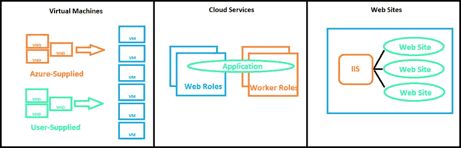

[图 2-1](#_Fig1) 。Windows Azure 提供的计算服务

虚拟机(IaaS )

您可以根据需要创建虚拟机，而不需要实际的本地物理机，无论是从您提供的映像还是从标准映像。要创建虚拟机，您只需指定要使用的虚拟硬盘(VHD)和虚拟机的大小。一旦您完成了这些，您就为您的应用定义了一个 VM 角色。本质上，Azure 在云中为你提供了一个你可以控制和管理的服务器。您可以部署任何可用的 Windows Server 或 Linux 实例。每个虚拟机都将拥有您的虚拟硬盘(VHD)，它可以包含您的定制设置以及您的应用。当虚拟机正在运行时，您可以对这些设置和应用进行更改，并且更改会持续存在，以便下次从该 VHD 创建虚拟机时，更改会得到反映。或者，您可以从云中复制更改后的 VHD，并在本地运行它。

Windows Azure 有多种不同的使用方式。首先，您可以使用它们来创建廉价的开发和测试平台。此外，您可以创建和运行应用，这些应用使用 Windows Azure 提供的任何数据管理选项以及 SQL Server 或虚拟机中运行的其他 DBMS。最后，您甚至可以将虚拟机用作本地数据中心的扩展。本质上，Windows Azure 的虚拟机为那些希望访问许多机器并完全控制其管理的人提供了最高级别的灵活性。

云服务(平台即服务

稍微不太灵活的服务是云服务。在这种情况下，您可以完全控制您的应用；但是你可以免除管理工作。在运行 Windows Server 版本的虚拟机中，可以使用 C#、Java、PHP、Python 或 Node.js 等语言在 Azure 中部署应用。澄清一下，对于上一小节中描述的虚拟机，您必须定义虚拟机基础架构；对于云服务，您将获得一个预定义的虚拟机，您可以在其上部署应用。Azure 将处理此虚拟机的所有管理，包括重新启动任何失败的虚拟机。

云服务有两种角色可供选择:Web 和工作者角色。web 角色用于前端/web 服务器。例如，您可能有一个启用了 ASP.NET 的网站。在这种情况下，您使用 Web 角色并将网站代码上传到云中。Azure 会自动将网站部署到 Azure 虚拟机(VM)实例，并在您创建的实例之间提供负载平衡。

网站(SaaS

提供最后一点灵活性的是 SaaS 的 Windows Azure 网站。该服务允许您使用任何操作系统和 ASP.Net、PHP 或 Node.js 构建一个可扩展的网站，然后将该网站部署在云上。您使用 Microsoft Internet 信息服务(IIS)来管理 web 环境。你可以直接在云中创建一个新网站，也可以将一个现有的 IIS 网站迁移到 Windows Azure 上，就像我们在本章的示例中所做的那样。您可以运行网站的多个实例，甚至可以在网站运行时移除或添加这些实例。此外，Azure 允许您在各种实例之间对网站请求进行负载平衡，以获得更高的性能。

正如你刚刚读到的，Windows Azure 为你提供了可以根据你的需求定制的服务类型。事实上，根据您的需要，您可以结合使用一种、两种或所有三种类型的服务。此外，Windows Azure 一直致力于为您提供高度可靠的云解决方案。因此，您的虚拟机和应用分布在不同的位置，并进行冗余复制，以防范硬件故障和其他此类灾难。

有时你可能想让你的解决方案的一部分托管在 Azure 上，而其余部分在本地。 **AppFabric** 是将这些部分连接在一起的粘合剂，允许您将 Windows Azure 应用与本地应用集成在一起。您可以利用**服务总线**来实现云和本地应用之间的通信。或者，您可以使用 AppFabric 的**访问控制服务**为应用创建高度安全的授权。本质上，AppFabric 是一个用于管理和监控云中运行的应用的框架。

Windows Azure 数据管理

Azure 还提供数据服务，允许你在云上存储数据。正如您在[图 2-2](#Fig2) 中看到的，存储选项的类型是 blobs、表和 SQL 数据库。它们可以通过 REST API 调用或标准 HTTP 调用来访问。在我们描述每一种存储类型之前，重要的是要注意，Windows Azure 再次允许您只为每月使用的存储量付费。此外，虽然 Azure 应用可以访问存储，但运行在本地机器上的应用也可以访问存储。

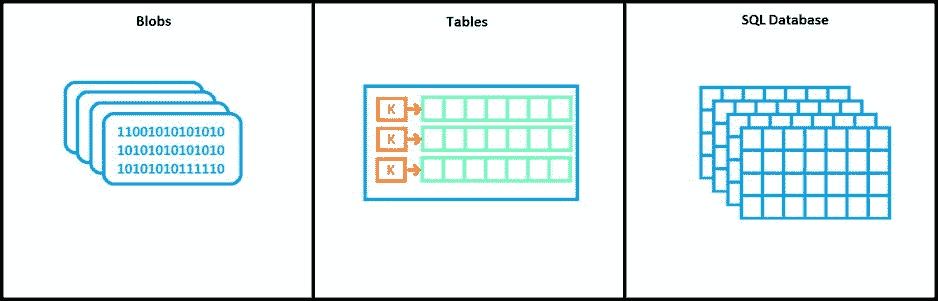

[图 2-2](#_Fig2) 。Windows Azure 提供不同类型的数据存储:Blobs、表和 SQL 数据库

斑点

blob(**B**inary**L**arge**Ob**objects)是非结构化文本或二进制数据，如图像、音频或视频。这种类型的存储并不昂贵，一个 blob 可以有 1tb 那么大。blob 被分组到容器中，您的帐户可以有无限数量的容器，每个容器可以包含无限数量的 blob。唯一的限制是，对于单个存储帐户，所有 blobs 的总大小不得超过 100TBs。在[图 2-3](#Fig3) 中，一个帐户中有 9 个 blobs，其中有 3 种类型的容器(图像、音频和视频)和 5 个不同的容器。

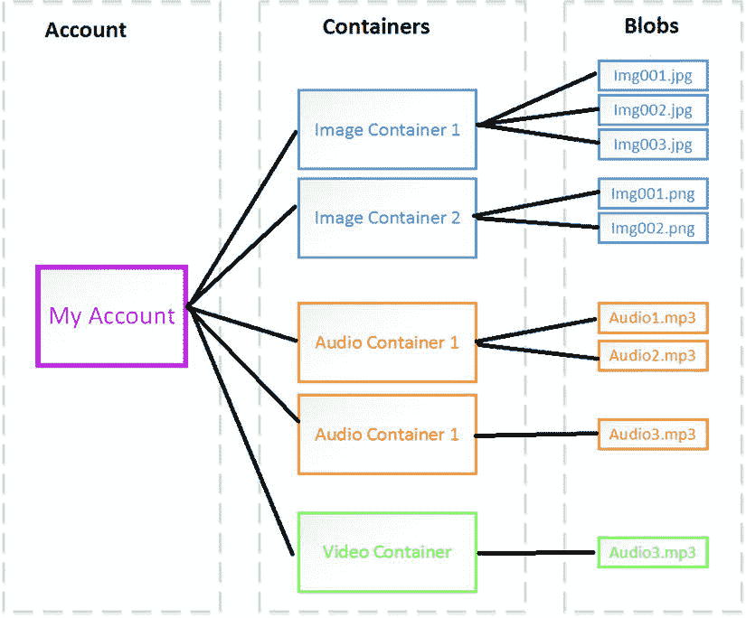

[图 2-3](#_Fig3) 。blob 存储示例。每个帐户可以有无限数量的容器，并且容器可以包含无限数量的相同类型的 blobs

表格

表格是大量结构化但非关系型的数据，如图[图 2-4](#Fig4) 所示。例如，您可能希望存储大量不需要对这些数据执行 SQL 查询的数据，但是您仍然希望快速访问这些数据。在这种情况下，表是数据存储的好选择。数据组(如日期)可以通过该组的唯一键来访问。这种类型的存储远比 SQL 数据库便宜，但仍能让您快速随机访问数据。

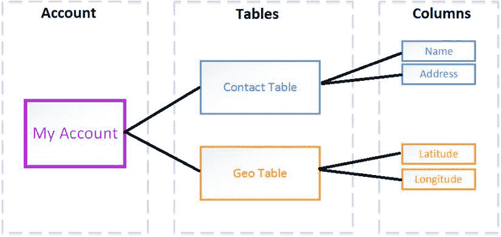

[图 2-4](#_Fig4) 。Azure 中的表存储是针对非关系数据的。一个帐户可以有 0 到 n 个相关联的表

SQL 数据库

最后，SQL 数据库是大量的结构化和关系数据。如果您熟悉使用 SQL Server，那么您就熟悉 SQL 数据库。与 SQL Server 一样，可以使用各种数据访问工具(如 ADO.NET 或 JDBC)来访问 SQL 数据库。SQL 数据库提供了作为 PaaS 的额外优势，因为虽然您可以控制数据和谁可以访问它，但 Windows Azure 会为您管理所有的硬件和基础架构。此外，SQL 数据库联合了多个服务器上的数据，如果您的数据库收到大量的访问请求，这对于提高性能特别有用。

在本书的示例中，我们将在云上存储大量地理数据。目前，在本章的例子中，我们将简单地在 Azure 上部署一个 ASP.NET MVC。

正在设置 Windows Azure

开始使用 Windows Azure 很容易。你将注册一个帐户，将 Windows Azure SDK 下载到你的计算机上，这样你就可以使用 Microsoft Visual Studio 开发你的 Windows Azure 应用，就是这样！

当您使用 Windows Azure SDK 时，您还可以在本地开发机器上对大多数 Windows Azure 功能进行建模，包括存储和托管。这在您刚开始开发时尤其方便，因为它让您可以试验 Windows Azure 和您的代码，而无需花费时间启动一个或多个虚拟机来托管您的服务。

获取 Windows Azure 帐户

在开始开发你的应用之前，你需要一个 Windows Azure 账户。微软已经使这一过程变得轻松简单。你可以在`http://bit.ly/15tpYgF` ( `http://www.windowsazure.com`)开始报名试用，如图[图 2-5](#Fig5) ，轻轻一点。

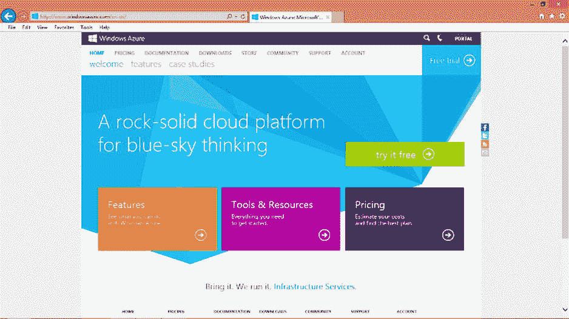

[图 2-5](#_Fig5) 。Windows Azure 网站提供了注册免费试用和帐户的简单方法

 **注**微软实验不同试用优惠；当我们写这篇文章时，试用版是三个月的免费试用——非常划算！你的里程可能会有所不同，但是，如果你是 MSDN 的成员，可能会有一个 MSDN 审判以及可用。

您需要使用 **Windows Live ID** 登录，如果您还没有 Windows Live ID，也可以注册。登录后，您将被重定向到 90 天免费试用页面，如图[图 2-6](#Fig6) 所示。注册时你需要一部手机和一张信用卡。试用期间不会从您的信用卡中扣除费用，这只是为了验证，也是微软避免垃圾邮件的一种手段。首先，您将输入一个手机号码，验证码将发送到该号码。一旦您用代码验证了您的帐户，您将被重定向到信用卡登录页面。输入您的信用卡信息后，您的登录就完成了。

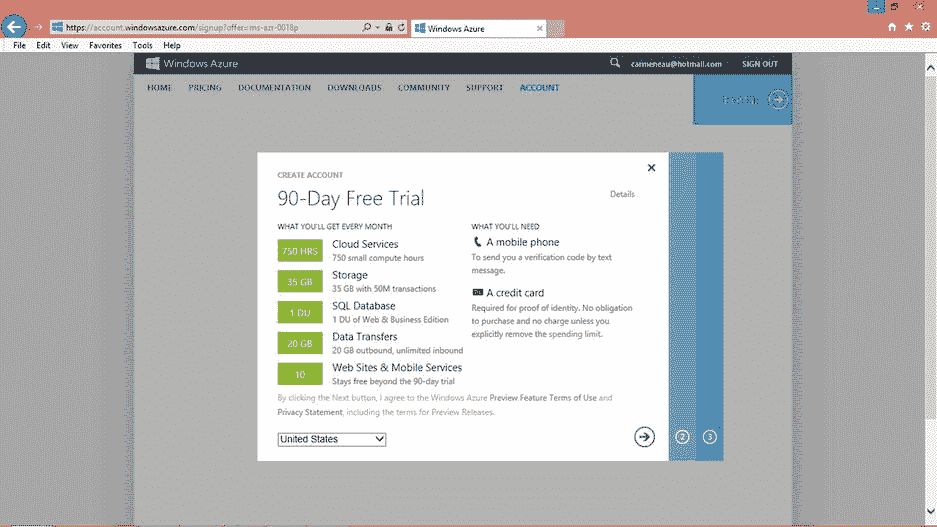

[图 2-6](#_Fig6) 。Windows Azure 90 天免费试用注册页面

获取 Windows Azure SDK

现在您已经获得了一个 Windows Azure 帐户，您将需要在您的开发计算机上安装 Windows Azure SDK。在本书中，我们将使用 Visual Studio 2012、ASP.NET 和 C#。当然，ASP.NET 并不是你可以在 Windows Azure 上使用的唯一的虚拟主机语言；[图 2-7](#Fig7) 显示了你可以在你的机器上安装不同的 SDK 进行开发。点击打开。NET 来安装 SDK。如果你的机器已经安装了 Visual Studio 2010，这也是可以接受的，但是一定要安装相应的 SDK 。或者，如果您的计算机没有安装 Visual Studio，单击安装也会在您的计算机上安装 Web Express edition。

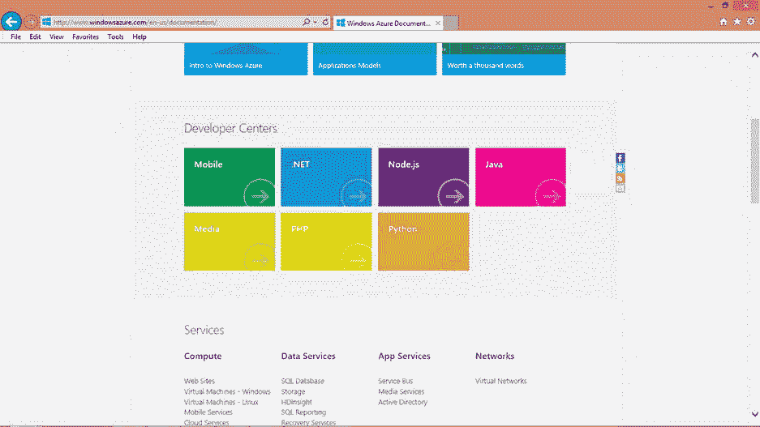

[图 2-7](#_Fig7) 。Windows Azure 网站为 Windows Azure 开发的各种 SDK 提供了简单的一键式安装

在 Azure 上托管阿炳地图

为了确保您已经正确设置了所有内容，让我们创建一个简单的网页，该网页使用 Bing Maps AJAX 控件显示地图。

获取 阿炳地图账号

如果您还没有 Bing 地图帐户，则需要获得 Bing 地图帐户才能使用 Bing 地图。可以在`http://bit.ly/ZmFU3q` ( `https://www.bingmapsportal.com`)进行。您需要在新用户框中点击**创建**。您需要再次使用您的 Windows Live ID 帐户登录。一旦你这样做，你将需要提供一个帐户名称，联系人姓名，公司名称，电子邮件地址，电话号码，并同意必应地图的使用条款。保存这些信息后，您现在就拥有了阿炳地图帐户。

获取 阿炳地图密钥

即使你有一个帐户，你仍然需要一个密钥才能使用 Bing 地图 API。您可以在获取 Bing 地图帐户的同一个网站上完成此操作。如果您尚未登录，系统将提示您使用 Windows Live ID 登录。一旦你这样做了，你就可以通过点击**我的账户**下的**创建或查看密钥**来获得密钥。您需要填写图 2-8 中[的表格。应用名称以及密钥类型是必需的。在本书中，我们使用一个基本键，用于在 24 小时内不超过 50，000 笔任何类型交易的非试用应用。基本密钥必须符合 Bings 地图的使用条款，您可以在`http://bit.ly/16Bx1bS`阅读该条款。](#Fig8)

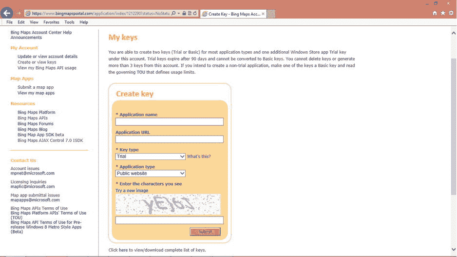

[图 2-8](#_Fig8) 。通过在`www.bingmapsportal.com`创建一个密钥来获取一个密钥以使用 Bing 地图 API

提交创建密钥表单后，您将拥有一个可用于 Bing Maps API 的密钥。它应该类似于以下字符串:

```cs
XX_XXXxX_x_XXXXXXXX-XXXXXXXXX-1xXxXxXXXXXXxXXxx-xxXxXXXXxxx_xXXX
```

 **注意**确保你随身携带了一份 Bing 地图密钥的副本，因为你在研究本书中的示例代码时会用到它。

有了这个字符串，您就可以使用 Bing Maps API 来构建我们的示例应用了。

构建必应地图

现在您已经拥有了阿炳地图 API 密匙，可以开始使用 Bing 地图 API 来构建您的地图了。微软在必应地图门户网站上提供阿炳地图 API 交互式 SDK。在该门户网站上，您可以选择想要添加到地图中的要素类型，并通过点击**查看 HTML** 获取相应的 HTML 代码列表来创建这样的地图，如图 2-9 中的[所示。](#Fig9)

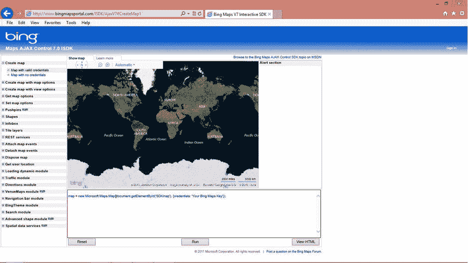

[图 2-9](#_Fig9) 。Bing 地图 API 交互式 SDK 为地图创建提供支持

对于我们的例子，我们使用带有正确凭证的基本映射。凭证是我们在上一节中获得的 Bing 地图密钥。您将用密钥替换字符串“您的 Bing 地图密钥”。因此，你的 HTML 清单将看起来像清单 2-1 中的代码。然后，您可以将此列表保存为 HTML 文件，并在浏览器中查看。我们已将此列表保存为 Map.htm 的**。该地图具有基本的缩放功能，以及在道路和鸟瞰图之间切换的选项。**

 *****[清单 2-1](#_list1)*** 。Map.htm，HTML 代码为一个基本的必应地图与有效凭证

```cs
<!DOCTYPE html PUBLIC "-//W3C//DTD XHTML 1.0 Transitional//EN"
"http://www.w3.org/TR/xhtml1/DTD/xhtml1-transitional.dtd">
<html>
   <head>
      <title>Map with valid credentials</title>
      <meta http-equiv="Content-Type" content="text/html; charset=utf-8"/>
      <script
          type="text/javascript"
          src="http://ecn.dev.virtualearth.net/mapcontrol/mapcontrol.ashx?v=7.0">
      </script>
      <script type="text/javascript">
      var map = null;

      function getMap()
      {
          map = new Microsoft.Maps.Map(document.getElementById('myMap'),
          {
              credentials:
            'XX_XXXxX_x_XXXXXXXX-XXXXXXXXX-1xXxXxXXXXXXxXXxx-xxXxXXXXxxx_xXXX'
        });
      }
      </script>
   </head>
   <body onload="getMap();">
      <div id='myMap' style="position:relative; width:400px; height:400px;"></div>
   </body>
</html>

```

在 Windows Azure 上托管 Bing 地图

既然您已经创建了地图，我们将向您展示如何在 Windows Azure 上以编程方式托管它。

在 Visual Studio 中，为 C#创建一个新的 ASP.NET MVC 4 Web 应用项目，如图[图 2-10](#Fig10) 。我们将该项目保存为**BingMapOnAzure**T5】。

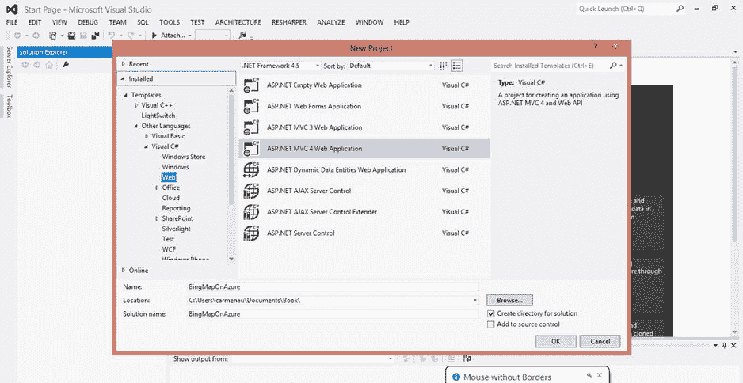

[图 2-10](#_Fig10) 。Visual Studio 2012，创建一个 ASP。NET MVC 4 Web 应用

选择**互联网应用**模板。该模板生成创建基本 MVC web 应用的代码，其网页看起来像[图 2-11](#Fig11) 。

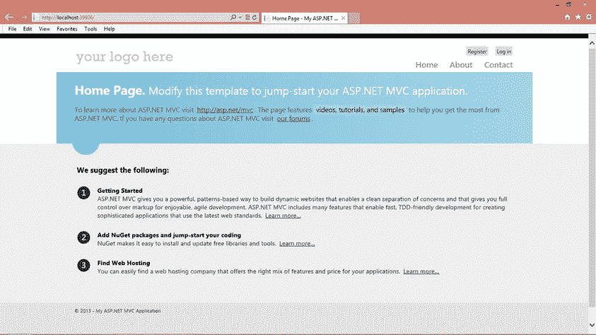

[图 2-11](#_Fig11) 。由 Visual Studio 中的代码模板生成的基本 MVC Web 应用网页

我们现在将修改这个模板代码来托管您在上一节中生成的 Bing 地图。在当前模板中，有不同的页签:**首页**、**关于、**和**联系人**。我们将修改**关于**页面上的地图。首先，在清单中，您将在代码清单中将页面名称从 **About** 更改为 **Map** ，并在解决方案浏览器中将 **About.cshtml** 文件名更改为 **Map.cshtml** ，如图 2-12 中的[所示。](#Fig12)

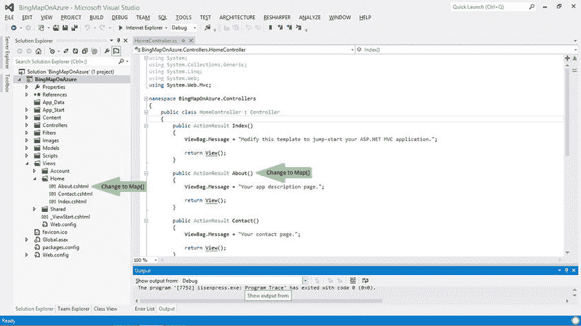

[图 2-12](#_Fig12) 。将网页名称和文件名从“关于地图”

在 **_Layout.cshtml** 中，将动作链接参数从 About 改为 Map，参见[图 2-13](#Fig13) 。

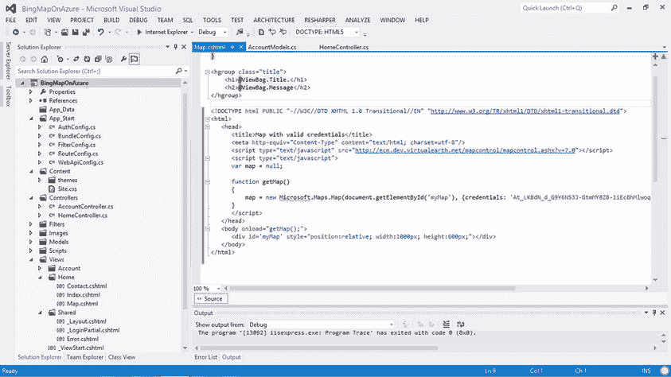

[图 2-13](#_Fig13) 。更改要映射的链接

在 Map.cshtml 中，粘贴来自[清单 2-1](#list1) 的 Bing 地图代码清单，如图[图 2-14](#Fig14) 所示。


[图 2-14](#_Fig14) 。Map.cshtml 带 Bing 的地图代码清单来自[清单 2-1](#list1)

现在，我们将代码模板转换为 Azure 支持，以便能够在 Windows Azure 上部署项目。为此，您可以在解决方案浏览器中右键单击该项目，并选择**添加 Windows Azure 云服务项目，**如图[图 2-15](#Fig15) 所示。通过这样做，我们现在已经在解决方案中添加了另一个项目，默认情况下这个项目叫做 **BingMapOnAzure。天蓝色**。此项目将管理在 Azure 上部署所需的部署设置和配置设置。你现在可以在 Azure 上运行这个项目，或者在你机器上安装的 Azure SDK 附带的 Azure 模拟器上运行。

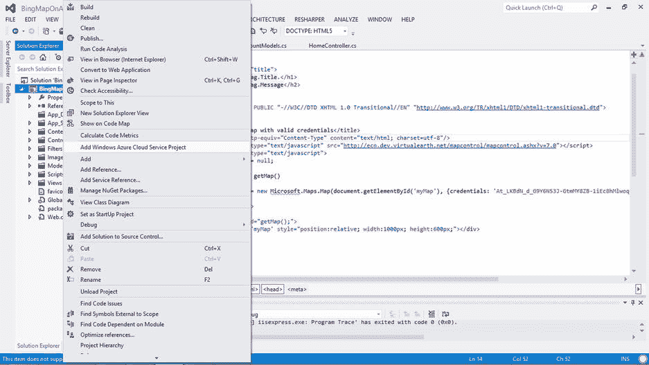

[图 2-15](#_Fig15) 。要启用 Azure 项目，右键单击添加 Windows Azure 云服务项目

一旦项目启用了 Azure，要在 Azure 上部署，右键单击项目并选择 **Publish** 。您将被带到发布登录页面，[，图 2-16](#Fig16) 。您必须在此添加您的 Azure 帐户凭据。为此，您必须登录到您的 Windows Live ID。如果您尚未登录，您将被带到 web 浏览器中的登录页面。登录后，它会自动将您的凭据下载到您的计算机上。将文件保存在可以再次找到的地方。在发布登录页面中导入此文件。

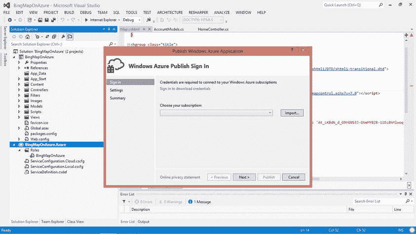

[图 2-16](#_Fig16) 。Windows Azure 发布登录页面。单击“导入”添加您的凭据

下一步是创建您的云服务。在发布签到页面和设置中，如[图 2-17](#Fig17) 所示，我们将我们的云服务命名为 BingMapOnAzure，并选择了 West US 的位置。点击**确定**，然后**发布**，开始部署到 Azure。

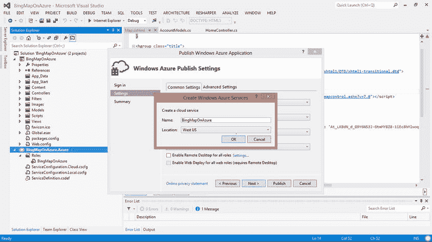

[图 2-17](#_Fig17) 。创建云服务

 **注意**Windows Azure 活动日志中部署状态旁边的惊叹号并不是警告或小心标志，不要因此而惊慌。选择图标来表示部署正在进行是一个不幸的选择。

部署完成后，你可以点击 Windows Azure 活动日志中的网站链接:`http://bingmaponazure.cloudapp.net`，如图[图 2-18](#Fig18) 。

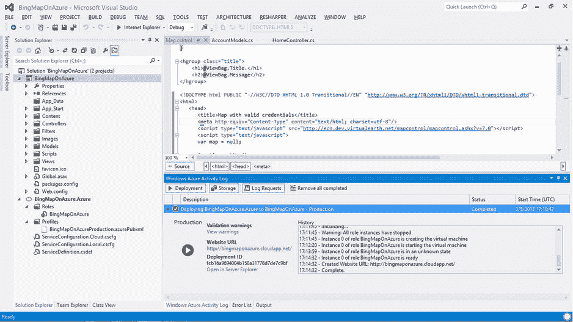

[图 2-18](#_Fig18) 。一旦部署完成，你可以点击网站网址

通过点击网站 URL ，运行在 Azure 上的应用将在 web 浏览器中打开。[图 2-19](#Fig19) 显示了在网络浏览器中运行的 Bing 地图应用。

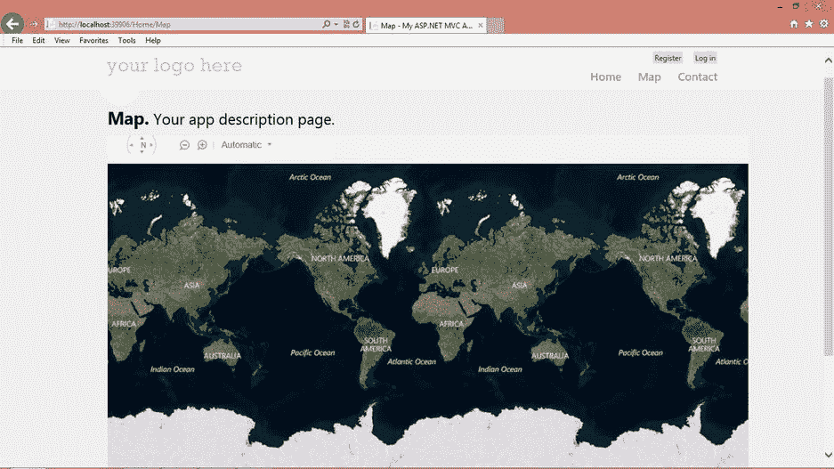

[图 2-19](#_Fig19) 。必应地图应用

包扎

在这一章中，我们学习了在 Windows Azure 上托管。对于那些希望在云中管理自己的虚拟机、部署应用同时将操作系统的管理留给 Azure，或者只是在云中托管网站的人来说，Windows Azure 是一个强大、易于安装、经济高效的解决方案。使用基于云的解决方案，您可以避免与本地托管硬件、基础架构和支持团队等相关的所有成本。此外，Azure 遵循按使用付费的模式，你只需为你使用的东西付费，从而大大降低了成本。Azure 的构建也考虑到了可靠性和健壮性。您的数据和应用被复制到位于不同物理位置的多台服务器上，以保护您免受任何硬件故障或其他可能发生的灾难的影响。Azure 的另一个优势是易用性。只需点击一下，安装就完成了！任何熟悉。NET 已经为在 Azure 中部署编程做好了准备。或者，也可以用 Node.js 甚至 PHP 开发。

本章中的示例向您展示了如何安装 Windows Azure、获取阿炳地图密钥、在中构建阿炳地图。NET，最后在 Azure 上部署这个地图。在接下来的章节中，我们将向你展示如何将你的地理空间数据放到 Azure 存储上，以及如何管理这些数据。**