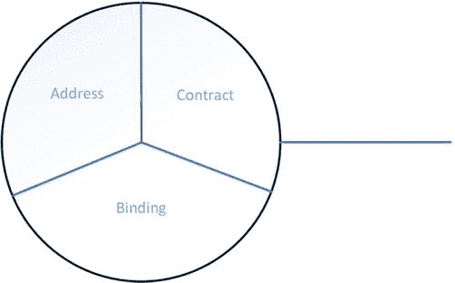

第四章


在 Windows Azure 上托管 WCF 服务

在第 3 章中，我们展示了如何将地理空间数据导入 Azure SQL 数据库。在本章中，我们将向您展示如何在 Windows Azure 上创建和托管 WCF(Windows Communication Foundation)服务，将您的地理空间数据提供给客户端应用。在接下来的部分，我们会给你一个关于 WCF 的速成课程。为了更深入地理解它，我们推荐一本专门的 WCF 书籍，如 Nishith Pathak 的 *Pro WCF4:实用的微软 SOA 实现*。

WCF:速成班

WCF 是一个开发和部署面向服务的应用的框架。这些服务是松散耦合的，提供一些功能，并且彼此之间没有内部调用。使用 WCF，数据可以在服务端点之间异步发送。一组服务将共同提供整个软件应用的完整功能。例如，如果构建一个 ATM 机软件，一个服务可以处理登录，另一个显示余额，另一个计算和减去。这些服务提供了自动柜员机软件的全部功能。这种面向服务的设计原则被称为面向服务的架构(SOA)。SOA 是 WCF 赖以建立的架构。我们现在将描述服务以及它们如何通信。

服务

SOA 允许分布式计算，因此服务不需要位于同一位置。此外，服务可以有多方使用，并且可以在不同的时间表上执行。服务甚至可以独立于版本。

客户端使用服务的功能。客户端的例子可以是 WPF、Windows 窗体，甚至是 ASP.NET 网页。客户端和服务通过来回发送消息进行通信。服务公开描述服务功能的元数据，以及客户端应该如何与之通信。然后，客户端使用代理与服务间接通信。客户端的代理可以与一个或多个服务的端点通信。正如你在[图 4-1](#Fig1) 中看到的，有两个位置，也许“位置 1”是本地的，“位置 2”是远程的。机器 2 正在运行一个客户端，并且可以通过客户端代理与机器 1 上运行的服务进行通信。同样，机器 4 有一个客户机，它的代理正在与机器 3 上运行的服务通信。此外，机器 4 的客户端也通过互联网与机器 1 的服务通信。在图 4.1 的例子中，我们看到一个客户端可以与一个服务远程通信，但是它也可以与不止一个服务通信。由于客户端使用代理，编程模型得到了简化，因为所有类型的客户端，无论位于何处，都需要使用代理。


[图 4-1](#_Fig1) 。WCF 通信。客户端通过代理与服务通信

在[图 4-1](#Fig1) 中，也有代表端点的紫色圆圈。端点包含地址、绑定和契约，可以方便地缩写为 ABC。我们将随后描述端点的 ABC。

端点

端点由三部分组成:地址、绑定和契约，如图 4-2 所示。每个端点必须包含所有三个部分。每个服务必须公开至少一个端点；然而，它可以有多个端点。这些端点可以使用相同或不同的绑定，并且可以具有相同或不同的协定。这些端点之间没有关系。



[图 4-2](#_Fig2) 。端点

地址

在 WCF，每个服务都有一个唯一的地址，格式如下:[基址]/[可选 URI]，其中基址看起来像:[传输方案]://[机器或域][:可选端口]。

*   传输方案是以下受支持的方案之一:

*   HTTPS 网站
*   三氯苯酚
*   工业程序控制（ industrial process control 的缩写）
*   对等网络
*   消息队列
*   服务总线

服务地址的一个例子是`http://localhost:8000`或`net.tcp//localhost:8002/myservice.`

绑定

绑定 是通过指定通信协议来指定如何传输数据。数据传输要考虑的第一个方面是传输方法。上面我们列出了一些支持的传输协议(HTTP，TCP 等。).除了不同的传输协议，还有不同的消息编码选项。例如，您可以选择将消息保留为纯文本，或者可以使用二进制编码，或者对于较大的负载，您可以使用消息传输优化机制(MTOM)。还有不同的消息认证选项可供选择。由于消息传递并不总是可靠的，因此对消息进行认证非常重要。其他选择包括安全类型、事务传播和互操作性。正如你所看到的，有潜在的成千上万种排列可供你选择，只是为了传递你的信息。WCF 通过将包括传输协议、消息编码和消息认证在内的多组通信分组到预定义的绑定中，简化了您的选择。因此，绑定是为您的消息通信预先定义的一组一致的选项。

以下是一些常见的绑定:

*   **基本绑定:** 基本上看起来像是通过基本 web 服务概要进行通信的遗留 web 服务。
*   **TCP 绑定 :** 使用 TCP 通过内部网进行通信
*   **IPC 绑定 :** 用于同机通讯
*   **Web 服务绑定 :** 使用 HTTP 或 HTTPS 在互联网上传输
*   **MSMQ 绑定 :** 用于断线排队呼叫的绑定。

选择哪种绑定在很大程度上取决于架构决策。例如，支持在 web 浏览器中运行的外部客户端的 web 服务可能会选择 web 服务绑定；全部在 C#中运行的专用客户机-服务器可能使用 TCP 绑定，因为它的开销较低，或者使用 web 服务绑定，以允许其他 web 客户机在应用的生命周期内进行访问。当有疑问时，web 服务绑定是一个合理的选择。

合同

服务通过一个**端点**公开描述服务功能的**契约**。WCF 定义了不同类型的合同:

*   **服务合同** :描述客户端可以对服务进行哪些操作。
*   **数据契约** :描述传递给服务的数据类型。虽然 int 和 string 是两种预定义的类型，但是您也可以定义一些自定义类型。
*   **错误契约:**定义服务引发了哪些错误，以及服务如何处理这些错误。
*   **消息契约** :允许服务直接与消息交互。

端点 的示例如下:

```cs
<system.serviceModel>
  <services>
    <service name = "MyNamespace.MyService">
      <endpoint
        address = "http://localhost:8000/MyService"
        binding = "wsHttpBinding"
        contract = "MyNamespace.IMyContract"
      />
    </service>
  </services>
</system.serviceModel>
```

同一个服务可以有多个端点 ，如下所示:

```cs
<system.serviceModel>
  <services>
    <service name = "MyNamespace.MyService">
      <endpoint
        address = "http://localhost:8000/MyService"
        binding = "wsHttpBinding"
        contract = "MyNamespace.IMyContract"
      />
      <endpoint
        address = "net.tcp://localhost:8002/MyService"
        binding = "NetTcpBinding"
        contract = "MyNamespace.IMyContract"
      />
      <endpoint
        address = "net.msmq://localhost/private/MyQueue"
        binding = "NetMsmqBinding"
        contract = "MyNamespace.IMyOtherContract"
      />
    </service>
  </services>
</system.serviceModel>
```

或者，您可以只依靠 WCF 向服务添加默认端点，而不提供端点规范。例如，如果使用 HTTP，WCF 将使用基本绑定。

主持

要讨论的另一个方面是托管的概念。每个 WCF 服务都承载在一个称为主机进程的 Windows 进程中，该进程可以承载多个服务。此外，单个服务可以由多个流程托管。该主机可以由 Internet 信息服务(IIS)、Windows 激活服务(WAS)提供，或者最近由 Windows Server AppFabric 提供。宿主也可以由开发人员作为应用的一部分提供。Windows Server AppFabric 为 WCF 服务和工作流服务提供了附加的配置选项、监视、检测和事件跟踪。它允许服务自动启动，而不需要第一个客户端请求。服务主机将如下所示:

```cs
ServiceHost host = new ServiceHost(typeof(MyService),
  httpBaseAddress,
  tcpBaseAddress,
  icpBaseAddress);
host.Open();
```

WCF 客户端

WCF 客户端应用使用 WCF 客户端代理与服务进行通信。应用导入服务的元数据，以生成可用于调用服务的必要代码。客户端首先必须编译服务代码，然后必须生成 WCF 客户端代理，最后必须实例化 WCF 客户端代理。之后，客户端就可以使用该服务了。

WCF 客户端代理

可以使用 Visual Studio 通过使用**添加服务引用**选项(在解决方案资源管理器中右键单击项目)来生成客户端代理。或者，也可以通过使用服务模型元数据实用工具来生成，该工具是一种从元数据生成代码的命令行工具。

WCF 地震数据服务

在这一节中，我们将向您展示如何构建一个 WCF 服务，使客户端应用能够向数据库查询我们在第 3 章中加载到 Azure SQL 数据库中的地震数据。然后，我们将向您展示如何在 Azure 上托管该服务，最后展示如何编写调用该服务的客户端应用。

创建 WCF 服务

1.  启动 Visual Studio 2012 并以管理员身份运行。要以管理员身份运行，右键单击应用并选择“以管理员身份运行”。
2.  在菜单中，通过选择文件新建项目启动一个新项目。
3.  在**模板**下，选择 **Visual C#** 然后选择**云**，选择 **Windows Azure 云服务**(很可能是列表中唯一的选择)。我们将我们的项目命名为**wcfearthwakeservice。**点击确定。
4.  在生成的新 Windows Azure 云服务窗口中，从 Visual C#中选择。NET 框架角色 WCF 服务 Web 角色，点击将角色添加到 Windows Azure 云服务解决方案中。单击确定。Visual Studio 将创建解决方案。
5.  Select IService.cs to modify it with the desired interface to your service. In our case, you will add the following code listing:

    ***[清单 4-1](#_list1)*** 。WCF 服务的服务接口

    ```cs
    using System;
    using System.Collections.Generic;
    using System.ServiceModel;

    namespace WCFServiceWebRole1
    {
        [ServiceContract]
        public interface IService1
        {

            [OperationContract]
            List<Earthquake> GetEarthquakeData();

            [OperationContract]
            List<Earthquake> GetEarthquakeDataBBox(double TLLong, double TLLat,
              double BRLong, double BRLat);
        }
    }
    ```

    你会注意到在清单 4-1 中声明了两个方法，每个方法前面都有声明`[OperationContract]`,表明该方法定义了一个操作，该操作是 WCF 应用服务契约的一部分。这两种方法都将从 Azure SQL 数据库中检索地震数据，第一种方法将返回数据库中的所有地震数据，第二种方法`GetEarthquakeDataBBox`将返回给定边界框内的地震数据。边框由边框左上角的经纬度(`TLLong`、`TLLat`)和边框右下角的经纬度(`BRLong`、`BRLat`)定义。

    这两种方法都返回第三章中[的地震. cs 中定义的`Earthquake`对象列表。您需要修改该类，以便成为服务合同的一部分。正如您在](03.html)[清单 4-2](#list2) 中所看到的，该类被定义为数据契约的一部分，并且该类的每个成员都被定义为数据成员。

     **注意**为了能够使用`Location`类型，不要忘记添加 MapControl 引用。

    ***[清单 4-2](#_list2)*** 。每个成员都必须明确定义为数据成员

    ```cs
    using System;
    using System.Runtime.Serialization;
    using Microsoft.Maps.MapControl.WPF;

    namespace WCFServiceWebRole1
    {
        [DataContract]
        public class Earthquake
        {
            [DataMember]
            public DateTime When { get; set; }
            [DataMember]
            public Location Location { get; set; }
            [DataMember]
            public float Depth { get; set; }
            [DataMember]
            public float Magnitude { get; set; }
            [DataMember]
            public string MagType { get; set; }
            [DataMember]
            public int NbStation { get; set; }
            [DataMember]
            public int Gap { get; set; }
            [DataMember]
            public float Distance { get; set; }
            [DataMember]
            public float RMS { get; set; }
            [DataMember]
            public string Source { get; set; }
            [DataMember]
            public string EventID { get; set; }
            [DataMember]
            public float Version { get; set; }
            [DataMember]
            public string Title { get; set; }
            [DataMember]
            public string Description { get; set; }

            public Earthquake(DateTime when, Location where,
              float depth, float magnitude, string magType,
              int nbStation, int gap, float distance, float rms,
              string source, string eventId, float version,
                string title, string description = "")
            {
                When = when;
                Location = where;
                Depth = depth;
                Magnitude = magnitude;
                MagType = magType;
                NbStation = nbStation;
                Gap = gap;
                Distance = distance;
                RMS = rms;
                Source = source;
                EventID = eventId;
                Version = version;
                Title = title;
                Description = description;
            }
        }
    }

    ```

6.  Next we will modify the `Service1.svc.cs`, which contains the implementation of the two methods declared in the service interface, `IService.cs`. To implement `GetEarthquakeData()`, you will query the database for all the earthquakes with the following query string:

    ```cs
    SELECT <desired fields> FROM <my SQL table name>.
    ```

    在我们的案例中，它将是:

    ```cs
    SELECT DateTime, Position, Magnitude, Depth, MagType, NbStation, Gap, Distance, RMS, Source, EventID, Version, Title FROM earthquakeData
    ```

    该方法的完整列表在[列表 4-3](#list3) 中。

    ***[清单 4-3](#_list3)*** 。方法来创建查询字符串，以从 SQL 数据库中请求所有地震

    ```cs
    public List<Earthquake> GetEarthquakeData()
    {
      string tableName = "earthquakeData";
        var queryString = "SELECT DateTime, " +
          "Position, " +
          "Magnitude, " +
          "Depth, " +
          "MagType, " +
          "NbStation, " +
          "Gap, " +
          "Distance, " +
          "RMS, " +
          "Source, " +
          "EventID, " +
          "Version, " +
          "Title FROM " + tableName;
        return GetEarthquakesFromSql(queryString);
    }
    ```

    很明显，代码中有一个重要的部分被抽象掉了，你可以在方法`GetEarthquakesFromSql`中找到。首先，您将像在第 3 章中所做的那样创建到数据库的连接。您将使用与在第 3 章的[中相同的凭证，并且如果您想要检索在前面的例子中获取的相同的地震数据，您还应该使用与在第 3 章](03.html)的[中相同的服务器、数据库和表。](03.html)

    一旦您检索到数据，您将需要将该数据解析到`Earthquake`类中，并添加到我们定义为`data`的`Earthquake`列表中。在很大程度上，解析数据很简单，尤其是在检索常见类型时，比如`string`和`int`。您必须简单地将 SQL 对象转换为正确的类型。您会注意到在 SQL 中作为`float`类型存储的幅度和其他数据的奇数双精度转换。出于某种原因，SQL Server 中的一个`float`被检索为的类型`double`。NET，所以你需要转换到`double`，然后再转换回`float`。最后，我们看看如何解析地理数据。当 SQL 阅读器从 SQL 数据库接收地理数据时，阅读器还不知道该数据的类型。因此，直接强制转换是不可能的。此问题的解决方法是将数据读入一个字节数组，然后转换为`SQLGeography`类型。从那里，您可以将这个数据从`MapControl`转换成`Earthquake`对象期望的`Location`数据的`Location`类型。

    为了使用`SQLGeography`类型，您需要包含对`SqlServer.Types`的引用。您通常可以在计算机上的 SQL Server 库中找到该库。在我们的例子中，它是在

    ```cs
    C:\Program Files (x86)\Microsoft SQL Server\110\SDK\Assemblies.

    ```

     **注意**为了将引用包含在您将为 Azure 创建的包中，右键单击引用，然后选择 Properties。在复制本地下，你应该确保它是**真的**。将该属性保留为 False 将导致引用不会被复制到输出目录，因此不会包含在您将部署到 Azure 的服务包中。

    您需要包含的名称空间也在[清单 4-4](#list4) 中列出。

    ***[清单 4-4](#_list4)*** 。方法在 Azure SQL 数据库中查询地震数据

    ```cs
    using System;
    using System.Collections.Generic;
    using System.Data.SqlClient;
    using Microsoft.Maps.MapControl.WPF;
    using Microsoft.SqlServer.Types;

    public List<Earthquake> GetEarthquakesFromSql(String queryString)
    {
      // Provide the following information
      string userName = <my Azure SQL Database username>;
      string password = <my Azure SQL Database password> ;
      string dataSource = <my Azure SQL Server name>
      string sampleDatabaseName = <my Azure SQL Database name>;

      // Create a connection string for the sample database
      SqlConnectionStringBuilder connString2Builder;
      connString2Builder = new SqlConnectionStringBuilder();
      connString2Builder.DataSource = dataSource;
      connString2Builder.InitialCatalog = sampleDatabaseName;
      connString2Builder.Encrypt = true;
      connString2Builder.TrustServerCertificate = false;
      connString2Builder.UserID = userName;
      connString2Builder.Password = password;

      // Connect to the sample database and perform various operations
      using (SqlConnection conn = new SqlConnection(connString2Builder.ToString()))
      {
        SqlCommand cmd = conn.CreateCommand();
        conn.Open();
        cmd.CommandText = queryString;

        var data = new List<Earthquake>();
        using (SqlDataReader reader = cmd.ExecuteReader())
        {
          while (reader.Read())
          {
            var when = (DateTime)reader.GetValue(0);
            var position = SqlGeography.Deserialize(reader.GetSqlBytes(1));
            var where = new Location((double)position.Lat, (double)position.Long);
            var magnitude = (float)(double)reader.GetValue(2);
            var depth = (float)(double)reader.GetValue(3);
            var magType = (string)reader.GetValue(4);
            var nbStation = (int)reader.GetValue(5);
            var gap = (int)reader.GetValue(6);
            var distance = (float)(double)reader.GetValue(7);
            var rms = (float)(double)reader.GetValue(8);
            var source = (string)reader.GetValue(9);
            var eventId = (string)reader.GetValue(10);
            var version = (float)(double)reader.GetValue(11);
            var title = (string)reader.GetValue(12);

            data.Add(new Earthquake(when,
              where,
              depth,
              magnitude,
              magType,
              nbStation,
              gap,
              distance,
              rms,
              source,
              eventId,
              version,
              title));
            }
          }

        conn.Close();

        return data;
      }
    }
    ```

    `GetEarthquakeDataBBox`的实现本质上与`GetEarthquakeData`一样，但是，查询字符串的不同之处在于，我们将在查询中添加一个过滤器来定义边界框，并过滤数据以仅返回位于边界框内的条目。查询字符串将具有以下格式:

    ```cs
    DECLARE @g geography; SET @g=geography::STGeomFromText('POLYGON((<my bounding box coordinates>))', 4326); SELECT <desired fields> FROM <my SQL database table name> WHERE <my geo data field>.Filter(@g)=1"
    ```

    注意我们在这里是如何使用 SQL 扩展的:我们创建一个边界坐标的多边形，并在表中执行地理空间查询。

    在我们的例子中，我们创建了清单 4-5 中的字符串。

    ***[清单 4-5](#_list5)*** 。请求边界框内的所有地震数据

    ```cs
    public List<Earthquake> GetEarthquakeDataBBox(double TLLong, double TLLat,
      double BRLong, double BRLat)
    {
      string tableName = "earthquakeData";
      var selectString = "SELECT DateTime, " +
        "Position, " +
        "Magnitude, " +
        "Depth, " +
        "MagType, " +
        "NbStation, " +
        "Gap, " +
        "Distance, " +
        "RMS, " +
        "Source, " +
        "EventID, " +
        "Version, " +
        "Title FROM " + tableName;

      string bboxString = "POLYGON((" +
        TLLong + " " + TLLat + ", " +
        BRLong + " " + TLLat + ", " +
        BRLong + " " + BRLat + ", " +
        TLLong + " " + BRLat + ", " +
        TLLong + " " + TLLat +
        "))";
      var setGeometry = "DECLARE @g geography; SET @g=geography::STGeomFromText('" +
        bboxString + "', 4326); ";
      var queryFilter = " WHERE Position.Filter(@g)=1";

      var queryString = setGeometry + selectString + queryFilter;
      return GetEarthquakesFromSql(queryString);
    }

    ```

7.  现在您已经创建了您的 WCF 服务，您可以通过选择 DebugStart Without Debug 来本地运行它。Visual Studio 将启动浏览器，让您的服务使用 URL`http://127.0.0.2:81/Service1.svc`(端口号可能不同)运行。现在，该服务正在本地运行。

虽然对于实现来说不是必需的，但是我们希望您注意一下`ServiceDefinition.csdef`文件。这个文件包含了我们在本章开始时讨论的所有服务定义。您会注意到，当您创建解决方案时，绑定和端点都是自动生成的！您还可以在该文件中指定虚拟机的大小。默认值设置为“小”,但您可能希望在测试时将其设置为“超小”,因为超小虚拟机的每次使用费用最低。

另外两个文件自动生成:`ServiceConfiguration.Local.cscfg`和`ServiceConfiguration.Cloud.cscfg`。这些文件为您的应用提供配置设置，包括为每个角色运行的实例数量。默认情况下，实例计数设置为 1。对于我们的示例代码，我们将该实例编号保留为 1，但是为了稳定起见，在部署您自己的应用时，您可能希望运行同一个角色的多个实例。

在 Azure 上托管 WCF 服务

1.  You will need to publish the service package and service configuration package before you can deploy your service on Azure. Right-click on the `WCFEarthquakeService` project name in the Solution Explorer and select Package. A Package Windows Azure Application pop-up window will appear.

    

    由于您将部署到 Azure，您可以将服务配置保留为云。点击**包**。Visual Studio 将打开一个文件夹，其中包含您的两个文件: **ServiceConfiguration。Cloud.cscfg** 和**wcfearthwakeservice . cs pkg**，分别是配置文件和服务包。记下这些文件的保存位置，因为您以后会需要它们。

2.  在 **`windowsazure.com`** 登录您的 Windows Azure 管理门户。您可以点击页面顶部的**门户**。或者直接去`http://manage.windowsazure.com`就可以到了。
3.  Select New at the bottom of the page in order to create a new service.

    

4.  Create a new custom Cloud Service. Note, you may find that some sites refer to this as a Hosted Service.

    

5.  You will be asked to give a URL name to the service. We chose **myEarthquakeService**. Click Next.

    

6.  You can enter a deployment name for the service. It is here that you will upload the packages generated in Step 1\. You can choose to deploy to the Staging or Production environment. We have chosen Staging. Finally, recall that the default of the Service you created was a single instance of the webrole. If you did not change the number of instances to more than 1, then you will need to check **Deploy even if one or more roles contain a single instance** in order for your deployment to work. Click the check mark to create your cloud service. It may take a few minutes to finish the deployment.

    

7.  服务创建成功后，您可以在管理门户中点击新创建的服务 **myEarthquakeService** ，查看更多详细信息。由于我们已经选择部署到试运行环境，所以单击**试运行**。如果您向下滚动页面，您将看到与此服务相关的详细信息列表。状态将被设置为正在运行。也是在这里，您将看到已部署服务的 URL。它将列在站点 URL 下，格式为:`http://<guid>.cloudapp.net`。如果你点击链接，你将被带到那个页面。在这里，您可以选择您的服务 Service1.svc，这样您现在就可以在浏览器中打开您的服务:`http://<guid>.cloudapp.net/Service1.svc`。记下您将在客户端应用中调用的 URL。您的 WCF 服务现在正在 Azure 中运行！如果您部署到**生产**而不是**暂存**，那么 URL 将是`http://<URLname>.cloudapp.net/Service1.svc`。

客户端应用

有多种客户端应用可以调用这个 WCF 服务。我们将向您展示如何构建一个在您的机器上本地运行的简单客户端应用。

1.  打开 Visual Studio 并创建一个新项目:File  New 项目。在模板 Visual C# 窗口下选择**控制台应用**。命名您的应用。我们给我们的取名为`getEarthquakeDataApp`。点击**确定**。
2.  在解决方案浏览器中，右键单击项目名称并选择**添加服务引用**。
3.  In the resulting pop-up window, in the **Address** textbox, enter the URL of your Azure-deployed WCF Service and click **Go**. (If you are running the service locally, then add that URL instead.) Your service will appear under **Services**. Click on **Advanced**. Recall that when you created your service, the service was returning a list of earthquakes. Change the Collection Type to **System.Collections.Generic.List**. Click **Ok**. Click **Ok** to add the Service Reference.

     **注意**您可以随时通过右键单击服务引用并选择“配置服务引用”来更改服务引用配置。如果对 WCF 服务进行了更改，请不要忘记通过右键单击服务引用并选择更新服务引用来更新您的服务。

4.  修改 Program.cs 文件以调用您的服务。我们的程序很简单。它将首先从 WCF 服务请求数据库中的所有地震，然后从服务请求一个边界框内的所有地震，参见[清单 4-6](#list6) 中的代码。您需要包含服务引用，然后创建这个服务客户机的一个实例。一旦完成，就可以使用这个服务客户端对象来调用 WCF 服务中的方法。在我们的例子中，它们将是`GetEarthquakeData`和`GetEarthquakeDataBBox`。您将需要包括来自[清单 4-2](#list2) 的地震类，没有数据契约。该类也可以在示例代码的第 3 章中找到。

***[清单 4-6](#_list6)*** 。调用 WCF 服务的客户端应用

```cs
using System;
using System.Collections.Generic;
using getEarthquakeDataApp.ServiceReference1;

namespace getEarthquakeDataApp
{
    class Program
    {
        static void Main(string[] args)
        {
            Service1Client client = null;

            try
            {
                client = new Service1Client();
                var test = client.GetEarthquakeData();
                var data = new List<Earthquake>();
                foreach (var earthquake in test)
                {
                    var when = earthquake.When;
                    var where = earthquake.Location;
                    var magnitude = earthquake.Magnitude;
                    var depth = earthquake.Depth;
                    var magType = earthquake.MagType;
                    var nbStation = earthquake.NbStation;
                    var gap = earthquake.Gap;
                    var distance = earthquake.Distance;
                    var rms = earthquake.RMS;
                    var source = earthquake.Source;
                    var eventId = earthquake.EventID;
                    var version = earthquake.Version;
                    var title = earthquake.Title;
                    Console.WriteLine("{0}, {1}, {2}, {3}, {4}, {5}, {6}, {7}, {8}, {9}, {10}, {11},
{12}", when, where, magnitude, depth, magType, nbStation, gap,
distance, rms, source, eventId, version, title);
                    data.Add(new Earthquake(when, where, magnitude, depth, magType, nbStation, gap,
distance, rms, source, eventId, version, title));
                }

                var test2 = client.GetEarthquakeDataBBox(-145, 0, -75, 45);
                var data2 = new List<Earthquake>();
                foreach (var earthquake in test2)
                {
                    var when = earthquake.When;
                    var where = earthquake.Location;
                    var magnitude = earthquake.Magnitude;
                    var depth = earthquake.Depth;
                    var magType = earthquake.MagType;
                    var nbStation = earthquake.NbStation;
                    var gap = earthquake.Gap;
                    var distance = earthquake.Distance;
                    var rms = earthquake.RMS;
                    var source = earthquake.Source;
                    var eventId = earthquake.EventID;
                    var version = earthquake.Version;
                    var title = earthquake.Title;
                    Console.WriteLine("{0}, {1}, {2}, {3}, {4}, {5}, {6}, {7}, {8}, {9}, {10}, {11},
{12}", when, where, magnitude, depth, magType, nbStation, gap, distance, rms, source, eventId, version, title);
                    data2.Add(new Earthquake(when, where, magnitude, depth, magType, nbStation, gap, distance, rms, source, eventId, version, title));
                }
            }
            catch (Exception e)
            {
                Console.WriteLine("Exception encounter: {0}", e.Message);
            }
            finally
            {
                Console.WriteLine("Done!");
                if (null != client)
                {
                    client.Close();
                }
            }
        }
    }
}
```

**调试注意事项:**

如果您首先在本地运行服务，那么开发时的大部分调试都会很方便。这将避免您每次做微小的更改时都必须部署到 Azure。它还确保您在开发时不需要付费，并且实际上不需要服务启动和运行。调试部署在 Azure 上的服务需要一些设置。

1.  To be able to see why your Azure service cannot run, you will need to add the following to your web.config file:

    ```cs
    <system.web>
      <customErrors mode="Off"/>
    </system.web>
    ```

    元素 **customErrors** 指示服务器返回的是过滤后的还是完整的异常信息。模式有三个选项:**关**、**开、**和**仅远程**。默认值是 RemoteOnly，它只向同一台计算机上的调用方返回完整的异常信息。将 **customError** 设置为 **Off** 允许您在 Azure 部署的服务无法运行时看到异常。当你点击服务的 URL 时，浏览器会显示异常而不是正在运行的服务。

2.  如果您的服务正在运行，当您的客户端调用该服务时，服务中仍可能存在您在本地调试时没有发现的错误。您将希望客户端能够看到这些异常。为此，您需要在 web.config 文件中打开 includeExceptionDetailInFaults:

    ```cs
    <behavior name="metadataAndDebugEnabled">
      <serviceDebug
        includeExceptionDetailInFaults="true"
      />
      <serviceMetadata
        httpGetEnabled="true"
        httpGetUrl=""
      />
    </behavior>
    ```

此外，在 Service1.svc.cs 中，您将在实现服务方法之前添加以下内容:

```cs
[ServiceBehavior(
    IncludeExceptionDetailInFaults = true
  )]
```

将`IncludeExceptionDetailInFaults`设置为`true`允许客户端获取内部服务异常信息。

包扎

在本章中，您学习了如何创建一个 WCF 服务，从 Azure SQL 数据库向客户端提供地理空间数据。然后，您学习了如何在 Azure 上托管该服务，并创建调用该服务的客户端应用。WCF 可能不是创建面向服务的应用的唯一方法，但是正如您在本章中所看到的，它使这种服务的开发变得简单明了。