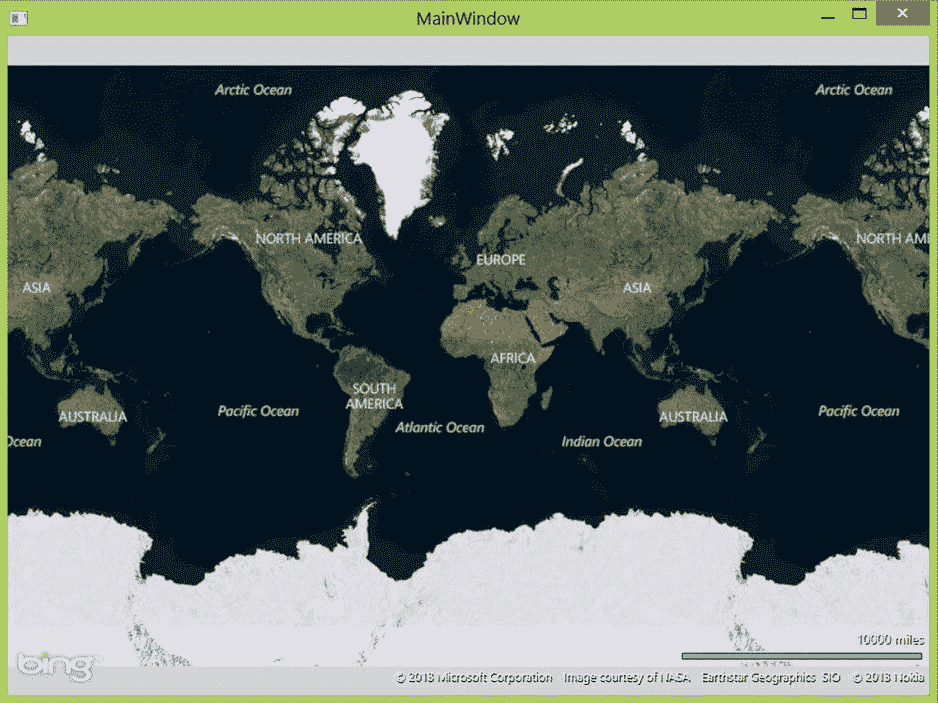
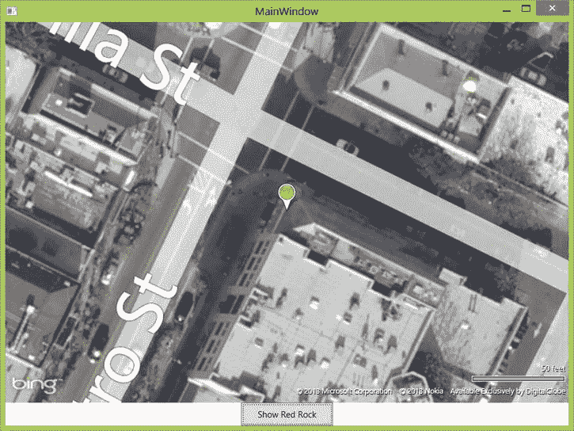
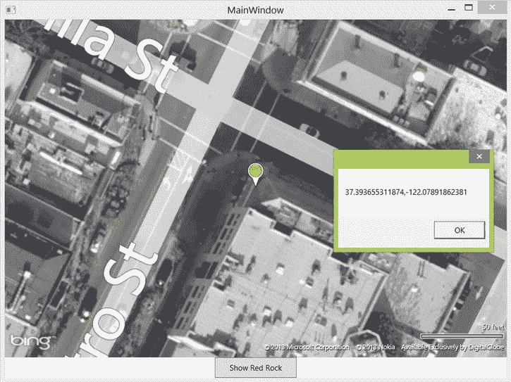
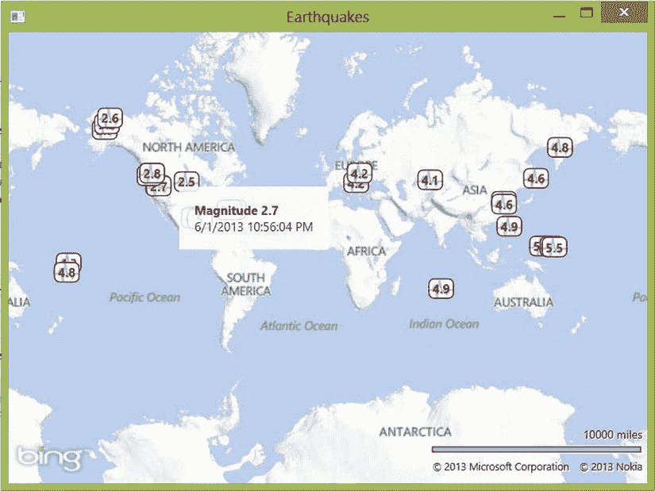
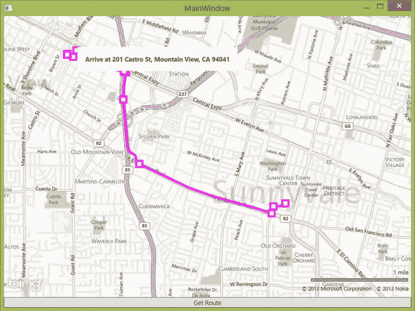

第七章


WPF 必应地图

Web 应用很好，但是并不是每个应用都适合做 web 应用。有时，出于业务或功能限制，需要一个简单、老式、可双击的可执行文件。启用. NET 应用的位置功能并不比添加阿炳地图程序集和控件更困难。在本章和下一章中，我们将首先向您展示如何为 Windows Presentation Foundation(WPF)执行此操作，然后为 Windows 8 的 Windows Store 执行此操作。

在本章中，我们将向您展示在 WPF 应用中使用 Bing 地图的来龙去脉。您可能会想到，从微软开始，只需向项目中添加一个程序集，并编写一些 XAML 和代码隐藏就可以开始了。您将了解该控件的功能，如何配置项目以包含该控件，以及控件中类的基本组织。然后，我们深入研究控件的编码，首先向您展示一个简单的“Hello Map”应用，然后是我们的地震应用的 WPF 版本，最后是如何使用两个 Bing 地图服务的示例，这两个 Bing 地图服务是 Bing 地图的一部分，但不是控件:地理编码和路由服务。

介绍用于 WPF 控制的必应地图

如果您研究了我们对 Web 控件的描述，您将会非常熟悉 Bing Maps for WPF 控件的功能和设计，但还是有一些不同。像网页上的 AJAX 控件一样，WPF 控件:

*   使用栅格切片以空中、街道和混合(空中加道路)模式渲染世界。
*   使用传统启示(鼠标、触摸、滚轮和缩放)支持自由平移和缩放。
*   允许您添加包含多边形、多段线和地图标记的图层。

然而，还是有一些关键的区别。最值得注意的是，作为一名 Windows 开发人员，您可以使用您已经熟悉并喜爱的可扩展应用标记语言(XAML) 围绕地图及其组件构建您的用户界面。正如您在本章后面所看到的，您甚至可以在 XAML 构建地图标记。在特性方面，它很大程度上与 AJAX 控件相当，尽管在我们写这篇文章时，它还不支持流量显示。

 **注** 像 AJAX 控件一样，Bing Maps for WPF 控件需要连接到互联网才能获得其地图切片。即使运行应用的计算机没有连接到 Internet，您也可以在 WPF 应用中使用该控件，但是如果没有 Internet 连接，它将无法下载或渲染地图！

获得控制权

用于 WPF 控制的必应地图可以从微软下载中心作为一个组件获得:去[http://bit.ly/16xHcy1](http://bit.ly/16xHcy1)或做阿炳搜索“必应地图 WPF 控制”，下载安装程序，并按照安装说明。它需要。NET Framework 4.0 和 Windows SDK，如果您安装了最新版本的 Microsoft Visual Studio，则应该已经安装了这两个软件。

就像 AJAX 控件一样，你需要阿炳地图键；如果你在阅读第二章时没有得到一个，现在你的机会来了。按照步骤操作，注册一个 Windows Live ID(如果您没有),然后获取阿炳地图基本 API 密钥。您可以在没有 API 密匙的情况下构建您的应用原型，但是每当您显示一个关于您如何需要 API 密匙的地图时，您都会收到一条令人讨厌的消息，因此，获得一个 API 密匙并完成它会更容易，尤其是在您向其他人展示您的应用之前。

一旦安装了 control SDK，您需要在您的 WPF 应用中添加对其程序集的引用。这与添加任何其他程序集是一样的:

1.  选择要添加引用的解决方案，
2.  右击并选择“添加引用”。。.",
3.  在出现的对话框中，单击左边的“浏览”,然后按“浏览”。。."按钮，
4.  导航到 WPF 控件程序集 Bing 地图所在的目录(默认情况下，您应该在`C:\Program Files (x86)\Bing Maps WPF Control\V1\Libraries`中找到它)。

关键类别和关系

Bing Maps for WPF 程序集有四个名称空间需要在您的应用中使用:

*   名称空间`Microsoft.Maps.MapControl.WPF`，它包含了你在使用控件时可能会用到的主要类，比如`Map`和`MapLayer`。
*   名称空间有一些基本的类，比如在控件实现中使用的异常和枚举。
*   在我们看来,`Microsoft.Maps.MapControl.WPF.Design`名称空间是不恰当的，因为它本身与设计没有任何关系，而是包含了用于解析和数据类型转换的类。
*   `Microsoft.Maps.MapControl.WPF.Overlays`名称空间包含您可能想要在地图上放置的默认覆盖图的实现，如指南针覆盖图或显示地图比例的比例控件。

当您使用该控件时，您通常会首先实例化一个或多个`Map`(在`Microsoft.Maps.MapControl.WPF`中)，配置它并为它连接一些事件处理程序，还可能配置一个或多个覆盖图，其中包含要覆盖在地图上的数据。

你需要知道的两个关键属性是`Map`控件的`CredentialProvider` 和`Mode`属性你指定你的 API 键为`CredentialProvider`属性的值；如果做不到这一点，地图控件就会加载，但是前面会有一个提示，说明您需要包含 API 键。`Mode`属性让你选择地图控件显示哪种数据。选择包括:

*   `Road`:以符号方式显示街道网络。
*   显示从天底视角的鸟瞰图。
*   `AerialWithLabels:`显示从天底透视的鸟瞰图，并在放大时包括道路标签。

`Map`从`MapCore` 继承而来，在这里你可以找到你期望的大多数地图控件的方法，包括:

*   可以设置或获取的`Center`属性，用于确定地图的地理中心。这个属性的值是 Location lass 的一个实例，它包含位置的纬度和经度。
*   可以设置或获取的`ZoomLevel`属性，用于确定地图的当前缩放级别。值越高，表示缩放越大；1 表示整个世界，而大约 10 表示城市级别的细节，大约 20 是目前可以渲染的最高级别的细节。

`MapCore`类还有非常方便的`TryLocationToViewportPoint`和`TryViewportPointToLocation`方法，当您需要在经纬度和地图上相应的视点之间进行转换时，可以使用这些方法。它还有许多`SetView`方法，可以让您以特定的缩放级别将地图居中，或者指示应该显示特定的地理矩形(此时控件确定适当的中心坐标和缩放级别，以确保您指定的矩形在视图中)。

由`Map`控件生成的事件在`MapCore`和`Map`类之间拆分；正如您所想象的，常见的用户事件包括按键、触摸和鼠标事件。但是，您可能需要关注一些特定的事件:

*   `ModeChanged`事件，当地图模式(空中、公路或两者)改变时发生。
*   分别在动画转场开始和结束时发生的`ViewChangeStart`和`ViewChangeEnd`事件。(还有一个`ViewChangeOnFrame`事件，如果你想同步动画帧显示的话。)

正如这些事件所暗示的，当从一个位置转换到另一个位置时，地图控件包括动画。通常，这是您想要的:当前视点和新视点之间的动画在数据加载时给用户提供了一些可看的东西，并为用户提供了一些方向。`Map`类有一个属性`AnimationLevel`，可以设置为下列`AnimationLevel`值之一:

*   `Full`，表示当属性突变时以及作为用户输入的结果，动画都应该发生，
*   `None`，表示不应出现动画，或
*   `UserInput`，表示动画应该仅作为用户输入的结果而出现。

必应地图给你几个自定义图层叫做*叠加*；这些叠层可让您显示和隐藏:

*   地图罗盘，指示哪条路是北(`Compass`类)
*   地图的版权信息(`Copyright`类)
*   必应标志(`Logo`类)、
*   以及地图比例(使用`Scale`类)。

像控件的 AJAX 版本一样，您组织地图控件的附加信息以在层中显示。程序集提供了`MapLayer`类，该类使用地理坐标而不是视点坐标来定位其子元素。`MapLayer`实例被美化为`Panel`实例；该类的大部分接口与子管理相关，或者是在地图地理坐标和视图坐标之间进行映射所必需的簿记。您可能会创建一个或多个`MapLayer`实例，并向其中添加子对象，然后显示或隐藏这些层，使您的地图数据可见或不可见。

地图`Pushpin`sT7】让你在地图上标记个别的点。它们有一个`Location`属性，允许您在地理坐标中指定图钉在地图上的位置，以及一个指示图钉应该如何旋转的标题。它们是 WPF 世界的完全公民，这意味着它们可以生成交互控件可以生成的所有事件(触摸、手写笔、鼠标和键盘)，并且可以有一个`Template`属性来指示图钉应该是什么样子(默认是一个带茎的橙色圆圈)。你也可以使用`MapPolyline`和`MapPolygon`类在地图上绘制线条和多边形；这些为他们的点使用`Location`实例。

使用控件

足够的概括性—让我们深入研究并使用 Bing 地图控件编写一些代码。我们从一个简单的示例开始，向您展示如何显示地图和处理来自地图的事件，然后继续我们的示例应用，并以一个示例结束我们的讨论，该示例将 Bing 地图控件与 Bing 地图服务联系在一起，用于地理编码和路由。

踢轮胎

让我们从一个“Hello Map ”样式的应用开始。打开 Visual Studio 并:

1.  创建新的 C# WPF 应用。我们称我们的地图为“WPFHelloMap”。
2.  为 WPF 程序集添加 Bing 地图的引用。右键单击该项目，选择“添加引用”，然后导航到 Microsoft.Maps.MapControl.WPF.dll。
3.  将 Bing 地图程序集的命名空间和 Bing 地图 API 密钥作为资源添加到 App.xaml 文件中。它应该是这样的:

    ```cs
    <Application x:Class="WPFHelloMap.App"
      FontName2">http://schemas.microsoft.com/winfx/2006/xaml/presentation"
      xmlns:x="http://schemas.microsoft.com/winfx/2006/xaml"
      *xmlns:map="clr-namespace:Microsoft.Maps.MapControl.WPF;*
    *assembly=Microsoft.Maps.MapControl.WPF"*
      StartupUri="MainWindow.xaml">
      <Application.Resources>
        *<map:ApplicationIdCredentialsProvider*
          *x:Key="MyCredentials"*
          *ApplicationId="your-id" />*
      </Application.Resources>
    </Application>
    ```

4.  打开 MainWindow.xaml 文件，为程序集添加一个命名空间，并添加一个`Map`类的实例。当你这样做的时候，你可能想把窗口放大一点:

    ```cs
    <Window x:Class="WPFHelloMap.MainWindow"
      FontName2">http://schemas.microsoft.com/winfx/2006/xaml/presentation"
      xmlns:x="http://schemas.microsoft.com/winfx/2006/xaml"
      *xmlns:map="clr-namespace:Microsoft.Maps.MapControl.WPF;*
    *assembly=Microsoft.Maps.MapControl.WPF"*
      Title="MainWindow"*Height="600" Width="800"*>
      <Grid>
        *<map:Map*
          *x:Name="Map"*
          *Mode="AerialWithLabels"*
          *HorizontalAlignment="Stretch"*
          *VerticalAlignment="Stretch"*
          *AnimationLevel="Full"*
          *CredentialsProvider="{StaticResource MyCredentials}" >*
        *</map:Map>*
      </Grid>
    </Window>
    ```

5.  运行应用。你应该得到一个包含世界航空地图的窗口，如图 7-1 所示。尝试使用鼠标(或者手指，如果您在支持触控的设备上运行 Windows 8)平移和缩放地图。



[图 7-1](#_Fig1) 。你好世界，空中风格！

这只是基本的 basic 让我们做更多的 XAML 黑客，并添加一个按钮，在地图上我们最喜欢的咖啡店之一的中心。

1.  在 XAML 的某个地方添加一个按钮，并为它绑定一个点击处理程序。你可以用这里的代码在地图上点击一个按钮，或者用一个`Grid`布局做一些更好的事情(正如你在下图中看到的，我们已经这样做了)。

    ```cs
    <Button Height="32" Width="128" Content="Show Red Rock" Click="Button_Clicked"/>
    ```

2.  在`map:Map`标签中为图钉添加一些 XAML:

    ```cs
    <map:Map
      x:Name="Map"
      Mode="AerialWithLabels"
      HorizontalAlignment="Stretch"
      VerticalAlignment="Stretch"
      AnimationLevel="Full"
        CredentialsProvider="{StaticResource MyCredentials}" >
        *<map:Pushpin*
          *Location="37.39366,-122.07888"/>*
    </map:Map>
    ```

3.  将以下内容添加到 MainWindow.xaml.cs 中的代码隐藏中。确保在代码隐藏的顶部包含`using`指令:

    ```cs
    using Microsoft.Maps.MapControl.WPF;
    ...
    public void Button_Clicked(object sender, RoutedEventArgs e)
    {
      Location redrock = new Location(37.39366,-122.07888);
      Map.SetView(redrock, 20);
    }
    ```

4.  运行应用并按下按钮。你会在山景城看到红岩的一小段动画([图 7-2](#Fig2) )。



[图 7-2](#_Fig2) 。地图上的图钉

最后，让我们将一个事件处理程序挂接到地图上:我们将向地图添加一个事件处理程序，在您单击的任何地方显示您的纬度和经度。

1.  将事件绑定添加到您的 XAML:

    ```cs
    <map:Map Grid.Row="0"
      x:Name="Map"
      Mode="AerialWithLabels"
      HorizontalAlignment="Stretch"
      VerticalAlignment="Stretch"
      AnimationLevel="Full"
      *MouseUp="Map_MouseUp"*
      CredentialsProvider="{StaticResource MyCredentials}" >
    ```

2.  为事件添加代码隐藏以显示消息框:

    ```cs
    private void Map_MouseUp(object sender, MouseButtonEventArgs e)
    {
      Location ll = Map.ViewportPointToLocation(e.GetPosition(Map));
      MessageBox.Show(ll.Latitude + "," + ll.Longitude);
    }
    ```

试试看([图 7-3](#Fig3) )！



[图 7-3](#_Fig3) 。点击处理

到处都有地震！T2】

让我们来看一个更复杂的例子，我们的地震应用，你可以在图 7-4 中看到。大多数有趣的代码都在 XAML 中，所以让我们先来看看，在[清单 7-1](#list1) 中。



[图 7-4](#_Fig4) 。我们在 WPF 的地震应用

***[清单 7-1](#_list1)*** 。地震应用的 MainWindow.xaml

```cs
<Window x:Class="WPFMapApplication.MainWindow"
  FontName2">http://schemas.microsoft.com/winfx/2006/xaml/presentation"
  xmlns:x="http://schemas.microsoft.com/winfx/2006/xaml"
  xmlns:map="clr-namespace:Microsoft.Maps.MapControl.WPF;
assembly=Microsoft.Maps.MapControl.WPF"
  Title="Earthquakes" Height="480" Width="640">

<Window.Resources>
  <BitmapImage x:Key="EarthquakeIcon" UriSource="Resources/icon.png" />
  <ControlTemplate x:Key="CustomPushpinTemplate" TargetType="map:Pushpin">
    <Grid x:Name="ContentGrid"
          HorizontalAlignment="Center"
          VerticalAlignment="Center">
      <StackPanel>
         <Grid Margin="0" Width="25" Height="20">
          <Rectangle Fill="White"
            Stroke="#FF000000"
            RadiusX="5" RadiusY="5"/>
          <Image Source="Resources/icon.png"
            Width="25" Height="20" Opacity="0.25" />
            <ContentPresenter HorizontalAlignment="Center"
              VerticalAlignment="Center"
              Content="{TemplateBinding Content}"
              ContentTemplate="{TemplateBinding ContentTemplate}"
              Margin="0"
              TextBlock.FontFamily="Segoe UI"
              TextBlock.FontWeight="Bold"
              TextBlock.Foreground="#FFB8000B"/>
         </Grid>
       </StackPanel>
     </Grid>
   </ControlTemplate>

   <DataTemplate x:Key="EarthquakeTemplate">
     <map:Pushpin map:MapLayer.Position="{Binding Location}"
      Tag="{Binding}"
      MouseEnter="Pushpin_MouseEnter"
      MouseLeave="Pushpin_MouseLeave"
      Template="{StaticResource CustomPushpinTemplate}"
      Content="{Binding Magnitude}"/>
   </DataTemplate>
</Window.Resources>

<Grid>
  <map:Map x:Name="DisplayMap"
    CredentialsProvider="{StaticResource MyCredentials}">
     <map:Map.Children>
       <map:MapItemsControl
         ItemsSource="{Binding Earthquakes}"
         ItemTemplate="{StaticResource EarthquakeTemplate}"/>

       <map:MapLayer x:Name="ContentPopupLayer">
         <Grid x:Name="ContentPopup"
           Visibility="Collapsed"
           Background="White"
           Opacity="0.85">
           <StackPanel Margin="15">
             <TextBlock x:Name="ContentPopupText"
               FontSize="12"
               FontWeight="Bold"/>
             <TextBlock x:Name="ContentPopupDescription"
               FontSize="12"/>
           </StackPanel>
         </Grid>
       </map:MapLayer>
     </map:Map.Children>
   </map:Map>
</Grid>
</Window>
```

首先是一个定制图钉的`ControlTemplate`,我们用它来标记每次地震的位置。

接下来是一个`DataTemplate`，它封装了图钉本身。它将图钉的和`Content`映射到地震的震级(稍后我们将向您展示模型和`Earthquake`类),并分配了几个事件处理程序，这样当您将鼠标悬停在图钉上时，我们可以显示关于地震的更多细节。

在`Grid`视图中的地图本身很简单，但是这是我们第一次向你展示一个`MapItemControl`。这个类允许你使用一个`MapLayer`作为一个`ItemsPanel`——如果你想将数据绑定到一个`ItemSource`和`ItemTemplate`，这是必不可少的，这就是我们在这里所做的。模板是我们的`DataTemplate`，包含我们的自定义`Pushpin`，绑定后的数据将是我们的地震列表。

最后，我们使用一个自定义的`MapLayer`来包装一个`StackPanel`,当您将鼠标悬停在图钉上时，它将显示地震的震级和日期/时间戳。我们在这里使用了一个`MapLayer`，而不是一个传统的层，因为我们希望将文本图例定位在地理空间，而不是控件的像素空间(这样图例就可以在地震事件附近悬停，而我们只需编写最少的代码来实现这一点)。

XAML 的代码隐藏很简单(为了简洁起见，我们去掉了`using`指令和名称空间)；它在[清单 7-2](#list2) 中。

***[清单 7-2](#_list2)*** 。地震用户界面的代码隐藏

```cs
public partial class MainWindow : Window
{
  public MainWindow()
  {
    InitializeComponent();
    DataContext = new EarthquakeViewModel();
  }

  private void Pushpin_MouseEnter(object sender, MouseEventArgs e)
  {
    FrameworkElement pin = sender as FrameworkElement;
    MapLayer.SetPosition(ContentPopup, MapLayer.GetPosition(pin));
    MapLayer.SetPositionOffset(ContentPopup, new Point(20, -20));

    var quake = (Earthquake)pin.Tag;

    ContentPopupText.Text = "Magnitude " + quake.Magnitude;
    ContentPopupDescription.Text = quake.When.ToString();
    ContentPopup.Visibility = Visibility.Visible;
  }

  private void Pushpin_MouseLeave(object sender, MouseEventArgs e)
  {
    ContentPopup.Visibility = Visibility.Collapsed;
  }
}
```

我们的构造函数需要用我们的数据模型配置`DataContext`。

图钉的`MouseEnter`处理程序必须计算出将包含地震信息细节的上下文弹出框的位置；它通过获取产生事件的引脚的位置，并将`ContentPopup`的位置设置为该引脚，偏移一个小的量。然后，它读取与该 pin(一个`Earthquake`对象)相关的数据，并在设置弹出窗口的可见性以显示该弹出窗口之前，用该数据填充上下文弹出窗口。`MouseLeave`处理程序只是翻转可见性，隐藏弹出窗口。

`Earthquake`类([清单 7-3](#list3) )是一个简单的数据容器类，不需要进一步解释。

***[清单 7-3](#_list3)*** 。`Earthquake`类

```cs
public class Earthquake
{
  public string Title { get; set; }
  public string Description { get; set; }
  public double Magnitude { get; set; }
  public Location Location { get; set; }
  public DateTime When { get; set; }
  public Earthquake(Location where,
                    DateTime when,
                    double magnitude,
                    string title,
                    string description = "")
  {
    Location = where;
    When = when;
    Magnitude = magnitude;
    Title = title;
    Description = description;
  }
}
```

这个模型同样简单([清单 7-4](#list4) )。

***[清单 7-4](#_list4)*** 。`EarthquakeViewModel`类

```cs
public class EarthquakeViewModel : INotifyPropertyChanged
{
  private ObservableCollection<Earthquake> _earthquakes;
  public ObservableCollection<Earthquake> Earthquakes
  {
    get { return _earthquakes; }
    set
    {
      _earthquakes = value;
      OnPropertyChanged("Earthquakes");
    }
  }

  public EarthquakeViewModel()
  {
    USGSEarthquakeService.GetRecentEarthquakes((o, ea) =>
    {
      Earthquakes = new ObservableCollection<Earthquake>(ea.Locations);
    });
  }

  public event PropertyChangedEventHandler PropertyChanged;
  protected virtual void OnPropertyChanged(string propertyName)
  {
    if (PropertyChanged != null)
      PropertyChanged(this, new PropertyChangedEventArgs(propertyName));
  }
}
```

这里唯一有趣的事情发生在构造函数中，我们从 USGS 地震服务中填充模型，这是由你在第四章中看到的 WCF 服务支持的。

使用 Bing 地图地理编码器服务进行地理编码

虽然不是 Bing 地图控件的正式组成部分，但是 Bing 地图地理编码器服务允许您确定地址的纬度和经度，或者将最近的地址映射到给定的纬度和经度。这是像路由这样的事情的先决条件，在这种情况下，您的用户可能会从地址的角度来考虑，而服务会从地理坐标的角度来考虑。使用 Bing 地图地理编码器服务就像使用任何其他 SOAP 服务一样。 您需要在[http://dev . virtual earth . net/web services/v1/geocode service/geocode service . SVC](http://dev.virtualearth.net/webservices/v1/geocodeservice/geocodeservice.svc)添加地理编码服务的服务引用。产生的接口`IGeocodeService`有四个方法:

*   `Geocode`，其接受地址请求并确定其地理位置，
*   `GeocodeAsync`，`Geocode`的异步版本，
*   `ReverseGeocode`，取一个位置，确定其大概地址，
*   而`ReverseGeocodeAsync`，则是`ReverseGeocode`的异步版本。

这些需要一个`GeocodeRequest` ，其中有地址和位置之类的字段。

清单 7-5 展示了如何执行一个简单的地理编码请求。

***[清单 7-5](#_list5)*** 。对地址进行地理编码

```cs
BingGeocodeService.GeocodeResult result = null;

using (BingGeocodeService.GeocodeServiceClient client =
  new BingGeocodeService.GeocodeServiceClient("CustomBinding_IGeocodeService"))
{
  BingGeocodeService.GeocodeRequest request =
    new BingGeocodeService.GeocodeRequest();
  request.Credentials = new Credentials()
  {
    ApplicationId = (App.Current.Resources["MyCredentials"] as
      ApplicationIdCredentialsProvider).ApplicationId
  };
  request.Query = address;
  result = client.Geocode(request).Results[0];
}
return result;
```

这里唯一需要注意的是，你必须按照请求`Credentials` 提供你的 Bing API 密匙。结果结构包括以下字段:

*   `Address`包含生成的反向地理编码的地址(如果找到的话),或地理编码操作的原始地址。
*   `Locations`包含所在位置的经纬度。
*   `Confidence`表示地理编码器对结果的信心。

当我们在两个位置之间行进时，我们将在下一节中使用地理编码器。

使用 Bing 地图路线服务选择路线

本章的最后一个例子展示了如何使用 Bing Maps Routing Service 计算路线，这是微软托管的另一个 SOAP 服务。正如你在[图 7-5](#Fig5) 中看到的，它绘制了一条从桑尼维尔市中心到咖啡馆的路线，在本章开始时，咖啡馆占据了我们的地图。



[图 7-5](#_Fig5) 。路由示例应用

要使用 Bing 地图路径服务，您需要将服务端点添加到您的应用中。它在[http://dev . virtual earth . net/web services/v1/route service/route service . SVC](http://dev.virtualearth.net/webservices/v1/routeservice/routeservice.svc)。

我们的路由是在我们的视图模型中完成的，它对源位置和目的地位置进行地理编码，计算出一条路线，然后将这条路线转换成我们在地图上显示的 MapPolyline 。清单 7-6 显示了视图模型的相关部分。

***[清单 7-6](#_list6)*** 。确定路线并填充数据模型的路点字段

```cs
private ObservableCollection<Waypoint> _waypoints;
public ObservableCollection<Waypoint> Waypoints
{
  get { return _waypoints; }
  set
  {
    _waypoints = value;
    OnPropertyChanged("Waypoints");
  }
}
private void CalculateRoute(BingGeocodeService.GeocodeResult from,
  BingGeocodeService.GeocodeResult to)
{
  using (BingRouteService.RouteServiceClient client =
    new BingRouteService.RouteServiceClient("CustomBinding_IRouteService"))
  {
    BingRouteService.RouteRequest request =
      new BingRouteService.RouteRequest();
    request.Credentials = new Credentials()
    {
      ApplicationId = (App.Current.Resources["MyCredentials"] as
        ApplicationIdCredentialsProvider).ApplicationId
    };
    request.Waypoints = new BingRouteService.Waypoint[2];
    request.Waypoints[0] = ConvertGeocodeResultToWaypoint(from);
    request.Waypoints[1] = ConvertGeocodeResultToWaypoint(to);

    request.Options = new BingRouteService.RouteOptions();
    request.Options.RoutePathType = BingRouteService.RoutePathType.Points;

    RouteResult = client.CalculateRoute(request).Result;
  }

  Waypoints = new ObservableCollection<Waypoint>();

  foreach (BingRouteService.ItineraryItem item
    in RouteResult.Legs[0].Itinerary)
  {
    Waypoints.Add(new Waypoint()
      {
        Description = GetDirectionText(item),
        Location = new Location(item.Location.Latitude,
          item.Location.Longitude)
      });
  }
}

```

路线服务接受一系列沿途的路点(因此多站路线是可能的)和选项，例如路线应该是汽车还是行人，并返回一个`ItineraryItem` 对象的列表，路线的每一段都有一个对象。`ItineraryItem`类有许多关于路线上决策点的字段，包括:

*   决策点处的指南针方向。
*   决策点的位置(这里我们将其用作地理折线的顶点)。
*   对决策点机动的描述。
*   关于演习的警告。

在这个例子中，我们只是将决策点的位置和机动的文本放在一个容器类中，我们用它来填充折线。XAML 使用模型中的数据显示每个决策点的转弯方向；当模型改变时，我们通过丢弃旧路线并创建新路线来更新地图上的路线([清单 7-7](#list7) )。

***[清单 7-7](#_list7)*** 。从路线创建一个`MapPolyline`

```cs
private static void OnRouteResultChanged(Map map,
  BingRouteService.RouteResult oldValue,
  BingRouteService.RouteResult newValue)
{
  MapPolyline line = new MapPolyline();
  line.Locations = new LocationCollection();
  line.Opacity = 0.80;
  line.Stroke = new SolidColorBrush(Colors.Magenta);
  line.StrokeThickness = 5.0;

  foreach (BingRouteService.Location l in newValue.RoutePath.Points)
  {
    line.Locations.Add(new Location(l.Latitude, l.Longitude));
  }

  var layer = GetRouteLineLayer(map);
  if (layer == null)
  {
    layer = new MapLayer();
    SetRouteLineLayer(map, layer);
  }

  layer.Children.Clear();
  layer.Children.Add(routeLine);

  LocationRect rect = new LocationRect(
    routeLine.Locations[0],
    routeLine.Locations[routeLine.Locations.Count - 1]);
  map.SetView(rect);
}
```

这段代码只是从路线上的点创建一条新的多段线，并将其添加为一个`MapLayer` 的唯一子元素，以包含路线。(从这段代码和之前的代码中可以看出，在使用 Bing 地图 SOAP 服务时，您需要编写的许多代码只是从服务层类到适当的 Bing 地图类的相互转换代码，反之亦然。)

XAML 只是将模型、地图以及折线和决策点文本框的图层联系在一起。

包扎

在本章中，我们向您介绍了将 Bing Maps for WPF 控件与您的 WPF 应用集成的基础知识，以及如何在 C#应用中将其与 Bing Maps SOAP 服务一起使用。

控件本身是 WPF 的完全参与者，处理地图切片获取、渲染，并为用户和地图操作(如触摸、鼠标和键盘)生成应用级事件。与其他 WPF 控件一样，您可以在 XAML 中表达您的大部分用户界面，从而为处理事件并为地图提供数据模型以指示显示内容的代码隐藏节省 C#代码。

微软还为您的应用提供了两个 SOAP 服务，一个用于地理编码，一个用于路由。您可以将它们作为位置感知应用的一部分，或者与地图显示结合使用，或者作为添加位置感知功能的独立组件用于您自己的目的。