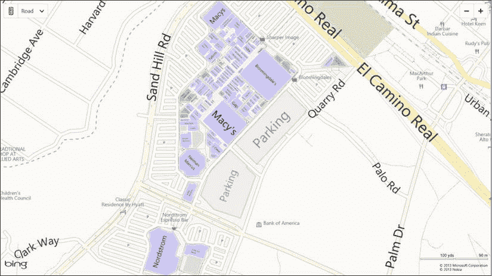
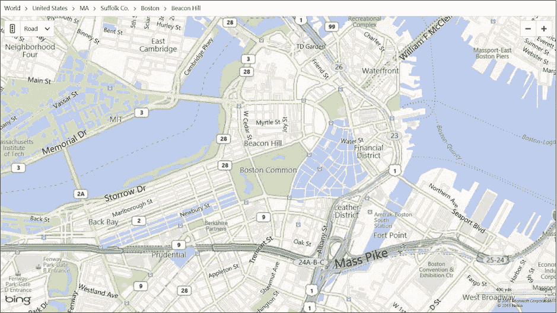
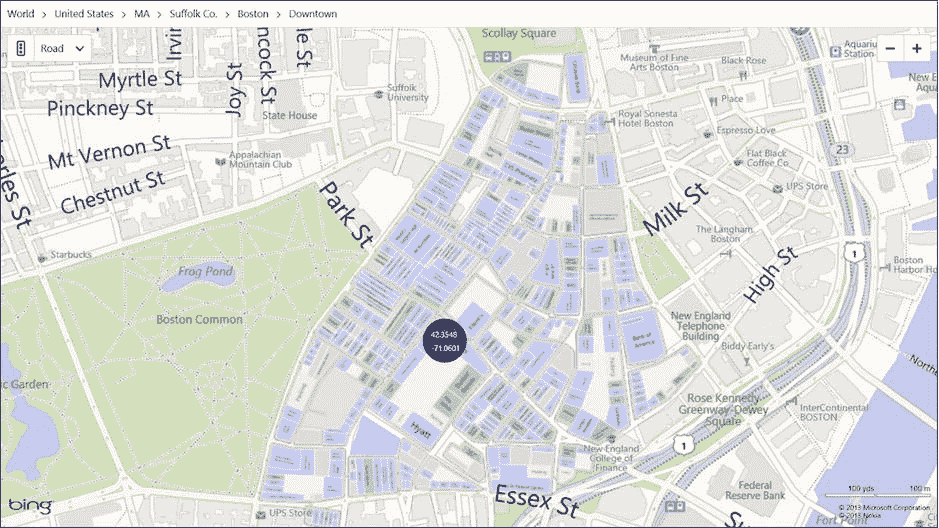
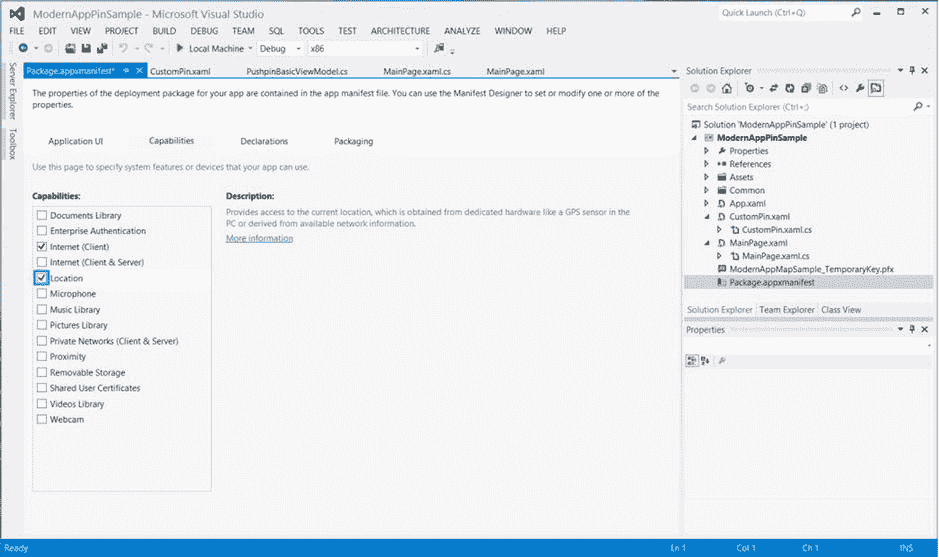
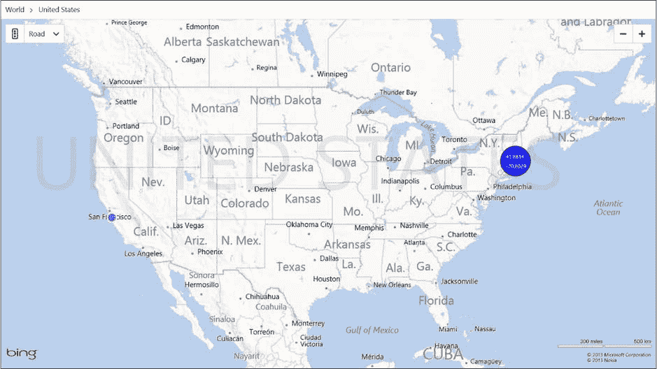
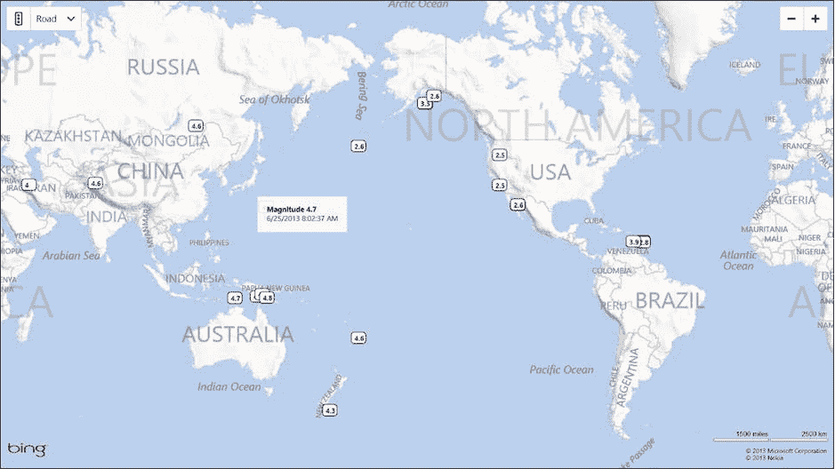

第八章


适用于 Windows 应用商店应用的 Bing 地图

不管你喜不喜欢，Windows 8 是微软对不断增长的平板电脑市场的回应，它提供了一个跨越鼠标和触摸的新用户界面，可以在英特尔和 ARM 处理器上运行。Windows 8 的一个旗舰功能是 Windows Store，您可以从中购买应用程序。Windows 应用商店应用程序(以前称为 Metro 或 Modern 应用程序)展示了一个适合各种设备的新的触摸友好用户界面。如果您计划将 Windows 作为商业应用的目标，那么将 Windows 应用商店作为目标应该是您计划中的一个非常重要的优先事项。

在本章中，我们将向您展示 Bing 地图为 Windows 应用商店应用带来的支持。如果你已经阅读了之前关于各种 Bing 地图控制界面的章节，这里有很多应该是你熟悉的。然而，有一些不同于 WPF 控件 Bing 地图的新功能，您可能会想要利用它们，我们在这里对它们进行了介绍。我们还将带您浏览两个使用 Bing 地图控件 Windows 应用商店版本的示例应用程序，让您对可在自己的应用程序中使用的代码有更多的体验。

Windows 应用商店 Bing 地图简介

如果你已经阅读了之前关于不同平台的各种 Bing 地图控件的章节，你就已经开始有这个想法了。对于 Windows 应用商店应用程序，Bing 地图控件支持以符号或航拍模式查看地图，并支持添加您自己的图层、图钉和形状(填充和空心)。此外，Windows 应用商店版本还包括:

*   一种称为鸟瞰模式 的新模式，显示航拍镜头和象征性细节的组合。
*   能够打开和关闭世界许多地方的交通图层，显示主要道路上的最新交通状况。
*   支持世界上许多地方的可点击地标，以及地标的基本信息。
*   支持美国和其他一些国家的场地地图，为您提供更多关于场地(如机场和购物中心)及其内容的地图细节。

Bing Maps for Windows Store 应用程序是一个可下载的 SDK。SDK 包含两个名称空间中的类:`Bing.Maps`和`Bing.Maps.VenueMaps`，在`http://bit.ly/19rFL23`名称空间中描述，尽管您可能希望使用在`Bing.Maps.VenueMaps`名称空间中找到的代表特定场所的各种类。`Bing.Maps`名称空间的组织类似于 Bing 地图 WPF 控件的名称空间，并且与您使用 Bing 地图 AJAX 控件时获得的界面非常相似。它包含表示地图、地图上的图层、图钉、地图形状以及地图上的地标的类。正如你可能想象的那样，对于像事件这样的事情，也有许多支持类。

名称空间的核心是代表屏幕上地图控件的类。它是`Control`的一个子类，具有您所期望的常见属性，包括:

*   `Center`，表示地图中心的`Location`。
*   `Culture`，用于本地化的地图的文化代码。
*   在实例化控件时，它必须包含 Bing Maps API 密钥。
*   `Heading`，地图的方向，以几何度数表示(0 表示正北，90 表示正东，以此类推)。
*   `MapType`、`MapType.Aerial`、`MapType.Birdseye`、`MapType.Road`或`MapType.Empty`中的一种，表示地图的类型。
*   `MinZoomLevel`和`MaxZoomLevel`，表示地图可以缩放的最小量和最大量。
*   `MetersPerPixel`，表示地图中心当前的比例，单位为米/像素。
*   `RotationEnabled`，通过设置其`Heading`属性来表示地图是否可以旋转。
*   `VenueManager`，`Bing.Maps.Venue.VenueManager`类的一个实例，用于搜索和显示场馆。
*   `ZoomLevel`，当前地图缩放级别。

此外，还有各种位可以叠加在地图上；这些层不是你操作的`MapLayer`实例，而是你可以设置或清除的附加布尔属性。其中包括:

*   `ShowBuildings`，表示控件是否在地图上显示建筑足迹。
*   `ShowNavigationBar`，表示控件是否显示地图导航控件(如地图类型选择器)。
*   `ShowBreadcrumb`，表示控件是否在地图顶部显示地图位置的语义层次(如`World > United States > MA > Suffolk Co. > Chelsea`)。
*   `ShowScaleBar`，表示控件是否显示比例尺。
*   `ShowTraffic`，表示交通是否覆盖在地图上。

地图控件支持动画过渡，所以您可能希望通过可用的公共方法来设置各种属性。其中最主要的是`SetView` ，可以覆盖将地图重新置于特定`Location`的中心，将地图重新置于可能不同缩放级别的位置，将地图重新置于具有特定标题的缩放级别的位置，并且仅显示特定的地理矩形。还有`SetZoomLevel` ，它可以让你指定一个新的缩放级别，并选择性地指示当切换到新的缩放级别时动画应该花费多长时间。为了处理从地理空间到屏幕空间的坐标转换，有`TryLocationToPixel` 和`TryPixelToLocation` 方法，它们将地图上的地理位置映射到屏幕坐标中的像素位置。

地图生成许多与其基础功能相关的自定义事件，包括指示地图样式何时更改、目标视图何时更改、所有地图切片何时下载以及动画每帧和动画何时完成的事件。当然，在内部，它使用大多数的`UIElement` 类来实现自己的目的，所以当您想要捕捉由地图控件生成的事件时，您将使用以结尾`Override`命名的相应事件。例如，要捕捉地图上未处理的点击，您可以使用`TappedOverride`事件(而不是点击事件，您可能已经猜到了)。有用于点击、双击、按键向下和向上事件、指针移动和滚轮移动的用户界面事件。

为了封装地图上的对象层次结构，SDK 提供了`MapLayer`类，允许您在地理空间中定位地图上的对象。您可以创建`MapLayer`的实例并直接使用它们——通常在 XAML——或者您可以使用 MapLayer 类的静态方法`SetPosition` ,该方法在地图上定位另一个对象，然后将该对象直接添加到地图的`Children`属性中。

可以添加到地图中的一个明显的东西是`Pushpin`实例；这些小圆圈可以有一个文本标签，大小刚好适合触摸一个简单的数字标签，别无其他。您也可以使用`MapPolygon`和`MapPolyline`类的实例添加多边形或折线；或者你可以添加任何你喜欢的 XAML 控件。例如，要将图像放到名为 map 的地图控件上，您可以编写:

```cs
Image image = new Image();
image.Source = new BitmapImage(new Uri(BaseUri,"image.png"));
image.Width = 32;
image.Height = 32;
MapLayer.SetPosition(image, new Location(42.3713, -71.0642));
map.Children.Add(image);
```

用于 Windows 应用商店应用的 Bing 地图控件对世界有一些额外的语义理解，封装在它的`Landmark`和`Venue`类中。在世界上的许多地方，地图上的兴趣点是可以点击的，当你点击它们时，地图控件会发出一个`LandmarkTapped`事件，包括一个`Landmark`事件，提供你点击的地标的更多细节。同样有趣的是增加了*场地地图* ( [图 8-1](#Fig1) )，当你点击世界许多地方的机场或购物中心等场地时，它就会出现。地点是可搜索的，您可以获得关于地点中企业的附加信息，包括它们的名称、位置和电话号码。



[图 8-1](#_Fig1) 。用于 Windows 应用商店应用程序的 Bing 地图控件中的地点地图

与场馆互动是`VenueManager`类的责任。`Map`类通过其`VenueManager`属性拥有一个可用的实例；有了它，您可以:

*   通过检查`ActiveVenue`属性确定地图上的活动场馆，
*   显示或隐藏允许用户选择带有`ShowFloorControl`属性的楼层的控件，
*   设置当鼠标移动到具有`UseDefaultVenueOutline`属性的场地上时，是否显示场地轮廓。
*   使用`UseDefaultVenueTooltip`属性控制当鼠标移动到场地或点击场地时是否显示工具提示。

不是所有国家都有场馆地图；您可以通过调用`VenueManager`的`GetAllCountriesAsync`方法获得 do 列表。您也可以使用`GetNearbyVenuesAsync`方法搜索某个地点附近的场馆。最后，`VenueManager`管理它自己的指针和点击事件，所以如果你想在一个场地地图活动时跟踪用户行为，你需要监控管理者的事件，比如`VenueTapped`，当用户点击场地本身时就会触发。

您可能想知道的最后一个类是`MapItemsControl`类，它表示管理数据绑定的控件。与其他数据绑定控件一样，它有`ItemsTemplate`和`ItemsSource`属性来指定绑定关系；您可以将控件绑定到静态列表或动态模型，就像我们在本章后面的地震示例中展示的那样。

看到冰。地图地图控制在行动

在接下来的几节中，我们将向您展示如何开始使用该控件，如何处理来自该控件的事件，如何检查场地和地标，以及如何查看我们在本书中展示的地震示例。值得注意的是，如果你读了上一章对 WPF 的控制，你会看到许多相似之处。事实上，地震应用程序在很大程度上没有被触及；应用程序的 WPF 版本和 Windows 应用商店版本之间的主要区别在于我们如何为地图构造自定义图钉。

在开始之前，请确保您已经注册了阿炳地图 API 密钥(正如我们在[第 2 章](02.html)中向您展示的那样)，然后前往`http://bit.ly/19CJgle`下载 Bing Maps SDK for Windows Store。一旦你这样做了，你就可以将 Bing Maps SDK 程序集的引用添加到你正在编写的任何应用程序中，这样你就万事俱备了。

 **注意**Bing Maps SDK汇编有专门针对 Windows 支持的各种处理器的版本。在构建和运行使用 SDK 的应用程序时，避免使用“任何 CPU”选项，而是为您的包选择一个特定的 CPU 目标，即“ARM”、“x86”或“x64”之一。如果你写的是 C++而不是 C#，你的选择是“ARM”、“Win32”或者“x64”。

您的第一款 Windows 应用商店地图应用

从头开始，[清单 8-1](#list1) 展示了一个简单的 Windows 8 应用程序的 XAML，它在 Windows 8 页面中显示一个地图控件。我们通过以下方式创造了它:

1.  在 Visual Studio 中用 C#创建一个空的 Windows 应用商店应用程序(文件新项目... Visual C#  Windows 应用商店空白应用(XAML))
2.  右击项目并选择“添加引用...”并添加对 Bing 的引用。通过展开“窗口”并从“扩展”列表项中选择“Bing 地图”来组装地图。
3.  将您在[清单 8-1](#list1) 中看到的代码放入 MainPage.xaml 文件中，用 Bing Maps API 密钥替换文本“your-api-key”。

***[清单 8-1](#_list1)*** 。最简单的支持地图的 Windows 应用商店应用程序

```cs
<Page
    x:Class="ModernAppMapSample.MainPage"
    FontName2">http://schemas.microsoft.com/winfx/2006/xaml/presentation"
    xmlns:x="http://schemas.microsoft.com/winfx/2006/xaml"
    xmlns:local="using:ModernAppMapSample"
    xmlns:d="http://schemas.microsoft.com/expression/blend/2008"
    xmlns:mc="http://schemas.openxmlformats.org/markup-compatibility/2006"
    xmlns:map="using:Bing.Maps"
    mc:Ignorable="d">

    <Grid Background="{StaticResource ApplicationPageBackgroundThemeBrush}">
            <map:Map Grid.Column="1" x:Name="map"
                     Credentials="your-api-key"/>
    </Grid>
</Page>
```

在这个 XAML 中有两件事需要注意:`Page`声明中的`xmlns:map`的名称空间声明，以及网格中的`map:Map`控件实例。

这个应用程序代码足以为您提供大多数应用程序开始时使用的基本地图和场馆地图导航；我们就是用这个应用程序来捕捉图 1-1 的屏幕截图，当然还有图 8-1 的[。](#Fig1)

与地标和场馆互动

让我们稍微看看这个版本的地图控件带来的地标和场馆支持。更改地图控件的 XAML，如[清单 8-2](#list2) 所示。

***[清单 8-2](#_list2)*** 。向 UI 添加面包屑和事件处理程序，以便在点击地标时进行捕捉

```cs
<map:Map Grid.Column="1" x:Name="map"
  Credentials="your-api-key"
  TappedOverride="Map_Tapped"
  LandmarkTapped="Map_LandmarkTapped"
  ShowBreadcrumb="True"/>
```

现在，编辑您的代码隐藏，这样您就有了一个`Map_LandmarkedTapped`方法。此外，添加一个事件处理程序，当场地被点击时，如清单 8-3 中的[所示。不要忘记要么完全限定 Bing 地图类，要么在文件的顶部为`Bing.Maps`和`Bing.Maps.VenueMaps`添加 using 指令。](#list3)

***[清单 8-3](#_list3)*** 。用于点击地图、地标和地点的事件处理程序。

```cs
public MainPage()
{
  this.InitializeComponent();
  *VenueManager m = map.VenueManager;*
  *m.UseDefaultVenueTooltip = false;*
  *m.VenueEntityTapped += Venue_Tapped;*
}

private void Venue_Tapped(object sender, VenueEntityEventArgs e)
{
  int i;
}

private void Map_Tapped(object sender, TappedRoutedEventArgs e)
{
  int i;
}

private void Map_LandmarkTapped(object sender, LandmarkTappedEventArgs e)
{
  int i;
}
```

构造函数中的代码只是给`VenueManager`增加了一个事件处理程序，当然；在这种情况下，以这种方式做比在 XAML 做更容易一点，就像你对`TappedOverride`和`LandmarkTapped`事件所做的那样。

现在，在每个事件处理程序中放置断点，并重新运行应用程序。您应该会在地图控件的顶部看到面包屑栏([图 8-2](#Fig2) )。你应该放大美国的一个地区，试着点击地标和场馆；你可以进入场馆地图模式，然后点击各个场馆。



[图 8-2](#_Fig2) 。启用了面包屑的地图控件，显示地点和地标

在地图上，场馆是比水稍微偏紫的颜色；弄清楚一个人长什么样的最简单的方法是去一个有场地的地方看一看，比如在[图 8-2](#Fig2) 中波士顿广场以东的场地。第一次点击场地激活场地，将场地地图加载到控件中；后续点击会生成`VenueTapped`事件，这应该会触发断点。

地标是地图上标记的小点，就像你在图 8-2 中看到的芬威公园的入口。

创建自定义图钉

在地图上放置一个传统的图钉很容易:在 XAML，您可以使用如下代码来实现:

```cs
<map:Map...>
  <map:Map.Children>
    <map:Pushpin>
      <map:MapLayer.Position>
        <map:Location Latitude="42.3551" Longitude="-70.0659" />
      </map:MapLayer.Position>
    </map:Pushpin>
  </map:Map.Children>
</map:Map>
```

让我们创建一个自定义图钉来显示您点击的纬度和经度。我们在 Blend 中结合了 XAML 黑客技术和一点鬼混；结果在[清单 8-4](#list4) 中。您可以通过向示例项目添加一个新的用户控件并使用 XAML 来重新创建它，或者尝试混合并制作您自己的控件。

***[清单 8-4](#_list4)*** 。显示纬度和经度的自定义图钉

```cs
<UserControl
    x:Class="ModernAppMapSample.CustomPin"
    FontName2">http://schemas.microsoft.com/winfx/2006/xaml/presentation"
    xmlns:x="http://schemas.microsoft.com/winfx/2006/xaml"
    xmlns:local="using:ModernAppMapSample"
    xmlns:d="http://schemas.microsoft.com/expression/blend/2008"
    xmlns:mc="http://schemas.openxmlformats.org/markup-compatibility/2006"
    mc:Ignorable="d"
    d:DesignWidth="64" Height="64" Width="64">

  <Grid Margin="-32,-32,0,0" Width="64" Height="64">
    <Ellipse Fill="#FF1D1DF5"
      HorizontalAlignment="Left"
      Height="64"
      Stroke="Black"
      VerticalAlignment="Top"
      Width="64"
      Margin="-32,-32,0,0"/>
    <GridView HorizontalAlignment="Left"
      VerticalAlignment="Top"
      Height="64"
      Width="64"
      Margin="-32,-32,0,0"/>
    <TextBlock x:Name="latitude"
      HorizontalAlignment="Left"
      VerticalAlignment="Top"
      Margin="-20,-15,0,0"
      TextWrapping="Wrap"
      Text=""/>
    <TextBlock
      x:Name="longitude"
      HorizontalAlignment="Left"
      VerticalAlignment="Top"
      Margin="-20,5,0,0"
      TextWrapping="Wrap"
      Text=""/>
  </Grid>
</UserControl>
```

我们图钉的 XAML 非常简单，尽管你可能会对奇怪的页边距感到疑惑。将控件作为图钉添加到地图图层时，它们位于右上角。对于类似这样的情况，当我们想要标记一个点击的中心时，我们需要将控件偏移控件大小的一半，这样上角就真的在控件的中心了。

我们的自定义控件也需要一点代码隐藏，以便它具有事件处理程序可以设置的纬度和经度属性。清单 8-5 显示了我们控件的代码隐藏。

***[清单 8-5](#_list5)*** 。自定义图钉的代码隐藏

```cs
public sealed partial class CustomPin : UserControl
{
  public string Latitude {
    get { return latitude.Text; }
    set { latitude.Text = value; }
  }

  public string Longitude {
    get { return longitude.Text; }
    set { longitude.Text = value; }
  }

  public CustomPin()
  {
    this.InitializeComponent();
  }
}
```

现在，剩下的就是连接我们在[清单 8-3](#list3) 中插入的各种事件处理程序，以创建和显示我们控件的一个实例。[清单 8-6](#list6) 显示了结果，[图 8-3](#Fig3) 显示了当你在地图上点击时会发生什么。

***[清单 8-6](#_list6)*** 。将自定义图钉添加到地图控件中

```cs
CustomPin m_pushPin;
private void Venue_Tapped(object sender, VenueEntityEventArgs e)
{
  if (e.VenueEntity != null)
  {
    Location location = e.VenueEntity.Location;
    ShowLatLong(location);
  }
}

private void Map_Tapped(object sender, TappedRoutedEventArgs e)
{
  var position = e.GetPosition(map);
  Location location;
  map.TryPixelToLocation(position, out location);
  ShowLatLong(location);
}

private void Map_LandmarkTapped(object sender, LandmarkTappedEventArgs e)
{
  if (e.Landmarks.Count != 0)
  {
    ShowLatLong(e.Landmarks[0].Location);
  }
}

private void ShowLatLong(Location location)
{
  if (m_pushPin == null)
  {
    m_pushPin = new CustomPin();
    map.Children.Add(m_pushPin);
  }

  m_pushPin.Latitude =
    Math.Round(location.Latitude, 4).ToString();
  m_pushPin.Longitude =
    Math.Round(location.Longitude, 4).ToString();

  MapLayer.SetPosition(m_pushPin, location);
  map.SetView(location);
}

```



[图 8-3](#_Fig3) 。我们在地图上的自定义图钉

[清单 8-6](#list6) 显示了一些使用地图控件的代码:

*   `Venue_Tapped`和`Landmark_Tapped`事件处理程序都检查事件的内容，以确定用户触摸的东西的地理位置。
*   `Map_Tapped`事件处理程序使用`TryPixelToLocation`来获取用户点击的纬度和经度。
*   我们在第一次需要时创建一个地图标记，然后在标记需要移动到`ShowLatLong`时重用它。
*   当我们设置图钉的位置时，我们使用`Map.SetView`将用户点击的点居中。

额外加分:在地图上找到自己

而李冰。“地图”没有地理定位 API，Windows 8 中有一个传感器 API，可以使用 WiFi 地理定位或其他服务来获取您的位置。只要 API 在包清单中启用了“位置”,任何 Windows 8 商店应用程序都可以访问此 API。

Windows 8 在`Windows.Devices.Geolocation`命名空间中提供了`Geolocator`类。使用它很简单:创建一个，将事件处理程序附加到它的`PositionChanged`和`StatusChanged`事件，一切都准备好了。当你创建一个时，系统会提示你应用程序是否可以使用设备的位置；如果你点击“OK”得到肯定的回答，`Geolocator`实例执行一个定位操作，并开始通过`PositionChanged`事件报告你的位置。如果您拒绝请求，`Geolocator`实例将保持非活动状态，您的处理程序不会收到任何`PositionChanged`事件。

所有这些中的一个小问题是，传感器系统运行在不同于 UI 线程的线程上，因此报告您位置的实际过程涉及从`PositionChanged`事件处理程序到您的 UI 线程的跨线程调度。

为了在我们的示例应用程序中实现这一切，我们首先选择解决方案中的 Package.appxmanifest(双击)，然后选择“Capabilities”(出现的视图中的第二个选项卡)。确保“位置”被选中，如[图 8-4](#Fig4) 所示。



[图 8-4](#_Fig4) 。在应用程序清单中启用位置服务

现在，将用于`Windows.Devices.Geolocation`和`Windows.UI.Core`的 using 指令添加到 MainPage.xaml.cs 中。接下来，编辑代码隐藏，使其具有您在[清单 8-7](#list7) 中看到的字段和方法。

***[清单 8-7](#_list7)*** 。在您的示例应用程序中启用定位

```cs
*CoreDispatcher mDispatcher;*
*Pushpin m_youAreHerePin;*
*Geolocator m_geolocator;*
CustomPin m_pushPin;
public MainPage()
{
  this.InitializeComponent();
  VenueManager m = map.VenueManager;
  m.UseDefaultVenueTooltip = false;
  m.VenueEntityTapped += Venue_Tapped;

  *mDispatcher = Dispatcher;*
  *Loaded += MainPage_Loaded;*
}

*private void MainPage_Loaded(object sender, RoutedEventArgs e)*

```

*{*

```cs
  *m_geolocator = new Geolocator();*
  *m_geolocator.PositionChanged += Geolocator_PositionChanged;*
  *m_geolocator.StatusChanged += Geolocator_StatusChanged;*

```

*}*

```cs
private void Geolocator_StatusChanged(Geolocator g, StatusChangedEventArgs e)
{
}

private async void Geolocator_PositionChanged(Geolocator g,
                                              PositionChangedEventArgs e)
{
  await mDispatcher.RunAsync(CoreDispatcherPriority.Normal, () =>
  {
    if (m_youAreHerePin == null)
    {
      m_youAreHerePin = new Pushpin();
      map.Children.Add(m_youAreHerePin);
    }
    Location location = new Location(e.Position.Coordinate.Latitude,
      e.Position.Coordinate.Longitude);
    MapLayer.SetPosition(m_youAreHerePin, location);
  });
}
```

首先，我们为页面的`Loaded`事件添加一个事件处理程序,这样我们只有在应用程序 UI 完全加载后才提示用户使用 location 如果我们在页面的构造函数中实例化一个`Geolocator`,我们就冒着在 UI 的其余部分绘制之前显示确认的风险，这看起来很糟糕。

页面的`Loaded`事件的事件处理程序创建一个`Geolocator`实例并设置它的事件处理程序。严格地说，我们不需要一个`StatusChanged`事件处理程序；您可以在那里放置一个断点，并在提示您接受或拒绝 location 特权时查看`Geocoder`的状态变化。

`Geolocator_PositionChanged` 方法是一个`async`方法——这是 C# 5.0 中的新方法，使得处理多线程应用程序变得更加简单。当您将一个方法指定为`async`时，您表示任何以`await`为前缀的函数调用都可以运行，而不会阻塞当前线程。我们在这里使用`await`来表示调度程序的`RunAsync`方法将它的代码放在 UI 线程上，而不是在代码运行时阻塞这个线程。调度程序的`RunAsync`方法为要运行的代码获取一个优先级，并获取一个 lambda 表达式来指示要运行的代码。

我们的 lambda 很简单:如果我们还没有一个标准的`Pushpin`实例，它就懒洋洋地构造一个，然后将`Pushpin`放在由`Geolocator`报告的位置。[图 8-5](#Fig5) 显示了点击马萨诸塞州波士顿的波士顿社区后，在我们办公室运行应用程序的结果。



[图 8-5](#_Fig5) 。标明我们办公室位置的图钉

地震应用程序

[图 8-6](#Fig6) 显示了我们为 Windows Store 重新设计的地震应用程序。我们使用一个自定义的 XAML 元素来表示我们的大小——显示图钉，通过一个`MapItemControl` 分层，管理我们到模型的绑定。当你点击一个震级钉时，应用程序显示的详细视图是 XAML 的一个`MapLayer`实例中的一个`Grid`，所以当你点击地震时，我们可以通过地理位置(钉的位置)来定位它。



[图 8-6](#_Fig6) 。为 Windows 应用商店编写的地震应用程序

清单 8-8 显示了主页面的 XAML。【T2

***[清单 8-8](#_list8)*** 。应用程序的主页 XAML

```cs
<Page
  x:Class="ModernAppMapSample.MainPage"
  FontName2">http://schemas.microsoft.com/winfx/2006/xaml/presentation"
  xmlns:x="http://schemas.microsoft.com/winfx/2006/xaml"
  xmlns:local="using:ModernAppMapSample"
  xmlns:d=http://schemas.microsoft.com/expression/blend/2008
  xmlns:mc="http://schemas.openxmlformats.org/markup-compatibility/2006"
  xmlns:map="using:Bing.Maps"
  mc:Ignorable="d">

  <Page.Resources>
    <DataTemplate x:Key="EarthquakeTemplate">
      <local:CustomPin map:MapLayer.Position="{Binding Location}"
         Tag="{Binding}"
         Text="{Binding Magnitude}"
         Tapped="Pushpin_Tapped"/>
    </DataTemplate>
  </Page.Resources>

  <Grid Background="{StaticResource ApplicationPageBackgroundThemeBrush}">
    <map:Map Grid.Column="1"
      x:Name="map"
      Credentials="{StaticResource MyCredentials}">
      <map:Map.Children>
        <map:MapItemsControl
          ItemsSource="{Binding Earthquakes}"
          ItemTemplate="{StaticResource EarthquakeTemplate}"/>
        <map:MapLayer x:Name="ContentPopupLayer">
          <Grid
            x:Name="ContentPopup"
            Visibility="Collapsed"
            Background="White"
            Opacity="0.85">
            <StackPanel Margin="15">
              <TextBlock
                x:Name="ContentPopupText"
                Foreground="Black"
                FontSize="12"
                FontWeight="Bold"/>
              <TextBlock
                x:Name="ContentPopupDescription"
                Foreground="Black"
                FontSize="12"/>
            </StackPanel>
          </Grid>
        </map:MapLayer>
      </map:Map.Children>
    </map:Map>
  </Grid>
</Page>
```

如果你阅读《T2》第 7 章，XAML 与你在[清单 7-1](07.html#list1) 中看到的惊人相似。我们首先为 Bing 地图控件(`map`)和应用程序本身提供的代码(`local`)指定名称空间。

所有的数据绑定都发生在`EarthquakeTemplate`数据模板中，它使用了我们自定义图钉的一个实例，您可以在[清单 8-10](#list10) 和[清单 8-11](#list11) 中看到。它假设数据模型有两个属性:`Location`，它是`Bing.Maps.Location`实例，和`Magnitude`，它是地震震级。

地图控件本身是页面网格中的唯一元素，有一个子控件`MapItemControl`来处理模型和 XAML 之间的数据绑定，还有一个子控件`ContentPopup`、、，它只是一个子网格，带有地震震级和发生时间的文本字段。

清单 8-9 显示了主页的代码隐藏。【T2

***[清单 8-9](#_list9)*** 。主页的代码隐藏

```cs
public sealed partial class MainPage : Page
{
  public MainPage()
  {
    this.InitializeComponent();
    DataContext = new EarthquakeViewModel();
  }

  private void Pushpin_Tapped(object sender, TappedRoutedEventArgs e)
  {
    FrameworkElement pin = sender as FrameworkElement;
    MapLayer.SetPosition(ContentPopup, MapLayer.GetPosition(pin));

    var location = (Earthquake)pin.Tag;

    ContentPopupText.Text = "Magnitude " + location.Magnitude;
    ContentPopupDescription.Text = location.When.ToString();
    ContentPopup.Visibility = Visibility.Visible;
  }
}
```

构造函数创建我们的数据模型。`Pushpin_Tapped` 方法在地图图层上显示`The only magic here isContentPopup`，将其定位到与您点击的图钉相同的位置，然后在弹出窗口可见之前设置其字段的文本。

回到自定义图钉，我们基于我们在第 7 章展示的 XAML 使用原始 XAML 创建了标记，尽管你可以在 Blend 中做一些更花哨的东西。[清单 8-9](#list9) 显示了定制图钉的 XAML。

***[清单 8-10](#_list10)*** 。定制图钉 XAML

```cs
<UserControl
  x:Class="ModernAppMapSample.CustomPin"
  FontName2">http://schemas.microsoft.com/winfx/2006/xaml/presentation"
  xmlns:x="http://schemas.microsoft.com/winfx/2006/xaml"
  xmlns:local="using:ModernAppMapSample"
  xmlns:d="http://schemas.microsoft.com/expression/blend/2008"
  xmlns:mc="http://schemas.openxmlformats.org/markup-compatibility/2006"
  mc:Ignorable="d"
  d:DesignWidth="400" Height="64" Width="64">

  <Grid Margin="-12,-10,0,0" Width="25" Height="20">
    <Rectangle
      Fill="White"
      RadiusX ="5"
      RadiusY="5"
      HorizontalAlignment="Left"
      VerticalAlignment="Top"
      Height="20"
      Stroke="Black"
      Width="25"
      Margin="-12,-10,0,0"/>
    <GridView
       HorizontalAlignment="Left"
       VerticalAlignment="Top"
       Height="20"
       Width="25"
       Margin="-32,-32,0,0" />
    <TextBlock x:Name="text"
      HorizontalAlignment="Left"
      VerticalAlignment="Top"
      Margin="-6,-7,0,0"
      TextWrapping="Wrap"
      Text=""
      Foreground="#FFB8000B"
      FontFamily="Segoe UI"
      FontWeight="Bold"/>
  </Grid>
</UserControl>
```

代码隐藏负责设置图钉中的文本字段，如清单 8-11 中的[所示。](#list11)T3】

***[清单 8-11](#_list11)*** 。自定义图钉的代码隐藏

```cs
public sealed partial class CustomPin : UserControl
{
  public static readonly DependencyProperty TextProperty =
    DependencyProperty.Register("Text",
      typeof(string),
      typeof(UserControl),
      new PropertyMetadata(0,
        new PropertyChangedCallback(TextPropertyChanged)));

  public string Text
  {
    get;
    set;
  }
  public CustomPin()
  {
    this.InitializeComponent();
  }

  private static void TextPropertyChanged(DependencyObject source,
    DependencyPropertyChangedEventArgs e)
  {
    var self = source as CustomPin;
    if (self != null)
    {
      self.text.Text = (string)e.NewValue;
    }
  }
}
```

这里唯一神奇的是文本字段的`DependencyProperty`；这和`TextPropertyChanged`回调是必要的，以便图钉正确地与 XAML 的数据绑定及其模型-视图-控制器模式的应用一起工作。调用方设置图钉的 text 属性，该属性是公共的。这又触发了一个调用`TextPropertyChanged`方法的`PropertyChangedCallback`，该方法负责实际设置 XAML 中`TextBlock`的文本值。

除了`Earthquake`类现在使用一个`Bing.Maps.Location`实例代替`Microsoft.Maps.MapControl.WPF.Location`类来存储地震的位置之外，`EarthquakeModel`和`Earthquake`类与前一章基本没有变化。好奇的读者可以参考清单 7-3 和清单 7-4[以及围绕这些清单的讨论。](07.html#list4)

包扎

Bing Maps for Windows Store 应用程序 SDK 提供了一个封装了控件的`Map`类，该控件可以显示空中和道路图像，以及叠加的交通信息、地标和地点。SDK 包括封装位置、场地和地标的支持类。

地图控件为您的应用程序提供要处理的事件，包括内部状态更改、用户交互(如点击和双击事件)以及设置地图视口和缩放级别的方法。此外，SDK 提供了一个类，用于在您的实现和呈现层之间启用 XAML 数据绑定，允许您使用模型-视图-控制器模式实现您的应用程序。地图控件可以在地理或屏幕空间中承载子元素，允许您使用任何 XAML 用户界面元素作为地图上的标记或覆盖。

这个控件的一个新特性是能够显示地点，通常在一个小空间内有多个企业。单击一个地点会加载一个地点地图，其中包含有关该地点企业的附加信息，包括企业名称、电话号码等等。

尽管 Bing Maps for Windows Store Applications SDK 不支持地理定位，但 Windows 8 通过`Windows.Devices.Location`名称空间的`Geolocator`类支持地理定位。此类使用事件来指示设备的位置，并在设备通过事件发生变化时用设备位置更新客户端。