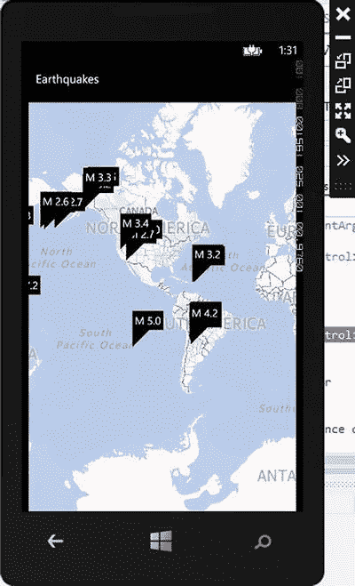

第九章


用于 Windows Phone 8 的必应地图

我们编写 Windows Phone 应用的第一次经历是一个地图应用；在四个小时内，我们能够在运行 Windows Phone 7 Silverlight Bing 地图控件的 Windows Phone 7 设备上可视化来自研究服务器的数据。如果您对微软技术有任何经验(我们没有！)你可以轻松打破我们的时间，尤其是如果你使用 Windows Phone 8 的全新控件。

在这一章中，我们将向您展示如何做到这一点。我们将向您展示用于 Windows Phone 的 Bing 地图控件的基本 API 以及 Windows Phone 地理位置 API，并讨论它们与您在前面章节中看到的界面有何不同。我们谈到了 Windows Phone Toolkit，这是一个必备的插件，可以显著增加 Windows Phone 上可以使用的控件数量，包括扩展 Bing 地图界面。我们以一个移植到 Windows Phone 8 的地震样本应用来结束这一章。

Windows Phone Bing 地图简介 8

在 Windows 8 或 Windows Presentation Foundation(WPF)有必应地图之前，Windows Phone 有必应地图控件。随着 Windows Phone 7 的出现，Silverlight 地图控件能够以符号视图或鸟瞰图显示地图，以及绘制常见的线条、区域和标记。随着 Silverlight 在 Windows 8 中的死亡，控件被从头开始重写以支持 Windows 8。

控件本身位于`Windows.Phone.Maps.Controls`名称空间中，简单地命名为`Map`。就像你在前面章节中看到的地图控件一样，有许多支持类；与您在前面章节中看到的类不同，它们分布在 Windows Phone 8 的几个名称空间中:

*   `GeoCoordinate`类在`Windows.Devices.Geolocation`中，它和我们在本章后面讨论的`Geolocator`类在一起。
*   由地图控件、线和多边形以及层引发的事件位于`Windows.Phone.Maps.Controls`名称空间中。
*   虽然您可以使用`MapOverlay`在地图上放置形状，但在 Local Scout 等应用中与 Windows Phone 体验相匹配的风格化图钉是 Windows Phone 工具包的一部分，可从 Codeplex 或 NuGet 获得，面向所有开发人员。

您可以在应用中用 XAML 或 C#实例化地图控件。当然，在 XAML，您必须将 XML 名称空间作为标头声明的一部分包含在您的 XAML 中，如下所示:

```cs
xmlns:map="clr-namespace:Microsoft.Phone.Maps.Controls;assembly=Microsoft.Phone.Maps"
```

然后，您可以简单地在 XAML 的内容面板中声明一个地图元素，如下所示:

```cs
<Grid x:Name="ContentPanel" Grid.Row="1" Margin="12,0,12,0">
  <maps:Map />
</Grid>
```

不过，如果您使用 Expression Blend 或 Visual Studio 中的设计器，事情会变得更加简单:您可以从控件面板中拖出一个地图控件，它会更新 XAML 标题并将`Map`控件放置在内容窗格中。

 **注意**当使用设计器拖出一个地图控件时，注意 XML 标记将`Microsoft.Phone.Maps`命名空间别名为`maps`，而不是`map`。在本章中，为了与其他章节保持一致，我们继续使用`map`别名，而不是 Windows Phone 8 的`maps`别名。

当然，与任何其他控件一样，您也可以手动添加一个`Map`控件作为子控件；只是要确保包含前导的`using`声明:

```cs
using Microsoft.Phone.Maps.Controls;
// later, in your code after the page loads:
  Map map = new Map();
  ContentPanel.Children.Add(map);
```

`Map`控件具有您所期望的控制其行为的属性:

*   `Center`属性表示地图控件居中的地理坐标。(注意控件也有`Latitude`和`Longitude`属性，但是你不应该使用它们来重新定位地图控件；不可预知的事情会发生。不过，如果你只需要一个或另一个坐标，也可以从它们中读取。)
*   `ZoomLevel`属性表示地图的缩放级别。缩放级别范围从 1 到 20，数字越大表示缩放越大。
*   您可以通过将`LandmarksEnabled`属性切换到`true`或`false`来显示或隐藏地标(如建筑物等特定的兴趣点)。
*   您可以通过将`PedestrianFeaturesEnabled`属性切换到`true`或`false`来显示或隐藏地图上的行人特征(如通往地铁站的人行道)。
*   通过将`CartographicMode`属性设置为`Road`、`Aerial`、`Hybrid`或`Terrain`中的一个，您可以设置或确定地图模式——符号道路、鸟瞰图、覆盖道路的鸟瞰图或带有人造地形的地形地图。
*   地图控件可以以浅色模式或深色模式显示；只需将`ColorMode`属性设置为`Light`或`Dark`中的一个。(`Light`为默认)。

当然，您可以在 XAML 或 C#代码中设置所有这些属性。

地图响应用户事件来处理平移和缩放，您可以使用`SetView`方法的各种重载以编程方式设置地图的位置。当您设置视图时，该控件会显示一些动画，例如平移、放大或缩小。动画有两个目的。首先，它为用户提供了一些关于操作的源和目的地的上下文。第二，如果渲染所需的数据还没有缓存在内存中，它为 map 控件提供了一个加载数据的机会。`SetView`有以下重载:

*   它可以接受一个中心参数，一个表示地图新中心的`GeoCoordinate`。
*   它可以接受缩放级别参数，指示地图的新缩放级别。
*   它可以带一个航向，在地图的顶部指示指南针的方向。(这对于希望地图在用户改变方向时围绕用户旋转的视图来说非常方便。)
*   它可以是一个倾斜度，一个地图上可选的倾斜度，它强调了地形图所能提供的深度感。
*   它可以使用一个`LocationRectangle`，指示地图要聚焦的实际制图区域。

您还可以为视图转换指定一个显式动画，或者完全禁止动画。(不过，我们不建议禁用动画，因为它会降低大多数界面的流畅性。)

您可以使用`MapOverlay`类和一个或多个`MapPolyline`或`MapPolygons`的组合在地图上放置线条或多边形；通常，在 C#中从地理坐标集合构建折线或多边形，创建一个包含`MapOverlay`的，然后添加`MapOverlay`作为子对象。地图控件将您的覆盖图合并到一个`MapLayer`类中，该类允许您在地图上显示和隐藏覆盖图。

`Map`控件也生成几个事件，您可以通过编程来捕捉它们。除了当您更改属性(如 pitch 或 heading)时触发的事件之外，`Map`还为按键、按键释放以及点击和保持手势生成常见的用户事件。还有指示地图已完全加载或卸载的事件，以及指示视图何时正在改变或已经完全改变的事件。

Windows Phone 8 地图入门

在您深入研究并构建您的第一个支持地图的 Windows Phone 8 应用之前，您应该知道三件事:地图控件需要应用清单文件中的功能，如何使用 Windows Phone Toolkit 获得好看的图钉，以及如何为您的应用的地图控件设置身份验证令牌。

`Map`控件要求您的应用在其应用清单中具有`ID_CAP_MAP`功能。要对此进行设置:

1.  在解决方案中找到 WMAppManifest.xml 文件并双击它。
2.  选择名为“功能”的选项卡。
3.  检查`ID_MAP_CAP`功能。

 **提示**当主布局启动时，您的支持地图的 Windows Phone 8 应用会抛出异常吗？检查功能—您可能遗漏了`ID_MAP_CAP`。

样式化的图钉不再是基线 Windows Phone SDK 的一部分，而是 Windows Phone Toolkit 中包含的许多控件之一。Windows Phone Toolkit 的源代码可以在 CodePlex 上获得，但是目前安装该工具包最简单的方法是通过 NuGet:

1.  打开项目解决方案，选择“管理 NuGet 包”。。."从“项目”菜单中。
2.  点击“在线”。
3.  搜索“Windows Phone Toolkit”。
4.  单击中央窗格中 Windows Phone Toolkit 行旁边的“安装”。

 **提示**在你这么做之前，确保你已经安装了 NuGet 的最新更新；一些旧版本的 NuGet 将无法下载 Windows Phone Toolkit，并出现神秘错误。为了确保您已经更新了 NuGet，请选择“扩展和更新”。。."从“工具”菜单中，单击左侧的“更新”，单击“Visual Studio Gallery”，然后查看是否有 NuGet 的更新。如果有，安装它。

该工具包包括两个可以用来装饰地图的类:`UserLocationMarker` 和`Pushpin`。当然，最容易使用的方法是 XAML；只需将 Windows Phone toolkit 的名称空间添加到您的 XAML 中

```cs
xmlns:toolkit="clr-namespace:Microsoft.Phone.Maps.Toolkit;assembly=Microsoft.Phone.Controls.Toolkit"
```

完成后，您可以创建地图控件的子控件，如下所示:

```cs
<map:Map x:Name="map">
  <toolkit:MapExtensions.Children>
  <toolkit:Pushpin x:Name="pushpin" Content="1"/>
  </toolkit:MapExtensions.Children>
</map>
```

当然，您也可以在代码隐藏中做到这一点。请注意，在这两种情况下，图钉都是`MapExtensions`的子控件，而不是地图控件的子控件。

`Pushpin`类有一个`GeoCoordinate`属性，它指示图钉的位置，一个`Content`属性，它让你用文本标题给图钉加标题，并在你点击它时生成`Tap`事件。

该工具包还包含一个`MapItemsControl`、，您可以使用它来数据绑定一个包含图钉位置或其他形状的模型，以放置在地图上。在本章的后面，当我们检查我们的地震样本时，我们将向您展示如何做到这一点。

所有 Bing 地图控件都需要某种类型的认证令牌，以便微软可以跨应用跟踪地图使用情况，并适当地计量使用情况。不幸的是，使用地图控件为 Windows Phone 8 应用获取认证令牌的过程与使用 Bing 地图控件为 Web、WPF 或 Windows 8 获取认证令牌的过程不同。令人烦恼的是，您从用于将 Windows Phone 应用提交到 Windows Phone 商店的界面中获取身份验证令牌，并且在您的应用中以不同的方式设置它。要获得您的令牌:

1.  开始申请提交流程。
2.  在“提交应用”网页上，单击“地图服务”。
3.  点击“获取令牌”。
4.  您将看到一个 ApplicationID 和一个 AuthenticationToken。记下这些。

您将在应用中包含 ApplicationID 和 AuthenticationToken 作为数据，以便在地图控件第一次完全加载后分配给具有相同名称的`MapsSettings`类的两个属性。为此，您需要为`Loaded`事件创建一个事件处理程序。在事件处理程序中，将值分配给属性，如下所示:

```cs
private void myMapControl_Loaded(object sender, RoutedEventArgs e)
{
  Microsoft.Phone.Maps.MapsSettings.  ApplicationContext.ApplicationId = "YourApplicationID";
  Microsoft.Phone.Maps.MapsSettings.  ApplicationContext.AuthenticationToken =
"YourAuthenticationToken";
}

```

在地图上找到自己

如果您阅读了上一章关于 Windows Store 应用的内容，您会看到如何使用 Windows 8 中新的地理定位 API 来获取电脑的位置。这些界面在 Windows Phone 8 上本质上是一样的，这进一步证明了微软正在努力融合这些平台，让你的生活更轻松。

地理定位接口的核心是`Windows.Devices.Geolocation`中的`Geolocator`类；该类具有以不同精度执行单次定位操作以及实时更新设备定位的方法。虽然 Windows Phone 8 在定位设备时在幕后做了许多特殊的事情来节省电池寿命，但作为应用开发人员，您仍然有责任明智地使用这个界面，只在实际需要时才获取设备的位置。

首先，您的应用需要`ID_CAP_LOCATION`功能集；打开 WMAppManifest.xml 文件，选择 Capabilities 选项卡，并确保设置了`ID_CAP_LOCATION`。

 **警告**如果您创建了一个地理定位器类实例，并发现它从未从禁用状态转换为启用状态，请检查您的功能是否缺少`ID_CAP_LOCATION`。很可能是你忘记设置了。

对于大多数应用来说，单次定位请求是可行的，因为它会启动定位子系统(可能是 WiFi 定位、基站定位、GPS 的混合，可能是一些较新芯片组上的 GLONASS)，确定您想要的精确度，然后关闭整个系统，除非有另一个进程已经在使用定位子系统；如果是这样的话，这个请求实际上并没有增加电池寿命的成本。

由于 C#对异步操作的新支持，单次请求很容易实现。只需调用清单 9-1 中的方法。当它返回时，您将获得设备位置。

***[清单 9-1](#_list1)*** 。单次定位请求

```cs
public async Task<Windows.Devices.Geolocation.Geocoordinate>
GetSinglePositionAsync()
{
  Windows.Devices.Geolocation.Geolocator l = new
  Windows.Devices.Geolocation.Geolocator();

  Windows.Devices.Geolocation.Geoposition p =
  await geolocator.GetGeopositionAsync();

  return p.Coordinate;
}
```

这段代码设置了一个`Geolocator`，然后使用 C#和 WinRT 的 await/async 模式、发出一个异步查询，这样请求就不会在系统处理它时阻塞当前线程。当子线程完成请求时，它返回结果位置。

`Geolocator`有一些属性可以用来微调请求的行为。这些是:

*   `DesiredAccuracy`属性，可以设置为相对精度`High`或`Default`。
*   `DesiredAccuracyInMeters`属性，可以设置为以米为单位的不确定性。
*   `ReportInterval`，如果您正在获取多个位置报告，它表示报告之间的最小间隔。
*   `MovementThreshold`，这是一个以米为单位的距离，指定了设备在生成新的位置报告之前必须移动的最小距离(如果您正在跟踪多个位置)。

如果你需要在设备移动时跟踪它，你可以在`Geolocator`的`PositionChanged`事件上附加一个事件监听器，就像你在[清单 9-2](#list2) 中看到的那样。

***[清单 9-2](#_list2)*** 。每 10 秒或当设备移动 100 米或更远时跟踪设备位置

```cs
Geolocator m_locator;

public void positionChangedHandler(object geolocator, PositionChangedArgs args)
{
  // Extract the new position from args.Position and do something with it.
}

public void Start()
{
  if (m_locator != null) return;
  m_locator = new Geolocator;

  m_locator.ReportInterval = (uint)TimeSpan.FromSeconds(10).TotalMilliseconds; // ms
  MovementThreshold = 100; // meters

  m_locator.PositionChanged += positionChangedHandler;
}

public void Stop()
{
  m_locator.PositionChanged = null;
  m_locator = null;
}
```

调用`Start`开始跟踪，调用`Stop`停止跟踪。代码非常简单，并且使用了`Geolocator`的一个很酷的特性:只要它有一个事件处理器，它就会持续跟踪你的位置。`Start`创建`Geolocator`，在本例中，将其配置为每十秒触发一次`PositionChanged`事件，或者在设备从其先前位置移动超过 100 米时触发。(不要对精细化定位过于狂热；如果您设置的半径过小，比如在大多数情况下为 20 米或更小，定位中的噪声将导致虚假位置和更多的电池消耗。)一旦`Geolocator`被配置，代码将事件处理程序添加到`Geolocator`，跟踪开始。要停止跟踪，`Stop`方法只需移除事件处理程序并释放`Geolocator`对象。

`Geolocator`类还有第二个事件`StatusChanged`，您也可以用它来监控定位界面的启动和关闭。这发生得很快，但是如果你想在打开定位界面时显示一个指示器，给它添加一个事件处理程序并测试它的参数:在正常使用中，你应该看到它从`Disabled`转换到`Enabled`。

综合起来:地震应用

[图 9-1](#Fig1) 显示了在 Windows Phone 8 模拟器中运行的地震应用。第一次让它运行需要一些工作；如果您尚未下载 Microsoft Visual Studio for Windows Phone 8，您需要先下载(首次尝试创建或打开 Windows Phone 8 项目时，Microsoft Visual Studio 会提示您下载 SDK)，要运行模拟器，您需要在开发工作站的 BIOS 设置中启用虚拟化，因为模拟器使用 Hyper-V 虚拟化来运行。



[图 9-1](#_Fig1) 。在 Windows Phone 8 模拟器中运行的地震应用

由于受屏幕尺寸的限制，用户界面与你在 Windows Presentation Foundation 和 Windows Store 的第 7 章和第 8 章[中看到的版本略有不同。我们简单地用图钉显示每个地震位置的震级；当然，您可以平移和缩放地图来查看震中的更多细节。](08.html)

如果你已经详细研究过《T2》第 8 章或《T4》第 9 章的样本，接下来的大部分应该看起来很熟悉。然而，一个关键的区别是我们如何处理模型到地图控件的数据绑定。在 Windows 8 地图控件的初始版本中，它阻止了来自 XAML 的动态数据绑定，所以你会看到，当地震数据完成在网络上的加载时，我们只是简单地更新了`MapItemsControl`使用的列表。然后,`MapItemsControl`为我们的地震震中创建必要的图钉，UI 就可以使用了。

在我们详细查看之前，让我们看看 UI 的 XAML，如清单 9-3 所示。(为简洁起见，我们省略了新建应用向导在创建新的电话应用页面时自动生成的注释。)

***[清单 9-3](#_list3)*** 。MainPage.xaml 文件，定义应用标题和地图控件

```cs
<phone:PhoneApplicationPage
  FontName2">http://schemas.microsoft.com/winfx/2006/xaml/presentation"
  xmlns:x="http://schemas.microsoft.com/winfx/2006/xaml"
  xmlns:phone="clr-namespace:Microsoft.Phone.Controls;assembly=Microsoft.Phone"
  xmlns:shell="clr-namespace:Microsoft.Phone.Shell;assembly=Microsoft.Phone"
  xmlns:d="http://schemas.microsoft.com/expression/blend/2008"
  xmlns:mc="http://schemas.openxmlformats.org/markup-compatibility/2006"
  *xmlns:map="clr-namespace:Microsoft.Phone.Maps.Controls;*↩
*assembly=Microsoft.Phone.Maps"*
  *xmlns:toolkit="clr-namespace:Microsoft.Phone.Maps.Toolkit;*↩
*assembly=Microsoft.Phone.Controls.Toolkit"*
  x:Class="PhoneApp1.MainPage"
  mc:Ignorable="d"
  FontFamily="{StaticResource PhoneFontFamilyNormal}"
  FontSize="{StaticResource PhoneFontSizeNormal}"
  Foreground="{StaticResource PhoneForegroundBrush}"
  SupportedOrientations="Portrait" Orientation="Portrait"
  shell:SystemTray.IsVisible="True">

  <!--LayoutRoot is the root grid where all page content is placed-->
  <Grid x:Name="LayoutRoot" Background="Transparent">
  <Grid.RowDefinitions>
    <RowDefinition Height="Auto"/>
    <RowDefinition Height="*"/>
  </Grid.RowDefinitions>

  <!--TitlePanel contains the name of the application and page title-->
  *<StackPanel x:Name="TitlePanel"*
        *Grid.Row="0"*
        *Margin="12,17,0,28">*
    *<TextBlock Text="Earthquakes"*
         *Style="{StaticResource PhoneTextNormalStyle}"*
         *Margin="12,0"/>*
  *</StackPanel>*

  <!--ContentPanel - place additional content here-->
  *<Grid x:Name="ContentPanel"*
       *Grid.Row="1"*
       *Margin="12,0,12,0">*
    *<map:Map x:Name="map"*
         *Loaded="Map_Loaded">*
    *<toolkit:MapExtensions.Children>*
      *<toolkit:MapItemsControl>*
      *<toolkit:MapItemsControl.ItemTemplate>*
        *<DataTemplate>*
        *<toolkit:Pushpin*
          *GeoCoordinate="{Binding Location}"*
          *Content="{Binding Title}"/>*
        *</DataTemplate>*
      *</toolkit:MapItemsControl.ItemTemplate>*
      *</toolkit:MapItemsControl>*
    *</toolkit:MapExtensions.Children>*
    *</map:Map>*
  *</Grid>*
  *</Grid>*
```

这些代码大部分是样板文件；我们已经用*斜体*表示了我们需要讨论的代码。从顶层开始工作:

*   我们为地图控件和 Windows Phone 工具包分别添加了 XML 名称空间:`map`和`toolkit`。
*   我们将应用的标题设置为“地震”，并且只使用小标题，去掉了页面标题，因为我们的应用只有一个页面。
*   主 UI 由`ContentPanel`组成，它有一个`Map`控件。`Map`控件为`Loaded`事件注册了一个事件处理程序，它是在 XAML 的代码隐藏中实现的。这个事件处理程序将传输应用的应用 id 和身份验证令牌。
*   `Map`控件有一个子元素，Windows Phone Toolkit `MapExtensions.Children`元素。这个元素包含了用于包含图钉的`MapItemsControl`。
*   `MapItemsControl's ItemTemplate`是一个工具包`Pushpin`，将图钉的`Position`绑定到地震的位置，将`Pushpin`的标题绑定到地震的`Title`字符串。

[清单 9-4](#list4) 展示了`MainPage`类的代码隐藏的相关部分。

***[清单 9-4](#_list4)*** 。应用主页的代码隐藏

```cs
using Microsoft.Phone.Maps.Toolkit;
namespace PhoneEarthquakeSample
{
  public partial class MainPage : PhoneApplicationPage
  {
    EarthquakeViewModel m_model;
    // Constructor
    public MainPage()
    {
      InitializeComponent();
      m_model = new EarthquakeViewModel(this);
    }

    private void Map_Loaded(object sender, RoutedEventArgs e)
    {
      Microsoft.Phone.Maps.MapsSettings.ApplicationContext.ApplicationId =
        "ApplicationID";
      Microsoft.Phone.Maps.MapsSettings.ApplicationContext.AuthenticationToken =
       "AuthenticationToken";
    }

    public void UpdateDataBinding()
    {
      MapExtensions.GetChildren(map).OfType<MapItemsControl>()
        .First().ItemsSource = m_model.Earthquakes;
    }
  }
}
```

构造器创建一个`EarthquakeViewModel`，它将在应用启动时自动联系远程服务下载地震数据。当加载地图以注册应用的 id 和认证令牌时，`Map`控件调用`Map_Loaded`方法；在生产设置中，我们会在应用发布之前用 Windows Phone 商店提供的值替换这些虚拟字符串。

`UpdateDataBinding` 是个不折不扣的黑客；它在运行时执行编译时应该执行的工作，将模型的地震列表提供给`MapItemsControl`进行显示。当所有的地震都被下载后，web 服务客户端调用这个:

```cs
public EarthquakeViewModel(MainPage page)
{
  USGSEarthquakeService service = new USGSEarthquakeService();
  service.GetRecentEarthquakes((o, ea) =>
    {
      Earthquakes = new ObservableCollection<Earthquake>(ea.Locations);
      *page.UpdateDataBinding();*
    });
}
```

清单 9-5 显示了视图模型核心的`Earthquake`类；这与应用的 Windows Store 版本没有变化，后者使用`System.Device.Location.GeoLocation`类来存储地震的位置。

```cs
using System;
using System.Collections.Generic;
using System.Linq;
using System.Text;
using System.Threading.Tasks;
*using System.Device.Location;*
using System.ComponentModel;

namespace PhoneEarthquakeSample
{
  public class Earthquake
  {
    public string Title { get; set; }
    public string Description { get; set; }
    public double Magnitude { get; set; }
    *public GeoCoordinate Location { get; set; }*
    public DateTime When { get; set; }
    public Earthquake(GeoCoordinate where, DateTime when,
                      double magnitude, string title, string description = "")
    {
      Location = where;
      When = when;
      Magnitude = magnitude;
      Title = title;
      Description = description;
    }
  }
}

```

包扎

在`Microsoft.Phone.Maps.Control`命名空间中，用于 Windows Phone 8 的 Bing 地图控件与用于 Windows 8 的 Bing 地图控件相似，但并不完全相同。您可以将地图数据显示为符号道路数据、鸟瞰图或地形图。您可以在地图控件上叠加 XAML 中的简单形状，也可以使用基于地理坐标的多边形和折线来标记地图。图钉和可以用来执行数据绑定的`MapItemsControl`一起被归入了 Windows Map Toolkit。地图控件的认证模型也不同；从 Windows Phone 应用商店门户发布应用之前，您需要获取应用 id 和身份验证令牌。这些标记被指定为地图控件名称空间中的`MapSettings`组件的属性。