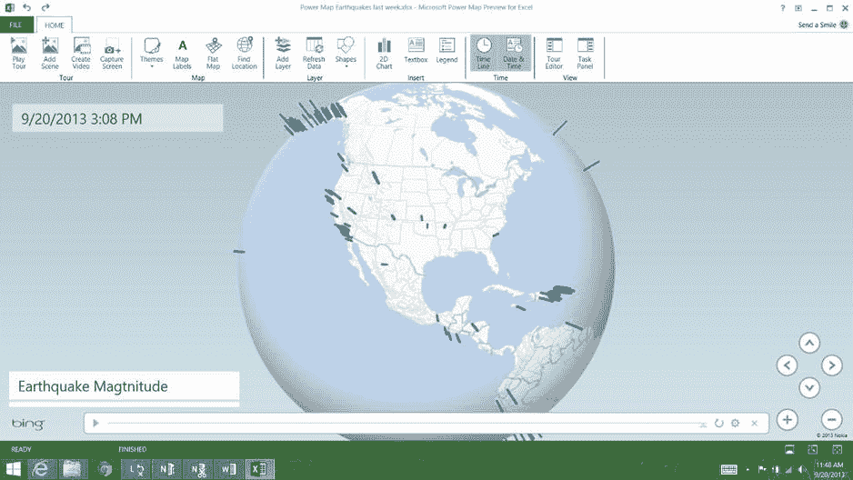
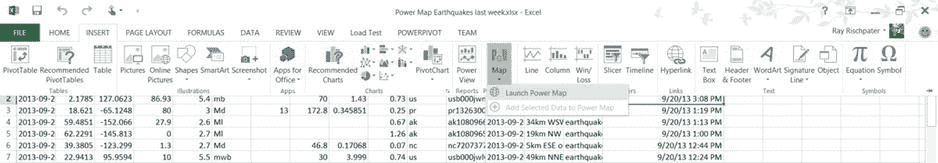
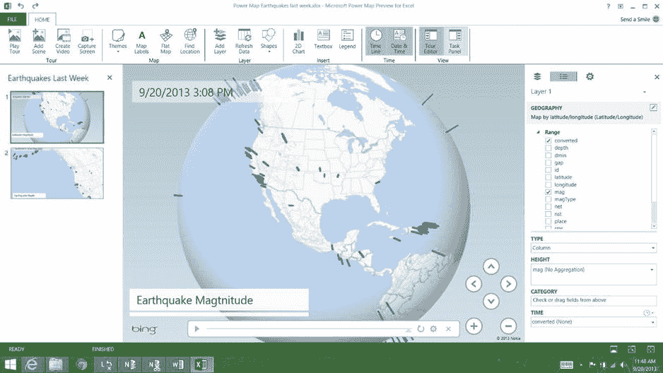

# 十、Excel 的PowerMap

虽然我们都喜欢编程，但我们觉得不需要编码也能解决问题:毕竟，没有代码就意味着没有错误，对吗？借助 Microsoft Excel Professional 和 Office 365 Professional 的插件 Power Map，您可以直接从 Excel 创建清晰的地理空间可视化数据。在许多数据可视化的情况下，Power Map 完全消除了编程的需要，让您可以直接在电子表格中处理数据，并在地图上查看关系。即使作为一个调试工具，这也是非常有用的:您可以从数据库中提取一部分数据，将其导入 Excel，可视化并得出结论，而无需编写代码在地图上绘制数据。

在这一章中，我们将向你展示如何下载和使用 Power Map，从 USGS 网站上查看我们的地震数据集。您将学习如何整理数据，以便在地球地图上显示为图表和时间序列，以及如何定制结果的样式以满足您的需求。

电源图简介

多年来，人们一直在 Excel 上拼凑可视化地图。一个常见的技巧是获取数据的纬度和经度，然后将数据绘制为散点图，y 轴为纬度，y 轴为经度，使用颜色来区分不同类型的数据。还有一些策略涉及尽可能在 Excel 中处理数据，然后编写一个小的查看器应用来显示地图上的点，或者构建一个更大的地图应用并在应用中嵌入一个 Excel 表。

微软的 Power Map(以前称为 GeoFlow )通过向 Microsoft Office Professional 和 Microsoft Office 365 Professional 提供扩展，直接从 Excel 接受数据并在地图上绘制数据，彻底改变了这一切。使用电源图，您可以:

*   通过纬度和经度地图数据或地理编码街道地址数据，
*   以条形图、气泡图或热图的形式在地图上绘制震级，
*   通过动画了解数据如何随时间变化，
*   执行数据聚合，如求和或平均，并在地图上显示数据，
*   创建静态图像和视频以嵌入演示文稿。

图 10-1 显示了上周美国地质勘探局的一些地震的能量图。



[图 10-1](#_Fig1) 。美国近期地震的可视化

获得电源图很容易，虽然最低要求设置了一个相当高的酒吧。你需要 Excel Professional 或 Office 365 Professional (家庭和小型企业 SKU 不支持 Power Map)，以及至少 3 GB 的磁盘空间和 1gb 或 2g 的 RAM。与大多数数据可视化任务一样，数据集越大，就应该有越多的 RAM。您还需要确保您拥有 DirectX 10 或更高版本:映射可视化会大量使用您的显卡。最后，在使用 Power Map 时，您需要有互联网连接，因为地图数据和地理编码使用微软的服务器作为数据源。

如果你符合这些要求，去[http://www.bit.ly/1a5xjWi](http://www.bit.ly/1a5xjWi)下载安装程序。它是通常的双击安装程序，可以连接到互联网下载更多的库。

电源图入门

美国地质调查局提供各种格式的地震数据，其中一种格式是按时间排序的逗号分隔值(CSV)文件。去[http://on.doi.gov/1dvKf9X](http://on.doi.gov/1dvKf9X)挑个档；在下面的例子中，我们使用的是过去七天的地震文件，因为这是足够的数据来进行实验而不会让人不知所措。

该数据有许多字段，但我们将重点关注的字段是:

*   时间(我们需要将它转换成 Excel 可以为我们的时间序列动画处理的时间)
*   地震事件的经纬度
*   地震事件的震级
*   地震事件的深度

从 USGS 下载数据集，并将其保存为 Excel 文件(不能直接在 Power Map 中使用 CSV 文件，因为 Power Map 可视化保存为 Excel 文件的一部分)。然而，在我们开始可视化之前，我们需要对地震时间的格式做一些事情:时间以标准格式表示为字符串，而不是从 Excel 处理的纪元开始的秒。为了解决这个问题，让我们在 P 列中添加一个“converted”列，用一个公式将这些字符串转换成更有用的内容:

1.  在单元格 P1 中，输入类似“转换日期”的标签。你在这里用什么并不重要，只要你知道它是做什么用的。
2.  选择 P 列，右键单击，然后选择“格式化单元格”。从出现的列表中选择日期，并选择格式“3/14/12 13:30”。
3.  在单元格 P2 中，输入公式

    ```cs
    =VALUE(MID(A2,6,2)&"/"&MID(A2,9,2)&"/"&LEFT(A2,4)&" "&
    MID(A2,12,2)&":"&MID(A2,15,2)&":"&MID(A2,18,2))
    ```

4.  将此公式复制到 P 列中有数据的其余单元格中。

这个公式很简单，但是有点难以解析。它将月、日、年、小时、分钟和秒字段作为单元格 A2 中字符串的字符，并构建一个新的`month/day/year hour:minute:second`格式的字符串，然后将该字符串传递给`VALUE`函数以获取该字符串的日期值。`MID`函数接受一个单元格、要返回的起始字符和要返回的字符数，而`LEFT`函数接受一个单元格和左边要返回的字符数。`&`操作符只是建立字符串；这是 Excel 中的字符串连接运算符。

你现在应该能够通过从插入功能区的PowerMap菜单中选择“启动PowerMap”来启动PowerMap，如图 10-2 中的[所示。](#Fig2)



[图 10-2](#_Fig2) 。启动能量图。请注意我们的扩充数据集，左边是 USGS 时间戳，右边是计算出的 Excel 时间戳

围绕电源地图导航

Power Map 让你构建所谓的数据*之旅* :数据在时间和空间上的可视化。旅程只是一张地图，上面有一些用户可以操作的数据(可能是一段时间内的数据);您可以构建多个旅程来突出显示数据的不同方面。

当你启动力量地图时，你将被要求添加或打开一个现有的力量地图之旅，然后看到主屏幕 ( [图 10-3](#Fig3) )。它分为以下几个部分:

*   横跨顶部的功能区，它为您提供了对 Power Map 的基本控制。
*   特定旅程中呈现的可视化在最左边的列中，
*   中间列中的地图(平面地图或地球的球体),
*   最右栏中的层和层属性编辑器。



[图 10-3](#_Fig3) 。Power Map 主屏幕，左侧是视图，中间是地图视图，右侧是层编辑器

让我们在创建的旅程中添加一个地震震级图。

1.  Power Map 应该能够识别数据中的纬度和经度字段。如果没有，在图层编辑器中，将它们拖到底部的“地理和地图级别”框中，并标记为“纬度”和“经度”。
2.  在层编辑器中单击下一步。
3.  对于“类型”，选择“列”。
4.  对于“高度”，将“mag”拖动到高度框中，并选择“No Aggregation”。
5.  对于时间，将转换后的时间字段标签拖动到时间框中。

你现在应该会看到类似于[图 10-1](#Fig1) 的东西，在地球地图下面有一个时间轴。单击播放按钮观看数据集中地震随时间变化的动画。

电源图中的地图选项

让我们仔细看看[图 10-3](#Fig3) 在动力图中的选项。在顶部的功能区上，我们有以下按钮:

*   “Play Tour ”以全屏方式一个接一个地播放巡回赛的所有开放场景，每个巡回赛之间有过渡。
*   “添加场景”让你添加一个新的场景到旅程中。场景有层次，我们一会儿会更详细地描述。
*   “创建视频”就是这样做的，创建一个高清晰度、中等清晰度或小型电影，以包含在其他媒体中(想想网络或 PowerPoint 演示)。
*   “主题”让你选择一个地图主题。地图主题包括真实感地图以及不同颜色的世界符号地图。随着主题的出现，地图上的标记、文本图例等都有了默认颜色。
*   “地图标签”显示和隐藏地图上的地图标签。
*   “平面地图”使用墨卡托投影在全球视图和平面地图之间切换。
*   “查找位置”让你输入一个地址(比如街道地址，或者更一般的位置，比如城市或邮政编码)，地图将放大该地址。当您试图了解数据与特定位置的关系时，这非常方便。
*   “添加层”让你添加一个额外的地图层到场景中。
*   “刷新数据”从 Excel 重新加载工作表模型。如果您在 Power Map 中工作时返回并编辑 Excel 数据，您将需要这样做。
*   “Shapes ”可让您向地图添加形状。
*   “2D 图表”可以让你在场景中的地图上叠加一个条形图或其他纵坐标图。您可以使用它来汇总应该在空间上查看和汇总的数据。
*   “Textbox ”让你在场景中的地图上放置一个文本框，你可以在其中添加额外的信息，比如场景的标题。
*   “Legend ”让你给你的场景添加一个图例，如果你的场景包含不止一个层，你一定要这么做。
*   “时间线”包括场景中地图上时间序列数据的时间控制器，因此用户可以拖动时间轴，开始和停止播放，等等。
*   “日期和时间”在时间序列回放期间切换当前日期和时间场景中的标签。
*   “游览编辑器”隐藏和显示左侧的游览场景列表。
*   “任务面板”隐藏和显示您用于配置层的右侧面板。

配置层的显示

游览中的每个场景都允许您向地图添加一个或多个图层。图层 是可能随时间变化的地理编码数据的集合。图层具有地理组成部分(纬度和经度或在地图上定位图层中的数据点的地址)和一个或多个应以某种方式绘制在地图上的数据位。

当创建一个层时，您要做的第一件事是指定层的地理位置，方法是指出电子表格中应该解析位置数据的列。如果您的数据已经地理编码，您只需要指出纬度和经度字段(请每列一个数据！).如果您的数据没有进行地理编码，而是由地址或城市名称等内容组成，请不要担心:Power Map 将对数据进行地理编码，包括城市和州等部分数据，或者只是数据的州或国家。同样，您只需选择数据列，并指出它们的类型(街道或城市或州或国家)，其余的工作由 Power Map 完成。

一个层的数据可以通过以下四种方式之一渲染:

*   列，它在每个地理位置为每个数据点放置一个条形图样式的显示，
*   气泡，它在每个地理位置放置一个大小与数据的相对大小一致的气泡，
*   热图，为更密集的数据点聚合渲染更红的颜色，
*   Region，它按城市、州、邮政编码或国家/地区聚合数据，并根据区域中的数据量给区域着色。

你选择哪一个不仅仅是选择的问题；柱形图最适合于几个离散的点，或者地球上分布很广的点。气泡渲染不如柱状渲染精确，但当您试图区分事物的相对大小时，这是一个不错的选择。当您想要查看某个事物的相对密度时，例如犯罪统计数据或类似数据，热图非常有用。区域绘图需要您的数据不是按点而是按区域分箱，这样您就可以直观地比较不同的区域，如州与您正在检查的统计数据。

点的值可以来自电子表格中的一列或几列。Power Map 可以以多种方式将数据点聚合到一个统计数据中:

*   通过统计数据的总和
*   通过取统计数据的平均值(算术平均值)
*   通过统计的计数(非空白)或不同计数
*   通过取统计值的最小值或最大值

如果您需要对数据进行更复杂的分析(比如，统计数据是否大于所有数据的三西格马阈值)，请不要忘记，您可以在 Power Map 后面使用 Excel 的全部功能:只需进入 Excel，创建一个新列，然后添加一个公式即可。

如果您正在绘制一个时间序列，时间可以按日、月、季度或年分类，并且您可以累计显示点，以便在绘制新点时之前的数据点保留在地图上，或者只显示每个数据点一瞬间。若要更改演示的最后一个方面，请点按时间栏标签右侧的时钟图标，然后选取“数据显示一瞬间”、“数据随时间累积”或“数据保留，直到被替换”

设定PowerMap结果的样式

在功能区中，您可以使用主题按钮对地图进行总体样式更改，或者根据您的喜好选择平面地图而不是地球地图。您选择的地图主题包括一些照片级真实感地图和一些符号地图，以及一些最适合用于显示粗略关系的风格化地图。这些主题还带有一些默认的标签颜色；如果你的技能不适用于平面设计，这很好。您可以从图例中应用的文本框、图例以及日期和时间标注也都是可移动的，因此您可以将它们放置在地图的关键部分周围，避免遮挡重要信息。

在任务窗格中，图层的齿轮图标会将您带到图层选项和场景选项。在图层选项中，您可以调整正在绘制的数据点的相对大小(例如，使条形变高或变短，或使气泡变大或变小)，以及在适当的情况下调整用于绘地图层数据的颜色(您不能更改热图或区域图的颜色)。你也可以选择幂映射是否呈现零或负数据；当然，如果你愿意的话，你可以在数据中使用一点 Excel skullduggery。

最后，在场景选项中，您可以调整场景显示的时间长度(如果您正在绘制时间序列，这很方便)并给场景命名。您还可以使用提供的许多过渡来控制从一个场景到下一个场景的过渡。当您从功能区中选择“播放游览”时，所有这些都是可见的，或者制作您的游览视频以导出到 Web 或包含在另一个文档中。

包扎

有时，您需要做的只是在地图上绘制数据以进行演示。虽然您可以使用本书中学习的任何 必应地图控件来完成此操作，但如果您有 Excel Professional(或 Office 365 Professional)并且您的数据适合电子表格，则 Power Map for Excel 也是一个选项。您可以制作呈现为柱形图、热图、气泡图或按区域呈现的数据的动画演示，并聚合数据，还可以使用 Microsoft Excel 的所有功能处理数据。