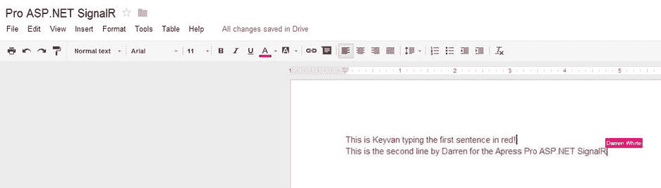

# 一、实时网络和 ASP.NET SignalR 简介

互联网是历史上最重要的发明之一，它在许多方面改善了我们的生活。对于像人类这样的社会动物来说，没有什么比一种快速的与世界交流的方法更好的了，这种方法能够几乎没有延迟地传送多媒体内容。

在其存在的几十年中，互联网已经从一组具有简单操作的基本网络集群发展成为我们世界中几乎一切事物的基础，提供了赚取数十亿美元的机会。

我们在本书中的任务是带领您(以及其他具有良好 ASP.NET 和 JavaScript 背景的微软 web 开发人员)了解一项名为 ASP.NET SignalR 的最新技术。它支持创建实时、异步的 web 应用，这些应用是用于构建网站的最现代类型的基础设施，可以实时地将内容从服务器传送到客户端，并消除任何延迟。客户端位于您站点的页面上，无需点击任何内容或刷新页面，即可实时接收最新更新。例如，在脸书，当有人发表评论或喜欢你的一张照片时，你不需要刷新页面就可以看到弹出的通知和更新的红色计数器。ASP.NET SignalR 公司为开发这些功能提供了基础。

本章给你一些关于 SignalR 的背景信息，以及它如何帮助你建立现代网站。以下是本章涵盖的主要主题:

*   互联网是如何发展到今天这个地步的
*   为什么客户端体验比以往任何时候都更重要
*   实时 web 应用开发的定义
*   实时 web 应用开发的一些例子
*   ASP.NET SignalR 机的历史概述
*   ASP.NET SignalR 机及其一些特点
*   ASP？ASP？ASP？网络 SignalR 体系结构
*   ASP.NET SignalR 机中不同运输选项的概述
*   实时 web 开发的主要挑战

## 互联网的演变

互联网最初只是一组简单的集群，连接一些计算机来执行基本操作。它很快成为一个非常复杂的遍布全球的服务器网络，为数亿(甚至数十亿)客户提供服务。

这个世界范围的网络在不同的领域发生了不同的变化。在一个领域，互联网连接变得更快、更可靠，使用户能够下载和上传更大的内容，因此用户现在可以通过他们的移动互联网连接下载和上传高质量的多媒体内容(例如视频)。它也为内容提供商和消费者打开了新的大门。

在另一个领域，互联网浏览器发展得非常复杂，并且能够以更加用户友好的方式促进内容的创建和交付。例如，至少十年来，异步 JavaScript 和 XML (AJAX)技术的使用给最终用户带来了更流畅的用户体验。

在第三个领域，服务器技术已经发展到适应浏览器和连接的进步。引入了新的编程语言和平台，以及许多帮助 web 开发人员简化 web 应用创建过程的库。最近的进步之一是对 WebSockets 的支持。

互联网上所有不同的趋势都聚焦于提供更好的用户体验。我们已经从提供静态 HTML 网页转变为可以根据用户操作进行更新的动态页面。然后，我们可以使用客户端语言(主要是 JavaScript)来处理浏览器上的某些事情，并减少刷新网页以获取新内容的需要。目前，有一种更现代的方法:通过结合使用服务器端技术和 JavaScript，将内容从服务器实时传送到客户机。这是 SignalR 员发挥作用的地方。

## 为什么客户端体验比以往任何时候都更重要

用户的概念已经成为当今互联网最重要的概念。几乎所有的企业，无论规模大小，都知道用户体验有多重要。他们已经将注意力转移到制造足够直观和简单的产品、技术和软件，以吸引几乎任何用户，不管他们的年龄、性别、文化背景等等。

用户体验的一个重要部分是交付内容的速度。传统上，互联网是由服务器提供并由客户端接收的一组网页。这些页面包括许多静态页面和动态页面，静态页面不能对用户的动作做出动态反应，而动态页面可以根据用户提供的输入呈现动态内容。用户必须将他们的操作发送到服务器，或者从服务器请求特定的统一资源定位器(URL)来接收 HTML 内容。这是一个非常简单的模型，缺乏现代网站的复杂性。

随着用户体验变得越来越重要，web 设计人员和开发人员想到了将 JavaScript 和 XML 与服务器上的部分内容呈现结合使用，以利用 AJAX 的概念。它将为用户提供更流畅的体验，并更快地向这些用户提供内容。

然而，在过去的几年里，这种方法还不足以满足现代互联网的需求。即使使用 AJAX，也经常需要等待用户更新页面的一部分并交付内容，所以内容交付的速度非常依赖于用户交互的速度。

这个问题导致 web 开发人员和设计人员开始考虑在内容实时到达时将内容从服务器发送到客户端，或者至少发明模拟这种行为的机制。这个过程被称为实时 web 应用开发。

## 实时 Web 应用开发

术语实时软件是指受到软或硬时间约束的软件类型。根据其业务领域的性质，这种类型的软件必须在特定的时间框架内完成处理。这种时间约束可以是严格的，使其成为硬实时软件，也可以是灵活的，使其成为软实时软件。例如，航空软件可以是硬实时软件，因为它必须在规定的时间间隔内完成执行；否则，手术可能会失败，人们的生命会有危险。相比之下，视频播放器可以是软实时软件，因为如果处理没有按时完成，它就不是关键任务(尽管及时处理视频以向用户显示它们是重要的)。

虽然实时软件和实时计算已经存在很长时间了，但是实时 web 这个术语还是相对较新的。这一概念是在过去几年中引入的，其重点是一旦内容可用就将其实时交付给客户端。

实时 web 类似于软实时软件，因为从信息源到消费者的内容传递应该在被认为是实时的短时间内发生(从几毫秒到 1 秒)。

实时网络受到社交网络的欢迎，他们需要通过朋友和同事的频繁状态更新和内容变化来更新用户。脸书和推特是互联网上率先在这一领域实现实时网络功能的主要网站之一。

虽然实时 web 主要应用于向客户提供状态更新、新闻标题和类似内容的软更新和小更新，但它现在也用于其他目的，如实时搜索(更多详细信息将在下一节介绍)。谷歌整合了这些功能，以便在搜索结果可用时对其进行实时更新。

## 实时 Web 应用开发的例子

本节重点展示几个常见的实时 web 示例来描述它和它可能拥有的应用。对包括 SignalR 在内的实时 web 开发技术的一个常见误解是，它们主要是为构建聊天应用而设计的。这里显示的例子通过描述这些技术的不同实际应用纠正了这一点。

### 脸谱网

脸书的实时通知功能(见图 [1-1](#Fig1) )是实时网络的最佳范例之一，而脸书是这一领域的先驱。如果你有一个脸书帐户，你会发现新通知的红色计数器会实时增加，同时在新操作的左下角会出现一个祝酒词。

图 1-1。

Facebook’s use of the real-time web

每当有新的赞、评论、帖子或其他类型的通知与您的帐户相关联时，您会在底部看到一个通知提示，它会出现并在几秒钟后消失。同时，红色的新通知计数器会更新。

脸书正在使用 WebSockets 和长轮询的组合来实现这个特性。(本章后面将更详细地讨论这些方法。)

请注意，脸书使用类似的异步机制来实现其聊天系统(事实上，脸书聊天和实时通知是在 2008 年初一起推出的)。脸书后来增强了它的实时功能，包括网站不同部分的实时更新，比如添加到帖子中的新评论实时呈现给用户。

如此复杂可靠的脸书实时网络实施对其业务有着重要的价值。随着数亿活跃用户提供的大量用户和对大量内容的高需求，通过集成这样一个实时 web 生态系统，用户体验得到了显著改善。

在技术方面，脸书采用了非常复杂的定制实现来实现其独特的实时网络业务目标，这种业务目标依赖于将内容从服务器推送到客户端。脸书不得不考虑几个因素，例如大量活跃的出版商和消费者，以及保持其数据中心同步和减少分散在世界各地的用户的延迟。

### 推特

另一个流行的使用快速状态更新的社交网络是 Twitter，它经常收到用户的更新。然后，每个用户都可以拥有许多关注者，他们希望从该用户及其关注的其他用户那里获得最新的更新。向客户发送这些简短状态更新的速度对 Twitter 的业务至关重要，因为它可以显著改善用户体验。想象一下，如果 Twitter 用户每次想要更新时都必须刷新他们的 Twitter feed，他们会有多沮丧。

Twitter 采用实时网络基础设施向用户实时显示最新更新(见图 [1-2](#Fig2) )。这个实现是 Twitter 的定制实现，适合它的需求。当新的更新出现在用户的提要或搜索结果中时，用户界面会更新新更新的计数器，它要求用户单击计数器链接，通过 AJAX 调用获取最新的更新(而不是刷新整个页面)。

图 1-2。

Twitter’s use of the real-time web

### 谷歌搜索

随着互联网上内容生产的快速发展，特别是对于热门话题，新的文章和新闻条目会很快出现。谷歌使用其强大的索引工具来快速捕捉这些更新。在传统的用户界面结构中，用户搜索特定的关键字后，结果会从 Google 数据库中内容存储库的原始状态显示出来。为了提供更好的用户体验，谷歌提供了实时搜索结果更新，搜索结果随着新项目的出现而更新，用户可以看到最新的项目。

虽然谷歌使用自己的实时网络实现实时搜索结果，但它在 2011 年关闭了这一功能，因为与 Twitter 的实时显示最新推文的协议到期了。

### 谷歌文档

另一个展示实时网络力量及其影响的好例子是 Google Docs，用户可以使用在线版本的文档编辑软件进行文字处理、电子表格和幻灯片。用户不仅可以使用提供的强大功能编辑自己的文档，还可以与他人共享他们的文档。实时 web 的真正力量在这里大放异彩:一个用户所做的更新会实时反映在其他用户的显示器上，因此来自不同位置的多方可以协作编写和编辑文档(见图 [1-3](#Fig3) )。

图 1-3。

Google Docs relies on the real-time web for its unique collaboration features

谷歌文档是实时网络如何改变互联网网站游戏的一个很好的例子。Google Docs 使用一个定制的复杂的 Google 实现来实现它的目标。它将文档视为变更集的集合，而不是传统的单一视图。Google 工程师可以将这些变更集实时分发给个人用户。

### 闲聊

既然你已经看到了一些实时网络的著名例子，你也应该知道一些 ASP.NET SignalR 的例子。互联网上最著名的 SignalR 网站之一是 JabbR(见图 [1-4](#Fig4) )。这个在线聊天室和讨论服务是由创建 SignalR 的同一批开发者实现的。它已经成为软件开发人员主持他们的群聊和讨论各种话题的一个非常突出的位置，例如直播他们对开发者大会和类似事件的看法。

图 1-4。

JabbR is a prominent SignalR chatroom application

JabbR 在 [`http://jabbr.net`](http://jabbr.net/) 可用，完全用微软栈技术实现，包括 ASP.NET MVC 和 ASP.NET SignalR。好消息是它是一个开源项目，其源代码可以在 GitHub 上的 [`http://github.com/JabbR`](http://github.com/JabbR) 获得。开发人员每天都为这个项目做出贡献，以使它更加成熟。

JabbR 采用了一种现代的、反应灵敏的 web 设计，可以在所有桌面和移动设备上很好地呈现，它可以独立托管，也可以在 Windows Azure 或 AppHarbor 上的云中托管。

JabbR 使用 SignalR 将聊天和相关的多媒体内容从服务器实时传送到客户端。聊天系统的应用是实时 web 的最基本和最常见的例子，可以被错误地视为实时 web 的唯一应用。事实上，如果你在谷歌或必应上快速搜索 ASP.NET SignalR 示例，大多数结果都是聊天应用。这本书甚至使用了一些聊天应用的例子，因为它们很好地说明了实时网络和 ASP.NET SignalR 的概念。

### 射手

我们用另一个 ASP.NET SignalR 网站来结束我们的例子，这个网站与其他例子有些不同，因为它是一个在线合作游戏。ShootR(如图 [1-5](#Fig5) 所示)是 [`http://shootr.signalr.net`](http://shootr.signalr.net/) 提供的一款网络游戏的名称。它是一个开源项目；GitHub 上也有它的源代码( [`https://github.com/ntaylormullen/shootr`](https://github.com/ntaylormullen/shootr) )。

图 1-5。

ShootR is an online spaceship game powered by ASP.NET SignalR

ShootR 将现代的 HTML、CSS 和 JavaScript 元素与 ASP.NET SignalR 结合起来，提供了一个实时的宇宙飞船游戏。ASP.NET SignalR 员的角色是将自动计算机用户和其他人类用户的飞船的游戏画布的位置和状态实时传递给当前玩家(和其他玩家)。内容的可靠交付和游戏玩家的良好体验是这款游戏的目标。

## ASP.NET 通信兵的历史

web 开发人员，尤其是微软 ASP.NET 开发人员，对实时 web 开发特性的需求越来越大。Damian Edwards(微软 ASP.NET 团队的项目经理)受到激励，为微软技术上的这一常见问题构建了一个解决方案。SignalR 是一个开源项目，也吸引了一些其他开发人员。后来，David Fowler(微软 ASP.NET 团队的软件开发人员)在开发这个项目中扮演了一个重要的角色，并且一直在这样做。

虽然 SignalR 最初是一个开源项目，但它有来自微软的良好社区支持，当微软决定将这个开源项目捆绑为其 ASP.NET 堆栈的一部分并将其命名为 ASP.NET SignalR 时，这种支持就完成了。

ASP.NET SignalR 仍然是真正的开源软件，并获得了 Apache 2.0 许可。你可以从 GitHub 的 [`http://github.com/SignalR/SignalR`](http://github.com/SignalR/SignalR) 下载 ASP.NET SignalR 的源代码，也可以参与这个项目。ASP.NET SignalR 公司在微软 ASP.NET 网站上也有自己的官方主页，网址为 [`http://www.asp.net/signalr`](http://www.asp.net/signalr) 。像微软开发者可用的许多其他库和产品一样，ASP.NET SignalR 也可以通过 NuGet 在 [`http://nuget.org/packages/Microsoft.AspNet.SignalR`](http://nuget.org/packages/Microsoft.AspNet.SignalR) 获得。

SignalR 在其短暂的存在中有着非常活跃的生命，并且已经发布了几个次要和主要版本。2.1 版本现已推出，本书就是以此为基础的。ASP.NET SignalR 在这些版本中已经明显成熟，现在处于非常稳定和实用的状态。

在每个版本中，ASP.NET SignalR 都经历了主要和次要的功能变化以及错误修复，并与最新添加的进行了更好的集成。NET 框架，导致与 OWIN 的逐步集成和更好的错误处理和诊断机制。版本 2.x 中最有用的主要变化之一是能够针对特定用户向客户端发送消息。

## 什么是 ASP.NET SignalR？

那么 ASP.NET 通信兵到底是什么？实际上，它只不过是一个图书馆。NET 框架和 jQuery(或者其他客户端技术)。换句话说，ASP.NET SignalR 是一些开发人员通过提供开箱即用的应用编程接口(API)来促进创建实时 web 应用的工作。

您可以在。NET 框架，并将其称为 SignalR Prime、KeyvanR 或 APressR，但 SignalR 是一个成熟的库，旨在解决实时 web 开发中几乎任何常见的情况。因此，将 SignalR 应用于您的实时 web 应用比重新发明轮子更经济、高效且无风险。

使用 SignalR，您可以构建包含服务器端和客户端的实时 web 应用。ASP.NET SignalR 通过提供可以集成到您的项目中的库来提供这两个部分。

尽管它的名字可能意味着 SignalR 仅在 web 应用的上下文中可用，但是您可以自托管 SignalR 服务器，并在 Windows 桌面应用或本地移动应用的上下文中使用服务器数据(稍后将讨论)。然而，大多数人在 web 应用的上下文中使用 SignalR，该主题是本书大多数章节的重点。(第 6 章致力于在 web 环境之外为不同类型的客户端使用 SignalR。)好消息是，ASP.NET SignalR 中服务器组件的客户端使用彼此非常相似，因此了解 JavaScript 概念可以相对容易地采用任何其他类型的客户端。

总而言之，ASP.NET SignalR 是一套用于。NET 框架、JavaScript/jQuery、iOS 等平台。它为构建实时 web 应用提供了服务器和客户端实现。SignalR 通过隐藏实现细节和支持基础设施简化了实时开发。它还具有高效性和可扩展性，可用于工业和企业中的各种应用。

SignalR 有三个主要特征:

*   SignalR 非常灵活:它提供了不同的工具层，允许开发人员构建自己的定制应用。一方面，ASP.NET SignalR 提供 hub(见第三章第一节)，这是一种简单快捷的方式来构建实时网络应用，并隐藏一些细节以方便网络开发人员的工作。另一方面，持久连接(见[第 4 章](04.html))是构建应用的更基本的工具，它给予开发者更多的灵活性和能力，但需要更多的努力来处理由 hub 处理的某些事情。
*   SignalR 是可扩展的:ASP.NET SignalR 中的许多组件被设计成在必要时可以很容易地被定制的实现所替换。ASP.NET SignalR 已经将依赖注入集成到其内部结构中，以提供如此好的可扩展性。你通常不需要更换这些组件，但如果你要更换，这是一项简单的任务(见第 7 章)。
*   SignalR 是可扩展的:ASP.NET SignalR 提供了一些内置机制，使 web 开发人员能够轻松地对其进行扩展。在多台服务器上托管一个 SignalR 服务器应用会带来一些常见的挑战，但是这些挑战可以通过在 SignalR 中提供一组可扩展的特性来解决(参见第 8 章)。

除了这些主要特征之外，ASP.NET SignalR 还为任何微软 ASP.NET 开发者可能遇到的常见问题提供了一套功能。SignalR 提供了一套很好的调试和跟踪功能(见第 5 章)。同样，SignalR 易于配置，使用安全(见[第 8 章](08.html))。云托管是当今软件的一个热门话题，Windows Azure 是微软开发人员云托管的热门选择(见[第十章](10.html))。

## ASP？ASP？ASP？网络 SignalR 体系结构

正如上一节所讨论的，ASP.NET SignalR 是一套用于不同平台的不同库。尽管 SignalR 的服务器端绑定到。NET Framework 或 Mono(的开源 Linux 实现。NET 框架)，客户端库是非常独立的，可以在任何平台上实现。从高层次来看，ASP.NET SignalR as a technology 由一个服务器实现组成，该服务器实现为一组托管在不同平台上的各种类型的客户端提供服务(参见图 [1-6](#Fig6) )。

图 1-6。

High-level view of ASP.NET SignalR as a technology

在这种背景下，当我们谈论架构时，我们指的是 ASP.NET SignalR 服务器端的架构，因为整个 SignalR 技术的通用高级架构是服务器-客户端架构。客户端库本身没有统一的体系结构，尽管所有这些客户端都需要某种传输支持，以连接到本章稍后讨论的服务器端传输。

但是 SignalR 库的服务器端由一个堆叠架构组成(图 [1-7](#Fig7) ),它使用下一节讨论的四种常见传输选项之一。根据网络基础设施和可用性，按优先级顺序使用这四种传输方式中的一种。如果使用 hub APIs，它们是客户端简化逻辑和调用 SignalR 中底层持久连接 API 的连接点。如果直接使用持久连接 API，开发人员需要负责从客户端接收原始数据，并提取元数据来响应这些请求。

图 1-7。

ASP.NET SignalR server architecture

## 实时 Web 开发的主要挑战

HTTP 是一种无状态协议，它不为服务器和客户端提供任何回调机制。这是实时 web 开发的主要挑战，因为我们希望随时将信息从服务器推送到客户机。大多数构建实时 web 开发框架的努力都致力于解决这一挑战。

为了解决这个问题，使用了不同的技术来将来自服务器的内容放在客户机上。这些技术可以分为两组:

*   传统方法:主要依靠使用黑客和技巧来实现这个目标。这些方法是基于服务器和客户机之间的长期 HTTP 连接的概念构建的，也称为 Comet。
*   现代方法:依赖 HTML5 中引入的新特性。

下一节将讨论属于这两类的四种传输选项:长轮询、永久帧、服务器发送的事件和 WebSockets。

实时 web 开发的另一个相关挑战是传统方法(即 Comet)导致的资源使用，因为长时间保持 HTTP 连接会耗尽移动设备的电池电量，并消耗客户端和服务器上的其他资源。因此，Comet 方法的实现对于最大效率是至关重要的。

尽管传统的 Comet 方法存在这样的挑战，但基于 HTML5 的新方法在当前的互联网状态下也有局限性。例如，WebSockets 的使用依赖于客户端和服务器之间的硬件和软件支持。所以客户端和服务器之间的整个网络基础设施必须支持 WebSockets，同时托管操作系统中的软件基础设施也必须支持它们。目前，WebSockets 仅在 Windows Server 2012 中受支持。

实时 web 开发的最后一个挑战是实现硬实时。假设所有这些挑战都解决了，从服务器到客户端的内容必须在非常短的时间内(通常不到 1 秒)交付，以实现实时行为。这样的约束要求开发人员构建轻量级和高效的实现。

## 运输选项

如前所述，ASP.NET SignalR 依靠传输层来实现客户端和服务器之间的通信。这四个传输层分为两组:Comet 方法和现代 HTML5 方法。依次讨论每个传输选项，然后讨论 SignalR 如何实现这些传输层。

### 长轮询

这种著名的 Comet 方法是当今互联网上实现实时 web 开发的最常见的方法之一。它依赖于使用 JavaScript(或其他技术和技巧)来建立到服务器的轻量级 HTTP 连接，并在一段时间(例如，30 秒)内保持打开。在这个时间间隔内，如果服务器上有新数据可用，它会将数据放入当前打开的 HTTP 连接中，然后关闭它。客户端接收到该数据，并立即打开一个新的长轮询连接。如果在这段时间内没有数据，客户端将建立一个新的长轮询连接，并且只要页面在 web 浏览器中处于打开和活动状态，客户端就会继续这个连接。

长轮询遵循这个简单的模型，并减少了打开几个到服务器的连接的开销，这可能是由间隔轮询方法引入的。间隔轮询是传统的方法，其中定期(例如，每 10 秒)检查服务器的新内容。这种方法效率不高；打开和关闭到 web 服务器的 HTTP 连接会产生开销。长轮询试图减少这种开销。

### 永久框架

另一种没有长轮询常见的 Comet 方法是 Forever Frame(也称为 hidden iframe)，这是一种特定于 Internet Explorer 的方法。在这种方法中，一个隐藏的 iframe 元素附加到每个 web 页面上，在整个请求期间(用户停留在页面上的时间)保持打开。随着数据在服务器上变得可用，它以堆叠的方式被 JavaScript 代码填充，并且因为浏览器按顺序执行这些脚本，所以它们可以提供所需的期望行为。

### 服务器发送的事件

这种方法是一种现代的 HTML5 传输，使 web 浏览器能够通过 HTTP 连接从服务器接收事件。

服务器发送事件(像其他基于 HTML5 的方法一样)的主要限制是浏览器支持。尽管最新版本的通用浏览器支持服务器发送的事件，但 Internet Explorer 不支持它们，这给那些有兴趣使用这些事件进行实时 web 开发的人留下了很大的空白。

### 求转发到

另一种具有更好浏览器支持的 HTML5 方法是 WebSockets，它通过 TCP 连接提供双向通信通道。WebSockets 并不局限于 HTTP，尽管它也可以在那个上下文中使用。

WebSockets 的使用依赖于底层操作系统的支持(在微软服务器技术中，只有 Windows Server 2012 支持它们，尽管它在 Windows 8 和 8.1 上也可用)以及客户端和服务器之间的整个网络基础架构。当然，也需要浏览器支持来利用 WebSockets，大多数常见 web 浏览器的最新版本都支持它。

### ASP.NET 通信兵如何使用运输机

ASP.NET SignalR JavaScript 库有一个内置的机制，可以根据可用性在不同优先级的方法之间进行切换。除非您指定了一个或多个要使用的传输选项，否则会考虑以下选项顺序:

WebSockets   Server-sent event   Forever Frame   Long polling  

## 摘要

本章简要介绍了实时 web 开发和 SignalR。您看到了 SignalR 如何融入到丰富的用户体验和实时应用的大环境中，并且简要了解了它的架构和面临的挑战。

在下一章中，您将通过用 ASP.NET SignalR 实现一个基本示例来熟悉基本概念和开发过程。