# 2.信号概述

当学习一个全新的代码库时，最初你可能会认为它很棒，你会在以后的每个项目中使用它。尽管有时新的库可以在您最新的项目中工作，但它可能不是最佳的解决方案。本章讨论了 ASP.NET 信号的技术基础。这些技术使 SignalR 能够支持广泛的服务器和客户端平台。因为您渴望尝试 SignalR，所以您将编写您的第一个 SignalR 应用程序。在创建第一个应用程序之后，重点是什么时候使用 SignalR 最好。

为了更好地利用 SignalR，我们将介绍您可以定制、扩展和扩展哪些功能来满足您的项目需求。但是所有好的东西都有局限性，我们也讨论一下 SignalR 的一些局限性。

总之，本章讨论了以下主题:

*   SignalR 背后的技术
*   支持的服务器和客户端平台
*   SignalR 入门
*   何时使用 SignalR
*   信号的延展性
*   信号的局限性

## SignalR 背后的技术

SignalR 中有一些突出的技术，这些技术赋予了它使实时 web 应用程序变得容易的力量和灵活性。这些技术帮助应用程序变得灵活，因此它们不依赖于特定的主机。它们还使连接到大量客户机变得容易，而不必担心特定于客户机的传输。同样，这些技术允许您的应用程序高度可定制和可伸缩。

### 为打开 Web 界面。网络(OWIN)

许多开发人员都知道，大多数 ASP.NET 项目都依赖于主要为 Internet 信息服务(IIS)构建的`System.Web`程序集。随着 2012 年 Web API 的发布，第一次摆脱了对`System.Web`的依赖。随着`System.Web`依赖性的消除，开发人员可以更容易地自托管 Web API，这产生了一个新的问题，其中可能有多个托管的实现(Web API、静态页面、MVC 等)，所有这些都运行在他们自己的进程中，有单独的主机。为了解决这个问题，web 开发人员想出了一个公共接口，该接口能够将 web 应用程序与 web 服务器分离开来。这个公共接口就是 OWIN，它为 HTTP 请求和响应强制执行一个结构和过程。OWIN 接口非常简单(见清单 2-1)。

清单 2-1。OWIN 接口

`Func<IDictionary<string, object>, Task>`

最新的 OWIN 规格可以在 [`http://www.owin.org/spec/owin-1.0.0.html`](http://www.owin.org/spec/owin-1.0.0.html) 找到，但是接口是重要的部分。该接口是一个函数，它接受一个包含环境变量的`IDictionary`对象，并在函数完成后返回一个任务。

环境变量字典存储关于请求、响应和任何相关服务器状态的信息。在函数求值期间，需要在字典中填充一组变量。服务器需要为请求和响应提供主体流和头集合。OWIN 应用程序负责在响应数据的字典中填充响应变量。SignalR 实现了 OWIN 接口，允许它作为中间件被任何实现了 OWIN 接口的主机托管。

### 连接传输

SignalR 提供了四种连接传输:Web 套接字、服务器发送的事件、永久帧和长轮询。这些传输提供了关键的技术元素，使得实时或接近实时的连接成为可能。最理想的传输是 Web 套接字，它通过全双工套接字提供实时通信。由于传输限制，其他传输技术只能提供接近实时的通信。在这些传输中，服务器发送的事件最接近实时，其次是永久帧，然后是长轮询。所有传输都是回退机制的一部分，该机制通过从最理想的连接开始并回退直到找到合适的连接来自动提供最佳连接。

### 依赖关系解析器

在 SignalR 中有一个依赖解析器，它提供了大量的定制和灵活性。依赖性解析器的基础是具有专门逻辑的对象容器。容器通过控制任何被请求对象的依赖性来实现控制反转(IoC)。这意味着容器可以控制为一个类解析哪些依赖对象，而不是由该类控制自己的内部依赖关系。为了解释依赖解析器如何使用 IoC 容器工作，我们将查看一个带有依赖注入的 IoC 示例。

#### 控制反转

要理解 IoC，请看清单 2-2 中的代码，它包含了定义在类内部的依赖关系，我们不能改变这些依赖关系。这是许多开发人员使用的一种常见模式，它将硬依赖强加于内部类。

清单 2-2。内部依赖于其他类的代码示例

`public class EmailAlertService`

`{`

`public void SendAlert()`

`{`

`//Send Alert`

`}`

`}`

`public class AlertSystem`

`{`

`private EmailAlertService _alertService;`

`public AlertSystem()`

`{`

`_alertService = new EmailAlertService();`

`}`

`public void ThresholdExceeded()`

`{`

`_alertService.SendAlert();`

`}`

`}`

如果你看一下`AlertSystem`类，你会发现对`EmailAlertService`类有一个依赖，这个依赖对`AlertSystem`类的消费者是隐藏的。换句话说，依赖关系没有公开，所以在`AlertSystem`和`EmailAlertService`之间有一个紧密的耦合。起初看起来可能不坏，但是`AlertSystem`被限制只能发送电子邮件提醒，并且不能很容易地进行单元测试。

因此，对于 AlertSystem 类，我们希望实现 IoC 技术，以便将内部依赖关系的控制转化为消费类。有几种方法可以反转控制，但是最流行的是使用依赖注入模式。

在依赖注入中，一个类为消费类提供一种机制来提供内部依赖。依赖注入有三种类型:构造函数注入、属性注入和接口注入。构造函数注入是最常见的，在 SignalR 中使用。

构造函数注入有几个好处。首先，任何消费类都确切地知道创建实例需要什么依赖关系。其次，一旦创建了实例，所有需要的依赖项都已经提供了。清单 2-3 显示了一个`AlertSystem`类的构造函数注入的例子。

清单 2-3。允许构造函数依赖注入的类的示例

`public class AlertSystem`

`{`

`private IAlertService _alertService;`

`public AlertSystem(IAlertService alertService)`

`{`

`_alertService = alertService;`

`}`

`public void ThresholdExceeded()`

`{`

`_alertService.SendAlert();`

`}`

`}`

使用 IoC，我们可以向消费类公开内部依赖关系。但是现在我们可以访问内部依赖项，我们需要一种方法来控制如何使用它们。

#### 控制容器的倒置

控制容器的反转(IoC 容器)控制内部对象的注册、定位和生存期。根据 IoC 容器，它还可以提供额外的功能。

为了让容器知道它所负责的对象，您需要注册这些对象，这可以通过约定或配置来完成。约定注册的一个例子是注册任何实现与接口同名的接口的类。例如，它可以是一个实现了`IAlerter`接口的`DBAlerter`类。配置注册通常可以在配置文件中或以编程方式完成。清单 2-4 显示了一个程序注册的例子。

清单 2-4。配置注册示例

`container.RegisterType<IAlerter,DBAlerter>();`

一旦在容器中注册了一个对象，就有各种方法来检索该对象。它可以通过显式请求(解析)对象或作为被请求对象的注入依赖项来检索。在清单 2-5 中，通过让容器解析接口来显式地请求一个对象。如果对象是依赖链的一部分，容器也可以自动为您解析对象，这通常发生在请求一个在其构造函数中具有依赖关系的对象时。如果容器注册了这些依赖项，它会解析它们。

清单 2-5。从容器中解析对象

`IAlerter alerter = container.Resolve<IAlerter>();`

容器中的每个对象都有一个生存期。支持的生存期类型因容器而异。例如，您可能希望在每个请求中返回相同的对象，如配置类。为此，该对象被注册为一个`Singleton`。有时，您每次都需要一个对象的新实例，比如请求的新`Controller`。这种类型的生存期和其他类型的生存期可以基于每个对象进行注册。当您在容器中注册对象时，您定义了它们的生存期

#### 依赖关系解析器示例

依赖关系解析器允许替换大多数 SignalR 组件。一些基类如`PersistentConnection`使用服务定位器模式来解析它的依赖关系。

`SERVICE LOCATOR PATTERN`

在许多核心类中使用弱类型服务定位器模式。这种模式允许通过构造函数将定位器对象注入到类中，构造函数调用定位器上的`Resolve`方法来获取依赖对象。

例如，在清单 2-6 中，依赖解析器被配置为对从`PersistentConnection`派生的类使用我们的`IJsonSerializer`实现，因为类型是从依赖解析器解析的。

清单 2-6。在依赖项解析器中重写 IJsonSerializer 的示例

`public class MyJsonSerializer : IJsonSerializer`

`{`

`//logic removed for simplicity`

`}`

`protected void ConfigureTypes()`

`{`

`GlobalHost.DependencyResolver.Register(typeof(IJsonSerializer), () => new MyJsonSerializer());`

`}`

这是一项非常强大的技术，使我们能够非常具体地定制 SignalR 应用程序。

### 任务并行库

任务并行库是一组 API，是 of.NET 框架 4.0/4.5 的一部分。这些 API 有助于提供一种简单但强大的方式来为程序添加并行性，这是通过将并发线程化的困难抽象为由调度程序控制的任务来实现的。英寸 NET 4.5 中，添加了`Async`和`Await`关键字来进一步简化代码以实现并行性。

通过任务并行库，SignalR 可以更有效地利用资源。很多代码都是这样写的，即返回一个`Task`；然后，调度程序可以针对并行性更高效地优化代码。

通过使用`Async`和`Await`关键字，SignalR 代码能够提供更多的异步方法，因此效率更高。这些异步方法允许调度程序在等待网络输入/输出(I/O)等昂贵的操作时切换到其他工作。

这些 API 提供了一个关键的功能，允许 SignalR 更有效地扩展和工作。

### 消息背板

随着应用程序的扩展，您有两种选择:向上扩展或向外扩展。向上扩展是指改进或升级运行应用程序的系统中的组件。这种类型的扩展只能提供一点点改进，因此您还必须向外扩展。横向扩展是指应用程序在多台计算机上运行。为了向外扩展，主机需要相互通信，这是通过消息底板来完成的。

消息底板是一个专门的应用程序，专门用于使用定义的 API 接口在系统之间传输消息。消息底板提供了一些有助于应用程序在向外扩展方面表现出色的特征。

第一个特征是用于所有应用程序之间通信的中央路由通道。如果没有这个中央路由通道，随着应用服务器数量的增加，将所有应用服务器相互连接起来的复杂性会以二倍的速度增加。但是这对于应用程序来说都是简化的，因为它只需要知道消息底板的地址；消息底板负责传递消息。

消息底板的第二个特征是消息发送的异步性。发起的应用程序只需将消息发送到消息底板，然后就可以返回进行处理。既然消息已经在消息底板中，那么将消息传递给所有预期的接收者就是它的责任了。

消息底板的另一个特征是公共消息模式。所有背板消费者都有一个一致同意的消息模式，允许他们在不涉及复杂接口逻辑的情况下进行通信，因为复杂接口逻辑可能会随着新软件或更新软件的使用而改变。

SignalR 支持多种背板选项，在本章后面和第 9 章中有更详细的解释。

## 支持的服务器平台和客户端

如前所述，SignalR 非常灵活，因此对于服务器和客户端平台有许多选择。虽然支持的服务器平台通常是基于微软的，但是使用 Mono 框架也可以使用其他操作系统，比如 Linux。客户端的范围从当前的 web 浏览器到。NET 客户端到 iOS 和 Android。如果使用 Xamarin 工具，iOS 和 Android 会依赖 Mono 框架的定制版本。也有一个不需要 Mono 框架的 Android SDK，但它的功能有限。

### 服务器平台

支持的服务器操作系统如下:

*   视窗服务器 2012 R2
*   Windows Server 2012
*   视窗服务器 2008 R2
*   Windows 服务器 2008
*   Windows 8
*   Windows 7
*   微软云操作系统
*   Linux 操作系统

Note

同样，支持 Linux 需要使用 Mono 编译 SignalR 程序集。

### 客户端平台

由于浏览器支持 JavaScript，SignalR 支持的客户端平台数量相当庞大。下面的列表显示了受支持的客户端(可能还有更多不受官方支持的客户端):

*   网络浏览器
    *   Internet Explorer 8+
    *   谷歌 Chrome
    *   火狐浏览器
    *   旅行队
    *   歌剧
    *   。NET 4.5 和 4.0 客户端
    *   Windows RT
    *   Windows Phone 8
    *   Silverlight 5
    *   机器人
    *   ios

Note

使用 Xamarin 定制版本的 Mono 支持 Android 和 iOS 客户端。

## SignalR 入门

既然我们已经讨论了构建 SignalR 的技术，现在是时候尝试一下了。若要创建示例应用程序，您需要安装 Visual Studio 2012 或更高版本，并且能够在支持的平台上运行服务器。净 4.5。我们首先向您展示的是 NuGet，它用于将所需的 SignalR 组件集成到您的解决方案中。接下来，我们重点创建一个示例`PersistentConnection`服务器和客户端应用程序。

### 纽吉特

在过去合并第三方依赖项时，通常的解决方案是下载所需的程序集，并将它们复制到依赖项目录中的项目中。当程序集未正确签入源代码管理、与本地机器上已有的版本冲突或者由于错误的构建设置而无法正确部署时，此解决方案会出现问题。为了解决这些问题，Visual Studio 2012 和更高版本包含了 NuGet 包管理器。

NuGet 包管理器允许您添加/更新/删除托管在官方 NuGet feed 或其他 feed 上的包。然后在解决方案和项目级别上控制这些包。NuGet 包提供了版本控制和依赖关系，您可以在安装时指定要下载的版本。该工具会自动下拉任何需要的依赖项。

#### 包管理器对话框

软件包管理器对话框(见图 [2-1](#Fig1) )是一个图形界面，可用于搜索、安装、管理和更新软件包。在这里，您可以搜索要添加到解决方案/项目中的包。找到要安装的包后，可以选择要安装的项目。如果有要安装到更多项目或从项目中卸载的已安装的包，包管理器还使您能够管理包。最后，它允许您更新已安装的软件包，以获得可用的最新版本。

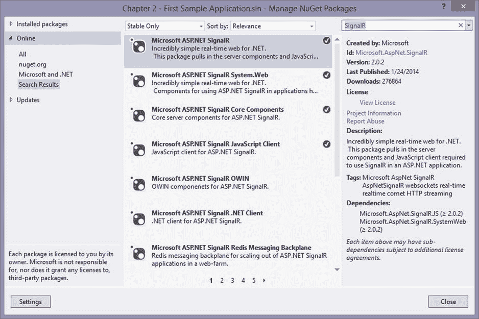

图 2-1。

Package Manager dialog box

尽管软件包管理器对话框对于简单的软件包管理非常有用，但有时需要对软件包进行更多的控制。在这些情况下，您可以使用软件包管理器控制台。

#### 软件包管理器控制台

软件包管理器控制台(参见图 [2-2](#Fig2) )允许您使用 PowerShell 脚本安装/更新/删除软件包。功能级别与“包管理器”对话框非常相似，但是您可以使用 PowerShell 命令进行更具体的设置。使用控制台获得更多功能的具体示例包括请求特定版本的包、请求预发布的包以及向包传递参数(例如项目名称)。

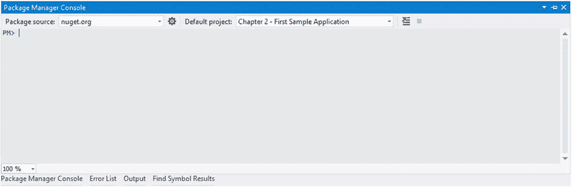

图 2-2。

Package Manager Console

#### 重要信号获取包

以下列表包括 SignalR 的一些主要软件包。列出了软件包描述，然后是使用 NuGet 软件包管理器控制台安装软件包的命令。

*   用于托管 IIS、ASP.NET 和 JavaScript 客户端的服务器和客户端包

`Install-Package Microsoft.AspNet.SignalR`

*   用于托管 SignalR 端点的服务器包

`Install-Package Microsoft.AspNet.SignalR.Core`

*   的客户端包。网络信号应用

`Install-Package Microsoft.AspNet.SignalR.Client`

*   JavaScript SignalR 应用程序的客户端包

`Install-Package Microsoft.AspNet.SignalR.JS`

### 第一个示例应用

现在您已经准备好创建示例应用程序，请启动 Visual Studio 2012。要创建新的 SignalR 应用程序，请执行以下步骤:

Choose File ➤ New ➤ Project, as shown in Figure [2-3](#Fig3).  

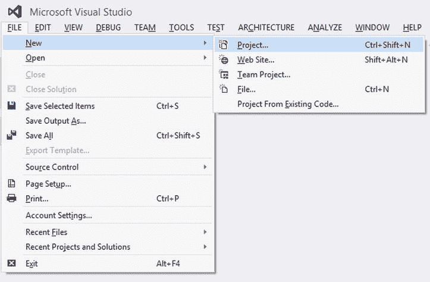

图 2-3。

Creating a new application projectUnder Installed ➤ Templates ➤ Visual C#, select ASP.NET Web Application in the New Project dialog box (see Figure [2-4](#Fig4)).  

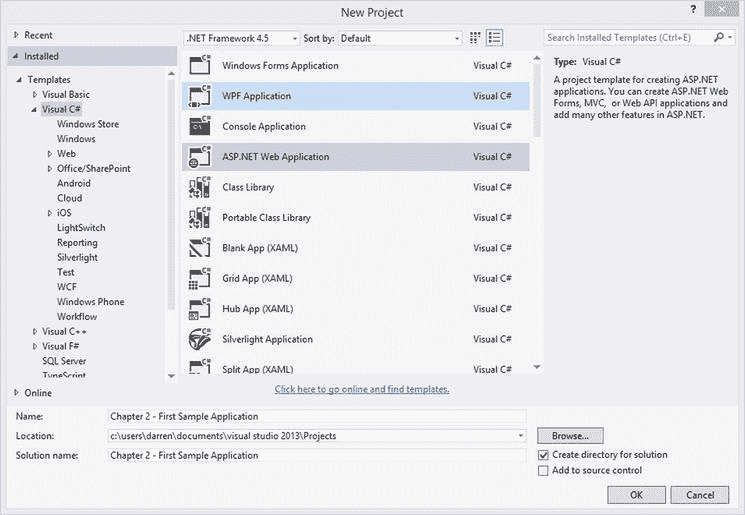

图 2-4。

New Project dialog boxName the application `Chapter 2 - First Sample Application`.   Select OK.   Select the MVC template shown in Figure [2-5](#Fig5).  

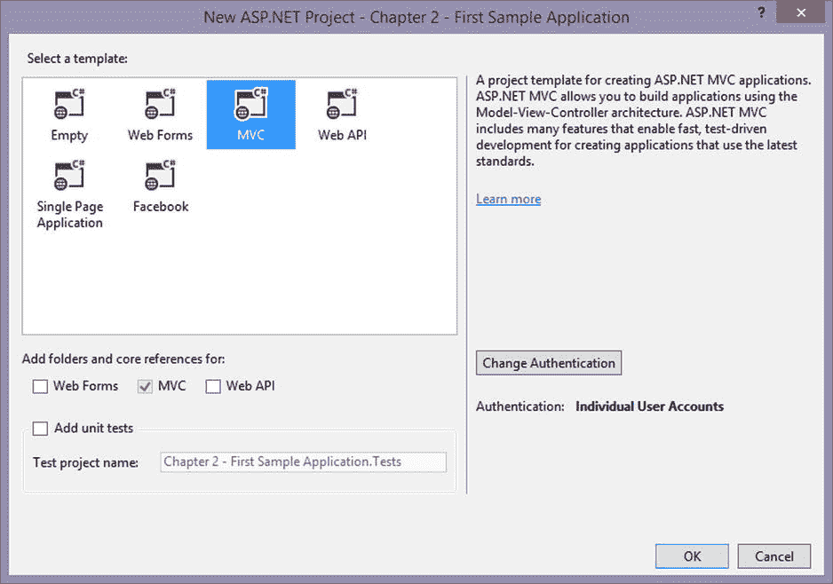

图 2-5。

Selecting a project templateStart the Package Manager Console, which is found under Tools ➤ Library Package Manager ➤ Package Manager Console.   Inside the Package Manager Console, run the following command to add the SignalR assemblies to the project (see Figure [2-6](#Fig6)):  

`Install-Package Microsoft.AspNet.SignalR`

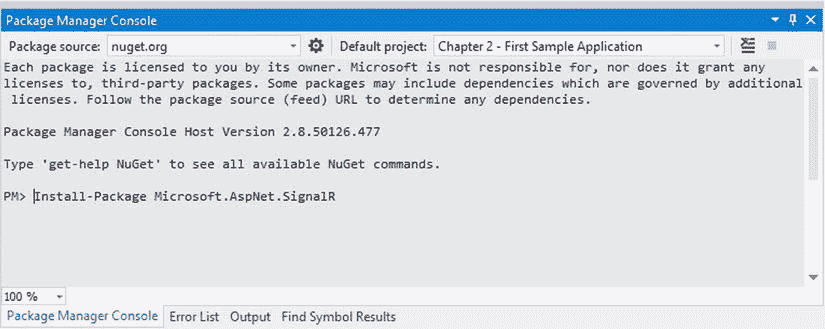

图 2-6。

Install of SignalR package

您可以看到 NuGet 分别在图 [2-7](#Fig7) 、 [2-8](#Fig8) 和 [2-9](#Fig9) 中解析依赖项、显示许可，并将程序集添加到项目中。

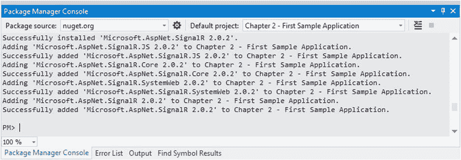

图 2-9。

SignalR project reference adds

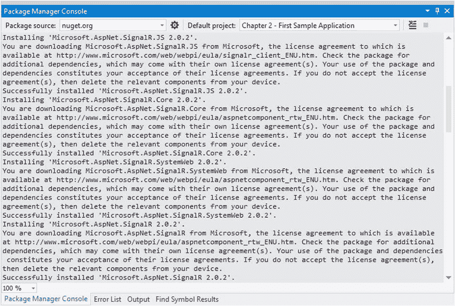

图 2-8。

SignalR license agreements

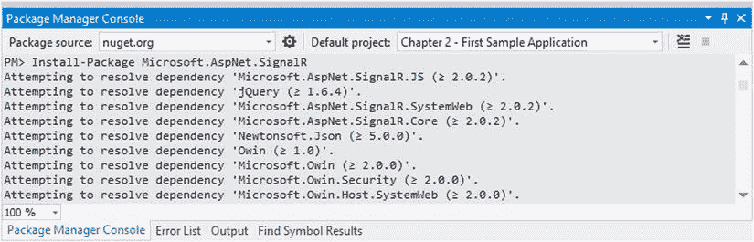

图 2-7。

SignalR package dependencies

安装完程序集后，您必须创建一个端点。

Right-click on the [Chapter 2](02.html) - First Sample Application project to add a folder, as shown in Figure [2-10](#Fig10).  

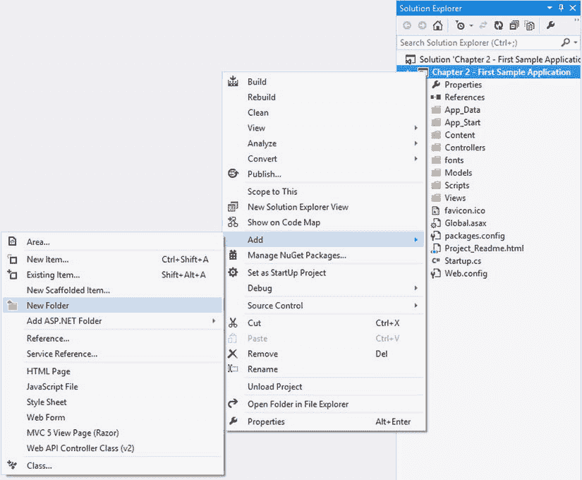

图 2-10。

Adding a new folderName the new folder `PersistentConnections`.   Right-click the `PersistentConnections` folder and add a class, as shown in Figure [2-11](#Fig11).  

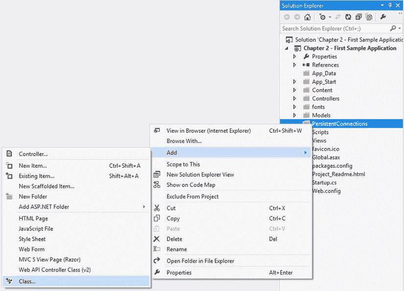

图 2-11。

Adding a className this class `SamplePersistentConnection`, as shown in Figure [2-12](#Fig12).  

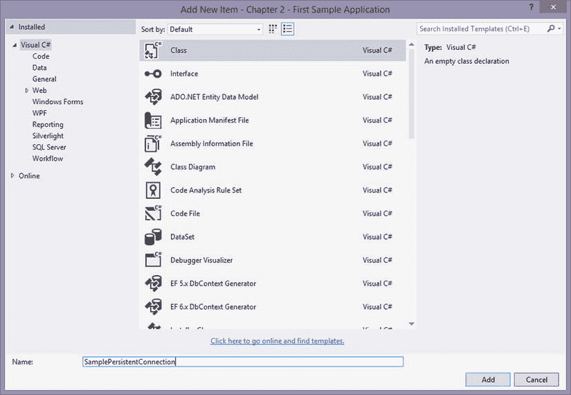

图 2-12。

SamplePersistentConnection class name dialog boxUpdate the `SamplePersistentConnection` class to what is shown in Listing 2-7\. Resolve any missing `using` statements.  

清单 2-7。SamplePersistentConnection 类

`public class SamplePersistentConnection : PersistentConnection`

`{`

`protected override Task OnReceived(IRequest request, string connectionId, string data)`

`{`

`return Connection.Broadcast(data);`

`}`

`}`

Update the `StartUp.cs` class to what is shown in Listing 2-8.  

清单 2-8。StartUp.cs 类

`public partial class Startup`

`{`

`public void Configuration(IAppBuilder app)`

`{`

`app.MapSignalR<SamplePersistentConnection>("SamplePC");`

`ConfigureAuth(app);`

`}`

`}`

Right-click on the [Chapter 2](02.html) - First Sample Application project and add an HTML page, as shown in Figure [2-13](#Fig13).  

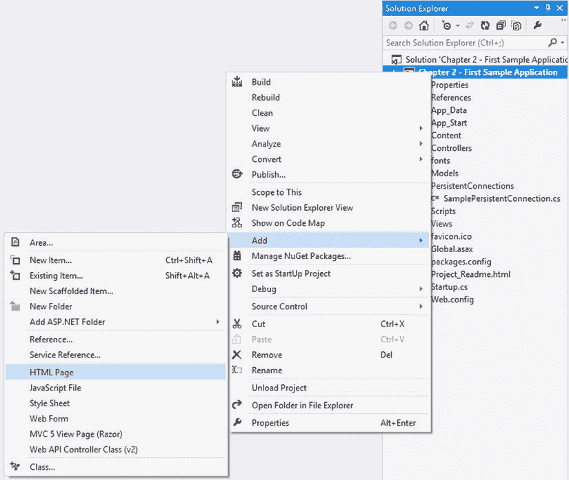

图 2-13。

Adding a static HTML fileName the HTML file Index (see Figure [2-14](#Fig14)).  

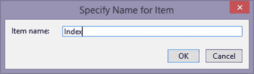

图 2-14。

Specifying a nameAdd the scripts in Listing 2-9 to the `head` section of `Index.html` with the correct versions in your project.  

清单 2-9。SignalR 客户端应用程序的 JavaScript

``

``

``

Add the `HTML` content in Listing 2-10 to the `body` section of `Index.html`.  

清单 2-10。SignalR 客户端应用程序的 HTML

`<label>Name: </label>`

`<input id="name" /> `

`<input id="message" />`

`<button id="send" >Send</button>     <ul id="messages"></ul>`

Press F5 to start the server.   Note

如果您在运行项目时缺少对`Microsoft.Owin`或`Microsoft.Owin.Security`的引用，那么您的 MVC 模板可能已经过时了。您可以通过在软件包管理器控制台中分别运行`Install-Package Microsoft.Owin`和`Install-Package Microsoft.Owin.Security`来纠正这些错误。

Go to http://localhost:####/Index.html, where `####` is the assigned port name.   Open up a second browser and enter the URL from step 19.   Type a message; it should appear on both browsers (see Figure [2-15](#Fig15)).  

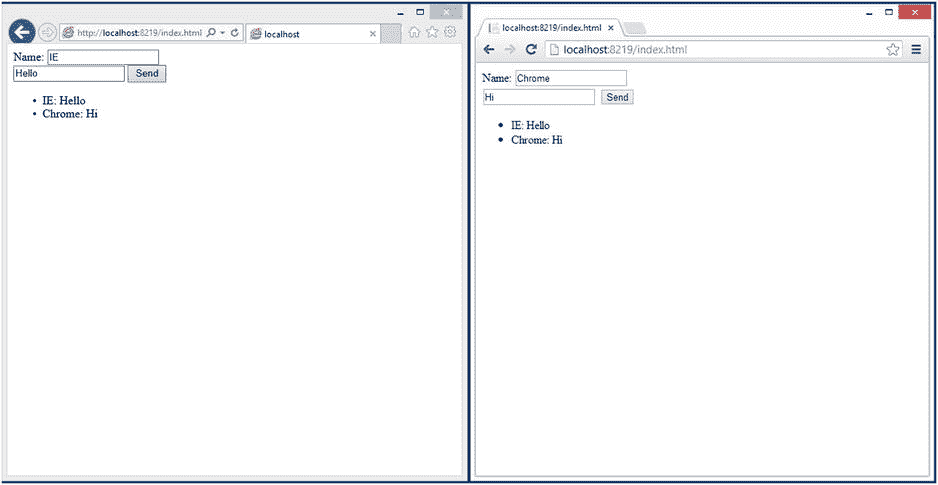

图 2-15。

Two sample client applications communicating

这就是拥有一个功能齐全的 SignalR 应用程序所要做的全部工作。下一节将向您展示何时应该使用 SignalR。

## 何时使用 SignalR

虽然我们可以在 web 服务器中构建页面，但是这些页面是静态的，用户必须手动刷新页面来查看是否有新内容。这种体验可以通过定期刷新或使用 Ajax 调用更新页面内容来响应用户操作。

但是，即使这种改进的体验仍然感觉脱节，特别是当操作或内容交付由于实现的性质而延迟时。SignalR 提供了增强的体验，允许在内容可用时从服务器推送内容，并在服务器上立即执行操作。这种功能是通过在服务器和客户机之间保持连接来提供的。

### 了解用户体验

要了解这种体验，先看看个人博客。博客内容通常由一个人创作，通常每天更新一次(如果用户经常写博客)。即使是可见的评论也不会频繁更新，因为它们只有在得到版主的批准后才可见。因此，用户通常不得不手动刷新网站来检查更新的内容。

更具互动性的体验包括电子商务网站。当使用这种类型的站点时，诸如向购物车添加商品之类的交互应该发生在当前页面上，而不需要刷新页面或回发。在用户会话期间，内容可能会发生变化，因此页面上通常会有一个计时器或到期时间，以确保显示最新的内容。

对于一个完全交互式的网站，每天都会用到的例子包括实时新闻报道、聊天室、游戏和股票行情系统。这些网站要求尽可能快地推送最新内容和执行操作。以游戏为例，你希望在对手的位置可用的情况下第一时间知道对手的位置，以便做出反应并迅速采取行动。

### 信号应用的一般类别

尽管 SignalR 应用程序使用了相同的技术，但它们提供了不同的体验。这些经历通常分为以下几类。

*   实时通知
*   对等协作
*   实时内容交付

实时通知类别包含从服务器接收事件发生通知的应用程序。通知从服务器实时推送到客户端。通知可以提供信息或者通知用户或客户端动作可用。

下面是一个实时通知的例子:您在一个电子邮件客户端上，收件箱计数增加以响应来自服务器的命令。来自服务器的命令不提供新收件箱项目的任何细节，只提供计数增加的信息。

对等协作类别适用于允许两个或更多客户端交互通信的应用程序。这些应用程序处理一组共享的数据，这些数据是实时交付和处理的。Google Docs 是两个或更多作者如何实时更新共享内容的一个很好的例子。

通过实时内容交付，应用程序可以实时获得内容。这些内容可以显示给用户，也可以由应用程序使用。在突发新闻提要站点中，当从服务器推送内容时，内容直接显示给用户。然而，在游戏中，内容递送可以是当前游戏状态，不向用户显示任何信息。

### 何时不使用信号

尽管 SignalR 很棒，但有些时候你不应该使用它。一般来说，如果内容很少更新或者客户端连接不可靠，就不应该使用 SignalR。

个人博客的前一个例子可以用来描述为什么 SignalR 不应该用于不经常更新的内容。在这种情况下，每次用户访问站点时都会建立一个持久连接。因为当访问者访问站点时，内容很可能不会更新，所以不会使用创建的持久连接传递任何内容。与许多个人博客一样，访问者可以进行的互动很少，而且互动的影响不需要实时显示。SignalR 提供的好处没有被使用，所以通过创建持久连接为每个访问者产生了开销。

当已知客户端连接不可靠时，在应用程序中使用 SignalR 也不是一个好主意。即使使用 SignalR 向客户端提供实时功能很好，但保持持久连接是有开销的，并且 SignalR 没有提供健壮的交付机制。如果不可靠的连接是手机，应用程序必须使用更多的电池电量来保持持续的连接。不可靠连接的另一个问题是，交付机制并不是健壮的。因此，如果连接在消息传递过程中失败，就必须在客户机和服务器上都添加逻辑来提供防失败机制。

## 信号的延展性

由于其背后的技术，SignalR 非常具有可扩展性。可扩展性之所以成为可能，是因为预先考虑到了要让它支持 OWIN、IoC 容器和消息底板。在以下段落中提供了这些技术的概要。

### OWIN 组件

在 OWIN 的支持下，SignalR 允许您在任何操作系统上托管您的应用程序，在这些操作系统中，程序集是可执行的，并且提供了 OWIN 中间件接口。这意味着您可以在运行 IIS 的当前版本的 Windows 服务器上或运行 Mono 的 Linux 机器上运行您的应用程序。它还使您的应用程序能够与其他 OWIN 中间件(如 Web API)一起运行。

### 国际奥委会集装箱

如前所述，使用 IoC 容器定制 SignalR 非常容易。使用 SignalR，您可以用默认实现注册类型，或者提供自己的 IoC 容器。有很多人成功使用 Unity、Structure Map、Ninject 等容器的例子。

### 使用消息背板向外扩展

在本章的前面部分，您已经了解到消息背板可用于向外扩展 SignalR。SignalR 程序集为 SQL Server、Windows Azure 服务总线和 Redis 提供消息底板支持。(我们将在第 9 章和第 10 章[中详细介绍消息背板。)](09.html)

#### 数据库

消息底板可以与 SQL Server 一起使用，并为该数据库服务器启用或禁用 Service Broker。消息保存在由 SignalR 管理的表中。启用 Service Broker 后，消息底板性能的 SQL Server 实现要好得多。Service Broker 是数据库的内部排队机制。这个 NuGet 包可以用包管理器控制台中的`Install-Package Microsoft.AspNet.SignalR.` SqlServer 命令安装。

#### Windows Azure 服务总线

Windows Azure 服务总线允许您创建由微软在 Windows Azure 中管理的消息底板。服务总线的这种实现使用主题来发送消息。使用这项云服务的成本并不十分昂贵；在撰写本文时，发送 1，000，000 条消息并有 744 个中继小时(大约一个月)的成本不到 2.00 美元。(这个 NuGet 包可以用包管理器控制台中的`Install-Package Microsoft.AspNet.SignalR.ServiceBus`命令安装。)Windows Azure 服务总线实现很容易设置，并提供良好的吞吐量，但它托管在 Azure 中，这可能会为内部应用程序增加大量开销和延迟。

#### 使用心得

Redis 是一个存储在内存中的开源高级键值存储。它支持 SignalR 用来发送消息的发布者/订阅者模型。(这个 NuGet 包可以用包管理器控制台中的`Install-Package Microsoft.AspNet.SignalR.Redis`命令安装。)这种实现可以扩展到具有很大的吞吐量，但是它是最复杂的消息底板。

## 信号的局限性

使用 SignalR 进行开发时，您可能会受到 SignalR 的限制。SignalR 的功能和可扩展性可能会降低，这取决于部署它的操作系统和主机。客户端也可能有限制。根据应用程序的类型，应用程序的规模也会受到影响。最后，在您的可控环境之外，还有一些限制会限制您的应用程序。

### 服务器平台限制

服务器平台必须支持。因为服务器代码大量使用了`Async`和`Await`关键字。当 IIS 在 Windows 7 或 Windows 8 等客户端操作系统上运行时，最多只能有十个并发连接，而服务器操作系统通常只受服务器资源数量的限制。

Web 套接字协议的使用受到一些因素的限制。第一个因素是，在 IIS 承载的应用程序中，仅在需要使用 Windows Server 2012 或更高版本的 IIS 8、IIS 8 express 或更高版本的 IIS 上支持 Web 套接字协议。

### 客户端平台限制

基于 web 浏览器的客户端可能会看到从 web 浏览器到服务器的连接数限制。这些是为保持网络浏览器稳定而设置的内部规则。

### 消息底板限制

在消息数量与用户数量成比例增长的场景中，或者当存在高频率的实时协作时，消息底板可能是一个限制因素。随着通过消息底板的消息数量的增加，可能会出现瓶颈。

### 外部限制

Web 套接字受到以下事实的限制:从服务器到客户端的每一跳都必须支持 Web 套接字；否则，部分连接可能会降级，或者根本不支持该协议。

## 摘要

本章概述了 SignalR。我们从讨论它的核心技术开始:OWIN、连接传输、依赖解析器、任务并行库和消息底板。您已经看到，从 Windows 到 iOS，各种服务器和客户端都支持 SignalR。我们向您展示了 SignalR 开发的入门知识。您了解了如何通过核心技术定制、扩展和扩展 SignalR。最后，您看到了即使是优秀的框架也会有局限性，这取决于应用程序的类型。