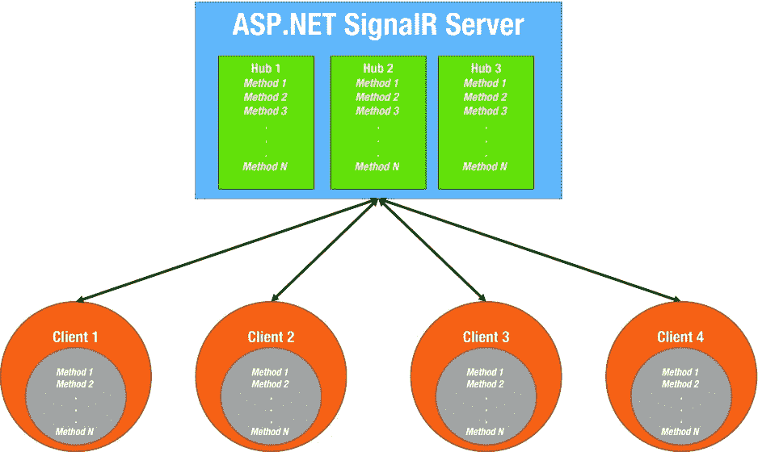
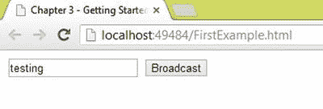
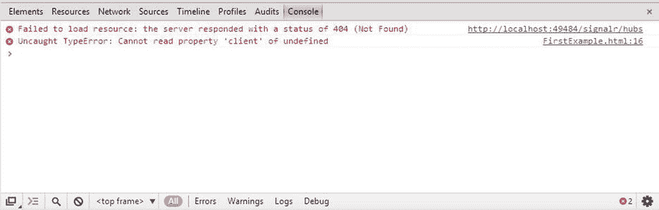
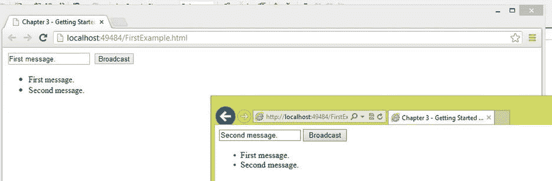
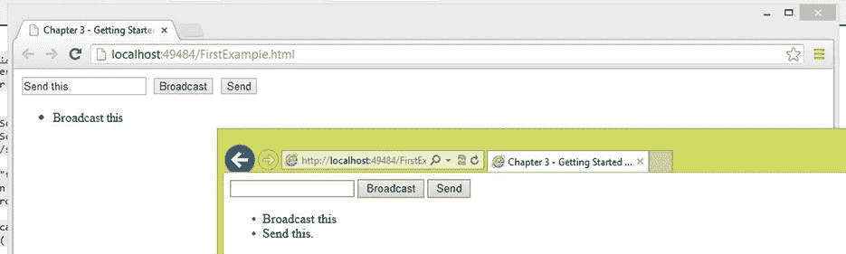
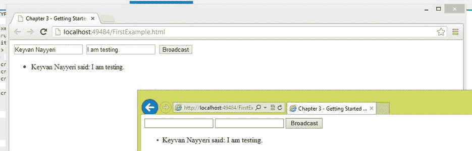
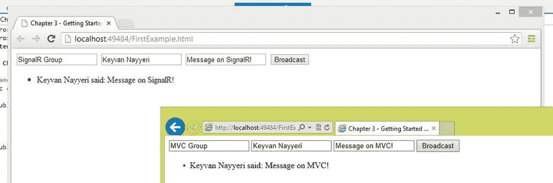
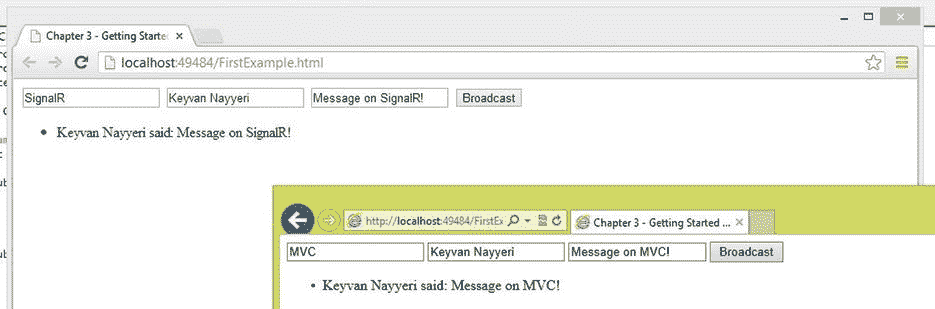
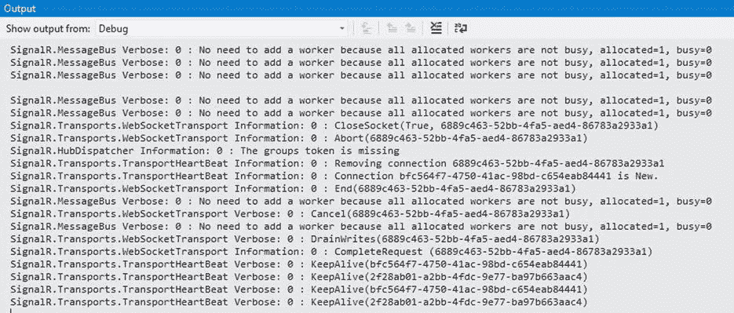

# 3.使用集线器开发 SignalR 应用程序

第一章提供了一些关于实时 web 开发和 ASP.NET 信号的背景信息，这对于理解本书的内容是必要的。在第 2 章中，我们浏览了一些关于 ASP.NET 信号公司的基本信息，让你开始使用这项技术。在本章和第 4 章[中，你将接触到一些关于 ASP.NET SignalR 的技术细节，这些细节实际上可以帮助你开发真实世界的 SignalR 应用程序。这一章是关于集线器的，第 4 章](04.html)是关于持久连接的[。](04.html)

本章将详细讨论集线器，但作为快速入门，集线器是持久连接之上的一个抽象，它使访问一组 API 变得容易。NET Framework、jQuery 或其他允许 web 开发人员构建实时 web 应用程序的客户端类型。

本质上，hub 是一种高级抽象，它是为那些希望更快更容易地构建实时 web 应用程序，并且不需要担心可扩展性和应用程序的其他专业方面的人提供的。集线器非常依赖持久连接(见第 4 章[)，持久连接的相同原则也适用于集线器。集线器在持久连接之前讨论，因为它们更容易学习，可以帮助您更好地理解持久连接。由于 ASP.NET 信号中组件良好的抽象性和独立性，集线器可以完全独立于持久连接进行学习；您不需要知道持久连接来构建真实世界的 ASP.NET 信号应用程序。理解集线器就足够了，而持久连接可以用于更高级的情况。](04.html)

本章讨论以下主题:

*   集线器的概念及其一般工作方式
*   如何配置路由以使用集线器
*   如何实现集线器
*   集线器的客户端实现
*   组的概念以及如何使用它们
*   集线器的 JavaScript 代理是如何生成和工作的
*   连接生存期以及如何控制它
*   具有集线器的服务器和客户端之间的状态管理
*   hubs 生态系统的基础以及`HubDispatcher`和`HubPipelineModule`如何工作。

## 集线器概述

从头开始构建实时 web 开发平台可能是一项令人生畏的任务，尤其是如果您计划构建一个完整的框架。ASP.NET SignalR 旨在为 web 开发人员提供一套完整的 API 来简化这项任务。ASP.NET SignalR 在一个非常干净和分层的结构中提供这些 API，所以你有一套易于使用的高级 API 以及一套较低级别的可扩展 API。这些高级 API 以 hubs 的名字出现，并在称为持久连接的低级 API 之上提供一个抽象(见第 4 章)。

hub 提供了两组库，为程序员提供了易于使用的 API:

*   服务器端库:这些 ASP.NET 库提供了一种机制来实现客户端可以调用的服务器端方法，以及从服务器端调用客户端上定义的一些方法的机制。
*   客户端库:这些库(用 JavaScript 编写。NET、Objective-C、Java 和其他平台)提供了一种机制来实现可以被服务器调用的客户端方法以及调用服务器端方法的机制。

Note

正如在第 1 章中所讨论的，一个 ASP.NET SignalR 应用程序通常只有一个服务器组件(尽管这个软件组件可以分布在几个物理服务器上)，并且可以有不同的客户端连接到这个服务器组件。服务器端组件是在。NET Framework(或 Mono)，但是客户端可以用各种语言和技术来实现。最常见的客户端实现是使用 JavaScript，但是也有。NET 桌面客户端以及 iOS、Android 和 Windows Phone 实现。

服务器和客户机上的 hubs 生态系统的基础是远程过程调用(RPC ),它在计算机科学中有广泛的含义。一般来说，RPC 是一种机制，它使系统/计算机/组件上的方法能够被外部或独立的系统/计算机/组件调用。在 ASP.NET SignalR 的例子中，因为架构是客户端-服务器架构，并且这两端是独立的，所以 RPC 是由这两个组件中的一个到另一个组成的。

图 [3-1](#Fig1) 以直观的方式描述了之前对轮毂的描述。一个单一服务器软件组件可以为多个客户端提供服务，并从这些客户端接收 RPC，或者向单个客户端发出这样的调用来触发特定的操作。

图 3-1。

General hub structure

它一般是如何工作的？这个问题很关键:从客户机向服务器发出调用是一项相当常见的任务，但是从服务器向特定客户机(或所有客户机)发出调用却不是。

ASP.NET SignalR 采用了持久 HTTP 连接的概念，这与传统的可以断开的 HTTP 连接不同。持续的 HTTP 连接会长时间保持打开状态，这使得 ASP.NET SignalR 服务器组件能够使用此持续连接将它想要的任何内容推送到客户端。

ASP.NET SignalR 的 hubs 生态系统应用 hubs 代理的概念来简化在客户端使用服务器端方法的过程，以及从服务器使用客户端方法的过程。集线器代理(本章稍后讨论)是一组 JavaScript 库，由 ASP.NET SignalR 服务器根据服务器上实现的代码自动生成，以简化前面提到的过程。

为了更详细地讨论这一点，我们必须知道，每当服务器代码调用客户端方法时，持久连接就用于向客户端传递一组数据，包括要调用的客户端方法的名称以及参数。作为参数传递的对象被序列化为 JavaScript Object Notation (JSON ),如果方法名在客户端匹配，则参数(元数据)被反序列化并用于执行该特定方法。

## 集线器入门

让我们从一些代码开始。关于在 ASP.NET SignalR 中实现集线器的第一点是要知道集线器只不过是一个 C#类，它从`Microsoft.Aspnet.Signalr.Hub`基类派生并实现一组方法。这些方法可以采用原语。NET 类型或您的自定义类型作为它们的参数，并返回它们。

清单 3-1 中的代码显示了一个名为`Chapter3Hub`的 hub 的基本实现，它是从`Hub`基类派生而来的。

清单 3-1。基本集线器实现

`using Microsoft.AspNet.SignalR;`

`namespace Chapter3.Code`

`{`

`public class Chapter3Hub : Hub`

`{`

`}`

`}`

让我们更进一步，将这个基本实现转换成一个更现实的实现。我们可以向这个 hub 添加一个方法，该方法接收消息，并通过调用客户机上的方法将消息广播给所有客户机。清单 3-2 显示了这段代码。

清单 3-2。更现实的服务器端集线器实现

`using Microsoft.AspNet.SignalR;`

`namespace Chapter3.Code`

`{`

`public class Chapter3Hub : Hub`

`{`

`public void BroadcastMessage(string text)`

`{`

`Clients.All.displayText(text);`

`}`

`}`

`}`

不要担心细节，因为我们将在本章后面讨论它们，但是现在你需要知道我们已经在 hub 中定义了一个名为`BroadcastMessage`的公共方法，它获取一个字符串参数。然后，它使用 ASP.NET SignalR 提供的`Clients`对象，该对象引用连接到服务器的客户端。使用引用所有客户机的`All`属性(与特定的一个或一组客户机相反)，它通过传递`text`参数调用一个名为`displayText`的客户端方法。我们稍后将实现这个客户端方法。

清单 3-3 显示了这个简单广播系统的客户端实现。这段代码嵌入在一个简单的 HTML 页面中，甚至不需要位于任何 ASP.NET WebForm或 ASP.NET 模型-视图-控制器(MVC)视图中。

清单 3-3。客户端实现

`<!DOCTYPE html>`

`<html xmlns="`[`http://www.w3.org/1999/xhtml`](http://www.w3.org/1999/xhtml)T2】

`<head runat="server">`

`<title>Chapter 3 - Getting Started with Hub Implementation</title>`

`</head>`

`<body>`

``

``

``

``

`
`

`<input type="text" id="msg" />`

`<input type="button" id="broadcast" value="Broadcast" />`

`<ul id="messages">`

`</ul>`

`
`

`</body>`

`</html>`

这段代码没有什么重要的特性。首先，有三个对 SignalR jQuery 库和由 SignalR 生成的动态集线器代理的 JavaScript 引用。前两个是任何 web 应用程序中通常会做的简单引用。jQuery 的版本取决于正在使用的 ASP.NET SignalR 的版本，即使有一些代理库为 ASP.NET SignalR 创建了对 jQuery 旧版本的向后兼容性。您可以通过在互联网上搜索来找到这些代理实现，或者您也可以轻松地实现自己的代理。

第三个对`/signalr/hubs`的 JavaScript 引用是对 ASP.NET 应用程序加载时动态生成的库的引用。正如后面所讨论的，ASP.NET SignalR 会查看您的 hubs 实现，并生成一个 JavaScript 库，默认情况下可以通过这个 URL 访问。我们将在后面讨论如何定制这个库的位置以及如何生成它。

jQuery 中还有几行 JavaScript 实现将用户界面的各个部分连接到前面提到的 JavaScript 库。首先，我们通过调用`$.connection.chapter3Hub`创建一个到特定 hub 类的连接。我们使用这个连接来访问客户端部分，并定义我们的客户端方法`displayText`(已经用于在客户端上调用)。此方法将文本消息添加到消息列表中。之后，我们使用连接的`hub`对象来启动一个连接，并使用它的回调来处理按钮的任何点击事件。在这个事件中，我们使用连接的`server`对象通过传递输入的消息来调用名为`broadcastMessage`的服务器端方法。

Note

ASP.NET 信号公司的一个常见事实恰好也是新来者的一个问题来源。ASP.NET SignalR 将服务器端的方法名的 Pascal 命名(例如，MethodName)转换为 camel case(例如，methodName)。如果您忘记在客户端代码中应用这样的更改，您的应用程序将无法正常运行。

此时，我们已经拥有了运行和测试这个应用程序所需的所有元素，但是如果我们这样做了，我们将不会得到预期的结果。图 [3-2](#Fig2) 显示了应用程序窗口。按下广播按钮没有明显效果。

图 3-2。

The code does not function correctly, and the message is not broadcast

通过使用 Google Chrome 开发工具(或任何其他客户端调试器，如 Firebug)调试该应用程序的客户端执行，您会发现有一个 JavaScript 错误:应用程序在动态中心代理位置找不到任何资源(见图 [3-3](#Fig3) )。

图 3-3。

The hub proxy library cannot be found

造成这个问题的原因是，我们在任何 ASP.NET SignalR 应用程序开发中缺少一个关键步骤:我们需要在应用程序启动时映射集线器。为此，我们需要在应用程序中创建一个名为`Startup`的类。这个类必须以`AssemblyName.Startup`的形式可用，其中程序集名称是我们分配给执行 ASP.NET 信号应用程序的项目的程序集的名称。在这个类中，我们必须实现一个叫做`Configuration`的方法。清单 3-4 展示了这样一个实现。您通常需要使用相同的代码，并更改命名空间以反映您的程序集名称。

清单 3-4。启动时映射集线器

`using Owin;`

`// This needs to be AssemblyName.Startup or it will fail to load`

`namespace Chapter3`

`{`

`public class Startup`

`{`

`// The name *MUST* be Configuration`

`public void Configuration(IAppBuilder app)`

`{`

`app.MapHubs();`

`}`

`}`

`}`

Note

在本章中，我们使用 OWIN 托管我们的 SignalR 应用程序。我们将在第 8 章中详细讨论这一点以及替代方案。作为初学者的快速背景，OWIN 代表开放网络接口。NET，是为. NET 服务器和 web 应用程序之间的通信定义的一组标准。该标准可以有不同的实现，以在不同类型的服务器(如 Internet 信息服务(IIS)等)上托管 web 应用程序。现在，让我们忽略细节，把剩下的讨论推迟到第八章的[。](08.html)

现在我们准备运行我们的应用程序，并得到如图 [3-4](#Fig4) 所示的结果。

图 3-4。

Simple broadcasting application

这是使用 ASP.NET 信号中心的主要步骤和要点的快速入门。在本章的其余部分，我们将讨论每个步骤的更多细节以及一些相关的注意事项，这些在使用 hub 开发 ASP.NET SignalR 应用程序时会很有用。

## 路线配置

任何使用集线器的 ASP.NET SignalR 应用程序运行的一个重要步骤是在路由中映射集线器，这是在`Startup`类和`Configuration`方法中完成的(参见清单 3-4)。任何 ASP.NET SignalR 应用程序启动时都会调用这个特定的类名来映射集线器的路由。

你可以随意修改这个网址，我们马上会告诉你怎么做。默认情况下，ASP.NET SignalR 被配置为在同一个域中处理请求，这意味着它假定您正在从托管服务器端组件的同一个客户端域中调用 ASP.NET SignalR 服务器组件。然而，在现实世界中可能不是这样，所以我们需要启用跨域调用，这是我们在这里讨论的与路由配置相关的另一个主题。

### 定制中心代理位置

如前一节所述，hubs 代理被配置为在`/signalr`可用(这与`/signalr/hubs`不同，T1 是访问 hubs 的地方)。在某些特殊情况下，您可能需要将这个默认 URL 更改为其他名称。例如，您的项目中可能有一个名为`signalr`的文件夹，它与这个名称有冲突。这部分在服务器端和客户端都很容易配置。

在服务器端，你需要做的就是修改`Startup`类中的`Configuration`方法，使用`MapHubs`方法的重载来指定这个新的 URL(见清单 3-5)。

清单 3-5。启动时为中心代理指定备用位置

`using Owin;`

`// This needs to be AssemblyName.Startup or it will fail to load`

`namespace Chapter3`

`{`

`public class Startup`

`{`

`// The name *MUST* be Configuration`

`public void Configuration(IAppBuilder app)`

`{`

`app.MapHubs("/chapter3signalr", new Microsoft.AspNet.SignalR.HubConfiguration());`

`}`

`}`

`}`

这个特定的重载需要新位置的字符串值以及一个`Microsoft.AspNet.SignalR.HubConfiguration`对象的实例。

在客户端，我们可以更改动态中心代理的 JavaScript 引用的位置，以使用这个新的 URL(参见清单 3-6)。

清单 3-6。更改 Hubs 代理的 JavaScript 引用位置

`<!DOCTYPE html>`

`<html xmlns="`[`http://www.w3.org/1999/xhtml`](http://www.w3.org/1999/xhtml)T2】

`<head runat="server">`

`<title>Chapter 3 - Getting Started with Hub Implementation</title>`

`</head>`

`<body>`

``

``

``

``

`
`

`<input type="text" id="msg" />`

`<input type="button" id="broadcast" value="Broadcast" />`

`<ul id="messages">`

`</ul>`

`
`

`</body>`

`</html>`

### 跨域连接

默认情况下，ASP.NET SignalR 假设您的客户端连接到与执行位置相同的域中的服务器组件。例如，如果你有一个像 [`apress.com`](http://apress.com) 这样的网站，你的应用程序运行在与 ASP.NET SignalR 域相同的域上。实际上，对于更大规模的应用来说，情况可能并非如此。您可能希望将您的 ASP.NET SignalR 服务器独立于您的主应用程序托管在一个单独的域中，并且可能在不同的服务器上。

在这种情况下，您可以在 [`apress.com`](http://apress.com) 上运行您的应用程序，但是在 [`signalr.apress.com`](http://signalr.apress.com) 上运行 ASP.NET 信号服务器。您必须在 ASP.NET 信号中启用默认情况下禁用的跨域连接。要在您的应用程序中启用这些跨域连接，请再次转到`Startup`类及其`Configuration`方法来修改路由的构造和启动，以处理跨域连接。

在构建自己的`HubConfiguration`对象后，可以将其`EnableCrossDomain`属性设置为`true`，然后将这个自定义的`HubConfiguration`对象传递给`MapHubs`方法。清单 3-7 显示了这一点，并应用了默认的中心代理位置(即`/signalr`)。

清单 3-7。在服务器上启用跨域连接

`using Microsoft.AspNet.SignalR;`

`using Owin;`

`// This needs to be AssemblyName.Startup or it will fail to load`

`namespace Chapter3`

`{`

`public class Startup`

`{`

`// The name *MUST* be Configuration`

`public void Configuration(IAppBuilder app)`

`{`

`HubConfiguration configuration = new HubConfiguration();`

`configuration.EnableCrossDomain = true;`

`app.MapHubs(configuration);`

`}`

`}`

`}`

Note

不同版本的浏览器处理跨域连接的方式不同，因此建议您在实现真正的 ASP.NET SignalR 应用程序之前研究这些差异。举个常见的例子，IE10 将本地主机上的任何东西都视为同一个域，而不将其视为跨域连接。请记住，您不能将`jQuery.support.cors`设置为`true`,因为它会让 ASP.NET SignalR 认为浏览器支持 CORS 并禁用 JSONP。

在客户端，您可以从外部域引用您的 JavaScript 库，如清单 3-8 所示。

清单 3-8。客户端上的跨域连接

`<!DOCTYPE html>`

`<html xmlns="`[`http://www.w3.org/1999/xhtml`](http://www.w3.org/1999/xhtml)T2】

`<head runat="server">`

`<title>Chapter 3 - Getting Started with Hub Implementation</title>`

`</head>`

`<body>`

``

``

``

`
`

`<input type="text" id="msg" />`

`<input type="button" id="broadcast" value="Broadcast" />`

`<ul id="messages">`

`</ul>`

`
`

`</body>`

`</html>`

现在，让我们更深入地了解一下 ASP.NET SignalR hub 的服务器端元素。有几个主要元素:

*   服务器上多个集线器的声明
*   使用自定义中心名称和方法
*   如何使用复杂类型作为参数并返回方法的类型
*   如何接触和处理特定的客户
*   中枢方法的异步执行

## 多中心声明

在实践中，您需要创建一个模块化的 ASP.NET 信号程序，该程序需要处理较小的业务领域单元。例如，您可能有一个管理用户在线状态的系统，以显示他们何时在线或何时离开，以及一个在线聊天系统。这个需求可能会要求将您的中心逻辑分成不同的中心，为您的应用程序的不同区域服务。

这在 ASP.NET SignalR 中当然是可能的，而且就像实现不同的 hub 类一样简单。例如，假设您希望向现有的 broadcaster 应用程序添加功能，以便不仅广播消息，而且将消息发送给除发送消息的客户端之外的所有客户端。对于这个例子，还假设这个功能更适合单独的集线器。清单 3-9 显示了我们在这里定义的新 hub 的源代码。

清单 3-9。在服务器上声明第二个集线器

`using Microsoft.AspNet.SignalR;`

`namespace Chapter3.Code`

`{`

`public class Chapter3SecondHub : Hub`

`{`

`public void SendMessage(string text)`

`{`

`Clients.Others.displayText(text);`

`}`

`}`

`}`

这与第一个集线器非常相似。它只有不同的类名和不同的内部逻辑，使用`Others`属性而不是`All`来引用除调用者之外的所有客户端。

在服务器端声明多个 hub 不需要对 hub 代理生成进行任何特殊操作，因为它们被添加到同一个 hub 代理中，开箱即可正常工作。声明多个中枢也不会降低性能，所以可以随意使用它们在程序中创建良好的抽象级别，并使其更易于维护。

代码的客户端也非常简单，如清单 3-10 所示。JavaScript 实现可以被重构得更简单，但是出于教学目的，我们暂时保持原样。

清单 3-10。在客户端使用多个集线器

`<!DOCTYPE html>`

`<html xmlns="`[`http://www.w3.org/1999/xhtml`](http://www.w3.org/1999/xhtml)T2】

`<head runat="server">`

`<title>Chapter 3 - Getting Started with Hub Implementation</title>`

`</head>`

`<body>`

``

``

``

``

`
`

`<input type="text" id="msg" />`

`<input type="button" id="broadcast" value="Broadcast" />`

`<input type="button" id="send" value="Send" />`

`<ul id="messages">`

`</ul>`

`
`

`</body>`

`</html>`

在这里，我们向用户界面添加了一个新按钮，该按钮将消息发送给除呼叫者之外的所有客户端。在 JavaScript 代码中，我们创建了一个到`chapter3SecondHub`的连接，并添加了我们的客户端方法实现，类似于第一个 hub。

Note

多个中枢不会影响您在`Startup`类中映射中枢的方式，所以您可以让它们保持原样。

图 [3-5](#Fig5) 显示了新中枢运行时该应用程序的输出。

图 3-5。

Testing multiple hubs in action

## 自定义集线器名称

ASP.NET SignalR 获取集线器中声明的类名，并对它们应用 camel 大小写来生成集线器代理。有时您可能需要定制这种行为来使用您自己的定制名称，这可以通过将一个`HubName`属性应用到您的 hub 类来实现(参见清单 3-11 和 3-12)。

清单 3-11。将自定义中心名称应用于第一个中心类

`using Microsoft.AspNet.SignalR;`

`using Microsoft.AspNet.SignalR.Hubs;`

`namespace Chapter3.Code`

`{`

`[HubName("FirstHub")]`

`public class Chapter3Hub : Hub`

`{`

`public void BroadcastMessage(string text)`

`{`

`Clients.All.displayText(text);`

`}`

`}`

`}`

清单 3-12。将自定义中心名称应用于第二个中心类

`using Microsoft.AspNet.SignalR;`

`using Microsoft.AspNet.SignalR.Hubs;`

`namespace Chapter3.Code`

`{`

`[HubName("SecondHub")]`

`public class Chapter3SecondHub : Hub`

`{`

`public void SendMessage(string text)`

`{`

`Clients.Others.displayText(text);`

`}`

`}`

`}`

客户端代码非常简单，只需要应用新的 hub 名称(见清单 3-13)。

清单 3-13。在客户端使用自定义集线器名称

`<!DOCTYPE html>`

`<html xmlns="`[`http://www.w3.org/1999/xhtml`](http://www.w3.org/1999/xhtml)T2】

`<head runat="server">`

`<title>Chapter 3 - Getting Started with Hub Implementation</title>`

`</head>`

`<body>`

``

``

``

``

`
`

`<input type="text" id="msg" />`

`<input type="button" id="broadcast" value="Broadcast" />`

`<input type="button" id="send" value="Send" />`

`<ul id="messages">`

`</ul>`

`
`

`</body>`

`</html>`

Note

使用定制的 hub 名称，hub 代理中没有 camel 大小写约定；在 Pascal 命名约定中，我们必须在客户端使用原始的自定义 hub 名称。我们采用这种方法来阐明它，但是建议使用 camel 大小写约定来定制 hub 名称，以与 JavaScript 编码风格保持一致。

## 自定义类型

到目前为止，我们只在。NET Framework 作为我们的方法的参数并使用它们。但是，您的业务领域中可能有更复杂的实体，需要您声明使用一组这些基本类型的自定义复杂类型。例如，您可能需要传递用户信息，包括用户名、电子邮件地址、用户 ID 和进出 hub 的最后登录时间。在这种情况下，创建一个复合类型来处理它要容易得多。

好消息是，ASP.NET SignalR 提供了一种简单的方法来使用您自己的自定义类型，只需定义它们并在您的 hub 声明中使用它们。ASP.NET SignalR 使用其 JSON 序列化程序自动序列化和反序列化这些开箱即用的对象。您只需要确保您的自定义类型是可序列化的。

让我们修改我们原来的广播应用程序来利用这一点。我们希望改变功能，使其显示发送者的姓名以及发送的消息。为此，我们声明了一个名为`Person`(如清单 3-14 所示)的自定义类型，它有两个字符串属性。

清单 3-14。自定义人员类型

`namespace Chapter3.Code`

`{`

`public class Person`

`{`

`public string Name { get; set; }`

`public string Message { get; set; }`

`}`

`}`

现在我们可以修改 hub 类来获得这个对象的一个实例，然后使用这两个属性来调用一个新版本的客户端方法(见清单 3-15)。

清单 3-15。对服务器上的集线器使用自定义类型

`using Microsoft.AspNet.SignalR;`

`using Microsoft.AspNet.SignalR.Hubs;`

`namespace Chapter3.Code`

`{`

`[HubName("firstHub")]`

`public class Chapter3Hub : Hub`

`{`

`public void``BroadcastMessage`T2】

`{`

`Clients.All.displayText(person.Name, person.Message);`

`}`

`}`

`}`

我们获取一个`Person`对象的实例作为参数，然后通过传递`Name`和`Message`属性作为参数来调用客户端的`displayText`方法。

在客户端，我们必须做一些修改来传递这个自定义的`Person`类型的一个实例和需要的额外数据，然后自定义客户端的`displayText`方法来接受一个额外的参数并显示它(见清单 3-16)。

清单 3-16。在客户端使用自定义类型

`<!DOCTYPE html>`

`<html xmlns="`[`http://www.w3.org/1999/xhtml`](http://www.w3.org/1999/xhtml)T2】

`<head runat="server">`

`<title>Chapter 3 - Getting Started with Hub Implementation</title>`

`</head>`

`<body>`

``

``

``

``

`
`

`<input type="text" id="name" />`

`<input type="text" id="message" />`

`<input type="button" id="broadcast" value="Broadcast" />`

`<ul id="messages">`

`</ul>`

`
`

`</body>`

`</html>`

这里我们定制了`displayText`方法来从服务器接收两个参数并适当地显示它们。我们还修改了 Broadcast 按钮的 click 句柄，通过将其属性传递给服务器来构造自定义的`Person`类型。很简单，对吧？

现在我们测试这个应用程序，并得到如图 [3-6](#Fig6) 所示的预期结果。

图 3-6。

Testing custom types in an application

## 组

在几种不同的情况下，您可能需要在应用程序中处理一组特定的客户端。一个很好的例子是一个聊天室，在这里特定的客户希望联系并讨论与特定主题相关的事情。在这种情况下，您只需要从服务器向这些客户端传递消息。

ASP.NET SignalR 提供了组的概念，并为此提供了一套易于使用的 API。这些工具是在`Groups`类中提供的，你所需要做的就是根据你的需要将客户加入或离开特定的组。

让我们修改 broadcaster 示例，以包含一个新选项，将用户分组并只在特定的组内广播消息。首先，我们修改`Person`类，使其也有一个`Group`属性(见清单 3-17)。

清单 3-17。修改 Person 类以包含组属性

`namespace Chapter3.Code`

`{`

`public class Person`

`{`

`public string Name { get; set; }`

`public string Message { get; set; }`

`public string Group { get; set; }`

`}`

`}`

服务器端的 hub 被修改成允许客户机加入和离开组，并向用户所属的组发送消息(见清单 3-18)。

清单 3-18。在服务器上声明组

`using Microsoft.AspNet.SignalR;`

`using Microsoft.AspNet.SignalR.Hubs;`

`using System.Threading.Tasks;`

`namespace Chapter3.Code`

`{`

`[HubName("firstHub")]`

`public class Chapter3Hub : Hub`

`{`

`public void BroadcastMessage(Person person)`

`{`

`Clients.Group(person.Group).displayText(person.Name, person.Message);`

`}`

`public Task Join(string groupName)`

`{`

`return Groups.Add(Context.ConnectionId, groupName);`

`}`

`public Task Leave(string groupName)`

`{`

`return Groups.Remove(Context.ConnectionId, groupName);`

`}`

`}`

`}`

这里我们使用`Clients`的`Group`属性将消息只广播给特定的组名，而不是每个人。在`Join`和`Leave`方法中，我们使用`Groups`类将当前客户端(由`Context.ConnectionId`标识)添加到传入的特定组名中，或者从其中移除。

在客户端，我们需要引入一个新的文本框来输入组名，然后调整一切以利用组。我们还必须确保客户端在广播前加入特定的组，然后离开该组(见清单 3-19)。

清单 3-19。在客户端使用组

`<!DOCTYPE html>`

`<html xmlns="`[`http://www.w3.org/1999/xhtml`](http://www.w3.org/1999/xhtml)T2】

`<head runat="server">`

`<title>Chapter 3 - Getting Started with Hub Implementation</title>`

`</head>`

`<body>`

``

``

``

``

`
`

`<input type="text" id="groupName" />`

`<input type="text" id="name" />`

`<input type="text" id="message" />`

`<input type="button" id="broadcast" value="Broadcast" />`

`<ul id="messages">`

`</ul>`

`
`

`</body>`

`</html>`

这些变化很简单。唯一需要注意的一点是`broadcaster.server.join`和`broadcaster.server.leave`方法的使用，它们类似于您之前看到的服务器上的其他 hub 方法调用。他们让客户加入和离开一个团体。

运行这段代码后，我们得到如图 [3-7](#Fig7) 所示的结果。

图 3-7。

Groups in action

## 访问特定客户端

到目前为止，我们主要依赖于广播场景，其中服务器在所有客户机上调用一个方法。然而，这并不总是正确的。有时我们需要将一组特定的客户作为目标，有时我们需要排除一些客户，还有许多其他场景取决于我们的业务需求。ASP.NET SignalR 提供了一套很好的 API 来支持这样的场景。

我们已经多次使用的第一种情况是向所有客户端广播消息。为此我们使用了`Clients.All`(见清单 3-20)。

清单 3-20。利用客户。全部向所有客户端广播

`public void BroadcastMessage(Person person)`

`{`

`Clients.All.displayText(person.Name, person.Message);`

`}`

有时，我们希望向除了正在调用服务器的当前客户端之外的所有客户端发送消息。在这种情况下，我们可以应用`Clients.Others`(见清单 3-21)。

清单 3-21。利用客户。其他的向其他客户端广播

`public void BroadcastMessage(Person person)`

`{`

`Clients.Others.displayText(person.Name, person.Message);`

`}`

另一种情况是当我们想只向调用服务器的特定客户机发送消息时。为此我们使用了`Clients.Caller`(见清单 3-22)。

清单 3-22。利用客户。向呼叫者客户端广播的呼叫者

`public void BroadcastMessage(Person person)`

`{`

`Clients.Caller.displayText(person.Name, person.Message);`

`}`

识别客户端的一种方法是应用连接 ID。ASP.NET SignalR 中的每个客户端都被分配了一个全球唯一标识符(GUID)格式的唯一连接 ID。我们可以通过使用特定客户的客户 id 将消息发送给他们。例如，我们可以通过结合使用`Context.ConnectId`和`Clients.Client`向呼叫者客户端发送消息。这个过程等同于使用`Clients.Caller`(见清单 3-23)。

清单 3-23。使用连接 ID 访问特定的客户端

`public void BroadcastMessage(Person person)`

`{`

`Clients.Client(Context.ConnectionId).displayText(person.Name, person.Message);`

`}`

我们还可以通过调用`Clients.AllExcept`并传递一个或多个连接 id 来从消息中排除一个或多个特定的连接 id。下面的代码排除了调用者来模拟与`Clients.Others`相同的行为(见清单 3-24)。

清单 3-24。利用客户。除了排除特定的客户端

`public void BroadcastMessage(Person person)`

`{`

`Clients.AllExcept(Context.ConnectionId).displayText(person.Name, person.Message);`

`}`

相同的操作可以扩展到组的上下文中。我们可以通过使用`Clients.OthersInGroup`(参见清单 3-25)向组中的所有其他客户端(除了呼叫者)发送消息。

清单 3-25。利用客户。OthersInGroup 访问组中的所有其他客户端

`public void BroadcastMessage(Person person)`

`{`

`Clients.OthersInGroup(person.Group).displayText(person.Name, person.Message);`

`}`

最后但并非最不重要的一点是，我们可以通过连接 ID 排除特定的客户端接收组中的消息。我们所需要做的就是使用`Clients.Group`并将连接 id 列表作为二级参数传递(见清单 3-26)。

清单 3-26。利用客户。组以排除组中的特定客户端

`public void BroadcastMessage(Person person)`

`{`

`Clients.Group(person.Group, Context.ConnectionId).displayText(person.Name, person.Message);`

`}`

## 连接生存期管理

持久连接(见第四章)是 hubs 生态系统的基础。连接在 ASP.NET 信号中起着关键作用，因此也是枢纽。每当您打开一个新页面并离开该页面时，您就关闭了一个连接并打开了一个新页面。ASP.NET 信号程序中有三个主要的连接事件:

*   `Connected`:每当客户端和服务器之间建立新连接时发生。例如，在聊天应用程序中，它可以用于将用户的状态更新为在线。
*   `Disconnected`:每当从客户端到服务器的连接关闭时发生。例如，在聊天应用程序中，它可以用于将用户的状态更新为离线。
*   `Reconnected`:每当由于各种原因(如非活动连接)而重新建立从客户端到服务器的连接时发生。例如，在聊天应用程序中，它可以用于在一段时间不活动后将用户的状态更新为离线。

ASP.NET 信号提供了三个事件:`OnConnected`、`OnDisconnected`和`OnReconnected`，在`Hub`基类中依次对应这三个事件。您可以覆盖这些事件，并在您的 hub 中实现它们，以添加您自己的业务逻辑(参见清单 3-27)。

清单 3-27。连接生存期事件

`using Microsoft.AspNet.SignalR;`

`using Microsoft.AspNet.SignalR.Hubs;`

`using System.Threading.Tasks;`

`namespace Chapter3.Code`

`{`

`[HubName("firstHub")]`

`public class Chapter3Hub : Hub`

`{`

`public void BroadcastMessage(Person person)`

`{`

`Clients.Group(person.Group, Context.ConnectionId).displayText(person.Name, person.Message);`

`}`

`public Task Join(string groupName)`

`{`

`return Groups.Add(Context.ConnectionId, groupName);`

`}`

`public Task Leave(string groupName)`

`{`

`return Groups.Remove(Context.ConnectionId, groupName);`

`}`

`public override Task OnConnected()`

`{`

`return base.OnConnected();`

`}`

`public override Task OnDisconnected(bool stopCalled)`

`{`

`return base.OnDisconnected(stopCalled);`

`}`

`public override Task OnReconnected()`

`{`

`return base.OnReconnected();`

`}`

`}`

`}`

Note

与 ASP.NET SignalR 中的许多其他操作类似，这些事件是异步的。ASP.NET 信号是一种异步技术。中获取有关异步编程的更多信息。NET，您可以在。NET (ISBN 978-1430259206)。

这些事件唯一可能的顺序是`OnConnected`->-`OnReconnected`->-`OnDisconnected`或者`OnConnected`->-`OnDisconnected`，一个客户端不可能有`OnConnected`->-`OnDisconnected`->-`OnReconnected`。注意，在特殊情况下，`OnDisconnected`可能不会被调用——例如，当应用程序被回收时。

## 语境

ASP.NET SignalR 需要提供一些关于应用程序执行上下文的信息(类似于 ASP。网)。这可以通过`Hub`基类的`Context`属性来完成。

`Context`属性最常见的用途是使用`ConnectionId`来查找调用者客户端的连接 ID。但是您也可以使用`Headers`属性来访问请求的 HTTP 头，或者使用`QueryString`属性来检索查询字符串参数。您还可以分别使用`Request`和`RequestCookies`属性来访问请求及其 cookies。还有一个`User`属性，允许您查找关于已验证用户的信息。

清单 3-28 显示了如何使用`Context`的`Headers`属性将日期头的值写入调试器。

清单 3-28。使用上下文。头来访问 HTTP 头

`using Microsoft.AspNet.SignalR;`

`using Microsoft.AspNet.SignalR.Hubs;`

`using System.Diagnostics;`

`using System.Threading.Tasks;`

`namespace Chapter3.Code`

`{`

`[HubName("firstHub")]`

`public class Chapter3Hub : Hub`

`{`

`public void BroadcastMessage(Person person)`

`{`

`Debug.WriteLine(Context.Headers["Date"]);`

`Clients.Group(person.Group, Context.ConnectionId).displayText(person.Name, person.Message);`

`}`

`public Task Join(string groupName)`

`{`

`return Groups.Add(Context.ConnectionId, groupName);`

`}`

`public Task Leave(string groupName)`

`{`

`return Groups.Remove(Context.ConnectionId, groupName);`

`}`

`}`

`}`

## 状态管理

默认情况下，ASP.NET SignalR 是建立在无状态 HTTP 协议之上的，所以在客户机和服务器之间保存和传递数据并不容易。hubs 代理使用客户机的`state`属性和服务器上的`Clients.Caller`属性提供了一种机制。通过使用这两个工具，您可以轻松地将数据从客户机传递到服务器，或者从服务器传递到客户机。

Caution

知道在客户端和 ASP.NET SignalR 中的服务器之间传递的数据被添加到它们之间传输的每个请求中是非常重要的。因此，这些机制旨在用于较小的数据，而不是较大的数据集。如果使用不当，这些机制会对您的应用程序产生巨大的性能影响。

让我们回过头来修改 group 示例，从`Person`类中删除`Group`属性，并使用这种机制传递组名。清单 3-29 显示了`Person`类的新代码。

清单 3-29。没有组属性的人员类

`namespace Chapter3.Code`

`{`

`public class Person`

`{`

`public string Name { get; set; }`

`public string Message { get; set; }`

`}`

`}`

现在我们修改客户端代码，使用客户端代理对象的`state`属性传递组名(见清单 3-30)。

清单 3-30。传递状态的客户端代码

`<!DOCTYPE html>`

`<html xmlns="`[`http://www.w3.org/1999/xhtml`](http://www.w3.org/1999/xhtml)T2】

`<head runat="server">`

`<title>Chapter 3 - Getting Started with Hub Implementation</title>`

`</head>`

`<body>`

``

``

``

``

`
`

`<input type="text" id="groupName" />`

`<input type="text" id="name" />`

`<input type="text" id="message" />`

`<input type="button" id="broadcast" value="Broadcast" />`

`<ul id="messages">`

`</ul>`

`
`

`</body>`

`</html>`

这里我们使用`broadcaster.state.GroupName`属性将组名的状态值传递给服务器。服务器端集线器的实现也非常简单(见清单 3-31)。

清单 3-31。集线器实现使用状态值

`using Microsoft.AspNet.SignalR;`

`using Microsoft.AspNet.SignalR.Hubs;`

`using System.Threading.Tasks;`

`namespace Chapter3.Code`

`{`

`[HubName("firstHub")]`

`public class Chapter3Hub : Hub`

`{`

`public void BroadcastMessage(Person person)`

`{`

`Clients.Group(Clients.Caller.GroupName).displayText(person.Name, person.Message);`

`}`

`public Task Join(string groupName)`

`{`

`return Groups.Add(Context.ConnectionId, groupName);`

`}`

`public Task Leave(string groupName)`

`{`

`return Groups.Remove(Context.ConnectionId, groupName);`

`}`

`}`

`}`

这里，`Clients.Caller.GroupName`是从客户端为该状态传递的相同值。

运行该应用程序会产生所需的输出(参见图 [3-8](#Fig8) )。

图 3-8。

Output of state management application

## 追踪

跟踪 ASP.NET 信号应用程序可以成为一项重要的任务，找出你的应用程序中的问题。就像 ASP.NET 通过配置提供一些跟踪机制一样，ASP.NET SignalR 提供了一套内置的工具，使您能够跟踪程序的执行。

您所需要做的就是修改`Web.Config`文件，以包含一些利用这些工具的新元素。清单 3-32 显示了实现这个目的所需的代码。

清单 3-32。在 ASP.NET 信号应用程序中启用跟踪

`<?xml version="1.0"?>`

`<configuration>`

`<system.web>`

`<compilation debug="true" targetFramework="4.5" />`

`<httpRuntime targetFramework="4.5" />`

`</system.web>`

`<system.diagnostics>`

`<sources>`

`<source name="SignalR.SqlMessageBus">`

`<listeners>`

`<add name="SignalR-Bus" />`

`</listeners>`

`</source>`

`<source name="SignalR.ServiceBusMessageBus">`

`<listeners>`

`<add name="SignalR-Bus" />`

`</listeners>`

`</source>`

`<source name="SignalR.ScaleoutMessageBus">`

`<listeners>`

`<add name="SignalR-Bus" />`

`</listeners>`

`</source>`

`<source name="SignalR.Transports.WebSocketTransport">`

`<listeners>`

`<add name="SignalR-Transports" />`

`</listeners>`

`</source>`

`<source name="SignalR.Transports.ServerSentEventsTransport">`

`<listeners>`

`<add name="SignalR-Transports" />`

`</listeners>`

`</source>`

`<source name="SignalR.Transports.ForeverFrameTransport">`

`<listeners>`

`<add name="SignalR-Transports" />`

`</listeners>`

`</source>`

`<source name="SignalR.Transports.LongPollingTransport">`

`<listeners>`

`<add name="SignalR-Transports" />`

`</listeners>`

`</source>`

`<source name="SignalR.Transports.TransportHeartBeat">`

`<listeners>`

`<add name="SignalR-Transports" />`

`</listeners>`

`</source>`

`</sources>`

`<switches>`

`<add name="SignalRSwitch" value="Verbose" />`

`</switches>`

`<sharedListeners>`

`<add name="SignalR-Transports"`

`type="System.Diagnostics.TextWriterTraceListener"`

`initializeData="transports.log.txt" />`

`<add name="SignalR-Bus"`

`type="System.Diagnostics.TextWriterTraceListener"`

`initializeData="bus.log.txt" />`

`</sharedListeners>`

`<trace autoflush="true" />`

`</system.diagnostics>`

`</configuration>`

通过运行带有跟踪功能的 ASP.NET SignalR 应用程序，您可以在输出窗口中监控有关应用程序执行的不同信息(参见图 [3-9](#Fig9) )。

图 3-9。

Tracing an ASP.NET SignalR application

这是对 ASP.NET 信号追踪的一个简单介绍，虽然它几乎涵盖了追踪的主要用途。在本书稍后的第 5 章中，当我们讨论故障排除和监控 ASP.NET 信号应用程序时，我们将再次回到跟踪。

## 集线器调度员

在这一章中，我们讨论了很多关于中枢的内容，以及它们是如何简化构建 ASP.NET 信号应用程序的任务的。我们还提到过，集线器只不过是我们将在第 4 章中讨论的持久连接之上的抽象。然而，就中心如何实现这一目标进行简短的讨论将是一个好主意。

集线器在其核心中应用持久连接来与客户端通信，并负责数据和复杂类型的序列化和串行化。为了实现这个目标，他们应用了一个名为`HubDispatcher`的类，它是从`PersistentConnection`类派生而来的。事实上，这意味着 HubDispatcher 只不过是一个持久连接的派生，它覆盖了这个类的关键方法和属性，并添加了一些额外的功能来管理我们在本章中已经讨论过的某些 scnearios。

例如，`HubDispatcher`用清单 3-33 所示的逻辑覆盖了来自`PersistentConnection`的`ProcessRequest`方法。如您所见，这段代码只是添加了某些功能来处理 hubs JavaScript。

清单 3-33。HubDispatcher 中 ProcessRequest 的实现

`public override Task ProcessRequest(HostContext context)`

`{`

`if (context == null)`

`{`

`throw new ArgumentNullException("context");`

`}`

`// Trim any trailing slashes`

`string normalized = context.Request.LocalPath.TrimEnd('/');`

`int suffixLength = -1;`

`if (normalized.EndsWith(HubsSuffix, StringComparison.OrdinalIgnoreCase))`

`{`

`suffixLength = HubsSuffix.Length;`

`}`

`else if (normalized.EndsWith(JsSuffix, StringComparison.OrdinalIgnoreCase))`

`{`

`suffixLength = JsSuffix.Length;`

`}`

`if (suffixLength != -1)`

`{`

`// Generate the proper JS proxy url`

`string hubUrl = normalized.Substring(0, normalized.Length - suffixLength);`

`// Generate the proxy`

`context.Response.ContentType = JsonUtility.JavaScriptMimeType;`

`return context.Response.End(_proxyGenerator.GenerateProxy(hubUrl));`

`}`

`_isDebuggingEnabled = context.Environment.IsDebugEnabled();`

`return base.ProcessRequest(context);`

`}`

## HubPipelineModule

在结束这一章之前，我们想简单介绍一下 ASP.NET 信号中心的另一个基本概念，即`IHubPipelineModule`和它的公共基类`HubPipelineModule`。

不同的`HubPipelineModule`实例实现了`IHubPipelineModule`,可以添加到 ASP.NET SignalR 应用程序中，以处理不同阶段的集线器请求，如连接、重新连接、断开连接等。这样的模块需要添加到`IHubPipeline`中，它允许另一个名为`IHubPipelineInvoker`的接口按顺序调用它们。

在不同的情况下，您需要应用自己的`HubPipelineModule`实现来定制 hub 上各种动作的处理。一个例子是关于异常处理和你想对传入的错误做什么。在这种情况下，您可以通过在模块中实现`OnIncomingError`方法来观察任何来自集线器的异常。

## 摘要

本章专门讨论 ASP.NET 信号中心。集线器是一套高级 API，可供 web 开发人员快速轻松地构建 ASP.NET 信号应用程序，而无需担心持久连接的底层复杂性。

您了解了集线器的基础知识，以及路由配置、跨域连接、多集线器声明和自定义类型的工作原理。

您还了解了组如何向特定客户端或一组客户端发送消息，以及连接生存期管理、上下文属性和状态管理。下一章关注的是作为中枢基础的持久连接，以及如何直接使用它们。