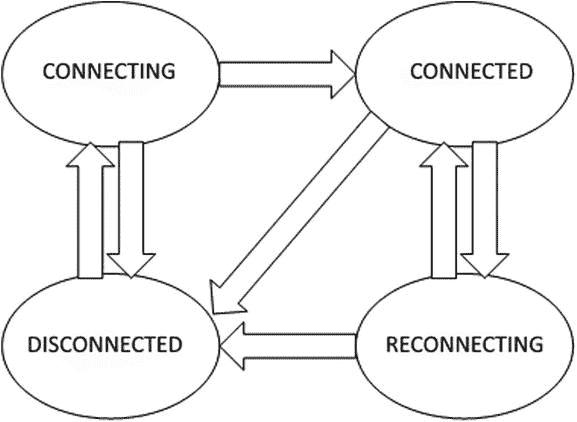
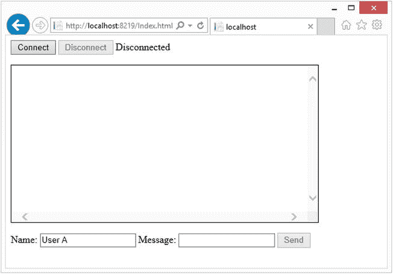

# 四、使用持久连接开发 SignalR 应用

本章向您展示了如何使用持久连接开发应用。我们定义一个持久连接，并向您展示如何配置它。下一步是查看服务器和客户端之间发生的通信和事件 SignalR。您将通过一个与 JavaScript 客户机的持久连接示例来探索这种通信。最后，我们讨论组以及如何将它们用于持久连接。

以下是本章涵盖的主题的简要列表:

*   如何配置持久连接
*   通过持久连接与客户端进行服务器通信
*   服务器和客户端之间的信令
*   使用 JavaScript 客户端的示例
*   组

## 什么是持久连接？

持久连接是服务器和客户端之间保持开放的通信通道，以促进安全、可靠、低延迟和全双工通信。通道由唯一的连接 ID 标识。通道是由各种传输协议中的一种提供的，这种传输协议具有逻辑，使人产生连接总是持久的错觉。

### 持久连接的属性

有四个关键属性使持久连接成为许多实现的理想选择。这些属性如下:

*   坚固的连接
*   全双工通信
*   低延迟
*   安全通信(可选)

以下部分讨论了每个属性及其提供的好处。

第一个属性是健壮连接，它确保已连接的连接保持连接。如果断开连接，它会引发一个事件，以便采取纠正措施。持久连接保持强健的机制包括保持活动数据包、断开超时和连接超时监视器、重新连接逻辑和连接状态事件通知。保活数据包保持信道“温暖”，防止路由器和交换机因缺少数据移动而过早关闭连接。保活数据包还为连接提供心跳。此心跳更新上次更新时间，该时间用于检查断开连接超时，该超时用于检测已终止但尚未发出正在断开连接的 SignalR 的连接。一旦断开连接超时，连接就有重新连接的逻辑。重新连接逻辑尝试使用相同的连接 ID 重新连接，从而将连接返回到断开连接之前的状态。连接超时用于为长轮询传输提供新连接，因为它不接收保活数据包。

第二个特性是全双工通信，它允许双向和异步通信。每个连接都有发送和接收数据的能力。根据传输方式，可能有一个或两个通道来提供全双工通信。Web 套接字传输允许为全双工操作创建一个通道。其他传输需要两个通道，一个用于发送，一个用于接收。

The third property is low latency, which allows the connection to be real time or near real time. The low-latency property is ideal for applications that need to be responsive without h aving to deal with connection handshaking. The latency is different for most of the transports, and the transport with the lowest latency in both directions is Web Sockets. This transport keeps one channel open to communicate both ways so it does not need to complete a connection handshake after it has been connected. The ServerSendEvents and ForeverFrame transports have to complete the receive handshake only once and keep the receive channel open. However, the send channel has to be re-created for every message sent, which adds latency to every send for the connection handshake. Long polling, which has the worst latency, has to do a connection handshake every connection timeout interval, after receiving data from the server, or any time it needs to send data upstream to the server.

最后一个属性是安全通信，它支持通过连接进行安全可信的通信。该属性是可选的，具体取决于所选的实现。持久连接的安全通信可以通过 SSL 加密来提供和/或通过使用连接和组 id 的加密令牌来保护。每当连接或组令牌被传输给用户时，它都被服务器加密。服务器根据经过认证的用户对令牌进行加密。这些安全令牌防止攻击者伪造对连接 ID 的请求或加入它无权加入的组。

### 持久连接如何工作

对于用户来说，一个持久化的连接看起来总是连接的，但是 SignalR 为连接的多个阶段准备了逻辑:连接、维护和断开连接。对于持久连接，连接阶段由以下步骤组成:

The client sends a negotiation request.   The server responds to the negotiation request with a payload of negotiation properties.   The client uses the payload to negotiate the best transport option.   The client sends a connect request with the negotiated transport.   Once the server has accepted the connect request, the persistent connection is made.  

建立连接后，同时采取以下步骤来保持连接:

*   检索服务器上的任何数据
*   发送任何待发送到服务器的数据
*   检索并确认保活数据包，或在轮询超时后重新连接

最后，当不再需要连接并进入断开连接阶段时，客户机和服务器上就有了独立的逻辑。对于客户端，它发送中止命令，然后关闭连接。如果服务器收到中止命令，它会清理连接。如果服务器没有收到中止命令，将触发超时来清除中止消息丢失的所有连接。在这一章的后面，你会学到更多关于持久连接各方面的工作方式。

### 使用持久连接而不是 HUB

在确定是使用持久连接还是 HUB 时，请记住以下几个因素:

*   消息格式
*   通信模型
*   SignalR 定制

根据应用的不同，这些因素可能会对决策产生不同程度的影响。为了演示不同之处，我们展示了持久连接和 HUB 的部分示例。这些示例可以请求时间或广播消息。尽管实现略有不同，但它们很好地展示了不同之处。

首先显示持久连接的例子，服务器如清单 4-1 所示，客户机如清单 4-2 所示。

清单 4-1。持久连接服务器示例

`public class TestPersistentConnection : PersistentConnection`

`{`

`protected override Task OnReceived(IRequest request, string connectionId, string data)`

`{`

`return (data.StartsWith("GetTime")) ? Connection.Send(connectionId, "Time:" + DateTime.Now.ToString()) : Connection.Broadcast(data);`

`}`

`}`

清单 4-2。持久连接客户端示例

`var connection = $.connection('/TestPC');`

`connection.received(function (data) {`

`var messageData = '';`

`if (data.indexOf('Time:') > -1) { messageData = 'The time is: ' + data.substring(5); }`

`else { messageData = data;}`

`$('#messages').append('<li>' + messageData + '</li>');`

`});`

`connection.start().done(function () {`

`$("#send").click(function () {`

`connection.send($('#data').val());`

`});`

`$("#getTime").click(function () {`

`connection` `.send('GetTime');`

`});`

`});`

接下来是 hub 的例子，服务器如清单 4-3 所示，客户机如清单 4-4 所示。

清单 4-3。中心服务器示例

`public class TestHub : Hub`

`{`

`public void BroadcastMessage(string message)`

`{`

`Clients.All.SendMessage(message);`

`}`

`public void GetTime()`

`{`

`Clients.Caller.SendTime(DateTime.Now.ToString());`

`}`

`}`

清单 4-4。HUB 客户端示例

`var connection = $.hubConnection();`

`var hubProxy = connection.createHubProxy('TestHub');`

`hubProxy.on('SendMessage', function (data) {`

`$('#messages').append('<li>' + data + '</li>');`

`});`

`hubProxy.on('SendTime', function (data) {`

`$('#messages').append('<li>' + 'The time is: ' + data + '</li>');`

`});`

`connection.start().done(function () {`

`$('#send').click(function () { hubProxy.invoke('BroadcastMessage', $('#data').val()); });`

`$('#getTime').click(function () { hubProxy.invoke('GetTime'); });`

`});`

首先要考虑的领域(不关注重要性)是消息格式。在持久连接中，您负责解析和标记来回传递的数据；在 HUB 中，这种消息格式已经得到处理。如清单 4-5 所示，持久连接的数据负载非常简单，但是在服务器上解析可能会很复杂。另一方面，看看清单 4-6 和 4-7 中 HUB 的数据有效负载，消息的格式是 HUB 逻辑在服务器上自动解析成静态类型。

清单 4-5。带有数据“Hello”的持久连接的请求体

`data=Hello`

清单 4-6。带有“Hello”参数的 HUB 广播消息函数的请求体

`data=%7B%22H%22%3A%22testhub%22%2C%22M%22%3A%22BroadcastMessage%22%2C%22A%22%3A%5B%22Hello%22%5D%2C%22I%22%3A1%7D`

清单 4-7。清单 4-6 的解码

`Data=` `{"H":"testhub","M":"BroadcastMessage","A":["Hello"],"I":1}`

消息格式的另一个方面是消息的大小。如果大小对应用来说非常重要，那么持久连接的优势在于具有较小的有效负载。您可以在清单 4-5 和清单 4-8 中看到，对于持久连接，数据负载比清单 4-7 和清单 4-9 中的 HUB 要小得多。

清单 4-8。对 GetTime 函数的持久连接响应

`{"C":"d-4E3C7594-B,4|L,2|M,0","M":["Time:4/26/2014 2:00:00 AM"]}`

清单 4-9。Hub 通过调用 SendTime 函数来响应 GetTime 函数

`{"C":"d-2CF99ADA-E,0|I,1|J,1|K,0","M":[{"H":"TestHub","M":"SendTime","A":["4/26/2014 2:00:00 AM"]}]}`

接下来是每个 API 的通信模型。对于持久连接，这个模型非常类似于连接模型，通常在连接的每一端都有一个发送函数和一个接收函数。hub 对该模型进行了抽象，并提出了远程过程调用(RPC)模型，该模型在客户机或服务器上提供了许多具有唯一函数签名的函数。看看本章前面提供的例子，看看它们如何适应各自的模型。

在清单 4-1 所示的持久连接服务器示例中，只有一个接收请求的函数:`OnReceived`。而对于向客户端发送数据，只有一个函数:`Send`。尽管示例中显示了`Broadcast`函数，但它在内部调用了`Send`函数。

清单 4-2 中所示的持久连接客户端示例也只提供了一个发送函数和一个接收函数。`received`函数调用回调函数，回调函数具有确定如何处理接收到的有效载荷的逻辑。根据向服务器发出的请求类型，使用不同的输入数据调用`Send`函数。

对于一个 hub 示例，请看清单 4-3，其中有两个由服务器提供的函数:`BroadcastMessage`和`GetTime`。这些函数分别接受一个和零个参数，并调用客户端上的唯一函数。

清单 4-4 中的 hub client 示例显示了 RPC 模型，它具有不同的函数，这些函数可以从服务器上调用，并且具有在服务器上调用不同函数的逻辑。看看调用的调用:`BroadcastMessage`函数有一个参数，而`GetTime`函数没有参数。客户端还提供了两个函数(`SendMessage`和`SendTime`)，分别用于接收消息数据和时间。

最后，根据对 SignalR 类的定制，扩展和定制持久连接类会更容易。HUB 是建立在持久连接 API 之上的，因此它们更加严格，也给定制带来了更多的挑战。持久连接和 HUB 的许多组件都可以使用依赖关系解析器进行交换。虽然这些组件是可变的，但是中心类具有您可能想要更改的共享中心类(例如，为特定端点的传入数据创建自定义的加密数据解析器)。对于持久连接，您可以使用自定义加密来覆盖`OnReceived`方法。对于 HUB 来说要困难得多，因为它们有逻辑绑定到静态类型，对静态类型的修改会影响所有 HUB。

## 如何配置持久连接

根据您正在编写的应用的类型，有时您需要配置持久连接以适应您的应用。有许多选项可用于配置持久连接。第一个必需的配置是路由配置，以便您的持久连接注册到正确的端点。另一个可以配置的关键部分是支持的传输。其他属性可以使用连接使用的 OWIN 属性进行配置。如果配置不能提供您所需要的一切，那么可以使用定制类来扩展持久连接。(用自定义类扩展在第 7 章中讨论)。

### 持久连接路由配置

要创建一个持久连接类，从`PersistentConnection`类中派生出来，如清单 4-10 所示。

清单 4-10。从 PersistentConnection 派生的 PersistentConnection 类

`public class TestPersistentConnection : PersistentConnection`

尽管您已经创建了持久连接类来访问它，但是您必须配置到路由的绑定。在 IIS 和自宿主应用下，您在`Startup.cs`文件中创建这个映射。

#### 在 Startup.cs 中映射路由

映射路线应该出现在`Startup.cs`文件中。如果该文件不存在，您可以通过添加 OWIN 启动类类型的文件来添加它。一旦有了文件，就可以使用`IAppBuilder`接口在`Configuration`函数中配置映射。您可以使用`IAppBuilder`来注册您所有的 OWIN 中间件组件，包括`PersistentConnection`和`Hub`类。

映射连接最简单的方法是使用 SignalR 提供的扩展方法(见清单 4-11)。这个例子将清单 4-10 中显示的`TestPersistentConnection`类映射到路径`TestPC`。所以如果你的主人是`http://localhost`，你可以在`http://localhost/TestPC`访问`TestPersistentConnection`。

清单 4-11。Startup.cs 中映射路由的示例

`public void Configuration(IAppBuilder app)`

`{`

`app.MapSignalR<TestPersistentConnection>("/TestPC");`

`}`

请注意，添加路由的顺序就是匹配路由时使用的顺序。除了路由配置之外，还可以配置持久连接的其他方面，比如连接超时和 Web 套接字支持，这将在接下来的几节中讨论。

### 全局超时和保持活动配置

`GlobalHost`类提供了一个静态属性，该属性公开了一个`IConfigurationManager`接口，该接口可用于设置连接超时、断开超时和保持活动间隔设置。

`ConnectionTimeout`属性是连接保持打开而没有接收数据的时间量。超时后，连接关闭，另一个连接打开。默认`ConnectionTimeout`为 110 秒；该属性仅由长轮询传输使用。

`DisconnectTimeout`属性是连接断开后引发断开事件前等待的时间。设置`DisconnectTimeout`时，默认`DisconnectTimeout`为 30 秒；`KeepAlive`属性设定为设定值的 1/3。

`KeepAlive`属性是发送保活消息之间的时间量。默认情况下，该属性被设置为`DisconnectTimeout`属性值的 1/3，但长轮询传输除外，它被设置为`null`。如果该值设置为`null`，则`KeepAlive`属性被禁用；如果设置为一个值，最小值必须至少为 2 秒，最大值为`DisconnectTimeout`的 1/3。

Note

要配置`DisconnectTimeout`和`KeepAlive`设置，必须先设置`DisconnectTimeout`，否则会抛出无效操作异常。

### 主机上下文配置

为进入持久连接的每个请求创建了`HostContext`。可以使用`HostContext`并覆盖`PersistentConnection`派生类中的`Initialize`方法来更新配置。

#### 支持 web socket

该属性向客户端提供一个标志，告诉它们某个连接是否支持 Web 套接字。该属性可以通过设置`HostContext Items`集合中的键`HostConstants.SupportsWebSockets`来设置(见清单 4-12)。将`true`的值设置为标志，以便客户端尝试使用 Web 套接字，或者设置为`false`以跳过使用 Web 套接字传输的尝试。

清单 4-12。设置 SupportsWebSockets 的示例

`public override void Initialize(IDependencyResolver resolver, HostContext context)`

`{`

`context.Items[HostConstants.SupportsWebSockets] = true;`

`base.Initialize(resolver,``context`T2】

`}`

Note

此值的预期对象类型是布尔值。如果使用`true`作为值来设置`SupportsWebSockets`，代码将抛出一个异常。

#### WebSocketServerUrl

`WebSocketServerUrl`属性为客户端提供了一个覆盖服务器 URL 来调用 Web 套接字连接。这个属性可以通过设置`HostContext Items`集合中的键`HostConstants.WebSocketServerUrl`来设置`WebSocketsServerUrl`的值来设置(见清单 4-13)。

清单 4-13。设置 WebSocketServerUrl 的示例

`public override void Initialize(IDependencyResolver resolver, HostContext context)`

`{`

`context.Items[HostConstants.WebSocketServerUrl] = "ws://localhost:8219";`

`base.Initialize(resolver, context);`

`}`

## 通过持久连接与客户端进行服务器通信

持久连接有一组发生在客户端和服务器之间的通信，用于初始化和维护连接，以及发送和接收数据。通信从协商请求开始，以确定服务器上哪些传输可用。每个客户端都有一套逻辑来确定哪种传输是最好的。一旦同意了传输，连接通信就为 Web 套接字设置一个升级的套接字，或者为其他传输设置一个接收通道。当数据需要发送到服务器，并且传输不是 Web 套接字时，发送通信用于发送数据。

因为长轮询传输不太可靠，所以它有两种通信方法。第一种是 ping 方法，它确定服务器是否可用；第二种是轮询方法，用于保持开放的接收通道。最后，对于任何想要关闭连接的传输，都有一个中止通信来终止连接。

### 谈判

协商是服务器和客户端之间发生的第一次基于 SignalR 的通信。在第一阶段，服务器收到一个以/negotiate 结尾的请求。在处理这个协商请求的过程中，服务器为该连接生成`ConnectionId`和`ConnectionToken`。这个过程还返回服务器属性的有效负载，这些负载作为 JSON 有效负载返回。如果协商是一个 JSONP 请求，那么有效负载将通过回调返回。

#### 洽谈属性

协商属性在协商请求的有效负载中返回(参见清单 4-14)。让我们来看看每个属性，看看它们是用来做什么的。

清单 4-14。协商属性有效负载的示例

`{"Url":"/SamplePC","ConnectionToken":"Udy6quBS2y3yQpElIQKg3memfXI56A4tdBqzwTNLB2jQND0z2YYVFGwpFJKxjCrF81t+p0IItZKoOuqcU7ZlWNwLnPJfod7E9fuBK1gEIb6UTfNhFiFSEt4dTEfDi1Z0","ConnectionId":"6a246327-fd16-4a90-8a76-e87ef5d14642","KeepAliveTimeout":20.0,"DisconnectTimeout":30.0,"TryWebSockets":true,"ProtocolVersion":"1.3","TransportConnectTimeout":5.0}`

##### 统一资源定位器

`URL`属性是持久连接端点的相对 URL。它仅由 JavaScript SignalR 客户端库使用。

##### ConnectionId

属性是由。NET Framework `Guid.NewGuid()`函数，用破折号格式化。`ConnectionId`是用于识别连接的关键键。

##### 连接令牌

通过将`ConnectionId`、一个冒号和用户身份附加在一起来生成`ConnectionToken`属性。用户标识是当前请求的用户名，由。NET Framework 或空字符串。然后，这个令牌在发送给用户之前被加密。

##### 请求超时

`KeepAliveTimeout`属性是在`IConfigurationManager`中为`KeepAlive`指定的值。(关于`KeepAlive`的更多信息在前面的“全局超时和保持活动配置”一节中讨论过)

##### 断开超时

`DisconnectTimeout`属性是在`IConfigurationManager`中为`DisconnectTimeout`指定的值。(关于`DisconnectTimeout`的更多信息在前面的“全局超时和保持活动配置”一节中讨论过)

##### 尝试 WebSockets

如果`TransportManager`支持 Web Sockets，`ServerRequest`的类型为`IWebSocketRequest`，OWIN `SupportsWebSockets`的环境变量为`true`，则返回`TryWebSockets`属性值`true`。如果传输名称 webSockets 出现在传输名称集合中，则`TransportManager`检查为`true`。如果 SignalR 库是用。NET 4.5 中，`ServerRequest`对象派生自`IWebSocketRequest`；否则，它从`IRequest`类派生。第三个检查稍微复杂一点，检查调用处理程序的`Invoke`方法中确定的`HostContext`条目。它基于传递给 OWIN `Invoke`函数的`server.Capabilities`环境变量中的`websocket.Version`键。

##### WebSocketsServerUrl

默认情况下，该属性为`null`。属性值由`HostContext Items`集合中的`HostConstants.` `WebSocketServerUrl`属性决定。

##### 原始版本

`ProtocolVersion`是 SignalR 的当前版本，提供它是为了让客户端保持兼容性。在撰写本文时，当前版本是 1.3。

##### 传输连接超时

`TransportConnectTimeout`是客户端在尝试另一种传输或失败之前应该允许的时间(以秒为单位)。

#### 客户谈判

一旦处理了协商负载，客户机就有足够的信息来确定它可以使用哪种传输来连接到服务器。客户端首先查看其支持的客户端列表；如果列表包含 Web 套接字，它会评估协商有效负载的`TryWebSockets`参数，以查看服务器是否支持 Web 套接字。

如果不支持，客户端传输列表中的下两个传输通常分别是 ServerSendEvents 和 ForeverFrame。客户端检查它与每个传输的兼容性，以查看它是否受支持。如果不满意，最后尝试的传输是长轮询传输，它通常是客户端列表中最后支持的传输。因为没有其他传输选项需要检查，所以客户端会抛出一个错误，并且不会建立连接。

### 砰

ping 请求是最简单的客户机-服务器通信之一。当使用 JavaScript 客户端时，该请求仅由长轮询传输发起。该请求执行一个简单的 get-to-the-base URL 并附加/ping。来自服务器的响应是一个非常基本的 JSON 数据负载。JSON 对象是一个单独的变量`"Response"`，其值为`"pong"`，由客户端验证(见清单 4-15)。

清单 4-15。Ping 请求的响应示例

`{"Response":"pong"}`

### 连接

一旦客户端找到最合适的传输方式，它就会发送一个连接响应。对于 websockets，请求是“Web Sockets”和协商中提供的`connection token`的传输。Web Sockets 连接返回的 HTTP 状态为 101，这意味着响应已经升级。对于所有其他传输，连接包括传输和连接令牌。

传输表示它发送的传输类型(ServerSendEvents、ForeverFrame 或 long polling)。连接令牌是连接的加密令牌。对于非 Web 套接字传输，此连接是监听通道，直到连接因超时或轮询而重新连接。

### 发送

发送请求是除 Web 套接字之外的所有传输的 post，发送发生在通道上，因此不会创建新的请求。send 命令在头中包含传输和连接令牌，在正文中包含数据。传输表示它发送的传输类型(ServerSendEvents、ForeverFrame 和 long polling)。连接令牌是连接的加密令牌。主体的数据部分是被发送的对象的值。在清单 4-16 中，发送的数据是`User A:Hello`。

清单 4-16。用户 A 发送问候的示例

`data=User+A%3A+Hello`

### 投票

Poll 是一个 get 请求，仅在传输是长轮询时使用。get 请求的参数是传输、连接令牌、消息 ID 和可选的组令牌。传输表示它发送的是哪种类型的传输，但是对于这个请求，只支持长轮询。连接令牌是当前连接的加密令牌。当连接是一个或多个组的成员并且包含这些组的密钥时，可选的组令牌出现。消息 ID 就是当前轮询请求的消息 ID。

轮询返回的数据来自一个名为`PersistentResponse`的类。该类包含几个影响连接的属性:

*   `Messages:`发送给客户端的一组消息。
*   `Disconnect:`连接已收到断开命令的指示器。
*   `TimedOut:`连接超时的指示器。
*   `GroupsToken:`连接所属的组列表的加密令牌。如果连接不属于某个组，则`GroupsToken`为`null`。
*   `LongPollDelay:`如果没有收到数据，客户端在重新连接之前应该等待的时间长度。`LongPollDelay`是`null`，用于除长轮询以外的任何传输。
*   `Cursors:`一个特殊的数据集，包含一串十六进制格式的小型事件密钥和 id。光标代表消息 ID，但是通过将值转换为数字来编码。

`PersistentResponse`的 JSON 表示以 key: value 格式编写，用逗号分隔键值对。如果`Disconnect`、`TimedOut`、`GroupsToken`或`LongPollDelay`属性没有值或者为`false`，则它们不会包含在 JSON 响应中。表 [4-1](#Tab1) 是 JSON 响应中从 key 到 property 的映射。

表 4-1。

Relation Table of Key to Property PersistentResponse JSON Object

<colgroup><col> <col></colgroup> 
| 钥匙 | 财产 |
| --- | --- |
| C | `Cursors` |
| D | `Disconnect` |
| T | `TimedOut` |
| G | `GroupsToken` |
| L | `LongPollDelay` |
| M | `Messages` |

轮询的响应是从`PersistentResponse`类返回的 JSON 数据。清单 4-17 显示了一个响应的例子。该数据由客户端评估，以确定连接的当前状态。如果传输是长轮询，它检查 L 键的数据，看它是否包含新轮询延迟的数值。如果 D 键存在，客户机将其解释为来自服务器的断开 SignalR，并在本地发出 stop。如果 C 键存在，客户端将其消息 ID 设置为所提供的光标数据。当 G 键出现时，客户端更新它的组列表。最后，客户端检查 M 键下提供的每条消息。对于每条消息，如果合适的话，它会触发客户端`OnReceived`命令。

清单 4-17。轮询中收到的持续响应的示例

`{"C":"d-C16EF02C-B,1|C,1|D,0","M":["User A: Hello"]}`

### 流产

当客户端终止连接时，会发送中止请求。每当在连接上发出 stop 方法或者(使用 JavaScript 客户机)导航离开网页时，就会发出 abort 命令。除了 Web 套接字之外，中止请求被发布给所有传输，其中中止发生在通道上，因此不会创建新的请求。abort 命令在报头中包含传输和连接令牌。传输表示它发送的传输类型(Web Sockets、ServerSendEvents、ForeverFrame 或长轮询)。连接令牌是当前连接的加密令牌。

## 服务器和客户端之间的信令

在持久连接的整个生命周期中，服务器和客户端上都会出现表示影响连接的事件的 SignalR。尽管服务器和客户机的 SignalR 是相似的，但它们的用法通常是不同的。这些事件表示连接的状态，消除了轮询每个连接以确定其当前连接状态的需要。

### 服务器端事件

服务器端事件是在服务器上引发的事件，它可以由任何连接生成，或者在服务器意识到某个连接不再可用时生成。

#### 收到时

`OnReceived`事件是最重要的事件之一，当从持久连接接收到数据时发生。在这个事件中，消息被解码，并且发生数据分布的选择。根据应用的不同，您可以选择广播、发送到一个组，或者消费数据而不重新分发。

#### 未连接

当建立新的连接时，`OnConnected`事件发生。在这个事件中，可以添加将用户添加到组的逻辑。还可以添加逻辑来保持登录的用户存在。根据传输类型，连接可能会非常频繁地登录。因此，与直接显示用户当前是否登录不同，显示上次登录时间可能会提供更好的体验。

#### on 断开连接

当连接断开时，或者通过发送中止命令，或者服务器意识到连接不再可用，就会发生`OnDisconnected`事件。在此事件中，添加了从组中删除用户的逻辑。这里还可以添加逻辑来补充添加到`OnConnected`事件的逻辑，通过知道用户何时断开连接来维护用户状态。根据所使用的传输方式，基于连接和断开状态更新用户状态可能会带来不好的体验，所以也许`OnConnected`应该只用于确定最后登录时间。

#### 重新连接时

当超时后使用相同的连接 ID 重新连接时，会引发`OnReconnected`事件。对于此事件，可以添加逻辑来查看客户端是否处于正确的状态，因为在超时期间丢失了数据。

#### OnRejoiningGroups

当连接在超时后重新连接以确定哪些组应该自动重新加入时，会发生`OnRejoiningGroups`事件。在这种情况下，您可能需要进行额外的逻辑检查，以确定是否应该将连接添加回组中，而不是自动添加到连接超时前的组中。

#### 授权者请求

`AuthorizeRequest`事件发生在每次请求授权用户之前。在这个事件中，您可以添加定制的逻辑，该逻辑返回一个布尔值，表明客户端是否被授权使用在请求对象中指定的持久连接和/或请求的资源。

### 客户端事件

客户端事件是在客户端上为持久连接引发的事件。这些事件表明连接已经改变或者数据已经从服务器到达。这些事件表示连接正在启动、重新连接或关闭。当有错误时，当新数据从服务器到连接可用时，当连接变慢时，或者当它改变连接状态时，它们也发出 SignalR。

#### 收到

最重要的事件之一是`Received`事件，当连接从服务器接收到数据时就会引发该事件。使用一个包含服务器发送的数据的参数来调用事件。

#### 错误

当连接遇到错误时，`Error`事件发生；通常，这是由于创建连接时出现错误而返回的。使用一个参数调用该事件，该参数可能没有关于错误生成原因的数据。

#### 关闭/断开

`Closed/Disconnected`事件在连接停止时发生。事件名称取决于正在使用的客户端。

#### 使再接合

当连接中断后开始重新连接时，会发生`Reconnecting`事件。重新连接时，连接不可用。

#### 使再接合

一旦超时后重新建立了连接，`Reconnected`事件会发出 SignalR，表示该连接可以再次使用。

#### 状态已更改

当连接状态更改时，会发生此事件。有四种连接状态:连接中、连接中、重新连接中和断开连接。有七种可能的状态转换(见图 [4-1](#Fig1) )。

图 4-1。

ConnectionState state diagram

#### 慢速连接

当连接超过断开连接超时的三分之二而没有收到保持活动消息时，会发生此事件。一旦事件被激发，只有在连接超时之前收到保持活动状态的消息时，它才会再次激发。

#### 启动

由所有传输使用，但只在 SignalR JavaScript 库中作为事件公开。一旦客户端调用了`Start`函数，该事件就会发生。

#### 开始时

由所有传输使用，但只在 SignalR JavaScript 库中作为事件公开。该事件在成功发出`negotiate`请求后发生。

## 使用 JavaScript 客户端的通信和信令示例

为了演示服务器和客户端之间的通信和信令，我们展示了一个 JavaScript 示例。这个示例主要关注当事件被引发时，客户端上发生的 SignalR。这些事件中的一些，比如连接状态，被暴露在客户端 UI 上，以获得应用中正在发生的事情的视觉感受。

### 客户端示例的服务器代码

我们重用第 2 章中的持久连接服务器示例。这是一个简要的概述；如果需要更多细节，请重新访问[第 2 章](02.html)。

Create a new ASP.NET web application using the model-view-controller (MVC) template.   Run the following command in the Package Manager Console to install the necessary SignalR files: `Install-Package Microsoft.AspNet.SignalR`.   Create a `PersistentConnections` folder.   Add a new class to the `PersistentConnections` folder called `SamplePersistentConnection`.   Update the new class to look like Listing 4-18\. Add any missing `using` statements.  

清单 4-18。持久连接示例代码

`public class SamplePersistentConnection : PersistentConnection`

`{`

`protected override Task OnReceived(IRequest request, string connectionId, string data)`

`{`

`return Connection.Broadcast(data);`

`}`

`}`

Add the code in Listing 4-19 to `Startup.cs` after the `ConfigureAuth` statement to register the `PersistentConnection`. Add any missing `using` statements.  

清单 4-19。注册持续连接路由

`app.MapSignalR<SamplePersistentConnection>("/SamplePC");`

既然创建了服务器，下一步就是创建客户机，这将在下一节中讨论。

### JavaScript 客户端示例

第 2 章展示了一个基于 JavaScript 的持久连接的例子；在这里，我们扩展示例来展示客户端事件的运行。正如前面所做的，应该向项目中添加一个 HTML 页面。

Add the scripts shown in Listing 4-20 to the `head` section of the HTML page.  

清单 4-20。Javascript 示例客户端脚本代码

``

``

Note

可能需要在脚本中将 JQuery 和 SignalR 库引用更新到 NuGet 包安装提供的当前版本。服务器运行的端口需要在脚本中替换为`####`所在的端口。

Add the code in Listing 4-21 to the `body` section of the HTML page.  

清单 4-21。JavaScript 示例客户端 HTML

`<button id="btnConnect" >Connect</button>`

`<button id="btnDisconnect" disabled="disabled">Disconnect</button>`

`<label id="connectionStatus">Disconnected</label>`

`<ul id="messages" style="border: 1px solid black; height: 250px; width: 450px; overflow:scroll; list-style:none;"></ul>`

`<label>Name: </label>`

`<input id="name" value="User A" />`

`<label>Message: </label>`

`<input id="message" />`

`<button id="btnSend" disabled="disabled">Send</button>`

一旦示例完成，您应该会看到类似于图 [4-2](#Fig2) 的内容。

图 4-2。

JavaScript SignalR client interface

这个例子向您展示了持久连接的各种连接状态。下一节讨论组，它根据一个公共因素对连接进行分组。

## 连接分组

当您的应用需要每个用户或每个通信有多个并发的持久连接时，它必须向一组人发出请求。您可以使用组来实现这一点。组管理和成员资格可以通过在`PersistentConnection`类中提供的简单接口来控制。根据组数据的保存位置，组信息可能只在应用的整个生命周期内存在服务器上，也可能存储在应用生命周期结束后仍存在的进程外存储区中。

### 集团经理

`GroupManager`为持续连接提供群组管理。`GroupManager`提供三种功能:`Send`、`Add`和`Remove`。这些功能提供了通信和管理群组的基本功能。

#### 发送功能

group `Send`函数在本地将数据发送到连接到本地服务器的任何连接 id，然后发布消息总线，将消息发送到可能存在于通过消息总线连接的其他服务器上的组。

#### 添加功能

group `Add`功能负责将用户添加到组中。如果该组不存在，它还会创建该组，并向通过消息总线连接的其他服务器发布添加命令。

#### 移除功能

group `Remove`功能负责从组中删除用户。如果没有剩余的连接，它还会删除该组，并向通过消息总线连接的其他服务器发布删除命令。

### 组成员关系

组成员遵循订阅者/发布者模式。组的成员可以是连接的任意组合。组的生命周期由 SignalR 内部处理，包括组的创建和删除。该组的成员可以是单用户或多用户。

#### 团体订阅

当用户加入一个组时，他们是以订阅者/发布者模式加入的。SignalR 不公开任何向组返回订户信息的方法。因此，如果需要知道一个组的成员，就需要添加定制的逻辑来捕获该组的订户并公开这个列表。

#### 群体生命周期

第一次将连接添加到不存在的组时，组生命周期就开始了。SignalR 创建新组，并将该连接注册到该组中。当通过`GroupManager`在组中添加或删除连接时，组成员关系会更新。当一个组中的所有连接都被删除后，SignalR 会清理该组并将其从内存中删除。

#### 单用户群

单用户组只包含单个用户的连接 ID。该组用于向可能在多个选项卡上打开持久连接或在站点中移动的用户发送消息，因此用户的连接 ID 在每次访问新页面时都会重新生成。

清单 4-22 是一个单一用户组的逻辑示例。该逻辑要求对用户进行认证，以便用用户名填充`Identity`对象。

清单 4-22。从单用户组添加/删除连接的逻辑示例

`protected override Task OnConnected(IRequest request, string connectionId)`

`{`

`string groupName = request.User.Identity.Name;`

`if (!string.IsNullOrWhiteSpace(groupName))`

`this.Groups.Add(connectionId, groupName);`

`return base.OnConnected(request, connectionId);`

`}`

`protected override Task OnDisconnected(IRequest request, string connectionId, bool stopCalled)`

`{`

`string groupName = request.User.Identity.Name;`

`if (!string.IsNullOrWhiteSpace(groupName))`

`this.Groups.Remove(connectionId, groupName);`

`return base.OnDisconnected(request, connectionId, stopCalled);`

`}`

Note

该示例依赖于通过使用除匿名认证之外的认证方法得到的有效值。

#### 多用户群

多用户组包含具有一个或多个连接 id 的多个用户。这些组可用于定位连接子组。

假设您运行一个论坛，并希望拥有一个与主要论坛主题相关的聊天室。在这个例子中，对于用户在不同的主要论坛主题下的每个页面，我们提供了一个以主要论坛主题为中心的聊天窗口。为了做到这一点，我们可以将该页面到主要主题的连接进行分组。使用 SignalR，这个过程非常简单:向客户机添加组名逻辑，向服务器添加分组方法。

修改客户端非常容易；我们使用一个允许我们传递查询字符串值的连接构造函数，如清单 4-23 所示。

清单 4-23。请求期间提供查询字符串值的客户端更新示例

`var roomName = getRoomName();`

`var connection = $.connection('``http://localhost:8219/chat`T2】

Note

`getRoomName()`函数是一个自定义函数，用于返回群组，或者在本例中，返回聊天室。

在本例中，第一行从`getRoomName`函数中的自定义逻辑中确定了属于哪个组。在第二行中，使用了允许查询字符串值的构造函数。第一个参数是 SignalR 端点 URL，第二个参数是应该附加的查询字符串参数，第三个参数决定是否应该打开日志记录。

对于服务器来说，为了确定用户正在查看哪个聊天室，我们需要添加逻辑，根据我们使用的查询字符串值来添加或删除组。还需要添加逻辑，以便消息可以发送到查询字符串指定的组，类似于清单 4-24。

清单 4-24。使用查询字符串值确定组名的服务器更新示例

`protected override Task OnReceived(IRequest request, string connectionId, string data)`

`{`

`string groupName = request.QueryString["roomName"];`

`return this.Groups.Send(groupName, data, connectionId);`

`}`

`protected override Task OnConnected(IRequest request, string connectionId)`

`{`

`string groupName = request.QueryString["roomName"];`

`if (!string.IsNullOrWhiteSpace(groupName))`

`this.Groups.Add(connectionId, groupName);`

`return base.OnConnected(request, connectionId);`

`}`

`protected override Task OnDisconnected(IRequest request, string connectionId, bool stopCalled)`

`{`

`string groupName = request.QueryString["roomName"];`

`if (!string.IsNullOrWhiteSpace(groupName))`

`this.Groups.Remove(connectionId, groupName);`

`return base.OnDisconnected(request, connectionId, stopCalled);`

`}`

我们修改的第一个方法是`OnReceived`。在这个方法中，我们查看查询字符串值来确定组名。然后，我们使用这个名称，将从客户端发送的数据发送到组，不包括我们自己的连接 ID。我们修改的第二个和第三个方法是`OnConnected`和`OnDisconnect`函数。在这些函数中，首先要做的是从查询字符串中确定组名。一旦我们有了组名并确定组名是有效的，我们就调用`GroupManager`来分别添加或删除函数。

### 群体持久性

可以在内存中或长期存储介质(如数据库或缓存层)中保存组。持久性介质需要权衡速度、持久性和可伸缩性。

让我们先来看看内存中的组解决方案，它非常快，因为请求不必走出进程就可以获得组信息。这种解决方案的缺点是它不能扩展到运行它的服务器之外，而且如果应用重新启动，组信息就会丢失。这种解决方案适用于只在一台服务器上运行的应用，不需要跨服务器进行组通信，并且可以容忍在重启时丢失组数据。

另一种解决方案是使用数据库或缓存层来存储组信息。然后，组信息可以与许多服务器共享，并在服务器重新启动后保持不变。问题是，要访问这个组信息，每个请求都必须离开进程以获取组数据，这通常比内存访问慢好几倍。因此，即使应用可以扩展，使用外部存储介质也会带来性能损失，此外，还要保证外部存储介质可访问并与所有其他服务器同步，这也增加了复杂性。

要确定哪种解决方案最适合，取决于您是否在多个服务器上运行，以及组数据是否需要同步和/或持久化。如果您需要在重新启动之间保存组数据，或者如果您有多台服务器并且需要同步组数据，您应该将组信息存储在外部存储介质中，如第二个解决方案中所述。如果不是这样，内存解决方案提供了最好的好处。(关于消息总线和使用消息总线的扩展的更多信息在第 9 章和第 10 章中提供)。

## 摘要

在本章中，我们描述了持久连接。我们解释了服务器和客户端之间的通信和信令。展示了一个持久连接的 JavaScript 示例来解释发生的通信和信令。最后，我们讨论了如何在持久连接的上下文中使用组。