# 五、ASP.NET SignalR应用故障排除

第一章给了你一些关于实时网络和SignalR的背景信息。第 2 章是 ASP.NET SignalR 的快速入门，在第 3 章和第 4 章的[中，你会发现构建 ASP.NET SignalR 应用的两种重要方法:HUB和持久连接。](03.html)

这两个概念足以让 ASP.NET SignalR完成大多数常见的工作，但这是在一个完美的世界。在实践中，我们在编写程序时经常会遇到一些问题，我们还会遇到其他一些关于纵向扩展和横向扩展以及部署到不同环境的问题。在本章和本书的其余部分，我们将重点关注针对此类问题不同方面的主题，为您提供更多关于构建真正的 ASP.NET SignalR应用的实用知识。

这一章是关于开发任何类型软件的一个主要阶段:故障排除——换句话说，调试和测试。你需要调试和测试几乎所有你写的程序，不管它有多大。对于在单一环境下运行的较小程序(如控制台应用)来说，这个过程可能更容易，因为您可以很容易地看到输出，并且可以使用许多调试功能，如断点。

然而，世界并不总是那么简单，往往会有更棘手的案件需要处理。一个例子是客户端-服务器应用，例如我们用 ASP.NET SignalR 构建的那些应用。整个程序的执行分布在两个独立的组件中，这两个组件在两个不同的上下文(很可能是不同的环境或机器)中执行:服务器和客户机。调试这样的程序需要更多的努力，并且需要更好的工具支持。

本章介绍了调试 ASP.NET SignalR 的服务器和客户端组件的常用技术和工具，并讨论了您在开发 ASP.NET SignalR 应用时可能会遇到的常见问题。

以下是第 5 章中主要话题的简要列表:

*   排除 ASP.NET SignalR应用故障的一般过程
*   如何使用 Chrome 开发工具调试应用的客户端执行以及 JavaScript 或 jQuery 问题
*   如何使用 Fiddler 解决客户端到服务器(以及服务器到客户端)的通信问题
*   如何对应用的服务器端执行进行故障排除
*   如何在 ASP.NET SignalR中启用跟踪
*   ASP.NET SignalR应用的常见问题

## ASP.NET SignalR故障排除概述

排除 ASP.NET SignalR 应用(或任何服务器-客户端应用)的故障没有灵丹妙药，因为有不同的独立部分在一起工作，在不同的上下文中执行，甚至运行在不同的机器上进行调试。因此，排除 SignalR 应用故障的整个想法需要一些经验，并遵循一般准则。

在这里，我们列出了一个要检查的领域的一般列表，以便对 ASP.NET SignalR 应用进行故障诊断(尽管您可能只想查看这些项目的一个子集，而不一定要按顺序进行):

*   客户端的 JavaScript 错误(使用调试工具，如 Chrome 开发工具或其他工具)
*   客户端和服务器之间的通信问题(使用 HTTP 调试工具，如 Fiddler)
*   服务器端问题(使用 Visual Studio 调试功能)
*   跟踪任何不可见或无声问题的日志(使用 ASP.NET SignalR 和 Visual Studio 输出中提供的跟踪机制)

这些步骤可能需要相互配合。例如，如果需要服务器端调试，那么很有可能也需要相应的 JavaScript 调试和客户端操作。

本章的其余部分将讨论每个项目的更多细节。

Note

虽然我们试图涵盖常见的故障排除过程和开发工具。NET 开发人员，如 Google Chrome 开发工具、Fiddler 和 Visual Studio，也有其他工具可以达到同样的目的。此类工具的功能和特性通常与这里讨论的工具非常相似(我们选择了最流行和最常用的工具进行讨论)，因此值得阅读本章以了解如何使用其他工具。

## 使用 Chrome 开发者工具进行客户端调试

ASP.NET SignalR 应用的常见问题产生在客户端，因为缺乏来自服务器的数据，破坏了 JavaScript 功能，来自服务器的数据不正确，甚至是客户端 JavaScript 代码中的逻辑问题。

在任何情况下，我们都需要调试 JavaScript 代码，找出问题所在，以便采取正确的措施。随着 JavaScript 在软件开发中的快速增长和普遍使用，已经开发了许多工具来简化 JavaScript 调试。从历史上看，调试 JavaScript 代码一直很棘手，有时还很有挑战性。这些障碍来自于这种语言的本质，它不同于其他编程语言(虽然它也运行在浏览器中)。

不管怎样，开发人员使用了相当多的工具来调试 JavaScript 这种需求导致浏览器开发者将非常丰富的 JavaScript 调试工具与所有主流浏览器的最新版本集成在一起，如 Google Chrome、Mozilla Firefox(它是一个扩展)和 Microsoft Internet Explorer。

这些浏览器不仅有很好的 JavaScript 调试器，而且还支持其他跟踪功能，比如对资源的网络访问、HTML 和 CSS 代码查看、剖析等等。这些工具允许您查看、测试和调试不同浏览器版本的 HTML、CSS 和 JavaScript，以确保您的应用能够在所有最新版本的所有主流浏览器上正确呈现。

这里提到的有 Chrome 开发者工具(见图 [5-1](#Fig1) )、Firefox Firebug(见图 [5-2](#Fig2) )和 Internet Explorer 开发者工具(见图 [5-3](#Fig3) )。在这一章中，我们将重点放在使用 Google Chrome 开发工具上，因为它在 web 开发人员中更受欢迎，并且还提供了一组更易于使用的稍微丰富的调试功能。其他工具的使用非常类似。

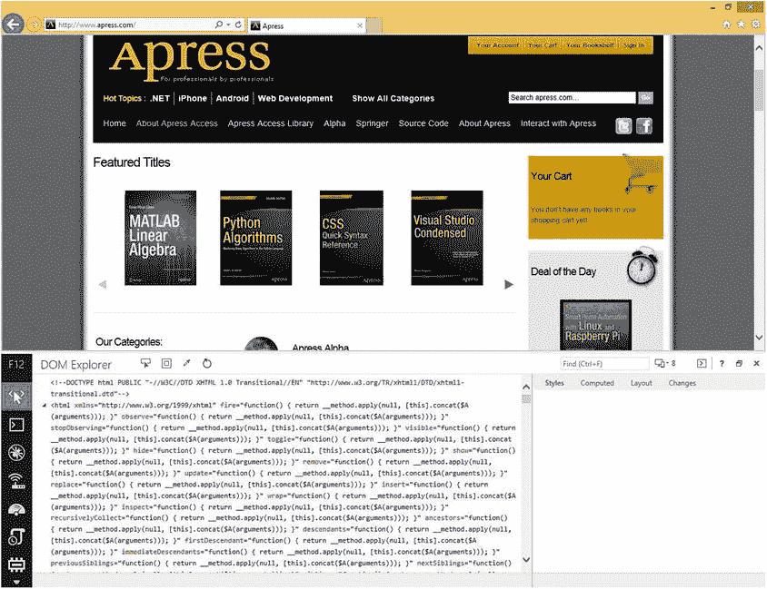

图 5-3。

Example of Microsoft Internet Explorer Developer Tools

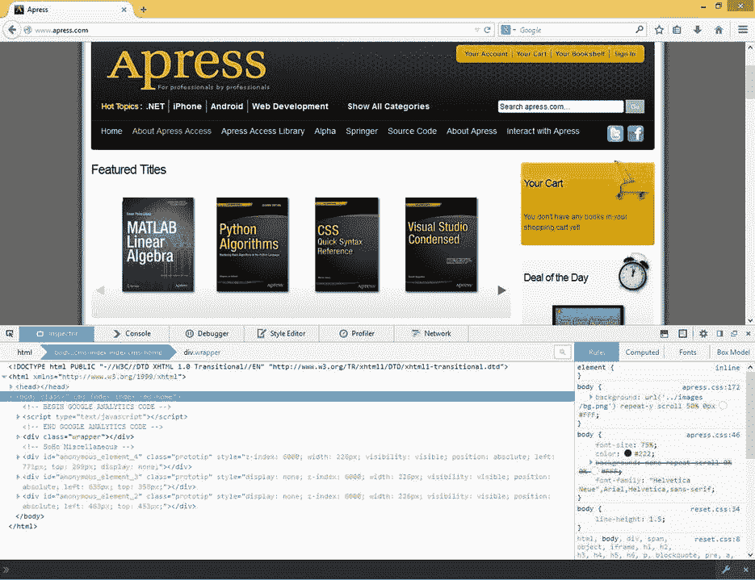

图 5-2。

Example of Firefox Firebug

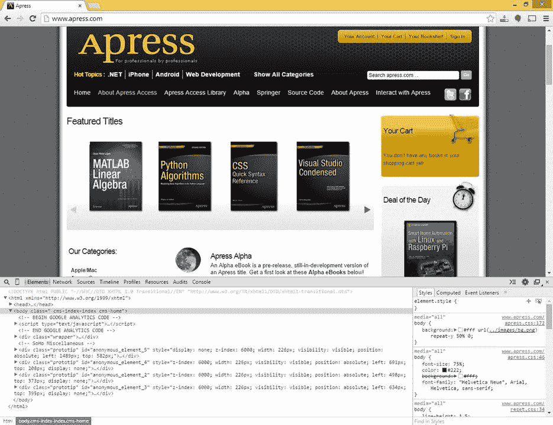

图 5-1。

Example of Google Chrome Developer Tools

在这一节中，我们将重点介绍 Google Chrome 开发者工具，并简要介绍如何使用它来调试 ASP.NET SignalR 中可能出现的客户端 JavaScript 错误。

首先，我们创建一个简单的带有HUB的 ASP.NET SignalR应用。这是一个非常基本的消息广播应用，展示了一些常见的场景。(我们在第 3 章中描述了开发这样一个应用的细节。清单 5-1 显示了`BroadcastHub`类实现的代码。

清单 5-1。广播中心实施

`using Microsoft.AspNet.SignalR;`

`namespace Chapter5.Controllers`

`{`

`public class BroadcastHub : Hub`

`{`

`public void BroadcastMessage(string message)`

`{`

`Clients.All.sendMessage(message);`

`}`

`}`

`}`

对于这个应用，我们避免启动托管环境，因此对动态中心代理的 JavaScript 引用无法访问这个资源。引入了一个我们可以检测和调试的 JavaScript 错误。但是首先，我们必须编写如清单 5-2 所示的客户端代码。

清单 5-2。广播应用的客户端实现

`<!DOCTYPE html>`

`<html xmlns="`[`http://www.w3.org/1999/xhtml`](http://www.w3.org/1999/xhtml)T2】

`<head>`

`<title></title>`

`</head>`

`<body>`

``

``

``

``

`
`

`<input type="text" id="msg" />`

`<input type="button" id="broadcast" value="Broadcast" />`

`<ul id="messages">`

`</ul>`

`
`

`</body>`

`</html>`

如果我们在 Google Chrome 中运行这个应用，我们不会得到预期的行为。此时，如果我们打开 Google Chrome 开发者工具并导航到控制台选项卡，可以看到 JavaScript 错误(参见图 [5-4](#Fig4) )。

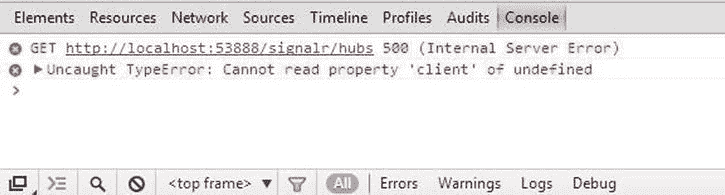

图 5-4。

JavaScript error for dynamic hub proxy

如图所示，顶部的错误表明对动态中心代理的 JavaScript 引用抛出了 500 HTTP 状态错误，这表明由于主机设置不正确而出现了服务器错误。第二个错误是第一个错误的副作用，因为没有正确加载动态代理，所以也无法加载该代理的客户端属性。

您可以在发生错误的每个错误行的右侧找到资源文件的名称和行号。通过点击此链接，您将导航到源代码选项卡中实际源代码所在的位置(参见图 [5-5](#Fig5) )。此选项卡包含有关错误的更多信息，可帮助您调试问题。

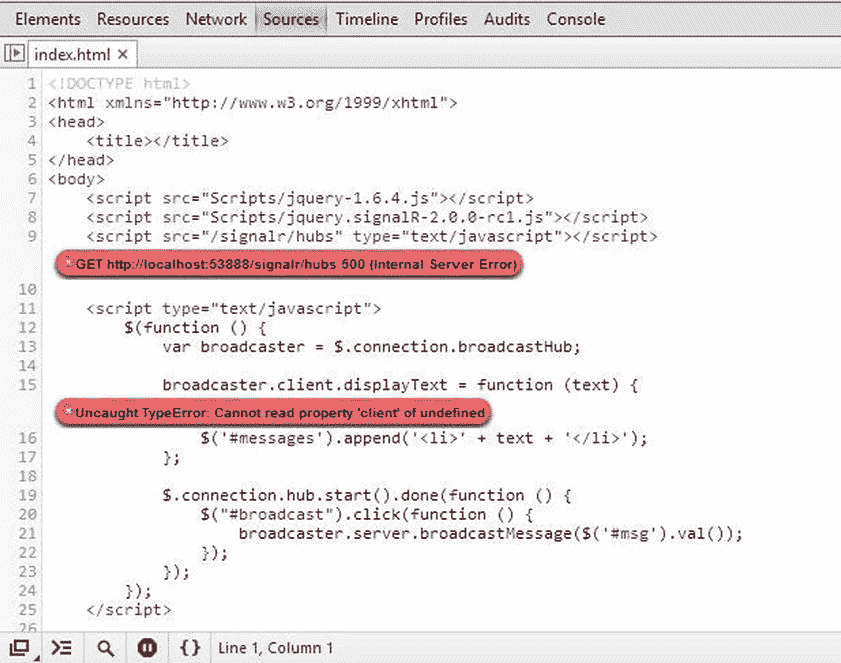

图 5-5。

Source of JavaScript errors in Google Chrome Developer Tools

现在让我们关注另一个场景，在这个场景中，我们希望实际看到客户机和服务器之间传递的值，反之亦然。这种情况需要在 JavaScript 中使用断点，Google Chrome 开发者工具提供了一组方便的功能来简化它。

让我们假设我们想要调试现有的代码，并找出通过广播从服务器向客户机发送什么消息。为了检测它，我们需要在 JavaScript 的`displayText`函数回调中插入一个断点(见清单 5-3)。

清单 5-3。插入 JavaScript 断点的代码

`broadcaster.client.displayText = function (text) {`

`$('#messages').append('<li>' + text + '</li>');`

`};`

通过运行应用，转到 Google Chrome 开发工具，然后转到 Sources 选项卡，我们可以在 HTML 文件中找到 JavaScript 代码。通过点击代码行旁边的左栏，我们可以插入一个断点(见图 [5-6](#Fig6) )。这种机制与 Visual Studio 中的断点系统非常相似。

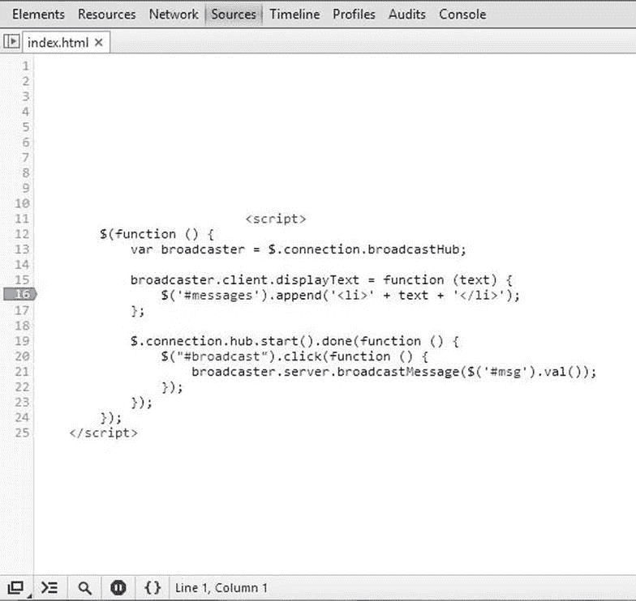

图 5-6。

Inserting a JavaScript breakpoint in Google Chrome Developers Tools

在执行代码并输入要广播的消息后，代码在这一行停止，使我们能够通过将光标移动到变量名上来查看变量值(见图 [5-7](#Fig7) )。

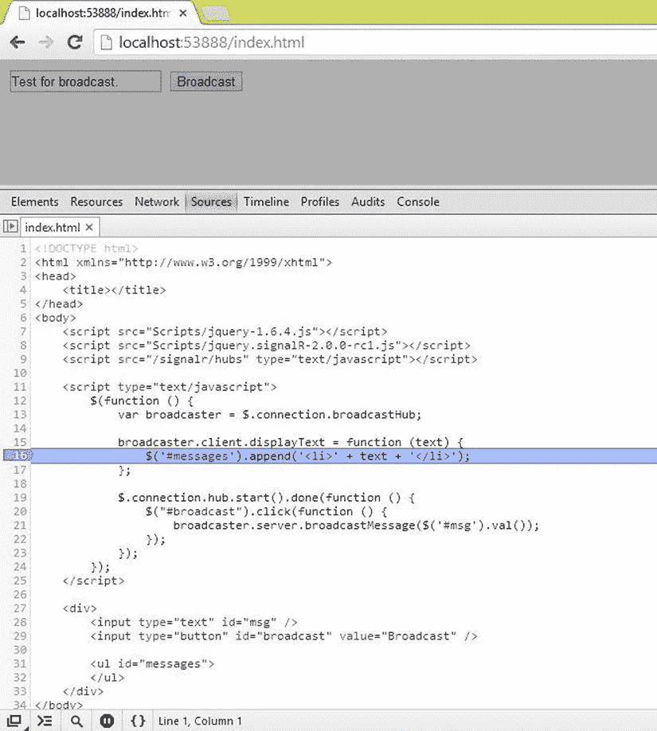

图 5-7。

Debugging variable values in Google Chrome Developers Tools

如图所示，很容易暂停和继续执行，向观察列表添加变量，并在 Google Chrome 开发者工具的右栏检查调用堆栈。

这组功能(以及更多可以通过阅读 [`https://developers.google.com/chrome-developer-tools`](https://developers.google.com/chrome-developer-tools) 的文档并遵循流程发现的功能)可用于对 ASP.NET SignalR 应用的 JavaScript 客户端代码的任何问题情况进行故障排除。如果使用其他客户端类型(如 iOS、Android 或 Windows 桌面)，类似的故障诊断功能可帮助您进行诊断。

除了调试功能之外，Google Chrome 开发者工具还提供了网络标签，允许我们在执行过程中检索关于客户端请求的资源的有用信息。(您将在下一节中了解如何调试客户端到服务器的通信。)图 [5-8](#Fig8) 显示了该选项卡的概述。

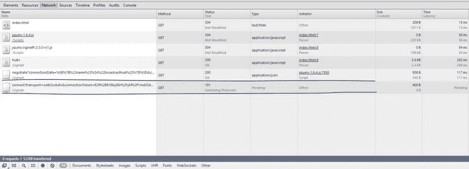

图 5-8。

Networks tab in Google Chrome Developer Tools

图中显示了客户端发出的所有网络请求(包括所有长轮询连接)。ASP.NET SignalR 库发出的请求被突出显示，并且有一个 initiator 列显示每个资源正在请求代码的哪一部分。还有一些关于检索资源所需时间的报告数字，以及帮助确定和诊断应用健康状况的 HTTP 状态代码。

## 使用 Fiddler 进行客户端到服务器的通信调试

任何服务器-客户端应用(包括 SignalR 应用)的另一个方面是客户端到服务器和服务器到客户端之间的通信，这是整个体系结构的一个非常关键的点(如果这个通信中枢坏了，一切都会失败)。

有几种工具和方法可用于调试和跟踪 ASP.NET SignalR的通信。一般来说，任何 HTTP 调试工具都可以在这方面帮助我们，但是大多数。NET 开发人员一致认为，微软(甚至非微软)社区中最流行的工具是 Fiddler ( [`http://fiddler2.com`](http://fiddler2.com/) )。

Fiddler 是 Eric Lawrence 在微软工作时作为宠物项目开发的。它被 Telerik 收购了，Eric 受雇致力于改进该工具的特性。Telerik Fiddler 多年来一直是开发人员非常方便的工具，它使您能够轻松地测试和跟踪机器上不同协议的通信请求。

尽管我们主要关注 Fiddler，但是还有许多其他工具可以实现相同的目标。所有的浏览器调试器(比如 Google Chrome 开发者工具)都为此提供了某种功能。Charles 是苹果社区类似工具的一个很好的例子。

让我们看看运行上一节中的示例并输入要广播的文本时 Fiddler 的输出(见图 [5-9](#Fig9) )。

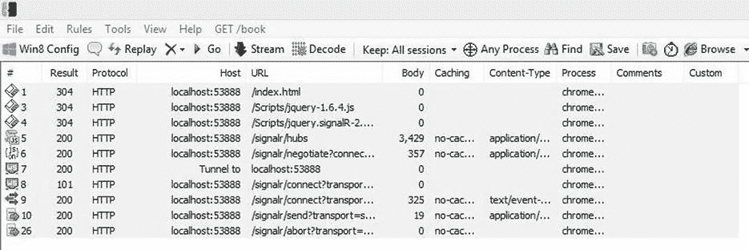

图 5-9。

Fiddler output for the example program

在左窗格中，您可以看到应用请求的资源列表，包括对静态 HTML 页面、jQuery 文件和动态 ASP.NET SignalR hub 代理库的请求。

在这些请求之后是协商调用，随后是连接、发送和中止步骤，这些步骤是 ASP.NET SignalR 工作所必需的(稍后讨论)。当我们关闭浏览器或离开页面并试图结束与服务器的连接时，就会出现中止步骤。

在这个页面上，您可以看到关于这些请求的信息，包括结果状态代码、使用的协议、主机名、URL、正文大小、内容类型和其他有价值的信息。右窗格显示了每个请求的详细信息。例如，图 [5-10](#Fig10) 所示的统计选项卡显示了其中一个连接步骤的详细信息。

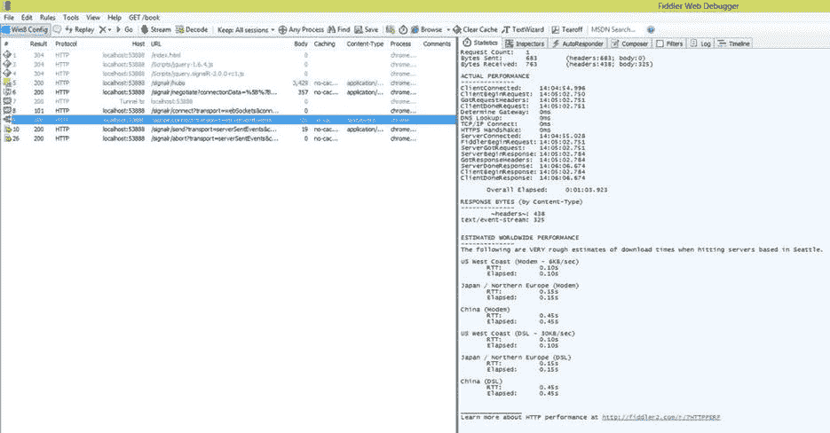

图 5-10。

Fiddler request details

详细信息窗格分为几个选项卡，根据每个请求所需的信息类型进行分类。其中一些选项卡被分成两个水平窗格，以便您查看更多详细信息。Statistics 选项卡提供了关于请求和响应的一般统计信息，例如所使用的协议、执行时间、大小等等。

对 ASP.NET SignalR 应用进行故障排除的最方便的选项卡是“检查器”选项卡，它使您能够以多种格式查看实际的请求和响应标题和数据。

图 [5-11](#Fig11) 显示了之前讨论的连接请求的请求和响应。

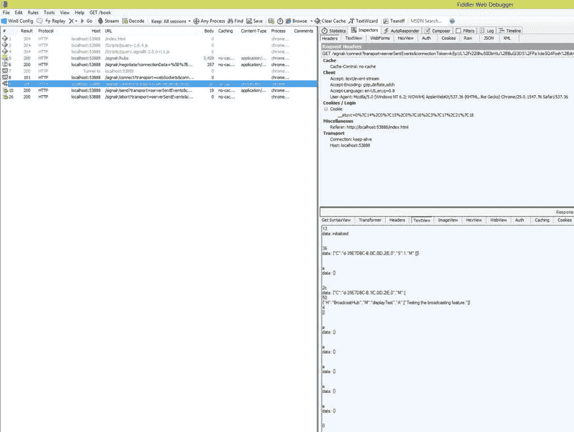

图 5-11。

Request and response details

这个面板有一些关于请求和响应的有价值的细节。这个数据中一个有趣的部分是用一个`GET`动词请求的 URL，它显示了请求的一些细节，比如使用的传输类型。查看服务器和客户端之间的实际通信数据对于找出通信失败的地方非常有帮助。

## 调试服务器端执行

ASP.NET SignalR 的服务器组件非常类似于典型的 ASP.NET 应用，在该应用中，您可以在 Visual Studio 中设置断点，并使用其他调试功能来测试程序执行。它可以与前面用于调试客户端 JavaScript 代码的方法结合使用，也可以用于客户端到服务器的通信。

Note

有关如何调试 ASP.NET 应用的更多信息，请参见 Matthew MacDonald 和 Adam Freeman(2010 年出版)的《C# 2010 版 Pro ASP.NET 4 》,或者任何有关 ASP.NET 或 C# 开发和调试的类似文章。

我们不想重复你已经知道的关于 Visual Studio 调试的内容，所以我们不做更详细的介绍。我们假设您已经熟悉 Visual Studio 中的调试功能和技术。

## 追踪特征

ASP.NET SignalR 的一个很棒的特性是能够跟踪服务器端的许多事情，以了解客户端到底发生了什么。正如在第 3 章的[中所讨论的，您可以通过在您的`Web.Config`文件中添加某些元素或者在 IIS 中编辑您的应用配置来启用 ASP.NET SignalR 中的追踪功能。](03.html)

这里我们讨论 ASP.NET SignalR 中的跟踪功能，因为它们有助于更容易地调试应用，尤其是通过查看每个客户端在服务器端发生的事情。清单 5-4 中的粗体代码是在 ASP.NET SignalR 应用的服务器上启用跟踪功能所需的全部代码。(尽管这段代码启用了全部跟踪功能，但通常并不需要所有的元素。)

清单 5-4。在 ASP.NET SignalR中启用跟踪

`<?xml version="1.0" encoding="utf-8"?>`

`<!--`

`For more information on how to configure your ASP.NET application, please visit`

[T2`http://go.microsoft.com/fwlink/?LinkId=169433`](http://go.microsoft.com/fwlink/?LinkId=169433)

`-->`

`<configuration>`

`<appSettings>`

`<add key="webpages:Version" value="2.0.0.0" />`

`<add key="webpages:Enabled" value="false" />`

`<add key="PreserveLoginUrl" value="true" />`

`<add key="ClientValidationEnabled" value="true" />`

`<add key="UnobtrusiveJavaScriptEnabled" value="true" />`

`</appSettings>`

`<system.web>`

`<httpRuntime targetFramework="4.5" />`

`<compilation debug="true" targetFramework="4.5" />`

`<pages>`

`<namespaces>`

`<add namespace="System.Web.Helpers" />`

`<add namespace="System.Web.Mvc" />`

`<add namespace="System.Web.Mvc.Ajax" />`

`<add namespace="System.Web.Mvc.Html" />`

`<add namespace="System.Web.Routing" />`

`<add namespace="System.Web.WebPages" />`

`</namespaces>`

`</pages>`

`</system.web>`

`<system.webServer>`

`<validation validateIntegratedModeConfiguration="false" />`

`<handlers>`

`<remove name="ExtensionlessUrlHandler-ISAPI-4.0_32bit" />`

`<remove name="ExtensionlessUrlHandler-ISAPI-4.0_64bit" />`

`<remove name="ExtensionlessUrlHandler-Integrated-4.0" />`

`<add name="ExtensionlessUrlHandler-ISAPI-4.0_32bit" path="*." verb="GET,HEAD,POST,DEBUG,PUT,DELETE,PATCH,OPTIONS" modules="IsapiModule" scriptProcessor="%windir%\Microsoft.NET\Framework\v4.0.30319\aspnet_isapi.dll" preCondition="classicMode,runtimeVersionv4.0,bitness32" responseBufferLimit="0" />`

`<add name="ExtensionlessUrlHandler-ISAPI-4.0_64bit" path="*." verb="GET,HEAD,POST,DEBUG,PUT,DELETE,PATCH,OPTIONS" modules="IsapiModule" scriptProcessor="%windir%\Microsoft.NET\Framework64\v4.0.30319\aspnet_isapi.dll" preCondition="classicMode,runtimeVersionv4.0,bitness64" responseBufferLimit="0" />`

`<add name="ExtensionlessUrlHandler-Integrated-4.0" path="*." verb="GET,HEAD,POST,DEBUG,PUT,DELETE,PATCH,OPTIONS" type="System.Web.Handlers.TransferRequestHandler"` `preCondition="integratedMode,runtimeVersionv4.0" />`

`</handlers>`

`</system.webServer>`

`<system.diagnostics>`

`<trace autoflush="true" indentsize="4">`

`<listeners>`

`<add name="default_traces" type="System.Diagnostics.TextWriterTraceListener" initializeData="default_traces.txt" />`

`</listeners>`

`</trace>`

`<switches>`

`<add name="SignalRSwitch" value="All" />`

`</switches>`

`<sources>`

`<source name="Application" switchValue="All">`

`<listeners>`

`<add name="traces" />`

`</listeners>`

`</source>`

`<source name="Microsoft.Owin.Host.SystemWeb" switchValue="All">`

`<listeners>`

`<add name="traces" />`

`</listeners>`

`</source>`

`<source name="SignalR.Connection">`

`<listeners>`

`<add name="traces" />`

`</listeners>`

`</source>`

`<source name="SignalR.PersistentConnection">`

`<listeners>`

`<add name="traces" />`

`</listeners>`

`</source>`

`<source name="SignalR.HubDispatcher">`

`<listeners>`

`<add name="traces" />`

`</listeners>`

`</source>`

`<source name="SignalR.Transports.WebSocketTransport">`

`<listeners>`

`<add name="traces" />`

`</listeners>`

`</source>`

`<source name="SignalR.Transports.ServerSentEventsTransport">`

`<listeners>`

`<add name="traces" />`

`</listeners>`

`</source>`

`<source name="SignalR.Transports.ForeverFrameTransport">`

`<listeners>`

`<add name="traces" />`

`</listeners>`

`</source>`

`<source name="SignalR.Transports.LongPollingTransport">`

`<listeners>`

`<add name="traces" />`

`</listeners>`

`</source>`

`</sources>`

`<sharedListeners>`

`<add name="traces" type="System.Diagnostics.TextWriterTraceListener" initializeData="server_traces.txt" />`

`</sharedListeners>`

`</system.diagnostics>`

`</configuration>`

这段代码由一些开关、侦听器和源组成，帮助您跟踪应用中不同的信息源。这些是中的一些概念。NET 框架的诊断功能。如果你不熟悉它们，看看 MSDN 的文档和其他在线资源，了解它们是做什么的。

ASP.NET SignalR 已经默认实现了这些资源，并为开发人员简化了流程，使跟踪能够诊断应用问题。

以下是不同来源的简要列表，其名称不言自明:

*   `Application`
*   `Microsoft.Owin.Host.SystemWeb`
*   `SignalR.Connection`
*   `SignalR.PersistentConnection`
*   `SignalR.HubDispatcher`
*   `SignalR.Transports.WebSocketTransport`
*   `SignalR.Transports.ServerSentEventsTransport`
*   `SignalR.Transports.ForeverFrameTransport`
*   `SignalR.Transports.LongPollingTransport`

图 [5-12](#Fig12) 显示了当我们在两个浏览器上运行我们的例子来广播消息时的输出。

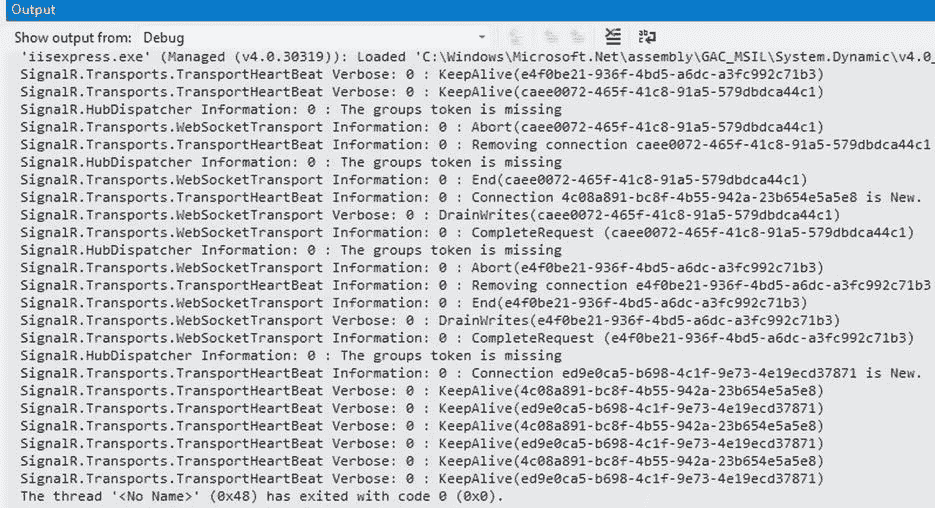

图 5-12。

Tracing output

如图所示，从两个不同的浏览器建立了两个连接，之前的连接被丢弃。在每个跟踪行的左侧，您可以看到生成输出的源的名称。

如果客户端的请求到达服务器但未能得到处理，并且您无法使用调试功能找到任何适当的异常，那么好消息是这样的异常应该在输出窗口中显示详细信息。

## 摘要

本章讨论了调试和跟踪 ASP.NET SignalR应用的重要主题。这些是开发任何 SignalR 应用的基本步骤，由于 ASP.NET SignalR 的服务器-客户端性质，这些步骤可能会很复杂。

我们讨论了使用浏览器工具，尤其是 Google Chrome 开发者工具对应用进行客户端 JavaScript 调试；然后讨论了使用 HTTP 调试工具(特别是 Telerik Fiddler)调试客户机和服务器之间的通信桥。接下来是关于调试应用的服务器端执行的简短讨论。

您看到了 ASP.NET SignalR 中跟踪服务器端执行的有用特性，本章最后讨论了与 ASP.NET SignalR 捆绑在一起的用于监控其性能的自定义性能计数器。

讨论了一些用于调试和跟踪的通用原则、工具和技术，需要注意的是，这些任务会因环境的不同而有很大差异。根据你的情况，你必须运用你的经验、技能和这些原则来采取适当的行动。