# 六、支持 SignalR 的客户端概述

本章讨论了 SignalR 中支持的客户端以及分隔各个客户端的详细信息。首先，我们展示了客户端的配置，以及如何针对您的应用进行调整。下一节将展示客户端和服务器之间发生的通信，随后是会影响客户端连接的连接生存期事件。最后，我们查看一个示例服务器和单个客户机，详细了解客户机的不同之处。

为了让您更好地理解客户端，我们讨论了受支持的客户端以及它们与服务器的交互。这些客户端在配置、通信和连接生存期事件方面都非常相似。为了演示与服务器的交互，我们提供了一个示例服务器代码，它可以用于特定类型的持久连接或HUB的所有客户机。

## SignalR 支持的客户端

要了解 SignalR 支持哪些客户端，最好定义支持的含义。在本章中，我们将受支持的客户端定义为客户端二进制文件，它们被编译为与。NET 框架或现代网络浏览器中。使用这些受支持的二进制文件，可以使用以下客户端:

*   Java Script 语言
*   基本的。NET 4.0+应用(如 Win 窗体、WPF 和控制台应用)
*   银光 5
*   视窗商店
*   Windows Phone 8

也有不支持的原生客户端，如 iPhone 和 Android，需要原生 SDK 或第三方工具(在第 7 章的[中讨论)。](07.html)

### 客户端配置

为了最大限度地利用客户端，可以为持久连接和HUB定制连接和传输。对连接的配置更改全部完成。可在连接上配置的选项有查询字符串参数、HTTP 头、cookies、证书和传输。所有配置选项都必须在连接开始前配置好。这些配置更改适用于每个请求。

#### 为请求设置查询字符串值

所有 SignalR 客户端都允许添加额外的查询字符串参数，这些额外的查询字符串参数将被附加到发送到服务器的每个通信请求中。将查询字符串值添加到连接的 JavaScript 示例如清单 6-1 所示，其中添加了值为`V1`的`ABTest`键。

清单 6-1。设置查询字符串参数的 JavaScript 客户端配置

`var connection = $.hubConnection();`

`connection.qs = {'ABTest' : 'V1'};`

另一个添加查询字符串参数的. NET 客户端的例子如清单 6-2 所示。

清单 6-2。设置查询字符串参数的另一个 SignalR 客户端配置

`Dictionary<string, string> queryString = new Dictionary<string, string>();`

`queryString["ABTest"] = "V1";`

`var connection = new Microsoft.AspNet.SignalR.Client.HubConnection("http://localhost", queryString);`

对于 JavaScript 客户端，查询字符串参数在连接的`qs`属性中设置。在其他 SignalR 客户端中，查询字符串参数在连接构造函数中设置。

#### 添加 HTTP 头

除了 JavaScript 客户机之外，所有客户机都支持添加 HTTP 头，这些头被添加到连接对象中。在清单 6-3 中，一个名为`X-SpecialHeader`的头被添加到请求头集合中，其值为`MyValue`。像查询字符串参数一样，每个发送到服务器的请求都会传递消息头。

清单 6-3。向连接添加 HTTP 头

`var connection = new Microsoft.AspNet.SignalR.Client.HubConnection("http://localhost");`

#### 连接。Headers.Add("X-SpecialHeader "，" my value ")；向请求添加 Cookies

所有客户端都支持 Cookies。对于 JavaScript 客户端，使用标准 JavaScript 函数添加 cookies。对于其他客户端，cookies 被添加到连接的`CookieContainer`属性的`CookieContainer`中。

清单 6-4 所示的例子向连接添加了一个新的`CookieContainer`。接下来，一个新的`cookie`被添加到`CookieContainer`中，其名称、值、路径和域在构造函数中指定。与头和查询字符串参数一样，每次请求时都会发送 cookies。

清单 6-4。设置 Cookies 的示例。网络客户端

`var connection = new Microsoft.AspNet.SignalR.Client.HubConnection("http://localhost");`

`connection.CookieContainer = new System.Net.CookieContainer();`

#### 连接。CookieContainer.Add(新系统。Net.Cookie("TestCookie "，" CookieValue "，" localhost "))；设置客户端证书

SignalR 使您能够配置客户端证书以连接到安全的服务器。JavaScript 和 Silverlight 5 客户端的证书配置由托管站点的 web 浏览器完成。对于其他客户端，它是通过调用`AddClientCertificate`方法在连接上配置的。

清单 6-5 显示了一个类型为`X509Certificate2`的新证书，它是从一个名为`Certificate.cer`的文件中创建的，并使用`AddClientCertificate`方法添加到连接中。

清单 6-5。将客户端证书添加到 SignalR 连接

`var connection = new Microsoft.AspNet.SignalR.Client.HubConnection("http://localhost");`

`connection.AddClientCertificate(new System.Security.Cryptography.X509Certificates.X509Certificate2("Certificate.cer"));`

Note

`X509Certificate2`类被添加到。NET 2.0+框架为`X509Certificate`类提供扩展功能。

#### 定制传输

SignalR 提供了为您的连接选择优先级和传输类型的功能。JavaScript 客户机配置不同于所有其他客户机。如果您已经确定了最适合您的应用的传输，则可以使用此配置选项。它还可以用来限制您的应用只使用应用能够充分支持的某些传输。如果无法成功协商传输，则会引发错误，连接会失败。

JavaScript 客户端允许四种类型的传输:`webSockets`、`foreverFrame`、`serverSendEvents`和`longPolling`。默认情况下，连接会尝试查找客户端和服务器都支持的第一种传输。通过将支持的传输传递给连接的`Start`方法，可以覆盖这个传输列表。该覆盖支持单一传输，如清单 6-6 所示。

清单 6-6。单一传输的 JavaScript 客户端配置

`var connection = $.hubConnection();`

`//excluded connection logic`

`connection.start({ transport: 'webSockets' });`

该覆盖还支持一系列传输，如清单 6-7 所示。

清单 6-7。支持故障转移的多传输的 JavaScript 客户端配置

`var connection = $.hubConnection();`

`//excluded connection logic`

`connection.start({ transport: ['webSockets','foreverFrame'] });`

其他 SignalR 客户端不支持`foreverFrame`传输，但是支持`AutoTransport`传输。如果没有配置传输，默认为`AutoTransport`传输。`AutoTransport`尝试从可用的交通工具中协商出最佳的交通工具。该配置只允许在连接的`Start`方法中指定一个传输。如果客户端不支持。NET 4.5 中，`webSockets`传输是不可用的，即使服务器可以支持 web 套接字。清单 6-8 是如何使用`WebSocketTransport`启动一个连接的例子，该连接只使用 web 套接字。

清单 6-8。。仅 Web 套接字传输连接的. NET 4.5 配置

`var connection = new Microsoft.AspNet.SignalR.Client.HubConnection("http://localhost");`

`//excluded connection logic`

`await connection.Start(new Microsoft.AspNet.SignalR.Client.Transports.WebSocketTransport());`

虽然传输通常不需要配置，但是它们有局限性。要用不同的传输或连接逻辑配置客户端，需要一个自定义类。这些类型的定制将在第 7 章中介绍。

### 客户端和服务器通信

一旦连接了持久连接或HUB，客户机和服务器之间的通信就通过特定于连接的方法或代理生成的方法进行。持久连接通信是通过一个`Send`方法和一个`Receive`事件实现的。HUB通信是通过调用服务器或客户机上的方法的代理方法进行的。

#### 持续连接通信

持久连接提供了一种相对简单的通信格式。为了向服务器发送信息，客户机在连接上调用`Send`方法。为了从服务器接收数据，客户端订阅了`Receive`事件。(发送和订阅各种客户端的示例在本章后面的相应客户端部分中提供。)

#### 中心客户端调用的服务器方法

客户端可以调用从`Hub`类派生的类中定义的服务器方法。一旦在服务器上定义了一个方法，客户端通过调用`HubProxy`上的`invoke`方法来调用该方法。`invoke`方法需要方法名，并且可以向该方法发送零个或多个参数。每个客户端在各自的客户端部分都有一个示例。

#### 服务器调用的中心客户端方法

服务器可以通过调用由`HubContext`公开的动态方法和订阅`HubProxy`中事件的客户端来调用客户端上的方法。可以用零个或多个参数调用该方法。每个客户端处理这些事件的方式略有不同，因此在相应的客户端部分提供了示例。

#### 客户端日志记录

在 SignalR 应用开发过程中，事情并不总是像预期的那样工作。所有客户端都支持某种形式的客户端日志记录，以提供仅在非生产环境中使用的诊断信息。对于 JavaScript 客户端，该日志记录是针对 web 浏览器控制台的。其他客户端通过`TraceWriter`登录。

通过将连接上的`logging`属性设置为`true`来启用 JavaScript 客户端日志记录，如清单 6-9 所示。然后，可以在 web 浏览器控制台中看到跟踪输出。

清单 6-9。在 JavaScript 客户端中设置日志记录的示例

`var connection = $.hubConnection();`

`connection.logging = true;`

。NET 客户端在跟踪日志记录方面有更多的选择。有多个级别的跟踪:`All`、`Events`、`Messages`、`None`和`StateChanges`。甚至跟踪的输出位置也是可配置的。

在清单 6-10 中，我们将客户端的跟踪级别设置为`All`，这是所有可跟踪的事件。接下来，日志记录的输出被设置为控制台窗口输出。

清单 6-10。设置日志记录 in.NET 客户端的示例

`var connection = new Microsoft.AspNet.SignalR.Client.HubConnection("http://localhost");`

`connection.TraceLevel = Microsoft.AspNet.SignalR.Client.TraceLevels.All;`

### 连接。TraceWriter =控制台。出；连接生存期事件

影响连接状态的事件期间会引发连接生存期事件。客户端可以引发八个可能的事件；两个特定于 JavaScript 客户端，一个特定于其他客户端，其余的事件由所有客户端引发。

在 JavaScript 客户端中专门引发了`Starting`和`Disconnected`事件。一旦协商成功，就会引发`Starting`事件，当连接断开时，就会引发`Disconnected`事件。

特定于其他客户端的事件是`Closed`事件。该事件与`Disconnected`事件同义，在连接断开时引发。

其余事件由所有客户端引发:`Received`、`ConnectionSlow`、`Reconnecting`、`Reconnected`和`StateChanged`。当从服务器接收到数据时，引发`Received`事件。如果自接收到最后一个保活SignalR以来，在三分之二的连接超时时间内没有来自服务器的保活SignalR，则引发`ConnectionSlow`事件。当连接试图重新连接到服务器时，会引发`Reconnecting`事件。下一个事件是`Reconnected`，它发生在连接成功重新连接之后。最后一个事件是`StateChanged`，当连接改变状态时发生。

### 客户端的服务器示例

本章后面的客户端示例提供了持久连接和中心服务器示例。这些示例服务器应该适用于相应类型的所有客户机。

#### 持久连接服务器示例

我们现在重用第 2 章中的持久连接服务器示例。这是一个简要的概述，所以如果需要更多的细节，请重新查看[第 2 章](02.html)。

Run the following command in the package explorer window to install the necessary SignalR files: `Install-Package Microsoft.AspNet.SignalR`.   Open the `Startup.cs` file that was added by the `NuGet` command.   Add the code in Listing 6-11 to the `Startup` class in the `Configuration` method to register the `PersistentConnection`.  

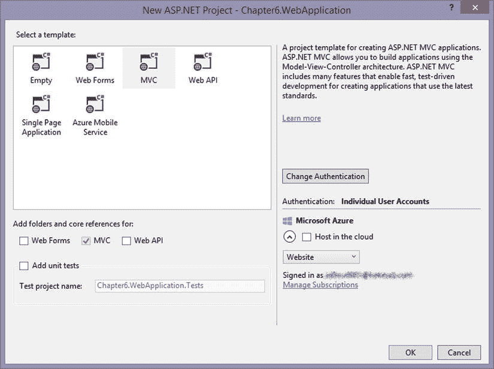

图 6-2。

New ASP.NET Project dialog box Choose the MVC template, as shown in Figure [6-2](#Fig2).  

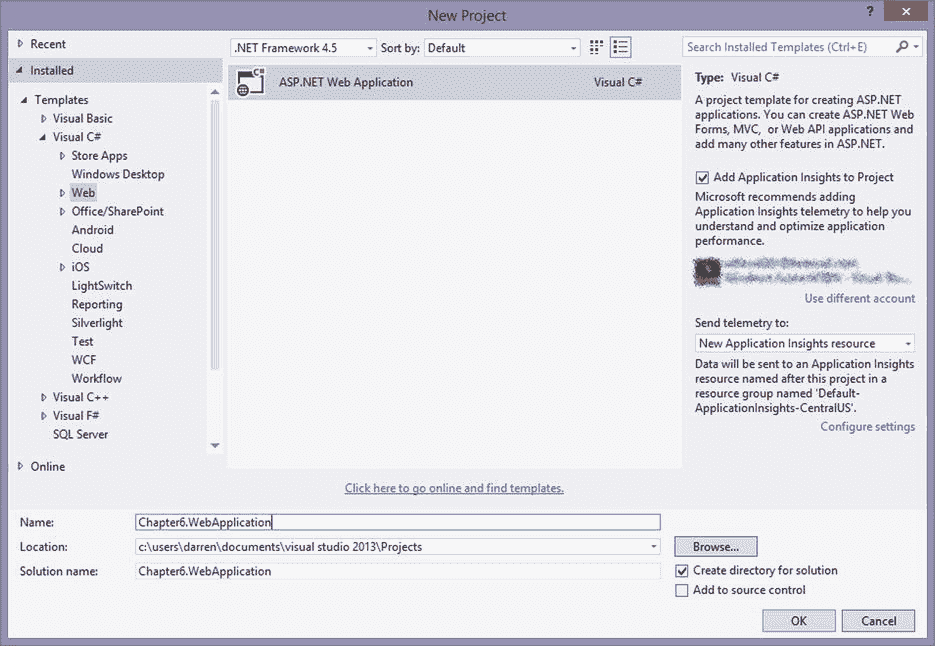

图 6-1。

Web application selection window Create a new ASP.NET web application, as shown in Figure [6-1](#Fig1).  

清单 6-11。。在配置代码中注册

`app.MapSignalR<SamplePersistentConnection>("/SamplePC");`

Create a `PersistentConnections` folder.   Add a new class to the `PersistentConnections` folder called `SamplePersistentConnection`.   Update the class to look like Listing 6-12.  

清单 6-12。。NET C# PersistentConnection 示例代码

`public class SamplePersistentConnection : PersistentConnection`

`{`

`protected override System.Threading.Tasks.Task OnReceived(IRequest request, string connectionId, string data)`

`{`

`return Connection.Broadcast(data);`

`}`

`}`

Add `Microsoft.AspNet.SignalR;` to the class so that the `Broadcast` extension method is available.  

我们现在有了一个运行中的持久连接示例服务器，它可以与本章中的所有持久连接客户端示例一起工作。

#### 中心服务器示例

在本节中，我们将创建一个服务器，它具有可供所有HUB客户端访问的HUB端点。完成以下步骤后，我们将拥有一个带有 hub 端点的工作服务器。

Create a new ASP.NET web application (refer to Figure [6-1](#Fig1)).   Choose the MVC template (refer to Figure [6-2](#Fig2)).   Run the following command in the package explorer window to install the necessary SignalR files: `Install-Package Microsoft.AspNet.SignalR`.   Open the `Startup.cs` file that was added by the `NuGet` command.   Add `app.MapSignalR();` to the class, as shown in Listing 6-13.  

清单 6-13。配置 SignalR 服务器的启动类

`[assembly: OwinStartupAttribute(typeof(Chapter6.HubServer.Startup))]`

`namespace Chapter6.HubServer`

`{`

`public partial class Startup`

`{`

`public void Configuration(IAppBuilder app)`

`{`

`ConfigureAuth(app);`

`app.MapSignalR();`

`}`

`}`

`}`

Create a new folder for the hubs.   Create the three classes listed in Listing 6-14.  

清单 6-14。创建中心服务器示例需要三个类

`public class AuctionHub : Microsoft.AspNet.SignalR.Hub`

`{`

`public AuctionHub()`

`{`

`BidManager.Start();`

`}`

`public override System.Threading.Tasks.Task OnConnected()`

`{`

`Clients.Caller.CloseBid();`

`Clients.All.UpdateBid(BidManager.CurrentBid);`

`return base.OnConnected();`

`}`

`public void MakeCurrentBid()`

`{`

`BidManager.CurrentBid.BidPrice += 1;`

`BidManager.CurrentBid.ConnectionId = this.Context.ConnectionId;`

`Clients.All.UpdateBid(BidManager.CurrentBid);`

`}`

`public void MakeBid(double bid)`

`{`

`if (bid < BidManager.CurrentBid.BidPrice)`

`{`

`return;`

`}`

`BidManager.CurrentBid.BidPrice = bid;`

`BidManager.CurrentBid.ConnectionId = this.Context.ConnectionId;`

`Clients.All.UpdateBid(BidManager.CurrentBid);`

`}`

`}`

`public static class BidManager`

`{`

`static System.Threading.Timer _timer = new System.Threading.Timer(BidInterval, null, 0, 2000);`

`public static Bid CurrentBid { get; set; }`

`public static void Start()`

`{`

`//Empty class to make sure Static class is started`

`}`

`static void BidInterval(object o)`

`{`

`var clients = Microsoft.AspNet.SignalR.GlobalHost.ConnectionManager.GetHubContext<AuctionHub>().Clients;`

`if (BidManager.CurrentBid == null || BidManager.CurrentBid.TimeLeft <= 0)`

`{`

`BidManager.SetBid();`

`}`

`BidManager.CurrentBid.TimeLeft -= 2;`

`if (BidManager.CurrentBid.TimeLeft <= 0)`

`{`

`clients.AllExcept(CurrentBid.ConnectionId).CloseBid();`

`if (!string.IsNullOrWhiteSpace(CurrentBid.ConnectionId))`

`clients.Client(CurrentBid.ConnectionId).``CloseBidWin`T2】

`}`

`clients.All.UpdateBid(BidManager.CurrentBid);`

`}`

`static List<Bid> _items = new List<Bid>(){`

`new Bid(){Name="Bike", Description="10 Speed", TimeLeft = 30, BidPrice = 120.0},`

`new Bid(){Name="Car", Description="Sports Car", TimeLeft = 30, BidPrice = 1500.0},`

`new Bid(){Name="TV", Description="Big screen TV", TimeLeft = 30, BidPrice = 330.0},`

`new Bid(){Name="Boat", Description="Party Boat", TimeLeft = 30, BidPrice = 1200.0}`

`};`

`public static void SetBid()`

`{`

`Random rnd = new Random();`

`CurrentBid = (Bid)_items[rnd.Next(0, _items.Count - 1)].Clone();`

`}`

`}`

`public class Bid`

`{`

`public Bid Clone()`

`{`

`return (Bid)MemberwiseClone();`

`}`

`public string Name { get; set; }`

`public string Description { get; set; }`

`public double BidPrice { get; set; }`

`public int TimeLeft { get; set; }`

`public string ConnectionId { get; set; }`

`}`

完成这些步骤后，我们现在有了一个功能完整的服务器，它有一个 hub 端点，可以公开基本的 hub 功能。这个示例服务器有`MakeCurrentBid`和`MakeBid`服务器方法，它们分别接受零个和一个参数。服务器还被连接来调用客户机上的`CloseBid`、`CloseBidWin`和`UpdateBid`客户机方法，这些方法分别接受零个、一个简单类型参数和一个复杂类型参数。

Note

为了让 Silverlight 示例工作，服务器上需要一个包含清单 6-15 内容的`crossdomain.xml`文件。

清单 6-15。crossdomain.xml 文件的内容

`<?xml version="1.0" ?>`

`<cross-domain-policy>`

`<allow-access-from domain="*" />`

`</cross-domain-policy>`

既然我们已经创建了处理持久连接和HUB请求的服务器，我们就可以创建使用它们的客户机了。

## HTML 和 JavaScript 客户端

SignalR 使用 JQuery 为 JavaScript 客户端提供支持，为 web 浏览器提供持久连接和 hub 客户端。这些客户端的功能与 SignalR 提供的其他客户端类型略有不同。本节讨论如何设置 JavaScript 客户机示例。

### 持久连接客户端

本节中的持久连接示例展示了一个简单的聊天应用。它连接到本章前面创建的持久连接服务器示例。

#### JavaScript 持久连接示例

要创建这个示例，最简单的方法是使用持久连接服务器示例作为基础进行演示。因此，我们在该示例中完成了以下步骤:

Add a new HTML page to the root of the project.   Update the head section to reflect Listing 6-16.  

清单 6-16。Javascript 示例客户端脚本代码

``

``

``

Update the version numbers of the `JQuery` and `JQuery.SignalR` scripts to the appropriate version that is in the `Scripts` folder.   Update `####` in the connection to the port in which the example server is running.   Update the HTML section to reflect Listing 6-17.  

清单 6-17。Javascript 示例客户端 HTML

`<ul id="messages" style="border: 1px solid black; height: 250px; width: 450px; overflow:scroll; list-style:none;"></ul>`

`<label>Name: </label>`

`<input id="name" value="User A" />`

`<label>Message: </label>`

`<input id="message" />`

`<button id="btnSend">Send</button>`

一旦我们启动服务器并导航到我们在多个选项卡或浏览器中创建的 HTML 页面，我们就可以使用持久连接测试通信(参见图 [6-3](#Fig3) )。

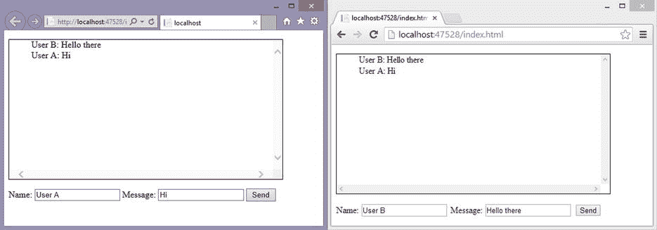

图 6-3。

Communication between two JavaScript clients over a persistent connection

下一步是创建 JavaScript hub 客户端示例。

### HUB客户端

在这一节中，我们来看一个设置基于 JavaScript 的 hub 客户端的例子。此示例使用本章前面的中心服务器示例来演示拍卖。

#### 客户端调用的服务器方法

从 JavaScript 客户端调用的服务器方法可以包含零个或多个参数。清单 6-18 和 6-19 显示了用零个或多个参数调用`invoke`方法的语法。

清单 6-18。调用不带参数的服务器方法的 JavaScript 示例

`var hubProxy = connection.createHubProxy('SampleHub');`

`hubProxy.invoke('SampleMethod');`

清单 6-19。使用多个参数和复杂类型调用服务器方法的 JavaScript 示例

`var hubProxy = connection.createHubProxy('SampleHub');`

`var complexType = {Name: 'Sam', Age: 23};`

`hubProxy.``invoke`T2】

#### 服务器调用的客户端方法

服务器还可以通过订阅`HubProxy`上事件的 JavaScript 客户机“调用”客户机上的方法。清单 6-20 和 6-21 显示了用零个或多个参数调用`on`方法。

清单 6-20。从服务器调用不带参数的客户端方法的 JavaScript 示例

`var hubProxy = connection.createHubProxy('SampleHub');`

`hubProxy.on('ClientMethod',`

`function () {`

`//perform some action on the client`

`});`

清单 6-21。使用多个参数从服务器调用客户端方法的 JavaScript 示例

`var hubProxy = connection.createHubProxy('SampleHub');`

`hubProxy.on('ClientMethod',`

`function (param, anotherParam) {`

`//perform some action on the client`

`//param and anotherParam would be the two parameters passed in from the server`

`});`

现在您已经知道了在服务器和客户机上调用方法的语法，您可以在下一个例子中看到它们的使用。

#### JavaScript Hub 示例

此示例使用中心服务器示例创建了一个拍卖客户端，以演示从服务器到客户端的调用，反之亦然。此示例可以很容易地添加到服务器示例中，以通过以下步骤展示功能:

Add a new HTML page to the root of the project.   Update the head section to reflect Listing 6-22.  

清单 6-22。Javascript 示例客户端脚本代码

``

``

``

``

Update the version numbers of the `JQuery` and `JQuery.SignalR` scripts to the appropriate version in the `Scripts` folder.   Update the HTML section to reflect Listing 6-23.  

清单 6-23。Javascript 示例客户端 HTML

`<label id="lblName"></label>`

`<label id="lblBid"></label> `

`<label id="lblDescr"></label> &nbsp;`

`<label>Time Left:</label>`

`<label id="lblTime"></label> `

`<button id="btnCurrentBid">Current Bid</button>`

`<button id="btnMakeBid">Make Bid</button>`

`<input type="text" id="txtBid" />`

`<ul id="lstWins" style="list-style: none;"></ul>`

现在，当我们使用浏览器并进入索引页面时，我们就有了一个拍卖客户端(见图 [6-4](#Fig4) )。

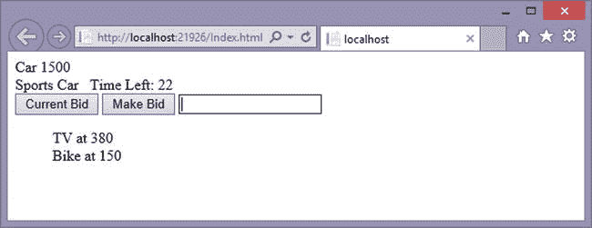

图 6-4。

Hub client example after two successful bid wins

其他客户端非常相似，但是有一些小的差异，我们将通过示例展示这些差异——从基本客户端开始。NET 客户端。

## 。网络客户端

。NET 客户端是核心。NET 4.0+客户端，如 WPF、Win 窗体和控制台应用。因为 Silverlight、Windows 应用商店和 Windows Phone 8 客户端在。NET 功能，它们将在后面自己的章节中描述。

### 持久连接客户端

持久连接客户端相当简单，因此我们将一个简单聊天室的持久连接示例重新创建为一个 Win Forms 应用。

#### 。NET 持久连接示例

因为。NET SignalR Win 窗体客户端，您可以使用。NET 4.0 或 4.5 框架。要创建客户端示例，应该采取以下步骤:

Update the form code to look like Listing 6-24.  

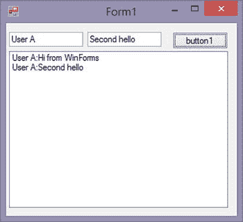

图 6-6。

Example of Win Forms persistent connection chat application Run the following command in the package explorer window: `Install-Package Microsoft.AspNet.SignalR.Client`.   Add a couple of text boxes, a button, and a list box to the form to look like Figure [6-6](#Fig6).  

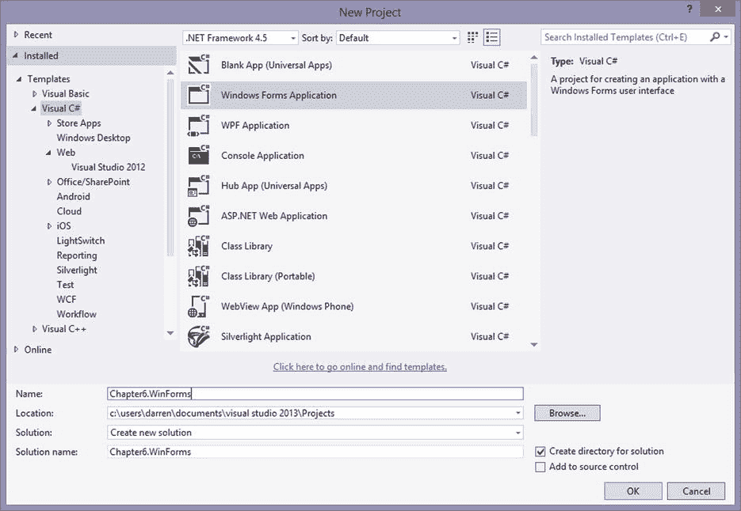

图 6-5。

Win Forms application selection menu Create a new Windows Forms project (see Figure [6-5](#Fig5)).  

清单 6-24。。NET C# Win 窗体SignalR器客户端代码

`public partial class Form1` `: Form`

`{`

`Microsoft` `.AspNet.SignalR.Client.Connection myConnection = new Microsoft.AspNet.SignalR.Client.Connection("http://localhost:####/SamplePC/");`

`public Form1()`

`{`

`InitializeComponent();`

`button1.Click += button1_Click;`

`myConnection.Received += myConnection_Received;`

`myConnection.Start();`

`}`

`private void button1_Click(object sender, EventArgs e)`

`{`

`myConnection.Send(textBox1.Text + ":" + textBox2.Text);`

`}`

`void myConnection_Received(string obj)`

`{`

`listBox1.Invoke(new Action(() => listBox1.Items.Add(obj)) );`

`}`

`}`

Update the `####` in the connection to the correct port of your server application.  

因为我们已经完成了持久连接示例，所以下一个示例是 Win Forms hub 示例。

### HUB客户端

在本节中，我们将使用 Win 表单创建一个中心客户端。为了显示客户端的不同，我们使用了前面客户端部分中的相同示例，但是是在当前客户端的上下文中。

#### 客户端调用的服务器方法

从 Win Forms 客户端调用的服务器方法可以包含零个或多个参数。清单 6-25 和 6-26 给出了例子。

清单 6-25。Win 窗体调用不带参数的服务器方法的例子

`Var auctionProxy = hubConnection.CreateHubProxy("AuctionHub");`

`auctionProxy.Invoke("SampleMethod");`

清单 6-26。Win Forms 调用具有多个参数和复杂类型的服务器方法的示例，返回值为 bool

`Var auctionProxy = hubConnection.CreateHubProxy("AuctionHub");`

`int age = 25;`

`var profile = new Profile("Handle", "Password");`

`auctionProxy.Invoke<bool>("SampleMethod", profile, age);`

发起调用的是`Invoke`方法。列出的第一个参数是要在服务器上调用的函数的名称。下一个参数是一个`params`，它可以接受 0 个或多个对象作为输入参数。这些输入参数被提供给 invoke 调用的第一个参数中指定的函数。如果服务器方法返回由`Invoke`函数的通用定义定义的值类型。

#### 服务器调用的客户端方法

服务器可以通过 Win Forms 客户机订阅`HubProxy`上的事件来“调用”客户机方法。可以用零参数调用`HubProxy`，如清单 6-27 所示；和一个或多个参数，如清单 6-28 所示。

清单 6-27。Win Forms 从服务器不带参数调用客户端方法的示例

`void Setup(){`

`var auctionProxy = _hubConnection.CreateHubProxy("AuctionHub");`

`auctionProxy.Subscribe("SampleMethodName").Received += SampleMethod;`

`}`

`void SampleMethod (IList<Newtonsoft.Json.Linq.JToken> obj) {`

`//Invoke delegate on UI thread with no parameters from the server`

`this.Invoke(sampleDelegate);`

`}`

清单 6-28。Win Forms 使用多个参数从服务器调用客户端方法的示例

`void Setup(){`

`var auctionProxy = _hubConnection.CreateHubProxy("AuctionHub");`

`auctionProxy.Subscribe("SampleMethodName").Received += SampleMethod;`

`}`

`void SampleMethod (IList<Newtonsoft.Json.Linq.JToken> obj) {`

`//Invoke delegate on UI thread with the first parameter from the server`

`this.Invoke(sampleDelegate, obj[0]);`

`}`

客户端使用指定的事件名称订阅`Received`事件。当引发这些事件时，它们来自 UI 线程以外的线程，因此必须使用委托来更新其他线程。在这些示例中，委托用于更新 UI 线程。如果服务器有参数要传入，它们包含在`IList<JToken>`对象中，可以通过它们的索引位置来访问。在下一节中，您将看到这些方法的实际应用。

#### 。网络HUB示例

这是一个 Win Forms 客户机作为拍卖客户机连接到中心服务器的例子。

Update the form code to look like Listing 6-29.  

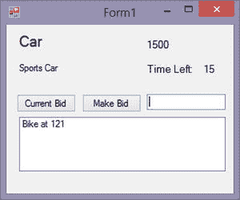

图 6-7。

Final output of example hub application Create a new Windows Form project (refer to Figure [6-5](#Fig5)).   Run the following command in the package explorer window: `Install-Package Microsoft.AspNet.SignalR.Client`.   Add a couple of buttons named `btnCurrentBid` and `btnMakeBid` showing `Current Bid` and `Make Bid`, respectively.   Add a text box named `txtBid`.   Add a list box named `lstWins`.   Add four labels named `lblName`, `lblDescr`, `lblBid`, and `lblTime` showing `Name`, `Description`, `Bid`, and `Time`, respectively.   The arrangement of these items can be made to look like Figure [6-7](#Fig7).  

清单 6-29。HUB示例的 Win Forms 代码

`public partial class frmAuctionClient : Form`

`{`

`public Microsoft.AspNet.SignalR.Client.HubConnection _hubConnection;`

`public Microsoft.AspNet.SignalR.Client.IHubProxy _auctionProxy;`

`delegate void UpdateBid(dynamic bid, int formObject);`

`delegate void UpdateButtons(bool enabled);`

`UpdateBid _updateDelegate;`

`UpdateButtons _updateButtonsDelegate;`

`public frmAuctionClient()`

`{`

`InitializeComponent();`

`SetupHub();`

`}`

`private async void SetupHub()`

`{`

`_updateDelegate = new UpdateBid(UpdateBidMethod);`

`_updateButtonsDelegate = new UpdateButtons(UpdateButtonsMethod);`

`_hubConnection = new Microsoft.AspNet.SignalR.Client.HubConnection("http://localhost:####");`

`_auctionProxy = _hubConnection.CreateHubProxy("AuctionHub");`

`_auctionProxy.Subscribe("UpdateBid").Received += UpdateBid_auctionProxy;`

`_auctionProxy.Subscribe("CloseBid").Received += CloseBid_auctionProxy;`

`_auctionProxy.Subscribe("CloseBidWin").Received +=``CloseBidWin`T2】

`await _hubConnection.Start();`

`}`

`void UpdateBidMethod(dynamic bid, int formObject)`

`{`

`if (bid != null)`

`{`

`lblName.Text = bid.Name;`

`lblDescr.Text = bid.Description;`

`lblBid.Text = bid.BidPrice;`

`lblTime.Text = bid.TimeLeft;`

`if(formObject > 0)`

`{`

`lstWins.Items.Add(bid.Name + " at " + bid.BidPrice);`

`}`

`}`

`}`

`void UpdateButtonsMethod(bool enabled)`

`{`

`btnCurrentBid.Enabled = enabled;`

`btnMakeBid.Enabled = enabled;`

`}`

`void UpdateBid_auctionProxy(IList<Newtonsoft.Json.Linq.JToken> obj)`

`{`

`this.Invoke(_updateDelegate, obj[0],0);`

`this.Invoke(_updateButtonsDelegate, true);`

`}`

`void CloseBid_auctionProxy(IList<Newtonsoft.Json.Linq.JToken> obj)`

`{`

`this.Invoke(_updateButtonsDelegate, false);`

`}`

`void CloseBidWin_auctionProxy(IList<Newtonsoft.Json.Linq.JToken> obj)`

`{`

`this.Invoke(_updateButtonsDelegate, false);`

`this.Invoke(_updateDelegate, obj[0], 1);`

`}`

`private` `void btnCurrentBid_Click(object sender, EventArgs e)`

`{`

`_auctionProxy.Invoke("MakeCurrentBid");`

`}`

`private void btnMakeBid_Click(object sender, EventArgs e)`

`{`

`_auctionProxy.Invoke<string>("MakeBid", txtBid.Text);`

`}`

`}`

Update the `####` in the connection to the correct port of your server application  

尽管这些例子简单明了，但它们需要的细节取决于正在实现的客户端。下一节将展示 Silverlight 5 客户端示例，以便您可以看到它们与 Win Forms 客户端之间的区别。

## Silverlight 客户端

SignalR 支持 Silverlight 5 应用。NET 4.0 及更高版本。Silverlight 5 客户端具有的大多数功能。NET Win 表单客户端，但网络功能(如代理和设置用户代理字符串的功能)不可用。

### 持久连接客户端

此处显示的 Silverlight 5 持久连接示例是在项目提供的默认模板 web 页面上运行的同一个聊天应用。

#### Silverlight 5 持久连接示例

由于大量共享的客户端代码，Silverlight 5 客户端示例与 Win Forms 示例非常相似。按照以下步骤创建客户端示例:

After the project is created, select the application as the startup project so that the NuGet install will install the package to this project.   Run the following command in the package explorer window: `Install-Package Microsoft` `.AspNet.SignalR.Client`.   After the package is installed, set the web site as the startup project.   Update `MainPage.xaml` to look like Listing 6-30.  

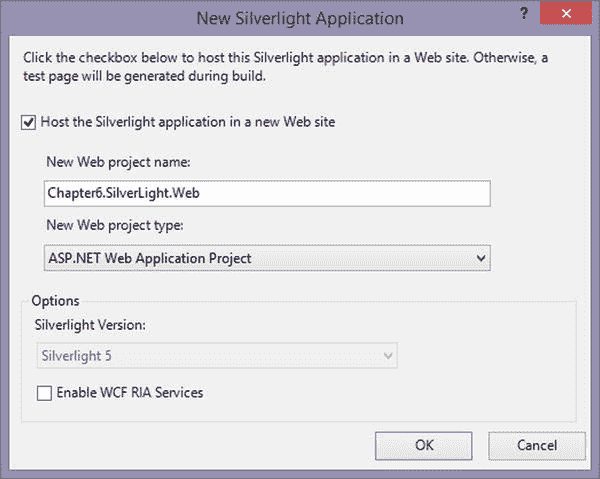

图 6-9。

Silverlight 5 host selection window Select to host the application in a new web site, as shown in Figure [6-9](#Fig9).  

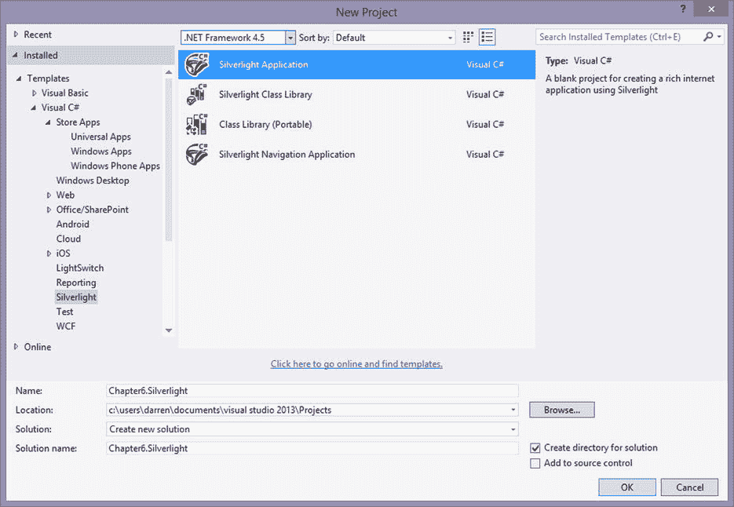

图 6-8。

Silverlight 5 selection window Create a new Silverlight 5 project (see Figure [6-8](#Fig8)).  

清单 6-30。Silverlight 5 客户端 XAML

`<UserControl x:Class="SilverlightApplication.MainPage"`

`xmlns="`[`http://schemas.microsoft.com/winfx/2006/xaml/presentation`](http://schemas.microsoft.com/winfx/2006/xaml/presentation)T2】

`xmlns:x="`[`http://schemas.microsoft.com/winfx/2006/xaml`](http://schemas.microsoft.com/winfx/2006/xaml)T2】

`xmlns:d="`[`http://schemas.microsoft.com/expression/blend/2008`](http://schemas.microsoft.com/expression/blend/2008)T2】

`xmlns:mc="`[`http://schemas.openxmlformats.org/markup-compatibility/2006`](http://schemas.openxmlformats.org/markup-compatibility/2006)T2】

`mc:Ignorable="d"`

`d:DesignHeight="300" d:DesignWidth="400">`

`<Grid x:Name="LayoutRoot" Background="White">`

`<ListBox Name="lstConvo" HorizontalAlignment="Left" Height="204" Margin="10,63,0,0" VerticalAlignment="Top" Width="367"/>`

`<TextBox Name="txtName" HorizontalAlignment="Left" Height="23" Margin="10,22,0,0" TextWrapping="Wrap" Text="User A" VerticalAlignment="Top" Width="120"/>`

`<TextBox Name="txtMessage" HorizontalAlignment="Left" Height="23" Margin="146,22,0,0" TextWrapping="Wrap" Text="" VerticalAlignment="Top" Width="120"/>`

`<Button Name="btnSend" Content="Send" HorizontalAlignment="Left" Margin="287,22,0,0" VerticalAlignment="Top" Width="75"/>`

`</Grid>`

`</UserControl>`

Update the `MainPage.cs` class to look like Listing 6-31.  

清单 6-31。Silverlight 5 客户端代码

`public partial class` `MainPage : UserControl`

`{`

`Microsoft.AspNet.SignalR.Client.Connection myConnection = new Microsoft.AspNet.SignalR.Client.Connection("http://localhost:####/SamplePC/");`

`public MainPage()`

`{`

`InitializeComponent();`

`btnSend.Click += btnSend_Click;`

`myConnection.Received += myConnection_Received;`

`myConnection.Start();`

`}`

`private void btnSend_Click(object sender, RoutedEventArgs e)`

`{`

`myConnection.Send(txtName.Text + ": " + txtMessage.Text);`

`}`

`void` `myConnection_Received(string obj)`

`{`

`Dispatcher.BeginInvoke(() => { lstConvo.Items.Add(obj); });`

`}`

`}`

Update the `####` in the connection to the correct port of your server application.  

应用完成后，您可以在浏览器中运行它，它看起来将如图 [6-10](#Fig10) 所示。

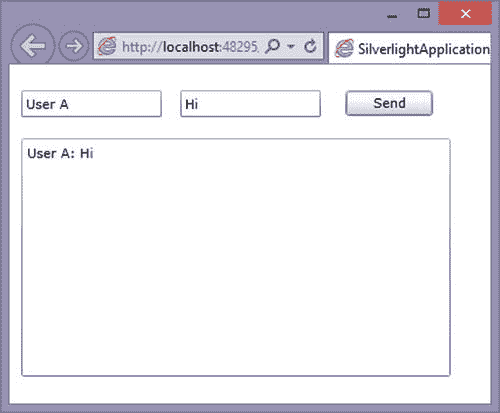

图 6-10。

Final result of running Silverlight 5 client application and sending some messages Tip

如果您在 Internet Explorer 中运行该应用，并注意到地址栏访问的是文件系统而不是 web 地址(如 localhost ),您可能会收到安全错误。若要更正此问题，请使用 localhost 或 web 地址访问应用，以便在允许 Silverlight 应用并允许从这些应用访问 Internet 的 Internet Explorer 安全区域中运行。

此示例类似于。NET 客户端示例，但是具有不同的控件布局(XAML)，具有不同的线程间通信机制，并且运行在 web 浏览器中。您将继续看到其余客户端示例中的差异。

### HUB客户端

在本节中，使用 Silverlight 5 创建了一个中心客户端。本节中的中心客户端示例是使用示例中心服务器的拍卖客户端。

#### 客户端调用的服务器方法

从 Silverlight 5 客户端调用的服务器方法可以包含零个或多个参数。在清单 6-32 和 6-33 中可以看到用零个参数和多个参数调用`Invoke`的例子。

清单 6-32。Silverlight 5 调用不带参数的服务器方法的示例

`Var auctionProxy = hubConnection.CreateHubProxy("AuctionHub");`

`auctionProxy.Invoke("SampleMethod");`

清单 6-33。Silverlight 5 使用多个参数和复杂类型调用服务器方法的示例，返回值为 bool

`Var auctionProxy = hubConnection.CreateHubProxy("AuctionHub");`

`int age = 25;`

`var profile = new Profile("Handle", "Password");`

`auctionProxy.Invoke<bool>("SampleMethod", profile, age);`

#### 服务器调用的客户端方法

服务器可以通过 Silverlight 5 客户端使用零个(见清单 6-34)或多个(见清单 6-35)参数来“调用”客户端方法，这些客户端方法订阅了`HubProxy`上的事件。

清单 6-34。Silverlight 5 不使用参数从服务器调用客户端方法的示例

`void Setup(){`

`var auctionProxy = _hubConnection.CreateHubProxy("AuctionHub");`

`auctionProxy.Subscribe("SampleMethodName").Received += SampleMethod;`

`}`

`void SampleMethod (IList<Newtonsoft.Json.Linq.JToken> obj) {`

`//Perform action on UI thread with delegate`

`Dispatcher.BeginInvoke(someDelegate);`

`}`

清单 6-35。Silverlight 5 使用多个参数从服务器调用客户端方法的示例

`void Setup(){`

`var auctionProxy = _hubConnection.CreateHubProxy("AuctionHub");`

`auctionProxy` `.Subscribe("SampleMethodName").Received += SampleMethod;`

`}`

`void SampleMethod (IList<Newtonsoft.Json.Linq.JToken> obj) {`

`//Perform action on UI thread with delegate`

`Dispatcher.BeginInvoke(someDelegate, obj[0]);`

`}`

#### Silverlight 5 HUB示例

正如我们在前面几节中所做的那样，我们将使用以下步骤来创建 Silverlight 5 hub 示例。

Create a new Silverlight 5 project (refer to Figure [6-8](#Fig8)).   Select to host the application in a new web site (refer to Figure [6-9](#Fig9)).   After the project is created, select the application as the startup project so that the NuGet install will install the package to this project.   Run the following command in the package explorer window: `Install-Package Microsoft.AspNet.SignalR.Client`.   Run the following command in the package explorer window: `Install-package Microsoft.Bcl.Async`.   After the package is installed, set the web site as the startup project.   Update `MainPage.xaml` to look like Listing 6-36.  

清单 6-36。Silverlight 5 客户端 XAML

`<UserControl x:Class="Chapter6.Silverlight.MainPage"`

`xmlns="`[`http://schemas.microsoft.com/winfx/2006/xaml/presentation`](http://schemas.microsoft.com/winfx/2006/xaml/presentation)T2】

`xmlns:x="`[`http://schemas.microsoft.com/winfx/2006/xaml`](http://schemas.microsoft.com/winfx/2006/xaml)T2】

`xmlns:d="`[`http://schemas.microsoft.com/expression/blend/2008`](http://schemas.microsoft.com/expression/blend/2008)T2】

`xmlns:mc="`[`http://schemas.openxmlformats.org/markup-compatibility/2006`](http://schemas.openxmlformats.org/markup-compatibility/2006)T2】

`mc:Ignorable="d"`

`d:DesignHeight="600" d:DesignWidth="500">`

`<Grid x:Name="LayoutRoot" Background="Transparent">`

`<Grid.RowDefinitions>`

`<RowDefinition Height="Auto"/>`

`<RowDefinition Height="*"/>`

`</Grid.RowDefinitions>`

`<StackPanel>`

`<Grid>`

`<TextBlock HorizontalAlignment="Left" Name="lblName"></TextBlock>`

`<TextBlock Margin="0,0,50,0" HorizontalAlignment="Right" Name="lblBid"></TextBlock>`

`</Grid>`

`<Grid Margin="0,50,0,0">`

`<TextBlock HorizontalAlignment="Left" Name="lblDescr"></TextBlock>`

`<TextBlock HorizontalAlignment="Center">Time Left:</TextBlock>`

`<TextBlock Margin="0,0,50,0" HorizontalAlignment="Right" Name="lblTime"></TextBlock>`

`</Grid>`

`<Grid Margin="0,50,0,0">`

`<Button Name="btnCurrentBid" HorizontalAlignment="Left" Width="175">Current Bid</Button>`

`<Button Name="btnMakeBid" HorizontalAlignment="Center" Width="150">Make Bid</Button>`

`<TextBox Name="txtBid" HorizontalAlignment="Right" Width="175"/>`

`</Grid>`

`<ListBox Name="lstWins"></ListBox>`

`</StackPanel>`

`</Grid>`

`</UserControl>`

Update the `MainPage.cs` class to look like Listing 6-37.  

清单 6-37。Silverlight 5 客户端代码

`public partial class MainPage : UserControl`

`{`

`public Microsoft.AspNet.SignalR.Client.HubConnection _hubConnection;`

`public Microsoft.AspNet.SignalR.Client.IHubProxy _auctionProxy;`

`delegate void UpdateBid(dynamic bid, int formObject);`

`delegate void UpdateButtons(bool enabled);`

`UpdateBid _updateDelegate;`

`UpdateButtons _updateButtonsDelegate;`

`public MainPage()`

`{`

`InitializeComponent();`

`btnCurrentBid.Click += btnCurrentBid_Click;`

`btnMakeBid.Click += btnMakeBid_Click;`

`SetupHub();`

`}`

`private` `async void SetupHub()`

`{`

`_updateDelegate = new UpdateBid(UpdateBidMethod);`

`_updateButtonsDelegate = new UpdateButtons(UpdateButtonsMethod);`

`_hubConnection = new Microsoft.AspNet.SignalR.Client.HubConnection("`[`http://192.168.1.108`](http://192.168.1.108/)T2】

`_auctionProxy = _hubConnection.CreateHubProxy("AuctionHub");`

`_auctionProxy.Subscribe("UpdateBid").Received += UpdateBid_auctionProxy;`

`_auctionProxy.Subscribe("CloseBid").Received += CloseBid_auctionProxy;`

`_auctionProxy.Subscribe("CloseBidWin").Received += CloseBidWin_auctionProxy;`

`await _hubConnection.Start();`

`}`

`void UpdateBidMethod(dynamic bid, int formObject)`

`{`

`if (bid != null)`

`{`

`lblName.Text = (string)bid["Name"];`

`lblDescr.Text = (string)bid["Description"];`

`lblBid.Text = (string)bid["BidPrice"];`

`lblTime.Text = (string)bid["TimeLeft"];`

`if (formObject > 0)`

`{`

`lstWins.Items.Add((string)bid["Name"] + " at " + (string)bid["BidPrice"]);`

`}`

`}`

`}`

`void``UpdateButtonsMethod`T2】

`{`

`btnCurrentBid.IsEnabled = enabled;`

`btnMakeBid.IsEnabled = enabled;`

`}`

`void UpdateBid_auctionProxy(IList<Newtonsoft.Json.Linq.JToken> obj)`

`{`

`Dispatcher.BeginInvoke(_updateDelegate, obj[0], 0);`

`Dispatcher.BeginInvoke(_updateButtonsDelegate, true);`

`}`

`void CloseBid_auctionProxy(IList<Newtonsoft.Json.Linq.JToken> obj)`

`{`

`Dispatcher.BeginInvoke(_updateButtonsDelegate, false);`

`}`

`void CloseBidWin_auctionProxy(IList<Newtonsoft.Json.Linq.JToken> obj)`

`{`

`Dispatcher.BeginInvoke(_updateButtonsDelegate, false);`

`Dispatcher.BeginInvoke(_updateDelegate, obj[0], 1);`

`}`

`private void btnCurrentBid_Click(object sender, EventArgs e)`

`{`

`_auctionProxy.Invoke("MakeCurrentBid");`

`}`

`private void btnMakeBid_Click(object sender, EventArgs e)`

`{`

`_auctionProxy.Invoke<string>("MakeBid", this.txtBid.Text);`

`}`

`}`

Update the `####` in the connection to the correct port of your server application  

该示例的最终产品如图 [6-11](#Fig11) 所示。

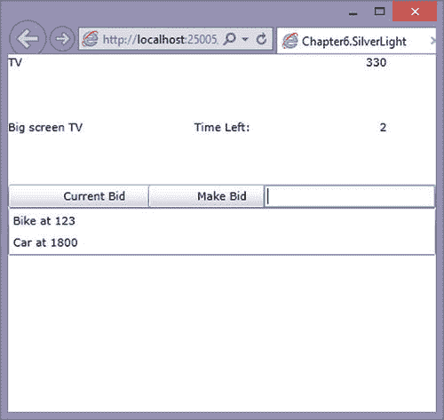

图 6-11。

Example of Silverlight 5 hub client

这是另一个成功的客户端示例，进一步展示了各种客户端之间的差异。接下来要讨论的客户端是 Windows 应用商店客户端。

## Windows 应用商店客户端

Windows 应用商店客户端支持持续连接和HUB。要开发这些客户端应用，必须安装 Windows 8.1 以支持商店应用的最新添加内容。

### 持久连接客户端

Windows 应用商店客户端应用支持持续连接客户端。以下示例使用 Windows 应用商店模板创建了一个简单的聊天应用。

#### Windows 应用商店客户端永久连接示例

要创建客户端示例，请按照下列步骤操作:

Run the following command in the package explorer window: `Install-Package Microsoft.AspNet.SignalR.Client`.   Update the `MainPage.xaml.cs` class to look like Listing 6-38.  

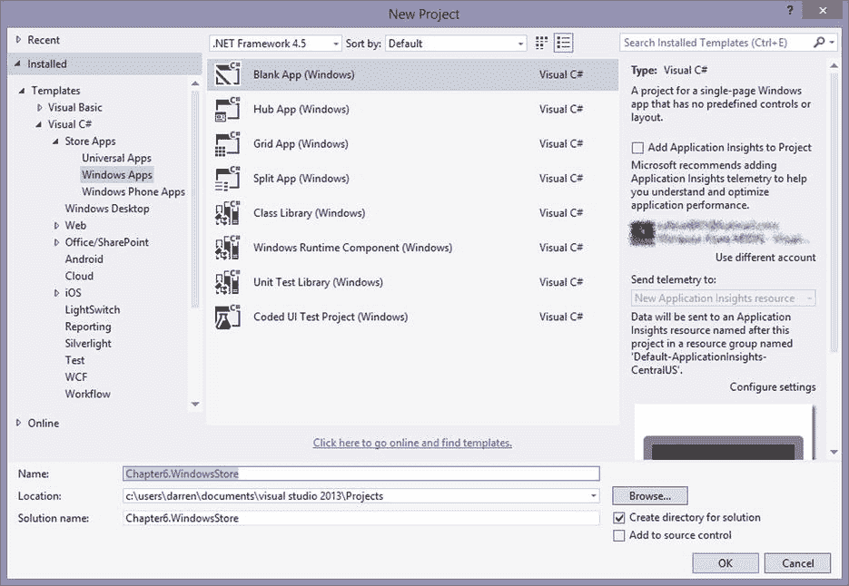

图 6-12。

Windows Store client project selection Create a new Windows Store project with the Blank App template, as shown in Figure [6-12](#Fig12).  

清单 6-38。。Windows Store SignalR 客户端代码

`public sealed partial class MainPage : Page`

`{`

`Microsoft.AspNet.SignalR.Client.Connection myConnection = new Microsoft.AspNet.SignalR.Client.Connection("http://localhost:####/SamplePC/");`

`public MainPage()`

`{`

`this.InitializeComponent();`

`myConnection.Received += myConnection_Received;`

`myConnection.Start().Wait();`

`}`

`private void SendButton_Click(object sender, RoutedEventArgs e)`

`{`

`myConnection.Send(txtName.Text + ": " + txtInput.Text);`

`}`

`private void myConnection_Received(string data)`

`{`

`UpdateList(data);`

`}`

`private async void UpdateList(string data)`

`{`

`await``itemListBox`T2】

`() =>`

`{`

`var item = new ListBoxItem() { Content = data };`

`itemListBox.Items.Add(item);`

`});`

`}`

`}`

Update `MainPage.xaml` to look like Listing 6-39.  

清单 6-39。。NET C# Windows 应用商店客户端 XAML

`<` `Page`

`x:Class="Chapter6_WindowsStoreClient.MainPage"`

`xmlns="`[`http://schemas.microsoft.com/winfx/2006/xaml/presentation`](http://schemas.microsoft.com/winfx/2006/xaml/presentation)T2】

`xmlns:x="`[`http://schemas.microsoft.com/winfx/2006/xaml`](http://schemas.microsoft.com/winfx/2006/xaml)T2】

`xmlns:local="using:Chapter6_WindowsStoreClient"`

`xmlns:d="`[`http://schemas.microsoft.com/expression/blend/2008`](http://schemas.microsoft.com/expression/blend/2008)T2】

`xmlns:mc="`[`http://schemas.openxmlformats.org/markup-compatibility/2006`](http://schemas.openxmlformats.org/markup-compatibility/2006)T2】

`mc:Ignorable="d">`

`<Grid Background="{StaticResource ApplicationPageBackgroundThemeBrush}">`

`<TextBlock Margin="10,10,0,0">Name:</TextBlock>`

`<TextBlock Margin="120,10,0,0">Data:</TextBlock>`

`<TextBox x:Name="txtName"`

`Text="User A"`

`Width="100"`

`Height="50"`

`HorizontalAlignment="Left"`

`VerticalAlignment="Top"`

`IsEnabled="True"`

`IsReadOnly="False"`

`Margin="10,30,0,0"`

`TabIndex="1"/>`

`<TextBox x:Name="txtInput"`

`Width="250"`

`Height="50"`

`HorizontalAlignment="Left"`

`VerticalAlignment="Top"`

`IsEnabled="True"`

`IsReadOnly="False"`

`Margin="120,30,0,0"`

`TabIndex="1"/>`

`<Button x:Name="btnSend"`

`Click="SendButton_Click"`

`Width="100"`

`Height="50"`

`Margin="380,30,0,0"`

`VerticalAlignment="Top">Send`

`</Button>`

`<ListBox`

`x:Name="itemListBox"`

`AutomationProperties.AutomationId="ItemsListView"`

`AutomationProperties.Name="Items"`

`Grid.Row="1"`

`Margin="0,100,0,0"`

`Width="450"`

`HorizontalAlignment="Left">`

`</ListBox>`

`</Grid>`

`</Page>`

Update the `####` in the connection to the correct port of your server application.  

如果您在模拟器中运行代码，您应该会看到类似图 [6-13](#Fig13) 的示例。

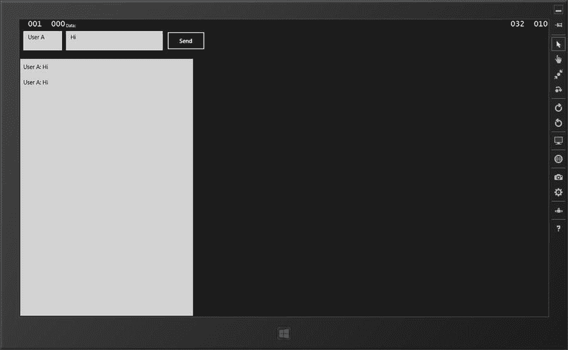

图 6-13。

Example of Windows Store client

Windows 应用商店客户端具有类似于 Silverlight 应用的控件布局。但客户端之间的真正区别是 Windows Store 应用在本地运行，而 Silverlight 在浏览器中运行。另一个主要区别是线程的调度方式。接下来将讨论 Windows Store hub 客户端。

### HUB客户端

在本节中，我们将展示如何使用 Windows 应用商店客户端应用创建中心客户端。这是我们在前面的例子中使用的同一个拍卖客户端，这样就可以对客户端进行比较。

#### 客户端调用的服务器方法

从 Windows 应用商店客户端调用的服务器方法可以包含零个或多个参数。清单 6-40 和清单 6-41 分别给出了使用零个、一个或多个参数调用`Invoke`方法的例子。

清单 6-40。调用不带参数的服务器方法的 Windows 应用商店客户端示例

`Var auctionProxy = hubConnection.CreateHubProxy("AuctionHub");`

`auctionProxy.Invoke("SampleMethod");`

清单 6-41。调用具有多个参数和复杂类型且返回值为 bool 的服务器方法的 Windows 应用商店客户端示例

`Var auctionProxy = hubConnection.CreateHubProxy("AuctionHub");`

`int age = 25;`

`var profile = new Profile("Handle", "Password");`

`auctionProxy.Invoke<bool>("SampleMethod", profile, age);`

#### 服务器调用的客户端方法

服务器可以通过 Windows Store 客户端订阅`HubProxy`上的事件来“调用”客户端方法(参见清单 6-42 和 6-43)。

清单 6-42。从服务器调用不带参数的客户端方法的 Windows 应用商店客户端示例

`void Setup(){`

`var auctionProxy = _hubConnection.CreateHubProxy("AuctionHub");`

`auctionProxy.Subscribe("SampleMethodName").Received += SampleMethod;`

`}`

`async void SampleMethod (IList<Newtonsoft.Json.Linq.JToken> obj) {`

`await Dispatcher.RunAsync(Windows.UI.Core.CoreDispatcherPriority.Normal, () =>{`

`//Perform action on UI thread`

`}`

`}`

清单 6-43。使用多个参数从服务器调用客户端方法的 Windows 应用商店客户端示例

`void Setup(){`

`var auctionProxy = _hubConnection.CreateHubProxy("AuctionHub");`

`auctionProxy.Subscribe("SampleMethodName").Received += SampleMethod;`

`}`

`async void SampleMethod (IList<Newtonsoft.Json.Linq.JToken> obj) {`

`await Dispatcher.RunAsync(Windows.UI.Core.CoreDispatcherPriority.Normal, () =>{`

`//Perform action on UI` `thread`

`this.Age = obj[0];`

`}`

`}`

#### Windows 应用商店客户端中心示例

要创建客户端示例，请按照下列步骤操作:

Create a new Windows Store project with the Blank App template.   Run the following command in the package explorer window: `Install-Package Microsoft.AspNet.SignalR.Client`.   Update the `MainPage.xaml.cs` class to look like Listing 6-44.  

清单 6-44。Windows 应用商店客户端代码

`public sealed partial class MainPage : Page`

`{`

`public Microsoft.AspNet.SignalR.Client.HubConnection _hubConnection;`

`public Microsoft.AspNet.SignalR.Client.IHubProxy _auctionProxy;`

`public MainPage()`

`{`

`InitializeComponent();`

`btnCurrentBid.Click += btnCurrentBid_Click;`

`btnMakeBid.Click += btnMakeBid_Click;`

`SetupHub();`

`}`

`private async void SetupHub()`

`{`

`_hubConnection = new` `Microsoft` `.AspNet.SignalR.Client.HubConnection("` [`http://192.168.1.108`](http://192.168.1.108/) `:####/");`

`_auctionProxy = _hubConnection.CreateHubProxy("AuctionHub");`

`_auctionProxy.Subscribe("UpdateBid").Received += UpdateBid_auctionProxy;`

`_auctionProxy.Subscribe("CloseBid").Received += CloseBid_auctionProxy;`

`_auctionProxy.Subscribe("CloseBidWin").Received += CloseBidWin_auctionProxy;`

`await _hubConnection.Start();`

`}`

`void UpdateBid(dynamic bid, int formObject)`

`{`

`if (bid != null)`

`{`

`lblName.Text = bid.Name;`

`lblDescr.Text = bid.Description;`

`lblBid.Text = bid.BidPrice;`

`lblTime.Text = bid.TimeLeft;`

`if(formObject > 0)`

`{`

`lstWins.Items.Add(bid.Name + " at " + bid.BidPrice);`

`}`

`}`

`}`

`void` `UpdateButtons(bool enabled)`

`{`

`btnCurrentBid.IsEnabled = enabled;`

`btnMakeBid.IsEnabled = enabled;`

`}`

`async void UpdateBid_auctionProxy(IList<Newtonsoft.Json.Linq.JToken> obj)`

`{`

`await Dispatcher.RunAsync(Windows.UI.Core.CoreDispatcherPriority.Normal,`

`() =>{`

`UpdateBid(obj[0],0);`

`UpdateButtons(true);`

`});`

`}`

`async void CloseBid_auctionProxy(IList<Newtonsoft.Json.Linq.JToken> obj)`

`{`

`await Dispatcher.RunAsync(Windows.UI.Core.CoreDispatcherPriority.Normal,`

`() =>{`

`UpdateButtons(false);`

`});`

`}`

`async void CloseBidWin_auctionProxy(IList<Newtonsoft.Json.Linq.JToken> obj)`

`{`

`await``Dispatcher`T2】

`() =>`

`{`

`UpdateButtons(false);`

`UpdateBid(obj[0], 1);`

`});`

`}`

`private void btnCurrentBid_Click(object sender, RoutedEventArgs e)`

`{`

`_auctionProxy.Invoke("MakeCurrentBid");`

`}`

`private void btnMakeBid_Click(object sender, RoutedEventArgs e)`

`{`

`_auctionProxy.Invoke<string>("MakeBid", this.txtBid.Text);`

`}`

`}`

Update`MainPage.xaml` to look like Listing 6-45.  

清单 6-45。Windows 应用商店客户端 XAML

`<Page`

`x:Class="WindowsStore.MainPage"`

`xmlns="`[`http://schemas.microsoft.com/winfx/2006/xaml/presentation`](http://schemas.microsoft.com/winfx/2006/xaml/presentation)T2】

`xmlns:x="`[`http://schemas.microsoft.com/winfx/2006/xaml`](http://schemas.microsoft.com/winfx/2006/xaml)T2】

`xmlns:local="using:WindowsStore"`

`xmlns:d="`[`http://schemas.microsoft.com/expression/blend/2008`](http://schemas.microsoft.com/expression/blend/2008)T2】

`xmlns:mc="`[`http://schemas.openxmlformats.org/markup-compatibility/2006`](http://schemas.openxmlformats.org/markup-compatibility/2006)T2】

`mc:Ignorable="d">`

`<Grid x:Name="LayoutRoot" Background="Transparent">`

`<Grid.RowDefinitions>`

`<RowDefinition Height="Auto"/>`

`<RowDefinition Height="*"/>`

`</Grid.RowDefinitions>`

`<StackPanel>`

`<Grid Margin="0,50,0,0">`

`<TextBlock Name="lblName" Width="150" HorizontalAlignment="Left"></TextBlock>`

`<TextBlock Margin="185,0,0,0" >Last Bid:</TextBlock>`

`<TextBlock Margin="240,0,0,0" Name="lblBid"></TextBlock>`

`</Grid>`

`<Grid>`

`<TextBlock Name="lblDescr"></TextBlock>`

`<TextBlock Margin="185,0,0,0" >Time Left:</TextBlock>`

`<TextBlock Margin="240, 0,0,0" Name="lblTime"></TextBlock>`

`</Grid>`

`<Grid Margin="0,10,0,0">`

`<Button Name="btnCurrentBid" Width="175">Current Bid</Button>`

`<Button Name="btnMakeBid" Margin="185,0,0,0" Width="150">Make Bid</Button>`

`<TextBox Name="txtBid" Margin="360, 0,0,0" Width="175"``HorizontalAlignment`T2】

`</Grid>`

`<ListBox Name="lstWins"></ListBox>`

`</StackPanel>`

`</Grid>`

`</Page>`

Update the `####` in the connection to the correct port of your server application.  

当您在浏览器中查看该示例时，您会看到类似于图 [6-14](#Fig14) 的内容。

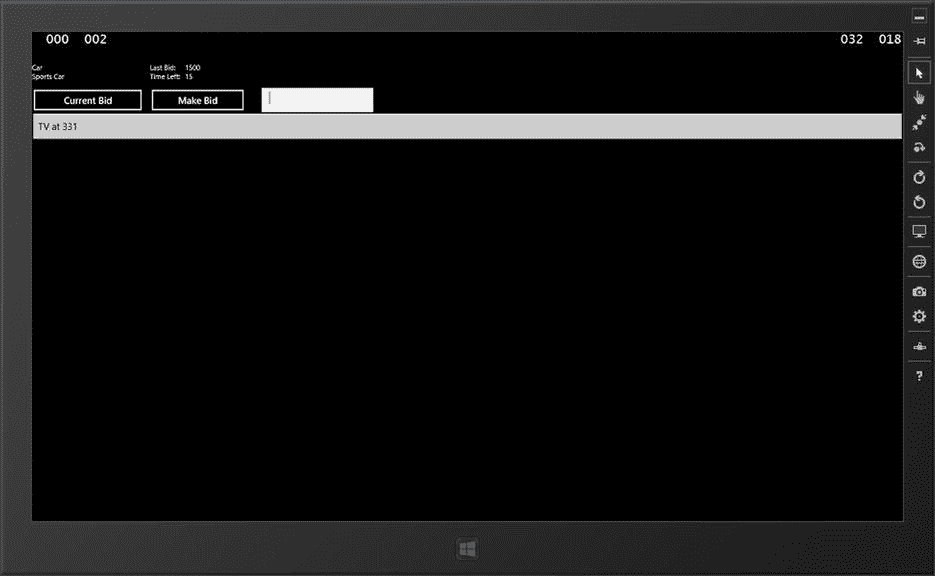

图 6-14。

Example of Windows Store hub client

现在 Windows Store 客户端示例已经完成，我们只剩下一个客户端变体要展示:在 Windows Phone 8 客户端上。

## Windows Phone 8 客户端

Windows Phone 8 客户端支持的 SignalR 支持持久连接和HUB应用。对于 Windows Phone 8 客户端开发，需要 64 位版本的 Windows 8 以及 Windows Phone 8 SDK。

### 持久连接客户端

以下示例中显示的持久连接客户端与前面示例中使用的聊天应用相同。

#### Windows Phone 8 持久连接示例

要创建客户端示例，请按照下列步骤操作:

Run the following command in the package explorer window: `Install-Package Microsoft.AspNet.SignalR.Client`.   Update the `MainPage.xaml.cs` class to look like Listing 6-46.  

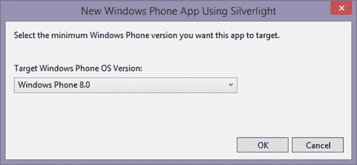

图 6-16。

Windows Phone 8 OS version selection Select the version of the Windows Phone you want to target. This example targets Windows Phone 8.0 (see Figure [6-16](#Fig16)).  

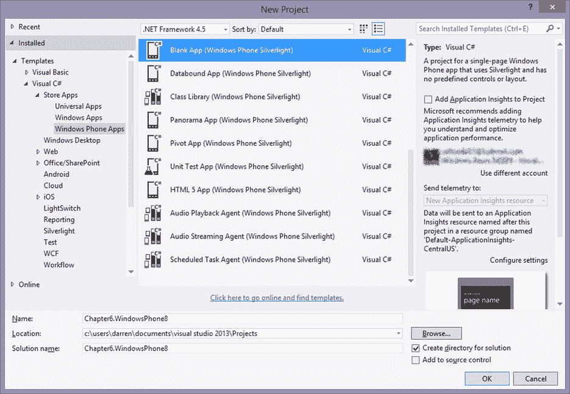

图 6-15。

Windows Phone 8 application selection Create a new Windows Store project with the Windows Phone App template (see Figure [6-15](#Fig15)).  

清单 6-46。Windows Phone 8 客户端代码

`public partial class MainPage : PhoneApplicationPage`

`{`

`Microsoft.AspNet.SignalR.Client.Connection myConnection = new Microsoft.AspNet.SignalR.Client.Connection("http://localhost:####/SamplePC/");`

`public MainPage()`

`{`

`this.InitializeComponent();`

`myConnection.Received += myConnection_Received;`

`myConnection.Start();`

`}`

`private void SendButton_Click(object sender, RoutedEventArgs e)`

`{`

`myConnection.Send(txtName.Text + ": " + txtInput.Text);`

`}`

`private void myConnection_Received(string data)`

`{`

`UpdateList(data);`

`}`

`private` `void UpdateList(string data)`

`{`

`itemListBox.Dispatcher.BeginInvoke(new Action(() =>`

`{`

`var item = new ListBoxItem() { Content = data };`

`itemListBox.Items.Add(item);`

`}));`

`}`

`}`

Update `MainPage.xaml` to look like Listing 6-47.  

清单 6-47。Windows Phone 8 客户端 XAML

`<phone:PhoneApplicationPage`

`x:Class="Chapter6_WindowsPhone.MainPage"`

`xmlns="`[`http://schemas.microsoft.com/winfx/2006/xaml/presentation`](http://schemas.microsoft.com/winfx/2006/xaml/presentation)T2】

`xmlns:x="`[`http://schemas.microsoft.com/winfx/2006/xaml`](http://schemas.microsoft.com/winfx/2006/xaml)T2】

`xmlns:phone="clr-namespace:Microsoft.Phone.Controls;assembly=Microsoft.Phone"`

`xmlns:shell="clr-namespace:Microsoft.Phone.Shell;assembly=Microsoft.Phone"`

`xmlns:d="`[`http://schemas.microsoft.com/expression/blend/2008`](http://schemas.microsoft.com/expression/blend/2008)T2】

`xmlns:mc="`[`http://schemas.openxmlformats.org/markup-compatibility/2006`](http://schemas.openxmlformats.org/markup-compatibility/2006)T2】

`mc:Ignorable="d"`

`FontFamily="{StaticResource PhoneFontFamilyNormal}"`

`FontSize="{StaticResource PhoneFontSizeNormal}"`

`Foreground="{StaticResource PhoneForegroundBrush}"`

`SupportedOrientations="Portrait" Orientation="Portrait"`

`shell:SystemTray.IsVisible="True">`

`<Grid x:Name="LayoutRoot" Background="Transparent">`

`<Grid.RowDefinitions>`

`<RowDefinition Height="Auto"/>`

`<RowDefinition Height="*"/>`

`</Grid.RowDefinitions>`

`<TextBlock Margin="10,10,0,0">Name:</TextBlock>`

`<TextBlock Margin="120,10,0,0">Data:</TextBlock>`

`<TextBox x:Name="txtName"`

`Text="User A"`

`Width="125"`

`Height="75"`

`HorizontalAlignment="Left"`

`VerticalAlignment="Top"`

`IsEnabled="True"`

`IsReadOnly="False"`

`Margin="10,30,0,0"`

`TabIndex="1"/>`

`<TextBox x:Name="txtInput"`

`Width="250"`

`Height="75"`

`HorizontalAlignment="Left"`

`VerticalAlignment="Top"`

`IsEnabled="True"`

`IsReadOnly="False"`

`Margin="120,30,0,0"`

`TabIndex="1"/>`

`<Button x:Name="btnSend"`

`Click="SendButton_Click"`

`Width="100"`

`Height="75"`

`Margin="380,30,0,0"`

`VerticalAlignment="Top">Send`

`</``Button`T2】

`<ListBox`

`x:Name="itemListBox"`

`AutomationProperties.AutomationId="ItemsListView"`

`AutomationProperties.Name="Items"`

`Grid.Row="1"`

`Margin="0,100,0,0"`

`Width="450"`

`HorizontalAlignment="Left">`

`</ListBox>`

`</Grid>`

`</phone:PhoneApplicationPage>`

Update the `####` in the connection to the correct port of your server application  

图 [6-17](#Fig17) 显示了聊天应用在 Windows Phone 模拟器中的样子。

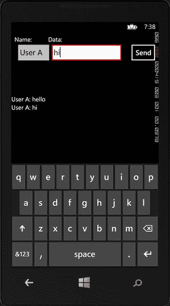

图 6-17。

Example of Windows Phone 8 persistent connection client Note

如果使用仿真程序测试 Windows Phone 示例应用，您可能需要配置 IIS Express 和防火墙才能成功连接。微软发表了一篇处理这个问题的文章: [`http://msdn.microsoft.com/en-us/library/windowsphone/develop/jj684580.aspx`](http://msdn.microsoft.com/en-us/library/windowsphone/develop/jj684580.aspx) 。

现在我们已经创建了持久连接客户机，下一步是创建中心客户机。

### HUB客户端

本节介绍如何使用 Windows Phone 8 客户端应用创建中心客户端。本节中的中心客户端示例是一个拍卖客户端。

#### 客户端调用的服务器方法

从 Windows Phone 8 客户端调用的服务器方法可以包含零个或多个参数，分别如清单 6-48 和 6-49 所示。

清单 6-48。不带参数调用服务器方法的 Windows Phone 8 示例

`Var auctionProxy = hubConnection.CreateHubProxy("AuctionHub");`

`auctionProxy.Invoke("SampleMethod");`

清单 6-49。Windows Phone 8 调用具有多个参数和复杂类型且返回值为 bool 的服务器方法的示例

`Var auctionProxy = hubConnection.CreateHubProxy("AuctionHub");`

`int age = 25;`

`var profile = new Profile("Handle", "Password");`

`auctionProxy.Invoke<bool>("SampleMethod", profile, age);`

#### 服务器调用的客户端方法

服务器可以通过 Windows Phone 8 客户端订阅`HubProxy`上的事件来“调用”客户端方法。这些方法可以有零个、一个或多个参数，分别如清单 6-50 和 6-51 所示。

清单 6-50。不带参数从服务器调用客户端方法的 Windows Phone 8 示例

`void Setup(){`

`var auctionProxy = _hubConnection.CreateHubProxy("AuctionHub");`

`auctionProxy.Subscribe("SampleMethodName").Received += SampleMethod;`

`}`

`void SampleMethod (IList<Newtonsoft.Json.Linq.JToken> obj) {`

`//Perform action on UI thread with delegate`

`Dispatcher.BeginInvoke(someDelegate);`

`}`

清单 6-51。使用多个参数从服务器调用客户端方法的 Windows Phone 8 示例

`void Setup(){`

`var auctionProxy = _hubConnection.CreateHubProxy("AuctionHub");`

`auctionProxy.Subscribe("SampleMethodName").Received += SampleMethod;`

`}`

`void SampleMethod (IList<Newtonsoft.Json.Linq.JToken> obj) {`

`//Perform action on UI thread with delegate`

`Dispatcher` `.BeginInvoke(someDelegate, obj[0]);`

`}`

#### Windows Phone 8 Hub 示例

要创建客户端示例，请按照下列步骤操作:

Create a new Windows Store project with the Windows Phone App template (refer to Figure [6-15](#Fig15)).   Select the Windows Phone version you want to target; this example targets Windows Phone 8.0 (refer to Figure [6-16](#Fig16)).   Run the following command in the package explorer window: `Install-Package Microsoft.AspNet.SignalR.Client`.   Update the `MainPage.xaml.cs` class to look like Listing 6-52.  

清单 6-52。Windows Phone 8 客户端代码

`public partial class MainPage : PhoneApplicationPage`

`{`

`public Microsoft.AspNet.SignalR.Client.HubConnection _hubConnection;`

`public Microsoft.AspNet.SignalR.Client.IHubProxy _auctionProxy;`

`delegate void UpdateBid(dynamic bid, int formObject);`

`delegate void UpdateButtons(bool enabled);`

`UpdateBid _updateDelegate;`

`UpdateButtons _updateButtonsDelegate;`

`public MainPage()`

`{`

`InitializeComponent();`

`btnCurrentBid.Click += btnCurrentBid_Click;`

`btnMakeBid.Click += btnMakeBid_Click;`

`SetupHub();`

`}`

`private async void SetupHub()`

`{`

`_updateDelegate = new UpdateBid(UpdateBidMethod);`

`_updateButtonsDelegate = new UpdateButtons(UpdateButtonsMethod);`

`_hubConnection = new Microsoft.AspNet.SignalR.Client.HubConnection("`[`http://192.168.1.108`](http://192.168.1.108/)T2】

`_auctionProxy = _hubConnection.CreateHubProxy("AuctionHub");`

`_auctionProxy.Subscribe("UpdateBid").Received += UpdateBid_auctionProxy;`

`_auctionProxy.Subscribe("CloseBid").Received += CloseBid_auctionProxy;`

`_auctionProxy.Subscribe("CloseBidWin").Received += CloseBidWin_auctionProxy;`

`await _hubConnection.Start();`

`}`

`void UpdateBidMethod(dynamic bid, int formObject)`

`{`

`if (bid != null)`

`{`

`lblName.Text = bid.Name;`

`lblDescr.Text = bid.Description;`

`lblBid.Text = bid.BidPrice;`

`lblTime.Text = bid.TimeLeft;`

`if(formObject > 0)`

`{`

`lstWins.Items.Add(bid.Name + " at " + bid.BidPrice);`

`}`

`}`

`}`

`void UpdateButtonsMethod(bool enabled)`

`{`

`btnCurrentBid.IsEnabled = enabled;`

`btnMakeBid.IsEnabled = enabled;`

`}`

`void UpdateBid_auctionProxy(IList<Newtonsoft.Json.Linq.JToken> obj)`

`{`

`Dispatcher.BeginInvoke(_updateDelegate, obj[0],0);`

`Dispatcher.BeginInvoke(_updateButtonsDelegate, true);`

`}`

`void CloseBid_auctionProxy(IList<Newtonsoft.Json.Linq.JToken> obj)`

`{`

`Dispatcher.BeginInvoke(_updateButtonsDelegate, false);`

`}`

`void CloseBidWin_auctionProxy(IList<Newtonsoft.Json.Linq.JToken> obj)`

`{`

`Dispatcher.BeginInvoke(_updateButtonsDelegate, false);`

`Dispatcher` `.BeginInvoke(_updateDelegate, obj[0], 1);`

`}`

`private void btnCurrentBid_Click(object sender, EventArgs e)`

`{`

`_auctionProxy.Invoke("MakeCurrentBid");`

`}`

`private void btnMakeBid_Click(object sender, EventArgs e)`

`{`

`_auctionProxy.Invoke<string>("MakeBid", this.txtBid.Text);`

`}`

`}`

Update `MainPage.xaml` to look like Listing 6-53.  

清单 6-53。Windows Phone 8 客户端 XAML

`<phone:PhoneApplicationPage`

`x:Class="Chapter6.WindowsPhone8.MainPage"`

`xmlns="`[`http://schemas.microsoft.com/winfx/2006/xaml/presentation`](http://schemas.microsoft.com/winfx/2006/xaml/presentation)T2】

`xmlns:x="`[`http://schemas.microsoft.com/winfx/2006/xaml`](http://schemas.microsoft.com/winfx/2006/xaml)T2】

`xmlns:phone="clr-namespace:Microsoft.Phone.Controls;assembly=Microsoft.Phone"`

`xmlns:shell="clr-namespace:Microsoft.Phone.Shell;assembly=Microsoft.Phone"`

`xmlns:d="`[`http://schemas.microsoft.com/expression/blend/2008`](http://schemas.microsoft.com/expression/blend/2008)T2】

`xmlns:mc="`[`http://schemas.openxmlformats.org/markup-compatibility/2006`](http://schemas.openxmlformats.org/markup-compatibility/2006)T2】

`mc:Ignorable="d"`

`FontFamily="{StaticResource PhoneFontFamilyNormal}"`

`FontSize="{StaticResource PhoneFontSizeNormal}"`

`Foreground="{StaticResource PhoneForegroundBrush}"`

`SupportedOrientations="Portrait" Orientation="Portrait"`

`shell:SystemTray.IsVisible="True">`

`<Grid x:Name="LayoutRoot" Background="Transparent">`

`<Grid.RowDefinitions>`

`<RowDefinition Height="Auto"/>`

`<RowDefinition Height="*"/>`

`</Grid.RowDefinitions>`

`<StackPanel>`

`<Grid>`

`<TextBlock HorizontalAlignment="Left" Name="lblName"></TextBlock>`

`<TextBlock Margin="0,0,50,0" HorizontalAlignment="Right"``Name`T2】

`</Grid>`

`<Grid>`

`<TextBlock HorizontalAlignment="Left" Name="lblDescr"></TextBlock>`

`<TextBlock HorizontalAlignment="Center">Time Left:</TextBlock>`

`<TextBlock Margin="0,0,50,0" HorizontalAlignment="Right" Name="lblTime"></TextBlock>`

`</Grid>`

`<Grid>`

`<Button Name="btnCurrentBid" HorizontalAlignment="Left" Width="175">Current Bid</Button>`

`<Button Name="btnMakeBid" HorizontalAlignment="Center" Width="150">Make Bid</Button>`

`<TextBox Name="txtBid" HorizontalAlignment="Right" Width="175"/>`

`</Grid>`

`<ListBox Name="lstWins"></ListBox>`

`</StackPanel>`

`</Grid>`

`</phone:PhoneApplicationPage>`

Update the `####` in the connection to the correct port of your server application.  

我们现在已经完成了最后一个例子。如果我们用仿真器运行它，它看起来类似于图 [6-18](#Fig18) 。

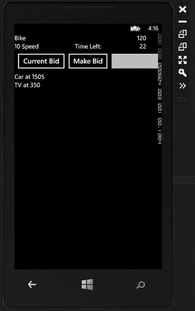

图 6-18。

Windows Phone 8 example Note

如果使用仿真程序测试 Windows Phone 示例应用，您可能需要配置 IIS Express 和防火墙才能成功连接。微软发表了一篇处理这个问题的文章: [`http://msdn.microsoft.com/en-us/library/windowsphone/develop/jj684580.aspx`](http://msdn.microsoft.com/en-us/library/windowsphone/develop/jj684580.aspx) 。

我们现在已经浏览了受支持的客户端的标准列表。iPhone 和 Android 客户端也可用，但它们需要定制，这将在第 7 章中详细讨论。

## 摘要

本章向您展示了哪些客户端可用以及如何配置它们。客户机最可配置的部分是连接，它允许我们定制查询字符串、头、cookies、证书和传输。

我们还讨论了服务器和客户机之间的通信。一般来说，所有客户端的通信机制都是相同的，但是在消费数据和将数据移出连接线程方面有细微的差别。我们对每个客户的例子进行了迭代。

下一章将介绍在非 Windows 操作系统上使用 SignalR，包括 iPhone 和 Android 客户端。