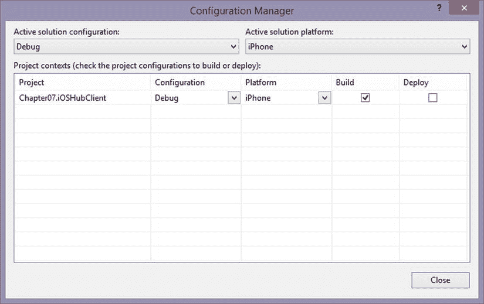

# 7.如何扩展和定制 SignalR 功能

到目前为止，您已经看到了 SignalR 的基础知识；现在是时候了解详细信息了，这将有助于您根据自己的特定需求定制 SignalR。我们从一些常见的可扩展点开始这一章。之后，我们继续扩展和定制现有的组件。如果组件不能被扩展来完成任务，我们讨论根据需要替换单个组件。

根据您的需求扩展 SignalR 的主题，我们讨论在 IIS 之外托管 SignalR 应用程序。我们还将讨论托管如何不仅仅局限于 Windows 平台。您将了解 Mono 框架以及如何使用它在 Linux 和 OS X 上运行 SignalR 应用程序。最后一节向您展示如何将 Xamarin 用于 Visual Studio 插件，该插件使用 Mono 框架的自定义版本，可以在 Android 和 iOS 设备上运行 SignalR 客户端。

## 信号核心的可扩展性

如前几章所述，SignalR 的开发人员已经做了大量工作，将代码设计得非常灵活和可定制。通过使用依赖解析器，您可以完全控制在应用程序中使用 SignalR 的哪些方面。依赖解析器还允许您根据自己的需要独立替换 SignalR 的主要核心组件。正如您将在接下来的小节中看到的，有多种方法可以使用依赖解析器，比如用一个使用 cookies 来确定用户的实现来替换`UserIdProvider`。

### 实现自定义依赖项解析器

SignalR 中的大部分代码都被抽象为接口，这给了您对实现的很多控制。要将这些抽象的接口转换成具体的实现，需要额外的逻辑。这就是依赖解析器的用武之地。

默认情况下，SignalR 被配置为对所有依赖项解析使用`DefaultDependencyResolver`类。`DefaultDependencyResolver`实现了`IDependencyResolver`接口，并从一个简单的容器中解析出对象。`DefaultDependencyResolver`在大多数应用程序中使用的构造函数中也注册了一组默认的服务和 hub 扩展。尽管`DefaultDependencyResolver`很简单，但它对大多数基本应用程序都很有效。

当应用程序变得更加复杂或者与已经有 IoC 容器的现有应用程序集成时，可能需要替换`DefaultDependencyResolver`。如果要添加一个新的 IoC 容器，有很多选择可以使用，包括 Ninject、Unity 或 StructureMap。不管您使用的是新的还是现有的 IoC 容器，它都必须实现清单 7-1 所示的`IDependencyResolver`接口，并在`GlobalHost`中进行配置。

清单 7-1。IDependencyResolver 的接口

`public interface IDependencyResolver : IDisposable`

`{`

`object GetService(Type serviceType);`

`IEnumerable<object> GetServices(Type serviceType);`

`void Register(Type serviceType, Func<object> activator);`

`void Register(Type serviceType, IEnumerable<Func<object>> activators);`

`}`

例如，我们为 Unity 创建了一个`IDependencyResolver`的实现(见清单 7-2)。创建自己的依赖关系解析器只需要很少的代码，对您的应用程序有很大的好处。

清单 7-2。Unity 的依赖关系解析器

`public class UnityDependencyResolver : DefaultDependencyResolver`

`{`

`IUnityContainer _container = new UnityContainer();`

`public override object GetService(Type serviceType)`

`{`

`try`

`{`

`return _container.Resolve(serviceType);`

`}`

`catch`

`{`

`return base.GetService(serviceType);`

`}`

`}`

`public override IEnumerable<object> GetServices(Type serviceType)`

`{`

`try`

`{`

`List<object> services = _container.ResolveAll(serviceType).ToList();`

`object defaultService = GetService(serviceType);`

`if (defaultService != null) services.Add(defaultService);`

`return services;`

`}`

`catch`

`{`

`return base.GetServices(serviceType);`

`}`

`}`

`public override void``Register`T2】

`{`

`_container.RegisterType(serviceType, new InjectionFactory((c) => {`

`object returnObject = null;`

`foreach (Func<Object> activator in activators)`

`{`

`object tempObject = activator.Invoke();`

`if (tempObject != null)`

`{`

`returnObject = tempObject;`

`break;`

`}`

`}`

`return returnObject;`

`}));`

`base.Register(serviceType, activators);`

`}`

`public override void Register(Type serviceType, Func<object> activator)`

`{`

`_container.RegisterType(serviceType, new InjectionFactory((c) => activator.Invoke()));`

`base.Register(serviceType, activator);`

`}`

`}`

Unity 的这个实现来自于`DefaultDependencyResolver`类，所以该类中发生的所有注册也在 Unity 容器中注册。既然我们已经创建了自己的解析器，我们用清单 7-3 中的代码注册它。

清单 7-3。注册依赖关系解析器的代码

`Microsoft.AspNet.SignalR.``GlobalHost`T2】

下一步是使用依赖解析器来帮助定制 SignalR 应用程序。第一种方法是扩展现有的组件，但是如果需要更多的定制，可以完全替换组件。

### 扩展现有组件

扩展 SignalR 特性的最常见方式是扩展现有组件。您可能已经通过创建集线器或持久连接完成了这一点，因为当您创建集线器或持久连接时，您扩展了`Hub`或`PersistentConnection`类。当为您创建这些集线器或持久连接时，它们是由依赖关系解析器在后台构建的。

通过在构造函数中注入依赖类或依赖解析器，可以使这些扩展类更具功能性。使用依赖关系解析器，您可以解析在依赖关系解析器中注册的任何对象。例如，您可能有一个用于聊天客户端集线器的扩展类。在聊天客户端，您可以解析一个日志记录器来记录所有通过 hub 的聊天。

但是对于完全定制，仅仅扩展类可能是不够的。因此，为了更进一步，我们接下来将向您展示如何更换 SignalR 组件。

### 更换单个信号部件

在上一节中，您看到了如何在现有组件上添加组件，但是只进行了有限的定制。为了获得您想要的定制，有时需要替换类而不是扩展它们。当使用`DefaultDependencyResolver`类时，有 13 个注册的通用类和 10 个特定于 hub 的注册。因此，对于带有集线器的开箱即用服务器体验，至少有 23 个组件可以更换。

注册的通用类提供诸如消息总线通信管理、消息串行化/缩减、传输和通信管理、通用配置、性能和跟踪以及客户机/服务器标识跟踪等功能。特定于中心的注册提供了一些功能，这些功能提供了可用的中心及其方法、对中心的请求操作、中心管理和中心管道阶段管理。其中一些接口有简单的实现；其他的实现非常复杂，有数百行代码和复杂的线程安全逻辑。

您可能希望替换一个类，而不是扩展它，因为当前的实现可能不提供对您需要更改的内容的访问。例如，限制应用程序中的传输，只支持付费用户的 Web 套接字传输和非付费用户的长轮询传输。默认情况下，`TransportManager`类向所有客户提供永久帧、服务器发送的事件、长轮询和 Web 套接字传输。从`TransportManager`类继承不提供替换默认传输的功能。因此，对于这个替换实现，实现`ITransportManager interface`，并提供基于客户类型选择正确传输的逻辑。

作为一个具体的例子，我们用一个定制类实现了`IUserIdProvider interface`。默认实现是`PrincipalUserIdProvider`类，它从请求中提供的用户身份的 name 属性中提供一个用户 ID。清单 7-4 中实现的`CookieUserIdProvider`定制类从请求的 cookies 中获取一个值。该值在内存中已知映射的集合中查找。如果找到一个键，则该键的值作为用户 ID 返回；否则，将返回空值。

清单 7-4。实现 IUserIdProvider 的自定义组件示例

`public class CookieUserIdProvider : IUserIdProvider`

`{`

`IUserIdStore _memoryUserIdStore;`

`public CookieUserIdProvider(IDependencyResolver resolver)`

`{`

`_memoryUserIdStore = resolver.Resolve<IUserIdStore>();`

`}`

`public string GetUserId(IRequest request)`

`{`

`string returnValue = null;`

`Cookie userIdCookie = null;`

`if (request.Cookies.TryGetValue("userid", out userIdCookie))`

`{`

`string strUserId = userIdCookie.Value;`

`Guid userGuid;`

`if (Guid.TryParse(strUserId, out userGuid))`

`{`

`returnValue = _memoryUserIdStore.GetUserId(userGuid);`

`}`

`}`

`return returnValue;`

`}`

`}`

`public interface IUserIdStore`

`{`

`string GetUserId(Guid cookieId);`

`void AddUserId(Guid cookieId, string userId);`

`}`

`public class MemoryUserIdStore : IUserIdStore`

`{`

`Dictionary<Guid, string> _knownUsers = new Dictionary<Guid, string>();`

`public string GetUserId(Guid cookieId)`

`{`

`string returnValue = null;`

`if (_knownUsers.ContainsKey(cookieId))`

`{`

`returnValue = _knownUsers[cookieId];`

`}`

`return returnValue;`

`}`

`public void AddUserId(Guid cookieId, string userId)`

`{`

`_knownUsers[cookieId] = userId;`

`}`

`}`

一旦我们创建了类，我们需要注册它来替换默认的实现:`PrincipalUserIdProvider`。如清单 7-5 所示，我们将内存集合实现`MemoryUserIdStore`注册到`IUserIdStore`接口，将`CookieUserIdProvider`注册到`IUserIdProvider`接口。注册`MemoryUserIdStore`非常重要，这样依赖关系就可以在`CookieUserIdProvider`构造函数中得到解决。

清单 7-5。向 DependencyResolver 注册新组件的代码示例

`GlobalHost.DependencyResolver.Register(typeof(IUserIdStore),new Func<object>(() => new MemoryUserIdStore()));`

`GlobalHost.DependencyResolver.Register(typeof(IUserIdProvider), new Func<object>(() => new CookieUserIdProvider(GlobalHost.DependencyResolver)));`

既然您已经看到了如何使用依赖解析器来扩展 SignalR 应用程序，那么您就有了扩展和定制应用程序的良好基础。但是除了修改代码之外，还有许多其他方法来扩展您的应用程序，包括在 IIS 之外托管和在其他框架上运行。在下一节中，我们将重点关注 IIS 之外的托管。

## IIS 外部的自托管信号程序

多年来，internet Information Services(IIS)一直是 C#开发人员的理想宿主，但是部署它的空间很大，而且很受限制。因此，近年来，开发人员一直致力于一个名为 Katana project 的项目，该项目由微软采用，旨在促进 web 组件的解耦。这种采用允许选择基于 OWIN 的应用程序的主机、服务器和中间件组件。(正如在第 2 章中所讨论的，WIN 是 web 服务器和应用程序之间的标准接口，不与特定的软件实现相耦合。)SignalR 实现了 OWIN 接口，是 Katana 项目中的一个中间件组件。

在 Katana 组件的大多数情况下，主机和服务器可以与其他主机和服务器互换，而不必重新编译应用程序。中间件管道在应用程序启动时配置。这个配置是最小的，只允许您添加您想要的管道部分。在本节中，我们将介绍所有这些部分如何协同工作，使您能够在 IIS 之外自托管 SignalR。我们从一个简单的例子开始，说明在 IIS 之外进行设置是多么容易。

### 自宿主示例

Create a new console application.   Run the Package Manager Console.   Type `Install-Package Microsoft.AspNet.SignalR.SelfHost`.   Type `Install-Package Microsoft.AspNet.SignalR.JS`.   Add a new item, `Startup.cs`, as shown in Figure [7-1](#Fig1).  Update `Startup.cs` with the code in Listing 7-6.  

图 7-1。

OWIN startup class selection

清单 7-6。自宿主启动类 C#代码

`public class Startup`

`{`

`public void Configuration(IAppBuilder app)`

`{`

`app.MapSignalR<ConsoleApplication2.Program.SamplePersistentConnection>        ("/SamplePC");`

`app.Run((context) =>`

`{`

`if (context.Request.Path.Value.Equals("/", StringComparison.            CurrentCultureIgnoreCase))`

`{`

`context.Response.ContentType = "text/html";`

`string result = System.IO.File.ReadAllText(System.Environment.                CurrentDirectory + "\\index.html");`

`return context.Response.WriteAsync(result);`

`}`

`if (context.Request.Path.Value.StartsWith("/scripts/", StringComparison.            CurrentCultureIgnoreCase))`

`{`

`context.Response.ContentType = "text/javascript";`

`//The requested should be verified but adding for simplicity of                 example.`

`string result = System.IO.File.ReadAllText(System.Environment.                CurrentDirectory + context.Request.Path.Value);`

`return context.Response.WriteAsync(result);`

`}`

`return Task.FromResult<object>(null);`

`});`

`}`

`}`

Add a new HTML page, `Index.html`, to the root of the project (see Figure [7-2](#Fig2)).  

图 7-2。

HTML page template selectionUpdate the `head` section in `Index.html` to reflect Listing 7-7.  

清单 7-7。Index.html 的 JavaScript

``

``

``

Update the version numbers of the JQuery and JQuery.SignalR scripts to the appropriate version in the `Scripts` folder.   Update the HTML in the `Index.html` section to reflect Listing 7-8.  

清单 7-8。Index.html 的 HTML

`<ul id="messages" style="border: 1px solid black; height: 250px; width: 450px;  overflow:scroll; list-style:none;"></ul>`

`<label>Name: </label>`

`<input id="name" value="User A" />`

`<label>Message: </label>`

`<input id="message" />`

`<button id="btnSend">Send</button>`

For each script and index.html in the properties, set `Copy to Output` to `Copy Always`.   Create a new `SamplePersistentConnection` class and add the code in Listing 7-9.  

清单 7-9。SamplePersistentConnection 的代码

`public class SamplePersistentConnection : PersistentConnection`

`{`

`protected override System.Threading.Tasks.Task OnReceived(IRequest request, string connectionId, string data)`

`{`

`return Connection.Broadcast(data);`

`}`

`}`

Run the following from the command prompt with correct credentials:  

`netsh http add urlacl url=http://+:5045/ user=machine\username`

实现该示例后，您应该会看到类似于图 [7-3](#Fig3) 的结果。既然您已经看到了实现它是多么容易，那么您将了解组成它的组件以及它们是如何工作的。

图 7-3。

Self-host client exampleKatana Project

Katana 项目是一个开源项目，由一些组件组成，这些组件将被组合起来形成一个基于 OWIN 的应用程序。该项目将组件分解成几层:主机、服务器、中间件和应用程序。组件需要具有以下特性:可移植性、模块化和可伸缩性。

这些层按功能划分，并且应该可以与同一层的其他组件交换。以下部分讨论了各个层及其提供的功能，并举例说明了它们的使用方法。对于所有层，只有一个组件，但是中间件层可以有多个组件。

这些属性作为指南提供，以确保组件的一致体验，因此编写的任何组件都应该演示这些属性。

#### 宿主层

宿主层是在操作系统的进程中托管应用程序的层。主机还负责设置服务器层和构建 OWIN 管道。

目前有三种受支持的主机方案(IIS/ASP。NET、OwinHost.exe 和自定义宿主)。用 IIS/ASP。NET 主机，这种配置运行在主机层和服务器层，因为主机也提供服务器，不能与其他服务器交换。OwinHost.exe 宿主是一个预构建的宿主，可以在项目的目录中运行，宿主会尝试查找启动类。还可以将该主机配置为运行不同的服务器，或者在启动主机时使用命令行参数指定启动类。自定义宿主可以包括各种进程，如 Windows 服务、控制台应用程序等。定制主机需要具有启动基于 OWIN 的服务器和设置 OWIN 管道的功能。

#### 服务器层

服务器层打开一个网络套接字，监听传入的请求，并通过 OWIN 管道发送请求。有两种实现:`SystemWeb`和`HttpListener`。IIS/ASP。NET 主机需要使用`SystemWeb`服务器，但是其他两个主机默认使用`HttpListener`。`SystemWeb`服务器通过注册一个`HttpModule`和`HttpHandler`来工作，它在请求通过管道时拦截它们。`HttpListener`是一个简单的类，它在指定的地址打开一个套接字，并将请求重定向到 OWIN 管道。

#### 中间件层

中间件层是具有一个或多个中间件组件的层，这些组件按照它们被添加到 OWIN 管道的顺序被依次调用。对中间件组件的唯一要求是它实现了清单 7-10 中的签名。

清单 7-10。中间件组件所需的签名

`Func<IDictionary<string,object>, Task>`

有各种各样的中间件组件非常容易完成框架。SignalR 是一个完整框架的中间件组件之一。尽管 SignalR 是一个完整的框架，但还有其他流行的中间件组件可以很好地提供附加功能:WebAPI、Microsoft.Owin.Security.*和 Microsoft.Owin.StaticFiles。这些附加组件分别提供 WebAPI 的功能、各种形式的安全性和静态文件的托管。无论选择哪个组件，它们都是在应用程序层添加和配置的。

#### 应用层

应用层是所有底层都支持的实际应用程序，它具有配置中间件的逻辑。这个配置中间件的逻辑放在启动类中。startup 类可以通过多种方式注册，但是通常使用一个 assembly 标签来注册，如清单 7-11 所示。

清单 7-11。用程序集标记注册启动类的示例

`[assembly: OwinStartup(typeof(MyApplication.Startup))]`

添加中间件组件是通过调用`Use`或者中间件提供的各自的扩展方法来完成的，比如在`IAppBuilder`对象上调用`UseSignalR`。组件在`IAppBuilder`中注册的顺序就是它们为每个进来的请求运行的顺序。一旦选择并配置了所有层，应用程序就应该准备好运行了。武士刀应用程序中有一些常用的功能，对你的应用程序会有帮助(接下来讨论)。

### 向应用程序添加 Windows 身份验证和 IIS 管道阶段

尽管 Katana 项目的目标是删除所有不需要的额外功能，但仍然需要一些常用的功能，因此必须将其添加回应用程序管道中。这里介绍的两个常见功能是 Windows 身份验证中间件和 IIS 管道事件集成。

#### Windows 身份验证

Windows 身份验证是许多企业应用程序必须支持的关键组件。目前有两个武士刀服务器支持它:`SystemWeb`和`HttpListener`。`SystemWeb`服务器配置在 IIS 的`web.config`文件和 IIS Express 的项目中，`HttpListener`配置在应用程序启动类中。

`SystemWeb`服务器是 IIS 管道的一部分，仅在集成管道模式下受支持。根据您是在 IIS 上还是在 IIS Express 上承载它，有两个独立的不相关的配置需要更改。如果您的主机是 IIS，您必须更新`web.config`文件并更新认证元素，使其具有`"Windows"`模式(参见清单 7-12)。如果此应用程序驻留在 IIS Express 中，则必须更新网站项目属性。在属性中，匿名身份验证需要设置为禁用，Windows 身份验证需要设置为启用。

清单 7-12。用于 Windows 身份验证的系统 Web 服务器 IIS 配置

`<authentication mode="Windows" />`

`HttpListener`服务器不同于`SystemWeb`服务器来设置 Windows 认证。对于`HttpListener`配置，你在启动类中设置它，如清单 7-13 所示。

清单 7-13。Windows 身份验证的 HttpListener 服务器配置

`HttpListener listener = (HttpListener)app.Properties["System.Net.HttpListener"];`

`listener.AuthenticationSchemes = AuthenticationSchemes.IntegratedWindowsAuthentication;`

这些设置是让您的应用程序支持 Windows 身份验证所需的全部内容。运行此程序的操作系统也需要打开 Windows 身份验证功能。

#### 与 IIS 集成管道的交互

如果您的 SignalR 应用程序需要在 IIS 管道的某些阶段进行交互，您可以使用`UseStageMarker`函数。要使用这个扩展方法，在清单 7-14 的名称空间中添加一个`using`语句。

清单 7-14。UseStageMarker 扩展方法所需的 Using 语句

`using Microsoft.Owin.Extensions;`

您在清单 7-15 中的适当阶段添加了`UseStageMarker`函数，以在 IIS 管道中的该阶段运行先前注册的中间件。如果您使用多个`UseStageMarker`方法调用，有几个限制必须遵守。第一个限制是一个阶段只能注册一次。下面是一个你不应该做的例子。首先，注册中间件 A 和 B，然后调用`Authorize`阶段的`UseStageMarker`。接下来，注册中间件 C，并在`Authorize`阶段再次调用`UseStageMarker`。在这个例子中，只为组件 A 和 B 调用代码，因此组件 C 是无用的。第二个限制是，必须注册这些阶段，IIS 管道阶段才能发生。如果不按顺序调用它们，后面的阶段将被忽略，并在注册的最早阶段运行。

清单 7-15。集成管道级

`Authenticate`

`PostAuthenticate`

`Authorize`

`PostAuthorize`

`ResolveCache`

`PostResolveCache`

`MapHandler`

`PostMapHandler`

`AcquireState`

`PostAcquireState`

`PreHandlerExecute`

还有许多其他方法来扩展应用程序中的武士刀功能，这超出了本书的范围。下一节重点介绍在 Linux 或 OS X 上获得 SignalR 应用程序需要什么。

## Linux 和 OS X 支持使用 Mono 框架

最近微软一直在推开源；它甚至创建了一个名为微软开放技术公司的子公司。开源的推动有助于获得更多。NET 框架代码从以 Windows 为中心的代码中分离出来。这不仅提供了更加标准化和通用的代码实现，还影响了许可方面的变化。Microsoft Open Technologies 最近的一项变化是从可移植类库中删除了仅限 Windows 的许可限制。因此，随着这些库的开放，在其他框架的帮助下，它们可以用于其他平台，如 Linux 和 OS X。

这一节将介绍 Mono 框架，它允许我们在 Linux 和 OS X 上运行代码。我们将讨论如何设置开发环境来编译我们的代码。接下来，我们介绍 MonoDevelop，它是 Mono 框架的 IDE，并向您展示如何使用 Mono 框架建立一个 web 托管环境，并演示托管 Mono 应用程序。本节最后回顾了从 Linux 到 OS X 的相关变化。

### 什么是 Mono 框架？

Mono 框架是由 Xamarin 领导的开源项目，允许跨平台开发。它基于 C#和公共语言运行时(CLR)支持的 EMCA 标准。框架是组件的集合，包括编译器、运行时、基类库和 Mono 类库。

单声道版本 3。x 编译器接受 C# 1.0 - C# 5.0 代码，但有一些限制。该编译器目前对 Windows Presentation Foundation(WPF)、Windows Workflow Foundation (WF)和 Windows Communication Foundation(WCF)的支持有限。根据目标操作系统，编译器可以生成实时(JIT)、提前(AOT)和完全静态编译。

Mono 框架提供的运行时允许使用 JIT 和 AOT 编译、垃圾收集、线程和其他库函数。

基类库与。使用 EMCA 标准的. NET 框架类。由于特定于 Windows 的代码或其他问题，有一些框架类不受支持。例如,`System.Management`名称空间中特定于 Windows 的代码或对 WPF 的支持。 [`http://www.mono-project.com/Compatibility`](http://www.mono-project.com/Compatibility) 页面提供了与最新版本 Mono 的兼容性列表。

Mono 类库为可能缺失或扩展功能的库提供支持。这方面的例子有 GTK+或 WinForms，它们分别提供 Gnome toolkit 和 Windows Forms 功能。现在你已经知道什么是单声道了，我们将讨论如何设置和使用它。

### 设置开发环境

本节讨论如何在 openSUSE 13.1 上使用 SignalR。选择 openSUSE 13.1 的原因是它支持 Mono 版本 3。x 支持 C# 5.0，这是 SignalR 的服务器组件所需要的。这个例子从操作系统的全新安装开始，所以如果组件存在，您应该能够跳过那些特定的步骤。

Open a new terminal window.   Type `sudo zypper install mono-complete` and press Return to install Mono. Confirm package download by pressing `y` and then pressing Return to confirm the install.   Type `sudo zypper install git-core` and press Return to install Git. Confirm package download by pressing `y` and Return to confirm the install.   Type `mozroots --import –sync` and press Return to sync with the Mozilla certificates.   Create a directory to work in and navigate to that directory. Type `git clone` [`http://github.com/SignalR/SignalR.git`](http://github.com/SignalR/SignalR.git) and press Return to pull down the SignalR package. The address is case-sensitive.   Navigate to the newly created SignalR directory.   Type `./build.sh` and press Return to build.   Note

在 Linux 中，文件名和命令是区分大小写的。因此，如果有些东西不运行或如果你得到一个丢失文件的错误，检查大小写。

完成前面的步骤后，您现在应该拥有兼容格式的 SignalR 库。按照以下步骤创建 SignalR 客户端应用程序:

Create a new directory to work in.   Copy the newly created files from `.\SignalR\src\Microsoft.AspNet.SignalR.Client\bin\debug` to the directory created in step 1.   Inside the directory from step 1, type `vi MonoClient.cs` and press Return.   Once vi has started, you’re in Command mode. Press `i` to enter Insert mode, which is indicated in the bottom left of the screen with the word INSERT.   Enter the code in Listing 7-16.  

清单 7-16。MonoClient.cs 代码

`using System;`

`public class MonoClient: Form`

`{`

`Button btnSend;`

`TextBox txtName;`

`TextBox txtMessage;`

`ListBox lstMessages;`

`Microsoft.AspNet.SignalR.Client.Connection myConnection = new Microsoft.AspNet.SignalR. Client.Connection("``http://localhost:####/SignalR/`T2】

`static public void Main ()`

`{`

`Application.Run (new MonoClient());`

`}`

`public MonoClient()`

`{`

`btnSend = new Button() { Text = "Send", Width = 75, Top = 5, Left = 175 };`

`txtName = new TextBox() { Width = 75, Top = 5, Left =5 };`

`txtMessage = new TextBox() { Width = 75, Top = 5, Left = 90 };`

`lstMessages = new ListBox() { Width = 245, Top = 30, Left = 5 };`

`btnSend.Click += btnSend_Click;`

`myConnection.Received += myConnection_Received;`

`this.Controls.Add(btnSend);`

`this.Controls.Add(txtName);`

`this.Controls.Add(txtMessage);`

`this.Controls.Add(lstMessages);`

`StartConnection();`

`}`

`async void StartConnection()`

`{`

`await myConnection.Start();`

`}`

`private void btnSend_Click(object sender, EventArgs e)`

`{`

`myConnection.Send(txtName.Text + ":" + txtMessage.Text);`

`}`

`void myConnection_Received(string obj)`

`{`

`lstMessages.Invoke(new Action(() => lstMessages.Items.Add(obj)));`

`}`

`}`

Press Esc to exit Insert mode to go back into Command mode.   Type `:wq` and press Return to save the file and exit vi.   Type `mcs MonoClient.cs -pkg:dotnet -reference:Microsoft.AspNet.SignalR.Client.dll` and press Return to build the Mono client.   To launch the client, type `mono MonoClient.exe` and press Return.   Note

在第 8 步中，我们告诉编译器包含 dotnet 包，并引用我们在编译 SignalR 解决方案时创建的 DLL。

现在有了一个客户端(见图 [7-4](#Fig4) ，我们需要创建一个服务器来连接。下一节将创建一个通过 Apache 托管的网站。这个例子比前一个稍微复杂一些，所以您可以利用 MonoDevelop IDE，它可以帮助您管理构建的大量文件和依赖项，而不是试图手动管理它。

图 7-4。

Example of Mono SignalR clientUsing MonoDevelop for More Complex Projects

随着项目变得越来越复杂，最好在 IDE 中管理它们，而不是手动管理(如上一节所示):

Open a new terminal window.   Type `sudo zypper install monodevelop` and press Return to install MonoDevelop. Confirm the package download by pressing `y` and pressing Return.   Type `sudo zypper install libgnomeui` and press Return to install the gnome UI. Confirm the package download by pressing `y` and pressing Return.   Press Alt+F2 for the runner, type `monodev`, and press Return to run the MonoDevelop IDE, as shown in Figure [7-5](#Fig5).  

图 7-5。

Shortcut to run the MonoDevelop IDE

现在 MonoDevelop IDE 已经安装好了，可以使用了。MonoDevelop IDE 将在下一节中用于创建 SignalR Mono 服务器。

### 设置托管环境

下面的步骤设置 Apache 和 XSP 来运行 Mono 网站(如果已经安装了这个包，跳过这一步):

Open a new terminal window.   Type `sudo zypper install apache2` and press Return to install the Apache web server. Confirm the package download by pressing `y` and pressing Return.   Type `sudo zypper install xsp` and press Return to install the XSP server. Confirm the package download by pressing `y` and pressing Return.   Type `sudo zypper install apache2-mod_mono` and press Return. to install the Mono module for Apache. Confirm the package download by pressing `y` and pressing Return.   Type `su`, press Return, enter your password, and press Return. This process escalates your command-line privileges.   Type `a2enmod mod_mono_auto` and press Return to autoconfigure the Mono module.   Navigate to `/etc/apache2`.   Type `vi default-server.conf` and press Return to edit the configuration file.   Once vi has started, you are in Command mode, so press `i` to enter Insert mode, which is indicated in the bottom left of the screen with the word INSERT.   Update the two lines that say `/srv/www/htdocs` to the path where your project will be.   Press Esc to exit Insert mode back into Command mode.   Type `:wq` and press Return to save the file and exit vi.  

### 创建单声道信号服务器

为了创建服务器，我们合并了在设置开发部分时编译的库。我们将在 Apache 下运行的 web 应用程序中托管它。请遵循以下步骤:

Launch MonoDevelop.   Create a new MVC project (see Figure [7-6](#Fig6)).  Add a new class called `Startup` with the code in Listing 7-17.  

图 7-6。

Web project selection in MonoDevelop

清单 7-17。Mono 服务器示例的启动类

`[assembly: OwinStartupAttribute(typeof(Chapter7.MonoServer.Startup))]`

`namespace Chapter7.MonoServer`

`{`

`public partial class Startup`

`{`

`public void Configuration(IAppBuilder app)`

`{`

`app.MapSignalR();`

`}`

`}`

`}`

Add a new class called `Auction` with the code in Listing 7-18.  

清单 7-18。Mono 服务器示例的服务器代码

`public class AuctionHub : Microsoft.AspNet.SignalR.Hub`

`{`

`public AuctionHub()`

`{`

`BidManager.Start();`

`}`

`public override System.Threading.Tasks.Task OnConnected()`

`{`

`Clients.Caller.CloseBid();`

`Clients.All.UpdateBid(BidManager.CurrentBid);`

`return base.OnConnected();`

`}`

`public void MakeCurrentBid()`

`{`

`BidManager.CurrentBid.BidPrice += 1;`

`BidManager.CurrentBid.ConnectionId = this.Context.ConnectionId;`

`Clients.All.UpdateBid(BidManager.CurrentBid);`

`}`

`public void MakeBid(double bid)`

`{`

`if (bid < BidManager.CurrentBid.BidPrice)`

`{`

`return;`

`}`

`BidManager.CurrentBid.BidPrice = bid;`

`BidManager.CurrentBid.ConnectionId = this.Context.ConnectionId;`

`Clients.All.UpdateBid(BidManager.CurrentBid);`

`}`

`}`

`public static class BidManager`

`{`

`static System.Threading.Timer _timer = new System.Threading.Timer(BidInterval,         null, 0, 2000);`

`public static Bid CurrentBid { get; set; }`

`public static void Start()`

`{`

`//Empty class to make sure Static class is started`

`}`

`static void BidInterval(object o)`

`{`

`var clients = Microsoft.AspNet.SignalR.GlobalHost.ConnectionManager.            GetHubContext<AuctionHub>().Clients;`

`if (BidManager.CurrentBid == null || BidManager.CurrentBid.TimeLeft <= 0)`

`{`

`BidManager.SetBid();`

`}`

`BidManager.CurrentBid.TimeLeft -= 2;`

`if (BidManager.CurrentBid.TimeLeft <= 0)`

`{`

`clients.AllExcept(CurrentBid.ConnectionId).CloseBid();`

`if (!string.IsNullOrWhiteSpace(CurrentBid.ConnectionId))`

`clients.Client(CurrentBid.ConnectionId).CloseBidWin(CurrentBid);`

`}`

`clients.All.UpdateBid(BidManager.CurrentBid);`

`}`

`static List<Bid> _items = new List<Bid>(){`

`new Bid(){Name="Bike", Description="10 Speed", TimeLeft = 30, BidPrice = 120.0},`

`new Bid(){Name="Car", Description="Sports Car", TimeLeft = 30, BidPrice = 1500.0},`

`new Bid(){Name="TV", Description="Big screen TV", TimeLeft = 30, BidPrice = 330.0},`

`new Bid(){Name="Boat", Description="Party Boat", TimeLeft = 30, BidPrice = 1200.0}`

`};`

`public static void SetBid()`

`{`

`Random rnd = new Random();`

`CurrentBid = (Bid)_items[rnd.Next(0, _items.Count - 1)].Clone();`

`}`

`}`

`public class Bid`

`{`

`public Bid Clone()`

`{`

`return (Bid)MemberwiseClone();`

`}`

`public string Name { get; set; }`

`public string Description { get; set; }`

`public double BidPrice { get; set; }`

`public int TimeLeft { get; set; }`

`public string ConnectionId { get; set; }`

`}`

Add a reference to the `Microsoft.AspNet.SignalR.Core.dll`, `Microsoft.Owin.dll`, `Newtonsoft.Json.dll`, and `Owin.dll`.   Compile your project.  

本章前面创建的应用程序可以用来指向`http://localhost/SignalR`并测试 Mono 服务器部署。要从其他机器测试服务器，请确保启用防火墙以允许访问端口 80。

### OS X 问题单一框架

因为 OS X 操作系统支持 Linux 和 Mono 版本 3。x，您可以在这个部分运行与 Linux 相同的应用程序。惟一的区别是在 OS X 上安装库的命令与 Linux 不同，您将在下一节看到这一点。

## 使用用于 Visual Studio 的 Xamarin 外接程序创建 iOS 和 Android SignalR 客户端

如今，一切都在向移动设备过渡，目前我们只向您展示了如何支持 Windows Phone 设备。本节通过展示如何在 iOS 和 Android 设备上支持 SignalR 客户端来改变这种情况。目前，在这些设备中获得 SignalR 支持的最简单方法是使用 Xamarin 的商业产品。本节基于商业版，商业版目前每个平台每个开发人员的价格为 999 美元，因此可以使用 Visual Studio 的 Xamarin 外接程序。iOS 和 Android 的 Xamarin 产品设置在这两个平台上是相同的，但 iOS 平台需要额外的步骤和苹果操作系统来测试设备以及苹果开发者帐户。

### 为 Visual Studio 设置 Xamarin 外接程序

要获得 Visual Studio 的 Xamarin 外接程序，可以从 [`http://xamarin.com`](http://xamarin.com/) 下载。当您安装该软件时，它会检查是否安装了 Java、Xamarin Studio、Android SDKs 和其他软件包。如果没有，它会下载并安装必要的软件包。一旦安装了软件，你必须更新 NuGet 包管理器，以便 SignalR NuGet 包与可移植类库兼容。(NuGet 更新可以在菜单工具➤扩展和更新下找到，然后在对话框内的更新➤ Visual Studio Gallery 下找到。)完成这些步骤后，您应该能够开始创建 Android 应用程序了，但是 iOS 应用程序需要更多的设置，如本节后面所述。

### 创建 Android 应用程序

创建示例应用程序应该非常简单。如果有任何问题，请确保所有软件都是最新的，包括 Android 设备的 USB 驱动程序、Visual Studio 插件、SDK 等等。更新可能是必要的，因为移动设备的发展速度非常快，事情总是在变化。要完成 Android 应用程序，请完成以下步骤:

Create a new Android application, as shown in Figure [7-7](#Fig7).  

图 7-7。

Android application project selectionType `Install-Package Microsoft.AspNet.SignalR.Client` `and press Return in the` `Package` `Manager Console.`   Remove references to `System.Threading.Tasks` and `System.RunTime`.   Open the properties for the Android application project.   Go to the Android Manifest tab and select the Internet permission (see Figure [7-8](#Fig8)).  

图 7-8。

Android application manifest propertiesReplace the code for the `Activity1` class with the code in Listing 7-19\. Add any missing `using` statements.  

清单 7-19。Android 示例的 C#代码

`public class``Activity1`T2】

`{`

`Button btnCurrentBid;`

`Button btnMakeBid;`

`txtBid;`

`TextView lblName;`

`TextView lblDescr;`

`TextView lblBid;`

`TextView lblTime;`

`TextView lblWins;`

`Microsoft.AspNet.SignalR.Client.HubConnection _hubConnection;`

`Microsoft.AspNet.SignalR.Client.IHubProxy _auctionProxy;`

`protected override void OnCreate(Bundle bundle)`

`{`

`base.OnCreate(bundle);`

`SetContentView(Resource.Layout.Main);`

`btnCurrentBid = FindViewById<Button>(Resource.Id.btnCurrentBid);`

`btnCurrentBid.Click += delegate { _auctionProxy.Invoke("MakeCurrentBid"); };`

`btnMakeBid = FindViewById<Button>(Resource.Id.btnMakeBid);`

`btnMakeBid.Click += delegate { _auctionProxy.Invoke<string>("MakeBid",             txtBid.Text); };`

`txtBid = FindViewById<EditText>(Resource.Id.txtBid);`

`lblName = FindViewById<TextView>(Resource.Id.lblName);`

`lblDescr = FindViewById<TextView>(Resource.Id.lblDescr);`

`lblBid = FindViewById<TextView>(Resource.Id.lblBid);`

`lblTime = FindViewById<TextView>(Resource.Id.lblTime);`

`lblWins = FindViewById<TextView>(Resource.Id.lblWins);`

`StartHub();`

`}`

`async void StartHub()`

`{`

`_hubConnection = new Microsoft.AspNet.SignalR.Client.HubConnection             ("``http://localhost/signalr`T2】

`_auctionProxy = _hubConnection.CreateHubProxy("AuctionHub");`

`_auctionProxy.Subscribe("UpdateBid").Received += UpdateBid_auctionProxy;`

`_auctionProxy.Subscribe("CloseBid").Received += CloseBid_auctionProxy;`

`_auctionProxy.Subscribe("CloseBidWin").Received += CloseBidWin_auctionProxy;`

`await _hubConnection.Start();`

`}`

`void UpdateBidMethod(Newtonsoft.Json.Linq.JToken bid, int formObject)`

`{`

`if (bid != null && bid.HasValues)`

`{`

`lblName.Text = (string)bid["Name"];`

`lblDescr.Text = (string)bid["Description"];`

`lblBid.Text = (string)bid["BidPrice"];`

`lblTime.Text = "Time Left: " + (string)bid["TimeLeft"];`

`if (formObject > 0)`

`{`

`string win = bid["Name"] + " at " + bid["BidPrice"] + "\r\n";`

`lblWins` `.Text += win;`

`}`

`}`

`}`

`void UpdateButtonsMethod(bool enabled)`

`{`

`this.RunOnUiThread(delegate`

`{`

`btnCurrentBid.Enabled = enabled;`

`btnMakeBid.Enabled = enabled;`

`});`

`}`

`void UpdateBid_auctionProxy(IList<Newtonsoft.Json.Linq.JToken> obj)`

`{`

`this.RunOnUiThread(delegate`

`{`

`UpdateBidMethod(obj[0], 0);`

`UpdateButtonsMethod(true);`

`});`

`}`

`void CloseBid_auctionProxy(IList<Newtonsoft.Json.Linq.JToken> obj)`

`{`

`this.RunOnUiThread(delegate`

`{`

`UpdateButtonsMethod(false);`

`});`

`}`

`void CloseBidWin_auctionProxy(IList<Newtonsoft.Json.Linq.JToken> obj)`

`{`

`this.RunOnUiThread(delegate`

`{`

`UpdateButtonsMethod(false);`

`UpdateBidMethod(obj[0], 1);`

`});`

`}`

`}`

Replace the XML in Resources ➤ Layout ➤ Main.Xaml with the content in Listing 7-20\. It may require right-clicking the file and using Open With XML Editor.  

清单 7-20。Android 的 XAML 示例

`<?xml version="1.0" encoding="utf-8"?>`

`<LinearLayout xmlns:android="`[`http://schemas.android.com/apk/res/android`](http://schemas.android.com/apk/res/android)T2】

`android:orientation="vertical"`

`android:layout_width="fill_parent"`

`android:layout_height="fill_parent">`

`<LinearLayout`

`android:orientation="horizontal"`

`android:layout_width="fill_parent"`

`android:layout_height="50px">`

`<TextView`

`android:id="@+id/lblName"`

`android:layout_width="150px"`

`android:layout_height="wrap_content"/>`

`<TextView`

`android:id="@+id/lblBid"`

`android:layout_width="150px"`

`android:layout_height="wrap_content"/>`

`</LinearLayout>`

`<LinearLayout`

`android:orientation="horizontal"`

`android:layout_width="fill_parent"`

`android:layout_height="50px">`

`<TextView`

`android:id="@+id/lblDescr"`

`android:layout_width="150px"`

`android:layout_height="wrap_content"/>`

`<TextView`

`android:id="@+id/lblTime"`

`android:layout_width="150px"`

`android:layout_height="wrap_content"/>`

`</LinearLayout>`

`<LinearLayout`

`android:orientation="horizontal"`

`android:layout_width="fill_parent"`

`android:layout_height="50px">`

`<Button`

`android:id="@+id/btnCurrentBid"`

`android:layout_width="150px"`

`android:layout_height="wrap_content"`

`android:text="Current Bid"/>`

`<Button`

`android:id="@+id/btnMakeBid"`

`android:layout_width="150px"`

`android:layout_height="wrap_content"`

`android:text="Make Bid"/>`

`<EditText`

`android:id="@+id/txtBid"`

`android:layout_width="150px"`

`android:layout_height="wrap_content"`

`android:textSize ="22px"/>`

`</LinearLayout>`

`<TextView`

`android:id="@+id/lblWins"`

`android:layout_width="fill_parent"`

`android:layout_height="wrap_content"/>`

`</LinearLayout>`

Note

Android 设备的模拟器非常慢。该程序包括一个警告(见图 [7-9](#Fig9) )，即使在高端系统上也是如此。因此，当您在模拟器上调试时，您可能需要等待几分钟才能在设备上部署和运行您的应用程序。

图 7-9。

Emulator slowness warning

既然您已经创建了一个 Android 客户端应用程序(参见图 [7-10](#Fig10) ，您也可以在 iOS 设备上创建一个类似的应用程序。但是，在这样做之前，您需要额外的设置步骤。

图 7-10。

Example of Android hub applicationAdditional Steps for iOS Applications

对于 iOS 应用程序，您必须在 iMac、Mac Pro、MacBook 或 Mac Mini 等设备上安装有效的 Apple 操作系统。此 Apple 设备必须与您的开发机器连接在同一个网络上，并且可以在该网络上访问。第一步是在你的 Apple OS 上安装 Xamarin Studio 包，这个包也可以从 [`http://xamarin.com`](http://xamarin.com/) 获得。

下一步是加入 Apple Developer program，该计划允许您将软件部署到已配置的设备上。设置好之后，您必须使用 Xamarin.iOS 构建主机来设置 Visual Studio 和 Apple OS 之间的链接。

#### 在苹果操作系统上安装 Xamarin Studio

苹果操作系统上的安装应该与 Windows 操作系统上的安装非常相似。它检查安装了哪些组件，然后安装任何缺少的组件。Apple install 有一个额外安装的程序，名为 Xamarin.iOS Build Host，需要它来在 Apple OS 和 Visual Studio 部署之间进行通信。

#### 加入苹果开发者计划

在撰写本文时，加入苹果 iOS 开发者计划的费用为 99 美元。注册后，如果注册成功，可能需要 24 小时才能收到激活电子邮件。一旦您的帐户激活，您必须获得一个开发者证书，以便您可以提供您的设备。

#### 配置您的设备

有多种方法可以调配您的设备。(根据设备数量和配置类型，在互联网上快速搜索会发现许多指南可能更有用。)请遵循以下步骤:

Connect your device to a machine running OS X and launch Xcode.   Inside Xcode, click the Use For Development button in Organizer - Devices.   You are asked to associate the device with the Apple Developer account you created. Select the development team you want to provision the device to and click Choose.   The software scans for a certificate on the portal (it may not exist if this is the first time).   If it does not exist, you can click Request to have one generated for you. It may take a while to refresh; to speed up the operation, go to [`https://developer.apple.com/account/ios/certificate/`](https://developer.apple.com/account/ios/certificate/) and download the Development iOS Team Provisioning Profile to your desktop.   The download link can be made visible by clicking the profile in the list.   Once you have downloaded the provisioning profile, return to Xcode.   Go to Organizer - Devices.   Select Provisioning Profiles and click Add.   Find the file that you downloaded and click Open.     Load Xamarin Studio on the OS X machine used in step 1 and go to Preferences on the Xamarin Studio menu.   In Preferences, go to the Developer Accounts section.   Click the plus sign to add your Apple ID that is associated with the Apple Developer Program.   Click OK.  

既然已经设置了 Xamarin，那么最后一步就是设置构建主机，这是一个允许 Visual Studio 构建 iOS 应用程序的服务。接下来，我们将向您展示如何在 OS X 和 Windows 端设置主机。

#### 设置 Xamarin.iOS 构建主机

To set up the link between the Visual Studio and the OS X machine to launch the Xamarin.iOS Build Host, you can locate it by searching for it in Finder (see Figure [7-11](#Fig11)).  Once it is running, click the Pair button (see Figure [7-12](#Fig12)).  

图 7-11。

Locating the Xamarin.iOS Build Host on OS XIt starts listening for a connection for Visual Studio and displays a PIN (see Figure [7-13](#Fig13)) that you need to enter from the Windows machine.  

图 7-12。

Xamarin.iOS Build Host dialog box

图 7-13。

Displaying a PIN in the Xamarin.iOS Build Host dialog boxReturn to Windows and launch Visual Studio.   Click the Tools menu and click Options.   Select the Xamarin tab and then select iOS settings.   On this tab, click the Find Mac Build Host button.   It displays a message about the Xamarin.iOS Build Host that was launched in an earlier step. Read it; then click Continue.   The configuration window attempts to find the host automatically.   If the Build Host is not found, you can try to manually enter the information to locate it.   If the Build Host is found, click the machine and then click Connect (see Figure [7-14](#Fig14).)  

图 7-14。

Build Host selection dialog boxThe configuration pops up a dialog box for the PIN (see Figure [7-15](#Fig15)) that was displayed earlier on the Apple machine.  

图 7-15。

Visual Studio pairing PIN dialog boxEnter the PIN and click Pair. If it paired successfully, click Finish and then OK to exit the Options menu.  

#### 创建示例 iOS 应用程序

现在一切都设置好了，您可以使用第 6 章中的拍卖客户端示例创建一个示例 iPad 应用程序:

Create a new project of type Visual C# ➤ iOS ➤ iPad and choose the Hello World template, as shown in Figure [7-16](#Fig16).  

图 7-16。

iOS Universal project with HelloWorld template selectionRight-click the project and go to Properties.   Click the iOS Application tab.   Add an application name, identifier, and version to the respective fields.   Choose the appropriate deployment target.   Save and close the properties window.   Run the Package Manager Console.   Type `Install-Package Microsoft.AspNet.SignalR.Client`.   Remove `System.Runtime`, `System.Threading.Tasks`, and `Newtonsoft.Json` from the References.   Add a reference to `Newtonsoft.Json.dll`, which can be found under the project root `directory\packages\Newtonsoft.Json.X.X.X\lib\portable-net40+sl4+wp7+win8` where the `X` is the current version of `Newtonsoft.Json` that exists in your project.   Replace the class in `MyViewController.cs` with the class in Listing 7-21, which will create the UI components of the example.  

清单 7-21。MyViewController C#代码

`public class MyViewController : UIViewController`

`{`

`UIButton btnCurrentBid;`

`UIButton btnMakeBid;`

`UITextField txtBid;`

`UILabel lblName;`

`UILabel lblDescr;`

`UILabel lblBid;`

`UILabel lblTime;`

`UILabel lblWins;`

`public override void ViewDidLoad()`

`{`

`base.ViewDidLoad();`

`View.Frame = UIScreen.MainScreen.Bounds;`

`View.BackgroundColor = UIColor.LightGray;`

`View.AutoresizingMask = UIViewAutoresizing.FlexibleWidth |         UIViewAutoresizing.``FlexibleHeight`T2】

`txtBid = new UITextField(new RectangleF(260, 120, 140, 30)) { BackgroundColor         = UIColor.White };`

`lblName = new UILabel(new RectangleF(20, 20, 200, 30));`

`lblBid = new UILabel(new RectangleF(260, 20, 200, 30));`

`lblDescr = new UILabel(new RectangleF(20, 60, 200, 30));`

`lblTime = new UILabel(new RectangleF(260, 60, 200, 30));`

`lblWins = new UILabel(new RectangleF(20, 170, 380, 150)) { BackgroundColor =         UIColor. White, LineBreakMode = UILineBreakMode.WordWrap, Lines = 0 };`

`btnCurrentBid = UIButton.FromType(UIButtonType.System);`

`btnCurrentBid.Frame = new RectangleF(20, 120, 100, 30);`

`btnCurrentBid.SetTitle("Current Bid", UIControlState.Normal);`

`btnCurrentBid.BackgroundColor = UIColor.Gray;`

`btnMakeBid = UIButton.FromType(UIButtonType.RoundedRect);`

`btnMakeBid.SetTitle("Make Bid", UIControlState.Normal);`

`btnMakeBid.Frame = new RectangleF(140, 120, 100, 30);`

`btnMakeBid.BackgroundColor = UIColor.Gray;`

`View.AddSubview(btnCurrentBid);`

`View.AddSubview(btnMakeBid);`

`View.AddSubview(txtBid);`

`View.AddSubview(lblName);`

`View.AddSubview(lblDescr);`

`View.AddSubview(lblBid);`

`View.AddSubview(lblTime);`

`View.AddSubview(lblWins);`

`}`

`}`

Add the SignalR Hub client code, which adds what is in Listing 7-22 to the `MyViewController` class.  

清单 7-22。连接信号集线器的 iOS 代码

`Microsoft.AspNet.SignalR.Client.HubConnection _hubConnection;`

`Microsoft.AspNet.SignalR.Client.IHubProxy _auctionProxy;`

`List<string> winningBids = new List<string>();`

`async void StartHub()`

`{`

`_hubConnection = new Microsoft.AspNet.SignalR.Client.HubConnection     ("``http://localhost/signalr`T2】

`_auctionProxy = _hubConnection.CreateHubProxy("AuctionHub");`

`_auctionProxy.Subscribe("UpdateBid").Received += UpdateBid_auctionProxy;`

`_auctionProxy.Subscribe("CloseBid").Received += CloseBid_auctionProxy;`

`_auctionProxy.Subscribe("CloseBidWin").Received += CloseBidWin_auctionProxy;`

`await _hubConnection.Start();`

`}`

`void``UpdateBidMethod`T2】

`{`

`if (bid != null && bid.HasValues)`

`{`

`lblName.Text = (string)bid["Name"];`

`lblDescr.Text = (string)bid["Description"];`

`lblBid.Text = (string)bid["BidPrice"];`

`lblTime.Text = "Time Left: " + (string)bid["TimeLeft"];`

`if (formObject > 0)`

`{`

`string win = bid["Name"] + " at " + bid["BidPrice"] + "\r\n";`

`lblWins.Text += win;`

`}`

`}`

`}`

`void UpdateButtonsMethod(bool enabled)`

`{`

`this.InvokeOnMainThread(delegate`

`{`

`btnCurrentBid.Enabled = enabled;`

`btnMakeBid.Enabled = enabled;`

`});`

`}`

`void UpdateBid_auctionProxy(IList<Newtonsoft.Json.Linq.JToken> obj)`

`{`

`this.InvokeOnMainThread(delegate`

`{`

`UpdateBidMethod(obj[0], 0);`

`UpdateButtonsMethod(true);`

`});`

`}`

`void CloseBid_auctionProxy(IList<Newtonsoft.Json.Linq.JToken> obj)`

`{`

`this.InvokeOnMainThread(delegate`

`{`

`UpdateButtonsMethod(false);`

`});`

`}`

`void CloseBidWin_auctionProxy(IList<Newtonsoft.Json.Linq.JToken> obj)`

`{`

`this.InvokeOnMainThread(delegate`

`{`

`UpdateButtonsMethod(false);`

`UpdateBidMethod(obj[0], 1);`

`});`

`}`

After you have the hub proxy in the class, add the code in Listing 7-23 to the bottom of the `ViewDidLoad method before the View.AddSubview methods. This code associates a UI touch event with a corresponding proxy command.`  

清单 7-23。将 UI 触摸事件与中枢命令相关联的逻辑

`btnCurrentBid.TouchUpInside += (object sender, EventArgs e) =>`

`{`

`_auctionProxy.Invoke("MakeCurrentBid");`

`};`

`btnMakeBid.TouchUpInside += (object sender, EventArgs e) =>`

`{`

`_auctionProxy.Invoke<string>("MakeBid", txtBid.Text);`

`};`

The last piece to put in place is the method that connects the hub proxy. The method call in Listing 7-24 needs to be added to the top of the `ViewDidLoad method.`  

清单 7-24。UI 加载时调用 Hub Start 的逻辑

`StartHub();`

完成后，您的应用程序应该可以运行了。如果您的应用程序成功构建但没有运行，并且您没有看到如图 [7-17](#Fig17) 所示的附加设备，请转到管理器，将活动解决方案平台更改为模拟器。

图 7-17。

Example of No Devices Attached in device selection

如果活动的解决方案平台是 iPhone(见图 [7-18](#Fig18) )，如果活动的解决方案平台是 iPhone 模拟器(见图 [7-19](#Fig19) )，它会尝试部署到实际连接的设备。

图 7-19。

Configuration Manager with simulator selected

图 7-18。

Configuration Manager with actual device selected

一旦部署了应用程序，您应该会看到类似于图 [7-20](#Fig20) 的内容。同样的代码应该适用于 iPhone(只需更改部署目标)。

图 7-20。

Example of iOS hub applicationSummary

本章展示了如何扩展和定制 SignalR 应用程序，以便应用程序能够满足项目需求。帮助定制和扩展应用程序的主要组件是依赖解析器。

SignalR 被认为是 Katana 项目中的中间件组件，它实现了 OWIN 接口。Katana 主机和服务器组件可以很容易地更改，并可以配置为与管道中配置的其他中间件一起工作。

你知道你可以使用单声道 3。X Framework 在 Linux 和 OS X 等操作系统上运行 SignalR 库。最后，我们讨论了 Mono Framework 的定制版本，它允许 SignalR 在 Android 和 iOS 客户端设备上运行。