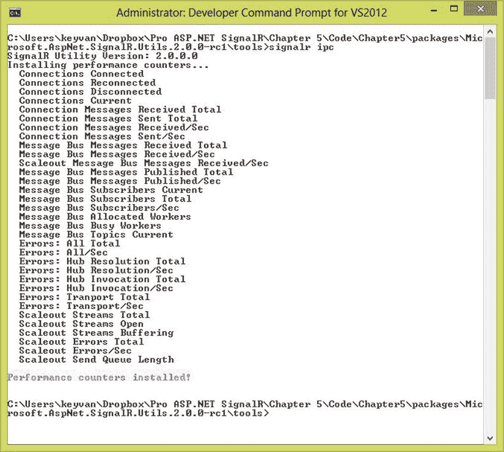
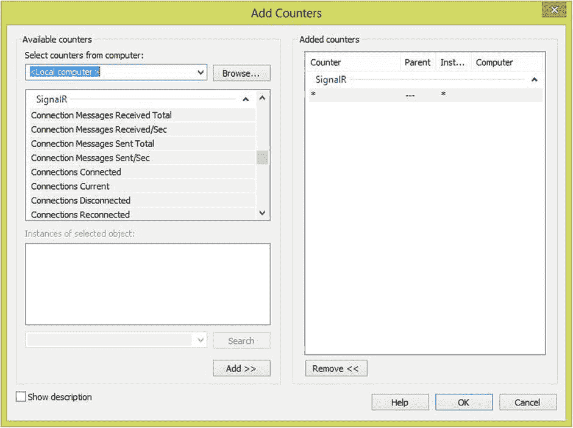
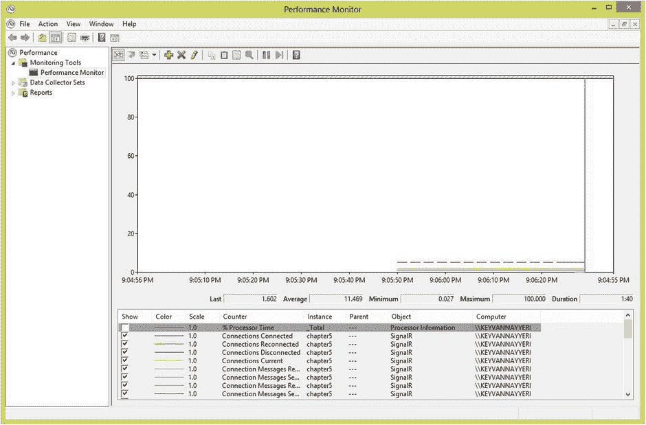

# 8.SignalR 的配置、部署和安全方面

在本书的前几章中，您学习了如何使用集线器或持久连接实现 ASP.NET SignalR 应用，如何对这些应用进行故障排除，以及如何从不同的客户端类型与 ASP.NET SignalR 服务器应用进行通信。

在构建和调试应用之后，开发任何软件的最后一步是将其配置为部署到生产环境中。因此，在您启动应用并将其暴露给可能滥用或误用您的软件的用户之前，安全性就变得非常重要。根据应用及其功能，它还可以保护用户免受他人的恶意攻击。

本章介绍如何使用认证和授权来保护 ASP.NET SignalR 应用，以及如何配置和部署 ASP.NET SignalR 应用。

ASP.NET SignalR 旨在成为一个非常可定制和可配置的平台，以满足不同的需求。因为 ASP.NET SignalR 应用在服务器端和客户端由几个独立和依赖的组件组成，每个部分都有不同的可定制和可配置的选项集。

尽管安全性的话题不仅限于认证和授权，但 ASP.NET SignalR 已经处理了开发人员通常担心的许多细节。ASP.NET SignalR 应用上的认证和授权以一致的方式集成到服务器端组件中，就像 ASP.NET 的普通认证和授权机制一样，因此需要熟悉 ASP.NET WebForm或 ASP.NET MVC 中的这些主题。正如您在本章中发现的，集线器和持久连接提供了认证和授权机制，并且有不同的技术可以根据您的需要定制它们。

ASP.NET SignalR 应用的配置部分是至关重要的，特别是如果你正在处理一个企业软件，它有可能从它的用户那里接受一个沉重的负荷。因为 ASP.NET SignalR 具有不同的传输协议，其中一些协议需要长期保持 HTTP 连接，所以在托管环境中有一些推荐的定制(例如，互联网信息服务[IIS])，以优化资源的使用。我们将在本章中讨论它们。

幸运的是，ASP.NET SignalR 应用的部署非常集成，并且与其他 ASP.NET web 应用(基于 web 的应用)相似，您可以轻松地部署您的应用。我们也简单地讨论一下这个话题。

本章涉及的另一个主题是。因为它是最早支持 OWIN 的微软技术之一。了解 ASP.NET SignalR 中 OWIN 支持的工作方式非常重要。

简而言之，本章涵盖了以下主要主题:

*   ASP.NET SignalR 中的认证如何防止匿名访问集线器和持久连接
*   如何使用授权来限制特定用户组或用户角色对集线器和持久连接的访问
*   需要考虑的 ASP.NET 信号应用的主要配置方面
*   用于托管 ASP.NET SignalR 应用的 ASP.NET SignalR、IIS 和 ASP.NET 执行的推荐设置
*   ASP.NET 信号应用的部署考虑
*   如何使用性能计数器来监视 ASP.NET 信号应用
*   ASP.NET 与 OWIN 的关系

## ASP.NET 信号中的认证和授权

ASP.NET SignalR 中的认证是建立在 ASP.NET 基础架构中的认证之上的，因此您所知道的关于 ASP.NET 认证的所有原则也适用于 ASP.NET SignalR。集线器和持久连接的实现略有不同，这将在下面的章节中讨论。

### 集线器的认证和授权

位于`Microsoft.AspNet.SignalR`名称空间中的`Authorize`属性是 ASP.NET SignalR 中提供的一个非常简单而强大的认证和授权工具。这个属性可以应用于 hub 上的单个方法，也可以应用于 hub 本身(在这种情况下，它应用于 hub 中定义的所有方法)。您可以将逗号分隔的角色字符串列表传递给该属性，以允许这些角色访问中心或单独的方法。

让我们看一个例子。我们在这里跳过一些关于建立一个具有基本 cookie 认证的 ASP.NET 应用的一般细节，但是您可以在本书的可下载示例中找到完整的源代码。我们的示例应用 ASP.NET 项目模板来生成默认的 HTML 模板以及我们需要的基本认证和授权代码。我们将我们的示例实现为`HomeController`的新视图和操作方法。

清单 8-1 显示了我们在这些例子中使用的视图。您已经从前面的章节中熟悉了它，微小的区别是它现在是一个 ASP.NET 模型-视图-控制器(MVC)视图，在 Razor 视图引擎中有一些标记。

清单 8-1。集线器认证示例的 ASP.NET MVC 视图

`@{`

`ViewBag.Title = "Chapter 8 - Authentication and Authorization";`

`}`

`<h2>@ViewBag.Title</h2>`

`<h3>@ViewBag.Message</h3>`

``

``

``

``

`
`

`<input type="text" id="msg" />`

`<input type="button" id="broadcast" value="broadcast" />`

`<ul id="messages"></ul>`

`
`

清单 8-2 显示了对`HomeController`的修改，以处理为示例引入的新视图。

清单 8-2。用于集线器的 ASP.NET MVC 控制器认证示例

`using System.Web.Mvc;`

`namespace Chapter8.Controllers`

`{`

`public class HomeController : Controller`

`{`

`public ActionResult Index()`

`{`

`return View();`

`}`

`[Authorize]`

`public ActionResult AuthenticationHubs()`

`{`

`ViewBag.Message = "Authentication with Hubs";`

`return View();`

`}`

`}`

`}`

我们在这种认证的基础上开发了一个简单的广播中心，但是我们希望确保只有经过认证的用户才能向其他经过认证的用户广播消息，并且防止匿名访问。

清单 8-3 展示了这是如何工作的。这段代码实际上是广播的集线器实现。

清单 8-3。集线器的认证

`using Microsoft.AspNet.SignalR;`

`namespace Chapter8.Hubs`

`{`

`public class BroadcastHub : Hub`

`{`

`[Authorize]`

`public void Broadcast(string message)`

`{`

`Clients.All.broadcastMessage(message);`

`}`

`}`

`}`

这个例子和我们在本书前面几章中用过几次的例子是一样的，只是它只在你登录后才起作用；否则，集线器会抛出一个 401(未授权)HTTP 状态代码。(这里我们不提供输出，因为它与您在本书中已经看到的内容相似。)

您还可以在这个示例的基础上应用授权。这很简单，只需将逗号分隔的角色列表传递给`Authorize`属性的`Roles`属性即可(见清单 8-4)。

清单 8-4。基于角色的集线器授权

`using Microsoft.AspNet.SignalR;`

`namespace Chapter8.Hubs`

`{`

`public class BroadcastHub : Hub`

`{`

`[Authorize(Roles="Admins, Users")]`

`public void Broadcast(string message)`

`{`

`Clients.All.broadcastMessage(message);`

`}`

`}`

`}`

您也可以使用基于用户名而不是角色的授权，并且您必须将用户名传递给`Authorize`属性的`Users`属性(参见清单 8-5)。

清单 8-5。基于用户的集线器授权

`using Microsoft.AspNet.SignalR;`

`namespace Chapter8.Hubs`

`{`

`public class BroadcastHub : Hub`

`{`

`[Authorize(Users="keyvan, darren")]`

`public void Broadcast(string message)`

`{`

`Clients.All.``broadcastMe`T2】

`}`

`}`

`}`

### 持久连接的认证和授权

持久连接的认证和授权与集线器略有不同，但基于相同的原则。就像关于持久连接的其他事情一样，您也可以更好地控制您的安全逻辑。

在讨论实现之前，我们展示了清单 8-6，其中我们更新了 ASP.NET MVC 控制器来处理这些例子需要的一个新的动作方法和视图。

清单 8-6。用于持久连接认证的 ASP.NET MVC 控制器示例

`using System.Web.Mvc;`

`namespace Chapter8.Controllers`

`{`

`public class HomeController : Controller`

`{`

`public ActionResult Index()`

`{`

`return View();`

`}`

`[Authorize]`

`public ActionResult AuthenticationHubs()`

`{`

`ViewBag.Message = "Authentication with Hubs";`

`return View();`

`}`

`[Authorize]`

`public ActionResult AuthenticationPersistentConnections()`

`{`

`ViewBag.Message = "Authentication with Persistent Connections";`

`return View();`

`}`

`}`

`}`

我们还为这里介绍的新动作方法引入了一个新视图(见清单 8-7)。请注意，清单中对 hubs 代理的引用出现在主视图模板中。

清单 8-7。集线器认证示例的 ASP.NET MVC 视图

`@{`

`ViewBag.Title = "Chapter 8 - Authentication and Authorization";`

`}`

`<h2>@ViewBag.Title</h2>`

`<h3>@ViewBag.Message</h3>`

``

``

``

`<input type="text" id="msg" />`

`<input type="button" id="broadcast" value="broadcast" />`

`<ul id="messages"></ul>`

持久连接的认证和授权就像覆盖和实现持久连接的`AuthorizeRequest`方法一样简单。该方法在 SignalR 中接收一个`IRequest`对象的实例，并返回一个布尔值，该值决定一个请求是否应该访问该持久连接。

清单 8-8 显示了认证的一个基本实现，但是(你可以猜到)你也可以很容易地在这里建立你自己的复杂的授权逻辑。

清单 8-8。持久连接的认证

`using Microsoft.AspNet.SignalR;`

`using System.Threading.Tasks;`

`namespace Chapter8.PersistentConnections`

`{`

`public class BroadcastConnection : PersistentConnection`

`{`

`protected override bool AuthorizeRequest(IRequest request)`

`{`

`return request.User.Identity.IsAuthenticated;`

`}`

`protected override Task OnReceived(IRequest request, string connectionId, string data)`

`{`

`return Connection.Broadcast(data);`

`}`

`}`

`}`

这些简单的概念是所有你需要知道的，以保护您的 ASP.NET 信号应用从公共访问使用认证和授权(基于角色或基于用户)。

## ASP.NET 信号应用的配置方面

ASP.NET SignalR 没有针对这一技术的定制配置。正如本书前几章所提到的，ASP.NET SignalR 与 ASP.NET 应用紧密合作，并为包括安全在内的多种用途派生它们的配置。

ASP.NET SignalR 有一套诊断配置，允许您跟踪整个应用生态系统。(我们在此不再重复这些配置，请参考第 5 章中的[以了解更多相关信息。)](05.html)

除了这些配置之外，ASP.NET 信号应用没有什么特别之处；就像配置 ASP.NET web 应用一样配置您的应用。

## ASP.NET SignalR 应用的推荐 IIS 设置

正如我们在本章后面谈到 ASP.NET 和 OWIN 的 SignalR 时所讨论的，你可能想在 IIS 中托管你的 ASP.NET SignalR 应用。您知道，ASP.NET SignalR 应用的本质与典型的 ASP.NET web 应用略有不同，因为它们采用了客户端和服务器之间长期保持 HTTP 连接的概念，这种差异在配置主机环境以获得最佳性能时会带来一些挑战。

考虑到这一事实，ASP.NET SignalR 团队记录了一些推荐的设置，用于配置 IIS 以获得这类应用的最佳性能。

Note

尽管推荐使用这些设置，但您可能希望根据您的具体情况调整它们以更好地满足您的需求。本章稍后讨论的 ASP.NET SignalR 中的内置性能计数器可以帮助您监控您自己的应用在您的托管环境和用户群中的行为，从而允许您相应地调整这些设置。

IIS 和您的 web 应用上的定制与一些不同的设置有关，下面几节将简要讨论这些设置。

### 默认消息缓冲区大小

ASP.NET SignalR 在每个连接的每个集线器的内存中有 1，000 条消息的默认值。尽管它是为应用中的典型消息传递场景而设计的，但如果消息很大，它可能会带来内存问题。在这种情况下，您必须减少保存在内存中的消息数量，这在您的配置中是一个相对容易的改变(见清单 8-9)。

清单 8-9。减少 ASP.NET 信号应用的消息缓冲区大小

`using Microsoft.AspNet.SignalR;`

`using Microsoft.Owin;`

`using Owin;`

`[assembly: OwinStartupAttribute(typeof(Chapter8.Startup))]`

`namespace Chapter8`

`{`

`public partial class Startup`

`{`

`public void Configuration(IAppBuilder app)`

`{`

`GlobalHost.Configuration.DefaultMessageBufferSize = 500;`

`app.MapSignalR();`

`ConfigureAuth(app);`

`}`

`}`

`}`

我们将这个值减少到 500。

### 每个应用的最大并发请求数

IIS 中每个应用的默认并发请求数是 5，000。增加该值可以使更多的资源服务于 ASP.NET 信号应用，尤其是在您广泛使用长轮询的情况下。您可以通过执行清单 8-10 中的命令来更改 IIS 配置。

清单 8-10。增加 IIS 中每个应用的最大并发请求数

`cd %windir%\System32\inetsrv\`

`appcmd.exe set config /section:system.webserver/serverRuntime`

`/appConcurrentRequestLimit:10000`

这里，我们将该值更改为 10000，而不是默认的 5000。

### 每个 CPU 的最大并发请求数

您可以在服务器上配置 ASP.NET，以便在该服务器上的每个可用 CPU 上处理更多的并发请求，这对您的服务器有积极的性能影响。它可以应用到服务器上的`aspnet.config`文件中，具体取决于的版本。你用的网。清单 8-11 显示了如何改变这个设置。

清单 8-11。增加 ASP.NET 每个 CPU 的最大并发请求数

`<?xml version="1.0" encoding="UTF-8" ?>`

`<configuration>`

`<system.web>`

`<applicationPool maxConcurrentRequestsPerCPU="20000" />`

`</system.web>`

`</configuration>`

在这里，我们将这个值增加到 20000。

### 请求队列限制

如果传入每个 CPU 的请求数量超过了您在上一节中定义的限制，IIS 会自动将这些请求限制到一个队列中。增加这个队列的大小也可以提高 ASP.NET 信号应用的性能。如清单 8-12 所示，你可以通过添加一个元素来增加这个值。

清单 8-12。增加 ASP.NET 的请求队列限制

`<processModel autoConfig="false" requestQueueLimit="250000" />`

在这里，我们将该值增加到 250000。

注意，我们讨论了四种不同的性能设置来提高 ASP.NET SignalR 应用的执行。第一项更改(默认消息缓冲区大小)是应用级别的 ASP.NET 信号应用更改。第二个变化(每个应用的最大并发请求数)是 IIS 的变化。第三和第四个变化(每个 CPU 的最大并发请求数和请求队列限制)是服务器级 ASP.NET 级别的变化。

## 部署 ASP.NET 信号应用

部署 ASP.NET SignalR 应用与部署任何其他 ASP.NET web 应用没有太大的不同。您可以使用 Visual Studio 中的部署选项来部署它:在解决方案资源管理器中右击您的 web 项目，并选择“从文件、IIS 或 FTP 部署”。您还可以将应用部署到云中。

ASP.NET SignalR 应用可以部署到各种托管环境，包括 Windows(带有。安装了. NET Framework)和 Linux(安装了 Mono Framework)。然而，在 Windows Server 2012 中，您获得了最好的工具，尤其是用于 Web 套接字访问的工具。

如果您将您的 SignalR 应用部署在与您的主 web 应用不同的域或子域上(在这种情况下，您向 ASP.NET SignalR 应用发出请求)，您必须在开始部署过程之前处理好跨域调用。

请确保您的托管环境不会覆盖您的 ASP.NET SignalR JavaScript hub 代理所在的应用路径。如果是这种情况，您可以在您的 ASP.NET SignalR 应用中更改此路径，或者更改您的托管环境的设置。

## 性能计数器

尽管应用运行时可能会出现明显的问题，但在当今的软件世界中，确保您拥有一个不会过度使用资源的高效程序并以合理而快速的方式执行是非常重要的。这对于需要实时传递数据的实时 web 应用尤其重要。由性能问题引起的任何延迟都会对软件质量产生很大的影响。

ASP.NET SignalR 团队考虑到了这一事实，并在框架中捆绑了一组性能计数器，使软件开发人员和管理员能够监控应用的性能，并确保它以高效的方式运行。

在谈论这些性能计数器之前，我们想强调关于 ASP.NET SignalR 主机的重要一点(在接下来的部分中会更详细地讨论)。因为 ASP.NET SignalR 可能使用长轮询连接进行传输，所以它很有可能在 IIS 或其他托管选项上使用轻量级资源来实现更多数量的并发连接。这与普通 web 应用形成对比，在普通 web 应用中，并发连接较少，但资源需求较高。

根据 ASP.NET SignalR 应用的这一事实，拥有这些性能计数器可以在确定运行应用的质量方面提供很大帮助。

要安装 ASP.NET 信号性能计数器，你必须下载并安装一个名为`SignalR.exe`的工具。最好的方法是用 NuGet 包管理器下载它。搜索`signalr.util`找到一个名为微软 ASP.NET 信号工具的包。安装完这个包后，您应该在本地驱动器存储的`<project folder>/packages/Microsoft.AspNet.SignalR.Utils.<version>/tools`位置有了`SignalR.exe`文件。

如果您以管理员身份运行命令`signalr.exe ipc`或简单地运行`signalr ipc`，性能计数器将安装在您的机器上(参见图 [8-1](#Fig1) )。

图 8-1。

Installing ASP.NET SignalR performance counters

您可以通过运行命令`signalr.exe upc`或简单的`signalr upc`来删除这些性能计数器。

以下是 ASP.NET SignalR 附带的内置自定义性能计数器列表:

*   连接计数器:连接生存期事件的计数器
    *   连接已连接
    *   重新连接
    *   连接断开
    *   连接电流
    *   消息计数器:ASP.NET 信号生成的消息数计数器
    *   接收的连接消息总数
    *   发送的连接消息总数
    *   每秒接收的连接消息数
    *   每秒发送的连接消息数
    *   消息总线计数器:与内部 ASP.NET 信号器消息总线通信的消息计数器
    *   接收的消息总线消息总数
    *   每秒接收的消息总线消息数
    *   发布的消息总线消息总数
    *   每秒发布的消息总线消息
    *   当前消息总线订户
    *   消息总线订户总数
    *   消息总线订户/秒
    *   消息总线分配的工作线程
    *   消息总线工作繁忙
    *   当前消息总线主题
    *   错误计数器:ASP.NET 信号应用生成的错误计数器
    *   错误:所有总计
    *   错误:全部/秒
    *   错误:中心解析总数
    *   错误:集线器分辨率/秒
    *   错误:中心调用总数
    *   错误:集线器调用/秒
    *   错误:运输总计
    *   错误:传输/秒
    *   向外扩展计数器:用于测量向外扩展提供程序生成的消息和错误的计数器
    *   每秒接收的扩展消息总线消息数
    *   横向扩展流总数
    *   向外扩展流打开
    *   横向扩展流缓冲
    *   横向扩展错误总数
    *   每秒向外扩展错误数
    *   向外扩展发送队列长度

有了这些计数器，您可以轻松地转到 Windows 机器上的 perfmon 工具，添加列在 SignalR 类别下的自定义性能计数器(参见图 [8-2](#Fig2) )。

图 8-2。

Adding SignalR performance counters

图 [8-3](#Fig3) 显示了这些为简单的单连接应用工作的性能计数器。

图 8-3。

ASP.NET SignalR performance counters monitoring

## ASP.NET 和 OWIN 通信员

When.NET 框架和 ASP.NET 的建立——甚至在那之后的近十年中——IIS 是托管任何 ASP.NET 应用的重要组成部分，IIS 和 ASP.NET 之间有着密切的关系。然而，在过去的几年中，社区和 Microsoft 团队已经得出了正确的结论，即 ASP.NET、IIS 和宿主 Windows 操作系统之间的这种级别的耦合是无益的，并且会引入限制。

通过分离 ASP.NET 和 IIS 之间的关联，OWIN 可以解决这个问题。OWIN 只不过是为. NET web 应用和 web 服务器之间的通信而定义的标准。这个 web 应用可以是任何类型，也可以是任何服务器软件(任何平台上的 IIS 或自定义 web 服务器)。

记住 OWIN 只不过是一套标准；它不是软件、组件或其他任何东西。不过，开发人员可以使用这个标准的实现。微软提供了自己的实现。NET web 应用在 IIS 上叫做武士刀( [`http://katanaproject.codeplex.com`](http://katanaproject.codeplex.com/) )。还有一个开源的、社区驱动的实现叫做 Nowin ( [`https://github.com/Bobris/Nowin`](https://github.com/Bobris/Nowin) )。

微软已经从其网络平台的传统耦合结构向 OWIN 过渡，ASP.NET SignalR 是第一个真正采用这一标准并支持 OWIN 的项目之一。

到目前为止，在本书中，我们一直在配置我们的应用来设置和工作，并没有讨论如何设置工作。这里是一个深入研究 ASP.NET OWIN 的好地方，并学习如何配置您的应用与托管环境一起工作。

正如你在本书的几个例子中所记得的，你总是必须进入`Startup`类并实现一个类似于清单 8-13 所示的`Configuration`方法，这是本章前面例子的实现。

清单 8-13。ASP.NET 信号应用的通用 OWIN 设置

`using Chapter8.PersistentConnections;`

`using Microsoft.Owin;`

`using Owin;`

`[assembly: OwinStartupAttribute(typeof(Chapter8.Startup))]`

`namespace Chapter8`

`{`

`public partial class Startup`

`{`

`public void Configuration(IAppBuilder app)`

`{`

`app.MapSignalR();`

`app.MapSignalR<BroadcastConnection>("/broadcast");`

`ConfigureAuth(app);`

`}`

`}`

`}`

该方法中使用的`IAppBuilder`接口位于`Microsoft.Owin`名称空间中，其中可以找到与 OWIN 相关的所有内容。ASP.NET 应用和 OWIN 主机之间的通信需要一套非常方便的方法来实现`IAppBuilder`接口(不考虑 OWIN 标准的实现)。

正如您很容易猜到的，为 ASP.NET 应用(因此是 ASP.NET SignalR 应用)引入任何托管环境或平台都很简单。

让我们为 ASP.NET SignalR 应用开发一个自托管环境，以展示集成 OWIN 是多么容易。我们需要将自托管 web 服务器实现为 Windows 控制台应用，因此我们为此创建了一个新项目。

首先，我们必须执行清单 8-14 所示的 NuGet 命令来下载项目中 ASP.NET SignalR 的自托管组件。

清单 8-14。安装自托管 ASP.NET 信号组件

`Install-Package Microsoft.AspNet.SignalR.SelfHost`

接下来，我们需要安装来自 NuGet 的微软 OWIN CORS 库，它负责客户端和远程服务器之间的 CORS 跨域通信(见清单 8-15)。

清单 8-15。安装微软 OWIN 的 CORS 组件

`Install-Package Microsoft.Owin.Cors`

我们准备在刚刚创建的控制台应用中实现自托管服务器。清单 8-16 显示了自托管服务器的非常简单的实现。

清单 8-16。自托管 OWIN 服务器

`using Microsoft.Owin.Hosting;`

`using System;`

`namespace SelfHosting`

`{`

`class Program`

`{`

`static void Main(string[] args)`

`{`

`string url = "``http://localhost:9091`T2】

`using (WebApp.Start(url))`

`{`

`Console.WriteLine("Self-Hosted server running at {0}", url);`

`Console.ReadLine();`

`}`

`}`

`}`

`}`

现在我们可以为这个服务器开发`Startup`类了(见清单 8-17)。

清单 8-17。自承载服务器的启动类

`using Microsoft.Owin.Cors;`

`using Owin;`

`namespace SelfHosting`

`{`

`class Startup`

`{`

`public void Configuration(IAppBuilder app)`

`{`

`app.UseCors(CorsOptions.AllowAll);`

`app.MapSignalR();`

`}`

`}`

`}`

这是一个非常熟悉的代码。我们使用`CorsOptions`来允许跨域通信，因为服务器托管在不同的域上。

最后，我们在控制台应用中实现了一个非常简单的 hub，它完全在 ASP.NET 和 IIS 之外(见清单 8-18)。

清单 8-18。一个简单的自托管中心

`using Microsoft.AspNet.SignalR;`

`namespace SelfHosting`

`{`

`public class BroadcastHub : Hub`

`{`

`public void Broadcast(string message)`

`{`

`Clients.All.broadcastMessage(message);`

`}`

`}`

`}`

看到自托管环境中出现与以前相同的 hub 实现并不奇怪，因为所有这些实现都完全独立于托管服务器。我们只需担心应用与 OWIN 之间的连接，然后从 OWIN 连接到托管我们的服务器。

下一步只是简单地修改客户机 JavaScript 代码，通过使用完整的服务器 URL 以跨域的方式使用这个新服务器(见清单 8-19)。

清单 8-19。跨不同域访问信号

`@{`

`ViewBag.Title = "Chapter 8 - Authentication and Authorization";`

`}`

`<h2>@ViewBag.Title</h2>`

`<h3>@ViewBag.Message</h3>`

``

``

``

`
`

`<input type="text" id="msg" />`

`<input type="button" id="broadcast" value="broadcast" />`

`<ul id="messages"></ul>`

`
`

是的，就这么简单。现在我们只需要同时运行这两个项目就可以了。

## 摘要

本章讨论了在集线器和持久连接上使用认证和授权来保护 ASP.NET SignalR 应用。我们还讨论了与配置、托管和部署 ASP.NET SignalR 应用相关的重要主题。

本章还讨论了 ASP.NET SignalR(用于监控应用性能)和 ASP.NET SignalR 中的 OWIN 的内置性能计数器。